---
title: "ThinkPHP8同步学习"
date: 2025-04-28T11:24:19+08:00
summary: "ThinkPHP8同步学习"
url: "/posts/ThinkPHP8同步学习/"
categories:
  - "框架学习"
tags:
  - "ThinkPHP8"
draft: true
---

# 0x01前言

这篇文章是为了我之前丢弃的tp学习而重新写的，因为最近刚好在复现tp的反序列化的漏洞，所以干脆把tp也学一下

# 0x02关于ThinkPHP

这次也是参考的官方文档去进行学习的

官方文档：[序言 - ThinkPHP8.0官方手册](https://doc.thinkphp.cn/v8_0/preface.html)

## 什么是ThinkPHP？

`ThinkPHP`是一个免费开源的，快速、简单的面向对象的**轻量级PHP开发框架**，是为了敏捷WEB应用开发和简化企业应用开发而诞生的

## **ThinkPHP 的特点**

- **简单易用**：ThinkPHP 的设计理念是“大道至简”，提供了直观的 API 和文档，适合初学者和高级开发者。

- **高性能**：框架经过优化，运行效率高，适合处理高并发场景。

- **模块化设计**：支持模块化开发，方便项目的组织和扩展。

- 丰富的功能

  - 数据库操作（支持多种数据库，如 MySQL、PostgreSQL、SQLite 等）。
  - 路由系统（支持 RESTful 路由）。
  - 模板引擎（内置模板引擎，支持视图渲染）。
  - 缓存机制（支持多种缓存方式，如文件缓存、Redis、Memcached 等）。
  - 安全性（提供 CSRF 防护、XSS 过滤等安全机制）。

- **跨平台**：支持 Windows、Linux、macOS 等操作系统。

- **社区活跃**：拥有庞大的中文开发者社区，文档和教程丰富。

# 0x03版本安装

## 环境要求

```
PHP >= 8.0.0
```

## 安装 Composer

Composer 是一个 PHP 工具，因此需要先安装 PHP。这里方法我就不讲了，直接说Composer的安装

- 下载 Composer 安装脚本

```
php -r "copy('https://getcomposer.org/installer', 'composer-setup.php');"
```

- 验证安装脚本

```
php -r "echo hash_file('sha384', 'composer-setup.php');"
```

然后与 [官方哈希值](https://composer.github.io/pubkeys.html) 进行对比。如果一致，说明脚本是安全的。

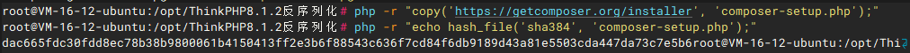

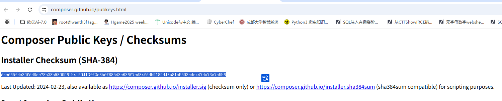

- 安装Composer

```
php composer-setup.php --install-dir=/usr/local/bin --filename=composer
```

1. `--install-dir=/usr/local/bin`：将 Composer 安装到 `/usr/local/bin` 目录，这样可以在全局范围内使用。
2. `--filename=composer`：将可执行文件命名为 `composer`。

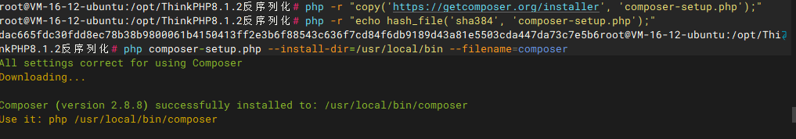

- 验证安装

```
composer --version
```

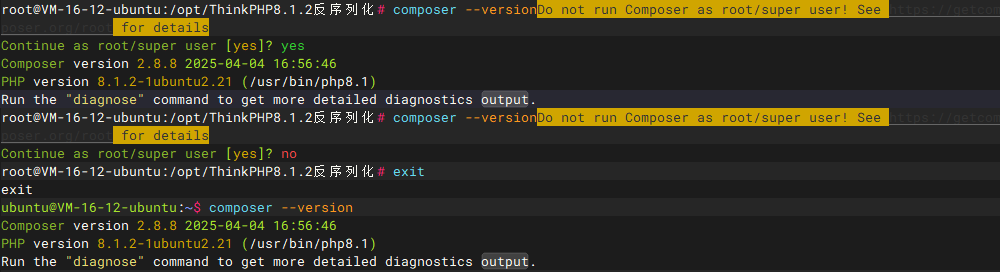

如果看到类似 `Composer version 2.x.x` 的输出，说明安装成功。

这里的话因为我是用root的身份去执行命令的，Composer认为以 root 用户运行 Composer 可能导致项目文件的所有权变为 root，这会影响后续的开发和部署，所以会发出警告，其实我们暂时可以不用管，毕竟只是安装过程

- 删除安装脚本

```
php -r "unlink('composer-setup.php');"
```

至此Composer就安装好了，然后我们安装ThinkPHP

## 安装ThinkPHP

因为我同时也在复现tp8.1.2的反序列化漏洞，所以这里直接用同版本去学习了

在命令行下面，切换到你的WEB根目录下面并执行

```
composer create-project topthink/think=8.0.3 tp
```

- `topthink/think`：ThinkPHP 的 Composer 包名称。
- `8.1.2`：指定安装的版本。
- `tp`：项目目录名称，可以自定义。

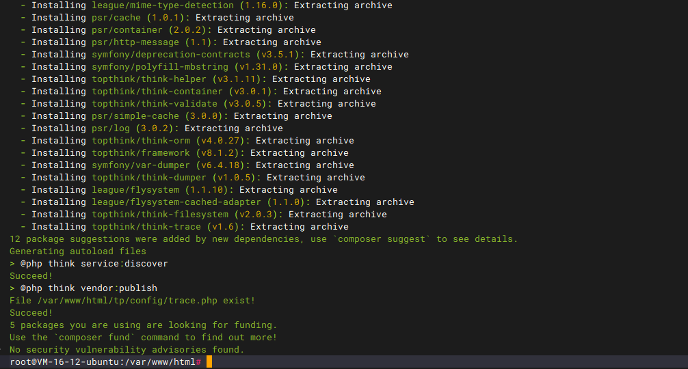

```
cd tp
php think run
```

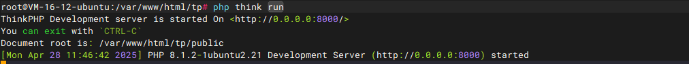

然后我们访问8000端口，因为是0.0.0.0，我直接访问的vps的公网ip也是可以的

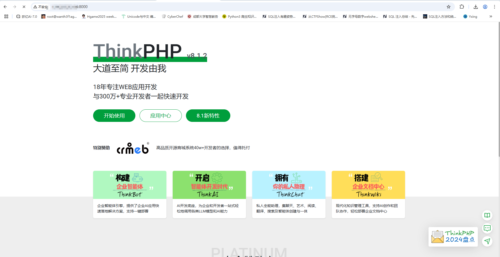

安装成功

# 0x04基础知识

## 命名规范

`ThinkPHP8.0`遵循`PSR-2`命名规范和`PSR-4`自动加载规范，并且注意如下规范：

目录和文件

- 目录使用小写+下划线；
- 类库、函数文件统一以`.php`为后缀；
- 类的文件名均以命名空间定义，并且命名空间的路径和类库文件所在路径一致；
- 类（包含接口和Trait）文件采用驼峰法命名（首字母大写），其它文件采用小写+下划线命名；
- 类名（包括接口和Trait）和文件名保持一致，统一采用驼峰法命名（首字母大写）；

函数和类、属性命名

- 类的命名采用驼峰法（首字母大写），例如 `User`、`UserType`；
- 函数的命名使用小写字母和下划线（小写字母开头）的方式，例如 `get_client_ip`；
- 方法的命名使用驼峰法（首字母小写），例如 `getUserName`；
- 属性的命名使用驼峰法（首字母小写），例如 `tableName`、`instance`；
- 特例：以双下划线`__`打头的函数或方法作为魔术方法，例如 `__call` 和 `__autoload`；

常量和配置

- 常量以大写字母和下划线命名，例如 `APP_PATH`；
- 配置参数以小写字母和下划线命名，例如 `url_route_on` 和`url_convert`；
- 环境变量定义使用大写字母和下划线命名，例如`APP_DEBUG`；

数据表和字段

- 数据表和字段采用小写加下划线方式命名，并注意字段名不要以下划线开头，例如 `think_user` 表和 `user_name`字段，不建议使用驼峰和中文作为数据表及字段命名。

需要注意的是我们需要尽量避免使用PHP的保留字，否则会出现错误

## 目录结构

我们看看官方给出的目录结构是什么样的

单应用模式

默认安装后的目录结构就是一个单应用模式

```
www  WEB部署目录（或者子目录）
├─app           应用目录
│  ├─controller      控制器目录
│  ├─model           模型目录
│  ├─ ...            更多类库目录
│  │
│  ├─common.php         公共函数文件
│  └─event.php          事件定义文件
│
├─config                配置目录
│  ├─app.php            应用配置
│  ├─cache.php          缓存配置
│  ├─console.php        控制台配置
│  ├─cookie.php         Cookie配置
│  ├─database.php       数据库配置
│  ├─filesystem.php     文件磁盘配置
│  ├─lang.php           多语言配置
│  ├─log.php            日志配置
│  ├─middleware.php     中间件配置
│  ├─route.php          URL和路由配置
│  ├─session.php        Session配置
│  ├─trace.php          Trace配置
│  └─view.php           视图配置
│
├─view            视图目录
├─route                 路由定义目录
│  ├─route.php          路由定义文件
│  └─ ...   
│
├─public                WEB目录（对外访问目录）
│  ├─index.php          入口文件
│  ├─router.php         快速测试文件
│  └─.htaccess          用于apache的重写
│
├─extend                扩展类库目录
├─runtime               应用的运行时目录（可写，可定制）
├─vendor                Composer类库目录
├─.example.env          环境变量示例文件
├─composer.json         composer 定义文件
├─LICENSE.txt           授权说明文件
├─README.md             README 文件
├─think                 命令行入口文件
```

**在实际的部署中，请确保只有`public`目录可以对外访问。**

然后我们看一下当前的目录结构是什么样的

主目录

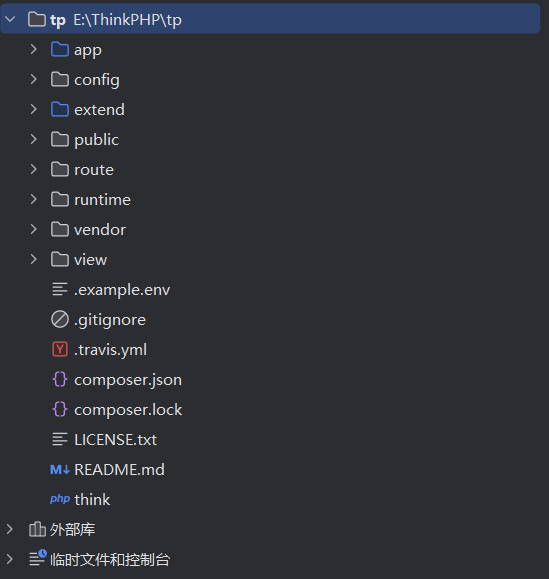

子目录

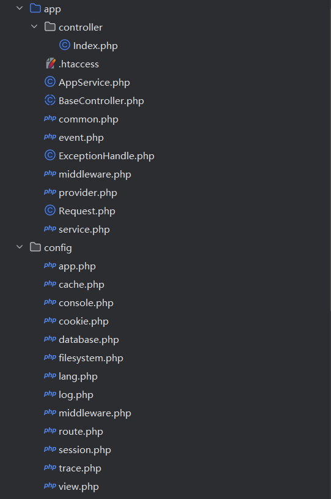

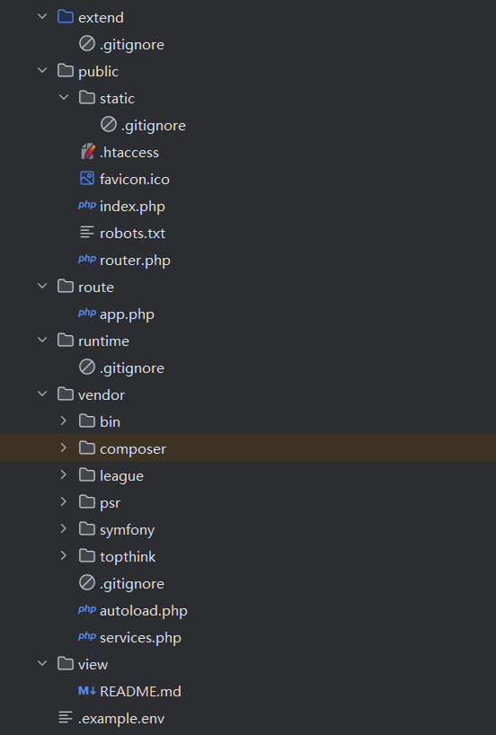

### app应用目录

默认情况下的app目录下的文件结构是

```
├─app           应用目录
│  │
│  ├─BaseController.php    默认基础控制器类
│  ├─ExceptionHandle.php   应用异常定义文件
│  ├─common.php            全局公共函数文件
│  ├─middleware.php        全局中间件定义文件
│  ├─provider.php          服务提供定义文件
│  ├─Request.php           应用请求对象
│  └─event.php             全局事件定义文件
```

#### config配置目录

```
├─config（配置目录）
│  ├─app.php            应用配置
│  ├─cache.php          缓存配置
│  ├─console.php        控制台配置
│  ├─cookie.php         Cookie配置
│  ├─database.php       数据库配置
│  ├─filesystem.php     文件磁盘配置
│  ├─lang.php           多语言配置
│  ├─log.php            日志配置
│  ├─middleware.php     中间件配置
│  ├─route.php          URL和路由配置
│  ├─session.php        Session配置
│  ├─trace.php          Trace配置
│  ├─view.php           视图配置
│  └─ ...               更多配置文件
│  
```

对于单应用模式来说，配置文件和目录很简单，根目录下的`config`目录下面就是所有的配置文件。

## 路由

要使用`Route`类注册路由必须首先在路由定义文件开头添加引用，我们这里拿初始的分析下

```php
<?php
// +----------------------------------------------------------------------
// | ThinkPHP [ WE CAN DO IT JUST THINK ]
// +----------------------------------------------------------------------
// | Copyright (c) 2006~2018 http://thinkphp.cn All rights reserved.
// +----------------------------------------------------------------------
// | Licensed ( http://www.apache.org/licenses/LICENSE-2.0 )
// +----------------------------------------------------------------------
// | Author: liu21st <liu21st@gmail.com>
// +----------------------------------------------------------------------
use think\facade\Route;

Route::get('think', function () {
    return 'hello,ThinkPHP8!';
});

Route::get('hello/:name', 'index/hello');

```

例如我们访问/hello/1，页面返回

```
hello,1
```

这是为什么呢？`index/hello` 是路由指向的控制器方法，表示调用 `index` 控制器中的 `hello` 方法。那我们跟进一下这个hello方法

```php
public function hello($name = 'ThinkPHP8')
    {
        return 'hello,' . $name;
    }
```

可以看到这里会返回hello加上name参数的值

最基础的路由定义方法是：

```
Route::rule('路由表达式', '路由地址', '请求类型');
```

可以在`rule`方法中指定请求类型（不指定的话默认为任何请求类型有效）

例如我们设置

```php
Route::rule('new/:id', 'Test/test', 'GET');
```

```php
<?php
// +----------------------------------------------------------------------
// | ThinkPHP [ WE CAN DO IT JUST THINK ]
// +----------------------------------------------------------------------
// | Copyright (c) 2006~2018 http://thinkphp.cn All rights reserved.
// +----------------------------------------------------------------------
// | Licensed ( http://www.apache.org/licenses/LICENSE-2.0 )
// +----------------------------------------------------------------------
// | Author: liu21st <liu21st@gmail.com>
// +----------------------------------------------------------------------
use think\facade\Route;

Route::get('think', function () {
    return 'hello,ThinkPHP8!';
});

Route::get('hello/:name', 'index/hello');

Route::rule('new/:id', 'Test/test', 'GET');

```

然后访我们自己写一个Test控制器

```php
<?php 
namespace app\controller;

use app\BaseController;

class Test extends BaseController
{
        public function test($id)
        {
                return 'hello, ' . $id;
        }
}
```

写好后访问/new/1

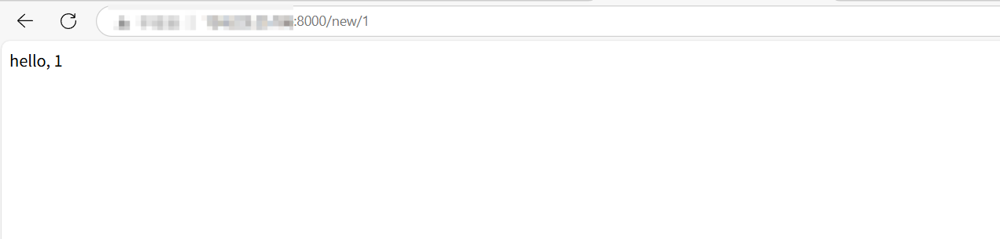

这样看就是成功了

另外我们还有一种快捷注册方法的用法

```
Route::快捷方法名('路由表达式', '路由地址');
```

例子就是原来里面的

```php
Route::get('hello/:name', 'index/hello');
实例
Route::get('new/<id>','News/read'); // 定义GET请求路由规则
Route::post('new/<id>','News/update'); // 定义POST请求路由规则
Route::put('new/<id>','News/update'); // 定义PUT请求路由规则
Route::delete('new/<id>','News/delete'); // 定义DELETE请求路由规则
Route::any('new/<id>','News/read'); // 所有请求都支持的路由规则
```

不过规则也分为静态规则和动态规则

```
Route::rule('my', 'Member/myinfo'); // 静态地址路由
Route::rule('<blog>/<id>', 'Blog/read'); // 动态地址路由
Route::rule('new/<year>/<month>/<day>', 'News/read'); // 静态地址和动态地址结合
```

### 动态变量

每个参数中可以包括动态变量，例如`:变量`或者`<变量>`都表示动态变量（推荐使用第二种方式，更利于混合变量定义），并且会自动绑定到操作方法的对应参数。

### 可选变量

支持对路由参数的可选定义

```
Route::rule('new/[:id]', 'Test/test', 'GET');
```

变量用`[ ]`包含起来后就表示该变量是路由匹配的可选变量。

因此我们可以对变量设置默认值，当未传入参数的时候则会使用默认值

```php
<?php 
namespace app\controller;

use app\BaseController;

class Test extends BaseController
{
        public function test($id = 'wanth3f1ag')
        {
                return 'hello, ' . $id;
        }
}
```

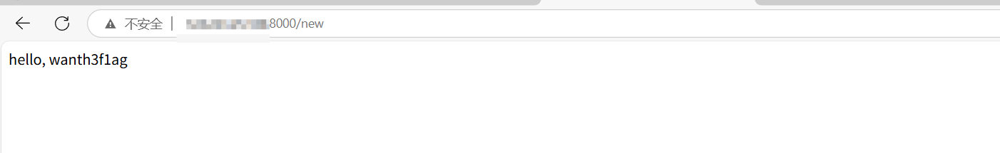

要注意的是：可选参数只能放到路由规则的最后，如果在中间使用了可选参数的话，后面的变量都会变成可选参数。

可变变量最大的好处就是，采用可选变量定义后，之前需要定义两个或者多个路由规则才能处理的情况可以合并为一个路由规则。

```
Route::get('blog/:year/[:month]','Blog/archive');
// 或者
Route::get('blog/<year>/<month?>','Blog/archive');
```

此时可以根据可选变量的值的有无进行不同的处理

### 完全匹配变量

同样的路由

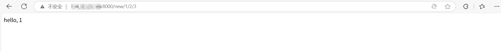

可以发现，规则匹配检测的时候默认只是对URL从头开始匹配，只要URL地址开头包含了定义的路由规则就会匹配成功，如果希望URL进行完全匹配，可以在路由表达式最后使用`$`符号

```
Route::rule('new/:id$', 'Test/test', 'GET');
```

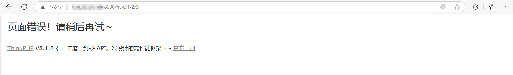

另外，官方给出了全局配置路由访问的方法

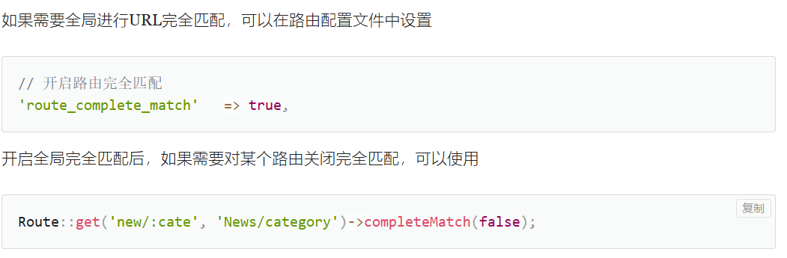

### 额外参数

在路由跳转的时候支持额外传入参数对（额外参数指的是不在URL里面的参数，隐式传入需要的操作中，有时候能够起到一定的安全防护作用）

例如

```php
Route::get('blog/:id','blog/read')
    ->append(['status' => 1, 'app_id' =>5]);
```

此时我们url传入id的值之后，在跳转调用的时候会带入status=1和app_id=5两个参数

### 变量规则

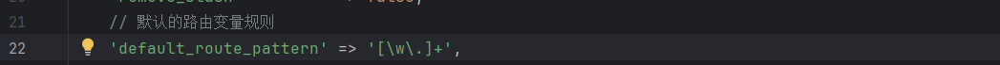

系统默认的变量规则设置是`[\w\.]+`，意思是可以匹配任意数字，字母，下划线和小数点，而不会匹配其他特殊字符

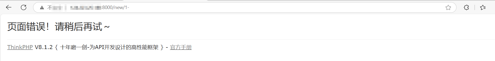

#### 局部变量规则

如果我们有特别的变量规则的话，可以手动添加

例如

```
// 定义GET请求路由规则 并设置name变量规则
Route::get('new/:id', 'Test/test')
    ->pattern(['id' => '[\w\-]+']);
```

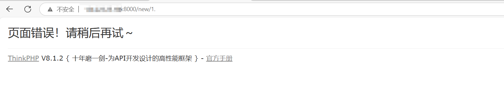

之前的规则已经失效了

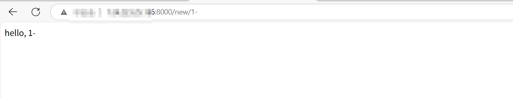

新的局部变量规则生效

#### 全局变量规则

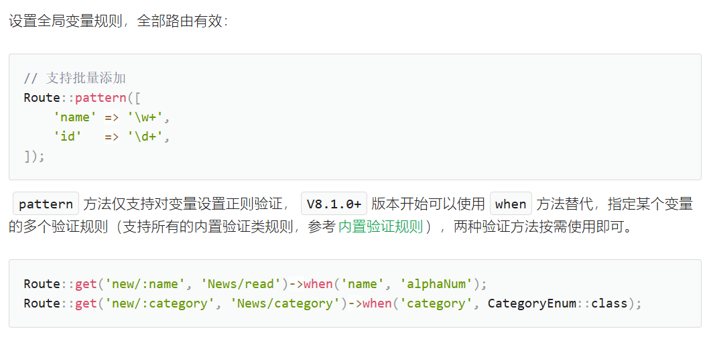

### 动态路由

前面讲过动态地址，但是这里还有一个动态路由

可以把路由规则中的变量传入路由地址中，就可以实现一个动态路由

```
// 定义动态路由
Route::get('hello/:name', 'index/:name');
```

这里会根据name的值去动态选择index下的方法

举例子测试一下

```php
<?php
namespace app\controller;

use app\BaseController;

class Test extends BaseController
{
        public function t1($id = 'wanth3f1ag')
        {
                return 'This is No. ' . $id . ' test';
        }
        public function t2($id = 'vu1n4bly')
        {
                return 'This is No.'. $id .' test2 ';
        }
}
```

```php
Route::rule('new/[:id]', 'Test/:id', 'GET');
```

### 路由地址

路由地址表示定义的路由表达式最终需要路由到的实际地址（或者响应对象）以及一些需要的额外参数，支持下面几种方式定义

#### 路由到控制器/操作

这是最常用的一种了，我们上面用的也是这种，把满足条件的路由规则路由到相关的控制器和操作，然后由系统调度执行相关的操作

格式

```
模块/控制器/操作
```

例如我们刚刚说的

```
Route::rule('new/:id$', 'Test/test', 'GET');
```

这里就是从路由到Test控制器

#### 路由到类的方法

这种方式的路由可以支持执行任何类的方法，而不局限于执行控制器的操作方法。

路由地址的格式为（动态方法）：

> \完整类名@方法名 或 [ 完整类名, 方法名 ]

或者（静态方法）

> \完整类名::方法名

### 路由参数
