参考文章：[Vite开发服务器任意文件读取漏洞(CVE-2025-30208)](Vite开发服务器任意文件读取漏洞(CVE-2025-30208))

# 搜索语句

```
Fofa:body="/@vite/client"
Hunter:web.body="/@vite/client"
```

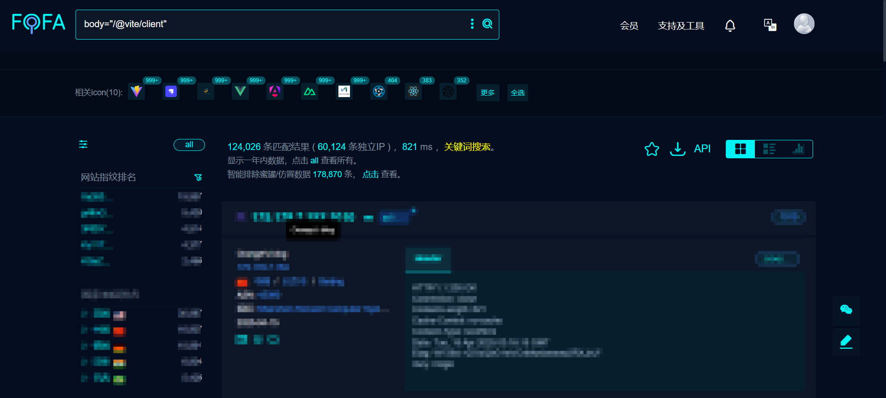

# CVE-2025-30208

## 0x01漏洞描述

Vite 是一款现代化的前端开发构建工具，它提供了快速的开发服务器和高效的构建能力，广泛应用于 Vue.js 项目的开发过程中。

- 漏洞原理

由于 Vite 开发服务器在处理特定 URL 请求时，没有对请求的路径进行严格的安全检查和限制，导致攻击者可以绕过保护机制，非法访问项目根目录外的敏感文件。攻击者只需在浏览器输入一个 URL，就可能会造成源码、SSH密钥、数据库账号、用户数据等目标机器上的任意文件信息泄露。

- 漏洞影响版本

目前受影响的NextJS版本：
6.2.0 <= Vite <= 6.2.2

6.1.0 <= Vite <= 6.1.1

6.0.0 <= Vite <= 6.0.11

5.0.0 <= Vite <= 5.4.14

Vite <= 4.5.9

## 0x02漏洞成因

**Vite开发服务器有提供一种`@fs`机制，这种机制可以用于限制访问，以防止访问Vite允许列表之外的文件**，即`@fs`拒绝访问 Vite 服务允许列表之外的文件。在 URL 中添加`?raw??`或`?import&raw??`可以绕过此限制，并返回文件内容（如果存在）。之所以存在这种绕过，是因为`?`在多个位置，诸如 之类的尾部分隔符会被删除，但在查询字符串正则表达式中却没有考虑到这一点。

## 0x03环境搭建(linux下)

**使用create-vite包**

`create-vite`是一个项目脚手架工具，其核心功能是帮助开发者快速搭建基于 Vite 的项目初始结构。

```
npm create vite@latest my-project -y -- --template vue-ts
cd my-project
grep "\"vite\":" package.json#会得到"vite": "^6.2.0"，把^去掉
npm install
npm run dev
```

一开始一直都失败，后面更新了一下node.js的版本，因为我是外部IP访问的这个，所以还得把地址改一下

```js
//在 vite.config.js 中配置
import { defineConfig } from 'vite'
import vue from '@vitejs/plugin-vue'

export default defineConfig({
  plugins: [vue()],
  server: {
    host: '0.0.0.0', // 监听所有网络接口（默认是 127.0.0.1 仅本地访问）
    port: 5173,      // 指定端口（默认 5173）
    open: true       // 启动时自动打开浏览器（可选）
  }
})

```

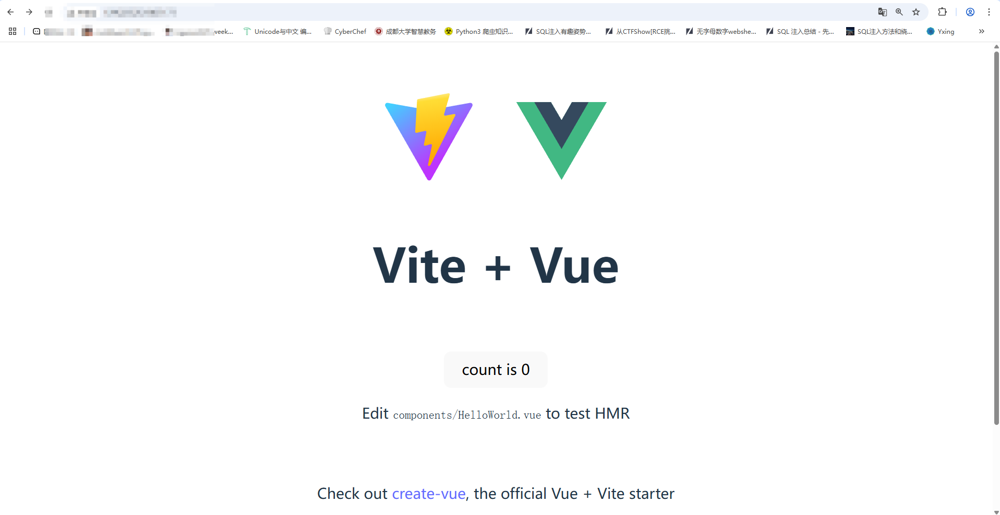

搭建环境成功

我们先看一下`@fs`的配置

在 Vite 的配置中，`server.fs.allow` 选项通常位于 **`vite.config.js`** 或 **`vite.config.ts`** 文件中

在 Vite 服务器的 URL 处理逻辑中，`@fs` 机制原本用于限制对非白名单目录的访问，例如有

```
export default defineConfig({
  server: {
    fs: {
      // Allow serving files from one level up to the project root
      allow: [path.resolve(__dirname, 'src')],
    },
  },
})
```

解释一下代码：

- **`server.fs.allow`**：Vite 的 **文件系统访问白名单**，默认只允许访问 **项目根目录**。
- `path.resolve(__dirname, 'src')`
  - `__dirname`：当前配置文件所在的目录（通常是项目根目录）。
  - `path.resolve()`：解析出 `src` 目录的 **绝对路径**（如 `/Users/yourname/project/src`）。
- **`['src']`**：表示只允许 Vite 访问 `src` 目录及其子目录。

看看官方文档中的解释

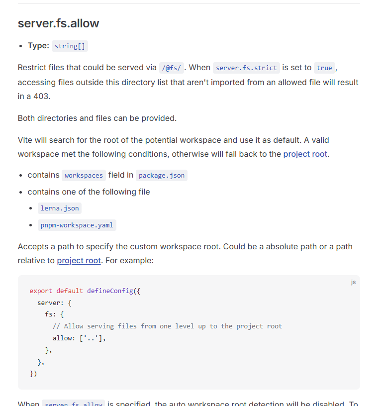

翻译一下第一段话意思就是限制可以通过/@fs/提供的文件。当server.fs.strict设置为true时，访问此目录列表之外的文件（这些文件不是从允许的文件导入的）将导致403。

例如我们如果直接访问其他目录是无效的

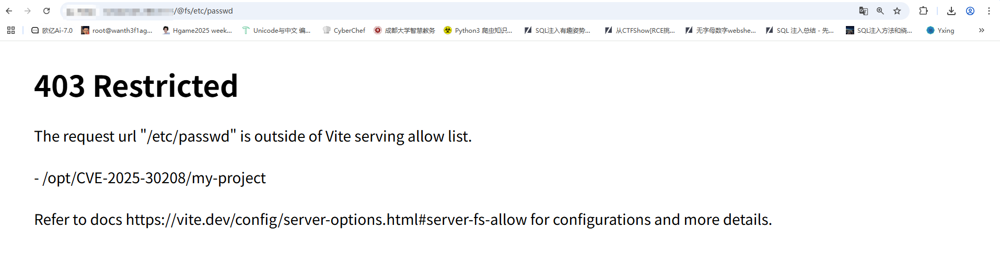

但是访问src目录下的文件是可以的

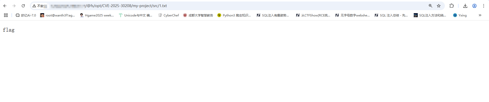

然后我们的漏洞点在哪呢？Vite 在 URL 解析过程中会移除部分特殊字符，而未正确考虑查询参数的影响，导致攻击者可以构造特别的请求能绕过安全检查

然后我们看一下V6.2.0的源码找一下漏洞点

### 分析源码

首先是在`\vite-create-vite-6.2.0\packages\vite\src\node\server\middlewares\transform.ts`文件中有URL处理的一段代码

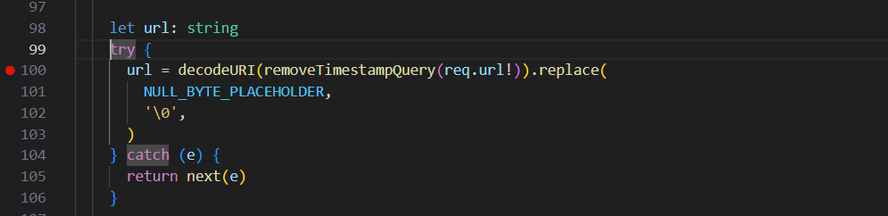

有一个removeTimestampQuery函数，跟进看一下

```js
export function removeTimestampQuery(url: string): string {
  return url.replace(timestampRE, '').replace(trailingSeparatorRE, '')
}
```

后面的replace就不说了，就是处理空字节占位符

然后这里有两个正则匹配

```
const timestampRE = /\bt=\d{13}&?\b/
const trailingSeparatorRE = /[?&]$/
```

- 第一个是为了处理时间戳参数
- 第二个是检测 URL 末尾是否有多余的 **查询参数分隔符**（`?` 或 `&`），用于清理无效的 URL 格式。

这里是URL处理的一部分，我们继续往下分析

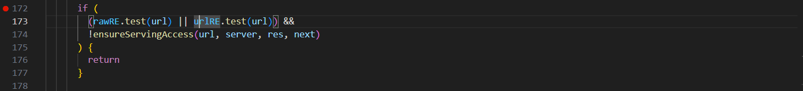

```javascript
      if (
        (rawRE.test(url) || urlRE.test(url)) &&
        !ensureServingAccess(url, server, res, next)
      ) {
        return
      }
```

这段代码是 **Vite 开发服务器** 中用于 **检查文件访问权限的核心逻辑**，主要目的是 **防止未经授权的文件系统访问**。

有两个正则匹配

```
export const urlRE = /(\?|&)url(?:&|$)/
export const rawRE = /(\?|&)raw(?:&|$)/
```

- 匹配 URL 中的 **`url` 查询参数**（如 `?url` 或 `&url`），通常用于 **动态资源请求** 或 **代理转发**。
- 匹配 URL 中的 **`raw` 查询参数**（如 `?raw` 或 `&raw`），通常用于 **强制返回原始文件内容**

在官方文档中url和raw的作用是什么呢？

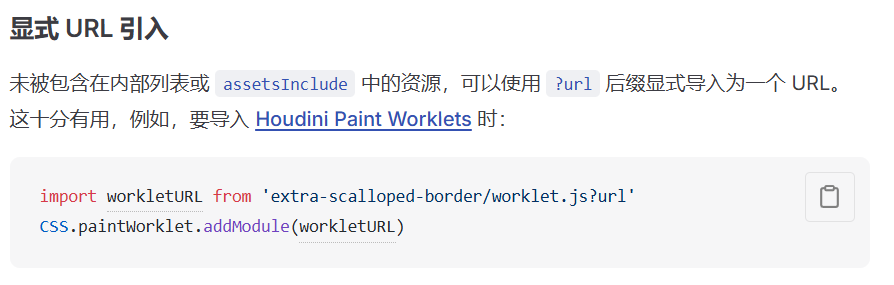

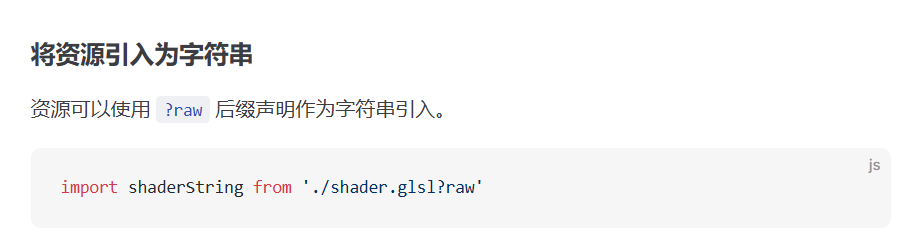

例如我们的poc

```
rawRE.test("/@fs/C://windows/win.ini?import&raw?")
```

为什么这里没有匹配上rawRE的正则匹配呢？因为 `raw` 后必须接 `&` 或字符串结束。这里在结尾用?号的话能绕过这个匹配让`urlRE.test(url)`为false。例如我们传入

```
/@fs/etc/passwd?import&raw
```

此时是匹配上的，所以无法返回文件内容

至于urlRE的匹配，本身poc里就没有url参数，自然而然就不匹配了

再看官方的修复对比v6.2.2和v6.2.3：增加了一条正则进行匹配，这段正则专门匹配URL 末尾是否有多余的查询参数分隔符（`?` 或 `&`）从而修复了该问题，但是也迎来了另一个绕过方式，也就是`CVE-2025-31125`，这个我们下面再讲

**权限校验（ensureServingAccess）**

我们先跟踪一下源码

```js
export function ensureServingAccess(
  url: string,
  server: ViteDevServer,
  res: ServerResponse,
  next: Connect.NextFunction,
): boolean {
  if (isFileServingAllowed(url, server)) {
    return true
  }
  if (isFileReadable(cleanUrl(url))) {
    const urlMessage = `The request url "${url}" is outside of Vite serving allow list.`
    const hintMessage = `
${server.config.server.fs.allow.map((i) => `- ${i}`).join('\n')}

Refer to docs https://vite.dev/config/server-options.html#server-fs-allow for configurations and more details.`

    server.config.logger.error(urlMessage)
    server.config.logger.warnOnce(hintMessage + '\n')
    res.statusCode = 403
    res.write(renderRestrictedErrorHTML(urlMessage + '\n' + hintMessage))
    res.end()
  } else {
    // if the file doesn't exist, we shouldn't restrict this path as it can
    // be an API call. Middlewares would issue a 404 if the file isn't handled
    next()
  }
  return false
}
```

我们逐层分析

- `if (isFileServingAllowed(url, server))`这里的话是检测URL 是否匹配 `server.config.server.fs.allow` 配置的允许路径。默认允许路径是/src
- `if (isFileReadable(cleanUrl(url)))`检测是否*文件存在但路径不在允许列表中*，如果存在则返回403，否则执行next()

检测是否在allow允许范围内，所以这段if的意思就是如果我们传入的是特殊路径但是不在访问允许的范围内，则会终止我们的请求

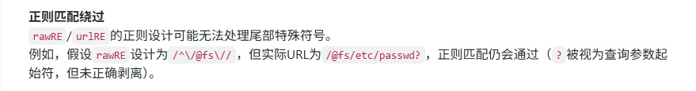

在这段代码中，`return` 的作用是 **立即终止当前中间件函数的执行**，并阻止请求继续向下传递。

所以这里的话漏洞点在于正则匹配无法处理掉尾部特殊字符例如`?`，`&`等，导致判断句为flase，请求继续往下传递而不会终止，这时候即使我们访问的是非法路径也会继续读取文件内容并返回

分析完漏洞点，然后我们复现一下

## 0x04漏洞复现

然后我们试一下

```
/@fs/etc/passwd?import&raw??
```

成功回显

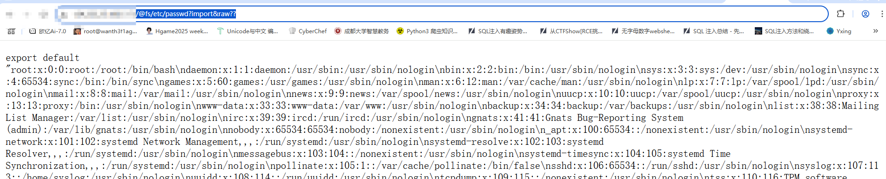

然后我们在tmp目录下随便写个txt文件，并尝试读取一下

```
/@fs/tmp/1.txt?import&raw??
```

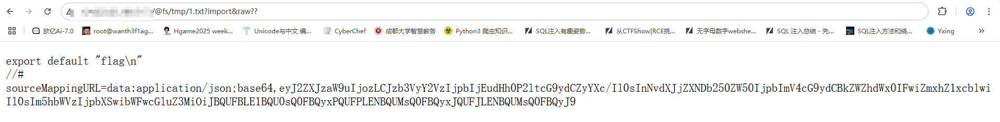

也是可以的

解释一下后面的绕过机制

ai给出的结果是

- `?import`：触发 Vite 的 **模块导入逻辑**（原本用于加载 ES 模块）。
- `&raw??`：强制返回文件原始内容（绕过权限检查的漏洞点）。

# CVE-2025-31125

## 影响版本

6.2.0 <= vite <= 6.2.3

6.1.0 <= vite <= 6.1.2

6.0.0 <= vite <= 6.0.12

5.0.0 <= vite <= 5.4.15

vite <= 4.5.10 

对比CVE-2025-30208的影响版本

6.2.0 <= Vite <= 6.2.2

6.1.0 <= Vite <= 6.1.1

6.0.0 <= Vite <= 6.0.11

5.0.0 <= Vite <= 5.4.14

Vite <= 4.5.9

## 从源码->漏洞成因

之前在上面我们就讲过了继CVE-2025-30208之后的一些修复，也就是在v6.2.3中，我们分析一下该版本的源码

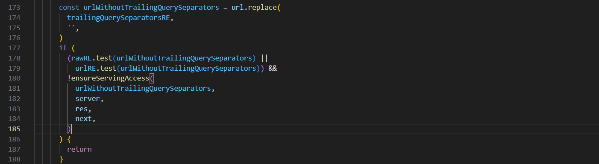

相比于之前的版本

```ts
const trailingQuerySeparatorsRE = /[?&]+$/      
const urlWithoutTrailingQuerySeparators = url.replace(
        trailingQuerySeparatorsRE,
        '',
      )
```

其实就是**移除 URL 末尾多余的 `?` 或 `&`**，所以30208的payload是打不进去的，但是出现了新的绕过方式CVE-2025-31125

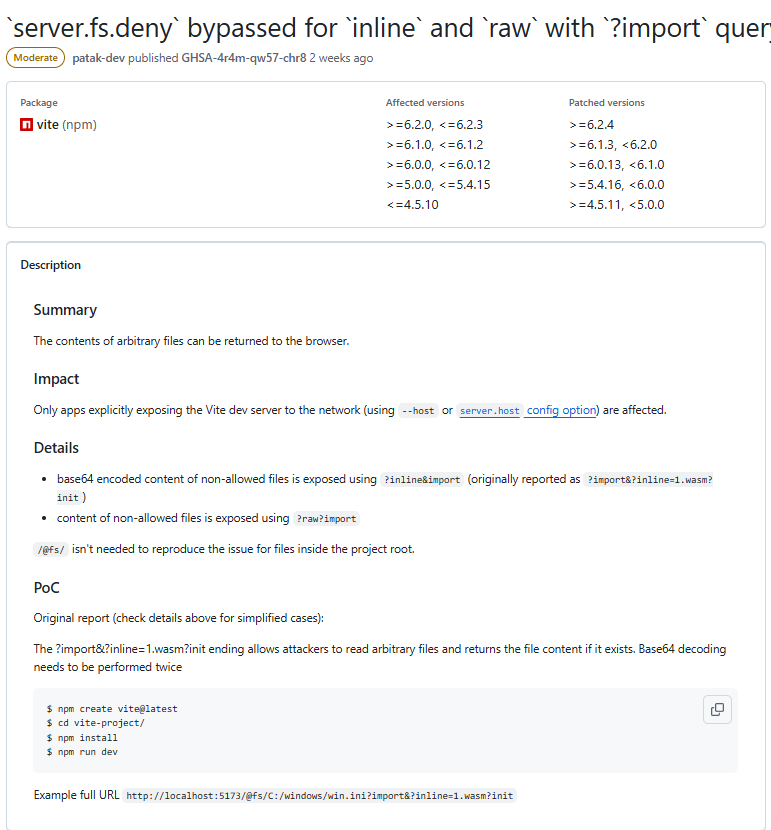

?import&?inline=1.wasm?init 结尾允许攻击者读取任意文件，并返回文件内容（如果存在）。

然后我们看一下inline参数

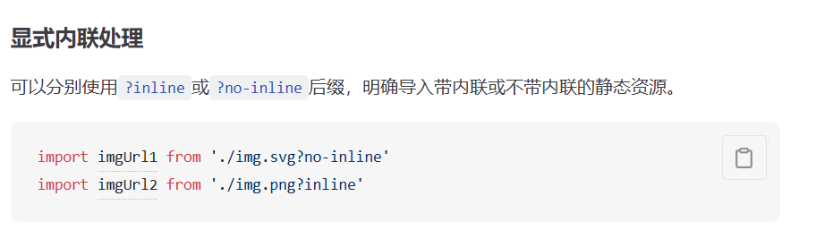

## 漏洞复现

这里话拿vite6.2.3去进行复现

正常的话是读取不了文件的

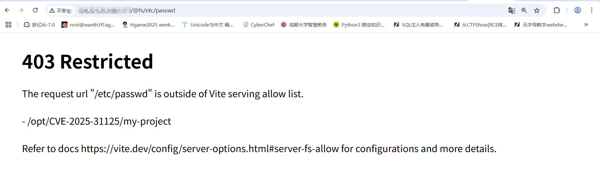

CVE-2025-30208的poc也是不行的

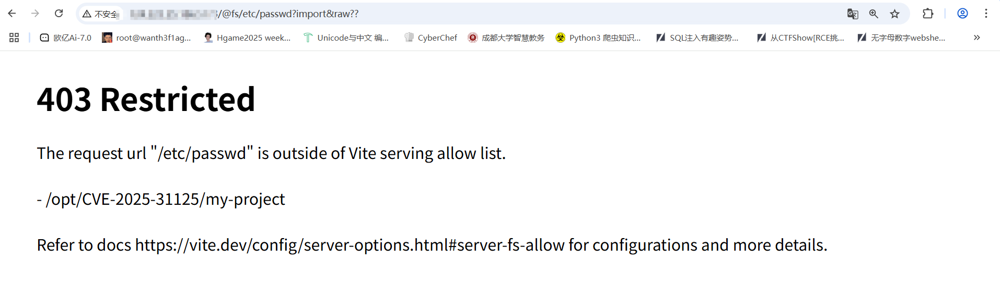

利用官方POC

```
/@fs/etc/passwd?import&inline=1.wasm?init
```

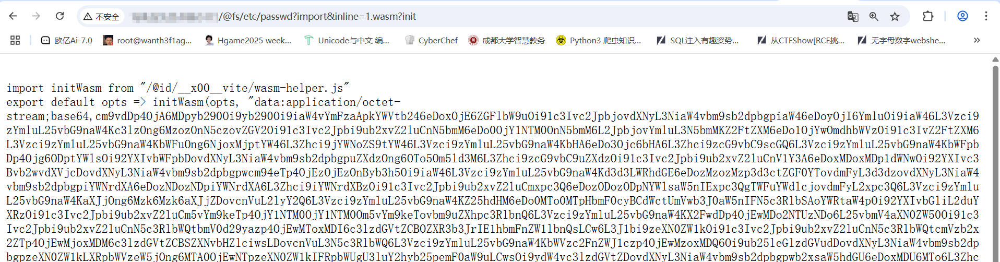

成功打进去了

这个CVE在6.2.4版本已被修复，但后续又出现了新的绕过方式

# CVE-2025-31486

## 影响版本

- 6.2.0 <= Vite <= 6.2.4
- 6.1.0 <= Vite <= 6.1.3
- 6.0.0 <= Vite <= 6.0.13
- 5.0.0 <= Vite <= 5.4.16
- Vite <= 4.5.11

对比CVE-2025-31125的影响版本

6.2.0 <= vite <= 6.2.3

6.1.0 <= vite <= 6.1.2

6.0.0 <= vite <= 6.0.12

5.0.0 <= vite <= 5.4.15

vite <= 4.5.10 

## 从源码->漏洞成因

我们把6.2.4的源码下下来分析一下

看看这次又有什么变化

```
const urlRE = /[?&]url\b/
const rawRE = /[?&]raw\b/
const inlineRE = /[?&]inline\b/
```

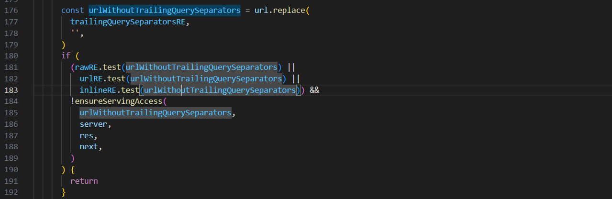

相对于之前的来说，就是禁用了inline参数的绕过方式，那么这时候又能怎么绕过呢？我也不会，等我分析出来了再写
