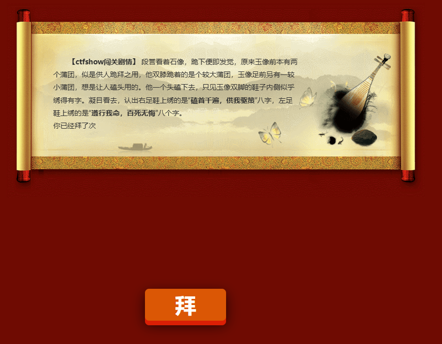
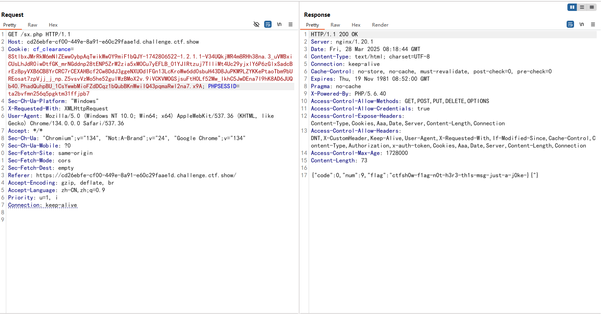
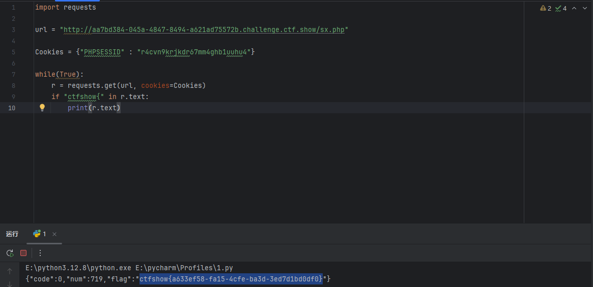
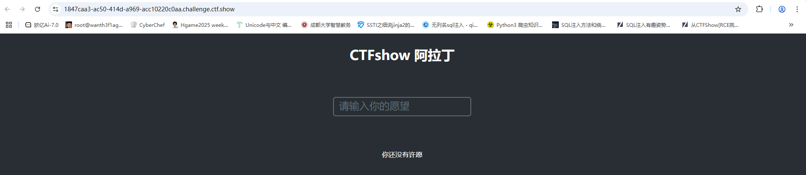
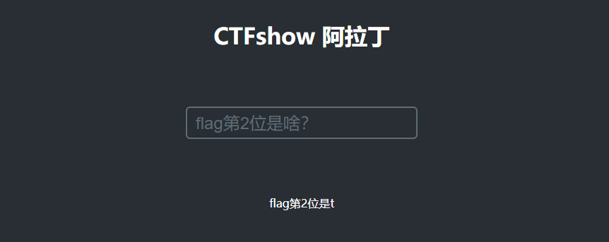
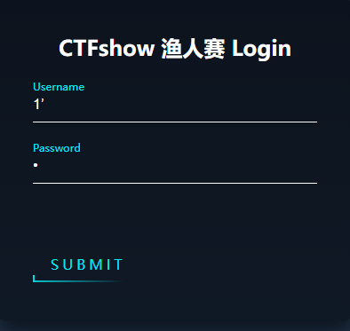
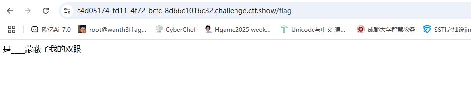
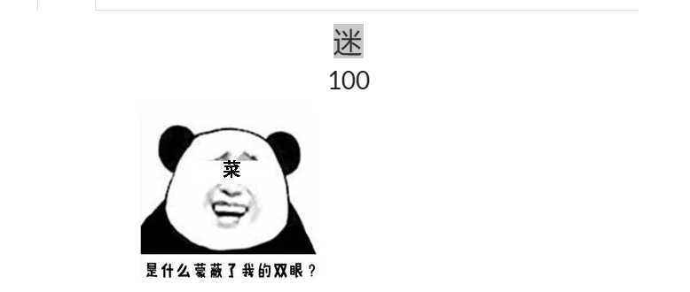
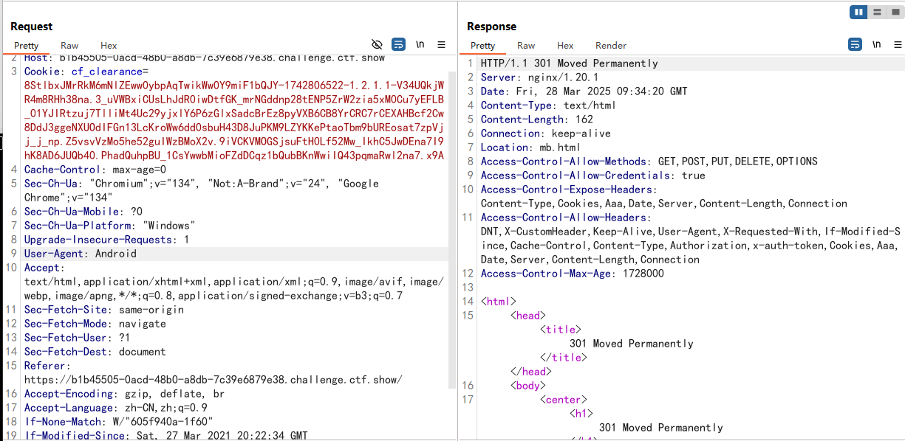

---
title: "ctfshow渔人杯(已做完)"
date: 2025-03-28T15:22:01+08:00
summary: "ctfshow渔人杯(已做完)"
url: "/posts/ctfshow渔人杯(已做完)/"
categories:
  - "ctfshow"
tags:
  - "渔人杯"
draft: false
---

# 神仙姐姐



点了拜之后就显示拜了几次，提示磕首千遍，抓包看看



爆破发了999个包，但是好像还是没拿到flag，难道还有别的思路？

后面看了wp才发现是在差不多四百多次的时候就有flag了，没办法，另外开靶机吧，这次直接用脚本跑，免得找了

```python
import requests

url = "http://aa7bd384-045a-4847-8494-a621ad75572b.challenge.ctf.show/sx.php"

Cookies = {"PHPSESSID" : "r4cvn9krjkdr67mm4ghb1uuhu4"}

while(True):
    r = requests.get(url, cookies=Cookies)
    if "ctfshow{" in r.text:
        print(r.text)
```



# 阿拉丁

想要啥就有啥



也没搜到啥可用信息，发现数据包中post了一个json格式的数据

随便问了一个flag是啥，就返回了flag第1位是c，搞得好像我自己猜不到一样emmm

然后我发现这个挨个问就能问出flag的内容了



写个脚本试一下

```python
import requests

url = "http://1847caa3-ac50-414d-a969-acc10220c0aa.challenge.ctf.show/"

data = {
    "wish":"flag第1位是什么?"
}
r = requests.post(url, json=data)
print(r.text)
#flag第1位是c
```

然后我们对r.text取索引-1拿到最后一位得到c

那就写脚本吧

```python
import requests

url = "http://1847caa3-ac50-414d-a969-acc10220c0aa.challenge.ctf.show/"

flag = ""
for i in range(1,50):
    data = {
        "wish":f"flag第{i}位是什么?"
    }
    r = requests.post(url, json=data)
    print(r.text)
    flag += r.text[-1]
    if r.text[-1] == "}":
        break
print(flag)
```

# 迷

一个登录口



目录有个/flag但是访问出来



根据题目里的



传个菜就行

确实是渔人(愚人)杯哈哈哈哈哈

# 飘啊飘

有手X就行

一开始以为是xss，后面才发现这个手x提示是手机的意思

抓包修改User-Agent:Andorid 



发现一个mb.html

# Ez_Mysqli

## #MySQL默认下不区分重音符号

```php
<?php
highlight_file(__FILE__);
//flag在字段Y4tacker里
$servername = "127.0.0.1";
$username = "root";
$password = "root";
$dbname = "ctfshow";
$conn = new mysqli($servername, $username, $password, $dbname);
mysqli_set_charset($conn,'utf8');
if ($conn->connect_error) {
    die("连接失败: " . $conn->connect_error);
}
if(stripos($_GET['username'],'Y4tacker')!==false){
    die("爬");
}
else{
    $username=$_GET['username'];
}
if (strlen($username)>=11){
    die("爬");
}
if (preg_match("/,|#|-|\+|\'|\"|or|union|select|show|\\\\/im",$username)){
    die("爬");
}
$sql = "select * from `yyds` where username='$username'";
$result = $conn->query($sql);
if ($result->num_rows > 0) {
    while($row = $result->fetch_assoc()) {
       echo($row['password']);
    }
}
$conn->close();
?>

Notice: Undefined index: username in /var/www/html/index.php on line 13

Notice: Undefined index: username in /var/www/html/index.php on line 17
```

这里对username进行了检查,要求username里不能有Y4tacker，长度不能大于11，且对username进行正则表达式的检测

这里的话其实想要进行sql注入的话因为长度限制所以大概率是实现不了的，只能尝试着绕过这个用户名Y4tacker

payload

```
?username=Y4tàcker
```

根据MySQL默认情况不区分重音符号的特性

- MySQL 的默认字符集通常是 `latin1`，而默认排序规则是 `latin1_swedish_ci`。

- `latin1_swedish_ci`是一种不区分大小写、不区分重音符号的排序规则。

  例如，`a`、`á`、`à`、`â` 被视为相同的字符。

  在默认排序规则下，MySQL 会将带有重音符号的字符视为其基本字符。

例如我们传入?username=ā，那么在解码的时候mysql会把ā当成是a去进行查询的


