# 0x01前言

好久没看c语言了，趁着最近要准备c语言考试再重新回顾一下，这里主要是为了复习，但是也会尽量把很多概念理清楚，很适合小白学习

# 0x02正文

# C语言的特点

先讲讲c语言的两大特点

- c语言是一门面向过程(结构化)的语言
- c语言是编译型语言

那这里有小白要问了，什么是面向过程的语言？什么是编译型语言？

## 面向过程和面向对象

面向过程的语言也称为结构化程序设计语言，**是高级语言的一种**。 在面向过程程序设计中，问题被看作一系列需要完成的任务，函数则用于完成这些任务，解决问题的焦点集中于使用函数。 

面向对象的语言是**一类以对象作为基本程序结构单位的程序设计语言**，指用于描述的设计是以对象为核心，而对象是程序运行时刻的基本成分。 语言中提供了类、对象、封装、继承、多态等成分，有识认性、多态性、类别性和继承性四个主要特点。

这是抽象的概念，我举个例子就能理解了，例如我们把程序看成一辆车，那么这辆车就包括很多组件，这些组件我们可以去各个厂商进口，也可以自己造，那么我们自己造车的话就需要把各个组件其中的各个零件做出来，那么这个过程就是很重要的，这也就可以被看成是面向过程的语言，而我们如果去进口的话，每个组件就包含了很多个零件，只需要把这些组件组装起来，那么最后造出来的车就是最重要的，这也就可以被看成是面向对象的语言，说的简单点就是一个看重过程另一个更看重结果

因为这里是复习C语言所以这个就不赘述了，借一个师傅的文章给参考一下

[一文带你搞懂什么是“面向过程”与“面向对象”](https://blog.csdn.net/weixin_62261692/article/details/130284983)

然后我们解决第二个问题，什么是编译型和解释型

## 什么是编译型和解释型

高级语言转化成机器语言的时候，有两种处理方式，即编译和解释。编译型语言编写的程序执行之前，需要一个专门的编译过程，把整个源程序编译成机器语言，后面要运行的话就不需要重新编译了，直接使用编译的结果就可以了。所以编译型的程序执行效率更高，解释型语言则不同，解释型语言需要在运行的时候边执行边翻译，比如python，会专门有一个解释器能够执行程序，每个语句都是运行的时候才编译，所以效率比较低。

例如我们需要做一道外国菜，这时候就有两个方式可以去做，一个是买翻译过的食谱，一个是找一个外国朋友每个步骤给你翻译解释，前者就是编译型，后者就是解释型。

## C语言程序的实现过程

**编辑源程序(Hello.c)->编译目标程序(Hello.obj)->连接生成可执行程序(Hello.exe)->运行**

> [!IMPORTANT]
>
> 这里的.obj文件和.exe文件都是二进制文件，但只有exe文件可以运行

## C 程序主要组成部分

- 预处理器指令
- 函数
- 变量
- 语句 & 表达式
- 注释

说那么多，不如直接上机实操讲解

先写程序员最常见的HelloWorld程序

```c
#include <stdio.h>
int main(){
    /* 第一个C语言程序 */
    printf("HelloWorld!\n");
    return 0;
}
```

解释一下这段基础代码

- line1:预处理指令，用于导入包含标准输入输出库的头文件stdio.h
- line2:main为c语言主函数，所有代码从主函数开始执行和结束执行，int表示函数的返回值需要是int类型的整数值，函数需要用大括号包含 
- line3:注释`/**/`表示多行注释 (反斜杠为转义)
- line4:printf为输出函数，用于把字符串完整输出到标准输出控制台,\n表示换行
- line5:return语句用于结束函数执行并返回一个值，这里返回整数值0表示函数正常终止 

可以看到运行结果

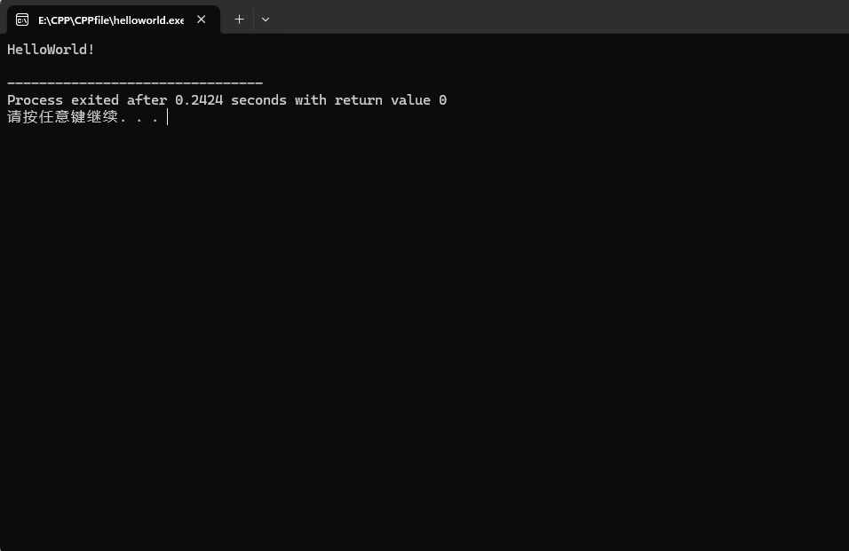

# C语言语法基础

在讲解语法基础前先讲几个前置知识

- 分割符

分隔符用于分隔语句和表达式，常见的分隔符包括：

- **逗号 \**,\**** ：用于分隔变量声明或函数参数。
- **分号 \**;\**** ：用于结束语句。
- 括号
  - 圆括号 **`()`** 用于分组表达式、函数调用。
  - 花括号 **`{}`** 用于定义代码块。
  - 方括号 **`[]`** 用于数组下标。

在 C 程序中，分号 **;** 是语句结束符，也就是说，每个语句必须以分号结束，它表明一个逻辑实体的结束。

- 注释

有两种注释，单行注释`//`和多行注释`/**/`

一个程序通常由很多个词法组成，其中包括关键字，标识符，数据类型，常量，变量，运算符等等，接下来我们逐一讲解

## 关键字

关键字是一类被C语言保留使用的有特定的专门含义的单词，如int，void，for等，这类单词不能用作标识符（函数名或变量名）

|    asm     |    auto    |    break     | case         |
| :--------: | :--------: | :----------: | ------------ |
|  **char**  | **const**  | **continue** | **default**  |
|   **do**   | **double** |   **else**   | enum         |
| **extern** |    far     |  **float**   | **for**      |
|  **goto**  |   **if**   |   **int**    | **long**     |
|    near    |  register  |  **return**  | **short**    |
| **signed** | **sizeof** |  **static**  | struct       |
| **switch** |  typedef   |    union     | **unsigned** |
|  **void**  |  volatile  |  **while**   |              |

## 标识符

在C语言中，许多符号例如变量，函数，数组等的命名必须遵守一定的命名规则，按此规则命名的符号就称为标识符，标识符是指给程序中的实体所起的名字，如变量，函数，数组，指针，常量，结构体以及文件名，简单来说就是一个名字

标识符的命名规则如下：

- 标识符可以包含字母`(a-z,A-Z)`数字`(0-9)`和下划线`(_)`；
- 标识符必须以字母或下划线开头；
- 标识符本质上没有长度限制，但实际上很多编译器只能识别前32位；
- 标识符不能包含空格；
- 关键字不能作为标识符；

> [!IMPORTANT]
>
> **C语言是大小写敏感的**，例如我们定义变量 int while是错的，但是int WHILE是对的，因为WHILE和while不一样，WHILE不是关键字
>
> 标识符应“见名思义”为好，且一般函数名，变量名用小写，符号常量用大写，如若标识符为两个及以上的单词组成，应该用下划线或者大小写去分割开，例如database_name,DatabaseName。

## 数据类型

在C 语言中，数据类型指的是**用于声明不同类型的变量或函数的一个广泛的系统**。 变量的类型决定了变量存储占用的空间，以及如何解释存储的位模式。不同类型处理不同的数据，相同数据类型的数据可以进行一些特定的操作和运算

C语言的数据类型包括基本数据类型，构造类型，指针类型和空类型(void)

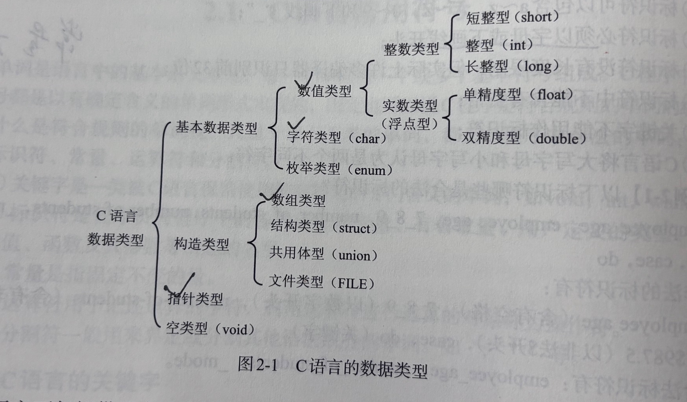

我们先讲基本数据类型和空类型，其他的例如构造类型中的数组类型之类的放在后头再细说

### 基本数据类型

**基本数据类型包括数值类型(整数类型，浮点型)，字符类型和枚举类型**

我们先讲数值类型

#### 数值类型

|      类型      |      类型描述      | 字节数 |              值范围              |
| :------------: | :----------------: | :----: | :------------------------------: |
|      char      |       字符型       |   1    |          -2^7 到 2^7-1           |
| unsigned char  |    无符号字符型    |   1    |           0 到  2^8-1            |
|  signed char   | 有符号字符型(char) |   1    |          -2^7 到 2^7-1           |
|     short      |       短整型       |   2    |         -2^15 到 2^15-1          |
| unsigned short |    无符号短整型    |   2    |           0 到 2^16-1            |
|  signed short  |    有符号短整型    |   2    |         -2^15 到 2^15-1          |
|      int       |        整型        |   4    |         -2^31 到 2^31-1          |
|  unsigned int  |     无符号整型     |   4    |           0 到 2^32-1            |
|   signed int   |     有符号整型     |   4    |         -2^31 到 2^31-1          |
|      long      |       长整型       |   4    |         -2^31 到 2^31-1          |
| unsigned long  |    无符号长整形    |   4    |           0 到 2^32-1            |
|  signed long   |    有符号长整型    |   4    |         -2^31 到 2^31-1          |
|   long long    |      长长整型      |   8    |         -2^63 到 2^63-1          |
|     float      |    单精度浮点型    |   4    |  7位有效位(1.2E-38 到 3.4E+38)   |
|     double     |    双精度浮点型    |   8    | 15位有效位(2.3E-308 到 1.7E+308) |
|  long double   |   长双精度浮点型   |   16   |            19位有效位            |

不同系统的字节数可能不一样，如果我们想获取不同数据类型的存储字节大小，可以用sizeof()函数，接下来我们实践看看

```c
#include <stdio.h>

int main() {
    printf("char: %zu bytes\n", sizeof(char));
    printf("short: %zu bytes\n", sizeof(short));
    printf("int: %zu bytes\n", sizeof(int));
    printf("long: %zu bytes\n", sizeof(long));
    printf("long long: %zu bytes\n", sizeof(long long));
    printf("float: %zu bytes\n", sizeof(float));
    printf("double: %zu bytes\n", sizeof(double));
    printf("long double: %zu bytes\n", sizeof(long double));
    return 0;
}
```

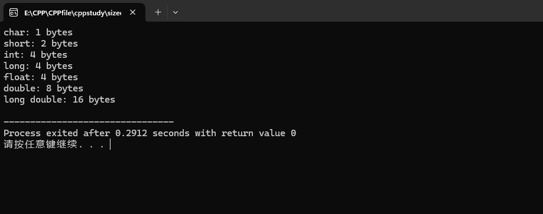

`%zu` 将用于打印 `sizeof(int)` 和 `sizeof(double)` 的结果，这将显示这些数据类型在当前平台上所占的字节数。

### 空类型(void)

void 类型指定没有可用的值。它通常用于以下三种情况下：

- 函数返回值为空，例如我们的主函数**void mian**
- 函数参数为空，C 中有各种函数不接受任何参数。不带参数的函数可以接受一个 void。例如 **int name(void);**
- 指针指向void，类型为 `void *` 的指针代表对象的地址，而不是类型。

讲完数据类型，我们接下来讲数据

在C语言中的数据可以分为两种，常量和变量，我们先讲常量

## 常量

常量通常是指在程序运行的时候值无法被改变的量。

常量通常有两种形式：一种是字面常量或直接常量，一种是符号常量或有名常量。一般从字面形式上可以判别的常量称为字面常量或直接常量，而符号常量通常是一个程序中指定的用名字代表的常量，从字面上看不出其类型的值，例如PAI=3.14，其中PAI就是一个有名常量，是3.14的名字，而3.14就是字面常量

常量可以直接在代码中使用，也可以通过定义常量来使用。

接下来我们讲一下字面常量

### 字面常量

#### 整型常量

整数常量即int型常量，说白了就是整数，它可以是十进制、八进制或十六进制的常量

先讲讲整型常量的前缀

- 十进制整数(无前缀)

就是我们日常见到的整数，例如8和34。十进制的基本字符为：0，1，2，...  ，9。

- 八进制整数(以0为前缀)

以0开头的整数为八进制整数，例如023和0634。八进制的基本字符为：0，1，2，...   ，7。

- 十六进制(以0和大小写x为前缀)

以0和大小写字母x开头的整数为十六进制整数，例如0x5e。十六进制整数的基本字符为0~9，A~F或0~9，a~f。

关于进制转化的问题我之前学的比较模糊，这次也是把他理清楚了写下来。

##### 进制转化

- 十进制转八进制

用十进制数除以8取余，商再除以8，直到商为0，余数从右到左排列。

例如136，136除以8=17余0，17除以8=2余1，2除以8=0余2，那么八进制就是210

- 八进制转十进制

用八进制每位上的数乘以位权，整数从右向左依次乘以8的n次方（n从0开始）。

例如八进制210，0\*8的0次方+1\*8的1次方+2\*8的2次方=136十进制数

同理十六进制和十进制之间的转换也是一样的，这里就不再赘述了

再讲讲的后缀

整型变量可分为整型`int`,短整型`short int`,长整型`long int`,无符号整型`unsigned int`，在 整型常量的末尾加上后缀可以表示该整型常量的类型

后缀是 U 和 L 的组合，U 表示无符号整数（unsigned），L 表示长整数（long）。后缀可以是大写，也可以是小写，U 和 L 的顺序任意。

举个例子

```c
30         /* 整数 */
0213       /* 八进制 */
0x4b       /* 十六进制 */
30u        /* 无符号整数 */
30L        /* 长整数 */
30ul       /* 无符号长整数 */
```

#### 实型常量(浮点型常量)

浮点常量由整数部分、小数点、小数部分和指数部分组成。它有两种形式，一种是小数形式，一种是指数形式

- 十进制表示(小数点表示)

就是我们常说的小数，例如3.75。但是这里要注意的是用十进制表示的浮点型常量`必须有小数点`

- 指数形式表示(科学表示)

类似2.3e23这样的指数式，在C语言中，以e或E后跟一个**整数**来表示以10为底数的幂数。

`[小数部分]e或E[整数部分]`

但是对于指数形式来说，一个浮点常量在用指数形式输出时，我们通常需要按规范化的指数形式去输出，那么我们讲一下规范化的指数形式

例如456.789可以表示成456.789e0,45.6789e1,4.56789e2,0.456789e3等，其中4.56789e2是最为规范的指数形式，为什么呢？接下来我们了解一下

最为规范的指数形式的要求

- 小数部分规定小数点左边必须有一位非0的数字(且只能有一位)

当使用小数形式表示时，必须包含整数部分、小数部分，或同时包含两者。当使用指数形式表示时， 必须包含小数点、指数，或同时包含两者。带符号的指数是用 e 或 E 引入的。

#### 字符常量

字符常量是用两个单引号包括起来的字符，例如`'a'`,`'z'`等，字符常量可以是一个普通的字符，也可以是一些特殊的字符转义字符

转义字符是以`'\'`开始的字符，当一些特定的字符加上反斜杠后他们就具有了特殊的含义，下面写一下

| 转义字符 |         含义         |
| :------: | :------------------: |
|    \a    |         响铃         |
|    \n    |         换行         |
|    \t    |      水平制表符      |
|    \v    |      垂直制表符      |
|    \b    |        退格符        |
|    \r    |         回车         |
|    \f    |        换页符        |
|   \\\    |    转义反斜杠(\\)    |
|   \\'    |    转义单引号(\')    |
|   \\"    |    转义双引号(\")    |
|    \?    |     转义问号(?)      |
|   \000   |  一到三位的八进制数  |
|   \xhh   | 一到两位的十六进制数 |

> [!IMPORTANT]
>
> 在ASCII码中，字符和整数有一一对应关系，因此一个字符常量具有双重属性，它既是一个字符又是一个整数
>
> 另外，不能用双引号代替单引号，且单引号中的字符不能是单引号或者反斜杠，需要转义之后才可以表示成字符单引号和字符反斜杠

这些转义字符可用于表达常用的特殊字符，但利用\\000和\\xhh可以表达ASCII码表中的字符，例如`'a'`字符对应的ASCII码的十进制是97，对应的八进制是0141，对应的十六进制是0x61，那么我们可以用'\\141'或'\\x61'来表示字符`'a'`

接下来我们试一下

```c
#include <stdio.h>
int main(){
	//printf("%c%c%c%c%c",'a','A','z','Z','\n'); //显示aAzZ并换行
	//printf("%c%c%c%c%c",'\141','\101','\172','\132','\n'); //八进制 显示aAzZ并换行
	//printf("%c%c%c%c%c",'\x61','\x41','\7A','\x5A','\n');//十六进制 显示aAzZ并换行 
	//printf("%c%c%c",'\a','\n','\x7');//\a和\x7等价，都表示响铃 
	//printf("%s%c%c%c","123",'\b','x','\n');//'\b'回退一格然后显示x,结果为12x并换行 
	//printf("%s%c%c%c","123",'\r','a','\n'); //'\r'回到行首后显示a，结果为a23并换行
	printf("%c%c%c%c%c",'a','\\','\'','\"','\n'); //转义反斜杠单引号和双引号，结果为a\'" 
	return 0;
}
```

#### 字符串常量

字符串字面值或常量是括在一对双引号`""` 中的。一个字符串常量是一个特殊的字符序列或字符数组

但是在C语言中，并没有专门的字符串变量，通常我们会用字符数组去存放一个字符串，当我们定义一个字符数组的时候，系统会自动分配足够的内存来存储字符串的所有字符和一个 null 字符 `'\0'`。

> [!IMPORTANT]
>
> 需要注意的是，字符串常量的长度为该字符串所有字符的个数加1，原因是字符串末尾还有一个终止符`\0`，这就可以讲到字符常量和字符串常量的区别了

我们看看下面的比较，`'a'`是字符，`"a"`是字符串，不仅仅在于引号的区别，还在于他们存储空间值的不同，字符通常只占一个字符，而字符串至少需要2个字符，是因为C编译系统会自动地在字符串末尾加上终止符，这也意味着我们在写字符串的时候不需要写终止符，但是如果我们在字符串中间加上终止符的话，系统会把终止符后面的字符忽略掉，接下来我们实践看一下

```c
#include <stdio.h>
#include <string.h>

int main() {
    //使用指针定义一个字符串常量
    //const char* str = "Hello, World!";//长度13
	//const char* str = "Hello, Wor\0ld!" ;//长度为10
    
    //使用字符数组定义
    
    //char str[] = "Hello, World!";//长度13
    
    char str[] = "Hello, Wor\0ld!";//长度为10
    size_t length = strlen(str);  // 获取字符串长度

    printf("长度为%zu\n", length);
    return 0;
}
```

此外还需要讲一个特别需要注意的点，就是当我们在使用八进制或十六进制转义字符作为字符串常量的时候，应避免产生二义性，例如`"\x5fc"`字符串就让人难以区分到底是`'\x5','f','c'`还是`'\x5f','c'`

讲完了字面常量，接下来我们讲一下符号常量

### 符号常量

简单来说就是用一个符号来代表一个常量，这个符号必须符合标识符的命名规则(通常用大写字母来命名)

定义符号常量有两种方法

- 预处理中的宏定义#define。

格式

```
#define 常量名 常量值
```

例如 ：#define PAI 3.14

因为宏定义是预处理指令，需要写在所有函数之前，且这种定义方法`不需要写数据类型`，也`不用在末尾加分号`

我们试一下

```c
#include <stdio.h>
#define PAI 3.14
#define value 3
#define name 'a' 
int main(){
	printf("PAI=%d\n",PAI);//这里的话输出的就不是我们的PAI常量
	printf("PAI=%lf\n",PAI);
	printf("value=%d\n",value);
	printf("name=%c\n",name);
    return 0;
}
```

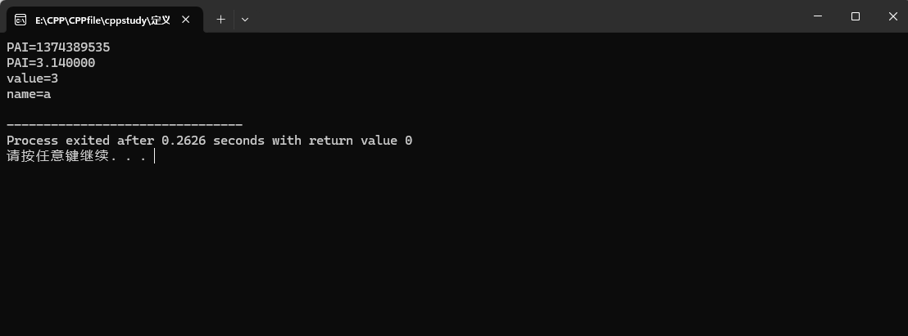

这里可以看到一个关注点，我们在使用define定义常量之后使用这个常量的时候`需要注意常量的类型`例如上面的当我们使用 `%d` 来打印一个浮点数（`double` 或 `float`），程序可能会输出垃圾值

- 使用 **const** 关键字

const 关键字用于声明一个只读变量，即该变量的值不能在程序运行时修改。

格式

```
const 数据类型 常量名 = 常量值;
```

例如： const int MAX_VALUE= 100;

> [!IMPORTANT]
>
> 注意，const 声明常量要在一行语句内完成

接下来我们试一下

```c
#include <stdio.h>
int main(){
	const double PAI = 3.14;
	const int value = 100;
	const char name = 'a';
	printf("PAI=%lf\n",PAI);
	printf("value=%d\n",value);
	printf("name=%c\n",name);
	return 0;
}
```

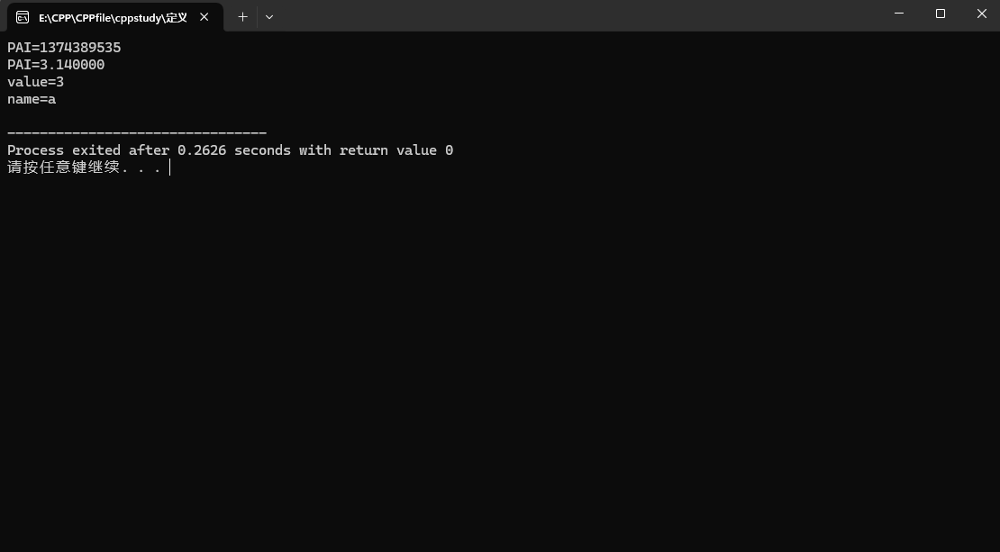

#### #define 与 const 区别

直接摘的[菜鸟教程](https://www.runoob.com/cprogramming/c-constants.html)的说法

- 替换机制：`#define` 是进行简单的文本替换，而 `const` 是声明一个具有类型的常量。`#define` 定义的常量在编译时会被直接替换为其对应的值，而 `const` 定义的常量在程序运行时会分配内存，并且具有类型信息。
- 类型检查：`#define` 不进行类型检查，因为它只是进行简单的文本替换。而 `const` 定义的常量具有类型信息，编译器可以对其进行类型检查。这可以帮助捕获一些潜在的类型错误。
- 作用域：`#define` 定义的常量没有作用域限制，它在定义之后的整个代码中都有效。而 `const` 定义的常量具有块级作用域，只在其定义所在的作用域内有效。
- 调试和符号表：使用 `#define` 定义的常量在符号表中不会有相应的条目，因为它只是进行文本替换。而使用 `const` 定义的常量会在符号表中有相应的条目，有助于调试和可读性。

## 变量

所谓变量，就是可以在程序运行过程中值可以改变的量，**C 中每个变量都有特定的类型，类型决定了变量存储的大小和布局，该范围内的值都可以存储在内存中，运算符可应用于变量上。**

> [!IMPORTANT]
>
> 记住！变量必须先声明后使用

变量代表内存中具有特定属性的一个存储单元

这句话怎么理解呢？其实我们的变量就是内存中的一个存储区域，该区域有自己的名称(标识符)和类型(数据类型)，根据数据类型的不同，变量会被分配不同的存储单元空间，实际上操作变量的过程就是操作内存的过程

C语言中按作用域分有两种变量:

1. 在函数或块内部的**局部**变量
2. 在所有函数外部的**全局**变量

那我们看看这两种变量有什么区别

### 按作用域分类

#### 局部变量

在某个函数或复合语句(代码块内)的内部声明的变量称为局部变量。它们只能被该函数或该复合语句内部的语句使用。有参函数的形式参数也是局部变量。局部变量在函数外部是不可知的。

局部变量所在的函数被调用和执行时，系统会临时给局部变量分配存储单元，一旦函数调用结束，这些局部变量的存储单元将被释放

#### 全局变量

全局变量是定义在函数外部，通常是在程序的顶部。全局变量从定义的位置开始到本源程序运行结束都可使用，在任意的函数内部能访问全局变量。

> [!IMPORTANT]
>
> 在程序中，局部变量和全局变量的名称可以相同，但是在函数内，如果两个名字相同，会使用局部变量值，全局变量不会被使用。

### 变量的存储类别

C 语言的内存模型主要分为几个区域，每个区域在程序运行时都有特定的角色：

- **栈区（Stack）**：用于存储局部变量和函数调用的参数，内存由编译器自动管理。
- **堆区（Heap）**：用于存储动态分配的内存，由程序员手动管理。
- **全局/静态区（Data Segment）**：用于存储全局变量和静态变量，内存生命周期从程序启动到结束。
- **文本区（Text Segment）**：存储程序代码，包括字符串常量。

#### 静态和动态存储方式

通常我们编译后的c程序，在内存中占有的存储空间通常分为程序代码区，静态存储区和动态存储区三个部分

- 程序代码区用于存放程序代码指令
- 静态存储区是指分配给变量空间固定的存储空间，且在整个程序运行期间，其存储空间会一直保留而不被释放
- 动态存储区是指分配给不需要占有固定存储单元的变量使用的存储空间，只在程序执行过程中需要时才会临时开辟存储单位，用完后自动释放空间

C语言中变量根据存储方式可以分为四种

1. auto自动存储类别
2. extern外部存储类别
3. register寄存器存储类别
4. static静态存储类别

所以我们定义一个变量的时候的完整格式应该是

```
存储类别 数据类型 变量名列表;
```

#### 局部变量的存储类别

##### auto自动存储类别

auto是C语言中使用最多的存储方式，也是系统默认的存储方式，例如我们在函数内或复合语句内定义的局部变量，函数形参，通常我们对这些变量进行定义的时候都没有加上存储类别，这时候都会默认为auto自动存储类别

auto自动存储类别属于局部变量的范畴，且自动变量都是动态分配存储空间，生存期为该变量所在的函数或代码块中的执行期间，当在执行函数和代码块的时候，系统会自动为这些变量开辟临时的存储单元，在执行完后释放，原来的值也将丢失。

> [!IMPORTANT]
>
> 在对自动变量进行定义的时候最好养成初始化的习惯，如果没有初始化，系统不会自动赋初值，此时可能是垃圾值，所以一定要养好习惯

##### static静态存储类型

由static修饰的局部变量，都属于静态变量，其存储空间在静态存储区中且固定保留，因此`在此变量所在函数或代码块执行结束后仍然会保留变量值`

对于静态局部变量的初值是在我们编译的时候就一次性赋予的，对于未赋初值的静态局部变量，系统会自动赋默认值

##### register寄存器存储类型

这个在C语言中用的比较少，这个存储方式是将相关的变量存储在CPU的通用寄存器中，而并未内存中，但是CPU的寄存器数目有限，且存放在寄存器中的变量不能进行取地址运算。

只有动态局部变量才能定义成寄存器变量，全局变量和静态局部变量则不行。

#### 全局变量的存储类别

##### extern外部存储类型

extern是用于声明全局变量的，全局变量作用域是从定义变量开始到源文件运行结束，采用extern声明全局变量主要用于扩大全局变量的作用域。

例如

```c
#include <stdio.h>
int main(){
    return 0;
}
int a=10,b=20;
int fun(int x,int y){
    x=a;
    y=b;
    return (x,y)
}
```

在这里的话我们在main函数下方去定义两个全局变量a和b，但是这个时候a和b的作用域仅仅在定义之后开始，也就是不包含main函数，那么这时候我们就需要用extern加以声明，使得a和b的作用域扩大到整个源程序

```
#include <stdio.h>
int main(){
	extern a,b;
    return 0;
}
int a=10,b=20;
int fun(int x,int y){
    x=a;
    y=b;
    return (x,y)
}
```

同样我们也可以通过这个去扩大全局变量的作用域到其他源文件中去

##### static静态存储类型

这个和extern相反，如果我们需要把一个全局变量的作用域仅限于当时的源文件，那么我们就在定义全局变量的时候加上static存储类别

接下来我们讲一下变量的定义

### 局部变量的定义

```
<数据类型> <变量名>
```

<变量名>可以由一个或多个相同类型的变量名组成，多个变量之间用逗号**,**分隔，变量由字母、数字和下划线组成，且以字母或下划线开头，符合标识符的命名规则

那当我们给变量定义的时候系统都经过了哪些内存操作呢？

#### 定义局部变量

当我们在函数内或代码块中定义一个局部变量时，系统会在栈区分配内存。

1. **栈帧创建**：当函数被调用或代码块被执行时，系统会创建一个新的栈帧（stack frame），用于存储该函数的局部变量和参数。
2. **内存分配**：在栈帧中为局部变量分配空间。这个过程通常涉及调整栈指针（stack pointer），并为每个局部变量分配固定大小的内存。例如，声明 `int a;` 会在栈上为 `a` 分配 4 个字节（在大多数系统上，`int` 通常为 4 字节）。
3. **初始化**：当我们对变量进行初始化或赋值后，变量才真正有了存在的意义

#### 关于变量初始化问题

在 C 语言中，如果变量没有显式初始化，那么它的默认值将取决于该变量的类型和其所在的作用域。

对于全局变量，不同类型的变量在没有显式初始化时的默认值：

- 整型变量（int、short、long等）：默认值为0。
- 浮点型变量（float、double等）：默认值为0.0。
- 字符型变量（char）：默认值为'\0'，即空字符。
- 指针变量：默认值为NULL，表示指针不指向任何有效的内存地址。
- 数组、结构体、联合等复合类型的变量：它们的元素或成员将按照相应的规则进行默认初始化，这可能包括对元素递归应用默认规则。

然而对于局部变量（在函数内部定义的非静态变量）不会自动初始化为默认值，它们的初始值是未定义的（包含垃圾值）。因此在我们定义一个变量的时候最好养成初始化赋值的习惯，这样有时候能避免很多潜在的错误（但是测试了一下好像现在的编译器都有了给未初始化的局部变量设置为0的功能）

### 变量的分类

局部变量

其实和常量的知识相同，这里只讲一个上面遗漏的知识点，这里只说他们的存储方式

- 整型变量是以二进制的方式存储的
- 浮点型变量是以指数的方式存储的
- 字符变量是以ASCII码的方式存储的

各类无符号类型量所占的内存空间字节数其实和对应的有符号类型量相同

> [!IMPORTANT]
>
> 因为无符号不能表示负数，但是他们的内存空间字节数是一样的，所以无符号类型量的值范围比有符号类型量的值范围扩大了一倍

#### 整形变量

数据在内存中是以二进制的形式存放的

需要注意的是，整形变量的数值实际上是以补码的方式表示的

- 正数的补码和原码（即该数的二进制形式）相同
- 负数的补码是将原码按位取反后加1得到的

#### 实型变量（浮点型变量）

数据在内存中是以指数的形式存放的

#### 字符型变量

字符型变量是以ASCII码的形式存放的，一个字符型变量在内存中占一个字节

值得关注的是，字符型变量和整形变量之间是可以通用的，C语言允许对整形变量赋以字符值，也可以对字符型变量赋以整形值，当然输出也是一样的

写个demo

```C
#include <stdio.h>
int main(){
	char c1,c2;
	c1 = 'A' + '8' - '4';
	c2 = 'A' + '8' - '4';
	printf("c1=%c,c2=%d",c1,c2);
	return 0;
}
/*输出：c1=E,c2=69*/
```

## 运算符

运算就是对我们的数据进行加工和操作，而运算符就是用来记述运算的字符，而我们使用运算符去进行运算的对象被称为操作数，最基本的操作数就是我们前面讲的常量和变量

根据操作数的不同，我们可以把运算符分为单目运算符和双目运算符以及三目运算符

接下来我们看一下各种运算符

### 算术运算符

用于各类数值运算

假设变量A=10，B=20

| 运算符  |               描述               |       实例       |
| :-----: | :------------------------------: | :--------------: |
|    +    |         把两个操作数相加         | A + B 将得到 30  |
|    -    | 从第一个操作数中减去第二个操作数 | A - B 将得到 -10 |
|    *    |         把两个操作数相乘         | A * B 将得到 200 |
|    /    |           分子除以分母           |  B / A 将得到 2  |
| %(整数) |     取模运算符，整除后的余数     |  B % A 将得到 0  |
|   ++    |     自增运算符，整数值增加 1     |  A++ 将得到 11   |
|   --    |     自减运算符，整数值减少 1     |   A-- 将得到 9   |

前面四个是双目运算符，后面两个是单目运算符(但是其中加号和减号也可以作为单目运算符，例如`-<表达式>`表示`-1*<表达式>`)

> [!IMPORTANT]
>
> 1.两个运算量都应为同一类型，否则会自动进行类型转换
>
> 2.两个int类型数据相除，结果应为int类型，若商不是整数则会去掉小数部分，如果int和float或double类型相除，结果应为float或double类型

接下来我们讲一下自增自减运算符中的一些小事情

#### 关于自增自减

前自增(自减)是先自增(自减)后运算，后自增(自减)是先运算后自增(自减)

实践出真知，我们写个代码就知道了

```c
#include <stdio.h>
int main(){
	int a=10;
	int c=0,d=0;
	c=a++;
	printf("c=a++的结果是: %d\n",c);
	d=++a;
	printf("d=++a的结果是: %d\n",d);
	return 0;
}
/*运算结果
c=10
d=12
*/
```

其实这也跟运算符的优先级有关，具体的讲完运算符再细说，到这里只需要记住这个知识点就可以

> [!IMPORTANT]
>
> 值得关注的是，如果我们在输出语句中使用了自增运算，那么其操作数的值也会随之改变

```c
#include <stdio.h>
int main(){
	int a=3;
	int b=4;
	printf("a++的结果是：%d\n",a++);
	printf("此时a的结果是：%d\n",a);
	printf("++b的结果是：%d\n",++b);
	printf("此时b的结果：%d\n",b);
	return 0;
}
```

#### 关于算术表达式的tips

- C表达式中的乘号不能省略，需要用`*`进行乘法运算
- C表达式不存在分子分母的形式，存在时需要利用`\`运算符
- C表达式中往往可以使用圆括号来调节运算顺序，将从运算最里层的括号开始并由里向外进行运算

### 强制类型转换

当我们的两个操作数的数据类型不一致的时候，需要进行一定的类型转换，C语言提供了两种类型转换机制，一种是自动转换，一种是用户进行的强制转换

#### 数据类型的自动转换

因为基本数据类型都是对变量在内存中的申请空间大小的一种说明，但是变量的数值最终在内存中以0和1的组合来表示，不同数据类型也无非表示可以容纳0和1的组合长度不同而已，所以转换是存在的

从容量角度考虑，小的空间的东西必然能放到大的空间里去，但是大空间的东西如果放到小空间里面则可能会导致错误例如丢失数据位。所以我们必须考虑数据在转换过程中是否能保证完整性

发生混合运算的时候数据类型会进行自动转换，那转换的顺序是什么呢？

```
char,short,int->unsigned->long->unsigned long->float->double->double long
```

这个顺序就是自动转换的顺序

> [!IMPORTANT]
>
> 需要注意以下几个点:
>
> - 赋值运算符两边数据类型不一致的话，右边的类型会转化成左边的类型然后进行赋值
> - 所有单精度的运算都会转换成双精度类型再进行运算
> - char型和short型参与运算的时候都会先转化成int型再进行运算

```c
#include <stdio.h>
int main(){
	int a=3;
	double b=2.15;
	//b=a;//3.0000000
	a=b;//2
	//printf("%lf",b);
	printf("%d",a);
	return 0;
}
```

可以看到，当右边的类型长度比左边长时，数据会丢失一部分，**丢失的部分按四舍五入向前舍入**

#### 数据类型的强制转换

这种情况通常发生在用户希望自己指定一个类型，转化格式就是

```
(<数据类型>) <表达式> 或 <数据类型>(<表达式>)
```

实操

```c
#include <stdio.h>
int main(){
	int a=3;
	double b=2.15;
	//b=a;//3.0000000
	//a=b;//2
	//printf("%lf",b);
    //printf("%d",a);
	printf("%lf\n%d",(double)a,int(b));
	return 0;
}
/*运行结果
3.000000
2
*/
```

> [!IMPORTANT]
>
> 类型转换运算符只是暂时的，它只是改变了临时存储单元中该变量的值的类型，并用改变的值参加表达式的计算，而不会真正改变变量本身的类型

### 关系运算符

关系运算符是双目运算符，结合性均为左结合主要用于描述两个操作数之间的关系，返回结果只能为true或者false

但是在C语言中并没有专门的布尔值去表示true和false，当为”true“的时候，表达式返回结果1；否则返回0

使用格式

```
<运算量>关系运算符<运算量>
```

假设A=10，B=20

| 运算符 | 描述                                                         | 实例            |
| :----- | :----------------------------------------------------------- | :-------------- |
| ==     | 检查两个操作数的值是否相等，如果相等则条件为真。             | (A == B) 为假。 |
| !=     | 检查两个操作数的值是否相等，如果不相等则条件为真。           | (A != B) 为真。 |
| >      | 检查左操作数的值是否大于右操作数的值，如果是则条件为真。     | (A > B) 为假。  |
| <      | 检查左操作数的值是否小于右操作数的值，如果是则条件为真。     | (A < B) 为真。  |
| >=     | 检查左操作数的值是否大于或等于右操作数的值，如果是则条件为真。 | (A >= B) 为假。 |
| <=     | 检查左操作数的值是否小于或等于右操作数的值，如果是则条件为真。 | (A <= B) 为真。 |

1. 字符数据的比较是按照ASCII码的值进行比较的，字符可作为整数参与运算和比较
2. 在判断两个浮点数是否相等的时候，由于存储上的误差，会得出错误的结果，例如`1.0/3.0 * 3.0 == 1.0`这里是0

#### 关系表达式

用关系运算符将两个表达式连接起来的式子叫做关系表达式

这两个表达式可以是算术表达式，关系表达式，逻辑表达式，赋值表达式，字符表达式

关系表达式的返回值是一个逻辑值，即1或者0

### 逻辑运算符

假设A=1，B=0

| 运算符 | 描述                                                         | 实例              |
| :----- | :----------------------------------------------------------- | :---------------- |
| &&     | 称为逻辑与运算符。如果两个操作数都非零，则条件为真。         | (A && B) 为假。   |
| \|\|   | 称为逻辑或运算符。如果两个操作数中有任意一个非零，则条件为真。 | (A \|\| B) 为真。 |
| !      | 称为逻辑非运算符。用来逆转操作数的逻辑状态。如果条件为真则逻辑非运算符将使其为假。 | !(A && B) 为真。  |

### 位运算符

假设变量 **A** 的值为 60，变量 **B** 的值为 13，用二进制表示就是:

A = 0011 1100

B = 0000 1101

\-----------------

A&B = 0000 1100

A|B = 0011 1101

A^B = 0011 0001

~A = 1100 0011

| 运算符 | 描述                                                         | 实例                                                         |
| :----- | :----------------------------------------------------------- | :----------------------------------------------------------- |
| &      | 对两个操作数的每一位执行逻辑与操作，如果两个相应的位都为 1，则结果为 1，否则为 0。按位与操作，按二进制位进行"与"运算。运算规则：`0&0=0;    0&1=0;     1&0=0;      1&1=1;` | (A & B) 将得到 12，即为 0000 1100                            |
| \|     | 对两个操作数的每一位执行逻辑或操作，如果两个相应的位都为 0，则结果为 0，否则为 1。按位或运算符，按二进制位进行"或"运算。运算规则：`0|0=0;    0|1=1;    1|0=1;     1|1=1;` | (A \| B) 将得到 61，即为 0011 1101                           |
| ^      | 对两个操作数的每一位执行逻辑异或操作，如果两个相应的位值相同，则结果为 0，否则为 1。异或运算符，按二进制位进行"异或"运算。运算规则：`0^0=0;    0^1=1;    1^0=1;   1^1=0;` | (A ^ B) 将得到 49，即为 0011 0001                            |
| ~      | 对操作数的每一位执行逻辑取反操作，即将每一位的 0 变为 1，1 变为 0。取反运算符，按二进制位进行"取反"运算。运算规则：`~1=-2;    ~0=-1;` | (~A ) 将得到 -61，即为 1100 0011，一个有符号二进制数的补码形式。 |
| <<     | 将操作数的所有位向左移动指定的位数。左移 n 位相当于乘以 2 的 n 次方。二进制左移运算符。将一个运算对象的各二进制位全部左移若干位（左边的二进制位丢弃，右边补0）。 | A << 2 将得到 240，即为 1111 0000                            |
| >>     | 将操作数的所有位向右移动指定的位数。右移n位相当于除以 2 的 n 次方。二进制右移运算符。将一个数的各二进制位全部右移若干位，正数左补 0，负数左补 1，右边丢弃。 | A >> 2 将得到 15，即为 0000 1111                             |

### 赋值运算符

赋值运算符是一种双目运算符，结合性从右到左

> [!IMPORTANT]
>
> 在C语言中，等于号(=)并不是相等的意思，而是给操作数赋值，例如a=b，我们不能说成a等于b，而是从右到左看，是把b的值赋给a
>
> - 赋值运算符的左侧只能是变量，而右侧可以是常量，变量或者表达式

| 运算符 | 描述                                                         | 实例                            |
| :----- | :----------------------------------------------------------- | :------------------------------ |
| =      | 简单的赋值运算符，把右边操作数的值赋给左边操作数             | C = A + B 将把 A + B 的值赋给 C |
| +=     | 加且赋值运算符，把右边操作数加上左边操作数的结果赋值给左边操作数 | C += A 相当于 C = C + A         |
| -=     | 减且赋值运算符，把左边操作数减去右边操作数的结果赋值给左边操作数 | C -= A 相当于 C = C - A         |
| *=     | 乘且赋值运算符，把右边操作数乘以左边操作数的结果赋值给左边操作数 | C *= A 相当于 C = C * A         |
| /=     | 除且赋值运算符，把左边操作数除以右边操作数的结果赋值给左边操作数 | C /= A 相当于 C = C / A         |
| %=     | 求模且赋值运算符，求两个操作数的模赋值给左边操作数           | C %= A 相当于 C = C % A         |
| <<=    | 左移且赋值运算符                                             | C <<= 2 等同于 C = C << 2       |
| >>=    | 右移且赋值运算符                                             | C >>= 2 等同于 C = C >> 2       |
| &=     | 按位与且赋值运算符                                           | C &= 2 等同于 C = C & 2         |
| ^=     | 按位异或且赋值运算符                                         | C ^= 2 等同于 C = C ^ 2         |
| \|=    | 按位或且赋值运算符                                           | C \|= 2 等同于 C = C \| 2       |

### 杂项运算符

| 运算符   | 描述             | 实例                                 |
| :------- | :--------------- | :----------------------------------- |
| sizeof() | 返回变量的大小。 | sizeof(a) 将返回 4，其中 a 是整数。  |
| &        | 返回变量的地址。 | &a; 将给出变量的实际地址。           |
| *        | 指向一个变量。   | *a; 将指向一个变量。                 |
| ? :      | 条件表达式       | 如果条件为真 ? 则值为 X : 否则值为 Y |

其中我们要讲的就是三目运算符?:

格式

```
<数值表达式1>?<表达式2>:<表达式3>
```

若表达式1为真则执行表达式2并返回表达式2的值，否则执行表达式3并返回表达式3的值，就这么简单

需要注意的是：`sizeof` 是**编译时运算符**，只计算类型的大小，不会真正执行括号内的表达式。例如sizeof(++a)；这里并不会计算`++a`的结果，只是计算a这个数据类型的大小

到这里我们的运算符就讲完了，但是我们还有一个很重要的点需要讲那就是运算符的优先级

## 运算符的优先级

| 优先级 |  运算符号   |       描述       | 目数 |  结合性  |
| :----: | :---------: | :--------------: | :--: | :------: |
|   1    |     ()      |       括号       |      | 从左到右 |
|   1    |     []      |       下标       |      | 从左到右 |
|   1    |    .和->    |    成员运算符    |      | 从左到右 |
|   1    |  .\*和->\*  |  成员指针运算符  |      | 从左到右 |
|   2    | **++和--**  |   **自增运算**   | 单目 | 从右到左 |
|   2    |    &和*     |  取地址和取内容  | 单目 | 从右到左 |
|   2    |    **!**    |    **逻辑非**    | 单目 | 从右到左 |
|   2    |      ~      |     按位取反     | 单目 | 从右到左 |
|   2    |    +和-     |    正负号运算    | 单目 | 从右到左 |
|   2    | (数据类型)  |   强制类型转换   | 单目 | 从右到左 |
|   2    |   sizeof    |   返回字节大小   | 单目 | 从右到左 |
|   3    |   *,/和%    | 乘法，除法和取余 | 双目 | 从左到右 |
|   4    |    +和-     |      加减法      | 双目 | 从左到右 |
|   5    |   <<和>>    |  左移位和右移位  | 双目 | 从左到右 |
|   6    | <和<=,>和>= |     大于小于     | 双目 | 从左到右 |
|   7    |   ==和!=    |   等于和不等于   | 双目 | 从左到右 |
|   8    |      &      |      按位与      | 双目 | 从左到右 |
|   9    |      ^      |     按位异或     | 双目 | 从左到右 |
|   10   |     \|      |      按位或      | 双目 | 从左到右 |
|   11   |     &&      |      逻辑与      | 双目 | 从左到右 |
|   12   |    \|\|     |      逻辑或      | 双目 | 从左到右 |
|   13   |     ?:      |  三目条件运算符  | 三目 | 从右到左 |
|   14   | 赋值运算符  |    赋值运算符    | 双目 | 从右到左 |
|   15   |     ，      |    逗号运算符    |      | 从左到右 |

双目运算符之后的优先级：算术运算符->左右移位->关系运算符-> 位运算符->逻辑运算符->赋值运算符

在这个模块里，还有一个很重要的基础知识需要我们去掌握

## 基本输入输出操作

讲完了数据的基本组成和一些基础知识，接下来最重要的就是要处理数据的输入和输出了，没有输出的程序是没有用的，没有输入的程序是不灵活的

C语言提供了丰富的输入输出函数，我们这里只讲最常见的几种

### 字符的输入和输出

- putchar()函数

语法

```
putchar(<字符表达式>);
```

putchar()函数是字符输出函数，功能是`输出单个字符`,其中字符表达式可以是字符型变量或整型变量

- getchar()函数

语法

```
getchar();
```

当使用getchar的时候，用户输入的所有字符都会按照字符处理并依次送入缓冲区，以回车键结束输入，然后getchar函数每次从缓冲区中读取一个字符。需要注意的是，在后续继续调用getchar()函数时，他会自动从缓冲区中读取后续字符，知道缓冲区字符读取完后才会等待用户输入

举个例子

```c
#include <stdio.h>
int main(){
	char a;
	int i;
	printf("请输入字符\n");
	for(i=0;i<100;i++){
		a = getchar();
		putchar(a);
		if(a == '\n'){
			printf("读取缓冲区字符完毕\n");
			break;
		}
	}
	return 0;
}
请输入字符
adwdaxcadw
adwdaxcadw
读取缓冲区字符完毕
```

可以看到这里虽然循环调用getchar函数，但他会自动读取缓冲区中剩余的字符直到读取到最后的回车（回车键会转化成`\n`）

- getch()函数

功能:从键盘上读入一个字符

- getche()函数

从键盘上读入一个字符并返回到显示屏幕上；（getchar()函数也是从键盘上读入一个字符并带回显）

getchar()函数和后两个函数的区别:getchar()函数会等待用户输入回车后才接收结束，并将输入的字符全部送入缓冲区，并逐个显示到屏幕上，但只会返回第一个字符作为函数的返回值

我们试一下

getchar() & putchar() 函数

```c
#include <stdio.h>
 
int main( )
{
   int c;
 
   printf( "Enter a value :");
   c = getchar( );
 
   printf( "\nYou entered: ");
   putchar( c );
   printf( "\n");
   return 0;
}
```

然后我们来讲一下标准输入输出

### 格式化数据的输入和输出

#### printf()函数(格式输出函数)

语法

```
printf(<格式控制字符串>,<输出列表>)
```

- <格式控制字符串>是字符串形式,由`输出格式说明符`和`需要原样输出的字符`组成

- <输出列表>是需要输出的一项或多项内容，内容之间用逗号隔开

**输出格式说明符**由`%`和格式字符组成，也就是我们常说的占位符，它的作用是将输出列表中的数据转换为指定的格式输出

组成部分:

```c
% 标志字符 0 m.n l或h 格式字符
```

参数讲解:

- `%`是格式说明符的开始
- 标志字符为`-`,`+`,`#`,空格四种

| 标志字符 | 含义                                                         |
| -------- | ------------------------------------------------------------ |
| -        | 结果左对齐，右边填空格                                       |
| +        | 输出符号(正号或负号)                                         |
| 空格     | 输出值为正时冠以空格，为负时冠以负号                         |
| #        | 对c,s,d,u类无影响，对o类在输出时候加前缀0；对x类在输出时加前缀0x；对e,g,f类当结果有小数点时才给出小数点 |

实操一下

```c
#include <stdio.h>
int main(){
	printf("%6d\n",123);//表示右对齐，空位填空格 
	printf("%-6d\n",456);//表示左对其，空位填空格
	printf("%+d\n",123); //输出正号
	printf("%#o,%#x\n",97,18);//输出八进制或十六进制数 
	return 0;
}
```

运行结果:

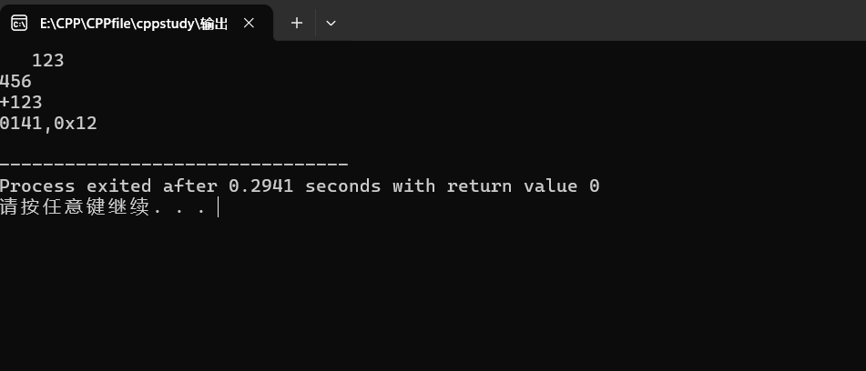

- 0表示空位填0

改一下

```c
#include <stdio.h>
int main(){
	printf("%06d\n",123);//表示右对齐，空位填0 
	printf("%-06d\n",456);//表示左对其，空位填0
	printf("%+0d\n",123); //输出正号
	printf("%#o,%#x\n",97,18);//输出八进制或十六进制数 
	return 0;
}
```

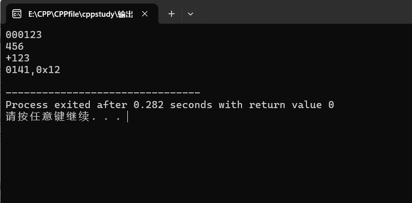

- m.n：m为输出最小宽度，用十进制表示输出的最少位数，例如我们上面的%6d就是输出位数为6，没有的地方用空格补齐。若实际位数大于指定宽度则按实际位数输出，否则补以0或空格。n为精度，精度格式符以`.`开头，后跟十进制整数，如果输出数字则表示小数的位数(末位做四舍五入)，如果输出字符则表示输出字符的个数，若实际位数大于所定精度，则截去多余部分

实操一下

```c
#include <stdio.h>
int main(){
//	printf("%06d\n",123);//表示右对齐，空位填0 
//	printf("%-06d\n",456);//表示左对其，空位填0
//	printf("%+0d\n",123); //输出正号
//	printf("%#o,%#x\n",97,18);//输出八进制或十六进制数
	printf("%2d\n",123);//实际位数大于指定宽度
	printf("%010.2f\n",123.4); //设置精度为2,空位用0补齐 
	return 0;
}
```

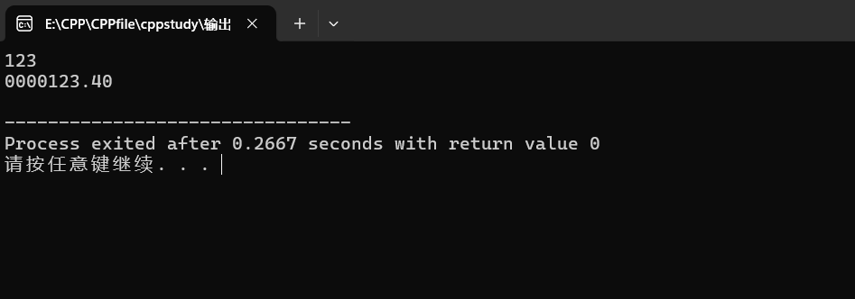

- l或h表示输出长度修正,l表示按长整型或双精度输出
- 格式字符表示输出类型

| 格式字符 |                    含义                    |
| :------: | :----------------------------------------: |
|  d(或i)  | 以十进制形式输出带符号整数(正数不输出符号) |
|    o     |  以八进制形式输出无符号整数(不输出前缀0)   |
|  x(或X)  | 以十六进制形式输出无符号整数(不输出前缀0x) |
|    u     |         以十进制形式输出无符号整数         |
|    f     |         以小数形式输出单双精度实数         |
|  e(或E)  |         以指数形式输出单双精度实数         |
|  g(或G)  |   以%f或%e中较短的输出宽度输出单双浮点数   |
|    c     |                输出单个字符                |
|    s     |                 输出字符串                 |

注意：格式字符应该与我们要输出项的数据类型一致

#### scanf()函数(格式输入函数)

语法

```
scanf(<格式控制字符串>,<变量地址列表>)
```

在scanf中，其格式控制字符串包含以下三类不同的字符

- 输入格式说明符:和输出格式说明符基本相同
- 空白字符:意味着在读取输入的时候会除去输入的空白字符

格式控制字符串要求我们也要将里面的普通字符原样输入例如:

```
scanf("%d,%d",&a,&b);
我们需要输入的格式为:
1,2   其中除去输入格式说明符以外的符号都要原样输入
```

变量地址列表，看到这个很多人会问为什么是取变量的地址而不是变量？这个问题的话就设计到变量的声明和赋值操作了，前面也有讲过怎么处理变量的，应该可以理解

<变量地址列表>要求必须是地址表达式例如&a,&b

- 输入格式说明符

格式

```
% * m l或h 格式字符
```

重复的就不讲了

- `*`表示该输入项读取后不赋予相应的变量，即跳过该输入值

实操

```c
#include <stdio.h>
int main(){
	int a=0;
	scanf("%*d",&a);
	printf("%d",a);
	return 0; 
}
/*
输入2
输出0
*/
```

可以看到这里的a的值并没有变，所以带\*号后输入会被丢弃

- m表示截取输入的宽度(即字符数)

实操

```c
#include <stdio.h>
int main(){
//	int a=0;
//	scanf("%*d",&a);
//	printf("%d",a);
	int a=0,b=0;
	scanf("%2d%*3d%2d",&a,&b);
	printf("%d%d",a,b);
	return 0; 
}
/*
输入1234567
输出1267
*/
```

这里可以看到我们输入的数字前两个12被分给了a，中间345因为\*而被丢弃，最后67被分给了b

> [!IMPORTANT]
>
> 一个很容易忽视的点，就是scanf函数中没有精度控制，例如scanf("%5.2f",&a);是非法的
>
> 在 C 语言中，`scanf()` 函数在读取数据失败时返回 `EOF`

另外我们讲一个比较细的点，就是当scanf函数输入多项数据的时候，系统是如何知道哪些算作一个数据项呢?这就不得不说其工作机制了

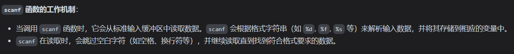

2.根据格式项中指定的域宽度分割出数据项，就比如我们上面的例子

3.我们常用的分隔符都是可以分割数据项的，但是在%c输入字符的时候这些则也被认定为有效字符

那么scanf在执行过程中怎么知道自己该停止了呢?

1.格式参数的格式项用完了就会停止

2.发生格式项与输入域不匹配的时候会出现非正常停止

# C语言程序流程

我们先来了解一下算法

## 算法和结构化程序设计

算法有两大要素：操作和控制结构

> [!IMPORTANT]
>
>  一个算法可以用0或多个输入，但必须有至少一个输出

结构化程序设计的基本思想是采用"自顶向下，逐步求精"的程序设计方法和”单入口单出口“的控制结构

C语句是对程序运行时候计算机所作的工作的描述，可以分成`操作运算语句`和`流程控制语句`

### 操作运算语句

操作运算语句就是我们计算机需要执行的运算操作，例如我们的赋值语句，算术运算等都是属于我们的操作运算语句

操作语句可以分成四种：表达式语句，函数调用语句，复合语句，空语句。

- 表达式语句

执行表达式语句就是计算表达式的值，比如我们的算术表达式，赋值表达式等组成的运算语句

格式

```
表达式;
```

### 关于赋值的额外补充

> [!IMPORTANT]
>
> 重点讲一下这里比较重要的点是关于赋值语句和变量声明的时候赋初始值的区别
>
> 1.给变量赋初始值是变量声明的一部分，变量之间用逗号隔开，而赋值语句以分号结尾
>
> 2.在赋值符号右边的表达式也可以是赋值表达式，例如:变量=(变量=表达式);所以只要满足左边是变量右边是赋值表达式或其他表达式
>
> 3.在变量声明中，不允许连续给多个变量赋初始值，例如int a=b=1;是错误的，而赋值语句中a=b=1;是允许的
>
> 4.赋值表达式和赋值语句是不一样的，有些地方规定是需要写表达式的话写赋值语句是不合法的，例如if(x=a+b;)因为x=a+b;是赋值语句，是不合法的

- 函数调用语句

由函数表达式加一个分号组成

格式

```
函数名(实际参数表)
```

执行函数调用语句就是调用函数体并把实际参数传入到函数定义的形式参数中去，然后执行被调函数体中的语句

- 复合语句

其实就是语句块，用一对花括号括在一起的语句的整体就是复合语句，里面每条语句以分号结尾且花括号外不能加分号

- 空语句

没啥好说的，就是啥都没有，只有一个分号

### 流程控制语句

控制结构是C语言中用于控制程序流程的重要工具，三种基本控制结构**包括顺序结构、选择结构和循环结构**，但是流程控制语句是讲的后两种结构语句

那我们接下来讲一下控制语句

控制语句包括`条件控制语句`和`无条件控制语句`

- 有条件控制语句就包括了选择结构，循环结构
- 无条件控制语句包括break语句,continue语句,return返回语句,goto语句

我们接下来一个个进行讲解

### 顺序结构

顺序结构是`按程序语句书写的先后执行语句序列的操作`，顺序结构中的语句序列形成一个数据块

顺序结构语句主要包括表达式语句，空语句，复合语句和函数调用语句

举个例子，比如我们需要分解一个四位数整数的个位百位千位等各个位数并输出，怎么去通过代码去实现

```c
#include <stdio.h>
int main(){
	int a=0,b=0,c=0,d=0;
	int num=0; 
	printf("please input a integer to us\n");
	scanf("%d",&num);//输入四位数 
	a=num/1000;//千位
	b=num%1000/100;//百位
	c=num%100/10;//十位
	d=num%10;//个位
	printf("About %d,the first num is %d\n",num,a);
	printf("The second num is %d\n",b);
	printf("The third is %d\n",c);
	printf("The fourth num is %d\n",d);
	return 0;
}
```

## 有条件控制语句

### 选择结构

C语言提供了可以进行逻辑判断的若干选择语句，由这些语句可构成程序中的选择结构，通常又被称为”分支结构“。就是我们常见的选择语句和判断语句

选择结构包括条件语句和开关语句

#### if语句

- 不含else的if语句
- 含else的if语句
- 嵌套if语句

##### 不含else的if语句

```
if(表达式)
{
   /* 如果表达式为真将执行的语句 */
}

```

如果布尔表达式为 **true**，则 if 语句内的代码块将被执行。如果布尔表达式为 **false**，则 if 语句结束后的第一组代码（闭括号后）将被执行。

执行过程:

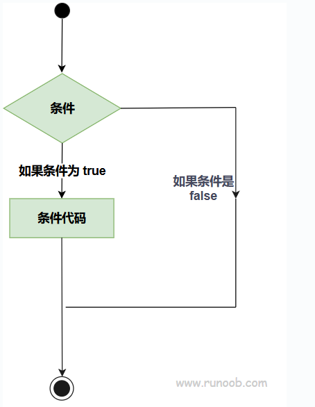

##### 含else 的if语句

```
if(表达式)
{
   /* 如果表达式为真将执行的语句 */
}
else
{
   /* 如果表达式为假将执行的语句 */
}
```

如果布尔表达式为 **true**，则执行 **if** 块内的代码。如果布尔表达式为 **false**，则执行 **else** 块内的代码。

双分支选择结构语句执行过程


这个的话其实和三目运算符`(?:)`差不多

##### if...else if...else 语句

当使用 if...else if...else 语句时，以下几点需要注意：

- 一个 if 后可跟零个或一个 else，else 必须在所有 else if 之后。
- 一个 if 后可跟零个或多个 else if，else if 必须在 else 之前。
- 一旦某个 else if 匹配成功，其他的 else if 或 else 将不会被测试。

语法结构

```
if(布尔表达式 1)
{
   /* 当布尔表达式 1 为真时执行 */
}
else if( 布尔表达式 2)
{
   /* 当布尔表达式 2 为真时执行 */
}
else if( 布尔表达式 3)
{
   /* 当布尔表达式 3 为真时执行 */
}
else 
{
   /* 当上面条件都不为真时执行 */
}

```

##### if语句的嵌套

就是在一个if语句中又包含一个或多个if语句的嵌套

语法

```
if( 布尔表达式 1)
{
   /* 当布尔表达式 1 为真时执行 */
   if(布尔表达式 2)
   {
      /* 当布尔表达式 2 为真时执行 */
   }
}
```

> [!IMPORTANT]
>
> 需要格外注意的就是if和else的配对，在C语言中规定，每个else只和其前面最近的未配对的if配对

组成结构

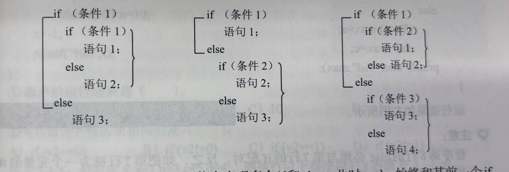

其实正常的if语句都是没有花括号的，但是如果担心自己会弄混淆的话可以在每个if语句后加上一个花括号，另外做一些缩进，这样能避免自己代码审不清楚

我们再把上面的那个例题加入一些if语句

```c
#include <stdio.h>
int main(){
	int a=0,b=0,c=0,d=0;
	int num=0; 
	printf("please input a integer to us\n");
	scanf("%d",&num);//输入四位数 
	a=num/1000;
	b=num%1000/100;
	c=num%100/10;
	d=num%10;
	if(a!=0)
	{
		printf("About %d,the first num is %d\n",num,a);
	}
	if(b!=0){
		printf("The second num is %d\n",b);
	}
	if(c!=0){
		printf("The third is %d\n",c);
	}
	if(d!=0)
	{
		printf("The fourth num is %d\n",d);
	}
	return 0;
}
```

然后也可以用if嵌套

```c
#include <stdio.h>
int main(){
	int a=0,b=0,c=0,d=0;
	int num=0; 
	printf("please input a integer to us\n");
	scanf("%d",&num);//输入四位数 
	a=num/1000;
	b=num%1000/100;
	c=num%100/10;
	d=num%10;
	if(a!=0){
		printf("The number have 4,%d,%d,%d,%d",a,b,c,d);
	}else if(b!=0){
		printf("The number have 3,%d,%d,%d",b,c,d);
	}else if(c!=0){
		printf("The number have 2,%d,%d",c,d);
	}else{
		printf("The number have 1,%d",d);
	}
	return 0;
}
```

#### switch语句

像上面的情况，如果一个程序有多个判断的时候，使用if语句的话会显得很繁琐，降低了代码的可读性和简洁性，这时候我们可以用switch语句

switch语句又被称为"开关语句"，它是一个多分支语句

##### 单层switch

基本格式

```
switch(<表达式>)
{
	case <常量表达式1>:语句1;break;
	case <常量表达式2>:语句2;break;
	/*这里的case语句是不限的，可以自己任意设置*/
	default : 语句n;
}
```

需要说明的几种情况:

- switch只能对常量值进行选择判断，意味着我们的switch表达式中的执行结果必须是整数类型或是能隐式转换成整数类型的表达式
- 每个case标签是唯一的，不能有重复的case语句，且case只起到标签作用，不能作为判断
- case标签的常量表达式可以是常量，也可以是返回常量的表达式，但必须是整形常量包括字符常量。
- default语句是可选的，当没有任何case标签可以匹配上的时候则会执行default语句，如果没有default语句那么就会跳出switch语句
- break语句也是可选的，**如果我们符合匹配的case语句后加了break的话，那么在执行完case语句后就会执行break语句跳出我们的switch语句，否则就会继续往下检索其他的case语句；直到遇到break为止**

我们举个例子

```c
#include <stdio.h>
//通过输入等级输出等级标语
int main(){
	char grade='A';
	printf("输入等级以查看您的评判结果\n");
	scanf("%c",&grade);
	if(grade>=97&&grade<=122){
		grade-=32;
	} 
	printf("您的等级是%c",grade);
	switch(grade){
		case 'A' : printf("大佬大佬\n");break;
		case 'B' : printf("很可以了\n");break;
		case 'C' : printf("不错不错\n");break;
		case 'D' : printf("看得出来努力了\n");break;
		case 'E' : printf("达到抖音人均水平了\n");break;
		default : printf("重修去吧老弟\n");break;
	}
	return 0;
}
```

当然一般考题都会结合break和switch嵌套去进行深入考察，这时候就需要对结构里面的语句进行逐步分析了

##### switch嵌套

*可以在一个* **switch** *语句内使用另一个* **switch** 语句。即使内部和外部 switch 的 case 常量包含共同的值，也没有矛盾。

我们举个例子

```c
#include <stdio.h>
//求a和b的值
int main(){
	int x=1,y=0,a=0,b=0;
	switch(x)
	{
		case 1 : 
		switch(y)
		{
			case 0 : a++;break;
			case 1 : b++;break; 
		}
		case 2: a++;b++;break;
		case 3: a++;b++;
	}
	printf("a=%d,b=%d\n",a,b);
	return 0;
}
//a=2，b=1
```

为什么是这个结果呢？当我们进入外层的switch语句时，会对x的值进行判断，并进入case 1的关于y的switch中，随后进入case 0并执行a++的语句，执行后遇到break跳出关于y的switch，由于外层switch的case 1没有break语句，所以按照我们上面讲的，它会继续向下检索，进入case 2并执行case 2的语句，直到遇到break跳出switch

### 循环结构

循环是由与循环体相关的一个条件表达式来控制的，*循环语句允许我们多次执行一个语句或语句组*

循环结构又可以分成两类

- 先判断循环(while语句和for语句):即进行循环体前先进行条件表达式的计算和判断，如果为真则进入循环且反复执行循环体直到表达式为假
- 后判断循环(do...while语句):先执行一次循环体后再进行条件表达式的计算和判断，如果为真则进入循环且反复执行循环体直到表达式为假

说的简单点就是后判断循环会比先判断循环多执行一次循环体，且是无条件执行

#### while语句

只要给定的条件为真，C 语言中的 **while** 循环语句会重复执行一个目标语句。

语法

```
while(<表达式>){
	循环体语句1
}
```

- 语句1就是循环体，循环体可以是单条语句也可以是复合语句
- 表达式可以是任意的表达式，当为任意非零值时都为 true。当条件为 true 时执行循环。 当条件为 false 时，退出循环，程序流将继续执行紧接着循环的下一条语句。

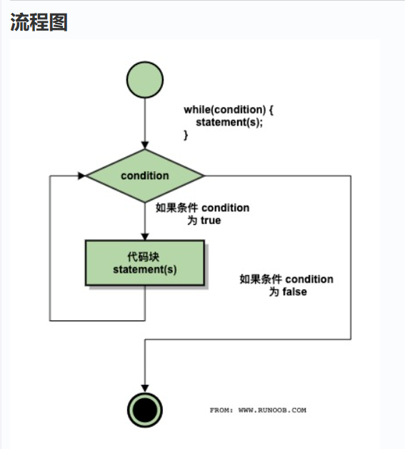

但是需要注意的是while循环语句有可能一次循环都不会执行，也就是当表达式返回值为0的时候，会跳过循环主体进行下一条语句

我们试一下最简单的循环打印结果

```c
#include <stdio.h>
int main(){
	int n=20;
	while(n>0){
		printf("n的值为%d\n",n);
		n--;
	}
	return 0;
} 
```

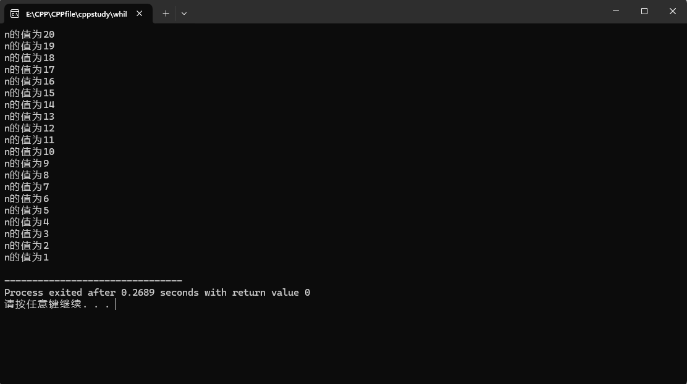

#### do...while语句

其实和while语句差不多，但是do...while语句至少会7执行一次循环体，因为do...while语句把表达式放在循环体后面，这也意味着系统会先执行一次do里面的循环体再进行表达式的判断

语法

```
do{
	循环体语句1
}while(<表达式>);
```

> [!IMPORTANT]
>
> 注意这里的while括号后是需要加分号的

还是一样，我们搓代码

```c
#include <stdio.h>
int main(){
	int n=20;
	do{
		printf("n的值为%d\n",n);
	}while(n=0);
	return 0;
} 
```

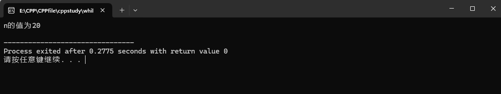

从这里可以看到，里面的表达式的结果是假，但是还是  执行了循环体的语句

#### for语句

for循环不仅可以用于循环次数已经确定的情况，而且也可以用于循环次数不确定而只给出循环结束条件的情况，也就是说for循环可以精准的调控循环的情况

语法

```
for(<表达式1>;<表达式2>;<表达式3>){
	循环体语句
}
```

- 表达式1一般为循环控制变量赋初值，所以又称为初值表达式，但是这是可选的，它不一定就是赋值表达式
- 表达式2用于判定循环条件，故称为条件表达式
- 表达式3一般用于循环变量的增减值，故称为增量表达式或步长值。从语法的角度来说这里可以是任何表达式

执行过程

1. 计算表达式1(注意:这个表达式在循环中只执行一次)
2. 计算表达式2
3. 如果表达式2为真则执行循环体语句
4. 计算表达式3
5. 然后返回表达式2进行判断，由此循环

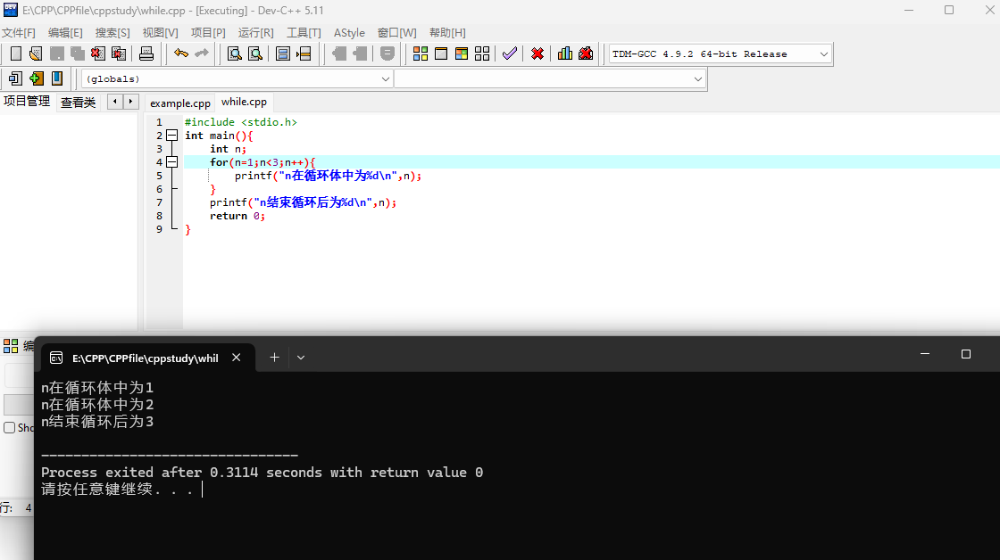     

这里就可以看出来这个for循环的执行过程了

接下来我们讲一下三种表达式省略后的情况

- 当表达式1省略掉后，其后的分号是不能省略的，这时候我们需要在for循环之前给循环变量赋初值

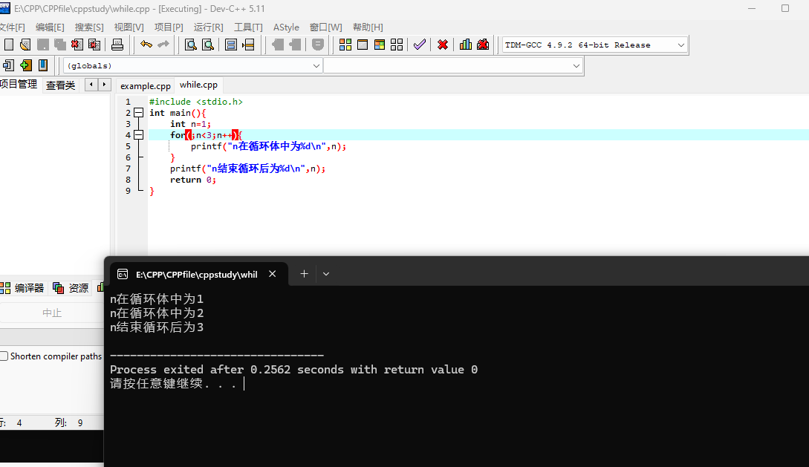

- 如果表达式2省略掉后，循环条件永真，这个循环将无终止进入死循环

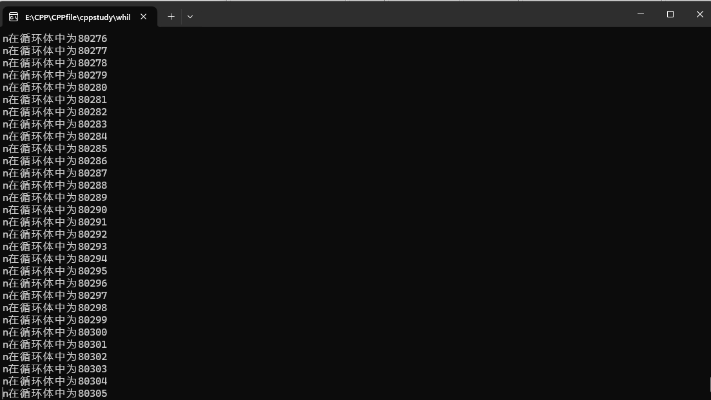

- 如果表达式3省略掉后，循环没有步长值，就会原地踏步异常停止
- 如果表达式只有2存在，这个就等价于while循环

另外我们也可以在这三个表达式中使用逗号进行额外的操作

- 如果在表达式1中使用逗号表达式，则除了执行循环变量的赋初值外还会初始化其他变量

例如

```
for(i=1,j=10;i<10;i++)
```

- 如果在表达式2和表达式3中使用逗号表达式，那么表达式2和表达式3除了完成循环判断条件和循环变量的增减操作，还可以进行其他的数据处理

例如

```
for(i=1,j=10;i<10,x=i+j;i++,j--)
```

这些都是合法的，不过上面的这个例子的表达式2中最后返回的结果是i+j，需要注意逗号运算符的运算

另外我们还要讲几个无条件控制语句

## 无条件控制语句

### break语句

break语句通常用在循环语句和开关语句中，break语句通常用于跳出循环或终止switch语句

> [!NOTE]
>
> 1.只能用在循环语句和switch语句中，如果if语句中出现break，那么一定是if外层还有循环语句或者switch，这时候break跳出的是if语句外层的循环语句或switch语句
>
> 2.如果是在嵌套的循环语句或者switch语句中，那么break跳出的是它所在的内层的语句，这一层之外的外层语句将会继续执行

语法:

```
break;
```

还是一样，我们搓代码

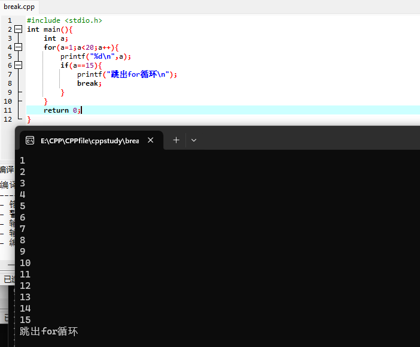

可以看到我们的if语句设定了当a=15的时候就会执行break，所以执行结果就是输出到15的时候就跳出，为了让大家更直观的看到是跳出的for循环，我再稍微改一下

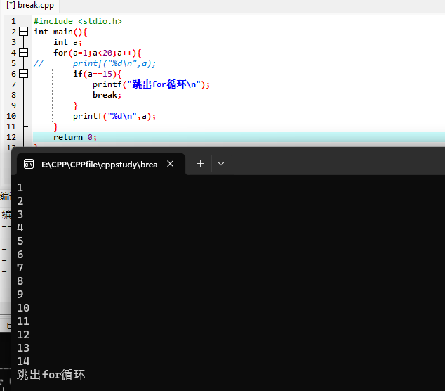

做了一个小小的调整，就能很直观的看到当a等于15的时候满足if语句的条件并执行break跳出for循环，这里可以看到当执行break之后循环体的语句就不会执行了，这取决于break的顺序了

### continue语句

continue意思就是继续，和break不同的是，他只会跳过循环体的本次循环，而不会直接跳出循环语句，意味着程序在碰到continue的时候循环体后面的语句都不会执行，只会跳过当前循环中的代码，强迫开始下一次循环。

continue只能在循环语句中使用，常与if语句结合去使用

语法

```
continue;
```

需要注意的是

- 在while语句中进行continue的时候，流程会直接跳到循环控制条件的布尔表达式重新进行判断执行
- 在for语句中进行continue的时候，流程只是跳过当前循环体语句，而**不会影响当前循环中表达式3的执行**，当执行完表达式3后就会跳到表达式2继续下一次循环

说那么多，实操一下就知道了

在while中使用continue

```c
#include <stdio.h>
int main(){
	int a=0;
	while(a<10){
		if(a==5){
			a++;
			continue;
		}
		printf("a=%d\n",a);
		a++;
	}
	return 0;
}
/*
执行结果:
a=0
a=1
a=2
a=3
a=4
a=6
a=7
a=8
a=9
*/
```

这里跳过了a=5的时候的循环

在for中使用continue

```c
#include <stdio.h>
int main(){
	int a;
	for(a=1;a<10;a++){
		if(a==5){
			continue;
		}
		printf("a=%d\n",a);
	}
	return 0;
}
/*
执行结果:
a=0
a=1
a=2
a=3
a=4
a=6
a=7
a=8
a=9
*/
```

### goto语句

*C 语言中的* **goto** *语句允许把控制无条件转移到同一函数内的被标记的语句。*

语法

```
goto name;
.
..
...
name:
```

建议不要用goto语句，这样会显得代码看起来很杂乱无章

## 问题:换硬币

将一笔零钱换成5分、2分和1分的硬币，要求每种硬币至少有一枚，有几种不同的换法？

- 输入格式:

输入在一行中给出待换的零钱数额x∈(8,100)。

- 输出格式:

要求按5分、2分和1分硬币的数量依次从大到小的顺序，输出各种换法。每行输出一种换法，格式为：“fen5:5分硬币数量, fen2:2分硬币数量, fen1:1分硬币数量, total:硬币总数量”。最后一行输出“count = 换法个数”。

这道题算是对循环方法的一个很经典的题目了，这里就是用传统的双重循环去解题的

思路：

1. 首先我们要知道一个总和公式：`total=fen5 * 5 + fen2 * 2 + fen1 * 1`，我们从每种币得最大值开始递减去组合，比如5分的币，最大值就是总价值`n-2-1/5`,就是5分出现数量最大值，依此类推两分和一分的，然后我们求和运算判断是否等于总价值`n`即可。

贴代码

```c
#include <stdio.h>
int main(){
	/*
	将输入的零钱换成5分、2分和1分的硬币，要求每种硬币至少有一种，有几种不同的换法？ 
	*/
	int five, two, one, money, amount;
	
	//输入零钱数目
	printf("请输入需要计算的零钱\n");
	scanf("%d",&money); 
	
	//嵌套循环 
	for(five = (money - 2 - 1) / 5; five > 0; five--){
		
		for(two = (money - 5 - 1) / 2; two > 0; two--){
			one = money - (five * 5 + two * 2);
			
			if (five * 5 + two *2 + one == money && one > 0){
				amount++;
				printf("五分硬币有 %d 枚,两分硬币有 %d 枚,一分硬币有 %d 枚，总共 %d 枚硬币\n",five,two,one,five+two+one);
			}
		}
	}
	printf("有%d种换法\n",amount);
	return 0;
}
```

# 数组

之前在数据类型中讲到构造类型的数组类型，到这里我们细致的讲解一下这个数组

为什么需要数组呢？什么情况下需要用到数组呢？这是我们需要思考的问题，接下来我们看一个例子

假如我们班上有五十个同学，每个同学的字母序号和年龄都不一样，这时候老师要求我们统计好同学的序号和年龄等信息并把它输出出来。那么我们需要怎么去进行呢？首先，我们需要先统计，把每个同学的序号记下来，把每个同学的年龄也记下来。这时候我们可以把字母序号和年龄分别写在两张纸上，假定序号是字符类型，我们难道需要一个个把同学的序号进行定义赋值吗，`char student1='A',student2='B'...`这样也太麻烦了，数量庞大的时候更是无从下手。这时候我们就需要用到数组去进行存放

## 什么是数组

数组就是一系列具有相同数据类型的相关数据的有序集合，例如班上所有学生的序号，班上所有学生的年龄等等，那我们用统一的名字来标识这个数组，这个标识符就是'数组名'

- 数组元素就是数组中的数据元素，每一个数组元素通过下标不同而区分，在我们定义数组后，内存中会使用一段连续的存储空间去依次存放数组的数组元素

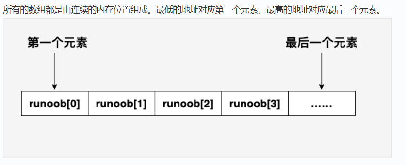

- 数组下标:每一个数组元素对应一个数组下标，数组下标即是数组元素位置的一个索引，下标从0开始递增。
- 数组维数:根据维数可以把数组分成一维数组，二维数组，三维数组和多维数组，其`区别就是不同维数的数组的下标个数不一样`，例如一维数组的下标只有一个，而二维数组的下标有两个

数组的声明并不是声明一个个单独的变量，而是声明一个数组变量，比如name[]，然后使用下标去对数组元素进行逐个赋值

每个下标的数组元素的字节数就是当前数据类型对应的字节数，例如int a[2];那么a[0]和a[1]均占4个字节

## 一维数组

### 一维数组的定义

格式

```
数据类型 数组名[整型常量表达式];
例如 int a[3],b[10];
```

数组大小就是整型常量表达式，必须是整型常量或宏定义的符号常量，这里不能是变量，例如int n=10,a[n];这样是非法的

数组的下标一定是从0开始的，且不能超过整型常量表达式规定的数组元素个数

### 一维数组的初始化

我们可以在定义数组的时候对数组进行初始化，具体的初始化方法有以下几种

- 定义数组并对所有数组元素赋初值

例如int a[5]={1,2,3,4,5};

- 对数组的部分元素进行初始化

例如int a[10]={1,2,3}

此时其余没赋值的元素均为初始值0

- 省略数组大小

例如int a[]={1,2,3,4,5}

这里表示数组的大小为5，但是切记当我们省略数组大小的时候需要对所有元素赋初值，这时候才能省略数组大小

### 一维数组的访问

当我们定义好数组后就可以对数组进行操作了，访问数组只能是对数组元素进行引用而不能是将数组作为整体去引用

语法

```
数组名[访问数组元素下标]
```

当我们对数组元素进行操作的时候，通常可以将数组元素看成是普通变量去对待，这样看着会顺眼很多

- `在引用数组元素的时候，下标可以是整型常量，已赋值的变量和含变量的表达式`

我们接下来试一下

```c
#include <stdio.h>
int main(){
	int a[3],i;
//	int a[]={1,2,3,4,5};//声明和初始化1
//	int a[5]={1,2,3,4,5};//声明和初始化2
//	int a[5]={1,2,3};//声明和初始化3 
	a[0]=1;
	a[1]=2;
	a[2]=3;
	for(i=0;i<3;i++){
		printf("a[%d]的值为%d\n",i,a[i]);
	}
	return 0;
}
```

这里采用了正常的声明和赋值。并把赋值结果输出。我们可以看到一般的一维数组都需要和一重循环进行挂钩使用

## 获取数组的长度

我们可以用sizeof运算符去获取数组的长度

```c
#include <stdio.h>
int main(){
	int a[]={1,2,3,4,5};
	printf("%d",sizeof(a)/sizeof(a[0]));//用所有元素的字节数除去其中一个元素的字节数等于元素长度
	return 0;
} 
```

另外我们要说的是，关于里面元素存储的地址

## 关于数组名

在C语言中，数组名就代表着数组的地址，即数组首元素的地址。当我们声明和定义一个数组的时候，该数组名就对应着这个数组的地址，例如我们举个例子

```
int a[3]={1,2,3};
那么a和&a[0]等价
```

实操一下

```c
#include <stdio.h>

int main() {
    int a[] = {1, 2, 3, 4, 5};
    int *c;  // 指向数组 a 的指针
    int *b;      // 声明指针 b
	c = a;
    b = &a[0];   // 将 b 指向数组 a 的第一个元素

    printf("数组名的地址是：%p\n", (void*)c);  // 使用 %p 输出指针地址
    printf("数组首元素的地址是：%p\n", (void*)b);  // 使用 %p 输出指针地址

    return 0;
}
```

这两个运行后的结果是一样的

> [!IMPORTANT]
>
> 需要注意的是，虽然数组名表示数组的地址，但在大多数情况下，数组名会自动转换为指向数组首元素的指针。这意味着我们可以直接将数组名用于指针运算

这里要讲几个特别重要的排序算法

## 问题:冒泡排序

冒泡排序（Bubble Sort）是一种简单的排序算法，就是通过重复的遍历需要排序的元素，比较相邻的元素并交换他们的位置来实现排序

具体的实现步骤就是

1. **比较相邻元素**：从列表的第一个元素开始，比较相邻的两个元素。
2. **交换位置**：如果前一个元素比后一个元素大，则交换它们的位置。
3. **重复遍历**：对列表中的每一对相邻元素重复上述步骤，直到列表的末尾。这样，最大的元素会被"冒泡"到列表的最后。
4. **缩小范围**：忽略已经排序好的最后一个元素，重复上述步骤，直到整个列表排序完成。

接下来我们写一下代码的实现

```c
#include <stdio.h>
int main(){
	int a[100],i,k,n=0,z;
	for(i=0;i<100;i++){
		printf("请输入想要排序的整数")
		scanf("%d",&a[i]);
		if(a[i]==-1){
			break;//输入-1表示输入完毕退出循环 
		}
		n++;//计入有效元素 
	}
	//冒泡排序 
	for(i=0;i<n-1;i++){
		for(k=0;k<n-1-i;k++){
			if(a[k]>a[k+1]){
				z=a[k];
				a[k]=a[k+1];
				a[k+1]=z;
			}
		}
	}
	//输出排序后的 
	for(i=0;i<n;i++){
		printf("%d\n",a[i]);
	}
}
```

参考菜鸟教程的代码优化一下

```c
#include <stdio.h>
 
// 函数声明
void bubble_sort(int arr[], int len);
 
int main() {
    int arr[] = { 22, 34, 3, 32, 82, 55, 89, 50, 37, 5, 64, 35, 9, 70 };
    int len = sizeof(arr) / sizeof(arr[0]);  // 计算数组长度
 
    bubble_sort(arr, len);  // 调用冒泡排序函数
 
    // 打印排序后的数组
    for (int i = 0; i < len; i++) {
        printf("%d ", arr[i]);
    }
 
    return 0;
}
 
// 冒泡排序函数
void bubble_sort(int arr[], int len) {
    for (int i = 0; i < len - 1; i++) {
        for (int j = 0; j < len - 1 - i; j++) {
            // 交换元素位置
            if (arr[j] > arr[j + 1]) {
                int temp = arr[j];
                arr[j] = arr[j + 1];
                arr[j + 1] = temp;
            }
        }
    }
}
```

这个写法只是在数组中的一个写法，后面学完了还会有更为方便的写法会讲解

## 问题:求Fibonacci数列

Fibonacci数列又称斐波那契数列，又称黄金分割数列，指的是这样一个数列：1、1、2、3、5、8、13、21。

也就是说这个数列的前两项都是1，且从第三项开始的每一项都等于前两项之和

C代码实现过程

```c
#include <stdio.h>
int main(){
	int f[100]={1,1},n,i;
	
	printf("请输入斐波那契数列的长度:\n");
	scanf("%d",&n);
	
	for(i=2;i<n;i++){
		f[i] = f[i-1]+f[i-2];
	}
	
	printf("Fibonacci数列的前%d项就是:\n",n);
	
	for(i=0;i<n;i++){
		printf("%-5d",f[i]);
	}
	return 0;
} 
```

 继续看数组的知识点

## 二维数组

数组的下标有两个的数组就是二维数组，我们可以直接看成是行列构成的矩阵行列式，其中第一维下标就是表示行，第二维下标就是表示列，下标是从`[0][0]`开始的

### 二维数组的定义

格式

```
数据类型 数组名[整型常量表达式1][整型常量表达式2]
例如 int a[3][4]
```

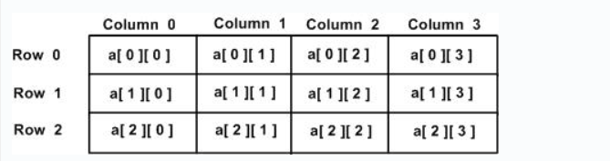

- 二维数组两个下标之积就是二维数组的数据元素的个数
- 一个二维数组可以看成若干个一维数组，即每行都可以是一个一维数组

### 二维数组的初始化

在定义二维数组的同时，我们同样可以对二维数组进行初始化操作，具体的方法如下:

- 如果是所有元素赋值

1. 按行给二维数组的元素赋值

例如 `int a[2][4]={{1,2,3,4},{5,6,7,8}};`

1. 不按行给二维数组的元素赋值

例如`int a[2][4]={1,2,3,4,5,6,7,8};`这里的语句其实和上面是一样的

1. 如果对所有元素赋初值，那么我们第一维的长度是可以省略的，第一维的长度会根据第二维的长度自动计算确定

例如`int a[][4]={1,2,3,4,5,6,7,8}或int a[][4]={{1,2,3,4},{5,6,7,8}}`

- 如果是对部分元素赋初值

1. 按行对二维数组的元素赋值

例如`int a[3][4]={{1,2},{4},{7}}`这里的话`a[0][0]=1,a[0][1]=2,a[1][0]=4,a[2][0]=7`其他的均为0

1. 不按行对二维数组的元素赋值

例如`int a[2][4]={1,2,3,4}`这里的话`a[0][0]=1,a[0][1]=2,a[0][2]=3,a[0][3]=4`，其他的均为0

1. 按行对二维数组部分元素赋值，也可以省略第一维的长度

例如`int a[][4]={{1,2},{3},{5}}`可以根据括号去判断出第一维的长度为3，同时其他的均为0

### 二维数组的访问

和一维数组一样，这里就不赘述了

```
数组名[下标1][下标2]
```

现在我们也讲一下关于二维数组的一些经典的题目

## 问题:打印杨辉三角

首先我们先了解一下杨辉三角的特征

- 最左边列和对角线上的数全为1
- 第i行第j列的元素等于第i-1行第j列和第i-1行第j-1列两个元素的和

具体就是以下

```
1
1 1
1 2 1
1 3 3 1
1 4 6 4 1
1 5 10 10 5 1
1 6 15 20 15 6 1
1 7 21 35 35 21 7 1
```

具体怎么通过代码去实现呢？

```c
#include <stdio.h>
int main(){
	//杨辉三角前n行
	int a[100][100];
	int i,j,n;
	printf("请输入你想求的杨辉三角的行数\n");
    
    
	scanf("%d",&n);//输入想得到的杨辉三角的前n行 
    
	for(i=0;i<n;i++){
		for(j=0;j<=i;j++){
			if(j==0||i==j){
				a[i][j]=1;
			}else{
				a[i][j]=a[i-1][j]+a[i-1][j-1];
			}
		}
	}
    
    
	for(i=0;i<n;i++){
		for(j=0;j<=i;j++){
			printf("%3d",a[i][j]);
		}
		putchar('\n');
	} 
	return 0;
}
```

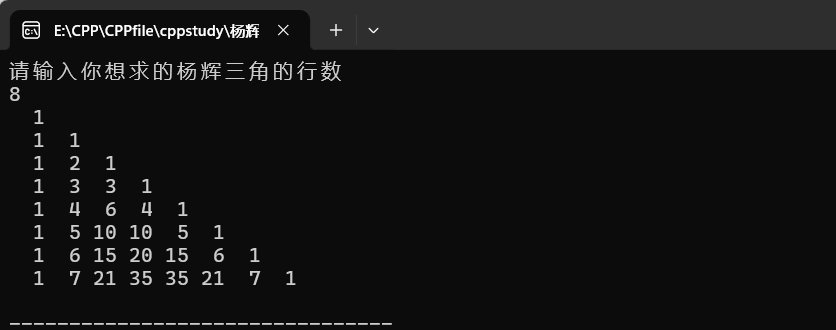

可以看到这里使用二维数组的时候都是结合二重for循环去使用的

## 多维数组

和前面的没区别，就不再赘述了

当数组元素的下标的个数为2个或2个以上的时候，这类数组就是多维数组，我们的二维数组也是多维数组

多维数组的定义格式

```
数据类型 数组名[整型常量表达式1][整型常量表达式2][整型常量表达式3][整型常量表达式4]...[整型常量表达式n]
```

## 字符数组

之前我们有讲过字符串常量，字符串就是用双引号括起来的若干个有效字符的序列，字符串可以包含字母数字和转义字符等类型，那我们这时候就来看一下怎么用字符数组去定义一个字符串常量

### 字符数组的定义

之前有说过，在C语言中，系统会自动的在我们的字符串的最后加上一个空字符结尾字符`'\0'`，那么这个字符也是需要占据一个字节空间的，所以我们在定义字符数组的时候长度上要有所改变，把空白字符算进去

语法

```
char 数组名字[整型常量表达式];//一维字符数组
char 数组名字[整型常量表达式1][整型常量表达式2]//二维字符数组
例如我们的字符串''china'
char c[6]={'c','h','i','n','a','\0'}
长度要比字符串的长度多一
```

字符数组中的每个元素均占一个字节，且以ASCII码的形式存放

> [!IMPORTANT]
>
> 关于数字字符和对应整数之间的转换
>
> 1. 数字字符到整数的转换:**使用字符的ASCII值**，可以将字符减去字符`'0'`的ASCII值来获得对应数字。例如`'数字'-'0'=数字`
> 2. 整数到数字字符的转换:**使用字符的ASCII值**，可以将整数加上字符 `'0'` 的ASCII值来获得对应字符。例如`数字+'0'=字符`

### 字符数组的初始化

具体的初始化方法

- 以字符常量的形式对字符数组初始化，例如`chr[3]={'y','o','u'};`

- 以字符串常量的形式对字符数组进行初始化，例如`str[7]={"string"};`

> [!IMPORTANT]
>
> 需要注意的是，在以字符串的形式初始化字符数组的时候，系统会自动在字符串的结尾加入结束符`'\0'`，而以字符常量初始化的时候需要我们手动在结尾加上结束符，例如`chr[]={'s','t','r','i','n','g','\0'};`这时候字符数组的长度也为7

- 省略数组大小的初始化，当我们完整的给出所有元素值，则可以省略数组大小，例如:`char s1[]={'s','t','r','i','n','g'};`字符数组长度为6，因为系统没加上结束符，这也是为什么我们在以字符常量初始化的时候为什么要手动加上结束符，这样可以区分这是多个字符还是字符串
- 二维字符数组初始化可以省略第一维的长度大小，例如`char a[][5]={"s","t","r"};`

### 字符数组的输入和输出

- 逐个字符的输入和输出(`%c`)

格式

```
scanf("%c",&字符数组元素);
printf("%c",字符数组元素);
```

需要注意的是，在输入字符的时候，空格，回车都会保存进字符数组作为普通字符对待，所以需要格外注意字符数组的长度

在对逐个字符进行输入结束后，系统不会自动在字符数组末尾加`\0`，所以在输出的时候建议使用逐个字符输出，且字符输出的循环控制次数要由用户去控制

试着写一下

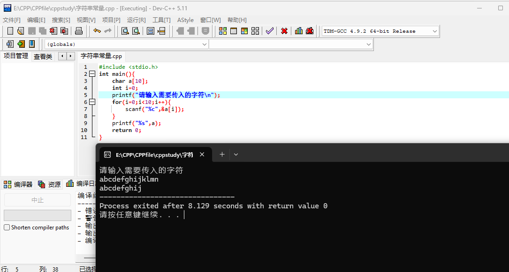

这里可以看到在我们输入了多个字符后最后，最终读入的只有在数组长度内的字符，且没有结束符`\0`

- 字符串的输入和输出(`%s`)

格式

```
scanf("%s",&字符数组名字);
printf("%s",字符数组名字);
```

这里需要注意的是，在输入字符串的时候，当遇到`空格`，`回车`，`tab`等字符就会结束输入，如果需要输入含有空格的字符串，我们可以用gets()函数

在输入整个字符串后，系统会自动在字符数组末尾加上`\0`结束符，当输出字符串时，字符串的结束由`\0`控制，这个前面也讲过

实操一下

```c
#include <stdio.h>
int main(){
	char a[]="wanth3f1ag";
	int length=0;
	length=sizeof(a)/sizeof(a[1]);
	printf("字符数组的长度是%d\n",length);
	printf("%s",a);
	return 0;
}
/*
字符数组的长度是11
wanth3f1ag
*/
```

另外我们不能采用赋值语句将一个字符串之间赋值给数组

## 字符串输入输出函数

### gets()函数

调用格式::

```
gets(str);
```

从键盘中输入一个字符串，且该字符串可以包含空格，直到遇到回车时会终止，并将字符串存放在由str指定的字符数组中

参数str:str为存放字符串的字符数组的首地址，也就是我们的字符数组名

也是试着写一下

```c
#include <stdio.h>
int main(){
	char a[10];
	printf("请输入字符串\n"); 
	gets(a); 
	printf("%s",a);
	return 0;
}
```

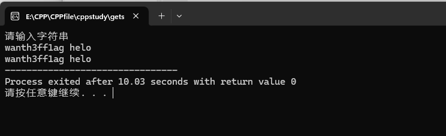

但是gets()函数不会限制输入的字符串的长度，这会导致缓冲区溢出

### 扩展:缓冲区溢出

(如果用户输入的字符数超过 `a` 数组的大小（在此例中为 10），`gets()` 函数会继续将字符写入数组之外的内存区域。这种行为称为缓冲区溢出，超出数组边界的字符覆盖了程序的其他内存内容，可能导致数据损坏或程序逻辑错误。)

由于 `gets()` 函数存在上述问题，C 标准库在 C11 标准中已被弃用。推荐使用 `fgets()` 函数

### fgets()函数

语法

```
char *fgets(char *str, int num, FILE *stream);
```

参数讲解

- `char *str`：指向存储读取字符串的字符数组（缓冲区）。
- `int num`：要读取的最大字符数（包括终止字符 `\0`）。
- `FILE *stream`：输入流，一般使用 `stdin` 表示标准输入。

所以我们上面的例子可以改成

```c
#include <stdio.h>
int main(){
	char a[10];
	printf("请输入字符串\n"); 
	fgets(a,sizeof(a),stdin); 
	printf("%s",a);
	return 0;
}
```

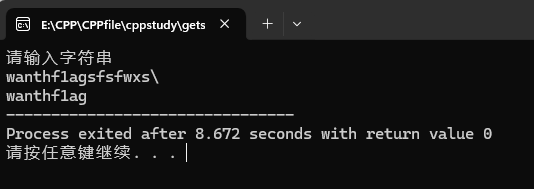

`fgets()` 会把换行符 `\n` 包含在读取的字符串中，如果需要去掉换行符，可以手动处理，例如

```
a[strcspn(buffer, "\n")] = '\0'; // 去掉换行符
```

- `fgets()` 在达到指定字符数之前也会在遇到 EOF 时停止读取，但如果在读取的字符中遇到换行符，它会立即停止并将换行符也包含在返回的字符串中。

### puts()函数

调用格式:

```c
puts(str);
```

从str指定的地址开始，依次将存储单元中的字符串输出到终端显示器，直到遇到字符串结束符为止

- puts在打印字符串结束后会自动换行，因为他会自动把结束符换成换行符

试一下

```c
#include <stdio.h>
int main(){
	char a[10];
	printf("请输入字符串\n"); 
	fgets(a,sizeof(a),stdin); 
	puts(a);
	return 0;
}/*请输入字符串
sfwfsaf\0dwdasda
sfwfsaf\0
*/
```

注意这里如果我们主动输入结束符的话，结束符是会被当成正常字符去处理的

接下来我们讲几个字符串处理函数

## 字符串处理函数

在使用字符串处理函数的时候需要包含string.h头文件

| 序号 | 函数 & 目的                                                  |
| :--- | :----------------------------------------------------------- |
| 1    | **strcpy(s1, s2);** 复制字符串 s2 到字符串 s1。              |
| 2    | **strcat(s1, s2);** 连接字符串 s2 到字符串 s1 的末尾。       |
| 3    | **strlen(s1);** 返回字符串 s1 的长度。                       |
| 4    | **strcmp(s1, s2);** 如果 s1 和 s2 是相同的，则返回 0；如果 s1<s2 则返回小于 0；如果 s1>s2 则返回大于 0。 |
| 5    | **strchr(s1, ch);** 返回一个指针，指向字符串 s1 中字符 ch 的第一次出现的位置。 |
| 6    | **strstr(s1, s2);** 返回一个指针，指向字符串 s1 中字符串 s2 的第一次出现的位置。 |

### strlen(str1)长度函数

功能:统计str为起始地址的字符数组或字符串常量的实际长度(其中包括转义字符但不包括串结束符`\0`),返回值为其长度

函数只返回第一个结束符之前的字符串长度，例如`strlen("abc\0abc\0a"))`的返回值是3，但是如果遇到八进制转义字符例如`\012`的话就会按八进制转义字符去算。

举个例子

```c
#include <stdio.h>
#include <string.h>
int main(){
	char str1[]="abc\0bc\0c";
	char str2[]="abc\012\\\n";
	printf("str1的字符串长度为%d\n",strlen(str1));
	printf("str2的字符串长度为%d\n",strlen(str2));
	return 0;
}
/*
str1的字符串长度为3
str2的字符串长度为6
*/
```

### strcat(s1, s2)连接函数

功能:将str2为首地址的字符串连接到str1串的后面，且从str1串的`\0`所在位置起开始连接，这意味着如果结尾符在中间的话，str2会拼接在结尾符后面并自动覆盖结尾符和之后的字符串

参数str1必须是字符数组名，参数str2既可以为字符数组名，指向字符数组的指针，也可以是字符串常量

需要注意的是，str串的字符数组必须有足够的空间可以连接str2字符串，否则会导致超界现象

举个例子

```c
#include <stdio.h>
#include <string.h>
int main(){
	char str1[100]="abc\0bc";
	char str2[]="wan";
	printf("%s",strcat(str1,str2));
	return 0;
}
/*
abcwan
*/
```

### strcpy(s1, s2)复制函数

功能:将str2为首地址的字符串复制到str1为首地址的字符数组中

注意:str1必须定义为字符数组或字符指针变量，且必须留有足够的空间，参数str2既可以为字符数组名，指向字符数组的指针，也可以是字符串常量

举个例子

```c
#include <stdio.h>
#include <string.h>
int main(){
	char str1[100]="abcbc";
	char str2[]="wan";
	strcpy(str1,str2);
	printf("%s",str1);
	return 0;
}
/*
wan
*/
```

复制之后的结果是`wan\0c\0`，但是用printf函数进行输出的时候碰到结束符会结束输出，所以此时的输出结果就是wan

### strcmp(str1,str2)比较函数

将两个字符串str1和str2进行比较

- 如果str1串和str2串相等，则返回值为0
- 如果str1串大于str2串，则返回值>0
- 如果str1串小于str2串，则返回值<0

他们之间比较的规则就是，拿这两个str串上对应位置的字符的ASCII值进行比较，当遇到不相同的字符或者遇到结束符后结束

这两个字符串既可以为字符数组名，指向字符数组的指针，也可以是字符串常量

```c
#include <stdio.h>
#include <string.h>
int main(){
	char str1[]="wanth3f1ag";
	char str2[]="wanth3f1ag";
	
	printf("%d",strcmp(str1,str2));
	return 0;
}
```

一般两个字符串直接不能直接进行比较，都需要用到这个函数去进行比较

### strlwr(str)转小写函数

将字符串中的大写字母转成小写字母

### strupr(str)转大写函数

将字符串中的小写字母转成大写字母

讲完了字符数组和字符串的知识，接下来我们放几道比较经典的题目

## 题目:删除指定字符

要求从指定字符串中删除指定字符

```c
#include <stdio.h>
#include <string.h>

/*要求从指定字符串中删除指定字符*/

void removeChar(char *str, char ch) {
    int i, j = 0;
    
    for (i = 0; i < strlen(str)-1; i++) {
        if (str[i] != ch) { // 如果当前字符不是指定字符
            str[j++] = str[i]; // 复制到新位置
        }
    }
    str[j] = '\0'; // 添加字符串结束符
}
int main(){
	char str[100],n;
	
	printf("请输入指定字符串:\n");
	fgets(str,sizeof(str),stdin);
	
	printf("您要处理的字符串是:%s\n",str);
	
	printf("请输入要删除的字符:\n");
	scanf("%c",&n);
	
	removeChar(str,n);
	printf("删除后的字符串是:%s",str);
	return 0;
}
```

然后还有几个我认为很好用的字符串函数

### strstr()查询字符串函数

C 库函数 **char \*strstr(const char \*haystack, const char \*needle)** 在字符串 **haystack** 中查找第一次出现字符串 **needle** 的位置，不包含终止符 **\0**。

基础语法

```
strstr(str1,str2)//在str1中寻找第一次出现字符串str2的位置并返回该位置的指针
```

# C语言函数

我们需要明确的一个思想就是，在解决一个复杂的问题的时候，我们需要把复杂的问题逐步分解为简单问题，然后将各类简单问题逐个解决，这是面向过程的思想，在面向过程的思想里我们可以知道，面向过程的思想主要运用的就是函数，而函数是C程序的基本组成单位

例如我们需要设计图书管理系统，单看这个系统是很复杂且难以实现的，那么我们将图书管理系统的逐个细分为多个板块，每个板块处理一个功能，例如图书查询，图书借阅，用户管理等等，然后这些功能的实现如果还是过于复杂的话，我们还可以进一步细分，直到能轻松的编写出模块的代码，这里的模块就是我们的函数，每个函数实现特定的功能，最后将这些函数整合起来，统一调试和运行，就形成了一个完整的程序

C语言程序的全部功能都是由函数去是实现的，每个函数相对独立且具有特定的功能，最终通过函数间的调用去实现完整的功能

先写一个简单的函数声明和调用的例子

```c
return_type function_name(parameter list)
{
	body of the function
}//函数声明
int main(){
	function_name(parameter list);//函数的调用
}
```

先具体说说main函数

## main函数

- 一个C源程序只能包含一个main函数，他是所有程序的起点，主程序都从main函数开始，在main函数结束
- 在main函数中可以调用其他的函数，但是在其他函数中不能调用main函数。通常调用其他函数的函数称为主调函数例如main函数，被调用的函数称为被调函数
- main函数可以在程序中的任意位置，这不影响主程序从main函数开始

## 函数的分类

不管怎么样，所有的函数都是平等的，且是**互相独立**的，即不能嵌套定义，函数可以单独编译但是不能单独运行

- 从使用的角度来说我们可以把函数分成`标准函数`和`用户自定义函数`，标准函数也称`库函数或系统函数`，是指由系统预先定义好的，系统提供的函数例如printf输出函数和scanf输入函数，用户自定义函数就是用户在编写程序的时候为了实现某个特定功能而自主定义的函数
- 从有无参数来说可以分成无参函数和有参函数
- 从作用范围来说可以分成外部函数和内部函数，外部函数是指能可以被任意源程序文件中的函数所调用的函数，内部函数是指只能在函数所在的源程序文件中的函数所调用的函数
- 从返回值来看可以分为有返回值函数和无返回值函数

感觉这些都是概念问题，但是为了打好基础，这些还是有必要写出来的

## 函数的定义

函数也是需要先定义后调用的，接下来我们具体说一下函数定义的格式

```c
//无参数函数的定义
函数返回值类型 函数名()//函数头
{
	[变量声明]
    [语句执行]
    return 表达式;//可选，根据有无设置返回值类型来定
}//函数声明
//有参数函数的定义
函数返回值类型 函数名(形式参数数据类型，形式参数名1,形式参数数据类型，形式参数名2...)//函数头
{
	[变量声明]
    [语句执行]
    return 表达式;//可选，根据有无设置返回值类型来定
}
```

- **函数返回值类型：**一个函数可以返回一个值。 是函数返回的值的数据类型。有些函数执行所需的操作而不返回值，在这种情况下，函数返回值类型是关键字 **void**。如果我们省略不写的话这里默认就是int类型
- **函数名：**这是函数的实际名称。函数名和参数列表一起构成了函数签名。
- **形式参数：**形式参数就像是占位符。当函数被调用时，向参数传递一个值，这个值被称为实际参数。形式参数包括函数参数的类型、顺序、数量。参数是可选的，也就是说，函数可能不包含参数。
- **函数体：**函数主体包含一组定义函数执行任务的语句和变量。
- **return：**根据前面设置的函数返回值类型来定，是可选的，如果类型是void的话意味着不需要返回值，那么就不需要写return语句，但是**这里的return 表达式类型需要和函数返回值类型一致**，如果没有一致的话系统会根据函数返回值类型去对return 语句中的表达式值进行转换,另外，`当函数中有多个return语句时，只会有一个return语句被执行`

接下来我们简单的声明一个比大小的函数

```c
#include <stdio.h>
int max(int x , int y)//两个形式参数
{
    int maxnum;//函数体内变量定义
    if(x>y){
        maxnum = x;
    }else{
        maxnum = y;
    }//语句执行过程
    return (maxnum);
}//声明一个比大小的函数
//因为这里需要返回大的数所以设置返回类型为int且用return去返回maxnum
```

## 函数的调用

当函数定义完后，我们就要学会去调用函数了，这样才能实现函数的功能

当我们程序按顺序执行的时候，碰到函数调用后就会跳到被调用的函数中去，当函数的返回语句被执行时，或到达函数的结束括号时，会把程序控制权交还给主程序。

函数调用的方法

```
函数名(实际参数列表);//有参数调用
函数名();//无参数调用
```

### 形式参数和实际参数

- 形式参数：函数定义时候设定的参数

形式参数就是我们在定义有参数函数的时候设定的传入函数的参数，在设定形式参数的时候需要写明每个参数对应的数据类型

- 实际参数：调用函数时候使用的实际参数

实际参数就是我们在调用有参函数的时候实际传入函数的参数

需要注意以下几点：

- 实参和形参要一一对应，不论是`参数个数还是参数数据类型都要一一对应`，例如定义void max(double x , int y)的函数，我们就不能传入int a和int b ，只能是double a ，int b；
- 形参只能是变量，而实参可以是变量常量，函数和表达式等
- 在内存分配上，形参定义的时候是不会分配内存的，`只是在调用参数的时候传入实参的时候形参才会临时分配内存`，不过在函数调用结束后形参的内存就会自动释放

### 函数调用的方法

- 直接以语句的方式进行函数调用例如`max(x,y);`的形式
- 以表达式的形式让调用函数的返回值参与运算，才是被调函数必须有一个返回值
- 以函数的参数形式进行调用，例如`func(func(x))`让内层函数的返回值作为外层函数的实参，此时内层函数必须有一个返回值

## 函数的声明

函数的使用遵循先定义后使用，如果我们在定义之前就调用函数，此时必须进行函数声明

当被调函数的定义放在主调函数之后，且函数值的类型不是整数时，则应在对应函数调用语句之前对被调函数进行声明

函数声明的格式

```
函数返回值类型 函数名(数据类型1,数据类型2...);
或
函数返回值类型 函数名(数据类型1 形参名1,数据类型2 形参名2...);
```

在函数声明中，参数的名称并不重要，只有参数的类型是必需的

当我们在一个源文件中定义函数且在另一个文件中调用函数时，函数声明是必需的。在这种情况下，我们应该在调用函数的文件顶部声明函数。

举个例子

```c
#include <stdio.h>
int max(int x , int y);
//比大小程序 
int main(){
	int a=0,b=0,m=0;
	
	printf("请输入两个数并进行比大小\n");
	
	scanf("%d%d",&a,&b);
	
	m=max(a,b);
	
	printf("%d",m); 
	
	return 0;
}
int max(int x , int y)//两个形式参数
{
    int maxnum=0;//函数体内变量定义
    if(x>y){
        maxnum = x;
    }else{
        maxnum = y;
    }//语句执行过程
    return (maxnum);
}//声明一个比大小的函数
//因为这里需要返回大的数所以设置返回类型为int且用return去返回maxnum
```

这里函数调用写在函数定义前，并且我没用对函数进行声明，那么这时候这段代码就是错误的，会产生报错

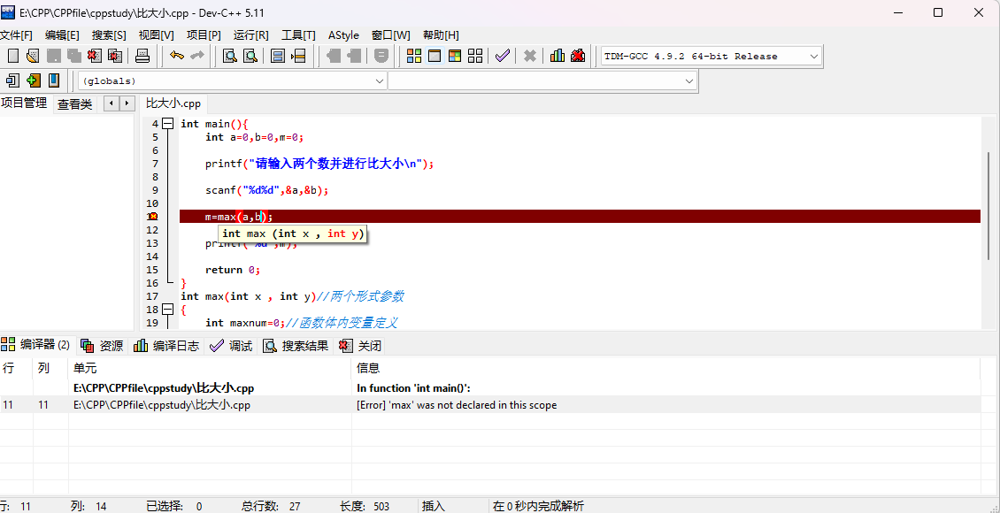

所以需要在调用函数中对应函数调用语句前声明函数

## 函数的参数传递方法

### 值传递方式

是指将实参的值单向传递给形参的传值调用方法

传参过程

在采用值传递的方式进行传参的时候，系统会将实参的值复制到形参相应的存储单元中(意味着在调用的时候只是形参在参与变化)，实参的内存单元空间和形参是不一样的且分配空间的时刻是不一样的。因此形参的变化不会影响实参的变化

### 地址传递方式

是指将实参的地址传递给形参，形参为指向实参地址的指针。这里强调实参一定是一个地址，例如数组名，指针

传参过程

在采用地址传递方式的时候，形参通常是数组或指针，此时把实参的地址传给形参，虽然函数调用的时候形参被临时分配了内存空间，但是形参操作的是实参的地址，意味着是对实参的内容进行调控，对形参的实际操作就是对实参的实际操作，所以形参的改变必然会引起实参的改变

举个例子

```c
#include <stdio.h>
//冒泡排序
//冒泡排序函数定义
void func(int a[],int n){
	int i,j,max=0;
	for(i=0;i<n-1;i++){
		for(j=0;j<n-i-1;j++){
			if(a[j]>a[j+1]){
				max=a[j];
				a[j]=a[j+1];
				a[j+1]=max;
			}
		}
	}
} 
int main(){
	int a[100],i,n=0;
	printf("请输入需要排序的整数:\n");
	for(i=0;i<100;i++){
		scanf("%d",&a[i]);
		if(a[i]==-1){
			break;//输入-1停止输入 
		}
		n++; 
	}
	func(a,n);
	printf("排序后的结果是:\n");
	for(i=0;i<n;i++){
		printf("%-4d",a[i]);
	}
	return 0;
}
```

这里可以看到当函数调用后我们的数组的顺序发生了改变，这就意味着地址传递确实可以对实参产生影响

## 函数的嵌套调用和递归调用

- 函数的嵌套调用

上面说过，C语言中的函数是不允许嵌套定义的，但是C语言运行函数之间的嵌套调用

函数的嵌套调用简单来说就是因为函数既可以被其他函数调用，也可以调用其他函数（main函数除外）

执行过程：

```
main主函数->fun1函数->fun2函数->fun1函数->main主函数
```

实操一下

```c
//最大公约数 (GCD) 是能同时整除多个整数的最大整数。
//最小公倍数 (LCM) 是能被多个整数整除的最小整数。
#include <stdio.h>
//求最小公倍数 
int fun2(int u,int v); 
int fun1(int n,int m){
	int lcm=0;
	lcm = n * m / fun2(n,m);
	return (lcm);
}
int fun2(int u,int v){//求最大公约数 
	int t=0,r=0;
	if(v>u){
		t = u;
		u = v;
		v = t;
	}
	while((r=u%v)!=0){
		u = v;
		v = r;
	}
    return (v);
}
int main(){
	int num1=0,num2=0,lcm=0;
	
	printf("请输入两个整数:\n");
	
	scanf("%d%d",&num1,&num2);
	lcm = fun1(num1,num2);
	printf("lcm = %d",lcm);
	return 0;
}
```

- 函数的递归调用

说白了就是嵌套调用中的一个特例，就是自己调用自己，但是这个递归调用是无止境的，因此需要在递归调用的时候使用结构语句设置调用的终止条件，否则会进入死循环

格式

```c
void recursion()
{
   statements;
   ... ... ...
   recursion(); /* 函数调用自身 */
   ... ... ...
}
 
int main()
{
   recursion();
}
```

递归调用分为两种：1.一个是直接自己调用自己，例如`fun1->fun1`；2.一个是通过别的函数间接的调用自己，例如`fun1->fun2->fun1`

接下来我们讲几个使用递归函数解决的算法问题

## 问题:数的阶乘

```c
#include <stdio.h>
//求某个数的阶乘x!
int fun1(int x);
int main(){
	int num=0;
	printf("请输入想要求的阶乘的数:\n");
	
	scanf("%d",&num);
	
	printf("%d的阶乘是%d",num,fun1(num));
	return 0;
}
int fun1(int x){
	if(x<=1){
		return 1;
	}else {
		return x * fun1(x-1);
	}
}
```

## 问题:Fibonacci数列plus

```c
#include <stdio.h>
int Fibonacci(int x);
int main(){
	int num=0;
	printf("请输入要求的斐波那契数列的长度:\n");
	
	scanf("%d",&num);
	
	for(int i=0;i<num;i++){
		printf("%-3d",Fibonacci(i));
	}
	
	return 0;
}
int Fibonacci(int x){
	if(x==0){
		return 1;
		
	}else if(x==1){
		
		return 1;
		
	}else {
		return Fibonacci(x-1)+Fibonacci(x-2);
	}
	
} 
```

另外需要扩展两个函数的知识点

## 内部函数和外部函数

内部函数就是使用static去说明，使这个函数只能作用于此源文件，不能被其他源程序的函数所调用

格式

```
static 函数类型说明符 函数名(形式参数列表)
```

外部函数跟内部函数相反，用extern去声明函数，使得函数可以在其他源程序的函数中被调用，跟全局变量的存储声明是一样的

# C语言指针

在前面讲变量的时候我们就涉及到了内存的操作，那么我们先来逐步进入指针的讲解

## 内存地址

在C语言中变量其实就是代表了内存中对应的存储单元，如果我们定义了变量，那么系统就会根据变量类型为变量开辟存储的空间，既然这样，那我们该如何去访问这些存储单元呢？其实这些存储单元都会有一个编号，就像我们在一家酒店里有很多个房间，每个房间都会有一个房间号，这个房间号就是所谓的内存地址

内存中每个存储单元都会有一个对应的存储地址，而每个变量在编译的时候都会在内存中分配连续的一定字节数的存储单元，根据前面学到的，不同数据类型的变量的字节数是不一样的，所以其分配的存储单元大小也是不一样的。其中**变量所分配到的存储单元的第一个字节的地址就是我们的内存地址**

例如我们定义一个整型变量a，在程序执行的时候就会在内存中分配4个字节给a，比如3001-3004，然后当我们赋值之后，变量的值就会存入这个4个字节 的存储空间。

那我们怎么去查看变量的地址呢？这就涉及到一个取地址符&了，就拿上面的a来说，&a的输出结果就是3001，也就对应着这个变量存储空间的第一个字节的地址

## 什么是指针？

指针其实就是内存地址，存放内存地址的这种特殊变量就是指针变量，简称”指针“。

指针也是会占有一定存储空间的，只不过其值是地址，可能是某个变量的地址，也可能是某个数组的首地址

举个菜鸟教程的例子

```c
#include <stdio.h>
 
int main ()
{
    int var_runoob = 10;
    int *p;              // 定义指针变量
    p = &var_runoob;
 
   printf("var_runoob 变量的地址： %p\n", p);
   return 0;
}
```


这个图可以很清晰的看出来指针和变量的关系，个人感觉这个图还是不错的

## 指针的定义

格式

```
类型标识符 *指针变量名列表
例如int *a,*b;
```

解释一下，这里的`*`号表示的是指针变量存放的是地址，这是一种特殊的变量

另外，在定义指针变量的时候必须说明指针变量的数据类型，且一个指针变量对应只能指向同一种数据类型的变量的地址，因为不同数据类型的数据在内存中的字节数不同

## 指针的引用

引用指针之前我们必须学会这两个跟指针有关的字符`&`和`*`

- 取地址运算符&

顾名思义就是取变量的地址，是单目运算符，结合性从左到右

- 指针运算符*

又被称为"取内容运算符"，通过这个运算符可以取指针变量所指向的存储区存放的值，是单目运算符，结合性从右到左

例如

```c
#include <stdio.h>
int main(){
	int a = 10, *p;
	p = &a;
	printf("a的首地址是: %x\n",p);
	printf("a的首地址是: %x\n",&a);
	printf("a的值是: %d\n",a);
	printf("a的值是: %d\n",*p);
	return 0;
}
/*
a的首地址是: 000000000062FE44
a的首地址是: 000000000062FE44
a的值是: 10
a的值是: 10
*/
```

讲几个等价关系

```
p等价于&a等价于&(*p)
a等价于10等价于*p等价于*(&a)
```

需要注意的是:

1. 在定义指针的时候\*号代表的是该变量为指针变量，而在引用指针的时候\*则是代表取该指针指向变量的值
2. 在引用指针之前一定要初始化赋值
3. 不能将普通类型数据直接赋值给指针变量（除了0之外）
4. 指针变量赋值的时候类型一定要匹配，如果类型不匹配则需要进行类型转换
5. C语言中可以定义空类型指针变量，例如void *p; 

## 指针的初始化

简单来说就和变量一样，在定义的时候就可以给指针初始化赋值，例如`int a=10,*p=&a;`但是需要注意的是，指针变量的定义和初始化必须在变量定义之前，例如int *p=&a;int a=10;是错误的

对于局部指针变量，在定义时候如果没有初始化，其指针值是不确定的，如果指针变量没有赋值或初始化的话指针是不能用的

对于全局指针和静态指针，在定义时候如果没有初始化，系统会自动初始化为NULL，即整数0，等同于`'\0'`。即空指针，表示不指向任何变量

## 指针的运算

指针的运算是针对指针变量指向的变量的地址值为对象进行的运算，通过地址的变化来改变指针所指向的对象。

指针的运算包括赋值运算，指针的移动，两指针相减，指针的比较等

### 赋值运算

指针变量 = &变量;

指针变量 = 指针变量;

指针变量 = 0;

指针变量 = NULL;

### 指针移动

指针移动一般就是指针变量重新赋值或对指针变量进行加减自增运算，使得指针变量指向另一个存储单元

```
int a=10,*p=&a;
p=p+n;//表示指针指向当前位置后方第n个同类型数据的位置，或者往后移动n个同样数据类型存储单元，下面同理分析
p=p-n;
p++;
p--;
```

但是这里要注意的是，不同数据类型的指针指向不同类型的变量地址，这时候移动的数据类型单元也是不一样的，例如此时有一个浮点型指针变量，此时指针变量p=p+2，那么就是往后移动了2个存储单元，也就是2*sizeof(float)=8个字节

但是指针的移动通常适用于连续的存储空间，比如数组类型

### 指针的相减(同数据类型)

指针相减后的结果就是两个地址之间相差的存储单元个数。

### 指针的比较

通常是用来比比较两个地址之间的位置关系，一般指向后面的存储单元的指针都会大于指向前面的存储单元的指针，如果两个指针同时指向一个存储单元则说这两个指针相等

我们试一下

```c
#include <stdio.h>
int main(){
	int a = 10, *p = &a;//指针初始化1 
	int *p1;//指针初始化2 
	printf("p = %p\n",p);
	p1 = p;
	printf("p1 = %p\n",p1);
	p++;//自增 
	p1 = p1 + 2;//往后移动1 
	printf("p = %p\n",p); 
	printf("p1 = %p\n",p1);
	printf("p1 - p = %d\n",p1 - p);//指针相减
	if(p1>p){
		printf("p1 的地址更大\n");
	} else printf("p 的地址更大\n");
	return 0;
}
/*
p = 000000000062FE3C
p1 = 000000000062FE3C
p = 000000000062FE40
p1 = 000000000062FE44
p1 - p = 1
p1 的地址更大
*/
```

## 指针变量作为函数参数

之前在函数里面就讲过了地址传递的传参方式，在地址传递的方式下，对形参的操作也会引起实参的的改变

将普通变量的地址传递给形参，形参必须是指针类型，指针作为函数参数进行传递，其实本质上还是值传递，只不过传过来的值是一个地址，此时形式参数和实际参数都将指向同一个存储单元

举个例子

```c
#include <stdio.h>
void swap2(int *a, int *b){
	int t;
	t = *a;
	*a = *b;
	*b = t;
}
void swap4(int *a, int *b){
	int *t;
	t = a;
	a = b;
	b = t;
}
int main(){
	int x = 10, y = 20;
	printf("x 的地址是 %p\n",&x);
	printf("y 的地址是 %p\n",&y);
	swap4(&x,&y);
	printf("x 的地址是 %p\n",&x);
	printf("y 的地址是 %p\n",&y);
	printf("x = %d,y = %d\n",x,y);
	swap2(&x,&y);
	printf("x = %d,y = %d\n",x,y);
	return 0;
}
```

可以看到这里定义了两个函数swap2和swap4，但是里面的操作是不一样的，swap2函数中通过`*`取内容符号去交换两个形参地址指向变量的值，而swap4中则仅仅只是交换了形参的地址，但函数调用结束后形参的内存将会被释放，所以这种操作并不会影响实际x和y的地址和值

## 指针与一维数组

在数组中，数组的地址指的是数组所在连续存储空间中的起始地址，也就是第一个数组元素的地址，同样等价于数组名，数组名本身就是一个地址常量（虽然数组名代表的是地址，但系统不会为数组名分配内存单元）

- 指向一维数组元素的指针

就是用指针变量存放数组的首地址，定义基本是一样的，但是指针变量不只是能存放数组的首地址，数组的每一个数组元素的地址都可以通过指针去存放，数组的每一个元素都可以通过指针去引用

例如

```c
#include <stdio.h>
int main(){
	int a[10],*p1,*p2;
	p1 = a;//或p1 = &a[0]
	p2 = &a[2];
	printf("p1 = %p\n",p1);
	printf("p2 = %p\n",p2);
	return 0;
}
/*
p1 = 000000000062FE10
p2 = 000000000062FE18
*/
```

同样在指针指向数组中也可以用相关的指针运算

例如这里有一数组a，那么a+3的意思就是&a[3]

`如果指针变量p的值为&a[0],那么&a[i],a+i,和p+i是等效的`

但是**需要注意，我们的数组名是固定不变的，所以a++等自增操作是做不了的**

关于数组元素的引用

当我们定义了指向数组元素的指针后，就可以对数组元素及其元素地址进行访问

1. 数组元素的地址表示可以使用指针运算，例如我们设置一个指针*p=a数组名，那么通过p++可以把指针指向的数组元素的地址指向a[1]的地址
2. 数组元素的访问表示可以通过以下三种去进行:`*(p+n),*(a+n),a[n],p[n]`，前两种是指针表示法，后两种是下标表示法

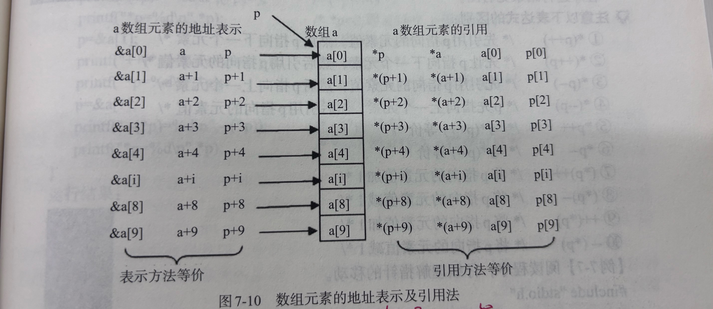

对于数组名和指针变量来说，指针变量可以取代数组名进行操作，但是因为数组名代表的是一个地址常量，在定义后就已经确定下来无法改变，一旦确定，就不能再指向其他地方，而指针变量是可以灵活改变值的。

> [!WARNING]
>
> 对于`*(p++)`和`*(p+i)`来说，前者在运算的时候指针变量p都会发生改变即指针移动，而后者在运算的时候不会影响p自身，即指针不会发生移动。

常见的指针表达式

```
*(p++) // 先引用指针p指向的元素值，然后p指向下一个元素的地址
*(++p) // 先让指针p指向下一个元素的地址，然后再取值
*(p--) // 先引用指针p指向的元素值，然后p指向上一个元素的地址
*(--p) // 先让指针p指向上一个元素的地址，然后再取值
*p++ // 和*(p++)等价
*p-- // 和*(p--)等价
(*p)++ // 将指针p指向的元素值进行自增
(*p)-- // 将指针p指向的元素值进行自减
++(*p) // 等价
--(*p) // 等价
```

实操一下就知道了

```c
#include <stdio.h>
int main(){
	int a[] = {1,2,3,4,5},*p; 
	p = a;
	printf("*p的结果是%d\n",*p);
	printf("*(p++)的 结果是%d\n",*(p++));
	printf("此时*p的结果是%d\n",*p);
	printf("*(++p)的结果是%d\n",*(++p));
	printf("此时*p的结果是%d\n",*p);
	printf("++(*p)的结果是%d\n",++(*p));
	printf("(*p)++的结果是%d\n",(*p)++);
	printf("*p的结果是%d\n",*p);
	return 0;
}
/*
*p的结果是1
*(p++)的结果是1
此时*p的结果是2
*(++p)的结果是3
此时*p的结果是3
++(*p)的结果是4
(*p)++的结果是4
*p的结果是5
*/
```

在上面这个程序中，`*(p++)和*(++p)`是对地址进行操作，而`(*p)++和++(*p)`是对指针指向的元素值进行操作，这些区别仅仅在于自增自减的前后运算。

指向数组的指针作为函数参数

- 指针与数组名作为函数参数的区别

本质上没区别，例如`func(int *str,int a)和func(int str[],int a )`完全等价

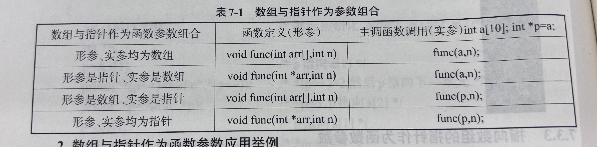

实参数组名表示一个地址常量，代表一个固定的地址，但是形参数组并不是一个固定的地址值，而是作为一个指针变量，在函数调用开始时，形参为实参数组首地址，在函数执行期间，它可以再被赋值

## 指针与二维数组

既然指针可以指向一维数组那么也就同样可以指向二维数组。接下来我们先做一个实验

```c
#include <stdio.h>
//查看二维数组的数组首地址和第一个数组元素的地址是否相同
int main(){
	int a[1][2] = {1,2};
	printf("二维数组a的首地址为%p\n",a);
	printf("二维数组元素a[0][0]的地址为%p",&a[0][0]);
	return 0;
}
/*
二维数组a的首地址为000000000062FE40
二维数组元素a[0][0]的地址为000000000062FE40
*/
```

可以看到数组名对应的地址常量和`a[0]][0]`第一个元素对应的地址是一样的

C语言规定:二维数组的首地址就是数组所在连续存储空间的起始地址，也就是数组首元素对应的地址。

因为二维数组可以看成是若干个一维数组组成，例如`a[3][4]`就可以看成是`a[0],a[1],a[2]`三个一维数组来组成，那么既然前面的是一维数组名，那么就可以表示成二维数组每行的首地址，接下来我们继续探讨

从二维数组的角度去观察，我们再写个程序

```c
#include <stdio.h>
int main(){
	int a[1][2] = {1,2};
	printf("二维数组a的首地址为%p\n",a);
	printf("二维数组a第二行的首地址为%p",a+1);
//	printf("二维数组a的首地址为%p\n",a[0]);等价a
//	printf("二维数组a第二行的首地址为%p",a[1]);等价a+1
	return 0;
}
/*
二维数组a的首地址为000000000062FE40
二维数组a第二行的首地址为000000000062FE48
*/
```

可以看到a+n可以表示二维数组第n行的地址，从`a[0]`到`a[1]`跨过了两个存储单元即8个字节

从一维数组可以看出，`a[i]`等价于`*(a+i)`,那么`a[i]+j`就等价于`*(a+i)+j`

- 二维数组`a[i][j]`的地址`&a[i][j]`表示方法

```c
&a[i][j]//a[i][j]元素对应的地址
a[i]+j//a[i]表示二维数组第i行的首地址，+j表示把地址往后移j位，指向a[i][j]的地址
*(a+i)+j//*(a+i)为指向第i行第一个元素的指针，然后+j效果同上
&a[0][0]+i*列数+j
a[0]+列数*i+j
```

写个demo

```c
#include <stdio.h>
int main(){
	int a[3][3] = {{1,2,3},{3,4,5},{5,6,7}};
	/*
	1 2 3
	3 4 5
	5 6 7
	*/
	printf("a[0]的地址是%p\n",a[0]);
	printf("a[1]的地址是%p\n",a[1]);
	//a[i][j]的地址表示
    printf("a[1][2]的地址表示如下:\n");
	printf("&a[i][j]的地址是%p\n",&a[1][2]);
	printf("a[i]+k的地址是%p\n",a[1]+2);
	printf("*(a+i)+j的地址是%p\n",*(a+1)+2);
	printf("&a[0][0]+列数*i+j的地址是%p\n",&a[0][0]+3*1+2);
	printf("a[0]+列数*i+j的地址是%p\n",a[0]+3*1+2);
	return 0;
}
a[0]的地址是000000000062FE20
a[1]的地址是000000000062FE2C
a[1][2]的地址表示如下:
&a[i][j]的地址是000000000062FE34
a[i]+k的地址是000000000062FE34
*(a+i)+j的地址是000000000062FE34
&a[0][0]+列数*i+j的地址是000000000062FE34
a[0]+列数*i+j的地址是000000000062FE34
```

- 二维数组`a[i][j]`的元素引用方法

```c
a[i][j]//a[i][j]的值
*(a[i]+j)//
*(*(a+i)+j)
*(&a[0][0]+i*列数+j)
*(a[0]+列数*i+j)
```

这里有点绕但是一定要努力想明白

**`*(a+i)`**：解引用操作符`*`用于获取指针指向的值。在这里，`*(a+i)`获取的是第`i`行的起始地址处的值，这个值本身（由于`a`是二维数组的指针）可以被视为指向第`i`行第一个元素的指针（即一个指向具有`n`个元素的数组的指针）。

接下来到指向二维数组的指针变量

- 指向二维数组元素的指针变量

和普通的指针变量的定义是一样的

例如

```
int a[3][4],*p1,*p2;
p1 = a[0];
p2 = &a[0][0];
//这两个等价
```

- 指向由m个元素组成的一维数组的行指针变量

格式

```c
数据类型 (*p)[m];
例如 
int a[3][4],(*p)[4];//定义一个指向含4个元素的一维数组的行指针p
p = a;
```

- `int (*p)[4]` 定义的是一个指向含有 4 个 `int` 元素数组的指针，它指向包含4个元素的一维数组，而不是一个指针数组。

这里p只能指向一个包含4个元素的一维数组，也就是上面 说的二维数组a中的`a[1]`或`a[0]`等，而不能指向数组元素。所以p只能对数组行进行操作，不能对行中某个数组元素进行操作

如果通过p对数组元素进行操作的话，可以用以下形式进行访问`a[i][j]`元素

1. `p[i][j]`
2. `*(p[i]+j)`
3. `*(*(p+i)+j)`
4. `(*(p+i))[j]`

## 指针和字符串

之前在前面就说过，我们定义字符串常量的方法有两种，第一种是字符数组，第二种是字符指针，之前在前面讲过字符数组，这里就讲一下字符指针

### 字符指针

我们可以通过定义一个指向字符串的指针变量，利用该指针变量对字符串进行操作

定义格式

```
char *字符指针变量名;
例如
char *str1 = "wanth3f1ag",*str2;
```

例子中的字符串常量"wanth3f1ag"会按字符数组进行处理，在内存中开辟一段连续的内存空间来存放字符串，并把存放该字符串的内存空间首地址赋给字符指针str1，所以我们这里的正确理解是这样的

当我们使用字符指针的时候，所有的字符串处理函数的参数都应使用字符指针，例如puts(str1)。

### 字符数组和字符指针的比较

这两个虽然都能存储字符串并进行操作，但是两者还是有区别的

- 存储方式比较

当我们用字符数组进行处理字符串的时候，会将字符串各字符依次放入数组元素中(包括结束符'\\0'),例如上面的字符串"wanth3f1ag"在字符数组中是`str[]={'w','a','t','h','3','f','1','a','g','\0'}`

当我们用字符指针进行处理字符串的时候，因为字符指针本身就是一个存放地址的指针变量，其中存放的首地址就是字符串的首地址，而不是把整个字符串存放到字符指针变量中。而字符串常量是存放在内存的一段连续存储空间中，以结束符为串结束标志。字符串常量返回内存中存放字符串的内存空间的首地址

- 赋值方式比较

对字符数组操作只能对各个元素赋值或在字符数组定义时进行初始化，例如

```c
char str[]="wanth3f1ag";//定义的时候进行初始化
char str[10];
for(int i =0;i<10;i++){
	scanf("%c",str[i]);//对各个元素赋值
}
但是以下形式是错误的
char str[16];
str = "wanth3f1ag";
```

但是对字符指针操作的时候上面错误方法就可以用

```c
char *str;
str = "wanth3f1ag";
```

- 定义和输入比较

定义一个数组后，系统会为每个数组元素分配具体的内存单元，各单元有确切的地址

定义一个指针后，系统会分配一个存储地址单元，其中可以存放地址值，该指针可以指向一个字符型数据,但是如果没有赋以一个具体的地址的时候，指针并未指向任何字符数据

所以在使用字符指针处理字符串的时候一定要对指针进行初始化，使得指针指向待处理的字符串，然后再进行操作和处理

讲完了字符指针，这里还有一个很重要的知识点

## 字符串处理函数的定义

之前在字符数组的章节中讲到了很多字符串处理函数，其实这些函数的参数都是以指针的形式给出的

- 字符串长度函数:

unsigned strlen(char *str);

- 字符串连接函数:

char *strcat(char *strdest , char *strsrc);

- 字符串复制函数

char *strcpy(char *strdest,char *strsrc);

- 字符串比较函数

int strcmp(char *str1, char *str2);

- 字符串转小写函数

char *strlwr(char *str);

- 字符串转大写函数

char *strupr(char *str);

然后我们就开始试着编写一下上面几个函数的实现

### strlen()函数的定义

```c
/*strlen函数的定义
实现功能:传入一个字符串返回字符串的长度
*/
unsigned strlen(char *str){
	unsigned int len = 0;
	while(*str != '\0'){
		str++;
		len ++;
	}
	return len;
}
```

### strcat()函数的定义

```c
/*字符串连接函数
实现功能: 把 src 所指向的字符串追加到 dest 所指向的字符串的结尾。
*/
char *strcat(char *strdest, char *strsrc){
	while(*strdest != '\0'){
		strdest++;
	}
	while(*strsrc != '\0'){
		*strdest = *strsrc;
		strdest++;
		strsrc++;
	}
	return strdest;
} 
```

不过根据地址传递的方式，我觉得这里用函数返回值类型void类型也是可以的，毕竟不需要返回值

```c
#include <stdio.h>

void *strcat(char *strdest, char *strsrc){
	while(*strdest != '\0'){
		strdest++;
	}
	while(*strsrc != '\0'){
		*strdest = *strsrc;
		strdest++;
		strsrc++;
	}
	//return strdest;
} 

int main() {
    char dest[50] = "Hello, ";
    char src[] = "world!";

    strcat(dest, src); // 将src追加到dest的末尾

    printf("Concatenated string: %s\n", dest); // 输出：Hello, world!

    return 0;
}
//Concatenated string: Hello, world!
```

### strcpy()函数的定义

```c
/*字符复制函数
实现功能: 把 src 所指向的字符串复制到 dest。
*/
char *strcpy(char *strdest,char *strsrc){
	while(*strdest++ = *strsrc++);
	return strdest;
}
```

### strcmp()函数的定义

```c
/*比较函数
实现功能:函数strcmp从头至尾顺序地将其对应字符比较，遇到两个字符不等时，两个字符相减得到一个int型值，两个字符串完全相同时，则返回0。  
*/

```

## 指针和函数

指针可以指向变量，同样也可以指向一个函数，如果使用一个指针指向一个函数的话那我们就可以通过指针来调用其所指向的函数

### 指向函数的指针

**函数指针**:在C语言中，一个函数总是占用一段连续的空间，而函数名就是该函数所占内存空间的首地址。任何一个函数在编译的时候都会被分配一个入口地址即函数的首地址。如果我们把这个首地址赋予给一个指针变量，此时该指针就指向这个函数，通常把指向函数的指针称为函数指针

利用函数指针可以实现对函数的调用，从而转入该函数的入口地址，执行此函数。

### 利用函数指针调用函数的步骤

- 定义指向函数的指针变量

定义格式

```
数据类型 (*函数指针变量名)(形参数据类型列表);
例如:
int (*func)(int,int);
数据类型表示被指向函数的返回值类型
```

- 将指针变量指向某函数

函数指针定义后并不指向任何函数，需要我们将函数的入口地址赋予该指针，入口地址就是函数名

赋值格式

```c
指针变量名 = 函数名;
例如:
int func(int x, int y){
	//函数体
}
int main(){
	int (*p)(int,int);
	p = func;
    
    return 0;
}
```

- 利用函数指针调用函数

格式

```c
(*函数指针名)(实参列表);
例如:
(*p)(a,b);
```

我们实操一个例子

```c
#include <stdio.h>
int max(int x, int y){
	return x > y ? x : y;
}
int main(){
	int a = 0,b = 0,c = 0,maxnum = 0;
	int (*p)(int,int) = max;
//	int (*p)(int,int) = &max;这里&可以省略 
	printf("输入需要比大小的三个整数(每个数直接以空格分割):\n");
	scanf("%d %d %d",&a,&b,&c);
	maxnum = p(p(a,b),c);//函数嵌套调用
	printf("最大的数字是:%d",maxnum);
	return 0;
}
```

这里的话写了一个比大小的函数，然后让函数指针指向这个函数，并通过函数指针去调用函数

### 函数指针作为函数参数

在C语言中，函数指针并不单单只是简单的进行上面的调用，而是主要用来实现函数之间传递函数，这种传递并不是数据或者变量的地址，而是传递函数的入口地址，那么怎么去实现呢？

我们可以知道，函数的参数可以是变量，常量，指向普通变量的指针变量，数组名，指向数组的指针等等，那么后面还会有一个指向函数的指针我们来学习一下。

说的简单点就是函数的嵌套使用，我们在函数调用的时候把某个函数的入口地址传递给被调函数，使得我们传递的函数在被调函数中调用，以达到意想不到的效果。

先写个简单的例子

```c
#include <Stdio.h>
int max(int a,int b){
	int c;
	//函数体
	return c; 
}
int min(int a,int b){
	int c;
	//函数体 
	return c; 
}
int common(int (*p1)(int,int),int (*p2)(int,int)){
	//函数体 
	int y1,y2;
	y1 = (*p1)(2,4);
	y2 = (*p2)(2,3);
	return y1+y2; 
}
int main(){
	int (*p1)(int,int),(*p2)(int,int);
	int c=0;
	p1 = max ; 
	p2 = min ; 
	c = common(p1,p2);
	return 0;
}
```

功能还是很简单的，common函数有两个参数，这两个参数定义为函数指针，然后还有max函数和min函数，这两个函数的入口地址分别用p1和p2指向，然后将p1和p2传入common中，在common中调用p1，p2指向的函数

这个在common中的函数指针指向的函数就是回调函数

- 回调函数

函数指针变量可以作为某个函数的参数来使用的，回调函数就是一个通过函数指针调用的函数。

### 返回指针的函数

一样的，只不过返回指针的函数返回值一定是一个地址

格式

```c
返回值类型 *函数名(参数列表){
	//函数体
	return 地址或指针变量;
}
例如：
int *func(int x,int y){
	int c;
	//函数体
	return &c;//返回c的地址
}
```

这里需要注意的是，在`*func`两侧并没有括号，在func两侧分别有`*`和`()`，根据运算符的优先级，`()优先级高于*`，所以func先和`()`结合表示成一个func函数，随后和`*`结合表示这个函数的返回值类型是一个指针，而指针的基类型就是返回值类型指定的。和指向函数的指针不同，这里需要特别区分

# 结构体与共用体

快考试啦，感觉这里考的内容不多，所以写的就不会很深刻

之前我们讲过当处理一组相同数据类型的元素的时候，我们会用数组去进行处理，但是如果是一组不同数据类型的数显然就不能使用数组去做了，这时候我们就可以用结构体

- 之前在数据类型里讲过，数组是构造类型，而结构体同样也是构造类型
- 数组的数组元素都是通过下标去进行访问的，而结构体是通过成员名字去进行引用的，就很像我们php里面的实例化对象的成员属性和成员方法的引用

## 结构体

### 结构体类型的定义

格式

```c
struct 结构体名
{
    类型1 变量1;
    类型2 变量2;
    类型3 变量3;
    ...
    类型n 变量n;
};注意分号
例如
struct students
{
	int age;
    double heigh;
    char sex;
    char a[]
	char *name;
};
```

在结构体中的成员都必须声明好数据类型，结构体名和变量名都应该符合标识符的命名规则，成员名和程序中其他的变量名并不冲突

### 结构体变量的定义

上面讲的只是结构体的定义，而那个结构体名并不是结构体变量的名字，在定义结构体变量的时候就和正常的定义变量是一样的

定义的方法：

- 先定义结构体类型，再定义结构体变量

格式

```c
struct 结构体名
{
    类型1 变量1;
    类型2 变量2;
    类型3 变量3;
    ...
    类型n 变量n;
};注意分号
struct 结构体名 变量名1，变量名2...;
```

这里的话其实把这个结构体名当成就是我们平时的int这种基本数据类型就行了

当然我们也可以在程序开头用宏定义的方法去定义一个结构体类型

```c
#define STU struct 结构体名
STU
{
    类型1 变量1;
    类型2 变量2;
    类型3 变量3;
    ...
    类型n 变量n;
};注意分号
STU 变量名1，变量名2...;//
或者直接进行初始化
STU 变量名1 = {成员1的值，成员2的值...};
```

- 在定义结构体类型的同时去定义结构体变量

```c
struct 结构体名
{
    类型1 变量1;
    类型2 变量2;
    类型3 变量3;
    ...
    类型n 变量n;
}结构体变量名1，结构体变量名2...;
```

- 直接定义结构体变量

```c
struct 
{
    类型1 变量1;
    类型2 变量2;
    类型3 变量3;
    ...
    类型n 变量n;
}结构体变量名1，结构体变量名2...;
```

- 定义的时候进行初始化赋值

```
struct 
{
    类型1 变量1;
    类型2 变量2;
    类型3 变量3;
    ...
    类型n 变量n;
}结构体变量名1={成员1的值,成员2的值...};
```

以上的方法都是可以的，其实在整个定义的过程中，我们只需要记住，结构体名，结构体变量名，成员变量名三者至少要出现两个。

- 嵌套的结构体定义

简单来说就是成员的类型可以是结构体变量，但这里要注意不是结构体类型而是具体的结构体变量，所以例如下面的写法是错误的

```c
struct 结构体名
{
    struct 结构体名;
}
正确的是
struct 结构体名
{
    struct 结构体名 变量名;
}
```

### 结构体类型的基本操作

- 引用结构体变量的成员

当我们定义了一个结构体类型且定义了一个结构体变量后，就可以对结构体变量中的成员变量进行操作了，其实就跟PHP中的访问成员变量是一样的，只不过符号不一样，这里是用圆点符号(`.`)成员运算符

格式

```c
结构体变量名.成员名
例如
student.name = "wanth3f1ag";
```

另外还可以对成员的值进行打印输出或者通过键盘去赋值

- 结构体中嵌套成员的访问

这种情况适用于我们的结构体是嵌套结构体类型时，例如我们的student结构体里面嵌套着student1结构体变量，那我们的访问就是逐级访问，通过成员运算符从最高级开始依次递进到最后一级成员为止

```c
student.student1.name = "wanth3f1ag";
```

- 同类型的结构体变量之间可直接赋值

```c
student1 = student2;
```

- 不允许直接将结构体变量输出

和数组的原理一样，我们直接输出数组的数组元素的值，而不能直接输出数组

## 结构体和数组

在上面我们就介绍了一个结构体变量只能存放一个对象的一组相关数据，这对有些复杂的操作例如统计全班同学的情况这种操作并不方便，所以这时候我们就需要用结构体数组，即数组中每个数组元素都是结构体变量

结构体数组的每个元素都是具有相同结构类型的下标结构变量

### 结构体数组的定义

- 先定义结构体类型，再定义结构体数组

```
struct 结构体名
{
    类型1 变量1;
    类型2 变量2;
    类型3 变量3;
    ...
    类型n 变量n;
};注意分号
struct 结构体名 结构体数组名
例如
struct students
{
	int age;
	char *name;
};
struct students std[50];//设置一个有50个元素的数组去存放全班50个人的资料
```

- 在定义结构体类型的同时去定义结构体变量

```
struct students
{
	int age;
	char *name;
} std[50];
```

​
