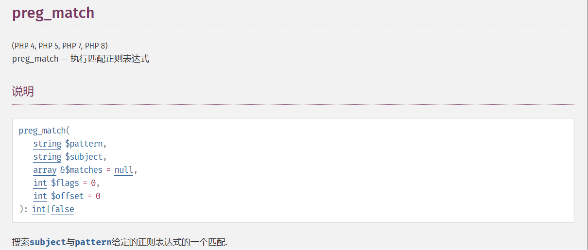
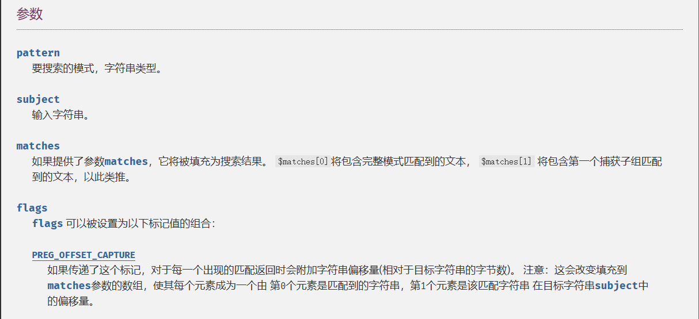
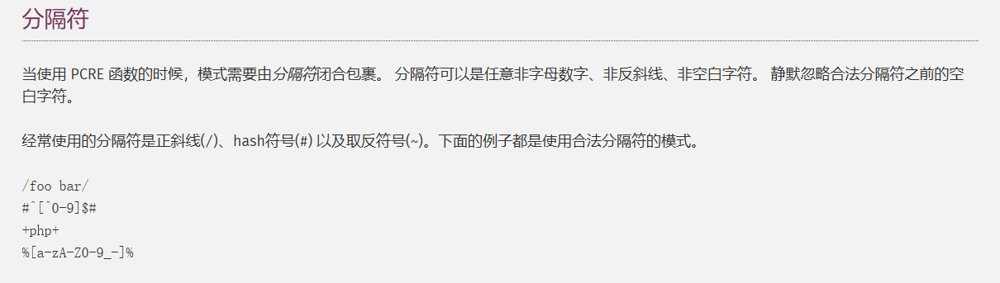
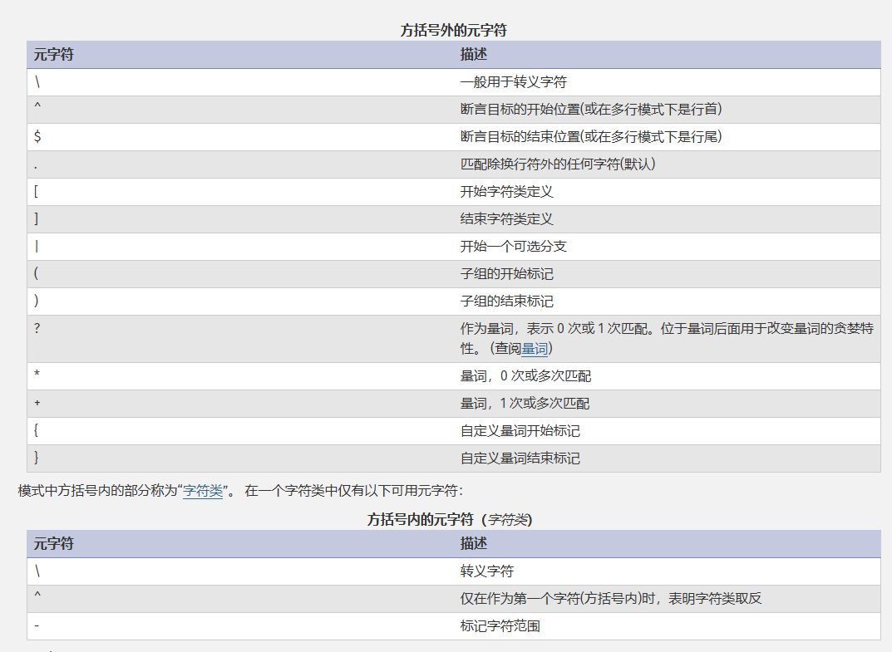
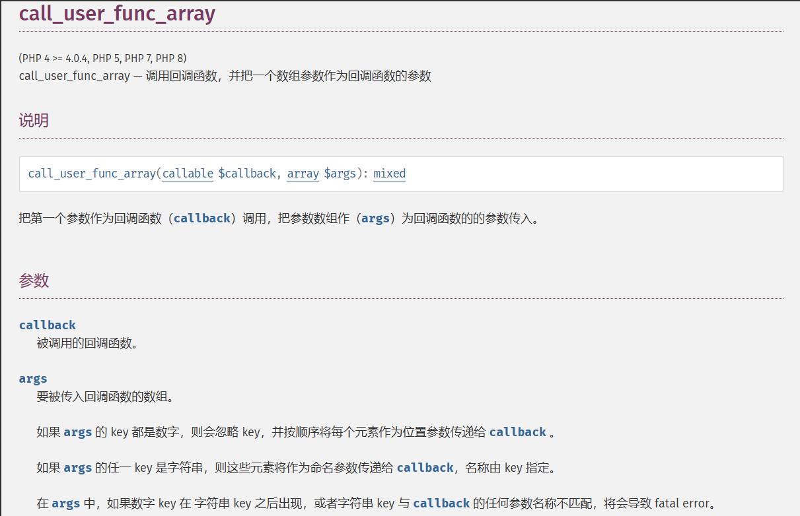

# 0x01前言

做一期函数的知识点积累，方便忘记的时候查阅

# 0x02正文

## mb_strpos()函数

查找字符串在另一个字符串中首次出现的位置

语法

```
mb_strpos(
    string $haystack,
    string $needle,
    int $offset = 0,
    ?string $encoding = null
): int|false
```

参数

- `haystack`

  要被检查的 [string](https://www.php.net/manual/zh/language.types.string.php)。

- `needle`

  在 `haystack` 中查找这个字符串。 和 [strpos()](https://www.php.net/manual/zh/function.strpos.php) 不同的是，数字的值不会被当做字符的顺序值。

- `offset`

  搜索位置的偏移。如果没有提供该参数，将会使用 0。负数的 offset 会从字符串尾部开始统计。

- `encoding`

  `encoding` 参数为字符编码。如果省略或是 **`null`**，则使用内部字符编码。

返回值

返回 string 的 `haystack` 中 `needle` 首次出现位置的数值。 如果没有找到 `needle`，它将返回 **`false`**。

## mb_substr()函数

获取部分字符串

```
mb_substr(
    string $string,
    int $start,
    ?int $length = null,
    ?string $encoding = null
): string
```

参数

- `string`

  从该 [string](https://www.php.net/manual/zh/language.types.string.php) 中提取子字符串。

- `start`

  如果 `start` 不是负数，返回的字符串会从 `string` 第 `start` 的位置开始，从 0 开始计数。举个例子，字符串 '`abcdef`'，位置 `0` 的字符是 '`a`'，位置 `2` 的字符是 '`c`'，以此类推。如果 `start` 是负数，返回的字符串是从 `string` 末尾处第 `start` 个字符开始的。

- `length`

  `string` 中要使用的最大字符数。如果省略了此参数或者传入了 `NULL`，则会提取到字符串的尾部。

- `encoding`

  `encoding` 参数为字符编码。如果省略或是 **`null`**，则使用内部字符编码。

返回值

**mb_substr()** 函数根据 `start` 和 `length` 参数返回 `string` 中指定的部分。

## implode函数

implode—用于将数组的元素连接成一个字符串

语法

```php
implode(string $separator, array $array): string
```

参数¶

- `separator`

  可选。默认为空字符串。

- `array`

  要分解的字符串数组。

返回值¶

返回一个字符串，其中包含所有数组元素的字符串表示形式，这些元素的顺序相同，并且每个元素之间有分隔符字符串。

## preg_replace()函数

(PHP 4, PHP 5, PHP 7, PHP 8)

preg_replace — 执行一个正则表达式的搜索和替换

基础语法

```php
preg_replace(
    string|array $pattern,
    string|array $replacement,
    string|array $subject,
    int $limit = -1,
    int &$count = null
): string|array|null
```

参数说明

| 参数           | 描述                         |
| -------------- | ---------------------------- |
| `$pattern`     | 要搜索的正则表达式模式       |
| `$replacement` | 替换字符串或回调函数         |
| `$subject`     | 要搜索替换的目标字符串或数组 |
| `$limit`       | 可选，最大替换次数           |
| `$count`       | 可选，填充实际替换次数的变量 |

返回值

- 如果 `subject` 是一个数组，**preg_replace()** 返回一个数组，其他情况下返回一个字符串。
- 发生错误时返回 NULL

## str_split()函数

在 PHP 中，`str_split()` 函数用于 **将字符串分割为字符数组**，通常用于处理字符级操作。

基础语法

```
array str_split(string $string, int $length = 1)
```

- 参数
  - `$string`：要分割的字符串。
  - `$length`（可选）：每个数组元素的字符长度（默认为 `1`，即逐字符分割）。
- 返回值
  - 返回一个数组，包含分割后的字符或子串。

## phpinfo()函数

`phpinfo()` 是一个 PHP 函数，用于输出当前 PHP 环境的详细信息。这包括 PHP 的版本、已加载的扩展、配置信息、服务器信息、环境变量、已定义的常量等。使用 `phpinfo()` 可以帮助开发者和系统管理员快速了解服务器的 PHP 配置。

## addslashes()函数

`addslashes()` 函数是 PHP 中的一个内置函数，用于在字符串中添加反斜杠（`\`）以转义特定字符，例如以下字符

- 反斜杠 (`\`)
- 单引号 (`'`)
- 双引号 (`"`)
- NULL 字符

## getimagesize()函数

`getimagesize()` 是 PHP 的一个内置函数，用于获取图像文件的尺寸和类型信息。这个函数能够识别多种图像格式，包括 JPEG、PNG、GIF 等，并返回一个数组，其中包含有关图像的各种信息。

语法

```php
array getimagesize ( string $filename [, array $options = [] ] )
```

参数：

- **$filename**：指定要检查的图像文件的路径。
- **$options**（可选）：可以传递一个数组来设置特定的选项。

返回值：

如果成功，`getimagesize()` 返回一个包含以下信息的数组：

1. 图像的宽度（以像素为单位）
2. 图像的高度（以像素为单位）
3. 图像的类型（常量，如 IMAGETYPE_JPEG、IMAGETYPE_PNG 等）
4. 一个字符串，包含图像的 MIME 类型
5. （可选）图像的实际尺寸信息

## eval()函数

在 PHP 中，`eval()` 函数用于将字符串作为 PHP 代码执行。它可以动态地执行代码

基础语法

```php
eval(string $code): mixed
```

- `$code`：要执行的 PHP 代码字符串。
- 返回值：如果代码包含返回语句，将返回返回值；如果没有返回值，将返回 `null`。

示例

```php
<?php
$expression = '3 + 5';
$result = eval("return $expression;");
echo $result;  // 输出: 8
?>
```

## file_get_contents()函数

`file_get_contents()` 是 PHP 中用于读取文件内容的函数。它可以用于从文件系统、URL、流或数据中读取文件内容，并将其作为字符串返回。

基础语法

```php
string file_get_contents ( string $filename [, bool $use_include_path = FALSE [, resource $context [, int $offset = -1 [, int $maxlen ]]]] )
```

- `$filename`: 必需，要读取的文件名或 URL。
- `$use_include_path`: 可选，如果设置为 TRUE，则在 include_path 中搜索文件。默认为 FALSE。
- `$context`: 可选，用于指定上下文的选项和参数。
- `$offset`: 可选，从文件的哪个位置开始读取。默认为 -1，表示从文件开头开始读取。
- `$maxlen`: 可选，指定最大读取的字节数。默认为读取整个文件。

返回值

- 如果成功，`file_get_contents()` 函数会返回文件内容的字符串。
- 如果失败，`file_get_contents()` 函数会返回 FALSE。

示例

```php
// 读取本地文件内容
$content = file_get_contents('example.txt');

// 读取远程 URL 的内容
$content = file_get_contents('http://www.example.com');

// 读取文件的一部分
$partial_content = file_get_contents('example.txt', NULL, NULL, 10, 20);
```

### 小tips:

当PHP的 file_get_contents() 函数在遇到不认识的伪协议头时候会将伪协议头当做文件夹，造成目录穿越漏洞

## array_merge()函数

`array_merge()` 是 PHP 中用于合并一个或多个数组的函数。它将多个数组合并为一个数组，如果数组中有相同的字符串键名，后面的数组的值将覆盖前面的数组的值。如果数组中有数字键名，`array_merge()` 将重新排列这些键名，使得结果数组的键名从零开始递增。

基础语法

```php
array array_merge ( array ...$arrays )
```

- `$arrays`: 一个或多个要合并的数组。

返回值

- 返回合并后的数组。如果没有提供数组，则返回一个空数组。

示例

```php
$array1 = array("a" => "apple", "b" => "banana");
$array2 = array("b" => "blueberry", "c" => "cherry");
$array3 = array("d" => "date");

// 合并数组
$result = array_merge($array1, $array2, $array3);

print_r($result);
//输出结果
Array
(
    [a] => apple
    [b] => blueberry
    [c] => cherry
    [d] => date
)
```

## show_source()函数

`show_source()` 是 PHP 中的一个函数，用于输出指定文件的源代码，并在浏览器中高亮显示。

基础语法

```php
void show_source ( string $filename [, int $highlight = 1 ] )
```

- **$filename**: 必需，指定要显示源代码的文件名（可以是 PHP 文件或其他文本文件）。
- **$highlight**: 可选，默认值为 1。如果设置为 1，PHP 将高亮显示源代码；如果设置为 0，则不进行高亮显示。

示例

```
// 显示当前文件的源代码
show_source(__FILE__);

// 显示特定文件的源代码
show_source('example.php');
```

返回值

- `show_source()` 函数没有返回值，它直接输出文件的内容。

## strstr()函数

- `strstr` 函数用于查找一个字符串在另一个字符串中的首次出现。如果找到了，它会返回从匹配位置到字符串末尾的部分；如果没有找到，则返回 `false`。`strstr` 是区分大小写的。

函数原型

```
php
string strstr ( string $haystack , string $needle [, bool $before_needle = false ] )
```

1. **`$haystack`**：要搜索的字符串，即干草堆。
2. **`$needle`**：要查找的子字符串，即针。
3. **`$before_needle`**（可选）：如果设置为 `true`，则返回 `$needle` 出现之前的部分；如果未设置或设置为 `false`，则返回从 `$needle` 出现的位置开始到 `$haystack` 末尾的部分。

## preg_match()函数





### PCRE正则语法

#### 分割符号



如果需要在正则模式内匹配分隔符，必须使用反斜线转义。如果分隔符经常在 正则模式内出现， 最好使用其他分隔符以便提高可读性。

#### 正则表达式元字符



#### 关于断言目标的起止

##### 脱字符(^)

在一个字符类外面，在默认匹配模式下， 脱字符（`^`） 是一个断言当前匹配点位于目标字符串开始处的断言。 在一个字符类内部， 脱字符（`^`） 表明这个字符类中描述的字符取反(这个在上面元字符里也有介绍)。

脱字符（`^`）并不一定要是模式的第一个字符， 但是如果处于某个可选分支时， 它应该是该分支的首字符。如果所有选择分支都以脱字符（`^`）开头，这就是说， 如果模式限制为只匹配目标的开头， 它被称为是一个 ”紧固” 模式。

##### 美元符($)

美元符(`$`)是用于断言当前匹配点位于目标字符串末尾， 或当目标字符串以换行符结尾时当前匹配点位于该换行符位置(默认情况)。 美元符(`$`)不一定要作为模式的最后一个字符，但是如果它在某个可选分支中时， 就应该位于该分支的末尾。美元符在字符类中没有特殊的意义。

#### 字符类

左方括号开始一个字符类的描述，并以右方括号结束，如果一个右方括号需要作为一个字符类中的成员, 那么可以将它写在字符类的首字符处(如果使用了 ^ 取反， 那么是第二个)或者使用转义符。

例如，字符类[aeiou]匹配所有的小写元音字母

在字符类中，一个中划线(减号 -)可以用于指定从一个字符到另一个字符的范围。 比如，[d-m]匹配d到m之间的所有字符

在一个字符范围描述后面不能使用右中括号。 比如一个模式 [W-]46] 被解释为一个包含 W 和 - 的字符类，后面紧跟字符串 ”46]”， 因此它可以匹配 ”W46]” 或 ”-46]”。然而， 如果中括号是经过转义的， 它将会被解释为范围的终点， 因此 [W-\]46] 就会被解释为一个单独的包含 W 至 ] 范围内所有字符以及 4、6 的字符类。 8 进制或 16 进制描述的中括号同样可以用于作为范围的终点。

#### 可选路径(|)

竖线字符用于分离模式中的可选路径。 比如模式`gilbert|Sullivan`匹配 ”gilbert” 或者 ”sullivan”。 竖线可以在模式中出现任意多个，并且允许有空的可选路径(匹配空字符串)。 匹配的处理从左到右尝试每一个可选路径，并且使用第一个成功匹配的。 如果可选路径在子组(下面定义)中， 则”成功匹配”表示同时匹配了子模式中的分支以及主模式中的其他部分。

#### 模式修饰符

1. **`i` (case-insensitive)**:
   - 使匹配不区分大小写。例如，`/a/i` 可以匹配 `a` 和 `A`。
2. **`m` (multi-line mode)**:
   - 改变 `^` 和 `$` 的行为，使其能够匹配每行的起始和结束，而不仅仅是整个字符串的开头和结尾。
3. **`s` (single-line mode, also known as dotall)**:
   - 如果设置了这个修饰符，模式中的点元字符（.）将匹配所有字符，包括换行符。如果没有设置这个修饰符， 换行符会被排除在外。
4. **`x` (extended mode)**:
   - 如果设置了这个修饰符，模式中的空白数据字符会被完全忽略，除非被转义或在字符类内部， 并且在一个未转义的 "#" 和下一个换行符之间的字符也会被忽略。
5. **`u` (unicode mode)**:
   - 使正则表达式以 UTF-8 模式解释模式和目标字符串，从而处理多字节字符。
6. **`A`**:
   - 强制 `^` 仅匹配字符串的开头（即使使用了 `m` 修饰符）。
7. **`D`**:
   - 强制 `$` 仅匹配字符串的结尾，而不是行结尾。这在多行模式中常常很有用。
8. **`U` (ungreedy)**:
   - 改变量词（如 `*` 和 `+`）的默认贪婪行为，使其成为非贪婪（不贪婪），即先匹配尽可能少的字符。但如果后面跟着 `?`，则变为贪婪。 

### 贪婪模式

**默认方式，量词会尽量匹配尽可能多的字符**，直到无法匹配才回溯（后退）以适应剩余的模式。

- `*`（0次或多次）、`+`（1次或多个）、`?`（0或1次）等默认是**贪婪**的
- 正则引擎会尝试**最大可能的匹配**
- 可能导致**大量回溯**（如果后面模式不匹配）

例如**正则** `/a.*b/` **匹配字符串 `"abcb"`**

匹配过程

1. `a`匹配`a`
2. `.*`贪婪匹配，先尝试匹配`bcb`
3. 由于正则表达式中还有个`b`需要匹配，所以开始回溯
4. 先去掉最后一个字符，`.*`匹配bc，此时末尾的`b`能匹配上表达式中的`b`，至此匹配成功，回溯结束

### 非贪婪模式

**在量词后加 `?`，使其尽量匹配最短可能的字符**（即一旦满足条件就停止，避免回溯）

- `*?`、`+?`、`??`、`{n,m}?` 都是**非贪婪**的
- 正则引擎**匹配最短符合要求的字符**
- **减少不必要的回溯，提高效率**

例如**正则** `/a.*?b/` **匹配字符串 `"abcb"`**

匹配过程

1. `a`先匹配`a`
2. `.*?`非贪婪匹配，尽可能少的匹配字符，一开始先匹配0个字符
3. 然后到正则中的`b`，去匹配`abcb`中第一个`b`，此时匹配成功
4. 最终返回`ab`

## die()函数

在 PHP 中，`die()` 函数用于输出一条消息，并终止当前脚本的执行。与 `exit()` 函数是等效的，都可以用于终止脚本的执行。

基础语法

```php
void die ( string $message )
```

- `$message`: 可选，要输出的消息。

## include()函数

在 PHP 中，`include()` 函数用于将指定文件的内容包含到当前脚本中并执行。

基础语法

```php
include(string $filename)
```

- `$filename`: 必需，指定要包含的文件路径。

## md5()函数

在 PHP 中，`md5()` 函数用于计算一个字符串的 MD5 哈希值。MD5（Message-Digest Algorithm 5）是一种广泛使用的加密哈希函数，可以生成一个128位（16字节）的哈希值，通常用32个十六进制数字表示。

基础语法

```php
string md5 ( string $str [, bool $raw_output = false ] )
```

- `$str`: 要计算其 MD5 哈希值的字符串。
- `$raw_output`: 可选，若设为 `true`，则返回原始的二进制格式的哈希值；若为 `false`（默认值），则返回小写的十六进制格式的哈希值。

示例

```php
// 计算字符串的 MD5 哈希值
$string = "Hello, World!";
$hash = md5($string);
echo "MD5 Hash: " . $hash; // 输出: MD5 Hash: 65a8e27d8879283831b664bd8b7f0ad4
```

## setcookie()函数

`setcookie()` 函数用于在客户端设置一个 Cookie，以便在用户的浏览器上存储信息。Cookie 是一种在客户端存储数据的方式，它们能够在用户访问网站时被发送到服务器，从而实现跟踪用户信息、记住用户偏好设置等功能。

基础语法

```php
setcookie(name, value, expire, path, domain, secure, httponly);
```

- `name`: 必需，Cookie 的名称。
- `value`: 可选，Cookie 的值。
- `expire`: 可选，过期时间的 Unix 时间戳（秒），超过该时间 Cookie 将失效。
- `path`: 可选，指定 Cookie 的路径，可访问该 Cookie 的目录。
- `domain`: 可选，指定 Cookie 的域名，例如 ".example.com"。
- `secure`: 可选，布尔值，指定是否仅通过安全的 HTTPS 连接传输 Cookie。
- `httponly`: 可选，布尔值，指定是否仅通过 HTTP 协议访问 Cookie，JavaScript 将无法访问该 Cookie。

示例

```php
setcookie("Hash",md5($secret.$name),time()+3600000);
//使用 setcookie() 函数将哈希值作为 Cookie 的值设置为名为 "Hash" 的 Cookie，并指定了过期时间为当前时间加上 1000 小时。
这里的话就是设置了时间戳，time()+3600000中time() 函数返回当前时间的时间戳（单位为秒），加上 3600000 秒后即为 Cookie 的过期时间。
```

## strtoupper()函数

`strtoupper()` 函数是 PHP 中的一个字符串处理函数，用于将字符串中的小写字母转换为大写字母。

基础语法

```PHP
strtoupper(string $string): string
```

- `$string`: 必需，要转换的字符串。

示例

```php
$str = "Hello, World!";
$upperStr = strtoupper($str);
echo $upperStr; // 输出: HELLO, WORLD!
```

## substr()函数

`substr()` 函数是 PHP 中的一个字符串处理函数，用于返回字符串的一部分。

基础语法

```php
substr(string $string, int $start, int|null $length = null): string|false
```

- **`$string`**: 必需，要提取子串的原始字符串。
- **`$start`**: 必需，提取子串的起始位置（索引从 0 开始）。如果是负数，则从字符串末尾开始计算。
- **`$length`**: 可选，要提取的子串的长度。如果没有指定，则从起始位置提取到字符串的末尾。如果是负数，则表示从子串的末尾开始计算长度。

示例

```php
// 示例 1: 提取子串
$string = "Hello, World!";
$substring1 = substr($string, 7); // 从索引 7 开始，提取到末尾
echo $substring1; // 输出: World!

// 示例 2: 指定长度
$substring2 = substr($string, 0, 5); // 从索引 0 开始，提取 5 个字符
echo $substring2; // 输出: Hello

// 示例 3: 使用负数索引
$substring3 = substr($string, -6); // 从字符串末尾开始提取
echo $substring3; // 输出: World!

// 示例 4: 负数长度
$substring4 = substr($string, 7, -1); // 从索引 7 开始，提取到倒数第一个字符
echo $substring4; // 输出: World
```

## ord()函数

`ord()` 函数是 PHP 中的一个字符串处理函数，用于返回字符串中第一个字符的 ASCII 值（对于单字节字符）或 Unicode 值（对于多字节字符）。

基础语法

```php
ord(string $string): int|false
```

- **`$string`**: 必需，要获取其第一个字符 ASCII 值的字符串。该字符串必须长度为 1，即包含一个字符。

返回值

- 返回字符的 ASCII 值（对于单字节字符）或 Unicode 值（对于多字节字符）。
- 如果输入字符串为空，返回 `false`。

示例

```php
// 示例 1: 获取字符的 ASCII 值
$char = "A";
$asciiValue = ord($char);
echo $asciiValue; // 输出: 65

// 示例 2: 获取字符的 Unicode 值
$char2 = "中"; // 中文字符
$unicodeValue = ord($char2); 
// ord() 只返回字符串第一个字符的 ASCII 值，但如果是多字节字符，会返回第一个字节的值
echo $unicodeValue; // 输出: 228 (中文字符 "中" 的第一个字节的值)

// 示例 3: 对于空字符串
$emptyString = "";
$result = ord($emptyString);
var_dump($result); // 输出: bool(false)
```

## print_r()函数

`print_r()` 函数是 PHP 中用于打印变量内容的函数，通常用于调试目的。

基础语法

```php
print_r(mixed $variable, bool $return = false): void|string
```

- **`$variable`**: 必需，要打印的变量。
- **`$return`**: 可选，如果设置为 `true`，`print_r()` 函数将返回打印结果而不直接输出。

示例

```php
// 示例 1: 打印数组
$array = array('a', 'b', 'c');
print_r($array);
// 输出:
// Array
// (
//     [0] => a
//     [1] => b
//     [2] => c
// )
```

## array_pop函数

`array_pop()` 是 PHP 中的一个数组函数，它用于移除数组中的最后一个元素并返回该元素的值。这个函数会修改原始数组，使其少了最后一个元素。

```php
php
$fruits = array("apple", "banana", "orange");
$lastFruit = array_pop($fruits);

echo "Last fruit: " . $lastFruit; // 输出 "Last fruit: orange"
print_r($fruits); // 输出：Array ( [0] => apple [1] => banana )
```

## explode()函数

`explode()` 函数是 PHP 中用于将字符串分割成数组的一个内置函数

基础语法

```
array explode(string $delimiter, string $string[, int $limit = PHP_INT_MAX])
```

参数说明

1. **$delimiter**:
   - 字符串类型，指定用于分隔字符串的分隔符。当找到这个分隔符时，`explode()` 会在该位置将字符串切割开。
2. **$string**:
   - 字符串类型，要被切割的源字符串。
3. **$limit** (可选):
   - 整数类型，限制返回的数组元素的数量。如果设置为正数，返回的数组将包含最多 `$limit` 个元素；如果设置为负数，返回的数组将包含所有元素，但去掉最后 `$limit` 个元素。

## intval()函数

`intval()` 函数是 PHP 中的一个内置函数，用于将变量转换为整型。

基础语法

```
intval(mixed $value, int $base = 10): int
```

- **`$value`**: 必需，要转换的变量，可以是任何类型。
- **`$base`**: 可选，表示数字的基数，默认为 10。可以设置为 2（二进制）、8（八进制）、10（十进制）或 16（十六进制）。

返回值

- 返回转换后的整型值。如果 `$value` 不能转换为整型，返回 `0`。

示例

```php
// 示例 1: 转换字符串
$stringValue = "123";
$intValue = intval($stringValue);
echo $intValue; // 输出: 123

// 示例 2: 转换浮点数
$floatValue = 45.67;
$intValueFromFloat = intval($floatValue);
echo $intValueFromFloat; // 输出: 45

// 示例 3: 布尔值转换
$boolTrue = true;
$boolFalse = false;
echo intval($boolTrue);  // 输出: 1
echo intval($boolFalse); // 输出: 0

// 示例 4: 转换包含数字的字符串
$numericString = "100 days";
$intValueFromString = intval($numericString);
echo $intValueFromString; // 输出: 100

// 示例 5: 使用基数参数
$hexValue = "1A";
$intValueFromHex = intval($hexValue, 16);
echo $intValueFromHex; // 输出: 26（十六进制数 1A 转换为十进制的结果）
```

### intval() 的截断特性

`intval()` 函数会将字符串转换为整数，但会截断非数字部分。，例如我们传入2023e1经过处理后就是2023

## strpos()函数

在 PHP 中，`strpos()` 函数用于查找一个字符串在另一个字符串中首次出现的位置

基本语法：

`strpos(string $haystack, string $needle, int $offset = 0): int|false`

- **$haystack**：要搜索的字符串。
- **$needle**：要查找的字符串（或字符）。
- **$offset**：可选的参数，指定从哪个位置开始搜索。

- 如果找到了字符，`strpos()` 会返回字符首次出现的位置（从 `0` 开始计数）。

## highlight_file()函数

`highlight_file()` 函数是 PHP 中的一个内置函数，用于高亮显示指定文件的 PHP 代码。

基础语法

```php
highlight_file(string $filename, bool $return = false): string|bool
```

- **`$filename`**: 必需，指定要高亮显示的文件名（包括路径）。
- **`$return`**: 可选，布尔值，默认为 `false`。若设置为 `true`，函数将返回高亮后的代码，而不是直接输出。

返回值

- 如果 `$return` 参数为 `false`，函数将直接输出高亮的 HTML 代码。
- 如果 `$return` 参数为 `true`，函数将返回高亮后的代码字符串；如果发生错误（例如文件不存在），则返回 `false`。

示例

```php
// 示例 1: 直接输出文件高亮代码
highlight_file('path/to/your/file.php');

// 示例 2: 返回高亮代码为字符串
$highlightedCode = highlight_file('path/to/your/file.php', true);
echo $highlightedCode; // 输出高亮的代码，作为字符串
```

## rand()函数

`rand()` 函数是 PHP 中用于生成随机整数的内置函数。它可以生成指定范围内的随机整数，用于模拟随机性、测试和其他需要随机数的应用场景。

基础语法

```php
rand(int $min, int $max): int
```

- **`$min`**: 必需，指定随机数的最小值。
- **`$max`**: 必需，指定随机数的最大值。

返回值

- 返回一个介于 `$min` 和 `$max` 之间的随机整数，包括 `$min` 和 `$max`。

示例

```php
// 示例 1: 生成 1 到 100 之间的随机整数
$randomNumber = rand(1, 100);
echo $randomNumber; // 输出介于 1 到 100 之间的随机整数

// 示例 2: 生成 0 到 10 之间的随机整数
$randomNumber = rand(0, 10);
echo $randomNumber; // 输出介于 0 到 10 之间的随机整数
```

## array_push()函数

`array_push()` 函数用于向数组的末尾添加一个或多个元素。

基础语法

```php
array_push(array &$array, mixed $value1, mixed $value2, ...): int
```

- **`$array`**: 必需，要添加元素的目标数组。
- **`$value1`, `$value2`, ...**: 可选，要添加到数组末尾的一个或多个元素。

返回值

- 返回添加新元素后数组的新长度。

示例

```php
// 示例 1: 向数组末尾添加单个元素
$fruits = array("apple", "banana");
$newLength = array_push($fruits, "orange");
print_r($fruits); // 输出: Array ( [0] => apple [1] => banana [2] => orange )
echo $newLength; // 输出: 3

// 示例 2: 向数组末尾添加多个元素
$colors = array("red", "green");
$newLength = array_push($colors, "blue", "yellow");
print_r($colors); // 输出: Array ( [0] => red [1] => green [2] => blue [3] => yellow )
echo $newLength; // 输出: 4
```

## in_array() 函数

`in_array()` 函数是 PHP 中用于检查一个值是否存在于数组中的内置函数。

基础语法

```php
in_array(mixed $needle, array $haystack, bool $strict = false): bool
```

- **`$needle`**: 必需，待检查的值。
- **`$haystack`**: 必需，要搜索的数组。
- **`$strict`**: 可选，布尔值，默认为 `false`。如果设置为 `true`，则在比较时将进行类型比较（即不仅值相等，而且类型也要相同）。

返回值

- 如果 `$needle` 在 `$haystack` 中存在，返回 `true`；否则返回 `false`。

示例

```php
// 示例 1: 检查元素是否在数组中
$fruits = array("apple", "banana", "orange");
$result = in_array("banana", $fruits);
var_dump($result); // 输出: bool(true)

$result = in_array("grape", $fruits);
var_dump($result); // 输出: bool(false)

// 示例 2: 使用严格比较
$numbers = array(1, 2, 3, "3");
$result = in_array(3, $numbers, true); // 严格比较，类型也要相同
var_dump($result); // 输出: bool(true)

$result = in_array("3", $numbers, true); // "3" 是字符串，类型不匹配
var_dump($result); // 输出: bool(false)
```

## file_put_contents()函数

`file_put_contents()` 是一个用于将数据写入文件的 PHP 函数。

基础语法

```php
file_put_contents($filename, $data, $flags, $context);
```

参数含义：

- `$filename`：要写入数据的文件名。
- `$data`：要写入文件的数据，可以是字符串、数组或者流。
- `$flags`：可选参数，用于指定写入文件的标志。例如，`FILE_APPEND` 表示追加而不是覆盖。
- `$context`：可选参数，包含指向流资源的上下文，通常用于改变流的行为。

示例

```php
$data = "Hello, World!";
$filename = "example.txt";

if (file_put_contents($filename, $data) !== false) {
    echo "数据已写入文件。";
} else {
    echo "写入文件时出现错误。";
}
```

## is_numeric()函数

`is_numeric()` 是一个 PHP 函数，用于检查一个变量是否是一个数字或数字字符串。它的主要作用是判断给定的变量是否是数字或数字字符串，返回布尔值 true 或 false。

示例用法

```php
<?php
// 示例 1: 整数
$var1 = 123;
echo is_numeric($var1) ? 'true' : 'false'; // 输出: true
// 示例 2: 浮点数
$var2 = 123.45;
echo is_numeric($var2) ? 'true' : 'false'; // 输出: true
// 示例 3: 数字字符串
$var3 = "123";
echo is_numeric($var3) ? 'true' : 'false'; // 输出: true
```

## call_user_func()函数

`call_user_func()` 是一个 PHP 函数，用于调用回调函数。它的作用是动态地调用一个回调函数，并传入指定的参数。

基础语法

```php
call_user_func($callback [, $parameter1 [, $parameter2, ...]]);
```

- `$callback`：回调函数，可以是一个包含函数名的字符串，或者是一个包含对象和方法名的数组。
- `$parameter1`, `$parameter2`, ...：要传递给回调函数的参数，可以有多个参数。

示例

```php
function sayHello($name) {
    echo "Hello, $name!";
}
$callback = 'sayHello';
call_user_func($callback, 'Alice');
```

在这个示例中，`sayHello()` 函数接受一个参数 `$name`，然后通过 `call_user_func()` 函数动态地调用 `sayHello()` 函数，并传递参数 `'Alice'`，最终输出 `Hello, Alice!`。

## call_user_func_array函数



本地测试一下

```php
<?php
class test{
    public function test(){
        phpinfo();
    }
}
//$a = new test();
//$a->test();
call_user_func_array(phpinfo,array());
```

当然如果是调用类中的方法可以将第一个参数设置为数组

```php
<?php
class test{
    public function test(){
        phpinfo();
    }
}
//$a = new test();
//$a->test();
call_user_func_array(array(new test(),'test'),array());
//成功执行
```

## hex2bin()函数

`hex2bin()` 是一个 PHP 函数，用于将十六进制字符串转换为二进制字符串。它的作用是将表示十六进制数据的字符串转换为其对应的二进制数据。

基础语法

```php
hex2bin($hex_string);
```

- `$hex_string`：要转换的十六进制字符串。

示例

```php
$hex_string = '48656c6c6f20576f726c64'; // 十六进制字符串 "Hello World"
$binary_string = hex2bin($hex_string);

echo $binary_string; // 输出：Hello World
```

## sha1()函数

`sha1()` 是一个PHP函数，用于计算字符串的 SHA-1 哈希值。

基础语法

```php
sha1($str, $raw_output = false);
```

- `$str`：要计算哈希值的字符串。
- `$raw_output`：可选参数，设置为 true 时返回长度为20字节的原始二进制数据，设置为 false（默认）时返回长度为40字符的十六进制数据。

示例

```php
$str = 'Hello, World!';
$sha1_hash = sha1($str);

echo $sha1_hash; // 输出：2ef7bde608ce5404e97d5f042f95f89f1c232871
```

## foreach()函数

`foreach()` 是 PHP 中用于遍历数组或对象的循环结构。它提供了一种简洁且方便的方式来遍历集合中的每个元素，并执行相应的操作。

基础语法

```php
foreach ($array as $value) {
    // 在每次迭代中操作 $value
}
```

示例用法

```php
$fruits = array('apple', 'banana', 'cherry');

foreach ($fruits as $fruit) {
    echo $fruit . ' ';
}
// 输出：apple banana cherry
```

## parse_str()函数

在 PHP 中，`parse_str()` 是一个用于解析查询字符串并将其转换为变量数组的函数

parse_str()函数的基本语法

```php
parse_str(string $string, array &$array = null): void
```

- **`$string`**：要解析的查询字符串。
- **`$array`**（可选）：如果提供，则解析后的变量会被存储在这个数组中。否则，解析后的变量会直接导入到当前的符号表（即可以直接使用变量名）。

## strrev()函数

`strrev()` 是 PHP 中的一个字符串函数，用于将字符串进行反转操作，即将字符串中的字符顺序逆转。

基础语法

```php
strrev($string);
```

- `$string`：要进行反转操作的字符串。

示例用法

```php
$str = 'Hello, World!';
$reversed_str = strrev($str);

echo $reversed_str; // 输出：!dlroW ,olleH
```

## getcwd()函数

`getcwd()`函数是PHP中的一个内置函数，用于获取当前工作目录的路径。

语法:

```php
string getcwd(void**)
```

具体用法:

```php
$currentDir = getcwd();
echo "当前工作目录是：$currentDir";
```

## is_file()函数

is_file()` 函数用于判断给定的路径是否是一个文件，如果是则返回 `true`，否则返回 `false

基础语法

```php
is_file($path);
```

- `$path`：要检测的文件路径。

示例用法

```php
$file_path = 'example.txt';

if (is_file($file_path)) {
    echo '文件存在！';
} else {
    echo '文件不存在！';
}
```

在这个示例中，`is_file()` 函数用于检查名为 `example.txt` 的文件是否存在，然后根据返回值输出相应的信息。

## str_replace()函数

`str_replace()` 是 PHP 中的一个字符串替换函数，用于在一个字符串中将指定的子字符串替换为另一个子字符串

基本语法:

```php
str_replace($search, $replace, $subject, $count);
```

参数说明：

- `$search`：要查找和替换的子字符串，可以是一个字符串或字符串数组。
- `$replace`：用于替换的字符串或字符串数组，可以与 `$search` 长度相同，也可以是一个字符串。
- `$subject`：要进行替换操作的字符串或字符串数组。
- `$count` (可选)：用于接收替换的次数。

示例

```php
$str = "Hello, World!";
$new_str = str_replace("World", "PHP", $str);

echo $new_str; // 输出：Hello, PHP!
```

## trim()函数

`trim()` 函数是 PHP 中用于去除字符串首尾空白字符的函数

基础语法

```php
trim($str, $charlist)
```

参数说明：

- `$str`：要处理的字符串。

- `$charlist`（可选）：指定要删除的字符列表。如果未指定该参数，trim() 将去除这些字符：

  " " (ASCII 32 (0x20))，普通空格符。
  "\t" (ASCII 9 (0x09))，制表符。
  "\n" (ASCII 10 (0x0A))，换行符。
  "\r" (ASCII 13 (0x0D))，回车符。
  "\0" (ASCII 0 (0x00))，空字节符。（空字符）  %0c也相当于空字符
  "\x0B" (ASCII 11 (0x0B))，垂直制表符

`trim()` 函数执行以下操作：

- 删除 `$str` 字符串开头和结尾的空白字符或指定的字符列表。
- 返回处理后的字符串。

## get_defined_vars()函数

`get_defined_vars()` 是 PHP 的一个内置函数，它用于返回当前作用域中所有已定义变量的关联数组,这个函数非常有用，特别是在调试过程中，因为它可以让开发者查看当前作用域内的所有变量及其值。

基础用法

```php
get_defined_vars() 函数没有参数，直接调用即可。
```

返回值

`get_defined_vars()` 返回一个关联数组，数组的键是变量名，值是对应的变量值。

## stripos()函数

`stripos()` 是 PHP 的一个内置函数，用于在一个字符串中查找另一个字符串的首次出现位置，比较时不区分大小写

基础语法

```php
int stripos(string $haystack, string $needle, int $offset = 0)
```

参数

**$haystack**: 要搜索的目标字符串。

**$needle**: 要查找的子字符串。

**$offset**: 可选参数，指定从哪个位置开始搜索。默认值是 0。

返回值

- 如果找到 `$needle`，则返回 `$needle` 在 `$haystack` 中首次出现的位置（以 0 为起始索引）。
- 如果未找到，返回 `FALSE`。

### 绕过stripos

例如

```
if (stripos($purpose, "rce") === false)
```

这里可以采用数组绕过的方式，stripos处理数组的时候会返回null，null=false，可以满足tiao'j

## readfile()函数

`readfile()` 是 PHP 的一个内置函数，用于读取文件并将其内容发送到输出缓冲区

基础语法

```php
int readfile(string $filename, bool $use_include_path = false, resource $context = null)
```

参数

- **$filename**: 要读取的文件的路径（可以是相对路径或绝对路径）。
- **$use_include_path**: 可选参数，表示是否在包括路径中查找文件。默认为 `false`。
- **$context**: 可选参数，指定一个上下文资源，用于修改文件的读取行为（例如，设置流选项）。

返回值

- 返回读取的字节数，或者在出错时返回 `false`。

## mt_rand()函数

`mt_rand()` 是 PHP 中的一个随机数生成函数，用于生成伪随机整数。

函数语法:

```php
int mt_rand(int $min = 0, int $max = MT_RAND_MAX);
```

参数说明

- **`$min`**: （可选）生成的随机数的最小值，默认为 `0`。
- **`$max`**: （可选）生成的随机数的最大值，默认为 `MT_RAND_MAX`，通常是 `2147483647`（即 PHP 中 `mt_rand` 的最大返回值）。

返回值

- 返回一个介于 `$min` 和 `$max` 之间的伪随机整数（包括 `$min` 和 `$max`）。

## mt_srand()函数

`mt_srand()` 是 PHP 中用于设置 Mersenne Twister 随机数生成器的种子（seed）的函数。

基础语法

```php
void mt_srand(int $seed = 0)
```

参数

- **`$seed`** (可选)：指定一个整数作为随机数生成器的种子。如果不提供，默认为 0。使用相同的种子值将导致后续生成相同的随机数序列。

返回值

`mt_srand()` 没有返回值，它仅仅是设置了随机数生成器的种子。

## exec()函数

`exec()` 是 PHP 中用于执行外部命令或程序的函数。

基础语法

```php
exec(command, output, return_var);
```

- `command`：要执行的外部命令。
- `output`：用于存储命令输出的数组（可选）。
- `return_var`：用于存储命令执行返回的状态码（可选）。

## strripos()函数

`strripos()` 是 PHP 中的一个函数，用于查找字符串在另一个字符串中最后一次出现的位置（不区分大小写）。

基础语法

```php
strripos($haystack, $needle, $offset);
```

- `$haystack`：要在其中查找的字符串。
- `$needle`：要查找的子字符串。
- `$offset`（可选）：可选参数，指定从哪个位置开始搜索。

返回值

返回字符串最后一次出现的位置的索引，如果未找到则返回 `false`。

示例

```php
$string = 'Hello, World! This is a PHP example.';
$substring = 'php';
$position = strripos($string, $substring);

if ($position !== false) {
    echo "The substring '$substring' was found at position $position.";
} else {
    echo "The substring '$substring' was not found.";
}
```

## sleep()函数

`sleep()` 是 PHP 中用于让脚本暂停执行一定时间的函数

基础语法

```php
sleep(seconds);
```

- `seconds`：要暂停的秒数，可以是整数或浮点数。

示例用法

```php
echo "Start time: " . date('H:i:s') . "<br>";
sleep(5); // 暂停 5 秒
echo "End time: " . date('H:i:s');
```

## create_funtion()函数

在 PHP 中，`create_function()` 函数用于创建一个匿名函数（Anonymous functions）。

基础语法

```php
create_function($args, $code);
```

- `$args`：是一个逗号分隔的参数列表，如 `'arg1, arg2, ...'`。
- `$code`：是一个包含函数主体代码的字符串。

示例

```php
$myFunction = create_function('$a, $b', 'return $a + $b;');
echo $myFunction(2, 3); // 输出：5
```

## hash()函数

在 PHP 中，`hash()` 函数用于生成各种散列（哈希）值。

基础语法

```php
hash(string $algo, string $data, bool $binary = false): string
```

- **$algo**：指定使用的算法，例如 `'sha256'`、`'md5'` 等。可以通过 `hash_algos()` 函数获取支持的算法列表。
- **$data**：要进行哈希处理的输入数据。
- **$binary**（可选）：如果设置为 `true`，则返回原始的二进制格式哈希值；默认 `false`，返回16进制格式的字符串。

## extract()函数

`extract()` 函数在 PHP 中用于从数组中将变量导入到当前的符号表中。换句话说，它可以将数组中的键值对转换为变量名及其对应的值。

语法

```php
extract(array &$array, int $flags = EXTR_OVERWRITE, string $prefix = ""): int
```

- 参数

  - `array`

    一个关联数组。此函数会将键名当作变量名，值作为变量的值。 对每个键／值对都会在当前的符号表中建立变量，并受到 `flags` 和 `prefix` 参数的影响。必须使用关联数组，数字索引的数组将不会产生结果，除非用了 **`EXTR_PREFIX_ALL`** 或者 **`EXTR_PREFIX_INVALID`**。

  - `flags`

    对待非法／数字和冲突的键名的方法将根据取出标记 `flags` 参数决定。可以是以下值之一：**`EXTR_OVERWRITE`**如果有冲突，覆盖已有的变量。**`EXTR_SKIP`**如果有冲突，不覆盖已有的变量。**`EXTR_PREFIX_SAME`**如果有冲突，在变量名前加上前缀 `prefix`。**`EXTR_PREFIX_ALL`**给所有变量名加上前缀 `prefix`。**`EXTR_PREFIX_INVALID`**仅在非法／数字的变量名前加上前缀 `prefix`。**`EXTR_IF_EXISTS`**仅在当前符号表中已有同名变量时，覆盖它们的值。其它的都不处理。 举个例子，以下情况非常有用：定义一些有效变量，然后从 $_REQUEST 中仅导入这些已定义的变量。**`EXTR_PREFIX_IF_EXISTS`**仅在当前符号表中已有同名变量时，建立附加了前缀的变量名，其它的都不处理。**`EXTR_REFS`**将变量作为引用提取。这有力地表明了导入的变量仍然引用了 `array` 参数的值。可以单独使用这个标志或者在 `flags` 中用 OR 与其它任何标志结合使用。如果没有指定 `flags`，则被假定为 **`EXTR_OVERWRITE`**。

  - `prefix`

    注意 `prefix` 仅在 `flags` 的值是 **`EXTR_PREFIX_SAME`**，**`EXTR_PREFIX_ALL`**，**`EXTR_PREFIX_INVALID`** 或 **`EXTR_PREFIX_IF_EXISTS`** 时需要。 如果附加了前缀后的结果不是合法的变量名，将不会导入到符号表中。前缀和数组键名之间会自动加上一个下划线。
    
    - 返回值

  返回成功导入到符号表中的变量数目。

## count()函数

count()函数用于统计数组、Countable 对象中所有元素的数量

语法

```php
count(Countable|array $value, int $mode = COUNT_NORMAL): int
```

用于数组时，统计数组中元素的数量；用于实现了 Countable 接口的对象时，返回 Countable::count() 方法的返回值。

参数

- `value`

  数组或者 Countable 对象。

- `mode`

  如果可选的 `mode` 参数设为 **`COUNT_RECURSIVE`**（或 1），**count()** 将递归地对数组计数。对计算多维数组的所有单元尤其有用。

返回值 

返回 `value` 中的元素的数量。在 PHP 8.0.0 之前，如果参数既不是数组也不是实现了 `Countable` 接口的对象，将返回 `1`。当 `value` 为 **`null`** 时返回 `0`。

## key()函数

key用于从关联数组中取得键名

```
key(arrcay|object `$array`): int|string|null
```

**key()** 返回数组中当前单元的键名。

## spl_autoload_extensions()函数

spl_autoload_extensions — 注册并返回 spl_autoload 的默认文件扩展名


