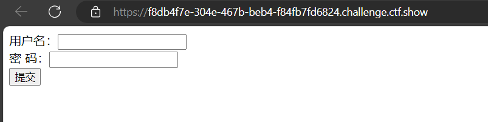
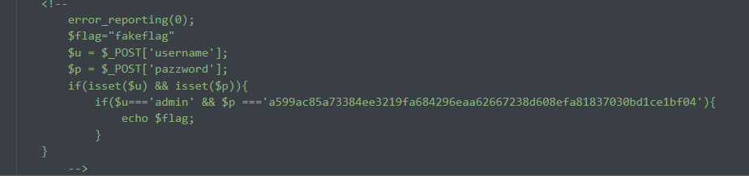
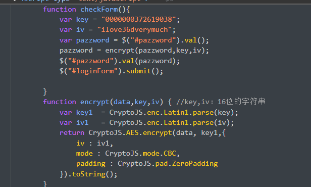
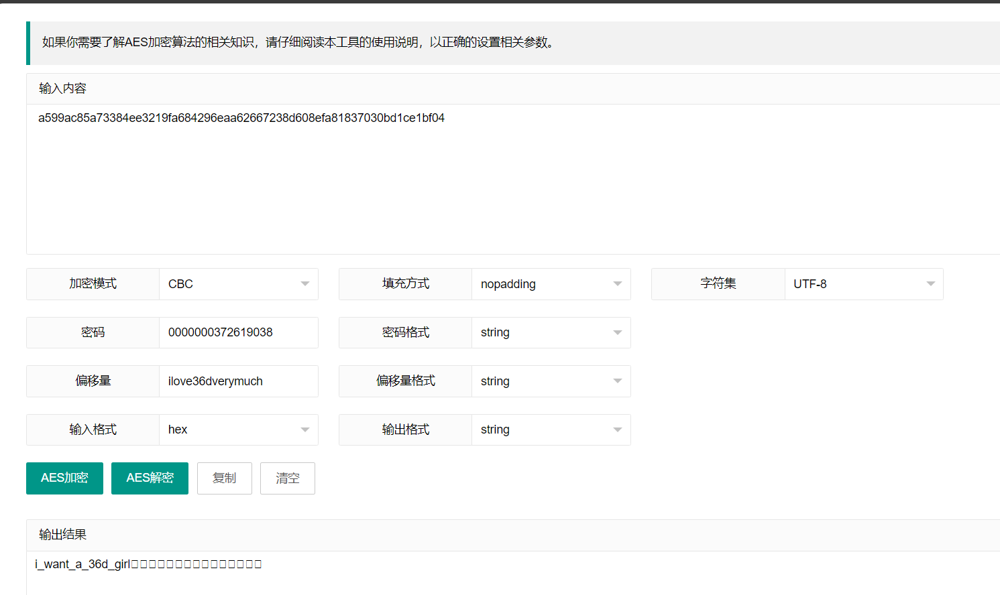

# **信息收集**

**知识点:**

1.学会从信息中找到重要的隐藏信息(例如查看页面源代码)

2.学会一些基本的网络协议

3.学会使用dirsearch查看页面目录信息

4.学会在burpsuit e中查看信息

## **web1:**

按f12查看源代码

## **web2:**

考点:js前台拦截

1.用ctrl+u可以查看源代码（在浏览器地址栏中输入 view-source: URL）

### **view-source知识点:**

view-source是一种协议，早期基本上每个浏览器都支持这个协议。后来Microsoft考虑安全性，对于WindowsXP pack2以及更高版本以后IE就不再支持此协议。但是这个方法在FireFox和Chrome浏览器都还可以使用。 

2.禁用JavaScript，再重新按f12

## **web3:**

用burpsuite抓包

## **web4:**

考点:网站robots协议

### **网站robots协议**

robots是搜索引擎爬虫协议，也就是你网站和爬虫的协议。

**简单的理解：**robots是告诉搜索引擎，你可以爬取收录我的什么页面，你不可以爬取和收录我的那些页面。robots很好的控制网站那些页面可以被爬取，那些页面不可以被爬取。

**主流的搜索引擎都会遵守robots协议**。并且robots协议是爬虫爬取网站第一个需要爬取的文件。爬虫爬取robots文件后，会读取上面的协议，并准守协议爬取网站，收录网站。

**robots文件是一个****纯文本文件****，也就是常见的.txt文件**。在这个文件中网站管理者可以声明该网站中不想被robots访问的部分，或者指定搜索引擎只收录指定的内容。因此，robots的优化会直接影响到搜索引擎对网站的收录情况。

**存放目录:robots文件必须要存放在网站的根目录下**。也就是 域名/robots.txt 是可以访问文件的。你们也可以尝试访问别人网站的robots文件。 输入域名/robots.txt 即可访问。

robots写法

**User0agent:\***

**Disallow: /?s\***

**Disallow: /wp-\***

user-agent这句代码表示那个搜索引擎准守协议。user-agent后面为搜索机器人名称，如果是“*”号，则泛指所有的搜索引擎机器人；案例中显示“User-agent: *” 表示所有搜索引擎准守，*号表示所有。

Disallow是禁止爬取的意思。Disallow后面是不允许访问文件目录（你可以理解为路径中包含改字符、都不会爬取）。案例中显示“Disallow: /?s*” 表示路径中带有“/?s”的路径都不能爬取。 *代表匹配所有。 这里需要主机。 Disallow空格一个，/必须为开头。

如果“Disallow: /” 因为所有路径都包含/ ，所以这表示禁止爬取网站所有内容。

**所以如果没有被禁止到的路径，默认为可以被爬取。**

**做法:在url中访问robots.txt文件**

## web5:

考点:PHPS文件泄露

### **PHPS文件**

**phps文件**就是php的源代码文件，通常用于提供给用户（访问者）直接通过Web浏览器查看php代码的内容。因为用户无法直接通过Web浏览器“看到”php文件的内容，所以需要用phps文件代替。用户访问phps文件就能看到对应的php文件的源码。

做法:phps文件泄露，phps存放着php源码,可通过尝试问/index.phps读取,或者尝试扫描工具（dirsearch）扫描读取

dirsearch -u URL -e*

命令 dirsearch -u url -e* 中的参数解释如下：

- -u url：指定要扫描的目标URL。这里的 url 需要被替换为实际的URL
- -e*：这是一个扩展选项，用于指定要扫描的文件扩展名。星号 * 是一个通配符，表示扫描所有可能的文件扩展名。这意味着 dirsearch 会尝试发现服务器上所有可能的文件和目录，而不仅仅是具有特定扩展名的文件。
- 在实际情况中，你会根据具体的目标站点和应用，有针对性地选择某些常见的文件扩展名进行扫描，比如 .php, .bak, .sql, .config 等，以减少扫描时间和噪声。

## **web6:**

考点:网站备份文件漏洞

### **网站备份文件漏洞:3**

- 网站备份压缩文件 漏洞成因:在网站的升级和维护过程中，通常需要对网站中的文件进行修改。此时就需要对网站整站或者其中某一页面进行备份。当备份文件或者修改过程中的缓存文件因为各种原因而被留在网站 web 目录下，而该目录又没有设置访问权限时，便有可能导致备份文件或者编辑器的缓存文件被下载，导致敏感信息泄露，给服务器的安全埋下隐患。
- **该漏洞的成因**主要有是管理员将备份文件放在到 web 服务器可以访问的目录下。
- 该漏洞往往会导致服务器整站源代码或者部分页面的源代码被下载，利用。源代码中所包含的各类敏感信息，如服务器数据库连接信息，服务器配置信息等会因此而泄露，造成巨大的损失。
- 被泄露的源代码还可能会被用于代码审计，进一步利用而对整个系统的安全埋下隐患。

做法:

1.尝试用扫描工具(dirsearch)扫描读取

dirsearch -u URL -e*

2.找到www.zip文件，在URL中访问这个文件下载下来，读取里面的flag(或者在URL里面访问这个文件也可以)

## **web7:**

考点:.git信息泄露

### **.git信息泄露**

- Git是目前世界上最先进的**分布式版本控制系统**（没有之一）
- 开发人员在开发时，常常会先把源码提交到远程托管网站（如github），最后再从远程托管网站把源码pull到服务器的web目录下，如果忘记把.git文件删除，就造成此漏洞。利用.git文件恢复网站的源码，而源码里可能会有数据库的信息。
- 当前大量开发人员使用git进行版本控制，对站点自动部署。 如果配置不当，可能会将.git文件夹直接部署到线上环境，这就引起了git泄露漏洞。
- .git源码泄露：采用git管理项目时，上传项目忘记删除.git文件，攻击者可通过该文件恢复源码历史版本，从而造成源码泄露

如何修复

1. 对.git目录的访问权限进行控制
2. 在每次pull到web目录下之后删除.git文件夹

参考:[Git与Git文件导致源码泄露_当前大量开发人员使用git进行版本控制,对站点自动部署。如果配置不当,可能会将.gi-CSDN博客](https://blog.csdn.net/qq_45521281/article/details/105767428)

做法:

1.访问url/.git/index.php，通过信息泄露发现flag

2.用dirsearch工具扫描目录，扫描到url.git这个目录，访问获取flag

## **web8:**

考点:svn信息泄露

### **svn信息泄露**

- SVN（subversion）是程序员常用的源代码版本管理软件。在使用 SVN 管理本地代码过程中，使用 svn checkout 功能来更新代码时，项目目录下会自动生成隐藏的.svn文件夹（Linux上用 ls 命令看不到，要用 ls -al 命令），其中包含重要的源代码信息。
- 造成SVN源代码漏洞的主要原因是管理员操作不规范，一些网站管理员在发布代码时，不愿意使用“导出”功能，而是直接复制代码文件夹到WEB服务器上，这就使得.svn隐藏文件夹被暴露于外网环境，黑客对此可进一步利用：
- 可以利用其中包含的用于版本信息追踪的 entries 文件（.svn/entries 文件），获取到服务器源码、svn服务器账号密码等信息；
- 可以利用 wc.db 数据库文件（.svn/wc.db 文件），获取到一些数据库信息；
- 更严重的问题在于，SVN产生的.svn目录下还包含了以.svn-base结尾的源代码文件副本（低版本SVN具体路径为text-base目录，高版本SVN为pristine目录），如果服务器没有对此类后缀做解析，则可以直接获得文件源代码。

漏洞修复

1、不要使用svn checkout和svn up更新服务器上的代码，使用svn export（导出）功能代替；

2、服务器软件（Nginx、apache、tomcat、IIS等）设置目录权限，禁止访问.svn目录；

3、删除 /.svn 文件夹，注意，不只svn，git 或者其他版本管理软件也存在类似的问题。

参考:[Web安全-SVN信息泄露漏洞分析_svn漏洞-CSDN博客](https://blog.csdn.net/weixin_39190897/article/details/109306693)

做法:

1.访问url/.svn，通过信息泄露发现flag

2.用dirsearch工具扫描目录，扫描到url.svn这个目录，访问获取flag

## **web9:**

考点:vim缓存导致信息泄露

### **vim缓存**

- vim缓存导致信息泄露:在使用vim时会创建临时缓存文件，关闭vim时缓存文件则会被删除，当vim异常退出后，因为未处理缓存文件，导致可以通过缓存文件恢复原始文件内容
- swp是vim编辑器的临时交换文件，即swap（交换分区）的简写。是一个隐藏文件。用来备份缓冲区的内容，如果未对文件进行修改，是不会产生swp文件的。
- 以 index.php 为例：

第一次产生的交换文件名为 .index.php.swn

再次意外退出后，将会产生名为 .index.php.swo 的交换文件

第三次产生的交换文件则为 .index.php.swn

做法:

根据题目提示，“在生产环境vim改下，不好，死机了”说明是vim异常导致缓存文件保存，从而导致信息泄露

所以直接访问.index.php.swp

## **web10**

考点:cookie请求头

### **cookie**

cookie一般用于在身份认证的过程中保存一些信息，用于服务器来验证身份

做法:

1.按f12然后在网络里查看cookie

2.用burpsuite抓包查看cookie请求头

不过flag用URL进行编码了，我们需要url解码才能拿到真正的flag

## **web11**

考点:查询域名解析

### **查询域名**

查询域名解析地址 基本格式：nslookup host [server]

查询全部 基本格式：nslookup -query=any host [server]

查询域名解析:nslookup -qt=类型 目标域名,IP地址

做法:

1.使用nslookup查看域名解析

nslookup -qt=txt flag.ctfshow.com

2.阿里云[阿里云网站运维检测平台 (aliyun.com)](https://boce.aliyun.com/detect/http)

flag{just_seesee}

## **web12**

### **网上的公开信息可能是管理员常用密码**

访问/robots.txt 或 使用dirsearch工具，发现子目录/admin

访问url/admin，需要登录，管理员账号猜测为admin，密码根据提示“有时候网站上的公开信息，就是管理员常用密码”，查看靶机主页，发现底部有Help Line Number : 372619038， 尝试输入密码为372619038，登陆成功，获取flag。

## **web13**

### **技术文档里面不要出现敏感信息，部署到生产环境后及时修改默认密码**

本题目的是让答题者了解到很多的文章有许多的文档，可以在这些文档中发现很多信息，例如文件中有许多的信息泄露的地方，本题在底部的document这个这个文本中记录到有地址和密码。

## **web14**

### **考点:editor**

- editor很可能指的是一个网页编辑器或者文件编辑器，它在这个上下文中被用作一个功能组件或者服务，允许用户上传、编辑或者管理文件
- 这个“editor”在默认配置下可能存在一个问题：如**果指定的上传目录不存在，它会尝试遍历服务器的根目录来查找文件**

1. 上传目录

：通常，Web应用程序会提供一个文件上传功能，允许用户将文件上传到服务器的特定目录中。这个目录被称为“上传目录”。

1. 目录不存在

：如果由于某种原因（如配置错误、路径错误或恶意输入），指定的上传目录在服务器上不存在，那么应用程序可能会尝试执行其他操作来处理这种情况。

1. 遍历服务器的根目录

：在这句话的上下文中，“遍历”意味着应用程序会尝试访问服务器上的其他目录，以查找或访问文件

做法:

1. 理解题目提示

- 题目中给出了一个小0day提示：“某编辑器最新版默认配置下，如果目录不存在，则会遍历服务器根目录。有时候源码里面就能不经意间泄露重要（editor）的信息，默认配置害死人。”
- 初步探索

- 打开题目链接，进行常规探索，如查看网页源代码（Ctrl+U）、抓包等。
- 在网页源代码中搜索与“editor”相关的内容，可能会发现图片文件被保存到“editor/upload”中。
- 利用小0day进行目录遍历

- 尝试访问“editor/upload”，如果响应结果为403（禁止访问），则表明没有直接的目录遍历漏洞。
- 使用工具（如dirsearch）或手动尝试访问其他与“editor”相关的路径，可能会发现可以访问的“/editor/”目录。
- 深入探索

- 进入“/editor/”目录后，可能会看到一个类似文件上传的界面或功能。
- 尝试点击图片空间或文件空间等选项，观察是否能够遍历服务器文件。
- 找到关键文件

- 由于“nothinghere”和当前的“/editor/”在同一级目录下，可以推测其中可能包含有用的文件。
- 在“nothinghere”文件夹中，找到名为“fl000g.txt”的关键文件，该文件即为题目所要求的flag。
- 读取flag

- 要访问到“fl000g.txt”文件，可以直接在域名下输入“/nothinghere/fl000g.txt”。
- 打开该文件后，即可看到题目所要求的flag内容。

## **web15**

### **知识点:社工**

公开的信息比如邮箱，可能造成信息泄露，产生严重后果

- url/admin是默认的网站系统后台地址

做法:

1.访问url/admin进入登录页面

2.用户名默认为admin，然后猜一下密码，发现qq邮箱和qq都不对，发现一个忘记密码可以点开，问题是所在地，我当时还纳闷，这我怎么知道，后来根据题目提示去看qq邮箱，搜了一下qq号发现真的有，填写后就可以获取flag了

## **web16**

### 知识点:测试探针

测试探针也是一种用于在计算机网络中监视、诊断和测试网络系统和服务的工具。它能够收集和分析网络数据，以识别性能瓶颈、安全漏洞和应用程序错误等问题。通过监测网络流量，测试探针可以帮助管理员识别网络中的延迟、丢包和带宽问题，而不必依赖网络用户的反馈或其他工具。

- php探针是用来探测空间、服务器运行状况和PHP信息用的，探针可以实时查看服务器硬盘资源、内存占用、网卡 流量、系统负载、服务器时间等信息。 url后缀名添加/tz.php 版本是雅黑PHP探针

使用方法

PHP探针的使用方法通常包括以下几个步骤：

1. 下载PHP探针文件到本地电脑。
2. 使用FTP软件将探针文件上传到网站的任意目录中。
3. 绑定域名后，通过类似“域名/探针文件名.php”的网址访问探针。

## **web17**

打开靶机，直接用dirsearch扫描目录，扫出了url/backup.sql

访问url/backup.sql，自动下载了backup.sql

打开backup.sql，即可获取flag

## **web18**

1.这是一个javascript 的游戏，游戏的目的就是让要赢，从js代码中可知，当score>120时，且game_over这个参数为false时，即可赢，于是打开开发者模式中的console，直接赋值score=130 game_over=false 然后，执行游戏 的run() 即可得到你赢了，去幺幺零点皮爱吃皮看看，就可以获得flag啦

## **web19**

1.打开题目是一个登录界面，我们先f12查看一下源代码看看有没有什么重要信息

2.看到源码中if语句，意思是当账号为admin，密码为后面那串字符串的时候，就可以输出flag

所以我们先试一下，发现是错的，应该是把密码加密了，我们去解密一下

a599ac85a73384ee3219fa684296eaa62667238d608efa8137030bd1ce1bf04

​    

AES加密，参数全在js代码 中， mode模式： CBC padding填充方式； ZeroPadding 密文输出编码： 十六进制string； 偏移量iv: ilove36dverymuch 密钥：0000000372619038 密文为： a599ac85a73384ee3219fa684296eaa62667238d608efa81837030bd1ce1bf04

## **web20**

**知识点:****mdb文件是早期asp+access构架的数据库文件，文件泄露相当于数据库被脱裤了。**

 根据提示‘mdb文件是早期asp+access构架的数据库文件 直接查看url路径添加/db/db.mdb 下载文件通过txt打开或者通过EasyAccess.exe打开搜索flag ’ 或用notepad++打开搜索flag即可得到答案

**注:记得三件套，源代码，使用dirsearch扫描目录，社工，善于采集信息，了解基础的信息泄露的原理，同时也要注意保护隐私信息**
